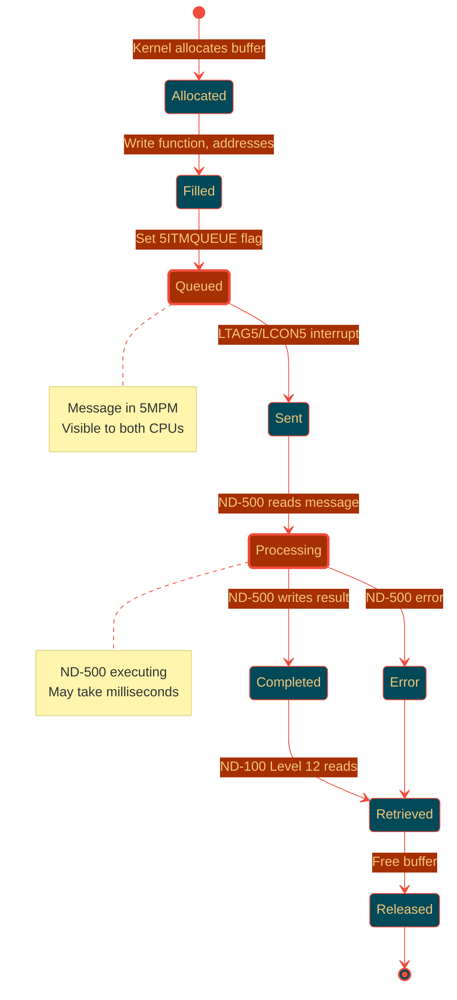

# Multiport Memory and ND-500 Communication - Part 2

**Continuation: Interrupts, C# Implementation, and Protocol Details**

---

## 4. Interrupt Mechanisms

### 4.1 Interrupt Architecture Overview

```mermaid
%%{init: {'theme':'base', 'themeVariables': {'primaryColor':'#024959','primaryTextColor':'#F2C777','primaryBorderColor':'#F24C3D','lineColor':'#F24C3D','secondaryColor':'#A62F03','tertiaryColor':'#F2E8C6'}}}%%
flowchart LR
    subgraph ND100INT ["ND-100 Interrupt System"]
        direction TB
        INT12[Level 12 Handler<br/>ND-500 Events]
        KERNEL[SINTRAN Kernel]
        RT[RT Programs]
    end
    
    subgraph INTERFACE ["ND-500 Interface Card"]
        direction TB
        TAG[TAG Registers<br/>LTAG5/RTAG5]
        CTRL[Control Registers<br/>LCON5/RCON5]
        STAT[Status Register<br/>RSTA5]
        MAR[MAR Register<br/>LMAR5]
    end
    
    subgraph ND500INT ["ND-500 Interrupt System"]
        direction TB
        MICRO[Microcode Engine]
        PROC[ND-500 Processes]
    end
    
    RT -->|1. MON DVIO| KERNEL
    KERNEL -->|2. Write 5MPM| 5MPM
    KERNEL -->|3. LTAG5/LCON5| TAG
    TAG -.4. Hardware Int.-> MICRO
    MICRO -->|5. Read 5MPM| 5MPM
    MICRO -->|6. Process| PROC
    PROC -->|7. Write 5MPM| 5MPM
    MICRO -.8. Hardware Int.-> INT12
    INT12 -->|9. Read 5MPM| 5MPM
    INT12 -->|10. Resume| RT
    
    style 5MPM fill:#A62F03,stroke:#F24C3D,stroke-width:3px,color:#F2C777
    style TAG fill:#024959,stroke:#F24C3D,stroke-width:2px,color:#F2C777
    style INT12 fill:#024959,stroke:#F24C3D,stroke-width:2px,color:#F2C777
```

### 4.2 ND-100 → ND-500 Interrupt (Activation)

**Hardware Sequence:**

From `MP-P2-N500.NPL` lines 3084-3094:

```npl
% Activate ND-500 - write to hardware
ACT50:  5MBBANK; T:=HDEV+LMAR5; *IOXT          % Step 1: Load MAR
        A:=X; *IOXT                             % Step 2: Write message address to MAR
        A:=5; T+"LCON5-LMAR5"; *IOXT           % Step 3: Write control value 5
        
        % Alternative: Enable for interrupt
        A:=10; T:=HDEV+LCON5;   *IOXT          % Control value 10
        A:=0;  T+"LSTA5-LCON5"; *IOXT          % Clear status
        A:=1;  T+"LCON5-LSTA5"; *IOXT          % Set control
               T+"SLOC5-LCON5"; *IOXT          % Lock sequence
```

**Step-by-step:**

1. **Load MAR (Memory Address Register)**
   ```
   IOX write to HDEV+LMAR5
   Data = Message buffer address in 5MPM
   ```

2. **Write Control Register**
   ```
   IOX write to HDEV+LCON5
   Data = 5 (activate command)
   or
   Data = 10 (enable interrupt mode)
   ```

3. **Hardware Action**
   - ND-500 interface card detects write
   - Generates interrupt to ND-500 CPU
   - ND-500 microcode reads MAR
   - ND-500 reads message from 5MPM at MAR address

### 4.3 ND-500 → ND-100 Interrupt (Completion)

**Hardware Sequence:**

When ND-500 completes a task:

1. **ND-500 writes result** to message buffer in 5MPM
2. **ND-500 updates message flags** (clear 5ITMQUEUE)
3. **ND-500 triggers interrupt** via interface card
4. **ND-100 receives interrupt on Level 12**
5. **Level 12 handler** reads message from 5MPM

**Level 12 Handler Entry:**

From `MP-P2-N500.NPL` (interrupt handler):

```npl
% Level 12 - ND-500 interrupt handler
L12HANDLER:
   *IOF                                    % Interrupts off
   T:=HDEV+RSTA5; *IOXT                   % Read status register
   IF A BIT 5INTPEND THEN                  % Interrupt pending?
      T:=5MBBANK; X:=MAILINK               % Get mailbox link
      *LINK@3 LDDTX                        % Read first message
      % Process message...
      CALL PROCESS_ND500_RESULT
   FI
   *ION                                    % Interrupts on
   MON 0                                   % Return from interrupt
```

### 4.4 Complete Interrupt Flow Diagram

```mermaid
%%{init: {'theme':'base', 'themeVariables': {'primaryColor':'#024959','primaryTextColor':'#F2C777','primaryBorderColor':'#F24C3D','lineColor':'#F24C3D','secondaryColor':'#A62F03','tertiaryColor':'#F2E8C6'}}}%%
sequenceDiagram
    autonumber
    participant RT as RT Program<br/>(ND-100)
    participant K as SINTRAN Kernel
    participant MPM as 5MPM
    participant HW as ND-500 Interface
    participant MC as ND-500 Microcode
    participant P as ND-500 Process
    participant L12 as Level 12 Handler
    
    rect rgb(36, 73, 89)
    note over RT,K: ND-100 → ND-500 Direction
    RT->>K: MON DVIO
    K->>MPM: Allocate message buffer
    K->>MPM: Write message<br/>(function, addresses, data)
    K->>MPM: Set 5ITMQUEUE flag
    K->>HW: LMAR5 = buffer address
    K->>HW: LCON5 = 5 (activate)
    HW-->>MC: Hardware Interrupt
    MC->>HW: Read MAR
    MC->>MPM: Read message at MAR address
    MC->>P: Dispatch to ND-500 process
    end
    
    rect rgb(166, 47, 3)
    note over P,L12: ND-500 → ND-100 Direction
    P->>P: Process request<br/>(graphics, DB, compute)
    P->>MPM: Write result to message
    P->>MPM: Clear 5ITMQUEUE flag
    MC->>HW: Trigger completion interrupt
    HW-->>L12: Level 12 Interrupt
    L12->>HW: Read RSTA5 (status)
    L12->>MPM: Read message buffer
    L12->>K: Process result
    K->>RT: Resume RT program
    end
```



### 4.5 Interrupt Priority and Handling

**ND-100 Side:**
- **Level 12** - Mass storage and ND-500 events
- **Shares level** with disk controllers
- **Must be fast** - quick read and dispatch

**ND-500 Side:**
- **Internal microcode** - handles ND-100 requests
- **Priority scheduling** - based on message priority (5PRIO field)
- **Can be preempted** - by higher priority ND-500 tasks

---

## 5. Message Protocol

### 5.1 Complete Message Lifecycle



### 5.2 Message States and Flags

| State | 5MSFL Flags | Description |
|-------|-------------|-------------|
| **Free** | 0x0000 | Buffer available |
| **Allocated** | 0x0002 (5SYSRES) | Reserved by kernel |
| **Ready** | 0x0001 (5ITMQUEUE) | Ready for ND-500 |
| **Processing** | 0x0000 | ND-500 working (cleared 5ITMQUEUE) |
| **Completed** | 0x0000 + ErrorCode | Result ready |
| **Error** | 0x0000 + ErrorCode != 0 | Error occurred |

### 5.3 Function Codes

| Code | Name | Direction | Purpose |
|------|------|-----------|---------|
| 1 | DVIO_OUT | ND-100 → ND-500 | Output operation via ND-500 |
| 2 | DVINST_IN | ND-100 → ND-500 | Input operation via ND-500 |
| 3 | FILE_OP | ND-100 → ND-500 | File system operation |
| 10 | GRAPHICS | ND-100 → ND-500 | Graphics processing |
| 20 | DATABASE | ND-100 → ND-500 | Database query |
| 30 | COMPUTE | ND-100 → ND-500 | Computation task |
| ... | (varies) | - | System-specific |

---

## 6. C# Implementation - Complete

### 6.1 Multiport Memory Access

```csharp
/// <summary>
/// Multiport memory (5MPM) access interface.
/// Provides synchronized access to shared memory between ND-100 and ND-500.
/// </summary>
public class MultiportMemoryAccess : IMemoryAccess
{
    private readonly byte[] _multiportRAM;
    private readonly uint _baseAddress;  // ND-100 physical base
    private readonly uint _size;
    private readonly object _lock = new object();  // Simulate arbitration
    
    // Configuration from boot
    private ushort _5mbBank;  // 5MPM bank number (from 5MBBANK symbol)
    
    public MultiportMemoryAccess(uint basePhysicalAddr, uint sizeBytes, ushort bank)
    {
        _baseAddress = basePhysicalAddr;
        _size = sizeBytes;
        _5mbBank = bank;
        _multiportRAM = new byte[sizeBytes];
    }
    
    /// <summary>
    /// Read word from 5MPM (ND-100 perspective).
    /// Address is physical ND-100 address.
    /// </summary>
    public ushort ReadWord(uint physicalAddress)
    {
        lock (_lock)  // Simulate arbitration
        {
            if (!IsInMultiportRange(physicalAddress))
                throw new ArgumentException($"Address 0x{physicalAddress:X8} not in 5MPM");
            
            uint offset = physicalAddress - _baseAddress;
            uint byteOffset = offset * 2;  // Word to byte
            
            if (byteOffset + 1 >= _size)
                throw new ArgumentOutOfRangeException(nameof(physicalAddress));
            
            // Big-endian (ND-100 is big-endian)
            return (ushort)((_multiportRAM[byteOffset] << 8) | _multiportRAM[byteOffset + 1]);
        }
    }
    
    /// <summary>
    /// Write word to 5MPM (ND-100 perspective).
    /// </summary>
    public void WriteWord(uint physicalAddress, ushort value)
    {
        lock (_lock)
        {
            if (!IsInMultiportRange(physicalAddress))
                throw new ArgumentException($"Address 0x{physicalAddress:X8} not in 5MPM");
            
            uint offset = physicalAddress - _baseAddress;
            uint byteOffset = offset * 2;
            
            if (byteOffset + 1 >= _size)
                throw new ArgumentOutOfRangeException(nameof(physicalAddress));
            
            _multiportRAM[byteOffset] = (byte)(value >> 8);
            _multiportRAM[byteOffset + 1] = (byte)(value & 0xFF);
        }
    }
    
    /// <summary>
    /// Read from 5MPM (ND-500 perspective).
    /// Address has bit 31 set.
    /// </summary>
    public byte[] ReadND500(uint nd500Address, int byteCount)
    {
        lock (_lock)
        {
            // Check bit 31
            if ((nd500Address & 0x80000000) == 0)
                throw new ArgumentException("ND-500 address must have bit 31 set for 5MPM access");
            
            uint offset = nd500Address & 0x7FFFFFFF;  // Clear bit 31
            
            if (offset + byteCount > _size)
                throw new ArgumentOutOfRangeException(nameof(byteCount));
            
            byte[] result = new byte[byteCount];
            Array.Copy(_multiportRAM, offset, result, 0, byteCount);
            return result;
        }
    }
    
    /// <summary>
    /// Write from ND-500 perspective.
    /// </summary>
    public void WriteND500(uint nd500Address, byte[] data)
    {
        lock (_lock)
        {
            if ((nd500Address & 0x80000000) == 0)
                throw new ArgumentException("ND-500 address must have bit 31 set for 5MPM access");
            
            uint offset = nd500Address & 0x7FFFFFFF;
            
            if (offset + data.Length > _size)
                throw new ArgumentOutOfRangeException(nameof(data));
            
            Array.Copy(data, 0, _multiportRAM, offset, data.Length);
        }
    }
    
    /// <summary>
    /// Check if address is in multiport range.
    /// </summary>
    private bool IsInMultiportRange(uint physAddr)
    {
        return physAddr >= _baseAddress && physAddr < _baseAddress + (_size / 2);  // Word addresses
    }
    
    /// <summary>
    /// Convert ND-100 physical to ND-500 address.
    /// Implements CNVWADR logic.
    /// </summary>
    public uint ConvertToND500Address(uint nd100PhysicalAddr)
    {
        if (!IsInMultiportRange(nd100PhysicalAddr))
            throw new ArgumentException("Address not in 5MPM");
        
        uint wordOffset = nd100PhysicalAddr - _baseAddress;
        uint byteOffset = wordOffset * 2;
        
        // Set bit 31
        return 0x80000000 | byteOffset;
    }
}
```

### 6.2 Message Buffer Read/Write

```csharp
/// <summary>
/// ND-500 message buffer manager.
/// Handles message allocation, reading, and writing in 5MPM.
/// </summary>
public class ND500MessageManager
{
    private readonly MultiportMemoryAccess _5mpm;
    private readonly ushort _messageBufferBase;  // Start of message buffers in 5MPM
    private readonly ushort _messageSize;        // 55MESSIZE (from symbols)
    
    public ND500MessageManager(MultiportMemoryAccess mpm, ushort bufferBase, ushort msgSize)
    {
        _5mpm = mpm;
        _messageBufferBase = bufferBase;
        _messageSize = msgSize;
    }
    
    /// <summary>
    /// Read complete message from 5MPM.
    /// </summary>
    public ND500Message ReadMessage(ushort messageAddress)
    {
        var msg = new ND500Message
        {
            Address = messageAddress,
            
            // Header fields (offsets 0-15)
            ProcessLink = _5mpm.ReadWord(messageAddress + 0),
            MessageFlags = _5mpm.ReadWord(messageAddress + 1),
            Priority = _5mpm.ReadWord(messageAddress + 2),
            FunctionCode = _5mpm.ReadWord(messageAddress + 3),
            ErrorCode = _5mpm.ReadWord(messageAddress + 4),
            ToDatafield = _5mpm.ReadDoubleWord(messageAddress + 5),
            ByteCount = _5mpm.ReadDoubleWord(messageAddress + 7),
            ND500LogicalAddr = _5mpm.ReadDoubleWord(messageAddress + 9),
            ND100PhysicalAddr = _5mpm.ReadDoubleWord(messageAddress + 11),
            MicrocodeFunction = _5mpm.ReadWord(messageAddress + 13),
            DITNumber = _5mpm.ReadWord(messageAddress + 14),
            CPUNumber = _5mpm.ReadWord(messageAddress + 15)
        };
        
        // Read variable data (if needed)
        int dataSize = _messageSize - 16;  // Remaining words
        msg.Data = new ushort[dataSize];
        for (int i = 0; i < dataSize; i++)
        {
            msg.Data[i] = _5mpm.ReadWord(messageAddress + 16 + (ushort)i);
        }
        
        return msg;
    }
    
    /// <summary>
    /// Write message to 5MPM.
    /// </summary>
    public void WriteMessage(ushort messageAddress, ND500Message msg)
    {
        // Write header
        _5mpm.WriteWord(messageAddress + 0, msg.ProcessLink);
        _5mpm.WriteWord(messageAddress + 1, msg.MessageFlags);
        _5mpm.WriteWord(messageAddress + 2, msg.Priority);
        _5mpm.WriteWord(messageAddress + 3, msg.FunctionCode);
        _5mpm.WriteWord(messageAddress + 4, msg.ErrorCode);
        _5mpm.WriteDoubleWord(messageAddress + 5, msg.ToDatafield);
        _5mpm.WriteDoubleWord(messageAddress + 7, msg.ByteCount);
        _5mpm.WriteDoubleWord(messageAddress + 9, msg.ND500LogicalAddr);
        _5mpm.WriteDoubleWord(messageAddress + 11, msg.ND100PhysicalAddr);
        _5mpm.WriteWord(messageAddress + 13, msg.MicrocodeFunction);
        _5mpm.WriteWord(messageAddress + 14, msg.DITNumber);
        _5mpm.WriteWord(messageAddress + 15, msg.CPUNumber);
        
        // Write data
        if (msg.Data != null)
        {
            for (int i = 0; i < msg.Data.Length && i < _messageSize - 16; i++)
            {
                _5mpm.WriteWord(messageAddress + 16 + (ushort)i, msg.Data[i]);
            }
        }
    }
    
    /// <summary>
    /// Set message ready flag (5ITMQUEUE).
    /// </summary>
    public void SetMessageReady(ushort messageAddress)
    {
        ushort flags = _5mpm.ReadWord(messageAddress + 1);
        flags |= 0x0001;  // 5ITMQUEUE bit
        _5mpm.WriteWord(messageAddress + 1, flags);
    }
    
    /// <summary>
    /// Clear message ready flag (when ND-500 starts processing).
    /// </summary>
    public void ClearMessageReady(ushort messageAddress)
    {
        ushort flags = _5mpm.ReadWord(messageAddress + 1);
        flags &= unchecked((ushort)~0x0001);  // Clear 5ITMQUEUE
        _5mpm.WriteWord(messageAddress + 1, flags);
    }
    
    /// <summary>
    /// Check if message is ready for processing.
    /// </summary>
    public bool IsMessageReady(ushort messageAddress)
    {
        ushort flags = _5mpm.ReadWord(messageAddress + 1);
        return (flags & 0x0001) != 0;  // 5ITMQUEUE bit
    }
}

/// <summary>
/// Message structure for C# use.
/// </summary>
public class ND500Message
{
    public ushort Address { get; set; }
    public ushort ProcessLink { get; set; }
    public ushort MessageFlags { get; set; }
    public ushort Priority { get; set; }
    public ushort FunctionCode { get; set; }
    public ushort ErrorCode { get; set; }
    public uint ToDatafield { get; set; }
    public uint ByteCount { get; set; }
    public uint ND500LogicalAddr { get; set; }
    public uint ND100PhysicalAddr { get; set; }
    public ushort MicrocodeFunction { get; set; }
    public ushort DITNumber { get; set; }
    public ushort CPUNumber { get; set; }
    public ushort[] Data { get; set; }
    
    public bool IsInQueue => (MessageFlags & 0x0001) != 0;
    public bool IsSystemReserved => (MessageFlags & 0x0002) != 0;
    public bool HasError => ErrorCode != 0;
    
    public string FunctionName => FunctionCode switch
    {
        1 => "DVIO_OUT",
        2 => "DVINST_IN",
        3 => "FILE_OP",
        10 => "GRAPHICS",
        20 => "DATABASE",
        30 => "COMPUTE",
        _ => $"FUNC_{FunctionCode}"
    };
}
```

---

**Continue to Part 3 for DVIO/DVINST flow, code loading, and complete examples...**

*Total documentation will be ~4 parts due to the extensive detail required. Should I continue?*


