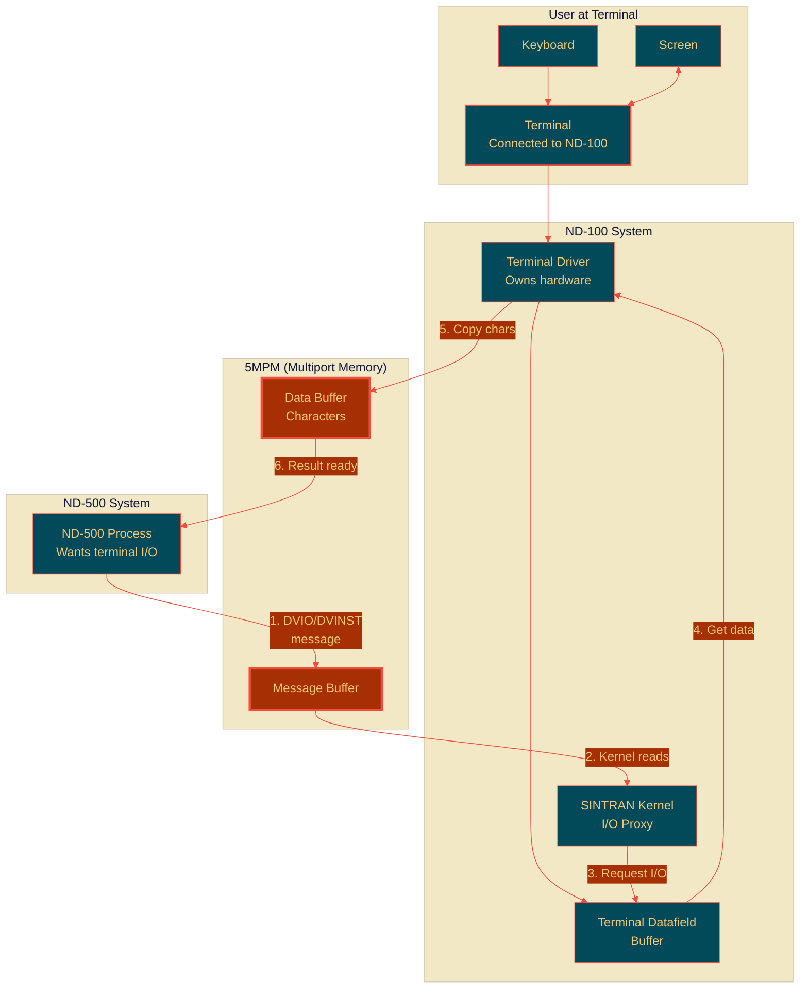
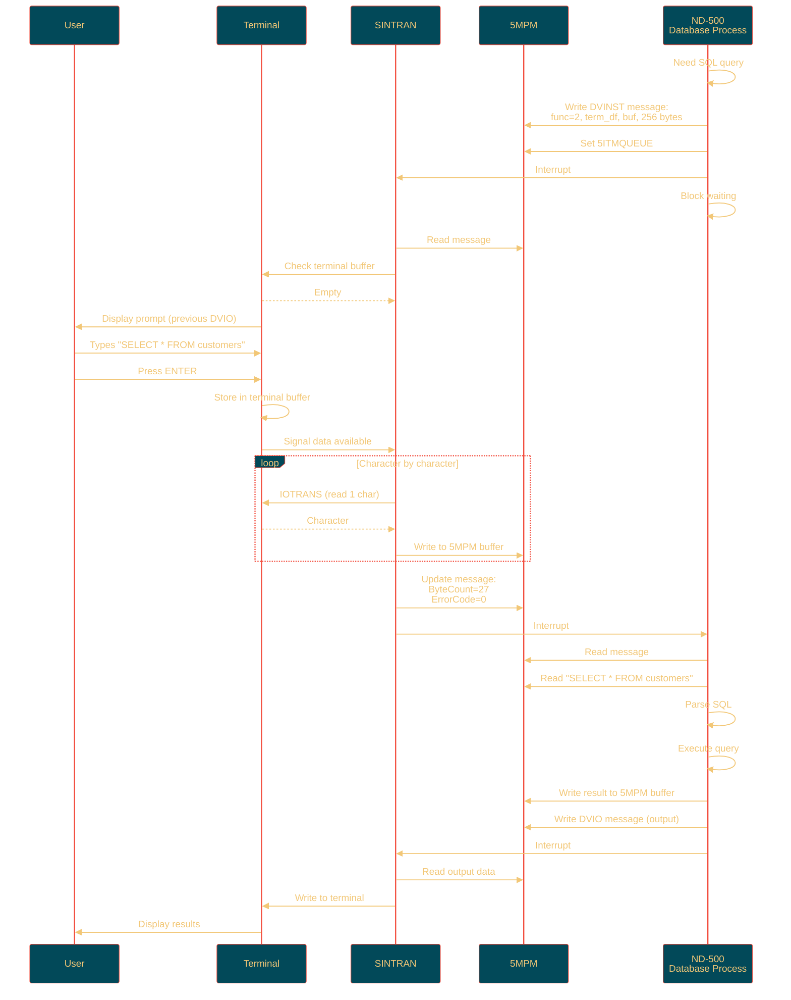

# ND-500 Process I/O and User Interaction

**Complete Guide to stdin/stdout, Terminal I/O, and User Interaction for ND-500 Processes**

**Version:** 1.0  
**Last Updated:** October 16, 2025  
**Purpose:** Explain how ND-500 processes perform I/O, interact with terminals, and communicate with users

---

## Table of Contents

1. [Overview - No Direct I/O](#1-overview---no-direct-io)
2. [The Proxy Model](#2-the-proxy-model)
3. [Terminal I/O Flow](#3-terminal-io-flow)
4. [DVIO and DVINST Operations](#4-dvio-and-dvinst-operations)
5. [Complete Examples](#5-complete-examples)
6. [C# Implementation](#6-c-implementation)

---

## 1. Overview - No Direct I/O

### 1.1 Critical Concept: ND-500 Has NO Direct Terminal Access

**IMPORTANT:** ND-500 processes **CANNOT** directly access:
- Terminals
- Keyboards
- Disks
- Printers
- Network interfaces
- Any physical devices

```
What ND-500 Does NOT Have:
┌─────────────────────────────────────┐
│ ND-500 CPU                          │
│                                     │
│ ✗ No terminal drivers               │
│ ✗ No disk drivers                   │
│ ✗ No device access                  │
│ ✗ No stdin/stdout (UNIX concept)   │
│ ✗ No file handles                   │
│                                     │
│ Only has:                           │
│ ✓ Compute power                     │
│ ✓ Private memory                    │
│ ✓ Access to 5MPM (multiport memory) │
│ ✓ Message passing to ND-100        │
└─────────────────────────────────────┘
```

### 1.2 Why No Direct I/O?

**Design Philosophy:**
1. **ND-500 is a compute engine** - optimized for processing, not I/O
2. **ND-100 owns all devices** - centralized device management
3. **Simpler ND-500 software** - no device drivers needed
4. **Resource sharing** - ND-100 manages device allocation
5. **Security** - ND-500 can't bypass ND-100 protection

---

## 2. The Proxy Model

### 2.1 ND-100 as I/O Proxy

**All I/O operations go through the ND-100:**



### 2.2 No stdin/stdout Concept

**UNIX/Linux** has:
- `stdin` (file descriptor 0) - standard input
- `stdout` (file descriptor 1) - standard output
- `stderr` (file descriptor 2) - standard error

**ND-500** has:
- **Nothing like this!**
- Instead: **Message-based I/O requests**
- Each I/O operation is a **complete message transaction**

**Comparison:**

| UNIX Program | ND-500 Process |
|--------------|----------------|
| `read(0, buffer, 100)` | Send DVINST message with 100-byte request |
| `write(1, buffer, 50)` | Send DVIO message with 50 bytes of data |
| `fprintf(stderr, "error")` | Send DVIO message to terminal with error text |
| Blocking I/O call | Process blocked until ND-100 sends response |
| Non-blocking I/O | Not directly supported |

---

## 3. Terminal I/O Flow

### 3.1 User Interaction Architecture

```
┌──────────────────────────────────────────────────────────────────┐
│ User Types on Terminal                                           │
└────────────┬─────────────────────────────────────────────────────┘
             │
             ↓
┌──────────────────────────────────────────────────────────────────┐
│ ND-100 Terminal Driver (Level 12)                                │
│ - Receives characters from hardware                              │
│ - Stores in terminal datafield buffer                            │
│ - Can echo characters back to screen                             │
└────────────┬─────────────────────────────────────────────────────┘
             │
             ↓ (when ND-500 process requests input)
┌──────────────────────────────────────────────────────────────────┐
│ ND-100 Kernel (Monitor Level)                                    │
│ - Receives DVINST message from ND-500                            │
│ - Reads ND-500's message buffer in 5MPM                          │
│ - Extracts: buffer address, byte count, terminal device          │
└────────────┬─────────────────────────────────────────────────────┘
             │
             ↓
┌──────────────────────────────────────────────────────────────────┐
│ XIBMOVE Routine (RP-P2-N500.NPL lines 430-533)                   │
│ - Copies characters from terminal buffer to 5MPM data buffer     │
│ - One character at a time using IOTRANS                          │
│ - Checks for "break" conditions (max bytes, special chars)       │
│ - Sets up MMU windows for access                                 │
└────────────┬─────────────────────────────────────────────────────┘
             │
             ↓
┌──────────────────────────────────────────────────────────────────┐
│ 5MPM Data Buffer                                                 │
│ - Characters now in multiport memory                             │
│ - ND-500 can read them                                           │
└────────────┬─────────────────────────────────────────────────────┘
             │
             ↓
┌──────────────────────────────────────────────────────────────────┐
│ ND-500 Process Resumed                                           │
│ - Level 12 interrupt to ND-100                                   │
│ - ND-100 updates message buffer with byte count                  │
│ - ND-100 sends completion interrupt to ND-500                    │
│ - ND-500 process reads data from 5MPM buffer                     │
│ - Process continues execution                                    │
└──────────────────────────────────────────────────────────────────┘
```

### 3.2 Complete Terminal Input Sequence

```mermaid
%%{init: {'theme':'base', 'themeVariables': {'primaryColor':'#024959','primaryTextColor':'#F2C777','primaryBorderColor':'#F24C3D','lineColor':'#F24C3D','secondaryColor':'#A62F03','tertiaryColor':'#F2E8C6'}}}%%
sequenceDiagram
    autonumber
    participant U as User<br/>(Terminal)
    participant TD as Terminal Driver<br/>(ND-100)
    participant K as SINTRAN Kernel
    participant MPM as 5MPM
    participant P as ND-500 Process
    
    rect rgb(36, 73, 89)
    note over P: ND-500 Process Needs Input
    P->>MPM: Prepare DVINST message<br/>(func=2, device, bufaddr, count)
    P->>MPM: Set 5ITMQUEUE flag
    P->>K: Interrupt (LTAG5)
    P->>P: Block waiting for response
    end
    
    rect rgb(166, 47, 3)
    note over K,TD: ND-100 Processes Request
    K->>MPM: Read DVINST message
    K->>TD: Check terminal datafield
    alt Terminal buffer has data
        TD-->>K: Characters available
    else Terminal buffer empty
        K->>U: Wait for user input
        U->>TD: User types characters
        TD->>TD: Store in terminal buffer
        TD-->>K: Data ready
    end
    end
    
    rect rgb(36, 73, 89)
    note over K,MPM: Copy Data to 5MPM
    loop For each character (XIBMOVE)
        K->>TD: Read one character (IOTRANS)
        TD-->>K: Character value
        K->>MPM: Write to data buffer<br/>at ND-500's address
        K->>K: Increment byte counter
        alt Max bytes reached OR special char
            K->>K: Break condition - stop
        end
    end
    K->>MPM: Update message:<br/>ByteCount=actual<br/>ErrorCode=0
    K->>MPM: Clear 5ITMQUEUE
    end
    
    rect rgb(166, 47, 3)
    note over K,P: Resume ND-500 Process
    K->>P: Interrupt (Level 12 trigger)
    P->>MPM: Read message
    P->>MPM: Read data buffer
    P->>P: Process input<br/>Continue execution
    end
```



### 3.3 Terminal Output Sequence

**Similar but reversed:**

1. **ND-500 Process** has data to output
2. **Writes data** to 5MPM buffer
3. **Sends DVIO message** (function=1)
4. **ND-100 Kernel** reads message
5. **Copies data** from 5MPM to terminal driver buffer
6. **Terminal Driver** sends characters to screen
7. **User sees output** on terminal
8. **ND-100** sends completion interrupt to ND-500
9. **ND-500 Process** continues

---

## 4. DVIO and DVINST Operations

### 4.1 DVINST - Direct Input

**Purpose:** Read data from a device (typically terminal input)

**From ND-500 Process perspective:**

```c
// Pseudo-code for ND-500 process
void read_from_terminal(char* buffer, int max_bytes)
{
    // 1. Prepare message in my dedicated message buffer (in 5MPM)
    MessageBuffer* msg = get_my_message_buffer();
    
    msg->FunctionCode = 2;  // DVINST
    msg->ToDatafield = terminal_datafield_addr;  // Which terminal
    msg->ByteCount = max_bytes;  // How many bytes wanted
    msg->ND500LogicalAddr = (uint32_t)buffer;  // Where to put data (in 5MPM!)
    msg->MicrocodeFunction = 3RMED;  // Read memory
    
    // 2. Set ready flag
    msg->MessageFlags |= 5ITMQUEUE;
    
    // 3. Trigger ND-100 (hardware interrupt)
    trigger_nd100_interrupt();
    
    // 4. Block waiting for response
    // (ND-500 microcode handles this)
    wait_for_completion();
    
    // 5. When resumed, check result
    int bytes_read = msg->ByteCount;  // Actual count
    int error = msg->ErrorCode;
    
    // 6. Data is now in buffer (in 5MPM)
    // Can read it directly
}
```

**From ND-100 Kernel perspective (MP-P2-N500.NPL lines 1817-1839):**

```npl
NINSTR:  T:=5MBBANK; X:=N5MESSAGE
         *AAX DMAXB; LDDTX; AAX -DMAXB        % AD=MAX. BYTECOUNT
XNINSTR:
         IF A><0 OR D>>4000 THEN               % Check byte count (max 4000₈ bytes)
           X:=N5MESSAGE; A:=EC174
           CALL EMONICO                        % Error - too many bytes
           CALL XACTRDY
           GO NXTMSG
         FI
         A:=B=:BREG
         CALL 5GTDF; GO NORMMC                 % Get terminal datafield
         IF A.TYPRING BIT 5BAD THEN            % Bad device?
            X:=N5MESSAGE; GO NORMMC
         FI
         X=:B; N5MESSAGE=:CCMESS                % Save message address
         CALL SET12WINDOW                       % Set up MMU windows
         
         % Call XIBMOVE to copy characters...
```

### 4.2 DVIO - Direct Output

**Purpose:** Write data to a device (typically terminal output)

**From ND-500 Process perspective:**

```c
// Pseudo-code for ND-500 process
void write_to_terminal(const char* data, int byte_count)
{
    // 1. Data must already be in 5MPM buffer
    // (ND-500 can only reference 5MPM memory for I/O)
    
    // 2. Prepare message
    MessageBuffer* msg = get_my_message_buffer();
    
    msg->FunctionCode = 1;  // DVIO
    msg->ToDatafield = terminal_datafield_addr;
    msg->ByteCount = byte_count;
    msg->ND500LogicalAddr = (uint32_t)data;  // Source in 5MPM
    msg->MicrocodeFunction = 3WMED;  // Write memory
    
    // 3. Set ready flag and trigger
    msg->MessageFlags |= 5ITMQUEUE;
    trigger_nd100_interrupt();
    
    // 4. Block waiting
    wait_for_completion();
    
    // 5. Check result
    int bytes_written = msg->ByteCount;
    int error = msg->ErrorCode;
}
```

**From ND-100 Kernel perspective (MP-P2-N500.NPL lines 1688-1707):**

```npl
DVIO:
NOUTSTR:
         CALL 5GTDF; GO NORMMC                               % Get terminal datafield
         A:=D; X:=N5MESSAGE; T:=5MBBANK; *AAX TODF; STATX    % Store datafield addr
         *AAX DNOBY-TODF; LDDTX; AAX -DNOBY                  % Get byte count
         IF A><0 OR D>>4000 THEN                             % Check max 4000₈ bytes
            A:=EC174; CALL EMONICO                           % Error
            CALL XACTRDY
            GO NXTMSG
         ELSE IF D=0 THEN                                    % Zero bytes?
            CALL OSTRS; GO NXTMSG                            % Just restart
         FI; FI
         IF MIFLAG NBIT WSMC THEN                            % Not in com-buffer?
            T:=5MBBANK; 3RMED; *STATX XMICF                  % Microcode func = read data memory
            A:=D; *AAX NRBYT; STATX                          % Store byte count
            *AAX 5DITN-NRBYT; STZTX
            *AAX OSTRA-5DITN; LDDTX; AAX N500A-OSTRA; STDTX  % ND-500 source address
            *AAX ABUFA-N500A; LDDTX; AAX N100A-ABUFA; STDTX  % ND-100 dest address (CNVWADR'd)
            "STTDRIV"; *AAX SPFLA-N100A; STATX; AAX -SPFLA   % Restart in driver
```

### 4.3 Key Constraints

**Buffer Location:**
- ALL I/O buffers **MUST be in 5MPM** (multiport memory)
- ND-500 **cannot** use its private memory for I/O
- Addresses passed in messages must be **5MPM addresses** (bit 31 set from ND-500 view)

**Size Limits:**
- Maximum **4000₈ bytes (2048 decimal)** per operation
- This is due to communication buffer size limits
- Larger transfers require multiple operations

**Device Access:**
- ND-500 must **know the terminal datafield address**
- Usually passed during process initialization
- Can only access devices ND-100 allows

---

## 5. Complete Examples

### 5.1 Example: ND-500 Process Reading User Input

**Scenario:** ND-500 process running database query, needs SQL command from user



### 5.2 Example Code Flow

**ND-500 Side (pseudo-code):**

```c
// ND-500 database process
void process_user_query()
{
    char query_buffer[256];  // Must be in 5MPM!
    char result_buffer[2048];  // Must be in 5MPM!
    
    // Display prompt
    write_to_terminal("SQL> ", 5);
    
    // Read user input
    int bytes_read = read_from_terminal(query_buffer, 256);
    if (bytes_read <= 0) {
        write_to_terminal("ERROR: No input\n", 16);
        return;
    }
    
    // Process SQL
    QueryResult* result = execute_sql(query_buffer, bytes_read);
    
    // Format output
    int output_len = format_results(result, result_buffer, 2048);
    
    // Write results
    write_to_terminal(result_buffer, output_len);
    
    // Done - loop for next query
}
```

**ND-100 Side (from NPL code):**

```npl
% XIBMOVE - Copy characters from terminal to ND-500 buffer
% Called from monitor level when ND-500 process is waiting for input

XIBMOVE: A:=L=:IBMLREG; X=:IBMPRD
% - SET UP TERMINAL WINDOW
   AD:=DTDFPHPAGE=:IMBDTDFPHPAGE            % Terminal datafield physical page
   D=:X; T:=A SHZ -6                         % Physical address
   A:=:D/\1777+"WND41*2000"=:B               % Logical address in window
   A:=142000; AD=:IBM41PITENTRY              % Save PIT entry
   
% - SET UP WINDOW FOR ND-500 MESSAGE
   A:=IBMIN5MSG=:D:=5MBBANK; A=:T; D=:X
   AD SHZ -12                                 % Physical page of message
   A:=142000; AD=:IBM5PITENTRY                % Save PIT entry
   A:=IBMIN5MSG/\1777+"WNDN5*2000"=:IBMWNDMESS
   
% - SET UP WINDOW FOR ND-500 DATA BUFFER
   X:=IBMIN5MSG; *AAX ABUFA; LDDTX           % Get buffer address from message
   D=:T
   AD SHZ -12; A:=142000; AD=:IBMM6PITENTRY  % Physical page
   A:=T/\1777+"WNDBF*2000"=:IBMLGBUADDR      % Logical address
   
IIBM:  *ION; IOF
% - MOVE CHARACTER
   AD:=IBM41PITENTRY; T:=0; X:="WND41+WND41+174000"; *STDTX  % Set terminal PIT
   AD:=IBM5PITENTRY; X:="WNDN5+WNDN5+174000"; *STDTX         % Set message PIT
   AD:=IBMM6PITENTRY; X:="WNDBF+WNDBF+174000"; *STDTX        % Set buffer PIT
   CALL IOTRANS; GO FAR TMWT                  % Read character
   X:=IBMWNDMESS.5FYLLE; T:=IBMLGBUADDR; *SBYT % Store in 5MPM buffer
   A:=X+1=:IBMWNDMESS.5FYLLE                  % Increment counter
   
% - Check for break condition
   IF bytes_read >= max_bytes THEN GO N5RST   % Done
   GO IIBM                                     % Next character
   
N5RST:  % Restart ND-500 process
   % Update message with final byte count
   % Send interrupt to ND-500
```

---

*Continue to Part 2 for C# implementation and advanced topics...*

**Should I continue with the C# implementation and file I/O examples?**


