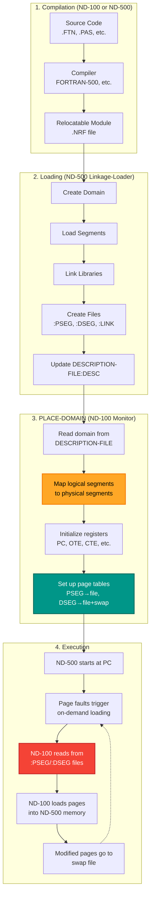
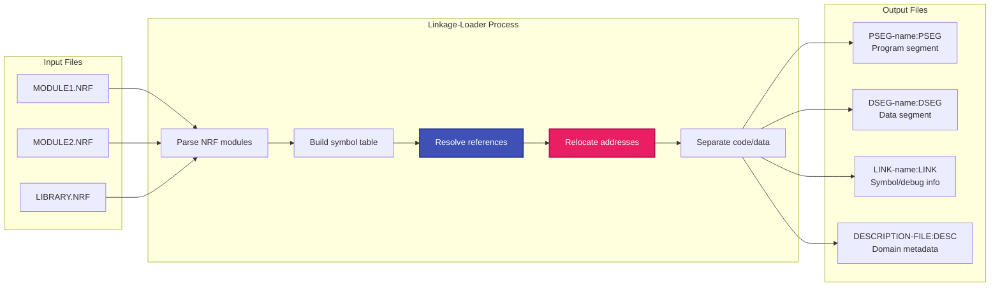
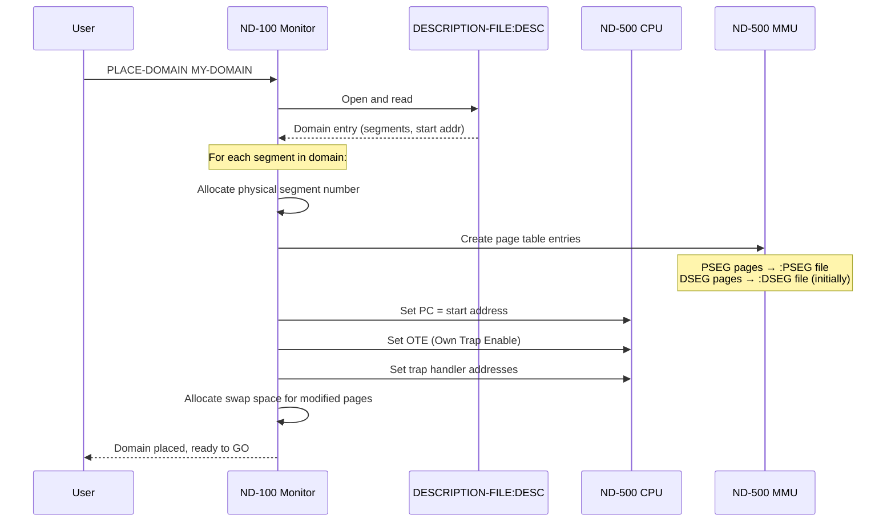
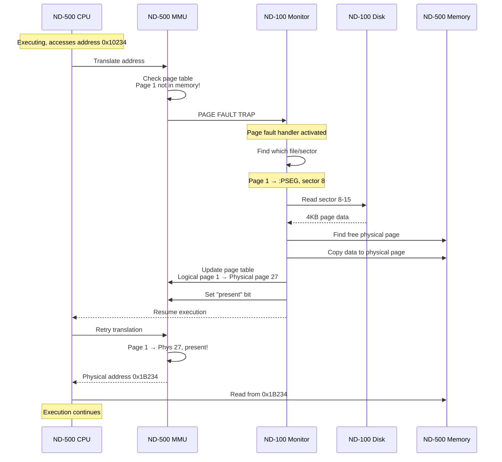
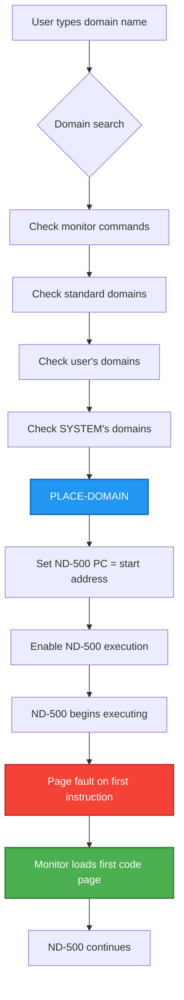

# ND-500 Code Loading - Complete Process

**Comprehensive Guide to Loading and Executing Code on ND-500**

**Version:** 1.0  
**Last Updated:** October 17, 2025  
**Source:** ND-60.136.04A ND-500 Loader/Monitor Manual  
**Purpose:** Document EXACTLY how code is compiled, loaded, placed in memory, and executed on ND-500

---

## Table of Contents

1. [Overview](#1-overview)
2. [Compilation Phase](#2-compilation-phase)
3. [Loading Phase - Linkage-Loader](#3-loading-phase---linkage-loader)
4. [Domain Structure](#4-domain-structure)
5. [PLACE-DOMAIN - Making Code Ready](#5-place-domain---making-code-ready)
6. [Memory Mapping and Page Faults](#6-memory-mapping-and-page-faults)
7. [Execution Start - RECOVER-DOMAIN/GO](#7-execution-start---recover-domaingo)
8. [Memory Fixing Strategies](#8-memory-fixing-strategies)
9. [Complete C# Implementation](#9-complete-c-implementation)

---

## 1. Overview



---

## 2. Compilation Phase

### 2.1 Source to Relocatable Module

**User Command:**
```
@ND-500 FORTRAN
FTN: COMPILE TESTPROG,"TESTPROG:LIST","TESTPROG"
```

**What Happens:**

1. **Compiler Selection:**
   - User specifies `@ND-500 <COMPILER>`
   - Monitor activates ND-500 and loads compiler domain
   - Compiler runs as an ND-500 process

2. **Compilation:**
   - Source code (.FTN, .PAS, .PLN, .COB) read from ND-100 file system
   - Compiler generates machine code for ND-500 CPU
   - Output is in **NRF** (ND Relocatable Format)
   - Default output file type: `:NRF`

3. **NRF File Contents:**
   - Machine instructions (not yet at fixed addresses)
   - Data definitions (not yet at fixed locations)
   - Symbol table (entry points, external references)
   - Relocation information (how to adjust addresses when loaded)

**Key Point:** NRF files are **relocatable** - they can be loaded at any memory address. The loader will fix up all addresses.

---

## 3. Loading Phase - Linkage-Loader

### 3.1 Creating a Domain

**User Commands:**
```
@ND-500 LINKAGE-LOADER
NLL: SET-DOMAIN "MY-DOMAIN"
NLL: LOAD-SEGMENT TESTPROG
NLL: EXIT
```

### 3.2 What the Loader Does



### 3.3 Loader Operations in Detail

**Step 1: Symbol Resolution**
```
When loader encounters:
  CALL SUBROUTINE_X
  
If SUBROUTINE_X not yet defined:
  1. Add to "undefined references" table
  2. Leave space in code for address fixup
  
When SUBROUTINE_X definition found:
  1. Calculate actual address
  2. Go back and patch all references
  3. Mark symbol as "defined"
```

**Step 2: Address Relocation**
```
NRF says: "Instruction at offset 100 references data at offset 50"
Loader decides: "I'll put code at 0x10000, data at 0x20000"
Loader patches: "Instruction at 0x10100 references data at 0x20050"
```

**Step 3: File Generation**

| File Type | Content | Purpose |
|-----------|---------|---------|
| `:PSEG` | Executable machine code for ND-500 | Program instructions, read-only |
| `:DSEG` | Initial data values | Data segment, modifiable |
| `:LINK` | Symbol names and addresses, debug info | Used by debugger and for linking |
| `:DESC` | Domain entry with segment list, start address, etc. | Domain metadata |

---

## 4. Domain Structure

### 4.1 What is a Domain?

A **domain** is the ND-500 equivalent of a "program" or "process". It consists of:

1. **Logical Addressing Space:**
   - Up to 32 segments (numbered 0-31)
   - Each segment can be up to 64KB
   - Segments are independently addressable

2. **Domain Entry in DESCRIPTION-FILE:**
   ```
   Domain Name: MY-DOMAIN
   Start Address: segment 1, offset 0x1234
   Segment Table:
     Seg 0: not used
     Seg 1: PSEG-MAIN:PSEG, DSEG-MAIN:DSEG (main program)
     Seg 2: PSEG-SUBR:PSEG, DSEG-SUBR:DSEG (subroutines)
     Seg 3-31: not used
   Trap handlers: ...
   ```

### 4.2 Segment Attributes

| Attribute | Code | Meaning |
|-----------|------|---------|
| P | Program | Contains executable code, read-only |
| D | Data | Contains data, read-write |
| Shared | S | Can be used by multiple domains simultaneously |
| Public | P | Other domains can link to this segment |

### 4.3 Multi-Segment Domains

**Why multiple segments?**
- Share common subroutines between programs
- Save file space and memory
- Example: Fortran runtime library as segment 30

**Loading multi-segment domain:**
```
NLL: SET-DOMAIN "TWO-SEGMENTS"
NLL: OPEN-SEGMENT "SUBROUTINES" P          % Public, shareable
NLL: LOAD-SEGMENT SUBR-FILE
NLL: CLOSE-SEGMENT                         % This becomes segment 1
NLL: SET-SEGMENT-NUMBER 2                  % Next segment is #2
NLL: LOAD-SEGMENT MAINPROG
NLL: LINK-SEGMENT SUBROUTINES              % Link seg 2 to seg 1
NLL: EXIT
```

---

## 5. PLACE-DOMAIN - Making Code Ready

### 5.1 The PLACE-DOMAIN Command

**From ND-60.136.04A, Page 106-107:**

> **PLACE-DOMAIN** `<domain name>`
>
> An executable ND-500 domain is made ready for execution. The specified `<domain name>` is searched for on the description file of the current user...
>
> If the specified domain is found, some initialization is performed:
> 1. The start address is moved into the program counter register.
> 2. The child trap enable register of ND-100, the own trap enable register of the domain and the trap handler address register are initialized.
> 3. **Each logical segment is mapped on a physical segment.**
>
> **The program segment will normally map directly onto the :PSEG file.** Several users may be using the same physical segment, although the segments may be logically different. It is assumed that the program segments are **read only**.
>
> **The data segment is initially mapped on the :DSEG file. Upon page fault the required page is read from the file.** When modifications are made, the affected pages are not written back to the :DSEG file but **to a scratch area on a swap file**. This copy is used for later references.

### 5.2 Step-by-Step PLACE-DOMAIN Process



### 5.3 Memory Mapping Details

**Initial State After PLACE-DOMAIN:**

```
Logical Segment 1 (Program):
  Page 0:  →  :PSEG file, sector 0-7
  Page 1:  →  :PSEG file, sector 8-15
  Page 2:  →  :PSEG file, sector 16-23
  ...
  All pages NOT loaded yet, just mapped

Logical Segment 1 (Data):
  Page 0:  →  :DSEG file, sector 0-7
  Page 1:  →  :DSEG file, sector 8-15
  ...
  All pages NOT loaded yet, just mapped
  
Physical Memory:
  [Empty - no pages loaded yet]
  
Swap File:
  [Allocated space for modified data pages]
```

**Key Point:** At PLACE-DOMAIN time, **NO CODE IS ACTUALLY LOADED INTO ND-500 MEMORY**. Only the page tables are set up to know where to find the code when needed.

---

## 6. Memory Mapping and Page Faults

### 6.1 Demand Paging - How It Works



### 6.2 Modified Pages and Swap File

**When ND-500 writes to data segment:**

1. Page fault occurs (if page not loaded)
2. Monitor loads page from :DSEG file
3. ND-500 writes to page
4. MMU sets "modified" (WIP) bit
5. **When page needs to be swapped out:**
   - Monitor writes page to swap file (NOT back to :DSEG!)
   - Updates page table to point to swap file sector
6. **Next time page is needed:**
   - Monitor reads from swap file
   - Modified data is preserved

**Why not write back to :DSEG?**
- :DSEG is the "clean" initial state
- Multiple users can run same domain simultaneously
- Each user gets their own modified pages in swap space
- :DSEG remains unchanged for next execution

### 6.3 Page Table Structure

```
ND-500 Page Table Entry (simplified):

┌───────┬──────┬──────┬──────┬────────────────┐
│Present│ WIP  │ PGU  │ FPM  │Physical Page # │
│  (1)  │ (1)  │ (1)  │ (1)  │    (12 bits)   │
└───────┴──────┴──────┴──────┴────────────────┘
  Bit 15  Bit 14 Bit 13 Bit 12  Bits 11-0

Present: 1 = page is in memory, 0 = page fault needed
WIP: Write In Progress / Modified
PGU: Page Used (for swap decisions)
FPM: Fixed Page Mark (cannot be swapped)
```

---

## 7. Execution Start - RECOVER-DOMAIN/GO

### 7.1 RECOVER-DOMAIN Command

**From ND-60.136.04A, Page 107:**

> **RECOVER-DOMAIN** `<domain name>`
>
> The PLACE-DOMAIN and RUN commands are performed as one by using the command RECOVER-DOMAIN. The words RECOVER-DOMAIN can be left out. The domain name itself becomes a pseudo command.

**User Can Simply Type:**
```
@ND-500 MY-DOMAIN
```

**Or:**
```
@ND-500
N500: MY-DOMAIN
```

### 7.2 What Happens at Execution Start



### 7.3 First Instructions Executed

**Typical ND-500 program start:**
```assembly
; Entry point (from loader)
START:
    STWS    R15, #stack_top    ; Initialize stack pointer
    LDWS    R0, #0             ; Clear registers
    CALL    #INIT              ; Call initialization
    CALL    #MAIN              ; Call main program
    MON     0                  ; Exit (monitor call 0)

; Each of these instructions might cause page faults:
; - First instruction: STWS → Page fault, load code page
; - Stack access: → Page fault, load stack data page
; - CALL INIT: → Page fault if INIT in different page
; - etc.
```

---

## 8. Memory Fixing Strategies

### 8.1 Why Fix Memory?

**Problem:** Demand paging causes unpredictable delays
- OK for interactive programs
- **NOT OK for:**
  - Real-time programs
  - DMA I/O operations
  - Time-critical tasks

**Solution:** "Fix" pages in memory so they cannot be swapped out

### 8.2 Three Fixing Strategies

| Strategy | Command | Use Case | Physical Memory |
|----------|---------|----------|-----------------|
| **Scattered** | `FIX-SEGMENT-SCATTERED` | Fast startup, pages anywhere in memory | Non-contiguous |
| **Contiguous** | `FIX-SEGMENT-CONTIGUOUS` | DMA I/O crossing page boundaries | Contiguous block |
| **Absolute** | `FIX-SEGMENT-ABSOLUTE` | Shared memory with ND-100 (RT-COMMON) | Specific physical address |

### 8.3 FIX-SEGMENT-SCATTERED

**Command:**
```
N500: FIX-SEGMENT-SCATTERED MY-SEG, D, 0, 8000
```

**What happens:**
```
1. Monitor reads all pages in range (0-8000) from file
2. Places pages in any available physical memory
3. Sets FPM bit in page table entries
4. Pages remain in memory until UNFIX-SEGMENT
5. Swapper will NOT touch these pages
```

**Physical memory after fix:**
```
Page  0: Physical 15  [FPM set]
Page  1: Physical 42  [FPM set]
Page  2: Physical  8  [FPM set]
...
(Scattered throughout memory)
```

### 8.4 FIX-SEGMENT-CONTIGUOUS

**Command:**
```
N500: FIX-SEGMENT-CONTIGUOUS MY-SEG, D, 0, 8000
```

**What happens:**
```
1. Monitor finds contiguous block of physical pages
   (may need to swap out other processes!)
2. Loads all pages into that block
3. Sets FPM bit
4. Now suitable for DMA operations
```

**Physical memory after fix:**
```
Page  0: Physical 100  [FPM set]
Page  1: Physical 101  [FPM set]
Page  2: Physical 102  [FPM set]
Page  3: Physical 103  [FPM set]
...
(Consecutive physical pages)
```

### 8.5 FIX-SEGMENT-ABSOLUTE

**Command:**
```
N500: FIX-SEGMENT-ABSOLUTE MY-SEG, D, 0x50000, 0, 8000
```

**What happens:**
```
1. Monitor allocates specific physical address (0x50000)
2. Loads pages to that exact location
3. Used for shared memory (e.g., RT-COMMON with ND-100)
4. ND-500 and ND-100 can both access same physical memory
```

**Example - Sharing with ND-100:**
```
ND-100 RT-COMMON: Physical 0x50000-0x53FFF
ND-500 Segment:   Maps to   0x50000-0x53FFF (absolute fix)
→ Both CPUs see same memory!
```

---

## 9. Complete C# Implementation

### 9.1 Domain Descriptor

```csharp
/// <summary>
/// Represents an ND-500 domain (program).
/// Read from DESCRIPTION-FILE:DESC by Monitor.
/// </summary>
public class ND500Domain
{
    public string DomainName { get; set; }
    public ushort StartSegment { get; set; }          // Which segment has entry point
    public ushort StartOffset { get; set; }           // Offset within segment
    public ND500Segment[] Segments { get; set; }      // Up to 32 segments
    public ushort OwnTrapEnable { get; set; }         // OTE register initial value
    public ushort[] TrapHandlers { get; set; }        // Trap handler addresses
    
    public ND500Domain()
    {
        Segments = new ND500Segment[32];
        TrapHandlers = new ushort[32];
    }
}

/// <summary>
/// One segment within a domain.
/// </summary>
public class ND500Segment
{
    public byte SegmentNumber { get; set; }           // 0-31
    public string ProgramFileName { get; set; }       // e.g., "MAIN:PSEG"
    public string DataFileName { get; set; }          // e.g., "MAIN:DSEG"
    public string LinkFileName { get; set; }          // e.g., "MAIN:LINK"
    public uint ProgramSize { get; set; }             // Size in bytes
    public uint DataSize { get; set; }                // Size in bytes
    public bool IsShared { get; set; }                // Can multiple domains use it?
    public bool IsPublic { get; set; }                // Can other domains link to it?
    public ND500PageTable ProgramPages { get; set; }
    public ND500PageTable DataPages { get; set; }
}
```

### 9.2 Page Table Implementation

```csharp
/// <summary>
/// ND-500 page table for one segment.
/// </summary>
public class ND500PageTable
{
    private ND500PageEntry[] _entries;
    private const int PAGE_SIZE = 4096;  // 4KB pages
    
    public ND500PageTable(uint segmentSize)
    {
        int numPages = (int)((segmentSize + PAGE_SIZE - 1) / PAGE_SIZE);
        _entries = new ND500PageEntry[numPages];
        
        for (int i = 0; i < numPages; i++)
        {
            _entries[i] = new ND500PageEntry();
        }
    }
    
    public ND500PageEntry this[int logicalPage]
    {
        get => _entries[logicalPage];
        set => _entries[logicalPage] = value;
    }
    
    public int PageCount => _entries.Length;
}

/// <summary>
/// One entry in page table.
/// Maps logical page to physical page or file location.
/// </summary>
public class ND500PageEntry
{
    public bool Present { get; set; }                 // Page is in memory
    public bool Modified { get; set; }                // WIP - page has been written to
    public bool Used { get; set; }                    // PGU - page has been accessed
    public bool Fixed { get; set; }                   // FPM - cannot be swapped
    public ushort PhysicalPage { get; set; }          // Physical page number (if Present)
    public string SourceFile { get; set; }            // :PSEG or :DSEG file name
    public uint SourceSector { get; set; }            // Sector in file
    public uint SwapSector { get; set; }              // Sector in swap file (if modified)
    public bool InSwapFile { get; set; }              // Modified page is in swap
    
    public ND500PageEntry()
    {
        Present = false;  // Initially not loaded
        Modified = false;
        Used = false;
        Fixed = false;
    }
}
```

### 9.3 PLACE-DOMAIN Implementation

```csharp
/// <summary>
/// Implements PLACE-DOMAIN command.
/// Sets up domain for execution without loading code yet.
/// </summary>
public class ND500DomainPlacer
{
    private readonly ND500Memory _memory;
    private readonly ND100FileSystem _fileSystem;
    private readonly ND500SwapManager _swapManager;
    
    public ND500DomainPlacer(ND500Memory memory, ND100FileSystem fs, ND500SwapManager swap)
    {
        _memory = memory;
        _fileSystem = fs;
        _swapManager = swap;
    }
    
    /// <summary>
    /// Place domain - make ready for execution.
    /// </summary>
    public ND500ProcessContext PlaceDomain(ND500Domain domain)
    {
        var context = new ND500ProcessContext
        {
            Domain = domain,
            ProcessId = AllocateProcessId()
        };
        
        // Set up each segment
        for (int i = 0; i < 32; i++)
        {
            if (domain.Segments[i] != null)
            {
                SetupSegment(context, domain.Segments[i]);
            }
        }
        
        // Initialize registers
        context.PC = MakeAddress(domain.StartSegment, domain.StartOffset);
        context.OTE = domain.OwnTrapEnable;
        
        // Allocate swap space for modified data pages
        foreach (var seg in domain.Segments.Where(s => s != null))
        {
            if (seg.DataPages != null)
            {
                AllocateSwapSpace(context, seg);
            }
        }
        
        return context;
    }
    
    /// <summary>
    /// Set up one segment's page tables.
    /// </summary>
    private void SetupSegment(ND500ProcessContext ctx, ND500Segment segment)
    {
        // Program segment - map to :PSEG file
        if (segment.ProgramPages != null)
        {
            for (int page = 0; page < segment.ProgramPages.PageCount; page++)
            {
                segment.ProgramPages[page] = new ND500PageEntry
                {
                    Present = false,  // NOT loaded yet!
                    SourceFile = segment.ProgramFileName,
                    SourceSector = (uint)(page * 8),  // 4KB page = 8 sectors of 512 bytes
                    InSwapFile = false
                };
            }
        }
        
        // Data segment - map to :DSEG file
        if (segment.DataPages != null)
        {
            for (int page = 0; page < segment.DataPages.PageCount; page++)
            {
                segment.DataPages[page] = new ND500PageEntry
                {
                    Present = false,  // NOT loaded yet!
                    SourceFile = segment.DataFileName,
                    SourceSector = (uint)(page * 8),
                    InSwapFile = false
                };
            }
        }
    }
    
    /// <summary>
    /// Allocate swap file space for modified data pages.
    /// </summary>
    private void AllocateSwapSpace(ND500ProcessContext ctx, ND500Segment segment)
    {
        if (segment.DataPages == null) return;
        
        uint sectorsNeeded = (uint)(segment.DataPages.PageCount * 8);
        uint swapStart = _swapManager.AllocateSwapSpace(ctx.ProcessId, sectorsNeeded);
        
        // Record swap file location for each page
        for (int page = 0; page < segment.DataPages.PageCount; page++)
        {
            segment.DataPages[page].SwapSector = swapStart + (uint)(page * 8);
        }
    }
    
    private uint MakeAddress(ushort segment, ushort offset)
    {
        return ((uint)segment << 16) | offset;
    }
    
    private ushort _nextProcessId = 1;
    private ushort AllocateProcessId() => _nextProcessId++;
}
```

### 9.4 Page Fault Handler

```csharp
/// <summary>
/// Handles page faults - loads pages on demand.
/// Called by ND-500 MMU when accessing non-present page.
/// </summary>
public class ND500PageFaultHandler
{
    private readonly ND500Memory _memory;
    private readonly ND100FileSystem _fileSystem;
    private readonly ND500SwapManager _swapManager;
    private const int PAGE_SIZE = 4096;
    
    public ND500PageFaultHandler(ND500Memory memory, ND100FileSystem fs, ND500SwapManager swap)
    {
        _memory = memory;
        _fileSystem = fs;
        _swapManager = swap;
    }
    
    /// <summary>
    /// Handle page fault - load page into memory.
    /// </summary>
    public void HandlePageFault(ND500ProcessContext ctx, uint faultAddress)
    {
        // Decode address
        byte segmentNum = (byte)(faultAddress >> 16);
        ushort offset = (ushort)(faultAddress & 0xFFFF);
        int pageNum = offset / PAGE_SIZE;
        bool isProgram = IsInProgramSpace(faultAddress);
        
        var segment = ctx.Domain.Segments[segmentNum];
        if (segment == null)
        {
            throw new ND500Exception("Segment fault - invalid segment");
        }
        
        var pageTable = isProgram ? segment.ProgramPages : segment.DataPages;
        var pageEntry = pageTable[pageNum];
        
        if (pageEntry.Present)
        {
            // Already loaded - shouldn't happen
            return;
        }
        
        // Allocate physical page
        ushort physPage = AllocatePhysicalPage(ctx);
        uint physAddr = (uint)(physPage * PAGE_SIZE);
        
        // Load page from file or swap
        byte[] pageData;
        if (pageEntry.InSwapFile)
        {
            // Load from swap file (modified data)
            pageData = _swapManager.ReadSwapSector(pageEntry.SwapSector, 8);
        }
        else
        {
            // Load from original file (:PSEG or :DSEG)
            pageData = _fileSystem.ReadSectors(pageEntry.SourceFile, pageEntry.SourceSector, 8);
        }
        
        // Copy to ND-500 physical memory
        _memory.WritePhysical(physAddr, pageData);
        
        // Update page table
        pageEntry.Present = true;
        pageEntry.PhysicalPage = physPage;
        pageEntry.Used = true;
        
        // Statistics
        ctx.PageFaultCount++;
    }
    
    /// <summary>
    /// Handle page write - manage copy-on-write for data pages.
    /// </summary>
    public void HandlePageWrite(ND500ProcessContext ctx, uint writeAddress)
    {
        byte segmentNum = (byte)(writeAddress >> 16);
        ushort offset = (ushort)(writeAddress & 0xFFFF);
        int pageNum = offset / PAGE_SIZE;
        
        var segment = ctx.Domain.Segments[segmentNum];
        var pageEntry = segment.DataPages[pageNum];
        
        if (!pageEntry.Modified)
        {
            // First write to this page
            pageEntry.Modified = true;
            pageEntry.InSwapFile = true;  // Future reads come from swap
            
            // Mark for eventual write to swap file
            ctx.ModifiedPages.Add(pageEntry);
        }
    }
    
    private ushort AllocatePhysicalPage(ND500ProcessContext ctx)
    {
        // Try to find free page
        for (ushort page = 0; page < _memory.TotalPages; page++)
        {
            if (!_memory.IsPageUsed(page))
            {
                _memory.MarkPageUsed(page, ctx.ProcessId);
                return page;
            }
        }
        
        // No free pages - need to swap out a page
        return SwapOutPage(ctx);
    }
    
    private ushort SwapOutPage(ND500ProcessContext ctx)
    {
        // Find victim page (not used recently, not fixed)
        ushort victimPage = SelectVictimPage();
        
        // If modified, write to swap file
        var victimEntry = FindPageEntry(victimPage);
        if (victimEntry.Modified)
        {
            uint physAddr = (uint)(victimPage * PAGE_SIZE);
            byte[] pageData = _memory.ReadPhysical(physAddr, PAGE_SIZE);
            _swapManager.WriteSwapSector(victimEntry.SwapSector, pageData);
        }
        
        // Mark as not present
        victimEntry.Present = false;
        victimEntry.PhysicalPage = 0;
        
        return victimPage;
    }
    
    private ushort SelectVictimPage()
    {
        // Simplified - real swapper is more complex
        for (ushort page = 0; page < _memory.TotalPages; page++)
        {
            var entry = FindPageEntry(page);
            if (entry != null && !entry.Fixed && !entry.Used)
            {
                return page;
            }
        }
        
        // If all pages used, clear Used bits and try again
        ClearUsedBits();
        return SelectVictimPage();
    }
    
    private bool IsInProgramSpace(uint address)
    {
        // Program space vs data space detection (simplified)
        return (address & 0x8000) == 0;
    }
    
    private ND500PageEntry FindPageEntry(ushort physPage)
    {
        // Find which logical page maps to this physical page
        // (In real implementation, maintain reverse mapping)
        throw new NotImplementedException("Reverse mapping needed");
    }
    
    private void ClearUsedBits()
    {
        // Clear PGU bits for all pages (swapper does this periodically)
        throw new NotImplementedException();
    }
}

/// <summary>
/// Process context - state of one running ND-500 process.
/// </summary>
public class ND500ProcessContext
{
    public ND500Domain Domain { get; set; }
    public ushort ProcessId { get; set; }
    public uint PC { get; set; }                      // Program counter
    public ushort OTE { get; set; }                   // Own Trap Enable
    public uint PageFaultCount { get; set; }
    public List<ND500PageEntry> ModifiedPages { get; set; }
    
    public ND500ProcessContext()
    {
        ModifiedPages = new List<ND500PageEntry>();
    }
}

public class ND500Exception : Exception
{
    public ND500Exception(string message) : base(message) { }
}
```

---

## Summary

**The complete ND-500 code loading process:**

1. **Compile:** Source → NRF file (relocatable)
2. **Load:** NRF → :PSEG/:DSEG files (fixed addresses, still on disk)
3. **Place:** Set up page tables (map logical → files)
4. **Execute:** ND-500 starts, page faults load code on demand
5. **Page Faults:** Monitor reads from :PSEG/:DSEG files into memory
6. **Modifications:** Modified data pages go to swap file, not back to :DSEG
7. **Swapping:** Inactive pages swapped out to free memory for other processes

**Key Insight:** Code is **NEVER** loaded in one bulk operation. It's loaded page-by-page, on-demand, as the ND-500 accesses it. This is true demand paging, managed by the ND-100 monitor on behalf of the ND-500.

---

*For message passing details between ND-100 and ND-500 during I/O operations, see `08-MESSAGE-PASSING-DETAILED.md`.*
*For ND-500 special characteristics, see `05-ND500-PROGRAMS-SPECIAL.md`.*
*For multiport memory and DMA, see `06-MULTIPORT-MEMORY-AND-ND500-COMMUNICATION.md`.*


