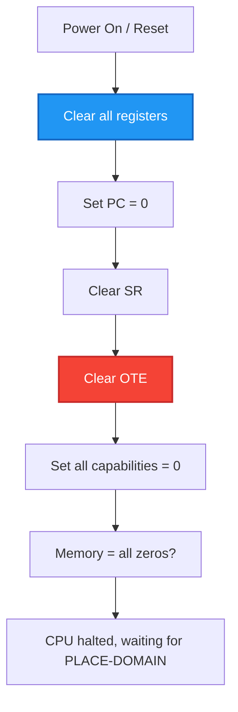

# ND-500 Standalone Emulator Guide

**Complete Guide to Emulating ND-500 Without ND-100**

**Version:** 1.0  
**Last Updated:** October 17, 2025  
**Purpose:** Document how to run ND-500 code standalone, including file formats, CPU setup, and I/O handling

---

## Table of Contents

1. [Segment File Formats](#1-segment-file-formats)
2. [DESCRIPTION-FILE Format](#2-description-file-format)
3. [ND-500 CPU Initialization](#3-nd-500-cpu-initialization)
4. [MMU Setup](#4-mmu-setup)
5. [Trap Handler Setup](#5-trap-handler-setup)
6. [Loading Programs](#6-loading-programs)
7. [Stdin/Stdout Handling](#7-stdinstdout-handling)
8. [Complete C# Implementation](#8-complete-c-implementation)

---

## 1. Segment File Formats

### 1.1 Overview

From ND-60.136.04A documentation:

> A segment is a set of files, cataloged under the Sintran III file system. The instruction segment and the data segment have the same name, but types `:PSEG` and `:DSEG`, respectively. In addition, there is a `:LINK` file.

Each segment consists of **three files:**

| File Type | Content | Format | Use |
|-----------|---------|--------|-----|
| `:PSEG` | Program code (instructions) | Binary, read-only | Executable ND-500 machine code |
| `:DSEG` | Data (initialized values) | Binary, read-write | Initial data values |
| `:LINK` | Symbols and debug info | Structured binary | Symbol table for debugger and linking |

### 1.2 :PSEG File Format

**Purpose:** Contains executable ND-500 machine instructions

**Format (inferred from usage):**

```
┌──────────────────────────────────────────┐
│ :PSEG File Structure                     │
├──────────────────────────────────────────┤
│ Optional Header (if any - likely none)   │
├──────────────────────────────────────────┤
│ Machine Code (ND-500 instructions)       │
│ - Raw binary instructions                │
│ - Ready to execute                       │
│ - Addresses start at 0                   │
│ - Size = file size in bytes              │
└──────────────────────────────────────────┘
```

**Key Points:**
- **Likely NO header** - just raw executable code
- Code is **position-independent** or **pre-relocated** by loader
- Can be loaded directly into memory and executed
- Read-only - never modified during execution
- Multiple processes can share same :PSEG file

**Reading :PSEG in C#:**
```csharp
// Simple: just read the entire file
byte[] programCode = File.ReadAllBytes("MY-SEGMENT.PSEG");
// This is ready to load into ND-500 memory at segment start
```

### 1.3 :DSEG File Format

**Purpose:** Contains initialized data values

**Format (similar to :PSEG):**

```
┌──────────────────────────────────────────┐
│ :DSEG File Structure                     │
├──────────────────────────────────────────┤
│ Optional Header (if any - likely none)   │
├──────────────────────────────────────────┤
│ Initialized Data                         │
│ - Raw binary data                        │
│ - Variables with initial values          │
│ - Arrays with initial values             │
│ - Constants                              │
│ - BSS (uninitialized) may be zero-filled │
└──────────────────────────────────────────┘
```

**Key Points:**
- Initial values for variables
- Each process gets its own **copy** of :DSEG
- Modifications go to swap file, not back to :DSEG
- Can be much larger than :PSEG
- May include zero-filled sections for uninitialized data

**Reading :DSEG in C#:**
```csharp
// Read initial data values
byte[] dataSegment = File.ReadAllBytes("MY-SEGMENT.DSEG");
// Each process needs its own copy for modifications
```

### 1.4 :LINK File Format

**Purpose:** Symbol table, debug information, relocation info

**Format (structured, more complex):**

```
┌──────────────────────────────────────────┐
│ :LINK File Structure (estimated)         │
├──────────────────────────────────────────┤
│ Header                                   │
│   - Magic number / version               │
│   - Number of symbols                    │
│   - Offset to symbol table               │
│   - Offset to debug info                 │
├──────────────────────────────────────────┤
│ Symbol Table                             │
│   For each symbol:                       │
│     - Name (string, null-terminated)     │
│     - Type (P=program, D=data)           │
│     - Segment number                     │
│     - Offset within segment              │
│     - Flags (global, local, entry, etc.) │
├──────────────────────────────────────────┤
│ Debug Information                        │
│   - Source file names                    │
│   - Line number table                    │
│   - Type information                     │
│   - Local variable info                  │
├──────────────────────────────────────────┤
│ Relocation Information (possibly)        │
│   - External references                  │
│   - Import/export tables                 │
└──────────────────────────────────────────┘
```

**Key Points:**
- Used by debugger (LOOK-AT commands)
- Used by linker (LINK-SEGMENT)
- Not needed for execution
- Can be omitted for standalone emulator unless debugging

**Reading :LINK in C#:**
```csharp
// Parse symbol table for debugging
// Format not fully documented - may need reverse engineering
// For standalone emulator, can initially skip this
```

### 1.5 NRF File Format (Input to Loader)

**Note:** You probably won't use NRF files directly in a standalone emulator, but for completeness:

**NRF** (ND Relocatable Format) is the output of compilers, input to the loader.

```
┌──────────────────────────────────────────┐
│ NRF File Structure                       │
├──────────────────────────────────────────┤
│ Header                                   │
│   - Module name                          │
│   - Module type                          │
│   - Segment information                  │
├──────────────────────────────────────────┤
│ Code Records                             │
│   - Relocatable machine code             │
│   - Address = offset from segment start  │
├──────────────────────────────────────────┤
│ Data Records                             │
│   - Initialized data                     │
│   - Address = offset from segment start  │
├──────────────────────────────────────────┤
│ Symbol Records                           │
│   - Defined symbols (ENT)                │
│   - External references (EXT)            │
├──────────────────────────────────────────┤
│ Relocation Records                       │
│   - Where to patch addresses             │
│   - What symbols they reference          │
├──────────────────────────────────────────┤
│ End Record                               │
│   - Module checksum                      │
│   - Entry point address                  │
└──────────────────────────────────────────┘
```

**For standalone emulator:** Use already-loaded :PSEG/:DSEG files, not NRF.

---

## 2. DESCRIPTION-FILE Format

### 2.1 Purpose

From documentation:
> Domains and segments are referred to by symbolic names. Internally, a numerical index is employed... The segment tables for all domains belonging to one user are kept in a file called **DESCRIPTION-FILE:DESC**.

### 2.2 Structure (Estimated)

```
┌──────────────────────────────────────────────────────┐
│ DESCRIPTION-FILE:DESC Structure                      │
├──────────────────────────────────────────────────────┤
│ Header                                               │
│   - Magic number                                     │
│   - Version                                          │
│   - Number of domains                                │
│   - Number of segments                               │
│   - Offsets to domain/segment tables                │
├──────────────────────────────────────────────────────┤
│ Domain Table                                         │
│   For each domain:                                   │
│     - Domain name (16 chars max)                     │
│     - Start segment number (0-31)                    │
│     - Start offset within segment                    │
│     - Number of segments in domain                   │
│     - Segment list (array of 32 entries)             │
│     - Trap enable masks (OTE, MTE, TEMM)             │
│     - Trap handler addresses                         │
│     - Flags and attributes                           │
├──────────────────────────────────────────────────────┤
│ Segment Table                                        │
│   For each segment:                                  │
│     - Segment name (file name without type)          │
│     - Segment number (0-31)                          │
│     - PSEG file name (with :PSEG type)               │
│     - DSEG file name (with :DSEG type)               │
│     - LINK file name (with :LINK type)               │
│     - Program size (bytes)                           │
│     - Data size (bytes)                              │
│     - Attributes (Public, Shared, etc.)              │
│     - Owner user name                                │
│     - Creation date/time                             │
├──────────────────────────────────────────────────────┤
│ Cross-Reference Info                                 │
│   - Domain → Segment mappings                        │
│   - Segment sharing information                      │
│   - Link relationships                               │
└──────────────────────────────────────────────────────┘
```

### 2.3 Simplified Format for Emulator

**For standalone testing, create a simple text-based descriptor:**

```json
{
  "domains": [
    {
      "name": "TEST-DOMAIN",
      "startSegment": 1,
      "startOffset": 0,
      "segments": [
        {
          "number": 1,
          "psegFile": "MAIN.PSEG",
          "dsegFile": "MAIN.DSEG",
          "linkFile": "MAIN.LINK",
          "programSize": 4096,
          "dataSize": 2048,
          "attributes": []
        }
      ],
      "trapHandlers": [
        { "trapNo": 12, "handler": 0x100 },
        { "trapNo": 28, "handler": 0x200 }
      ]
    }
  ]
}
```

---

## 3. ND-500 CPU Initialization

### 3.1 ND-500 Register Set

```
General Purpose Registers (32-bit each):
  I0-I7   : Index registers (8 registers)
  R0-R15  : General registers (16 registers)

Special Registers:
  PC      : Program Counter (32-bit: 5-bit segment + 27-bit offset)
  SP      : Stack Pointer
  SR      : Status Register
  OTE     : Own Trap Enable (trap handling mask)
  THA     : Trap Handler Address (pointer to handler table)
  
Segment Descriptors (per segment, 0-31):
  Program Capability (16-bit)
  Data Capability (16-bit)
```

### 3.2 Status Register (SR) Format

```
Bit 15-9: Trap condition bits
Bit 8:    K (Condition code)
Bit 7-0:  Other status flags
```

### 3.3 Initialization Sequence



### 3.4 C# CPU State

```csharp
public class ND500CPU
{
    // General registers
    public uint[] I { get; set; } = new uint[8];      // Index registers I0-I7
    public uint[] R { get; set; } = new uint[16];     // General registers R0-R15
    
    // Special registers
    public uint PC { get; set; }                      // Program counter
    public uint SP { get; set; }                      // Stack pointer
    public ushort SR { get; set; }                    // Status register
    public ushort OTE { get; set; }                   // Own Trap Enable
    public uint THA { get; set; }                     // Trap Handler Address
    
    // Segment descriptors (capabilities)
    public ushort[] ProgramCapabilities { get; set; } = new ushort[32];
    public ushort[] DataCapabilities { get; set; } = new ushort[32];
    
    // Execution state
    public bool Halted { get; set; } = true;
    public bool InterruptsEnabled { get; set; } = false;
    
    public void Reset()
    {
        Array.Clear(I, 0, I.Length);
        Array.Clear(R, 0, R.Length);
        Array.Clear(ProgramCapabilities, 0, 32);
        Array.Clear(DataCapabilities, 0, 32);
        
        PC = 0;
        SP = 0;
        SR = 0;
        OTE = 0;
        THA = 0;
        Halted = true;
        InterruptsEnabled = false;
    }
}
```

---

## 4. MMU Setup

### 4.1 ND-500 Memory Management

```
Logical Address (32-bit):
┌─────────┬──────────────────────────┐
│ Seg(5)  │ Offset (27)              │
└─────────┴──────────────────────────┘
  Bits     Bits 26-0
  31-27    

Physical Address:
  Determined by segment capability
  Points to physical segment (0-4095)
  Physical segment = 64KB block in memory
```

### 4.2 Segment Capability Format

**Program Segment Capability (16-bit):**

```
Direct Segment:
┌───┬──────┬────────────────┐
│ 0 │ --- │Physical Seg(12)│
└───┴──────┴────────────────┘

Indirect Segment (monitor calls):
┌───┬───┬───┬────────┬────────┐
│ 1 │ O │ - │Domain  │Segment │
└───┴───┴───┴────────┴────────┘
 15  14  13  12-5     4-0
```

**Data Segment Capability (16-bit):**

```
┌───┬───┬───┬───┬────────────────┐
│ W │ P │ S │ - │Physical Seg(12)│
└───┴───┴───┴───┴────────────────┘
 15  14  13  12  11-0

W = Write allowed
P = Parameters allowed
S = Shared (bypass cache)
```

### 4.3 Setting Up MMU for Domain

```csharp
public class ND500MMU
{
    private readonly ND500Memory _memory;
    private readonly ND500CPU _cpu;
    
    public void SetupDomain(ND500Domain domain, ND500CPU cpu)
    {
        // For each segment in domain
        for (int logicalSeg = 0; logicalSeg < 32; logicalSeg++)
        {
            var segment = domain.Segments[logicalSeg];
            if (segment == null) continue;
            
            // Allocate physical segment
            ushort physProg = AllocatePhysicalSegment();
            ushort physData = AllocatePhysicalSegment();
            
            // Set up program capability
            cpu.ProgramCapabilities[logicalSeg] = physProg; // Direct segment
            
            // Set up data capability
            ushort dataCapability = (ushort)(
                0x8000 |  // Write allowed
                physData
            );
            cpu.DataCapabilities[logicalSeg] = dataCapability;
            
            // Store mapping for later use
            _segmentMap[logicalSeg] = new SegmentMapping
            {
                ProgramPhysical = physProg,
                DataPhysical = physData,
                ProgramFile = segment.ProgramFileName,
                DataFile = segment.DataFileName
            };
        }
    }
    
    public uint TranslateAddress(uint logicalAddr, bool isProgram)
    {
        byte logicalSeg = (byte)(logicalAddr >> 27);
        uint offset = logicalAddr & 0x07FFFFFF;
        
        if (offset >= 0x10000) // Segment limited to 64KB
            throw new ND500Exception("Segment overflow");
        
        ushort capability = isProgram ?
            _cpu.ProgramCapabilities[logicalSeg] :
            _cpu.DataCapabilities[logicalSeg];
        
        if (capability == 0)
            throw new ND500Exception("Invalid segment");
        
        ushort physSeg = (ushort)(capability & 0x0FFF);
        uint physAddr = ((uint)physSeg << 16) | offset;
        
        return physAddr;
    }
    
    private ushort _nextPhysSeg = 1;
    private Dictionary<int, SegmentMapping> _segmentMap = new();
    
    private ushort AllocatePhysicalSegment() => _nextPhysSeg++;
}

public class SegmentMapping
{
    public ushort ProgramPhysical { get; set; }
    public ushort DataPhysical { get; set; }
    public string ProgramFile { get; set; }
    public string DataFile { get; set; }
}
```

---

## 5. Trap Handler Setup

### 5.1 Trap Types

From documentation (page 38):

| Bit | Trap Name | Default |
|-----|-----------|---------|
| 9 | OVERFLOW | Disabled |
| 11 | INVALID OPERATION | Enabled |
| 12 | DIVISION BY ZERO | Enabled |
| 13 | FLOATING UNDERFLOW | Disabled |
| 14 | FLOATING OVERFLOW | Enabled |
| 26 | ILLEGAL INDEX | Enabled |
| 27 | STACK OVERFLOW | Enabled |
| 28 | STACK UNDERFLOW | Enabled |
| 33 | ILLEGAL INSTRUCTION CODE | Enabled |
| 36 | PROTECT VIOLATION | Enabled |

### 5.2 Trap Handler Table

```
THA register points to trap handler table:

THA →  ┌──────────────┐
       │ Handler 0    │ ← Address for trap bit 0
       ├──────────────┤
       │ Handler 1    │
       ├──────────────┤
       ...
       ├──────────────┤
       │ Handler 36   │ ← Address for PROTECT VIOLATION
       ├──────────────┤
       │ Local Data   │ ← Space for handler local variables
       └──────────────┘
```

### 5.3 Setting Up Traps

```csharp
public class ND500TrapManager
{
    private readonly ND500Memory _memory;
    private readonly ND500CPU _cpu;
    
    public void SetupTraps(ND500Domain domain, uint tableAddress)
    {
        _cpu.THA = tableAddress;
        
        // Write trap handler addresses to table
        foreach (var trapHandler in domain.TrapHandlers)
        {
            uint handlerEntry = tableAddress + (uint)(trapHandler.TrapNo * 4);
            _memory.WriteWord(handlerEntry, (ushort)(trapHandler.Handler >> 16));
            _memory.WriteWord(handlerEntry + 2, (ushort)(trapHandler.Handler & 0xFFFF));
        }
        
        // Set OTE register (Own Trap Enable)
        _cpu.OTE = domain.OwnTrapEnable;
    }
    
    public void RaiseTrap(int trapBit)
    {
        // Check if locally enabled
        if ((_cpu.OTE & (1 << trapBit)) != 0)
        {
            // Local trap handler
            uint handlerEntry = _cpu.THA + (uint)(trapBit * 4);
            uint handlerAddr = (_memory.ReadWord(handlerEntry) << 16) |
                               _memory.ReadWord(handlerEntry + 2);
            
            // Save state and call handler
            PushState();
            _cpu.PC = handlerAddr;
        }
        else
        {
            // In standalone mode, we handle it ourselves
            HandleSystemTrap(trapBit);
        }
    }
    
    private void HandleSystemTrap(int trapBit)
    {
        Console.WriteLine($"TRAP {trapBit}: {GetTrapName(trapBit)}");
        Console.WriteLine($"  at PC = {_cpu.PC:X8}");
        _cpu.Halted = true;
    }
    
    private void PushState()
    {
        // Push registers to stack for trap handler
        // (Simplified - real ND-500 has specific trap frame format)
        _cpu.SP -= 4;
        _memory.WriteDoubleWord(_cpu.SP, _cpu.PC);
        _cpu.SP -= 2;
        _memory.WriteWord(_cpu.SP, _cpu.SR);
    }
    
    private string GetTrapName(int bit)
    {
        return bit switch
        {
            9 => "OVERFLOW",
            11 => "INVALID OPERATION",
            12 => "DIVISION BY ZERO",
            26 => "ILLEGAL INDEX",
            27 => "STACK OVERFLOW",
            28 => "STACK UNDERFLOW",
            33 => "ILLEGAL INSTRUCTION CODE",
            36 => "PROTECT VIOLATION",
            _ => $"TRAP_{bit}"
        };
    }
}
```

---

## 6. Loading Programs

### 6.1 Complete Loading Process

```csharp
public class ND500StandaloneLoader
{
    private readonly ND500CPU _cpu;
    private readonly ND500MMU _mmu;
    private readonly ND500Memory _memory;
    private readonly ND500TrapManager _trapManager;
    
    /// <summary>
    /// Load a domain from :PSEG/:DSEG files and prepare for execution.
    /// </summary>
    public void LoadDomain(DomainDescriptor descriptor, string basePath)
    {
        Console.WriteLine($"Loading domain: {descriptor.Name}");
        
        // 1. Reset CPU
        _cpu.Reset();
        
        // 2. Set up MMU for domain
        _mmu.SetupDomain(descriptor.Domain, _cpu);
        
        // 3. Load each segment
        foreach (var segment in descriptor.Domain.Segments.Where(s => s != null))
        {
            LoadSegment(segment, basePath);
        }
        
        // 4. Set up trap handlers
        uint trapTableAddr = AllocateTrapTable();
        _trapManager.SetupTraps(descriptor.Domain, trapTableAddr);
        
        // 5. Set PC to entry point
        _cpu.PC = MakeAddress(
            descriptor.Domain.StartSegment,
            descriptor.Domain.StartOffset
        );
        
        // 6. Set stack pointer (typically end of data segment)
        _cpu.SP = MakeAddress(1, 0xFFFC); // Segment 1, near top
        
        // 7. Ready to execute
        _cpu.Halted = false;
        
        Console.WriteLine($"Domain loaded, entry point: {_cpu.PC:X8}");
    }
    
    /// <summary>
    /// Load one segment from files into memory.
    /// </summary>
    private void LoadSegment(ND500Segment segment, string basePath)
    {
        Console.WriteLine($"  Loading segment {segment.SegmentNumber}:");
        
        // Load program segment
        if (!string.IsNullOrEmpty(segment.ProgramFileName))
        {
            string psegPath = Path.Combine(basePath, segment.ProgramFileName);
            byte[] programCode = File.ReadAllBytes(psegPath);
            
            ushort physSeg = _mmu.GetPhysicalSegment(segment.SegmentNumber, true);
            uint physAddr = (uint)physSeg << 16;
            
            _memory.WriteBytes(physAddr, programCode);
            Console.WriteLine($"    PSEG: {programCode.Length} bytes at phys {physSeg:X3}");
        }
        
        // Load data segment
        if (!string.IsNullOrEmpty(segment.DataFileName))
        {
            string dsegPath = Path.Combine(basePath, segment.DataFileName);
            byte[] dataValues = File.ReadAllBytes(dsegPath);
            
            ushort physSeg = _mmu.GetPhysicalSegment(segment.SegmentNumber, false);
            uint physAddr = (uint)physSeg << 16;
            
            _memory.WriteBytes(physAddr, dataValues);
            Console.WriteLine($"    DSEG: {dataValues.Length} bytes at phys {physSeg:X3}");
        }
    }
    
    private uint MakeAddress(ushort segment, ushort offset)
    {
        return ((uint)segment << 27) | offset;
    }
    
    private uint _trapTableBase = 0x01FF0000; // High in segment 1
    
    private uint AllocateTrapTable()
    {
        // Allocate space for 37 trap handlers (4 bytes each) + local data
        // Space needed: 37 * 4 + 256 = 404 bytes
        uint addr = _trapTableBase;
        _trapTableBase += 512; // Allocate generously
        return addr;
    }
}

/// <summary>
/// Simple descriptor for loading
/// </summary>
public class DomainDescriptor
{
    public string Name { get; set; }
    public ND500Domain Domain { get; set; }
    
    /// <summary>
    /// Load from JSON file
    /// </summary>
    public static DomainDescriptor LoadFromFile(string path)
    {
        string json = File.ReadAllText(path);
        return JsonSerializer.Deserialize<DomainDescriptor>(json);
    }
}
```

---

## 7. Stdin/Stdout Handling

### 7.1 Monitor Call Mechanism

In normal ND-500 operation, I/O is done via **monitor calls** to segment 31:

```assembly
; In ND-500 code:
CALL #write_string   ; Segment 31, routine write_string
```

Segment 31 is marked as **indirect** → control transfers to ND-100 Monitor.

### 7.2 Standalone I/O Emulation

**For standalone testing, intercept monitor calls and handle locally:**

```csharp
public class ND500MonitorCallEmulator
{
    private readonly ND500CPU _cpu;
    private readonly ND500Memory _memory;
    private readonly StreamReader _stdin;
    private readonly StreamWriter _stdout;
    
    public ND500MonitorCallEmulator(ND500CPU cpu, ND500Memory memory)
    {
        _cpu = cpu;
        _memory = memory;
        _stdin = new StreamReader(Console.OpenStandardInput());
        _stdout = new StreamWriter(Console.OpenStandardOutput()) { AutoFlush = true };
    }
    
    /// <summary>
    /// Check if PC is in segment 31 (monitor call segment)
    /// </summary>
    public bool IsMonitorCall()
    {
        byte segment = (byte)(_cpu.PC >> 27);
        return segment == 31;
    }
    
    /// <summary>
    /// Handle monitor call based on address in segment 31
    /// </summary>
    public void HandleMonitorCall()
    {
        ushort offset = (ushort)(_cpu.PC & 0xFFFF);
        
        // Monitor call number typically passed in register
        // or determined by offset in segment 31
        int monCallNo = offset / 4; // Simplified
        
        switch (monCallNo)
        {
            case 0:   // MON 0 - Exit
                HandleExit();
                break;
            case 1:   // MON 1 - Read character
                HandleReadChar();
                break;
            case 2:   // MON 2 - Write character
                HandleWriteChar();
                break;
            case 3:   // MON 3 - Write string
                HandleWriteString();
                break;
            case 0x14: // MON 24 - OUTBT
                HandleOutbt();
                break;
            case 0x15: // MON 25 - INBT
                HandleInbt();
                break;
            default:
                Console.WriteLine($"Unimplemented monitor call: {monCallNo}");
                _cpu.Halted = true;
                break;
        }
        
        // Return from monitor call
        ReturnFromMonCall();
    }
    
    private void HandleExit()
    {
        Console.WriteLine("\n[Program exited normally]");
        _cpu.Halted = true;
    }
    
    private void HandleReadChar()
    {
        // Read one character from stdin
        int ch = _stdin.Read();
        _cpu.R[0] = (uint)ch; // Return in R0
    }
    
    private void HandleWriteChar()
    {
        // Write character from R0
        char ch = (char)(_cpu.R[0] & 0xFF);
        _stdout.Write(ch);
    }
    
    private void HandleWriteString()
    {
        // Parameters typically in registers or stack
        // R0 = string address (logical)
        // R1 = length
        
        uint strAddr = _cpu.R[0];
        uint length = _cpu.R[1];
        
        for (uint i = 0; i < length; i++)
        {
            uint physAddr = _mmu.TranslateAddress(strAddr + i, false);
            byte ch = _memory.ReadByte(physAddr);
            _stdout.Write((char)ch);
        }
    }
    
    private void HandleOutbt()
    {
        // OUTBT - Output byte to file
        // Simplified: just write to stdout
        // R0 = file number
        // R1 = data address
        // R2 = byte count
        
        uint dataAddr = _cpu.R[1];
        uint byteCount = _cpu.R[2];
        
        for (uint i = 0; i < byteCount; i++)
        {
            uint physAddr = _mmu.TranslateAddress(dataAddr + i, false);
            byte data = _memory.ReadByte(physAddr);
            _stdout.Write((char)data);
        }
        
        _cpu.R[0] = 0; // Success
    }
    
    private void HandleInbt()
    {
        // INBT - Input byte from file
        // R0 = file number
        // R1 = buffer address
        // R2 = max bytes
        
        uint bufferAddr = _cpu.R[1];
        uint maxBytes = _cpu.R[2];
        
        uint bytesRead = 0;
        for (uint i = 0; i < maxBytes; i++)
        {
            int ch = _stdin.Read();
            if (ch == -1 || ch == '\n') break;
            
            uint physAddr = _mmu.TranslateAddress(bufferAddr + i, false);
            _memory.WriteByte(physAddr, (byte)ch);
            bytesRead++;
        }
        
        _cpu.R[0] = bytesRead; // Return bytes read
    }
    
    private void ReturnFromMonCall()
    {
        // Monitor calls use CALL instruction
        // Return address is on stack
        uint returnAddr = _memory.ReadDoubleWord(_cpu.SP);
        _cpu.SP += 4;
        _cpu.PC = returnAddr;
    }
}
```

---

## 8. Complete C# Implementation

### 8.1 Main Emulator Class

```csharp
public class ND500StandaloneEmulator
{
    private readonly ND500CPU _cpu;
    private readonly ND500Memory _memory;
    private readonly ND500MMU _mmu;
    private readonly ND500TrapManager _trapManager;
    private readonly ND500MonitorCallEmulator _monitorCalls;
    private readonly ND500StandaloneLoader _loader;
    private readonly ND500Executor _executor;
    
    public ND500StandaloneEmulator(int memorySize = 16 * 1024 * 1024)
    {
        _memory = new ND500Memory(memorySize);
        _cpu = new ND500CPU();
        _mmu = new ND500MMU(_memory, _cpu);
        _trapManager = new ND500TrapManager(_memory, _cpu);
        _monitorCalls = new ND500MonitorCallEmulator(_cpu, _memory, _mmu);
        _loader = new ND500StandaloneLoader(_cpu, _mmu, _memory, _trapManager);
        _executor = new ND500Executor(_cpu, _memory, _mmu, _trapManager, _monitorCalls);
    }
    
    /// <summary>
    /// Load and run a domain
    /// </summary>
    public void LoadAndRun(string descriptorFile, string basePath)
    {
        Console.WriteLine("=== ND-500 Standalone Emulator ===\n");
        
        // Load domain descriptor
        var descriptor = DomainDescriptor.LoadFromFile(descriptorFile);
        
        // Load domain into memory
        _loader.LoadDomain(descriptor, basePath);
        
        // Execute
        Console.WriteLine("\n=== Execution Starting ===\n");
        _executor.Run();
        
        Console.WriteLine("\n=== Execution Complete ===");
    }
    
    /// <summary>
    /// Interactive debugger
    /// </summary>
    public void Debug(string descriptorFile, string basePath)
    {
        // Load domain
        var descriptor = DomainDescriptor.LoadFromFile(descriptorFile);
        _loader.LoadDomain(descriptor, basePath);
        
        // Enter debug loop
        var debugger = new ND500Debugger(_cpu, _memory, _mmu, _executor);
        debugger.Run();
    }
}
```

### 8.2 Executor

```csharp
public class ND500Executor
{
    private readonly ND500CPU _cpu;
    private readonly ND500Memory _memory;
    private readonly ND500MMU _mmu;
    private readonly ND500TrapManager _trapManager;
    private readonly ND500MonitorCallEmulator _monitorCalls;
    private ND500InstructionDecoder _decoder;
    
    public long InstructionCount { get; private set; }
    
    public void Run()
    {
        InstructionCount = 0;
        
        while (!_cpu.Halted)
        {
            try
            {
                // Check for monitor call
                if (_monitorCalls.IsMonitorCall())
                {
                    _monitorCalls.HandleMonitorCall();
                    continue;
                }
                
                // Fetch instruction
                uint logicalPC = _cpu.PC;
                uint physicalPC = _mmu.TranslateAddress(logicalPC, true);
                ushort instruction = _memory.ReadWord(physicalPC);
                
                // Decode and execute
                _decoder.DecodeAndExecute(instruction);
                
                InstructionCount++;
                
                // Simple progress indicator
                if ((InstructionCount % 100000) == 0)
                {
                    Console.Write(".");
                }
            }
            catch (ND500Exception ex)
            {
                Console.WriteLine($"\nException at PC={_cpu.PC:X8}: {ex.Message}");
                _cpu.Halted = true;
            }
        }
        
        Console.WriteLine($"\nExecuted {InstructionCount} instructions");
    }
}
```

### 8.3 Usage Example

```csharp
class Program
{
    static void Main(string[] args)
    {
        var emulator = new ND500StandaloneEmulator();
        
        // Load domain descriptor and segment files
        emulator.LoadAndRun(
            descriptorFile: "test-domain.json",
            basePath: @"C:\ND500\Segments"
        );
        
        // Or run in debug mode
        // emulator.Debug("test-domain.json", @"C:\ND500\Segments");
    }
}
```

### 8.4 Example Domain Descriptor JSON

```json
{
  "name": "TEST-PROGRAM",
  "domain": {
    "startSegment": 1,
    "startOffset": 0,
    "ownTrapEnable": 63488,
    "trapHandlers": [
      { "trapNo": 12, "handler": 256 },
      { "trapNo": 28, "handler": 512 }
    ],
    "segments": [
      null,
      {
        "segmentNumber": 1,
        "programFileName": "TEST.PSEG",
        "dataFileName": "TEST.DSEG",
        "linkFileName": "TEST.LINK",
        "programSize": 4096,
        "dataSize": 2048,
        "isShared": false,
        "isPublic": false
      }
    ]
  }
}
```

---

## Summary

**To run ND-500 standalone:**

1. **Extract segment files** (:PSEG, :DSEG) from an ND-500 system
2. **Create domain descriptor** (JSON or binary)
3. **Initialize CPU** (registers, capabilities)
4. **Setup MMU** (map logical segments to physical)
5. **Load code** (read :PSEG/:DSEG into memory)
6. **Setup traps** (handler table, OTE register)
7. **Emulate monitor calls** (for I/O)
8. **Execute** (fetch-decode-execute loop)

**Key Simplifications for Standalone:**
- No demand paging (load all code upfront)
- No ND-100 communication
- Emulated monitor calls (I/O to console)
- Simplified trap handling

**For Production Emulator:**
- Implement full ND-500 instruction set
- Add demand paging and swapping
- Support all monitor calls
- Multi-process support
- Full debugger with breakpoints

---

*Next: Implement ND-500 instruction decoder and complete the emulator!*


