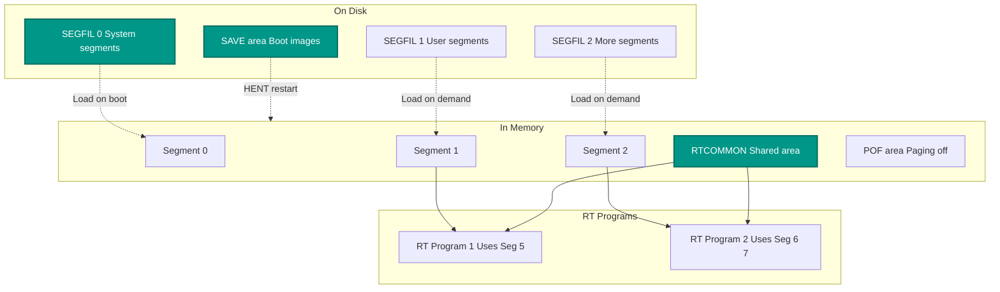
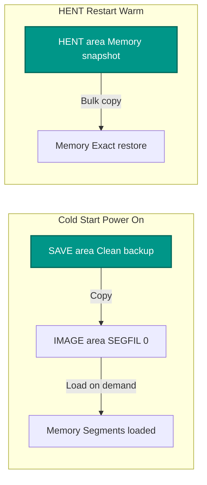
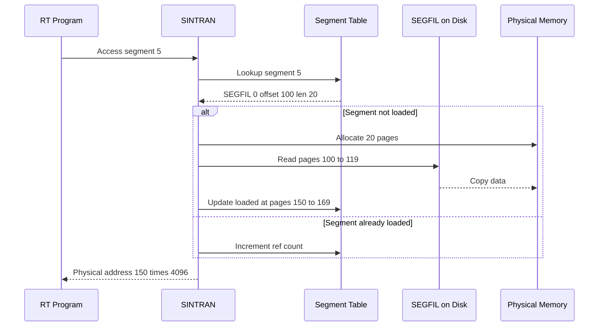
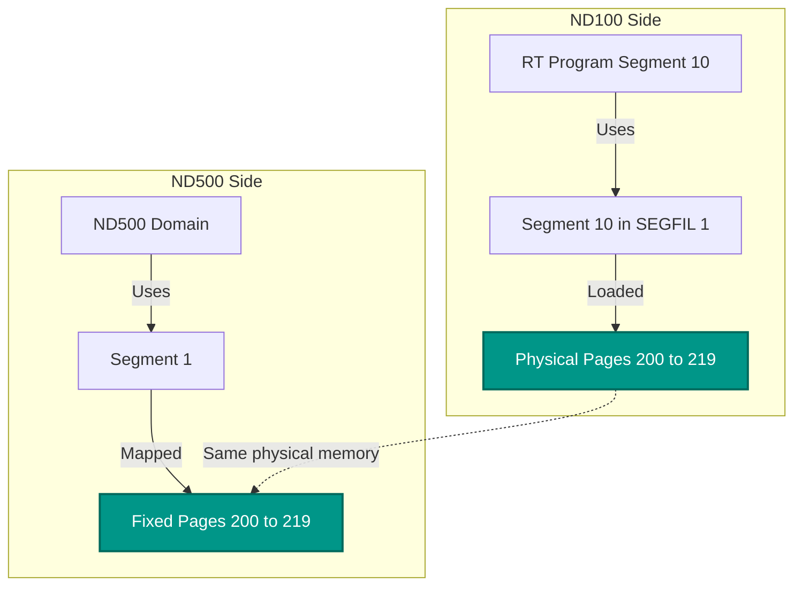

# RT Segments and SEGFIL - Complete Guide

**Deep Understanding of SINTRAN Segment Files and RT Program Memory**

**Version:** 1.0  
**Last Updated:** October 17, 2025  
**Purpose:** Explain how RT segments on disk map to RT processes in memory, including SEGFIL structure, memory/save/hent areas, and ND-500 communication

---

## Table of Contents

1. [Overview - The Confusion](#1-overview---the-confusion)
2. [SEGFIL - Segment Files on Disk](#2-segfil---segment-files-on-disk)
3. [The Three Areas: MEMORY, SAVE, HENT](#3-the-three-areas-memory-save-hent)
4. [RT Segments vs Segment Files](#4-rt-segments-vs-segment-files)
5. [How RT Programs Reference Segments](#5-how-rt-programs-reference-segments)
6. [RTCOMMON - Shared Memory Area](#6-rtcommon---shared-memory-area)
7. [ND-500 Communication via RT Segments](#7-nd-500-communication-via-rt-segments)
8. [Complete Disk-to-Memory Mapping](#8-complete-disk-to-memory-mapping)
9. [C# Implementation](#9-c-implementation)

---

## 1. Overview - The Confusion

### 1.1 The Problem

The manual mentions "segments" in many contexts:
- **Segment files on disk** (SEGFIL 0, 1, 2, etc.)
- **RT program segments** (referenced by RT programs)
- **Memory areas** (MEMORY, SAVE, HENT)
- **RTCOMMON** area
- **ND-500 segments** (:PSEG, :DSEG, :LINK)

**How do these relate?** Let's untangle this!

### 1.2 The Key Distinction



**CRITICAL INSIGHT:**
- **SEGFIL** = Files on disk containing segments (like a "segment library")
- **Segments** = 64KB blocks of code/data loaded into memory
- **RT Programs** = Reference segments by number (0-255)
- **Areas** = Different regions on disk for different purposes

---

## 2. SEGFIL - Segment Files on Disk

### 2.1 What is SEGFIL?

From `PH-P2-OPPSTART.NPL` line 769:
```npl
SEGFSTART=:CBLST    % START OF SEGFILE 0
```

**SEGFIL is a container file on the system disk that holds multiple segments.**

Think of it like a library or archive:

```text
 ┌────────────────────────────────────────┐
 │ SEGFIL 0 (System Segments)             │
 ├────────────────────────────────────────┤
 │ Segment 0:  Offset 0, Size 20 pages    │
 │ Segment 1:  Offset 20, Size 16 pages   │
 │ Segment 2:  Offset 36, Size 10 pages   │
 │ Segment 3:  Offset 46, Size 5 pages    │
 │ ...                                    │
 │ Segment N:  Offset X, Size Y pages     │
 └────────────────────────────────────────┘
 
 ┌────────────────────────────────────────┐
 │ SEGFIL 1 (User Segments)               │
 ├────────────────────────────────────────┤
 │ Segment 0:  User A's program           │
 │ Segment 1:  User B's program           │
 │ ...                                    │
 └────────────────────────────────────────┘
```

### 2.2 Multiple SEGFILs

SINTRAN supports **multiple SEGFIL files** (typically 0-4):

| SEGFIL | Purpose | Typical Contents |
|--------|---------|------------------|
| **0** | **System** | RT-Loader, Error handler, System monitor, Kernel segments |
| **1** | **Users** | User RT programs, Application segments |
| **2** | **Libraries** | Shared library segments |
| **3** | **ND-500** | ND-500 domains (:PSEG/:DSEG files) |
| **4** | **Special** | Additional system or user segments |

**From code (line 749):**
```npl
MASSNO(0)=:MASSNO(4)      % INITIALIZE "SEGMENT FILE" #4
```

### 2.3 Segment Numbering

**Segments are numbered 0-255 within a SEGFIL.**

**Global segment reference:**
```
Segment Number = (SEGFIL_number * 256) + Local_segment_number

Examples:
  Segment 5 in SEGFIL 0  = Global segment 5
  Segment 10 in SEGFIL 1 = Global segment 266 (256 + 10)
  Segment 0 in SEGFIL 2  = Global segment 512 (256*2 + 0)
```

### 2.4 Segment Table

SINTRAN maintains a **Segment Table** (SGT) in memory:

```
┌──────────────────────────────────────┐
│ Segment Table Entry (per segment)    │
├──────────────────────────────────────┤
│ SEGFIL number (which file?)          │ 16 bits
│ Offset in SEGFIL (pages)             │ 16 bits
│ Length (pages)                       │ 16 bits
│ Status flags                         │ 16 bits
│ Physical page (if loaded)            │ 16 bits
│ Reference count                      │ 16 bits
└──────────────────────────────────────┘
```

**From code (line 784):**
```npl
X:=CBLST; T:="MSSGT"+X; A:="MISGT"+X
X:="LSSGT"; CALL FAR CRWDISC    % COPY SEGMENT TABLE
```

---

## 3. The Three Areas: MEMORY, SAVE, HENT

### 3.1 Overview

The boot code copies segments from **SAVE area** to different locations:

```
Disk Layout:
┌─────────────────────────────────────────┐
│ System Disk                             │
├─────────────────────────────────────────┤
│ Page 0:     Boot sector                 │
│ Pages 1-N:  SEGFIL 0 (IMAGE area)       │
│ Pages M-P:  SAVE area                   │
│ Pages Q-R:  HENT restart image          │
│ Pages S-T:  Swap area                   │
└─────────────────────────────────────────┘
```

### 3.2 IMAGE Area (MEMORY)

**Purpose:** The "live" segments used during normal operation.

**Location:** Part of SEGFIL 0, starts at `SEGFSTART`

**Contents:**
- All currently active segments
- Modified by system and RT programs
- Survives normal shutdown (but not power loss)

**From code (line 772):**
```npl
% COPY FROM SAVE TO IMAGE
X:=CBLST; T:="MSECO"+X; A:="MIECO"+X
X:="LSECO"; CALL FAR CRWDISC    % COPY EXT. COMMON
```

### 3.3 SAVE Area

**Purpose:** **Clean backup copy** of system segments.

**Location:** Separate area on disk (disk pages defined at system generation)

**Contents:**
- Pristine copy of all system segments
- **NEVER modified during operation**
- Used to restore IMAGE area during boot

**Symbol definitions (from code lines 773-841):**
- `MSECO` = Memory Save Extended COmmon
- `MSDPT` = Memory Save DPIT
- `MSRPT` = Memory Save RPIT
- `MSMPT` = Memory Save MPIT
- `MSIPT` = Memory Save IPIT
- `MSSGT` = Memory Save SeGment Table
- `MFILS` = Memory Save FILe System
- `MRTLO` = Memory RT-LOader
- `MERRP` = Memory ERRor Program
- `MSCOM` = Memory Save COMmand segment
- (many more...)

### 3.4 HENT Restart Area

**Purpose:** **Complete memory snapshot** for fast restart after HENT (halt/restart).

**Location:** Another area on disk

**How it works:**
1. **@HENT command** (halt system):
   - Saves ENTIRE memory contents to HENT area
   - Includes all PITs, segment tables, datafields, RT program states
   - Essentially a "memory dump"

2. **On restart:**
   - Check `HENTFLAG` (line 766, 771)
   - If HENT restart: Copy HENT area back to memory
   - If cold start: Copy SAVE area to IMAGE area

**From code (line 771):**
```npl
IF HENTFLAG><0 GO FAR OVCO    % HENT restart - skip SAVE copy
```

### 3.5 The Complete Picture



**Why three areas?**
- **IMAGE**: Fast access, modified during operation
- **SAVE**: Pristine backup, never modified
- **HENT**: Fast restart, complete state

---

## 4. RT Segments vs Segment Files

### 4.1 The Relationship

**An RT Program references segments by number.**

**Example RT program structure:**
```
RT Program "TERMINAL-HANDLER":
  Program Segment:  Uses segment 5 (code)
  Data Segment:     Uses segment 6 (data)
  Stack:            In data segment or separate
```

**That segment number points into the Segment Table:**
```
Segment 5:
  SEGFIL: 0
  Offset: 100 pages into SEGFIL 0
  Length: 20 pages
  Status: Loaded
  Physical: Pages 150-169 in RAM
```

### 4.2 Segment Loading Process



### 4.3 Segment Naming

**Segments can have names:**
- Name stored in Segment Table
- Maps name → segment number
- Example: "RT-LOADER" = segment 4

**From code (lines 787-841), system segments:**
```
Segment Name         Code     Purpose
────────────────────────────────────────────────
RT-LOADER (prog)     S04MA    RT program loader
RT-LOADER (data)     S37MA    RT loader data
ERROR-PROGRAM        S14MA    Error handler
EDIT-ROUTINE         S41MA    Command editor
COMMAND              MICOM    Command processor
SM-SEGMENT           MISMS    System Monitor
SYSTEM-SEGMENT-5     S05MA    System utilities
5PIT-SEGMENT         MI5PT    ND-500 PIT area
XMSG-KERNEL          MIXMK    ND-500 message kernel
NK-SERV              MINKS    Network service
NK-NAME              MINKN    Network naming
ERSWD-CODE           MIERC    Error code
ND-500-MONITOR       MI5MO    ND-500 system monitor
```

---

## 5. How RT Programs Reference Segments

### 5.1 RT Program Structure

An RT program consists of:

```
┌─────────────────────────────────────┐
│ RT-Description (26 words)           │
├─────────────────────────────────────┤
│ TLINK, STATE, PRIORITY, DTIME, ...  │
│ STADR ← Start address               │
│ SEGM  ← Program segment number      │ 16 bits
│ SEGM2 ← Data segment number         │ 16 bits
│ Saved registers (P, X, T, A, D, L...) │
│ ACTPRI ← PCR value (MMU config)     │
│ RSEGM ← Reentrant segment bitmap    │
└─────────────────────────────────────┘
```

**Key fields:**
- **SEGM** (offset 10): Program segment number (0-255)
- **SEGM2** (offset 11): Data segment number (0-255)
- **RSEGM** (offset 23): Bitmap of additional segments (up to 16 more)

### 5.2 Multi-Segment RT Programs

An RT program can use **multiple segments:**

```
RT Program "DATABASE-SERVER":
  Segment 10: Main program code
  Segment 11: Data area
  Segment 12: Shared library (reentrant)
  Segment 13: Communication buffer
  Segment 14: Index tables
```

**RSEGM bitmap** (offset 23-25):
```
Bits 0-15  (RSEGM):   Segments 0-15  used/not used
Bits 16-31 (BITM1):   Segments 16-31 used/not used
Bits 32-47 (BITM2):   Segments 32-47 used/not used
```

### 5.3 Segment Loading on RT Activation

**When RT program is activated:**

1. **SINTRAN reads RT-Description**
2. **Loads program segment** (SEGM field)
   - Lookup in Segment Table
   - Load from SEGFIL if not in memory
   - Set up MMU to map segment
3. **Loads data segment** (SEGM2 field)
4. **Loads additional segments** (RSEGM bitmap)
5. **Sets ACTPRI** (PCR value for MMU)
6. **Starts execution** at STADR

---

## 6. RTCOMMON - Shared Memory Area

### 6.1 What is RTCOMMON?

**RTCOMMON** = **RT COMMON area** = Shared memory accessible by ALL RT programs and ND-500 processes.

**Purpose:**
- Fast inter-process communication
- Shared data structures
- ND-500 ↔ ND-100 communication
- Always resident in physical memory (never swapped)

**From code (lines 625-645):**
```npl
% SET UP RT-COMMON TABLE
IF CCNOX><0 THEN    % Number of pages in RT-COMMON
   ...
   200-CCNOX+161000; T:=CCNOX; X:=0  % First logical page of RT-COMMON
   DO WHILE T><0
      AD=:DCCTAB(X); A+1; D+1; X+2; T-1  % Fill log.page and phys.page
   OD; -1=:ACCTAB(X)    % -1 is end of table
FI
```

### 6.2 RTCOMMON Layout

```text
Logical Address Space:
┌─────────────────────────────────────┐
│ Pages 0-127:  Normal memory         │
├─────────────────────────────────────┤
│ Pages 128-159: RTCOMMON             │ ← 32 pages typical
│                Fixed physical addr  │
│                Contiguous           │
│                Shared by all RT     │
├─────────────────────────────────────┤
│ Pages 160-199: Other memory         │
│ Page  200:     Start of RT segments │
└─────────────────────────────────────┘

Physical Memory:
┌─────────────────────────────────────┐
│ Pages 0-63:   POF area              │
├─────────────────────────────────────┤
│ Pages 64-95:  RTCOMMON              │ ← Fixed location
│               CCSTART = 64          │
├─────────────────────────────────────┤
│ Pages 96-...: Other memory          │
└─────────────────────────────────────┘
```

### 6.3 RTCOMMON for ND-500

**From documentation:**
> The RTCOMMON area is accessed from the ND-500 as a part of the regular memory space. The mapping onto the RTCOMMON is done at load time through the **MATCH-RTCOMMON** command.

**How it works:**

1. **ND-500 domain created** with loader command:
   ```
   NLL: SET-DOMAIN "MY-500-PROG"
   NLL: MATCH-RTCOMMON    ← Maps ND-500 segment to RTCOMMON
   NLL: LOAD-SEGMENT MY-CODE
   ```

2. **At load time:**
   - ND-500 segment (e.g., segment 0) is mapped to RTCOMMON physical pages
   - ND-500 can read/write directly to RTCOMMON
   - ND-100 RT programs also access same physical pages

3. **Result:**
   - Shared memory between ND-100 and ND-500
   - No message passing overhead
   - Direct read/write access
   - **Must be contiguous** (for ND-500 DMA)

**Critical constraint:**
> If the RTCOMMON area is used from ND-500, it must be contiguous. In other words, if the system supervisor through the SINTRAN-SERVICE-PROGRAM command DEFINE-RTCOMMON-SIZE expands RTCOMMON beyond what was specified at system generation, this area must be adjacent to the initially allocated area.

---

## 7. ND-500 Communication via RT Segments

### 7.1 MATCH-COMMON-RT-SEGMENT

**From documentation:**
> An ND-100 RT-program may share data with an ND-500 process through a segment in one of the ND-100 SEGFILs. The segment must be **fixed in a continuous area in memory** before the ND-500 process referring to it is started.

**How it works:**



### 7.2 Setup Process

**Step 1: ND-100 RT Program loads segment:**
```
@RT-LOADER
RT: LOAD MY-RT-PROG
(Loads segment 10 from SEGFIL 1)
```

**Step 2: Fix segment in memory:**
```
@FIX-SEGMENT 10, START-ADDRESS=0x32000
(Segment 10 fixed at physical address 0x32000-0x37FFF)
```

**Step 3: ND-500 domain setup:**
```
@ND-500 LINKAGE-LOADER
NLL: SET-DOMAIN "SHARED-DOMAIN"
NLL: MATCH-COMMON-RT-SEGMENT 10    ← Links to ND-100 segment 10
NLL: OPEN-SEGMENT "MY-CODE", P
NLL: LOAD-SEGMENT MY-CODE-FILE
NLL: EXIT
```

**Step 4: ND-500 execution:**
- ND-500 segment 1 maps to same physical pages as ND-100 segment 10
- Both CPUs see same memory
- **Synchronization required** (semaphores, flags)

### 7.3 Communication Methods Compared

| Method | Speed | Size Limit | Setup Complexity | Use Case |
|--------|-------|------------|------------------|----------|
| **Process Flags** | Fastest | 16 bits | Very simple | Simple signaling |
| **RTCOMMON** | Very fast | ~128KB | Simple | Moderate data, many processes |
| **RT Segment** | Fast | Up to 64KB per segment | Moderate | Large data transfers |
| **Files** | Slowest | Unlimited | Simple | Very large data, not time-critical |
| **Messages (5MPM)** | Moderate | Variable | Complex | Structured I/O requests |

---

## 8. Complete Disk-to-Memory Mapping

### 8.1 Boot Sequence Segment Loading

**From `PH-P2-OPPSTART.NPL` lines 772-841:**

```
Cold Start (HENTFLAG=0):
┌────────────────────────────────────────┐
│ 1. Copy from SAVE to IMAGE on disk     │
├────────────────────────────────────────┤
│ Extended Common    (MSECO → MIECO)     │
│ DPIT               (MSDPT → MIDPT)     │
│ RPIT               (MSRPT → MIRPT)     │
│ MPIT               (MSMPT → MIMPT)     │
│ IPIT               (MSIPT → MIIPT)     │
│ Segment Table      (MSSGT → MISGT)     │
│ File System        (MFILS → MIFIL)     │
│ RT-Loader Program  (MRTLO → S04MA)     │
│ RT-Loader Data     (MRTLO+20 → S37MA)  │
│ Error Program      (MERRP → S14MA)     │
│ Command Segment    (MSCOM → MICOM)     │
│ System Monitor     (MSSMS → MISMS)     │
│ System Segment 5   (MSSYS → S05MA)     │
│ 5PIT Segment       (MS5PT → MI5PT)     │
│ XMSG Kernel        (MSXMK → MIXMK)     │
│ ND-500 Monitor     (MN5MO → MI5MO)     │
│ (many more...)                         │
└────────────────────────────────────────┘

Warm Start (HENTFLAG<>0):
┌────────────────────────────────────────┐
│ Copy HENT area → Memory (bulk copy)    │
│ Much faster than cold start            │
│ Exact memory state restored            │
└────────────────────────────────────────┘
```

### 8.2 Complete Memory Map

```
Logical Address Space (16-bit addressing):
┌────────────────────────────────────────┐ 0x0000
│ Page 0-63:    POF area                 │
│               (Paging Off - no MMU)    │
│               System datafields        │
│               RT-Description table     │
│               Critical kernel code     │
├────────────────────────────────────────┤ 0x10000 (page 64)
│ Page 64-95:   RTCOMMON                 │
│               (Fixed, contiguous)      │
│               Shared by all RT progs   │
├────────────────────────────────────────┤ 0x18000 (page 96)
│ Page 96-127:  Extended Common          │
│               Additional shared area   │
├────────────────────────────────────────┤ 0x20000 (page 128)
│ Page 128-199: System segments          │
│               Segment 0-15 mapped here │
├────────────────────────────────────────┤ 0x32000 (page 200)
│ Page 200-255: User segments            │
│               RT program segments      │
│               Dynamically loaded       │
└────────────────────────────────────────┘ 0x40000 (page 256)

Physical Memory (24-bit addressing):
┌────────────────────────────────────────┐ 0x000000
│ Pages 0-63:    POF area                │
│                Direct mapping          │
├────────────────────────────────────────┤ 0x040000
│ Pages 64-95:   RTCOMMON                │
│                Fixed location          │
├────────────────────────────────────────┤ 0x060000
│ Pages 96-...:  Dynamic segments        │
│                Loaded on demand        │
│                May be anywhere in RAM  │
├────────────────────────────────────────┤
│ ...                                    │
├────────────────────────────────────────┤
│ Top of memory: ND-500 multiport (5MPM) │
│                (if ND-500 present)     │
└────────────────────────────────────────┘ 0xFFFFFF
```

### 8.3 Segment Reference Example

**Example: RT Program needs segment 10**

```
Step 1: RT Program starts
  - RT-Description says SEGM = 10

Step 2: SINTRAN looks up segment 10
  - Segment Table Entry 10:
    SEGFIL:  1
    Offset:  50 pages into SEGFIL 1
    Length:  8 pages
    Status:  Not loaded
    
Step 3: SINTRAN loads segment
  - Allocate 8 physical pages (say, pages 150-157)
  - Read from disk:
    SEGFIL 1 offset 50 → Read 8 pages
  - Copy to physical pages 150-157
  - Update Segment Table Entry 10:
    Status: Loaded
    Physical: 150
    
Step 4: SINTRAN sets up MMU
  - RT program's PIT (Page Index Table):
    Logical page 200 → Physical page 150
    Logical page 201 → Physical page 151
    ...
    Logical page 207 → Physical page 157
    
Step 5: RT Program executes
  - Accesses logical address 0x32000 (page 200)
  - MMU translates: page 200 → physical page 150
  - Physical address: 0x96000
  - Data read/written from physical pages 150-157
```

---

## 9. C# Implementation

### 9.1 Segment Table Entry

```csharp
/// <summary>
/// Entry in SINTRAN Segment Table.
/// One entry per segment (0-255 per SEGFIL).
/// </summary>
public class SegmentTableEntry
{
    public byte SegmentNumber { get; set; }        // 0-255
    public byte SegfilNumber { get; set; }         // Which SEGFIL (0-4)
    public ushort OffsetInSegfil { get; set; }     // Offset in pages
    public ushort LengthPages { get; set; }        // Size in pages (1 page = 1024 words = 2048 bytes)
    public SegmentStatus Status { get; set; }
    public ushort PhysicalPage { get; set; }       // If loaded, first physical page
    public ushort ReferenceCount { get; set; }     // How many RT programs using it
    public string SegmentName { get; set; }        // Optional name
    public SegmentFlags Flags { get; set; }
    
    public uint DiskAddress => (uint)(OffsetInSegfil * 8);  // Convert pages to sectors (8 sectors/page)
    public uint SizeBytes => (uint)(LengthPages * 2048);
    public bool IsLoaded => Status == SegmentStatus.Loaded;
}

public enum SegmentStatus : byte
{
    NotLoaded = 0,
    Loading = 1,
    Loaded = 2,
    Error = 3
}

[Flags]
public enum SegmentFlags : ushort
{
    None = 0,
    Reentrant = 0x0001,      // Multiple progs can share
    System = 0x0002,         // System segment
    User = 0x0004,           // User segment
    FixedInMemory = 0x0008,  // Never swapped
    ReadOnly = 0x0010,       // Code segment
    ReadWrite = 0x0020       // Data segment
}
```

### 9.2 SEGFIL Manager

```csharp
/// <summary>
/// Manages SEGFIL files on disk and segment loading.
/// </summary>
public class SegfilManager
{
    private readonly DiskAccess _disk;
    private readonly MemoryAccess _memory;
    private readonly SegmentTableEntry[] _segmentTable;  // Up to 256 * 5 = 1280 segments
    private readonly Dictionary<byte, uint> _segfilStartSectors;  // SEGFIL start addresses
    
    public SegfilManager(DiskAccess disk, MemoryAccess memory)
    {
        _disk = disk;
        _memory = memory;
        _segmentTable = new SegmentTableEntry[1280];
        _segfilStartSectors = new Dictionary<byte, uint>();
    }
    
    /// <summary>
    /// Initialize SEGFIL start addresses from boot data.
    /// </summary>
    public void InitializeSegfils(uint segfil0Start, uint segfil1Start, uint segfil2Start)
    {
        _segfilStartSectors[0] = segfil0Start;  // CBLST from NPL code
        _segfilStartSectors[1] = segfil1Start;
        _segfilStartSectors[2] = segfil2Start;
        // SEGFIL 3, 4 if present
    }
    
    /// <summary>
    /// Load segment table from disk.
    /// </summary>
    public void LoadSegmentTable()
    {
        // Segment table is stored in SEGFIL 0 at known location
        // (MSSGT/MISGT in code)
        
        uint segTableSector = _segfilStartSectors[0] + /* offset to SGT */;
        byte[] segTableData = _disk.ReadSectors(segTableSector, 32);  // Read segment table
        
        // Parse segment table
        for (int i = 0; i < 256; i++)
        {
            int offset = i * 12;  // 12 bytes per entry (estimated)
            
            var entry = new SegmentTableEntry
            {
                SegmentNumber = (byte)i,
                SegfilNumber = segTableData[offset],
                OffsetInSegfil = BitConverter.ToUInt16(segTableData, offset + 1),
                LengthPages = BitConverter.ToUInt16(segTableData, offset + 3),
                Status = (SegmentStatus)segTableData[offset + 5],
                PhysicalPage = BitConverter.ToUInt16(segTableData, offset + 6),
                ReferenceCount = BitConverter.ToUInt16(segTableData, offset + 8),
                Flags = (SegmentFlags)BitConverter.ToUInt16(segTableData, offset + 10)
            };
            
            _segmentTable[i] = entry;
        }
    }
    
    /// <summary>
    /// Load a segment from SEGFIL into memory.
    /// </summary>
    public void LoadSegment(byte segmentNumber)
    {
        var entry = _segmentTable[segmentNumber];
        
        if (entry == null)
            throw new Exception($"Segment {segmentNumber} not defined");
        
        if (entry.IsLoaded)
        {
            entry.ReferenceCount++;
            return;  // Already loaded
        }
        
        // Calculate disk address
        uint segfilStart = _segfilStartSectors[entry.SegfilNumber];
        uint segmentSector = segfilStart + (uint)(entry.OffsetInSegfil * 8);
        uint sectorsToRead = (uint)(entry.LengthPages * 8);
        
        // Allocate physical pages
        ushort physPage = AllocatePhysicalPages(entry.LengthPages);
        
        // Read from disk
        byte[] segmentData = _disk.ReadSectors(segmentSector, sectorsToRead);
        
        // Write to memory
        uint physAddr = (uint)(physPage * 2048);  // Page size = 2048 bytes
        _memory.WriteBytes(physAddr, segmentData);
        
        // Update segment table
        entry.Status = SegmentStatus.Loaded;
        entry.PhysicalPage = physPage;
        entry.ReferenceCount = 1;
        
        Console.WriteLine($"Loaded segment {segmentNumber} from SEGFIL {entry.SegfilNumber} " +
                          $"at physical page {physPage}");
    }
    
    /// <summary>
    /// Unload a segment (decrement ref count, free if zero).
    /// </summary>
    public void UnloadSegment(byte segmentNumber)
    {
        var entry = _segmentTable[segmentNumber];
        
        if (entry == null || !entry.IsLoaded)
            return;
        
        entry.ReferenceCount--;
        
        if (entry.ReferenceCount == 0 && !entry.Flags.HasFlag(SegmentFlags.FixedInMemory))
        {
            // Free physical pages
            FreePhysicalPages(entry.PhysicalPage, entry.LengthPages);
            entry.Status = SegmentStatus.NotLoaded;
            entry.PhysicalPage = 0;
            
            Console.WriteLine($"Unloaded segment {segmentNumber}");
        }
    }
    
    /// <summary>
    /// Get physical address of segment.
    /// </summary>
    public uint GetSegmentPhysicalAddress(byte segmentNumber)
    {
        var entry = _segmentTable[segmentNumber];
        
        if (entry == null || !entry.IsLoaded)
            throw new Exception($"Segment {segmentNumber} not loaded");
        
        return (uint)(entry.PhysicalPage * 2048);
    }
    
    private ushort _nextPhysPage = 96;  // Start after RTCOMMON
    private readonly Dictionary<ushort, bool> _freePages = new Dictionary<ushort, bool>();
    
    private ushort AllocatePhysicalPages(ushort count)
    {
        // Try to find free pages first
        ushort consecutive = 0;
        ushort startPage = 0;
        
        for (ushort page = 96; page < 256; page++)
        {
            if (_freePages.TryGetValue(page, out bool isFree) && isFree)
            {
                if (consecutive == 0) startPage = page;
                consecutive++;
                if (consecutive == count)
                {
                    // Mark pages as allocated
                    for (ushort p = startPage; p < startPage + count; p++)
                        _freePages[p] = false;
                    return startPage;
                }
            }
            else
            {
                consecutive = 0;
            }
        }
        
        // No free pages found, allocate new ones
        ushort result = _nextPhysPage;
        _nextPhysPage += count;
        
        // Mark as allocated
        for (ushort p = result; p < result + count; p++)
            _freePages[p] = false;
            
        return result;
    }
    
    private void FreePhysicalPages(ushort start, ushort count)
    {
        // Mark pages as free for reuse
        for (ushort page = start; page < start + count; page++)
        {
            _freePages[page] = true;
        }
        
        Log($"Freed {count} pages starting at physical page {start}");
    }
}
```

### 9.3 RT Program Segment Loader

```csharp
/// <summary>
/// Loads segments for an RT program and sets up MMU.
/// </summary>
public class RtProgramSegmentLoader
{
    private readonly SegfilManager _segfilManager;
    private readonly MmuManager _mmuManager;
    
    public void LoadRtProgramSegments(RtDescription rtDesc)
    {
        // Load program segment
        byte progSeg = (byte)(rtDesc.SEGM & 0xFF);
        _segfilManager.LoadSegment(progSeg);
        
        // Load data segment
        byte dataSeg = (byte)(rtDesc.SEGM2 & 0xFF);
        _segfilManager.LoadSegment(dataSeg);
        
        // Load additional segments from RSEGM bitmap
        ushort rsegm = rtDesc.RSEGM;
        for (int bit = 0; bit < 16; bit++)
        {
            if ((rsegm & (1 << bit)) != 0)
            {
                byte additionalSeg = (byte)bit;
                _segfilManager.LoadSegment(additionalSeg);
            }
        }
        
        // Set up MMU for this RT program
        SetupMmuForRtProgram(rtDesc);
    }
    
    private void SetupMmuForRtProgram(RtDescription rtDesc)
    {
        byte progSeg = (byte)(rtDesc.SEGM & 0xFF);
        byte dataSeg = (byte)(rtDesc.SEGM2 & 0xFF);
        
        // Get physical addresses
        uint progPhysAddr = _segfilManager.GetSegmentPhysicalAddress(progSeg);
        uint dataPhysAddr = _segfilManager.GetSegmentPhysicalAddress(dataSeg);
        
        // Map logical pages 200-207 (typical RT program area) to physical
        // This is simplified - real mapping depends on segment sizes
        ushort progPhysPage = (ushort)(progPhysAddr / 2048);
        ushort dataPhysPage = (ushort)(dataPhysAddr / 2048);
        
        _mmuManager.MapPages(200, progPhysPage, 8);  // Map 8 pages for program
        _mmuManager.MapPages(208, dataPhysPage, 8);  // Map 8 pages for data
    }
}
```

---

## Summary

**The complete picture:**

1. **SEGFIL** = Container files on disk holding multiple segments
2. **SAVE area** = Pristine backup of system segments
3. **IMAGE area** = Live SEGFIL 0 used during operation
4. **HENT area** = Complete memory snapshot for fast restart
5. **Segment Table** = Maps segment numbers → SEGFIL locations
6. **RT Programs** = Reference segments by number (SEGM, SEGM2, RSEGM)
7. **RTCOMMON** = Shared memory area for all RT programs and ND-500
8. **ND-500 segments** = Can be mapped to RT segments or RTCOMMON for communication

**Key insights:**
- Segments live in SEGFIL files on disk
- Loaded on demand into physical memory
- RT programs reference by number, not by file name
- Multiple areas (MEMORY/SAVE/HENT) for redundancy and fast restart
- RTCOMMON provides fast shared memory for ND-100 ↔ ND-500 communication

**For emulator:** Track segment table, implement on-demand loading, manage physical page allocation.

---

*For ND-500 communication details, see `05-ND500-DMA-KERNEL.md` and `08-MESSAGE-PASSING-DETAILED.md`.*


