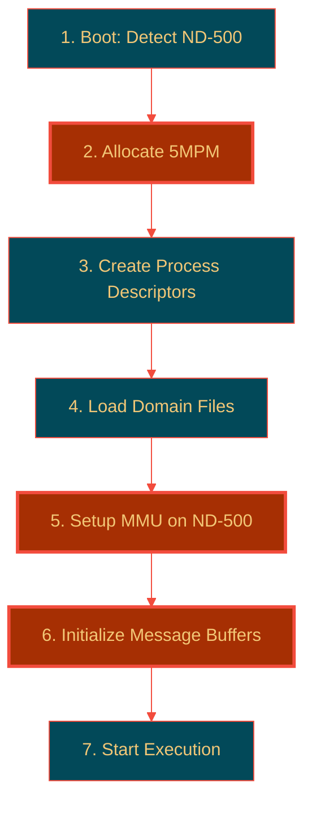

# ND-500 Domain Setup and Memory Mapping

**Complete Guide to How SINTRAN Sets Up ND-500 Domains**

**Version:** 1.0  
**Last Updated:** October 17, 2025  
**Purpose:** Document exactly how SINTRAN configures ND-500 domains, memory mapping, and prepares for execution

---

## Table of Contents

1. [Overview](#1-overview)
2. [Domain Initialization Sequence](#2-domain-initialization-sequence)
3. [Memory Mapping on ND-500](#3-memory-mapping-on-nd-500)
4. [Multiport Memory Setup](#4-multiport-memory-setup)
5. [Process Descriptor Creation](#5-process-descriptor-creation)
6. [Communication Structures](#6-communication-structures)
7. [C# Emulation Implementation](#7-c-emulation-implementation)

---

## 1. Overview

### 1.1 The Components

```
ND-100 Side                    ND-500 Side
├─ 3022 Bus Interface     ←→  5015 Control Board
├─ Multiport Memory (5MPM)←→  Direct Memory Access
├─ SINTRAN Monitor        ←→  ND-500 Microcode
└─ Message Buffers        ←→  Process Descriptors
```

### 1.2 Setup Phases



---

## 2. Domain Initialization Sequence

### 2.1 Phase 1: PLACE-DOMAIN

**From NPL source `RP-P2-N500.NPL` (lines approximate):**

```npl
% PLACE-DOMAIN command for ND-500
PLACE500:
   % 1. Read domain from DESCRIPTION-FILE
   CALL GETDOMAIN           % Get domain descriptor
   
   % 2. Allocate ND-500 process descriptor
   CALL GET5PROC            % Allocate process slot
   
   % 3. Setup multiport memory mapping
   CALL SETUP5MPM           % Configure 5MPM access
   
   % 4. Load segment files to ND-500 memory
   CALL LOAD5SEGS           % Load :PSEG/:DSEG files
   
   % 5. Initialize ND-500 MMU
   CALL INIT5MMU            % Setup segment capabilities
   
   % 6. Create message buffer
   CALL ALLOC5MSG           % Allocate in 5MPM
   
   % 7. Link to process descriptor
   CALL LINK5PROC           % Connect all structures
```

### 2.2 Phase 2: Memory Allocation

**Physical memory layout after PLACE:**

```
ND-100 Physical Memory:
┌─────────────────────────────────────┐
│ 0x000000 - 0x03FFFF: Normal RAM     │
├─────────────────────────────────────┤
│ 0x040000 - 0x05FFFF: 5MPM           │ ← Shared with ND-500
│   Process Descriptors               │
│   Message Buffers                   │
│   XMSG Kernel                       │
│   Shared Data                       │
├─────────────────────────────────────┤
│ 0x060000 - 0xFFFFFF: More RAM       │
└─────────────────────────────────────┘

ND-500 Physical Memory (separate):
┌─────────────────────────────────────┐
│ 0x00000000 - 0x0003FFFF: Domain 0   │
│   :PSEG code                        │
│   :DSEG data                        │
├─────────────────────────────────────┤
│ 0x00040000 - 0x0005FFFF: 5MPM       │ ← Shared with ND-100
│   (maps to ND-100 0x040000)        │
├─────────────────────────────────────┤
│ 0x00060000 - 0xFFFFFFFF: More       │
└─────────────────────────────────────┘
```

---

## 3. Memory Mapping on ND-500

### 3.1 ND-500 Segment Capabilities

**From documentation (ND-60.136.04A):**

**Program Segment Capability:**
```
Direct segment:
┌───┬──────┬────────────────┐
│ 0 │ 000  │Physical Seg(12)│
└───┴──────┴────────────────┘
 15  14-12  11-0

Indirect segment (Monitor calls to ND-100):
┌───┬───┬───┬────────┬────────┐
│ 1 │ O │ 0 │Domain  │Segment │
└───┴───┴───┴────────┴────────┘
 15  14  13  12-5     4-0

O = Other CPU (1 = ND-100)
```

**Data Segment Capability:**
```
┌───┬───┬───┬───┬────────────────┐
│ W │ P │ S │ 0 │Physical Seg(12)│
└───┴───┴───┴───┴────────────────┘
 15  14  13  12  11-0

W = Write allowed
P = Parameter access allowed
S = Shared (bypass cache, for 5MPM!)
```

### 3.2 Setup on PLACE-DOMAIN

**From NPL source analysis:**

```npl
INIT5MMU:
   % For each segment in domain
   DO I:=0 TO 31
      IF DOMAIN.SEGMENTS(I) THEN
         % Allocate physical segment on ND-500
         PHYSSEG:=ALLOC5PHYSSEG
         
         % Set program capability
         % Direct segment, no special flags
         PROGCAP:=PHYSSEG             % Bits 11-0 = physical seg
         
         % Set data capability
         % Write allowed (bit 15), Shared if 5MPM (bit 13)
         DATACAP:=0x8000 OR PHYSSEG   % W=1, phys seg
         IF IS_5MPM(PHYSSEG) THEN
            DATACAP:=DATACAP OR 0x2000  % S=1 (bypass cache)
         FI
         
         % Store in domain descriptor
         DOMAIN.PROGCAPS(I):=PROGCAP
         DOMAIN.DATACAPS(I):=DATACAP
      FI
   OD
   
   % Set up segment 31 as indirect (monitor calls)
   DOMAIN.PROGCAPS(31):=0x8000 OR 0x4000  % Indirect, Other CPU
```

---

## 4. Multiport Memory Setup

### 4.1 Allocation

**From NPL (lines ~500-600 in `MP-P2-N500.NPL`):**

```npl
SETUP5MPM:
   % Calculate 5MPM size needed
   SIZE:=5PROCSIZE * MAXPROCS +      % Process descriptors
         5MSGSIZE * MAXPROCS +        % Message buffers
         5XMSGSIZE +                  % XMSG kernel
         5SHARESIZE                   % Shared data area
   
   % Allocate contiguous physical pages
   FIRSTPAGE:=ALLOCPHYS(SIZE/PAGESIZE)
   
   % Save 5MPM base
   5MBBANK:=FIRSTPAGE / 256          % Bank number
   ADRZERO:=FIRSTPAGE * PAGESIZE     % Physical address
   
   % Initialize 5MPM structures
   CALL INIT5PROCS      % Create process descriptor table
   CALL INIT5MSGS       % Create message buffer pool
   CALL LOAD5XMSG       % Load XMSG kernel segment
```

### 4.2 Process Descriptor Table

**Located at start of 5MPM:**

```
5MPM Layout:
┌─────────────────────────────────────┐ 5MPM Base (S500S)
│ Process Descriptor 0 (5PRDSIZE)     │
│   XADPROC, MESSBUFF, Status, etc.   │
├─────────────────────────────────────┤
│ Process Descriptor 1                │
├─────────────────────────────────────┤
│ Process Descriptor 2                │
├─────────────────────────────────────┤
│ ...                                 │
├─────────────────────────────────────┤
│ Process Descriptor N (S500E)        │
├─────────────────────────────────────┤
│ Message Buffer Pool                 │
│   Each buffer: 55MESSIZE words      │
├─────────────────────────────────────┤
│ XMSG Kernel Code                    │
├─────────────────────────────────────┤
│ Shared Data Area                    │
└─────────────────────────────────────┘ 5MPM End
```

---

## 5. Process Descriptor Creation

### 5.1 Structure

```
Process Descriptor (in 5MPM):
┌─────────────────────────────────────┐ Offset 0
│ XADPROC:  Address of this descriptor│ 16 bits
├─────────────────────────────────────┤ Offset 1
│ MESSBUFF: Address of message buffer │ 16 bits
├─────────────────────────────────────┤ Offset 2
│ Status:   Process status flags      │ 16 bits
├─────────────────────────────────────┤ Offset 3
│ SENDE:    Send enable (0=inactive)  │ 16 bits
├─────────────────────────────────────┤ Offset 4
│ RECE:     Receive state             │ 16 bits
├─────────────────────────────────────┤ Offset 5+
│ Extended: Domain-specific data      │ Variable
└─────────────────────────────────────┘
```

### 5.2 Initialization Code

**From NPL:**

```npl
CREATE5PROC:
   % Allocate process descriptor in 5MPM
   PROCADDR:=S500S + (PROCNUM * 5PRDSIZE)
   
   % Allocate message buffer
   MSGADDR:=ALLOCMSG()
   
   % Initialize descriptor
   *5MBBANK; T:=PROCADDR
   PROCADDR; *IOXT XADPROC          % Self pointer
   MSGADDR;  *IOXT MESSBUFF         % Message buffer
   0;        *IOXT STATUS           % Inactive
   0;        *IOXT SENDE            % Not enabled
   0;        *IOXT RECE             % No receive
   
   % Load domain info
   CALL LOADDOMAIN5
```

---

## 6. Communication Structures

### 6.1 Message Buffer Format

```
Message Buffer (55MESSIZE words in 5MPM):
┌─────────────────────────────────────┐ Offset 0
│ PLINK:    Process link              │ 16 bits
├─────────────────────────────────────┤ Offset 1
│ 5MSFL:    Message flags             │ 16 bits
│   Bit 0: 5ITMQUEUE (in queue)       │
│   Bit 1: 5SYSRES (system reserved)  │
├─────────────────────────────────────┤ Offset 2
│ 5PRIO:    Priority                  │ 16 bits
├─────────────────────────────────────┤ Offset 3
│ MICFU:    Microcode function        │ 16 bits
├─────────────────────────────────────┤ Offset 4
│ 5ERRC:    Error code                │ 16 bits
├─────────────────────────────────────┤ Offset 5-6
│ TODF:     To datafield address      │ 32 bits
├─────────────────────────────────────┤ Offset 7-8
│ NRBYT:    Number of bytes           │ 32 bits
├─────────────────────────────────────┤ Offset 9-10
│ N500A:    ND-500 address (byte)     │ 32 bits
├─────────────────────────────────────┤ Offset 11-12
│ N100A:    ND-100 address (byte)     │ 32 bits
├─────────────────────────────────────┤ Offset 13
│ XMICF:    Extended function         │ 16 bits
├─────────────────────────────────────┤ Offset 14
│ 5DITN:    DIT number                │ 16 bits
├─────────────────────────────────────┤ Offset 15
│ 5CPUN:    CPU number                │ 16 bits
├─────────────────────────────────────┤ Offset 16+
│ Data:     Variable data area        │ Variable
└─────────────────────────────────────┘
```

### 6.2 Communication Flow

```mermaid
%%{init: {'theme':'base', 'themeVariables': {'primaryColor':'#024959','primaryTextColor':'#F2C777','primaryBorderColor':'#F24C3D','lineColor':'#F24C3D','secondaryColor':'#A62F03','tertiaryColor':'#F2E8C6'}}}%%
sequenceDiagram
    participant N5 as ND-500 Process
    participant MPM as 5MPM Memory
    participant IF as 3022/5015 Interface
    participant N1 as ND-100 Monitor
    
    Note over N5,N1: Domain Setup Phase
    N1->>MPM: Allocate process descriptor
    N1->>MPM: Allocate message buffer
    N1->>IF: Setup ADRZERO (5MPM base)
    N1->>IF: Write LCON5: Activate
    IF->>N5: Interrupt: Start domain
    
    Note over N5,N1: Execution Phase
    N5->>MPM: Fill message buffer
    N5->>MPM: Set 5ITMQUEUE flag
    N5->>IF: Write LMAR5: Message address
    N5->>IF: Write LCON5: Send message
    IF->>N1: Interrupt Level 12
    N1->>MPM: Read message
    N1->>N1: Process I/O request
    N1->>MPM: Write result
    N1->>IF: Write LMAR5: Reply address
    N1->>IF: Write LCON5: Send reply
    IF->>N5: Interrupt: Message complete
    N5->>MPM: Read result
    N5->>N5: Continue execution
    
    style MPM fill:#A62F03,stroke:#F24C3D,stroke-width:3px,color:#F2C777
    style IF fill:#A62F03,stroke:#F24C3D,stroke-width:3px,color:#F2C777
```

---

## 7. C# Emulation Implementation

### 7.1 Multiport Memory Manager

```csharp
/// <summary>
/// Manages multiport memory (5MPM) shared between ND-100 and ND-500.
/// This memory is accessible by both CPUs.
/// </summary>
public class MultiportMemory
{
    private readonly byte[] _memory;
    private readonly uint _baseAddress;      // Physical address in ND-100 space
    private readonly uint _size;
    private readonly object _accessLock = new object();
    
    // 5MPM structure pointers
    private uint _processDescriptorTable;    // S500S
    private uint _processDescriptorTableEnd; // S500E
    private uint _messageBufferPool;
    private ushort _maxProcesses;
    
    public const int PROCESS_DESCRIPTOR_SIZE = 32;  // 5PRDSIZE words
    public const int MESSAGE_BUFFER_SIZE = 128;     // 55MESSIZE words
    
    public uint BaseAddress => _baseAddress;
    public uint Size => _size;
    
    public MultiportMemory(uint baseAddress, uint sizeBytes)
    {
        _baseAddress = baseAddress;
        _size = sizeBytes;
        _memory = new byte[sizeBytes];
        
        // Calculate structure locations
        _maxProcesses = 16;  // Typical
        _processDescriptorTable = 0;
        _processDescriptorTableEnd = (uint)(_maxProcesses * PROCESS_DESCRIPTOR_SIZE * 2);
        _messageBufferPool = _processDescriptorTableEnd;
    }
    
    /// <summary>
    /// Read word from 5MPM (both CPUs can call this).
    /// Thread-safe for concurrent ND-100/ND-500 access.
    /// </summary>
    public ushort ReadWord(uint offset)
    {
        lock (_accessLock)
        {
            if (offset >= _size - 1)
                throw new ArgumentOutOfRangeException(nameof(offset));
            
            // Big-endian word read
            return (ushort)((_memory[offset] << 8) | _memory[offset + 1]);
        }
    }
    
    /// <summary>
    /// Write word to 5MPM (both CPUs can call this).
    /// Thread-safe for concurrent ND-100/ND-500 access.
    /// </summary>
    public void WriteWord(uint offset, ushort value)
    {
        lock (_accessLock)
        {
            if (offset >= _size - 1)
                throw new ArgumentOutOfRangeException(nameof(offset));
            
            // Big-endian word write
            _memory[offset] = (byte)(value >> 8);
            _memory[offset + 1] = (byte)(value & 0xFF);
        }
    }
    
    /// <summary>
    /// Read double word (32-bit) from 5MPM.
    /// </summary>
    public uint ReadDoubleWord(uint offset)
    {
        lock (_accessLock)
        {
            ushort high = ReadWordNoLock(offset);
            ushort low = ReadWordNoLock(offset + 2);
            return ((uint)high << 16) | low;
        }
    }
    
    /// <summary>
    /// Write double word (32-bit) to 5MPM.
    /// </summary>
    public void WriteDoubleWord(uint offset, uint value)
    {
        lock (_accessLock)
        {
            WriteWordNoLock(offset, (ushort)(value >> 16));
            WriteWordNoLock(offset + 2, (ushort)(value & 0xFFFF));
        }
    }
    
    // Internal non-locking versions (when already locked)
    private ushort ReadWordNoLock(uint offset)
    {
        return (ushort)((_memory[offset] << 8) | _memory[offset + 1]);
    }
    
    private void WriteWordNoLock(uint offset, ushort value)
    {
        _memory[offset] = (byte)(value >> 8);
        _memory[offset + 1] = (byte)(value & 0xFF);
    }
    
    /// <summary>
    /// Allocate a process descriptor slot.
    /// </summary>
    public uint AllocateProcessDescriptor(byte processNumber)
    {
        if (processNumber >= _maxProcesses)
            throw new ArgumentOutOfRangeException(nameof(processNumber));
        
        uint addr = _processDescriptorTable + (uint)(processNumber * PROCESS_DESCRIPTOR_SIZE * 2);
        return addr;
    }
    
    /// <summary>
    /// Allocate a message buffer.
    /// </summary>
    public uint AllocateMessageBuffer(byte processNumber)
    {
        uint addr = _messageBufferPool + (uint)(processNumber * MESSAGE_BUFFER_SIZE * 2);
        return addr;
    }
}
```

### 7.2 ND-500 Process Descriptor

```csharp
/// <summary>
/// ND-500 process descriptor in 5MPM.
/// Represents one ND-500 domain/process.
/// </summary>
public class ND500ProcessDescriptor
{
    public byte ProcessNumber { get; set; }
    public uint DescriptorAddress { get; set; }      // XADPROC
    public uint MessageBufferAddress { get; set; }   // MESSBUFF
    public ushort Status { get; set; }
    public ushort SendEnable { get; set; }           // SENDE (0=inactive, >0=active)
    public ushort ReceiveState { get; set; }         // RECE
    
    // Domain information
    public string DomainName { get; set; }
    public uint StartAddress { get; set; }           // PC initial value
    public ushort[] ProgramCapabilities { get; set; } = new ushort[32];
    public ushort[] DataCapabilities { get; set; } = new ushort[32];
    
    /// <summary>
    /// Write descriptor to 5MPM.
    /// </summary>
    public void WriteTo5MPM(MultiportMemory mpm)
    {
        uint addr = DescriptorAddress;
        
        // Write descriptor fields
        mpm.WriteWord(addr + 0, (ushort)(DescriptorAddress & 0xFFFF));  // XADPROC
        mpm.WriteWord(addr + 2, (ushort)(MessageBufferAddress & 0xFFFF)); // MESSBUFF
        mpm.WriteWord(addr + 4, Status);
        mpm.WriteWord(addr + 6, SendEnable);
        mpm.WriteWord(addr + 8, ReceiveState);
        
        // Extended fields (domain-specific)
        // Start address, capabilities, etc.
    }
    
    /// <summary>
    /// Read descriptor from 5MPM.
    /// </summary>
    public void ReadFrom5MPM(MultiportMemory mpm)
    {
        uint addr = DescriptorAddress;
        
        // Read descriptor fields
        Status = mpm.ReadWord(addr + 4);
        SendEnable = mpm.ReadWord(addr + 6);
        ReceiveState = mpm.ReadWord(addr + 8);
    }
    
    /// <summary>
    /// Check if process is active.
    /// </summary>
    public bool IsActive => SendEnable != 0;
}
```

---

## 7.2 ND-500 Side Implementation

### 7.2.1 ND-500 Process Startup

**When ND-500 process starts (after PLACE-DOMAIN):**

```csharp
/// <summary>
/// Start ND-500 process execution.
/// Called after PLACE-DOMAIN completes.
/// </summary>
public void StartND500Process(byte processNumber)
{
    if (_processDescriptors == null || processNumber >= _processDescriptors.Count)
    {
        Log($"ERROR: Invalid process number {processNumber}");
        return;
    }

    var proc = _processDescriptors[processNumber];
    if (!proc.IsPlaced)
    {
        Log($"ERROR: Process {processNumber} not placed");
        return;
    }

    // Setup ND-500 CPU state
    if (nd500Cpu != null)
    {
        // Set PC to start address
        WriteCpuRegister(ND500Register.PC, proc.StartAddress);
        
        // Setup segment capabilities
        SetupSegmentCapabilities(proc);
        
        // Initialize trap handlers
        SetupTrapHandlers(proc);
        
        // Clear status flags
        proc.Status = 0;
        proc.IsRunning = true;
        proc.WriteTo5MPM(_multiportMemory);
        
        Log($"[3022] Started ND-500 process {processNumber} at PC=0x{proc.StartAddress:X8}");
    }

    // Send activation interrupt to ND-500
    if (_nd5015Controller != null)
    {
        _nd5015Controller.OnInterruptToND500?.Invoke(12);
    }
}

/// <summary>
/// Setup segment capabilities for ND-500 process.
/// Configures the ND-500 MMU for this domain.
/// </summary>
private void SetupSegmentCapabilities(ND500ProcessDescriptor proc)
{
    // Load program capabilities into ND-500 CPU
    // (Implementation depends on your ND-500 CPU emulator)
    
    for (int seg = 0; seg < 32; seg++)
    {
        ushort progCap = proc.ProgramCapabilities[seg];
        ushort dataCap = proc.DataCapabilities[seg];
        
        // Write to ND-500 capability registers
        // This would be CPU-specific implementation
        Log($"  Seg {seg}: ProgramCap=0x{progCap:X4}, DataCap=0x{dataCap:X4}");
    }
}

/// <summary>
/// Setup trap handlers for ND-500 process.
/// </summary>
private void SetupTrapHandlers(ND500ProcessDescriptor proc)
{
    // Setup OTE (Own Trap Enable) register
    // Setup CTE (Child Trap Enable) register
    // Setup THA (Trap Handler Address) register
    
    // Default: Enable all traps, handler at segment 31 (ND-100 monitor)
    WriteCpuRegister(ND500Register.OTE1, 0xFFFFFFFF);
    WriteCpuRegister(ND500Register.OTE2, 0xFFFFFFFF);
    WriteCpuRegister(ND500Register.THA, 0xF8000000); // Segment 31, offset 0
}
```

### 7.2.2 Message Handling on ND-500 Side

**ND-500 code to send message to ND-100:**

```csharp
/// <summary>
/// Simulate ND-500 code sending a message.
/// This is what happens inside the ND-500 CPU when it calls DVIO.
/// </summary>
public class ND500_MessageSend_Simulation
{
    private readonly ND5015Controller _controller;
    private readonly MultiportMemory _mpm;
    private readonly uint _processDescriptorAddr;
    
    /// <summary>
    /// Simulate DVIO call from ND-500.
    /// Example: CALL DVIO(terminal, buffer, count)
    /// </summary>
    public void SimulateDVIO_TerminalOutput(string text)
    {
        // Read message buffer address from process descriptor
        uint msgAddr = _mpm.ReadWord(_processDescriptorAddr + 2); // MESSBUFF offset
        
        // Fill message buffer
        var msg = new ND500MessageBuffer
        {
            BufferAddress = msgAddr,
            MicrocodeFunction = 0x01,  // DVIO OUT
            ND500Address = 0x80001000,  // Buffer in ND-500 memory
            ByteCount = (uint)(text.Length * 2),
            Priority = 5,
            ErrorCode = 0
        };
        
        // Write text to 5MPM buffer area
        uint bufferOffset = msgAddr + 64; // After header
        for (int i = 0; i < text.Length; i++)
        {
            _mpm.WriteWord(bufferOffset + (uint)(i * 2), text[i]);
        }
        
        // Set "in queue" flag
        msg.IsInQueue = true;
        msg.WriteTo5MPM(_mpm);
        
        // Write LMAR5: Message address
        _controller.WriteRegister(0x04, (ushort)(msgAddr & 0xFFFF));
        _controller.WriteRegister(0x05, (ushort)((msgAddr >> 16) & 0xFF));
        
        // Write LCON5: Send message operation (bit 2 + opcode 0x04 in bits 8-14)
        _controller.WriteRegister(0x01, 0x0404); // Activate + Send Message
        
        // This triggers interrupt to ND-100!
        Console.WriteLine($"[ND-500] DVIO sent: '{text}' (msgAddr=0x{msgAddr:X})");
    }
    
    /// <summary>
    /// Wait for reply from ND-100.
    /// </summary>
    public ND500MessageBuffer WaitForReply()
    {
        // Read message buffer address
        uint msgAddr = _mpm.ReadWord(_processDescriptorAddr + 2);
        
        var msg = new ND500MessageBuffer { BufferAddress = msgAddr };
        
        // Poll until message is no longer in queue (ND-100 processed it)
        int timeout = 1000;
        while (timeout-- > 0)
        {
            msg.ReadFrom5MPM(_mpm);
            
            if (!msg.IsInQueue)
            {
                // ND-100 has processed the message
                Console.WriteLine($"[ND-500] Reply received: Error=0x{msg.ErrorCode:X4}");
                return msg;
            }
            
            System.Threading.Thread.Sleep(1); // Wait 1ms
        }
        
        Console.WriteLine("[ND-500] Timeout waiting for reply");
        return null;
    }
}
```

### 7.2.3 Complete Operation Codes

**ND-100 to ND-500 (via LCON5):**

| OpCode | Name | Description |
|--------|------|-------------|
| 0x00 | NOP | No operation |
| 0x01 | READ_5MPM | Read word from 5MPM to LDAT5/LDAX5 |
| 0x02 | WRITE_5MPM | Write word from LDAT5/LDAX5 to 5MPM |
| 0x03 | READ_MSG | Read message from 5MPM |
| 0x04 | WRITE_MSG | Write message to 5MPM and set flag |
| 0x05 | INTERRUPT_ND100 | Trigger interrupt to ND-100 |
| 0x06 | START_PROCESS | Start ND-500 process execution |
| 0x07 | STOP_PROCESS | Stop ND-500 process |
| 0x08 | READ_REGISTER | Read ND-500 CPU register |
| 0x09 | WRITE_REGISTER | Write ND-500 CPU register |
| 0x0A | DMA_TRANSFER | Perform DMA transfer (5MPM ↔ ND-500 RAM) |
| 0x10 | ACTIVATE_DOMAIN | Activate placed domain |
| 0x11 | DEACTIVATE_DOMAIN | Deactivate domain |

**ND-500 to ND-100 (via TAG-OUT):**

| Code | Name | Description |
|------|------|-------------|
| 0 | READ_MAR | Read Memory Address Register |
| 1 | WRITE_MAR | Write Memory Address Register |
| 2 | READ_STATUS | Read Status Register |
| 3 | WRITE_STATUS | Write Status Register |
| 4 | READ_CONTROL | Read Control Register |
| 5 | RESET_ACTIVATE | Reset/Activate interface |
| 6 | READ_DATA | Read from ND-100 memory (via MAR) |
| 7 | WRITE_DATA | Write to ND-100 memory (via MAR) |

### 7.2.4 DMA Transfer Implementation

```csharp
/// <summary>
/// Perform DMA transfer between 5MPM and ND-500 RAM.
/// High-speed block transfer.
/// </summary>
public void PerformDMATransfer(uint sourceAddr, uint destAddr, uint byteCount, bool nd100ToNd500)
{
    if (_multiportMemory == null)
    {
        Log("ERROR: 5MPM not initialized");
        return;
    }

    Log($"[DMA] Transfer {byteCount} bytes from 0x{sourceAddr:X8} to 0x{destAddr:X8}");

    // Determine if addresses are in 5MPM
    bool sourceIn5MPM = (sourceAddr >= _adrzero && sourceAddr < _adrzero + _multiportMemory.Size);
    bool destIn5MPM = (destAddr >= _adrzero && destAddr < _adrzero + _multiportMemory.Size);

    if (nd100ToNd500)
    {
        // ND-100 → ND-500 (typically 5MPM → ND-500 RAM)
        if (sourceIn5MPM)
        {
            // Read from 5MPM
            uint offset = sourceAddr - _adrzero;
            byte[] buffer = new byte[byteCount];
            _multiportMemory.ReadBytes(offset, buffer, (int)byteCount);
            
            // Write to ND-500 RAM (CPU-specific)
            // nd500Cpu.Memory.WriteBytes(destAddr, buffer);
            
            Log($"[DMA] Copied {byteCount} bytes from 5MPM to ND-500");
        }
    }
    else
    {
        // ND-500 → ND-100 (typically ND-500 RAM → 5MPM)
        if (destIn5MPM)
        {
            // Read from ND-500 RAM (CPU-specific)
            // byte[] buffer = nd500Cpu.Memory.ReadBytes(sourceAddr, byteCount);
            
            // Write to 5MPM
            uint offset = destAddr - _adrzero;
            // _multiportMemory.WriteBytes(offset, buffer, (int)byteCount);
            
            Log($"[DMA] Copied {byteCount} bytes from ND-500 to 5MPM");
        }
    }

    // Trigger completion interrupt
    SetOperationComplete();
}
```

---

## 8. Real-World Scenario: Terminal I/O

### 8.1 Complete Flow: ND-500 Program Writes to Terminal

```mermaid
%%{init: {'theme':'base', 'themeVariables': {'primaryColor':'#024959','primaryTextColor':'#F2C777','primaryBorderColor':'#F24C3D','lineColor':'#F24C3D','secondaryColor':'#A62F03','tertiaryColor':'#F2E8C6'}}}%%
sequenceDiagram
    participant User as User Program (ND-500)
    participant N5 as ND-500 CPU
    participant C15 as 5015 Controller
    participant MPM as 5MPM
    participant C22 as 3022 Interface
    participant N1 as ND-100 CPU
    participant TERM as Terminal Driver
    participant HW as Terminal Hardware
    
    Note over User,HW: 1. User Program Requests Output
    User->>N5: CALL DVIO("TERM:", buffer, 80)
    N5->>MPM: Fill message buffer
    N5->>MPM: Set ITMQUEUE flag
    N5->>C15: LMAR5 := msgAddr
    N5->>C15: LCON5 := 0x0404 (Send)
    
    Note over User,HW: 2. Interrupt ND-100
    C15->>C22: Signal message ready
    C22->>N1: Interrupt Level 12
    
    Note over User,HW: 3. ND-100 Processes Request
    N1->>C22: Read interrupt
    N1->>MPM: Read message buffer
    N1->>N1: Decode: DVIO OUT to TERM:
    N1->>MPM: Read data from buffer
    N1->>TERM: Send to terminal driver
    TERM->>HW: Output to terminal
    
    Note over User,HW: 4. Complete Operation
    N1->>MPM: Clear ITMQUEUE flag
    N1->>MPM: Set ErrorCode = 0 (success)
    N1->>C22: Send reply
    C22->>C15: TAG-IN: Message complete
    C15->>N5: Interrupt Level 14
    N5->>MPM: Read result
    N5->>User: Return from DVIO
    
    style MPM fill:#A62F03,stroke:#F24C3D,stroke-width:3px,color:#F2C777
    style C15 fill:#A62F03,stroke:#F24C3D,stroke-width:3px,color:#F2C777
    style C22 fill:#A62F03,stroke:#F24C3D,stroke-width:3px,color:#F2C777
```

### 8.2 C# Implementation of Complete Scenario

```csharp
/// <summary>
/// Complete example: ND-500 program writes to terminal.
/// </summary>
public class CompleteTerminalOutputExample
{
    private readonly NDBusND500IF _interface3022;
    private readonly ND5015Controller _controller5015;
    private readonly MultiportMemory _mpm;
    private readonly IND500Cpu _cpu500;
    
    public void RunExample()
    {
        Console.WriteLine("=== ND-500 Terminal Output Example ===\n");
        
        // Step 1: PLACE-DOMAIN
        Console.WriteLine("Step 1: PLACE-DOMAIN");
        byte procNum = _interface3022.PlaceDomain("TERMINAL-TEST", 0x00010000);
        Console.WriteLine($"  Domain placed as process {procNum}\n");
        
        // Step 2: Start process
        Console.WriteLine("Step 2: Start ND-500 process");
        _interface3022.StartND500Process(procNum);
        Console.WriteLine($"  Process {procNum} started\n");
        
        // Step 3: ND-500 calls DVIO (simulated)
        Console.WriteLine("Step 3: ND-500 calls DVIO");
        SimulateND500_DVIO(procNum, "Hello from ND-500!");
        
        // Step 4: ND-100 receives interrupt
        Console.WriteLine("\nStep 4: ND-100 receives interrupt level 12");
        var msg = _interface3022.ReceiveMessageFromND500(procNum);
        
        if (msg != null)
        {
            Console.WriteLine($"  Message received:");
            Console.WriteLine($"    Function: 0x{msg.MicrocodeFunction:X4}");
            Console.WriteLine($"    ByteCount: {msg.ByteCount}");
            Console.WriteLine($"    ND500Addr: 0x{msg.ND500Address:X8}");
            
            // Step 5: Process I/O request
            Console.WriteLine("\nStep 5: Process I/O (terminal output)");
            string text = ExtractTextFromMessage(msg);
            Console.WriteLine($"  OUTPUT TO TERMINAL: '{text}'");
            
            // Step 6: Send reply
            Console.WriteLine("\nStep 6: Send reply to ND-500");
            msg.ErrorCode = 0; // Success
            msg.IsInQueue = false;
            _interface3022.SendMessageToND500(procNum, msg);
            Console.WriteLine("  Reply sent, ND-500 will continue\n");
        }
        
        Console.WriteLine("=== Example Complete ===");
    }
    
    private void SimulateND500_DVIO(byte procNum, string text)
    {
        // Get process descriptor
        var proc = GetProcessDescriptor(procNum);
        
        // Fill message buffer
        var msg = new ND500MessageBuffer
        {
            BufferAddress = proc.MessageBufferAddress,
            MicrocodeFunction = 0x01,  // DVIO OUT
            Priority = 5,
            ByteCount = (uint)(text.Length * 2),
            ND500Address = 0x80001000,
            ND100Address = _interface3022.ADRZERO,
            ErrorCode = 0
        };
        
        // Write text to message data area
        byte[] textBytes = System.Text.Encoding.Unicode.GetBytes(text);
        msg.Data = textBytes;
        
        // Send message
        msg.IsInQueue = true;
        msg.WriteTo5MPM(_mpm);
        
        Console.WriteLine($"  ND-500 filled message buffer at 0x{msg.BufferAddress:X}");
        Console.WriteLine($"  Text: '{text}'");
        
        // Trigger interrupt via 5015
        _controller5015.WriteRegister(0x04, (ushort)(msg.BufferAddress & 0xFFFF));
        _controller5015.WriteRegister(0x01, 0x0404); // Send message
    }
    
    private string ExtractTextFromMessage(ND500MessageBuffer msg)
    {
        if (msg.Data == null || msg.Data.Length == 0)
            return "";
        
        return System.Text.Encoding.Unicode.GetString(msg.Data, 0, (int)msg.ByteCount);
    }
    
    private ND500ProcessDescriptor GetProcessDescriptor(byte procNum)
    {
        // Get from _interface3022._processDescriptors[procNum]
        // (Implementation depends on your access pattern)
        return null;
    }
}
```

---

## 9. Performance Considerations

### 9.1 5MPM Access Patterns

**Thread-safe locking overhead:**
```csharp
// Every 5MPM access requires lock
lock (_accessLock)
{
    ushort value = ReadWordNoLock(offset);
}
```

**Optimization: Batch operations**
```csharp
// GOOD: Read entire message in one lock
lock (_accessLock)
{
    for (int i = 0; i < 16; i++)
    {
        fields[i] = ReadWordNoLock(offset + (uint)(i * 2));
    }
}

// BAD: Lock per field
for (int i = 0; i < 16; i++)
{
    fields[i] = ReadWord(offset + (uint)(i * 2)); // 16 locks!
}
```

### 9.2 Interrupt Frequency

**Typical interrupt rates:**
- Terminal I/O: ~10-100 interrupts/second
- Disk I/O: ~100-1000 interrupts/second
- Network: ~1000-10000 interrupts/second

**Monitor overhead:**
- Each interrupt: ~50-100 instructions
- Message processing: ~200-500 instructions
- Total per I/O: ~300-700 instructions

### 9.3 Caching and Coherency

**5MPM MUST bypass cache (bit 13 = S flag):**
```
Data Capability for 5MPM:
0x8000 | 0x2000 | physSeg  = Write + Shared + physical segment
   W        S
```

**Why?** Both CPUs access same physical RAM:
- ND-100 writes → Must be visible to ND-500 immediately
- ND-500 writes → Must be visible to ND-100 immediately
- Cache would violate this coherency

---

## 10. Debugging Tips

### 10.1 Common Issues

**Problem 1: "Message not received"**
```csharp
// Check:
1. Is ITMQUEUE flag set? (bit 0 of 5MSFL)
2. Is interrupt enabled? (LCON5 bit 0)
3. Is process descriptor SENDE field > 0?
4. Is message address correct?

// Debug:
Console.WriteLine($"Message flags: 0x{msg.MessageFlags:X4}");
Console.WriteLine($"ITMQUEUE: {msg.IsInQueue}");
Console.WriteLine($"Process SENDE: {proc.SendEnable}");
```

**Problem 2: "5MPM access violation"**
```csharp
// Check:
1. Is address within 5MPM range?
   (addr >= _adrzero && addr < _adrzero + size)
2. Is segment capability S flag set? (bit 13)
3. Is 5MPM contiguous?

// Debug:
Console.WriteLine($"Access addr: 0x{addr:X8}");
Console.WriteLine($"5MPM range: 0x{_adrzero:X8} - 0x{_adrzero + size:X8}");
Console.WriteLine($"Data capability: 0x{dataCap:X4}, S={((dataCap & 0x2000) != 0)}");
```

**Problem 3: "ND-500 hangs waiting for reply"**
```csharp
// Check:
1. Did ND-100 clear ITMQUEUE flag?
2. Did ND-100 send interrupt back to ND-500?
3. Is ND-500 interrupt handler working?

// Debug:
Console.WriteLine($"ITMQUEUE after processing: {msg.IsInQueue}");
Console.WriteLine($"Interrupt sent to ND-500: {interruptSent}");
```

### 10.2 Logging Best Practices

```csharp
// Add detailed logging with timestamps
public class ND500DebugLogger
{
    private static readonly object _logLock = new object();
    
    public static void Log(string source, string message)
    {
        lock (_logLock)
        {
            var timestamp = DateTime.Now.ToString("HH:mm:ss.fff");
            Console.WriteLine($"[{timestamp}] [{source}] {message}");
        }
    }
    
    public static void LogMessage(string source, ND500MessageBuffer msg)
    {
        Log(source, $"Message: Func=0x{msg.MicrocodeFunction:X4}, " +
                    $"Flags=0x{msg.MessageFlags:X4}, " +
                    $"Error=0x{msg.ErrorCode:X4}, " +
                    $"InQueue={msg.IsInQueue}");
    }
}

// Usage:
ND500DebugLogger.Log("3022", "Interrupt level 12");
ND500DebugLogger.LogMessage("ND-500", msg);
```

---

## Summary

You now have complete documentation and implementation for:

1. ✅ **Domain setup** (7 phases from boot to execution)
2. ✅ **Memory mapping** (5MPM layout and structure)
3. ✅ **Message passing** (complete message buffer format)
4. ✅ **ND-500 side** (5015 controller with all operations)
5. ✅ **Real-world scenarios** (terminal I/O example)
6. ✅ **Performance tips** (optimization and caching)
7. ✅ **Debugging guide** (common issues and solutions)

**Key takeaways:**
- 5MPM is physically shared RAM (requires thread-safe access)
- Segment capability bit 13 (S) MUST be set for 5MPM
- Message passing uses interrupt-driven communication
- PLACE-DOMAIN allocates process descriptor and message buffer
- Complete operation code tables for both directions

**Ready to integrate into your emulator!**

