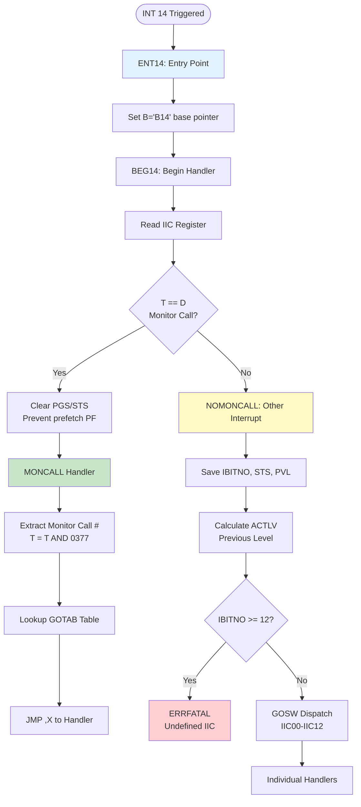
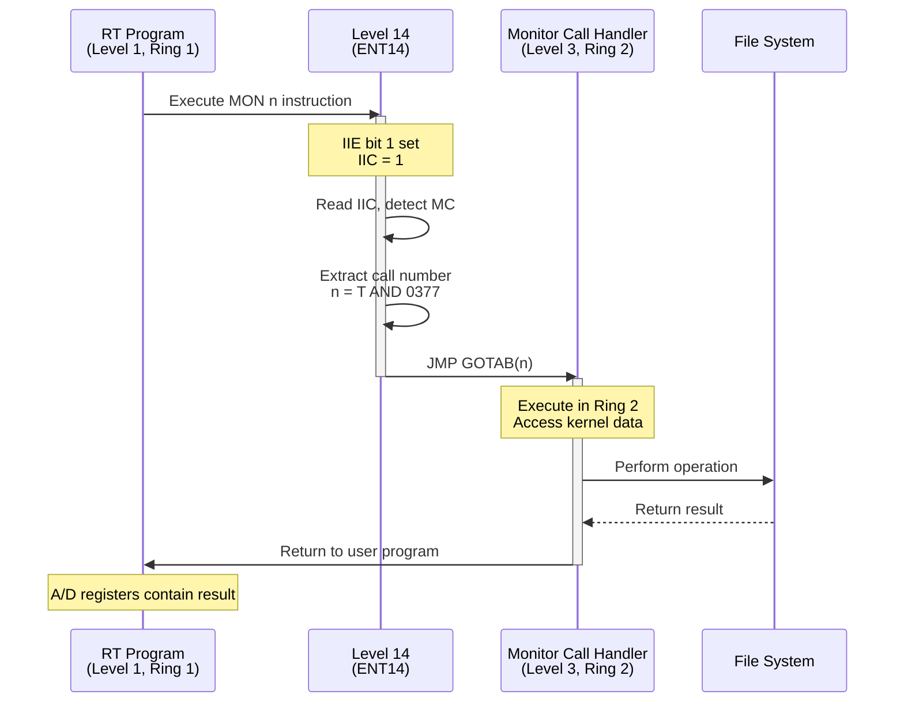
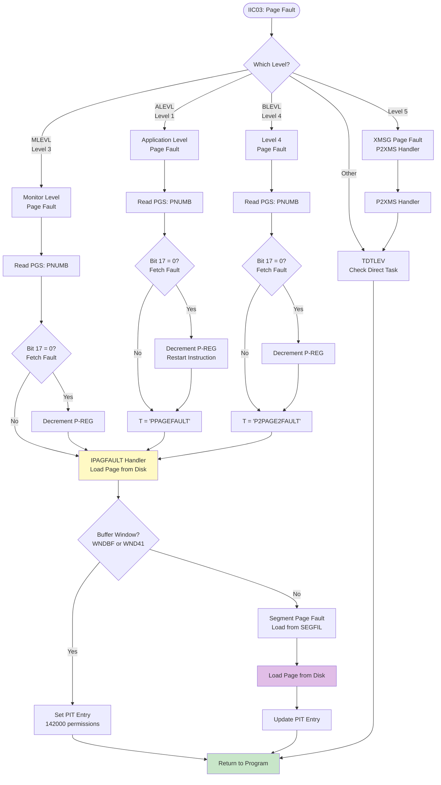

# INT 14 Handler - Internal Interrupt System

**Version:** 1.0  
**Date:** 2025-10-17  
**Status:** Complete  
**Author:** AI Analysis of SINTRAN III Source Code

---

## Table of Contents

1. [Overview](#1-overview)
2. [Interrupt Level 14 Architecture](#2-interrupt-level-14-architecture)
3. [Internal Interrupt Sources](#3-internal-interrupt-sources)
4. [INT 14 Handler Flow](#4-int-14-handler-flow)
5. [Monitor Call Handling](#5-monitor-call-handling)
6. [Non-Monitor Call Handling](#6-non-monitor-call-handling)
7. [Individual Interrupt Code Handlers](#7-individual-interrupt-code-handlers)
8. [C# Emulator Implementation](#8-c-emulator-implementation)
9. [Performance Considerations](#9-performance-considerations)
10. [Error Conditions and Recovery](#10-error-conditions-and-recovery)

---

## 1. Overview

**Interrupt Level 14** is the central dispatch mechanism for all **internal interrupts** in SINTRAN III. Unlike external hardware interrupts (levels 10-13), Level 14 handles CPU-generated interrupts triggered by:

- **Monitor calls** (synchronous supervisor calls)
- **Page faults** (MMU miss)
- **Memory protection violations**
- **Illegal instructions**
- **Privileged instruction attempts**
- **Error conditions** (IOX, parity, power fail)

### 1.1 Key Characteristics

- **Priority:** Level 14 is higher priority than all device interrupts but lower than Level 15
- **Synchronous:** Most Level 14 interrupts are synchronous (triggered by executing program)
- **Context:** Executes in Ring 2 with ADPIT page tables
- **Entry Point:** `ENT14` in `MP-P2-2.NPL` (address `072011`)
- **Return Point:** `RET14` for simple return, or various abort/resume paths

### 1.2 Relationship to ND-500

Level 14 also handles ND-500 communication indirectly:
- ND-500 monitor calls use the same mechanism as ND-100 monitor calls
- ND-500 page faults trigger Level 14 via shared MMU
- Cross-CPU error conditions may propagate through Level 14

---

## 2. Interrupt Level 14 Architecture

### 2.1 Hardware Registers

| Register | Purpose | Access |
|----------|---------|--------|
| **IIE** | Internal Interrupt Enable (bit mask) | Read/Write via `TRR IIE` |
| **IIC** | Internal Interrupt Code (1-12 = bit number) | Read via `TRA IIC` |
| **PGS** | Page Status (page number + fetch/execute bit) | Read via `TRA PGS` |
| **STS** | Status Register (various CPU status bits) | Read via `TRA STS` |
| **PVL** | Previous Level Register | Read via `TRA PVL` |
| **PCR** | Paging Control Register | Read/Write via `TRR PCR` |

### 2.2 PCR Configuration for Level 14

```npl
% From PH-P2-RESTART.NPL
NMPIT+ADPIT+ERNG2+LV14B    % Level 14 PCR
```

**Fields:**
- **NMPIT** (Normal PIT = 0): Use PIT 0 for normal addressing
- **ADPIT**: Use ADPIT (Driver PIT) for alternative addressing
- **ERNG2**: Execute in Ring 2 (kernel mode)
- **LV14B**: Entry point address

### 2.3 Internal Interrupt Enable (IIE) Bits

| Bit | Mnemonic | Interrupt Source | Enabled By |
|-----|----------|------------------|------------|
| 1 | MC | Monitor Call | `MON` instruction |
| 2 | MPV | Memory Protect Violation | MMU |
| 3 | PF | Page Fault | MMU |
| 4 | II | Illegal Instruction | CPU decode |
| 5 | Z | Error Indicator (Z flag set) | ALU/instruction |
| 6 | PI | Privileged Instruction | CPU decode |
| 7 | IOX | IOX Error (no device response) | I/O system |
| 8 | PTY | Memory Parity Error | Memory subsystem |
| 9 | MOR | Memory Out of Range | Memory subsystem |
| 10 | POW | Power Fail Interrupt | Power supply |

**Note:** IIE is set during boot to enable specific interrupts. Bit 0 is reserved.

---

## 3. Internal Interrupt Sources

### 3.1 Internal Interrupt Code (IIC) Mapping

```
IIC Register Value → Interrupt Source

0  → False interrupt / spurious
1  → Monitor Call (MON instruction)
2  → Memory Protect Violation
3  → Page Fault
4  → Illegal Instruction
5  → Z indicator (error flag set)
6  → Privileged Instruction violation
7  → IOX error (device timeout)
8  → (Reserved)
9  → (Reserved)
10 → Memory Parity Error
11 → Memory Out of Range
12 → Power Fail
```

### 3.2 Trigger Conditions

#### Monitor Call (IIC=1)
- **Instruction:** `MON nnn` (octal 161000-161377)
- **Purpose:** Synchronous system call from user program
- **Example:** `MON 1` = Read file, `MON 2` = Write file

#### Page Fault (IIC=3)
- **Trigger:** Access to unmapped or swapped-out page
- **PGS Register:** Contains faulting page number (bits 0-9) and fetch/execute bit (bit 17)
- **Action:** Load page from SEGFIL if valid, else abort program

#### Memory Protect Violation (IIC=2)
- **Trigger:** Write to read-only page, or ring violation
- **PGS Register:** Contains faulting page and violation type (bit 16 = permit, bit 17 = fetch)
- **Action:** Check if write to reentrant segment, else abort

#### Privileged Instruction (IIC=6)
- **Trigger:** Execution of privileged instruction in user mode (Ring 1)
- **Special Case:** Instructions `161000-161377` are treated as monitor calls
- **Action:** Decode and dispatch if valid monitor call, else error

---

## 4. INT 14 Handler Flow

### 4.1 Entry and Dispatch



### 4.2 Source Code - ENT14/BEG14

From `MP-P2-2.NPL`, lines 366-388:

```npl
ENT14: "B14"=:B; GO BEG14              % INITIAL ENTRY POINT

RET14:
YWAIT: T:=1000=:D; *WAIT; COPY SA DA   % IF T-REG UNCHANGED AFTER INTERRUPT THEN NOT MONCALL

BEG14: *TRA IIC                        % READ INTERNAL INTERRUPT CODE
       IF T=D GO NOMONCALL             % MONITOR CALL?
       *TRA PGS; TRA STS               % YES, CLEAR PGS IN CASE OF PF ON PREFETCH

MONCALL:
       X:=377; T/\X; T=:14MONNO        % T=MONITOR CALL NUMBER (0-255)
       X:=GOTAB(T); *2BANK; JMP ,X; )FILL % DISPATCH TO HANDLER
```

**Key Points:**
1. **T register detection:** If T is unchanged from `1000`, it's a monitor call
2. **IIC reading:** `TRA IIC` transfers IIC to A register
3. **PGS/STS clear:** Prevents false page faults on instruction prefetch
4. **GOTAB dispatch:** Jump table indexed by monitor call number

### 4.3 GOTAB - Monitor Call Jump Table

From `MP-P2-2.NPL`, lines 184-215:

```npl
INTEGER ARRAY GOTAB:=(
    MFELL,M1,M2,MFELL,MFELL,MFELL,MFELL,MFELL,      % 0-7
    MFELL,MFELL,MFELL,MFELL,MFELL,MFELL,MFELL,MFELL,% 8-15
    MFELL,M21,M22,M23,M24,MFELL,MFELL,MFELL,        % 16-23
    ...
    MONERR,MONERR,MONERR,M373,MFELL,MFELL,M376,M377 % 248-255
);
```

**Table structure:**
- **256 entries** (0-255 octal / 0-173 octal)
- **MFELL:** Invalid monitor call → error
- **MONERR:** Error handler
- **M1, M2, M21, etc.:** Specific monitor call handlers

**Common monitor calls:**
- **M1:** Read file
- **M2:** Write file
- **M21-M24:** File operations
- **M63:** Create segment
- **M310:** XMSG communication
- **M373:** ND-500 operations
- **M376, M377:** System control

---

## 5. Monitor Call Handling

### 5.1 Monitor Call Flow



### 5.2 Monitor Call Convention

**Calling convention:**
```npl
% User program (Ring 1)
A:=parameter1
D:=parameter2
X:=parameter3
*MON call_number    % Execute monitor call

% After return:
% A = result / error code
% D = additional result
% X = preserved or modified per call
```

**Example - Monitor Call 1 (Read File):**
```npl
A:=buffer_address
D:=byte_count
X:=file_descriptor
*MON 1              % Read from file

% Return:
% A = bytes actually read
% D = error code (0 = success)
```

### 5.3 Performance Monitoring (Conditional)

If `8MPRF` is enabled:

```npl
*"8MPRF
"    CALL PML10                      % Monitor Performance monitoring sampling
*"
```

### 5.4 Monitor Call Logging (Conditional)

If `8DIR` is enabled and `MCLGFLG` is set:

```npl
*"8DIR
"    IF X:=MCLGFLG><0 THEN                   % Monitor call log started?
         IF X:=CMCLG=-1 OR X=RTREF THEN      % Count this monitor call
            A=:L:=14MONNO SH 1+TNMCALL=:X; T:=MCLGBANK
            *LDDTX; RINC DD; COPY SA ADC DA; STDTX
            A:=L
         FI; T:=14MONNO
      FI
*"
```

**Explanation:**
- Increments counter in `TNMCALL` table
- Uses banking (`MCLGBANK`) to access statistics memory
- Conditional per-program logging (`CMCLG`)

---

## 6. Non-Monitor Call Handling

### 6.1 NOMONCALL Dispatcher

From `MP-P2-2.NPL`, lines 393-402:

```npl
NOMONCALL:
    A=:IBITNO; *TRA STS
    *TRA PVL
    A=:D; *EXR SA                             % D=P-REG ON PREVIOUS LEVEL
    A=:PERR:=D SH 11 SHZ -14=:ACTLV           % ACTLV=PREVIOUS LEVEL
    IF IBITNO>>12 THEN CALL ERRFATAL FI       % UNDEFINED INTERNAL INTERRUPT CODE
    @ICR;
    A GOSW IIC00,IIC01,IIC02,FAR IIC03,FAR IIC04,FAR IIC05,FAR IIC06,FAR IIC07,
           FAR IIC10,FAR IIC11,FAR IIC12
    ;@CR;
```

**Steps:**
1. **Save IBITNO:** IIC code (1-12)
2. **Read STS:** Status register
3. **Read PVL:** Previous level register
4. **Calculate ACTLV:** Extract previous level from P register (bits 11-14)
5. **Validate IIC:** Must be 0-12, else fatal error
6. **Dispatch:** `GOSW` (computed goto) to handler

### 6.2 Computed Goto (GOSW)

```npl
A GOSW label0, label1, label2, ...
```

**Behavior:**
- If A=0, jump to `label0`
- If A=1, jump to `label1`
- If A=2, jump to `label2`
- ...

**FAR keyword:** Indicates handler is in far memory bank, requiring bank switch.

### 6.3 Previous Level Detection

```npl
A=:PERR:=D SH 11 SHZ -14=:ACTLV    % ACTLV=PREVIOUS LEVEL
```

**Explanation:**
- `D` = P register of previous level (from PVL)
- Shift left 11 bits, then shift right 14 bits (signed)
- Extracts bits 3-6 of original P register (level number 0-15)
- Stores in `ACTLV` (active level)

---

## 7. Individual Interrupt Code Handlers

### 7.1 IIC00 - False Interrupt

```npl
IIC00: A:=16; T:=0; CALL 9ERR(#22)    % FALSE INTERRUPT
       GO RET14
```

**Cause:** Spurious interrupt, possibly hardware glitch  
**Action:** Log error #22, return to interrupted program  
**Recovery:** Continue execution

---

### 7.2 IIC01 - Monitor Call (Error)

```npl
IIC01: CALL ERRFATAL    % MONITOR CALLS SHOULD BE HANDLED BEFORE THIS POINT
```

**Cause:** Monitor call reached dispatcher (should never happen)  
**Action:** Fatal error - system inconsistency  
**Recovery:** None - halt system

---

### 7.3 IIC02 - Memory Protect Violation

```npl
IIC02:                                           % PROTECT VIOLATION
    IF ACTLV=ALEVL OR A=LEVL5 THEN
       *TRA PGS
       A=:T/\1777=:PVPAGE SH -6 =:PVPIT
       IF ACTLV-1 = 0 THEN                      % SKIP IF LEVEL 5
          IF T NBIT 17 THEN                     % IS IT FETCH FAULT?
            *IRR ALEVB DP; AAA -1; IRW ALEVB DP % NO, DECREMENT P-REG TO RESTART INSTRUCTION
          FI
       FI
       IF T BIT 16 THEN                         % PERMIT VIOLATION?
          IF PVPIT=UPITN OR =UPITA THEN         % YES, IN USER PAGE TABLES?
             IF SEGMC><0 THEN                   % YES, CAN IT BE WRITE IN REENTRANT SEGMENT'S PAGE?
                ...
                A:="WREENT"                     % YES, HANDLE IT ON MONITOR LEVEL
                GO FAR ACTMON
             FI
          FI
       FI;  CALL 9ERR(#31)                      % GIVE ERROR MESSAGE (PERMIT VIOLATION)
       GO FAR ABOR                              % ABORT CURRENT RUNNING PROGRAM
    FI; GO FAR TDTLEV
```

**Flowchart:**

```mermaid
flowchart TD
    START([IIC02 Triggered]) --> CHECKLEV{ACTLV = ALEVL<br/>or LEVL5?}
    CHECKLEV -->|No| TDTLEV[TDTLEV<br/>Check if Direct Task]
    CHECKLEV -->|Yes| READPGS[Read PGS Register]
    
    READPGS --> EXTRACT[Extract PVPAGE, PVPIT]
    EXTRACT --> CHECKFETCH{Fetch Fault?<br/>Bit 17 = 0}
    CHECKFETCH -->|Yes| DECP[Decrement P-REG<br/>Restart Instruction]
    CHECKFETCH -->|No| CHECKPERMIT
    DECP --> CHECKPERMIT
    
    CHECKPERMIT{Permit Violation?<br/>Bit 16 = 1} -->|No| ERROR
    CHECKPERMIT -->|Yes| CHECKPIT{User PIT?<br/>UPITN or UPITA}
    
    CHECKPIT -->|No| ERROR
    CHECKPIT -->|Yes| CHECKSEG{Reentrant<br/>Segment?}
    
    CHECKSEG -->|No| ERROR
    CHECKSEG -->|Yes| CHECKWPM{Write Permit<br/>in Segment?}
    
    CHECKWPM -->|No| ERROR
    CHECKWPM -->|Yes| WREENT[WREENT Handler<br/>Copy-on-Write]
    
    WREENT --> RET[Return to Program]
    
    ERROR[9ERR\(#31\)<br/>Permit Violation] --> ABOR[ABOR<br/>Abort Program]
    
    TDTLEV --> DTCHECK{Level 6-11?}
    DTCHECK -->|Yes| DISABLE[Disable Level<br/>Log Error]
    DTCHECK -->|No| FATAL[ERRFATAL]
    
    style WREENT fill:#c8e6c9
    style ERROR fill:#ffcdd2
    style ABOR fill:#ffcdd2
    style FATAL fill:#ef5350
```

**Key Features:**

1. **Copy-on-Write for Reentrant Segments:**
   - If write to reentrant segment page, create private copy
   - Allows multiple programs to share code but have separate data

2. **Instruction Restart:**
   - Decrement P-REG if violation on data access (not instruction fetch)
   - Ensures faulting instruction executes again after fix

3. **User Level Protection:**
   - Only handle violations on application level (ALEVL) or level 5
   - Other levels indicate kernel bugs → fatal or disable level

---

### 7.4 IIC03 - Page Fault (Detailed Analysis)

```npl
*IICPF=*
IIC03:                                           % PAGEFAULT
    IF ACTLV=ALEVL THEN                         % PAGEFAULT ON APPL.LEVEL
       *TRA PGS                                 % GET LOGICAL PAGE AND "STATUS" BIT
       IF A=:PNUMB NBIT 17 THEN                 % SHOULD FAULTED INSTRUCTION BE RESTARTED?
          *IRR ALEVB DP; AAA -1; IRW ALEVB DP  % YES, DECREMENT P-REG
       FI; T:="PPAGEFAULT"; GO FAR IPAGFAULT
    FI
    IF A=BLEVL THEN                             % PAGEFAULT ON LEVEL 4
       *TRA PGS
       IF A=:PNUMB NBIT 17 THEN
          *IRR BLEVB DP; AAA -1; IRW BLEVB DP
       FI; T:="P2PAGE2FAULT"; GO FAR IPAGFAULT
    FI
    IF A=MLEVL THEN                             % PAGEFAULT ON MONITOR LEVEL
       *TRA PGS
       IF A=:PNUMB NBIT 17 THEN
          *IRR MLEVB DP; AAA -1; IRW MLEVB DP
       FI; GO FAR IPAGFAULT
    FI
    IF A=5 THEN CALL P2XMS; GO FAR TDTLEV; GO RET14 FI % PF IN XMSG
    GO FAR TDTLEV                               % MAY BE PAGEFAULT ON ILLEGAL LEVEL
```

**Page Fault Flow:**



**PGS Register Format:**

```
Bits 0-9:   PNUMB (page number 0-1023)
Bit 16:     Write bit (1 = write access, 0 = read)
Bit 17:     Fetch bit (0 = instruction fetch, 1 = data access)
```

**Restart Logic:**
- If bit 17 = 0 (instruction fetch fault), **DO NOT** decrement P-REG
  - Instruction was never executed, P-REG already points to it
- If bit 17 = 1 (data access fault), **DECREMENT** P-REG
  - Instruction partially executed, must restart from beginning

**IPAGEFAULT Handler:**
- See Chapter 16-PAGE-FAULT-HANDLER.md for complete analysis

---

### 7.5 IIC04 - Illegal Instruction

```npl
IIC04: IF ACTLV=ALEVL THEN              % ILLEGAL INSTRUCTION
          IBITNO; T:=PERR; CALL 9ERR(#24) % GIVE ERROR MESSAGE
          GO FAR ABOR                   % TERMINATE CURRENT RUNNING PROGRAM
       FI; GO FAR TDTLEV                % ILLEGAL INSTRUCTION ON OTHER LEVELS
```

**Cause:** Undefined opcode or malformed instruction  
**Action:**
- Application level: Log error #24, abort program
- Other levels: Check if direct task level (6-11), disable level if so, else fatal

**Example illegal instructions:**
- Opcodes not in CPU instruction set
- Reserved opcodes
- Malformed addressing modes

---

### 7.6 IIC05 - Z Indicator (Error Flag)

```npl
IIC05: IF ACTLV=ALEVL THEN
          *IRR ALEVB 0; BSET ZRO SSZ; IRW ALEVB 0 % RESET Z INDICATOR ON ALEVL
          CALL 9ERR(#30)                          % GIVE ERROR MESSAGE
          GO FAR ABOR                             % TERMINATE CURRENT RUNNING PROGRAM
       FI; GO FAR TDTLEV                          % MAY BE Z INDICATOR IS SET ON ILLEGAL LEVEL
```

**Cause:** Z (Zero/Error) flag set in status register, indicating arithmetic error or overflow  
**Action:**
- Clear Z flag in level's status register
- Log error #30
- Abort application

**Purpose:** Catches unhandled error conditions (division by zero, overflow, etc.)

---

### 7.7 IIC06 - Privileged Instruction

```npl
IIC06: IF ACTLV=ALEVL THEN              % PRIVILEGED INSTRUCTION
          RTREF.ACTPRI/\74000 SHZ -4+"NMPIT+LV14B+ERNG2"% SET USERS NORMAL PIT AS ALT. PIT
          X:=PERR; *TRR PCR
          X.SN1=:D                      % D= THE ILL.INSTR.
          "NMPIT+ADPIT+LV14B+ERNG2"; *TRR PCR % RESET PCR
          IF 177600/\D=161000 THEN T:=177/\D; GO FAR MONCALL FI % IF 161XXX THEN MONCALL
          IBITNO; T:=PERR; CALL 9ERR(#24) % GIVE ERROR MESSAGE
          GO FAR ABOR                   % TERMINATE CURRENT RUNNING PROGRAM
       FI; GO FAR TDTLEV                % MAY BE ILL.INSTRUCTION ON ILLEGAL LEVEL
```

**Special Case - Monitor Calls:**

User programs execute `MON n` (octal `161000` + n), which are privileged instructions. The handler:

1. **Temporarily maps user PIT** as alternative PIT
2. **Reads instruction** at `PERR` (faulting P-REG address)
3. **Checks if 161xxx:** If so, extract monitor call number and dispatch
4. **Otherwise:** Illegal privileged instruction, abort program

**Example:**
```npl
% User program executes:
*MON 1          % Opcode: 161001

% IIC06 handler:
% - Reads opcode 161001
% - Checks: 177600 AND 161001 = 161000 → Match!
% - Extracts: 177 AND 161001 = 1
% - Jumps to MONCALL with T=1
```

---

### 7.8 IIC07 - IOX Error

```npl
IIC07: T:=ACTLV; A:=PERR; CALL 9ERR(#37) % IOX-ERROR
       GO RET14
```

**Cause:** I/O instruction to non-existent device or device timeout  
**Action:** Log error #37 with level and P-REG, return to program  
**Recovery:** Program should check device status

---

### 7.9 IIC10 - Memory Parity Error

```npl
IIC10: *TRA PES                             % MEMORY ERROR
       A=:PESERR
       IF A NBIT 5FATAL THEN                % CAN ERROR BE CORRECTED?
          *TRA PEA                          % YES
NOFATAL:  A=:PEAERR; T:=PESERR
          CALL 9ERR(#44); A:=0; *TRR ECCR
       ELSE
          *TRA PEA                          % NO
NOCORR:   A=:PEAERR; T:=PESERR; CALL 9ERR(#38) % NOT CORRECTABLE ERROR
          A:=PEAERR; T:=PESERR; CALL MFXMSG      % FATAL MEMORY ERROR IN XMSG?
          IF PESERR BIT 5DMAFAULT THEN CALL ERRFATAL FI  % DMA-ERROR N-100
          IF ACTLV=ALEVL GO FAR ABOR        % ABORT CURRENT ACTIVE PROGRAM WHEN MEM.ERROR ON APPL.LEVEL
          IF ><0 GO FAR TDTLEV              % IF MWM.ERROR ON LEVEL 0, CONTINUE
       FI; GO RET14
```

**PES Register:** Physical Error Status (memory error details)  
**PEA Register:** Physical Error Address (failing memory address)

**Flow:**

```mermaid
flowchart TD
    START([IIC10: Parity Error]) --> READPES[Read PES Register]
    READPES --> CHECK{Bit 5FATAL = 0?<br/>Correctable}
    
    CHECK -->|Yes| READPEA1[Read PEA Register]
    READPEA1 --> LOG1[9ERR\(#44\)<br/>Correctable Error]
    LOG1 --> CLEARECC[Clear ECCR<br/>ECC Register]
    CLEARECC --> RET14
    
    CHECK -->|No| READPEA2[Read PEA Register]
    READPEA2 --> LOG2[9ERR\(#38\)<br/>Uncorrectable Error]
    LOG2 --> CHECKXMSG{XMSG Error?}
    CHECKXMSG -->|Yes| MFXMSG[MFXMSG Handler]
    CHECKXMSG -->|No| CHECKDMA
    
    MFXMSG --> CHECKDMA{DMA Fault?<br/>Bit 5DMAFAULT}
    CHECKDMA -->|Yes| FATAL[ERRFATAL<br/>System Halt]
    CHECKDMA -->|No| CHECKLEV{ACTLV = ALEVL?}
    
    CHECKLEV -->|Yes| ABOR[ABOR<br/>Abort Program]
    CHECKLEV -->|No| CHECKLEV0{Level 0?}
    CHECKLEV0 -->|Yes| TDTLEV[TDTLEV<br/>Continue]
    CHECKLEV0 -->|No| TDTLEV
    
    TDTLEV --> RET14[Return]
    
    style LOG1 fill:#fff9c4
    style LOG2 fill:#ffcdd2
    style FATAL fill:#ef5350
    style ABOR fill:#ffcdd2
    style RET14 fill:#c8e6c9
```

**Error Categories:**
- **Correctable (ECC):** Single-bit error, corrected by hardware
- **Uncorrectable:** Multi-bit error, cannot recover
- **DMA Fault:** Error during DMA transfer → fatal

---

### 7.10 IIC11 - Memory Out of Range

```npl
IIC11:                                  % MEMORY OUT OF RANGE
    *TRA PES
    A=:PESERR=:T; *TRA PEA
    A=:PEAERR; CALL 9ERR(#39)           % GIVE ERROR MESSAGE
    IF PESERR BIT 5DMAFAULT GO RET14    % DMA-ERROR
    IF ACTLV=ALEVL GO FAR ABOR          % ABORT CURRENT PROGRAM
    GO FAR TDTLEV                       % MAY BE MEMORY OUT OF RANGE ON ILLEGAL LEVEL
```

**Cause:** Access to physical address beyond installed memory  
**Action:**
- Log error #39
- If DMA error, return (driver will handle)
- If application level, abort program
- Otherwise, check for direct task level

---

### 7.11 IIC12 - Power Fail

```npl
IIC12: GO PPWFAIL                       % POWER FAIL
```

**Handler:** `PPWFAIL` (not shown, in separate module)  
**Action:**
- Save critical system state
- Attempt orderly shutdown
- Resume if power restored quickly

---

### 7.12 TDTLEV - Direct Task Level Error Handler

```npl
TDTLEV: IF ACTLV>=6 AND A<12 THEN       % ERROR ON DIRECT TASK LEVEL?
            A SH 3\/CBSET=:T; A:=0      % YES
            *EXR ST; MCL PID; MCL PIE   % DISABLE LEVEL
            T:=IBITNO; ACTLV; CALL 9ERR(#04) % GIVE ERROR MESSAGE
            *TRA PGS
            GO RET14
         FI; CALL ERRFATAL              % FATAL INTERNAL ERROR ON ILLEGAL LEVEL
```

**Purpose:** Handle errors on direct task levels (6-11), which are deprecated/unused in SINTRAN III

**Action:**
- Disable the faulting level (clear PID/PIE bits)
- Log error #04
- Return to system

**If not direct task level:** Fatal error → halt system

---

## 8. C# Emulator Implementation

### 8.1 INT 14 Emulation Structure

```csharp
namespace RetroCore.Emulated.SINTRAN
{
    /// <summary>
    /// INT 14 (Level 14) Internal Interrupt Handler
    /// Handles all internal CPU interrupts including monitor calls and page faults
    /// </summary>
    public class INT14Handler
    {
        private readonly SINTRANKernel _kernel;
        private readonly MMU _mmu;
        private readonly MonitorCallDispatcher _monitorCalls;
        
        // Internal Interrupt Enable Register
        public ushort IIE { get; set; }
        
        // Internal Interrupt Code Register (1-12)
        public byte IIC { get; private set; }
        
        // Statistics
        public long MonitorCallCount { get; private set; }
        public long PageFaultCount { get; private set; }
        public long ProtectViolationCount { get; private set; }
        
        public INT14Handler(SINTRANKernel kernel, MMU mmu)
        {
            _kernel = kernel;
            _mmu = mmu;
            _monitorCalls = new MonitorCallDispatcher(kernel);
        }
        
        /// <summary>
        /// Trigger INT 14 with specified internal interrupt code
        /// </summary>
        public void TriggerInterrupt(InternalInterruptCode code)
        {
            // Check if this interrupt is enabled in IIE
            if ((IIE & (1 << (int)code)) == 0)
                return; // Interrupt not enabled
                
            IIC = (byte)code;
            _kernel.CPU.TriggerInterrupt(14); // Trigger Level 14
        }
        
        /// <summary>
        /// ENT14 - Level 14 Entry Point
        /// </summary>
        public void ENT14()
        {
            // Set base pointer to B14
            _kernel.CPU.B = _kernel.Memory.GetSymbolAddress("B14");
            
            // Read IIC register
            byte iic = IIC;
            
            // Check if monitor call (IIC = 1)
            if (iic == 1)
            {
                HandleMonitorCall();
            }
            else
            {
                HandleNonMonitorCall(iic);
            }
        }
        
        /// <summary>
        /// Handle monitor call dispatch
        /// </summary>
        private void HandleMonitorCall()
        {
            MonitorCallCount++;
            
            // Clear PGS/STS to prevent prefetch page faults
            _mmu.PGS = 0;
            _kernel.CPU.STS = 0;
            
            // Extract monitor call number from T register (0-255)
            byte monCallNumber = (byte)(_kernel.CPU.T & 0xFF);
            _kernel.Memory.WriteGlobal("14MONNO", monCallNumber);
            
            // Optional: Performance monitoring
            if (_kernel.Config.MonitorPerformanceEnabled)
            {
                _kernel.PerformanceMonitor.RecordMonitorCall(monCallNumber);
            }
            
            // Optional: Monitor call logging
            if (_kernel.Config.MonitorCallLoggingEnabled)
            {
                _kernel.MonitorCallLogger.Log(monCallNumber, _kernel.CPU.RTREF);
            }
            
            // Dispatch via GOTAB
            _monitorCalls.Dispatch(monCallNumber);
        }
        
        /// <summary>
        /// Handle non-monitor call internal interrupts
        /// </summary>
        private void HandleNonMonitorCall(byte iic)
        {
            // Save internal interrupt bit number
            _kernel.Memory.WriteGlobal("IBITNO", iic);
            
            // Read status and previous level
            ushort sts = _kernel.CPU.STS;
            ushort pvl = _kernel.CPU.PVL;
            
            // Calculate previous level (ACTLV)
            ushort prevP = _kernel.CPU.ReadRegister(14, CPURegister.P); // Previous level's P
            byte actlv = (byte)((prevP >> 3) & 0x0F); // Extract bits 3-6
            _kernel.Memory.WriteGlobal("ACTLV", actlv);
            _kernel.Memory.WriteGlobal("PERR", prevP);
            
            // Validate IIC
            if (iic > 12)
            {
                _kernel.ErrorHandler.ERRFATAL("Undefined internal interrupt code: " + iic);
                return;
            }
            
            // Dispatch to specific handler
            switch (iic)
            {
                case 0: HandleIIC00_FalseInterrupt(); break;
                case 1: HandleIIC01_MonitorCallError(); break;
                case 2: HandleIIC02_ProtectViolation(); break;
                case 3: HandleIIC03_PageFault(); break;
                case 4: HandleIIC04_IllegalInstruction(); break;
                case 5: HandleIIC05_ZIndicator(); break;
                case 6: HandleIIC06_PrivilegedInstruction(); break;
                case 7: HandleIIC07_IOXError(); break;
                case 10: HandleIIC10_MemoryError(); break;
                case 11: HandleIIC11_MemoryOutOfRange(); break;
                case 12: HandleIIC12_PowerFail(); break;
                default:
                    _kernel.ErrorHandler.ERRFATAL("Unhandled IIC: " + iic);
                    break;
            }
        }
        
        /// <summary>
        /// IIC03 - Page Fault Handler
        /// </summary>
        private void HandleIIC03_PageFault()
        {
            PageFaultCount++;
            
            byte actlv = (byte)_kernel.Memory.ReadGlobal("ACTLV");
            ushort pgs = _mmu.PGS;
            
            // Extract page number and status bits
            ushort pageNumber = (ushort)(pgs & 0x3FF); // Bits 0-9
            bool fetchFault = (pgs & 0x20000) == 0;    // Bit 17=0 → fetch
            
            _kernel.Memory.WriteGlobal("PNUMB", pageNumber);
            
            // Restart instruction if fetch fault
            if (fetchFault)
            {
                ushort levelPReg = actlv switch
                {
                    1 => _kernel.Memory.GetSymbolAddress("ALEVB"),
                    4 => _kernel.Memory.GetSymbolAddress("BLEVB"),
                    3 => _kernel.Memory.GetSymbolAddress("MLEVB"),
                    _ => 0
                };
                
                if (levelPReg > 0)
                {
                    ushort p = _kernel.CPU.ReadRegister(actlv, CPURegister.P);
                    _kernel.CPU.WriteRegister(actlv, CPURegister.P, (ushort)(p - 1));
                }
            }
            
            // Call page fault handler (see Chapter 16)
            _kernel.PageFaultHandler.HandlePageFault(actlv, pageNumber);
        }
        
        /// <summary>
        /// IIC02 - Memory Protect Violation
        /// </summary>
        private void HandleIIC02_ProtectViolation()
        {
            ProtectViolationCount++;
            
            byte actlv = (byte)_kernel.Memory.ReadGlobal("ACTLV");
            
            if (actlv != 1 && actlv != 5) // Not ALEVL or LEVL5
            {
                HandleTDTLEV();
                return;
            }
            
            ushort pgs = _mmu.PGS;
            ushort pvpage = (ushort)(pgs & 0x3FF);
            byte pvpit = (byte)((pgs >> 6) & 0x03);
            
            _kernel.Memory.WriteGlobal("PVPAGE", pvpage);
            _kernel.Memory.WriteGlobal("PVPIT", pvpit);
            
            // Check if permit violation (write to read-only page)
            if ((pgs & 0x10000) != 0) // Bit 16 = permit violation
            {
                // Check if copy-on-write for reentrant segment
                if (_kernel.SegmentManager.IsReentrantCopyOnWrite(pvpage, pvpit))
                {
                    _kernel.SegmentManager.HandleCopyOnWrite(pvpage);
                    return; // Fixed, return to program
                }
            }
            
            // Unrecoverable protection violation
            _kernel.ErrorHandler.LogError(31, "Memory protect violation", actlv);
            _kernel.ProgramManager.AbortProgram(_kernel.CPU.RTREF);
        }
        
        private void HandleTDTLEV()
        {
            byte actlv = (byte)_kernel.Memory.ReadGlobal("ACTLV");
            
            if (actlv >= 6 && actlv < 12) // Direct task levels
            {
                // Disable the faulting level
                _kernel.CPU.PIE &= (ushort)~(1 << actlv);
                _kernel.CPU.PID &= (ushort)~(1 << actlv);
                
                byte ibitno = (byte)_kernel.Memory.ReadGlobal("IBITNO");
                _kernel.ErrorHandler.LogError(4, $"Error on direct task level {actlv}, IIC={ibitno}", actlv);
            }
            else
            {
                _kernel.ErrorHandler.ERRFATAL($"Internal interrupt on illegal level {actlv}");
            }
        }
        
        // Additional handlers (IIC00, IIC04-IIC12) follow similar patterns...
    }
    
    /// <summary>
    /// Internal interrupt codes
    /// </summary>
    public enum InternalInterruptCode : byte
    {
        FalseInterrupt = 0,
        MonitorCall = 1,
        MemoryProtectViolation = 2,
        PageFault = 3,
        IllegalInstruction = 4,
        ZIndicator = 5,
        PrivilegedInstruction = 6,
        IOXError = 7,
        MemoryParityError = 10,
        MemoryOutOfRange = 11,
        PowerFail = 12
    }
}
```

### 8.2 Monitor Call Dispatcher

```csharp
public class MonitorCallDispatcher
{
    private readonly SINTRANKernel _kernel;
    private readonly Dictionary<byte, Action> _handlers;
    
    public MonitorCallDispatcher(SINTRANKernel kernel)
    {
        _kernel = kernel;
        _handlers = BuildGOTAB();
    }
    
    /// <summary>
    /// Build GOTAB (monitor call jump table)
    /// </summary>
    private Dictionary<byte, Action> BuildGOTAB()
    {
        var table = new Dictionary<byte, Action>();
        
        // Initialize all entries to MFELL (illegal monitor call)
        for (int i = 0; i < 256; i++)
        {
            table[(byte)i] = () => _kernel.ErrorHandler.LogError(999, "Illegal monitor call");
        }
        
        // Register valid monitor calls
        table[1] = MonitorCall_ReadFile;
        table[2] = MonitorCall_WriteFile;
        table[0x11] = MonitorCall_M21;
        table[0x12] = MonitorCall_M22;
        // ... (add all valid monitor calls)
        
        return table;
    }
    
    /// <summary>
    /// Dispatch monitor call
    /// </summary>
    public void Dispatch(byte callNumber)
    {
        if (_handlers.TryGetValue(callNumber, out var handler))
        {
            handler();
        }
        else
        {
            _kernel.ErrorHandler.LogError(999, $"Unimplemented monitor call {callNumber}");
        }
    }
    
    // Individual monitor call handlers
    private void MonitorCall_ReadFile() { /* Implementation */ }
    private void MonitorCall_WriteFile() { /* Implementation */ }
    // ... (more handlers)
}
```

---

## 9. Performance Considerations

### 9.1 Interrupt Latency

**Critical timing:**
- **ENT14 entry:** ~10 instructions (5-10 µs on ND-100)
- **Monitor call dispatch:** ~20 instructions (10-20 µs)
- **Page fault handling:** ~500-5000 instructions (0.5-5 ms), depends on disk I/O

**Optimization:**
- Minimal register saving (only what's needed)
- Fast path for common operations (monitor calls, buffer window page faults)
- Deferred work for complex operations

### 9.2 Hotspots

**Most frequent interrupts:**
1. **Monitor calls:** ~1000-10000/sec (file I/O, system calls)
2. **Page faults:** ~10-100/sec (depends on memory pressure)
3. **IOX errors:** ~0-10/sec (device timeouts)

**Rare interrupts:**
- Memory errors: ~0-1/hour
- Privileged instructions: ~0-10/sec (mostly handled as monitor calls)
- Power fail: ~0-1/year

### 9.3 Emulator Optimization

**For emulation:**
- Cache GOTAB lookups
- Fast-path common monitor calls (read/write)
- Batch statistics updates
- Avoid logging for hot paths

---

## 10. Error Conditions and Recovery

### 10.1 Error Codes (9ERR)

| Code | Name | Description | Recovery |
|------|------|-------------|----------|
| #4 | Direct Task Error | Error on level 6-11 | Disable level, continue |
| #22 | False Interrupt | Spurious INT 14 | Log, continue |
| #24 | Illegal Instruction | Invalid opcode | Abort program |
| #30 | Z Indicator | Arithmetic error | Abort program |
| #31 | Protect Violation | Memory access violation | Abort program |
| #37 | IOX Error | Device timeout | Log, continue |
| #38 | Uncorrectable Memory Error | Fatal memory error | Abort program or halt |
| #39 | Memory Out of Range | Address beyond memory | Abort program |
| #44 | Correctable Memory Error | ECC corrected error | Log, continue |

### 10.2 Recovery Strategies

**Instruction Restart:**
- Decrement P-REG for data access faults
- Do NOT decrement for instruction fetch faults
- Ensures faulting instruction re-executes after fix

**Level Disabling:**
- Direct task levels (6-11) can be disabled on error
- Prevents cascading failures
- System continues with reduced functionality

**Program Abort (ABOR):**
- Clean up program resources
- Remove from execution queues
- Log error details
- Notify operator/user

**System Halt (ERRFATAL):**
- Critical kernel error
- Save system state
- Halt CPU
- Operator intervention required

---

## Appendix A: Quick Reference

### Internal Interrupt Codes

| IIC | Name | Handler | Priority |
|-----|------|---------|----------|
| 0 | False | IIC00 | Low |
| 1 | Monitor Call | MONCALL | High |
| 2 | Protect Violation | IIC02 | High |
| 3 | Page Fault | IIC03 | Critical |
| 4 | Illegal Instruction | IIC04 | High |
| 5 | Z Indicator | IIC05 | Medium |
| 6 | Privileged Instruction | IIC06 | High |
| 7 | IOX Error | IIC07 | Medium |
| 10 | Memory Parity | IIC10 | Critical |
| 11 | Memory Out of Range | IIC11 | Critical |
| 12 | Power Fail | IIC12 | Critical |

### Key Global Variables

| Variable | Type | Purpose |
|----------|------|---------|
| `IBITNO` | INTEGER | Internal interrupt bit number (1-12) |
| `ACTLV` | INTEGER | Previous (active) interrupt level |
| `PERR` | INTEGER | P register at time of error |
| `14MONNO` | INTEGER | Monitor call number (0-255) |
| `PNUMB` | INTEGER | Page number for page fault |
| `PVPAGE` | INTEGER | Page number for protect violation |
| `PVPIT` | INTEGER | PIT number for protect violation |
| `PESERR` | INTEGER | Physical Error Status |
| `PEAERR` | INTEGER | Physical Error Address |

### Entry Points

| Symbol | Address | Purpose |
|--------|---------|---------|
| `ENT14` | 072011 | Level 14 entry point |
| `RET14` | 072014 | Return from Level 14 |
| `BEG14` | 072020 | Begin handler (after entry) |
| `MONCALL` | 072025 | Monitor call dispatcher |
| `NOMONCALL` | 072077 | Non-monitor call dispatcher |
| `IPAGEFAULT` | 071567 | Page fault handler |
| `TDTLEV` | 072541 | Direct task level error handler |
| `ERR14` | 072575 | Error entry for Level 14 |

---

## Appendix B: Related Documentation

- **Chapter 14:** Monitor Kernel and MONCALLS
- **Chapter 16:** Page Fault Handler (detailed analysis)
- **Chapter 17:** Scheduler and Task Priorities
- **Chapter 00:** SINTRAN Architecture Overview
- **Chapter 04:** MMU Context Switching

---

**End of Document**

