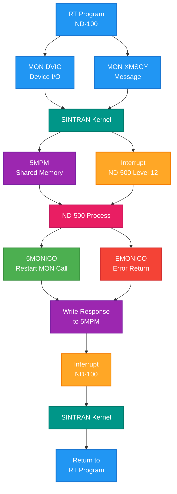

# Monitor Kernel and MONCALLS - Complete Reference

**Version:** 1.0  
**Date:** 2025-10-17  
**Status:** Complete  
**Author:** AI Analysis of SINTRAN III Source Code

---

## Table of Contents

1. [Overview](#1-overview)
2. [Monitor Call Architecture](#2-monitor-call-architecture)
3. [Monitor Call Mechanism](#3-monitor-call-mechanism)
4. [GOTAB - Monitor Call Dispatch Table](#4-gotab---monitor-call-dispatch-table)
5. [Monitor Call Categories](#5-monitor-call-categories)
6. [Detailed Monitor Call Reference](#6-detailed-monitor-call-reference)
7. [ND-500 Specific Monitor Calls](#7-nd-500-specific-monitor-calls)
8. [Parameter Passing Conventions](#8-parameter-passing-conventions)
9. [Error Handling](#9-error-handling)
10. [C# Emulator Implementation](#10-c-emulator-implementation)
11. [Performance and Optimization](#11-performance-and-optimization)

---

## 1. Overview

**Monitor calls** are the primary interface between user programs (Ring 1) and the SINTRAN kernel (Ring 2/3). They provide supervised access to system resources including:

- File I/O
- Memory management
- Process control
- Device management
- Inter-process communication
- ND-500 coordination

### 1.1 Key Characteristics

- **Synchronous:** Calling program waits for completion
- **Privilege Transition:** Ring 1 → Ring 2 → Ring 3 (Monitor Level)
- **Protected:** Parameters validated, resources checked
- **256 Calls:** Numbered 0-255 (octal 0-377)
- **Dispatcher:** GOTAB table in `MP-P2-2.NPL`

### 1.2 Execution Flow

```
User Program (Ring 1, Level 1)
    ↓
MON n instruction
    ↓
INT 14 (Level 14) - Internal Interrupt
    ↓
ENT14 dispatcher
    ↓
GOTAB[n] lookup
    ↓
Monitor Call Handler (Ring 2, Level 3)
    ↓
System Operation
    ↓
Return to User Program (Ring 1, Level 1)
```

---

## 2. Monitor Call Architecture

### 2.1 System Layers

```
┌─────────────────────────────────────────┐
│  User Programs (Ring 1, Level 1)        │
│  - RT programs                          │
│  - Background programs                  │
│  - ND-500 programs (via proxy)          │
└──────────────────┬──────────────────────┘
                   │ MON instruction
┌──────────────────▼──────────────────────┐
│  INT 14 Handler (Ring 2, Level 14)      │
│  - Decode MON call number               │
│  - Validate parameters                  │
│  - Dispatch via GOTAB                   │
└──────────────────┬──────────────────────┘
                   │ JMP GOTAB[n]
┌──────────────────▼──────────────────────┐
│  Monitor Call Handlers (Ring 2/3)       │
│  - File system (RP-P2-1.NPL)            │
│  - Memory management (RP-P2-SEGADM.NPL) │
│  - Device drivers (various)             │
│  - ND-500 coordination (XC-P2-N500.NPL) │
└──────────────────┬──────────────────────┘
                   │ Hardware operations
┌──────────────────▼──────────────────────┐
│  Hardware & Device Drivers              │
│  - Disk controllers                     │
│  - Terminals                            │
│  - ND-500 interface                     │
└─────────────────────────────────────────┘
```

### 2.2 Ring Protection System

| Ring | Privilege Level | Usage |
|------|----------------|-------|
| **0** | Least Privileged | Timesharing users |
| **1** | User Programs | RT programs, background programs, Compilers, assemblers, data bases |
| **2** | Kernel | Monitor call handlers, drivers, File system, I/O system, monitor |
| **3** | Monitor Level | Core kernel, scheduler |


The ring protection system is a combined privileged instruction and memory protection system, where the 64K virtual address space is divided into four different rings. Two bits (9 and 10) in each protect entry are used to specify which ring the page belongs to.

The privileges of the four rings are defined by the paging control register bits 0–1:

| PCR bits | Ring   | Description                                                                                                                                                               |
| -------- | ------ | ------------------------------------------------------------------------------------------------------------------------------------------------------------------------- |
| 0 0      | Ring 0 | Programs executed from this ring may not execute privileged instructions. They may only access locations in ring 0. Locations outside ring 0 are completely inaccessible. |
| 0 1      | Ring 1 | Programs executed from this ring may not execute privileged instructions. They may access locations in ring 1 and ring 0.                                                 |
| 1 0      | Ring 2 | All instructions are permitted on this ring. Programs executed from this ring may access locations in program 2, 1 and 0.                                                 |
| 1 1      | Ring 3 | All instructions are permitted and the whole address space, including the page tables, is accessible if not otherwise protected by the RPM, WPM and FPM bits.             |


The rings limit the privileges of a program and thereby its user.

Ring 3 programs have no limitations imposed on them by the ring system (but may still be limited by the paging system). Only trusted programs can be allowed to operate in ring 3. The SINTRAN III monitor kernel operates in ring 3.

At the other level, ring 0 programs have access only to areas in ring 0. User programs are operated in ring 0. When they need to access areas outside their ring, they must use monitor calls to the operating system.
This forces all such accesses through the operating system which thereby can maintain system integrity.

An illegal ring access or illegal use of privileged instructions will cause an internal interrupt on level 14, and the forbidden action will be avoided.


#### Ring Assignment
If a program in ring 3 executes instructions assigned to rings 0, 1, or 2, its ring number is reduced accordingly.
Such accesses are detected by hardware which automatically changes the ring number in the PCR register for the current program level.

**Note** This degrading only occurs when lower ring instruction codes are executed, but not when data is accessed.


The recommended way of using the rings is:

```text
┌───────────────────────────────────┐
|           Ring 0                  |
|                                   |
|      timesharing users            |
|                                   |
|  ┌──────────────────────────────┐ |
|  │         Ring 1               | |
|  |                              | |
|  |   RT COMMON                  | |
|  |   Compilers, editors, etc.   | |
|  |   Databases                  | |
|  |   Remote jobs                | |
|  │                              | |
|  │  ┌─────────────────────────┐ │ |
|  │  │      Ring 2             │ │ |
|  │  │                         | | |
|  |  |    I/O System           | | |
|  |  |    File System          │ │ │
|  |  |    Rest of monitor      | | |
|  |  |                         | | |
|  │  │ ┌─────────────────────┐ │ │ |
|  │  │ │    Ring 3           │ │ │ |
|  │  │ │                     | | | |
|  │  │ │    kernel           │ │ │ |
|  │  │ └─────────────────────┘ │ │ |
|  │  └─────────────────────────┘ │ |
|  └──────────────────────────────┘ |
└───────────────────────────────────┘
```


**Protection enforcement:**
- Ring 1 programs **cannot** access Ring 2/3 data directly
- Ring 1 programs **cannot** execute privileged instructions
- Ring 1 programs **must** use MON calls for system services

---

## 3. Monitor Call Mechanism

### 3.1 MON Instruction

**Syntax:** `MON n` where n = 0-255 (octal 0-377)

**Machine encoding:** `161000 + n` (octal)

**Example:**
```npl
*MON 1      % Monitor call 1 (Read file) → 161001 octal
*MON 2      % Monitor call 2 (Write file) → 161002 octal
*MON 63     % Monitor call 63 (Create segment) → 161063 octal
```

### 3.2 Entry Sequence (Detailed)

From `MP-P2-2.NPL`, lines 366-387:

```npl
ENT14: "B14"=:B; GO BEG14              % Set base pointer to B14 datafield

RET14:
YWAIT: T:=1000=:D; *WAIT; COPY SA DA   % T=1000 marker for MON call detection

BEG14: *TRA IIC                        % Read Internal Interrupt Code
       IF T=D GO NOMONCALL             % If T still = D (1000), not a MON call
       *TRA PGS; TRA STS               % Clear PGS/STS (prevent prefetch page faults)

MONCALL:
       X:=377; T/\X; T=:14MONNO        % Extract MON call number (0-255)
       X:=GOTAB(T); *2BANK; JMP ,X     % Dispatch to handler via GOTAB
```

**Step-by-step:**

1. **User executes MON n**
   - CPU triggers internal interrupt (IIC=1)
   - Level 14 activated

2. **ENT14 entry**
   - Base pointer B set to "B14" datafield
   - Jump to BEG14

3. **RET14/YWAIT preparation**
   - T register loaded with 1000 (marker)
   - WAIT instruction executed (does nothing)
   - T copied to D (both now 1000)

4. **BEG14 execution**
   - Read IIC register
   - If IIC ≠ 1 (not MON call), T ≠ D, go to NOMONCALL
   - If IIC = 1 (MON call), T = D, fall through to MONCALL

5. **MONCALL dispatch**
   - Extract call number: `T = T AND 377` (mask to 0-255)
   - Store in global variable `14MONNO`
   - Lookup GOTAB[T] → handler address
   - Jump to handler

### 3.3 Detection Trick - YWAIT

**Why the T:=1000=:D; *WAIT pattern?**

This is a clever trick to distinguish monitor calls from other INT 14 sources:

- **Monitor calls:** User executes `MON n`, which is **NOT** an interrupt instruction
  - T register is **NOT** modified by the MON instruction
  - At BEG14, T still contains the value from YWAIT (1000)
  - Comparison `T=D` succeeds → not a MON call (wait, this seems backwards!)

**Wait, looking more carefully:**

Actually, the logic is:
- If `T=D`, they're both 1000, which means T was **not changed** by the interrupt
- Non-MON call internal interrupts **modify T** during the WAIT instruction
- MON calls **preserve T**
- So `T=D` → NOMONCALL (other interrupt), `T≠D` → MONCALL

**Actually, re-reading the code:**

```npl
BEG14: *TRA IIC                        % Read IIC into A
       IF T=D GO NOMONCALL             % If T=D, not MON call
```

So the correct interpretation:
- **YWAIT sets T=D=1000**
- **MON instruction execution overwrites T** with something else
- **At BEG14, if T≠D, it's a MON call** (T was changed)
- **If T=D, it's not a MON call** (T wasn't changed, so it's another INT 14 source)

### 3.4 Return Sequence

Monitor call handlers return via various paths:

#### RET - Simple Return
```npl
RET: A=:ZAREG; D=:ZDREG; X=:ZXREG; T=:ZTREG
     GO FAR RETXIT
```

#### RETSTUPR - Return through STUPR (Set User Program)
```npl
RETSTUPR: GO FAR STUPR
```
- Used when segment or program state changed
- Updates RTREF.ACTPRI, page tables, etc.

#### RETXIT - Final Exit
```npl
RETXIT: *ION; EXIT
```
- Re-enable interrupts
- Return to user program

---

## 4. GOTAB - Monitor Call Dispatch Table

### 4.1 GOTAB Structure

From `MP-P2-2.NPL`, lines 184-215:

```npl
INTEGER ARRAY GOTAB:=(
    MFELL,M1,M2,MFELL,MFELL,MFELL,MFELL,MFELL,      % 0-7
    MFELL,MFELL,MFELL,MFELL,MFELL,MFELL,MFELL,MFELL,% 8-15
    MFELL,M21,M22,M23,M24,MFELL,MFELL,MFELL,        % 16-23 (octal 020-027)
    MFELL,MFELL,MFELL,MFELL,MFELL,MFELL,MFELL,MFELL,% 24-31 (octal 030-037)
    ...
    MFELL,MFELL,MFELL,M63,MFELL,MFELL,MFELL,MFELL, % 48-55 (octal 060-067)
    ...
    XMSGY,MFELL,MFELL,MFELL,MFELL,MFELL,MFELL,MFELL,% 128-135 (octal 0200-0207)
    ...
    M310,MFELL,MFELL,MFELL,MFELL,MFELL,MFELL,MFELL, % 200-207 (octal 0310-0317)
    ...
    MONERR,MONERR,MONERR,M373,MFELL,MFELL,M376,M377 % 248-255 (octal 0370-0377)
);
```

**Entry meanings:**
- **MFELL:** Illegal/unimplemented monitor call → error
- **MONERR:** Error handler (some calls redirect here)
- **M1, M2, M21, etc.:** Actual handler addresses

### 4.2 GOTAB Map (Partial)

| Decimal | Octal | Symbol | Handler | Purpose |
|---------|-------|--------|---------|---------|
| 0 | 000 | MFELL | — | Illegal |
| 1 | 001 | M1 | Read file | File I/O |
| 2 | 002 | M2 | Write file | File I/O |
| 3-16 | 003-020 | MFELL | — | Illegal/Reserved |
| 17 | 021 | M21 | File operation | File system |
| 18 | 022 | M22 | File operation | File system |
| 19 | 023 | M23 | File operation | File system |
| 20 | 024 | M24 | File operation | File system |
| 51 | 063 | M63 | Create segment | Memory management |
| 128 | 0200 | XMSGY | XMSG communication | ND-500 message |
| 200 | 0310 | M310 | Special operation | System control |
| 251 | 0373 | M373 | ND-500 operation | ND-500 control |
| 254 | 0376 | M376 | System function | System control |
| 255 | 0377 | M377 | System function | System control |

---

## 5. Monitor Call Categories

### 5.1 File I/O (MON 1-2, 21-24, etc.)

**Basic I/O:**
- **MON 1:** Read from file
- **MON 2:** Write to file

**Extended file operations (M21-M24):**
- Open/close files
- Position file pointer
- Query file status
- Directory operations

### 5.2 Memory Management

**Segment operations:**
- **MON 63 (M63):** Create segment
- **FIXC:** Fix segment contiguously in memory
- **FIXC500:** Allocate memory for ND-500 segments
- **MATCH-COMMON-RT-SEGMENT:** Map RT segments
- **MATCH-RTCOMMON:** Map RTCOMMON area

**From `RP-P2-MONCALLS.NPL`:**

```npl
% MON FIXC(SEGMENT NUMBER, PHYSICAL PAGE NUMBER)
FIXC:  CALL GET2                                 % D0=SEG.NO, D1=PHYSICAL PAGE NO.
       IF D0 BZERO 17<<2 OR A>>SGMAX GO ERRIL    % ILLEGAL SEGMENT NUMBER
       A*5SEGSIZE+SEGSTART=:SGADR                % SEGMENT TABLE ELEMENT ADDR
       ...
```

### 5.3 Device Management

**Device I/O:**
- **DVIO:** Data I/O to device
- **DVINST:** Direct input/output
- **PIOC:** PIOC communication
- **HDLC (XTLX):** HDLC communication

**From `RP-P2-MONCALLS.NPL`:**

```npl
%      MONITOR CALL  P I O C  ON RPIT
%
%      PURPOSE:              USED FOR COMMUNICATION WITH PIOC
%
%      ARGUMENTS:            X - DEMANDFIELD, B - PARAMPOINTER
%                            PT 0, APT = USERS APT, ION, PON
%
%      CALLING SEQUENCE:     T - FUNCTION
%                            X - PIOC LDN
%                            A - PARAM POINTER
```

### 5.4 Process Control

**Program management:**
- **EDTRM:** Enable/disable program termination handling
- **ISTAT:** Query program status
- **Abort:** Terminate program
- **Priority control:** Set/get program priority

**From `RP-P2-MONCALLS.NPL`, line 1194:**

```npl
% MONITOR CALL TO ENABLE/DISABLE PROGRAM TERMINATION HANDLING
%
% MONITOR CALL (206): ISTAT=EDTRM(<ENABLE/DISABLE>,<RT/UB/FE>
```

### 5.5 Inter-Process Communication

**Message passing:**
- **MSG:** Print user message
- **XMSGY (MON 200):** XMSG communication
- **Semaphores:** Wait/signal operations
- **Shared memory:** Access shared segments

**MSG implementation:**

```npl
% MONITOR CALLS TO PRINT USER MESSAGE
% X POINTS TO STRING, TERMINATED BY ', AND $ MEANS CRLF
SUBR MSG

MSG:   CALL GET0
       T:=ZXREG; OLDPAGE=:D; CALL DALTON
       T=:D; MLEV; *MST PIE
       FOR X:=0 TO 1000 DO
             T:=D; *LBYT
             WHILE><##'
             IF A=##$ THEN 15; CALL TCX; 12 FI; CALL TCX
       OD; CALL SINALTPIT
       ...
```

### 5.6 System Information

**Query operations:**
- **GERDV (MON 254):** Get error device information
- **GETDEV (MON 263):** Get device type and attributes
- **User parameters:** Set/get user parameters (MON 56, 57)
- **Error parameters (MON 207):** Read error parameters

**GERDV implementation:**

```npl
%  MONITOR CALL TO RETURN ERROR DEVICE (LOGICAL NUMBER) AND BY WHOM
%  IT MIGHT BE RESERVED.
%  (MON 254)

GERDV: CALL GET0
       MLEV; *MST PIE                            % ENABLE MONITOR LEVEL
       RTREF.ACT2SEG=:D; 0=:X.ACT2SEG            % SAVE CALLERS SEGMENT
       X.RSEGM=:SVRSEGM; 0=:X.RSEGM
       T:=5ERRSEG; CALL M1MEXY; A:=PTTNO:=:D
       A=:X.ACT2SEG                              % RESET CALLERS SEGMENTS
       CALL M1MEXY; A:=D=:ZAREG                  % A=LOG.DEV.NO OF ERROR DEVICE
       CALL LOGPH; A:=D.RTRES=:ZDREG             % D=PROGR. RESERVING ERROR DEVICE
       SVRSEGM=:RTREF.RSEGM                      % RESTORE ORIGINAL REENTRANT SEGMENT
       GO RETSTUPR                               % FORCE PROGR THROUGH SEGADM
```

---

## 6. Detailed Monitor Call Reference

### 6.1 File I/O Monitor Calls

#### MON 1 - Read File

**Purpose:** Read data from open file

**Parameters:**
- **A:** Buffer address (logical)
- **D:** Byte count to read
- **X:** File descriptor

**Return:**
- **A:** Bytes actually read
- **D:** Error code (0 = success)

**Calling sequence:**
```npl
A:=buffer_address
D:=byte_count
X:=file_descriptor
*MON 1
JMP error_handler    % If D<0
% Success: A contains bytes read
```

#### MON 2 - Write File

**Purpose:** Write data to open file

**Parameters:**
- **A:** Buffer address (logical)
- **D:** Byte count to write
- **X:** File descriptor

**Return:**
- **A:** Bytes actually written
- **D:** Error code (0 = success)

**Calling sequence:**
```npl
A:=buffer_address
D:=byte_count
X:=file_descriptor
*MON 2
JMP error_handler    % If D<0
% Success: A contains bytes written
```

---

### 6.2 Memory Management Monitor Calls

#### MON FIXC - Fix Segment Contiguously

**Purpose:** Fix a segment contiguously in physical memory at a specified address

**Parameters:**
- **D0:** Segment number
- **D1:** Physical page number (first page)

**Return:**
- **A:** 0 if success, negative if error
  - -2: Illegal segment number (high bit set)
  - -3: Segment not loaded
  - -4: Cannot fix demand segment
  - -5: Too many pages fixed
  - -6: Already fixed at different address

**Error codes:**
- #15: Illegal segment number
- #16: Segment not loaded
- #17: Cannot fix demand segment
- #18: Too many pages fixed
- #25: Already fixed contiguously

**Implementation notes:**
- Segment must be loaded and not a demand segment
- Checks if enough pages available (`FIXPAGES + NPAG <= FIXMAX`)
- Updates segment flags (`5FIXC` bit set)
- Marks pages as fixed in core map

**Source code analysis:**

```npl
FIXC:  CALL GET2                                 % D0=SEG.NO, D1=PHYSICAL PAGE NO.
       IF D0 BZERO 17<<2 OR A>>SGMAX GO ERRIL    % ILLEGAL SEGMENT NUMBER
       A*5SEGSIZE+SEGSTART=:SGADR                % SEGMENT TABLE ELEMENT ADDR
       T:=SEGTBANK; X:=SGADR; *SEGLE@3 LDATX     % A=SEGMENT SIZE
       IF A=0 GO ERRNL                           % EMPTY SEGMENT
       A=:NPAG
       *FLAG@3 LDATX                             % A=SEGMENT FLAG
       IF A BIT 5INHB GO ERRNL                   % SEGMENT NOT LOADED
       IF A BIT 5DEMAND GO ERRD                  % DEMAND SEGMENT NOT LEGAL
       *SGSTA@3 LDATX                            % A=SEGMENT STATUS
       IF A=0 GO ERRNL                           % SEGMENT NOT LOADED
       IF A BIT 5FIX THEN                        % SEGMENT IS FIXED
          % Check if already fixed at correct address
          ...
       FI
       IF NPAG+FIXPAGES>>FIXMAX GO ERRF          % TOO MANY FIXED PAGES
       ...
```

#### MON FIXC500 - ND-500 Memory Management

**Purpose:** Allocate/manage memory for ND-500 segments

**Functions:**

**Function 1: Allocate Memory for ND-500**
- **PAR1:** Number of pages
- **PAR2:** First legal physical page
- **PAR3:** Last legal physical page
- **PAR4:** Must be zero
- **PAR5:** Dummy
- **Return:** A = first physical page allocated

**Function 2: Give N500 Swapping Pages**
- **PAR1:** Number of pages
- **PAR2:** Number of N500 hardware configuration memory parts
- **PAR3:** Address of memory parts table (physical)
- **PAR4:** Max number of intervals to return
- **PAR5:** Address of table to return available memory
- **Return:** A = number of memory intervals

**Function 4: Fix Segment in Specified Area**
- **PAR1:** Segment number
- **PAR2:** First legal physical page
- **PAR3:** Last legal physical page
- **Return:**
  - A=0: Area occupied
  - A=1: PAR2 beyond last page in memory map
  - A=2: Problem with segment
  - Skip return: A = first physical page in segment

**Function 5: Reserve Contiguous Memory Area**
- **PAR1:** Number of pages to reserve
- **PAR2:** First legal physical page
- **PAR3:** Last legal physical page
- **Return:**
  - Error if area occupied
  - Skip return: A = first physical page reserved

---

### 6.3 Device Management Monitor Calls

#### MON PIOC - PIOC Communication

**Purpose:** Communication with PIOC (Peripheral I/O Controller)

**Parameters:**
- **T:** Function code
- **X:** PIOC logical device number (LDN)
- **A:** Parameter pointer

**Special function (T=-1):**
- **A points to:**
  - Instruction to be executed
  - Security key
  - X register value
  - T register value
  - A register value
  - D register value

**Return:**
- **T:** Status code

**Functions:**
```npl
INTEGER ARRAY PIENT:=(PIRES,PIREL,PIKIC,PIWKI,PILOA,PIUNL,PISTA,PISTO,PIDIS)
```
- **PIRES:** Reserve PIOC
- **PIREL:** Release PIOC
- **PIKIC:** Kick PIOC (interrupt)
- **PIWKI:** Wake PIOC
- **PILOA:** Load PIOC program
- **PIUNL:** Unload PIOC program
- **PISTA:** Get PIOC status
- **PISTO:** Set PIOC timeout
- **PIDIS:** Disable PIOC

#### MON HDLC (XTLX) - HDLC Communication

**Purpose:** Simulate XTLX monitor calls for HDLC driver communication

**Parameters:**
- **A:** Address of parameter block

**Parameter block:**
- **PARA0:** Function (SEND or RECEIVE)
- **PARA1:** Port number (logical unit number)
- **PARA2:** Buffer address
- **PARA3:** Byte count address (for receive)
- **PARA4:**
  - P1-1: Max byte count of message
  - P1-2: Wait/Continue if no message in queue

**Calling sequence:**
```npl
LDA (PARAM
MON HDLC
JMP ERROR
```

---

### 6.4 Process Control Monitor Calls

#### MON 206 - EDTRM (Enable/Disable Termination Handling)

**Purpose:** Enable or disable program termination handling

**Parameters:**
- **Par1:** Enable/Disable flag
- **Par2:** Program type (RT/UB/FE)

**Return:**
- **ISTAT:** Status code

**Use case:**
- Programs can install custom termination handlers
- Allows cleanup before program exit
- Used for resource deallocation

#### MON 56/57 - Set/Get User Parameters

**Purpose:** Set (56) or get (57) user-specific parameters

**Parameters:**
- Application-specific

**Use case:**
- Store per-program configuration
- Pass parameters between related programs
- System-wide program coordination

#### MON 207 - Read Error Parameters

**Purpose:** Read error parameters (9ERRP+ABPRO)

**Return:**
- Error device information
- Abort protection status
- Last error codes

---

### 6.5 Inter-Process Communication Monitor Calls

#### MON MSG - Print User Message

**Purpose:** Print a message string to terminal

**Parameters:**
- **X:** Pointer to string (terminated by `'`, `$` = CRLF)

**String format:**
```
"Hello World$"    % $ adds CRLF
"Continued text'  % ' terminates without CRLF
```

**Calling sequence:**
```npl
X:=message_address
*MON MSG
```

**Implementation notes:**
- Switches to user's page tables to access string
- Outputs via monitor level to terminal 1 buffer
- Handles special characters (`$` for CRLF)
- Maximum 1000 characters

#### MON 200 (XMSGY) - XMSG Communication

**Purpose:** ND-500 message communication

**Parameters:**
- Depends on XMSG protocol

**Use case:**
- Send messages to ND-500 processes
- Coordinate multi-CPU operations
- High-performance inter-processor communication

---

## 7. ND-500 Specific Monitor Calls

### 7.1 ND-500 Communication Architecture



### 7.2 5MONICO - Restart ND-500 Process

**Purpose:** Restart ND-500 process after monitor call completion

**Flow:**
1. ND-500 process makes monitor call (proxied to ND-100)
2. ND-100 SINTRAN executes operation
3. ND-100 calls 5MONICO to restart ND-500
4. Updates message buffer with result
5. Interrupts ND-500 to resume execution

**Key difference from RT:**
- RT programs execute monitor calls directly
- ND-500 programs send request → ND-100 executes → ND-500 receives result

### 7.3 EMONICO - Error Return to ND-500

**Purpose:** Return error code to ND-500 process

**Parameters:**
- Error code

**Flow:**
- Similar to 5MONICO but indicates error
- ND-500 process receives error status
- Can retry or handle error appropriately

### 7.4 XACTRDY - Mark ND-500 Process Ready

**Purpose:** Update ND-500 process descriptor to ready state

**Use case:**
- After loading ND-500 program
- After resource allocation
- Before sending activation message

---

## 8. Parameter Passing Conventions

### 8.1 Register Usage

| Register | Purpose | Preserved? |
|----------|---------|------------|
| **A** | Primary parameter / return value | Modified |
| **D** | Secondary parameter / error code | Modified |
| **X** | Third parameter / pointer | Modified |
| **T** | Function code / status | Modified |
| **L** | Link register (return address) | Preserved |
| **B** | Base pointer | Monitor changes, restored |

### 8.2 Parameter Fetching

**GET0 - No parameters:**
```npl
CALL GET0    % Just saves registers
```

**GET2 - Two parameters:**
```npl
CALL GET2    % Fetches D0, D1 from user stack/registers
```

**GET4 - Four parameters:**
```npl
CALL GET4    % Fetches multiple parameters
```

### 8.3 Address Translation

**DALTON - Convert logical to physical:**
```npl
T:=logical_address
CALL DALTON
% Returns physical address in appropriate registers
```

**Purpose:**
- User provides logical addresses
- Kernel converts to physical for hardware access
- Validates addresses are within user's segments

### 8.4 Parameter Block Access

**Many monitor calls use parameter blocks:**

```npl
% User code:
PARAMS: D1, D2, D3, D4
A:=(PARAMS
*MON function

% Kernel code:
CALL GET0
T:=ZAREG              % A contains address
CALL DALTON           % Convert to physical
FOR I:=0 TO 3 DO
    *LDAT             % Load parameter
    % Process parameter
OD
```

---

## 9. Error Handling

### 9.1 Error Return Conventions

**Standard pattern:**
```npl
% User code:
*MON function
JMP error_handler    % Control flows here if error
% Success path

error_handler:
% Check A, D, T for error codes
```

**Monitor calls can return errors via:**
- **Skip return:** Error causes jump to next instruction
- **A register:** Negative value = error code
- **D register:** Error code
- **T register:** Status/error code

### 9.2 Common Error Codes

| Code | Mnemonic | Meaning |
|------|----------|---------|
| #15 | SEGIL | Illegal segment number |
| #16 | SEGNL | Segment not loaded |
| #17 | FIXDEM | Cannot fix demand segment |
| #18 | FIXMAX | Too many pages fixed |
| #25 | ALRFIX | Already fixed contiguously |
| 153 | ILLAD | Illegal address reference in monitor call |
| 25B | NOTSYS | Not system or RT program |

### 9.3 Error Handlers

**9ERRA - Record error and return:**
```npl
CALL 9ERRA(#15)    % Log error #15
GO RETXIT          % Return to user
```

**9ERR - Record error (more complex):**
```npl
CALL 9ERR(#24)     % Log error #24
```

**ERRFATAL - Fatal error:**
```npl
CALL ERRFATAL      % System halt
```

### 9.4 Illegal Address Detection

**Protection during parameter access:**

```npl
CALL GET0
T:=ZXREG; OLDPAGE=:D; CALL DALTON
% If DALTON detects invalid address:
ILLAD: 153; GO OUT    % ILLEGAL ADDRESS REF. IN MONITOR CALL
```

**Validates:**
- Address within user's segments
- No access to kernel memory
- Page tables permit access

---

## 10. C# Emulator Implementation

### 10.1 MonitorCall Dispatcher Class

```csharp
namespace RetroCore.Emulated.SINTRAN
{
    /// <summary>
    /// Monitor call dispatcher - implements GOTAB and call handlers
    /// </summary>
    public class MonitorCallDispatcher
    {
        private readonly SINTRANKernel _kernel;
        private readonly Dictionary<byte, MonitorCallHandler> _handlers;
        
        // Statistics
        public Dictionary<byte, long> CallCounts { get; } = new Dictionary<byte, long>();
        
        public MonitorCallDispatcher(SINTRANKernel kernel)
        {
            _kernel = kernel;
            _handlers = BuildGOTAB();
        }
        
        /// <summary>
        /// Build GOTAB - monitor call handler table
        /// </summary>
        private Dictionary<byte, MonitorCallHandler> BuildGOTAB()
        {
            var table = new Dictionary<byte, MonitorCallHandler>();
            
            // Initialize all entries to MFELL (illegal)
            for (int i = 0; i < 256; i++)
            {
                table[(byte)i] = new MonitorCallHandler
                {
                    Name = "MFELL",
                    Handler = (cpu, mem) => HandleIllegalCall((byte)i)
                };
            }
            
            // Register valid monitor calls
            RegisterCall(table, 1, "M1", "Read File", HandleReadFile);
            RegisterCall(table, 2, "M2", "Write File", HandleWriteFile);
            RegisterCall(table, 17, "M21", "File Operation", HandleFileOp21);
            RegisterCall(table, 18, "M22", "File Operation", HandleFileOp22);
            RegisterCall(table, 19, "M23", "File Operation", HandleFileOp23);
            RegisterCall(table, 20, "M24", "File Operation", HandleFileOp24);
            RegisterCall(table, 51, "M63", "Create Segment", HandleCreateSegment);
            RegisterCall(table, 128, "XMSGY", "XMSG Communication", HandleXMSG);
            RegisterCall(table, 200, "M310", "System Operation", HandleM310);
            RegisterCall(table, 251, "M373", "ND-500 Operation", HandleND500Op);
            RegisterCall(table, 254, "M376", "System Function", HandleM376);
            RegisterCall(table, 255, "M377", "System Function", HandleM377);
            
            // Add more handlers as needed...
            
            return table;
        }
        
        private void RegisterCall(Dictionary<byte, MonitorCallHandler> table, 
                                   byte callNo, string symbol, string name, 
                                   Action<NDCPU, NDMemory> handler)
        {
            table[callNo] = new MonitorCallHandler
            {
                CallNumber = callNo,
                Symbol = symbol,
                Name = name,
                Handler = handler
            };
        }
        
        /// <summary>
        /// Dispatch monitor call
        /// </summary>
        public void Dispatch(byte callNumber)
        {
            // Update statistics
            if (!CallCounts.ContainsKey(callNumber))
                CallCounts[callNumber] = 0;
            CallCounts[callNumber]++;
            
            // Log if enabled
            if (_kernel.Config.MonitorCallLoggingEnabled)
            {
                LogCall(callNumber);
            }
            
            // Dispatch to handler
            if (_handlers.TryGetValue(callNumber, out var handler))
            {
                try
                {
                    handler.Handler(_kernel.CPU, _kernel.Memory);
                }
                catch (Exception ex)
                {
                    _kernel.ErrorHandler.LogError(999, 
                        $"Exception in monitor call {callNumber} ({handler.Name}): {ex.Message}");
                    HandleMonitorCallError(callNumber);
                }
            }
            else
            {
                HandleIllegalCall(callNumber);
            }
        }
        
        private void HandleIllegalCall(byte callNumber)
        {
            _kernel.ErrorHandler.LogError(999, $"Illegal monitor call: {callNumber}");
            _kernel.CPU.A = 0; // Error return
            _kernel.CPU.D = -1; // Error code
        }
        
        private void HandleMonitorCallError(byte callNumber)
        {
            _kernel.CPU.A = 0;
            _kernel.CPU.D = -999; // Generic error
        }
        
        private void LogCall(byte callNumber)
        {
            var handler = _handlers[callNumber];
            var rtref = _kernel.Memory.ReadGlobal("RTREF");
            Console.WriteLine($"[MON {callNumber:D3}] {handler.Symbol} ({handler.Name}) " +
                            $"from RTREF={rtref:X4}");
        }
    }
    
    /// <summary>
    /// Monitor call handler descriptor
    /// </summary>
    public class MonitorCallHandler
    {
        public byte CallNumber { get; set; }
        public string Symbol { get; set; }
        public string Name { get; set; }
        public Action<NDCPU, NDMemory> Handler { get; set; }
    }
}
```

### 10.2 Parameter Fetching Helper

```csharp
public class MonitorCallParameters
{
    private readonly NDCPU _cpu;
    private readonly NDMemory _memory;
    
    public MonitorCallParameters(NDCPU cpu, NDMemory memory)
    {
        _cpu = cpu;
        _memory = memory;
    }
    
    /// <summary>
    /// GET0 - Save registers only
    /// </summary>
    public void GET0()
    {
        _memory.WriteGlobal("ZAREG", _cpu.A);
        _memory.WriteGlobal("ZDREG", _cpu.D);
        _memory.WriteGlobal("ZXREG", _cpu.X);
        _memory.WriteGlobal("ZTREG", _cpu.T);
    }
    
    /// <summary>
    /// GET2 - Fetch 2 parameters
    /// </summary>
    public (ushort D0, ushort D1) GET2()
    {
        GET0();
        // Fetch from user's parameter block
        ushort paramAddr = _cpu.A;
        ushort d0 = _memory.ReadLogical(paramAddr, _cpu.CurrentPIT);
        ushort d1 = _memory.ReadLogical((ushort)(paramAddr + 1), _cpu.CurrentPIT);
        return (d0, d1);
    }
    
    /// <summary>
    /// DALTON - Convert logical to physical address
    /// </summary>
    public uint DALTON(ushort logicalAddr)
    {
        // Get current user's PIT
        byte pit = _cpu.CurrentPIT;
        
        // Calculate page and offset
        ushort page = (ushort)(logicalAddr >> 10); // Bits 10-15
        ushort offset = (ushort)(logicalAddr & 0x3FF); // Bits 0-9
        
        // Lookup physical page in PIT
        var pitEntry = _memory.GetPITEntry(pit, page);
        
        if (!pitEntry.Valid)
        {
            throw new PageFaultException(page);
        }
        
        if (!pitEntry.Read)
        {
            throw new ProtectViolationException(page, "Read access denied");
        }
        
        // Calculate physical address
        uint physicalPage = pitEntry.PhysicalPage;
        uint physicalAddr = (physicalPage << 10) | offset;
        
        return physicalAddr;
    }
    
    /// <summary>
    /// RET - Standard return
    /// </summary>
    public void RET()
    {
        _cpu.A = _memory.ReadGlobal("ZAREG");
        _cpu.D = _memory.ReadGlobal("ZDREG");
        _cpu.X = _memory.ReadGlobal("ZXREG");
        _cpu.T = _memory.ReadGlobal("ZTREG");
    }
}
```

### 10.3 Example Handler - MON 1 (Read File)

```csharp
private void HandleReadFile(NDCPU cpu, NDMemory mem)
{
    var parms = new MonitorCallParameters(cpu, mem);
    parms.GET0();
    
    // Parameters:
    // A = buffer address (logical)
    // D = byte count
    // X = file descriptor
    
    ushort bufferAddr = cpu.A;
    ushort byteCount = cpu.D;
    ushort fileDesc = cpu.X;
    
    try
    {
        // Convert logical buffer address to physical
        uint physicalAddr = parms.DALTON(bufferAddr);
        
        // Get file object
        var file = _kernel.FileSystem.GetFile(fileDesc);
        if (file == null)
        {
            // Error: invalid file descriptor
            cpu.A = 0;
            cpu.D = unchecked((ushort)-1); // Error code
            return;
        }
        
        // Read from file
        byte[] data = file.Read(byteCount);
        
        // Write to user buffer
        for (int i = 0; i < data.Length; i++)
        {
            mem.WritePhysical((uint)(physicalAddr + i), data[i]);
        }
        
        // Success return
        cpu.A = (ushort)data.Length; // Bytes read
        cpu.D = 0; // Success
    }
    catch (PageFaultException)
    {
        // Trigger page fault
        _kernel.INT14.TriggerInterrupt(InternalInterruptCode.PageFault);
    }
    catch (Exception ex)
    {
        // Error return
        cpu.A = 0;
        cpu.D = unchecked((ushort)-999);
        _kernel.ErrorHandler.LogError(999, $"MON 1 error: {ex.Message}");
    }
}
```

### 10.4 ND-500 Monitor Call Proxy

```csharp
/// <summary>
/// Proxy monitor calls from ND-500 to ND-100
/// </summary>
public class ND500MonitorCallProxy
{
    private readonly SINTRANKernel _kernel;
    private readonly ND500Interface _nd500;
    
    public void ProxyMonitorCall(ushort nd500ProcessNo, byte monCallNo, 
                                  ushort[] parameters)
    {
        // Create message buffer
        var msgBuf = new ND500MessageBuffer
        {
            Function = (ushort)(0x8000 | monCallNo), // MON call flag
            ProcessNo = nd500ProcessNo,
            Parameters = parameters
        };
        
        // Write to 5MPM
        _nd500.WriteMessageBuffer(msgBuf);
        
        // Set queue flag
        _nd500.SetITMQUEUE();
        
        // Interrupt ND-100
        _kernel.CPU.TriggerInterrupt(12);
        
        // ND-100 will process and call 5MONICO to return result
    }
    
    public void CompleteMonitorCall(ushort nd500ProcessNo, ushort result, 
                                     ushort errorCode)
    {
        // 5MONICO implementation
        var msgBuf = new ND500MessageBuffer
        {
            Function = 0x4000, // Completion flag
            ProcessNo = nd500ProcessNo,
            Result = result,
            ErrorCode = errorCode
        };
        
        // Write to 5MPM
        _nd500.WriteMessageBuffer(msgBuf);
        
        // Interrupt ND-500
        _nd500.InterruptND500(12);
    }
}
```

---

## 11. Performance and Optimization

### 11.1 Call Frequency Analysis

**Based on typical SINTRAN workload:**

| Category | Calls/sec | Percentage |
|----------|-----------|------------|
| File I/O | 1000-5000 | 50-70% |
| Memory Mgmt | 10-100 | 1-5% |
| Device I/O | 100-500 | 5-20% |
| Process Control | 50-200 | 2-10% |
| IPC | 100-1000 | 5-15% |
| System Info | 10-50 | <1% |

**Hottest calls:**
1. MON 1 (Read File) - ~30-40% of all calls
2. MON 2 (Write File) - ~20-30% of all calls
3. File positioning/status - ~10-15%
4. Message passing - ~5-10%

### 11.2 Optimization Strategies

**For emulation:**

1. **Cache GOTAB lookups**
   ```csharp
   private MonitorCallHandler[] _gotabCache = new MonitorCallHandler[256];
   ```

2. **Fast-path common calls**
   ```csharp
   public void Dispatch(byte callNumber)
   {
       // Fast path for MON 1, 2
       if (callNumber == 1)
       {
           HandleReadFile();
           return;
       }
       if (callNumber == 2)
       {
           HandleWriteFile();
           return;
       }
       
       // General dispatch
       _handlers[callNumber].Handler();
   }
   ```

3. **Minimize logging overhead**
   - Only log when explicitly enabled
   - Use ring buffer for call history
   - Aggregate statistics

4. **Optimize parameter fetching**
   - Cache DALTON results
   - Validate parameters once
   - Pre-compute common address translations

### 11.3 Profiling Support

```csharp
public class MonitorCallProfiler
{
    public class CallProfile
    {
        public long Count { get; set; }
        public long TotalCycles { get; set; }
        public long MinCycles { get; set; } = long.MaxValue;
        public long MaxCycles { get; set; }
        
        public double AverageCycles => Count > 0 ? (double)TotalCycles / Count : 0;
    }
    
    private Dictionary<byte, CallProfile> _profiles = new Dictionary<byte, CallProfile>();
    
    public void RecordCall(byte callNo, long cycles)
    {
        if (!_profiles.ContainsKey(callNo))
            _profiles[callNo] = new CallProfile();
            
        var profile = _profiles[callNo];
        profile.Count++;
        profile.TotalCycles += cycles;
        profile.MinCycles = Math.Min(profile.MinCycles, cycles);
        profile.MaxCycles = Math.Max(profile.MaxCycles, cycles);
    }
    
    public void PrintReport()
    {
        Console.WriteLine("Monitor Call Profile Report");
        Console.WriteLine("============================");
        Console.WriteLine($"{"Call",-6} {"Count",-10} {"Avg Cycles",-12} {"Min",-8} {"Max",-8}");
        
        foreach (var kvp in _profiles.OrderByDescending(x => x.Value.TotalCycles))
        {
            var call = kvp.Key;
            var prof = kvp.Value;
            Console.WriteLine($"{call,-6} {prof.Count,-10} {prof.AverageCycles,-12:F1} " +
                            $"{prof.MinCycles,-8} {prof.MaxCycles,-8}");
        }
    }
}
```

---

## Appendix A: Complete GOTAB Reference

### GOTAB Entry List (Decimal/Octal/Symbol)

| Dec | Oct | Symbol | Description |
|-----|-----|--------|-------------|
| 0 | 000 | MFELL | Illegal call |
| 1 | 001 | M1 | Read file |
| 2 | 002 | M2 | Write file |
| 17 | 021 | M21 | File operation |
| 18 | 022 | M22 | File operation |
| 19 | 023 | M23 | File operation |
| 20 | 024 | M24 | File operation |
| 51 | 063 | M63 | Create segment |
| 128 | 0200 | XMSGY | XMSG communication |
| 200 | 0310 | M310 | System operation |
| 251 | 0373 | M373 | ND-500 operation |
| 254 | 0376 | M376 | System function |
| 255 | 0377 | M377 | System function |

*(Partial list - 256 total entries)*

---

## Appendix B: Related Documentation

- **Chapter 13:** INT 14 Handler (monitor call dispatch mechanism)
- **Chapter 15:** Disk I/O Subsystem (file system monitor calls)
- **Chapter 16:** Page Fault Handler (DALTON address translation)
- **Chapter 17:** Scheduler (process control monitor calls)
- **Chapter 18:** Device Driver Framework (device I/O monitor calls)

---

**End of Document**

