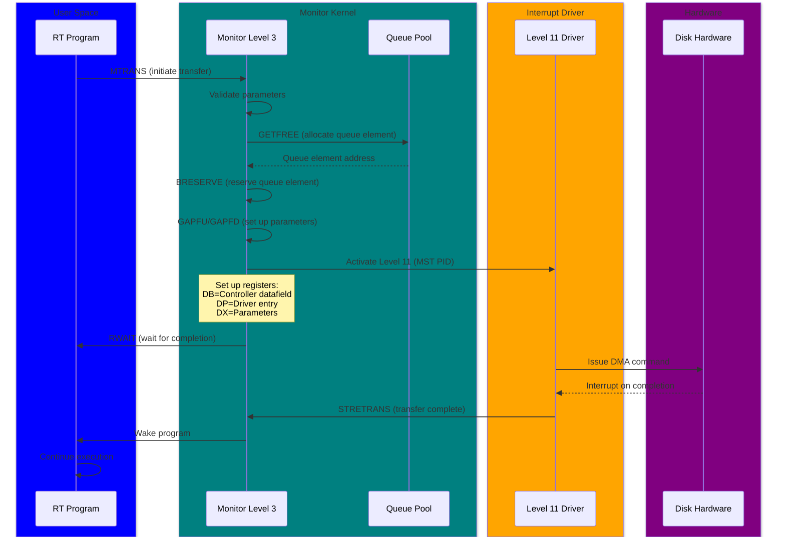

# Disk I/O Subsystem - Complete Architecture

**Version:** 1.0  
**Date:** 2025-10-17  
**Status:** Complete  
**Author:** AI Analysis of SINTRAN III Source Code

---

## Table of Contents

1. [Overview](#1-overview)
2. [Disk Controller Types](#2-disk-controller-types)
3. [Driver Architecture](#3-driver-architecture)
4. [Level 11 - Disk Interrupt Handler](#4-level-11---disk-interrupt-handler)
5. [Transfer Request Flow](#5-transfer-request-flow)
6. [Direct Transfer Mode (Modus 8/9)](#6-direct-transfer-mode-modus-89)
7. [Disk Logging and Performance Monitoring](#7-disk-logging-and-performance-monitoring)
8. [Queue Management](#8-queue-management)
9. [SCSI Subsystem](#9-scsi-subsystem)
10. [Error Handling and Recovery](#10-error-handling-and-recovery)
11. [C# Emulator Implementation](#11-c-emulator-implementation)

---

## 1. Overview

The **Disk I/O Subsystem** is SINTRAN's mass storage layer, responsible for:

- Reading/writing disk sectors
- Managing multiple disk controllers (ST-506, SMD, SCSI)
- Swapping page

s to/from disk
- File system block I/O
- DMA transfer coordination
- Error detection and recovery

### 1.1 Key Components

```
┌─────────────────────────────────────────────────────────┐
│  User Programs / File System                            │
│  - File read/write operations                           │
│  - Segment swapping requests                            │
└──────────────────────┬──────────────────────────────────┘
                       │ Monitor calls (MON 1, 2)
┌──────────────────────▼──────────────────────────────────┐
│  Monitor Level (Level 3)                                │
│  - MTRANS: Initiate transfer                            │
│  - STRNS: Start disk driver                             │
│  - Queue management                                      │
└──────────────────────┬──────────────────────────────────┘
                       │ Activate Level 11
┌──────────────────────▼──────────────────────────────────┐
│  Level 11: Disk Interrupt Handler                       │
│  - CTRDISK: Generic disk driver                         │
│  - CTRSCSI: SCSI driver                                 │
│  - Controller-specific logic                            │
└──────────────────────┬──────────────────────────────────┘
                       │ DMA transfer
┌──────────────────────▼──────────────────────────────────┐
│  Hardware Controllers                                   │
│  - ST-506 (Winchester)                                  │
│  - SMD (Storage Module Device)                          │
│  - SCSI (Small Computer System Interface)               │
└──────────────────────┬──────────────────────────────────┘
                       │ Physical I/O
┌──────────────────────▼──────────────────────────────────┐
│  Physical Disks                                         │
│  - 30MB Winchester                                      │
│  - 80MB/300MB SMD                                       │
│  - SCSI hard drives/tapes                               │
└─────────────────────────────────────────────────────────┘
```

### 1.2 Interrupt Levels

| Level | Purpose | Entry Point |
|-------|---------|-------------|
| **11** | Mass storage drivers | LV11B |
| **3** | Monitor (queue management) | MLEVB/SLEVB |
| **1** | RT programs (waiting for I/O) | ALEVB |

---

## 2. Disk Controller Types

### 2.1 Supported Controllers

From `PH-P2-OPPSTART.NPL`, lines 22-32:

```npl
INTEGER ARRAY MDISCS:=(
        0,    0,    0,    0,    0,    0,    0,    0,   % 00 - 07
    WWDIS,WWDIS,WWDIS,WWDIS,WWDIS,WWDIS,    0,BBDIS,   % 10 - 17
    BBDIS,BBDIS,BBDIS,BBDIS,BBDIS,BBDIS,BBDIS,BBDIS,   % 20 - 27
    BBDIS,BBDIS,BBDIS,BBDIS,BBDIS,BBDIS,SCDIS,    0,   % 30 - 37
        0,    0,    0,    0,    0,    0,    0,    0);  % 40 - 47

INTEGER ARRAY WWDIS:=(WIGDI,1224,ZWDIS,WIDIS,   500);  % ST-506
INTEGER ARRAY BBDIS:=(BIGDI,1100,ZBDIS,BDISK,  1540);  % SMD
INTEGER ARRAY SCDIS:=(SCDI1,2210,SCSWD,SCSWD,144300);  % SCSI
```

**MDISCS Table Format:**

| Offset | Field | Description |
|--------|-------|-------------|
| 0 | SWDDFIELD | Address of datafield |
| 1 | SWDLOGNO | Logical device number |
| 2 | SWDSWDRIVER | Boot-time swap driver address |
| 3 | SWDDRIVER | Runtime driver address |
| 4 | SWHDEV | Hardware device number |

#### ST-506 (Winchester) - WWDIS

**Characteristics:**
- **Datafield:** WIGDI (Winchester datafield)
- **Logical number:** 1224 (octal)
- **Swap driver:** ZWDIS (zero Winchester driver)
- **Runtime driver:** WIDIS (Winchester disk driver)
- **Hardware device:** 500 (octal)

**Typical capacity:** 5-30MB  
**Interface:** IDE-like parallel interface  
**Sectors per track:** 17  
**Heads:** 4  
**Cylinders:** ~600

#### SMD (Storage Module Device) - BBDIS

**Characteristics:**
- **Datafield:** BIGDI (Big disk datafield)
- **Logical number:** 1100 (octal)
- **Swap driver:** ZBDIS
- **Runtime driver:** BDISK
- **Hardware device:** 1540 (octal)

**Typical capacity:** 80MB, 300MB  
**Interface:** High-speed disk interface  
**Sectors per track:** 32-48  
**Heads:** 8-20  
**Cylinders:** 800-1200

#### SCSI (Small Computer System Interface) - SCDIS

**Characteristics:**
- **Datafield:** SCDI1
- **Logical number:** 2210 (octal)
- **Swap driver:** SCSWD (SCSI swap driver)
- **Runtime driver:** SCSWD (same for runtime)
- **Hardware device:** 144300 (octal)

**Typical capacity:** 40MB-2GB (depends on device)  
**Interface:** SCSI-1 (5 MB/s)  
**Devices:** Up to 7 per bus  
**Device types:** Hard disks, tape drives, optical drives

---

## 3. Driver Architecture

### 3.1 Driver Layers

```
┌──────────────────────────────────────┐
│  MTRANS (Monitor Transfer)           │
│  - Entry point from monitor level    │
│  - Validates parameters               │
│  - Calls STRNS                        │
└─────────────────┬────────────────────┘
                  │
┌─────────────────▼────────────────────┐
│  STRNS (Start Transfer)               │
│  - Allocates queue element            │
│  - Sets up DMA parameters             │
│  - Activates Level 11                 │
└─────────────────┬────────────────────┘
                  │
┌─────────────────▼────────────────────┐
│  Level 11: CTRDISK / CTRSCSI         │
│  - Controller-specific logic          │
│  - Issues hardware commands           │
│  - Handles interrupts                 │
└─────────────────┬────────────────────┘
                  │
┌─────────────────▼────────────────────┐
│  Hardware Controller                  │
│  - Executes DMA transfer              │
│  - Generates completion interrupt     │
└─────────────────┬────────────────────┘
                  │
┌─────────────────▼────────────────────┐
│  STRETRANS (Transfer Complete)        │
│  - Processes completion status        │
│  - Wakes waiting program              │
│  - Returns to monitor level           │
└───────────────────────────────────────┘
```

### 3.2 Datafield Structure

Each controller has a **datafield** containing:

```npl
DISP 0
    INTEGER HSTAT          % Hardware status
    INTEGER HDEV           % Hardware device number
    INTEGER MEMAD          % Memory address for DMA
    INTEGER DISKAD         % Disk address (cylinder/head/sector)
    INTEGER SECCNT         % Sector count
    INTEGER FUNCTION       % Function code (0=read, 1=write, ...)
    INTEGER RTRES          % Program owning this transfer
    INTEGER STPRW          % Program waiting for completion
    % ... controller-specific fields ...
PSID
```

**Key fields:**
- **HSTAT:** Hardware status (busy, error, completion)
- **RTRES:** RT program descriptor waiting for I/O
- **MEMAD:** Physical memory address for DMA
- **DISKAD:** Physical disk address

---

## 4. Level 11 - Disk Interrupt Handler

### 4.1 CTRDISK - Generic Disk Driver

From `IP-P2-DISK-START.NPL`, lines 21-63:

```npl
CTRDISK:
    A:=L=:"CTRLR"
    *"8MPRF
"       CALL DIALO                               % Monitor Performance sampling
    *"
"       X=:PARDF
    X.RTRES=:STPRW                            % SET PROG OWNING THIS ACCESS
    T:=X.ABFUN; AD:=X.MEMAD=:MEMAD
    IF A=0 AND D=0 THEN CALL ERRFATAL FI      % MEMORY ADDR ZERO IS ILLEGAL
    A/\3; A SH 14+T=:CTRG
    A SHZ -6/\7 SH 3\/CBLDA
    T:=M2UNTYP; *EXR SA
    IF K THEN
        CTRG BONE 16=:CTRG; 0=:CARG            % IF PHOENIX DISC
    ELSE
        CTRG/\7000 SHZ -11=:CARG
    FI
    IF CTRG/\77 >=60 AND A <=66 THEN   % CONVERT TO 0-4 FUNCK
         IF A = T THEN CTRG/\177701=:CTRG
         ELSE          CTRG/\177703=:CTRG FI
         X.ABPA2=:CADRG                                 % DOUBLE DISK ADDRESS
    ELSE IF A =43 OR A =44 THEN
         X.ABPA2=:CADRG                                 % DOUBLE DISK ADDRESS
    ELSE
         X.ABP21=:CDRG                                  % SINGLE DISK ADDRESS
    FI FI
    X.ABP31=:CXRG                                       % NO OF SECTORS
```

**Parameter extraction:**
1. **MEMAD:** Memory address for DMA (must be non-zero)
2. **ABFUN:** Function code (read/write/seek/etc.)
3. **ABPA2/ABP21:** Disk address (double or single word)
4. **ABP31:** Sector count

**CTRG Register encoding:**

```
Bits 0-5:   Function code (0-77 octal)
Bits 6-8:   Unit number (0-7)
Bit 9:      Reserved
Bits 10-15: Argument/flags
Bit 16:     Phoenix disk flag
```

### 4.2 Function Codes

| Code (Octal) | Function | Description |
|--------------|----------|-------------|
| 0 | READ | Read sectors from disk |
| 1 | WRITE | Write sectors to disk |
| 2 | READ PARITY | Read with parity check |
| 3 | COMPARE | Compare disk with memory |
| 4 | SEEK | Position heads (no transfer) |
| 36 | READ LAYOUT | Read disk layout table |
| 42 | READ FORMAT | Read format information |
| 43-44 | — | Extended addressing modes |
| 60-66 | — | Special functions |

### 4.3 Disk Address Encoding

**Single word address (older controllers):**
```
Bits 0-7:   Sector number (0-255)
Bits 8-11:  Head number (0-15)
Bits 12-15: Cylinder low bits
```

**Double word address (SMD, SCSI):**
```
Word 1 (high):
    Bits 0-15: Cylinder number (0-65535)
Word 2 (low):
    Bits 0-7:  Sector number
    Bits 8-15: Head number
```

---

## 5. Transfer Request Flow

### 5.1 Initiating a Transfer - STRNS

From `MP-P2-DISK-START.NPL`, lines 52-89:

```npl
STRNS:  A=:AREG; A:=B=:BREG
        T=:TREG:=L=:LREG; *IOF
        IF T=0 THEN
           X:=RTREF=:PROW; "QP100"=:B
           CALL GETFREE; GO FULL
        ELSE
          X:=RTRES=:PROW; "QP100"=:B
          CALL GETSWFREE; CALL ERRFATAL
        FI; *ION
        T=:B=:QDF; X:=PROW; CALL BRESERVE         % RESERVE QUE ELEMENT
        IF A<0 THEN CALL ERRFATAL FI
        T:=LREG=:"TRLREG"                         % RETURN ADDRESS ON MLEV
        0=:TYPCO; AREG
        IF T=0 THEN CALL GAPFU ELSE CALL GAPFD FI
% ---------------------------------- START LEV 11
        *IOF
        BREG;       *IRW LV11B DB                 % CONTROLLER
        A."STDRIV"; *IRW LV11B DP
        QDF;        *IRW LV11B DX                 % PARAMETERS
        LV11;       *MST PID
        X:=RTRES; CALL WDATA
        X.STATUS BONE 5NOABORT=:X.STATUS; *ION    % SET DELAYED ABORT
        IF X=RTREF GO RWAIT; GO MONEN
```

**Step-by-step flow:**



### 5.2 Completion - STRETRANS

From `MP-P2-DISK-START.NPL`, lines 91-100:

```npl
SUBR STRETRANS
%-------------------------------------------------------------------
% MONITOR LEVEL ROUTINE, ACTIVATED AFTER DRIVER IS FINISHED     ( M )
%
% X= CONTR. DF
%-------------------------------------------------------------------
% CACHE IS NOT CLEARED ON FUNC  1 & 61  (DMA OUTPUT)
%                               66      (DMA INPUT TO CACHE INHIBITED AREA)
%---------------------------------------------------------------------------
INTEGER PROW,CDF,SSTA
```

**Completion flow:**

1. **Check hardware status**
   - Read HSTAT from controller datafield
   - Check for errors (parity, timeout, seek error)

2. **Update statistics**
   - Increment transfer count
   - Record transfer time
   - Log errors if any

3. **Wake waiting program**
   - Retrieve RTRES (program descriptor)
   - Move from waiting queue to execution queue
   - Update program status

4. **Release queue element**
   - PUTFREE (return queue element to pool)

5. **Check for queued requests**
   - If more requests pending, start next transfer
   - Otherwise, idle Level 11

---

## 6. Direct Transfer Mode (Modus 8/9)

### 6.1 Overview

**Direct Transfer Mode** bypasses the file system buffer cache, allowing programs to transfer data directly between disk and program memory.

**Advantages:**
- **Higher throughput:** No buffer copying
- **Lower latency:** Direct to program memory
- **More concurrent files:** Fewer system buffers needed
- **Predictable performance:** No cache effects

**Disadvantages:**
- **More complex programming:** Program handles block management
- **Fixed memory buffers:** Must be in contiguous physical memory
- **No file structure:** Program manages disk layout

### 6.2 Opening Files in Direct Transfer Mode

**From monitor call documentation:**

```npl
% Open file with direct transfer
% Modus 8: Direct input
% Modus 9: Direct output

A:=file_name_address
D:=8    % Direct input mode
*MON OPEN
JMP error

% File now open for direct transfer
% Program must manage:
% - Block numbers
% - Buffer addresses
% - Transfer sizes
```

### 6.3 Direct Transfer Constraints

1. **Buffer fixed in memory:**
   - Monitor fixes buffer pages contiguously
   - Buffer cannot be swapped out
   - Released when file closed

2. **Block size restrictions:**
   - Typically 1024 bytes (1 page)
   - Must align with disk sectors
   - Program specifies block numbers, not byte offsets

3. **No file system overhead:**
   - No directory updates during transfer
   - No automatic buffer management
   - Program responsible for consistency

4. **Use cases:**
   - Database systems
   - High-performance I/O
   - Real-time applications
   - Large sequential transfers

---

## 7. Disk Logging and Performance Monitoring

### 7.1 Disk Access Logging (DILG)

From `IP-P2-DISK-START.NPL`, lines 63-99:

```npl
*"8DILG
"       IF "DFDIL".DILGFLAG BIT DILCOUNT THEN
           IF A BIT DAC1CONTROLLER AND B><X.DLALOGDV GO L1       % DON'T COUNT THIS CONTROLLER
           IF A BIT DAC1UNIT AND CTRG SHZ -6/\7><X.DLAUNIT GO L1 % DON'T COUNT THIS UNIT
           *MIN 2XNDA,X; SKP; MIN 1XNDA,X; JMP * 1          % COUNT DISC ACCESSES
           IF CTRG/\77=1 THEN                               % COUNT WRITE ACCESSES
              *MIN 2XNWD,X; SKP; MIN 1XNWD,X; JMP *+1
           FI
        FI; GO L1; *)FILL
L1:    IF X.DILGFLAG BIT DILSTART AND A BIT DILBOK THEN    % DISC LOG STARTED?
           A=:D; X:="DIDLOG"
           DO WHILE X.S0><-1                                % FIND LOGICAL UNIT
              IF A=B GO LGFOUND
              X+2
           OD; GO NOTLOG
INTEGER CLUN
LGFOUND:  X.S1=:CLUN; X:="DFDIL"                           % LOGICAL UNIT OF DISC
           IF A:=D/\37=0 GO DOLOG                           % LOG EVERY ACCESS
           IF D BIT DIL1CONTROLLER THEN                     % LOG ONLY ONE CONTROLLER?
              IF X.DLLOGDV><CLUN GO NOTLOG                  % YES, IS IT THIS CONTROLLER?
           FI
           IF D BIT DIL1UNIT THEN                           % LOG ONLY ONE UNIT?
              IF CTRG SHZ -6/\7><X.DLDRIVE GO NOTLOG        % YES, IS IT THIS UNIT?
           FI
           IF D BIT DILWACCESS THEN                         % LOG ONLY WRITE ACCESSES?
              IF CTRG/\77><1 GO NOTLOG
           FI
           IF D BIT DILRACCESS THEN                         % LOG ONLY READ ACCESSES?
              IF CTRG/\77><0 GO NOTLOG
           FI
```

**Logging capabilities:**

| Feature | Flag | Description |
|---------|------|-------------|
| **DILCOUNT** | Count accesses | Increment access counters |
| **DILSTART** | Log started | Enable detailed logging |
| **DIL1CONTROLLER** | Single controller | Log only one controller |
| **DIL1UNIT** | Single unit | Log only one drive |
| **DILWACCESS** | Write only | Log only write operations |
| **DILRACCESS** | Read only | Log only read operations |
| **DILLIMIT** | Address range | Log only specific disk addresses |

**Statistics collected:**
- **2XNDA/1XNDA:** Total disk accesses (double counter)
- **2XNWD/1XNWD:** Write accesses
- Per-controller, per-unit breakdowns

### 7.2 Performance Sampling (8MPRF)

```npl
*"8MPRF
"       CALL DIALO                               % Monitor Performance sampling
*"
```

**If performance monitoring enabled:**
- Records entry time
- Samples CPU usage
- Tracks I/O wait time
- Updates performance tables

**Metrics:**
- Disk busy percentage
- Average seek time
- Transfer rate
- Queue depth

---

## 8. Queue Management

### 8.1 Queue Pool Structure

**Queue pool datafield (QP100):**

```npl
DISP 0
    INTEGER QPFNO       % Number of free queue elements
    INTEGER QPFRH       % Free queue head
    INTEGER QPFSW       % Free swapper queue
    % ... queue elements follow ...
PSID
```

**Queue element structure:**

```npl
DISP 0
    INTEGER RTRES       % Program owning this request
    INTEGER MEMAD       % Memory address
    INTEGER DISKAD      % Disk address
    INTEGER SECCNT      % Sector count
    INTEGER FUNCTION    % Function code
    INTEGER TYPRING     % Type and ring
    % ... more fields ...
PSID
```

### 8.2 GETFREE - Allocate Queue Element

From `MP-P2-DISK-START.NPL`, lines 19-32:

```npl
GETFREE:
    A:=L=:"LREG"
    IF QPFNO  = 0  THEN                      % NO MORE FREE QUE ELEMENTS
       X=:SAVX; X:="DUMMY"; CALL BRESERVE
       X:=SAVX; GO LREG
    FI
    QPFNO-1=:QPFNO                           % UPDATE FREE QUE ELEMENTS
    X:=B; *AAX QPFRH
LSW:   CALL GETOUT                              % GET QUE ELEMENT
    IF T.RTRES >< 0 THEN CALL ERRFATAL; FI
    0=:X.TYPRING               % DUE TO DOUBLE USE
    "LREG"=:L; EXITA
```

**Flow:**
1. Check if queue empty (`QPFNO = 0`)
2. If empty, call BRESERVE to allocate more memory
3. Decrement free count
4. Get queue element from free list
5. Validate element (RTRES must be 0)
6. Clear TYPRING field
7. Return element address in T

### 8.3 PUTFREE - Release Queue Element

```npl
PUTFREE:
    A:=L=:"LREG"
    IF SAQEL= T THEN     % SWAPPER ELEMENT
      X:=B; *AAX QPFSW
    ELSE
      IF RTRES >< 0 THEN CALL ERRFATAL FI
      X:=B; *AAX QPFRH
      MIN QPFNO; A /\ A
    FI
    CALL PUTIN
    GO LREG
```

**Flow:**
1. Check if swapper queue element
2. Add to appropriate free list (QPFSW or QPFRH)
3. Increment free count
4. Validate element (RTRES must be 0)

---

## 9. SCSI Subsystem

### 9.1 SCSI Architecture

From `IP-P2-SCSI-DISK.NPL`:

```npl
% LEVEL 11 ROUTINE TO PERFORM TRANSFERS ON SCSI CONTROLLERS
% ACTIVATED WITH B=DATAFIELD, X=ABSTR PAR.LIST
%
% FUNCTIONS
%
%        0: READ
%        1: WRITE
%        2: READ PARITY
%        3: COMPARE
%        4: SEEK
%        5: READ BACKWARDS
%        6: RESERVE DEVICE
%       10: ADVANCE THROUGH EOF
%       11: REVERSE THROUGH EOF
%       12: WRITE EOF
%       13: REWIND
%       14: WRITE SKIP
%       15: REVERSE RECORDS
%       16: ADVANCE RECORDS
%       17: UNLOAD
%       41: FORMAT
%       21: CLEAR SCSI BUS
%       26: READ BYTE RECORD
%       27: WRITE BYTE RECORD
%       30: LOAD
%       35: RELEASE DEVICE
%       37: READ EXTENDED STATUS
%       42: INQUIRY AND READ CAPACITY
%       46: READ CURRENT ADDRESS
%       47: WRITE CURRENT ADDRESS
%       54: COPY
%       70: RETENSION
%       71: WRITE AND VERIFY
%       73: TEST UNIT READY
%       74: EXECUTE USER SPECIFIED SCSI COMMAND BLOCK
%       75: INQUIRY (READ DEVICE TYPE)
%       76: ADVANCE TO END OF RECORDED AREA
```

### 9.2 SCSI Device Addressing

**SCSI address encoding:**
```
Bits 0-2:   LUN (Logical Unit Number, 0-7)
Bits 3-5:   SCSI device number (0-7)
Bits 6-15:  Function code and flags
```

**From CTRSCSI:**

```npl
CTRSCSI:
    IF 77/\X.ABFUN=21 GO FAR CLSCB       % CLEAR SCSI BUS
    X.ABFUN=:ABFUN; X.MEMAD=:MEMAD       %
    X.ABPA2=:ABPA2; X.ABPA3=:ABPA3
    ABFUN SHZ -6; T:=7/\A; A SHZ -3/\7   % LUN AND SCSI DEVICE NUMBER
    X:=B; CALL SCGLB; GO ERREX           % LUN DATAFIELD
```

### 9.3 SCSI Queue Management

**SCSI has a separate queue system:**

```npl
SWT11: IF X:=SCFQP><0 THEN
          X.SCULI=:SCFQP; 0=:X.SCULI        % LINK OUT OF QUEUE
          A:=X.SCUDF=:B                     % SCSI LUN DATAFIELD
          X.HSTAT; T:=X.SCTRG
          X=:L:=X."FINISH":=:L; EXIT        % RETURN TO EXTERNAL DRIVER
       FI
       IF SCRSQ><0 THEN
          X:="SCRSQ-SCRSL"
          DO WHILE A=:B:=SCRSL><0; X:=B OD  % GET END OF QUEUE
          0=:X.SCRSL; GO SCTIO
       FI
       GO WT11
```

**SCSI queue fields:**
- **SCFQP:** Front of queue pointer
- **SCULI:** Queue link
- **SCUDF:** Unit datafield
- **SCRSQ:** Reservation queue
- **SCRSL:** Reservation link

### 9.4 SCSI Command Block Execution

**Function 74: Execute user SCSI command:**

- User provides complete SCSI CDB (Command Descriptor Block)
- Driver passes CDB directly to SCSI controller
- Allows custom/vendor-specific commands
- Used for advanced features (caching, diagnostics)

---

## 10. Error Handling and Recovery

### 10.1 Error Detection

**Hardware errors:**
- **Parity errors:** Data corruption during transfer
- **Seek errors:** Unable to position heads
- **Timeout errors:** Device not responding
- **Controller errors:** Hardware malfunction

**Software errors:**
- **Invalid parameters:** Illegal disk address, sector count
- **Queue exhaustion:** No free queue elements
- **Memory errors:** Invalid DMA address

### 10.2 Error Reporting

**Error flow:**

1. **Hardware interrupt with error status**
2. **Level 11 reads HSTAT**
3. **If error, log to system error device**
4. **Set error code in queue element**
5. **Wake waiting program with error**
6. **Program checks return code**

**Error codes (examples):**
- **1:** Parity error
- **2:** Seek error
- **3:** Timeout
- **4:** Write protect
- **5:** Drive not ready

### 10.3 Retry Logic

**Automatic retries:**

```npl
IF ERROR THEN
    RETRY_COUNT+1
    IF RETRY_COUNT < MAX_RETRIES THEN
        % Wait brief delay
        % Re-issue command
        GO RETRY
    FI
    % Max retries exceeded, report error
    GO REPORT_ERROR
FI
```

**Retry strategies:**
- **Read errors:** Retry up to 3 times
- **Write errors:** Retry up to 5 times (more conservative)
- **Seek errors:** Re-seek, then retry
- **Timeout:** Reset controller, then retry

### 10.4 Bad Block Management

**Handling bad blocks:**

1. **Detection:**
   - Parity error on read
   - Write verify fails

2. **Mapping:**
   - SINTRAN maintains bad block table
   - Maps logical blocks to alternate physical blocks
   - Table stored in reserved disk area

3. **Recovery:**
   - Read alternate block
   - Update bad block table if new error
   - Notify system administrator

---

## 11. C# Emulator Implementation

### 11.1 Disk Subsystem Class Structure

```csharp
namespace RetroCore.Emulated.SINTRAN.DiskIO
{
    /// <summary>
    /// Main disk I/O subsystem coordinator
    /// </summary>
    public class DiskIOSubsystem
    {
        private readonly SINTRANKernel _kernel;
        private readonly Dictionary<ushort, DiskController> _controllers;
        private readonly QueuePool _queuePool;
        private readonly DiskLogger _logger;
        
        // Statistics
        public long TotalReads { get; private set; }
        public long TotalWrites { get; private set; }
        public long TotalErrors { get; private set; }
        
        public DiskIOSubsystem(SINTRANKernel kernel)
        {
            _kernel = kernel;
            _controllers = new Dictionary<ushort, DiskController>();
            _queuePool = new QueuePool(100); // 100 queue elements
            _logger = new DiskLogger();
        }
        
        /// <summary>
        /// Initialize disk controllers from MDISCS table
        /// </summary>
        public void Initialize()
        {
            // Read MDISCS table from memory
            ushort mdiscsAddr = _kernel.Memory.GetSymbolAddress("MDISCS");
            
            for (int i = 0; i < 48; i++)
            {
                ushort entryAddr = (ushort)(mdiscsAddr + i);
                ushort ctrlDescAddr = _kernel.Memory.ReadWord(entryAddr);
                
                if (ctrlDescAddr == 0)
                    continue; // Empty slot
                    
                // Read controller descriptor
                var desc = ReadControllerDescriptor(ctrlDescAddr);
                
                // Create appropriate controller type
                DiskController controller = desc.Type switch
                {
                    ControllerType.ST506 => new ST506Controller(desc),
                    ControllerType.SMD => new SMDController(desc),
                    ControllerType.SCSI => new SCSIController(desc),
                    _ => throw new NotSupportedException($"Unknown controller type: {desc.Type}")
                };
                
                _controllers[desc.LogicalNumber] = controller;
            }
        }
        
        /// <summary>
        /// MTRANS - Monitor transfer entry point
        /// </summary>
        public void MTRANS(ushort controllerDatafield, ushort paramListAddr)
        {
            // Called from monitor level (level 3)
            // Validates parameters and calls STRNS
            
            var controller = GetController(controllerDatafield);
            if (controller == null)
            {
                _kernel.ErrorHandler.LogError(999, "Invalid controller datafield");
                return;
            }
            
            // Read parameter list
            var @params = ReadParameterList(paramListAddr);
            
            // Validate parameters
            if (!ValidateParameters(@params))
            {
                _kernel.ErrorHandler.LogError(999, "Invalid disk I/O parameters");
                return;
            }
            
            // Call STRNS to start transfer
            STRNS(controller, @params);
        }
        
        /// <summary>
        /// STRNS - Start transfer (allocate queue, activate Level 11)
        /// </summary>
        private void STRNS(DiskController controller, DiskIOParameters @params)
        {
            // Allocate queue element
            var queueElement = _queuePool.Allocate();
            if (queueElement == null)
            {
                // Queue full - wait or error
                _kernel.ErrorHandler.LogError(999, "Disk queue full");
                return;
            }
            
            // Fill queue element
            queueElement.RTRES = _kernel.CPU.RTREF;
            queueElement.MEMAD = @params.MemoryAddress;
            queueElement.DISKAD = @params.DiskAddress;
            queueElement.SECCNT = @params.SectorCount;
            queueElement.FUNCTION = @params.Function;
            
            // Reserve queue element
            _kernel.Memory.ReserveBlock(queueElement.Address);
            
            // Set up Level 11 registers
            _kernel.CPU.WriteRegister(11, CPURegister.B, controller.DatafieldAddress);
            _kernel.CPU.WriteRegister(11, CPURegister.P, controller.DriverEntryPoint);
            _kernel.CPU.WriteRegister(11, CPURegister.X, queueElement.Address);
            
            // Activate Level 11
            _kernel.CPU.PID |= (1 << 11);
            _kernel.CPU.TriggerInterrupt(11);
            
            // Wait for completion
            _kernel.Scheduler.WaitForIO(_kernel.CPU.RTREF);
        }
        
        /// <summary>
        /// Level 11 entry point - CTRDISK / CTRSCSI
        /// </summary>
        public void Level11Entry()
        {
            // Read registers set by STRNS
            ushort datafieldAddr = _kernel.CPU.B;
            ushort queueElementAddr = _kernel.CPU.X;
            
            var controller = GetController(datafieldAddr);
            var queueElement = _queuePool.GetElement(queueElementAddr);
            
            // Dispatch to controller-specific handler
            switch (controller.Type)
            {
                case ControllerType.ST506:
                case ControllerType.SMD:
                    CTRDISK(controller, queueElement);
                    break;
                case ControllerType.SCSI:
                    CTRSCSI((SCSIController)controller, queueElement);
                    break;
            }
        }
        
        /// <summary>
        /// CTRDISK - Generic disk driver
        /// </summary>
        private void CTRDISK(DiskController controller, QueueElement queue)
        {
            // Performance monitoring
            if (_kernel.Config.PerformanceMonitoringEnabled)
            {
                _logger.RecordStart(controller.LogicalNumber, queue.FUNCTION);
            }
            
            // Extract parameters
            var function = (DiskFunction)(queue.FUNCTION & 0x3F);
            var unit = (queue.FUNCTION >> 6) & 0x07;
            
            // Issue command to hardware
            try
            {
                switch (function)
                {
                    case DiskFunction.Read:
                        TotalReads++;
                        controller.Read(unit, queue.DISKAD, queue.MEMAD, queue.SECCNT);
                        break;
                    case DiskFunction.Write:
                        TotalWrites++;
                        controller.Write(unit, queue.DISKAD, queue.MEMAD, queue.SECCNT);
                        break;
                    case DiskFunction.Seek:
                        controller.Seek(unit, queue.DISKAD);
                        break;
                    default:
                        throw new NotImplementedException($"Function {function} not implemented");
                }
                
                // Success - set status
                queue.STATUS = 0;
            }
            catch (DiskIOException ex)
            {
                // Error - set error code
                TotalErrors++;
                queue.STATUS = ex.ErrorCode;
                _kernel.ErrorHandler.LogError((ushort)ex.ErrorCode, ex.Message);
            }
            
            // Call STRETRANS to complete
            STRETRANS(controller, queue);
        }
        
        /// <summary>
        /// CTRSCSI - SCSI driver
        /// </summary>
        private void CTRSCSI(SCSIController controller, QueueElement queue)
        {
            // Extract SCSI-specific parameters
            var function = queue.FUNCTION & 0x7F;
            var lun = (queue.FUNCTION >> 6) & 0x07;
            var deviceNo = (queue.FUNCTION >> 9) & 0x07;
            
            // Get SCSI device
            var device = controller.GetDevice(deviceNo, lun);
            if (device == null)
            {
                queue.STATUS = (ushort)SCSIError.NoDevice;
                STRETRANS(controller, queue);
                return;
            }
            
            // Dispatch SCSI function
            try
            {
                device.ExecuteCommand(function, queue);
                queue.STATUS = 0;
            }
            catch (SCSIException ex)
            {
                queue.STATUS = ex.ErrorCode;
                _kernel.ErrorHandler.LogError(ex.ErrorCode, ex.Message);
            }
            
            STRETRANS(controller, queue);
        }
        
        /// <summary>
        /// STRETRANS - Transfer complete, wake waiting program
        /// </summary>
        private void STRETRANS(DiskController controller, QueueElement queue)
        {
            // Performance logging
            if (_kernel.Config.PerformanceMonitoringEnabled)
            {
                _logger.RecordComplete(controller.LogicalNumber, queue.FUNCTION, queue.STATUS);
            }
            
            // Wake waiting program
            ushort rtref = queue.RTRES;
            _kernel.Scheduler.WakeFromIO(rtref);
            
            // Release queue element
            _queuePool.Release(queue);
            
            // Check for more queued requests
            if (_queuePool.HasPending())
            {
                // Start next transfer
                var nextQueue = _queuePool.GetNext();
                Level11Entry();
            }
        }
    }
    
    /// <summary>
    /// Disk controller base class
    /// </summary>
    public abstract class DiskController
    {
        public ControllerType Type { get; protected set; }
        public ushort DatafieldAddress { get; protected set; }
        public ushort LogicalNumber { get; protected set; }
        public ushort DriverEntryPoint { get; protected set; }
        public ushort HardwareDeviceNumber { get; protected set; }
        
        public abstract void Read(byte unit, uint diskAddress, ushort memoryAddress, ushort sectorCount);
        public abstract void Write(byte unit, uint diskAddress, ushort memoryAddress, ushort sectorCount);
        public abstract void Seek(byte unit, uint diskAddress);
    }
    
    /// <summary>
    /// Queue element
    /// </summary>
    public class QueueElement
    {
        public ushort Address { get; set; }
        public ushort RTRES { get; set; }       // Program owning request
        public ushort MEMAD { get; set; }       // Memory address
        public uint DISKAD { get; set; }        // Disk address
        public ushort SECCNT { get; set; }      // Sector count
        public ushort FUNCTION { get; set; }    // Function code
        public ushort STATUS { get; set; }      // Completion status
    }
    
    /// <summary>
    /// Queue pool management
    /// </summary>
    public class QueuePool
    {
        private readonly Queue<QueueElement> _freeQueue;
        private readonly Dictionary<ushort, QueueElement> _activeElements;
        private int _totalElements;
        
        public QueuePool(int capacity)
        {
            _freeQueue = new Queue<QueueElement>(capacity);
            _activeElements = new Dictionary<ushort, QueueElement>();
            _totalElements = capacity;
            
            // Initialize free queue
            for (ushort i = 0; i < capacity; i++)
            {
                _freeQueue.Enqueue(new QueueElement { Address = (ushort)(0x1000 + i * 16) });
            }
        }
        
        public QueueElement Allocate()
        {
            if (_freeQueue.Count == 0)
                return null;
                
            var element = _freeQueue.Dequeue();
            _activeElements[element.Address] = element;
            return element;
        }
        
        public void Release(QueueElement element)
        {
            _activeElements.Remove(element.Address);
            element.RTRES = 0; // Clear ownership
            _freeQueue.Enqueue(element);
        }
        
        public QueueElement GetElement(ushort address)
        {
            return _activeElements.TryGetValue(address, out var element) ? element : null;
        }
        
        public bool HasPending()
        {
            return _freeQueue.Count < _totalElements;
        }
        
        public QueueElement GetNext()
        {
            return _activeElements.Values.FirstOrDefault();
        }
    }
    
    public enum ControllerType
    {
        ST506,
        SMD,
        SCSI
    }
    
    public enum DiskFunction
    {
        Read = 0,
        Write = 1,
        ReadParity = 2,
        Compare = 3,
        Seek = 4,
        ReadBackwards = 5,
        ReserveDevice = 6
    }
}
```

---

## Appendix A: Disk Function Reference

### Complete Function Code List

| Code | Function | ST-506 | SMD | SCSI | Description |
|------|----------|--------|-----|------|-------------|
| 0 | READ | ✓ | ✓ | ✓ | Read sectors |
| 1 | WRITE | ✓ | ✓ | ✓ | Write sectors |
| 2 | READ PARITY | ✓ | ✓ | ✗ | Read with parity check |
| 3 | COMPARE | ✓ | ✓ | ✓ | Compare disk to memory |
| 4 | SEEK | ✓ | ✓ | ✓ | Position heads |
| 5 | READ BACKWARDS | ✗ | ✗ | ✓ | Tape: read backwards |
| 6 | RESERVE DEVICE | ✗ | ✗ | ✓ | Reserve SCSI device |
| 10-17 | — | ✗ | ✗ | ✓ | SCSI tape operations |
| 21 | CLEAR SCSI BUS | ✗ | ✗ | ✓ | Reset SCSI bus |
| 36 | READ LAYOUT | ✓ | ✓ | ✗ | Read disk layout table |
| 37 | READ STATUS | ✗ | ✗ | ✓ | Read extended status |
| 42 | INQUIRY | ✗ | ✗ | ✓ | SCSI inquiry command |
| 73 | TEST UNIT READY | ✗ | ✗ | ✓ | Check if device ready |
| 74 | EXECUTE CDB | ✗ | ✗ | ✓ | Execute custom SCSI command |
| 75 | INQUIRY TYPE | ✗ | ✗ | ✓ | Read device type |

---

## Appendix B: Related Documentation

- **Chapter 13:** INT 14 Handler
- **Chapter 14:** Monitor Kernel and MONCALLS
- **Chapter 16:** Page Fault Handler (disk swapping)
- **Chapter 17:** Scheduler (I/O wait queues)
- **Chapter 01:** Boot Sequence (disk initialization)

---

**End of Document**

