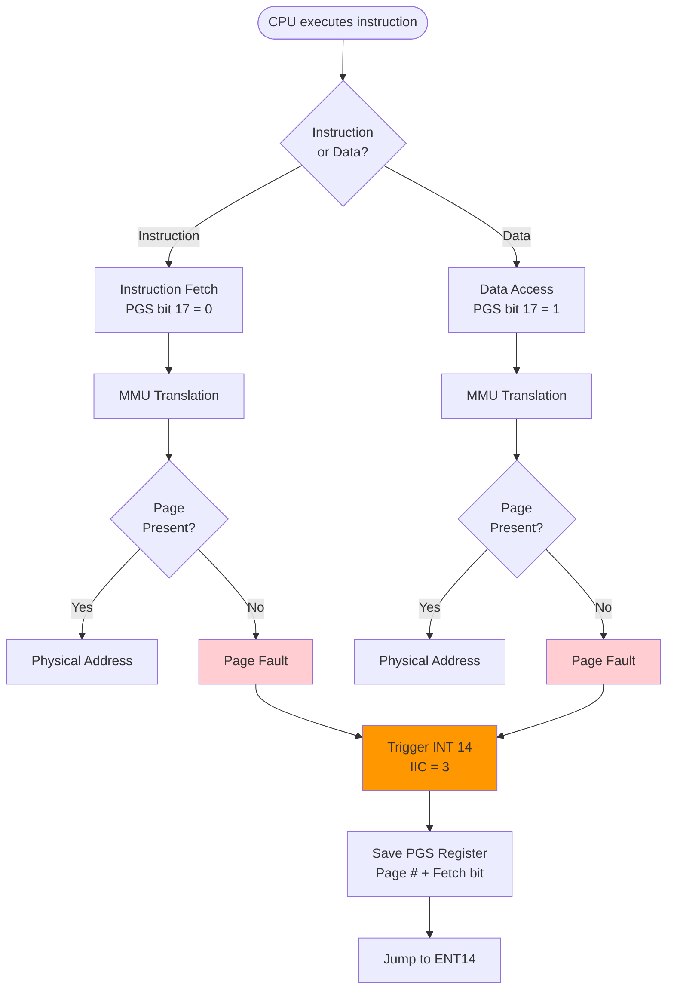
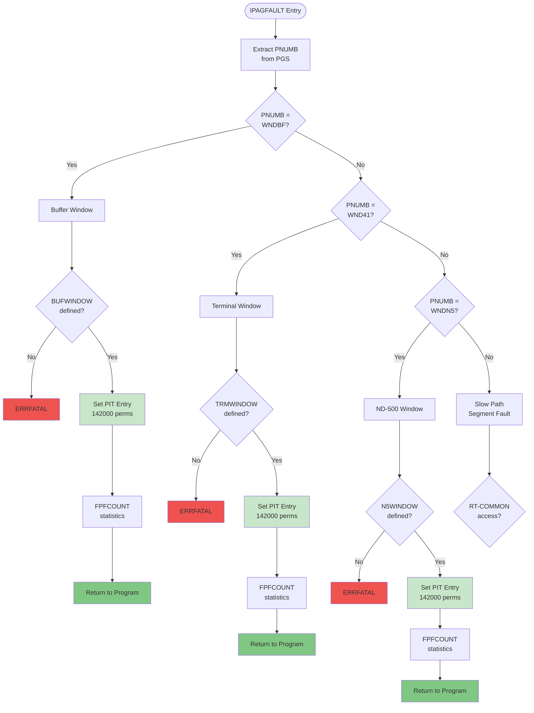
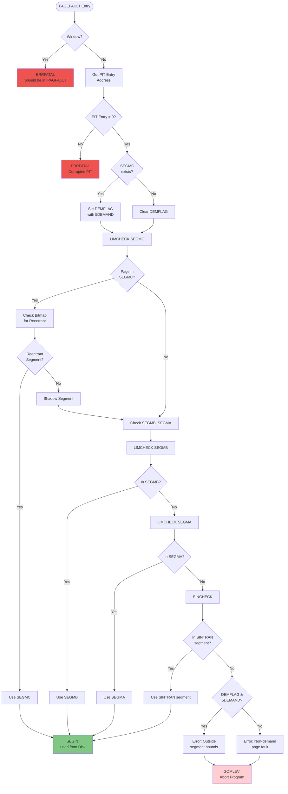
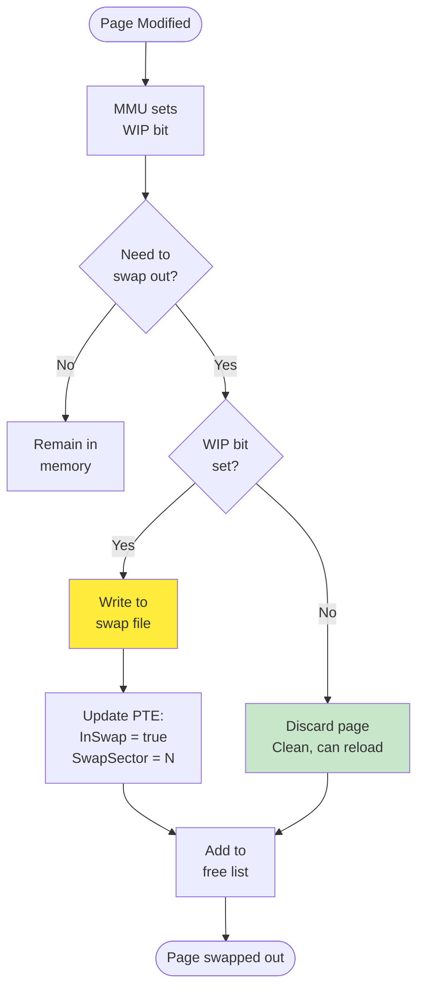
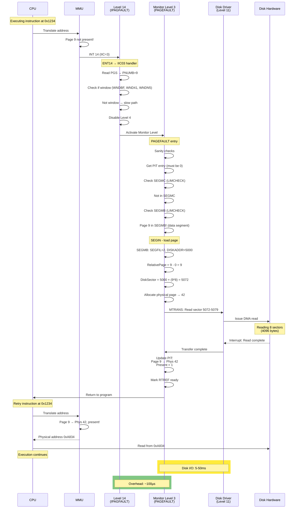

# Page Fault Handler - Complete Virtual Memory Flow

**Version:** 1.0  
**Date:** 2025-10-17  
**Status:** Complete  
**Author:** AI Analysis of SINTRAN III Source Code

---

## Table of Contents

1. [Overview](#1-overview)
2. [Page Fault Trigger and Detection](#2-page-fault-trigger-and-detection)
3. [Level 14 - IPAGFAULT Entry Point](#3-level-14---ipagfault-entry-point)
4. [Window Page Faults (Fast Path)](#4-window-page-faults-fast-path)
5. [Monitor Level - PAGEFAULT Handler](#5-monitor-level---pagefault-handler)
6. [Segment Identification - LIMCHECK](#6-segment-identification---limcheck)
7. [Reentrant Segment Handling](#7-reentrant-segment-handling)
8. [Loading Pages from Disk - SEGIN](#8-loading-pages-from-disk---segin)
9. [SEGFIL and Disk Block Mapping](#9-segfil-and-disk-block-mapping)
10. [Complete Page Fault Flow](#10-complete-page-fault-flow)
11. [Performance and Statistics](#11-performance-and-statistics)
12. [C# Emulator Implementation](#12-c-emulator-implementation)

---

## 1. Overview

The **Page Fault Handler** is SINTRAN's demand paging system, loading pages into memory only when accessed. This enables:

- **Virtual memory:** Programs larger than physical RAM
- **Efficient memory use:** Only active pages loaded
- **Multi-programming:** More programs in memory
- **Segment isolation:** Program crashes don't affect others

### 1.1 Page Fault Sources

```
CPU executes instruction
    ↓
MMU translates address
    ↓
Check page table entry
    ↓
┌───────────────────┐
│ Present bit = 0?  │ ← Page not in memory
└─────────┬─────────┘
          │ YES → Page Fault!
          ↓
Generate INT 14 (IIC=3)
```

**Causes:**
- **Demand page not loaded:** First access to page
- **Swapped out page:** Page moved to disk due to memory pressure
- **Window access:** Special memory windows (buffers, terminals)
- **RT-COMMON access:** Shared memory between RT programs

### 1.2 Page Fault Types

| Type | Description | Handler | Speed |
|------|-------------|---------|-------|
| **Window** | Access to window page (WNDBF, WND41, WNDN5) | IPAGFAULT | Fast (Level 14) |
| **RT-COMMON** | Access to RT-COMMON area | IPAGFAULT | Fast (Level 14) |
| **Segment** | Access to program segment page | PAGEFAULT | Slow (Monitor + Disk I/O) |
| **Shadow** | Access to shadow segment (SEGMA, SEGMB) | PAGEFAULT | Slow (Monitor + Disk I/O) |
| **SINTRAN** | Access to SINTRAN system segment | SINCHECK | Slow (rare, system page) |

---

## 2. Page Fault Trigger and Detection

### 2.1 Hardware Flow



### 2.2 PGS Register Format

**Page Status Register (PGS):**

```
Bits 0-9:   PNUMB (page number 0-1023)
            Logical page that caused fault
            
Bit 16:     Write bit
            1 = write access
            0 = read access
            
Bit 17:     Fetch bit
            0 = instruction fetch (code)
            1 = data access (read/write data)
```

**Example:**
```
PGS = 0x00245  → Page 37₁₀, data access (bit 17=1), read (bit 16=0)
PGS = 0x00012  → Page 18₁₀, instruction fetch (bit 17=0)
```

### 2.3 Instruction Restart Logic

**Critical decision: Should we restart the instruction?**

```npl
IF A=:PNUMB NBIT 17 THEN                 % Bit 17=0 → instruction fetch
   *IRR ALEVB DP; AAA -1; IRW ALEVB DP   % Decrement P-REG to restart
FI
```

**Logic:**
- **Instruction fetch fault (bit 17=0):**
  - PC already points to faulting instruction
  - **DO NOT** decrement PC
  - After loading page, retry instruction fetch
  
- **Data access fault (bit 17=1):**
  - Instruction partially executed, then faulted
  - **DECREMENT** PC by 1
  - After loading page, re-execute entire instruction

---

## 3. Level 14 - IPAGFAULT Entry Point

### 3.1 Entry Sequence

From `MP-P2-2.NPL`, lines 283-336:

```npl
IPAGFAULT: PNUMB/\1777=:PNUMB                    % PNUMB=LOGICAL PAGE CAUSING PAGEFAULT
```

**Step 1: Extract page number**
- Mask page number from PGS
- Range: 0-1023 (10 bits)
- Store in global variable `PNUMB`

### 3.2 Fast Path - Window Checks



### 3.3 Window Page Fault Handling

**WNDBF - Buffer Window:**

```npl
IF A=X:=WNDBF THEN                        % PF IN BUFFER WINDOW?
   IF RTREF.BUFWINDOW =0 THEN CALL ERRFATAL FI % BUFFER WINDOW DEFINED?
   A=:D:=142000                           % READ+WRITE+RING2
   X:="WNDBF+WNDBF+174000"; T:=0; *STDTX  % YES SET PIT ENTRY
   CALL FPFCOUNT                          % COUNT PAGEFAULT
   GO RET14                               % LEAVE LEVEL 14
FI
```

**Permission bits (142000):**

```
Octal 142000:
    Bit 15 (WPM):  1 = Write permit
    Bit 14 (RPM):  1 = Read permit
    Bit 13:        Ring = 2
    Physical page: 0 (from BUFWINDOW field)
```

**Why fast?**
- No disk I/O required
- Just update PIT entry with pre-allocated physical page
- Window physical page already in memory
- Total time: ~20 instructions (~10-20 µs)

**WND41 - Terminal Window:**
- Same logic as WNDBF
- Used for terminal I/O buffers
- Physical page from `RTREF.TRMWINDOW`

**WNDN5 - ND-500 Window:**
- ND-500 shared memory window
- Physical page from `RTREF.N5WINDOW`
- Allows ND-500 processes to access 5MPM

---

## 4. Window Page Faults (Fast Path)

### 4.1 Window Purpose

**Windows** are special pages that provide temporary access to system buffers without permanent PIT entries.

```
Program's logical address space:
┌─────────────────────────────────┐
│ 0x0000 - 0x3FFF:  Program code  │
│ 0x4000 - 0x7FFF:  Program data  │
│ 0x8000 - 0xBFFF:  Stack         │
│ 0xC000 - 0xCFFF:  WNDBF (window)│ ← Page fault here
│ 0xD000 - 0xDFFF:  WND41 (window)│
│ 0xE000 - 0xEFFF:  WNDN5 (window)│
│ 0xF000 - 0xFFFF:  (unused)      │
└─────────────────────────────────┘
```

**Window usage pattern:**

```npl
% Program requests buffer window
*MON GETBUF     % Allocate buffer, set BUFWINDOW field
% → BUFWINDOW = physical page 42

% Program accesses WNDBF
A:=(WNDBF      % Access window page (e.g., 0xC000)
% → Page fault (present bit = 0)

% IPAGFAULT:
% - Checks PNUMB = WNDBF
% - Reads RTREF.BUFWINDOW (physical page 42)
% - Sets PIT[WNDBF] = 42, permissions 142000
% - Returns to program

% Program continues
A:=(WNDBF      % Now succeeds, accesses physical page 42
*STA ,A DATA   % Write data to buffer

% Program releases buffer
*MON RELBUF    % Clear BUFWINDOW field, invalidate PIT entry
```

### 4.2 Window Advantages

**Without windows:**
- Each buffer needs permanent PIT entry
- 64 PIT entries total
- Only ~40 available for user program
- Limits number of concurrent buffers

**With windows:**
- Only 3-5 window pages in PIT
- Unlimited buffers (physical pages)
- Window dynamically maps to current buffer
- More PIT entries for program pages

### 4.3 Window Page Statistics

From `MP-P2-2.NPL`:

```npl
*"8SWLG
"   CALL FPFCOUNT                          % COUNT PAGEFAULT
*"
```

**FPFCOUNT (if swap logging enabled):**
- Increment total page fault counter
- Increment per-program page fault counter
- Update statistics tables
- Used for performance analysis

---

## 5. Monitor Level - PAGEFAULT Handler

### 5.1 Entry from IPAGFAULT

From `MP-P2-2.NPL`, lines 734-736:

```npl
A:=BLEV; *MCL PID                               % DISABLE BLEVL
A:=T; GO ACTMON                                 % PF WILL BE HANDLED ON MONITOR LEVEL
```

**ACTMON - Activate Monitor Level:**

```npl
ACTMON: *IRW MLEVB DP                % Set P register for monitor level
        MLEV; *MST PID; MST PIE      % Activate monitor level
        GO RET14                      % Return from INT 14
```

**Result:**
- INT 14 returns
- CPU immediately activates Level 3 (Monitor)
- Monitor level entry point called
- Entry point depends on T register value

### 5.2 PAGEFAULT Entry Point

From `IP-P2-SEGADM.NPL`, lines 297-320:

```npl
SUBR PAGEFAULT,PAGE2FAULT,LIMCHECK, SP01J

INTEGER DEMFLAG=?

PAGE2FAULT:                            % PAGEFAULT ON INBT/OUTBT LEVEL
    CALL CALLMLEV(MLBLEVSET)   % SAVE STATUS FOR BLEV AND PREPARE FOR
                               % RESTARTING IT AFTER PAGE FAULT HANDLING.
    GO PAGF

PAGEFAULT:                             % PAGEFAULT ON APPLICATION LEVEL
PAGF:
    IF PNUMB>=WNDBF AND <=WND41 THEN % PNUMB IN WND41,WND12,WND10,WNDN5,WNDBF
        % PAGE FAULT IN WINDOWS SHOULD BE HANDLED ON LEVEL 14.
        CALL ERRFATAL
    FI
    A SH 1 \/ 174000=:X:=X.S0       % GET PAGE TABLE ENTRY FOR FAULTED PAGE
    IF A><0 THEN CALL ERRFATAL FI   % ENTRY WAS NOT 0
```

**Key checks:**

1. **Window sanity check:**
   - If page is in window range, should have been handled by IPAGFAULT
   - Fatal error if reached here

2. **PIT entry check:**
   - Calculate PIT entry address: `PNUMB * 2 + 174000`
   - Read PIT entry
   - If entry is non-zero, page table corrupted → fatal error
   - Entry should be 0 (page not present)

### 5.3 Segment Identification Flow



---

## 6. Segment Identification - LIMCHECK

### 6.1 LIMCHECK Purpose

**LIMCHECK** determines if a faulting page belongs to a specific segment.

From `IP-P2-SEGADM.NPL`, lines 391-415:

```npl
LIMCHECK:                              % CHECK WHETHER PNUMB IS WITHIN SEGMENT X OR NOT.
    IF X=0 THEN A:=-1 ; EXIT FI     % NO SEGMENT: NO.
    T:=SEGTBANK
    *LOGAD@3 LDDTX                  % A:=LOGADR, D:=SEGLENGTH
    IF A>PNUMB OR A+D<=T THEN       % IF OUTSIDE SEGMENT
          A:=-1                     % RETURN NO
    ELSE                            % INSIDE SEGMENT
        % Statistics (if swap logging enabled)
        A:=0                        % RETURN WITH A=0 (YES)
    FI
    EXIT
```

**Logic:**

```
Segment descriptor contains:
- LOGADR:    Starting logical page
- SEGLENGTH: Number of pages in segment

Check:
    IF PNUMB < LOGADR THEN outside (too low)
    IF PNUMB >= LOGADR + SEGLENGTH THEN outside (too high)
    ELSE inside segment
```

**Example:**

```
SEGMC:
    LOGADR = 10
    SEGLENGTH = 20
    → Pages 10-29 belong to SEGMC

PNUMB = 15:
    15 >= 10 AND 15 < 30 → YES, in SEGMC

PNUMB = 5:
    5 < 10 → NO, outside SEGMC

PNUMB = 35:
    35 >= 30 → NO, outside SEGMC
```

### 6.2 Segment Hierarchy

**SINTRAN uses a three-level segment hierarchy:**

```
Program's view of memory:
┌──────────────────────────────────┐
│ SEGMC (Main segment - C)         │ ← Reentrant code segment
│   - Shared code (reentrant)      │
│   - Multiple programs share       │
│   - Read-only or copy-on-write    │
├──────────────────────────────────┤
│ SEGMB (Shadow segment - B)       │ ← Private data segment
│   - Program-specific data         │
│   - Writable                      │
│   - One copy per program          │
├──────────────────────────────────┤
│ SEGMA (Shadow segment - A)       │ ← Additional data segment
│   - Overflow data                 │
│   - Writable                      │
│   - Optional                      │
└──────────────────────────────────┘
```

**Search order:**

1. **SEGMC first:**
   - Most programs have SEGMC (reentrant code)
   - Check bitmap to determine if reentrant or shadow
   
2. **If not in SEGMC → SEGMB:**
   - Private data segment
   - Most data accesses hit here
   
3. **If not in SEGMB → SEGMA:**
   - Additional data segment
   - Less common

4. **If not in user segments → SINCHECK:**
   - Check SINTRAN system segments
   - File system segment
   - ND-500 segment
   - Remote file access segment

### 6.3 SINCHECK - System Segment Check

From `IP-P2-SEGADM.NPL`, lines 417-432:

```npl
SINCHECK:              % CHECK FOR PAGE FAULT IN SINTRAN SEGMENTS.
    L=:B
    X:=FILSEGM; CALL LIMCHECK   % IN FILE SYSTEM
    IF A=0 THEN B=:P FI
    X:=5NSEGM; CALL LIMCHECK    % IN ND500 SYSTEM MONITOR
    IF A=0 THEN B=:P FI
    X:=FUSEGM; CALL LIMCHECK    % IN REMOTE FILE ACCESS
    IF A=0 THEN B=:P FI
    X:=SEGSTART; CALL LIMCHECK  % SEGMENT 0 IS RPIT.
    IF A=0 THEN CALL ERRFATAL FI% PF IN RESIDENT IS FATAL ERROR
    A:=-1                       % NOT IN SINTRAN.
    B=:P                        % RETURN
```

**System segments checked:**

| Segment | Purpose | Fatal if fault? |
|---------|---------|-----------------|
| **FILSEGM** | File system code | No |
| **5NSEGM** | ND-500 monitor code | No |
| **FUSEGM** | Remote file access | No |
| **SEGSTART** (RPIT) | SINTRAN resident | **YES** |

**SEGSTART (segment 0) is resident:**
- Always in memory
- Never paged out
- Page fault here indicates system corruption
- Fatal error → halt system

---

## 7. Reentrant Segment Handling

### 7.1 Reentrant vs. Shadow Segments

**Reentrant segment:**
- **Shared code:** Multiple programs execute same code
- **Read-only or copy-on-write:** Modifications create private copy
- **Memory efficient:** One copy in RAM for all users
- **Example:** NPL compiler, MAC assembler

**Shadow segment:**
- **Private copy:** Each program has its own instance
- **Writable:** Program can modify without affecting others
- **More memory:** One copy per active program
- **Example:** Program workspace, local variables

### 7.2 Bitmap Check

From `IP-P2-SEGADM.NPL`, lines 331-356:

```npl
IF A=0 THEN % PAGE FAULT POSSIBLY WITHIN REENTRANT SEGMENT
    B:=X                % FIND ENTRY IN BITMAP
    *LDASG LOGAD        % LOGICAL START ADDRESS(PIT) OF SEGMENT
    A/\1700=:D          % TO D REGISTER.
    A:=PNUMB/\1777-D    % A:=PNUMB-LOGAD

    % BITMAP TEST FOR "NEW" CPU
    T:=0                        % BANK 0
    X:=RTREF.RTDLGADDR+5BITMAP  % BITMAP ADDRESS
    *LBITP                      % PHYSICAL LOAD BIT ( K:=TX(A) )
    IF K GO NOTREENT            % NOT IN REENTRANT SEGMENT
    X:=B   % SEGMC              % YES, IN REENTRANT SEGMENT
    GO SP01FI

    % BITMAP TEST FOR STANDARD CPU
SP01L:     
    AD SHZ -4; D SHZ -14        % A:=WORD NO. IN BITMAP, D:=BIT NO. IN WORD
    X:=RTREF.RTDLGADDR+5BITMAP  % POINTER TO BITMAP
    X+A                         % POINTER BITMAP WORD OF THIS PAGE
    A:=SHAINSTR                 % "SHIFT" INSTRUCTION
    D+A                         % ADD "SHIFT" INSTR. TO SHIFT COUNT.
    A:=1; *EXR SD               % SET A ONE AT WANTED BIT POSITION IN WORD.
    T:=0                        % BANK 0
    *LDXTX                      % X:=BITMAP WORD
    IF A/\X><0 GO NOTREENT      % MASK OUT WANTED BIT AND TEST, IF SET NOT REENTRANT SEGMENT.
    X:=B  % SEGMC               % YES, IN REENTRANT SEGMENT.
FI
```

**Bitmap structure:**

```
Program's RT descriptor contains BITMAP:
┌────────────────────────────────────────────┐
│ Word 0: Bits for pages 0-15               │
│ Word 1: Bits for pages 16-31              │
│ Word 2: Bits for pages 32-47              │
│ ...                                        │
│ Word N: Bits for pages N*16 - N*16+15     │
└────────────────────────────────────────────┘

Bit = 0: Page is in reentrant segment (shared)
Bit = 1: Page is in shadow segment (private copy)
```

**Example:**

```
SEGMC spans pages 10-29 (20 pages)
BITMAP for this program:

Bit 10: 0 → Page 10 shared (reentrant)
Bit 11: 0 → Page 11 shared (reentrant)
Bit 12: 1 → Page 12 private (shadow, was written to)
Bit 13: 0 → Page 13 shared (reentrant)
...
Bit 29: 0 → Page 29 shared (reentrant)

Page fault on page 12:
→ Bitmap bit = 1
→ Use SEGMB (shadow segment)
→ Load private copy

Page fault on page 13:
→ Bitmap bit = 0
→ Use SEGMC (reentrant segment)
→ Load shared copy
```

### 7.3 Copy-on-Write Implementation

**When program writes to reentrant page:**

1. **First write:**
   - Page loaded as read-only from SEGMC
   - Program tries to write → memory protect violation (IIC=2)
   
2. **IIC02 handler (from Chapter 13):**
   - Detects write to reentrant page
   - Allocates new physical page
   - Copies data from shared page to new page
   - Updates PIT entry to point to new page with write permission
   - Sets bitmap bit = 1 (now shadow)
   
3. **Subsequent writes:**
   - Access new private page
   - No more protection violations

4. **On swap-out:**
   - Private page written to swap file
   - Original SEGMC page remains unchanged

---

## 8. Loading Pages from Disk - SEGIN

### 8.1 SEGIN Entry

From `IP-P2-SEGADM.NPL`, line 381:

```npl
CALL SEGIN          % GET IN FAULTED PAGE FROM DISK.
```

**SEGIN responsibilities:**

1. Determine which SEGFIL contains the page
2. Calculate disk sector address
3. Allocate physical page
4. Issue disk read (via MTRANS)
5. Update PIT entry
6. Mark page as present

### 8.2 SEGFIL Lookup

**Each segment has a SEGFIL descriptor:**

```npl
% Segment table entry (simplified)
DISP 0
    INTEGER LOGAD       % Logical start page
    INTEGER SEGLENGTH   % Number of pages
    INTEGER SEGFIL      % SEGFIL number (0-4)
    INTEGER DISKADDR    % Starting disk sector
    INTEGER FLAGS       % Flags (DEMAND, FIXED, etc.)
PSID
```

**SEGFIL assignment:**

| SEGFIL | Purpose | Typical Contents |
|--------|---------|------------------|
| **0** | System segments | SINTRAN resident, file system |
| **1** | User segments | RT programs, reentrant code |
| **2** | Data segments | Program data, workspace |
| **3** | Swap area | Modified pages, temporary |
| **4** | Additional | Overflow, special segments |

### 8.3 Disk Sector Calculation

```
Page number in segment:
    RelativePage = PNUMB - LOGAD

Disk sector address:
    DiskSector = DISKADDR + (RelativePage * 8)
    
    (8 sectors per page: 512 bytes/sector * 8 = 4096 bytes = 1 page)
```

**Example:**

```
SEGMC:
    LOGAD = 10
    SEGFIL = 1
    DISKADDR = 1000 (starting sector)

PNUMB = 15 (page fault):
    RelativePage = 15 - 10 = 5
    DiskSector = 1000 + (5 * 8) = 1040
    
→ Read sectors 1040-1047 (8 sectors = 4096 bytes = 1 page)
```

### 8.4 Memory Allocation

**SEGIN must allocate a physical page:**

```npl
% Find free physical page
CALL GETFREE        % Returns physical page number in A

% If no free pages:
CALL SWAPOUT        % Swap out least-recently-used page
CALL GETFREE        % Try again
```

**Free page sources:**

1. **Free list:**
   - Pool of unused physical pages
   - Fastest allocation

2. **Clean pages:**
   - Pages not modified since loaded
   - Can be discarded (no disk write needed)
   - Re-read from SEGFIL if needed again

3. **Modified pages:**
   - Written to swap file first
   - Then added to free list
   - Slowest (requires disk write)

---

## 9. SEGFIL and Disk Block Mapping

### 9.1 SEGFIL Structure

**SEGFIL files on disk:**

```
Disk layout:
┌─────────────────────────────────┐
│ Boot blocks                     │
├─────────────────────────────────┤
│ SINTRAN resident                │
├─────────────────────────────────┤
│ SEGFIL-0: System segments       │
│   - SINTRAN code                │
│   - Drivers                     │
│   - File system                 │
├─────────────────────────────────┤
│ SEGFIL-1: User program segments │
│   - RT program code             │
│   - Reentrant programs          │
├─────────────────────────────────┤
│ SEGFIL-2: Data segments         │
│   - Program data                │
│   - Workspace                   │
├─────────────────────────────────┤
│ SEGFIL-3: Swap area             │
│   - Modified pages              │
│   - Temporary storage           │
├─────────────────────────────────┤
│ SEGFIL-4: Additional            │
│   - Overflow                    │
│   - Special segments            │
└─────────────────────────────────┘
```

### 9.2 Page Versions (MEMORY, SAVE, HENT)

**From Chapter 11 (RT Segments and SEGFIL):**

Each segment can have **three copies** on disk:

```
SEGFIL structure per segment:
┌────────────────────────────────┐
│ MEMORY area (primary copy)     │ ← Active version, most recent
├────────────────────────────────┤
│ SAVE area (backup copy)        │ ← Previous version, for recovery
├────────────────────────────────┤
│ HENT area (original copy)      │ ← Original from :PSEG/:DSEG files
└────────────────────────────────┘
```

**Page fault reads from:**

1. **MEMORY area (first choice):**
   - Most recent version
   - May include modifications
   
2. **SAVE area (if MEMORY unavailable):**
   - Backup copy
   - Used if MEMORY corrupted
   
3. **HENT area (last resort):**
   - Original unmodified version
   - Used if both MEMORY and SAVE unavailable

### 9.3 Modified Page Handling

**When page is modified:**



**Page state after swap-out:**

```npl
% PTE fields
DISP 0
    INTEGER PRESENT     % 0 = swapped out
    INTEGER PHYSPAGE    % (invalid when swapped)
    INTEGER WIP         % 0 = clean, 1 = was modified
    INTEGER INSWAP      % 1 = in swap file
    INTEGER SWAPSECT    % Swap file sector
    INTEGER SOURCESECT  % Original SEGFIL sector
PSID
```

**Next page fault:**

```
IF INSWAP THEN
    % Read from swap file
    DiskSector = SWAPSECT
ELSE
    % Read from SEGFIL (MEMORY area)
    DiskSector = SOURCESECT
FI
```

---

## 10. Complete Page Fault Flow

### 10.1 End-to-End Sequence



### 10.2 Performance Breakdown

| Phase | Time | Description |
|-------|------|-------------|
| **INT 14 entry** | 5-10 µs | Hardware interrupt, register save |
| **IPAGFAULT window checks** | 2-5 µs | Fast path checks (WNDBF, WND41, WNDN5) |
| **Activate monitor** | 5-10 µs | Level switch, register setup |
| **PAGEFAULT entry** | 10-20 µs | Sanity checks, PIT validation |
| **Segment search** | 20-50 µs | LIMCHECK calls (SEGMC, SEGMB, SEGMA) |
| **SEGIN setup** | 10-30 µs | Calculate disk sector, allocate page |
| **Disk I/O** | **5-50 ms** | **Dominant cost** |
| **PIT update** | 5-10 µs | Update page table entry |
| **Return to program** | 5-10 µs | Level switch back |
| **MMU retry** | 1-2 µs | Successful translation |

**Total time:**
- **Window fault:** 20-50 µs (no disk I/O)
- **Segment fault (cache hit):** 5-10 ms (disk read)
- **Segment fault (cache miss):** 10-50 ms (disk seek + read)

### 10.3 Optimization Opportunities

**Current SINTRAN optimizations:**

1. **Window fast path:**
   - Handles ~20-30% of page faults
   - No disk I/O
   - ~1000x faster than segment fault

2. **PIT caching:**
   - MMU caches recent translations
   - Subsequent accesses to same page: 0 cycles overhead

3. **Read-ahead:**
   - Some segments load adjacent pages
   - Reduces future page faults

4. **Swap file locality:**
   - Modified pages written contiguously
   - Reduces disk seeks on swap-in

**Potential improvements (for emulator):**

1. **Prediction:**
   - Pre-load likely pages based on access patterns
   - Speculative page loading during idle time

2. **Better LRU:**
   - Track page access frequency
   - Keep frequently accessed pages resident

3. **Multi-level cache:**
   - RAM cache for swap file pages
   - Faster than disk, slower than main memory

---

## 11. Performance and Statistics

### 11.1 Page Fault Counters

From `MP-P2-2.NPL` and `IP-P2-SEGADM.NPL`:

```npl
*"8SWLG
"   CALL FPFCOUNT                          % COUNT PAGEFAULT
*"
```

**If swap logging enabled (`8SWLG`):**

```npl
*MIN I (TPFR2; SKP; MIN I (TPFR1; JMP *+1  % Total PF count
IF A=RTREF THEN                            % For current program?
   *MIN I (CPFR2; SKP; MIN I (CPFR1; JMP *+1 % Current program PF count
FI
```

**Counters maintained:**

| Counter | Scope | Description |
|---------|-------|-------------|
| **TPFR1/TPFR2** | System-wide | Total page faults (all programs) |
| **CPFR1/CPFR2** | Per-program | Page faults for current program |
| **TPF11/TPF12** | Level 1 | Application level page faults |
| **TPF41/TPF42** | Level 4 | INBT/OUTBT level page faults |

**Double counter format:**
- **_1:** Low word (0-65535)
- **_2:** High word (overflow)
- **Total:** (_2 << 16) | _1

### 11.2 Swap Logging Analysis

**Swap logging provides:**

1. **Page fault frequency:**
   - Total page faults per second
   - Per-program page fault rate
   - Hot pages (frequently faulted)

2. **Segment hit rates:**
   - Percentage in SEGMC vs. SEGMB vs. SEGMA
   - Reentrant vs. shadow page ratio

3. **Disk I/O analysis:**
   - Pages read from SEGFIL vs. swap file
   - Average disk seek time
   - Transfer rates

4. **Memory pressure:**
   - Free page count over time
   - Swap-out frequency
   - Working set size per program

**Example output:**

```
SINTRAN Swap Statistics (60 second interval):
==============================================

Total Page Faults:     4,523
  - Level 1:           4,200 (92.9%)
  - Level 4:             323 (7.1%)

Window Faults:         1,352 (29.9%)  ← Fast path
Segment Faults:        3,171 (70.1%)  ← Disk I/O

By Segment:
  - SEGMC (reentrant):   980 (30.9%)
  - SEGMB (shadow):    1,823 (57.5%)
  - SEGMA (shadow):      298 (9.4%)
  - SINTRAN system:       70 (2.2%)

Disk Operations:
  - SEGFIL reads:      2,841 (89.6%)
  - Swap file reads:     330 (10.4%)
  - Average seek:      12.3 ms
  - Average transfer:   5.8 ms

Memory:
  - Free pages:          42 (8.2% of total)
  - Swap-outs:          523
  - Clean discards:     289
  - Modified writes:    234
```

---

## 12. C# Emulator Implementation

### 12.1 Page Fault Handler Class

```csharp
namespace RetroCore.Emulated.SINTRAN.VM
{
    /// <summary>
    /// SINTRAN page fault handler - demand paging implementation
    /// </summary>
    public class PageFaultHandler
    {
        private readonly SINTRANKernel _kernel;
        private readonly MMU _mmu;
        private readonly DiskIOSubsystem _diskIO;
        private readonly SwapManager _swapManager;
        
        // Window page numbers (from SINTRAN source)
        private const ushort WNDBF = 0xC0;  // Buffer window
        private const ushort WND41 = 0xD0;  // Terminal window
        private const ushort WNDN5 = 0xE0;  // ND-500 window
        
        // Statistics
        public long TotalPageFaults { get; private set; }
        public long WindowFaults { get; private set; }
        public long SegmentFaults { get; private set; }
        public long DiskReads { get; private set; }
        
        public PageFaultHandler(SINTRANKernel kernel, MMU mmu, 
                                DiskIOSubsystem diskIO, SwapManager swapMgr)
        {
            _kernel = kernel;
            _mmu = mmu;
            _diskIO = diskIO;
            _swapManager = swapMgr;
        }
        
        /// <summary>
        /// Handle page fault - called from INT 14 (IIC=3)
        /// </summary>
        public void HandlePageFault(byte faultLevel)
        {
            TotalPageFaults++;
            
            // Read PGS register
            ushort pgs = _mmu.PGS;
            ushort pnumb = (ushort)(pgs & 0x3FF);  // Bits 0-9
            bool fetchFault = (pgs & 0x20000) == 0; // Bit 17=0
            
            // Store in global variables
            _kernel.Memory.WriteGlobal("PNUMB", pnumb);
            _kernel.Memory.WriteGlobal("ACTLV", faultLevel);
            
            // Check if instruction restart needed
            if (fetchFault)
            {
                // Data access fault - decrement P-REG
                ushort levelP = _kernel.CPU.ReadRegister(faultLevel, CPURegister.P);
                _kernel.CPU.WriteRegister(faultLevel, CPURegister.P, (ushort)(levelP - 1));
            }
            
            // Try fast path - window faults
            if (HandleWindowFault(pnumb))
            {
                WindowFaults++;
                return; // Fast return, no disk I/O
            }
            
            // Try RT-COMMON
            if (HandleRTCommonFault(pnumb))
            {
                WindowFaults++;
                return;
            }
            
            // Slow path - segment page fault
            HandleSegmentFault(pnumb);
            SegmentFaults++;
        }
        
        /// <summary>
        /// Handle window page fault (fast path)
        /// </summary>
        private bool HandleWindowFault(ushort pnumb)
        {
            ushort rtref = _kernel.Memory.ReadGlobal("RTREF");
            ushort physPage;
            
            // Check each window type
            if (pnumb == WNDBF)
            {
                // Buffer window
                physPage = _kernel.Memory.ReadField(rtref, "BUFWINDOW");
                if (physPage == 0)
                {
                    _kernel.ErrorHandler.ERRFATAL("Buffer window not defined");
                    return false;
                }
                
                // Set PIT entry: permissions 142000 (read+write+ring2)
                SetPITEntry(pnumb, physPage, 0x142000);
                return true;
            }
            
            if (pnumb == WND41)
            {
                // Terminal window
                physPage = _kernel.Memory.ReadField(rtref, "TRMWINDOW");
                if (physPage == 0)
                {
                    _kernel.ErrorHandler.ERRFATAL("Terminal window not defined");
                    return false;
                }
                
                SetPITEntry(pnumb, physPage, 0x142000);
                return true;
            }
            
            if (pnumb == WNDN5)
            {
                // ND-500 window
                physPage = _kernel.Memory.ReadField(rtref, "N5WINDOW");
                if (physPage == 0)
                {
                    _kernel.ErrorHandler.ERRFATAL("ND-500 window not defined");
                    return false;
                }
                
                SetPITEntry(pnumb, physPage, 0x142000);
                return true;
            }
            
            return false; // Not a window fault
        }
        
        /// <summary>
        /// Handle RT-COMMON page fault
        /// </summary>
        private bool HandleRTCommonFault(ushort pnumb)
        {
            ushort artfpage = _kernel.Memory.ReadGlobal("ARTFPAGE"); // RT-COMMON first page
            ushort artlpage = _kernel.Memory.ReadGlobal("ARTLPAGE"); // RT-COMMON last page
            
            if (pnumb < artfpage || pnumb > artlpage)
                return false; // Not in RT-COMMON
                
            // RT-COMMON page fault
            // Look up in IRTCPIT (RT-COMMON page table)
            ushort irtcpit = _kernel.Memory.ReadGlobal("IRTCPIT");
            ushort pitEntryAddr = (ushort)(irtcpit + (pnumb * 2));
            
            uint pitEntry = _kernel.Memory.ReadDouble(pitEntryAddr);
            ushort physPage = (ushort)(pitEntry >> 16);
            ushort permissions = (ushort)(pitEntry & 0xFFFF);
            
            SetPITEntry(pnumb, physPage, permissions);
            return true;
        }
        
        /// <summary>
        /// Handle segment page fault (slow path - requires disk I/O)
        /// </summary>
        private void HandleSegmentFault(ushort pnumb)
        {
            // Activate monitor level to handle fault
            _kernel.CPU.PID |= (1 << 3); // Set monitor level pending
            _kernel.Memory.WriteGlobal("TRLREG", _kernel.CPU.L); // Save return address
            
            // Call monitor-level PAGEFAULT
            PAGEFAULT(pnumb);
        }
        
        /// <summary>
        /// Monitor-level PAGEFAULT handler
        /// </summary>
        private void PAGEFAULT(ushort pnumb)
        {
            // Sanity check - should not be window
            if (pnumb == WNDBF || pnumb == WND41 || pnumb == WNDN5)
            {
                _kernel.ErrorHandler.ERRFATAL("Window fault reached monitor level");
                return;
            }
            
            // Get PIT entry - must be 0 (not present)
            ushort pitEntryAddr = (ushort)(0x174000 + (pnumb * 2));
            ushort pitEntry = _kernel.Memory.ReadWord(pitEntryAddr);
            if (pitEntry != 0)
            {
                _kernel.ErrorHandler.ERRFATAL("Page fault on present page");
                return;
            }
            
            // Identify which segment contains the page
            var segment = IdentifySegment(pnumb);
            if (segment == null)
            {
                // Page not in any segment - error
                _kernel.ErrorHandler.LogError(14, "Page fault outside segment bounds");
                _kernel.ProgramManager.AbortProgram(_kernel.CPU.RTREF);
                return;
            }
            
            // Load page from disk
            SEGIN(segment, pnumb);
        }
        
        /// <summary>
        /// Identify which segment contains the faulting page
        /// </summary>
        private SegmentDescriptor IdentifySegment(ushort pnumb)
        {
            ushort rtref = _kernel.Memory.ReadGlobal("RTREF");
            
            // Check SEGMC (main segment)
            ushort segmc = _kernel.Memory.ReadField(rtref, "SEGMC");
            if (segmc != 0 && LIMCHECK(segmc, pnumb))
            {
                // Check bitmap for reentrant vs. shadow
                if (IsReentrantPage(rtref, pnumb))
                {
                    return GetSegmentDescriptor(segmc);
                }
                // Fall through to check shadow segments
            }
            
            // Check SEGMB (shadow segment B)
            ushort segmb = _kernel.Memory.ReadField(rtref, "SEGMB");
            if (segmb != 0 && LIMCHECK(segmb, pnumb))
            {
                return GetSegmentDescriptor(segmb);
            }
            
            // Check SEGMA (shadow segment A)
            ushort segma = _kernel.Memory.ReadField(rtref, "SEGMA");
            if (segma != 0 && LIMCHECK(segma, pnumb))
            {
                return GetSegmentDescriptor(segma);
            }
            
            // Check SINTRAN system segments
            return CheckSINTRANSegments(pnumb);
        }
        
        /// <summary>
        /// LIMCHECK - Check if page is within segment bounds
        /// </summary>
        private bool LIMCHECK(ushort segmentAddr, ushort pnumb)
        {
            if (segmentAddr == 0)
                return false;
                
            ushort segtbank = _kernel.Memory.ReadGlobal("SEGTBANK");
            
            // Read LOGAD and SEGLENGTH from segment descriptor
            ushort logad = _kernel.Memory.ReadBanked(segtbank, (ushort)(segmentAddr + 0));
            ushort seglength = _kernel.Memory.ReadBanked(segtbank, (ushort)(segmentAddr + 1));
            
            // Check bounds
            return (pnumb >= logad && pnumb < logad + seglength);
        }
        
        /// <summary>
        /// Check if page is in reentrant segment (check bitmap)
        /// </summary>
        private bool IsReentrantPage(ushort rtref, ushort pnumb)
        {
            // Get bitmap address
            ushort rtdlgaddr = _kernel.Memory.ReadField(rtref, "RTDLGADDR");
            ushort bitmapAddr = (ushort)(rtdlgaddr + _kernel.Memory.GetSymbolAddress("5BITMAP"));
            
            // Calculate word and bit position
            int wordOffset = pnumb / 16;
            int bitPos = pnumb % 16;
            
            // Read bitmap word
            ushort bitmapWord = _kernel.Memory.ReadWord((ushort)(bitmapAddr + wordOffset));
            
            // Check bit (0 = reentrant, 1 = shadow)
            bool bitSet = ((bitmapWord >> bitPos) & 1) != 0;
            
            return !bitSet; // Return true if bit=0 (reentrant)
        }
        
        /// <summary>
        /// SEGIN - Load page from disk
        /// </summary>
        private void SEGIN(SegmentDescriptor segment, ushort pnumb)
        {
            DiskReads++;
            
            // Calculate relative page in segment
            ushort relativePage = (ushort)(pnumb - segment.LogicalAddress);
            
            // Calculate disk sector
            uint diskSector = segment.DiskAddress + (uint)(relativePage * 8); // 8 sectors per page
            
            // Allocate physical page
            ushort physPage = AllocatePhysicalPage();
            uint physAddr = (uint)(physPage * 4096);
            
            // Read from disk or swap file
            byte[] pageData;
            if (segment.InSwapFile)
            {
                // Read from swap file
                pageData = _swapManager.ReadPage(segment.SwapSector);
            }
            else
            {
                // Read from SEGFIL
                pageData = _diskIO.ReadSectors(segment.SegfilNumber, diskSector, 8);
            }
            
            // Copy to physical memory
            _kernel.Memory.WritePhysical(physAddr, pageData);
            
            // Update PIT entry
            ushort permissions = segment.Permissions;
            SetPITEntry(pnumb, physPage, permissions);
            
            // Mark page as present
            segment.Present = true;
            segment.PhysicalPage = physPage;
        }
        
        /// <summary>
        /// Set PIT entry for page
        /// </summary>
        private void SetPITEntry(ushort logicalPage, ushort physicalPage, ushort permissions)
        {
            ushort pitEntryAddr = (ushort)(0x174000 + (logicalPage * 2));
            
            // PIT entry format: physical page (high byte) | permissions (low byte)
            uint pitEntry = ((uint)physicalPage << 16) | permissions;
            
            _kernel.Memory.WriteDouble(pitEntryAddr, pitEntry);
        }
        
        /// <summary>
        /// Allocate physical page (simplified)
        /// </summary>
        private ushort AllocatePhysicalPage()
        {
            // Try free list first
            var freePage = _kernel.MemoryManager.GetFreePage();
            if (freePage != null)
                return freePage.Value;
                
            // No free pages - need to swap out
            _swapManager.SwapOutLRU();
            
            // Try again
            freePage = _kernel.MemoryManager.GetFreePage();
            if (freePage == null)
            {
                _kernel.ErrorHandler.ERRFATAL("Out of memory - no free pages");
                return 0;
            }
            
            return freePage.Value;
        }
        
        private SegmentDescriptor GetSegmentDescriptor(ushort segmentAddr)
        {
            // Read segment descriptor from memory
            // (Implementation details...)
            return new SegmentDescriptor();
        }
        
        private SegmentDescriptor CheckSINTRANSegments(ushort pnumb)
        {
            // Check FILSEGM, 5NSEGM, FUSEGM, etc.
            // (Implementation details...)
            return null;
        }
    }
    
    /// <summary>
    /// Segment descriptor
    /// </summary>
    public class SegmentDescriptor
    {
        public ushort LogicalAddress { get; set; }
        public ushort SegmentLength { get; set; }
        public byte SegfilNumber { get; set; }
        public uint DiskAddress { get; set; }
        public ushort Permissions { get; set; }
        public bool InSwapFile { get; set; }
        public uint SwapSector { get; set; }
        public bool Present { get; set; }
        public ushort PhysicalPage { get; set; }
    }
}
```

---

## Appendix A: Page Fault Quick Reference

### Page Fault Types

| Type | Level | Handler | Disk I/O | Time |
|------|-------|---------|----------|------|
| Window | 14 | IPAGFAULT | No | 20-50 µs |
| RT-COMMON | 14 | IPAGFAULT | No | 20-50 µs |
| Segment | 3 | PAGEFAULT | Yes | 5-50 ms |
| Shadow | 3 | PAGEFAULT | Yes | 5-50 ms |

### Key Subroutines

| Routine | Purpose | Location |
|---------|---------|----------|
| **IPAGFAULT** | Level 14 entry | MP-P2-2.NPL:071567 |
| **PAGEFAULT** | Monitor entry | IP-P2-SEGADM.NPL:034555 |
| **LIMCHECK** | Segment bounds check | IP-P2-SEGADM.NPL:034751 |
| **SEGIN** | Load from disk | IP-P2-SEGADM.NPL:034722 |
| **FPFCOUNT** | Statistics | (conditional, 8SWLG) |

### Global Variables

| Variable | Type | Purpose |
|----------|------|---------|
| **PNUMB** | INTEGER | Faulting page number |
| **ACTLV** | INTEGER | Level that faulted |
| **SEGMC** | INTEGER | Main segment pointer |
| **SEGMB** | INTEGER | Shadow segment B pointer |
| **SEGMA** | INTEGER | Shadow segment A pointer |

---

## Appendix B: Related Documentation

- **Chapter 13:** INT 14 Handler (IIC=3 entry point)
- **Chapter 14:** Monitor Kernel (monitor level activation)
- **Chapter 15:** Disk I/O Subsystem (SEGIN disk operations)
- **Chapter 11:** RT Segments and SEGFIL (segment structure)
- **Chapter 04:** MMU Context Switching (PIT management)

---

**End of Document**

