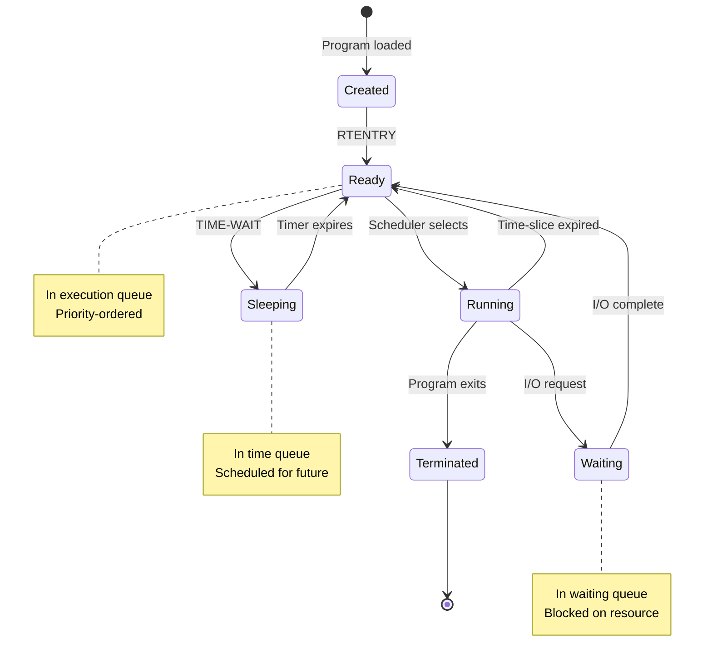
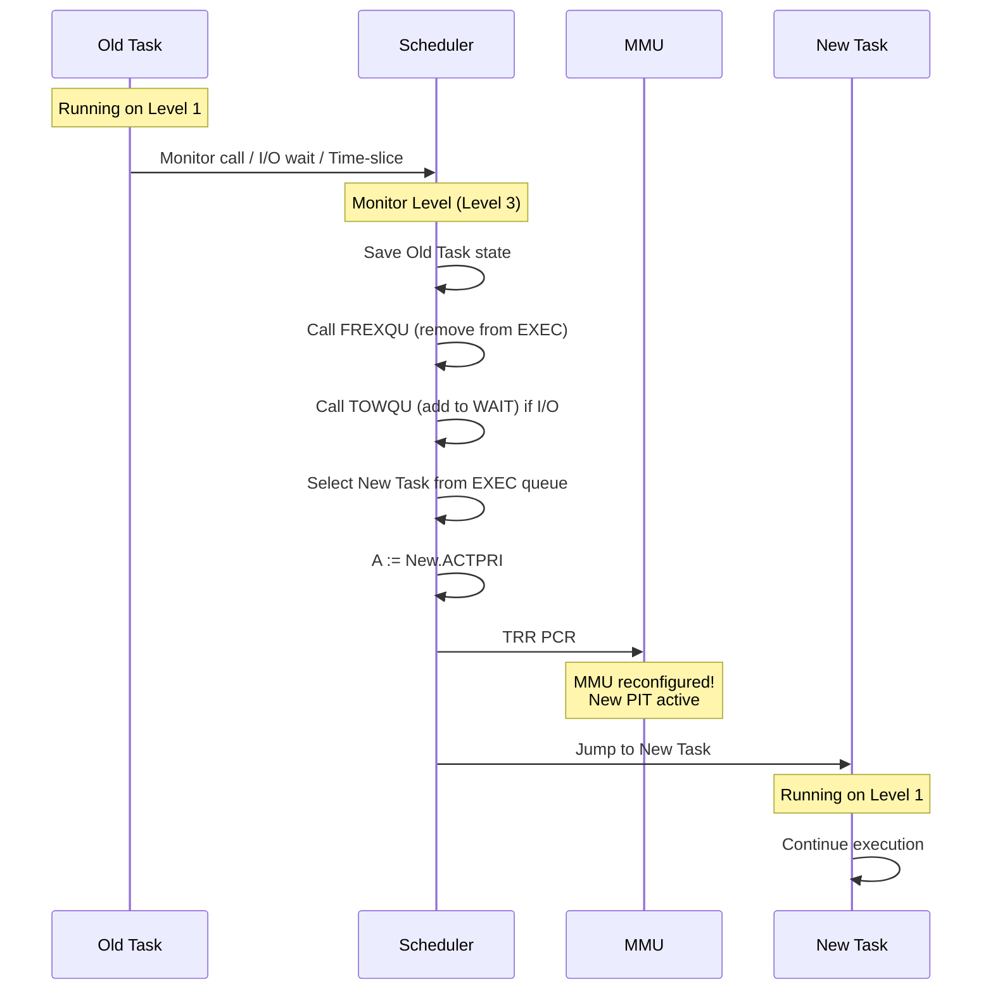
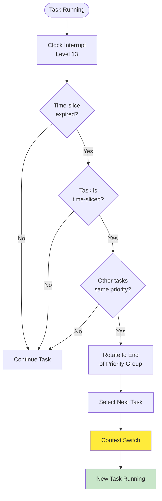
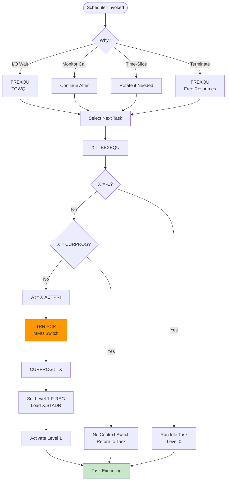

# Scheduler and Task Priorities - Complete Reference

**Version:** 1.0  
**Date:** 2025-10-17  
**Status:** Complete  
**Author:** AI Analysis of SINTRAN III Source Code

---

## Table of Contents

1. [Overview](#1-overview)
2. [Task States and Transitions](#2-task-states-and-transitions)
3. [Priority System](#3-priority-system)
4. [Execution Queue (EXEC Queue)](#4-execution-queue-exec-queue)
5. [Context Switching](#5-context-switching)
6. [Time-Slicing System](#6-time-slicing-system)
7. [Queue Operations](#7-queue-operations)
8. [Background vs. RT Programs](#8-background-vs-rt-programs)
9. [Scheduler Algorithm](#9-scheduler-algorithm)
10. [Priority Inversion and Inheritance](#10-priority-inversion-and-inheritance)
11. [Performance and Optimization](#11-performance-and-optimization)
12. [C# Emulator Implementation](#12-c-emulator-implementation)

---

## 1. Overview

The **SINTRAN Scheduler** is a **priority-based preemptive scheduler** with time-slicing for equal-priority tasks. It manages the execution of multiple concurrent programs (RT programs and background tasks) on the ND-100 CPU.

### 1.1 Key Characteristics

- **Priority-based:** Higher priority tasks always run first
- **Preemptive:** High-priority task can interrupt lower-priority task
- **Time-sliced:** Equal-priority tasks share CPU via round-robin
- **Non-blocking I/O:** Tasks waiting for I/O don't consume CPU
- **Real-time capable:** Predictable response times for RT programs

### 1.2 Scheduler Components

```
┌──────────────────────────────────────────┐
│  Clock Interrupt (Level 13)              │
│  - Updates time                          │
│  - Checks time queue                     │
│  - Time-slice expiration                 │
└──────────────────┬───────────────────────┘
                   │
┌──────────────────▼───────────────────────┐
│  Queue Management                        │
│  - RTENTRY: Add to execution queue       │
│  - FREXQU: Remove from execution queue   │
│  - TOWQU: Add to waiting queue           │
│  - FWQU: Remove from waiting queue       │
└──────────────────┬───────────────────────┘
                   │
┌──────────────────▼───────────────────────┐
│  Scheduler (STUPR/PSTUPR)                │
│  - Select highest-priority ready task    │
│  - Load ACTPRI (PCR configuration)       │
│  - TRR PCR (reconfigure MMU)             │
│  - Jump to task                          │
└──────────────────┬───────────────────────┘
                   │
┌──────────────────▼───────────────────────┐
│  Task Execution                          │
│  - Task runs until:                      │
│    • I/O wait                            │
│    • Monitor call                        │
│    • Higher-priority task ready          │
│    • Time-slice expired                  │
└──────────────────────────────────────────┘
```

---

## 2. Task States and Transitions

### 2.1 Task States



### 2.2 State Descriptions

| State | Queue | Description |
|-------|-------|-------------|
| **Created** | None | Program loaded, RT-description allocated |
| **Ready** | Execution | Ready to run, waiting for CPU |
| **Running** | None | Currently executing on CPU |
| **Waiting** | Waiting | Blocked on I/O or resource |
| **Sleeping** | Time | Scheduled for future activation |
| **Terminated** | None | Program exited, resources being freed |

### 2.3 RT-Description STATUS Field

From `DP-P2-VARIABLES.NPL` and analysis:

```npl
% STATUS field (16 bits)
DISP 0
    % Bit definitions (using 5xxx notation)
    INTEGER STATUS
        % Bit 0-7: Priority (0-255)
        % Bit 8: 5WAIT    - In I/O wait
        % Bit 9: 5REP     - Repeat indicator
        % Bit 10: 5RWAIT  - Resource wait
        % Bit 11: 5TSLICED- Time-sliced
        % Bit 12: 5ESCF   - Escape flag
        % Bit 13: 5RTOFF  - RT program off
        % Bit 14: 5NOABORT- No abort
        % Bit 15: (unused)
PSID
```

**Key status bits:**

- **5WAIT (bit 8):** Task is waiting for I/O completion
- **5RWAIT (bit 10):** Task is waiting for resource (device, semaphore)
- **5TSLICED (bit 11):** Task is subject to time-slicing
- **5RTOFF (bit 13):** Task is stopped, cannot be scheduled

**Checking if task can run:**

```npl
IF X.STATUS BIT 5WAIT THEN     % In I/O wait?
    % Task cannot run
FI
IF X.STATUS BIT 5RTOFF THEN    % Program off?
    % Task cannot run
FI
% Otherwise, task is ready to run
```

---

## 3. Priority System

### 3.1 Priority Range

**Priority values: 0-255**
- **0:** Lowest priority (background, idle)
- **255:** Highest priority (critical real-time)

**Typical priority ranges:**

| Range | Type | Usage |
|-------|------|-------|
| **0-49** | Background | Time-sharing, batch, user programs |
| **50-99** | Low RT | Non-critical real-time tasks |
| **100-149** | Medium RT | Standard real-time tasks |
| **150-199** | High RT | Important real-time tasks |
| **200-255** | Critical RT | Time-critical, interrupt-like tasks |

### 3.2 ACTPRI Field Format

From Chapter 04 (MMU Context Switching):

```
ACTPRI field (16 bits):
┌──────────┬──────────┬──────────┐
│ Priority │   PIT    │   Ring   │
│  8 bits  │  4 bits  │  4 bits  │
│  0-255   │   0-3    │   0-3    │
└──────────┴──────────┴──────────┘
Bits 0-7:   Priority (0-255)
Bits 8-11:  NPIT (Normal PIT number)
Bits 12-13: APIT (Alternative PIT - usually not used by scheduler)
Bits 14-15: Ring number (0-3)
```

**Example ACTPRI values:**

```
Priority 200, PIT 1, Ring 1:
    200 (0xC8) | (1 << 8) | (1 << 14)
    = 0xC8 | 0x100 | 0x4000
    = 0x41C8

Priority 50, PIT 2, Ring 1:
    50 (0x32) | (2 << 8) | (1 << 14)
    = 0x32 | 0x200 | 0x4000
    = 0x4232
```

### 3.3 Priority Extraction

```npl
% Get priority from ACTPRI
A:=X.ACTPRI; A/\377=:PRIORITY    % Mask bits 0-7

% Or using shift:
A:=X.ACTPRI SHZ -8 =:PRIORITY   % Shift right 8, zero-extend
```

### 3.4 Priority Comparison

**Higher priority = lower numerical priority value**

**Wait, that's backwards! Let me check...**

Actually, in SINTRAN:
- **Higher numerical priority = higher priority**
- Priority 200 > Priority 100 > Priority 50

**Comparison in queue insertion:**

```npl
% Compare priorities
IF CURPROG.ACTPRI/\377 >= X.ACTPRI/\377 THEN
    % CURPROG has higher or equal priority
FI
```

---

## 4. Execution Queue (EXEC Queue)

### 4.1 Queue Structure

From Chapter 02 (Queue Structures):

```
Execution Queue (BEXEQU):
┌──────────────────────────────────┐
│ Head → RT-Desc (Priority 225)    │
│         ↓                        │
│        RT-Desc (Priority 200)    │
│         ↓                        │
│        RT-Desc (Priority 150)    │
│         ↓                        │
│        RT-Desc (Priority 100)    │
│         ↓                        │
│        RT-Desc (Priority 50)     │
│         ↓                        │
│        NULL (-1)                 │
└──────────────────────────────────┘
```

**Invariants:**
- Queue is **always sorted by priority** (highest first)
- Each RT-description has `ELINK` field pointing to next
- Last element has `ELINK = -1`
- Empty queue: `BEXEQU = -1`

### 4.2 RTENTRY - Add to Execution Queue

From Chapter 02:

```npl
% RTENTRY: Enter program into execution queue
% Entry: X = RT-description address
RTENTRY:
    *IOF                            % Disable interrupts
    X.STATUS BZERO 5WAIT=:X.STATUS  % Clear WAIT flag
    
    % Get priority
    A:=X.ACTPRI/\377=:PRIORITY
    
    % Find insertion point
    PREVLINK =: -1
    A =: BEXEQU
    
    DO WHILE A >< -1
        A =: Y                      % Current element
        Y.ACTPRI/\377=:CURPRI
        
        IF PRIORITY > CURPRI THEN   % Higher priority?
            % Insert before this element
            IF PREVLINK = -1 THEN
                X =: BEXEQU         % New head
            ELSE
                X =: PREVLINK.ELINK % Insert in middle
            FI
            Y =: X.ELINK            % Link to rest
            GO DONE
        FI
        
        PREVLINK =: Y
        Y.ELINK=:A                  % Follow link
    OD
    
    % Add at end (lowest priority)
    X =: PREVLINK.ELINK
    -1 =: X.ELINK
    
DONE:
    *ION                            % Re-enable interrupts
    EXIT
```

**Complexity:**
- Best case: O(1) - highest priority, insert at head
- Average case: O(n) - scan through queue
- Worst case: O(n) - lowest priority, insert at end

**Typical queue sizes:**
- 1-10 tasks: Common in industrial control
- 10-50 tasks: Typical time-sharing system
- 50+ tasks: Heavy load (rare)

### 4.3 FREXQU - Remove from Execution Queue

```npl
% FREXQU: Remove from execution queue
% Entry: X = RT-description address
FREXQU:
    *IOF
    
    PREVLINK =: -1
    A =: BEXEQU
    
    DO WHILE A >< -1
        IF A = X THEN               % Found it
            IF PREVLINK = -1 THEN
                X.ELINK =: BEXEQU   % Remove from head
            ELSE
                X.ELINK =: PREVLINK.ELINK
            FI
            GO DONE
        FI
        
        PREVLINK =: A
        A.ELINK =: A
    OD
    
DONE:
    *ION
    EXIT
```

---

## 5. Context Switching

### 5.1 Context Switch Sequence

From Chapter 04 (MMU Context Switching):



### 5.2 STUPR - Set User Program

**STUPR** (Set User Program) is the core context switch routine.

**Pseudo-code:**

```npl
STUPR:
    % Select highest-priority task from execution queue
    X =: BEXEQU                     % Get queue head
    IF X = -1 THEN GO IDLE FI       % No tasks, run idle
    
    % Check if already current
    IF X = CURPROG THEN EXIT FI     % Already running this task
    
    % Save current program (if any)
    IF CURPROG >< 0 THEN
        % Current program state already saved by monitor call/interrupt
    FI
    
    % Load new program
    X =: CURPROG                    % Update CURPROG global
    
    % Load ACTPRI into PCR
    A =: X.ACTPRI
    *TRR PCR                        % CRITICAL: MMU reconfigured!
    
    % Load start address
    A =: X.STADR
    *IRW ALEVB DP                   % Set P register for Level 1
    
    % Activate Level 1
    ALEV; *MST PID; MST PIE
    
    % Return - task will execute
    EXIT
```

**Key instruction:**

```npl
A =: X.ACTPRI
*TRR PCR        % Transfer to Paging Control Register
```

**This single instruction:**
- Switches page tables (PIT)
- Changes ring level
- Activates new memory protection

**Timing:**
- Total context switch: ~50-100 instructions
- Time: ~50-100 µs on ND-100
- MMU switch: 1 instruction, ~1 µs

### 5.3 PSTUPR - Priority Set User Program

**PSTUPR** is similar to STUPR but with priority considerations:

```npl
PSTUPR:
    % Similar to STUPR, but checks priority first
    X =: BEXEQU
    IF X = -1 THEN GO IDLE FI
    
    % Check if higher-priority task is ready
    CURPROG.ACTPRI/\377 =: CURPRI
    X.ACTPRI/\377 =: NEWPRI
    
    IF NEWPRI <= CURPRI THEN
        % Current task has higher or equal priority, keep running
        EXIT
    FI
    
    % New task has higher priority, switch
    GO STUPR
```

---

## 6. Time-Slicing System

### 6.1 Time-Slice Mechanism

**Purpose:** Ensure fair CPU sharing among equal-priority tasks.

**Time-slice quantum:** Typically 10-100 ms (configurable)

**Process:**



### 6.2 Time-Slice Table (DTSLPRTAB)

From MP-P2-1.NPL:

```npl
% Time-slice table entry
DISP 0
    INTEGER TSLST       % Time-slice status/class
    INTEGER RTDESC      % RT-description pointer
PSID
TSLSIZE = 2            % 2 words per entry
```

**Time-slice classes:**

| Class | Quantum | Usage |
|-------|---------|-------|
| **0** | No slice | Real-time, no sharing |
| **1** | 10 ms | Interactive, very responsive |
| **2** | 20 ms | Standard interactive |
| **3** | 50 ms | Background, less responsive |
| **4** | 100 ms | Batch, compute-intensive |
| **5** | 200 ms | Low-priority batch |

### 6.3 Time-Slice Expiration Handler

```npl
% Clock interrupt handler (Level 13)
ICLK:
    % Update time
    MTIME + 1 =: MTIME
    
    % Check current task
    X =: CURPROG
    IF X = 0 THEN GO DONE FI        % No task running
    
    % Check if time-sliced
    IF X.STATUS NBIT 5TSLICED THEN GO DONE FI
    
    % Decrement time-slice counter
    X.TSLCNT - 1 =: X.TSLCNT
    IF X.TSLCNT > 0 THEN GO DONE FI
    
    % Time-slice expired
    X.TSLCNT =: X.TSLQUANT          % Reset counter
    
    % Check if other tasks at same priority
    Y =: X.ELINK
    IF Y = -1 THEN GO DONE FI        % No more tasks
    
    Y.ACTPRI/\377 =: YPRI
    X.ACTPRI/\377 =: XPRI
    IF YPRI <> XPRI THEN GO DONE FI  % Different priority
    
    % Rotate: Move current task to end of priority group
    CALL FREXQU                      % Remove from queue
    CALL RTENTRY_END                 % Add at end of priority group
    
    % Switch to next task
    CALL STUPR
    
DONE:
    EXIT
```

### 6.4 Round-Robin within Priority

**Example:**

```
Execution Queue:
Priority 150: Task A → Task B → Task C
Priority 100: Task D → Task E

Time-slice cycle for priority 150:
Time 0-20ms:   Task A runs
Time 20-40ms:  Task B runs
Time 40-60ms:  Task C runs
Time 60-80ms:  Task A runs (cycled back)
...

Priority 100 tasks only run when no priority 150 tasks are ready.
```

---

## 7. Queue Operations

### 7.1 Key Queue Functions

| Function | Purpose | Complexity |
|----------|---------|------------|
| **RTENTRY** | Add to execution queue | O(n) |
| **FREXQU** | Remove from execution queue | O(n) |
| **TOWQU** | Add to waiting queue | O(1) |
| **FWQU** | Remove from waiting queue | O(n) |
| **TTIMQU** | Add to time queue | O(n) |
| **FTIMQU** | Remove from time queue | O(n) |

### 7.2 Waiting Queue Operations

**TOWQU - To Waiting Queue:**

```npl
% TOWQU: Add to waiting queue (linked to resource)
% Entry: X = RT-description
%        B = Resource datafield (device, etc.)
TOWQU:
    *IOF
    
    X.STATUS BONE 5WAIT=:X.STATUS   % Set WAIT flag
    
    % Link to resource's waiting queue
    A =: B.BWLINK                   % Get current head
    X =: B.BWLINK                   % X becomes new head
    A =: X.WLINK                    % Link to previous head
    
    *ION
    EXIT
```

**FWQU - From Waiting Queue:**

```npl
% FWQU: Remove from waiting queue
% Entry: X = RT-description
%        B = Resource datafield
FWQU:
    *IOF
    
    X.STATUS BZERO 5WAIT=:X.STATUS  % Clear WAIT flag
    
    % Search and unlink
    PREVLINK =: -1
    A =: B.BWLINK
    
    DO WHILE A >< -1
        IF A = X THEN
            IF PREVLINK = -1 THEN
                X.WLINK =: B.BWLINK
            ELSE
                X.WLINK =: PREVLINK.WLINK
            FI
            GO DONE
        FI
        PREVLINK =: A
        A.WLINK =: A
    OD
    
DONE:
    *ION
    EXIT
```

### 7.3 Queue Integrity

**Invariants maintained:**
- Execution queue always sorted by priority
- No task in multiple queues simultaneously
- Queue links always valid (no dangling pointers)
- STATUS bits consistent with queue membership

**Debugging checks:**

```csharp
public void ValidateQueues()
{
    // Check execution queue
    ushort prev = 0xFFFF;
    ushort x = _kernel.Memory.ReadGlobal("BEXEQU");
    
    while (x != 0xFFFF)
    {
        byte priority = (byte)(_kernel.Memory.ReadField(x, "ACTPRI") & 0xFF);
        
        if (prev != 0xFFFF)
        {
            byte prevPriority = (byte)(_kernel.Memory.ReadField(prev, "ACTPRI") & 0xFF);
            if (priority > prevPriority)
                throw new Exception("Execution queue not sorted!");
        }
        
        prev = x;
        x = _kernel.Memory.ReadField(x, "ELINK");
    }
}
```

---

## 8. Background vs. RT Programs

### 8.1 Differences

| Aspect | RT Programs | Background Programs |
|--------|-------------|---------------------|
| **Priority** | 50-255 | 0-49 |
| **Time-slicing** | Optional | Always |
| **Page tables** | PIT 1 (RPIT) | PIT 2 or 3 |
| **Segment loading** | On-demand | On-demand |
| **Real-time guarantees** | Yes (if high priority) | No |
| **Terminal I/O** | Via monitor calls | Via terminal drivers |
| **Startup** | Pre-loaded at boot | Dynamic (login) |

### 8.2 Background Program Allocation

From MP-P2-1.NPL:

```npl
% MBABPROC: Allocate background process
MBABPROC:
    % Find free background process slot
    CALL CFBP; GO NFND
    
    % Found free slot at X
    X =: CADDR
    T =: MBSPRTAB; *BBPRO@3 LDXTX
    
    % Check if can be started
    IF X.STATUS BIT 5RTOFF GO TMONEN    % Cannot start
    
    % Initialize
    A BZERO 5WAIT BZERO 5REP =: X.STATUS
    "9ENTOPCOM" =: X.STADR              % Entry point
    
    % Set time-slice class (background always time-sliced)
    X.STATUS BONE 5TSLICED =: X.STATUS
    
    % Add to execution queue
    CALL RTENTRY
    
    EXIT
```

**Background program lifecycle:**

1. **Login:** User logs in to terminal
2. **Allocation:** `MBABPROC` finds free slot
3. **Initialization:** RT-description set up
4. **Entry:** Added to execution queue (low priority)
5. **Execution:** Runs when higher-priority tasks wait
6. **Logout:** Removed from queues, slot freed

### 8.3 Priority Adjustment

**Background programs:**
- Start at low priority (0-49)
- Can be adjusted by system administrator
- Time-slice quantum based on priority class

**RT programs:**
- Priority set at load time
- Can be changed via monitor call
- Typically fixed during execution

---

## 9. Scheduler Algorithm

### 9.1 High-Level Algorithm

```
SCHEDULER (called from monitor level):
1. IF current task waiting for I/O:
       CALL FREXQU (remove from execution)
       CALL TOWQU (add to waiting)
   
2. IF current task terminated:
       CALL FREXQU (remove from execution)
       Free resources
   
3. IF higher-priority task ready:
       % Preemption
   
4. Select highest-priority ready task:
       X := BEXEQU (head of execution queue)
   
5. IF X = -1:
       Run idle task (level 0)
   ELSE:
       IF X ≠ CURPROG:
           Load X.ACTPRI → PCR (context switch)
           CURPROG := X
       FI
       Return to task
   FI
```

### 9.2 Detailed Scheduler Flow



### 9.3 Preemption Scenarios

**Scenario 1: High-priority task becomes ready**

```
Time:       0        10       20       30
Priority:
  200    [  Task A ready  ]
              ↑
  100    [  Task B running  ][Task B preempted]
                             [  Task A runs  ]
```

**Scenario 2: I/O completion**

```
Task A (priority 200) waiting for disk I/O
Task B (priority 100) running

Disk interrupt (Level 11):
  → I/O complete
  → Call FWQU (remove Task A from waiting)
  → Call RTENTRY (add Task A to execution)
  → Return to monitor
  
Monitor checks execution queue:
  → Task A (200) > Task B (100)
  → Preempt Task B
  → Context switch to Task A
```

### 9.4 Idle Task

**When no tasks are ready:**

```npl
IDLE:
    % Run idle task (Level 0)
    % Typically just waits for interrupts
    
    DO
        *WAIT               % Wait for interrupt
        % Interrupt handler will call scheduler
    OD
```

**Idle task characteristics:**
- Priority 0 (lowest)
- Always ready (never waits)
- Minimal CPU usage (WAIT instruction)
- Used for power management (on real hardware)

---

## 10. Priority Inversion and Inheritance

### 10.1 Priority Inversion Problem

**Classic scenario:**

```
Task H (High priority 200): Needs Resource X
Task M (Medium priority 150): CPU-bound
Task L (Low priority 50): Owns Resource X

Timeline:
Time 0:   Task L locks Resource X
Time 10:  Task H becomes ready, tries to lock Resource X
          → Task H blocks (waits for Resource X)
Time 20:  Task M becomes ready
          → Task M runs (priority 150 > 50)
Time 100: Task M still running!
          → Task L cannot run to release Resource X
          → Task H cannot make progress
          → PRIORITY INVERSION!
```

### 10.2 SINTRAN's Solution

**SINTRAN uses **Resource Waiting Queues** to mitigate priority inversion:**

1. **Resource ownership tracking:**
   - Each resource has `RTRES` field (owner)
   - Each resource has `BWLINK` (waiting queue head)

2. **Priority inheritance (partial):**
   - When high-priority task waits for resource
   - Resource owner's priority temporarily boosted
   - Not full priority inheritance, but helps

**Implementation:**

```npl
% When Task H waits for Resource X owned by Task L
TOWQU:
    X.STATUS BONE 5WAIT =: X.STATUS     % Set WAIT flag
    X =: B.BWLINK                       % Add to resource's waiting queue
    
    % Check if should boost owner priority
    Y =: B.RTRES                        % Y = Resource owner (Task L)
    IF Y >< 0 THEN
        X.ACTPRI/\377 =: XPRI           % Task H priority
        Y.ACTPRI/\377 =: YPRI           % Task L priority
        
        IF XPRI > YPRI THEN
            % Boost Task L priority temporarily
            % (Simplified - actual implementation more complex)
            Y.ACTPRI =: (Y.ACTPRI/\177400) | XPRI
        FI
    FI
```

**Limitations:**
- Not full priority inheritance
- Only direct owner boosted (not transitive)
- Better than nothing, prevents worst cases

---

## 11. Performance and Optimization

### 11.1 Scheduler Overhead

**Typical measurements:**

| Operation | Time (µs) | Frequency |
|-----------|-----------|-----------|
| **Context switch** | 50-100 | 10-1000/sec |
| **RTENTRY** | 10-50 | 10-1000/sec |
| **FREXQU** | 10-50 | 10-1000/sec |
| **TOWQU** | 5-20 | 100-5000/sec |
| **FWQU** | 10-50 | 100-5000/sec |
| **Priority check** | 1-5 | Very frequent |

**Total scheduler overhead:**
- Typical: 1-5% of CPU time
- Heavy load: 5-15% of CPU time
- Pathological: 20%+ (too many tasks)

### 11.2 Optimization Strategies

**1. Fast-path common case:**

```npl
% Quick check: Is current task still highest priority?
X =: BEXEQU
IF X = CURPROG THEN EXIT FI     % No switch needed
% ... slow path ...
```

**2. Minimize queue scans:**

- Execution queue kept sorted (no need to search for highest priority)
- Head of queue is always highest priority
- O(1) to get next task

**3. Cache hot paths:**

```csharp
// Cache current task's priority
private byte _curPriority;

public void CheckPreemption()
{
    if (_execQueueHead == null)
        return;
        
    if (_execQueueHead.Priority <= _curPriority)
        return; // No preemption
        
    // Preempt
    ContextSwitch(_execQueueHead);
}
```

**4. Batch updates:**

```npl
% If adding multiple tasks, disable interrupts once
*IOF
CALL RTENTRY(Task1)
CALL RTENTRY(Task2)
CALL RTENTRY(Task3)
*ION
% Re-enable interrupts after batch
```

---

## 12. C# Emulator Implementation

### 12.1 Scheduler Class

```csharp
namespace RetroCore.Emulated.SINTRAN.Scheduler
{
    /// <summary>
    /// SINTRAN priority-based preemptive scheduler with time-slicing
    /// </summary>
    public class SINTRANScheduler
    {
        private readonly SINTRANKernel _kernel;
        private readonly MMU _mmu;
        
        // Current running task
        private ushort _currentProgram;    // CURPROG
        
        // Queue heads
        private ushort _execQueueHead;     // BEXEQU
        
        // Statistics
        public long ContextSwitches { get; private set; }
        public long Preemptions { get; private set; }
        public long TimeSliceExpirations { get; private set; }
        
        public SINTRANScheduler(SINTRANKernel kernel, MMU mmu)
        {
            _kernel = kernel;
            _mmu = mmu;
            _currentProgram = 0;
            _execQueueHead = 0xFFFF; // -1 = empty
        }
        
        /// <summary>
        /// RTENTRY - Add task to execution queue (priority-sorted)
        /// </summary>
        public void RTENTRY(ushort rtDesc)
        {
            // Clear WAIT flag
            ushort status = _kernel.Memory.ReadField(rtDesc, "STATUS");
            status &= unchecked((ushort)~(1 << 8)); // Clear 5WAIT
            _kernel.Memory.WriteField(rtDesc, "STATUS", status);
            
            // Get priority
            ushort actpri = _kernel.Memory.ReadField(rtDesc, "ACTPRI");
            byte priority = (byte)(actpri & 0xFF);
            
            // Find insertion point (priority-sorted, highest first)
            ushort prev = 0xFFFF;
            ushort current = _execQueueHead;
            
            while (current != 0xFFFF)
            {
                ushort curActpri = _kernel.Memory.ReadField(current, "ACTPRI");
                byte curPriority = (byte)(curActpri & 0xFF);
                
                if (priority > curPriority)
                {
                    // Insert before current
                    if (prev == 0xFFFF)
                    {
                        // New head
                        _execQueueHead = rtDesc;
                    }
                    else
                    {
                        // Insert in middle
                        _kernel.Memory.WriteField(prev, "ELINK", rtDesc);
                    }
                    _kernel.Memory.WriteField(rtDesc, "ELINK", current);
                    return;
                }
                
                prev = current;
                current = _kernel.Memory.ReadField(current, "ELINK");
            }
            
            // Add at end
            if (prev == 0xFFFF)
            {
                _execQueueHead = rtDesc;
            }
            else
            {
                _kernel.Memory.WriteField(prev, "ELINK", rtDesc);
            }
            _kernel.Memory.WriteField(rtDesc, "ELINK", (ushort)0xFFFF);
        }
        
        /// <summary>
        /// FREXQU - Remove task from execution queue
        /// </summary>
        public void FREXQU(ushort rtDesc)
        {
            ushort prev = 0xFFFF;
            ushort current = _execQueueHead;
            
            while (current != 0xFFFF)
            {
                if (current == rtDesc)
                {
                    ushort next = _kernel.Memory.ReadField(current, "ELINK");
                    
                    if (prev == 0xFFFF)
                    {
                        _execQueueHead = next;
                    }
                    else
                    {
                        _kernel.Memory.WriteField(prev, "ELINK", next);
                    }
                    return;
                }
                
                prev = current;
                current = _kernel.Memory.ReadField(current, "ELINK");
            }
        }
        
        /// <summary>
        /// TOWQU - Add task to waiting queue (linked to resource)
        /// </summary>
        public void TOWQU(ushort rtDesc, ushort resourceDatafield)
        {
            // Set WAIT flag
            ushort status = _kernel.Memory.ReadField(rtDesc, "STATUS");
            status |= (1 << 8); // Set 5WAIT
            _kernel.Memory.WriteField(rtDesc, "STATUS", status);
            
            // Link to resource's waiting queue
            ushort bwlink = _kernel.Memory.ReadField(resourceDatafield, "BWLINK");
            _kernel.Memory.WriteField(resourceDatafield, "BWLINK", rtDesc);
            _kernel.Memory.WriteField(rtDesc, "WLINK", bwlink);
        }
        
        /// <summary>
        /// FWQU - Remove task from waiting queue
        /// </summary>
        public void FWQU(ushort rtDesc, ushort resourceDatafield)
        {
            // Clear WAIT flag
            ushort status = _kernel.Memory.ReadField(rtDesc, "STATUS");
            status &= unchecked((ushort)~(1 << 8)); // Clear 5WAIT
            _kernel.Memory.WriteField(rtDesc, "STATUS", status);
            
            // Unlink from waiting queue
            ushort prev = 0xFFFF;
            ushort current = _kernel.Memory.ReadField(resourceDatafield, "BWLINK");
            
            while (current != 0xFFFF)
            {
                if (current == rtDesc)
                {
                    ushort next = _kernel.Memory.ReadField(current, "WLINK");
                    
                    if (prev == 0xFFFF)
                    {
                        _kernel.Memory.WriteField(resourceDatafield, "BWLINK", next);
                    }
                    else
                    {
                        _kernel.Memory.WriteField(prev, "WLINK", next);
                    }
                    return;
                }
                
                prev = current;
                current = _kernel.Memory.ReadField(current, "WLINK");
            }
        }
        
        /// <summary>
        /// STUPR - Set User Program (context switch)
        /// </summary>
        public void STUPR()
        {
            // Get highest-priority ready task
            ushort newTask = _execQueueHead;
            
            if (newTask == 0xFFFF)
            {
                // No tasks ready, run idle
                RunIdleTask();
                return;
            }
            
            // Check if already current
            if (newTask == _currentProgram)
                return; // No switch needed
                
            // Context switch
            ContextSwitch(newTask);
        }
        
        /// <summary>
        /// Context switch to new task
        /// </summary>
        private void ContextSwitch(ushort newTask)
        {
            ContextSwitches++;
            
            // Update CURPROG
            _currentProgram = newTask;
            _kernel.Memory.WriteGlobal("CURPROG", newTask);
            
            // Load ACTPRI into PCR (MMU reconfiguration)
            ushort actpri = _kernel.Memory.ReadField(newTask, "ACTPRI");
            _mmu.PCR = actpri;
            
            // Extract PIT from ACTPRI
            byte pit = (byte)((actpri >> 8) & 0x0F);
            _kernel.CPU.CurrentPIT = pit;
            
            // Load start address
            ushort stadr = _kernel.Memory.ReadField(newTask, "STADR");
            _kernel.CPU.WriteRegister(1, CPURegister.P, stadr);
            
            // Activate Level 1
            _kernel.CPU.PID |= (1 << 1);
            _kernel.CPU.CurrentLevel = 1;
        }
        
        /// <summary>
        /// Check if preemption is needed
        /// </summary>
        public void CheckPreemption()
        {
            if (_execQueueHead == 0xFFFF)
                return; // No tasks
                
            if (_currentProgram == 0)
                return; // No current task
                
            // Get priorities
            ushort curActpri = _kernel.Memory.ReadField(_currentProgram, "ACTPRI");
            byte curPriority = (byte)(curActpri & 0xFF);
            
            ushort newActpri = _kernel.Memory.ReadField(_execQueueHead, "ACTPRI");
            byte newPriority = (byte)(newActpri & 0xFF);
            
            if (newPriority > curPriority)
            {
                // Preempt
                Preemptions++;
                ContextSwitch(_execQueueHead);
            }
        }
        
        /// <summary>
        /// Handle time-slice expiration
        /// </summary>
        public void HandleTimeSliceExpired()
        {
            TimeSliceExpirations++;
            
            if (_currentProgram == 0)
                return;
                
            // Check if time-sliced
            ushort status = _kernel.Memory.ReadField(_currentProgram, "STATUS");
            if ((status & (1 << 11)) == 0) // 5TSLICED
                return; // Not time-sliced
                
            // Check if other tasks at same priority
            ushort next = _kernel.Memory.ReadField(_currentProgram, "ELINK");
            if (next == 0xFFFF)
                return; // No other tasks
                
            ushort curActpri = _kernel.Memory.ReadField(_currentProgram, "ACTPRI");
            byte curPriority = (byte)(curActpri & 0xFF);
            
            ushort nextActpri = _kernel.Memory.ReadField(next, "ACTPRI");
            byte nextPriority = (byte)(nextActpri & 0xFF);
            
            if (curPriority != nextPriority)
                return; // Different priority
                
            // Rotate: remove current, add at end of priority group
            ushort current = _currentProgram;
            FREXQU(current);
            
            // Find end of priority group
            ushort last = _execQueueHead;
            while (true)
            {
                ushort lastNext = _kernel.Memory.ReadField(last, "ELINK");
                if (lastNext == 0xFFFF)
                    break;
                    
                ushort lastNextActpri = _kernel.Memory.ReadField(lastNext, "ACTPRI");
                byte lastNextPriority = (byte)(lastNextActpri & 0xFF);
                
                if (lastNextPriority != curPriority)
                    break;
                    
                last = lastNext;
            }
            
            // Insert after last
            ushort afterLast = _kernel.Memory.ReadField(last, "ELINK");
            _kernel.Memory.WriteField(last, "ELINK", current);
            _kernel.Memory.WriteField(current, "ELINK", afterLast);
            
            // Switch to next task
            STUPR();
        }
        
        private void RunIdleTask()
        {
            // Run idle task (level 0)
            _kernel.CPU.CurrentLevel = 0;
            // Idle task just waits for interrupts
        }
        
        /// <summary>
        /// Get scheduler statistics
        /// </summary>
        public SchedulerStatistics GetStatistics()
        {
            return new SchedulerStatistics
            {
                ContextSwitches = ContextSwitches,
                Preemptions = Preemptions,
                TimeSliceExpirations = TimeSliceExpirations,
                CurrentProgram = _currentProgram,
                ExecQueueLength = GetQueueLength(_execQueueHead, "ELINK")
            };
        }
        
        private int GetQueueLength(ushort head, string linkField)
        {
            int count = 0;
            ushort current = head;
            
            while (current != 0xFFFF)
            {
                count++;
                current = _kernel.Memory.ReadField(current, linkField);
            }
            
            return count;
        }
    }
    
    public class SchedulerStatistics
    {
        public long ContextSwitches { get; set; }
        public long Preemptions { get; set; }
        public long TimeSliceExpirations { get; set; }
        public ushort CurrentProgram { get; set; }
        public int ExecQueueLength { get; set; }
    }
}
```

---

## Appendix A: Quick Reference

### Key Functions

| Function | Purpose | Complexity |
|----------|---------|------------|
| **STUPR** | Context switch | O(1) |
| **PSTUPR** | Priority context switch | O(1) |
| **RTENTRY** | Add to exec queue | O(n) |
| **FREXQU** | Remove from exec queue | O(n) |
| **TOWQU** | Add to wait queue | O(1) |
| **FWQU** | Remove from wait queue | O(n) |

### Priority Ranges

| Range | Type |
|-------|------|
| 0-49 | Background |
| 50-99 | Low RT |
| 100-149 | Medium RT |
| 150-199 | High RT |
| 200-255 | Critical RT |

### Status Bits

| Bit | Name | Meaning |
|-----|------|---------|
| 8 | 5WAIT | In I/O wait |
| 10 | 5RWAIT | Resource wait |
| 11 | 5TSLICED | Time-sliced |
| 13 | 5RTOFF | Program off |

---

## Appendix B: Related Documentation

- **Chapter 02:** Queue Structures (detailed queue operations)
- **Chapter 04:** MMU Context Switching (ACTPRI and PCR)
- **Chapter 13:** INT 14 Handler (interrupt-driven scheduling)
- **Chapter 14:** Monitor Kernel (monitor call scheduling)
- **Chapter 16:** Page Fault Handler (I/O wait handling)

---

**End of Document**

