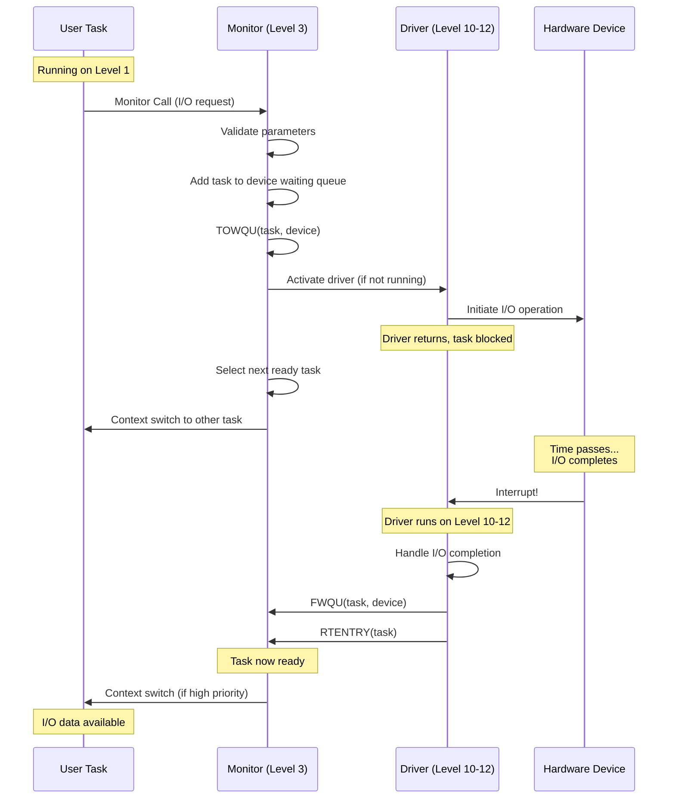
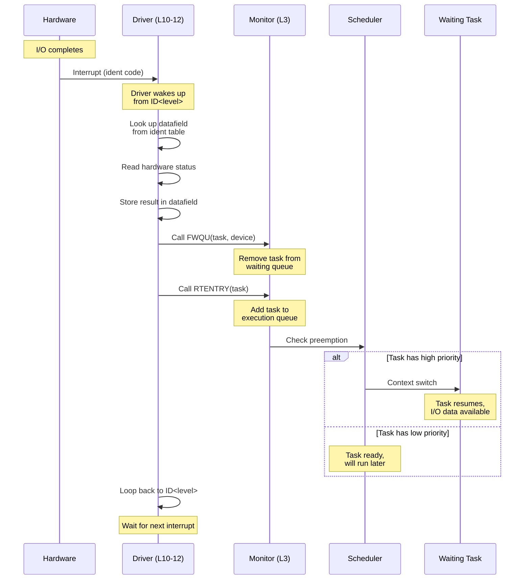
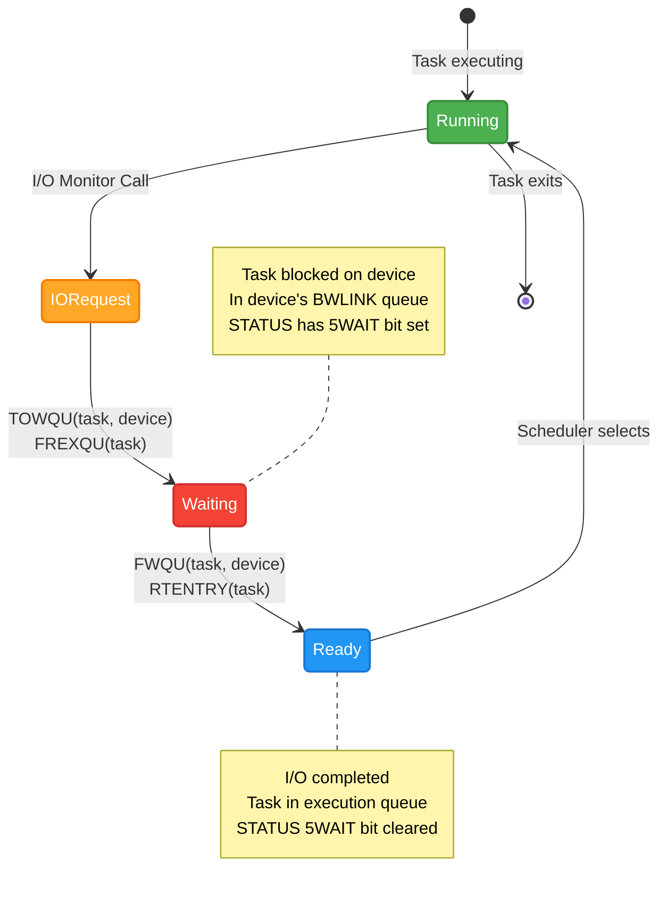
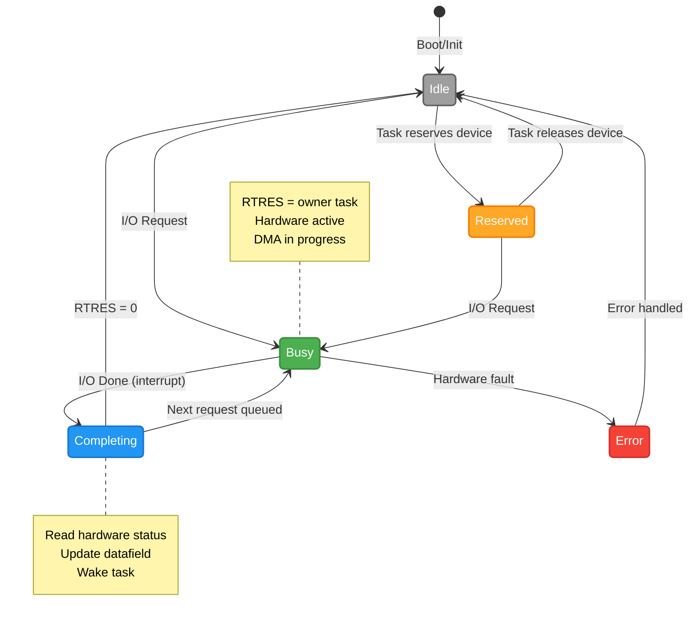

# Device Driver Framework and Task Relationships

**Version:** 1.0  
**Date:** 2025-10-17  
**Status:** Complete  
**Author:** AI Analysis of SINTRAN III Source Code

---

## Table of Contents

1. [Overview](#1-overview)
2. [Device Datafield Structure](#2-device-datafield-structure)
3. [Driver Architecture](#3-driver-architecture)
4. [Interrupt Handling](#4-interrupt-handling)
5. [I/O Queueing and Task Relationships](#5-io-queueing-and-task-relationships)
6. [Driver Initialization](#6-driver-initialization)
7. [Driver Types](#7-driver-types)
8. [Device State Machine](#8-device-state-machine)
9. [C# Emulator Implementation](#9-c-emulator-implementation)
10. [Device Traversal and Inspection](#10-device-traversal-and-inspection)

---

## 1. Overview

### 1.1 Device Driver Model

SINTRAN III uses a **interrupt-driven, queue-based device driver architecture** where:

- Each device has a **datafield** (Device Control Block) in shared memory
- Drivers run at **dedicated interrupt levels** (10-12)
- Tasks waiting for I/O are linked in **waiting queues**
- I/O completion triggers **interrupt** → **driver** → **scheduler**

### 1.2 Key Design Principles

```
┌────────────────────────────────────────┐
│  1. Separation of Concerns             │
│     - User programs: Make I/O requests │
│     - Monitor: Queue management        │
│     - Drivers: Hardware interaction    │
│     - Interrupts: Asynchronous events  │
└────────────────────────────────────────┘

┌────────────────────────────────────────┐
│  2. Non-blocking I/O                   │
│     - Tasks never busy-wait            │
│     - Moved to waiting queue           │
│     - Scheduler runs other tasks       │
│     - I/O complete → task ready        │
└────────────────────────────────────────┘

┌────────────────────────────────────────┐
│  3. Priority-based Interrupt Handling  │
│     - Clock (L13) > Storage (L11)      │
│     - Nested interrupts possible       │
│     - Fast interrupt handlers          │
└────────────────────────────────────────┘
```

### 1.3 System Architecture



---

## 2. Device Datafield Structure

### 2.1 Standard Datafield Layout

Every device has a **datafield** (minimum 16 words) in shared memory:

```npl
% Standard datafield structure (first 16 words)
DISP 0
    % === Standard section (all devices) ===
    INTEGER RESLINK     % 0: Link in reservation queue
    INTEGER RTRES       % 1: Owner RT-program (or 0/-1 if free)
    INTEGER BWLINK      % 2: Head of waiting queue
    
    % Location 3 reserved
    
    INTEGER TYPRING     % 4: Device type and ring
    INTEGER MLINK       % 5: Monitor queue link
    INTEGER MFUNC       % 6: Monitor function address
    
    % Location 7 reserved
    
    % === Device-specific section (varies) ===
    INTEGER HDEV        % 8: Hardware device number
    INTEGER HST         % 9: Hardware status
    INTEGER BUFFER      % 10: Buffer pointer
    INTEGER COUNT       % 11: Transfer count
    INTEGER STATUS      % 12: Device status
    INTEGER FLAGS       % 13: Control flags
    INTEGER RESERVED1   % 14
    INTEGER RESERVED2   % 15
    
    % Additional words follow (device-specific)
PSID
```

### 2.2 Key Fields

| Offset | Field | Purpose |
|--------|-------|---------|
| **0** | RESLINK | Link to next reserved device (for resource tracking) |
| **1** | RTRES | Points to RT-description of owning task (0 = free) |
| **2** | BWLINK | Head of waiting queue (tasks waiting for this device) |
| **4** | TYPRING | Device type and ring level encoded |
| **5** | MLINK | Link in monitor queue (for scheduled actions) |
| **6** | MFUNC | Monitor function to call |
| **8+** | (Device) | Device-specific data (varies by driver) |

### 2.3 RTRES Field Usage

**Purpose:** Track which task owns the device

```npl
% Device free?
IF X.RTRES = 0 THEN
    % Device available
FI

% Allocate device to task
RTDESC =: X.RTRES

% Release device
0 =: X.RTRES
```

**Values:**
- **0:** Device is free
- **-1 (0xFFFF):** Device reserved by system
- **Positive:** Address of RT-description owning device

### 2.4 BWLINK Field Usage

**Purpose:** Head of waiting queue (linked via WLINK in RT-descriptions)

```
Device Datafield (BWLINK):
    ↓
RT-Desc Task A (WLINK):
    ↓
RT-Desc Task B (WLINK):
    ↓
RT-Desc Task C (WLINK):
    ↓
NULL (-1)
```

**Operations:**
- **TOWQU:** Add task to head of waiting queue
- **FWQU:** Remove task from waiting queue

---

## 3. Driver Architecture

### 3.1 Interrupt Level Assignment

| Level | Purpose | Examples |
|-------|---------|----------|
| **Level 10** | Output devices | Line printers, plotters, terminal output |
| **Level 11** | Mass storage | Disk controllers, tape drives |
| **Level 12** | Input devices | Terminal input, card readers |
| **Level 13** | Clock | System timer, scheduling |
| **Level 14** | Internal interrupts | Page faults, monitor calls |

**Priority:**  
Level 13 (Clock) > Level 12 (Input) > Level 11 (Storage) > Level 10 (Output)

### 3.2 Driver Entry Points

Every driver implements:

```npl
% Main driver entry point (called on interrupt)
SUBR DRIVER_NAME

DRIVER_NAME:
    % Save timer
    TTMR =: TMR
    
RETURN:
    % Wait for interrupt
    CALL ID<level>      % e.g., ID11 for level 11
    
ENTRY:
    % Interrupt occurred, hardware ident in A-register
    % Look up datafield from ident table
    T =: ITB<level>; A - 1; *LDDTX
    A =: B              % B = datafield address
    
    % Process interrupt
    CALL HANDLE_IO
    
    % Return to RETURN (wait for next interrupt)
    GO RETURN
```

**Key points:**
- Driver runs in infinite loop
- **ID<level>** waits for interrupt
- Hardware ident code looked up in ident table
- Datafield address obtained
- I/O processed
- Loop back to wait for next interrupt

### 3.3 Ident Code Lookup

**Ident tables** map hardware ident codes to datafield addresses:

```
┌────────────────────────────────┐
│  ITB10 (Level 10 - Output)     │
│  [0] → Datafield addr for ID 1 │
│  [1] → Datafield addr for ID 2 │
│  [2] → Datafield addr for ID 3 │
│  ...                            │
└────────────────────────────────┘

┌────────────────────────────────┐
│  ITB11 (Level 11 - Storage)    │
│  [0] → Datafield addr for ID 1 │
│  [1] → Datafield addr for ID 2 │
│  ...                            │
└────────────────────────────────┘

┌────────────────────────────────┐
│  ITB12 (Level 12 - Input)      │
│  [0] → Datafield addr for ID 1 │
│  [1] → Datafield addr for ID 2 │
│  ...                            │
└────────────────────────────────┘
```

**Usage:**

```npl
% Hardware interrupts with ident code in A
T =: ITB11          % Ident table for level 11
A - 1               % Convert to 0-based index
*LDDTX              % Load datafield address from table
A =: B              % B now points to device datafield
```

### 3.4 Datafield Initialization

During boot (see Chapter 01 - Boot Sequence):

```npl
% For each device
DEVICEID =: T
ITB<level> + T - 1  % Calculate ident table entry address
DATAFIELD_ADDR =: * % Store datafield address
```

---

## 4. Interrupt Handling

### 4.1 Terminal Input Driver (Level 12)

From `MP-P2-TERM-DRIV.NPL`:

```npl
% STTIN: Terminal input driver
% Entry: Interrupt from terminal with ident code in A

STTIN:
    TTMR =: TMR             % Save timer
    
RETURN:
    CALL ID12               % Wait for interrupt (Level 12)
    
TYENT:
    % Interrupt occurred, A = ident code
    ISTATE =: IISTATE       % Save interrupt state
    CALL SET12WINDOW        % Set up memory window
    
    % Check for special mode (BRKMODE)
    IF BRKMODE = 12 GO BFYICOMDRIVER
    
    % Get output datafield (two-way device)
    IF DFOPP >< 0 THEN
        X =: 1777; X/\A; A =: B/\176000 + X
    FI
    A =: 12DFOPP
    A.BITFLAG BZERO 5CLOU =: X.BITFLAG
    
NXCHR:
    X =: 12DFOPP
    CALL TIAPD; GO RETURN   % Read character from hardware
    
    % Character read successfully, A = character
    IF T =: "ROUSPEC" >< 0 THEN
        D =: 0; CALL ROUSPEC; GO NXCHR; GO OKCHAR
    FI
    
    A =: LAST               % Save character
    
OKCHAR:
    % Clear break/echo flag
    BRECHOFL/\177770 =: BRECHOFL
    
    % Test for XON/XOFF
    A =: LAST/\377; CALL XONCHECK
    
    % Handle echo
    IF DFLAG BIT 5ECHO THEN
        LAST/\377
        CALL TECHO          % Test for echo
        CALL TBREAK         % Test for break
        X =: 12DFOPP
    ELSE
        % No echo mode
        IF IISTATE = -1 THEN
            *ION
            LAST/\377; CALL CXRBPUT; GO BFULL
        FI
    FI
    
    *ION
    
    % Echo character if needed
    IF BRECHOFL BIT 5ECHO THEN CALL ECHSUBR FI
    
    % Ignore character?
    IF BRECHOFL < 0 THEN
        7 =: LAST; CALL ECHSUBR; GO RETU
    FI
    
ADDCH:
    % Add character to buffer
    LAST/\377; CALL CXRBPUT
    
    % Check if buffer full
    IF CFREE < 20 AND BRECHOFL NBIT 5BREAK GO BFULL
    
    % Check for break condition
    IF BRECHOFL BIT 5BREAK THEN
        % Turn off echo in driver
        DFLAG BZERO 5ECHO
        
        % Determine echo strategy
        IF X =: FYLLE = HENTE THEN
            A BONE 5ALEC    % Whole buffer echoed by driver
        ELSE
            A BZERO 5ALEC   % Part echoed by IOTRANS
        FI
        A =: DFLAG; X =: RSISTE
    ELSE
        IF DFLAG BIT 5XOFF GO BFULL
        GO RETU
    FI
    
BFULL:
    % Buffer full or break, restart task
    CALL TSTBACK            % Restart waiting program
    
    % (Additional ND-500 message handling omitted)
    
    GO FAR NXCHR
    
RETU:
    IF "ROUSPEC" >< 0 THEN
        D =: 1; X =: 12DFOPP; CALL ROUSPEC; GO FAR OKCHAR
    FI
    GO FAR NXCHR
```

**Key operations:**

1. **ID12:** Wait for terminal interrupt
2. **TIAPD:** Read character from hardware
3. **CXRBPUT:** Put character in buffer
4. **TSTBACK:** Wake up waiting task

### 4.2 Disk Driver (Level 11)

From `IP-P2-DISK-START.NPL`:

```npl
% CTRDISK: Disk transfer driver
% Entry: Called from monitor (MTRANS) via Level 11
% B = Device datafield, X = ABSTR parameter list

CTRDISK:
    A =: L =: "CTRLR"
    
    % Save parameter pointer
    X =: PARDF
    
    % Set owner
    X.RTRES =: STPRW        % Owner RT-program
    
    % Fetch parameters
    T =: X.ABFUN; AD =: X.MEMAD =: MEMAD
    IF A = 0 AND D = 0 THEN CALL ERRFATAL FI  % Memory addr 0 illegal
    
    % Build control word (CTRG)
    A/\3; A SH 14 + T =: CTRG
    A SHZ -6/\7 SH 3 \/ CBLDA
    
    % Get unit type
    T =: M2UNTYP; *EXR SA
    
    IF K THEN
        % Phoenix disk
        CTRG BONE 16 =: CTRG; 0 =: CARG
    ELSE
        CTRG/\7000 SHZ -11 =: CARG
    FI
    
    % Extract disk address
    IF CTRG/\77 >= 60 AND A <= 66 THEN
        IF A = T THEN CTRG/\177701 =: CTRG
        ELSE CTRG/\177703 =: CTRG
        FI
        X.ABPA2 =: CADRG    % Double disk address
    ELSE IF A = 43 OR A = 44 THEN
        X.ABPA2 =: CADRG    % Double disk address
    ELSE
        X.ABP21 =: CDRG     % Single disk address
    FI FI
    
    % Number of sectors
    X.ABP31 =: CXRG
    
    % Save initial control word
    CTRG =: TRGINI
    
    % ... (Additional parameter processing) ...
    
    % Wait for interrupt if needed
    IF TMR >< 0 THEN CALL ID11 FI
    
    % ... (Disk logging, actual I/O initiation) ...
```

**Key operations:**

1. **Parameter fetching:** Memory address, disk address, sector count
2. **Control word building:** Function code, unit, disk address
3. **ID11:** Wait for disk interrupt (if not already active)
4. **Hardware I/O initiation:** Start DMA transfer

### 4.3 I/O Completion Path



---

## 5. I/O Queueing and Task Relationships

### 5.1 Queue Relationships

```
┌─────────────────────────────────────────────────┐
│  RT-Description (Task)                          │
│  - TLINK: Time queue link                       │
│  - ELINK: Execution queue link                  │
│  - WLINK: Waiting queue link (points to next)   │
│  - BRESLINK: Reservation link                   │
│  - RTRES: Reserved devices (head of chain)      │
└─────────────────────────────────────────────────┘
              │
              │ RTRES (owner)
              ▼
┌─────────────────────────────────────────────────┐
│  Device Datafield                               │
│  - RTRES: Points back to owning task            │
│  - BWLINK: Waiting queue head                   │
│  - RESLINK: Next reserved device                │
└─────────────────────────────────────────────────┘
              │
              │ BWLINK (waiting queue)
              ▼
┌─────────────────────────────────────────────────┐
│  RT-Description (Waiting Task 1)                │
│  - WLINK: Points to next waiting task           │
└─────────────────────────────────────────────────┘
              │
              │ WLINK
              ▼
┌─────────────────────────────────────────────────┐
│  RT-Description (Waiting Task 2)                │
│  - WLINK: -1 (end of queue)                     │
└─────────────────────────────────────────────────┘
```

### 5.2 TOWQU - Add to Waiting Queue

From Chapter 02 and 17:

```npl
% TOWQU: Add task to device waiting queue
% Entry: X = RT-description, B = Device datafield

TOWQU:
    *IOF                            % Disable interrupts
    
    % Set WAIT flag in task status
    X.STATUS BONE 5WAIT =: X.STATUS
    
    % Add to head of device waiting queue
    A =: B.BWLINK               % Current head
    X =: B.BWLINK               % X becomes new head
    A =: X.WLINK                % Link to previous head
    
    *ION                            % Re-enable interrupts
    EXIT
```

**Result:**

```
Before:
Device.BWLINK → Task A → Task B → NULL

After TOWQU(Task C, Device):
Device.BWLINK → Task C → Task A → Task B → NULL
```

### 5.3 FWQU - Remove from Waiting Queue

```npl
% FWQU: Remove task from device waiting queue
% Entry: X = RT-description, B = Device datafield

FWQU:
    *IOF
    
    % Clear WAIT flag
    X.STATUS BZERO 5WAIT =: X.STATUS
    
    % Search and unlink
    PREVLINK =: -1
    A =: B.BWLINK
    
    DO WHILE A >< -1
        IF A = X THEN           % Found task
            IF PREVLINK = -1 THEN
                % Remove from head
                X.WLINK =: B.BWLINK
            ELSE
                % Remove from middle/end
                X.WLINK =: PREVLINK.WLINK
            FI
            GO DONE
        FI
        PREVLINK =: A
        A.WLINK =: A
    OD
    
DONE:
    *ION
    EXIT
```

### 5.4 Task State Transitions



### 5.5 Device Reservation

**Purpose:** Exclusive access to device (e.g., tape drive)

```npl
% Reserve device
SUBR BRESERVE
% Entry: X = RT-description, B = Device datafield

BRESERVE:
    *IOF
    
    % Check if device free
    IF B.RTRES >< 0 THEN
        % Device busy, add to waiting queue
        CALL TOWQU
        A =: -1     % Return error
        EXIT
    FI
    
    % Allocate device
    X =: B.RTRES                % Device now owned by task
    
    % Add device to task's reservation chain
    A =: X.BRESLINK             % Current head
    B =: X.BRESLINK             % Device becomes new head
    A =: B.RESLINK              % Link to previous head
    
    *ION
    A =: 0                      % Return success
    EXIT
```

**Reservation chain:**

```
Task RT-Description:
    BRESLINK → Device A → Device B → NULL

Task owns devices A and B
```

**Release:**

```npl
% Release device
SUBR BRELEASE
% Entry: X = RT-description, B = Device datafield

BRELEASE:
    *IOF
    
    % Clear owner
    0 =: B.RTRES
    
    % Remove from task's reservation chain
    % ... (chain manipulation) ...
    
    % Wake up next waiting task (if any)
    IF B.BWLINK >< -1 THEN
        A =: B.BWLINK           % Head of waiting queue
        CALL FWQU               % Remove from waiting
        CALL RTENTRY            % Add to execution queue
    FI
    
    *ION
    EXIT
```

---

## 6. Driver Initialization

### 6.1 Boot-Time Registration

From Chapter 01 (Boot Sequence):

```npl
% During boot, for each device:

% 1. Allocate datafield memory
CALL GETMEM(DATAFIELD_SIZE)
DATAFIELD_ADDR =: A

% 2. Initialize standard fields
0 =: A.RESLINK          % No reservation
0 =: A.RTRES            % Device free
-1 =: A.BWLINK          % Empty waiting queue
DEVICE_TYPE =: A.TYPRING
0 =: A.MLINK            % No monitor queue link
0 =: A.MFUNC            % No monitor function

% 3. Initialize device-specific fields
HARDWARE_IDENT =: A.HDEV
0 =: A.STATUS
% ... etc ...

% 4. Register in ident table
T =: ITB<level>
HARDWARE_IDENT - 1
*STDTX DATAFIELD_ADDR   % Store datafield address

% 5. Start driver (if not already running)
% Driver runs in infinite loop on its level
```

### 6.2 Driver Activation

**Drivers are started during boot:**

```npl
% Activate Level 11 (disk driver)
A =: DRIVER_ENTRY_POINT
*IRW LEVEL DP           % Set P register for level
*MST PIE                % Enable interrupts for level
```

**Driver then runs forever:**

```npl
DRIVER:
    TTMR =: TMR
    
LOOP:
    CALL ID<level>      % Wait for interrupt
    
    % Process interrupt
    % ... driver logic ...
    
    GO LOOP             % Back to wait
```

---

## 7. Driver Types

### 7.1 Disk Drivers

**Purpose:** Mass storage I/O (read/write sectors)

**Files:**
- `IP-P2-DISK-START.NPL`: Main disk driver
- `IP-P2-SCSI-DISK.NPL`: SCSI disk driver
- `MP-P2-DISK-START.NPL`: Monitor-level disk routines

**Key operations:**
- **CTRDISK:** Main disk transfer routine
- **STRNS:** Start disk transfer from monitor
- **MTRANS:** Monitor-level transfer initiation

**Datafield extensions:**

```npl
% Disk datafield (16+ words)
DISP 0
    % Standard fields (0-15)
    % ... (as above) ...
    
    % Disk-specific fields
    INTEGER DISKADDR1   % 16: Disk address (high)
    INTEGER DISKADDR2   % 17: Disk address (low)
    INTEGER SECTORCOUNT % 18: Number of sectors
    INTEGER CYLINDER    % 19: Current cylinder
    INTEGER HEAD        % 20: Current head
    INTEGER SECTOR      % 21: Current sector
    INTEGER ERRORCOUNT  % 22: Error retry count
PSID
```

### 7.2 Terminal Drivers

**Purpose:** Character I/O to/from terminals

**Files:**
- `MP-P2-TERM-DRIV.NPL`: Terminal input/output driver
- `MP-P2-TAD.NPL`: TAD (Terminal Access Device) driver

**Key operations:**
- **STTIN:** Terminal input (Level 12)
- **TECHO:** Echo character
- **CXRBPUT:** Put character in buffer

**Datafield extensions:**

```npl
% Terminal datafield
DISP 0
    % Standard fields (0-15)
    % ... (as above) ...
    
    % Terminal-specific fields
    INTEGER DFOPP       % 16: Opposite datafield (input/output pair)
    INTEGER DFLAG       % 17: Driver flags (echo, break, etc.)
    INTEGER BITFLAG     % 18: Bit flags
    INTEGER HENTE       % 19: Buffer read pointer
    INTEGER FYLLE       % 20: Buffer write pointer
    INTEGER CFREE       % 21: Free space in buffer
    INTEGER LAST        % 22: Last character read
    INTEGER BRECHOFL    % 23: Break/echo flags
    INTEGER SCREEN      % 24: Screen control
    INTEGER TINFO       % 25: Terminal info
PSID
```

### 7.3 Communication Drivers

**Purpose:** Network and serial communication

**Files:**
- `MP-P2-HDLC-DRIV.NPL`: HDLC driver
- `MP-P2-X21-DRIV.NPL`: X.21 driver
- `MP-P2-PIOC-DRIV.NPL`: PIOC driver

**Key operations:**
- Frame assembly/disassembly
- CRC calculation
- Protocol state machines

### 7.4 ND-500 Communication Driver

**Purpose:** Coordinate I/O between ND-100 and ND-500

**Files:**
- `MP-P2-N500.NPL`: ND-500 message handling
- `XC-P2-1.NPL`: ND-500 coordination

**Key operations:**
- Message passing
- Shared memory coordination
- Interrupt synchronization

---

## 8. Device State Machine

### 8.1 Device States



### 8.2 Typical I/O Lifecycle

```
┌──────────────────────────────────────────────┐
│ 1. Task makes I/O request                    │
│    - Monitor call (e.g., READ-SECTOR)        │
│    - Parameters: device, buffer, count       │
└──────────────────┬───────────────────────────┘
                   │
┌──────────────────▼───────────────────────────┐
│ 2. Monitor validates and queues              │
│    - Check parameters                        │
│    - TOWQU(task, device) if device busy      │
│    - Activate driver if device free          │
└──────────────────┬───────────────────────────┘
                   │
┌──────────────────▼───────────────────────────┐
│ 3. Driver initiates hardware I/O             │
│    - Set device registers                    │
│    - Start DMA                               │
│    - Return to ID<level> (wait interrupt)    │
└──────────────────┬───────────────────────────┘
                   │
                   │ (Time passes...)
                   │
┌──────────────────▼───────────────────────────┐
│ 4. Hardware completes, interrupts            │
│    - Driver wakes from ID<level>             │
│    - Read hardware status                    │
│    - Update datafield                        │
└──────────────────┬───────────────────────────┘
                   │
┌──────────────────▼───────────────────────────┐
│ 5. Driver wakes task                         │
│    - FWQU(task, device)                      │
│    - RTENTRY(task)                           │
│    - Check for next queued request           │
└──────────────────┬───────────────────────────┘
                   │
┌──────────────────▼───────────────────────────┐
│ 6. Scheduler runs task                       │
│    - Task resumes from monitor call          │
│    - I/O data available in buffer            │
└──────────────────────────────────────────────┘
```

---

## 9. C# Emulator Implementation

### 9.1 Device Datafield Class

```csharp
namespace RetroCore.Emulated.SINTRAN.Drivers
{
    /// <summary>
    /// Represents a device datafield (Device Control Block)
    /// </summary>
    public class DeviceDatafield
    {
        // Base address in memory
        public ushort Address { get; set; }
        
        // Standard fields (offsets from Address)
        public const int RESLINK_OFFSET = 0;
        public const int RTRES_OFFSET = 1;
        public const int BWLINK_OFFSET = 2;
        public const int TYPRING_OFFSET = 4;
        public const int MLINK_OFFSET = 5;
        public const int MFUNC_OFFSET = 6;
        public const int HDEV_OFFSET = 8;
        
        private readonly SINTRANKernel _kernel;
        
        public DeviceDatafield(SINTRANKernel kernel, ushort address)
        {
            _kernel = kernel;
            Address = address;
        }
        
        // Standard field accessors
        public ushort RESLINK
        {
            get => _kernel.Memory.Read(Address + RESLINK_OFFSET);
            set => _kernel.Memory.Write(Address + RESLINK_OFFSET, value);
        }
        
        public ushort RTRES
        {
            get => _kernel.Memory.Read(Address + RTRES_OFFSET);
            set => _kernel.Memory.Write(Address + RTRES_OFFSET, value);
        }
        
        public ushort BWLINK
        {
            get => _kernel.Memory.Read(Address + BWLINK_OFFSET);
            set => _kernel.Memory.Write(Address + BWLINK_OFFSET, value);
        }
        
        public ushort TYPRING
        {
            get => _kernel.Memory.Read(Address + TYPRING_OFFSET);
            set => _kernel.Memory.Write(Address + TYPRING_OFFSET, value);
        }
        
        public ushort HDEV
        {
            get => _kernel.Memory.Read(Address + HDEV_OFFSET);
            set => _kernel.Memory.Write(Address + HDEV_OFFSET, value);
        }
        
        // Helper properties
        public bool IsFree => RTRES == 0;
        public bool IsReserved => RTRES == 0xFFFF;
        public bool IsOwned => RTRES != 0 && RTRES != 0xFFFF;
        
        public ushort OwnerTask => IsOwned ? RTRES : (ushort)0;
        
        public bool HasWaitingTasks => BWLINK != 0xFFFF;
        
        /// <summary>
        /// Get list of tasks waiting for this device
        /// </summary>
        public List<ushort> GetWaitingTasks()
        {
            var tasks = new List<ushort>();
            ushort current = BWLINK;
            
            while (current != 0xFFFF)
            {
                tasks.Add(current);
                current = _kernel.Memory.ReadField(current, "WLINK");
            }
            
            return tasks;
        }
        
        /// <summary>
        /// Get device type name
        /// </summary>
        public string GetDeviceType()
        {
            byte type = (byte)(TYPRING & 0xFF);
            
            return type switch
            {
                0x01 => "Terminal Input",
                0x02 => "Terminal Output",
                0x10 => "Disk",
                0x11 => "Tape",
                0x20 => "Line Printer",
                0x30 => "Card Reader",
                0x40 => "HDLC",
                0x41 => "X.21",
                _ => $"Unknown (0x{type:X2})"
            };
        }
    }
}
```

### 9.2 Device Manager

```csharp
namespace RetroCore.Emulated.SINTRAN.Drivers
{
    /// <summary>
    /// Manages all devices in the system
    /// </summary>
    public class DeviceManager
    {
        private readonly SINTRANKernel _kernel;
        
        // Ident tables
        private ushort _itb10Address;  // Level 10 (Output)
        private ushort _itb11Address;  // Level 11 (Storage)
        private ushort _itb12Address;  // Level 12 (Input)
        
        private int _itb10Size;
        private int _itb11Size;
        private int _itb12Size;
        
        public DeviceManager(SINTRANKernel kernel)
        {
            _kernel = kernel;
        }
        
        /// <summary>
        /// Initialize device manager with ident table addresses
        /// </summary>
        public void Initialize(
            ushort itb10, int size10,
            ushort itb11, int size11,
            ushort itb12, int size12)
        {
            _itb10Address = itb10;
            _itb11Address = itb11;
            _itb12Address = itb12;
            
            _itb10Size = size10;
            _itb11Size = size11;
            _itb12Size = size12;
        }
        
        /// <summary>
        /// Get datafield address from ident code and level
        /// </summary>
        public ushort GetDatafieldFromIdent(int level, byte identCode)
        {
            ushort tableAddress = level switch
            {
                10 => _itb10Address,
                11 => _itb11Address,
                12 => _itb12Address,
                _ => throw new ArgumentException($"Invalid level: {level}")
            };
            
            if (identCode == 0)
                throw new ArgumentException("Ident code must be >= 1");
                
            // Ident table is 0-based, ident codes are 1-based
            ushort entryAddress = (ushort)(tableAddress + identCode - 1);
            return _kernel.Memory.Read(entryAddress);
        }
        
        /// <summary>
        /// Get all devices at a specific level
        /// </summary>
        public List<DeviceDatafield> GetDevicesAtLevel(int level)
        {
            var devices = new List<DeviceDatafield>();
            
            (ushort tableAddr, int size) = level switch
            {
                10 => (_itb10Address, _itb10Size),
                11 => (_itb11Address, _itb11Size),
                12 => (_itb12Address, _itb12Size),
                _ => throw new ArgumentException($"Invalid level: {level}")
            };
            
            for (int i = 0; i < size; i++)
            {
                ushort datafieldAddr = _kernel.Memory.Read((ushort)(tableAddr + i));
                if (datafieldAddr != 0)
                {
                    devices.Add(new DeviceDatafield(_kernel, datafieldAddr));
                }
            }
            
            return devices;
        }
        
        /// <summary>
        /// Get all devices in the system
        /// </summary>
        public List<DeviceDatafield> GetAllDevices()
        {
            var devices = new List<DeviceDatafield>();
            
            devices.AddRange(GetDevicesAtLevel(10));
            devices.AddRange(GetDevicesAtLevel(11));
            devices.AddRange(GetDevicesAtLevel(12));
            
            return devices;
        }
        
        /// <summary>
        /// Get device by hardware ident
        /// </summary>
        public DeviceDatafield GetDevice(int level, byte identCode)
        {
            ushort addr = GetDatafieldFromIdent(level, identCode);
            return new DeviceDatafield(_kernel, addr);
        }
    }
}
```

---

## 10. Device Traversal and Inspection

### 10.1 Device Status Inspector

```csharp
namespace RetroCore.Emulated.SINTRAN.Drivers
{
    /// <summary>
    /// Provides detailed inspection of device status
    /// </summary>
    public class DeviceInspector
    {
        private readonly DeviceManager _deviceManager;
        private readonly SINTRANKernel _kernel;
        
        public DeviceInspector(DeviceManager deviceManager, SINTRANKernel kernel)
        {
            _deviceManager = deviceManager;
            _kernel = kernel;
        }
        
        /// <summary>
        /// Get comprehensive device status report
        /// </summary>
        public DeviceStatusReport GetDeviceStatus(DeviceDatafield device)
        {
            var report = new DeviceStatusReport
            {
                Address = device.Address,
                DeviceType = device.GetDeviceType(),
                HardwareIdent = device.HDEV,
                IsFree = device.IsFree,
                IsReserved = device.IsReserved,
                IsOwned = device.IsOwned
            };
            
            if (device.IsOwned)
            {
                ushort owner = device.OwnerTask;
                report.OwnerTask = owner;
                report.OwnerTaskName = GetTaskName(owner);
                report.OwnerTaskPriority = GetTaskPriority(owner);
            }
            
            if (device.HasWaitingTasks)
            {
                var waitingTasks = device.GetWaitingTasks();
                report.WaitingTaskCount = waitingTasks.Count;
                report.WaitingTasks = waitingTasks
                    .Select(t => new WaitingTaskInfo
                    {
                        TaskAddress = t,
                        TaskName = GetTaskName(t),
                        Priority = GetTaskPriority(t)
                    })
                    .ToList();
            }
            
            return report;
        }
        
        /// <summary>
        /// Get system-wide device statistics
        /// </summary>
        public DeviceStatistics GetSystemStatistics()
        {
            var allDevices = _deviceManager.GetAllDevices();
            
            return new DeviceStatistics
            {
                TotalDevices = allDevices.Count,
                FreeDevices = allDevices.Count(d => d.IsFree),
                ReservedDevices = allDevices.Count(d => d.IsReserved),
                OwnedDevices = allDevices.Count(d => d.IsOwned),
                DevicesWithWaitingTasks = allDevices.Count(d => d.HasWaitingTasks),
                TotalWaitingTasks = allDevices.Sum(d => d.GetWaitingTasks().Count),
                
                OutputDevices = _deviceManager.GetDevicesAtLevel(10).Count,
                StorageDevices = _deviceManager.GetDevicesAtLevel(11).Count,
                InputDevices = _deviceManager.GetDevicesAtLevel(12).Count
            };
        }
        
        /// <summary>
        /// Print device report to console
        /// </summary>
        public void PrintDeviceReport(DeviceDatafield device)
        {
            var report = GetDeviceStatus(device);
            
            Console.WriteLine($"Device @ 0x{device.Address:X4}");
            Console.WriteLine($"  Type: {report.DeviceType}");
            Console.WriteLine($"  Hardware Ident: {report.HardwareIdent}");
            Console.WriteLine($"  Status: {GetStatusString(report)}");
            
            if (report.IsOwned)
            {
                Console.WriteLine($"  Owner: {report.OwnerTaskName} (0x{report.OwnerTask:X4}), Priority {report.OwnerTaskPriority}");
            }
            
            if (report.WaitingTaskCount > 0)
            {
                Console.WriteLine($"  Waiting Tasks: {report.WaitingTaskCount}");
                foreach (var task in report.WaitingTasks)
                {
                    Console.WriteLine($"    - {task.TaskName} (0x{task.TaskAddress:X4}), Priority {task.Priority}");
                }
            }
        }
        
        /// <summary>
        /// Print system-wide device report
        /// </summary>
        public void PrintSystemReport()
        {
            Console.WriteLine("=== SINTRAN Device System Report ===\n");
            
            var stats = GetSystemStatistics();
            
            Console.WriteLine($"Total Devices: {stats.TotalDevices}");
            Console.WriteLine($"  - Output (Level 10): {stats.OutputDevices}");
            Console.WriteLine($"  - Storage (Level 11): {stats.StorageDevices}");
            Console.WriteLine($"  - Input (Level 12): {stats.InputDevices}");
            Console.WriteLine();
            
            Console.WriteLine($"Device Status:");
            Console.WriteLine($"  - Free: {stats.FreeDevices}");
            Console.WriteLine($"  - Reserved: {stats.ReservedDevices}");
            Console.WriteLine($"  - Owned: {stats.OwnedDevices}");
            Console.WriteLine();
            
            Console.WriteLine($"Waiting Tasks:");
            Console.WriteLine($"  - Devices with waiting tasks: {stats.DevicesWithWaitingTasks}");
            Console.WriteLine($"  - Total waiting tasks: {stats.TotalWaitingTasks}");
            Console.WriteLine();
            
            // Print each device
            Console.WriteLine("=== Device Details ===\n");
            
            foreach (int level in new[] { 10, 11, 12 })
            {
                Console.WriteLine($"--- Level {level} Devices ---");
                var devices = _deviceManager.GetDevicesAtLevel(level);
                foreach (var device in devices)
                {
                    PrintDeviceReport(device);
                    Console.WriteLine();
                }
            }
        }
        
        private string GetTaskName(ushort rtDesc)
        {
            // Try to read task name from RT-description
            // (Implementation depends on where task names are stored)
            return $"Task_{rtDesc:X4}";
        }
        
        private byte GetTaskPriority(ushort rtDesc)
        {
            ushort actpri = _kernel.Memory.ReadField(rtDesc, "ACTPRI");
            return (byte)(actpri & 0xFF);
        }
        
        private string GetStatusString(DeviceStatusReport report)
        {
            if (report.IsFree) return "Free";
            if (report.IsReserved) return "System Reserved";
            if (report.IsOwned) return "Owned";
            return "Unknown";
        }
    }
    
    // Supporting classes
    public class DeviceStatusReport
    {
        public ushort Address { get; set; }
        public string DeviceType { get; set; }
        public ushort HardwareIdent { get; set; }
        public bool IsFree { get; set; }
        public bool IsReserved { get; set; }
        public bool IsOwned { get; set; }
        public ushort OwnerTask { get; set; }
        public string OwnerTaskName { get; set; }
        public byte OwnerTaskPriority { get; set; }
        public int WaitingTaskCount { get; set; }
        public List<WaitingTaskInfo> WaitingTasks { get; set; } = new();
    }
    
    public class WaitingTaskInfo
    {
        public ushort TaskAddress { get; set; }
        public string TaskName { get; set; }
        public byte Priority { get; set; }
    }
    
    public class DeviceStatistics
    {
        public int TotalDevices { get; set; }
        public int FreeDevices { get; set; }
        public int ReservedDevices { get; set; }
        public int OwnedDevices { get; set; }
        public int DevicesWithWaitingTasks { get; set; }
        public int TotalWaitingTasks { get; set; }
        public int OutputDevices { get; set; }
        public int StorageDevices { get; set; }
        public int InputDevices { get; set; }
    }
}
```

### 10.2 Usage Example

```csharp
// Initialize device manager
var deviceManager = new DeviceManager(kernel);
deviceManager.Initialize(
    itb10: 0x1000, size10: 16,
    itb11: 0x1010, size11: 16,
    itb12: 0x1020, size12: 16
);

// Create inspector
var inspector = new DeviceInspector(deviceManager, kernel);

// Print system report
inspector.PrintSystemReport();

// Inspect specific device (e.g., disk controller on Level 11, ident 3)
var diskDevice = deviceManager.GetDevice(11, 3);
inspector.PrintDeviceReport(diskDevice);

// Get statistics
var stats = inspector.GetSystemStatistics();
Console.WriteLine($"Total waiting tasks: {stats.TotalWaitingTasks}");
```

**Example output:**

```
=== SINTRAN Device System Report ===

Total Devices: 18
  - Output (Level 10): 6
  - Storage (Level 11): 8
  - Input (Level 12): 4

Device Status:
  - Free: 12
  - Reserved: 0
  - Owned: 6

Waiting Tasks:
  - Devices with waiting tasks: 3
  - Total waiting tasks: 7

=== Device Details ===

--- Level 11 Devices ---

Device @ 0x2500
  Type: Disk
  Hardware Ident: 3
  Status: Owned
  Owner: RTDISK (0x3200), Priority 150
  Waiting Tasks: 2
    - RTBATCH (0x3300), Priority 100
    - RTUSER1 (0x3400), Priority 80

Device @ 0x2520
  Type: Disk
  Hardware Ident: 4
  Status: Free
```

---

## Appendix A: Quick Reference

### Device Datafield Standard Fields

| Offset | Field | Purpose |
|--------|-------|---------|
| 0 | RESLINK | Reservation link |
| 1 | RTRES | Owner task (0=free, -1=system) |
| 2 | BWLINK | Waiting queue head |
| 4 | TYPRING | Device type |
| 5 | MLINK | Monitor queue link |
| 6 | MFUNC | Monitor function |
| 8+ | (device) | Device-specific |

### Key Driver Functions

| Function | Purpose | Level |
|----------|---------|-------|
| **ID10** | Wait for Level 10 interrupt | 10 |
| **ID11** | Wait for Level 11 interrupt | 11 |
| **ID12** | Wait for Level 12 interrupt | 12 |
| **TOWQU** | Add task to waiting queue | Monitor |
| **FWQU** | Remove from waiting queue | Monitor |
| **RTENTRY** | Add task to execution queue | Monitor |

### Device Type Codes

| Code | Type |
|------|------|
| 0x01 | Terminal Input |
| 0x02 | Terminal Output |
| 0x10 | Disk |
| 0x11 | Tape |
| 0x20 | Line Printer |
| 0x30 | Card Reader |
| 0x40 | HDLC |
| 0x41 | X.21 |

---

## Appendix B: Related Documentation

- **Chapter 02:** Queue Structures (waiting queue operations)
- **Chapter 15:** Disk I/O Subsystem (detailed disk driver)
- **Chapter 17:** Scheduler and Priorities (task state transitions)
- **Chapter 13:** INT 14 Handler (monitor call entry)

---

**End of Document**

