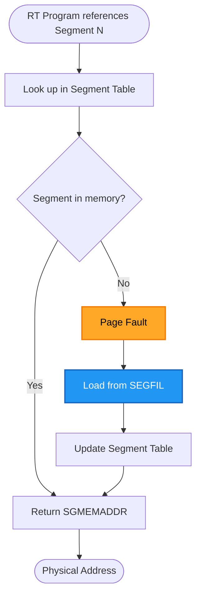
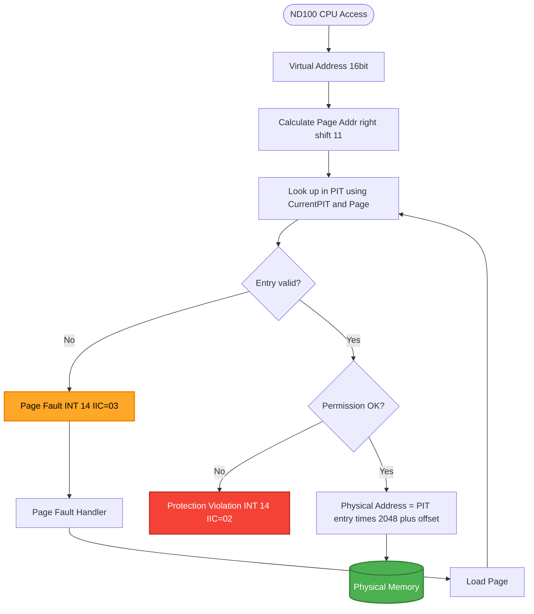
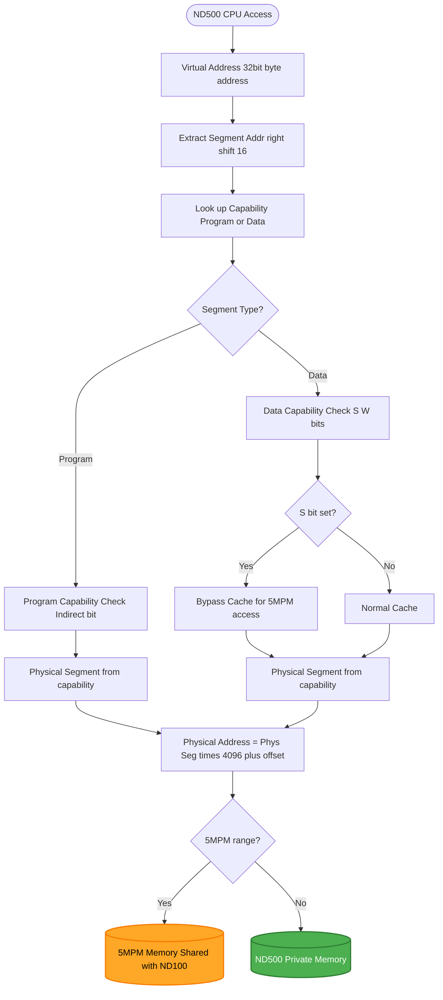

# Complete Memory Map Reference

**Version:** 1.0  
**Date:** 2025-10-17  
**Status:** Complete  
**Author:** AI Analysis of SINTRAN III Source Code and Hardware Documentation

---

## Table of Contents

1. [Overview](#1-overview)
2. [ND-100 Memory Layout](#2-nd-100-memory-layout)
3. [ND-500 Memory Layout](#3-nd-500-memory-layout)
4. [Multiport Memory (5MPM)](#4-multiport-memory-5mpm)
5. [RTCOMMON Area](#5-rtcommon-area)
6. [Segment Address Spaces](#6-segment-address-spaces)
7. [Page Tables (PITs)](#7-page-tables-pits)
8. [Special Memory Areas](#8-special-memory-areas)
9. [Memory Access Patterns](#9-memory-access-patterns)
10. [Emulator Implementation Notes](#10-emulator-implementation-notes)

---

## 1. Overview

### 1.1 Memory Architecture

SINTRAN III runs on a **dual-CPU system**:

- **ND-100:** 16-bit word-addressable CPU, up to 4MB physical memory
- **ND-500:** Byte-addressable CPU, separate address space, shares 5MPM

**Key concepts:**

- **Physical memory:** Raw RAM chips, addressed by MMU-translated addresses
- **Virtual memory:** Paged address space seen by programs (64 pages × 2048 words = 128K words per address space)
- **Shared memory (5MPM):** RAM accessible by both ND-100 and ND-500, with address translation
- **RTCOMMON:** Special shared area for RT programs, always resident
- **Segments:** Numbered blocks of code/data loaded from SEGFILs on demand

### 1.2 Address Notation

Throughout this document:

- **ND-100 addresses:** Hexadecimal (0x0000-0xFFFF for 16-bit words, 0x000000-0x3FFFFF for 22-bit physical)
- **ND-500 addresses:** Byte addresses (0x00000000-0xFFFFFFFF, 32-bit)
- **Page numbers:** Decimal (0-63 for logical, 0-16383 for physical on ND-100)
- **Segment numbers:** Decimal (0-255)

---

## 2. ND-100 Memory Layout

### 2.1 Physical Memory Map

```
ND-100 Physical Memory (22-bit addresses, word-addressable):
┌──────────────────────────────────────────────┐
│ 0x000000 - 0x00FFFF (64K words, 128KB)       │ Low RAM
│   - Boot code                                │
│   - SINTRAN kernel                           │
│   - System tables                            │
│   - RT program code/data                     │
├──────────────────────────────────────────────┤
│ 0x010000 - 0x03FFFF (192K words, 384KB)      │ Extended RAM
│   - Additional kernel                        │
│   - Background programs                      │
│   - Segment buffers                          │
│   - Swap space                               │
├──────────────────────────────────────────────┤
│ 0x040000 - 0x05FFFF (128K words, 256KB)      │ 5MPM (Multiport Memory)
│   - Shared with ND-500                       │
│   - ND-500 process descriptors               │
│   - Message buffers                          │
│   - XMSG kernel                              │
│   - Communication buffers                    │
├──────────────────────────────────────────────┤
│ 0x060000 - 0x3FFFFF (3.75MB words, 7.5MB)    │ Extended RAM (if installed)
│   - Large segments                           │
│   - File buffers                             │
│   - Virtual memory backing store             │
└──────────────────────────────────────────────┘
```

**Typical configuration:**

| Address Range | Size | Purpose |
|---------------|------|---------|
| **0x000000 - 0x00FFFF** | 128KB | Kernel + System |
| **0x010000 - 0x03FFFF** | 384KB | User programs + Buffers |
| **0x040000 - 0x05FFFF** | 256KB | 5MPM (shared with ND-500) |
| **0x060000 - 0x0FFFFF** | 640KB | Extended memory (optional) |

### 2.2 Low Memory (0x000000 - 0x00FFFF)

```
0x000000: ┌──────────────────────────────────┐
          │ Boot Loader                      │
          │  - BOOT-START:                   │
          │  - Device tables                 │
          │  - Boot parameters               │
0x000400: ├──────────────────────────────────┤
          │ SINTRAN Kernel                   │
          │  - Monitor code                  │
          │  - Interrupt handlers            │
          │  - System tables                 │
          │  - Queue headers                 │
0x002000: ├──────────────────────────────────┤
          │ System Variables                 │
          │  - RTCOMMON (if small)           │
          │  - Global tables                 │
          │  - Device datafields             │
0x004000: ├──────────────────────────────────┤
          │ RT Program Code                  │
          │  - Reentrant programs            │
          │  - Device drivers                │
          │  - File system                   │
0x008000: ├──────────────────────────────────┤
          │ RT Program Data                  │
          │  - Working buffers               │
          │  - I/O buffers                   │
          │  - Temporary storage             │
0x00C000: ├──────────────────────────────────┤
          │ Background Programs (PIT 2/3)    │
          │  - User program code/data        │
          │  - Time-sliced programs          │
0x00FFFF: └──────────────────────────────────┘
```

### 2.3 Virtual Address Space (per Process)

Each ND-100 program sees a **64-page virtual address space** (128K words):

```
Virtual Address Space (16-bit addresses):
┌──────────────────────────────────────────┐ 0x0000 (Page 0)
│ Page 0: Interrupt vectors & boot code    │
├──────────────────────────────────────────┤ 0x0800 (Page 1)
│ Page 1-7: Kernel code                    │
│  - Monitor routines                      │
│  - System calls                          │
├──────────────────────────────────────────┤ 0x4000 (Page 8)
│ Page 8-15: Kernel data                   │
│  - System tables                         │
│  - RTCOMMON                              │
├──────────────────────────────────────────┤ 0x8000 (Page 16)
│ Page 16-47: User program                 │
│  - Application code                      │
│  - Application data                      │
│  - Stack                                 │
├──────────────────────────────────────────┤ 0xC000 (Page 48)
│ Page 48-63: Buffers & Windows            │
│  - Buffer window (WNDBF)                 │
│  - User window (WND41)                   │
│  - I/O buffers                           │
└──────────────────────────────────────────┘ 0xFFFF (Page 63 end)
```

**Page calculation:**

```
Virtual address 0x5A3C:
  Page number = 0x5A3C >> 11 = 0x5A3C / 2048 = 11
  Offset within page = 0x5A3C & 0x7FF = 0x23C (572)
  
  Physical address = PIT[11].PhysicalPage * 2048 + 572
```

---

## 3. ND-500 Memory Layout

### 3.1 Physical Memory Map

```
ND-500 Physical Memory (32-bit byte addresses):
┌──────────────────────────────────────────────┐
│ 0x00000000 - 0x7FFFFFFF (2GB)                │ ND-500 Private Memory
│   - Domain 0 (System)                        │
│   - Domain 1-15 (User processes)             │
│   - Each domain: Code + Data + Stack         │
│   - Loaded from :PSEG/:DSEG files            │
├──────────────────────────────────────────────┤
│ 0x80000000 - 0x8003FFFF (256KB)              │ 5MPM (Multiport Memory)
│   - Shared with ND-100 (0x040000-0x05FFFF)   │
│   - Process descriptors                      │
│   - Message buffers                          │
│   - XMSG kernel                              │
├──────────────────────────────────────────────┤
│ 0x80040000 - 0xFFFFFFFF (rest)               │ Extended ND-500 RAM
│   - Additional domains                       │
│   - Large data structures                    │
└──────────────────────────────────────────────┘
```

### 3.2 ND-500 Domain Structure

Each ND-500 process runs in a **domain** with its own address space:

```
Domain Address Space (per process):
┌──────────────────────────────────────────┐ 0x00000000
│ Segment 0: System (Indirect to Seg 31)   │
│  - Monitor call interface                │
├──────────────────────────────────────────┤ 0x00001000
│ Segment 1: Program Code                  │
│  - Loaded from :PSEG file                │
│  - Read/Execute, no Write                │
├──────────────────────────────────────────┤ 0x00010000
│ Segment 2: Data                          │
│  - Loaded from :DSEG file                │
│  - Read/Write, no Execute                │
├──────────────────────────────────────────┤ 0x00020000
│ Segment 3: Stack                         │
│  - Grows downward                        │
│  - Read/Write, no Execute                │
├──────────────────────────────────────────┤ 0x00030000
│ Segment 4-15: Additional segments        │
│  - Optional data segments                │
│  - Shared segments                       │
│  - RTCOMMON mapping (if used)            │
├──────────────────────────────────────────┤ 0x80000000
│ Segment 31: 5MPM (Shared Memory)         │
│  - Mapped to 5MPM physical memory        │
│  - Accessible by both ND-100/ND-500      │
│  - Message buffers here                  │
└──────────────────────────────────────────┘ 0x8003FFFF
```

**Segment Capabilities:**

```
Program Capability (16 bits):
┌───┬──────┬────────────────┐
│ I │ Rsvd │Physical Seg(12)│
└───┴──────┴────────────────┘
 15  14-12  11-0

I=1: Indirect (segment 31 for monitor calls)
Physical Seg: Actual physical segment number (0-4095)

Data Capability (16 bits):
┌───┬───┬──────────────────┐
│ S │ W │  Physical Seg    │
└───┴───┴──────────────────┘
 15  14  13-0

S=1: Cache bypass (for 5MPM access)
W=1: Writable
Physical Seg: Actual physical segment number (0-16383)
```

---

## 4. Multiport Memory (5MPM)

### 4.1 Physical Layout

**5MPM is SHARED physical RAM**, accessible by both CPUs:

```
Physical 5MPM Bank (256KB typical):
┌───────────────────────────────────────────────────┐
│ ND-100 View (0x040000)   ND-500 View (0x80000000) │
│        ↓                          ↓               │ 
│        └──────────┬───────────────┘               │
│                   │                               │
│              SAME PHYSICAL                        │
│                   RAM                             │
│                   │                               │
├───────────────────────────────────────────────────┤
│ Address Translation via BASE registers:           │
│   ND-100: 0x040000 + offset = physical            │
│   ND-500: 0x80000000 + offset = physical          │
│   (BASE register converts ND-500 addr to phys)    │
└───────────────────────────────────────────────────┘
```

### 4.2 5MPM Internal Structure

```
5MPM Internal Layout:
┌──────────────────────────────────────────────┐ Offset 0x0000
│ ND-500 Process Descriptors (S500S - S500E)   │
│   - 16 process slots                         │
│   - 32 words each                            │
│   - Total: 512 words (1KB)                   │
├──────────────────────────────────────────────┤ Offset 0x0200
│ Message Buffers (one per process)            │
│   - 16 message buffers                       │
│   - 128 words each                           │
│   - Total: 2048 words (4KB)                  │
├──────────────────────────────────────────────┤ Offset 0x0A00
│ XMSG Kernel (ND-500 message handler)         │
│   - Code: ~4KB                               │
│   - Data: ~2KB                               │
├──────────────────────────────────────────────┤ Offset 0x2000
│ ACCP Buffers (communication protocol)        │
│   - Protocol state                           │
│   - Send/receive buffers                     │
├──────────────────────────────────────────────┤ Offset 0x4000
│ OCTOBUS Buffers (network interface)          │
│   - Network packet buffers                   │
│   - Routing tables                           │
├──────────────────────────────────────────────┤ Offset 0x8000
│ HW Buffers (hardware interface)              │
│   - DMA buffers                              │
│   - Device status                            │
├──────────────────────────────────────────────┤ Offset 0xC000
│ General Purpose (remaining space)            │
│   - Additional buffers                       │
│   - Temporary storage                        │
│   - Free space for expansion                 │
└──────────────────────────────────────────────┘ Offset 0x3FFFF
```

### 4.3 Process Descriptor Format

**Location:** 5MPM base + (process_num × 32 words)

```npl
% ND-500 Process Descriptor (32 words)
DISP 0
    INTEGER XADPROC     % 0: Self address (in 5MPM)
    INTEGER MESSBUFF    % 2: Message buffer address
    INTEGER STATUS      % 4: Process status
    INTEGER SENDENABLE  % 6: Send enable (>0 = active)
    INTEGER RECVSTATE   % 8: Receive state
    INTEGER PRIORITY    % 10: Process priority
    INTEGER CPUNUMBER   % 12: CPU number
    INTEGER DOMAINNUM   % 14: Domain number
    INTEGER PGMCAP      % 16: Program capability (segment 1)
    INTEGER DATACAP     % 18: Data capability (segment 2)
    INTEGER STACKCAP    % 20: Stack capability (segment 3)
    % ... (12 more words)
PSID
```

### 4.4 Message Buffer Format

**Location:** 5MPM base + process descriptor MESSBUFF offset

```npl
% ND-500 Message Buffer (128 words)
DISP 0
    INTEGER PLINK       % 0: Process link
    INTEGER FLAGS       % 2: Flags (bit 0: ITMQUEUE)
    INTEGER PRIO        % 4: Priority
    INTEGER MICFU       % 6: Microcode function
    INTEGER ERRC        % 8: Error code
    DOUBLE TODF         % 10: To datafield (32-bit)
    DOUBLE NRBYT        % 14: Byte count (32-bit)
    DOUBLE N500A        % 18: ND-500 address (32-bit)
    DOUBLE N100A        % 22: ND-100 address (32-bit)
    INTEGER XMICF       % 26: Extended function
    INTEGER DITN        % 28: DIT number
    INTEGER CPUN        % 30: CPU number
    INTEGER DATA(96)    % 32: Data area (192 bytes)
PSID
```

---

## 5. RTCOMMON Area

### 5.1 Purpose

**RTCOMMON** is a **shared memory area** accessible by all RT programs:

- **Always resident** (never paged out)
- **Fixed physical location** (known at system generation)
- **Fast communication** between RT programs
- **Fast ND-100/ND-500 communication** (when mapped to 5MPM)

### 5.2 Location and Size

**Typical configuration:**

| Parameter | Value | Notes |
|-----------|-------|-------|
| **Start Address** | 0x002000 | Configurable at system generation |
| **Size** | 1024-8192 words | System-dependent, typical 2KB |
| **ND-100 View** | Fixed physical address | Never moves |
| **ND-500 View** | Via segment mapping | Mapped to ND-500 segment 4-15 |

**From boot sequence:**

```npl
% RTCOMMON initialization
RTCOMMON_START =: 0x002000      % Physical address
RTCOMMON_SIZE =: 0x0800         % 2KB (2048 words)
RTCOMMON_END =: 0x002800
```

### 5.3 RTCOMMON Structure

```
RTCOMMON Area (example: 0x002000 - 0x002800):
┌──────────────────────────────────────────┐ 0x002000
│ System Flags (16 words)                  │
│  - Kernel status                         │
│  - Error flags                           │
│  - Device states                         │
├──────────────────────────────────────────┤ 0x002010
│ Communication Queues (64 words)          │
│  - RT-to-RT message queues               │
│  - Event flags                           │
├──────────────────────────────────────────┤ 0x002050
│ ND-500 Communication (128 words)         │
│  - ND-500 request flags                  │
│  - ND-500 response buffers               │
│  - Status indicators                     │
├──────────────────────────────────────────┤ 0x0020D0
│ Shared Data (variable)                   │
│  - RT program shared variables           │
│  - Global counters                       │
│  - Timestamps                            │
├──────────────────────────────────────────┤ 0x002400
│ Semaphores (32 words)                    │
│  - Lock variables                        │
│  - Resource allocation flags             │
├──────────────────────────────────────────┤ 0x002420
│ Reserved (remaining space)               │
│  - Future expansion                      │
└──────────────────────────────────────────┘ 0x002800
```

### 5.4 ND-500 Access to RTCOMMON

**ND-500 programs access RTCOMMON via segment mapping:**

```
ND-500 Segment 4 (example):
  Segment Capability = Physical Address / 4096
  If RTCOMMON at 0x002000 (ND-100):
    Physical page = 0x002000 / 4096 = 2
    ND-500 Segment 4 capability = 2
    
  ND-500 access:
    Address 0x00010000 (segment 4 base)
    → Maps to physical 0x002000
    → RTCOMMON!
```

**Benefits:**

- **Fast:** Direct memory access, no message passing
- **Predictable:** Always resident, no page faults
- **Flexible:** Can share arbitrary data structures

**Limitations:**

- **Contiguous:** ND-500 requires contiguous RTCOMMON
- **Fixed size:** Cannot expand without reloading ND-500 segments
- **Cache coherency:** ND-500 must bypass cache (S flag in data capability)

---

## 6. Segment Address Spaces

### 6.1 Segment Table

SINTRAN maintains a **segment table** with one entry per segment (0-255):

```npl
% Segment table entry (5 words)
DISP 0
    INTEGER SGLENGTH    % 0: Segment length (pages)
    INTEGER SGSTATUS    % 1: Status flags
    INTEGER SGFILNO     % 2: SEGFIL number (0-4)
    INTEGER SGOFFSET    % 3: Offset in SEGFIL (pages)
    INTEGER SGMEMADDR   % 4: Physical memory address (if resident)
PSID
SEGSIZE = 5            % 5 words per entry
```

**Segment table location:**

```npl
SEGSTART = 0x001000    % Segment table base address
SEGMAX = 255           % Maximum segment number

% Access segment N:
SEGSTART + N * SEGSIZE = Address of segment N's table entry
```

### 6.2 Segment Number to Physical Address

**Process:**



**Example:**

```
RT Program references Segment 45:
1. Look up: SEGSTART + 45 * 5 = 0x001000 + 225 = 0x0010E1
2. Read segment table entry at 0x0010E1:
     SGLENGTH = 8 pages
     SGSTATUS = 0x01 (resident)
     SGFILNO = 2
     SGOFFSET = 120
     SGMEMADDR = 0x00A000
3. Return physical address: 0x00A000
```

### 6.3 Segment Loading

From Chapter 11 (RT Segments and SEGFIL):

```npl
% SEGIN: Load segment into memory
SEGIN:
    % Get segment table entry
    SEGNO * SEGSIZE + SEGSTART =: X
    
    % Check if already resident
    IF X.SGSTATUS BIT SGRESIDENT THEN EXIT FI
    
    % Allocate physical memory
    CALL ALLOCMEM(X.SGLENGTH)
    PHYSADDR =: A
    
    % Load from SEGFIL
    FILENO =: X.SGFILNO
    OFFSET =: X.SGOFFSET
    COUNT =: X.SGLENGTH
    CALL READSEGFIL(FILENO, OFFSET, PHYSADDR, COUNT)
    
    % Update segment table
    PHYSADDR =: X.SGMEMADDR
    X.SGSTATUS BONE SGRESIDENT =: X.SGSTATUS
    
    EXIT
```

---

## 7. Page Tables (PITs)

### 7.1 PIT Structure

ND-100 has **4 Page Index Tables** (PITs), each with **64 entries**:

```
PIT 0 (System/Kernel):
┌───────────────────────────────────┐
│ Entry 0: Physical page 0          │ → Physical 0x000000
│ Entry 1: Physical page 1          │ → Physical 0x000800
│ ...                               │
│ Entry 63: Physical page 63        │ → Physical 0x01F800
└───────────────────────────────────┘

PIT 1 (RT Programs):
┌───────────────────────────────────┐
│ Entry 0: Physical page 10         │ → Physical 0x005000
│ Entry 1: Physical page 11         │ → Physical 0x005800
│ ...                               │
│ Entry 63: Physical page 73        │ → Physical 0x024800
└───────────────────────────────────┘

PIT 2 (Background 1):
┌───────────────────────────────────┐
│ Entry 0: Physical page 100        │ → Physical 0x032000
│ ...                               │
└───────────────────────────────────┘

PIT 3 (Background 2):
┌───────────────────────────────────┐
│ Entry 0: Physical page 200        │ → Physical 0x064000
│ ...                               │
└───────────────────────────────────┘
```

### 7.2 PIT Entry Format

```
PIT Entry (16 bits):
┌────┬─────────────────┐
│Perm│  Physical Page  │
└────┴─────────────────┘
 15-14  13-0

Permissions (2 bits):
  00: No access (page fault)
  01: Read-only
  10: Read/Write, Ring 2 or higher
  11: Read/Write, all rings

Physical Page (14 bits):
  0-16383 (supports up to 32MB physical memory)
```

**Example:**

```
PIT[0] entry 16 = 0xC120
  Permissions = 11 (Read/Write, all rings)
  Physical page = 0x0120 = 288
  Physical address = 288 * 2048 = 589824 = 0x090000
  
Virtual address 0x8000 (page 16, offset 0):
  → PIT[0] entry 16 → Physical page 288
  → Physical address 0x090000
```

### 7.3 PCR (Paging Control Register)

From Chapter 04 (MMU Context Switching):

```
PCR Format (16 bits):
┌──────────┬──────────┬──────────┐
│ Priority │   NPIT   │   Ring   │
│  8 bits  │  4 bits  │  4 bits  │
└──────────┴──────────┴──────────┘
 15-8       7-4        3-0

Priority: Task priority (0-255)
NPIT: Normal PIT number (0-3)
Ring: Ring level (0-3)
```

**Context switch:**

```npl
% Switch to new task
A =: NEW_TASK.ACTPRI    % ACTPRI has same format as PCR
*TRR PCR                % Load PCR - MMU reconfigured!
```

---

## 8. Special Memory Areas

### 8.1 System Variables

**Location:** 0x000000 - 0x001000 (first 4KB)

```
0x0000: ┌──────────────────────────────────┐
        │ Interrupt Vectors                │
        │  - P register for each level     │
0x0100: ├──────────────────────────────────┤
        │ Global System Variables          │
        │  - CURPROG: Current RT program   │
        │  - BEXEQU: Execution queue head  │
        │  - BTIMQU: Time queue head       │
0x0200: ├──────────────────────────────────┤
        │ Queue Headers                    │
        │  - BMQUEEXT: Monitor queue       │
        │  - BRESERV: Reservation queue    │
0x0300: ├──────────────────────────────────┤
        │ Ident Tables                     │
        │  - ITB10: Level 10 devices       │
        │  - ITB11: Level 11 devices       │
        │  - ITB12: Level 12 devices       │
0x0400: ├──────────────────────────────────┤
        │ Device Datafields                │
        │  - One per I/O device            │
0x0800: ├──────────────────────────────────┤
        │ Segment Table                    │
        │  - 256 segments × 5 words        │
0x0C00: ├──────────────────────────────────┤
        │ RT-Descriptions                  │
        │  - One per RT program            │
0x1000: └──────────────────────────────────┘
```

### 8.2 Buffer Windows

**Purpose:** Map I/O buffers into user address space

```
Buffer Window (WNDBF):
  Virtual address: 0xC000 (page 48)
  Size: 8192 words (4 pages)
  Usage: Map disk/tape buffers for direct access
  
User Window (WND41):
  Virtual address: 0xE000 (page 56)
  Size: 4096 words (2 pages)
  Usage: Map user-specified physical memory
  
ND-500 Window (WNDN5):
  Virtual address: 0xF000 (page 60)
  Size: 2048 words (1 page)
  Usage: Map 5MPM for ND-500 communication
```

**Window Mapping:**

```npl
% Map physical page PHYSPAGE to window WNDPAGE
A =: WNDPAGE; *TRA PGS          % Get PIT entry address for WNDPAGE
D =: PHYSPAGE SH 2 \/ PERMIT    % Build PIT entry (Read/Write)
*TRA STS; STATX                 % Store in PIT
% Now virtual address WNDPAGE * 2048 maps to PHYSPAGE
```

### 8.3 Swap File

**Purpose:** Store paged-out segments and programs

**Location:** Dedicated disk area (SEGFIL 0 or separate disk)

```
Swap File Structure:
┌──────────────────────────────────┐
│ Swap Map (bitmap)                │ Track free/used pages
│  - 1 bit per page                │
├──────────────────────────────────┤
│ Swapped Pages                    │
│  - Programs paged out            │
│  - Segments not currently used   │
│  - Modified pages                │
└──────────────────────────────────┘
```

---

## 9. Memory Access Patterns

### 9.1 ND-100 Memory Access



### 9.2 ND-500 Memory Access



### 9.3 5MPM Shared Access

```
ND-100 accesses 5MPM:
  Physical address: 0x040000 + offset
  Word-aligned access (16-bit)
  
ND-500 accesses 5MPM:
  Virtual address: 0x80000000 + offset
  Byte-addressable (8-bit)
  Via segment capability with S=1 (cache bypass)
  
Both access SAME physical RAM:
  BASE register translates ND-500 addr → physical
  Interleaving ensures consistency
  S flag ensures cache coherency
```

---

## 10. Emulator Implementation Notes

### 10.1 Memory Class Structure

```csharp
namespace RetroCore.Emulated.SINTRAN.Memory
{
    /// <summary>
    /// SINTRAN memory subsystem
    /// </summary>
    public class SINTRANMemory
    {
        // Physical memory arrays
        private ushort[] _nd100Memory;      // ND-100 physical (word-addressable)
        private byte[] _nd500Memory;        // ND-500 private (byte-addressable)
        private byte[] _multiportMemory;    // 5MPM shared (thread-safe)
        
        // Memory configuration
        private uint _nd100Size;            // e.g., 0x400000 (4MB words = 8MB bytes)
        private uint _nd500Size;            // e.g., 0x80000000 (2GB)
        private uint _mpmSize;              // e.g., 0x40000 (256KB)
        private uint _mpmND100Base;         // e.g., 0x040000
        private uint _mpmND500Base;         // e.g., 0x80000000
        
        // MMU structures
        private ushort[][] _pageIndexTables;  // 4 PITs × 64 entries
        private byte _currentPIT;           // Active PIT (0-3)
        private byte _currentRing;          // Active ring (0-3)
        
        // Segment table
        private uint _segmentTableBase;     // e.g., 0x001000
        
        public SINTRANMemory(uint nd100Size, uint nd500Size, uint mpmSize)
        {
            _nd100Size = nd100Size;
            _nd500Size = nd500Size;
            _mpmSize = mpmSize;
            
            _nd100Memory = new ushort[nd100Size];
            _nd500Memory = new byte[nd500Size];
            _multiportMemory = new byte[mpmSize];
            
            _pageIndexTables = new ushort[4][];
            for (int i = 0; i < 4; i++)
                _pageIndexTables[i] = new ushort[64];
                
            _currentPIT = 0;
            _currentRing = 0;
        }
        
        /// <summary>
        /// ND-100 virtual to physical address translation
        /// </summary>
        public uint TranslateND100Address(ushort virtualAddr, out bool pageFault)
        {
            pageFault = false;
            
            // Extract page and offset
            ushort page = (ushort)(virtualAddr >> 11);  // Top 5 bits
            ushort offset = (ushort)(virtualAddr & 0x7FF);  // Bottom 11 bits
            
            // Look up in current PIT
            ushort pitEntry = _pageIndexTables[_currentPIT][page];
            
            // Check if valid
            if (pitEntry == 0)
            {
                pageFault = true;
                return 0;
            }
            
            // Extract physical page (bottom 14 bits)
            uint physicalPage = (uint)(pitEntry & 0x3FFF);
            
            // Calculate physical address
            uint physicalAddr = physicalPage * 2048 + offset;
            
            return physicalAddr;
        }
        
        /// <summary>
        /// ND-100 read word (with MMU translation)
        /// </summary>
        public ushort ReadND100Virtual(ushort virtualAddr)
        {
            uint physicalAddr = TranslateND100Address(virtualAddr, out bool pageFault);
            
            if (pageFault)
                throw new PageFaultException(virtualAddr);
                
            return ReadND100Physical(physicalAddr);
        }
        
        /// <summary>
        /// ND-100 read word (physical)
        /// </summary>
        public ushort ReadND100Physical(uint physicalAddr)
        {
            // Check if in 5MPM range
            if (physicalAddr >= _mpmND100Base && 
                physicalAddr < _mpmND100Base + _mpmSize / 2)
            {
                uint mpmOffset = (physicalAddr - _mpmND100Base) * 2;
                return (ushort)((_multiportMemory[mpmOffset] << 8) | 
                               _multiportMemory[mpmOffset + 1]);
            }
            
            return _nd100Memory[physicalAddr];
        }
        
        /// <summary>
        /// ND-500 virtual to physical address translation
        /// </summary>
        public uint TranslateND500Address(uint virtualAddr, 
            ND500ProcessDescriptor process)
        {
            // Extract segment and offset
            uint segment = virtualAddr >> 16;       // Top 16 bits
            uint offset = virtualAddr & 0xFFFF;     // Bottom 16 bits
            
            // Get capability
            ushort capability;
            if (segment == 0)
                capability = process.ProgramCapability;  // Segment 0 (code)
            else if (segment == 1)
                capability = process.DataCapability;     // Segment 1 (data)
            else
                capability = process.GetSegmentCapability(segment);
            
            // Extract physical segment
            uint physicalSeg = (uint)(capability & 0x3FFF);
            
            // Calculate physical address
            uint physicalAddr = physicalSeg * 4096 + offset;
            
            return physicalAddr;
        }
        
        /// <summary>
        /// ND-500 read byte (with MMU translation)
        /// </summary>
        public byte ReadND500Virtual(uint virtualAddr, ND500ProcessDescriptor process)
        {
            uint physicalAddr = TranslateND500Address(virtualAddr, process);
            return ReadND500Physical(physicalAddr);
        }
        
        /// <summary>
        /// ND-500 read byte (physical)
        /// </summary>
        public byte ReadND500Physical(uint physicalAddr)
        {
            // Check if in 5MPM range
            if (physicalAddr >= _mpmND500Base && 
                physicalAddr < _mpmND500Base + _mpmSize)
            {
                uint mpmOffset = physicalAddr - _mpmND500Base;
                return _multiportMemory[mpmOffset];
            }
            
            return _nd500Memory[physicalAddr];
        }
        
        /// <summary>
        /// Write to 5MPM (thread-safe)
        /// </summary>
        public void WriteMultiportMemory(uint offset, byte[] data)
        {
            lock (_multiportMemory)
            {
                Array.Copy(data, 0, _multiportMemory, offset, data.Length);
            }
        }
        
        /// <summary>
        /// Load PIT from PCR (context switch)
        /// </summary>
        public void LoadPCR(ushort pcr)
        {
            _currentPIT = (byte)((pcr >> 4) & 0x0F);
            _currentRing = (byte)(pcr & 0x0F);
        }
    }
    
    public class PageFaultException : Exception
    {
        public ushort FaultAddress { get; }
        
        public PageFaultException(ushort addr) 
            : base($"Page fault at address 0x{addr:X4}")
        {
            FaultAddress = addr;
        }
    }
}
```

---

## Appendix A: Quick Reference

### Memory Ranges

| Region | ND-100 Physical | ND-500 Physical | Size | Purpose |
|--------|-----------------|-----------------|------|---------|
| **Low RAM** | 0x000000-0x00FFFF | N/A | 128KB | Kernel + System |
| **Extended RAM** | 0x010000-0x03FFFF | N/A | 384KB | Programs + Buffers |
| **5MPM** | 0x040000-0x05FFFF | 0x80000000-0x8003FFFF | 256KB | Shared memory |
| **ND-500 Private** | N/A | 0x00000000-0x7FFFFFFF | 2GB | ND-500 domains |

### Key Addresses

| Symbol | Address | Purpose |
|--------|---------|---------|
| **SEGSTART** | 0x001000 | Segment table base |
| **RTCOMMON** | 0x002000 | Shared RT area |
| **CURPROG** | 0x000100 | Current RT program |
| **BEXEQU** | 0x000110 | Execution queue head |

### Page Sizes

| System | Page Size | Address Bits | Max Pages |
|--------|-----------|--------------|-----------|
| **ND-100** | 2048 words (4KB) | 11 bits offset | 64 logical, 16384 physical |
| **ND-500** | 4096 bytes (4KB) | 12 bits offset | Variable per segment |

---

## Appendix B: Related Documentation

- **Chapter 04:** MMU Context Switching (PIT details)
- **Chapter 10:** ND-500 Standalone Emulator (ND-500 memory setup)
- **Chapter 11:** RT Segments and SEGFIL (segment loading)
- **Chapter 12:** ND-500 Domain Setup (5MPM configuration)
- **MPM5-KEY-FINDINGS.md:** Hardware memory architecture

---

**End of Document**

