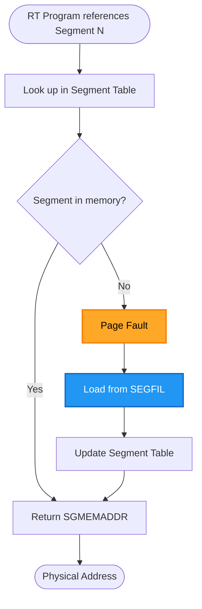
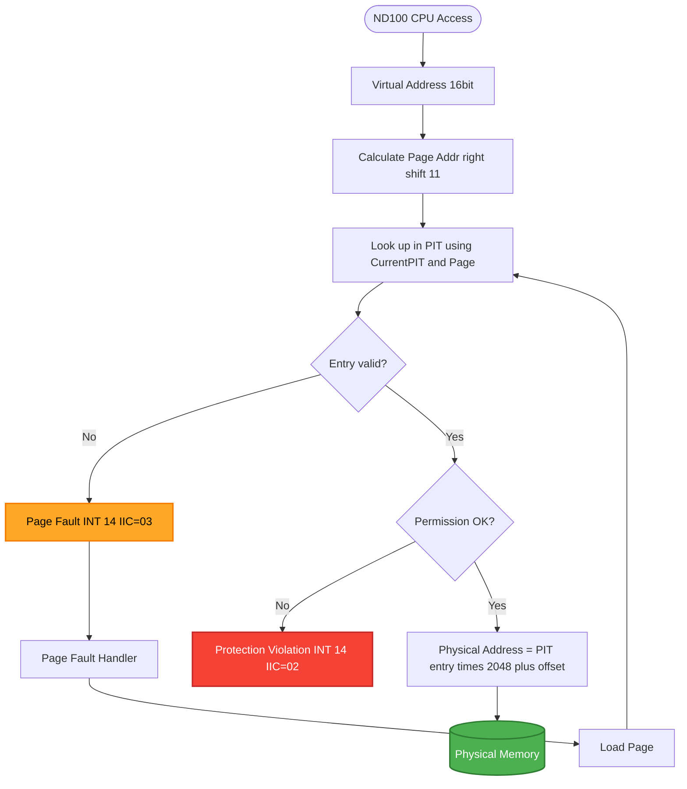
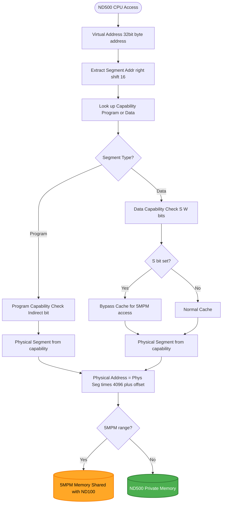
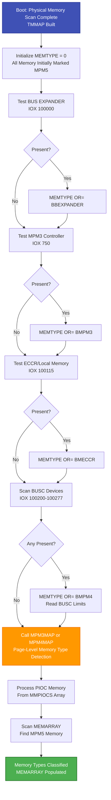
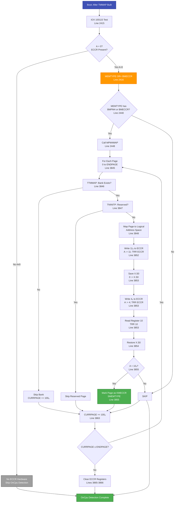
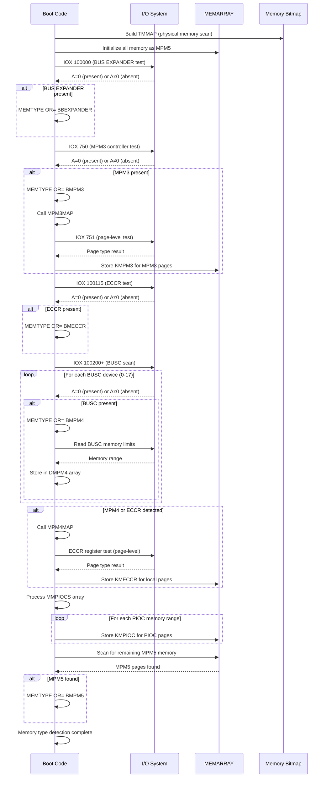
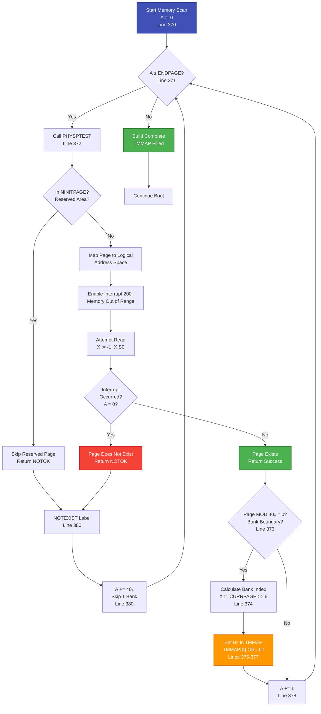
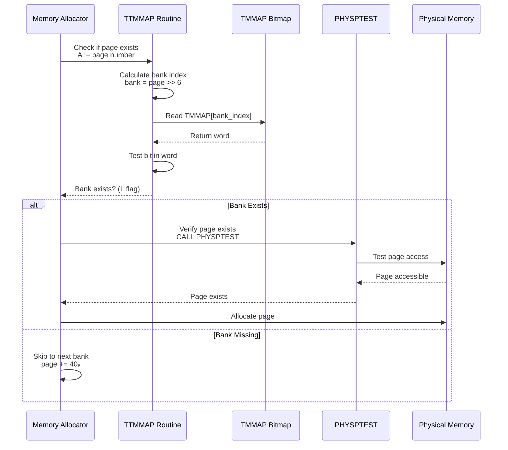

# Complete Memory Map Reference

**Version:** 1.0  
**Date:** 2025-10-17  
**Status:** Complete  
**Author:** AI Analysis of SINTRAN III Source Code and Hardware Documentation

---

## Table of Contents

1. [Overview](#1-overview)
2. [ND-100 Memory Layout](#2-nd-100-memory-layout)
3. [ND-500 Memory Layout](#3-nd-500-memory-layout)
4. [Multiport Memory (5MPM)](#4-multiport-memory-5mpm)
5. [RTCOMMON Area](#5-rtcommon-area)
6. [Segment Address Spaces](#6-segment-address-spaces)
7. [Page Tables (PITs)](#7-page-tables-pits)
8. [Special Memory Areas](#8-special-memory-areas)
9. [Memory Access Patterns](#9-memory-access-patterns)
10. [Emulator Implementation Notes](#10-emulator-implementation-notes)

---

## 1. Overview

### 1.1 Memory Architecture

SINTRAN III runs on a **dual-CPU system**:

- **ND-100:** 16-bit word-addressable CPU, up to 4MB physical memory
- **ND-500:** Byte-addressable CPU, separate address space, shares 5MPM

**Key concepts:**

- **Physical memory:** Raw RAM chips, addressed by MMU-translated addresses
- **Virtual memory:** Paged address space seen by programs (64 pages × 2048 words = 128K words per address space)
- **Shared memory (5MPM):** RAM accessible by both ND-100 and ND-500, with address translation
- **RTCOMMON:** Special shared area for RT programs, always resident
- **Segments:** Numbered blocks of code/data loaded from SEGFILs on demand

### 1.2 Address Notation

Throughout this document:

- **ND-100 addresses:** Hexadecimal (0x0000-0xFFFF for 16-bit words, 0x000000-0x3FFFFF for 22-bit physical)
- **ND-500 addresses:** Byte addresses (0x00000000-0xFFFFFFFF, 32-bit)
- **Page numbers:** Decimal (0-63 for logical, 0-16383 for physical on ND-100)
- **Segment numbers:** Decimal (0-255)

---

## 2. ND-100 Memory Layout

### 2.1 Physical Memory Map

```
ND-100 Physical Memory (22-bit addresses, word-addressable):
┌──────────────────────────────────────────────┐
│ 0x000000 - 0x00FFFF (64K words, 128KB)       │ Low RAM
│   - Boot code                                │
│   - SINTRAN kernel                           │
│   - System tables                            │
│   - RT program code/data                     │
├──────────────────────────────────────────────┤
│ 0x010000 - 0x03FFFF (192K words, 384KB)      │ Extended RAM
│   - Additional kernel                        │
│   - Background programs                      │
│   - Segment buffers                          │
│   - Swap space                               │
├──────────────────────────────────────────────┤
│ 0x040000 - 0x05FFFF (128K words, 256KB)      │ 5MPM (Multiport Memory)
│   - Shared with ND-500                       │
│   - ND-500 process descriptors               │
│   - Message buffers                          │
│   - XMSG kernel                              │
│   - Communication buffers                    │
├──────────────────────────────────────────────┤
│ 0x060000 - 0x3FFFFF (3.75MB words, 7.5MB)    │ Extended RAM (if installed)
│   - Large segments                           │
│   - File buffers                             │
│   - Virtual memory backing store             │
└──────────────────────────────────────────────┘
```

**Typical configuration:**

| Address Range | Size | Purpose |
|---------------|------|---------|
| **0x000000 - 0x00FFFF** | 128KB | Kernel + System |
| **0x010000 - 0x03FFFF** | 384KB | User programs + Buffers |
| **0x040000 - 0x05FFFF** | 256KB | 5MPM (shared with ND-500) |
| **0x060000 - 0x0FFFFF** | 640KB | Extended memory (optional) |

### 2.2 Low Memory (0x000000 - 0x00FFFF)

```
0x000000: ┌──────────────────────────────────┐
          │ Boot Loader                      │
          │  - BOOT-START:                   │
          │  - Device tables                 │
          │  - Boot parameters               │
0x000400: ├──────────────────────────────────┤
          │ SINTRAN Kernel                   │
          │  - Monitor code                  │
          │  - Interrupt handlers            │
          │  - System tables                 │
          │  - Queue headers                 │
0x002000: ├──────────────────────────────────┤
          │ System Variables                 │
          │  - RTCOMMON (if small)           │
          │  - Global tables                 │
          │  - Device datafields             │
0x004000: ├──────────────────────────────────┤
          │ RT Program Code                  │
          │  - Reentrant programs            │
          │  - Device drivers                │
          │  - File system                   │
0x008000: ├──────────────────────────────────┤
          │ RT Program Data                  │
          │  - Working buffers               │
          │  - I/O buffers                   │
          │  - Temporary storage             │
0x00C000: ├──────────────────────────────────┤
          │ Background Programs (PIT 2/3)    │
          │  - User program code/data        │
          │  - Time-sliced programs          │
0x00FFFF: └──────────────────────────────────┘
```

### 2.3 Virtual Address Space (per Process)

Each ND-100 program sees a **64-page virtual address space** (128K words):

```
Virtual Address Space (16-bit addresses):
┌──────────────────────────────────────────┐ 0x0000 (Page 0)
│ Page 0: Interrupt vectors & boot code    │
├──────────────────────────────────────────┤ 0x0800 (Page 1)
│ Page 1-7: Kernel code                    │
│  - Monitor routines                      │
│  - System calls                          │
├──────────────────────────────────────────┤ 0x4000 (Page 8)
│ Page 8-15: Kernel data                   │
│  - System tables                         │
│  - RTCOMMON                              │
├──────────────────────────────────────────┤ 0x8000 (Page 16)
│ Page 16-47: User program                 │
│  - Application code                      │
│  - Application data                      │
│  - Stack                                 │
├──────────────────────────────────────────┤ 0xC000 (Page 48)
│ Page 48-63: Buffers & Windows            │
│  - Buffer window (WNDBF)                 │
│  - User window (WND41)                   │
│  - I/O buffers                           │
└──────────────────────────────────────────┘ 0xFFFF (Page 63 end)
```

**Page calculation:**

```
Virtual address 0x5A3C:
  Page number = 0x5A3C >> 11 = 0x5A3C / 2048 = 11
  Offset within page = 0x5A3C & 0x7FF = 0x23C (572)
  
  Physical address = PIT[11].PhysicalPage * 2048 + 572
```

---

## 3. ND-500 Memory Layout

### 3.1 Physical Memory Map

```
ND-500 Physical Memory (32-bit byte addresses):
┌──────────────────────────────────────────────┐
│ 0x00000000 - 0x7FFFFFFF (2GB)                │ ND-500 Private Memory
│   - Domain 0 (System)                        │
│   - Domain 1-15 (User processes)             │
│   - Each domain: Code + Data + Stack         │
│   - Loaded from :PSEG/:DSEG files            │
├──────────────────────────────────────────────┤
│ 0x80000000 - 0x8003FFFF (256KB)              │ 5MPM (Multiport Memory)
│   - Shared with ND-100 (0x040000-0x05FFFF)   │
│   - Process descriptors                      │
│   - Message buffers                          │
│   - XMSG kernel                              │
├──────────────────────────────────────────────┤
│ 0x80040000 - 0xFFFFFFFF (rest)               │ Extended ND-500 RAM
│   - Additional domains                       │
│   - Large data structures                    │
└──────────────────────────────────────────────┘
```

### 3.2 ND-500 Domain Structure

Each ND-500 process runs in a **domain** with its own address space:

```
Domain Address Space (per process):
┌──────────────────────────────────────────┐ 0x00000000
│ Segment 0: System (Indirect to Seg 31)   │
│  - Monitor call interface                │
├──────────────────────────────────────────┤ 0x00001000
│ Segment 1: Program Code                  │
│  - Loaded from :PSEG file                │
│  - Read/Execute, no Write                │
├──────────────────────────────────────────┤ 0x00010000
│ Segment 2: Data                          │
│  - Loaded from :DSEG file                │
│  - Read/Write, no Execute                │
├──────────────────────────────────────────┤ 0x00020000
│ Segment 3: Stack                         │
│  - Grows downward                        │
│  - Read/Write, no Execute                │
├──────────────────────────────────────────┤ 0x00030000
│ Segment 4-15: Additional segments        │
│  - Optional data segments                │
│  - Shared segments                       │
│  - RTCOMMON mapping (if used)            │
├──────────────────────────────────────────┤ 0x80000000
│ Segment 31: 5MPM (Shared Memory)         │
│  - Mapped to 5MPM physical memory        │
│  - Accessible by both ND-100/ND-500      │
│  - Message buffers here                  │
└──────────────────────────────────────────┘ 0x8003FFFF
```

**Segment Capabilities:**

```
Program Capability (16 bits):
┌───┬──────┬────────────────┐
│ I │ Rsvd │Physical Seg(12)│
└───┴──────┴────────────────┘
 15  14-12  11-0

I=1: Indirect (segment 31 for monitor calls)
Physical Seg: Actual physical segment number (0-4095)

Data Capability (16 bits):
┌───┬───┬──────────────────┐
│ S │ W │  Physical Seg    │
└───┴───┴──────────────────┘
 15  14  13-0

S=1: Cache bypass (for 5MPM access)
W=1: Writable
Physical Seg: Actual physical segment number (0-16383)
```

---

## 4. Multiport Memory (5MPM)

### 4.1 Physical Layout

**5MPM is SHARED physical RAM**, accessible by both CPUs:

```
Physical 5MPM Bank (256KB typical):
┌───────────────────────────────────────────────────┐
│ ND-100 View (0x040000)   ND-500 View (0x80000000) │
│        ↓                          ↓               │ 
│        └──────────┬───────────────┘               │
│                   │                               │
│              SAME PHYSICAL                        │
│                   RAM                             │
│                   │                               │
├───────────────────────────────────────────────────┤
│ Address Translation via BASE registers:           │
│   ND-100: 0x040000 + offset = physical            │
│   ND-500: 0x80000000 + offset = physical          │
│   (BASE register converts ND-500 addr to phys)    │
└───────────────────────────────────────────────────┘
```

### 4.2 5MPM Internal Structure

```
5MPM Internal Layout:
┌──────────────────────────────────────────────┐ Offset 0x0000
│ ND-500 Process Descriptors (S500S - S500E)   │
│   - 16 process slots                         │
│   - 32 words each                            │
│   - Total: 512 words (1KB)                   │
├──────────────────────────────────────────────┤ Offset 0x0200
│ Message Buffers (one per process)            │
│   - 16 message buffers                       │
│   - 128 words each                           │
│   - Total: 2048 words (4KB)                  │
├──────────────────────────────────────────────┤ Offset 0x0A00
│ XMSG Kernel (ND-500 message handler)         │
│   - Code: ~4KB                               │
│   - Data: ~2KB                               │
├──────────────────────────────────────────────┤ Offset 0x2000
│ ACCP Buffers (communication protocol)        │
│   - Protocol state                           │
│   - Send/receive buffers                     │
├──────────────────────────────────────────────┤ Offset 0x4000
│ OCTOBUS Buffers (network interface)          │
│   - Network packet buffers                   │
│   - Routing tables                           │
├──────────────────────────────────────────────┤ Offset 0x8000
│ HW Buffers (hardware interface)              │
│   - DMA buffers                              │
│   - Device status                            │
├──────────────────────────────────────────────┤ Offset 0xC000
│ General Purpose (remaining space)            │
│   - Additional buffers                       │
│   - Temporary storage                        │
│   - Free space for expansion                 │
└──────────────────────────────────────────────┘ Offset 0x3FFFF
```

### 4.3 Process Descriptor Format

**Location:** 5MPM base + (process_num × 32 words)

```npl
% ND-500 Process Descriptor (32 words)
DISP 0
    INTEGER XADPROC     % 0: Self address (in 5MPM)
    INTEGER MESSBUFF    % 2: Message buffer address
    INTEGER STATUS      % 4: Process status
    INTEGER SENDENABLE  % 6: Send enable (>0 = active)
    INTEGER RECVSTATE   % 8: Receive state
    INTEGER PRIORITY    % 10: Process priority
    INTEGER CPUNUMBER   % 12: CPU number
    INTEGER DOMAINNUM   % 14: Domain number
    INTEGER PGMCAP      % 16: Program capability (segment 1)
    INTEGER DATACAP     % 18: Data capability (segment 2)
    INTEGER STACKCAP    % 20: Stack capability (segment 3)
    % ... (12 more words)
PSID
```

### 4.4 Message Buffer Format

**Location:** 5MPM base + process descriptor MESSBUFF offset

```npl
% ND-500 Message Buffer (128 words)
DISP 0
    INTEGER PLINK       % 0: Process link
    INTEGER FLAGS       % 2: Flags (bit 0: ITMQUEUE)
    INTEGER PRIO        % 4: Priority
    INTEGER MICFU       % 6: Microcode function
    INTEGER ERRC        % 8: Error code
    DOUBLE TODF         % 10: To datafield (32-bit)
    DOUBLE NRBYT        % 14: Byte count (32-bit)
    DOUBLE N500A        % 18: ND-500 address (32-bit)
    DOUBLE N100A        % 22: ND-100 address (32-bit)
    INTEGER XMICF       % 26: Extended function
    INTEGER DITN        % 28: DIT number
    INTEGER CPUN        % 30: CPU number
    INTEGER DATA(96)    % 32: Data area (192 bytes)
PSID
```

---

## 5. RTCOMMON Area

### 5.1 Purpose

**RTCOMMON** is a **shared memory area** accessible by all RT programs:

- **Always resident** (never paged out)
- **Fixed physical location** (known at system generation)
- **Fast communication** between RT programs
- **Fast ND-100/ND-500 communication** (when mapped to 5MPM)

### 5.2 Location and Size

**Typical configuration:**

| Parameter | Value | Notes |
|-----------|-------|-------|
| **Start Address** | 0x002000 | Configurable at system generation |
| **Size** | 1024-8192 words | System-dependent, typical 2KB |
| **ND-100 View** | Fixed physical address | Never moves |
| **ND-500 View** | Via segment mapping | Mapped to ND-500 segment 4-15 |

**From boot sequence:**

```npl
% RTCOMMON initialization
RTCOMMON_START =: 0x002000      % Physical address
RTCOMMON_SIZE =: 0x0800         % 2KB (2048 words)
RTCOMMON_END =: 0x002800
```

### 5.3 RTCOMMON Structure

```
RTCOMMON Area (example: 0x002000 - 0x002800):
┌──────────────────────────────────────────┐ 0x002000
│ System Flags (16 words)                  │
│  - Kernel status                         │
│  - Error flags                           │
│  - Device states                         │
├──────────────────────────────────────────┤ 0x002010
│ Communication Queues (64 words)          │
│  - RT-to-RT message queues               │
│  - Event flags                           │
├──────────────────────────────────────────┤ 0x002050
│ ND-500 Communication (128 words)         │
│  - ND-500 request flags                  │
│  - ND-500 response buffers               │
│  - Status indicators                     │
├──────────────────────────────────────────┤ 0x0020D0
│ Shared Data (variable)                   │
│  - RT program shared variables           │
│  - Global counters                       │
│  - Timestamps                            │
├──────────────────────────────────────────┤ 0x002400
│ Semaphores (32 words)                    │
│  - Lock variables                        │
│  - Resource allocation flags             │
├──────────────────────────────────────────┤ 0x002420
│ Reserved (remaining space)               │
│  - Future expansion                      │
└──────────────────────────────────────────┘ 0x002800
```

### 5.4 ND-500 Access to RTCOMMON

**ND-500 programs access RTCOMMON via segment mapping:**

```
ND-500 Segment 4 (example):
  Segment Capability = Physical Address / 4096
  If RTCOMMON at 0x002000 (ND-100):
    Physical page = 0x002000 / 4096 = 2
    ND-500 Segment 4 capability = 2
    
  ND-500 access:
    Address 0x00010000 (segment 4 base)
    → Maps to physical 0x002000
    → RTCOMMON!
```

**Benefits:**

- **Fast:** Direct memory access, no message passing
- **Predictable:** Always resident, no page faults
- **Flexible:** Can share arbitrary data structures

**Limitations:**

- **Contiguous:** ND-500 requires contiguous RTCOMMON
- **Fixed size:** Cannot expand without reloading ND-500 segments
- **Cache coherency:** ND-500 must bypass cache (S flag in data capability)

---

## 6. Segment Address Spaces

### 6.1 Segment Table

SINTRAN maintains a **segment table** with one entry per segment (0-255):

```npl
% Segment table entry (5 words)
DISP 0
    INTEGER SGLENGTH    % 0: Segment length (pages)
    INTEGER SGSTATUS    % 1: Status flags
    INTEGER SGFILNO     % 2: SEGFIL number (0-4)
    INTEGER SGOFFSET    % 3: Offset in SEGFIL (pages)
    INTEGER SGMEMADDR   % 4: Physical memory address (if resident)
PSID
SEGSIZE = 5            % 5 words per entry
```

**Segment table location:**

```npl
SEGSTART = 0x001000    % Segment table base address
SEGMAX = 255           % Maximum segment number

% Access segment N:
SEGSTART + N * SEGSIZE = Address of segment N's table entry
```

### 6.2 Segment Number to Physical Address

**Process:**


```mermaid
flowchart TD
    START([RT Program references Segment N]) --> LOOKUP[Look up in Segment Table]
    LOOKUP --> CHECK{Segment in memory?}

    CHECK -->|Yes| PHYSADDR[Return SGMEMADDR]
    CHECK -->|No| PAGEFAULT[Page Fault]

    PAGEFAULT --> LOAD[Load from SEGFIL]
    LOAD --> UPDATE[Update Segment Table]
    UPDATE --> PHYSADDR

    PHYSADDR --> END([Physical Address])

    style PAGEFAULT fill:#FFA726,stroke:#F57C00,stroke-width:2px,color:#000
    style LOAD fill:#2196F3,stroke:#1565C0,stroke-width:2px,color:#fff
```

**Example:**

```
RT Program references Segment 45:
1. Look up: SEGSTART + 45 * 5 = 0x001000 + 225 = 0x0010E1
2. Read segment table entry at 0x0010E1:
     SGLENGTH = 8 pages
     SGSTATUS = 0x01 (resident)
     SGFILNO = 2
     SGOFFSET = 120
     SGMEMADDR = 0x00A000
3. Return physical address: 0x00A000
```

### 6.3 Segment Loading

From Chapter 11 (RT Segments and SEGFIL):

```npl
% SEGIN: Load segment into memory
SEGIN:
    % Get segment table entry
    SEGNO * SEGSIZE + SEGSTART =: X
    
    % Check if already resident
    IF X.SGSTATUS BIT SGRESIDENT THEN EXIT FI
    
    % Allocate physical memory
    CALL ALLOCMEM(X.SGLENGTH)
    PHYSADDR =: A
    
    % Load from SEGFIL
    FILENO =: X.SGFILNO
    OFFSET =: X.SGOFFSET
    COUNT =: X.SGLENGTH
    CALL READSEGFIL(FILENO, OFFSET, PHYSADDR, COUNT)
    
    % Update segment table
    PHYSADDR =: X.SGMEMADDR
    X.SGSTATUS BONE SGRESIDENT =: X.SGSTATUS
    
    EXIT
```

---

## 7. Page Tables (PITs)

### 7.1 PIT Structure

ND-100 has **4 Page Index Tables** (PITs), each with **64 entries**:

```
PIT 0 (System/Kernel):
┌───────────────────────────────────┐
│ Entry 0: Physical page 0          │ → Physical 0x000000
│ Entry 1: Physical page 1          │ → Physical 0x000800
│ ...                               │
│ Entry 63: Physical page 63        │ → Physical 0x01F800
└───────────────────────────────────┘

PIT 1 (RT Programs):
┌───────────────────────────────────┐
│ Entry 0: Physical page 10         │ → Physical 0x005000
│ Entry 1: Physical page 11         │ → Physical 0x005800
│ ...                               │
│ Entry 63: Physical page 73        │ → Physical 0x024800
└───────────────────────────────────┘

PIT 2 (Background 1):
┌───────────────────────────────────┐
│ Entry 0: Physical page 100        │ → Physical 0x032000
│ ...                               │
└───────────────────────────────────┘

PIT 3 (Background 2):
┌───────────────────────────────────┐
│ Entry 0: Physical page 200        │ → Physical 0x064000
│ ...                               │
└───────────────────────────────────┘
```

### 7.2 PIT Entry Format

```
PIT Entry (16 bits):
┌────┬─────────────────┐
│Perm│  Physical Page  │
└────┴─────────────────┘
 15-14  13-0

Permissions (2 bits):
  00: No access (page fault)
  01: Read-only
  10: Read/Write, Ring 2 or higher
  11: Read/Write, all rings

Physical Page (14 bits):
  0-16383 (supports up to 32MB physical memory)
```

**Example:**

```
PIT[0] entry 16 = 0xC120
  Permissions = 11 (Read/Write, all rings)
  Physical page = 0x0120 = 288
  Physical address = 288 * 2048 = 589824 = 0x090000
  
Virtual address 0x8000 (page 16, offset 0):
  → PIT[0] entry 16 → Physical page 288
  → Physical address 0x090000
```

### 7.3 PCR (Paging Control Register)

From Chapter 04 (MMU Context Switching):

```
PCR Format (16 bits):
┌──────────┬──────────┬──────────┐
│ Priority │   NPIT   │   Ring   │
│  8 bits  │  4 bits  │  4 bits  │
└──────────┴──────────┴──────────┘
 15-8       7-4        3-0

Priority: Task priority (0-255)
NPIT: Normal PIT number (0-3)
Ring: Ring level (0-3)
```

**Context switch:**

```npl
% Switch to new task
A =: NEW_TASK.ACTPRI    % ACTPRI has same format as PCR
*TRR PCR                % Load PCR - MMU reconfigured!
```

---

## 8. Special Memory Areas

### 8.1 System Variables

**Location:** 0x000000 - 0x001000 (first 4KB)

```
0x0000: ┌──────────────────────────────────┐
        │ Interrupt Vectors                │
        │  - P register for each level     │
0x0100: ├──────────────────────────────────┤
        │ Global System Variables          │
        │  - CURPROG: Current RT program   │
        │  - BEXEQU: Execution queue head  │
        │  - BTIMQU: Time queue head       │
0x0200: ├──────────────────────────────────┤
        │ Queue Headers                    │
        │  - BMQUEEXT: Monitor queue       │
        │  - BRESERV: Reservation queue    │
0x0300: ├──────────────────────────────────┤
        │ Ident Tables                     │
        │  - ITB10: Level 10 devices       │
        │  - ITB11: Level 11 devices       │
        │  - ITB12: Level 12 devices       │
0x0400: ├──────────────────────────────────┤
        │ Device Datafields                │
        │  - One per I/O device            │
0x0800: ├──────────────────────────────────┤
        │ Segment Table                    │
        │  - 256 segments × 5 words        │
0x0C00: ├──────────────────────────────────┤
        │ RT-Descriptions                  │
        │  - One per RT program            │
0x1000: └──────────────────────────────────┘
```

### 8.2 Buffer Windows

**Purpose:** Map I/O buffers into user address space

```
Buffer Window (WNDBF):
  Virtual address: 0xC000 (page 48)
  Size: 8192 words (4 pages)
  Usage: Map disk/tape buffers for direct access
  
User Window (WND41):
  Virtual address: 0xE000 (page 56)
  Size: 4096 words (2 pages)
  Usage: Map user-specified physical memory
  
ND-500 Window (WNDN5):
  Virtual address: 0xF000 (page 60)
  Size: 2048 words (1 page)
  Usage: Map 5MPM for ND-500 communication
```

**Window Mapping:**

```npl
% Map physical page PHYSPAGE to window WNDPAGE
A =: WNDPAGE; *TRA PGS          % Get PIT entry address for WNDPAGE
D =: PHYSPAGE SH 2 \/ PERMIT    % Build PIT entry (Read/Write)
*TRA STS; STATX                 % Store in PIT
% Now virtual address WNDPAGE * 2048 maps to PHYSPAGE
```

### 8.3 Swap File

**Purpose:** Store paged-out segments and programs

**Location:** Dedicated disk area (SEGFIL 0 or separate disk)

```
Swap File Structure:
┌──────────────────────────────────┐
│ Swap Map (bitmap)                │ Track free/used pages
│  - 1 bit per page                │
├──────────────────────────────────┤
│ Swapped Pages                    │
│  - Programs paged out            │
│  - Segments not currently used   │
│  - Modified pages                │
└──────────────────────────────────┘
```

---

## 9. Memory Access Patterns

### 9.1 ND-100 Memory Access


```mermaid
flowchart TD
    START([ND100 CPU Access]) --> VIRT[Virtual Address 16bit]

    VIRT --> PAGE[Calculate Page Addr right shift 11]
    PAGE --> PIT[Look up in PIT using CurrentPIT and Page]

    PIT --> CHECK{Entry valid?}

    CHECK -->|No| PF[Page Fault INT 14 IIC=03]
    CHECK -->|Yes| PERM{Permission OK?}

    PERM -->|No| PROTECT[Protection Violation INT 14 IIC=02]
    PERM -->|Yes| PHYS[Physical Address = PIT entry times 2048 plus offset]

    PHYS --> MEM[(Physical Memory)]

    PF --> HANDLER[Page Fault Handler]
    HANDLER --> LOAD[Load Page]
    LOAD --> PIT

    style PF fill:#FFA726,stroke:#F57C00,stroke-width:2px,color:#000
    style PROTECT fill:#F44336,stroke:#C62828,stroke-width:2px,color:#fff
    style MEM fill:#4CAF50,stroke:#2E7D32,stroke-width:2px,color:#fff
```

### 9.2 ND-500 Memory Access


```mermaid
flowchart TD
    START([ND500 CPU Access]) --> VIRT[Virtual Address 32bit byte address]

    VIRT --> SEG[Extract Segment Addr right shift 16]
    SEG --> CAP[Look up Capability Program or Data]

    CAP --> TYPE{Segment Type?}

    TYPE -->|Program| PROGCAP[Program Capability Check Indirect bit]
    TYPE -->|Data| DATACAP[Data Capability Check S W bits]

    PROGCAP --> PHYSSEG1[Physical Segment from capability]
    DATACAP --> CACHE{S bit set?}

    CACHE -->|Yes| BYPASS[Bypass Cache for 5MPM access]
    CACHE -->|No| NORMAL[Normal Cache]

    BYPASS --> PHYSSEG2[Physical Segment from capability]
    NORMAL --> PHYSSEG2

    PHYSSEG1 --> PHYS[Physical Address = Phys Seg times 4096 plus offset]
    PHYSSEG2 --> PHYS

    PHYS --> CHECK{5MPM range?}

    CHECK -->|Yes| MPM[(5MPM Memory Shared with ND100)]
    CHECK -->|No| MEM[(ND500 Private Memory)]

    style MPM fill:#FFA726,stroke:#F57C00,stroke-width:2px,color:#000
    style MEM fill:#4CAF50,stroke:#2E7D32,stroke-width:2px,color:#fff
```

### 9.3 5MPM Shared Access

```
ND-100 accesses 5MPM:
  Physical address: 0x040000 + offset
  Word-aligned access (16-bit)
  
ND-500 accesses 5MPM:
  Virtual address: 0x80000000 + offset
  Byte-addressable (8-bit)
  Via segment capability with S=1 (cache bypass)
  
Both access SAME physical RAM:
  BASE register translates ND-500 addr → physical
  Interleaving ensures consistency
  S flag ensures cache coherency
```

---

## 10. Emulator Implementation Notes

### 10.1 Memory Class Structure

```csharp
namespace RetroCore.Emulated.SINTRAN.Memory
{
    /// <summary>
    /// SINTRAN memory subsystem
    /// </summary>
    public class SINTRANMemory
    {
        // Physical memory arrays
        private ushort[] _nd100Memory;      // ND-100 physical (word-addressable)
        private byte[] _nd500Memory;        // ND-500 private (byte-addressable)
        private byte[] _multiportMemory;    // 5MPM shared (thread-safe)
        
        // Memory configuration
        private uint _nd100Size;            // e.g., 0x400000 (4MB words = 8MB bytes)
        private uint _nd500Size;            // e.g., 0x80000000 (2GB)
        private uint _mpmSize;              // e.g., 0x40000 (256KB)
        private uint _mpmND100Base;         // e.g., 0x040000
        private uint _mpmND500Base;         // e.g., 0x80000000
        
        // MMU structures
        private ushort[][] _pageIndexTables;  // 4 PITs × 64 entries
        private byte _currentPIT;           // Active PIT (0-3)
        private byte _currentRing;          // Active ring (0-3)
        
        // Segment table
        private uint _segmentTableBase;     // e.g., 0x001000
        
        public SINTRANMemory(uint nd100Size, uint nd500Size, uint mpmSize)
        {
            _nd100Size = nd100Size;
            _nd500Size = nd500Size;
            _mpmSize = mpmSize;
            
            _nd100Memory = new ushort[nd100Size];
            _nd500Memory = new byte[nd500Size];
            _multiportMemory = new byte[mpmSize];
            
            _pageIndexTables = new ushort[4][];
            for (int i = 0; i < 4; i++)
                _pageIndexTables[i] = new ushort[64];
                
            _currentPIT = 0;
            _currentRing = 0;
        }
        
        /// <summary>
        /// ND-100 virtual to physical address translation
        /// </summary>
        public uint TranslateND100Address(ushort virtualAddr, out bool pageFault)
        {
            pageFault = false;
            
            // Extract page and offset
            ushort page = (ushort)(virtualAddr >> 11);  // Top 5 bits
            ushort offset = (ushort)(virtualAddr & 0x7FF);  // Bottom 11 bits
            
            // Look up in current PIT
            ushort pitEntry = _pageIndexTables[_currentPIT][page];
            
            // Check if valid
            if (pitEntry == 0)
            {
                pageFault = true;
                return 0;
            }
            
            // Extract physical page (bottom 14 bits)
            uint physicalPage = (uint)(pitEntry & 0x3FFF);
            
            // Calculate physical address
            uint physicalAddr = physicalPage * 2048 + offset;
            
            return physicalAddr;
        }
        
        /// <summary>
        /// ND-100 read word (with MMU translation)
        /// </summary>
        public ushort ReadND100Virtual(ushort virtualAddr)
        {
            uint physicalAddr = TranslateND100Address(virtualAddr, out bool pageFault);
            
            if (pageFault)
                throw new PageFaultException(virtualAddr);
                
            return ReadND100Physical(physicalAddr);
        }
        
        /// <summary>
        /// ND-100 read word (physical)
        /// </summary>
        public ushort ReadND100Physical(uint physicalAddr)
        {
            // Check if in 5MPM range
            if (physicalAddr >= _mpmND100Base && 
                physicalAddr < _mpmND100Base + _mpmSize / 2)
            {
                uint mpmOffset = (physicalAddr - _mpmND100Base) * 2;
                return (ushort)((_multiportMemory[mpmOffset] << 8) | 
                               _multiportMemory[mpmOffset + 1]);
            }
            
            return _nd100Memory[physicalAddr];
        }
        
        /// <summary>
        /// ND-500 virtual to physical address translation
        /// </summary>
        public uint TranslateND500Address(uint virtualAddr, 
            ND500ProcessDescriptor process)
        {
            // Extract segment and offset
            uint segment = virtualAddr >> 16;       // Top 16 bits
            uint offset = virtualAddr & 0xFFFF;     // Bottom 16 bits
            
            // Get capability
            ushort capability;
            if (segment == 0)
                capability = process.ProgramCapability;  // Segment 0 (code)
            else if (segment == 1)
                capability = process.DataCapability;     // Segment 1 (data)
            else
                capability = process.GetSegmentCapability(segment);
            
            // Extract physical segment
            uint physicalSeg = (uint)(capability & 0x3FFF);
            
            // Calculate physical address
            uint physicalAddr = physicalSeg * 4096 + offset;
            
            return physicalAddr;
        }
        
        /// <summary>
        /// ND-500 read byte (with MMU translation)
        /// </summary>
        public byte ReadND500Virtual(uint virtualAddr, ND500ProcessDescriptor process)
        {
            uint physicalAddr = TranslateND500Address(virtualAddr, process);
            return ReadND500Physical(physicalAddr);
        }
        
        /// <summary>
        /// ND-500 read byte (physical)
        /// </summary>
        public byte ReadND500Physical(uint physicalAddr)
        {
            // Check if in 5MPM range
            if (physicalAddr >= _mpmND500Base && 
                physicalAddr < _mpmND500Base + _mpmSize)
            {
                uint mpmOffset = physicalAddr - _mpmND500Base;
                return _multiportMemory[mpmOffset];
            }
            
            return _nd500Memory[physicalAddr];
        }
        
        /// <summary>
        /// Write to 5MPM (thread-safe)
        /// </summary>
        public void WriteMultiportMemory(uint offset, byte[] data)
        {
            lock (_multiportMemory)
            {
                Array.Copy(data, 0, _multiportMemory, offset, data.Length);
            }
        }
        
        /// <summary>
        /// Load PIT from PCR (context switch)
        /// </summary>
        public void LoadPCR(ushort pcr)
        {
            _currentPIT = (byte)((pcr >> 4) & 0x0F);
            _currentRing = (byte)(pcr & 0x0F);
        }
    }
    
    public class PageFaultException : Exception
    {
        public ushort FaultAddress { get; }
        
        public PageFaultException(ushort addr) 
            : base($"Page fault at address 0x{addr:X4}")
        {
            FaultAddress = addr;
        }
    }
}
```

---

## Appendix A: Quick Reference

### Memory Ranges

| Region | ND-100 Physical | ND-500 Physical | Size | Purpose |
|--------|-----------------|-----------------|------|---------|
| **Low RAM** | 0x000000-0x00FFFF | N/A | 128KB | Kernel + System |
| **Extended RAM** | 0x010000-0x03FFFF | N/A | 384KB | Programs + Buffers |
| **5MPM** | 0x040000-0x05FFFF | 0x80000000-0x8003FFFF | 256KB | Shared memory |
| **ND-500 Private** | N/A | 0x00000000-0x7FFFFFFF | 2GB | ND-500 domains |

### Key Addresses

| Symbol | Address | Purpose |
|--------|---------|---------|
| **SEGSTART** | 0x001000 | Segment table base |
| **RTCOMMON** | 0x002000 | Shared RT area |
| **CURPROG** | 0x000100 | Current RT program |
| **BEXEQU** | 0x000110 | Execution queue head |

### Page Sizes

| System | Page Size | Address Bits | Max Pages |
|--------|-----------|--------------|-----------|
| **ND-100** | 2048 words (4KB) | 11 bits offset | 64 logical, 16384 physical |
| **ND-500** | 4096 bytes (4KB) | 12 bits offset | Variable per segment |

---

## 11. Memory Type Detection During Boot

### 11.1 Overview

During SINTRAN boot on ND-100 systems, the system must identify and classify different types of physical memory installed in the system. This detection occurs early in the boot sequence (in the `SINTR` routine) and determines how memory is used, allocated, and accessed throughout system operation.

**Memory types detected:**
- **Local** - Local ND-1x0 memory (standard CPU memory)
- **OnCpu** - Onboard memory on ND-120 CPU card (also classified as Local)
- **Pioc** - PIOC memory (memory on Programmed I/O Controller boards)
- **Ether** - Ethernet memory (network interface memory, typically PIOC-based)
- **Token** - Token Ring memory (network interface memory, typically PIOC-based)
- **Net/1** - Net/One memory (network interface memory, typically PIOC-based)
- **Mpm 3** - Multiport 3 memory (big MPM, older multiport memory controller)
- **Mpm 4** - Multiport 4 memory (newer multiport memory controller)
- **Mpm 5** - Multiport 5 memory (latest multiport memory controller)

### 11.2 Detection Sequence

The memory type detection occurs in `PH-P2-OPPSTART.NPL` starting at line 2407, after the initial physical memory scan that builds the `TMMAP` bitmap.


```mermaid
flowchart TD
    START[Boot: Physical Memory Scan Complete<br/>TMMAP Built] --> INIT[Initialize MEMTYPE = 0<br/>All Memory Initially Marked MPM5]
    
    INIT --> BEX[Test BUS EXPANDER<br/>IOX 100000]
    BEX --> BEXRES{Present?}
    BEXRES -->|Yes| SETBEX["MEMTYPE OR= BBEXPANDER"]
    BEXRES -->|No| MPM3
    
    SETBEX --> MPM3[Test MPM3 Controller<br/>IOX 750]
    MPM3 --> MPM3RES{Present?}
    MPM3RES -->|Yes| SETMPM3["MEMTYPE OR= BMPM3"]
    MPM3RES -->|No| ECCR
    
    SETMPM3 --> ECCR[Test ECCR/Local Memory<br/>IOX 100115]
    ECCR --> ECCRRES{Present?}
    ECCRRES -->|Yes| SETECCR["MEMTYPE OR= BMECCR"]
    ECCRRES -->|No| BUSC
    
    SETECCR --> BUSC[Scan BUSC Devices<br/>IOX 100200-100277]
    BUSC --> BUSCRES{Any Present?}
    BUSCRES -->|Yes| SETMPM4["MEMTYPE OR= BMPM4<br/>Read BUSC Limits"]
    BUSCRES -->|No| MAP
    
    SETMPM4 --> MAP[Call MPM3MAP or MPM4MAP<br/>Page-Level Memory Type Detection]
    
    MAP --> PIOC[Process PIOC Memory<br/>From MMPIOCS Array]
    PIOC --> MPM5[Scan MEMARRAY<br/>Find MPM5 Memory]
    MPM5 --> DONE[Memory Types Classified<br/>MEMARRAY Populated]
    
    style START fill:#3F51B5,stroke:#303F9F,stroke-width:2px,color:#fff
    style DONE fill:#4CAF50,stroke:#2E7D32,stroke-width:2px,color:#fff
    style MAP fill:#FF9800,stroke:#F57C00,stroke-width:2px,color:#fff
```

### 11.3 Detection Methods

#### 11.3.1 Initial Multiport Detection (Early Boot)

**Location:** `PH-P2-OPPSTART.NPL`, lines 328-333

Before detailed memory type detection, SINTRAN performs a quick test to determine if **any** multiport memory controller exists:

```npl
% From PH-P2-OPPSTART.NPL, lines 328-333
1000=:CURRPAGE
% IF MULTIPORT 3 THEN 3777=:ENDPAGE ELSE 37777=:ENDPAGE FI
A:=200; *TRR IIE; TRA IIC; IOX 750; TRA IIC
IF A=0 THEN A:=3777 ELSE A:=37777 FI; A=:ENDPAGE
A:=0; *TRR IIE
```

**IOX 750 Instruction:**
- **Purpose:** Test for multiport memory controller presence
- **Result A=0:** Multiport controller responded → Set `ENDPAGE=3777₈` (2MB limit)
- **Result A≠0:** No multiport (I/O error) → Set `ENDPAGE=37777₈` (16MB limit)
- **Effect:** Limits physical memory scan range

#### 11.3.2 BUS EXPANDER Detection

**Location:** `PH-P2-OPPSTART.NPL`, lines 2409-2411

```npl
% From PH-P2-OPPSTART.NPL, lines 2409-2411
*"8BEX1
T:=100000; *IOXT; TRA IIC
IF A=0 THEN MEMTYPE BONE BBEXPANDER=:MEMTYPE FI
```

**IOX 100000 Test:**
- **Device:** BUS EXPANDER #1 (base address 100000₈)
- **Purpose:** Detect BUS EXPANDER hardware presence
- **Result A=0:** BUS EXPANDER present → Set `MEMTYPE |= BBEXPANDER`
- **Note:** BUS EXPANDER is used for memory expansion and may indicate MPM4 presence

#### 11.3.3 MPM3 Detection

**Location:** `PH-P2-OPPSTART.NPL`, lines 2413-2414

```npl
% From PH-P2-OPPSTART.NPL, lines 2413-2414
*IOX 750; TRA IIC
IF A=0 THEN MEMTYPE BONE BMPM3=:MEMTYPE FI
```

**IOX 750 Test (repeated):**
- **Device:** BIG MPM ERROR LOG / MPM3 Controller (IOX 750-753)
- **Purpose:** Detect Multiport Memory Module 3 controller
- **Result A=0:** MPM3 controller present → Set `MEMTYPE |= BMPM3`
- **Note:** This is the same IOX 750 used earlier, but now checking specifically for MPM3

#### 11.3.4 ECCR / OnCpu Memory Detection (ND-120)

**Location:** `PH-P2-OPPSTART.NPL`, lines 2415-2416 (controller-level), lines 3851-3855 (page-level)

**What is OnCpu Memory?**

OnCpu memory refers to **onboard memory on the ND-120 CPU card** that includes **ECC (Error Checking and Correction)** capability. This is physically located on the CPU board itself, unlike external memory modules.

**ECCR (Error Checking and Correction Register):**

ECCR is a hardware register at device address **100115₈** that provides:
- **Error detection:** Detects single-bit and multi-bit memory errors
- **Error correction:** Automatically corrects single-bit errors
- **Error logging:** Records error addresses and status
- **Memory identification:** Used to identify pages with ECC capability

**Two-Stage Detection Process:**

##### Stage 1: Controller-Level Detection (Line 2415-2416)

```npl
% From PH-P2-OPPSTART.NPL, lines 2415-2416
A:=4; T:=100115; *IOXT; TRA IIC
IF A=0 THEN MEMTYPE BONE BMECCR=:MEMTYPE FI
```

**IOX 100115 Test:**
- **Instruction:** `IOX 100115` - I/O instruction to ECCR device
- **Purpose:** Test if ECCR hardware exists in the system
- **Process:**
  1. Write value `4` to accumulator
  2. Execute `IOX 100115` (I/O transfer to device 100115₈)
  3. Check result in accumulator
- **Result:**
  - **A=0:** ECCR hardware responded → ECCR present → Set `MEMTYPE |= BMECCR`
  - **A≠0:** I/O error (device doesn't exist) → No ECCR hardware
- **Effect:** Sets global flag `BMECCR` indicating ECCR-capable memory exists

##### Stage 2: Page-Level Detection (Lines 3851-3855)

After controller detection, `MPM4MAP` routine tests each individual page:

```npl
% From PH-P2-OPPSTART.NPL, lines 3851-3855
IF ROUTSWITCH=0 THEN                   % MPM4 / Local memory test
    A:=11; *TRR ECCR                   % Write 11₈ to ECCR register
    0=:X.S0; A:=4; *TRR ECCR; TRR 10   % Write 4₈, then read register 10
    X.S0; *TRA IIC                      % Restore X.S0
    IF A=10 THEN                        % Check if read back = 10₈
        T:=KMECCR; A:=CURRPAGE; CALL SMEMTYPE
    FI
```

**TRR ECCR Instruction:**

`TRR ECCR` is a special **Transfer to/from Register** instruction that accesses the ECCR register directly. It's different from `IOX` (I/O instruction) - `TRR` accesses CPU-internal registers.

**Page-Level Test Process:**

1. **Write Test Pattern 1:** `A:=11; *TRR ECCR`
   - Writes value `11₈` (9 decimal) to ECCR register
   - This sets up ECCR in a known state

2. **Write Test Pattern 2:** `A:=4; *TRR ECCR`
   - Writes value `4₈` (4 decimal) to ECCR register
   - This triggers ECCR to perform a test operation

3. **Read Result:** `TRR 10`
   - Reads from register `10` (status register)
   - If ECCR is functioning, it should return `10₈` (8 decimal)

4. **Check Result:** `IF A=10 THEN ...`
   - If accumulator = `10₈`, this page has ECCR capability
   - Mark page as `KMECCR` (Local/OnCpu memory type)

**Why This Works:**

The test pattern (`11` → `4` → read `10`) is a **hardware-specific sequence** that:
- Verifies ECCR register is accessible
- Confirms ECCR can perform read/write operations
- Identifies that this physical page is connected to ECCR hardware
- Distinguishes OnCpu memory from other memory types

**Memory Type Classification:**

- **OnCpu Memory:** Pages that respond to ECCR test → Marked as `KMECCR`
- **Local Memory:** Also marked as `KMECCR` (same type code)
- **Note:** OnCpu and Local memory use the **same type code** (`KMECCR`) because they both have ECC capability and are accessed the same way

**Complete Detection Flow:**


```mermaid
flowchart TD
    START[Boot: After TMMAP Built] --> IOXTEST[IOX 100115 Test<br/>Line 2415]
    
    IOXTEST --> CHECKIOX{A = 0?<br/>ECCR Present?}
    
    CHECKIOX -->|No A≠0| NOECCR[No ECCR Hardware<br/>Skip OnCpu Detection]
    CHECKIOX -->|Yes A=0| SETFLAG["MEMTYPE OR= BMECCR<br/>Line 2416"]
    
    SETFLAG --> CHECKMPM4{MEMTYPE has<br/>BMPM4 or BMECCR?<br/>Line 2448}
    
    CHECKMPM4 -->|Yes| CALLMAP[Call MPM4MAP<br/>Line 2448]
    CHECKMPM4 -->|No| SKIP
    
    CALLMAP --> LOOP[For Each Page<br/>0 to ENDPAGE<br/>Line 3845]
    
    LOOP --> CHECKBANK[TTMMAP: Bank Exists?<br/>Line 3846]
    CHECKBANK -->|No| SKIPBANK[Skip Bank<br/>CURRPAGE += 100₈]
    CHECKBANK -->|Yes| CHECKRESERVED[TNINITP: Reserved?<br/>Line 3847]
    
    CHECKRESERVED -->|Yes| SKIPRESERVED[Skip Reserved Page]
    CHECKRESERVED -->|No| MAP[Map Page to Logical<br/>Address Space<br/>Line 3848]
    
    MAP --> WRITE1[Write 11₈ to ECCR<br/>A := 11; TRR ECCR<br/>Line 3852]
    WRITE1 --> SAVEX[Save X.S0<br/>0 := X.S0<br/>Line 3853]
    SAVEX --> WRITE2[Write 4₈ to ECCR<br/>A := 4; TRR ECCR<br/>Line 3853]
    WRITE2 --> READ[Read Register 10<br/>TRR 10<br/>Line 3853]
    READ --> RESTOREX[Restore X.S0<br/>Line 3854]
    RESTOREX --> CHECKRESULT{A = 10₈?<br/>Line 3855}
    
    CHECKRESULT -->|Yes| MARK[Mark Page as KMECCR<br/>SMEMTYPE<br/>Line 3855]
    CHECKRESULT -->|No| SKIP
    
    MARK --> NEXT[CURRPAGE += 100₈<br/>Line 3863]
    SKIP --> NEXT
    SKIPBANK --> NEXT
    SKIPRESERVED --> NEXT
    
    NEXT --> CHECKEND{CURRPAGE ≤ ENDPAGE?}
    CHECKEND -->|Yes| LOOP
    CHECKEND -->|No| CLEANUP[Clear ECCR Registers<br/>Lines 3865-3866]
    
    CLEANUP --> DONE[OnCpu Detection Complete]
    NOECCR --> DONE
    SKIP --> DONE
    
    style START fill:#3F51B5,stroke:#303F9F,stroke-width:2px,color:#fff
    style SETFLAG fill:#FF9800,stroke:#F57C00,stroke-width:2px,color:#fff
    style MARK fill:#4CAF50,stroke:#2E7D32,stroke-width:2px,color:#fff
    style DONE fill:#4CAF50,stroke:#2E7D32,stroke-width:2px,color:#fff
    style NOECCR fill:#9E9E9E,stroke:#616161,stroke-width:2px,color:#fff
```

**Key Differences: OnCpu vs Other Memory Types**

| Aspect | OnCpu Memory | MPM3 Memory | MPM4 Memory | MPM5 Memory |
|--------|--------------|------------|-------------|-------------|
| **Hardware** | ND-120 CPU board | External MPM3 module | BUSC controller | Default/Other |
| **Detection** | ECCR register (100115₈) | IOX 750, IOX 751 | BUSC scan (100200₈+) | Initial assignment |
| **Test Method** | `TRR ECCR` instruction | `IOX 751` instruction | BUSC device test | None (default) |
| **Type Code** | `KMECCR` (000010₈) | `KMPM3` (000001₈) | `KMPM4` (000002₈) | `KMPM5` (000004₈) |
| **ECC Support** | ✅ Yes (hardware ECC) | ❌ No | ❌ No | ❌ No |
| **Location** | On CPU card | External module | External controller | Various |

**Important Notes:**

1. **ND-120 Specific:** ECCR is only present on ND-120 CPU cards. ND-100 and ND-110 do not have ECCR hardware.

2. **Same Type Code:** OnCpu and Local memory both use `KMECCR` because they're functionally identical from SINTRAN's perspective (both have ECC, both are local to ND-100).

3. **Page-by-Page Testing:** Not all pages may have ECCR capability. The page-level test (`MPM4MAP`) identifies which specific pages are OnCpu memory.

4. **Error Correction:** During runtime, ECCR automatically corrects single-bit errors and logs uncorrectable errors (see `IIC10` interrupt handler in `13-INT14-HANDLER-DETAILED.md`).

#### 11.3.5 BUSC / MPM4 Detection

**Location:** `PH-P2-OPPSTART.NPL`, lines 2418-2433

```npl
% From PH-P2-OPPSTART.NPL, lines 2418-2433
*"8MPM4
0=:NBUSCN; 0=:XA
FOR NBUSCN TO 17 DO
    A:=NBUSCN*4+100200=:T; *IOXT; TRA IIC
    IF A=0 THEN
        NBUSCN SH 3+XBONE; X:=XA
        *EXR SX                                % BSET BONE XX DD
        X=:XA
        MEMTYPE BONE BMPM4=:MEMTYPE
        T+3; A:=100; *IOXT                      % ENABLE READ LIMITS
        T-3; *IOXT                              % READ LIMITS
        A=:D/\377 SH 6:=:D SHZ -10 SH 6:=:D
        IF A><D THEN D-1 ELSE A:=0; D:=0 FI     % TEST FOR EMPRY MPM4 PORT
    ELSE
        A:=0; D:=0
    FI; X:=NBUSCN+X; AD=:DMPM4(X)
OD; XA=:NBUSCN
```

**BUSC Device Scanning:**
- **Devices:** BUSC #0-17 at addresses 100200₈ + (NBUSCN × 4)
- **Purpose:** Detect Multiport Memory Module 4 controllers
- **Process:**
  1. Test each BUSC device with `IOXT`
  2. If present (A=0), enable read limits and read memory limits
  3. Store memory range in `DMPM4` array
  4. Set `MEMTYPE |= BMPM4`
- **Memory Type:** Maps to **Mpm 4** memory
- **Note:** Up to 18 BUSC devices can be detected (NBUSCN 0-17)

### 11.4 Page-Level Memory Type Mapping

After detecting controller types, SINTRAN performs page-by-page memory type identification using two mapping routines:

#### 11.4.1 MPM3MAP Routine

**Location:** `PH-P2-OPPSTART.NPL`, lines 3839-3868

```npl
% From PH-P2-OPPSTART.NPL, lines 3857-3860
MPM3MAP: TAD=:TRARDR; 1=:ROUTSWITCH; GO FELLS
...
ELSE                                   % MPM3
    A:=140751; *IOX 751
    0=:X.S0; A:=140764; *IOX 751; TRR 10
    X.S0; *TRA IIC
    IF A=10 THEN T:=KMPM3; A:=CURRPAGE; CALL SMEMTYPE FI
```

**MPM3 Page Test:**
- **Method:** Uses `IOX 751` instruction with test pattern
- **Process:**
  1. Write test pattern (140751₈) to IOX 751
  2. Write second pattern (140764₈) to IOX 751
  3. Read back and check if A=10 (memory responded)
  4. If A=10, mark page as MPM3 (`KMPM3`)
- **Memory Type:** Maps to **Mpm 3** memory

#### 11.4.2 MPM4MAP Routine

**Location:** `PH-P2-OPPSTART.NPL`, lines 3851-3855

```npl
% From PH-P2-OPPSTART.NPL, lines 3851-3855
IF ROUTSWITCH=0 THEN                   % MPM4
    A:=11; *TRR ECCR
    0=:X.S0; A:=4; *TRR ECCR; TRR 10
    X.S0; *TRA IIC
    IF A=10 THEN T:=KMECCR; A:=CURRPAGE; CALL SMEMTYPE FI
```

**MPM4 / Local Memory Page Test:**
- **Method:** Uses ECCR (Error Checking and Correction Register)
- **Process:**
  1. Write 11₈ to ECCR register
  2. Write 4₈ to ECCR register
  3. Read back and check if A=10 (memory responded)
  4. If A=10, mark page as Local (`KMECCR`)
- **Memory Type:** Maps to **Local** and **OnCpu** memory
- **Note:** MPM4MAP also handles MPM4 memory, but ECCR test identifies local memory pages

### 11.5 PIOC Memory Detection

**Location:** `PH-P2-OPPSTART.NPL`, lines 2450-2461

```npl
% From PH-P2-OPPSTART.NPL, lines 2450-2461
X:=0
DO WHILE X<<50                  % DEFINE PIOC-MEMORY
    *1BANK
    AD:=MMPIOCS(X)
    *2BANK
    IF A><0 THEN
        A=:CURRPAGE:=D=:NPAGES
        DO WHILE CURRPAGE<<=NPAGES
            A:=CURRPAGE; T:=KMPIOC; CALL SMEMTYPE
            CURRPAGE+100=:CURRPAGE
        OD
    FI; X+2
OD
```

**PIOC Memory Configuration:**
- **Source:** `MMPIOCS` array (configured at system generation, not auto-detected)
- **Process:**
  1. Iterate through `MMPIOCS` array (up to 25 entries, X<50)
  2. Each entry contains (first_page, last_page) pair
  3. For each PIOC memory range, mark pages as `KMPIOC`
- **Memory Type:** Maps to **Pioc**, **Ether**, **Token**, and **Net/1** memory
- **Note:** Network interface memory (Ethernet, Token Ring, Net/One) is typically configured as PIOC memory ranges in `MMPIOCS` during system generation

### 11.6 MPM5 Memory Detection

**Location:** `PH-P2-OPPSTART.NPL`, lines 2396-2406, 2510-2519

```npl
% From PH-P2-OPPSTART.NPL, lines 2396-2406
RETU:  FOR X:=0 TO 17 DO     % ALL FOUND MEMORY IS INITIALLY SET TO MPM5 MEMORY
    IF TMMAP(X)><0 THEN
        X=:CSAVX; A=:XA:=X SH 12=:CURRPAGE
        FOR X:=-20 DO
            IF XA BIT "0" THEN               % MEMORY BANK EXSIST
                T:=KMPM5; A:=CURRPAGE; CALL SMEMTYPE
            FI; XA SHZ -1=:XA
            CURRPAGE+100=:CURRPAGE
        OD; X:=CSAVX
    FI
OD

% Later refinement (lines 2510-2519):
FMPM5: X:=MEMARRAY; A:=X+200=:D
    DO WHILE X<<D
        T:=MBMEMARRAY; *LDATX
        IF A SHZ -10=KMPM5 GO SMPM5
        T:=MBMEMARRAY; *LDATX
        IF A/\377=KMPM5 GO SMPM5
        X+1
    OD; GO MEMFINE
SMPM5: MEMTYPE BONE BMPM5=:MEMTYPE
    GO MEMFINE
```

**MPM5 Memory Identification:**
- **Initial Assignment:** All detected memory is initially marked as MPM5 (`KMPM5`)
- **Refinement:** After other memory types are identified, remaining MPM5 memory is confirmed
- **Process:**
  1. Scan `MEMARRAY` for pages still marked as `KMPM5`
  2. If found, set `MEMTYPE |= BMPM5`
- **Memory Type:** Maps to **Mpm 5** memory

### 11.7 Memory Type Code Storage

#### 11.7.1 MEMARRAY Structure

**Location:** `PH-P2-OPPSTART.NPL`, lines 3880-3891 (SMEMTYPE routine)

```npl
% From PH-P2-OPPSTART.NPL, lines 3880-3891
SUBR SMEMTYPE
SMEMTYPE: TAD=:TRARDR; X=:XR
    A=:D SHZ -7+MEMARRAY=:X; T:=MBMEMARRAY; *LDATX
    IF D BIT 6 THEN
        A/\177400\/TR
    ELSE
        A/\377; T:=TR SH 10; A\/T; T:=MBMEMARRAY
    FI; *STATX
    X:=XR; TAD:=TRARDR
    EXIT
```

**MEMARRAY Format:**
- **Purpose:** Stores memory type code for each physical page
- **Structure:** Array of words, one entry per 128 pages (100₈ pages)
- **Encoding:**
  - **Upper byte (bits 15-8):** Memory type code for even pages (page % 128 = 0, 2, 4, ...)
  - **Lower byte (bits 7-0):** Memory type code for odd pages (page % 128 = 1, 3, 5, ...)
  - **Bit 6 of page number:** Determines which byte to use
- **Memory Type Codes:**
  - `KMECCR` = Local/OnCpu memory
  - `KMPIOC` = PIOC memory (including Ether/Token/Net/1)
  - `KMPM3` = MPM3 memory
  - `KMPM4` = MPM4 memory
  - `KMPM5` = MPM5 memory

#### 11.7.2 Memory Type Code Values

From symbol files:

| Symbol | Value (Octal) | Memory Type |
|--------|--------------|-------------|
| `KMECCR` | 0 | Local ND-100 memory / OnCpu memory |
| `KMPIOC` | (varies) | PIOC memory |
| `KMPM3` | 000001 | Multiport Memory Module 3 |
| `KMPM4` | 000002 | Multiport Memory Module 4 |
| `KMPM5` | 000004 | Multiport Memory Module 5 |

### 11.8 Detection Summary Table

| Memory Type | Detection Method | I/O Instruction | Device Address | Code Symbol |
|-------------|-----------------|----------------|----------------|-------------|
| **Local** | ECCR register test | `IOX 100115` | 100115₈ | `KMECCR` |
| **OnCpu** | ECCR register test | `IOX 100115` | 100115₈ | `KMECCR` |
| **Pioc** | Configuration array | N/A | `MMPIOCS` array | `KMPIOC` |
| **Ether** | Configuration array | N/A | `MMPIOCS` array | `KMPIOC` |
| **Token** | Configuration array | N/A | `MMPIOCS` array | `KMPIOC` |
| **Net/1** | Configuration array | N/A | `MMPIOCS` array | `KMPIOC` |
| **Mpm 3** | Controller test + page test | `IOX 750`, `IOX 751` | 750₈, 751₈ | `KMPM3` |
| **Mpm 4** | BUSC device scan | `IOX 100200+` | 100200₈-100277₈ | `KMPM4` |
| **Mpm 5** | Initial assignment + scan | N/A | All memory initially | `KMPM5` |

### 11.9 Key Hardware Devices

| Device Name | Base Address | Purpose | Memory Type |
|-------------|--------------|---------|-------------|
| **BIG MPM ERROR LOG** | 750₈-753₈ | MPM3 controller status | Mpm 3 |
| **BUS EXPANDER #1** | 100000₈ | Memory expansion controller | Mpm 4 indicator |
| **ECCR** | 100115₈ | Error correction register | Local/OnCpu |
| **BUSC #0** | 100200₈ | MPM4 controller #0 | Mpm 4 |
| **BUSC #1** | 100204₈ | MPM4 controller #1 | Mpm 4 |
| **BUSC #2** | 100210₈ | MPM4 controller #2 | Mpm 4 |
| ... | ... | ... | ... |
| **BUSC #17** | 100274₈ | MPM4 controller #17 | Mpm 4 |

### 11.10 Detection Flow Details


```mermaid
sequenceDiagram
    participant Boot as Boot Code
    participant IOX as I/O System
    participant MEM as MEMARRAY
    participant TMMAP as Memory Bitmap
    
    Boot->>TMMAP: Build TMMAP (physical memory scan)
    Boot->>MEM: Initialize all memory as MPM5
    
    Boot->>IOX: IOX 100000 (BUS EXPANDER test)
    IOX-->>Boot: A=0 (present) or A≠0 (absent)
    alt BUS EXPANDER present
        Boot->>Boot: MEMTYPE OR= BBEXPANDER
    end
    
    Boot->>IOX: IOX 750 (MPM3 controller test)
    IOX-->>Boot: A=0 (present) or A≠0 (absent)
    alt MPM3 present
        Boot->>Boot: MEMTYPE OR= BMPM3
        Boot->>Boot: Call MPM3MAP
        Boot->>IOX: IOX 751 (page-level test)
        IOX-->>Boot: Page type result
        Boot->>MEM: Store KMPM3 for MPM3 pages
    end
    
    Boot->>IOX: IOX 100115 (ECCR test)
    IOX-->>Boot: A=0 (present) or A≠0 (absent)
    alt ECCR present
        Boot->>Boot: MEMTYPE OR= BMECCR
    end
    
    Boot->>IOX: IOX 100200+ (BUSC scan)
    loop For each BUSC device (0-17)
        IOX-->>Boot: A=0 (present) or A≠0 (absent)
        alt BUSC present
            Boot->>Boot: MEMTYPE OR= BMPM4
            Boot->>IOX: Read BUSC memory limits
            IOX-->>Boot: Memory range
            Boot->>Boot: Store in DMPM4 array
        end
    end
    
    alt MPM4 or ECCR detected
        Boot->>Boot: Call MPM4MAP
        Boot->>IOX: ECCR register test (page-level)
        IOX-->>Boot: Page type result
        Boot->>MEM: Store KMECCR for local pages
    end
    
    Boot->>Boot: Process MMPIOCS array
    loop For each PIOC memory range
        Boot->>MEM: Store KMPIOC for PIOC pages
    end
    
    Boot->>MEM: Scan for remaining MPM5 memory
    MEM-->>Boot: MPM5 pages found
    alt MPM5 found
        Boot->>Boot: MEMTYPE OR= BMPM5
    end
    
    Boot->>Boot: Memory type detection complete
```

### 11.11 Important Notes

1. **Initial Assignment:** All detected memory is initially marked as MPM5 (`KMPM5`) and then refined based on controller detection.

2. **Configuration vs Detection:**
   - **Auto-detected:** MPM3, MPM4, Local/OnCpu (via ECCR)
   - **Configured:** PIOC memory (including Ether/Token/Net/1) via `MMPIOCS` array

3. **Network Memory Types:** Ethernet, Token Ring, and Net/One memory are typically configured as PIOC memory ranges during system generation, not auto-detected during boot.

4. **BUSC Devices:** Up to 18 BUSC devices can be detected (NBUSCN 0-17), each potentially providing MPM4 memory.

5. **Memory Limits:** Detection of multiport memory (MPM3) sets `ENDPAGE=3777₈` (2MB), while standard memory sets `ENDPAGE=37777₈` (16MB).

6. **Page-Level Testing:** After controller detection, `MPM3MAP` and `MPM4MAP` routines perform page-by-page testing to accurately classify memory types.

---

## 12. Memory Hole Tracking and Sparse Memory Maps

### 12.1 Overview

SINTRAN III must handle **non-contiguous memory configurations** where physical memory may have gaps (holes) between installed memory banks. The system uses a multi-level tracking mechanism to efficiently identify existing memory while skipping over non-existent regions.

**Key Challenge:** Physical memory may not be contiguous. For example:
- Pages 0-1000₈ exist (local memory)
- Pages 2000₈-3000₈ exist (MPM3 memory)
- Pages 1000₈-2000₈ are **missing** (hole)
- Pages 3000₈-4000₈ are **missing** (hole)

SINTRAN must track which pages exist without wasting memory on tracking non-existent pages.

---

### 12.2 Multi-Level Memory Tracking

SINTRAN uses **three complementary mechanisms** to track memory:

1. **TMMAP Bitmap** - Bank-level tracking (coarse-grained)
2. **PHYSPTEST Routine** - Page-level existence testing (fine-grained)
3. **MEMARRAY** - Sparse memory type storage (only for existing pages)

---

### 12.3 TMMAP - Bank-Level Bitmap

**Location:** `PH-P2-OPPSTART.NPL`, lines 369-380

**Purpose:** Fast bank-level existence check (32 pages per bit)

```npl
% From PH-P2-OPPSTART.NPL, lines 369-380
LABL1: FOR X:=0 TO 17 DO; 0=:TMMAP(X); OD
    A:=0=:LPHYSPAGE
DO1:   DO WHILE A<<=ENDPAGE
        CALL PHYSPTEST; GO NOTEXIST; A=:CURRPAGE
        IF A/\77=0 THEN
            CURRPAGE SHZ -6; AD SHZ -4; A=:X    % X=INDEX IN BIT-MAP ARRAY TMMAP
            AD SH 4; A/\17 SHZ 3 +CCTBSET
            T:=TMMAP(X); *EXR SA
            T=:TMMAP(X)
        FI; CURRPAGE+37=:LPHYSPAGE; A+1
    OD; GO L1
NOTEXIST: A+40; GO DO1    % Skip ahead 40₈ pages when hole detected
```

**TMMAP Structure:**

- **Array Size:** 20₈ (18 decimal) words
- **Bits per Word:** 16 bits
- **Pages per Bit:** 40₈ (32 decimal) pages = 32KB per bank
- **Total Capacity:** 18 × 16 × 32 = 9,216 pages = 18MB

**Bit Calculation:**

```npl
% For physical page number CURRPAGE:
BankNumber = CURRPAGE ÷ 32
WordIndex = BankNumber ÷ 16
BitIndex = BankNumber MOD 16

% Example: Page 1400₈ (768 decimal)
BankNumber = 1400₈ ÷ 40₈ = 30₈
WordIndex = 30₈ ÷ 20₈ = 1
BitIndex = 30₈ MOD 20₈ = 10₈

% Check: TMMAP[1] bit 10₈ = Bank 30₈ exists
```

**Hole Handling:**

When `PHYSPTEST` detects a non-existent page, the code jumps to `NOTEXIST` label and skips ahead by **40₈ pages** (32 decimal pages = 1 bank). This efficiently skips over entire missing memory banks without testing every page individually.

---

### 12.4 PHYSPTEST - Page Existence Testing

**Location:** `PH-P2-OPPSTART.NPL`, lines 3303-3321

**Purpose:** Test if a specific physical page exists and is accessible

```npl
% From PH-P2-OPPSTART.NPL, lines 3303-3321
SUBR PHYSPTEST
PHYSPTEST:
    TAD=:TADR; X=:XREG:=0
    *1BANK
    DO WHILE X<<"NINSZ+1*2"
        AD:=NINITPAGE(X)
        IF A><0 AND A<<=AREG AND D>>=T GO NOTOK    % Check if in reserved area
        X+2
    OD; *2BANK
    A:=AREG=:D:=162000; X:=177776; *POF
    AD=:X.DOU0
    A:=1000; *TRR IIE; PON; TRA IIC           % Enable memory out of range interrupt
    X:=-1; X.S0; *TRA IIC                      % Try to read page
    IF A=0 THEN L+1 FI; A:=0; *TRR IIE         % If A=0, page exists
NOTOK: TAD:=TADR; X:=XREG; *2BANK
    EXIT
```

**PHYSPTEST Algorithm:**

1. **Check Reserved Areas:** Skip pages in `NINITPAGE` table (reserved system areas)
2. **Map Page:** Map physical page to logical address space
3. **Enable Interrupt:** Enable interrupt 200₈ (memory out of range)
4. **Test Read:** Attempt to read from mapped page
5. **Check Result:** 
   - If interrupt occurs (`A=0`), page **does not exist** → return to `NOTOK`
   - If no interrupt, page **exists** → return normally

**Return Behavior:**

- **Page Exists:** Returns normally (L+1 sets success flag)
- **Page Missing:** Returns to `NOTOK` label (caller uses `GO NOTEXIST`)

---

### 12.5 TTMMAP - Runtime Bank Existence Check

**Location:** `PH-P2-OPPSTART.NPL`, lines 47-51

**Purpose:** Fast runtime check if a memory bank exists (used during memory type detection)

```npl
% From PH-P2-OPPSTART.NPL, lines 47-51
TTMMAP: TAD=:TRARDR; X=:XR
    A SHZ -6; AD SHZ -4; T:=TMMAP(A)    % Calculate bank index
    AD SH 4; A/\17 SH 3+CCBTST; *EXR SA % Test bit in TMMAP
    L+1; TAD:=TRARDR; X:=XR
    EXIT
```

**Usage:**

```npl
% Example: Check if page 1400₈ exists
A:=1400
CALL TTMMAP
IF L THEN
    % Bank exists - proceed with page-level testing
ELSE
    % Bank missing - skip to next bank
FI
```

**When Used:**

- During `MPM3MAP` and `MPM4MAP` routines (lines 3846-3847)
- Before testing individual pages for memory type
- Efficiently skips entire missing banks

---

### 12.6 TNINITP - Reserved Area Check

**Location:** `PH-P2-OPPSTART.NPL`, lines 3807-3824

**Purpose:** Check if a page range is in reserved (NINITPAGE) areas

```npl
% From PH-P2-OPPSTART.NPL, lines 3807-3824
SUBR TNINITP
TNINITP: TAD=:TRARDR; A=:CURRPAGE; X=:XRG
    A\/77=:CENDPAGE    % Round up to bank boundary
LOOP:  DO WHILE CURRPAGE<<=CENDPAGE
        X:=0
        DO WHILE X<<="NINSZ+1*2"
            *1BANK
            AD:=NINITPAGE(X)
            *2BANK
            IF A><0 AND A<<=CURRPAGE AND D>>=T THEN
                T+1=:CURRPAGE; GO LOOP    % Skip reserved page
            FI; X+2
        OD; L+1; GO OUT
    OD
OUT:   TAD:=TRARDR; A:=CURRPAGE; X:=XR
    EXIT
```

**Purpose:**

- Checks if a page is in a reserved system area (boot code, kernel tables, etc.)
- Returns `L+1` if page is **not** reserved (can be used)
- Returns to `OUT` if page **is** reserved (skip it)

**Usage:**

```npl
% Example: Check if page 1000₈ is available
A:=1000
CALL TNINITP
IF L THEN
    % Page not reserved - can use
ELSE
    % Page reserved - skip
FI
```

---

### 12.7 MEMARRAY - Sparse Memory Type Storage

**Location:** `PH-P2-OPPSTART.NPL`, lines 3880-3891 (`SMEMTYPE` routine)

**Purpose:** Store memory type codes **only for existing pages** (sparse storage)

**Structure:**

- **Array Size:** Variable, allocated based on `ENDPAGE`
- **Entry Size:** 1 word per 128 pages (100₈ pages)
- **Encoding:** Each word stores type codes for 2 pages:
  - **Upper byte (bits 15-8):** Even pages (bit 6 = 1)
  - **Lower byte (bits 7-0):** Odd pages (bit 6 = 0)

**Index Calculation:**

```npl
% For physical page number PAGE:
Index = PAGE ÷ 128
ByteOffset = (PAGE ÷ 2) MOD 64

% Example: Page 1400₈
Index = 1400₈ ÷ 200₈ = 6
ByteOffset = (1400₈ ÷ 2) MOD 100₈ = 500₈ MOD 100₈ = 0
% → MEMARRAY[6], upper byte (page 1400₈ is even)
```

**Sparse Storage:**

- **Only existing pages** have type codes stored
- **Missing pages** are never accessed (no storage allocated)
- **Type codes** are set during memory type detection (`MPM3MAP`, `MPM4MAP`, etc.)

**SMEMTYPE Routine:**

```npl
% From PH-P2-OPPSTART.NPL, lines 3880-3891
SUBR SMEMTYPE
SMEMTYPE: TAD=:TRARDR; X=:XR
    A=:D SHZ -7+MEMARRAY=:X; T:=MBMEMARRAY; *LDATX
    IF D BIT 6 THEN
        A/\177400\/TR    % Update upper byte (even page)
    ELSE
        A/\377; T:=TR SH 10; A\/T; T:=MBMEMARRAY    % Update lower byte (odd page)
    FI; *STATX
    X:=XR; TAD:=TRARDR
    EXIT
```

**Note:** `SMEMTYPE` is only called for pages that **exist** (already verified by `PHYSPTEST` or `TTMMAP`).

---

### 12.8 Memory Detection Flow with Holes


```mermaid
flowchart TD
    START[Start Memory Scan<br/>A := 0<br/>Line 370] --> LOOP{A ≤ ENDPAGE?<br/>Line 371}
    
    LOOP -->|No| DONE[Build Complete<br/>TMMAP Filled]
    LOOP -->|Yes| PHYSTEST[Call PHYSPTEST<br/>Line 372]
    
    PHYSTEST --> CHECKRESERVED{In NINITPAGE?<br/>Reserved Area?}
    CHECKRESERVED -->|Yes| SKIPRESERVED[Skip Reserved Page<br/>Return NOTOK]
    CHECKRESERVED -->|No| MAP[Map Page to Logical<br/>Address Space]
    
    MAP --> ENABLE[Enable Interrupt 200₈<br/>Memory Out of Range]
    ENABLE --> READ[Attempt Read<br/>X := -1; X.S0]
    
    READ --> CHECKINT{Interrupt<br/>Occurred?<br/>A = 0?}
    CHECKINT -->|Yes| HOLE[Page Does Not Exist<br/>Return NOTOK]
    CHECKINT -->|No| EXISTS[Page Exists<br/>Return Success]
    
    SKIPRESERVED --> NOTEXIST[NOTEXIST Label<br/>Line 380]
    HOLE --> NOTEXIST
    
    NOTEXIST --> SKIP[A += 40₈<br/>Skip 1 Bank<br/>Line 380]
    SKIP --> LOOP
    
    EXISTS --> CHECKBOUNDARY{Page MOD 40₈ = 0?<br/>Bank Boundary?<br/>Line 373}
    
    CHECKBOUNDARY -->|Yes| CALCBANK[Calculate Bank Index<br/>X := CURRPAGE >> 6<br/>Line 374]
    CALCBANK --> SETBIT["Set Bit in TMMAP<br/>TMMAP[X] OR= bit<br/>Lines 375-377"]
    SETBIT --> NEXT[A += 1<br/>Line 378]
    
    CHECKBOUNDARY -->|No| NEXT
    NEXT --> LOOP
    
    DONE --> EXIT[Continue Boot]
    
    style START fill:#3F51B5,stroke:#303F9F,stroke-width:2px,color:#fff
    style HOLE fill:#F44336,stroke:#C62828,stroke-width:2px,color:#fff
    style EXISTS fill:#4CAF50,stroke:#2E7D32,stroke-width:2px,color:#fff
    style SETBIT fill:#FF9800,stroke:#F57C00,stroke-width:2px,color:#fff
    style DONE fill:#4CAF50,stroke:#2E7D32,stroke-width:2px,color:#fff
```

---

### 12.9 Runtime Memory Access with Holes

During normal operation, SINTRAN uses `TTMMAP` and `TNINITP` to verify memory exists before use:


```mermaid
sequenceDiagram
    participant Alloc as Memory Allocator
    participant TTMMAP as TTMMAP Routine
    participant TMMAP as TMMAP Bitmap
    participant PHYSTEST as PHYSPTEST
    participant MEM as Physical Memory
    
    Alloc->>TTMMAP: Check if page exists<br/>A := page number
    TTMMAP->>TTMMAP: Calculate bank index<br/>bank = page >> 6
    TTMMAP->>TMMAP: Read TMMAP[bank_index]
    TMMAP-->>TTMMAP: Return word
    TTMMAP->>TTMMAP: Test bit in word
    TTMMAP-->>Alloc: Bank exists? (L flag)
    
    alt Bank Exists
        Alloc->>PHYSTEST: Verify page exists<br/>CALL PHYSPTEST
        PHYSTEST->>MEM: Test page access
        MEM-->>PHYSTEST: Page accessible
        PHYSTEST-->>Alloc: Page exists
        Alloc->>MEM: Allocate page
    else Bank Missing
        Alloc->>Alloc: Skip to next bank<br/>page += 40₈
    end
```

---

### 12.10 Example: Memory Map with Holes

**Example Configuration:**

```
Physical Memory Layout:
┌─────────────────────────────────────────┐
│ Pages 0-377₈ (0-255): Local Memory     │ ✓ Exists
├─────────────────────────────────────────┤
│ Pages 400₈-777₈ (256-511): HOLE         │ ✗ Missing
├─────────────────────────────────────────┤
│ Pages 1000₈-1377₈ (512-767): MPM3      │ ✓ Exists
├─────────────────────────────────────────┤
│ Pages 1400₈-1777₈ (768-1023): HOLE      │ ✗ Missing
├─────────────────────────────────────────┤
│ Pages 2000₈-2377₈ (1024-1279): MPM4     │ ✓ Exists
└─────────────────────────────────────────┘
```

**TMMAP Representation:**

```
TMMAP[0] = 0x0001  (bits 0-15)
  Bit 0: Bank 0 exists (pages 0-37₈)
  Bit 1: Bank 1 exists (pages 40₈-77₈)
  ...
  Bit 7: Bank 7 exists (pages 360₈-377₈)
  Bits 8-15: Banks 8-15 missing (pages 400₈-777₈) → HOLE

TMMAP[1] = 0x0001  (bits 16-31)
  Bit 0: Bank 16 exists (pages 1000₈-1037₈)
  ...
  Bit 7: Bank 23 exists (pages 1360₈-1377₈)
  Bits 8-15: Banks 24-31 missing (pages 1400₈-1777₈) → HOLE

TMMAP[2] = 0x0001  (bits 32-47)
  Bit 0: Bank 32 exists (pages 2000₈-2037₈)
  ...
```

**MEMARRAY Storage:**

```
MEMARRAY[0]: Stores types for pages 0-177₈
MEMARRAY[1]: Stores types for pages 200₈-377₈
MEMARRAY[2]: Empty (pages 400₈-577₈ missing)
MEMARRAY[3]: Empty (pages 600₈-777₈ missing)
MEMARRAY[4]: Stores types for pages 1000₈-1177₈
MEMARRAY[5]: Stores types for pages 1200₈-1377₈
MEMARRAY[6]: Empty (pages 1400₈-1577₈ missing)
MEMARRAY[7]: Empty (pages 1600₈-1777₈ missing)
MEMARRAY[8]: Stores types for pages 2000₈-2177₈
...
```

**Key Points:**

1. **TMMAP** tracks at bank level (32 pages per bit) - efficient for large holes
2. **MEMARRAY** only stores types for existing pages - sparse storage
3. **PHYSPTEST** verifies individual pages before use
4. **Holes are skipped** efficiently during scan (40₈ page jumps)

---

### 12.11 Summary

**SINTRAN's Memory Hole Tracking Strategy:**

1. **Coarse-Grained (TMMAP):**
   - Bank-level bitmap (32 pages per bit)
   - Fast existence checks
   - Efficient hole skipping (40₈ page jumps)

2. **Fine-Grained (PHYSPTEST):**
   - Page-level existence testing
   - Hardware verification via interrupt 200₈
   - Handles reserved areas (NINITPAGE)

3. **Sparse Storage (MEMARRAY):**
   - Only stores type codes for existing pages
   - No storage wasted on missing pages
   - Efficient memory usage

4. **Runtime Checks:**
   - `TTMMAP`: Fast bank existence check
   - `TNINITP`: Reserved area check
   - Used before memory allocation/access

**Benefits:**

- **Efficient Scanning:** Large holes skipped quickly (bank-level)
- **Accurate Tracking:** Page-level verification when needed
- **Memory Efficient:** Sparse storage (no waste on missing pages)
- **Fast Runtime:** Bank-level checks before page-level operations

---

## Appendix B: Related Documentation

- **Chapter 04:** MMU Context Switching (PIT details)
- **Chapter 10:** ND-500 Standalone Emulator (ND-500 memory setup)
- **Chapter 11:** RT Segments and SEGFIL (segment loading)
- **Chapter 12:** ND-500 Domain Setup (5MPM configuration)
- **MPM5-KEY-FINDINGS.md:** Hardware memory architecture
- **03-CPU-DETECTION-AND-INITIALIZATION.md:** Memory type detection details
- **20-MPM-VS-LOCAL-MEMORY-DETECTION.md:** MPM vs local memory differences

---

**End of Document**

