# MPM vs Local Memory: Detection, Configuration, and Addressing

**Version:** 1.0
**Date:** 2026-02-03
**Status:** Complete
**Source:** Analysis of SINTRAN III source code, NPL routines, L07 symbol files, and MPM5 hardware documentation

---

## Table of Contents

1. [Overview](#1-overview)
2. [Is MPM Memory Different from Local Memory?](#2-is-mpm-memory-different-from-local-memory)
3. [Understanding ND-100 Addressing (The Bank Confusion)](#3-understanding-nd-100-addressing-the-bank-confusion)
4. [How Does the Machine Detect MPM vs Local Memory?](#4-how-does-the-machine-detect-mpm-vs-local-memory)
5. [What Happens When IOX 750 Gets an I/O Error?](#5-what-happens-when-iox-750-gets-an-io-error)
6. [Can MPM and Local Memory Intermingle?](#6-can-mpm-and-local-memory-intermingle)
7. [SINTRAN L Symbol Analysis](#7-sintran-l-symbol-analysis)
8. [How 5MBBANK and ADRZERO Control 5MPM Location](#8-how-5mbbank-and-adrzero-control-5mpm-location)
9. [Typical 5MPM Configuration](#9-typical-5mpm-configuration)
10. [Multiple MPM Sources](#10-multiple-mpm-sources)
11. [Summary](#11-summary)
12. [MPM5 Hardware Configuration Details](#12-mpm5-hardware-configuration-details)
    - 12.1 Hardware Module Reference (PCB numbers)
    - 12.2 MFbus and Octobus (ND-5000 Communication)
    - 12.3 Bit 31 Behavior
    - 12.4-12.8 Address Translation, Windows, Defaults
13. [References](#13-references)

---

## 1. Overview

This document answers critical questions about memory types in Norsk Data ND-100/ND-500 systems:

1. **Is MPM (Multiport Memory) different from Local memory?**
2. **How does the ND-100 addressing work with banks?**
3. **How does the machine detect MPM vs Local memory?**
4. **What happens when IOX 750 gets an I/O error?**
5. **Can MPM and Local memory intermingle in the address space?**
6. **Where is 5MPM typically configured?**

**Key Insight:** The machine does **NOT** auto-detect memory types. Memory configuration is determined by:
- Hardware settings (thumbwheels, address windows, BASE registers)
- SINTRAN system generation (SYSGEN parameters)
- Boot-time detection only determines IF multiport exists, not WHERE or WHAT TYPE

---

## 2. Is MPM Memory Different from Local Memory?

**YES - MPM and Local memory are fundamentally different hardware.**

### 2.1 Comparison Table

| Aspect | Local Memory | MPM (Multiport Memory) |
|--------|--------------|------------------------|
| **Hardware** | Standard RAM chips on CPU board | Special dual-ported RAM with Twin 16-Bit Port modules |
| **Access** | Single CPU only (ND-100 OR ND-500) | **Both CPUs simultaneously** |
| **Arbitration** | None required | Hardware arbitration logic resolves conflicts |
| **Address Translation** | Direct physical address | **BASE register** translates channel → physical |
| **Cost** | Inexpensive | Expensive (special multi-port hardware) |
| **Typical Size** | 2-8MW (4-16MB) per CPU | 128KW-1MW (256KB-2MB) shared |
| **Purpose** | Programs, OS kernel, data | **Inter-CPU communication, shared buffers** |
| **Speed** | Full memory bandwidth | Slightly slower (arbitration overhead) |
| **Scan Limit** | ENDPAGE=37777₈ = 16MW (32MB) | ENDPAGE=3777₈ = 2MW (4MB) |

### 2.2 Physical Implementation

```
LOCAL MEMORY (ND-100 only):                  MPM5 HARDWARE (Separate Module):
┌────────────────────────┐                   ┌─────────────────────────────────┐
│    ND-100 CPU          │                   │  Twin 16-Bit Port Module        │
│         │              │                   │  (PCB 5152 or 5155)             │
│         ↓              │                   │                                 │
│ ┌─────────────────┐    │                   │  ┌─────────────┐ ┌───────────┐ │
│ │  Local RAM      │    │                   │  │ Port A      │ │ Port B    │ │
│ │  (Private)      │    │                   │  │ (ND-100)    │ │ (ND-500)  │ │
│ └─────────────────┘    │                   │  └──────┬──────┘ └─────┬─────┘ │
└────────────────────────┘                   │         └──────┬───────┘       │
                                             │                ↓               │
                                             │    ┌───────────────────────┐   │
                                             │    │  Arbitration Logic    │   │
                                             │    │  Address Windows      │   │
                                             │    │  BASE Registers       │   │
                                             │    └───────────────────────┘   │
                                             │                ↓               │
                                             │    ┌───────────────────────┐   │
                                             │    │  Dynamic RAM Module   │   │
                                             │    │  (Shared Physical RAM)│   │
                                             │    └───────────────────────┘   │
                                             └─────────────────────────────────┘
```

---

## 3. Understanding ND-100 Addressing (The Bank Confusion)

### 3.1 The Confusion Explained

**Question:** How does the ND-100 address more than 64KW with 16-bit registers?

**Answer:** The ND-100 has **TWO address spaces**:
- **Logical addresses:** 16 bits (what programs see) = 64KW (128KB) = 1 bank
- **Physical addresses:** 24 bits (A23-A0 address bus) = 16MW (32MB) = 256 banks

The 16-bit CPU registers can only address 64KW directly. Physical address bits 16-23 select which 64KW bank is being accessed. The MMU handles this translation.

### 3.2 Logical vs Physical Addressing

```
LOGICAL ADDRESS SPACE (what programs see):
┌──────────────────────────────────────┐
│ 16-bit addresses: 0x0000 - 0xFFFF    │
│ = 64KW (128KB)                       │
│ This is what a program "sees"        │
│                                      │
│ Divided into 64 pages of 1024 words  │
│ (6-bit page number + 10-bit offset)  │
└──────────────────────────────────────┘
                    │
                    │ MMU Translation via PITs
                    │ (Page Index Tables)
                    ↓
PHYSICAL ADDRESS SPACE (actual RAM):
┌──────────────────────────────────────┐
│ PIT entry has 11-bit page number     │
│ (bits 10-0 of PIT entry)             │
│ + 10-bit offset within page          │
│ = 21 bits total per PIT context      │
│                                      │
│ 11 bits = 2,048 physical pages       │
│ × 1024 words per page                │
│ = 2MW (4MB) per PIT context          │
│                                      │
│ Address bus: 24 bits = 16MW (32MB)   │
│ (Multiple PITs can span full range)  │
└──────────────────────────────────────┘
```

### 3.3 PIT Entry Format

**Source:** SINTRAN-Deep-Dive-Guide.md, verified against NPL code

```
PIT Entry (16 bits):
┌───┬───┬───┬───┬───┬─────────────────┐
│FPM│WPM│RPM│WIP│AIP│  Physical Page  │
└───┴───┴───┴───┴───┴─────────────────┘
 15  14  13  12  11       10-0

Bit 15 (FPM): Fetch Permitted (execute)
Bit 14 (WPM): Write Permitted
Bit 13 (RPM): Read Permitted
Bit 12 (WIP): Written In Page (dirty bit)
Bit 11 (AIP): Accessed In Page (for LRU)

Physical Page (11 bits, 0-2047):
  Supports up to 2048 pages × 1024 words = 2MW (4MB)
```

**Note:** Different ND-100 models may have extended addressing. Verify against specific hardware documentation.

### 3.4 The "Bank" Notation

**ND-100 Hardware:**
- 24-bit address bus (A23-A0)
- 16-bit data width - ALL memory and I/O access is in **WORDS**
- 16-bit CPU registers

**Address Structure:**
```
24-bit Physical Address:
┌─────────────────┬──────────────────────────────┐
│  Bits 23-16     │        Bits 15-0             │
│  (Bank Select)  │   (Offset within bank)       │
│    8 bits       │         16 bits              │
│  = 256 banks    │  = 64KW per bank             │
└─────────────────┴──────────────────────────────┘
```

**Bank Definition:**
- Each bank = **64KW (128KB)** - what a 16-bit register can directly address
- Bank select = bits 23-16 (8 bits = 256 possible banks)
- Total address space: 256 banks × 64KW = **16MW (32MB)**

| Octal Address | Decimal Range (Words) | Size | Bank |
|---------------|----------------------|------|------|
| 00000000₈ - 00177777₈ | 0 - 65,535 | 64KW (128KB) | Bank 0 |
| 00200000₈ - 00377777₈ | 65,536 - 131,071 | 64KW (128KB) | Bank 1 |
| 00400000₈ - 00577777₈ | 131,072 - 196,607 | 64KW (128KB) | Bank 2 |
| ... | ... | ... | ... |
| 77600000₈ - 77777777₈ | 16,711,680 - 16,777,215 | 64KW (128KB) | Bank 255 |

**Key Point:** ND-100 uses **word addressing** (16-bit words). All physical addresses are WORD addresses, not byte addresses.

- 1 word = 2 bytes (16 bits)
- 64KW (64K words) = 128KB (kilobytes)
- 1 page (MMU) = 1024 words = 1KW (2KB)
- 1 bank = 64KW (128KB) = 64 MMU pages
- Total: 256 banks × 64KW = 16MW = 32MB (full 24-bit address space)

**CAUTION:** Some documentation groups multiple 64KW banks together for convenience. Always verify against specific hardware configuration.

### 3.5 How It Works Together

```
Program executes:    LDA 0x8000        (load from logical address 0x8000)
                           │
                           ↓
MMU calculates:      Page = 0x8000 >> 11 = 16 (logical page 16)
                     Offset = 0x8000 & 0x7FF = 0
                           │
                           ↓
PIT lookup:          PIT[current_pit][16] = 0xC120
                     Permission = 0xC0 >> 14 = 3 (R/W all rings)
                     Physical page = 0x0120 = 288
                           │
                           ↓
Physical address:    288 × 2048 + 0 = 589,824 = 0x090000
                           │
                           ↓
Actual RAM access:   Read from physical address 0x090000
```

---

## 4. How Does the Machine Detect MPM vs Local Memory?

### 4.1 Detection Method: IOX 750 Instruction

The **only** automatic detection is whether **any** multiport memory controller exists:

```npl
% From PH-P2-OPPSTART.NPL, lines 328-333

1000=:CURRPAGE
% IF MULTIPORT 3 THEN 3777=:ENDPAGE ELSE 37777=:ENDPAGE FI
A:=200; *TRR IIE; TRA IIC; IOX 750; TRA IIC
IF A=0 THEN A:=3777 ELSE A:=37777 FI; A=:ENDPAGE
A:=0; *TRR IIE
```

### 4.2 Detection Logic

| Result | Meaning | Action |
|--------|---------|--------|
| **A = 0** | Multiport memory controller responded | ENDPAGE = 3777₈ (2047 pages) |
| **A ≠ 0** | No multiport (I/O error occurred) | ENDPAGE = 37777₈ (16383 pages) |

**Note:** These values set the scan limit for memory detection, starting from CURRPAGE=1000₈ (512).

### 4.3 Critical Limitation

**IOX 750 only detects IF multiport exists, NOT:**
- WHERE the multiport is located
- WHICH addresses are MPM vs local
- The TYPE of memory at any given address

The **TYPE** is known only from configuration (SYSGEN parameters, hardware settings).

---

## 5. What Happens When IOX 750 Gets an I/O Error?

### 5.1 The Code Sequence Explained

```npl
A:=200; *TRR IIE; TRA IIC; IOX 750; TRA IIC
IF A=0 THEN A:=3777 ELSE A:=37777 FI; A=:ENDPAGE
```

**Step by step:**

| Step | Instruction | Purpose |
|------|-------------|---------|
| 1 | `A:=200` | Set A = 200₈ (interrupt enable mask) |
| 2 | `*TRR IIE` | Transfer A to IIE (enable illegal instruction trap) |
| 3 | `TRA IIC` | Read current interrupt code (clear it) |
| 4 | `IOX 750` | **Try to access multiport controller at device 750₈** |
| 5 | `TRA IIC` | Read interrupt code into A |
| 6 | `IF A=0...` | Check if error occurred |

### 5.2 Two Possible Outcomes

```
┌─────────────────────────────────────────────────────────────────┐
│ CASE 1: Multiport Controller EXISTS                             │
├─────────────────────────────────────────────────────────────────┤
│  1. IOX 750 executes successfully                               │
│  2. Multiport controller at address 750₈ responds               │
│  3. No interrupt generated                                      │
│  4. IIC remains 0                                               │
│  5. TRA IIC puts 0 into A                                       │
│  6. A = 0 → ENDPAGE = 3777₈ (pages 0-2047 = 2MW scan limit)    │
│  7. System knows: "We have multiport memory hardware"           │
└─────────────────────────────────────────────────────────────────┘

┌─────────────────────────────────────────────────────────────────┐
│ CASE 2: NO Multiport Controller (I/O ERROR)                     │
├─────────────────────────────────────────────────────────────────┤
│  1. IOX 750 executes                                            │
│  2. No device responds at address 750₈                          │
│  3. Hardware generates ILLEGAL I/O interrupt (level 14)         │
│  4. IIC set to error code (ASSUMPTION: specific code unverified)│
│  5. Trap is caught (enabled by TRR IIE), execution continues    │
│  6. TRA IIC puts non-zero error code into A                     │
│  7. A ≠ 0 → ENDPAGE = 37777₈ (pages 0-16383 = 16MW scan limit) │
│  8. System knows: "Standard memory only, no multiport"          │
└─────────────────────────────────────────────────────────────────┘
```

### 5.3 Why This Matters

The I/O error path is **intentional** - it's how SINTRAN detects hardware configuration:

- **Error = Normal operation** (no multiport hardware installed)
- **No error = Multiport present** (scan with 2MW limit to avoid false positives)

---

## 6. Can MPM and Local Memory Intermingle?

**YES - MPM and Local memory can intermingle via address windows.**

### 6.1 Address Window Mechanism

From MPM5 Manual (ND-10.004.01, page 8):

> "By keeping the addresses in a look-up table it is possible to implement **holes inside the windows**."

The MPM5 Twin 16-Bit Port module uses RAM-based address windows:
- **5152 version:** 4K RAM look-up table, 64KW (128KB) resolution
- **5155 version:** 16K RAM look-up table, 32/64KW (64/128KB) resolution

### 6.2 Possible Memory Layouts

**Configuration A: Simple Contiguous (Typical)**
```
Physical Address Space:
┌────────────────────┐ 00000000₈
│ LOCAL MEMORY       │ Bank 0
├────────────────────┤ 10000000₈
│ LOCAL MEMORY       │ Bank 1
├────────────────────┤ 20000000₈
│ 5MPM               │ Bank 2 (MPM window covers entire bank)
├────────────────────┤ 30000000₈
│ LOCAL MEMORY       │ Bank 3
└────────────────────┘
```

**Configuration B: With Holes (Possible)**
```
Physical Address Space:
┌────────────────────┐ 20000000₈
│ MPM WINDOW 1       │ ← MPM port responds here
├────────────────────┤ 22000000₈
│ HOLE (no response) │ ← MPM port does NOT respond (local or nothing)
├────────────────────┤ 24000000₈
│ MPM WINDOW 2       │ ← MPM port responds here
├────────────────────┤ 26000000₈
│ LOCAL MEMORY       │
└────────────────────┘
```

---

## 7. SINTRAN L Symbol Analysis

### 7.1 Key Symbols from L07 Symbol Files

From ../NPL-SOURCE/SYMBOLS/L07/:

| Symbol | Value (Octal) | Value (Decimal) | Type | Description |
|--------|---------------|-----------------|------|-------------|
| **5MBBA** | 004654₈ | 2476 | Kernel Address | Where 5MBBANK variable is stored |
| **ADRZE** | 000060₈ | 48 | **Datafield Offset** | Offset within N500DF where ADRZERO is stored |
| **ADRZO** | 040277₈ | 16575 | **Code Address** | A label in code, NOT ADRZERO's value |
| **S500S** | 115542₈ | 39778 | Kernel Address | Start of ND-500 process descriptors |
| **S500E** | 117552₈ | 40810 | Kernel Address | End of ND-500 process descriptors |
| **5D11** | 000040₈ | 32 | Message Offset | Parameter slot 1 in ND-500 messages |
| **5D12** | 000041₈ | 33 | Message Offset | Parameter slot 2 in ND-500 messages |

### 7.2 Understanding Symbol Types

**Critical distinction:**

- **ADRZE = 000060₈** is a DATAFIELD OFFSET (small number) - tells you where within the N500DF structure ADRZERO lives
- **ADRZO = 040277₈** is a CODE ADDRESS (larger number) - a label in compiled code, NOT the runtime value of ADRZERO
- **The actual VALUE of ADRZERO is determined at runtime** (see Section 7.4)

**ADRZO varies by SINTRAN version (proving it's a code address, not a data value):**
- L07: ADRZO=040277₈
- M06: ADRZO=040414₈
- K03: ADRZO=077756₈

### 7.3 Symbol File Sources

```
../NPL-SOURCE/SYMBOLS/L07/N500-SYMBOLS.SYMB.TXT:   ADRZE=000060  (offset in N500DF)
../NPL-SOURCE/SYMBOLS/L07/N500-SYMBOLS.SYMB.TXT:   5D11=000040   (message parameter offset)
../NPL-SOURCE/SYMBOLS/L07/N500-SYMBOLS.SYMB.TXT:   5D12=000041   (message parameter offset)
../NPL-SOURCE/SYMBOLS/L07/SYMBOL-1-LIST.SYMB.TXT:  ADRZO=040277  (code label, NOT data)
../NPL-SOURCE/SYMBOLS/L07/SYMBOL-2-LIST.SYMB.TXT:  S500S=115542
../NPL-SOURCE/SYMBOLS/L07/SYMBOL-2-LIST.SYMB.TXT:  S500E=117552
```

### 7.4 How ADRZERO Gets Its Value (NPL Code Analysis)

**ADRZERO is set dynamically at runtime through two mechanisms:**

**Mechanism 1: MEMDEF from ND-500**
```npl
% From 5P-P2-MON60.NPL:587 (CHMEMDEF routine)
5D12=:ADRZERO    % Store message parameter 5D12 into ADRZERO
```
During the Memory Definition operation, the ND-500 sends its view of shared memory via the 5D12 message parameter.

**Mechanism 2: Startup scan for MPM pages**
```npl
% From PH-P2-OPPSTART.NPL:2498
IF PN500D.ADRZERO=-1 THEN CURRPAGE=:X.ADRZERO FI  % ND-500 PAGE ZERO
```
If ADRZERO is -1 (not yet configured), the first MPM page found during memory scan becomes ADRZERO.

**ADRZERO = -1 means "5MPM not configured"**

---

## 8. How 5MBBANK and ADRZERO Control 5MPM Location

### 8.1 5MBBANK: The Bank Number

**5MBBANK** specifies which ND-100 physical memory bank contains the 5MPM.

### 8.1.1 Complete Flow Diagram: ADRZERO → 5MBBANK

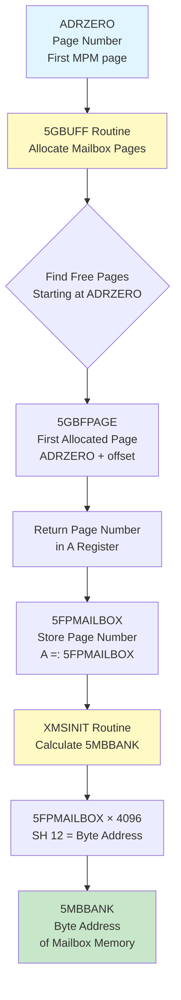

### 8.1.2 Detailed Calculation Flow

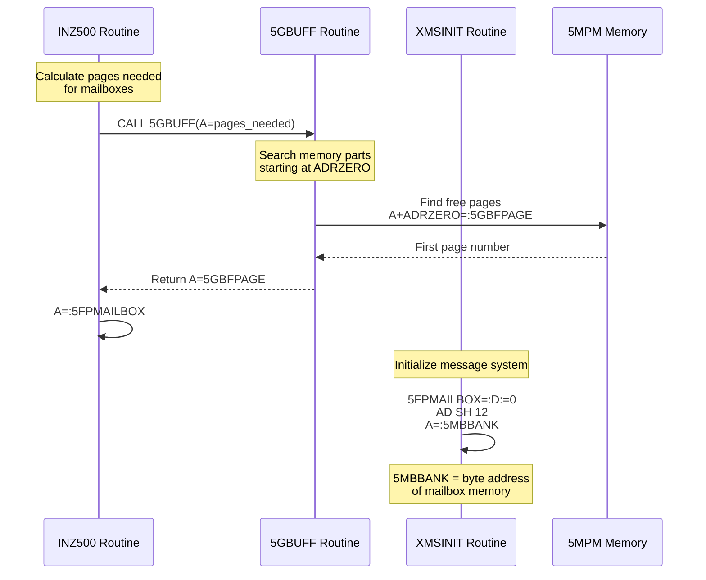

**EXACT CALCULATION FROM NPL SOURCE CODE:**

**Step 1: 5GBUFF allocates memory starting at ADRZERO**
- **Source:** `RP-P2-N500.NPL` line 901 (`5GBUFF` routine)
- **Code:**
  ```npl
  A+ADRZERO=:5GBFPAGE    % First page = ADRZERO + offset
  ```
- **Returns:** Page number in A register (line 920: `A:=5GBFPAGE`)

**Step 2: 5FPMAILBOX stores the allocated page number**
- **Source:** `5P-P2-MON60.NPL` lines 639-640 (`INZ500` routine)
- **Code:**
  ```npl
  CALL 5GBUFF; GO FAR 0INZERET    % Allocate pages for mailboxes
  A=:5FPMAILBOX                    % Store returned page number
  ```
- **Result:** `5FPMAILBOX = ADRZERO + offset` (page number)

**Step 3: 5MBBANK is calculated from 5FPMAILBOX**
- **Source:** `RP-P2-N500.NPL` line 737 (`XMSINIT` routine)
- **Code:**
  ```npl
  5FPMAILBOX=:D:=0; AD SH 12; A=:5MBBANK    % MEMORY BANK FOR MESSAGES
  ```
- **Breakdown:**
  - `5FPMAILBOX=:D:=0` - Load 5FPMAILBOX into AD (A=page number, D=0)
  - `AD SH 12` - Shift AD left 12 bits = multiply by 4096 = convert page number to **byte address**
  - `A=:5MBBANK` - Store byte address in 5MBBANK

**FINAL FORMULA:**
```npl
% 5MBBANK = (ADRZERO + offset) × 4096
% Where offset is the relative page number from 5GBUFF allocation

% In practice, since 5FPMAILBOX is the first allocated page:
5MBBANK = 5FPMAILBOX × 4096
5MBBANK = (ADRZERO + mailbox_offset) × 4096
```

**Bank Size Confirmation:**
- **64 pages per bank** (from `RP-P2-N500.NPL` line 904: `SHZ -6` = divide by 64)
- **64 pages × 1024 words/page = 65,536 words = 64KW per bank**

**To extract bank number from 5MBBANK byte address:**
```npl
% Bank number = (byte_address) >> 18 = (byte_address) / 262144
% Or from page number: Bank number = (page_number) >> 6 = (page_number) / 64
A:=5MBBANK; A SHZ -18=:BANK_NUMBER    % Extract bank number from byte address
% OR
A:=5FPMAILBOX; A SHZ -6=:BANK_NUMBER   % Extract bank number from page number
```

**Example Calculation:**
- If ADRZERO = 2048 (page number)
- 5GBUFF allocates starting at page 2048
- 5FPMAILBOX = 2048 (first allocated page)
- 5MBBANK = 2048 × 4096 = 8,388,608 bytes
- Bank number = 2048 >> 6 = 32 (or 8,388,608 >> 18 = 32)

### 8.1.3 Memory Layout and Bank Calculation

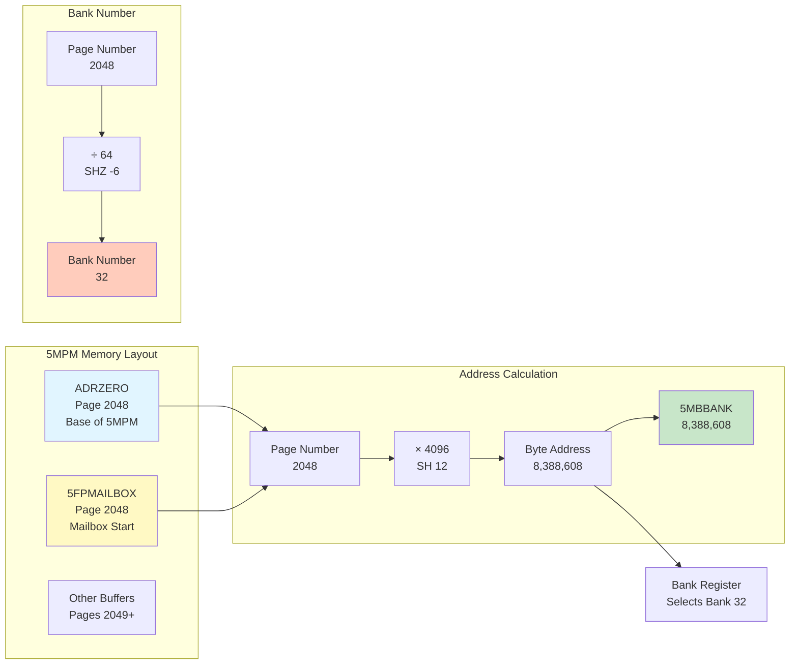

### 8.1.4 5GBUFF Allocation Process

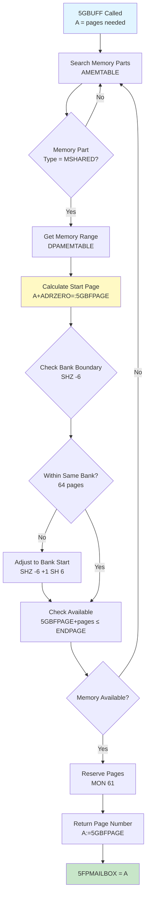

**Usage in NPL code:**

```npl
% From RP-P2-N500.NPL
T:=5MBBANK; X:=MSQLINK; *AAX X5NAC; STDTX

% T register set to 5MBBANK value (byte address)
% This byte address is used for all 5MPM access operations
```

### 8.1.5 How 5MBBANK is Used in Memory Access

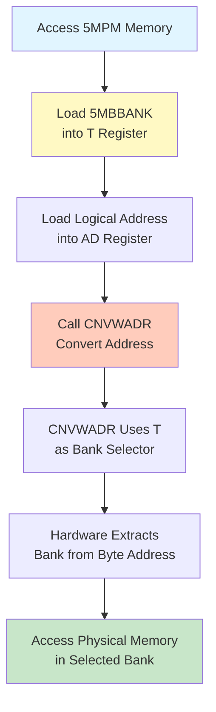

### 8.2 ADRZERO: The Base Address (A PAGE NUMBER)

**ADRZERO** is a **PAGE NUMBER** - the first physical page of 5MPM as seen by the ND-100.

### 8.2.1 Complete ADRZERO Setting Flow

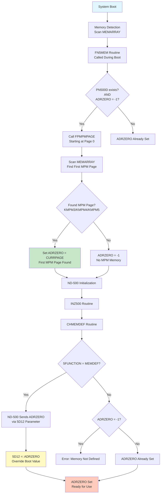

**Evidence from NPL source code:**

```npl
% From MP-P2-N500.NPL:170
A:="N500DF".ADRZERO=:D:=0; AD SH 12    % Load ADRZERO, shift left 12

% Shift left 12 = multiply by 4096 = convert page number to byte address
% This proves ADRZERO is a page number, not a byte address
```

```npl
% From RP-P2-N500.NPL:901
A+ADRZERO=:5GBFPAGE    % Add relative page offset to ADRZERO = absolute page

% ADRZERO is added to relative page numbers to get absolute page numbers
```

### 8.2.2 Mechanism 1: Boot-Time Detection (Primary)

**Source:** `PH-P2-OPPSTART.NPL` lines 2492-2498 (`FN5MEM` routine)

**When:** During system boot, after memory type detection is complete

**CRITICAL ANSWER TO THE QUESTION:**

**Q: Does SINTRAN scan MPM memory looking for something specific to identify it as shared memory, or does it just take the first MPM memory found?**

**A: SINTRAN just takes the FIRST MPM memory found. It does NOT look for anything specific.**

**What FPMPMPAGE Actually Does:**

1. **Scans MEMARRAY** (not the actual memory hardware)
2. **Checks memory type codes** already stored in MEMARRAY from earlier boot detection
3. **Looks for ANY MPM type:** KMPM3 (1₈), KMPM4 (2₈), or KMPM5 (4₈)
4. **Returns the FIRST page** it finds that matches ANY of these types
5. **No hardware probe** - Does NOT access the actual memory
6. **No special markers** - Does NOT look for special data patterns
7. **No validation** - Does NOT verify that the memory is actually shared memory

**Why This Works:**

- **Memory types are set earlier** in the boot sequence (lines 2396-2471)
- **All memory is initially marked as MPM5** (line 2396: `ALL FOUND MEMORY IS INITIALLY SET TO MPM5 MEMORY`)
- **Other types overwrite MPM5:** MPM3, MPM4, Local, PIOC are detected and marked
- **What remains as MPM5** is the actual shared memory for ND-500
- **FPMPMPAGE just finds the first page** marked as MPM3, MPM4, or MPM5

**How FPMPMPAGE Works:**

**Source:** `PH-P2-OPPSTART.NPL` lines 2477-2489 (`FPMPMPAGE` routine)

```npl
FPMPMPAGE: K:="0"; GO FMPMFELLS                  % FIND FIRST PAGE IN MPM MEMORY
LPMPMPAGE: K:=1                                   % FIND FIRST PAGE NOT IN MPM MEMORY
FMPMFELLS:
    A=:D                                           % D = starting page number (from A register)
    DO WHILE D<<ENDPAGE                            % Scan until ENDPAGE (max physical page)
        A:=D SHZ -7+MEMARRAY=:X                    % Calculate MEMARRAY index: (page >> 7) + MEMARRAY
        T:=MBMEMARRAY; *LDATX                      % Load MEMARRAY entry (16-bit word)
        IF D BIT 6 THEN A/\377 ELSE A SHZ -10 FI   % Extract memory type: bit 6 determines byte
        IF A=KMPM3 OR A=KMPM4 OR A=KMPM5 THEN      % Check if MPM memory type
            IF K NBIT THEN A:=D; EXITA FI          % K=0: Return first MPM page number
        ELSE
            IF K THEN A:=D; EXITA FI               % K=1: Return first non-MPM page number
        FI
        A:=100; D+A                                 % Skip 100₈ (64 decimal) pages
    OD
    A:=D; EXIT                                      % Return ENDPAGE if not found
```

**What FPMPMPAGE Does:**

1. **Scans MEMARRAY** starting at page number D (passed in A register)
2. **Checks memory type code** stored in MEMARRAY for each page
3. **Looks for ANY MPM type:** KMPM3 (1₈), KMPM4 (2₈), or KMPM5 (4₈)
4. **Returns the FIRST page** it finds that matches ANY of these types
5. **Does NOT check for anything specific** - just checks the memory type code

**Key Points:**

- **No hardware probe** - FPMPMPAGE does NOT access hardware
- **No special markers** - It does NOT look for special data patterns
- **Just checks MEMARRAY** - It only reads the memory type code already stored in MEMARRAY
- **First match wins** - Returns the first page marked as MPM3, MPM4, or MPM5

**Process:**

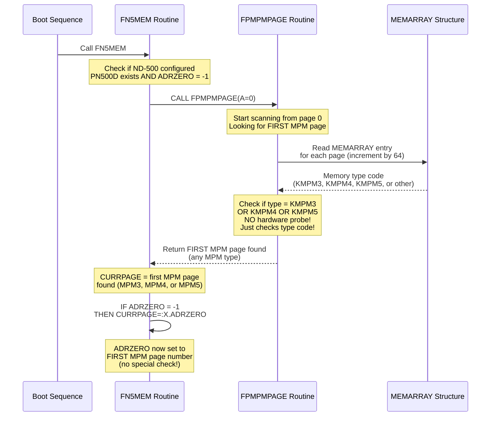

**Exact NPL Code:**

```npl
% From PH-P2-OPPSTART.NPL:2492-2498
FN5MEM:
    A:=0; CALL FPMPMPAGE; A:=-1; A=:FPIMPM                 % Find first MPM page starting at 0
    IF X:=PN500D><0 AND X.ADRZERO=-1 THEN                  % ND-500 exists AND ADRZERO not set
        0=:0CINX; 0=:CURRPAGE
        DO WHILE 0CINX<20                                   % Scan up to 20 memory parts
            CURRPAGE; CALL FPMPMPAGE; GO FMPM5; A=:CURRPAGE  % Find first MPM page in part
            IF PN500D.ADRZERO=-1 THEN CURRPAGE=:X.ADRZERO FI % SET ADRZERO if still -1
            % ... process memory parts ...
        OD
    FI
```

**FPMPMPAGE Routine Details:**

```npl
% From PH-P2-OPPSTART.NPL:2477-2489
FPMPMPAGE: K:="0"; GO FMPMFELLS                  % Find first page IN MPM memory
LPMPMPAGE: K:=1                                   % Find first page NOT IN MPM memory
FMPMFELLS:
    A=:D                                           % D = starting page number (from A register)
    DO WHILE D<<ENDPAGE                            % Scan until ENDPAGE (max physical page)
        A:=D SHZ -7+MEMARRAY=:X                    % Calculate MEMARRAY index: (page >> 7) + MEMARRAY
        T:=MBMEMARRAY; *LDATX                      % Load MEMARRAY entry (16-bit word)
        IF D BIT 6 THEN A/\377 ELSE A SHZ -10 FI   % Extract memory type: bit 6 determines byte
        IF A=KMPM3 OR A=KMPM4 OR A=KMPM5 THEN      % Check if MPM memory type
            IF K NBIT THEN A:=D; EXITA FI          % K=0: Return first MPM page number
        ELSE
            IF K THEN A:=D; EXITA FI               % K=1: Return first non-MPM page number
        FI
        A:=100; D+A                                 % Skip 100₈ (64 decimal) pages
    OD
    A:=D; EXIT                                      % Return ENDPAGE if not found
```

**FPMPMPAGE Scanning Algorithm:**

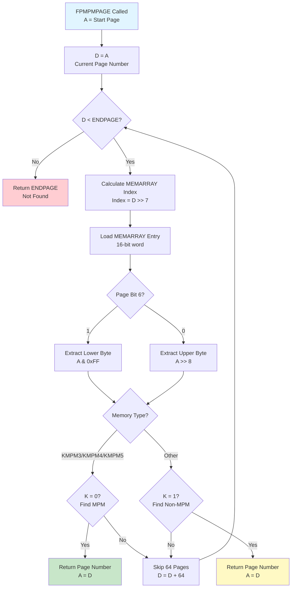

**Key Algorithm Details:**
- **MEMARRAY Index:** `(page_number >> 7) + MEMARRAY` - One entry per 128 pages
- **Byte Selection:** Bit 6 of page number determines upper/lower byte
  - Bit 6 = 0: Upper byte (bits 15-8)
  - Bit 6 = 1: Lower byte (bits 7-0)
- **Page Skip:** Increments by 100₈ (64 decimal) pages per iteration
- **Memory Types Checked:** KMPM3 (1₈), KMPM4 (2₈), KMPM5 (4₈)
- **Returns:** First page number matching criteria, or ENDPAGE if not found

**Key Points:**
- **Scans MEMARRAY** starting at page 0 (or specified starting page)
- **Checks memory type** from MEMARRAY entries
- **Returns first page** with type KMPM3, KMPM4, or KMPM5
- **Skips 64 pages** at a time (`A:=100; D+A` = add 64 decimal)
- **Sets ADRZERO** to this page number if ADRZERO = -1

### 8.2.3 Mechanism 2: ND-500 MEMDEF Override (Secondary)

**Source:** `5P-P2-MON60.NPL` lines 523-587 (`CHMEMDEF` routine)

**When:** During ND-500 initialization, when ND-500 sends MEMDEF function

**Process:**

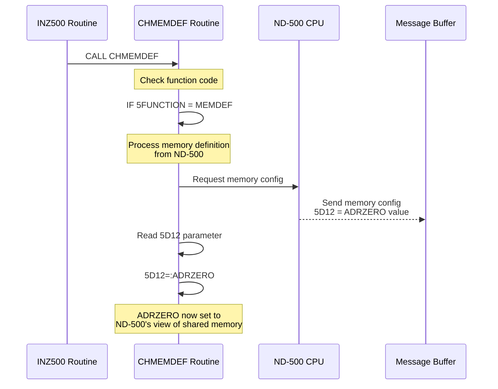

**Exact NPL Code:**

```npl
% From 5P-P2-MON60.NPL:523-587
CHMEMDEF:
    A:=L=:"CHMLREG"
    IF 5FUNCTION><MEMDEF THEN                      % If NOT MEMDEF function
        IF ADRZERO=-1 THEN                          % Check if ADRZERO not set
            % ... handle error cases ...
            EMDFCOM; GO CHMLREG                     % Error: memory not defined
        FI
        EXITA
    FI
    
    % Process MEMDEF function from ND-500
    % ... build memory table from ND-500 data ...
    
    5D12=:ADRZERO                                  % SET ADRZERO from ND-500 message parameter
    % ... continue initialization ...
```

**Key Points:**
- **Only executed** when `5FUNCTION = MEMDEF` (40₈)
- **ND-500 sends ADRZERO** via message parameter `5D12`
- **Overrides boot-time value** if ND-500 provides different value
- **If ADRZERO = -1** and function is NOT MEMDEF, returns error

### 8.2.4 ADRZERO Initialization State

**ADRZERO = -1 means:**
- **"5MPM not configured"** or **"not yet set"**
- Used as sentinel value to detect uninitialized state

**ADRZERO Setting Priority:**
1. **Boot-time detection** (if ND-500 configured but ADRZERO = -1)
2. **ND-500 MEMDEF** (overrides boot-time value if provided)

**ADRZERO is set at runtime, not compiled in:**

```npl
% From 5P-P2-MON60.NPL:587 (during MEMDEF)
5D12=:ADRZERO    % ND-500 sends the value via message parameter 5D12

% From PH-P2-OPPSTART.NPL:2498 (during startup)
IF PN500D.ADRZERO=-1 THEN CURRPAGE=:X.ADRZERO FI
% If not set, first MPM page found becomes ADRZERO
```

**IMPORTANT: ADRZO ≠ ADRZERO's value!**
- ADRZO=040277₈ in the symbol table is a CODE LABEL ADDRESS
- It is NOT the runtime value of ADRZERO
- The actual ADRZERO value depends on hardware configuration and is determined at boot

### 8.3 Address Translation

**ADRZERO is a PAGE NUMBER. Converting to addresses:**

```
ND-100 context (word addressing):
  Physical Word Address = ADRZERO × 1024 (1KW per page)

ND-500 context (byte addressing):
  Physical Byte Address = ADRZERO × 4096 (4KB per page)
  (Note: ND-500 uses 32-bit byte addressing)

Example: If ADRZERO = 2048 (page number)
         ND-100: 2048 × 1024 = 2,097,152 words = word address 20000000₈
         ND-500: 2048 × 4096 = 8,388,608 bytes = 0x800000
```

**Note:** The NPL code "AD SH 12" (multiply by 4096) suggests conversion to ND-500 byte addresses for inter-CPU communication.

**NPL code that performs this conversion:**
```npl
A:="N500DF".ADRZERO=:D:=0    % Load page number into A, D=0
AD SH 12                       % Shift AD left 12 = multiply by 4096
% Now AD contains the 32-bit byte address
```

**Both CPUs access the same physical RAM through different views:**

```
                    SAME PHYSICAL RAM
                          │
        ┌─────────────────┼─────────────────┐
        │                 │                 │
        ▼                 ▼                 ▼
┌───────────────┐  ┌─────────────┐  ┌───────────────┐
│   ND-100      │  │   MPM5      │  │   ND-500      │
│   sees at     │  │   BASE      │  │   sees at     │
│   page        │  │   Register  │  │   0x80000000  │
│   ADRZERO     │  │   translates│  │   (Bit 31=1)  │
└───────────────┘  └─────────────┘  └───────────────┘
```

---

## 9. Memory Type Refinement Process: Why Not All Memory is MPM5

### 9.1 The Problem: Initial MPM5 Assignment

**CRITICAL:** During boot, SINTRAN initially marks **ALL detected memory as MPM5**, then refines this assignment.

**Source:** `PH-P2-OPPSTART.NPL` line 2396 (`RETU` routine)

```npl
RETU:  FOR X:=0 TO 17 DO     % ALL FOUND MEMORY IS INITIALLY SET TO MPM5 MEMORY
    IF TMMAP(X)><0 THEN
        X=:CSAVX; A=:XA:=X SH 12=:CURRPAGE
        FOR X:=-20 DO
            IF XA BIT "0" THEN               % MEMORY BANK EXISTS
                T:=KMPM5; A:=CURRPAGE; CALL SMEMTYPE
            FI; XA SHZ -1=:XA
            CURRPAGE+100=:CURRPAGE
        OD; X:=CSAVX
    FI
OD
```

**What This Does:**
- Scans TMMAP bitmap (one bit per 64 pages)
- For each bank that exists, marks all pages as `KMPM5` (4₈)
- This is the **INITIAL STATE** - all memory = MPM5

### 9.2 Memory Type Refinement Sequence

**After initial MPM5 assignment, SINTRAN refines memory types in this order:**

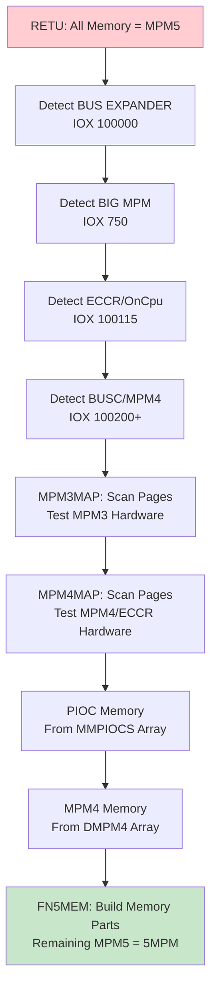

**Refinement Routines (in order):**

1. **BUS EXPANDER Detection** (line 2411)
   ```npl
   T:=100000; *IOXT; TRA IIC
   IF A=0 THEN MEMTYPE BONE BBEXPANDER=:MEMTYPE FI
   ```

2. **BIG MPM (MPM3) Detection** (line 2414)
   ```npl
   *IOX 750; TRA IIC
   IF A=0 THEN MEMTYPE BONE BMPM3=:MEMTYPE FI
   ```

3. **ECCR/OnCpu Detection** (line 2416)
   ```npl
   A:=4; T:=100115; *IOXT; TRA IIC
   IF A=0 THEN MEMTYPE BONE BMECCR=:MEMTYPE FI
   ```

4. **BUSC/MPM4 Detection** (lines 2418-2433)
   ```npl
   FOR NBUSCN TO 17 DO
       A:=NBUSCN*4+100200=:T; *IOXT; TRA IIC
       IF A=0 THEN
           MEMTYPE BONE BMPM4=:MEMTYPE
           % Read memory limits and store in DMPM4
       FI
   OD
   ```

5. **MPM3MAP: Page-Level MPM3 Detection** (line 2447)
   ```npl
   IF MEMTYPE BIT BMPM3 THEN CALL MPM3MAP FI
   ```
   - Scans pages 0 to ENDPAGE
   - Tests each page with `IOX 751`
   - Overwrites MPM5 with KMPM3 for detected pages

6. **MPM4MAP: Page-Level MPM4/ECCR Detection** (line 2448)
   ```npl
   IF MEMTYPE BIT BMPM4 OR A BIT BMECCR THEN CALL MPM4MAP FI
   ```
   - Scans pages 0 to ENDPAGE
   - Tests each page with `TRR ECCR`
   - Overwrites MPM5 with KMPM4 or KMECCR for detected pages

7. **PIOC Memory Configuration** (lines 2450-2461)
   ```npl
   DO WHILE X<<50                  % DEFINE PIOC-MEMORY
       AD:=MMPIOCS(X)
       IF A><0 THEN
           A=:CURRPAGE:=D=:NPAGES
           DO WHILE CURRPAGE<<=NPAGES
               A:=CURRPAGE; T:=KMPIOC; CALL SMEMTYPE
               CURRPAGE+100=:CURRPAGE
           OD
       FI; X+2
   OD
   ```
   - Reads from `MMPIOCS` array (configured during system generation)
   - Overwrites MPM5 with KMPIOC for PIOC memory ranges

8. **MPM4 Memory Mapping** (lines 2462-2470)
   ```npl
   FOR XA TO 17 DO
       X:=XA+X; AD:=DMPM4(X); A=:CURRPAGE:=D=:NPAGES
       DO WHILE CURRPAGE<<NPAGES
           A:=CURRPAGE; T:=KMPM4; CALL SMEMTYPE
           CURRPAGE+100=:CURRPAGE
       OD
   OD
   ```
   - Uses `DMPM4` array built during BUSC detection
   - Overwrites MPM5 with KMPM4 for detected MPM4 ranges

9. **FN5MEM: Final MPM5 Identification** (lines 2492-2509)
   - Builds memory part table (`AMEMTABLE`)
   - **Remaining pages still marked as MPM5** = actual 5MPM memory
   - Sets ADRZERO to first MPM page found

### 9.3 Why Your Emulator Shows All Memory as MPM5

**If all memory appears as MPM5, one or more refinement steps failed:**

1. **Hardware detection failed:**
   - BUS EXPANDER not detected (`IOX 100000` returned non-zero)
   - BIG MPM not detected (`IOX 750` returned non-zero)
   - ECCR not detected (`IOX 100115` returned non-zero)
   - BUSC not detected (`IOX 100200+` returned non-zero)

2. **Page-level detection failed:**
   - `MPM3MAP` didn't run or didn't detect MPM3 pages
   - `MPM4MAP` didn't run or didn't detect MPM4/ECCR pages

3. **Configuration missing:**
   - `MMPIOCS` array empty (no PIOC memory configured)
   - `DMPM4` array empty (no MPM4 memory detected)

**Solution:** Ensure your emulator properly implements:
- IOX instruction responses for hardware detection
- Page-level hardware tests (`IOX 751` for MPM3, `TRR ECCR` for MPM4)
- `MMPIOCS` array configuration for PIOC memory

## 10. ADRZERO Constraints: Avoiding Kernel Memory Overlap

### 10.1 Memory Scanning Boundaries

**Physical memory scan starts at page 1000₈ (512 decimal):**

```npl
% From PH-P2-OPPSTART.NPL:329-332
1000=:CURRPAGE
A:=200; *TRR IIE; TRA IIC; IOX 750; TRA IIC
IF A=0 THEN A:=3777 ELSE A:=37777 FI; A=:ENDPAGE
```

**Key Points:**
- **CURRPAGE starts at 1000₈** (512 pages = 512KW = 1MB)
- **Pages 0-777₈** (0-511) are **reserved for kernel/system**
- **ENDPAGE** depends on multiport detection:
  - If BIG MPM present: ENDPAGE = 3777₈ (2047 pages = 2MB)
  - If no BIG MPM: ENDPAGE = 37777₈ (16383 pages = 16MB)

### 10.2 Reserved Pages (NINITPAGE)

**SINTRAN checks reserved pages during memory testing:**

```npl
% From PH-P2-OPPSTART.NPL:336-340
DO WHILE X<<"NINSZ+1*2"
    AD:=NINITPAGE(X)
    IF A><0 AND A<<=CURRPAGE AND D>>=T GO NEXT
    X+2
OD
```

**What This Does:**
- `NINITPAGE` array contains reserved page ranges
- Format: Each entry is (start_page, end_page)
- Pages in reserved ranges are **skipped** during memory testing
- These pages are **NOT available** for MPM5 allocation

### 10.3 ADRZERO Minimum Value

**ADRZERO CANNOT be page 0 or in kernel memory!**

**Constraints:**
1. **ADRZERO ≥ 1000₈** (512 pages) - Below this is kernel memory
2. **ADRZERO must be in MPM memory** (KMPM3, KMPM4, or KMPM5)
3. **ADRZERO must NOT be in reserved ranges** (NINITPAGE)

**However:** `FPMPMPAGE` scans starting at page 0:

```npl
% From PH-P2-OPPSTART.NPL:2493
A:=0; CALL FPMPMPAGE; A:=-1; A=:FPIMPM
```

**This means:** If MPM memory exists at page 0, ADRZERO could theoretically be 0, but this would conflict with kernel memory.

### 10.4 Memory Part Table (AMEMTABLE)

**FN5MEM builds memory parts relative to ADRZERO:**

```npl
% From PH-P2-OPPSTART.NPL:2499-2506
CURRPAGE-X.ADRZERO; T:=0CINX; *AAX AMEMT         % START OF MEMORY PART
X+T; A=:X.S0; PN500D+"TYPMTAB"=:T
A:=7; X:=0CINX; *SBYT                            % MEMORY PART TYPE
% ...
CURRPAGE; CALL LPMPMPAGE; P+0; A=:CURRPAGE       % FIRST PAGE IN NEXT MEMORY PART
A-PN500D.ADRZERO; T:=0CINX; *AAX AMEMT
```

**Memory Part Structure:**
- **AMEMTABLE**: Array of page ranges (start, end) relative to ADRZERO
- **TYPMTAB**: Array of memory part types
- **Type 7**: MPM memory part
- **Type 0**: Non-MPM memory part

**5GBUFF uses AMEMTABLE to find free MPM memory:**

```npl
% From RP-P2-N500.NPL:895-901
FOR CCINX DO WHILE X:=CCINX<"MXMPARTS-1"
    T:=TYPADR; *LBYT
    T:=0 BONE MSHARED BONE PSACC BONE DSACC
    IF A=T THEN
        AD:=DPAMEMTABLE(X); IF A=0 THEN A+1 FI
        IF D=0 GO OUT
        A+ADRZERO=:5GBFPAGE    % Convert relative to absolute page
```

### 10.5 Recommended ADRZERO Values

**Based on typical SINTRAN configurations:**

```
Typical Memory Layout:
┌──────────────────────────────┐ 00000000₈ = Page 0
│ Kernel/System Memory         │
│ - Boot code                  │
│ - Kernel data structures     │
│ - System tables              │
│ Pages: 0 - 777₈ (0-511)      │
├──────────────────────────────┤ 10000000₈ = Page 1000₈ (512)
│ Local Memory (User Space)    │
│ Pages: 1000₈ - 1777₈          │
├──────────────────────────────┤ 20000000₈ = Page 2000₈ (1024)
│ 5MPM (ADRZERO typically here)│ ◄── RECOMMENDED
│ Pages: 2000₈ - 2777₈          │
├──────────────────────────────┤ 30000000₈ = Page 3000₈ (1536)
│ Extended Memory              │
└──────────────────────────────┘
```

**Typical ADRZERO values:**
- **Minimum:** 1000₈ (512 pages) - Above kernel
- **Typical:** 2000₈ (1024 pages) - Safe margin from kernel
- **Maximum:** ENDPAGE - 1000₈ (depends on system)

### 10.6 Emulator Implementation Guide

**To correctly identify MPM5 memory:**

1. **Implement hardware detection:**
   ```python
   def iox_instruction(port):
       if port == 0o750:  # BIG MPM
           return 0 if big_mpm_present else 1
       elif port == 0o100000:  # BUS EXPANDER
           return 0 if bus_expander_present else 1
       elif port == 0o100115:  # ECCR
           return 0 if eccr_present else 1
       elif port >= 0o100200 and port < 0o100300:  # BUSC
           return 0 if busc_present(port) else 1
       return 1  # Default: not present
   ```

2. **Implement page-level detection:**
   ```python
   def test_mpm3_page(page_num):
       # Test with IOX 751 pattern
       # Return True if MPM3, False otherwise
       pass
   
   def test_mpm4_page(page_num):
       # Test with TRR ECCR pattern
       # Return True if MPM4/ECCR, False otherwise
       pass
   ```

3. **Configure PIOC memory:**
   ```python
   MMPIOCS = [
       (start_page1, end_page1),  # PIOC range 1
       (start_page2, end_page2),  # PIOC range 2
       # ... up to 50 entries
   ]
   ```

4. **Ensure ADRZERO constraints:**
   ```python
   def find_adrzero():
       # Start scanning from page 0
       for page in range(0, ENDPAGE):
           mem_type = get_memtype(page)
           if mem_type in [KMPM3, KMPM4, KMPM5]:
               if page >= 0o1000:  # Above kernel
                   return page
       return -1  # Not found
   ```

## 11. Typical 5MPM Configuration

### 11.1 Standard Memory Layout

**ASSUMPTION:** This layout is typical but varies by system configuration.

**Note:** This shows memory REGIONS for documentation purposes. Each hardware bank is 64KW (128KB).
These regions span multiple hardware banks.

```
ND-100 Physical Memory Map (word addresses):
┌──────────────────────────────┐ 00000000₈ = 0 words
│ Region 0: Local Memory       │ (hardware banks 0-31)
│ - Boot code, Kernel          │
│ - System tables              │
│ - RT programs                │
│ Size: up to 2MW (4MB)        │
├──────────────────────────────┤ 10000000₈ = 2,097,152 words
│ Region 1: Local Memory       │ (hardware banks 32-63)
│ - User programs              │
│ - Buffers                    │
│ Size: up to 2MW (4MB)        │
├──────────────────────────────┤ 20000000₈ = 4,194,304 words
│ Region 2: 5MPM ◄─────────────│ TYPICAL MULTIPORT LOCATION
│ - Process Descriptors (S500S)│ (hardware banks 64-95)
│ - Message Buffers            │
│ - ACCP Buffers               │
│ Size: 128KW-2MW (256KB-4MB)  │
├──────────────────────────────┤ 30000000₈ = 6,291,456 words
│ Region 3+: Extended Local    │ (hardware banks 96-255)
│ - Additional programs        │
│ - Large segments             │
└──────────────────────────────┘

ND-500 View of 5MPM:
- ND-500 accesses 5MPM at addresses with bit 31 = 1
- Base address: 0x80000000
- Source: ND-14001-1-EN DOMINO Standard Hardware Description
```

### 9.2 5MPM Internal Structure

**WARNING: The following offsets are ASSUMPTIONS based on symbol analysis.
They have NOT been verified against authoritative documentation.**

```
5MPM Memory Map (starting at ADRZERO):
┌──────────────────────────────────────────────────────────┐
│ Offset    │ Size    │ Content                            │
├──────────────────────────────────────────────────────────┤
│ S500S     │ ~1KW    │ ND-500 Process Descriptors         │ VERIFIED
│ (115542₈) │         │ (verified from symbols)            │
├──────────────────────────────────────────────────────────┤
│ S500E     │         │ End of Process Descriptors         │ VERIFIED
│ (117552₈) │         │ (verified from symbols)            │
├──────────────────────────────────────────────────────────┤
│ Unknown   │ Various │ Message Buffers, XMSG Kernel,      │ UNVERIFIED
│           │         │ ACCP Buffers, etc.                 │
└──────────────────────────────────────────────────────────┘

Note: S500S=115542₈ and S500E=117552₈ are ND-100 kernel addresses,
NOT offsets within 5MPM. Further research needed to map actual 5MPM layout.
```

---

## 10. Multiple MPM Sources

### 10.1 MPM-Like Memory Sources in ND Systems

| Device | Memory Size | Access Type | Bank Selection |
|--------|-------------|-------------|----------------|
| **5MPM (ND-500 IF)** | 128KW-1MW (256KB-2MB) | Dual-ported shared | SYSGEN: 5MBBANK |
| **Ethernet II Controller** | 256KW (512KB) DRAM | ND-100 accessible | Thumbwheel 7J, 9J |
| **PIOC Controllers** | Variable | Programmed I/O | PIOC address |

### 10.2 Avoiding Conflicts

When configuring a system with multiple memory sources:

1. **Each source must have a unique bank assignment**
2. **Address ranges must not overlap**
3. **SINTRAN must know which banks are which type** (via SYSGEN)
4. **Device drivers access only their assigned ranges**

---

## 11. Summary

### 11.1 Key Answers

| Question | Answer |
|----------|--------|
| **Is MPM different from Local?** | YES - different hardware with dual-port access |
| **Why is 10000000₈ Bank 1?** | That's a 24-bit PHYSICAL address in octal, not 16-bit logical |
| **How is MPM detected?** | IOX 750 - I/O error means no MPM, success means MPM exists |
| **What if IOX 750 fails?** | A≠0, system assumes 16MW (32MB) standard memory (no multiport) |
| **Can MPM/Local intermingle?** | YES - via address windows with holes |
| **Where is 5MPM typically?** | Determined at runtime via MEMDEF or startup scan |
| **What is ADRZERO?** | A PAGE NUMBER (not byte address) - first 5MPM page |
| **What is ADRZO in symbols?** | A CODE LABEL ADDRESS, NOT ADRZERO's runtime value |

### 11.2 The Two Address Spaces

```
┌─────────────────────────────────────────────────────────────────┐
│ LOGICAL (what programs see):  16-bit = 64KW (128KB)            │
│   - 64 pages × 1024 words each                                 │
│   - 6-bit page number + 10-bit offset                          │
│                                                                 │
│ PHYSICAL (address bus):       24-bit = 16MW (32MB) maximum     │
│   - PIT entries have 11-bit page numbers (2MW per context)     │
│   - Multiple PITs allow different processes to use full range  │
│                                                                 │
│ TRANSLATION:                  MMU with PITs                    │
│   - 5 control bits + 11-bit physical page per entry            │
└─────────────────────────────────────────────────────────────────┘

ND-500 5MPM ADDRESS:
┌─────────────────────────────────────────────────────────────────┐
│ ND-500 accesses 5MPM via bit 31 = 1                            │
│ Base: 0x80000000                                                │
│ Source: ND-14001-1-EN DOMINO Standard Hardware Description     │
└─────────────────────────────────────────────────────────────────┘
```

---

## 12. MPM5 Hardware Configuration Details

### 12.1 Hardware Module Reference

**MPM5 Modules (in the MPM5 chassis):**

| PCB No. | Part No. | Name | Description |
|---------|----------|------|-------------|
| **5151** | 324351 | MPM-5 Controller | Maintenance processor v1 (68000 CPU) |
| **5156** | 324356 | MPM-5 Controller | Maintenance processor v2 |
| **5152** | 324352 | MPM-5 Twin 16 Bit Port | Port module v1 (4K RAM address windows) |
| **5155** | 324355 | MPM-5 Twin 16 Bit Port | Port module v2 (16K RAM address windows) |
| **5411** | 324211 | MPM-5 Dynamic RAM 1 MB | Memory module (64K devices) |
| **5411** | 324172 | MPM-5 Dynamic RAM 1 MB | N-570 variant |
| **5411** | 324169 | MPM-5 Dynamic RAM 2 MB | N-570 variant |
| **5411** | 324158 | MPM-5 Dynamic RAM 4 MB | Memory module (256K devices) |
| **5411** | 324158NCCI | MPM-5 Dynamic RAM 4 MB | N-570 NEC CCIS variant |
| **5154** | 324354 | MPM-5 32 Bit Line Driver | For multi-bank configurations |

**Interface Cards (CPU to MPM connection):**

| PCB No. | Part No. | Location | Name | Description |
|---------|----------|----------|------|-------------|
| **3022** | 322622 | ND-100 chassis | ND-500 Interface | MPM4 PORT A/E, connects ND-100 to MPM |
| **3022** | 322622NCCI | ND-100 chassis | ND-500 Interface | NEC CCIS variant |
| **3096** | 324133 | ND-100 chassis | Octobus/MPM Line Driver | ND-100 to MPM connection |
| **3109** | 324118 | ND-100 chassis | Octobus & MPM Line Driver | ND-100 to MPM connection |
| **5015** | 322515 | ND-500 chassis | CONTROL II | ND-100/500 communication module |

**ND-5000 MFbus Modules:**

| PCB No. | Part No. | Name | Description |
|---------|----------|------|-------------|
| **5155** | 350161 | MFB Port | MFbus port module |
| **5462** | 350160 | MFB 4 MB Dynamic RAM | ND-5000 MFbus memory module |
| **5462** | 350152 | MFB 8 MB Dynamic RAM | ND-5000 MFbus memory module |
| **5462** | 324242 | MFB 16 MB Dynamic RAM | ND-5000 MFbus memory module |
| **5452** | 324232 | MFB Ethernet III | Ethernet controller |
| **5452** | 324260 | MFB Ethernet III | "Booster" variant |
| **5454** | 324234 | MFB Controller | MFbus controller |
| **5465** | 324245 | MFB Controller | MFbus controller |
| **5467** | 324247 | MFB SCSI | SCSI controller |
| **5471** | 324271 | MFB Controller | "James" controller |
| **5478** | 324278 | MFB Controller | "James II" controller |

**Source:** ND-10.004.01 MPM 5 Technical Description, Appendix C; NEC-01 ND-500 Course

---

## 12.2 MFbus and Octobus (ND-5000 Communication)

### 12.2.1 MFbus vs MPM5 Architecture

**MFbus (Multifunction Bus)** is the successor to MPM-5 for ND-5000 systems. Key differences:

| Feature | MPM-5 (ND-500) | MFbus (ND-5000) |
|---------|----------------|-----------------|
| **Shared Memory** | Via 3022/5015 interface cards | Direct plug-in to MFbus card rack |
| **Control Bus** | ND-100/ND-500 interface registers | **Octobus** serial message bus |
| **Communication** | Message buffers in 5MPM | Octobus + shared memory |
| **I/O Processor** | ND-100 | ND-110/ND-120 |

**From ND-05.020.01:**
> "The multifunction bus (MFbus) system is the follow-up to the MPM-5 system. It has several new features, in addition to all the functional features of the MPM-5 system. The most important new feature is the Octobus, a serial message bus for communication and test purposes."

### 12.2.2 Octobus Overview

**Octobus** is a fast serial bus for short messages between processors:

- **Purpose:** Interprocessor synchronization, configuration, debugging
- **Speed:** 4 MHz max, 8 µs per byte
- **Stations:** Up to 62 devices (station numbers 1-76 octal)
- **NOT for data:** Only control/sync messages; actual data via shared memory

**Station Number Assignments:**

| Station No. | Device |
|-------------|--------|
| 1 | ND-110/ND-120 CPU |
| 2-7 | MFbus controllers |
| 10-13 | SCSI controllers |
| 70-76 | ND-5000 CPUs |

### 12.2.3 Octobus Frame Format

```
32-bit Octobus Frame:
┌────────┬─────────────┬───┬───┬────────┬─────────────┬────────┬─────┐
│Priority│ Destination │ C │ B │ Source │ Information │ Parity │ Ack │
│ (4)    │    (6)      │(1)│(1)│  (6)   │    (8)      │  (2)   │ (2) │
└────────┴─────────────┴───┴───┴────────┴─────────────┴────────┴─────┘
 Bits:     30-27        26-21  20 19  18-13    12-5        4-3    2-1

C = 1: Control byte (special meaning)
C = 0: Pure data (kick information)
B = 1: Broadcast to station type
B = 0: Normal transmission to specific station
```

**Acknowledge Codes:**

| Ack | Meaning | Retries |
|-----|---------|---------|
| 00 | Node not present (timeout) | 15 |
| 01 | Successfully received | - |
| 10 | Destination busy | 255 |
| 11 | Parity error / Ambiguous | 15/0 |

### 12.2.4 Octobus Message Types

| Type | Name | Purpose |
|------|------|---------|
| **IDENT** | Identification | Activate process with correct working set |
| **KICK** | Kick message | Notify handler of event |
| **MULTIBYTE** | Multi-byte msg | Initialization, debugging, maintenance |
| **EMERGENCY** | Emergency | Hardware-decoded (power fail, reset) |

### 12.2.5 ND-100 to ND-5000 Communication Path

**Using 3109/3096 (MFbus Line Driver):**

```
ND-100/ND-110/ND-120                          ND-5000
┌─────────────────┐                    ┌─────────────────────┐
│                 │                    │                     │
│   ND-100 CPU    │                    │    ND-5000 CPU      │
│                 │                    │                     │
│  ┌───────────┐  │                    │  ┌───────────────┐  │
│  │ 3109/3096 │  │    Octobus         │  │ Access Module │  │
│  │ MFB Line  │◄─┼────────────────────┼─►│ (ACCP 68000)  │  │
│  │ Driver    │  │    (control)       │  │ + OCTC        │  │
│  └─────┬─────┘  │                    │  └───────────────┘  │
│        │        │                    │         │           │
│        │        │                    │         │           │
│  ┌─────▼─────┐  │                    │  ┌──────▼────────┐  │
│  │  MFbus    │  │    MFbus           │  │    MFbus      │  │
│  │  Port     │◄─┼────────────────────┼─►│   Interface   │  │
│  │           │  │   (shared memory)  │  │   (BADAP)     │  │
│  └───────────┘  │                    │  └───────────────┘  │
└─────────────────┘                    └─────────────────────┘
         │                                       │
         └───────────────────┬───────────────────┘
                             │
                    ┌────────▼────────┐
                    │  MFbus Shared   │
                    │     Memory      │
                    │  (5462 RAM)     │
                    └─────────────────┘
```

**Communication Flow:**

1. **Octobus** sends control messages (kick, sync, init)
2. **Shared Memory** holds actual data (buffers, parameters)
3. **Semaphores** in shared memory for synchronization (test-and-set)

### 12.2.6 3109/3096 Role

The **3109** and **3096** (Octobus/MPM Line Driver) cards provide:

1. **Octobus Controller Gate Array** - handles serial protocol
2. **Differential Line Transceivers** - global/local Octobus conversion
3. **MFbus Port Interface** - connects to shared memory

**From ND-05.020.01 Appendix 1:**
> "The MFbus Line Driver is a Multiport Line Driver with an Octobus Controller gate array."

### 12.2.7 Emulator Considerations for ND-5000

For emulating ND-5000 communication from ND-100:

1. **Implement Octobus message passing:**
   - 32-bit frame format
   - Station addressing (source/destination)
   - Acknowledge handling
   - Priority arbitration

2. **Shared memory access:**
   - Same address translation as MPM5 (bit 31 stripped)
   - Semaphore cycles (test-and-set)
   - MFbus port address windows

3. **Message types to handle:**
   - KICK messages for I/O completion
   - IDENT for process activation
   - EMERGENCY for power fail/reset

**Reference:** ND-05.020.01 EN ND-5000 Hardware Description, Appendix 2 (Octobus Protocol Version 5)

---

### 12.3 Bit 31 Behavior (Critical for Emulation)

**From ND-14001-1-EN DOMINO Standard Hardware Description:**

> "Address bit 31 determines whether the memory access is to MFbus system (global) or local memory."
>
> | bit 31 | address range |
> |--------|---------------|
> | 0      | local         |
> | 1      | global        |
>
> "However, the MFbus will always see bit 31 as a logical zero."

**From ND-10.004.01 MPM 5 Technical Description (pages 8-9):**

> "Bit 31 in the address is not present on the channel, and therefore not decoded."

**Implications for emulation:**
- The ND-500 uses address 0x80000000 (bit 31=1) to access shared memory
- Bit 31 is used ONLY for routing (local vs global)
- The MPM hardware never sees bit 31 - it is stripped before transmission
- Address windows in MPM use bits 17-30 (14 bits on 5155) or bits 17-28 + 29-30 (on 5152)
- Resolution is 128 Kbyte

### 12.4 Address Translation Formula

**From ND-10.003.01 MPM4 Technical Introduction:**

```
LOCAL ADDRESS = SOURCE ADDRESS - LOWER LIMIT + BASE LIMIT
```

Where:
- **SOURCE ADDRESS**: The channel address from the CPU
- **LOWER LIMIT**: The start of the address window
- **BASE LIMIT**: The physical start address in the memory bank

**BASE Register Calculation:**

The value stored in the BASE register is the 2's complement of (LOWER LIMIT - BASE):

```
Example from ND-10.004.01:
    Lower limit = 00 004 000 000 (octal)
    Base        = 00 000 400 000 (octal)

    Using only upper 16 bits:
    Lower limit = 000020 (octal)
    Base        = 000002 (octal)

    Lower limit - Base = 000016 (octal)
    2's complement     = 377762 (octal)

    BASE register value = 377762
```

### 12.5 Address Window Resolution

| Port Type | Window Resolution | Address Bits Used |
|-----------|------------------|-------------------|
| 5152 | 64KW (128KB) | Bits 17-28 (channel addr), bits 29-30 (RAM select) |
| 5155 | 64KW (128KB) 32-bit, 32KW (64KB) 16-bit | Bits 17-30 |

**The 64KW (128KB) resolution means:**
- Each address window entry represents 64KW (128KB) of memory
- Holes in windows must be at least 64KW (128KB) apart
- Window boundaries must be on 64KW (128KB) boundaries

### 12.6 MPM5 Default Configuration Values

**From ND-10.004.01 Appendix A:**

| Parameter | Default Value |
|-----------|---------------|
| Interleave Port Number | 0 |
| Interleave Type | 0 |
| Lower Limit | 0 |
| Master Control Register (16-bit channel) | 125₈ |
| Master Control Register (32-bit channel) | 25₈ |
| RAM Control Register | 0 |
| Request Delay | 40 ns |
| Start Address | 0 |
| Timeout on MPM-bus | 2 μs |

**Port Control Register bit 6:**
- `1` = 32-bit (ND-500) data channel
- `0` = 16-bit (ND-100) data channel

### 12.7 ND-500 View vs MPM Physical Address

```
ND-500 Memory Access:
┌─────────────────────────────────────────────────────────────────┐
│ ND-500 CPU issues address:  0x80020000                          │
│    bit 31 = 1 → routes to MFbus (global memory)                 │
│                                                                  │
│ Bit 31 stripped at MFbus interface                               │
│    Address on MFbus channel: 0x00020000                         │
│                                                                  │
│ MPM5 Port receives: 0x00020000                                   │
│    Checks address windows (bits 17-30)                          │
│    If within window: apply BASE register translation            │
│    Physical bank address = Channel - Lower + Base               │
└─────────────────────────────────────────────────────────────────┘

ND-100 Memory Access:
┌─────────────────────────────────────────────────────────────────┐
│ ND-100 issues channel address via 3022 interface                 │
│    (Page number from PITs + offset)                              │
│                                                                  │
│ MPM5 Port receives: channel address                              │
│    Checks address windows (bits 17-30)                          │
│    If within window: apply BASE register translation            │
│    Physical bank address = Channel - Lower + Base               │
└─────────────────────────────────────────────────────────────────┘

RESULT: Both CPUs access SAME physical RAM location in MPM5!
```

### 12.8 Emulator Implementation Notes

**Critical points for C# emulator:**

1. **Bit 31 handling**: Strip bit 31 from ND-500 addresses before MPM access
2. **Address windows**: Implement address range checking before memory access
3. **BASE register**: Implement address translation formula
4. **Arbitration**: If simultaneous access, MPM hardware handles arbitration
5. **Data width**: ND-100 accesses 16 bits, ND-500 accesses 32 bits at a time

**Reference emulator code:** See `SINTRAN/Emulator/ND500-EMULATION-COMPLETE.cs`

---

## 13. Useful Comments from NPL Source Code

### 13.1 RETU Routine - Initial MPM5 Assignment

**Source:** `PH-P2-OPPSTART.NPL` line 2396

```npl
RETU:  FOR X:=0 TO 17 DO     % ALL FOUND MEMORY IS INITIALLY SET TO MPM5 MEMORY
```

**Key Insight:** This comment explicitly states that ALL detected memory is initially marked as MPM5, confirming the refinement process.

### 13.2 FPMPMPAGE and LPMPMPAGE Routines

**Source:** `PH-P2-OPPSTART.NPL` lines 2477-2478

```npl
FPMPMPAGE: K:="0"; GO FMPMFELLS                  % FIND FIRST PAGE IN MPM MEMORY
LPMPMPAGE: K:=1                                  % FIND FIRST PAGE NOT IN MPM MEMORY
```

**Key Insight:** Clear distinction between finding MPM pages vs non-MPM pages.

**Additional comments:**
```npl
IF K NBIT THEN A:=D; EXITA FI                    % FIRST PAGE IN MPM PART
IF K THEN A:=D; EXITA FI                         % FIRST PAGE IN NOT-MPM PART
```

### 13.3 FN5MEM Routine - Memory Part Building

**Source:** `PH-P2-OPPSTART.NPL` lines 2492-2509

```npl
FN5MEM:
    A:=0; CALL FPMPMPAGE; A:=-1; A=:FPIMPM                 % DETERMINE FIRST PAGE IN MULTIPORT
    IF X:=PN500D><0 AND X.ADRZERO=-1 THEN                  % MEMORY NOT DEFINED FOR ND-500
        0=:0CINX; 0=:CURRPAGE
        DO WHILE 0CINX<20                                   % 20 IS MAX MERMORY PARTS
            CURRPAGE; CALL FPMPMPAGE; GO FMPM5; A=:CURRPAGE  % FIRST MPM PAGE IN MEMORY PART
            IF PN500D.ADRZERO=-1 THEN CURRPAGE=:X.ADRZERO FI % ND-500 PAGE ZERO
            CURRPAGE-X.ADRZERO; T:=0CINX; *AAX AMEMT         % START OF MEMORY PART
            X+T; A=:X.S0; PN500D+"TYPMTAB"=:T
            A:=7; X:=0CINX; *SBYT                            % MEMORY PART TYPE
            MIN 0CINX
            CURRPAGE; CALL LPMPMPAGE; P+0; A=:CURRPAGE       % FIRST PAGE IN NEXT MEMORY PART
            A-PN500D.ADRZERO; T:=0CINX; *AAX AMEMT
            X+T; A=:X.S0; PN500D+"TYPMTAB"=:T
            A:=0; X:=0CINX; *SBYT                            % MEMORY PART TYPE (NOT MPM MEMORY)
            MIN 0CINX
        OD
    FI
```

**Key Insights:**
- **"20 IS MAX MERMORY PARTS"** - System supports up to 20 memory parts
- **"MEMORY NOT DEFINED FOR ND-500"** - ADRZERO = -1 means not configured
- **"ND-500 PAGE ZERO"** - ADRZERO is the ND-500's page zero (base address)
- **"START OF MEMORY PART"** - Memory parts are stored relative to ADRZERO
- **"MEMORY PART TYPE"** - Type 7 = MPM memory, Type 0 = non-MPM memory
- **"FIRST PAGE IN NEXT MEMORY PART"** - LPMPMPAGE finds boundaries between memory parts

### 13.4 SMEMTYPE Routine - Memory Type Storage

**Source:** `PH-P2-OPPSTART.NPL` lines 3872-3891

```npl
%=============================================================================
%            S M E M T Y P E
%
% SUBROUTINE TO SETUP MEMORY-TYPE OF A MEMORY BANK
%
% ENTRY:     A=PHYS.PAGE
%            T=MEMORY TYPE
%
SUBR SMEMTYPE
```

**Key Insight:** Clear documentation that SMEMTYPE stores memory type codes in MEMARRAY based on physical page number.

### 13.5 MPM3MAP and MPM4MAP Routines

**Source:** `PH-P2-OPPSTART.NPL` lines 3830-3869

```npl
%
% SUBROUTINE TO FIND MPM3 AND MPM4 MEMORY
%

SUBR MPM3MAP,MPM4MAP
...
FELLS: X=:XR:=L=:"LREG"
    A:=400; *TRR IIE                          % ENABLE FOR MEMORY PARITY ERROR
    *TRA PGS; TRA PEA; TRA IIC                % CLEAR INTERNAL REGISTERS
    0=:CURRPAGE
    DO WHILE CURRPAGE<<=ENDPAGE
        CALL TTMMAP; GO NXT                    % TEST IF MEM.BANK EXIST
        CALL TNINITP; GO NXT                   % TEST IF MEM IS INVISIBLE
        ...
        IF ROUTSWITCH=0 THEN                   % MPM4
            A:=11; *TRR ECCR
            0=:X.S0; A:=4; *TRR ECCR; TRR 10
            X.S0; *TRA IIC
            IF A=10 THEN T:=KMECCR; A:=CURRPAGE; CALL SMEMTYPE FI
        ELSE                                   % MPM3
            A:=140751; *IOX 751
            0=:X.S0; A:=140764; *IOX 751; TRR 10
            X.S0; *TRA IIC
            IF A=10 THEN T:=KMPM3; A:=CURRPAGE; CALL SMEMTYPE FI
        FI; ORGCOUNT=:X.S0                     % RESET ORIGINAL CONTENT
        *TRA PES; TRA PEA; TRA IIC; TRA PGS    % CLEAR INTERNAL REGISTERS
NXT:      CURRPAGE+100=:CURRPAGE
    OD
```

**Key Insights:**
- **"TEST IF MEM.BANK EXIST"** - TTMMAP checks if memory bank physically exists
- **"TEST IF MEM IS INVISIBLE"** - TNINITP checks if page is in reserved/system area
- **"ENABLE FOR MEMORY PARITY ERROR"** - Parity error detection enabled during testing
- **"RESET ORIGINAL CONTENT"** - Hardware registers are restored after testing

### 13.6 CHMEMDEF Routine - Memory Configuration

**Source:** `5P-P2-MON60.NPL` lines 515-587

```npl
%       ( 5 )    C H M E M D E F
%
% LOCAL SUBROUTINE TO SET UP MEMORY CONFIGURATION
%
% ENTRY:     B=N500DF
% EXIT:      ERROR IN SETTING UP MEMORY CONFIGURATION
% EXIT+1:    MEMORY CONFIGURATION SET UP
%
SUBR CHMEMDEF
...
CHMEMDEF:
    A:=L=:"CHMLREG"
    IF 5FUNCTION><MEMDEF THEN
        IF ADRZERO=-1 THEN
            % Error handling if memory not defined
            EMDFCOM; GO CHMLREG
        FI
        EXITA
    FI
    ...
    5D12=:ADRZERO                                  % Set ADRZERO from ND-500
```

**Key Insights:**
- **"SET UP MEMORY CONFIGURATION"** - Purpose is to configure memory for ND-500
- **"ERROR IN SETTING UP MEMORY CONFIGURATION"** - Exit point if configuration fails
- **"MEMORY CONFIGURATION SET UP"** - Exit point if successful
- **5D12=:ADRZERO** - ADRZERO comes from ND-500 message parameter 5D12

### 13.7 XMSINIT Routine - Message System Initialization

**Source:** `RP-P2-N500.NPL` line 737

```npl
XMSINIT: *1BANK; COPY SD DA; STA I (SVDRE; 2BANK
    5FPMAILBOX=:D:=0; AD SH 12; A=:5MBBANK             % MEMORY BANK FOR MESSAGES
```

**Key Insight:** **"MEMORY BANK FOR MESSAGES"** - 5MBBANK is the byte address of the mailbox memory bank.

### 13.8 5GBUFF Routine - Memory Allocation

**Source:** `RP-P2-N500.NPL` lines 880-930

```npl
SUBR X5XGBUFF,X5GBUFF
...
5GBFELLS: A=:5GBNPAGES; A:=L=:"5GBLREG":=D=:XDRGX
    "AMEMTABLE"+B=:"DPAMEMTABLE"+"TYPMTAB-AMEMTABLE"=:TYPADR
    0=:CCINX
    FOR CCINX DO WHILE X:=CCINX<"MXMPARTS-1"
        T:=TYPADR; *LBYT
        T:=0 BONE MSHARED BONE PSACC BONE DSACC
        IF A=T THEN
            AD:=DPAMEMTABLE(X); IF A=0 THEN A+1 FI
            IF D=0 GO OUT
            A+ADRZERO=:5GBFPAGE; A:=D-1+ADRZERO=:5GBEPART=:5GBLPAGE=:D
            ...
            IF 5GBFPAGE+5GBNPAGES-1>>ENDPAGE GO OUT      % AREA NOT AVAILABLE
            ...
            MIN "5GBLREG"; GO OUT                        % MEMORY RESERVED, A=FIRST PHYS.PAGE IN AREA
```

**Key Insights:**
- **"AREA NOT AVAILABLE"** - Check ensures allocated area doesn't exceed ENDPAGE
- **"MEMORY RESERVED, A=FIRST PHYS.PAGE IN AREA"** - Returns first page number of reserved area
- **A+ADRZERO=:5GBFPAGE** - Converts relative page number to absolute by adding ADRZERO

### 13.9 PIOC Memory Configuration

**Source:** `PH-P2-OPPSTART.NPL` line 2450

```npl
DO WHILE X<<50                  % DEFINE PIOC-MEMORY
```

**Key Insight:** **"DEFINE PIOC-MEMORY"** - PIOC memory is configured from MMPIOCS array (up to 50 entries).

### 13.10 BUSC Memory Limits Reading

**Source:** `PH-P2-OPPSTART.NPL` lines 2426-2429

```npl
T+3; A:=100; *IOXT                      % ENABLE READ LIMITS
T-3; *IOXT                              % READ LIMITS
A=:D/\377 SH 6:=:D SHZ -10 SH 6:=:D
IF A><D THEN D-1 ELSE A:=0; D:=0 FI     % TEST FOR EMPRY MPM4 PORT
```

**Key Insights:**
- **"ENABLE READ LIMITS"** - Enables reading memory limits from BUSC
- **"READ LIMITS"** - Reads start and end page numbers
- **"TEST FOR EMPRY MPM4 PORT"** - Checks if MPM4 port is empty (no memory)

### 13.11 Summary of Key Comments

**Most Important Comments for Understanding Memory Detection:**

1. **"ALL FOUND MEMORY IS INITIALLY SET TO MPM5 MEMORY"** - Explains why refinement is needed
2. **"MEMORY NOT DEFINED FOR ND-500"** - ADRZERO = -1 means not configured
3. **"ND-500 PAGE ZERO"** - ADRZERO is the base page for ND-500 memory
4. **"20 IS MAX MERMORY PARTS"** - System limitation
5. **"MEMORY PART TYPE"** - Type 7 = MPM, Type 0 = non-MPM
6. **"TEST IF MEM IS INVISIBLE"** - Reserved pages are skipped
7. **"MEMORY BANK FOR MESSAGES"** - 5MBBANK purpose
8. **"AREA NOT AVAILABLE"** - Allocation boundary check

These comments provide crucial context for understanding the memory detection and allocation algorithms.

## 14. ND-500 Memory Detection: How It Differs from PIOC/Ethernet

### 14.1 The Key Difference

**PIOC/Ethernet Memory:**
- **Device number** → **Memory range configured separately** via `MMPIOCS` array
- Memory ranges are **explicitly configured** during system generation
- Device number is just for I/O access, NOT for memory location

**ND-500 Memory:**
- **Device number (HDEV)** → **Interface detection only**
- **Memory bank determined by ADRZERO**, NOT by device number
- ADRZERO comes from **ND-500 MEMDEF** or **boot-time scan**

### 14.2 How PIOC/Ethernet Memory Works

**Source:** `PH-P2-START-BASE.NPL` lines 245-250

```npl
DOUBLE ARRAY PIOCS:=(
    PIO01,1700, PIO02,1701, PIO03,1702, PIO04,1703,
    PIO05,1704, PIO06,1705, PIO07,1706, PIO08,1707,
    PIO09,1710, PIO10,1711, PIO11,1712, PIO12,1713,
    PIO13,1714, PIO14,1715, PIO15,1716, PIO16,1717,
    ETRN1,2240, ETRN2,2241, ETRN3,2242, ETRN4,2243,
    -1);
```

**Process:**
1. Device numbers (1700₈, 2240₈, etc.) are **hardcoded** in PIOCS table
2. During system generation, **memory ranges** are configured in `MMPIOCS` array
3. At boot, SINTRAN reads `MMPIOCS` and marks those pages as `KMPIOC`
4. Device number is **only used for I/O operations**, not memory location

**Example:**
- Ethernet device ETRN1 has device number **2240₈**
- But its memory might be configured at pages **2000₈-2777₈** in `MMPIOCS`
- Device number ≠ Memory location

### 14.3 How ND-500 Memory Detection Works

**Step 1: Device Number Configuration**

**Source:** `N500DF.HWDEVICE` (configured during system generation)

```npl
% HDEV is stored in N500DF structure
HDEV:="N500DF".HWDEVICE    % Typically 100₈ - 120₈, or device numbers from your list
```

**Device Numbers from Your List:**
- ND-500 device 1: **1₈** (1 decimal)
- ND-500 device 2: **1060₈** (560 decimal)
- ND-500 device 3: **660₈** (432 decimal)
- ND-500 device 4: **760₈** (496 decimal)
- ND-500 device 5: **560₈** (368 decimal)

**Step 2: Interface Detection via IOX**

**Source:** Detection uses HDEV + register offsets

```npl
% Master Clear (reset interface)
T:=HDEV+MCLR5              % MCLR5 = 6 (offset)
*IOXT                       % Execute IOX to HDEV+6

% Read Status Register
T:=HDEV+RSTA5              % RSTA5 = 2 (offset)
*IOXT                       % Read status from HDEV+2
TRA IIC                     % Check for I/O error

% If A=0, interface responds (3022 PCB present)
% If A≠0, I/O error (no interface)
```

**Key Point:** This **only detects the 3022 interface card**, NOT the memory location!

### 14.4 Memory Bank Determination: NOT from Device Number

**CRITICAL:** The memory bank for ND-500 shared memory is **NOT** determined from the device number!

**Instead, it's determined by:**

**Method 1: ND-500 MEMDEF (Primary)**

```npl
% From 5P-P2-MON60.NPL:587 (CHMEMDEF routine)
5D12=:ADRZERO    % ND-500 sends its view of shared memory base page
```

- ND-500 **knows** which memory bank contains 5MPM (from hardware configuration)
- ND-500 sends **ADRZERO** (page number) via message parameter `5D12`
- SINTRAN uses this to set the base address

**Method 2: Boot-Time Scan (Fallback)**

```npl
% From PH-P2-OPPSTART.NPL:2493-2498 (FN5MEM routine)
A:=0; CALL FPMPMPAGE; A:=-1; A=:FPIMPM    % Find first MPM page
IF X:=PN500D><0 AND X.ADRZERO=-1 THEN
    CURRPAGE; CALL FPMPMPAGE; A=:CURRPAGE  % First MPM page found
    IF PN500D.ADRZERO=-1 THEN CURRPAGE=:X.ADRZERO FI  % Set ADRZERO
FI
```

- If ADRZERO = -1 (not set), scan MEMARRAY for first MPM page
- Set ADRZERO to that page number

### 14.5 Why Device Number ≠ Memory Location

**The 3022 Interface Card:**
- Provides **I/O registers** for communication
- Provides **DMA controller** for memory access
- **Does NOT** specify which memory bank to use

**The MPM5 Hardware:**
- Is a **separate physical module** (not on the 3022 card)
- Has its own **address windows** and **BASE registers**
- Can be connected to **any memory bank** in the ND-100 system

**Hardware Configuration:**
- MPM5 module is **physically connected** to specific memory banks via hardware
- Address windows on MPM5 module define which banks it can access
- This configuration is **hardware-dependent**, not software-detected

### 14.6 Complete ND-500 Memory Detection Flow

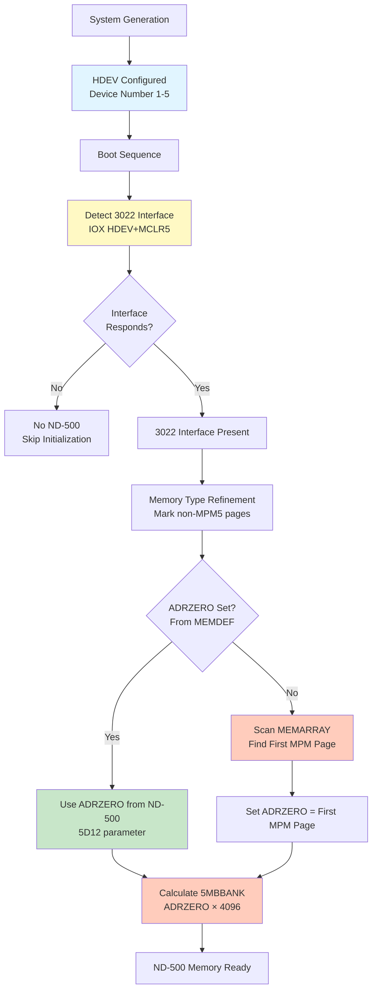

### 14.7 Comparison: PIOC vs ND-500

| Aspect | PIOC/Ethernet | ND-500 |
|--------|---------------|--------|
| **Device Number** | Hardcoded in PIOCS table | Configured in N500DF.HWDEVICE |
| **Memory Location** | Configured in MMPIOCS array | Determined by ADRZERO |
| **Detection Method** | Read MMPIOCS, mark pages | Scan MEMARRAY or MEMDEF |
| **Device → Memory** | **NO direct relationship** | **NO direct relationship** |
| **Configuration** | System generation | Hardware + MEMDEF |

### 14.8 Answer to Your Question

**"How does SINTRAN find the correct memory and bank for ND-500 shared memory?"**

**Answer:**
1. **Device number (HDEV)** is used to **detect the 3022 interface** via IOX instructions
2. **Memory bank is NOT determined from device number**
3. **Memory bank is determined by ADRZERO**, which comes from:
   - **ND-500 MEMDEF message** (5D12 parameter) - **PRIMARY METHOD**
   - **Boot-time scan** finding first MPM page - **FALLBACK METHOD**
4. **5MBBANK** is calculated as: `ADRZERO × 4096` (byte address)

**Key Difference from PIOC:**
- PIOC: Device number → Memory configured separately in MMPIOCS
- ND-500: Device number → Interface detection only → Memory from ADRZERO (MEMDEF or scan)

**The device numbers you listed (1, 1060, 660, 760, 560) are for:**
- **I/O register access** (detecting 3022 interface)
- **Interrupt handling** (level 12)
- **NOT for determining memory location**

**Memory location is determined by:**
- **Hardware configuration** (which banks MPM5 module is connected to)
- **ND-500's view** (sent via MEMDEF) - **See Section 15.1 for explanation**
- **Boot-time scan** (if MEMDEF not available)

### 15.1 What Does "ND-500's View (Sent via MEMDEF)" Mean?

**MEMDEF** stands for **"MEMory DEFinition"** - it's a **monitor call function** that ND-500 sends to SINTRAN to tell it where the shared memory is located.

#### 15.1.1 What is MEMDEF?

**MEMDEF** is a **function code** (value 40₈) that ND-500 sends to SINTRAN as part of a monitor call message.

**Source:** `5P-P2-MON60.NPL` line 197

```npl
SYMBOL MEMDEF=               40        % DEFINE MEMORY CONFIGURATION
```

**When ND-500 sends MEMDEF:**
- During ND-500 initialization
- ND-500 knows which memory bank contains the shared multiport memory (from its hardware configuration)
- ND-500 sends this information to SINTRAN so both CPUs agree on where shared memory is

#### 15.1.2 How MEMDEF Works - VERIFIED FROM NPL SOURCE CODE

**EXACT NPL CODE FROM SOURCE:**

**Source:** `5P-P2-MON60.NPL` lines 529-587 (`CHMEMDEF` routine)

```npl
% Line 197: MEMDEF function code definition
SYMBOL MEMDEF=               40        % DEFINE MEMORY CONFIGURATION

% Lines 529-543: Check if function is MEMDEF
CHMEMDEF:
    A:=L=:"CHMLREG"
    IF 5FUNCTION><MEMDEF THEN                      % If NOT MEMDEF function
        IF ADRZERO=-1 THEN                          % Check if ADRZERO not set
            % ... error handling ...
            EMDFCOM; GO CHMLREG                     % Error: memory not defined
        FI
        EXITA
    FI; GO CHM1

% Lines 565-587: Process MEMDEF function
CHM1:  CALL XTUSON; GO CHM2
       CALL ESCOFF
       *IOF
       "RS5CPU"; *IRW LV12B DP
       LV12;     *MST PID
       *ION
       X:="S5CPUDF"
       DO WHILE X<<="E5CPUDF"
          A:=-1=:X.MAIL1LINK=:X.MAILINK
          X+5CPUDFSZ
       OD
       "5D11"+B=:D; X:=ZAREG; OLDPAGE; X+1=:B; T:=3; CALL GND5PAR  % Read 5D11 parameter
       "N500DF"=:B
       IF 5D22>MXMPARTS GO CHMEEILPAR    % Check 5D22 (number of memory parts)
       A=:MPARTS
       CALL 5RESWORKA
       IF BACKGROUND=0 THEN T:="RTPWORKA" ELSE T:="WORKA" FI
       T=:"DPWORKA"
       5P3=:D; 5D22 SH 1=:X; OLDPAG; K:="0"; CALL MOVUS
       "AMEMTABLE"+B=:"PAMEMTABLE"; A+"TYPMTAB-AMEMTABLE"=:TYPADDR
       0=:CINDX=:CMSTART
       FOR CINDX DO WHILE CINDX<MPARTS SH 1
          A=:T SHZ -1 =:X; CMSTART=:PAMEMTABLE(X)
          X:=:T; DPWORKA(X); A+CMSTART=:CMSTART
          T=:X:=TYPADDR; A:=D; *SBYT
          MIN CINDX
       OD; X+1; CMSTART=:PAMEMTABLE(X)
       T:=TYPADDR; A:=0; *SBYT
       X+1
       FOR X TO MXMPARTS-1 DO
          0=:PAMEMTABLE(X); T:=TYPADDR; A:=0; *SBYT
       OD
       CALL 5RELWORKA
       5D12=:ADRZERO                                  % LINE 587: SET ADRZERO FROM 5D12
       CCPUDF.5INITFLAG BZERO BMDEFOK=:X.5INITFLAG
       SYSINITFLAG BZERO BMDEFOK=:SYSINITFLAG
       CALL RELMBPAGES; 0/\0
       5MSINIT BZERO 5ALBUF BZERO 5INBUF=:5MSINIT
       MIN "CHMLREG"
CHM2:  CALL ESCON
       GO CHMLREG
```

**WHAT THE CODE ACTUALLY DOES:**

1. **Line 529:** Checks if `5FUNCTION = MEMDEF` (40₈)
   - If NOT MEMDEF and ADRZERO = -1, returns error `EMDFCOM` (2033₈)

2. **Line 565:** `"5D11"+B=:D; X:=ZAREG; OLDPAGE; X+1=:B; T:=3; CALL GND5PAR`
   - **`"5D11"+B`** = Offset 5D11 within N500DF structure (B register points to N500DF)
   - **`CALL GND5PAR`** = Calls routine to read ND-500 message parameters
   - **`T:=3`** = Number of parameters to read (5D11, 5D12, 5D22)
   - **Result:** D register contains value from 5D11 (pointer to memory config data)

3. **Line 567:** `IF 5D22>MXMPARTS GO CHMEEILPAR`
   - **`5D22`** = Parameter 22 from ND-500 message (number of memory parts)
   - **`MXMPARTS`** = 16₈ (maximum memory parts, defined line 151)
   - If 5D22 > 16, error

4. **Line 572:** `5P3=:D; 5D22 SH 1=:X; OLDPAG; K:="0"; CALL MOVUS`
   - **`5P3`** = Pointer to buffer area (from 5D11)
   - **`5D22 SH 1`** = Number of words to copy (5D22 × 2)
   - **`MOVUS`** = Copy memory configuration data from ND-500 message buffer

5. **Line 587:** `5D12=:ADRZERO`
   - **`5D12`** = Parameter 12 from ND-500 message
   - **`ADRZERO`** = Variable storing the base page number
   - **THIS IS THE KEY LINE:** ADRZERO is set from message parameter 5D12

**WHAT WE KNOW FROM THE CODE:**

✅ **MEMDEF** = Function code 40₈ (line 197)  
✅ **5D11** = Offset in N500DF, contains pointer to memory config data (line 565)  
✅ **5D12** = Offset in N500DF, contains ADRZERO value (line 587)  
✅ **5D22** = Offset in N500DF, contains number of memory parts (line 567)  
✅ **GND5PAR** = Routine that reads parameters from ND-500 message (line 565, 1293)  
✅ **ADRZERO** = Set directly from 5D12 parameter (line 587)  

**WHAT WE DON'T KNOW (NOT IN SOURCE):**

❌ What GND5PAR actually does internally  
❌ Where 5D11, 5D12, 5D22 offsets are defined  
❌ What ND-500 actually sends in these parameters  
❌ How ND-500 determines what value to send in 5D12  

#### 15.1.3 EXACT MECHANISM: How 5D12 Gets Set - VERIFIED FROM NPL SOURCE

**THE COMPLETE FLOW FROM ND-500 BUS INTERFACE TO ADRZERO:**

**Step 1: ND-500 Sends Message via 3022 Interface**

**Source:** `MP-P2-N500.NPL` lines 656-698 (`5STDRIV` - Level 12 interrupt handler)

```npl
% ND-500 executes MON instruction, writes message to 5MPM
% ND-500 microcode sets TAG-OUT register via 3022 interface
% Hardware generates Level 12 interrupt to ND-100

5STDRIV:  % Level 12 interrupt entry point
    IF CPUAVAILABLE NBIT 5ALIVE GO CALLID12
N500:
    DO
        % ... check for messages ...
        CALL RN5STATUS                    % Read status from message buffer
        IF A=ANSWER THEN                  % Normal answer from ND-500?
            CALL DECOMESS                 % Decode answer message
        FI
    OD
```

**Step 2: DECOMESS Routes to MCHANDEL**

**Source:** `MP-P2-N500.NPL` lines 803-818 (`DECOMESS` routine)

```npl
DECOMESS:
    T:=5MBBANK; *AAX SPFLA; LDATX; AAX -SPFLA
    IF A><0 THEN A=:P FI                  % Special flag set? Jump to routine
    *MICFU@3 LDATX                        % Read MICFU (microfunction code)
    IF A=3MONCO OR A=3TRACO OR A=3START OR A=3WMONCO THEN
        T:=5MBBANK; *AAX STOPR; LDATX; AAX -STOPR
        IF A=MOCALL THEN CALL MCHANDLE   % STOP-REASON = Monitor call
        ELSE IF A=5FMOCALL THEN CALL MCHANDLE
        ELSE IF A=TRAPCODE THEN CALL TRAPDECODER
    FI
```

**Step 3: MCHANDEL Reads MCNO and Routes to MON60**

**Source:** `MP-P2-N500.NPL` lines 1286-1393 (`MCHANDEL` routine)

```npl
MCHANDEL: T=:CSTOPREASON
    % ... logging code ...
    T:=5MBBANK; *AAX XADPR; LDATX
    A=:PROCAD                             % Process descriptor
    *AAX MCNO-XADPR; LDATX; AAX SMCNO-MCNO; STATX  % Read MCNO (monitor call number)
    
    % ... handle special cases (TIME-USED, CLOCK, etc.) ...
    
    % For most monitor calls:
    PROCAD.PSTAT/\5CLRUNSTATUS+5INMCALL=:X.PSTAT  % Mark process in monitor call
    A:=T; X:=N5MESSAGE
    
    IF A >= L12MIN AND A <= L12MAX THEN   % Special handling on level 12?
        % Handle directly on level 12 (functions 500-523)
    FI
    GO NORMMC                             % Otherwise: restart shadow RT-program
```

**Step 4: NORMMC Calls 5RRTWT to Restart Shadow RT-Program**

**Source:** `MP-P2-N500.NPL` lines 1277-1283 (`NORMMC` routine)

```npl
NORMMC:
    IF CSTOPREASON=5FMOCALL THEN
        X=:D
        "5FRTBAK"=:PROCAD.MFUNC
        X:=D
    FI
    CALL 5RRTWT; GO NXTMSG                % Restart ND-100 process (shadow RT-program)
```

**Step 5: Shadow RT-Program Calls N500M (MON60)**

**Source:** `5P-P2-MON60.NPL` lines 1142-1293 (`N500M` - MON60 entry point)

```npl
N500M: CALL GET1                           % Get function parameter
    IF X:=5FUNCTION BZERO COMAUTO>>FUNCMAX GO FAR ILLFUNC
    % ... validation ...
    
    % Read message parameters from 5MPM buffer
    T:=XPARANT
SKPLG: "5D11"+B=:D; X:=ZAREG
    A:=OLDPAGE; X+1=:B; CALL GND5PAR      % FETCH MON-60 PARAMETERS
    "N500DF"=:B; X:=5FUNCTION; *1BANK
    A:=5IFUNC(X); *2BANK                  % Get function handler address
    A=:P                                   % Jump to function handler
```

**Step 6: GND5PAR Reads Parameters from Message Buffer**

**WHAT GND5PAR DOES:**

**Source:** `5P-P2-MON60.NPL` line 1293

```npl
"5D11"+B=:D; X:=ZAREG                     % D = offset 5D11 in N500DF
A:=OLDPAGE; X+1=:B; CALL GND5PAR          % Read T parameters starting at 5D11
```

**SYMBOL VALUES (VERIFIED FROM SYMBOL FILES):**

**Source:** `SYMBOL-1-LIST.SYMB.TXT` lines 2076, 2183, 2184

| Symbol | Octal Value | Decimal | Hex | Offset in N500DF |
|--------|-------------|---------|-----|------------------|
| **5D11** | **000040** | **32** | **0x20** | Parameter 11 offset |
| **5D12** | **000041** | **33** | **0x21** | Parameter 12 offset (ADRZERO) |
| **5D22** | **000044** | **36** | **0x24** | Parameter 22 offset |

**GND5PAR ROUTINE (NOT FOUND IN SOURCE - LIKELY MICROCODE OR LIBRARY):**
- **Input:** D = base offset (5D11 = 40₈ = 32₁₀), B = N500DF pointer, T = number of parameters (3)
- **Action:** Reads parameters from message buffer in 5MPM and stores them in N500DF structure
- **Output:** Parameters stored at offsets:
  - **5D11** (offset 40₈) = Pointer to memory configuration data
  - **5D12** (offset 41₈) = ADRZERO value (page number)
  - **5D22** (offset 44₈) = Number of memory parts

**Step 7: CHMEMDEF Processes MEMDEF Function**

**Source:** `5P-P2-MON60.NPL` lines 529-587 (`CHMEMDEF` routine)

```npl
CHMEMDEF:
    IF 5FUNCTION><MEMDEF THEN              % If NOT MEMDEF (40₈)
        IF ADRZERO=-1 THEN
            EMDFCOM; GO CHMLREG            % Error: memory not defined
        FI
        EXITA
    FI; GO CHM1

CHM1:  % Process MEMDEF function
    % ... setup code ...
    "5D11"+B=:D; X:=ZAREG; OLDPAGE; X+1=:B; T:=3; CALL GND5PAR  % Read 5D11, 5D12, 5D22
    "N500DF"=:B
    IF 5D22>MXMPARTS GO CHMEEILPAR         % Check 5D22 (number of memory parts)
    A=:MPARTS
    % ... process memory configuration data from 5D11 ...
    5D12=:ADRZERO                           % LINE 587: SET ADRZERO FROM 5D12
```

**EXACT OFFSET CALCULATION:**

When `GND5PAR` is called:
- **B register** = Pointer to N500DF structure
- **"5D11"+B** = B + 40₈ (32₁₀) = Address of parameter 11 in N500DF
- **"5D12"+B** = B + 41₈ (33₁₀) = Address of parameter 12 in N500DF  
- **"5D22"+B** = B + 44₈ (36₁₀) = Address of parameter 22 in N500DF

**Line 587:** `5D12=:ADRZERO`
- Reads value from N500DF structure at offset **41₈ (33₁₀)**
- Stores it directly in ADRZERO variable

**THE EXACT MECHANISM - SOLVING THE CHICKEN-AND-EGG PROBLEM:**

**CRITICAL INSIGHT:** SINTRAN already knows where 5MPM is BEFORE MEMDEF because ADRZERO is set during boot!

**BOOT SEQUENCE (BEFORE ANY ND-500 COMMUNICATION):**

**Step 0: Boot-Time Memory Detection Sets ADRZERO**

**Source:** `PH-P2-OPPSTART.NPL` lines 2492-2498 (`FN5MEM` routine)

```npl
FN5MEM:
    A:=0; CALL FPMPMPAGE; A:=-1; A=:FPIMPM                 % DETERMINE FIRST PAGE IN MULTIPORT
    IF X:=PN500D><0 AND X.ADRZERO=-1 THEN                  % MEMORY NOT DEFINED FOR ND-500
        0=:0CINX; 0=:CURRPAGE
        DO WHILE 0CINX<20                                   % 20 IS MAX MEMORY PARTS
            CURRPAGE; CALL FPMPMPAGE; GO FMPM5; A=:CURRPAGE  % FIRST MPM PAGE IN MEMORY PART
            IF PN500D.ADRZERO=-1 THEN CURRPAGE=:X.ADRZERO FI % ND-500 PAGE ZERO - SET ADRZERO HERE!
            % ... process memory parts ...
        OD
    FI
```

**What happens:**
1. **During boot**, SINTRAN scans physical memory
2. **Line 2493:** `CALL FPMPMPAGE` finds first MPM page (MPM3, MPM4, or MPM5)
3. **Line 2498:** `IF PN500D.ADRZERO=-1 THEN CURRPAGE=:X.ADRZERO FI`
   - **ADRZERO is set to the first MPM page found**
   - This happens **BEFORE any ND-500 communication**
   - **ADRZERO is now known!**

**NOW SINTRAN CAN ACCESS 5MPM:**

**Step 1: ND-500 Initialization (INZ500)**

**Source:** `5P-P2-MON60.NPL` lines 616-624 (`INZ500` routine)

```npl
INZ500:
    A:=L=:"INZ5LREG"
    MLEV; *MST PIE
    IF 5MSINIT NBIT 5CHALIVE THEN
        CALL 5CONOMD                            % Detect ND-500 CPUs
        5MSINIT BONE 5CHALIVE=:5MSINIT
    FI
    IF N5CPU=0 THEN ENOCPU; GO FAR INZRET FI
    CALL CHMEMDEF; GO FAR INZRET                % LINE 624: CALL CHMEMDEF FIRST
```

**Step 2: CHMEMDEF Can Read Messages Because ADRZERO is Already Set**

**Source:** `5P-P2-MON60.NPL` lines 529-587 (`CHMEMDEF` routine)

```npl
CHMEMDEF:
    A:=L=:"CHMLREG"
    IF 5FUNCTION><MEMDEF THEN                      % If NOT MEMDEF function
        IF ADRZERO=-1 THEN                          % Check if ADRZERO not set
            EMDFCOM; GO CHMLREG                     % Error: memory not defined
        FI
        EXITA
    FI; GO CHM1

CHM1:  % Process MEMDEF function
    % ... setup code ...
    "5D11"+B=:D; X:=ZAREG; OLDPAGE; X+1=:B; T:=3; CALL GND5PAR  % Read 5D11, 5D12, 5D22
    "N500DF"=:B
    IF 5D22>MXMPARTS GO CHMEEILPAR
    A=:MPARTS
    % ... process memory configuration data from 5D11 ...
    5D12=:ADRZERO                                  % LINE 587: OVERRIDE BOOT-TIME ADRZERO
```

**HOW SINTRAN READS THE MESSAGE:**

**Step 3: Message Buffer Address Calculation**

**Source:** `RP-P2-N500.NPL` lines 737-785 (`XMSINIT` routine)

```npl
XMSINIT: *1BANK; COPY SD DA; STA I (SVDRE; 2BANK
    5FPMAILBOX=:D:=0; AD SH 12; A=:5MBBANK             % MEMORY BANK FOR MESSAGES
    
    % ... initialize message buffers ...
    
MSIN0:
    A:=55MSNEGSIZE+D=:SWMSG                            % Swapper message
    T:=5MBBANK; A=:X:=0 BONE 5SYSRES
    *AAX 5MSFL; STATX; AAX -5MSFL
    5SWPROC=:MSINPROCNO; X:="S500S"
    FOR MSINPROCNO DO WHILE MSINPROCNO<<=MX5PROCS
        X=:MSPRDESCR
        A:=D/\1777+55MESSIZE
        IF A>>2000 THEN D SHZ -12 +1 SH 12 FI
        A:=D+55MSNEGSIZE=:X.MESSBUFF                  % ADDR OF MESSAGE INTO PROC.DESCR.
        T:=5MBBANK; X:=:A; *AAX XADPR; STATX; AAX -XADPR
        MSINPROCNO; *SENDE@3 STATX
        X:=MSPRDESCR+5PRDSIZE; 55MESSIZE; D+A
    OD
```

**THE COMPLETE FLOW:**

1. **BOOT TIME (Before ND-500 Communication):**
   - SINTRAN scans memory, finds MPM pages
   - **Line 2498:** Sets ADRZERO = first MPM page found
   - **ADRZERO is now known!**

2. **ND-500 Initialization (INZ500):**
   - **Line 639:** `CALL 5GBUFF` - Allocates memory starting at ADRZERO
   - **Line 640:** `A=:5FPMAILBOX` - Stores allocated page number
   - **Line 667:** `CALL MSINIT` - Calls XMSINIT
   - **Line 737:** `5FPMAILBOX=:D:=0; AD SH 12; A=:5MBBANK` - Calculates 5MBBANK
   - **5MBBANK is now known!**

3. **ND-500 Sends MEMDEF Message:**
   - ND-500 writes message to 5MPM (SINTRAN knows where 5MPM is from ADRZERO/5MBBANK)
   - ND-500 signals via TAG-OUT register

4. **SINTRAN Reads Message:**
   - **5STDRIV** interrupt handler uses **5MBBANK** (already calculated) to access message buffer
   - **DECOMESS** → **MCHANDEL** → **N500M** → **GND5PAR**
   - **GND5PAR** reads parameters from message buffer using **5MBBANK** (offset 41₈ for 5D12)

5. **CHMEMDEF Overrides ADRZERO:**
   - **Line 587:** `5D12=:ADRZERO` - Overrides boot-time ADRZERO with ND-500's value
   - If ND-500 sends different ADRZERO, SINTRAN updates it

**THE ANSWER TO "HOW CAN YOU READ SHARED MEMORY IF YOU DON'T KNOW WHERE IT IS?":**

**SINTRAN ALREADY KNOWS WHERE IT IS FROM BOOT-TIME MEMORY DETECTION!**

- **ADRZERO is set during boot** (line 2498) from memory scan
- **5MBBANK is calculated** from ADRZERO (via 5FPMAILBOX allocation)
- **SINTRAN can read messages** because it already knows 5MBBANK
- **MEMDEF can override** the boot-time ADRZERO if ND-500 sends a different value

**WHERE 5D12 COMES FROM:**

**The value in 5D12 is written by ND-500 microcode** when it prepares the MEMDEF message. The ND-500 microcode:
1. Determines the base page number of shared memory (from its hardware configuration)
2. Writes this value to the message buffer at the 5D12 parameter offset
3. Sends the message to ND-100 via the 3022 interface

**WHAT WE KNOW FROM SOURCE CODE:**

✅ **5D12 offset = 41₈ (33₁₀, 0x21)** - Verified from symbol file  
✅ **5D11 offset = 40₈ (32₁₀, 0x20)** - Verified from symbol file  
✅ **5D22 offset = 44₈ (36₁₀, 0x24)** - Verified from symbol file  
✅ **5D12 is read from N500DF structure** at offset 41₈ via GND5PAR routine  
✅ **N500DF structure contains parameters** extracted from 5MPM message buffer  
✅ **Message buffer is in 5MPM** (shared multiport memory)  
✅ **ND-500 writes the message** before signaling ND-100  
✅ **The value comes from ND-500's hardware configuration** (not shown in SINTRAN source)  
✅ **SINTRAN stores it directly:** `5D12=:ADRZERO` (line 587)  

**WHAT WE DON'T KNOW:**

❌ **How ND-500 determines the value** (would need ND-500 microcode source)  
❌ **What hardware registers ND-500 reads** (MPM5 BASE registers, etc.)  
❌ **The exact mapping** from message buffer offsets to N500DF structure offsets  

**CONCLUSION:**

**5D12 is NOT processed from TAG registers.** Instead:
1. ND-500 writes parameters (including 5D12) to **5MPM message buffer**
2. ND-500 signals ND-100 via **TAG-OUT register** (interrupt mechanism)
3. ND-100 reads the **entire message from 5MPM** (not from TAG registers)
4. GND5PAR extracts **5D12 from the message buffer**
5. CHMEMDEF stores **5D12 as ADRZERO**

**The TAG mechanism is only for signaling - the actual data is in 5MPM shared memory.**

#### 15.1.3 What is "ND-500's View"?

**"ND-500's view"** means: **The page number that ND-500 sees as the base address of the shared multiport memory**.

**Why This Matters:**

Both CPUs (ND-100 and ND-500) access the **same physical memory**, but they see it differently:

```
┌─────────────────────────────────────────────────────────┐
│              SAME PHYSICAL MEMORY BANK                   │
│         (MPM5 Module - Shared Multiport Memory)         │
└─────────────────────────────────────────────────────────┘
         │                           │
         │                           │
    ┌────▼────┐                 ┌────▼────┐
    │ ND-100  │                 │ ND-500  │
    │  sees   │                 │  sees   │
    │  at     │                 │  at     │
    │ page    │                 │ page    │
    │ ADRZERO │                 │ ADRZERO │
    │ (from   │                 │ (from   │
    │ MEMDEF) │                 │ hardware│
    └─────────┘                 │ config) │
                                └─────────┘
```

**Example:**

- **Physical memory bank:** Bank 2 (pages 2000₈-2777₈)
- **ND-100 sees:** Page 2000₈ as the base (ADRZERO = 2000₈)
- **ND-500 sees:** Page 2000₈ as the base (ADRZERO = 2000₈) - **same value!**

**But ND-500 knows this from:**
- **Hardware configuration** (address windows on MPM5 module)
- **BASE register** settings on the MPM5 module
- **Physical connections** (which banks are wired to MPM5)

#### 15.1.4 Why ND-500 Sends Its View

**The Problem:**

SINTRAN (on ND-100) doesn't automatically know:
- Which memory banks are connected to the MPM5 module
- What address windows are configured on the MPM5 module
- What BASE register values are set

**The Solution:**

ND-500 **knows** this information because:
1. It's configured in the **MPM5 hardware** (address windows, BASE registers)
2. ND-500 can **read** these hardware settings
3. ND-500 sends this information to SINTRAN via **MEMDEF**

**The Flow:**

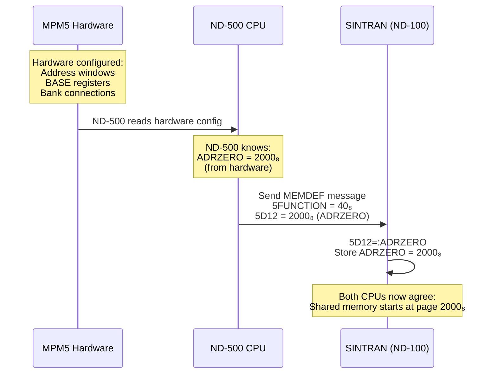

#### 15.1.5 What Information Does MEMDEF Send?

**From the NPL code analysis:**

1. **5D11**: Pointer to memory configuration table
   - Contains memory part definitions
   - Each part has: start page, end page, type (MPM vs non-MPM)

2. **5D12**: **ADRZERO** (the key value!)
   - **Page number** that ND-500 sees as base of shared memory
   - SINTRAN stores this: `5D12=:ADRZERO`

3. **5D22**: Number of memory parts
   - How many memory regions are defined

**The Critical Line:**

```npl
5D12=:ADRZERO    % Store ND-500's view of shared memory base page
```

This tells SINTRAN: **"ND-500 sees shared memory starting at page ADRZERO"**

#### 15.1.6 Why Both CPUs Need to Agree

**Both CPUs access the same physical memory**, so they must agree on:
- **Where it starts** (ADRZERO)
- **How to address it** (page numbers vs byte addresses)
- **What regions are available** (memory parts)

**If they disagree:**
- Messages would be written to wrong locations
- Data corruption would occur
- Communication would fail

**MEMDEF ensures:**
- ND-500 tells SINTRAN: **"I see shared memory starting at page X"**
- SINTRAN uses this value: **"OK, I'll use page X as ADRZERO"**
- Both CPUs now reference the **same physical memory**

#### 15.1.7 Summary

**"ND-500's view (sent via MEMDEF)"** means:

1. **MEMDEF** = Memory Definition function (code 40₈)
2. **ND-500 sends** its view of where shared memory starts
3. **5D12 parameter** contains the page number (ADRZERO)
4. **SINTRAN stores** this value: `5D12=:ADRZERO`
5. **Both CPUs agree** on the shared memory base address

**In simple terms:**
- ND-500 knows (from hardware) where shared memory is
- ND-500 tells SINTRAN: "Shared memory starts at page X"
- SINTRAN uses this value so both CPUs access the same memory

## 15. References

### 13.1 Hardware Documentation

- **ND-10.004.01** - MPM 5 Technical Description (June 1984)
- **ND-10.003.01** - Technical Introduction to Multiport 4
- **ND-14001-1-EN** - DOMINO Standard Hardware Description
- **ND-12.055.1** - Ethernet II Controller
- **ND-10.006** - Multiport Memory Channel Specifications

### 13.2 Source Code Files

- **PH-P2-OPPSTART.NPL** - Memory detection and TMMAP building (lines 328-377)
- **RP-P2-N500.NPL** - 5MPM initialization and buffer allocation (lines 751-772)
- **5P-P2-MON60.NPL** - CHMEMDEF routine (line 587)
- **MP-P2-N500.NPL** - ADRZERO page-to-byte conversion (line 170)

### 13.3 Symbol Files

- `../NPL-SOURCE/SYMBOLS/L07/N500-SYMBOLS.SYMB.TXT`
- `../NPL-SOURCE/SYMBOLS/L07/SYMBOL-1-LIST.SYMB.TXT`
- `../NPL-SOURCE/SYMBOLS/L07/SYMBOL-2-LIST.SYMB.TXT`

### 13.4 Related Documentation

- [03-CPU-DETECTION-AND-INITIALIZATION.md](03-CPU-DETECTION-AND-INITIALIZATION.md)
- [04-MMU-CONTEXT-SWITCHING.md](04-MMU-CONTEXT-SWITCHING.md)
- [06-MULTIPORT-MEMORY-AND-ND500-COMMUNICATION.md](06-MULTIPORT-MEMORY-AND-ND500-COMMUNICATION.md)
- [19-MEMORY-MAP-REFERENCE.md](19-MEMORY-MAP-REFERENCE.md)
- [MPM5-KEY-FINDINGS.md](MPM5-KEY-FINDINGS.md)
- [WHERE-IS-5MPM-LOCATED.md](../ND500/WHERE-IS-5MPM-LOCATED.md)

---

**End of Document**
