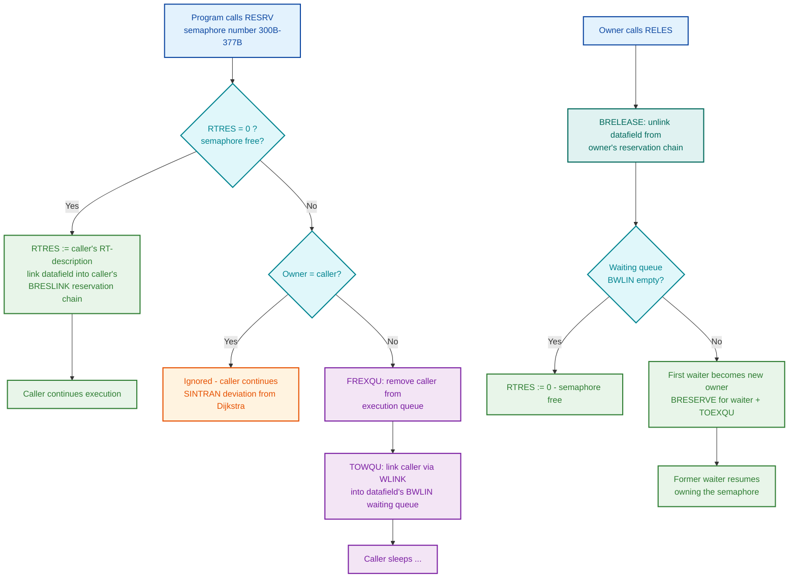

# 21 - Semaphores in SINTRAN III Explained

**Scope**: What a semaphore is, how SINTRAN III implements it on the ND-100, how the ND-500/ND-5000 side works with hardware test-and-set in shared memory, how the kernel and user programs use them, and where every claim comes from (manual or NPL source line).

**Evidence policy**: Everything below is sourced. Claims are marked:
- **[SOURCE]** — verified in NPL source code in this repository (file:line cited)
- **[MANUAL]** — verified in an official ND manual in this repository
- **NOT IN SOURCE SUBSET** — the NPL files in this repository are a subset of the SINTRAN kernel; some routine bodies (notably `BRESERVE`/`BRELEASE` and the `RESRV`/`RELES` monitor call handlers) are *called* everywhere but *defined* in modules not present here. Their behavior is documented from the official System Documentation instead.

---

## 1. Introduction: What Is a Semaphore?

A semaphore is a synchronization primitive: a shared object that programs use to coordinate access to a common resource so that only one of them uses it at a time.

The SINTRAN III System Documentation defines it directly **[MANUAL]**:

> "Since programs under SINTRAN III are far more independent, some form of protection is needed. The concept of semaphores has been chosen. A semaphore is a common data element on which two operations may be performed: **reservation** and **release**. If a program tries to reserve a semaphore already reserved by some other program, it will be put in a waiting queue until the semaphore is released."
> — ND-60062 SINTRAN III System Documentation

Two further facts follow from the same section **[MANUAL]**:

- Every I/O device has a semaphore attached as a standard facility — reserving a terminal or printer *is* a semaphore operation.
- A pool of "free" **user semaphores** exists for general use: "These may be considered degenerated devices which can only be reserved and released."

So in SINTRAN there is no separate semaphore subsystem: **a semaphore is simply a device datafield with no hardware behind it**. The reservation machinery used for real devices (waiting queue, owner field, monitor calls) is reused unchanged.

### 1.1 SINTRAN vs. the Dijkstra Semaphore

The SINTRAN III Real Time Guide warns that SINTRAN's semaphore deviates from Dijkstra's classic binary semaphore in one deliberate way **[MANUAL]**:

| Situation | Dijkstra semaphore | SINTRAN semaphore |
|---|---|---|
| Reserve a free semaphore | Allocate to caller | Allocate to caller |
| Reserve a semaphore held by *another* program | Caller enters waiting queue | Caller enters waiting queue |
| Reserve a semaphore the caller *already holds* | **Deadlock** (caller waits for itself) | **Ignored** — caller continues |

Consequences (Real Time Guide, section 10.10):
- The invariant "completed RESRV calls ≤ RELES calls + 1" does not hold.
- No matter how many times a program reserved the same semaphore, **one** RELES releases it.

### 1.2 Semaphores Are Advisory

The Real Time Guide (section 11.1) is explicit that SINTRAN semaphores protect nothing by themselves **[MANUAL]**:

> "The use of semaphores is completely under control of user programs and SINTRAN does not guarantee consistent use of the semaphores beyond that of reserving the semaphores themselves. Any program may ignore the semaphores protecting a common resource... The semaphore should be considered a basic building block for protection mechanisms and synchronization tools tailored to the particular application."

---

## 2. ND-100: How SINTRAN Semaphores Work

### 2.1 The Data Structure: A Datafield with Three Key Words

A SINTRAN semaphore is a device datafield. The relevant header fields (offsets octal) **[SOURCE: SINTRAN-STRUCTURES.md]**:

| Offset | Field | Meaning |
|---|---|---|
| 000 | `RESLI` | Reservation-chain link: next datafield in the *owning program's* chain of reserved resources (0 = end) |
| 001 | `RTRES` | Owner: address of the reserving program's RT-description; **0 = free** |
| 002 | `BWLIN` | Waiting-queue head: first RT-description waiting for this resource |

On the program side, each RT-description carries:

| Offset | Field | Meaning |
|---|---|---|
| 013 | `WLINK` | Single queue link — used for **both** the execution queue and any resource waiting queue (a program is in exactly one at a time) |
| 020 | `BRESLINK` | Head of the program's reservation chain (all datafields it currently holds) |

A minimal "pure" semaphore datafield is just this header. The kernel declares them as small initializer blocks, e.g. the ND-500 general lock **[SOURCE: DP-P2-VARIABLES.NPL:146]**:

```
INTEGER WEMSE:=(0,0,WEMSE,2)          % GENERAL LOCK
```

and the per-CPU locks **[SOURCE: DP-P2-VARIABLES.NPL:161-167]**:

```
INTEGER CPU51:=(0,0,CPU51,2,0,0,0)
```

### 2.2 The Kernel Primitives: BRESERVE and BRELEASE

**NOT IN SOURCE SUBSET — but RECOVERED**: these two routines are called from at least 11 NPL files in this repository, while their bodies live in a core module not preserved here. Their machine code has since been recovered from a running SINTRAN L07 system and verified live — full annotated listings in [21-SEMAPHORES-RECOVERED-CODE.md](21-SEMAPHORES-RECOVERED-CODE.md). The recovered code confirms everything below, including the recursive-reserve no-op and the BRELEASE → BRESERVE + TOEXQU ownership transfer (both visible in the machine code). Behavior from the System Documentation **[MANUAL: ND-60062]**:

- **BRESERVE**: "The basic routine BRESERVE is called to link the reserved resource to the program's reservation queue."
- **BRELEASE** (via RELES/PRLS): "...remove the resource from the reservation queue of the reserving program. If there is any RT-program waiting for the resource, RELEASE removes the first one from the waiting queue, reserves the resource for that program by calling BRESERVE and inserts the program into the execution queue by calling TOEXQU."

So release performs **ownership transfer**: the first waiter becomes the new owner immediately and is moved back to the execution queue.

The calling convention is fully visible at the call sites **[SOURCE]**:

- Entry: `B` = datafield address, `X` = RT-description of the requesting program.
- Exit: `A < 0` means the resource was already occupied.

Canonical reserve site — the swapping semaphore **[SOURCE: RP-P2-SEGADM.NPL:1033-1034]**:

```
"CLFIE"=:B; X:=RTREF; CALL BRESERVE
IF A<0 THEN ...                        % occupied — go wait
```

Canonical release with owner check **[SOURCE: RP-P2-MSYSU.NPL:525]**:

```
IF X=RTRES THEN CALL BRELEASE FI       % release only if reserved by caller
```

### 2.3 Atomicity: Interrupt Masking, Not Test-and-Set

On the ND-100 side the kernel does **not** use the hardware `TSET` instruction for its own semaphores. There is a single CPU, so making the test-and-set of `RTRES` and the queue relinking indivisible only requires keeping other program levels out. The sources show two techniques **[SOURCE]**:

- Masking the monitor level around the operation: `MLEV; *MCL PIE` before `CALL BRESERVE`, restored with `MLEV; *MST PIE` after — e.g. RP-P2-MSYSU.NPL:514-516, 5P-P2-MON60.NPL:2495-2498 (`RESNAMSEG`).
- Full interrupt-off: `*IOF; CALL BRELEASE; *ION` — e.g. 5P-P2-MON60.NPL (`5RELWORKA`).

An exhaustive grep confirms the `TSET` (140123) and `TSETP` (140516) instructions appear in exactly **one** place in the entire NPL subset: the ND-500 shared-memory lock in CC-P2-N500.NPL (section 3 below). Hardware test-and-set is needed only where two *independent CPUs* contend — interrupt masking cannot stop the other processor.

(The ND-110 hardware does provide bus-level semaphore support — the `SEMREQ` signal locks the ND-100 bus for two consecutive cycles during `TSET`/`RDUS`, bypassing cache **[MANUAL: ND-06.026 / ND-06.029]** — and this is exactly what the ND-500 interface exploits.)

### 2.4 The Reserve-or-Wait Idiom

When a kernel routine needs a semaphore and must sleep if it is taken, the sources repeat one idiom (here from `DCRES`, the directory-cluster reserve) **[SOURCE: RP-P2-MSYSU.NPL:513-522]**:

```
X:=RTRES; "CLSEM"=:B          % B = semaphore datafield
MLEV; *MCL PIE                % shut out the monitor level
CALL BRESERVE                 % try to reserve
IF A<0 THEN                   % occupied by someone else:
   CALL FREXQU                %   remove self from execution queue
   CALL TOWQU                 %   insert self into the datafield's waiting queue
   ...                        %   arrange restart address, reschedule
FI
```

The same pattern appears in `RESNAMSEG` (5P-P2-MON60.NPL:2492-2507), `SRESER` (RP-P2-SEGADM.NPL), and `EXABS` (RP-P2-MONCALLS.NPL:2797-2807).



### 2.5 The Monitor Call Interface

User programs never touch datafields directly; they use monitor calls **[MANUAL: Real Time Guide ch. 11 / ND-60062]**:

| Call | Function |
|---|---|
| `RESRV` (MON 64) | Reserve a device or semaphore. A `<return flag>` parameter selects behavior when occupied: 0 = wait in queue, non-zero = return immediately with a status value |
| `RELES` (MON 65) | Release; if the waiting queue is non-empty, ownership transfers to the first waiter |
| `PRSRV` | Reserve *on behalf of another program*; never waits — returns a status instead |
| `PRLS` | Force a program to release a resource |

Inside the kernel the same calls exist as internal monitor calls; the accounting subsystem shows the exact form, passing the semaphore's datafield name directly **[SOURCE: RP-P2-ACCRT.NPL:96, 225]**:

```
"ACCSEMRE"; *MON 2RESR             % RESERVE ACCOUNTING SEMAPHORE
...
"ACCSEMRE"; *MON 2RELE             % RELEASE ACCOUNTING SEMAPHORE
```

**NOT IN SOURCE SUBSET**: the `RESRV`/`RELES` handler bodies (logical device number → datafield resolution) are not in this repository's NPL files.

### 2.6 User Semaphores: Logical Device Numbers 300B–377B

**[MANUAL: Real Time Guide section 11.2 / Monitor Calls manual]**:

- User semaphores are logical device numbers **300B–377B** (192–255 decimal).
- The number actually generated is a system-generation parameter, typically 5–20 (default 5).
- Like any device, each has a waiting queue.
- The OS reserves further ranges for its own semaphores, e.g. spooling semaphores (600B–677B), directory table semaphores (2500B–2677B), batch semaphores (3100B–3177B) — see the logical device number tables in the Monitor Calls manual.

---

## 3. ND-500 / ND-5000: Semaphores Across Two CPUs

### 3.1 Why a Different Mechanism Is Needed

The ND-500/ND-5000 is an independent processor communicating with the ND-100 through shared (multiport) memory. Interrupt masking on the ND-100 cannot stop the ND-500 from writing a shared word, so a genuinely atomic hardware operation is required. The ND-5000 Hardware Description states it directly **[MANUAL: ND-05.020, ch. 5]**:

> "In the communication between the ND-120 and ND-5000, shared memory is used for busy waiting on semaphores using the test-and-set function. This allows several processes to share a common device by reserving and freeing a common semaphore. In a test-and-set cycle, the memory is locked between the read and write cycles to guarantee that only one process reserves a free semaphore."

Hardware support exists at every level **[MANUAL]**:
- ND-110 bus: `SEMREQ` locks the bus for two consecutive cycles; DMA devices (multiport memory) may also drive it (ND-06.026).
- Multiport memory: the `LOCK` signal — "two consecutive cycles in a memory cell without allowing any other source to access memory" (ND-10.003 Multiport 4; ND-10.004 MPM 5: "LOCK — Semaphore cycle, i.e., test and set").
- MFbus: `MLOCK` — "Memory Lock, for ACCP semaphore cycles in MFbus"; the ND-5000 CPU has a modus bit `PLOCK` (bit 12: semaphore access) (ND-05.020).

### 3.2 The Shared-Memory Lock: X5SEMA / X5RES

The ND-100↔ND-500 interface datafield `N500DF` has a per-CPU shared extension `X500DF` whose **first word is the lock**:

| Offset (octal) | Symbol | Content |
|---|---|---|
| 0 | `X5SEMA` | Test-and-set word — the actual lock |
| 47 | `X5RES` | Current owner (**-1 = held by the ND-100**) |

**[SOURCE: CC-P2-N500.NPL:702-772; see also ND500-BUS-INTERFACE-REFERENCE.md section 6.5]**

### 3.3 SLOCK / SUNLOCK — Full Algorithm

`SUBR SLOCK,SUNLOCK` — "Routines to lock/unlock N500 execution queue/interrupt semaphore" **[SOURCE: CC-P2-N500.NPL:693-772]**. Everything below is verified line-by-line in the source:

The two test-and-set instructions are embedded as data words (NPL has no mnemonic for them):

```
INTEGER TSET(0);  *140123     % Logical test-and-set instr. for not Rask cpu
INTEGER TSETP(0); *140516     % Physical test-and-set instr. for Rask cpu
```

**SLOCK** (skip return = lock held; direct return = error):

1. On "old" ND-500 systems: immediate skip-return, no-op — the lock protocol exists only for the ND-5000 generation.
2. Check the RASK bit in `1HWINF`. RASK/Delilah CPUs execute `TSETP` (physical-address test-and-set) directly on `X5SEMA`; older CPUs build a windowed multiport address and execute logical `TSET`.
3. Execute the test-and-set via `*EXR SD`. If `A=0` the lock was free → taken, go to success.
4. Otherwise read `X5RES`; if it is already -1 the ND-100 itself owns the lock → success (recursive ownership permitted, the same deviation from Dijkstra as in section 1.1).
5. Otherwise **busy-wait**: an outer loop of 2 passes, each pass approximately 100 milliseconds of inner delay loops with a test-and-set retry approximately every 100 microseconds (loop constants -3720/-1750 and -130/-54 chosen per CPU speed; comments in source).
6. On timeout: return error code `N5LTIMOUT`.
7. Success path (`SOKRET`): write -1 into `X5RES` (mark "owned by ND-100"), skip-return.

**SUNLOCK**:

1. No-op direct exit on old-500 systems.
2. Read `X5SEMA`/`X5RES`; **only if the owner is -1** (the ND-100) clear both the lock word and `X5RES` (`*STZTX; AAX -X5RES; STZTX`).

Call sites protect the ND-500 execution queue and interrupt communication, e.g. **[SOURCE: MP-P2-N500.NPL:370]**:

```
CALL SLOCK; 0/\0; CALL ITO500XQ; CALL SUNLOCK    % insert into N500 execution queue under lock
```

Other verified call sites: CC-P2-N500.NPL:551,565; RP-P2-N500.NPL:218-220 ("Lock queue semaphore" / "Unlock queue semaphore"); 5P-P2-MON60.NPL:751,812,945,976,1447,1558,1659,2156,2612,2680,2696; MP-P2-PERF-SAMP.NPL:1017,1073.

### 3.4 The XSEMS Lock Table — Named ND-500 Semaphores

Besides the one shared-memory spin lock, the ND-500 driver uses a set of ordinary **ND-100 datafield semaphores** (BRESERVE-style, sleeping) for its own resources. They are gathered in one table **[SOURCE: DP-P2-VARIABLES.NPL:141-142]**:

```
INTEGER ARRAY XSEMS:=(5NAMSEM,CSSEM,PLSSEM,FIXSEM,CSSEM,PLSSEM,SYDSEG,SWORKA,WEMSEM,WEMSEM,
                      CPU51,CPU52,CPU53,CPU54,CPU55,CPU56,CPU57,CPU58);
```

indexed by the T register in `RESNAMSEG`/`RELNAMSEG`. The routine header documents every index **[SOURCE: 5P-P2-MON60.NPL:2473-2489]**:

| T (octal) | Semaphore | Protects |
|---|---|---|
| 0 | `5NAMSEM` | Name segment |
| 1 | `CSSEM` | Load control store function |
| 2 | `PLSSEM` | Place-swapper function |
| 3 | `FIXSEM` | Wait for fix-pages |
| 4 | `CSSEM` | Reserve control store (no-wait variant) |
| 5 | `PLSSEM` | Reserve place-swapper (no-wait variant) |
| 6 | `SYDSEG` | System-domain segment |
| 7 | `SWORKA` | RTPWORKA work area for RT programs |
| 10 | `WEMSEM` | Write error message to SINTRAN error device |
| 11 | `WEMSEM` | **"General free lock"** — the general N5000 semaphore (no-wait variant) |
| 12–21 | `CPU51`–`CPU58` | Per-CPU datafields (ACCP buffers), one per ND-5000 CPU |

`RESNAMSEG` **[SOURCE: 5P-P2-MON60.NPL:2492-2530]** is the standard reserve-or-wait idiom from section 2.4 applied to `XSEMS(T)`: `MCL PIE` → `BRESERVE` → if occupied, either return immediately (lock types 4, 5, 11) or `FREXQU; TOWQU` and reschedule. `RELNAMSEG` releases only if the caller owns it: `IF X:=RTRES=RTREF THEN CALL BRELEASE FI`.

Routines that manipulate ND-5000 CPU state require this general lock to already be held, e.g. `RESCPU` — "MUST BE CALLED IN IOF WITH GENERAL N5000 SEMAPHORE LOCKED!!!" **[SOURCE: 5P-P2-MON60.NPL:691]**.

### 3.5 Cleanup: ALLRELEASE

When an ND-500 program terminates or is interrupted (escape handling), the kernel must drop every lock it holds. `SUBR ALLRELEASE` — "RELEASE ALL ND-500 SEMAPHORES" **[SOURCE: 5P-P2-MON60.NPL:1050-1080]**:

1. Under `MCL PIE`, loop `FOR X:=0 TO 11` over `XSEMS` and `BRELEASE` every lock whose `RTRES` equals the calling program.
2. Walk the program's `BRESLINK` reservation chain and release everything else it holds: file-system locks (`9SFIS`–`9EFIS`), device buffers (`DEVBU`–`ENDBU`), DF datafields, SIBAS working fields.

This is the crash-safety net that the reservation-chain (`RESLI`/`BRESLINK`) structure exists to make possible: because every reserved datafield is linked to its owner, the kernel can always enumerate and release a dead program's semaphores.

### 3.6 Summary: Two Mechanisms Side by Side

| | ND-100 SINTRAN semaphore | ND-500/5000 shared-memory lock |
|---|---|---|
| Object | Device datafield (`RTRES`/`BWLIN`) | Shared word `X5SEMA` in multiport memory |
| Atomicity | Interrupt masking (`IOF` / `MCL PIE`) — single CPU | Hardware `TSET`/`TSETP` — bus locked via SEMREQ/LOCK/MLOCK |
| When occupied | **Sleep**: caller leaves execution queue, waits in `BWLIN` queue | **Spin**: busy-wait with retries, approximately 100 ms per loop, 2 loops |
| On release | Ownership transfers to first waiter | Lock word cleared; contenders' next test-and-set wins |
| Recursive reserve | Ignored (no deadlock) | Ignored (`X5RES = -1` check) |
| Failure mode | Wait forever (or immediate return if flag set) | Timeout error `N5LTIMOUT` |
| Kernel routines | `BRESERVE`/`BRELEASE`, `RESNAMSEG`/`RELNAMSEG` | `SLOCK`/`SUNLOCK` |

---

## 4. How the OS and Programs Use Semaphores

### 4.1 Kernel-Internal Semaphores (Verified Call Sites)

| Semaphore | Protects | Source evidence |
|---|---|---|
| `CLFIE` (swapping semaphore) | The segment-transfer/swapping machinery — only one process may run the segment handler at a time | RP-P2-SEGADM.NPL:1033-1034 (`SRESER`), :1069 (`SRELES`); IP-P2-SEGADM.NPL:1041,1129,1257 (release via `CALLMLEV(MLBRELEASE)`); tested by the ND-500 driver at MP-P2-1.NPL:966 |
| `ACCSEMRE` (accounting) | Accounting files during open/write/close | RP-P2-ACCRT.NPL:94-96, 221-244 |
| `CLSEM` (directory cluster) | Directory-cluster allocation in the file system | RP-P2-MSYSU.NPL:513-527 (`DCRES`/`DCREL`) |
| `RVSEM` (revive) | Background-program revival | RP-P2-MSYSU.NPL:739 |
| `DUMMY` (queueing semaphore) | Serializes MON EXABS absolute-load requests | RP-P2-MONCALLS.NPL:2797-2821; also MP-P2-DISK-START.NPL:22, MP-P2-DIMIR.NPL:96 |
| Logging semaphore | The measurement-log working field | MP-P2-1.NPL:955 (`LOGFIELD.RTRES` owner check) |
| `DEMFIELD` working field | Monitor-call parameter area for demand-segment programs (a page fault mid-call could otherwise let another program corrupt the shared working field) | **[MANUAL: ND-60062]** — handler source not in subset |
| RT loader semaphore (device 503B) | Only one user in the RT loader at a time | **[MANUAL: ND-60062 / Real Time Guide]** — `@SCHEDULE 503B` trick below |
| XSEMS locks + `X5SEMA` | All ND-500/5000 resources | Section 3 |

Beyond these named examples, **every device reservation in SINTRAN is a semaphore operation** on that device's datafield — terminals, printers, disks, internal devices alike **[MANUAL: ND-60062]**.

### 4.2 User-Program Patterns

From the Real Time Guide **[MANUAL: chapters 11, 12, 19]**:

- **Protecting shared data**: RT programs sharing an RTCOMMON data structure reserve a user semaphore (300B–377B) with `RESRV` before touching it and `RELES` after. Chapter 11.3 demonstrates what happens without this: two programs concurrently relinking a shared linked list produce a cycle, and every "walk to end of list" loop in the system then hangs.
- **Protecting non-reentrant code**: two RT programs calling a non-reentrant subroutine reserve a semaphore around the call (Real Time Guide appendix example 3, section 19.7.2).
- **An RTCOMMON variable as a lightweight semaphore**: section 12.1.5 shows a flag variable used for synchronization without kernel calls — with the corresponding caveats.
- **Job-queue serialization with @SCHEDULE**: the RT loader is protected by semaphore 503B; a batch job can issue `@SCHEDULE` on that device number to hold the job until the loader is free **[MANUAL: Real Time Guide]**.
- **Waiting-queue discipline**: an unsuccessful `RESRV` (flag 0) parks the program in the semaphore's queue; `RELES` hands the semaphore to the first waiter, so the queue is FIFO by arrival.

### 4.3 Why the Kernel Sometimes Refuses to Queue

The System Documentation gives a subtle scheduling reason **[MANUAL: ND-60062]**: when the *segment-transfer* semaphore is taken, new requesters are deliberately **not** queued on it —

> "several programs may be waiting for the same segment. After the segment is got into core, there might still be a program further back in the semaphore waiting queue that could have run. Therefore, if the semaphore is occupied, nothing is done with respect to the current program, but the next RT-program in the execution queue is tried to be activated."

The same no-wait choice appears in the ND-500 lock table (lock types 4, 5, 11 in `RESNAMSEG` return immediately instead of queuing) **[SOURCE: 5P-P2-MON60.NPL:2504-2507]**. Waiting queues are the mechanism; whether to use them is a per-resource policy decision.

---

## 5. References

### 5.1 Manuals (in this repository)

| Document | Relevant content |
|---|---|
| [ND-60062 SINTRAN III System Documentation](../../Operations/SINTRAN/ND-60062-01D-EN%20SINTRAN%20III%20System%20Documentation.md) | Semaphore definition (line 343-345); BRESERVE/BRELEASE/TOEXQU behavior; DEMFIELD; segment-transfer semaphore policy (line 2862-2864); RT loader semaphore; SCHEDULE command semaphore |
| [ND-60.133 SINTRAN III Real Time Guide](../../Reference-Manuals/ND-60.133.02A%20SINTRAN%20III%20Real%20Time%20Guide.md) | Chapter 11 SEMAPHORES (semaphores and protocols, access, linked-list corruption example); section 10.10 SINTRAN vs. Dijkstra; 12.1.5 RTCOMMON variable as semaphore; 19.7.2 protecting non-reentrant code; RESRV/RELES/PRSRV/PRLS; user semaphores 300B-377B; RT loader 503B |
| [ND-860228 SINTRAN III Monitor Calls](../../Reference-Manuals/ND-860228-2-EN%20SINTRAN%20III%20Monitor%20Calls.md) | RESRV/RELES call specifications; logical device number map (user semaphores 300-377B, spooling, directory-table, batch semaphores) |
| [ND-06.026 ND-110 Functional Description](../../Reference-Manuals/ND-06.026-1-EN%20ND-110%20Functional%20Description.md) | SEMREQ semaphore bus cycles (CPU and DMA); cache bypass; two-cycle bus lock |
| [ND-06.029 ND-110 Instruction Set](../../Reference-Manuals/ND-06.029.1%20EN%20ND-110%20Instruction%20Set.md) | TSET (140123), TSETP (140516), RDUS (140127) instruction definitions |
| [ND-05.020 ND-5000 Hardware Description](../../Reference-Manuals/500/ND-05.020.01%20EN%20ND-5000%20Hardware%20Description.md) | Shared-memory test-and-set (ch. 5 Access Module); MLOCK MFbus signal; PLOCK modus bit 12 |
| [ND-10.003 Technical Introduction to Multiport 4](../../Reference-Manuals/500/ND-10.003.01%20TECHNICAL%20INTRODUCTION%20TO%20MULTIPORT%204.md) | LOCK signal: semaphore request, two consecutive memory cycles |
| [ND-10.004 MPM 5 Technical Description](../../Reference-Manuals/ND-10.004.01%20MPM%205%20Technical%20Description.md) | LOCK = semaphore cycle (test-and-set) in MPM 5 |

### 5.2 NPL Source Code (in this repository)

| File | Relevant content |
|---|---|
| [CC-P2-N500.NPL](../NPL-SOURCE/NPL/CC-P2-N500.NPL) | **SLOCK/SUNLOCK** (lines 693-772): TSET/TSETP, X5SEMA/X5RES, spin loop, N5LTIMOUT |
| [5P-P2-MON60.NPL](../NPL-SOURCE/NPL/5P-P2-MON60.NPL) | **RESNAMSEG/RELNAMSEG** (2473-2533) with XSEMS index map; **ALLRELEASE** (1050-1080); **RESCPU** general-semaphore precondition (691); 5RESWORKA/5RELWORKA; many SLOCK call sites |
| [DP-P2-VARIABLES.NPL](../NPL-SOURCE/NPL/DP-P2-VARIABLES.NPL) | **XSEMS array** (141-142); WEMSE general lock (146); CPU51-CPU58 per-CPU semaphore datafields (161+) |
| [RP-P2-SEGADM.NPL](../NPL-SOURCE/NPL/RP-P2-SEGADM.NPL) | Swapping semaphore CLFIE: SRESER/SRELES (1033-1069) |
| [IP-P2-SEGADM.NPL](../NPL-SOURCE/NPL/IP-P2-SEGADM.NPL) | Swapping semaphore release via monitor-level trampoline (1041, 1129, 1257) |
| [RP-P2-MSYSU.NPL](../NPL-SOURCE/NPL/RP-P2-MSYSU.NPL) | CLSEM directory-cluster semaphore, full reserve-or-wait idiom (513-527); RVSEM (739) |
| [RP-P2-ACCRT.NPL](../NPL-SOURCE/NPL/RP-P2-ACCRT.NPL) | ACCSEMRE accounting semaphore via `*MON 2RESR`/`*MON 2RELE` (94-96, 221-244) |
| [RP-P2-MONCALLS.NPL](../NPL-SOURCE/NPL/RP-P2-MONCALLS.NPL) | DUMMY queueing semaphore with wait and ownership hand-off (2797-2821) |
| [MP-P2-N500.NPL](../NPL-SOURCE/NPL/MP-P2-N500.NPL) | SLOCK around ND-500 execution-queue insertion (370); device-buffer reservations |
| [RP-P2-N500.NPL](../NPL-SOURCE/NPL/RP-P2-N500.NPL) | SLOCK/SUNLOCK queue-semaphore call sites (218-220) |
| [MP-P2-1.NPL](../NPL-SOURCE/NPL/MP-P2-1.NPL) | Logging-semaphore owner check (955); BRESERVE call sites |

### 5.3 Related Repository Documentation

| Document | Relevant content |
|---|---|
| [SINTRAN-STRUCTURES.md](../SINTRAN%20Structures/SINTRAN-STRUCTURES.md) | Datafield layout: RESLI (000), RTRES (001), BWLIN (002); RT-description WLINK (013), BRESLINK (020) |
| [ND500-BUS-INTERFACE-REFERENCE.md](../ND500/ND500-BUS-INTERFACE-REFERENCE.md) | Section 6.5: X500DF extension, X5SEMA/X5RES offsets, SLOCK/SUNLOCK protocol summary |
| [02-QUEUE-STRUCTURES-DETAILED.md](02-QUEUE-STRUCTURES-DETAILED.md) | Execution and waiting queue mechanics (FREXQU/TOWQU/TOEXQU context) |
| [14-MONITOR-KERNEL-MONCALLS.md](14-MONITOR-KERNEL-MONCALLS.md) | Monitor call dispatch |
| [06-MULTIPORT-MEMORY-AND-ND500-COMMUNICATION.md](06-MULTIPORT-MEMORY-AND-ND500-COMMUNICATION.md) | Multiport memory and ND-100/ND-500 communication context |

---

**Note on completeness**: the NPL sources preserved in this repository are a subset of the full SINTRAN III kernel. The bodies of `BRESERVE`, `BRELEASE`, and the `RESRV`/`RELES`/`PRSRV`/`PRLS` monitor-call handlers, as well as the datafield declarations of `5NAMSEM`/`CSSEM`/`PLSSEM`/`FIXSEM`/`SYDSEG`/`SWORKA`/`WEMSEM`, are in modules not present here; their behavior above is taken from the official manuals and from the calling conventions visible at their (numerous) call sites. `FRSRV` is documented in the Real Time Guide but no evidence of it exists in this source subset. The master generation listing `s3vs-4.symb` was checked as well: it contains only the same call sites, confirming the defining module was not part of the generation-job source.

**Recovery leads — kernel addresses from the symbol tables [SOURCE: SYMBOL-1-LIST.SYMB.TXT per version]**: the missing routines have known entry addresses (octal), so their bodies can be recovered by disassembling a matching SINTRAN kernel image:

| Symbol | Routine | K03 | L07 | M06 |
|---|---|---|---|---|
| `BRESE` | BRESERVE | 011764 | 010563 | 011435 |
| `BRELE` | BRELEASE | 012011 | 010610 | 011462 |
| `PRSRV` | PRSRV handler | — | — | 037101 |
| `RESRV` | RESRV handler | — | — | 037106 |
| `RELES` | RELES handler | — | — | 037161 |

In all three versions `BRELE - BRESE = 25B` (21 decimal words), so BRESERVE is a 21-word routine and its size is stable across K03/L07/M06. The internal monitor call numbers are also in the symbol tables: `2RESR = 122B`, `2RELE = 123B` (identical in every version and symbol file).

**RECOVERED (L07)**: using these addresses, the routine bodies were disassembled from a running SINTRAN III VSX/500 L system (nd100x emulator, SMD boot, DAP debugger) and BRESERVE was verified by single-stepping a live console-terminal reservation. See [21-SEMAPHORES-RECOVERED-CODE.md](21-SEMAPHORES-RECOVERED-CODE.md) for the full annotated listings, raw dumps, and the RESRV/RELES handler capture. Remaining open items: full annotation of the RESRV/RELES handlers (literal resolution), and K03/M06 cross-version comparison.
