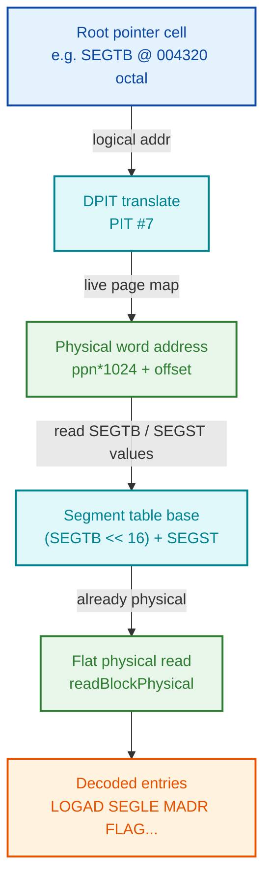

# Reading the RT-Program List and Segment Table Directly From Running SINTRAN Memory

**Status:** Reference / implementation guide — **implemented in the nd100x glass UI and
live-validated on a booted L07 system over DAP (2026-07-09), see §8**
**Scope:** SINTRAN III VSX/VSX-500, versions K03 / L07 / M06
**Purpose:** Document a JSON-free method for a live tool (the nd100x glass/WASM UI, or any
offline dump analyzer) to read the RT-program list and the segment table straight from
emulated SINTRAN memory, keyed by the running version. All *structural* data is read live
from memory; only *human-readable names* need a static label source, not an AI-derived JSON file.
The two name kinds have **different** sources (VERIFIED): **RT-program names ARE in the linker
symbol table** — the symbol's value equals the RT-description address (e.g. `DUMMY=012071`,
`RWRT1=012501`), so it is a live address→name lookup. **System-segment names are NOT symbols**
(`S3FS`/`S3CP`/`S3IMAGE` do not appear in any `SYMBOL-*-LIST`); at runtime they live only in the
RT-loader's packed per-segment table (`PSGNA`, 8-word records keyed by segment number, mapped
only while the RT-loader is active — record layout AND name packing fully decoded, §6.5), so the
practical sources for segment names are the per-version `@RT-LOADER LIST-SEGMENT` name↔number map
(fixed per SINTRAN version) or a direct PSGNA decode from the `S3RTFIL` segment.

Cross-references (relative links):
- [SINTRAN-STRUCTURES.md](../SINTRAN%20Structures/SINTRAN-STRUCTURES.md) — data-structure reference
- [02-QUEUE-STRUCTURES-DETAILED.md](02-QUEUE-STRUCTURES-DETAILED.md) — RT-description fields
- [11-RT-SEGMENTS-AND-SEGFIL.md](11-RT-SEGMENTS-AND-SEGFIL.md) — segment / SEGFIL layout
- [17-SCHEDULER-AND-PRIORITIES.md](17-SCHEDULER-AND-PRIORITIES.md) — priority / status semantics

Notation: memory sizes are in **WORDS** (1 word = 2 bytes). Octal is written `NNNNN₈` or with a
leading `0o` in code; hex with `0x`. Every claim is tagged **VERIFIED** (confirmed from source
or symbol tables) or **UNCERTAIN**.

---

## 0. Executive summary

| Question | Answer | Confidence |
|---|---|---|
| Is the running version in memory? | Yes — `SINVER0` at `004055₈` holds the ASCII version letter (low byte) and OS type (bits 8-10). No banner scraping needed. | VERIFIED |
| Are the root pointers version-stable? | Yes — `RTSTA`, `RTEND`, `SGMAX`, `SEGTB`, `SEGST`, `CORMB` are byte-identical across K03/L07/M06. | VERIFIED |
| Are the field offsets version-stable? | Yes — RT stride `5RTSI=26₈`, segment stride 8 words, and every field offset match across the three versions. | VERIFIED |
| Can the RT list be read from memory? | Yes — count, priority, status, assigned/active segments, start address, P-register are all in memory. | VERIFIED |
| Can the segment table be read from memory? | Yes — LOGAD, SEGLE, MADR, FLAG (incl. SEGFIL number), SGSTA, BPAGL, LRU links are all in memory. | VERIFIED |
| What still needs a static label file? | Only the **names**. RT names come from the linker symbol table (address→symbol join, incl. `BAK01`-`BK121`/`BCH01`-`BCH10`). Segment names are NOT symbols — ship a per-version `LIST-SEGMENT` capture (§6.4). | VERIFIED |
| Does it all hold on a live system? | Yes — every root cell, the DUMMY RT entry, and the segment table were read back correctly from a booted L07 over DAP; the live `LIST-SEGMENT` output matches the shipped capture. | VERIFIED (§8) |

---

## 1. Version detection from memory (not the banner)

### 1.1 Where the version lives

The SYSEVAL cells sit at fixed low logical addresses. Relevant ones
(`template-glass/js/sintran.js:70-84`, cross-checked against `SYMBOL-1-LIST`):

| Cell | Logical addr | Contents |
|---|---|---|
| `SINVER0` (`SINVE`) | `004055₈` (`0x82D`) | Low byte = ASCII version letter; bits 8-10 = OS type |
| `REVLEV` | `004057₈` (`0x82F`) | Revision / patch level (printed as e.g. `NNNB`) |
| `GENDAT0..4` | `004060₈`-`004064₈` | Generation minute, hour, day, month, year |
| `SYSNO` | `004051₈` (`0x829`) | System number |
| `HWINFO0` | `004052₈` (`0x82A`) | CPU type (bits 10-8), instruction set (low byte) |

`SINVE=004055` is present and identical in K03, L07 and M06 `SYMBOL-1-LIST.SYMB.TXT`. **VERIFIED.**

### 1.2 Decode recipe

```
sinver0        = read(0o004055)          # see §4 for the read path
versionLetter  = ascii(sinver0 & 0x7F)   # strip even-parity bit 7; expect 'A'..'Z'
osType         = (sinver0 >> 8) & 0x07   # 0=VS 1=VSE 2=VSE/500 3=RTP 4=VSX 5=VSX/500
```

Source: `extractVersionLetter()` / `extractOsType()` (`sintran.js:128-145`), attributed there to
`PH-P2-OPPSTART.NPL:3451-3452` / `:3517-3520`. The OS-type name table is `osTypeNames`
(`sintran.js:49-56`). **VERIFIED** for the letter and OS type.

The generation date printed in the boot banner ("GENERATED … 1988") is just the formatted form
of `GENDAT0..4` (`sintran.js:246-258`) — also readable live. The numeric suffix in a label like
"L07" corresponds to `REVLEV` (glass renders it as `revlev.toString(8)+'B'`, `sintran.js:261`).
The exact letter+number → "L07" formatting is **UNCERTAIN** in detail; only the letter is needed
to key the lookups below.

**Conclusion:** the running version is fully determinable from memory. The boot banner
("SINTRAN III - VSX/500 L", "GENERATED … 1988") is a *printout* of `SINVER0` + `GENDAT`, not the
source of truth. Banner scraping is unnecessary.

### 1.3 How the glass UI switches label sets by version (implementation as of 2026-07-09)

Detection stores the letter in `sintranState.versionLetter` (`sintran.js:171-180`), and
`sintranOnDetected()` immediately kicks off two version-keyed data loads:

- **RT names:** `sintranSymbols.loadSymbolTable(letter)` fetches the matching version's real
  linker symbol table shipped verbatim at
  `template-glass/data/symbols/{K03,L07,M06}/SYMBOL-2-LIST.SYMB.TXT` and parses it into an
  address→name map (`{K:'K03', L:'L07', M:'M06'}`). `resolveProcessName(n)` then joins
  `RTSTA + n·26₈` against that map (`sintran-rt-names.js`). The former hardcoded per-version
  address arrays and BAK/BCH range synthesis are **gone** (§2.5).
- **Segment names:** `sintranSegNames.loadSegmentNames(letter)` fetches the per-version
  `@RT-LOADER LIST-SEGMENT` capture at
  `template-glass/data/segment-names/{K03,L07,M06}/list-segment.txt` (§6.4).
- Version-dependent symbols: `sintranSymbols.getVersionSymbols()` indexes `VERSIONED[letter]`.

So the UI switches by detected version with **no hardcoded name arrays**. **VERIFIED** (unit
tests: `cd template-glass && node js/tests/test_symbol_tables.js`, 65 checks across K/L/M).
Note: only the *name* data is version-keyed; the *structural* root pointers and field offsets
(below) are shared (§5).

**Symbol-parse collision rule (needed in practice):** several symbols can share one address —
range markers sit on the same slot as the real name (L07: `9FPUD`=`UDR01`=`014205`,
`9LPUD`=`XROUT`=`014411`, `9FBPR`=`BAK01`=`023337`, and the triple
`9LTBP`=`2THSS`=`BCH01`=`030505`). Rule that works: a name starting with a **letter** beats one
starting with a **digit**; between two of the same class the later line wins. Real digit-initial
names (`1SWAP`, `5SWAP`) have no collisions and survive. **VERIFIED (L07/K03/M06 parses).**

---

## 2. Reading the RT-program list from memory

### 2.1 Root pointers (identical across K03/L07/M06 — VERIFIED)

| Symbol | Logical addr | Meaning |
|---|---|---|
| `RTSTA` | `004020₈` (`0x810`) | Cell holding the address of the **first** RT description |
| `RTEND` | `004323₈` (`0x8D3`) | Cell holding the address **past the last** RT description |
| `RTREF` | `004007₈` (`0x807`) | Address of the currently running RT description |
| `5RTSI` | value `26₈` = 22 words | RT-description stride (entry size) |

`RTSTA=004020`, `RTEND=004323`, `RTREF=004007`, `5RTSI=000026` all match across the three
versions' `SYMBOL-1-LIST` / `SYMBOL-2-LIST`. **VERIFIED.**

`RTSTA`/`RTEND` are **pointer cells**: `read(RTSTA)` yields the table base (e.g. L07 first entry
`DUMMY` at `012071₈`, `sintran-rt-names.js:27`), `read(RTEND)` yields the end. This is exactly the
glass discovery logic (`sintran-symbols.js:462-488`):

```
base  = read(0o004020)
end   = read(0o004323)
count = floor((end - base) / 22)        # 22 = 5RTSI decimal
```

### 2.2 Per-entry field offsets (22-word entry — VERIFIED from L07 SYMBOL-1-LIST)

Offsets in octal words from the entry base (`sintran-symbols.js:51-75`, confirmed against
`SYMBOL-1-LIST.SYMB.TXT`):

| Off (₈) | Symbol | Field | Notes |
|---|---|---|---|
| `000` | `TLINK` | Time-queue link | |
| `001` | `STATU` | Status flags | bit test table §2.3 |
| `002` | `INPRI` | Initial priority | |
| `003` | `PRITY` | **Priority** / type+ring | the scheduling priority |
| `004`-`007` | `DTIM1/2`,`DTIN1/2` | Delay time / interval | 32-bit pairs |
| `010` | `STADR` | Start address | |
| `011` | `SEGM1` | **Assigned code segment** | segment **number**, not address |
| `012` | `SEGM2` | **Assigned data segment** | segment number |
| `013` | `WLINK` | Exec/wait-queue link | |
| `014` | `ACT1S` | **Active segment 1** | segment number currently mapped |
| `015` | `ACT2S` | **Active segment 2** | segment number currently mapped |
| `016` | `INIPR` | Initial priority register | |
| `017` | `ACTPR` | Active PCR value | |
| `020` | `BRESL` | Reservation chain head | |
| `021` | `RSEGM` | Reentrant segment | |
| `025` | `RTDLG` | Pointer to register-save block | P-reg lives here, see §2.4 |

`TLINK=0, STATU=1, INPRI=2, PRITY=3, STADR=010, SEGM1=011, SEGM2=012, WLINK=013, ACT1S=014,`
`ACT2S=015, RTDLG=025` all confirmed from the L07 symbol list. **VERIFIED.**

### 2.3 STATU bit meanings (`sintran-symbols.js:80-92`)

`BACK=0, USED=1, TSLI=2, ESCF=3, BRKF=4, SWWA=8, RTOF=9, TMOU=10, INT=12, RWAI=13, WAIT=15`.
An entry is live only if `STATU` bit `USED` (1) is set — that is the "in use" filter the glass
cross-reference uses (`sintran-segments.js:135-136`).

### 2.4 Current-segment and P-register extraction

- **Current / active segment:** `ACT1S` (`014₈`) and `ACT2S` (`015₈`) hold the segment **numbers**
  presently mapped for that RT program; `SEGM1`/`SEGM2` hold the statically assigned code/data
  segments. All four are *numbers* that index the segment table (§3), **not** addresses
  (`sintran-segments.js:138-144`). **VERIFIED.**
- **P-register (and other saved registers):** follow `RTDLG` (`025₈`) to the register-save block,
  where offset 0 = P, 1 = X, 2 = T, 3 = A, 4 = D, 5 = L, 6 = S, 7 = B, then an 8-word page bitmap
  (`sintran-symbols.js:152-157`). **VERIFIED (offsets from source).**

### 2.5 The name is NOT in memory

An RT description contains **no name field**. The names shown by `@LIST-RT-PROGRAMS`
(`DUMMY`, `STSIN`, `RTERR`, …) exist only in the linker symbol table and are recovered by reverse
lookup: RT-description address → symbol name. **VERIFIED.**

**Background/batch slots need NO runtime synthesis** (correction to an earlier assumption): the
symbol tables contain every background/batch slot as a real symbol — L07 has `BAK01`…`BAK99`,
then `BK100`…`BK121` (note the 5-char `BK1nn` form, *not* `BAK100`), then `BCH01`…`BCH10`;
K03 and M06 have their own `BAK`/`BCH` sets. Slot arithmetic confirms exact alignment, e.g. L07
`BAK01=023337` = `RTSTA + 217·26₈` and `BCH01=030505` = slot 338. This **fixed an off-by-one**
in the old glass hardcoded data, which had placed `BCH01` at `030531` (= slot 339); the symbol
table's `030505` is correct. **VERIFIED (parse + slot math, all three versions).**

This is the single item that requires a static label source — see §6. The 3-char-per-2-word ND
string packing (handled elsewhere by `decodeNDString`, `sintran-symbols.js:245-260`) does **not**
apply to RT descriptions, because they hold no packed name.

### 2.6 Read recipe (pseudocode)

```
base  = readDPIT(0o004020)                 # RTSTA
end   = readDPIT(0o004323)                 # RTEND
count = clamp(floor((end - base) / 22), 1, 512)
for i in 0..count-1:
    e        = readBlockDPIT(base + i*22, 22)
    if not bit(e[1], USED=1): continue     # STATU.USED
    priority = e[3]                         # PRITY
    status   = e[1]                         # STATU
    codeSeg  = e[0o11]                      # SEGM1  (segment number)
    dataSeg  = e[0o12]                      # SEGM2
    actSeg1  = e[0o14]                      # ACT1S
    startAd  = e[0o10]                      # STADR
    pReg     = readDPIT(e[0o25]) [+0]       # RTDLG -> register-save block, P at offset 0
    name     = staticLabel(version, base + i*22)   # §6, not from memory
```

---

## 3. Reading the segment table from memory

### 3.1 Root pointers (identical across K03/L07/M06 — VERIFIED)

| Symbol | Logical addr | Meaning |
|---|---|---|
| `SGMAX` | `004015₈` (`0x80D`) | **Value** = highest valid segment number (used directly) |
| `SEGTB` | `004320₈` (`0x8D0`) | Bank number of the segment table |
| `SEGST` | `004321₈` (`0x8D1`) | Word offset of the segment table within that bank |
| `CORMB` | `004322₈` (`0x8D2`) | Core-map bank number (for BPAGL chain walks) |

`SGMAX=004015`, `SEGTB=004320`, `SEGST=004321`, `CORMB=004322` — identical in all three symbol
lists. **VERIFIED.** Unlike `RTSTA`, `SGMAX` is a *value* (max segment number), read directly
(`sintran-segments.js:71-75`).

> **Live caveat (observed on booted L07, 2026-07-09):** `SGMAX` reads **0 during early boot**
> and only takes its final value once initialization completes — on this system it settled at
> `03261₈` (1713), far above the ~93 named system segments. Treat it as a *slot-count bound*,
> not a "number of real segments": keep the `sgmax == 0 || sgmax > 4096` sanity guard and skip
> all-zero entries. Do not cache a value read mid-boot.

### 3.2 Physical base of the table

```
physBase = (SEGTB << 16) + SEGST          # a PHYSICAL word address (bypasses the MMU)
```

For the L07 image: `SEGTB = 3`, `SEGST = 0o124000 = 43008`, so
`physBase = (3<<16)+43008 = 0x3A800 = 239616` words. This is asserted and passes in
`template-glass/js/tests/test_segment_disk_layout.py:193-201`. **VERIFIED (L07).**

Because `physBase` is already a physical word address, the table **body** is read with a flat
physical read (`readBlockPhysical`, `sintran-segments.js:83`), **not** through the DPIT. Only the
*root pointer cells* (`SGMAX/SEGTB/SEGST`, at low logical addresses) need DPIT translation (§4).

### 3.3 Per-entry field offsets (8-word entry — VERIFIED from L07 SYMBOL-1-LIST)

| Off | Symbol | Field | Meaning |
|---|---|---|---|
| 0 | `SEGLI` | Segment link | forward LRU-chain link |
| 1 | `PRESE` | Previous segment | backward LRU-chain link |
| 2 | `LOGAD` | **Logical base page (VPN)** | see §3.4 — a page number, not a word address |
| 3 | `SEGLE` | **Segment length** | low 10 bits = pages (`segle & 0o1777`) |
| 4 | `MADR` | **Disk address** | swap offset relative to the SEGFIL base |
| 5 | `FLAG` | **Flags** | top 3 bits = SEGFIL number; low bits = flag bits |
| 6 | `SGSTA` | Segment status | protection / ring bits |
| 7 | `BPAGL` | Core-map head page | physical page = `BPAGL/4`; 0 = not in RAM |

`SEGLI=0, PRESE=1, LOGAD=2, SEGLE=3, MADR=4, FLAG=5, SGSTA=6, BPAGL=7` and `FLAG=000005` all
confirmed from the L07 symbol list. **VERIFIED.**

### 3.4 What LOGAD (word 2) really is — why it did not match a "load address"

`LOGAD` is a **base page number (VPN)**, not a word address. The word load address is
`LOGAD × 1024` (MMU page = 1024 words):

```
loadWordAddr = LOGAD << 10                 # x1024
localVpn     = LOGAD & 0o77                # low 6 bits = page within the 64KW bank
```

This is exactly what the glass renders (`sintran-segments.js:259, 414-415`) and matches the
address decomposition in [SINTRAN-STRUCTURES.md](../SINTRAN%20Structures/SINTRAN-STRUCTURES.md)
(`page_number = logical_address >> 10`, line ~1011). So a raw `word[2]` compared against a manual
"load address" quoted in *words* is off by a factor of the page size — that is the discrepancy.
Multiply `LOGAD` by 1024 to recover the word address. **VERIFIED (from glass code + structures doc).**

> **Page-size caution:** `LOGAD` is expressed in **1024-word MMU pages**, while `SEGLE` and the
> disk formula (§3.6) count **512-word SINTRAN/disk pages** (`CABLPAGE=1`, 1 sector = 512 words).
> Do not mix the two units. VERIFIED that the glass uses `<<10` for LOGAD and `×512` for SEGLE
> disk sizing (`sintran-segments.js:257, 415-417`).

### 3.5 FLAG, SGSTA, SEGLE decoding

- **SEGFIL number** = `(FLAG >> 13) & 0x7` (`sintran-segments.js:421`). `SGFI4 = 0o100000` (bit 15)
  marks SEGFIL 4, the absolute-save area. **VERIFIED** (`SGFI4=100000` in the symbol list).
- **FLAG bits** (`sintran-segments.js:34-41`, symbols `5OK=0, 5INHB=1, 5SREE=4, 5FIXC=5`
  confirmed): 0=`OK`, 1=`INHIB` (swapped out / not loaded), 3=`PROT`, 4=`SHARED`/reentrant,
  5=`FIXED` (never swapped), 6=`DEMAND`. **VERIFIED** for bits 0,1,4,5; bits 3,6 **UNCERTAIN**
  (named from the viewer, not yet matched to a symbol).
- **SGSTA bits** (`sintran-segments.js:53-62`): 15=`WPM`, 14=`RPM`, 13=`FPM`, bits 10-9 = ring,
  0=`NOCLEAR`. **UNCERTAIN** in exact bit numbering (from the viewer; not re-derived from symbols
  here).
- **SEGLE**: `SEGLE & 0o1777` = length in pages (`sintran-segments.js:255, 416`). **VERIFIED.**

### 3.6 Disk location from MADR (proven model)

For SEGFIL-0 segments, the on-disk LBA of page `P` is
`LBA = CBLST + MADR + P` with `CABLPAGE = 1` (1 sector = 512 words = 1 page). For SEGFIL-4
(absolute save) segments, `LBA = 0 + MADR + P` (MADR is an absolute sector). Both formulas are
validated in `test_segment_disk_layout.py:173-187, 315-367, 502-513` (e.g. `5OPSEG` MADR=1408,
REECOMT at page 6 → LBA 3084, signature `0x4E52`). `CBLST` (start of SEGFIL 0) is discovered at
runtime, not from memory root pointers (`sintran-reentrant.js:82-136`, `test_find_cblst.py`).
**VERIFIED (L07 image).**

### 3.7 Read recipe (pseudocode)

```
sgmax = readDPIT(0o004015)                 # SGMAX = max segment number (value)
segtb = readDPIT(0o004320)                 # SEGTB
segst = readDPIT(0o004321)                 # SEGST
physBase = (segtb << 16) + segst           # physical word address
all = readBlockPhysical(physBase, (sgmax+1) * 8)
for n in 0..sgmax:
    e = all[n*8 : n*8+8]
    if all-zero(e): continue               # unused slot
    segli = e[0]; prese = e[1]
    logad = e[2]; segle = e[3] & 0o1777    # pages
    madr  = e[4]; flag  = e[5]
    sgsta = e[6]; bpagl = e[7]
    segfil     = (flag >> 13) & 0x7
    loadWord   = logad << 10                # MMU words
    inRAM      = (bpagl != 0)
    name       = staticLabel(version, n)    # §6, not from memory
```

Cross-reference: an RT program "uses" segment `n` when any of its `SEGM1/SEGM2/ACT1S/ACT2S`
equals `n` (`sintran-segments.js:119-158`).

---

## 4. DPIT access — reading the low root-pointer cells correctly

The root cells (`004015₈`, `004020₈`, `004320₈`-`004323₈`, `004055₈`) are **logical** addresses in
the kernel data space. They are **not** flat physical addresses and must be translated through the
**DPIT** (Data / Alternative Page Table). Reading them with a raw physical read gives garbage.

### 4.1 Why DPIT = PIT #7

`getDPITNumber()` returns 7, hardcoded because every kernel *data* level (levels 1,2,4,5,10-16)
runs on the Alternative PIT = DPIT #7; only the idle level 0 (`DUMMY`) uses `ADTPI` (PIT #15)
(`sintran-symbols.js:367-373`). **VERIFIED (from source comments + behavior).**

### 4.2 Translation math

```
vpn    = (logical >> 10) & 0x3F            # 6-bit virtual page number
offset =  logical & 0x3FF                  # 10-bit offset within the page
ppn    = pageTableMap(7)[vpn]              # live PPN from the DPIT
phys   = ppn * 1024 + offset               # physical word address
```

The PPN mask is 14 bits (`0x3FFF`) in extended mode, 9 bits (`0x01FF`) otherwise
(`sintran-symbols.js:332-347`). Reads that cross a page boundary are split per page
(`readBlockViaPT`, `sintran-symbols.js:407-440`).

### 4.3 The "physical page 66" is derived, not hardcoded

For L07, `004320₈ = 0o4320` → `vpn = 0o4320 >> 10 = 2` (DPIT page 2), and that page maps to
**physical page 66 (0o102)** in the 4 MB dump. The offline test hardcodes this
(`DPIT_PAGE2_PHYSPAGE = 66`, `test_segment_disk_layout.py:99-107`) purely because a static `.bin`
dump has no live page table to consult. The **glass code derives it live** from
`emu.getPageTableMap(7)` (`sintran-symbols.js:336-347, 377-385`), so it works on any image without
a hardcoded page number. A dump analyzer that wants the same portability should read the saved DPIT
(system segment `S3DPIT`, segment 19) rather than assume 66. **VERIFIED.**

Live observation (booted L07, 2026-07-09): the resident kernel-data DPIT pages map **linearly,
`vpn n → physical page 64+n`** — page 2 → 66 (root cells) and page 5 → 69 (RT table at
`012071₈`) were both confirmed by reading known structures at the predicted physical addresses.
Handy for manual DAP work, but code must still derive the map live. A beautiful self-consistency
check: segment 23₈ (`S3DPIT`) has `BPAGL = 01010₈` → core-map head physical page `BPAGL/4 = 66` —
the DPIT's own first page **is** the page the translation used. **VERIFIED (live).**

### 4.3b Reading the cells over DAP (manual debugging recipe)

Confirmed empirically on the live system:

- A **plain virtual `debug_read_memory`** of the root cells returns garbage (it follows the
  I-space PT, which maps page 2 elsewhere) — e.g. `0x810` read `0xCC61` instead of
  `RTSTA=0x1439`. Exactly the §4 warning. Note the trap: the garbage low byte at `SINVER0` can
  *coincidentally* still decode to the right letter — do not trust a virtual read that "looks
  right".
- **`dspace:` reads are the easy path — on a fully-booted system.** Once SINTRAN is up,
  `dspace:0x810@5`, `@2`, `@10`, `@14` and even the no-suffix current-PIL form **all** return
  `RTSTA=0x1439` correctly, and likewise `dspace:0x82D@5` → `SINVER0=0x054C` and
  `dspace:0x8D0@5` → `SEGTB/SEGST/CORMB/RTEND = 3, 0xA800, 2, 0x3221`. This matches §4.1: every
  kernel data level's PCR APT points at the DPIT, so the PIL choice barely matters.
  **VERIFIED (live, post-boot).**
- **The same read fails MID-BOOT** — `dspace:0x810@5` returned "unreadable" before
  initialization completed. That is the debugger answering *correctly*: the handler
  (`cpu_mms.c` `Dbg_MapVirtualToPhysical`) walks `PCR[pil]`'s APT field and returns −1 when the
  PTE has no permission bits — and early in boot the PCRs/DPIT are not yet set up. So an
  unreadable `dspace:` result on these cells means "SINTRAN not initialized yet", not a broken
  path. (Same reason `SGMAX` reads 0 mid-boot, §3.1.)
- Fallback that works at ANY boot stage once the DPIT page itself exists: translate manually
  (`vpn = addr>>10`, DPIT page map, `phys = ppn·1024 + offset`) and use `phys:` reads —
  `phys:0x10810` → `RTSTA=0x1439`, `phys:0x1082D` → `SINVER0=0x054C` ('L', VSX/500). **VERIFIED.**

### 4.4 Read pipeline



---

## 5. Version stability of the root addresses — definitive statement

Grepping `SYMBOL-1-LIST.SYMB.TXT` for all three versions
(`SINTRAN/NPL-SOURCE/SYMBOLS/{K03,L07,M06}`) gives **byte-identical** values:

| Symbol | K03 | L07 | M06 |
|---|---|---|---|
| `RTSTA` | `004020` | `004020` | `004020` |
| `RTEND` | `004323` | `004323` | `004323` |
| `RTREF` | `004007` | `004007` | `004007` |
| `SGMAX` | `004015` | `004015` | `004015` |
| `SEGTB` | `004320` | `004320` | `004320` |
| `SEGST` | `004321` | `004321` | `004321` |
| `CORMB` | `004322` | `004322` | `004322` |
| `SINVE` | `004055` | `004055` | `004055` |
| `5RTSI` | `000026` | `000026` | `000026` |

**VERIFIED.** These are fixed low-core kernel cells, unchanged K→L→M. Therefore the root pointers
and field offsets do **not** need per-version lookup — a single hardcoded set is correct. Only the
name maps differ. (If a future version moved a cell, the safe fallback is to read that version's
`SYMBOL-1-LIST` value; but for K03/L07/M06 it is unnecessary.)

---

## 6. Live-from-memory vs. static-label — the clean split

### 6.1 Read live from memory (no external file)

- **System identity:** version letter, OS type, generation date, revision, system number
  (`SINVER0`, `GENDAT`, `REVLEV`, `SYSNO`) — §1.
- **RT list, per entry:** priority (`PRITY`), status bits (`STATU`), assigned segments
  (`SEGM1/SEGM2`), active segments (`ACT1S/ACT2S`), start address (`STADR`), saved P-register
  (via `RTDLG`), and the table extent/count (`RTSTA`/`RTEND`) — §2.
- **Segment table, per entry:** LRU links (`SEGLI/PRESE`), logical base page (`LOGAD`), length
  (`SEGLE`), disk address (`MADR`), SEGFIL number + flags (`FLAG`), protection (`SGSTA`), core-map
  head (`BPAGL`), in-RAM state, computed disk LBA (`CBLST + MADR + page`), core-map chain — §3.

All of the above is *numeric/structural* and comes straight out of memory.

### 6.2 Needs a static label source (names only)

- **RT program names** (`DUMMY`, `STSIN`, `RTERR`, `BAK01`…): the RT description has no name
  field; the name is a reverse lookup RT-description-address → symbol, per version (§2.5).
- **System segment names** (`S3CP`, `S3FS`, `S3DPIT`, …): segment entries hold no name **and the
  names are not in any symbol table** — see §6.4 for where they actually live and the practical
  source.
- Descriptions: keep them mechanical. RT descriptions can be keyed by resolved *name* (never by
  slot number — slot meanings differ between versions: e.g. slot 6 is `DIMWD` on L07/M06 but
  `BPTMP` on K03). Segment "descriptions" should only be derived from the `S3S*`=save /
  `S3I*`=image naming convention, not invented facts.

### 6.3 JSON-free sourcing of the labels

The label data must not come from AI-derived JSON. Two authoritative, reproducible sources:

1. Detect the version letter from memory (§1) → keys both lookups.
2. **RT names — linker symbol table.** Ship the version's `SYMBOL-2-LIST.SYMB.TXT` verbatim and
   parse `NAME=octaladdr` lines into `{addr → name}` (collision rule in §1.3). For each RT slot
   look up `RTSTA + i·26₈`. `SYMBOL-2` alone suffices — every RT slot name incl. `BAK/BK/BCH` is
   in it; `SYMBOL-1` is not needed for this and risks cross-address-space collisions.
3. **Segment names — a captured `@RT-LOADER LIST-SEGMENT` run** per version (§6.4). Format
   `NAME  NNN₈`; a segment number can list twice (L07: `76₈` = `S3XMSGP` *and* `S3XMK`,
   `77₈` = `S3XMSGD` *and* `S3XROU`) — keep/join both.

Because the structural read is entirely live and the names come from the version's own symbol
list plus its own RT-loader listing, no AI-derived JSON label file is required at any point.

### 6.4 Where segment names REALLY live — the PSGNA trail (live findings, 2026-07-09)

Established empirically on the booted L07 system, closing the question of whether segment names
can be read from "segment metadata":

- **Not in the segment table** — the 8-word entry is purely structural (§3.3).
- **Not in any symbol table** — grep of all K03/L07/M06 `SYMBOL-1/2`, `RTLO`, `FILSYS`, `N500`,
  `XMSG` lists finds no `S3IMAGE`/`S3CP`/`S3DPIT`… symbols. **VERIFIED.**
- **Not plain ASCII on disk** — a byte-scan of the whole SMD image for `S3RTACC`/`S3DNAM`/
  `S3SPRMA` (plain, parity-set, byte-swapped) finds nothing; the only ASCII `S3…` hits are MACM
  patch scripts (`)CLOAD S3IMAGE`). **VERIFIED.**
- **They are RT-loader RTFIL symbols.** Live `*WHAT-IS S3RTACC` answers
  `S3RTACC 32 DEFINED SEGMENT NAME` — segment names are loader-defined symbols in the RTFIL
  structure, stored packed in the `PSGNA` table on the RTFIL segment (`S3RTFIL`, segment
  `10₈`), which is mapped only while the RT-loader runs. The record layout **and the name
  packing are now fully decoded** — see §6.5. **VERIFIED (32/32 records decode to the exact
  LIST-SEGMENT names).**
- **Practical source:** run `@RT-LOADER` → `LIST-SEGMENT` → output file `TERMINAL` once per
  version and ship the capture. The L07 capture is
  `NDInsight/tools/sintran-segment-carver/versions/L-VSX-500/inputs/list-segment.txt`, shipped
  in the glass at `template-glass/data/segment-names/L07/list-segment.txt`. The live run this
  session reproduced it exactly. Names are fixed per SINTRAN version. **VERIFIED (L07).**
- Corrections this surfaced vs the old hardcoded glass array: `S3NMS5` (not `S3NM5`),
  `S3RTACC = 32₈` (was missing), `S3SPRMA` (not `S3SPPRMA`), `S3SEVMS/S3IEVMS`, and the
  duplicate numbers `76₈/77₈` above.
- With the §6.5 decode, **fully-dynamic segment names are now feasible**: read the PSGNA
  records from the `S3RTFIL` segment (from RAM via its core-map chain, or from disk at
  `CBLST + MADR`) and decode them — this also covers user/spooler segments created after
  system generation, which the static capture cannot.

### 6.5 The PSGNA / RTFIL symbol record — DECODED (2026-07-09)

Reverse-engineered from a live dump of the `S3RTFIL` segment's core pages on the booted L07
system, validated by decoding **32 consecutive records to exactly the names the live
`LIST-SEGMENT` printed (32/32, zero mismatches)**. **VERIFIED.**

**Record layout — 8 words (16 bytes), big-endian words:**

| Word | Content |
|---|---|
| 0-2 | **Packed name** — one 48-bit big-endian value (see below) |
| 3 | Symbol **value** — for type `25₈`: the segment number |
| 4 | `0` (observed) |
| 5 | **Symbol type** — `000025₈` = "DEFINED SEGMENT NAME" (the `WHAT-IS` classification) |
| 6 | Segment number again (equal to word 3 in all observed records) |
| 7 | `0` (observed) |

Example record (hex words): `0004 F325 31D4 | 0017 0000 0015 0017 0000` → name `S3ISGT`,
segment `27₈` (23), type `25₈`.

**Name packing — a base-64 number, 6 bits per character, right-justified:**

```
N = (word0 << 32) | (word1 << 16) | word2        # 48-bit value
repeat while N != 0:
    c6 = N & 0x3F                                 # low 6 bits = LAST character first
    N >>= 6
    char = chr(c6 + 0x40)  if c6 < 0x20           # 1-26 -> 'A'-'Z'
         = chr(c6)         otherwise              # 0x30-0x39 -> '0'-'9', etc.
reverse the collected characters
```

I.e. each character is stored as **ASCII & 0x3F** (classic SIXBIT for the upper-case set:
`'S'=0x53→0x13=19`, `'3'=0x33→0x33=51`), the name is the base-64 integer
`Σ char6(cᵢ)·64^(n−1−i)` (leading zero-fill, so max **8 characters** in 48 bits; code 0 is
fill/terminator, which is why plain-ASCII disk searches never found these names).

Worked example — `S3RTACC`, segment `32₈`: record words `013C D250 10C3` →
`N = 0x013CD25010C3 = 1 360 738 128 067`. Base-64 digits from the top: 19 `S`, 51 `3`,
18 `R`, 20 `T`, 1 `A`, 3 `C`, 3 `C` → `S3RTACC`. ✓

**How the decode was derived** (the method matters for future ND packed formats): take pairs
of known names differing in ONE character and diff their packed values — `S3SRTC`/`S3SRTD`
differ by exactly 1 (last char weight 64⁰), `S3MPIT`/`S3RPIT` by `5·64²` for a 6-char name,
`S3SECOM`/`S3IECOM` by `10·64³` for a 7-char name. Weight `64^(n−1−i)` for position *i* of an
*n*-char name ⇒ right-justified base-64; the digit values then identified the ASCII&0x3F map.

**Locating the table:** the records live in the `S3RTFIL` segment (`10₈`; on live L07:
`LOGAD=0x80`, 64 pages, `MADR=0x7EF`, SEGFIL 0). Read its pages from RAM via the core-map
chain (`BPAGL`, §3.3) or from disk at `LBA = CBLST + MADR + page` (§3.6) — the disk path gives
the pages in logical order. The observed core head page began mid-table (first record was
segment `27₈`), so scan for well-formed records rather than assuming a start offset:
`word5 == 25₈ && word3 == word6 && word4 == word7 == 0 && name decodes to 1-8 clean chars`.
The exact `PSGNA` table bounds/offset within the segment are **UNCERTAIN** (scan works
regardless). Other RTFIL symbol types (defined RT names, RTFIL symbols…) presumably reuse the
same 8-word/packed-name format with different type codes — **UNCERTAIN, untested**.

---

## 7. Evidence index (file:line)

Glass / WASM sources (`/home/ronny/repos/nd100x/template-glass/js/`, post-2026-07-09 rewrite):
- Version detect / SYSEVAL: `sintran.js` (`SYSEVAL` table, `extractVersionLetter/extractOsType`,
  `sintranOnDetected` triggers both name-data loads)
- Root pointers & field offsets: `sintran-symbols.js` (`FIXED` incl. `SINVER: 0x82D`, `RT_DESC`,
  `SEG_ENTRY`)
- Symbol-table loader + address→name join: `sintran-symbols.js`
  (`loadSymbolTable`/`parseSymbolList`/`lookupSymbolName`)
- DPIT translation: `sintran-symbols.js` (`buildPTMap`/`translateViaPT`, DPIT#7 in
  `getDPITNumber`)
- RT table discovery: `sintran-symbols.js` (`discoverRtTable`)
- RT name resolution (no hardcoded arrays): `sintran-rt-names.js` (`resolveProcessName`,
  name-keyed `DESCRIPTIONS` + pattern rules)
- Segment table read/decode: `sintran-segments.js`
- Segment names from LIST-SEGMENT capture: `sintran-seg-names.js`
  (`loadSegmentNames`/`parseListSegment`)
- REECOMT / CBLST discovery: `sintran-reentrant.js:10-136`

Shipped data (`/home/ronny/repos/nd100x/template-glass/data/`):
- `symbols/{K03,L07,M06}/SYMBOL-2-LIST.SYMB.TXT` — verbatim linker symbol tables (RT names)
- `segment-names/L07/list-segment.txt` — L07 `LIST-SEGMENT` capture (K03/M06: capture pending;
  loader degrades to empty names)

Tests:
- Version detect + symbol/segment-name resolution (65 checks, runs the production modules):
  `template-glass/js/tests/test_symbol_tables.js` (`cd template-glass && node js/tests/test_symbol_tables.js`)
- Segment table + disk model: `template-glass/js/tests/test_segment_disk_layout.py:99-107, 173-233, 315-367, 502-513`
- CBLST determination: `template-glass/js/tests/test_find_cblst.py`

Symbol tables (`SINTRAN/NPL-SOURCE/SYMBOLS/{K03,L07,M06}/`):
- `SYMBOL-1-LIST.SYMB.TXT`: `RTSTA=004020`, `RTEND=004323`, `SGMAX=004015`, `SEGTB=004320`,
  `SEGST=004321`, `CORMB=004322`, `SINVE=004055`, and entry field offsets `LOGAD=000002`,
  `SEGLE=000003`, `MADR=000004`, `FLAG=000005`, `SGSTA=000006`, `BPAGL=000007`, `TLINK=000000`,
  `STATU=000001`, `PRITY=000003`, `STADR=000010`, `SEGM1=000011`, `SEGM2=000012`, `ACT1S=000014`,
  `ACT2S=000015`, `RTDLG=000025`.
- `SYMBOL-2-LIST.SYMB.TXT`: `5RTSI=000026`, `SGFI4=100000`, flag bits `5OK/5INHB/5SREE/5FIXC`.

Structures doc: [SINTRAN-STRUCTURES.md](../SINTRAN%20Structures/SINTRAN-STRUCTURES.md) sections on
the segment table (~lines 452, 503-504, 946-1094) and DPIT translation (~lines 1004-1060).

---

## 8. Live validation on a booted L07 system (nd100x + DAP, 2026-07-09)

Everything in §§1-4 was exercised end-to-end against SINTRAN III VSX/500 L booted from an SMD
image in nd100x (`--debugger --boot=smd`, DAP on port 4711). All values below were read back
from the running system.

### 8.1 Root cells (via DPIT page 2 → physical page 66)

| Cell | Logical | Physical read | Value | Interpretation |
|---|---|---|---|---|
| `SINVER0` | `004055₈` | `phys:0x1082D` | `0x054C` | OS type 5 = VSX/500, letter `L` ✓ |
| `RTSTA` | `004020₈` | `phys:0x10810` | `0x1439` = `012071₈` | = `DUMMY` symbol address ✓ |
| `RTEND` | `004323₈` | `phys:0x108D3` | `0x3221` = `031041₈` | `(RTEND−RTSTA)/22` = **348 slots** = `BCH10` at slot 347 ✓ |
| `SEGTB`/`SEGST` | `004320/1₈` | `phys:0x108D0` | `3` / `0xA800` | table at `0x3A800` — the §3.2 value ✓ |
| `CORMB` | `004322₈` | `phys:0x108D2` | `2` | core-map bank |
| `SGMAX` | `004015₈` | `phys:0x1080D` | `0` mid-boot → `03261₈` after | see §3.1 caveat |

### 8.2 RT descriptions decode as specified

`DUMMY` at `012071₈` (phys `0x11439` via DPIT page 5 → 69): `STATU=000002` (only `USED`),
`PRITY=0` (idle), `STADR=0x4121`, and — the internal proof this really is an RT description —
`BRESL` (offset `020₈`) contains **its own address** `012071₈`, SINTRAN's self-pointer =
empty-reservation-chain convention, with `RTDLG=0x4320` pointing at a register-save block.
`TERMP` (slot 10) shows `USED` + `PRITY=0x80`. **VERIFIED (live).**

Symbol-join spot checks that must hold per version (also asserted by the unit tests):

| Version | RT base (`read(RTSTA)`) | slot 0 | slot 6 | RTBES | BAK01 | BCH01 |
|---|---|---|---|---|---|---|
| K03 | `057360₈` | `DUMMY` | `BPTMP` | 61 | 171 | 288 |
| L07 | `012071₈` | `DUMMY` | `DIMWD` | 67 | 217 | 338 |
| M06 | `012146₈` | `DUMMY` | `DIMWD` | 69 | 249 | — |

### 8.3 Segment table decodes as specified

Read flat at `phys:0x3A800`; examples (all fields per §3.3):

- Segment `1` (`5BCOM`): `SEGLE=254` pages, `SGSTA=0xE200` (WPM+RPM+FPM, ring 1), `BPAGL≠0`.
- Segment `3` (`S3CP`): `LOGAD=0x24C`, 52 pages, `MADR=0x580`, in RAM.
- Segment `10₈` (`S3RTFIL`): `LOGAD=0x80`, 64 pages, `MADR=0x7EF` — the RTFIL/PSGNA segment (§6.4).
- Segment `23₈` (`S3DPIT`): 45 pages, `BPAGL=01010₈` → head physical page **66** = the very page
  the DPIT translation resolved to (§4.3) — the mapping validates itself.
- Segment `37₈` (`S3RTD`): `LOGAD=0x40`, 64 pages, `MADR=0x901` — RT-loader data (command/help
  text visible as plain ASCII in its core pages).

### 8.4 Console-capture recipe used (for future K03/M06 name captures)

Over the DAP console (terminal 192, `hex:` input mode): cold boot ~2 min to
`SINTRAN III RUNNING` (a warm image is silent — verify liveness via `RTSTA`/`PVL`, not output);
`ESC` → `ENTER SYSTEM` login (empty password) → `@RT-LOADER` → `LIST-SEGMENT` → output file
`TERMINAL`. Save the listing as `data/segment-names/<ver>/list-segment.txt`. `*WHAT-IS <name>`
classifies any loader symbol (`DEFINED SEGMENT NAME`, etc.).
