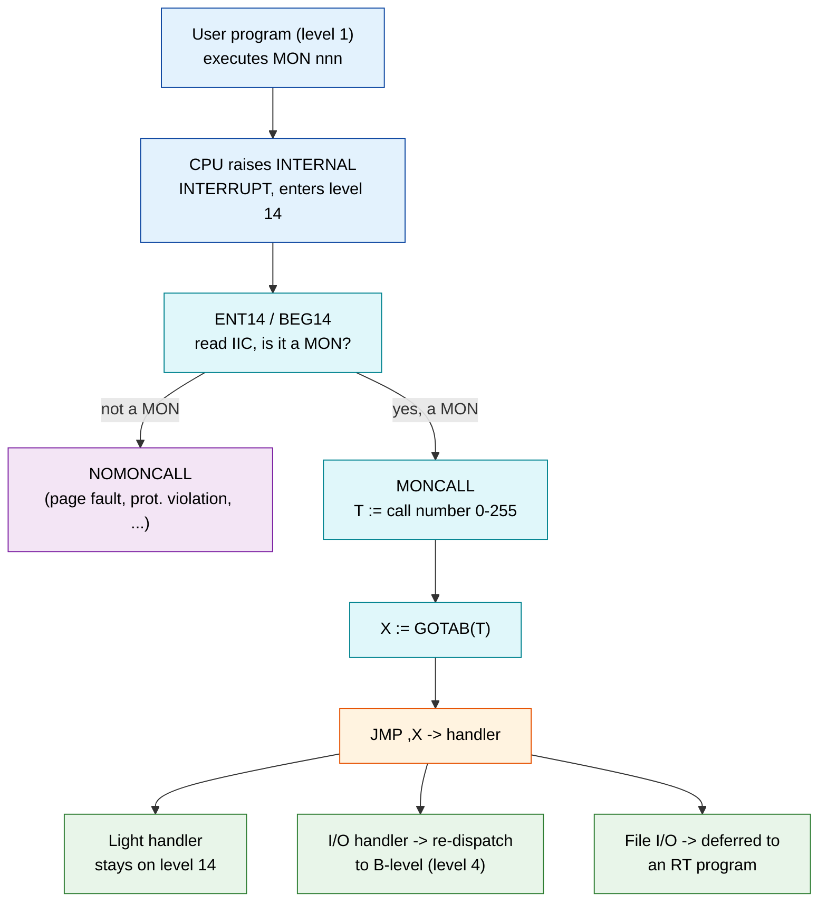
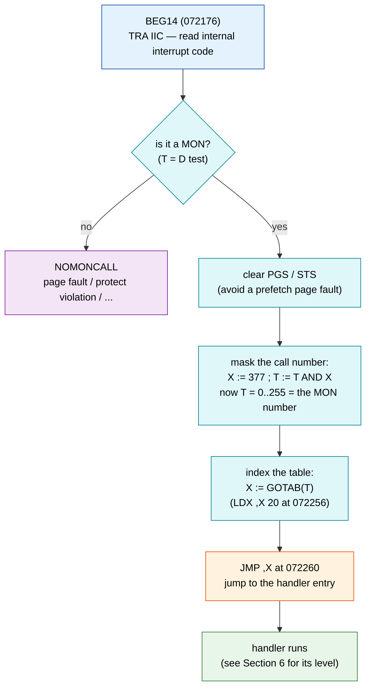
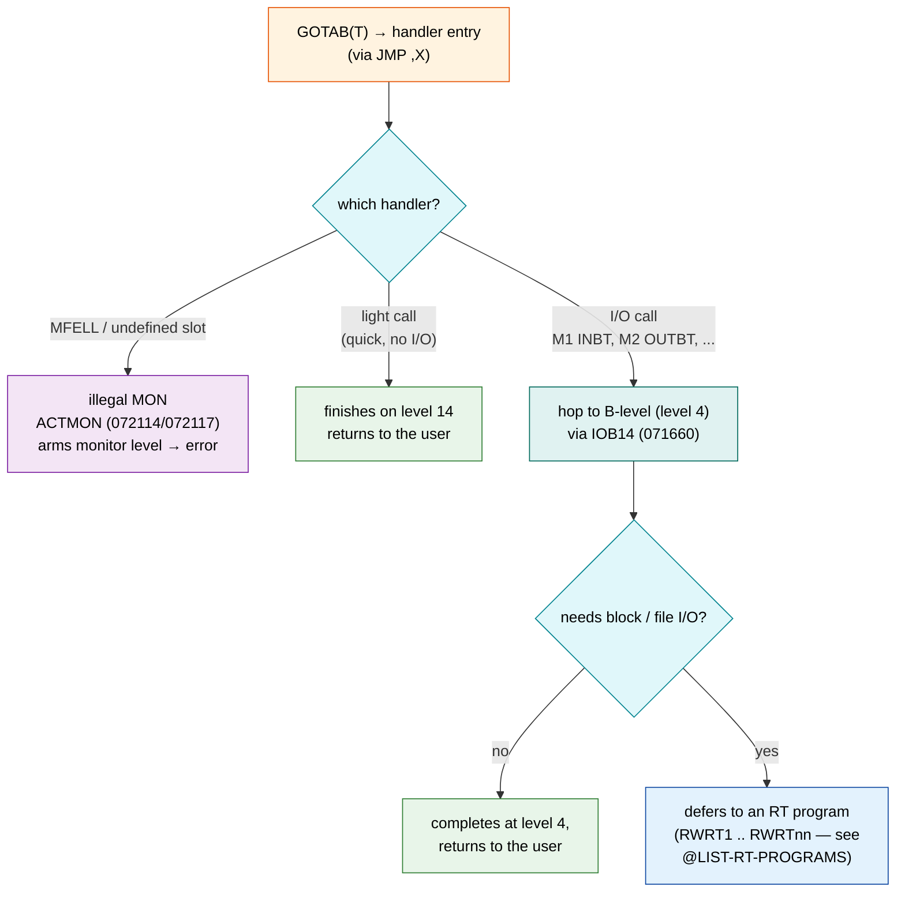
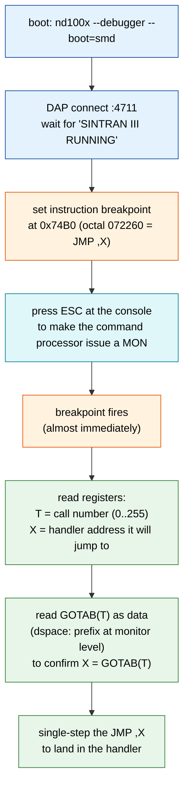

# 23 - MON Call Dispatch: A Developer's Guide

**Audience:** A developer who is new to SINTRAN III and the ND-100, who has the
`nd100x` emulator and Ghidra available, and who wants to understand - concretely
and hands-on - how a `MON` (monitor call) instruction turns into running kernel
code.

**What you will be able to do after reading this:**

1. Explain what the `MON nnn` instruction is and what the CPU does with it.
2. Read the level-14 handler and the `GOTAB` dispatch table in memory.
3. Work out *which* handler a given monitor-call number runs, and *what level*
   that handler runs at.
4. Carve, byte-swap and disassemble the SINTRAN segment that actually contains
   the dispatch code, and read the result correctly.
5. Set a live DAP breakpoint on the dispatch and watch a real `MON` go by,
   reading the call number out of the `T` register.

Every load-bearing claim below is tagged **VERIFIED** (confirmed against source
and/or a real disassembly of the carved binary) or **UNCERTAIN** (plausible but
not proven here). Addresses are given in octal (the ND-100's native base) with
hex in parentheses where a tool needs hex.

**Cross-references:**
- [13-INT14-HANDLER-DETAILED.md](13-INT14-HANDLER-DETAILED.md) - the full
  internal-interrupt (level 14) handler, all interrupt codes.
- [14-MONITOR-KERNEL-MONCALLS.md](14-MONITOR-KERNEL-MONCALLS.md) - the monitor
  kernel and the individual monitor-call handlers.
- [Segment carver README](../../tools/sintran-segment-carver/README.md) - the tool
  that produced the `.bin` files disassembled here.
- Reference: [ND-860228-2-EN SINTRAN III Monitor Calls](../../Reference-Manuals/ND-860228-2-EN%20SINTRAN%20III%20Monitor%20Calls.md)
  and [Developer/MON](../../Developer/MON/README.md) - the catalogue of every
  monitor call.

---

## 1. The big picture

When a user program wants a service from the operating system (read a byte,
write to a file, reserve a device, send a message), it does not `JMP` into the
kernel. It executes one special instruction, `MON nnn`. The CPU turns that into
an **internal interrupt** on **program level 14**, the kernel's level-14 handler
identifies it as a monitor call, pulls the call number `nnn` out, and jumps
through a 256-entry table (`GOTAB`) to the handler for that specific call.



The rest of this guide walks each box, then shows you the real machine code.

---

## 2. The `MON` instruction

**VERIFIED** (source: `../NPL-SOURCE/NPL/MP-P2-2.NPL:487`, and the reference
manual). A monitor call is the machine instruction:

```
MON nnn      octal 161000 + nnn        (nnn = 0 .. 377 octal, i.e. 0..255)
```

- The opcode field is `161000`. The low 8 bits are the **monitor-call number**.
  So `MON 1` = `161001`, `MON 2` = `161002`, `MON 377` = `161377`.
- Executing it raises an **internal interrupt**, which the ND-100 delivers on
  **program level 14** (the highest-priority internal-interrupt level; higher
  than every device level 10-13, lower than 15).

You can see SINTRAN's own recognition of the opcode in the privileged-instruction
path, where it masks the fetched instruction word and checks for `161000`:

```npl
% MP-P2-2.NPL, in the IIC06 (privileged instruction) handler:
IF 177600/\D=161000 THEN T:=177/\D; GO FAR MONCALL FI   % IF 161XXX THEN MONCALL
```
(source: `../NPL-SOURCE/NPL/MP-P2-2.NPL:487`)

Read that as: "if the top bits of the faulting instruction are `161000`, then the
low `177` bits are the call number; go dispatch it as a monitor call." Note it
masks with `177` (7 bits) there; the main path masks with `377` (8 bits, see
Section 4). Either way the call number is the low bits of the opcode.

---

## 3. Entering level 14: `ENT14` / `BEG14`

**VERIFIED** (source: `../NPL-SOURCE/NPL/MP-P2-2.NPL:366-388`):

```npl
ENT14: "B14"=:B; GO BEG14              % INITIAL ENTRY POINT
RET14:
YWAIT: T:=1000=:D; *WAIT; COPY SA DA   % IF T-REG IS UNCHANGED AFTER INTERRUPT THEN NOT MONCALL
BEG14: *TRA IIC                        % READ INTERNAL INTERRUPT CODE
       IF T=D GO NOMONCALL             % MONITOR CALL?
       *TRA PGS; TRA STS               % YES, CLEAR PGS IN CASE OF PF ON PREFETCH
MONCALL:
       ...
```

Step by step:

1. `ENT14` sets the base register `B` to the kernel base field `B14` and falls
   into `BEG14`.
2. `BEG14` reads the **IIC** (Internal Interrupt Code) register with `TRA IIC`.
   The IIC tells the CPU *why* it took the internal interrupt (monitor call, page
   fault, protect violation, ...). For a monitor call the IIC code is **1**
   (see the note on IIC numbering in Section 12).
3. The `IF T=D GO NOMONCALL` test is the fast filter: monitor calls take the
   short `MONCALL` path immediately; anything else falls through to
   `NOMONCALL`, which does the full `GOSW` (computed goto) on the IIC value.
   **UNCERTAIN:** the exact hardware reason the `T`-register-unchanged trick
   distinguishes a monitor call is a subtlety of how the ND-100 re-enters the
   waiting level-14 handler; the source comment states the behaviour ("if the
   T-register is unchanged after the interrupt then it is not a moncall") but
   this guide does not prove the microarchitectural mechanism.
4. `TRA PGS; TRA STS` clear the page-status and status registers so a page fault
   on the instruction *prefetch* cannot be mistaken for a fault on the monitor
   call itself.

### The same code, disassembled from the real binary

The block below is the actual level-14 entry from the carved L-version image
(how the file was obtained and disassembled is in Section 9). The disassembler
prints octal address, raw octal word, then the decoded mnemonic:

```
072167  044074  	LDA 74           ; ENT14: A := "B14" base constant
072170  146153  	COPY SA DB       ; B := A   ("B14"=:B)
072171  124005  	JMP 072176       ; GO BEG14
072172  050072  	LDT 72           ; (RET14/YWAIT path)
072173  146161  	COPY ST DD       ; D := T   (T:=1000=:D)
072174  151000  	WAIT             ; *WAIT
072175  146155  	COPY SA DA       ; COPY SA DA
072176  150005  	TRA IIC          ; BEG14: read internal interrupt code
072177  142016  	SKP IF DT UEQ SD ; skip if T <> D
072200  124077  	JMP 072277       ; ...else GO NOMONCALL
072201  150003  	TRA PGS          ; clear PGS (prefetch PF guard)
072202  150001  	TRA STS          ; clear STS
```
(disassembly of `116-S3SERWD.bin`, base `03000`; see Section 9)

Notice `ENT14` lands at exactly **072167**, which is what the L07 symbol table
says (`ENT14=072167` in
`../NPL-SOURCE/SYMBOLS/L07/SYMBOL-2-LIST.SYMB.TXT`). That exact match is how we
know the disassembly base is right.

---

## 4. The dispatch: `MONCALL` and `GOTAB`

**VERIFIED** (source: `../NPL-SOURCE/NPL/MP-P2-2.NPL:372-387`):

```npl
MONCALL:
       X:=377; T/\X; T=:14MONNO        % T = MONITOR CALL NUMBER (0..255)
       ...                             % (optional logging / perf sampling)
       *1BANK
       X:=GOTAB(T); *2BANK; JMP ,X     % dispatch through the jump table
```

- `X:=377; T/\X` masks `T` down to its low 8 bits, so `T` now holds the call
  number 0-255. It is saved in the global `14MONNO`.
- `X:=GOTAB(T)` looks the call number up in `GOTAB`, a 256-word array of handler
  addresses, and puts the handler's address in `X`.
- `JMP ,X` jumps to it. The `*1BANK` / `*2BANK` pair switches the memory bank
  around the table access.

### The dispatch, disassembled

```
072204  054062  	LDX 072266       ; X := [072266] = 000377  (the mask)
072205  144476  	RAND SX DT       ; T := T AND X   (mask to 8 bits)
072206  010607  	STT ,B -171      ; store T -> 14MONNO (B-relative)
                  ... (optional monitor-call logging block) ...
072253  050607  	LDT ,B -171      ; reload T := 14MONNO
072254  174000  	BSET ZRO SSPTM   ; *1BANK  (clear bank/PTM bit)
072255  146167  	COPY ST DX       ; X := T  (call number)
072256  057020  	LDX I ,X 20      ; X := GOTAB(T)  (indexed indirect load)
072257  174200  	BSET ONE SSPTM   ; *2BANK  (set bank/PTM bit)
072260  126000  	JMP ,X           ; **JMP ,X -> the handler**  <-- the dispatch
...
072266  000377  	                 ; the literal 000377 (the 8-bit mask)
```
(disassembly of `116-S3SERWD.bin`, base `03000`)

The instruction at **072260** (`JMP ,X`, hex `0x74B0`) is *the* dispatch point.
When execution reaches it, `X` already holds the handler address that was read
from `GOTAB(T)`, and `T` still holds the monitor-call number. That is the single
best place to breakpoint if you want to watch monitor calls go by (Section 10).

`LDX 072266` at 072204 is a nice example of ND-100 "data lives next to code":
the mask constant `000377` is stored as a data word at 072266, a few words past
the code that uses it, and the instruction just loads it by address.

---

### The dispatch, step by step (register view)

This is exactly what `BEG14`/`MONCALL` do, one box per machine step — follow the
`T` and `X` registers:



The one line that does the dispatch is `JMP ,X` at octal `072260` — "jump to the
address in X", where X was just loaded with `GOTAB(call number)`. Every monitor
call in the system funnels through that single instruction.

## 5. Reading `GOTAB` in memory

`GOTAB` is a plain array of 256 words. Entry *n* is the address of the handler
for `MON n`. Undefined calls point at `MFELL` (illegal monitor call) or `MONERR`
(error). Defined calls point at named handlers `M1`, `M2`, `M21`, ...

**VERIFIED** (source: `../NPL-SOURCE/NPL/MP-P2-2.NPL:184-215`):

```npl
INTEGER ARRAY GOTAB:=(MFELL,M1,M2,MFELL,MFELL,MFELL,MFELL,MFELL,   % slots 0-7
                 MFELL,MFELL,MFELL,MFELL,MFELL,MFELL,MFELL,MFELL,  % slots 10-17
                 MFELL,M21,M22,M23,M24,MFELL,MFELL,MFELL,          % slots 20-27
                 ... (mostly MFELL) ...
                 MFELL,MFELL,MFELL,M63,MFELL,MFELL,MFELL,MFELL,    % M63 at slot 63
                 ...
                 XMSGY, ...                                        % XMSG at slot 310
                 ...
                 MONERR,MONERR,MONERR,M373,MFELL,MFELL,M376,M377); % top of table
```

So `GOTAB(1)=M1` (InByte), `GOTAB(2)=M2` (OutByte), `GOTAB(0)=MFELL` (illegal),
and the vast majority of the 256 slots are `MFELL`.

### `GOTAB` in the real binary

Here is `GOTAB` disassembled from the carved image. The disassembler does not
know this region is *data*, so it decodes each address word as if it were an
instruction (`AND ,X 114`, etc.). **This is the single most important
disassembly-reading skill on the ND-100: a jump table interleaved with code
looks like nonsense instructions - you must read the raw octal words as
addresses, not the mnemonics.** The raw word (second column) is the real
content:

```
addr    word     (decoded as instruction - IGNORE)   meaning as a GOTAB entry
071233  072114   AND ,X 114                           GOTAB(0)  = MFELL  (072114)
071234  071633   AND I ,B -145                        GOTAB(1)  = M1     (071633)
071235  071635   AND I ,B -143                        GOTAB(2)  = M2     (071635)
071236  072114   AND ,X 114                           GOTAB(3)  = MFELL
071237  072114   ...                                  GOTAB(4)  = MFELL
 ...    072114                                         (slots 5-17 = MFELL)
071254  071637   AND I ,B -141                        GOTAB(20B)= M21    (071637)
071255  071641   AND I ,B -137                        GOTAB(21B)= M22    (071641)
071256  071643   AND I ,B -135                        GOTAB(22B)= M23    (071643)
071257  071645   AND I ,B -133                        GOTAB(23B)= M24    (071645)
071260  072114   AND ,X 114                           GOTAB(24B)= MFELL
```
(disassembly of `116-S3SERWD.bin`, base `03000`)

Read the **word** column: `072114` everywhere is `MFELL`; `071633` is `M1`;
`071635` is `M2`; `071637..071645` are `M21..M24`. That is exactly the source
array above.

### How to prove where `GOTAB` starts (a worked example)

`GOTAB` is 256 words = `0400` octal. The first *defined* handler right after the
table is `M1`. From the table, `GOTAB(1) = M1 = 071633`. And `GOTAB` itself
starts at `071233`. Check: `071233 + 0400 = 071633 = M1`. The table is exactly
`0400` (256) words long and `M1` sits immediately after it. That is an
independent confirmation that `GOTAB` begins at **071233** - we did not have to
trust any single symbol; the table's own arithmetic proves it.

The named-handler addresses are 2 apart (`M1=071633, M2=071635, M21=071637,
M22=071641, ...`) because each of those handlers is exactly two words long (see
next section) - another sanity check that the disassembly is aligned.

---

## 6. What level does a handler run at? (14 vs 4 vs RT program)

Not every monitor call finishes on level 14. Light calls finish there; I/O calls
hand off to **B-level (level 4)**; file I/O defers further to **RT programs**.
You can tell which, by reading where the handler's code sits and what it does.



### 6.1 The I/O handlers (`M1`, `M2`, ...) - they hop to level 4

**VERIFIED** (source: `../NPL-SOURCE/NPL/MP-P2-2.NPL:231-245`):

```npl
M1:    "INBT";   GO IOB14        % MON 1  = InByte
M2:    "OUTBT";  GO IOB14        % MON 2  = OutByte
M21:   "M8INB";  GO IOB14
...
IOB14: *IRW BLEVB DP             % SET MONCALL ROUTINE ADDR ON B-LEVEL
       A:=1; *IRW BLEVB          % SET BIT #0 IN STATUS REG ON B-LEVEL
       BLEV; *MST PID            % start B-level (level 4)
       GO RET14
```

Each of these handlers is just "load a routine selector, then `GO IOB14`", and
`IOB14` writes the routine address into **B-level's** register bank (`BLEVB`) and
starts level 4 (`BLEV; *MST PID`). So `MON 1`/`MON 2` do almost nothing on level
14 - they arm level 4 and return. The real InByte/OutByte work runs on level 4.

Disassembled, each handler is two words - a `LDA` of a constant followed by a
`JMP` to `IOB14` (which is why the `GOTAB` entries were 2 apart):

```
071633  044033  	LDA 071666       ; M1: A := "INBT" selector constant
071634  124024  	JMP 071660       ; GO IOB14
071635  044032  	LDA 071667       ; M2: A := "OUTBT" selector constant
071636  124022  	JMP 071660       ; GO IOB14
 ...
071660  153442  	IRW 40 DP        ; IOB14: write routine addr to BLEVB (P)
071661  170401  	SAA 1            ; A := 1
071662  153440  	IRW 40 DS        ; write status bit on B-level
071663  170420  	SAA 20
071664  150306  	MST PID          ; BLEV; *MST PID  -> start level 4
071665  125014  	JMP 071701       ; GO RET14
```
(disassembly of `116-S3SERWD.bin`, base `03000`; `IOB14 = 071660`)

**VERIFIED** that these level-4 handlers live in a different source file and a
different segment: `../NPL-SOURCE/NPL/RP-P2-MONCALLS.NPL` contains the B-level
INBT/OUTBT code (e.g. `IOTR: ... IRW BLEVB DB; "BIOTR"; *IRW BLEVB DP; BLEV`,
source `RP-P2-MONCALLS.NPL:3426-3428`). That file is loaded in **RPIT (PIT 10)**.
The L-version release manual's system-layout table labels the RPIT window
literally "Monitor calls / B-level (level 4)"
(source: `../Release-Documentation/ND-860230-6-EN Sintran III - Release Information - L-Version.md:2428`).

### 6.2 The monitor-level handlers - `MFELL` / `ACTMON`

Calls that must run on the **monitor level** funnel through `MFELL`/`ACTMON`,
which arm the monitor level (`MLEVB`) instead of level 4:

**VERIFIED** (source: `../NPL-SOURCE/NPL/MP-P2-2.NPL:342-346`):

```npl
MFELL: T=:A; *IRW MLEVB DX           % X-reg on monitor level = mon.call number
       "CALLPROC"
ACTMON: *IRW MLEVB DP                % set handler addr on monitor level
       MLEV; *MST PID; MST PIE       % start monitor level
       GO RET14
```

Disassembled (`MFELL = 072114`, `ACTMON = 072117`):

```
072114  146165  	COPY ST DA       ; MFELL: A := T (illegal-call: call number)
072115  153427  	IRW 20 DX        ; *IRW MLEVB DX
072116  044043  	LDA ...          ; "CALLPROC"
072117  153422  	IRW 20 DP        ; ACTMON: *IRW MLEVB DP
072120  170404  	SAA 4
072121  150306  	MST PID          ; MLEV; *MST PID
072122  150307  	MST PIE          ; *MST PIE  -> start monitor level
072123  125014  	JMP 072137       ; GO RET14
```
(disassembly of `116-S3SERWD.bin`, base `03000`)

**Rule of thumb (VERIFIED by the code above):**
- Handler ends in `... GO IOB14` -> the real work is on **B-level (level 4)**,
  code in `RP-P2-MONCALLS.NPL` / RPIT (PIT 10).
- Handler ends in `... GO ACTMON` (via `MFELL`) -> the real work is on the
  **monitor level**.
- Handler does its work inline and `GO RET14` -> it finished on **level 14**.
- File-I/O style calls are handed further to **RT programs** (`RWRT1..RWRTnn`,
  the file-system RT programs). **UNCERTAIN:** the exact RT-program handoff is
  described in [14-MONITOR-KERNEL-MONCALLS.md](14-MONITOR-KERNEL-MONCALLS.md) and
  the `@LIST-RT-PROGRAMS` operator command; it is not disassembled in this guide.

---

## 7. Finding out which monitor calls exist and what they do

Three complementary sources, from most authoritative to most convenient:

1. **The reference manual**
   [ND-860228-2-EN SINTRAN III Monitor Calls](../../Reference-Manuals/ND-860228-2-EN%20SINTRAN%20III%20Monitor%20Calls.md).
   Every call is listed by octal number, by symbolic name (e.g. `INBT`, `OUTBT`),
   with parameters in/out. For example (source lines around `918` and `1007` of
   that manual): `MON 1` = InByte from a file/device (`INBT`), `MON 2` = OutByte
   (`OUTBT`), `MON 62B` = GetBytesInFile, `MON 63B` = In4x2Bytes (`B4INW`).
2. **The `Developer/MON` catalogue** ([Developer/MON](../../Developer/MON/README.md)),
   a per-call machine-readable index generated from the manual.
3. **`GOTAB` itself** (Section 5) - the ground truth of which numbers are wired to
   a real handler in *this* build. If `GOTAB(n) = MFELL`, then `MON n` is illegal
   in this system, no matter what the manual says a call *could* be.

**The number -> name -> slot correspondence.** The monitor-call *number* `n` (from
the `MON` opcode) is the same `n` used to index `GOTAB`. The manual gives the
name for `n` (`MON 1` = `INBT`). The `GOTAB(n)` entry gives the handler label
(`M1`), and the handler label tells you where it runs (Section 6). So:

| MON number | Name (manual) | GOTAB slot -> handler | Runs on |
|---|---|---|---|
| `1` (`MON 1`) | InByte / `INBT` | `GOTAB(1) = M1 = 071633` | Level 4 (via `IOB14`) |
| `2` (`MON 2`) | OutByte / `OUTBT` | `GOTAB(2) = M2 = 071635` | Level 4 (via `IOB14`) |
| `21B..24B` | 8-bit byte I/O (`M8INB` etc.) | `GOTAB(21B..24B) = M21..M24` | Level 4 |
| `63B` | In4x2Bytes / `B4INW` | `GOTAB(63B) = M63` | Level 4 (via `IOB14`) |
| `310B` | XMSG entry (`XMSGY`) | `GOTAB(310B) = XMSGY` | XMSG / monitor path |
| `0`, most others | (illegal / undefined) | `GOTAB(n) = MFELL` | Level 14 -> abort |

(All GOTAB values VERIFIED from `MP-P2-2.NPL:184-215` and the disassembly in
Section 5. Names VERIFIED from the reference manual lines cited above.)

**ND-500 extended calls.** Some high-numbered calls route to the ND-500 monitor
segment rather than an ND-100 handler: `MON 300B` (EUSEL), `347B` (NUCL), `350B`
(RWSEG), `440B` (AttachSegment), `515B` (SMTRANS). **UNCERTAIN in this guide:**
those numbers exceed 255, so they cannot be plain `GOTAB` indices - they are
handled by the ND-500 command path; see the ND-500 documentation. This guide does
not disassemble that path.

---

## 8. Where the dispatch code lives (and a correction to older notes)

The level-14 handler + `GOTAB` come from the source file
`../NPL-SOURCE/NPL/MP-P2-2.NPL` (labels `ENT14`, `BEG14`, `MONCALL`, `GOTAB`,
`MFELL`, `M1`, ...). At run time this code is part of SINTRAN's **resident
monitor**, linked at fixed virtual addresses around `071xxx-072xxx`.

**IMPORTANT correction (VERIFIED by inspection of the carve set).** Earlier
working notes assumed the dispatch would be in carved files named
`035-S3MPIT.bin`, `047-S3RPIT.bin`, or `002-S3IMAGE.bin`. **Those files do not
exist** in the carve set at
`../../tools/sintran-segment-carver/versions/L-VSX-500/segments/`. In
`manifest.json` those three segments have `"file": null` (segment 0035 `S3MPIT`,
segment 0047 `S3RPIT`, segment 0002 `S3IMAGE` were not emitted as `.bin`s). The
MPIT/RPIT image files that *were* carved (`017-S3SMPIT.bin`, `026-S3IMPIT.bin`,
`016-S3SRPIT.bin`, `025-S3IRPIT.bin`) are **zero-filled** at the `ENT14` address -
they do not contain the dispatch code.

**Where the dispatch actually is (VERIFIED).** A copy of the resident monitor -
including `GOTAB`, `ENT14`, `BEG14`, `MONCALL`, `MFELL` and the `M1..M24`
handlers - is embedded in **`116-S3SERWD.bin`**. That is the file every
disassembly snippet in this guide is taken from. It was found not by guessing a
name but by scanning every carved segment for the `GOTAB` signature (a long run
of one repeated address value - the `MFELL` address - interspersed with the
handler addresses). Here is the exact, reproducible search:

```bash
cd tools/sintran-segment-carver/versions/L-VSX-500/segments/
python3 - <<'PY'
import struct, glob
# GOTAB signature: MFELL(072114), then M1(071633), M2(071635)
sig = (0o72114, 0o71633, 0o71635)
for f in sorted(glob.glob('*.bin')):
    d = open(f, 'rb').read(); n = len(d)//2
    w = struct.unpack('>%dH' % n, d[:n*2])          # big-endian words
    for i in range(n-3):
        if (w[i], w[i+1], w[i+2]) == sig:
            base = 0o71233 - i                       # GOTAB virtual - file word
            print(f, 'GOTAB at file word', i, 'disasm base = %06o' % base)
            break
PY
# -> 116-S3SERWD.bin  GOTAB at file word 27803  disasm base = 003000
```

The lesson: **verify which segment holds the code by content, not by name**;
resident monitor code is replicated across several segment images, and the
"obvious" MPIT/RPIT/IMAGE names were not the copy that got carved here.

**UNCERTAIN:** why the resident monitor block sits at file offset `03000`
(1536 words) inside `116-S3SERWD.bin` rather than at offset 0 - the file appears
to carry a preamble before the resident image begins. What is proven is that
disassembling with base `03000` makes `ENT14` land exactly on its symbol-table
address `072167`, so the base is correct for this region.

---

## 9. Carving and disassembling: the exact recipe

The carved `.bin` files are **big-endian** (native ND-100 byte order). The
`nd100-dis` raw disassembler expects **little-endian**, so you byte-swap first,
then disassemble with the correct base address.

```bash
# 1. Byte-swap big-endian .bin -> little-endian, for the disassembler
IN=tools/sintran-segment-carver/versions/L-VSX-500/segments/116-S3SERWD.bin
OUT=/tmp/serwd.le
python3 -c "d=open('$IN','rb').read(); o=bytearray(len(d)); \
o[0::2]=d[1::2]; o[1::2]=d[0::2]; open('$OUT','wb').write(o)"

# 2. Disassemble with the correct base (octal 03000 for the resident block)
~/repos/nd100-tools/nd100-dis/nd100-dis -a -o -b 03000 $OUT > /tmp/serwd.dis

# 3. Look at the dispatch region
awk '$1>="072167" && $1<="072260"' /tmp/serwd.dis   # ENT14 .. JMP ,X
awk '$1>="071233" && $1<="071263"' /tmp/serwd.dis   # GOTAB start
```

`nd100-dis` flags used: `-a` show address + raw word, `-o` octal, `-b <addr>` set
the base address (octal). For a **different** segment, get its load address from
`manifest.json` (`load_address_oct`) and use that as `-b`; but remember that the
*resident* block replicated inside another segment may be linked at its own fixed
addresses (as here), in which case pick the base that makes a known symbol land
on its symbol-table address.

**Symbols to annotate with.** `../NPL-SOURCE/SYMBOLS/L07/SYMBOL-1-LIST.SYMB.TXT`
and `SYMBOL-2-LIST.SYMB.TXT` map names to octal addresses, one `NAME=octaladdr`
per line (e.g. `ENT14=072167`). Symbol names are truncated to 5 characters
(`14MONNO` appears as `14MON=004664`; `MONCALL`, `BEG14`, `GOTAB`, `MFELL` are
local labels and are *not* in the exported tables - that is why we located them
by disassembly and arithmetic instead).

---

## 10. Reading ND-100 disassembly correctly

A few facts that trip up every newcomer:

1. **The ND-100 is word-addressed and big-endian.** One 16-bit word per address;
   one instruction per word. A hex memory dump shows big-endian pairs (`49 00` =
   word `0x4900` = octal `044400`) - convert before decoding.
2. **One instruction per word means disassembly cannot be *misaligned*** the way
   x86 can. But it also means **data words interleaved with code disassemble as
   bogus instructions.** `GOTAB` (Section 5) is the classic case: 256 address
   words that decode as `AND ,X ...` nonsense. Always ask "is this region code or
   data?" and for a jump table, read the raw octal words as addresses.
3. **`JPL I *+n` / `LDX I ,X n` indirect calls resolve through a literal.** ND-100
   code keeps literal pools and pointer words next to the code. An indirect call
   or load reads the *word at `P+n`* to get the real target address. To resolve
   it, read that word. Worked example from Section 4:

   ```
   072204  054062  LDX 072266     ; load X from address 072266...
   072266  000377                 ; ...which holds the literal 000377 (the mask)
   ```
   The instruction's job is only reachable once you read the literal it points
   at. The same pattern resolves `GOTAB` access: `LDX I ,X 20` at 072256 reads a
   `GOTAB` entry (a handler address) into `X`, and the following `JMP ,X` jumps to
   that address.
4. **Registers.** `A D T X` are the general registers; `B` is the base/stack
   register; `L` the link (return address). NPL `A:=x`, `T/\X`, `X:=GOTAB(T)` map
   to `LDA`, register-AND, indexed load. Skip instructions (`SKP IF DT UEQ SD`)
   skip the next word when the condition holds - `UEQ` means UN-equal.

---

## 11. Watching a `MON` live with a DAP breakpoint

The whole live workflow at a glance — boot, break on the one dispatch
instruction, and read the call number out of `T`:




Now the fun part: catch a real monitor call as it dispatches, and read the call
number out of `T`. This uses the `nd100x` emulator's built-in DAP server and the
DAP MCP tools (full reference: the local `nd100-debug` skill at
`~/.claude/skills/nd100-debug/SKILL.md`).

> **Port-sharing caution.** The emulator's DAP server listens on **port 4711**.
> If another debug session is already using it, do **not** start a second
> emulator on the same port - just read this section as a procedure. When you do
> run it, shut down cleanly at the end (`debug_disconnect(terminate=true)` then
> `pkill nd100x`) and do not run two sessions concurrently.

### 11.1 Boot SINTRAN under the debugger

```bash
cd ~/repos/nd100x
./build/bin/nd100x --debugger --boot=smd     # uses SMD0.IMG in the cwd
```

Then from the MCP side:

```
debug_connect(port=4711)
debug_console_enable(terminal=192)
debug_launch(program=".../SMD0.IMG", stop_on_entry=false)
# wait ~30 s for the banner "SINTRAN III - VSX/500 L" and "SINTRAN III RUNNING"
```

The trailing letter of the banner (`L`) tells you which symbol table matches
(`L` -> `L07`), which is the version whose addresses this guide uses.

### 11.2 Convert the octal address to hex

DAP wants **hex**; SINTRAN symbols are **octal**. The dispatch is the `JMP ,X` at
`072260`:

| Symbol | Octal | Hex (for DAP) |
|---|---|---|
| `ENT14` | `072167` | `0x7477` |
| `BEG14` | `072176` | `0x747E` |
| **`MONCALL` dispatch `JMP ,X`** | **`072260`** | **`0x74B0`** |
| `GOTAB` | `071233` | `0x729B` |
| `MFELL` | `072114` | `0x744C` |
| `M1` | `071633` | `0x739B` |
| `IOB14` | `071660` | `0x73B0` |

### 11.3 Break on the dispatch and read the call number

```
# Break exactly on the JMP ,X that dispatches every monitor call:
debug_set_instruction_breakpoints(addresses=["0x74B0"])
debug_continue()
```

Provoke a monitor call from the console - the cheapest way is to press **ESC**
(hex `1B`), which wakes the SINTRAN command processor and makes it do terminal
I/O (each `INBT`/`OUTBT` is a `MON`):

```
debug_console_write(input="hex:1B")
# the breakpoint at 0x74B0 fires almost immediately
```

At the stop, read the registers. **`T` holds the monitor-call number** and `X`
holds the handler address about to be jumped to:

```
debug_variables(scope="Registers")     # look at T (call number) and X (handler)
debug_evaluate(expression="T")         # e.g. T = 2 -> MON 2 (OutByte)
debug_evaluate(expression="X")         # e.g. X = 071635 -> M2 handler
```

Cross-check: `X` should equal `GOTAB(T)`. You can read the table entry directly.
`GOTAB = 071233` (`0x729B`); entry `T` is at `071233 + T` words = byte address
`(0x729B + T) * 2`. For `T = 2`: word `071235`, byte `0x7477` `*` ... simplest is
to read a block of the table and index it:

```
# Read GOTAB as data. The resident monitor is at monitor level; if a plain
# read returns code instead of the table, use the dspace: prefix (see note).
debug_read_memory(address="0x729B", count=32)   # first 16 GOTAB words (32 bytes)
```

The returned words (big-endian pairs) should read `072114 071633 071635 072114
...` - `MFELL, M1, M2, MFELL, ...` - exactly the table from Section 5. Word index
`T` is the handler that `JMP ,X` will take.

**Memory-access note (VERIFIED behaviour, from the nd100-debug skill).**
- The resident monitor code around `071xxx-072xxx` is (for SINTRAN's low
  resident) **identity-mapped**: virtual == physical. Confirm by reading the same
  address with the `phys:` prefix and checking the bytes match.
- `debug_read_memory` with a plain address follows the **instruction** page
  table. At monitor level, kernel **data** uses a different table (APT). If a read
  that should be data comes back looking like plausible instructions, re-read it
  with the `dspace:` prefix: `debug_read_memory(address="dspace:0x729B")`.
- Paged monitor-segment windows (e.g. `037xxx`) show *whatever segment is mapped
  right now*; never trust a cold read there. `GOTAB` at `071233` is in the
  resident region, so a direct read is fine - but if you chase a handler that
  lives in a paged segment, set an instruction breakpoint on it and read at the
  stop, when the OS has the right segment mapped.

### 11.4 Follow the dispatch

Single-step once from the `JMP ,X`:

```
debug_step_in(granularity="instruction")
debug_variables(scope="Registers")    # P (=PC) is now inside the handler = old X
```

`P` now equals the handler address you saw in `X`. If it is `071633` (`M1`) or
`071635` (`M2`), a couple more steps will show the `LDA const; JMP 071660`
(to `IOB14`) from Section 6, and `IOB14` starting level 4. You have now watched a
monitor call go from opcode to handler, live.

### 11.5 Clean up

```
debug_disconnect(terminate=true)
# then, if the process lingers:  pkill nd100x
```

Note (from the nd100-debug skill): instruction breakpoints on this emulator can
be hard to clear mid-session, and `debug_disconnect` terminates the emulator - so
capture everything you need at the stop before disconnecting, and restart for a
clean slate.

---

## 12. A note on the IIC number for a monitor call

[13-INT14-HANDLER-DETAILED.md](13-INT14-HANDLER-DETAILED.md) is a good companion
reference, but be aware of an apparent inconsistency in how it labels the
internal-interrupt code (IIC) for a monitor call, and here is the resolution
(so you do not repeat the confusion):

- That document's IIC table lists **IIC = 1 -> Monitor Call**, and its `NOMONCALL`
  dispatcher lists `IIC01: CALL ERRFATAL  % MONITOR CALLS SHOULD BE HANDLED
  BEFORE THIS POINT`. Both say the dedicated monitor-call internal-interrupt code
  is **1**. That is consistent: `BEG14` catches `IIC = 1` on the fast path
  *before* the `GOSW`, so reaching the `IIC01` slot would be a bug.
- The same document also discusses **IIC = 6 (privileged instruction)** and shows
  that path *also* recognising `161xxx` and rerouting to `MONCALL`
  (`IF 177600/\D=161000 THEN ... GO FAR MONCALL`, source
  `../NPL-SOURCE/NPL/MP-P2-2.NPL:487`). That is **not** a second IIC value for
  monitor calls - it is a *fallback*: if a `MON` opcode arrives as a
  privileged-instruction trap (IIC 6) rather than the dedicated monitor-call
  interrupt (IIC 1), the handler still decodes it and dispatches it as a monitor
  call.

**VERIFIED:** the monitor-call code is IIC **1**; the IIC **6** path is the
privileged-instruction handler with a `161xxx` fallback into `MONCALL`.
**UNCERTAIN:** exactly which hardware configurations deliver a `MON` as IIC 1
versus as IIC 6 is not established here. Do not read the doc-13 mention of IIC 6
as "monitor calls are IIC 6"; they are IIC 1 with a 6 fallback.

---

## 13. Summary: what is proven vs. what is not

**VERIFIED (source + real disassembly of `116-S3SERWD.bin`):**
- `MON nnn` = octal `161000 + nnn`; raises an internal interrupt to level 14.
- Level-14 entry `ENT14 = 072167` (matches the L07 symbol table exactly),
  `BEG14 = 072176`, reads IIC, filters monitor calls to the `MONCALL` path.
- `MONCALL` masks the call number to 8 bits (mask literal `000377` at `072266`),
  stores `14MONNO`, loads `GOTAB(T)` and dispatches with `JMP ,X` at **`072260`**.
- `GOTAB = 071233`, 256 words; `GOTAB(0) = MFELL = 072114`, `GOTAB(1) = M1 =
  071633`, `GOTAB(2) = M2 = 071635`, `GOTAB(21B..24B) = M21..M24`; most slots
  `MFELL`. Table length proven by `071233 + 0400 = 071633 = M1`.
- Handler levels: `M1/M2/...` -> `IOB14 = 071660` -> **B-level (level 4)**, whose
  code is in `RP-P2-MONCALLS.NPL` / RPIT (PIT 10, labelled "Monitor calls,
  B-level (level 4)" in the L-version release manual). `MFELL/ACTMON = 072114/
  072117` -> **monitor level**.
- The dispatch code is in `116-S3SERWD.bin` (found by content signature), **not**
  in `035-S3MPIT.bin` / `047-S3RPIT.bin` / `002-S3IMAGE.bin` (which were not
  carved).
- The monitor-call IIC is **1**; IIC **6** is the privileged-instruction fallback.

**UNCERTAIN (stated but not proven here):**
- The microarchitectural reason the `T = D` (T-unchanged) test distinguishes a
  monitor call.
- Why the resident monitor block sits at file offset `03000` inside
  `116-S3SERWD.bin`.
- The exact RT-program handoff (`RWRT1..RWRTnn`) for file-I/O calls.
- The ND-500 extended-call routing (`MON 300B/347B/350B/440B/515B`), which is not
  a plain `GOTAB` index (those numbers exceed 255).

---

*Guide addresses and disassembly are for SINTRAN III VSX/500 L-version (symbol
set L07). Other versions relocate these labels; re-derive addresses from that
version's `SYMBOL-*-LIST.SYMB.TXT` and re-run the `GOTAB` signature scan.*
</content>
</invoke>
