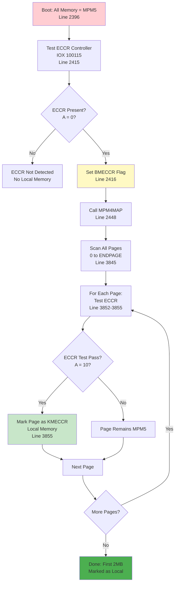

# How to Make SINTRAN Detect First 2MB as Local Memory

**Complete Guide for Emulator Implementation**

**Version:** 1.0  
**Date:** 2025-01-XX  
**Status:** Complete  
**Source:** Analysis of SINTRAN III NPL source code (`PH-P2-OPPSTART.NPL`)

---

## Table of Contents

1. [Overview](#1-overview)
2. [Detection Sequence](#2-detection-sequence)
3. [What You Need to Implement](#3-what-you-need-to-implement)
4. [Step-by-Step Implementation](#4-step-by-step-implementation)
5. [Verification](#5-verification)

---

## 1. Overview

**Question:** What do I need to do to make SINTRAN detect the first 2MB as local memory?

**Answer:** You need to implement two hardware responses:
1. **IOX 100115** must return `A=0` (ECCR controller present)
2. **TRR ECCR** must respond to test pattern and return `A=10` for pages in the first 2MB

**Memory Size Calculation:**
- **2MB = 2,097,152 bytes**
- **ND-100 page size = 1KW = 1024 words = 2,048 bytes (2KB)**
- **2MB ÷ 2KB = 1,024 pages = 2000₈ pages**
- **First 2MB = pages 0 to 2000₈ (0 to 1024 decimal)**

---

## 2. Detection Sequence

### 2.1 Boot Sequence Overview



### 2.2 Critical Code Sections

**Stage 1: Controller Detection (Line 2415-2416)**

```npl
% From PH-P2-OPPSTART.NPL:2415-2416
A:=4; T:=100115; *IOXT; TRA IIC
IF A=0 THEN MEMTYPE BONE BMECCR=:MEMTYPE FI
```

**What happens:**
- **IOX 100115** instruction executed
- **If A=0:** ECCR controller detected → Sets `BMECCR` flag
- **If A≠0:** I/O error → No ECCR, no local memory detection

**Stage 2: Page-Level Detection (Line 2448)**

```npl
% From PH-P2-OPPSTART.NPL:2448
IF MEMTYPE BIT BMPM4 OR A BIT BMECCR THEN CALL MPM4MAP FI
```

**What happens:**
- **If BMECCR flag is set:** Calls `MPM4MAP` routine
- **MPM4MAP scans all pages** from 0 to ENDPAGE

**Stage 3: Page Test (Lines 3852-3855)**

```npl
% From PH-P2-OPPSTART.NPL:3852-3855
IF ROUTSWITCH=0 THEN                   % MPM4 / Local memory test
    A:=11; *TRR ECCR                   % Write 11₈ to ECCR register
    0=:X.S0; A:=4; *TRR ECCR; TRR 10   % Write 4₈, then read register 10
    X.S0; *TRA IIC                      % Restore X.S0
    IF A=10 THEN                        % Check if read back = 10₈
        T:=KMECCR; A:=CURRPAGE; CALL SMEMTYPE FI  % Mark page as local memory
```

**What "Write" Means:**

**`*TRR ECCR`** = **Transfer Register ECCR** instruction
- **Writes** the value in the **A register** (accumulator) to the **ECCR register**
- **ECCR register** = Hardware register on the ND-120 CPU card (CPU-internal)
- **Not an IOX device** - It's accessed via `TRR` instruction, not `IOX`

**What is TRR 10?**

**`TRR 10`** where `10` is **OCTAL** (`10₈` = 8 decimal) = **`TRR CCL`** = **Cache Clear**
- **CCL** (`0010` octal) = Cache clear register
- **Purpose:** Clear cache (ensures fresh memory read)
- **Side Effect:** After cache clear, **ECCR hardware puts test result in A register**

**What happens:**
- **For each page** (0 to ENDPAGE):
  1. **`A:=11; *TRR ECCR`** → **Writes 11₈ to ECCR register** (first test pattern)
  2. **`A:=4; *TRR ECCR`** → **Writes 4₈ to ECCR register** (second test pattern, triggers test)
  3. **`TRR 10`** → **Cache clear** (`TRR CCL`) → **ECCR hardware puts result in A register**
  4. **If A=10₈ (8 decimal):** Page has ECCR capability → Mark as `KMECCR` (local memory)
  5. **If A≠10₈:** Page does NOT have ECCR → Remains MPM5

**Where is it writing to?**

- **ECCR register** = Hardware register on **ND-120 CPU card**
- **Location:** CPU-internal (not an external I/O device)
- **Access:** Via `TRR` (Transfer Register) instruction
- **TRR 10** = Cache clear (CCL register), not reading register 10

---

## 3. What You Need to Implement

### 3.1 IOX 100115 Handler

**Purpose:** Detect ECCR controller presence

**Required Behavior:**
- **IOX instruction** to device address `100115₈`
- **Must return A=0** (no error) to indicate ECCR controller exists
- **If A≠0:** SINTRAN assumes no ECCR, skips local memory detection

**Implementation:**

```python
def handle_iox_100115(self, accumulator_value):
    """
    Handle IOX 100115 instruction (ECCR controller detection).
    
    Args:
        accumulator_value: Value in accumulator (should be 4)
    
    Returns:
        A register value:
        - 0 = ECCR controller present (success)
        - Non-zero = I/O error (ECCR not present)
    """
    # For emulator: Always return 0 to indicate ECCR exists
    return 0
```

**Or in C#:**

```csharp
public ushort HandleIOX_100115(ushort accumulatorValue)
{
    // ECCR controller is present
    // Return 0 to indicate success (no I/O error)
    return 0;
}
```

### 3.2 TRR ECCR Handler

**Purpose:** Test individual pages for ECCR capability

**What is TRR ECCR?**

**TRR** = **Transfer to/from Register** - A CPU instruction (NOT an IOX instruction)

**ECCR** = **Error Checking and Correction Register** - A CPU-internal hardware register on the ND-120 CPU card

**Where does it write to?**

**`TRR ECCR` writes to the ECCR register**, which is:
- **Located:** On the ND-120 CPU card (CPU-internal register)
- **Not an IOX device:** It's accessed via `TRR` instruction, not `IOX`
- **Purpose:** Controls error checking and correction for memory pages

**What is TRR 10?**

**`TRR 10`** where `10` is **octal** (`10₈` = 8 decimal) = **`TRR CCL`** = **Cache Clear**

From CPU documentation:
- **`CCL` (`0010` octal)**: Cache clear register
- **`TRR 10`** = Clear cache (NOP in emulator, but triggers ECCR test result)

**Required Behavior:**
- **TRR ECCR** instruction (Transfer to/from Register ECCR)
- **Must respond to test pattern** for pages in first 2MB
- **Test pattern:** Write `11₈` to ECCR register → Write `4₈` to ECCR register → `TRR 10` (cache clear) → ECCR puts result `10₈` in A register

**Understanding the Code:**

```npl
% From PH-P2-OPPSTART.NPL:3852-3855
A:=11; *TRR ECCR                   % Write 11₈ to ECCR register
0=:X.S0; A:=4; *TRR ECCR; TRR 10   % Write 4₈ to ECCR, then cache clear
X.S0; *TRA IIC                      % Restore X.S0, then read IIC register
IF A=10 THEN                        % Check if IIC = 10₈ (memory parity error)
    T:=KMECCR; A:=CURRPAGE; CALL SMEMTYPE FI
```

**ECCR Register Bit Definitions:**

From ND-06.026.1 EN (Page 128) and emulator implementation:

| Bit | Name | Meaning |
|-----|------|---------|
| 0 | **0TS** | Simulate memory error in bit 0 |
| 1 | **15T** | Simulate memory error in bit 15 |
| 2 | **ANY** | Enable parity interrupt on all errors |
| 3 | **DIS** | Disable ECC System and parity interrupt |
| 4 | **6TS** | Simulate memory error in bit 6 |

**What Each Line Does:**

1. **`A:=11; *TRR ECCR`**
   - **A register** = 11₈ (9 decimal) = `1001` binary
   - **Bits set:** Bit 0 (0TS) and Bit 3 (DIS)
   - **`*TRR ECCR`** = Transfer Register instruction → **Writes A register value (11₈) to ECCR register**
   - **Where:** Writes to **ECCR register** on ND-120 CPU card (accessed via IOXT to address 100115₈)
   - **Effect:** 
     - **Bit 0 (0TS):** Simulate memory error in bit 0
     - **Bit 3 (DIS):** Disable ECC System and parity interrupt
   - **Purpose:** First test pattern (setup - disable ECC, simulate error)

2. **`A:=4; *TRR ECCR`**
   - **A register** = 4₈ (4 decimal) = `100` binary
   - **Bits set:** Bit 2 (ANY)
   - **`*TRR ECCR`** = Transfer Register instruction → **Writes A register value (4₈) to ECCR register**
   - **Where:** Writes to **ECCR register** on ND-120 CPU card
   - **Effect:**
     - **Bit 2 (ANY):** Enable parity interrupt on all errors
   - **Purpose:** Second test pattern (enable parity interrupt - triggers ECCR test)

3. **`TRR 10`**
   - **`TRR 10`** where `10` is **octal** (`10₈` = 8 decimal) = **`TRR CCL`** = **Cache Clear**
   - **Purpose:** Clear cache (ensures fresh memory read)
   - **Side Effect:** After cache clear, ECCR hardware processes the test pattern:
     - If page has ECCR capability, ECCR hardware will detect the simulated error (bit 0) and set IIC register
     - If page does NOT have ECCR capability, no error is detected, IIC remains unchanged

4. **`X.S0; *TRA IIC`**
   - **`TRA IIC`** = **Transfer to Internal Interrupt Control register**
   - **Purpose:** **Reads IIC register into A register**
   - **IIC register** = Internal Interrupt Control register (CPU-internal)
   - **Result:** A register = IIC register value

5. **`IF A=10 THEN ...`**
   - **Checks if IIC register = 10₈** (8 decimal)
   - **`10₈` in IIC** = **"Memory parity error"** flag
   - **If IIC = 10₈:** 
     - ECCR hardware detected the simulated parity error (from bit 0 test)
     - This indicates ECCR is active and working for this page
     - Page has ECCR capability → Mark as local memory (`KMECCR`)
   - **If IIC ≠ 10₈:** 
     - No parity error detected (ECCR not active or not working)
     - Page does NOT have ECCR capability → Remains MPM5

**Test Pattern Logic:**

1. **Write 11₈:** Disable ECC (bit 3), simulate error in bit 0 (bit 0)
2. **Write 4₈:** Enable parity interrupt on all errors (bit 2)
3. **Cache clear:** ECCR hardware processes the test
4. **Read IIC:** Check if parity error was detected (IIC = 10₈)
5. **If IIC = 10₈:** ECCR detected the simulated error → Page has ECCR capability

**Important Notes:**

- **`10` in `TRR 10` is OCTAL** (`10₈` = 8 decimal) = Cache Clear (`CCL`)
- **`TRA IIC`** = Reads IIC (Internal Interrupt Control) register into A register
- **`10₈` in IIC** = **"Memory parity error"** flag
- **ECCR test logic:** If page has ECCR capability, ECCR hardware will detect/correct a parity error and set IIC = 10₈
- **`IF A=10`** checks if IIC = 10₈ (memory parity error), which means ECCR test passed

**Key Points:**

- **TRR ECCR** = CPU instruction that writes accumulator value to ECCR register
- **ECCR register** = Hardware register on ND-120 CPU card (not an IOX device)
- **Register 10** = Status register within ECCR that reports test results
- **Test pattern:** Write 11₈ → Write 4₈ → Read register 10 → Should return 10₈ for pages with ECCR

**Implementation:**

```python
class ECCRRegister:
    """
    ECCR (Error Checking and Correction Register)
    CPU-internal register on ND-120 CPU card.
    
    Location: ND-120 CPU card (not an IOX device)
    Access: Via TRR (Transfer Register) instruction
    """
    def __init__(self):
        self.iic_register = 0  # IIC (Internal Interrupt Control) register
        self.test_state = 0    # Tracks test pattern state
    
    def handle_trr_eccr_write(self, value, current_page):
        """
        Handle TRR ECCR write instruction.
        
        This is called when CPU executes: A:=value; *TRR ECCR
        
        Args:
            value: Value in accumulator (11₈ or 4₈)
            current_page: Current page number being tested (for page-level detection)
        
        Returns:
            None (side effect: updates ECCR register state)
        """
        if value == 0o11:  # 11₈ = first test pattern
            # First write: Setup ECCR test
            self.test_state = 1
        elif value == 0o4:  # 4₈ = second test pattern
            # Second write: Trigger ECCR test
            if self.test_state == 1:
                # Check if current page is in first 2MB
                if current_page < 0o2000:  # 2000₈ = 1024 decimal pages = 2MB
                    # Page has ECCR capability → ECCR hardware will set IIC = 10₈
                    # (This happens after TRR 10 cache clear)
                    pass  # IIC will be set by handle_trr_10_cache_clear
                else:
                    # Page does NOT have ECCR → IIC remains unchanged
                    pass  # IIC will remain 0
                self.test_state = 0  # Reset test state
    
    def handle_trr_10_cache_clear(self, current_page):
        """
        Handle TRR 10 instruction (cache clear = CCL).
        
        This is called when CPU executes: TRR 10
        Note: 10 is OCTAL (10₈ = 8 decimal) = CCL (Cache Clear)
        
        After cache clear, ECCR hardware tests the page and may set IIC register.
        
        Args:
            current_page: Current page number being tested
        
        Returns:
            None (side effect: ECCR hardware may set IIC register)
        """
        # After cache clear, ECCR hardware tests the page
        # If page has ECCR capability, ECCR hardware will set IIC = 10₈ (memory parity error)
        if self.test_state == 1:  # Test pattern was written
            # Check if current page is in first 2MB
            if current_page < 0o2000:  # 2000₈ = 1024 decimal pages = 2MB
                # Page has ECCR capability → ECCR hardware will set IIC = 10₈
                self.iic_register = 0o10  # 10₈ = 8 decimal = memory parity error flag
            else:
                # Page does NOT have ECCR → IIC remains unchanged (not 10₈)
                self.iic_register = 0  # No parity error detected
            self.test_state = 0  # Reset test state
    
    def handle_tra_iic(self):
        """
        Handle TRA IIC instruction (read IIC register).
        
        This is called when CPU executes: *TRA IIC
        
        TRA IIC reads the IIC (Internal Interrupt Control) register into A register.
        
        Returns:
            Value of IIC register:
            - 10₈ (8 decimal) = Memory parity error (ECCR detected/corrected error)
            - Other = No parity error (or ECCR not present)
        """
        value = self.iic_register
        self.iic_register = 0  # Reset after read (for next page test)
        return value
```

**Or in C#:**

```csharp
public class ECCRRegister
{
    private byte iicRegister = 0;  // IIC (Internal Interrupt Control) register
    private bool testState = false;
    
    public void WriteECCR(ushort value, ushort currentPage)
    {
        if (value == 0x09) // 11₈ = 9 decimal
        {
            // First test pattern
            testState = true;
        }
        else if (value == 0x04) // 4₈
        {
            // Second test pattern
            // IIC will be set by HandleTRR10CacheClear after cache clear
            // (This happens in the next instruction)
        }
    }
    
    public void HandleTRR10CacheClear(ushort currentPage)
    {
        // TRR 10 = TRR CCL (Cache Clear)
        // Note: 10 is OCTAL (10₈ = 8 decimal) = CCL
        // After cache clear, ECCR hardware tests page and may set IIC register
        
        if (testState)
        {
            // Check if page is in first 2MB
            // 2000₈ = 1024 decimal pages = 2MB
            if (currentPage < 0x400) // 0x400 = 1024 decimal
            {
                // Page has ECCR capability → ECCR hardware sets IIC = 10₈ (memory parity error)
                iicRegister = 0x08; // 10₈ = 8 decimal = memory parity error flag
            }
            else
            {
                // Page does NOT have ECCR → IIC remains unchanged (not 10₈)
                iicRegister = 0; // No parity error detected
            }
            testState = false; // Reset test state
        }
    }
    
    public ushort HandleTRAIIC()
    {
        // TRA IIC = Transfer to Internal Interrupt Control register
        // Reads IIC register into A register
        // 10₈ (8 decimal) in IIC = "Memory parity error" flag
        
        ushort value = iicRegister;
        iicRegister = 0; // Reset after read (for next page test)
        return value;
    }
}
```

---

## 4. Step-by-Step Implementation

### 4.1 Step 1: Implement IOX 100115 Handler

**Location:** In your emulator's I/O instruction handler

**Code:**

```python
def handle_iox(self, device_address, accumulator_value):
    """
    Handle IOX (I/O Execute) instruction.
    
    Args:
        device_address: Device address (octal)
        accumulator_value: Value in accumulator
    
    Returns:
        Result in A register
    """
    if device_address == 0o100115:  # ECCR controller
        # ECCR controller is present
        return 0  # No error = ECCR exists
    # ... handle other devices ...
    return 1  # I/O error for unknown devices
```

### 4.2 Step 2: Implement TRR ECCR Handler

**Location:** In your emulator's TRR (Transfer Register) instruction handler

**What is TRR?**

**TRR** = **Transfer to/from Register** - A CPU instruction that transfers data between CPU registers and special hardware registers.

**TRR vs IOX:**

| Instruction | Purpose | Access Type | Example |
|-------------|---------|-------------|---------|
| **IOX** | I/O device access | External hardware | `IOX 750` (accesses MPM3 controller) |
| **TRR** | CPU register access | CPU-internal registers | `TRR ECCR` (accesses ECCR register on CPU card) |

**Code:**

```python
class MemoryEmulator:
    def __init__(self):
        self.eccr = ECCRRegister()
        self.current_page = 0
    
    def handle_trr_instruction(self, register_name, is_write, accumulator_value):
        """
        Handle TRR (Transfer Register) instruction.
        
        Args:
            register_name: Register name ("ECCR" or "10")
            is_write: True if write operation, False if read
            accumulator_value: Value in accumulator (for write operations)
        
        Returns:
            Value to put in A register (for cache clear), None for writes
        """
        if register_name == "ECCR":
            if is_write:
                # CPU executes: A:=value; *TRR ECCR
                # Write accumulator value to ECCR register
                self.eccr.handle_trr_eccr_write(accumulator_value, self.current_page)
            else:
                # CPU executes: *TRR ECCR (read)
                # Not used in this test pattern
                pass
        elif register_name == "10":
            if not is_write:
                # CPU executes: TRR 10
                # Note: 10 is OCTAL (10₈ = 8 decimal) = CCL (Cache Clear)
                # After cache clear, ECCR hardware tests page and may set IIC register
                self.eccr.handle_trr_10_cache_clear(self.current_page)
                return None
        elif register_name == "IIC":
            if not is_write:
                # CPU executes: *TRA IIC
                # Reads IIC (Internal Interrupt Control) register into A register
                return self.eccr.handle_tra_iic()
        return None
    
    def scan_memory_pages(self):
        """
        Simulate MPM4MAP page scanning.
        
        This simulates what SINTRAN does:
        1. For each page (0 to ENDPAGE)
        2. Write 11₈ to ECCR register
        3. Write 4₈ to ECCR register
        4. Read register 10 from ECCR
        5. If result = 10₈, mark page as local memory
        """
        for page in range(0, ENDPAGE + 1):
            self.current_page = page
            
            # Step 1: Write 11₈ to ECCR register
            # CPU executes: A:=11; *TRR ECCR
            self.handle_trr_instruction("ECCR", is_write=True, accumulator_value=0o11)
            
            # Step 2: Write 4₈ to ECCR register
            # CPU executes: A:=4; *TRR ECCR
            self.handle_trr_instruction("ECCR", is_write=True, accumulator_value=0o4)
            
            # Step 3: Cache clear (TRR 10 = TRR CCL)
            # CPU executes: TRR 10 (10 is OCTAL = 8 decimal = CCL)
            # After cache clear, ECCR hardware tests page and may set IIC register
            self.handle_trr_instruction("10", is_write=False, accumulator_value=0)
            
            # Step 4: Read IIC register
            # CPU executes: *TRA IIC
            # Reads IIC (Internal Interrupt Control) register into A register
            iic_value = self.handle_trr_instruction("IIC", is_write=False, accumulator_value=0)
            
            if iic_value == 0o10:  # 10₈ = memory parity error (ECCR detected/corrected)
                # Mark page as local memory (KMECCR)
                self.mark_page_as_local(page)
```

### 4.3 Step 3: Page Range Check

**Important:** Only pages in the first 2MB should respond to ECCR test

**Code:**

```python
def is_page_in_first_2mb(self, page_number):
    """
    Check if page is in first 2MB.
    
    Args:
        page_number: Page number (0-based)
    
    Returns:
        True if page is in first 2MB, False otherwise
    """
    # First 2MB = pages 0 to 2000₈ (0 to 1024 decimal)
    # 2000₈ = 1024 decimal = 0x400 hex
    return page_number < 0x400  # 1024 decimal pages = 2MB
```

---

## 5. Verification

### 5.1 Expected Behavior

After implementing the above:

1. **IOX 100115** returns `A=0` → `BMECCR` flag is set
2. **MPM4MAP is called** → Scans all pages
3. **Pages 0-2000₈** respond to ECCR test → Marked as `KMECCR` (local memory)
4. **Pages ≥2000₈** do NOT respond → Remain `KMPM5` (MPM5 memory)

### 5.2 Memory Type Distribution

**After Detection:**

| Page Range | Memory Type | Code | Value |
|------------|-------------|------|-------|
| **0 - 2000₈** (0-1024 decimal) | **Local** | `KMECCR` | 10₈ (8 decimal) |
| **2000₈+** (1024+ decimal) | MPM5 | `KMPM5` | 4₈ (4 decimal) |

### 5.3 Debugging Tips

**If first 2MB is NOT detected as local:**

1. **Check IOX 100115:** Does it return `A=0`?
   - If not, `BMECCR` flag is not set
   - `MPM4MAP` is not called

2. **Check TRR ECCR test pattern:**
   - Write `11₈` → Write `4₈` → Read register `10`
   - Must return `10₈` for pages in first 2MB

3. **Check page range:**
   - Only pages `< 2000₈` (1024 decimal) should respond
   - Pages `≥ 2000₈` should NOT respond (remain MPM5)

4. **Check MEMARRAY updates:**
   - After ECCR test, `SMEMTYPE` should be called
   - Page should be marked as `KMECCR` in MEMARRAY

### 5.4 Test Sequence

**Manual Test:**

```python
# Test IOX 100115
result = handle_iox(0o100115, 4)
assert result == 0, "IOX 100115 must return 0"

# Test TRR ECCR for page in first 2MB
eccr.write_eccr(0o11, 0)      # Page 0
eccr.write_eccr(0o4, 0)
result = eccr.read_eccr_register_10()
assert result == 0o10, "Page 0 must return 10₈"

# Test TRR ECCR for page NOT in first 2MB
eccr.write_eccr(0o11, 0o3000)  # Page 3000₈ (outside first 2MB)
eccr.write_eccr(0o4, 0o3000)
result = eccr.read_eccr_register_10()
assert result != 0o10, "Page 3000₈ must NOT return 10₈"
```

---

## 6. Summary

**To make SINTRAN detect the first 2MB as local memory:**

1. ✅ **Implement IOX 100115** → Return `A=0` (ECCR controller present)
2. ✅ **Implement TRR ECCR** → Respond to test pattern (`11₈` → `4₈` → read `10₈`)
3. ✅ **Page range check** → Only pages `< 2000₈` (1024 decimal) respond
4. ✅ **Result:** Pages 0-2000₈ marked as `KMECCR` (local memory)

**Key Points:**
- **IOX 100115** enables local memory detection (sets `BMECCR` flag)
- **TRR ECCR** tests each page individually
- **Test pattern:** Write `11₈`, write `4₈`, read register `10` → must return `10₈`
- **First 2MB = pages 0 to 2000₈** (0 to 1024 decimal pages)

---

**End of Document**
