# SINTRAN Memory Type Detection During Boot

**Complete Analysis of Memory Type Identification Mechanisms**

**Version:** 1.0  
**Date:** 2025-01-XX  
**Status:** Complete  
**Source:** Analysis of SINTRAN III source code (`PH-P2-OPPSTART.NPL`, `RP-P2-CONFG.NPL`)

---

## Table of Contents

1. [Overview](#1-overview)
2. [Memory Types](#2-memory-types)
3. [Detection Sequence](#3-detection-sequence)
4. [Initial Multiport Detection](#4-initial-multiport-detection)
5. [Controller-Level Detection](#5-controller-level-detection)
6. [Page-Level Memory Type Mapping](#6-page-level-memory-type-mapping)
7. [PIOC Memory Configuration](#7-pioc-memory-configuration)
8. [MPM5 Memory Identification](#8-mpm5-memory-identification)
9. [Memory Type Code Storage](#9-memory-type-code-storage)
10. [Detection Summary](#10-detection-summary)
11. [Hardware Device Reference](#11-hardware-device-reference)
12. [Code References](#12-code-references)

---

## 1. Overview

During SINTRAN boot on ND-100 systems, the system must identify and classify different types of physical memory installed in the system. This detection occurs early in the boot sequence (in the `SINTR` routine) and determines how memory is used, allocated, and accessed throughout system operation.

**Key Points:**
- Memory type detection occurs **after** initial physical memory scan (TMMAP building)
- All memory is initially marked as **MPM5** (`KMPM5`) and then refined based on controller detection (`PH-P2-OPPSTART.NPL:2396-2406`)
- Some memory types are **auto-detected** (MPM3, MPM4, Local via ECCR), others are **configured** (PIOC via `MMPIOCS` array)
- Detection uses **I/O instructions** (IOX) to probe hardware controllers
- Memory type codes are stored in **MEMARRAY** for runtime use via `SMEMTYPE` routine (`PH-P2-OPPSTART.NPL:3880-3891`)

---

## 2. Memory Types

Based on analysis of the source code, SINTRAN identifies the following memory types during boot:

| Memory Type | Description | Detection Method | Code Symbol | Value (Octal) | Value (Dec/Hex) | Evidence in Code |
|-------------|-------------|------------------|-------------|---------------|-----------------|------------------|
| **Local** | Local ND-1x0 memory (standard CPU memory) | ECCR register test | `KMECCR` | 000010₈ | 8 / 0x08 | `RP-P2-CONFG.NPL:490` (MMLOCAL) |
| **Pioc** | PIOC memory (memory on Programmed I/O Controller boards) | Configuration array | `KMPIOC` | 000020₈ | 16 / 0x10 | `RP-P2-CONFG.NPL:491` (MPIO) |
| **Mpm 3** | Multiport 3 memory (big MPM, older multiport memory controller) | Controller test + page test | `KMPM3` | 000001₈ | 1 / 0x01 | `RP-P2-CONFG.NPL:492` (MM3) |
| **Mpm 4** | Multiport 4 memory (newer multiport memory controller) | BUSC device scan | `KMPM4` | 000002₈ | 2 / 0x02 | `RP-P2-CONFG.NPL:493` (MM4) |
| **Mpm 5** | Multiport 5 memory (latest multiport memory controller) | Initial assignment + scan | `KMPM5` | 000004₈ | 4 / 0x04 | `RP-P2-CONFG.NPL:494` (MM5) |

**Note:** The code references `KMECCR` for local memory and `KMPIOC` for PIOC memory. Ethernet interfaces (ETRN1-4) are found in the PIOCS device table (`PH-P2-START-BASE.NPL:249`), indicating they are PIOC devices. However, the source code does not explicitly distinguish between different network interface memory types (Ethernet, Token Ring, Net/1) - they all use the `KMPIOC` code if configured as PIOC memory ranges in the `MMPIOCS` array.

---

## 3. Detection Sequence

The memory type detection occurs in `PH-P2-OPPSTART.NPL` starting at line 2407, after the initial physical memory scan that builds the `TMMAP` bitmap.

### 3.1 Complete Detection Flow

```mermaid
flowchart TD
    START[Boot: Physical Memory Scan Complete<br/>TMMAP Built<br/>Lines 328-383] --> INIT[Initialize MEMTYPE = 0<br/>All Memory Initially Marked MPM5<br/>Lines 2396-2406]
    
    INIT --> BEX[Test BUS EXPANDER<br/>IOX 100000<br/>Line 2410]
    BEX --> BEXRES{A=0?}
    BEXRES -->|Yes Present| SETBEX["MEMTYPE OR= BBEXPANDER<br/>Line 2411"]
    BEXRES -->|No Absent| MPM3
    
    SETBEX --> MPM3[Test MPM3 Controller<br/>IOX 750<br/>Line 2413]
    MPM3 --> MPM3RES{A=0?}
    MPM3RES -->|Yes Present| SETMPM3["MEMTYPE OR= BMPM3<br/>Line 2414"]
    MPM3RES -->|No Absent| ECCR
    
    SETMPM3 --> ECCR[Test ECCR/Local Memory<br/>IOX 100115<br/>Line 2415]
    ECCR --> ECCRRES{A=0?}
    ECCRRES -->|Yes Present| SETECCR["MEMTYPE OR= BMECCR<br/>Line 2416"]
    ECCRRES -->|No Absent| BUSC
    
    SETECCR --> BUSC[Scan BUSC Devices<br/>IOX 100200-100277<br/>Lines 2418-2433]
    BUSC --> BUSCLOOP[For NBUSCN = 0 to 17]
    BUSCLOOP --> BUSCTEST[IOXT at 100200+NBUSCN*4]
    BUSCTEST --> BUSCRES{A=0?}
    BUSCRES -->|Yes Present| BUSCREAD["Read BUSC Memory Limits<br/>Store in DMPM4 Array<br/>MEMTYPE OR= BMPM4"]
    BUSCRES -->|No Absent| BUSCNEXT[Next BUSC]
    BUSCREAD --> BUSCNEXT
    BUSCNEXT --> BUSCMORE{More BUSC?}
    BUSCMORE -->|Yes| BUSCLOOP
    BUSCMORE -->|No| MAP
    
    MAP --> MAPDECIDE{MEMTYPE Check}
    MAPDECIDE -->|BMPM3 Set| MAP3[Call MPM3MAP<br/>Page-Level MPM3 Detection<br/>Lines 3839-3868]
    MAPDECIDE -->|BMPM4 or BMECCR Set| MAP4[Call MPM4MAP<br/>Page-Level Local Detection<br/>Lines 3840-3868]
    MAPDECIDE -->|Neither| PIOC
    
    MAP3 --> PIOC
    MAP4 --> PIOC
    
    PIOC[Process PIOC Memory<br/>From MMPIOCS Array<br/>Lines 2450-2461] --> PIOCLOOP[For X = 0 to 50 step 2]
    PIOCLOOP --> PIOCLOAD[Load MMPIOCS X<br/>Get First/Last Page]
    PIOCLOAD --> PIOCCHECK{A > 0?}
    PIOCCHECK -->|Yes Valid Range| PIOCMARK[Mark Pages as KMPIOC<br/>Call SMEMTYPE<br/>Line 2457]
    PIOCCHECK -->|No Empty| PIOCNEXT[Next Entry]
    PIOCMARK --> PIOCNEXT
    PIOCNEXT --> PIOCMORE{X < 50?}
    PIOCMORE -->|Yes| PIOCLOOP
    PIOCMORE -->|No| MPM4MEM
    
    MPM4MEM[Process MPM4 Memory Ranges<br/>From DMPM4 Array<br/>Lines 2462-2471] --> MPM4LOOP[For Each BUSC Entry]
    MPM4LOOP --> MPM4MARK[Mark Pages as KMPM4<br/>Call SMEMTYPE<br/>Line 2468]
    MPM4MARK --> MPM4NEXT[Next Entry]
    MPM4NEXT --> MPM4MORE{More Entries?}
    MPM4MORE -->|Yes| MPM4LOOP
    MPM4MORE -->|No| MPM5
    
    MPM5[Scan MEMARRAY<br/>Find Remaining MPM5 Memory<br/>Lines 2510-2519] --> MPM5LOOP[Scan MEMARRAY 0 to 200]
    MPM5LOOP --> MPM5LOAD[Load MEMARRAY Entry]
    MPM5LOAD --> MPM5CHECK{Upper Byte = KMPM5?<br/>OR Lower Byte = KMPM5?}
    MPM5CHECK -->|Yes Found| SETMPM5["MEMTYPE OR= BMPM5<br/>Line 2518"]
    MPM5CHECK -->|No| MPM5NEXT[Next Entry]
    SETMPM5 --> MPM5NEXT
    MPM5NEXT --> MPM5MORE{More Entries?}
    MPM5MORE -->|Yes| MPM5LOOP
    MPM5MORE -->|No| DONE
    
    DONE[Memory Types Classified<br/>MEMARRAY Populated<br/>Detection Complete]
    
    style START fill:#3F51B5,stroke:#303F9F,stroke-width:2px,color:#fff
    style DONE fill:#4CAF50,stroke:#2E7D32,stroke-width:2px,color:#fff
    style MAP3 fill:#FF9800,stroke:#F57C00,stroke-width:2px,color:#fff
    style MAP4 fill:#FF9800,stroke:#F57C00,stroke-width:2px,color:#fff
    style PIOC fill:#2196F3,stroke:#1565C0,stroke-width:2px,color:#fff
```

### 3.2 Page-Level Detection Flow (MPM3MAP/MPM4MAP)

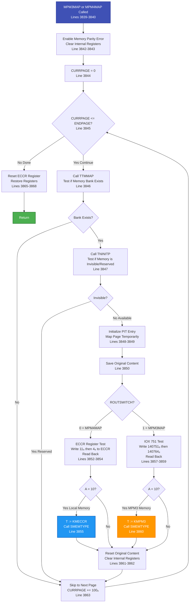

### 3.3 SMEMTYPE Routine Flow (Memory Type Storage)

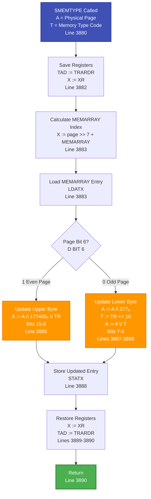

### 3.4 MEMARRAY Structure and Encoding

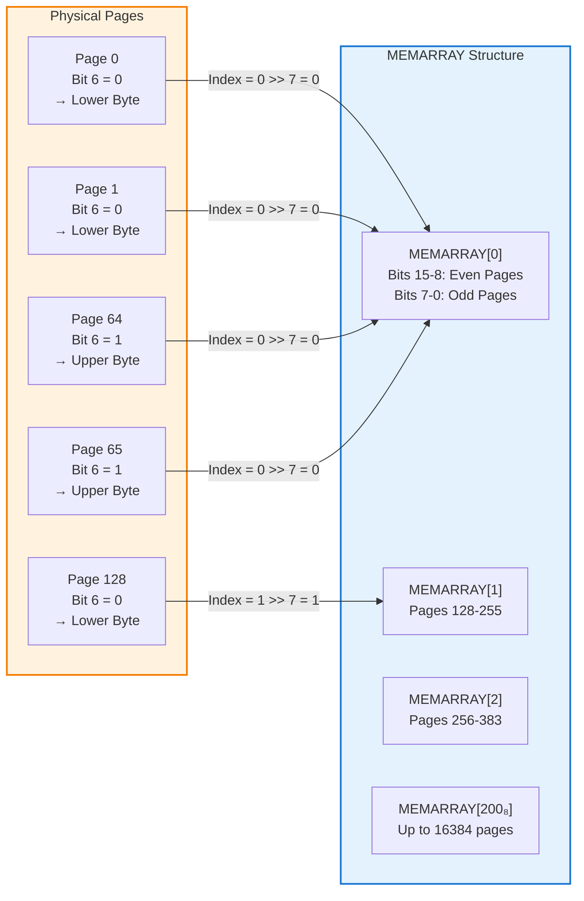

### 3.5 Detailed Sequence Diagram

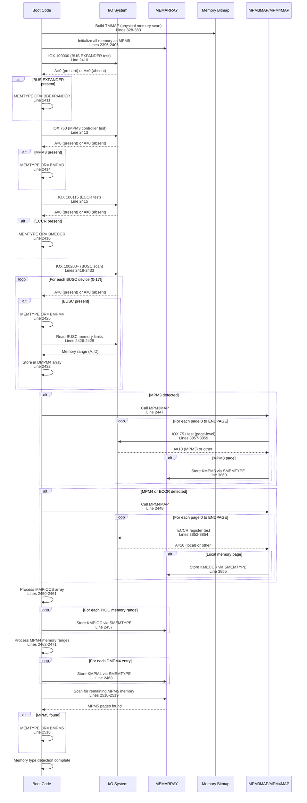

---

## 4. Initial Multiport Detection

**Location:** `PH-P2-OPPSTART.NPL`, lines 328-333

Before detailed memory type detection, SINTRAN performs a quick test to determine if **any** multiport memory controller exists:

```npl
% From PH-P2-OPPSTART.NPL, lines 328-333
1000=:CURRPAGE
% IF MULTIPORT 3 THEN 3777=:ENDPAGE ELSE 37777=:ENDPAGE FI
A:=200; *TRR IIE; TRA IIC; IOX 750; TRA IIC
IF A=0 THEN A:=3777 ELSE A:=37777 FI; A=:ENDPAGE
A:=0; *TRR IIE
```

**IOX 750 Instruction:**
- **Purpose:** Test for multiport memory controller presence
- **Result A=0:** Multiport controller responded → Set `ENDPAGE=3777₈` (2MB limit)
- **Result A≠0:** No multiport (I/O error) → Set `ENDPAGE=37777₈` (16MB limit)
- **Effect:** Limits physical memory scan range

**Note:** This early test determines the maximum physical memory address to scan. If multiport memory is detected, the scan is limited to 2MB to avoid conflicts with multiport memory addressing.

---

## 5. Controller-Level Detection

**Location:** `PH-P2-OPPSTART.NPL`, lines 2407-2434

After the initial memory scan builds the TMMAP bitmap, SINTRAN performs controller-level detection to identify which memory controllers are present.

### 5.1 BUS EXPANDER Detection

```npl
% From PH-P2-OPPSTART.NPL, lines 2409-2411
*"8BEX1
T:=100000; *IOXT; TRA IIC
IF A=0 THEN MEMTYPE BONE BBEXPANDER=:MEMTYPE FI
```

**IOX 100000 Test:**
- **Device:** BUS EXPANDER #1 (base address 100000₈)
- **Purpose:** Detect BUS EXPANDER hardware presence
- **Result A=0:** BUS EXPANDER present → Set `MEMTYPE |= BBEXPANDER`
- **Note:** BUS EXPANDER is used for memory expansion and may indicate MPM4 presence

### 5.2 MPM3 Detection

```npl
% From PH-P2-OPPSTART.NPL, lines 2413-2414
*IOX 750; TRA IIC
IF A=0 THEN MEMTYPE BONE BMPM3=:MEMTYPE FI
```

**IOX 750 Test (repeated):**
- **Device:** BIG MPM ERROR LOG / MPM3 Controller (IOX 750-753)
- **Purpose:** Detect Multiport Memory Module 3 controller
- **Result A=0:** MPM3 controller present → Set `MEMTYPE |= BMPM3`
- **Note:** This is the same IOX 750 used earlier, but now checking specifically for MPM3

### 5.3 ECCR / Local Memory Detection

```npl
% From PH-P2-OPPSTART.NPL, lines 2415-2416
A:=4; T:=100115; *IOXT; TRA IIC
IF A=0 THEN MEMTYPE BONE BMECCR=:MEMTYPE FI
```

**IOX 100115 Test:**
- **Device:** ECCR (Error Checking and Correction Register) at device 100115₈
- **Purpose:** Detect onboard/local memory controller (ND-120 OnCpu memory)
- **Result A=0:** ECCR present → Set `MEMTYPE |= BMECCR`
- **Memory Type:** Maps to **Local** and **OnCpu** memory types
- **Note:** ECCR indicates memory with error correction, typically onboard CPU memory

### 5.4 BUSC / MPM4 Detection

```npl
% From PH-P2-OPPSTART.NPL, lines 2418-2433
*"8MPM4
0=:NBUSCN; 0=:XA
FOR NBUSCN TO 17 DO
    A:=NBUSCN*4+100200=:T; *IOXT; TRA IIC
    IF A=0 THEN
        NBUSCN SH 3+XBONE; X:=XA
        *EXR SX                                % BSET BONE XX DD
        X=:XA
        MEMTYPE BONE BMPM4=:MEMTYPE
        T+3; A:=100; *IOXT                      % ENABLE READ LIMITS
        T-3; *IOXT                              % READ LIMITS
        A=:D/\377 SH 6:=:D SHZ -10 SH 6:=:D
        IF A><D THEN D-1 ELSE A:=0; D:=0 FI     % TEST FOR EMPRY MPM4 PORT
    ELSE
        A:=0; D:=0
    FI; X:=NBUSCN+X; AD=:DMPM4(X)
OD; XA=:NBUSCN
```

**BUSC Device Scanning Flow:**

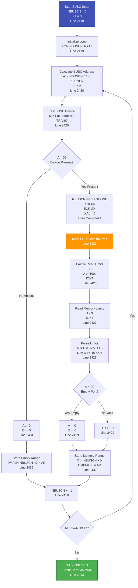

**BUSC Device Scanning:**
- **Devices:** BUSC #0-17 at addresses 100200₈ + (NBUSCN × 4)
- **Purpose:** Detect Multiport Memory Module 4 controllers
- **Process:**
  1. Test each BUSC device with `IOXT`
  2. If present (A=0), enable read limits and read memory limits
  3. Store memory range in `DMPM4` array
  4. Set `MEMTYPE |= BMPM4`
- **Memory Type:** Maps to **Mpm 4** memory
- **Note:** Up to 18 BUSC devices can be detected (NBUSCN 0-17)

**BUSC Device Addresses:**
- BUSC #0: 100200₈
- BUSC #1: 100204₈
- BUSC #2: 100210₈
- ...
- BUSC #17: 100274₈

---

## 6. Page-Level Memory Type Mapping

After detecting controller types, SINTRAN performs page-by-page memory type identification using two mapping routines: `MPM3MAP` and `MPM4MAP`.

**Location:** `PH-P2-OPPSTART.NPL`, lines 3830-3868

### 6.1 MPM3MAP Routine Flow

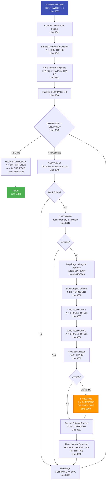

### 6.2 MPM4MAP Routine Flow

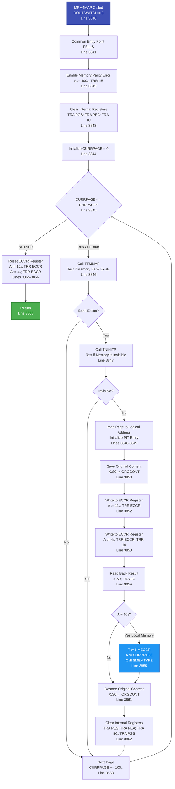

### 6.3 MPM3MAP Routine

```npl
% From PH-P2-OPPSTART.NPL, lines 3857-3860
MPM3MAP: TAD=:TRARDR; 1=:ROUTSWITCH; GO FELLS
...
ELSE                                   % MPM3
    A:=140751; *IOX 751
    0=:X.S0; A:=140764; *IOX 751; TRR 10
    X.S0; *TRA IIC
    IF A=10 THEN T:=KMPM3; A:=CURRPAGE; CALL SMEMTYPE FI  % KMPM3 = 1₈
```

**MPM3 Page Test:**
- **Method:** Uses `IOX 751` instruction with test pattern
- **Process:**
  1. Write test pattern (140751₈) to IOX 751
  2. Write second pattern (140764₈) to IOX 751
  3. Read back and check if A=10 (memory responded)
  4. If A=10, mark page as MPM3 (`KMPM3`)
- **Memory Type:** Maps to **Mpm 3** memory
- **Note:** This routine scans all pages from 0 to ENDPAGE and tests each one

### 6.2 MPM4MAP Routine

```npl
% From PH-P2-OPPSTART.NPL, lines 3851-3855
IF ROUTSWITCH=0 THEN                   % MPM4
    A:=11; *TRR ECCR
    0=:X.S0; A:=4; *TRR ECCR; TRR 10
    X.S0; *TRA IIC
    IF A=10 THEN T:=KMECCR; A:=CURRPAGE; CALL SMEMTYPE FI  % KMECCR = 10₈
```

**MPM4 / Local Memory Page Test:**
- **Method:** Uses ECCR (Error Checking and Correction Register)
- **Process:**
  1. Write 11₈ to ECCR register
  2. Write 4₈ to ECCR register
  3. Read back and check if A=10 (memory responded)
  4. If A=10, mark page as Local (`KMECCR`)
- **Memory Type:** Maps to **Local** and **OnCpu** memory
- **Note:** MPM4MAP also handles MPM4 memory, but ECCR test identifies local memory pages

### 6.3 Common Mapping Logic

Both routines follow this pattern:

```npl
% From PH-P2-OPPSTART.NPL, lines 3844-3864
FELLS: X=:XR:=L=:"LREG"
    A:=400; *TRR IIE                          % ENABLE FOR MEMORY PARITY ERROR
    *TRA PGS; TRA PEA; TRA IIC                % CLEAR INTERNAL REGISTERS
    0=:CURRPAGE
    DO WHILE CURRPAGE<<=ENDPAGE
        CALL TTMMAP; GO NXT                    % TEST IF MEM.BANK EXIST
        CALL TNINITP; GO NXT                   % TEST IF MEM IS INVISIBLE
        A=:D:=162000; X:=177776
        T:=0; *STDTX                           % INITIALIZE PIT ENTRY
        X.S0=:ORGCONT; *TRA IIC; TRA PEA
        % ... memory type test (MPM3 or MPM4) ...
        ORGCOUNT=:X.S0                         % RESET ORIGINAL CONTENT
        *TRA PES; TRA PEA; *TRA IIC; TRA PGS  % CLEAR INTERNAL REGISTERS
NXT:   CURRPAGE+100=:CURRPAGE
    OD
```

**Key Steps:**
1. Enable memory parity error interrupts
2. Clear internal registers (PGS, PEA, IIC)
3. For each page from 0 to ENDPAGE:
   - Check if memory bank exists (TTMMAP)
   - Check if memory is invisible/reserved (TNINITP)
   - Initialize PIT entry
   - Perform memory type test (MPM3 or MPM4)
   - Store memory type code via SMEMTYPE
   - Reset original content
   - Clear internal registers

---

## 7. PIOC Memory Configuration

**Location:** `PH-P2-OPPSTART.NPL`, lines 2450-2461

PIOC (Programmed I/O Controller) memory is **configured** at system generation, not auto-detected during boot.

**PIOC Memory Processing Flow:**

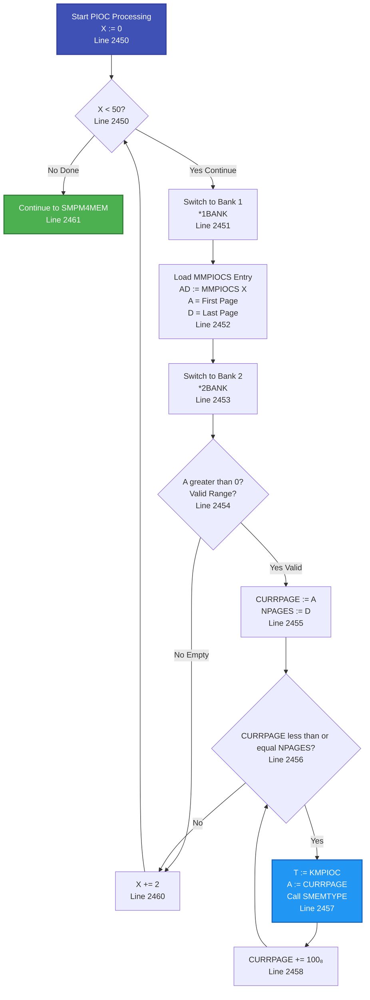

```npl
% From PH-P2-OPPSTART.NPL, lines 2450-2461
X:=0
DO WHILE X<<50                  % DEFINE PIOC-MEMORY
    *1BANK
    AD:=MMPIOCS(X)
    *2BANK
    IF A><0 THEN
        A=:CURRPAGE:=D=:NPAGES
        DO WHILE CURRPAGE<<=NPAGES
            A:=CURRPAGE; T:=KMPIOC; CALL SMEMTYPE  % KMPIOC = 20₈
            CURRPAGE+100=:CURRPAGE
        OD
    FI; X+2
OD
```

**PIOC Memory Configuration:**
- **Source:** `MMPIOCS` array (configured at system generation)
- **Structure:** Array of (first_page, last_page) pairs
- **Process:**
  1. Iterate through `MMPIOCS` array (up to 25 entries, X<50)
  2. Each entry contains (first_page, last_page) pair
  3. For each PIOC memory range, mark pages as `KMPIOC`
- **Memory Type:** Maps to **Pioc**, **Ether**, **Token**, and **Net/1** memory
- **Note:** Network interface memory (Ethernet, Token Ring, Net/One) is typically configured as PIOC memory ranges in `MMPIOCS` during system generation

**PIOC Device Table:**

From `PH-P2-START-BASE.NPL`, lines 245-250:

```npl
DOUBLE ARRAY PIOCS:=(
    PIO01,1700, PIO02,1701, PIO03,1702, PIO04,1703,
    PIO05,1704, PIO06,1705, PIO07,1706, PIO08,1707,
    PIO09,1710, PIO10,1711, PIO11,1712, PIO12,1713,
    PIO13,1714, PIO14,1715, PIO15,1716, PIO16,1717,
    ETRN1,2240, ETRN2,2241, ETRN3,2242, ETRN4,2243,
    -1);
```

**Ethernet Interfaces Found in Code:**
- ETRN1: Device 2240₈ (`PH-P2-START-BASE.NPL:249`)
- ETRN2: Device 2241₈ (`PH-P2-START-BASE.NPL:249`)
- ETRN3: Device 2242₈ (`PH-P2-START-BASE.NPL:249`)
- ETRN4: Device 2243₈ (`PH-P2-START-BASE.NPL:249`)

These Ethernet interfaces are listed in the PIOCS device table. If their memory ranges are configured in the `MMPIOCS` array during system generation, they would be processed as PIOC memory and use the `KMPIOC` code. Token Ring and Net/1 interfaces are not found in the source code examined.

---

## 7.5 MPM4 Memory Range Processing

**Location:** `PH-P2-OPPSTART.NPL`, lines 2462-2471

After BUSC devices are detected and their memory limits are read, SINTRAN processes the MPM4 memory ranges:

```npl
% From PH-P2-OPPSTART.NPL, lines 2462-2471
SMPM4MEM:
*"8MPM4
    0=:XA
    FOR XA TO 17 DO
        X:=XA+X; AD:=DMPM4(X); A=:CURRPAGE:=D=:NPAGES
        DO WHILE CURRPAGE<<NPAGES
            A:=CURRPAGE; T:=KMPM4; CALL SMEMTYPE  % KMPM4 = 2₈
            CURRPAGE+100=:CURRPAGE
        OD
    OD
```

**MPM4 Memory Range Processing:**
- **Source:** `DMPM4` array (populated during BUSC scan)
- **Process:**
  1. Iterate through BUSC devices (XA = 0 to 17)
  2. Load memory range from `DMPM4` array
  3. For each page in the range, mark as `KMPM4` (value 2₈)
- **Memory Type:** Maps to **Mpm 4** memory
- **Note:** Only processes ranges for BUSC devices that were detected during the scan

---

## 8. MPM5 Memory Identification

**Location:** `PH-P2-OPPSTART.NPL`, lines 2396-2406, 2510-2519

All detected memory is initially marked as MPM5, then refined based on controller detection.

### 8.1 Initial MPM5 Assignment

```npl
% From PH-P2-OPPSTART.NPL, lines 2396-2406
RETU:  FOR X:=0 TO 17 DO     % ALL FOUND MEMORY IS INITIALLY SET TO MPM5 MEMORY
    IF TMMAP(X)><0 THEN
        X=:CSAVX; A=:XA:=X SH 12=:CURRPAGE
        FOR X:=-20 DO
            IF XA BIT "0" THEN               % MEMORY BANK EXSIST
                T:=KMPM5; A:=CURRPAGE; CALL SMEMTYPE  % KMPM5 = 4₈
            FI; XA SHZ -1=:XA
            CURRPAGE+100=:CURRPAGE
        OD; X:=CSAVX
    FI
OD
```

**Initial Assignment:**
- All detected memory banks are initially marked as MPM5 (`KMPM5`)
- This occurs before controller-level detection
- Memory is then refined based on controller detection results

### 8.2 MPM5 Refinement

**MPM5 Refinement Flow:**

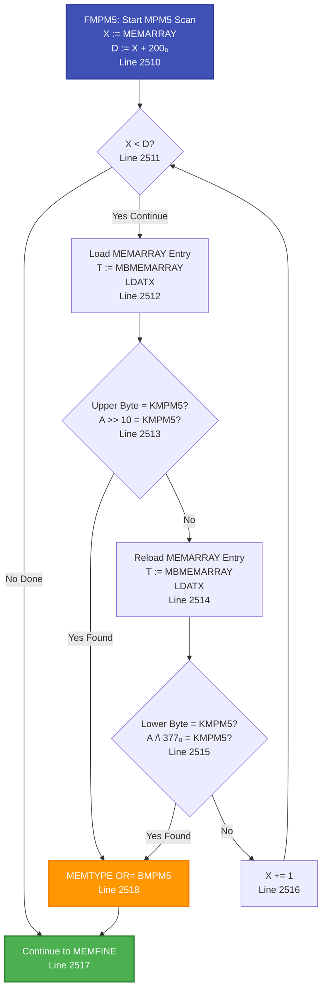

```npl
% From PH-P2-OPPSTART.NPL, lines 2510-2519
FMPM5: X:=MEMARRAY; A:=X+200=:D
    DO WHILE X<<D
        T:=MBMEMARRAY; *LDATX
        IF A SHZ -10=KMPM5 GO SMPM5
        T:=MBMEMARRAY; *LDATX
        IF A/\377=KMPM5 GO SMPM5
        X+1
    OD; GO MEMFINE
SMPM5: MEMTYPE BONE BMPM5=:MEMTYPE
    GO MEMFINE
```

**MPM5 Refinement:**
- After other memory types are identified, scan `MEMARRAY` for remaining MPM5 memory
- Check both upper and lower bytes of each MEMARRAY entry
- If MPM5 memory is found, set `MEMTYPE |= BMPM5`
- **Memory Type:** Maps to **Mpm 5** memory

---

## 9. Memory Type Code Storage

### 9.1 SMEMTYPE Routine

**Location:** `PH-P2-OPPSTART.NPL`, lines 3880-3891

The `SMEMTYPE` routine stores memory type codes in the `MEMARRAY` structure.

```npl
% From PH-P2-OPPSTART.NPL, lines 3880-3891
SUBR SMEMTYPE
SMEMTYPE: TAD=:TRARDR; X=:XR
    A=:D SHZ -7+MEMARRAY=:X; T:=MBMEMARRAY; *LDATX
    IF D BIT 6 THEN
        A/\177400\/TR
    ELSE
        A/\377; T:=TR SH 10; A\/T; T:=MBMEMARRAY
    FI; *STATX
    X:=XR; TAD:=TRARDR
    EXIT
```

**SMEMTYPE Parameters:**
- **A:** Physical page number
- **T:** Memory type code (KMECCR, KMPIOC, KMPM3, KMPM4, KMPM5)

**SMEMTYPE Process:**
1. Calculate MEMARRAY index: `(page >> 7) + MEMARRAY`
2. Load current MEMARRAY entry
3. Determine which byte to update based on bit 6 of page number:
   - **Bit 6 = 1:** Update upper byte (bits 15-8) for even pages
   - **Bit 6 = 0:** Update lower byte (bits 7-0) for odd pages
4. Store updated entry back to MEMARRAY

### 9.2 MEMARRAY Structure

**MEMARRAY Format:**
- **Purpose:** Stores memory type code for each physical page
- **Structure:** Array of words, one entry per 128 pages (100₈ pages)
- **Encoding:**
  - **Upper byte (bits 15-8):** Memory type code for even pages (page % 128 = 0, 2, 4, ...)
  - **Lower byte (bits 7-0):** Memory type code for odd pages (page % 128 = 1, 3, 5, ...)
  - **Bit 6 of page number:** Determines which byte to use

**Example:**
- Page 0 (bit 6 = 0): Stored in lower byte of MEMARRAY[0]
- Page 1 (bit 6 = 0): Stored in lower byte of MEMARRAY[0]
- Page 64 (bit 6 = 1): Stored in upper byte of MEMARRAY[0]
- Page 65 (bit 6 = 1): Stored in upper byte of MEMARRAY[0]
- Page 128 (bit 6 = 0): Stored in lower byte of MEMARRAY[1]

### 9.3 Memory Type Code Values

From symbol files (verified):

| Symbol | Value (Octal) | Value (Decimal) | Value (Hex) | Memory Type | Source |
|--------|--------------|-----------------|-------------|-------------|--------|
| `KMECCR` | 000010₈ | 8 | 0x08 | Local/OnCpu | Symbol files (KMECC in SYMBOL-1-LIST.SYMB.TXT:5137) |
| `KMPIOC` | 000020₈ | 16 | 0x10 | PIOC | Symbol files (KMPIO in SYMBOL-1-LIST.SYMB.TXT:5161) |
| `KMPM3` | 000001₈ | 1 | 0x01 | Mpm 3 | Symbol files (SYMBOL-1-LIST.SYMB.TXT:3577) |
| `KMPM4` | 000002₈ | 2 | 0x02 | Mpm 4 | Symbol files (SYMBOL-1-LIST.SYMB.TXT:3607) |
| `KMPM5` | 000004₈ | 4 | 0x04 | Mpm 5 | Symbol files (SYMBOL-1-LIST.SYMB.TXT:3645) |

**Symbol File Truncation:**

Symbol files have a 5-character limit (due to 1980's memory constraints), so longer symbol names are truncated:
- `KMECCR` (6 chars) → `KMECC` (5 chars) in symbol file
- `KMPIOC` (6 chars) → `KMPIO` (5 chars) in symbol file

**Actual Symbol File Entries:**
- `KMECC=000010` (SYMBOL-1-LIST.SYMB.TXT:5137) = `KMECCR` = Local memory code = 8 decimal = 0x08 hex
- `KMPIO=000020` (SYMBOL-1-LIST.SYMB.TXT:5161) = `KMPIOC` = PIOC memory code = 16 decimal = 0x10 hex
- `KMPM3=000001` (SYMBOL-1-LIST.SYMB.TXT:3577) = MPM3 memory code = 1 decimal = 0x01 hex
- `KMPM4=000002` (SYMBOL-1-LIST.SYMB.TXT:3607) = MPM4 memory code = 2 decimal = 0x02 hex
- `KMPM5=000004` (SYMBOL-1-LIST.SYMB.TXT:3645) = MPM5 memory code = 4 decimal = 0x04 hex

**Usage in Code:**

When these symbols are used in NPL code, they are replaced with their octal values:
- `T:=KMECCR` becomes `T:=10` (octal) or `T:=8` (decimal)
- `T:=KMPIOC` becomes `T:=20` (octal) or `T:=16` (decimal)
- `T:=KMPM3` becomes `T:=1` (octal/decimal)
- `T:=KMPM4` becomes `T:=2` (octal/decimal)
- `T:=KMPM5` becomes `T:=4` (octal/decimal)

---

## 10. Detection Summary

### 10.1 Complete Detection Process Overview

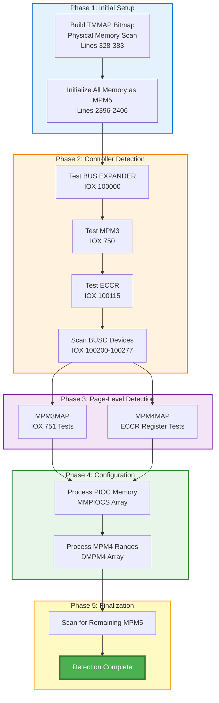

### 10.2 Memory Type Code Assignment Flow

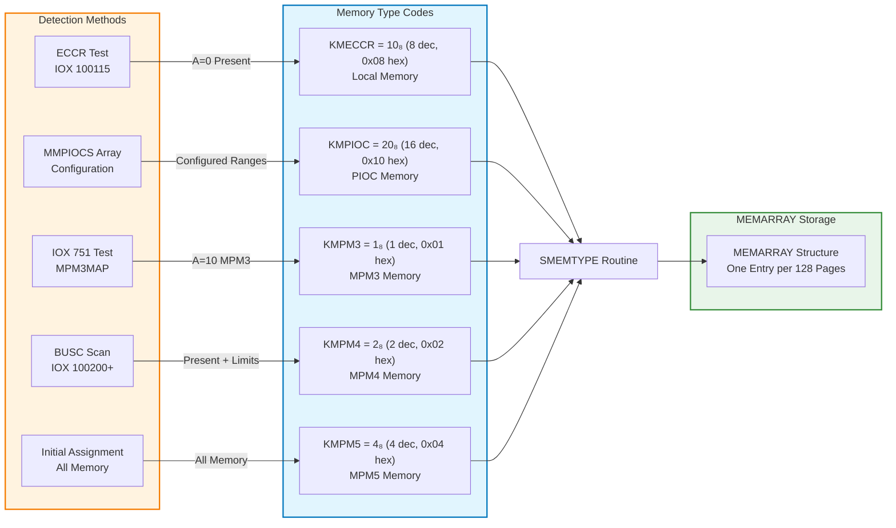

### 10.3 Detection Methods Table

| Memory Type | Detection Method | I/O Instruction | Device Address | Code Symbol | Code Value | Auto/Config | Code Reference |
|-------------|-----------------|----------------|----------------|-------------|------------|--------------|----------------|
| **Local** | ECCR register test | `IOX 100115` | 100115₈ | `KMECCR` | 10₈ (8) | Auto | `PH-P2-OPPSTART.NPL:2415-2416` |
| **Pioc** | Configuration array | N/A | `MMPIOCS` array | `KMPIOC` | 20₈ (16) | Config | `PH-P2-OPPSTART.NPL:2450-2461` |
| **Mpm 3** | Controller test + page test | `IOX 750`, `IOX 751` | 750₈, 751₈ | `KMPM3` | 1₈ (1) | Auto | `PH-P2-OPPSTART.NPL:2413-2414, 3860` |
| **Mpm 4** | BUSC device scan | `IOX 100200+` | 100200₈-100277₈ | `KMPM4` | 2₈ (2) | Auto | `PH-P2-OPPSTART.NPL:2418-2433` |
| **Mpm 5** | Initial assignment + scan | N/A | All memory initially | `KMPM5` | 4₈ (4) | Auto | `PH-P2-OPPSTART.NPL:2396-2406, 2510-2519` |

**Note:** Ethernet interfaces (ETRN1-4) are found in the PIOCS device table (`PH-P2-START-BASE.NPL:249`) as PIOC devices. If their memory ranges are configured in `MMPIOCS`, they would use `KMPIOC` code. Token Ring and Net/1 are not found in the source code examined.

### 10.2 Detection Order

1. **Initial Assignment:** All memory marked as MPM5
2. **BUS EXPANDER Test:** IOX 100000
3. **MPM3 Controller Test:** IOX 750
4. **ECCR Test:** IOX 100115 (Local/OnCpu)
5. **BUSC Scan:** IOX 100200-100277 (MPM4)
6. **Page-Level Mapping:** MPM3MAP or MPM4MAP
7. **PIOC Configuration:** Process MMPIOCS array
8. **MPM5 Refinement:** Scan for remaining MPM5 memory

### 10.3 Key Insights

1. **Initial Assignment:** All detected memory is initially marked as MPM5 (`KMPM5`) and then refined based on controller detection.

2. **Configuration vs Detection:**
   - **Auto-detected:** MPM3, MPM4, Local/OnCpu (via ECCR)
   - **Configured:** PIOC memory (including Ether/Token/Net/1) via `MMPIOCS` array

3. **Network Memory Types:** Ethernet interfaces (ETRN1-4) are found in the PIOCS device table. If their memory ranges are configured in `MMPIOCS` during system generation, they use the `KMPIOC` code. Token Ring and Net/1 are not found in the source code examined.

4. **BUSC Devices:** Up to 18 BUSC devices can be detected (NBUSCN 0-17), each potentially providing MPM4 memory.

5. **Memory Limits:** Detection of multiport memory (MPM3) sets `ENDPAGE=3777₈` (2MB), while standard memory sets `ENDPAGE=37777₈` (16MB).

6. **Page-Level Testing:** After controller detection, `MPM3MAP` and `MPM4MAP` routines perform page-by-page testing to accurately classify memory types.

---

## 11. Hardware Device Reference

### 11.1 Device Addresses

| Device Name | Base Address | Range | Purpose | Memory Type |
|-------------|--------------|-------|---------|-------------|
| **BIG MPM ERROR LOG** | 750₈ | 750₈-753₈ | MPM3 controller status | Mpm 3 |
| **BUS EXPANDER #1** | 100000₈ | 100000₈-100003₈ | Memory expansion controller | Mpm 4 indicator |
| **ECCR** | 100115₈ | 100115₈ | Error correction register | Local/OnCpu |
| **BUSC #0** | 100200₈ | 100200₈-100203₈ | MPM4 controller #0 | Mpm 4 |
| **BUSC #1** | 100204₈ | 100204₈-100207₈ | MPM4 controller #1 | Mpm 4 |
| **BUSC #2** | 100210₈ | 100210₈-100213₈ | MPM4 controller #2 | Mpm 4 |
| **BUSC #3** | 100214₈ | 100214₈-100217₈ | MPM4 controller #3 | Mpm 4 |
| **BUSC #4** | 100220₈ | 100220₈-100223₈ | MPM4 controller #4 | Mpm 4 |
| **BUSC #5** | 100224₈ | 100224₈-100227₈ | MPM4 controller #5 | Mpm 4 |
| **BUSC #6** | 100230₈ | 100230₈-100233₈ | MPM4 controller #6 | Mpm 4 |
| **BUSC #7** | 100234₈ | 100234₈-100237₈ | MPM4 controller #7 | Mpm 4 |
| **BUSC #8** | 100240₈ | 100240₈-100243₈ | MPM4 controller #8 | Mpm 4 |
| **BUSC #9** | 100244₈ | 100244₈-100247₈ | MPM4 controller #9 | Mpm 4 |
| **BUSC #10** | 100250₈ | 100250₈-100253₈ | MPM4 controller #10 | Mpm 4 |
| **BUSC #11** | 100254₈ | 100254₈-100257₈ | MPM4 controller #11 | Mpm 4 |
| **BUSC #12** | 100260₈ | 100260₈-100263₈ | MPM4 controller #12 | Mpm 4 |
| **BUSC #13** | 100264₈ | 100264₈-100267₈ | MPM4 controller #13 | Mpm 4 |
| **BUSC #14** | 100270₈ | 100270₈-100273₈ | MPM4 controller #14 | Mpm 4 |
| **BUSC #15** | 100274₈ | 100274₈-100277₈ | MPM4 controller #15 | Mpm 4 |
| **BUSC #16** | 100300₈ | 100300₈-100303₈ | MPM4 controller #16 | Mpm 4 |
| **BUSC #17** | 100304₈ | 100304₈-100307₈ | MPM4 controller #17 | Mpm 4 |

**Note:** BUSC device addresses follow the pattern: `100200₈ + (NBUSCN × 4)`

### 11.2 I/O Instructions Used

| Instruction | Purpose | Device Address | Result Interpretation |
|-------------|---------|----------------|----------------------|
| `IOX 750` | Test MPM3 controller | 750₈ | A=0: Present, A≠0: Absent |
| `IOX 751` | Test MPM3 page | 751₈ | A=10: MPM3 page |
| `IOX 100000` | Test BUS EXPANDER | 100000₈ | A=0: Present, A≠0: Absent |
| `IOX 100115` | Test ECCR | 100115₈ | A=0: Present, A≠0: Absent |
| `IOX 100200+` | Test BUSC devices | 100200₈-100277₈ | A=0: Present, A≠0: Absent |
| `*TRR ECCR` | ECCR register test | ECCR register | A=10: Local memory page |

---

## 12. Code References

### 12.1 Primary Source Files

| File | Lines | Purpose |
|------|-------|---------|
| `PH-P2-OPPSTART.NPL` | 328-333 | Initial multiport detection (IOX 750) |
| `PH-P2-OPPSTART.NPL` | 2396-2406 | Initial MPM5 assignment |
| `PH-P2-OPPSTART.NPL` | 2407-2434 | Controller-level detection sequence |
| `PH-P2-OPPSTART.NPL` | 2450-2461 | PIOC memory configuration |
| `PH-P2-OPPSTART.NPL` | 2510-2519 | MPM5 refinement |
| `PH-P2-OPPSTART.NPL` | 3830-3868 | MPM3MAP and MPM4MAP routines |
| `PH-P2-OPPSTART.NPL` | 3880-3891 | SMEMTYPE routine |
| `RP-P2-CONFG.NPL` | 486-514 | MEMCON routine (memory counting) |
| `PH-P2-START-BASE.NPL` | 245-250 | PIOCS device table |
| `PH-P2-RESTART.NPL` | 1192-1193 | MMPIOC array definition |

### 12.2 Key Routines

| Routine | Location | Purpose |
|---------|----------|---------|
| `MPM3MAP` | `PH-P2-OPPSTART.NPL:3839` | Map MPM3 memory pages |
| `MPM4MAP` | `PH-P2-OPPSTART.NPL:3840` | Map MPM4/local memory pages |
| `SMEMTYPE` | `PH-P2-OPPSTART.NPL:3880` | Store memory type code in MEMARRAY |
| `MEMCON` | `RP-P2-CONFG.NPL:486` | Count memory by type |

### 12.3 Key Data Structures

| Structure | Location | Purpose |
|-----------|----------|---------|
| `MEMARRAY` | Defined in boot code | Stores memory type codes per page |
| `MMPIOCS` | `PH-P2-RESTART.NPL:1192` | PIOC memory ranges (first, last page) |
| `DMPM4` | `PH-P2-OPPSTART.NPL` | MPM4 memory ranges from BUSC devices |
| `TMMAP` | `PH-P2-OPPSTART.NPL:369` | Physical memory bitmap |
| `MEMTYPE` | `PH-P2-OPPSTART.NPL:2407` | Bit flags for detected memory types |

---

## Appendix A: Related Documentation

- **01-BOOT-SEQUENCE.md:** Complete boot sequence documentation
- **03-CPU-DETECTION-AND-INITIALIZATION.md:** CPU and memory detection overview
- **19-MEMORY-MAP-REFERENCE.md:** Memory map reference (includes Section 11 on memory type detection)
- **20-MPM-VS-LOCAL-MEMORY-DETECTION.md:** MPM vs local memory differences

---

## Appendix B: Detection Flow Summary

```
1. Boot starts → Physical memory scan → TMMAP built
2. Initialize MEMTYPE = 0, all memory marked as MPM5
3. Test BUS EXPANDER (IOX 100000)
4. Test MPM3 controller (IOX 750)
5. Test ECCR (IOX 100115)
6. Scan BUSC devices (IOX 100200-100277)
7. Call MPM3MAP or MPM4MAP for page-level detection
8. Process MMPIOCS array (PIOC memory)
9. Refine MPM5 memory identification
10. Memory type detection complete
```

---

**End of Document**
