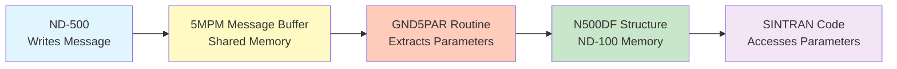

# N500DF Structure - Complete Reference

**ND-500 Datafield Structure - Complete Documentation**

**Version:** 1.0  
**Date:** 2025-01-XX  
**Status:** Complete  
**Source:** Analysis of SINTRAN III NPL source code (`5P-P2-MON60.NPL`, `MP-P2-N500.NPL`, symbol files)

---

## Table of Contents

1. [Overview](#1-overview)
2. [Structure Definition](#2-structure-definition)
3. [Allocation and Lifecycle](#3-allocation-and-lifecycle)
4. [Parameter Offsets](#4-parameter-offsets)
5. [GND5PAR Routine](#5-gnd5par-routine)
6. [Usage Examples](#6-usage-examples)
7. [Complete Field Reference](#7-complete-field-reference)

---

## 1. Overview

### 1.1 What is N500DF?

**N500DF** (ND-500 Datafield) is a **work area structure** used by SINTRAN to store parameters extracted from ND-500 monitor call messages. It acts as a **local buffer** in ND-100 memory where parameters from the 5MPM message buffer are copied for easier access.

**Key Characteristics:**
- **Location:** ND-100 memory (not in 5MPM)
- **Purpose:** Temporary work area for processing ND-500 monitor calls
- **Size:** Approximately 200₈ (128₁₀) words (exact size depends on maximum parameters)
- **Lifetime:** Allocated per-process, released after monitor call processing

### 1.2 Why N500DF Exists

**The Problem:**
- ND-500 writes monitor call parameters to **5MPM message buffer** (shared memory)
- Accessing 5MPM requires special bank register setup (`T:=5MBBANK`)
- Multiple accesses to the same parameters would require repeated bank setup
- Parameters are scattered throughout the message buffer

**The Solution:**
- **GND5PAR** routine copies parameters from 5MPM message buffer to **N500DF**
- N500DF is in **regular ND-100 memory** (no bank setup needed)
- Parameters are stored at **fixed offsets** for easy access
- Code can access parameters directly: `5D12=:ADRZERO` (no bank setup)

### 1.3 Relationship to Message Buffer



**Flow:**
1. **ND-500** writes monitor call parameters to **5MPM message buffer**
2. **GND5PAR** reads parameters from 5MPM and stores them in **N500DF**
3. **SINTRAN code** accesses parameters from **N500DF** (no bank setup needed)

---

## 2. Structure Definition

### 2.1 Memory Layout

**N500DF Structure Layout:**

```
Offset (Oct) | Offset (Dec) | Symbol    | Size | Purpose
-------------|--------------|-----------|------|--------------------------
000000       | 0            | (base)    | -    | N500DF base address
000001       | 1            | 5FUNCTION | 1    | Monitor call function code
000002       | 2            | (reserved)| -    | 
...          | ...          | ...       | ...  | Reserved area
000040       | 32           | 5D11      | 1    | Parameter 11 (MEMDEF: pointer to memory config)
000041       | 33           | 5D12      | 1    | Parameter 12 (MEMDEF: ADRZERO page number)
000042       | 34           | 5P1       | 1    | Parameter 1 (single word)
000043       | 35           | 5D21      | 1    | Parameter 21
000044       | 36           | 5D22      | 1    | Parameter 22 (MEMDEF: number of memory parts)
000045       | 37           | 5P2       | 1    | Parameter 2 (single word)
000046       | 38           | 5D31      | 1    | Parameter 31
000047       | 39           | 5D32      | 1    | Parameter 32
000050       | 40           | 5P3       | 1    | Parameter 3 (single word)
000051       | 41           | 5D41      | 1    | Parameter 41
000052       | 42           | 5D42      | 1    | Parameter 42
000053       | 43           | 5P4       | 1    | Parameter 4 (single word)
000054       | 44           | 5D51      | 1    | Parameter 51
000055       | 45           | 5D52      | 1    | Parameter 52
...          | ...          | ...       | ...  | Additional parameters
000100       | 64           | 5AP1      | 2    | Parameter 1 (double word, input)
000101       | 65           | 5DP1      | 2    | Parameter 1 (double word, output)
000102       | 66           | 5AP2      | 2    | Parameter 2 (double word, input)
000103       | 67           | 5DP2      | 2    | Parameter 2 (double word, output)
000104       | 68           | 5AP3      | 2    | Parameter 3 (double word, input)
000105       | 69           | 5DP3      | 2    | Parameter 3 (double word, output)
000106       | 70           | 5AP4      | 2    | Parameter 4 (double word, input)
000107       | 71           | 5DP4      | 2    | Parameter 4 (double word, output)
...          | ...          | ...       | ...  | Additional double-word parameters
000126       | 86           | 5ECH1     | 1    | Echo parameter 1
000130       | 88           | 5ECH2     | 1    | Echo parameter 2
000132       | 90           | 5ECH3     | 1    | Echo parameter 3
...          | ...          | ...       | ...  | Additional fields
```

**Note:** The exact size depends on the maximum number of parameters supported. Based on symbol files, the structure appears to be at least **200₈ (128₁₀) words**.

### 2.2 Symbol Values (Verified from Symbol Files)

**Source:** `SYMBOL-1-LIST.SYMB.TXT`

| Symbol | Octal Value | Decimal | Hex | Offset in N500DF | Purpose |
|--------|-------------|---------|-----|------------------|---------|
| **5D11** | **000040** | **32** | **0x20** | Parameter 11 | MEMDEF: Pointer to memory config data |
| **5D12** | **000041** | **33** | **0x21** | Parameter 12 | MEMDEF: ADRZERO (base page number) |
| **5D22** | **000044** | **36** | **0x24** | Parameter 22 | MEMDEF: Number of memory parts |
| **5P1** | **000042** | **34** | **0x22** | Parameter 1 | Single-word parameter 1 |
| **5P2** | **000045** | **37** | **0x25** | Parameter 2 | Single-word parameter 2 |
| **5P3** | **000050** | **40** | **0x28** | Parameter 3 | Single-word parameter 3 |
| **5P4** | **000053** | **43** | **0x2B** | Parameter 4 | Single-word parameter 4 |
| **5AP1** | **000100** | **64** | **0x40** | Parameter 1 (input) | Double-word parameter 1 (input) |
| **5DP1** | **000101** | **65** | **0x41** | Parameter 1 (output) | Double-word parameter 1 (output) |
| **5AP2** | **000102** | **66** | **0x42** | Parameter 2 (input) | Double-word parameter 2 (input) |
| **5DP2** | **000103** | **67** | **0x43** | Parameter 2 (output) | Double-word parameter 2 (output) |
| **5AP3** | **000104** | **68** | **0x44** | Parameter 3 (input) | Double-word parameter 3 (input) |
| **5DP3** | **000105** | **69** | **0x45** | Parameter 3 (output) | Double-word parameter 3 (output) |
| **5AP4** | **000106** | **70** | **0x46** | Parameter 4 (input) | Double-word parameter 4 (input) |
| **5DP4** | **000107** | **71** | **0x47** | Parameter 4 (output) | Double-word parameter 4 (output) |
| **5PPA1** | **000040** | **32** | **0x20** | Parameter pointer 1 | Pointer to parameter 1 area |
| **5PPA2** | **000042** | **34** | **0x22** | Parameter pointer 2 | Pointer to parameter 2 area |
| **5PPA3** | **000044** | **36** | **0x24** | Parameter pointer 3 | Pointer to parameter 3 area |
| **5DPA1** | **000041** | **33** | **0x21** | Parameter data 1 | Data for parameter 1 |
| **5DPA2** | **000043** | **35** | **0x23** | Parameter data 2 | Data for parameter 2 |
| **5DPA3** | **000045** | **37** | **0x25** | Parameter data 3 | Data for parameter 3 |

---

## 3. Allocation and Lifecycle

### 3.1 Allocation: 5RESWORKA Routine

**Source:** `5P-P2-MON60.NPL` lines 382-396 (`5RESWORKA` routine)

```npl
5RESWORKA:
    IF BACKGROUND=0 THEN
        A:=L=:"5RLREG"
        XSEMS(7)
        A=:B
NYTRY:    MLEV; *MCL PIE
        X:=RTREF; CALL BRESERVE
        IF A<0 THEN
            CALL FREXQU; CALL TOWQU; CALL ANTIJAMMER
            "STUPR"; *IRW MLEVB DP
            MLEV; *MST PIE; MST PID
            GO NYTRY
        FI; MLEV; *MST PIE
        "N500DF"=:B; GO 5RLREG              % LINE 395: SET B=N500DF
    FI; EXIT
```

**What it does:**
1. **Reserves a work area** using semaphore 7 (`XSEMS(7)`)
2. **Calls BRESERVE** to allocate memory
3. **Sets B register** to point to N500DF structure (`"N500DF"=:B`)
4. **Returns** with B register pointing to allocated N500DF

**Key Points:**
- **Semaphore 7** protects N500DF allocation (mutex)
- **BRESERVE** allocates memory from a work area pool
- **B register** is set to N500DF base address
- **Allocation is per-process** (RTREF-based)

### 3.2 Release: 5RELWORKA Routine

**Source:** `5P-P2-MON60.NPL` lines 398-409 (`5RELWORKA` routine)

```npl
5RELWORKA:
    IF BACKGROUND=0 THEN
        A:=L=:"5RLREG"
        XSEMS(7)
        A=:B
        IF X:=RTREF=RTRES THEN
            *IOF
            CALL BRELEASE
            *ION
        FI
        "N500DF"=:B; GO 5RLREG              % LINE 408: SET B=N500DF
    FI; EXIT
```

**What it does:**
1. **Checks if RTREF = RTRES** (reserved RT resource)
2. **Calls BRELEASE** to free the work area
3. **Releases semaphore 7**
4. **Returns** with B register still pointing to N500DF (for cleanup)

### 3.3 Usage Pattern

**Typical Usage:**

```npl
% Entry point (e.g., CHMEMDEF)
CHMEMDEF:
    A:=L=:"CHMLREG"
    % ... validation ...
    
    CALL 5RESWORKA              % Allocate N500DF (B register set)
    % ... process parameters ...
    "5D11"+B=:D; CALL GND5PAR   % Read parameters into N500DF
    % ... use parameters ...
    5D12=:ADRZERO               % Access parameter from N500DF
    % ... more processing ...
    CALL 5RELWORKA              % Release N500DF
    EXITA
```

**Lifecycle:**
1. **5RESWORKA** - Allocate N500DF (B register = N500DF base)
2. **GND5PAR** - Copy parameters from 5MPM to N500DF
3. **Access parameters** - Use offsets like `5D12`, `5D22`, etc.
4. **5RELWORKA** - Release N500DF

---

## 4. Parameter Offsets

### 4.1 Single-Word Parameters (5D11, 5D12, 5D22, etc.)

**MEMDEF Function Parameters:**

| Parameter | Offset (Oct) | Offset (Dec) | Symbol | Purpose |
|-----------|-------------|--------------|--------|---------|
| **5D11** | **000040** | **32** | `5D11` | Pointer to memory configuration data array |
| **5D12** | **000041** | **33** | `5D12` | ADRZERO (base page number for 5MPM) |
| **5D22** | **000044** | **36** | `5D22` | Number of memory parts (max 16₈) |

**Access Pattern:**

```npl
"N500DF"=:B                    % Set B register to N500DF base
"5D11"+B=:D                    % D = offset 5D11 (B + 40₈)
CALL GND5PAR                   % Read parameters from 5MPM into N500DF
5D12=:ADRZERO                  % Access parameter 5D12 directly
```

### 4.2 Double-Word Parameters (5AP1-5AP4, 5DP1-5DP4)

**Double-word parameters** are used for 32-bit values (addresses, counts, etc.).

| Parameter | Offset (Oct) | Offset (Dec) | Symbol | Purpose |
|-----------|-------------|--------------|--------|---------|
| **5AP1** | **000100** | **64** | `5AP1` | Parameter 1 (input, double word) |
| **5DP1** | **000101** | **65** | `5DP1` | Parameter 1 (output, double word) |
| **5AP2** | **000102** | **66** | `5AP2` | Parameter 2 (input, double word) |
| **5DP2** | **000103** | **67** | `5DP2` | Parameter 2 (output, double word) |
| **5AP3** | **000104** | **68** | `5AP3` | Parameter 3 (input, double word) |
| **5DP3** | **000105** | **69** | `5DP3` | Parameter 3 (output, double word) |
| **5AP4** | **000106** | **70** | `5AP4` | Parameter 4 (input, double word) |
| **5DP4** | **000107** | **71** | `5DP4` | Parameter 4 (output, double word) |

**Access Pattern:**

```npl
T:=5MBBANK                      % Set bank to 5MPM
"N500DF"=:B                     % Set B register to N500DF base
*AAX 5AP1; LDDTX               % Read double-word parameter 1 (input)
AD=:PARAM1                      % Store in AD register pair
*AAX 5AP2-5AP1; LDDTX          % Read parameter 2 (relative offset)
AD=:PARAM2                      % Store in AD register pair
```

**Note:** Double-word parameters use **LDDTX** (Load Double-word) instruction, which reads two consecutive words into the AD register pair.

---

## 5. GND5PAR Routine

### 5.1 Purpose

**GND5PAR** (Get ND-500 Parameters) is a routine that **extracts parameters from the 5MPM message buffer** and stores them in the **N500DF structure**.

### 5.2 Calling Convention

**Source:** `5P-P2-MON60.NPL` lines 565, 1293

```npl
"5D11"+B=:D                    % D = base offset (e.g., 5D11 = 40₈)
X:=ZAREG                       % X = ZAREG (message buffer address)
OLDPAGE                        % Save current page
X+1=:B                         % B = message buffer address + 1
T:=3                           % T = number of parameters to read
CALL GND5PAR                   % Read T parameters starting at offset D
```

**Parameters:**
- **D register:** Base offset in N500DF (e.g., `"5D11"` = 40₈)
- **B register:** Message buffer address in 5MPM (after `X+1=:B`)
- **T register:** Number of parameters to read (e.g., 3 for 5D11, 5D12, 5D22)
- **X register:** Message buffer base address (ZAREG)

**What GND5PAR does:**
1. **Reads T parameters** from 5MPM message buffer (starting at X+1)
2. **Stores them** in N500DF structure (starting at offset D)
3. **Returns** with parameters available in N500DF

### 5.3 Example: MEMDEF Function

**Source:** `5P-P2-MON60.NPL` lines 565-567 (`CHMEMDEF` routine)

```npl
CHMEMDEF:
    % ... setup code ...
    "5D11"+B=:D; X:=ZAREG; OLDPAGE; X+1=:B; T:=3; CALL GND5PAR
    %                                                      ^
    %                                                      |
    %                                    Read 3 parameters: 5D11, 5D12, 5D22
    
    "N500DF"=:B
    IF 5D22>MXMPARTS GO CHMEEILPAR         % Access 5D22 directly
    A=:MPARTS
    % ... process memory configuration ...
    5D12=:ADRZERO                           % Access 5D12 directly
```

**What happens:**
1. **`"5D11"+B=:D`** - D = N500DF base + 40₈ (offset of 5D11)
2. **`X:=ZAREG`** - X = message buffer base address
3. **`X+1=:B`** - B = message buffer address + 1 (skip header?)
4. **`T:=3`** - Read 3 parameters
5. **`CALL GND5PAR`** - Copy parameters from 5MPM to N500DF
6. **`5D22=:MPARTS`** - Access parameter directly from N500DF
7. **`5D12=:ADRZERO`** - Access parameter directly from N500DF

### 5.4 GND5PAR Implementation (Not in Source)

**GND5PAR is likely a library routine or microcode** (not found in NPL source). Based on usage patterns, it likely:

```pseudo-code
GND5PAR:
    % Input: D = N500DF offset, B = message buffer address, T = count
    % X = message buffer base (from ZAREG)
    
    FOR I := 0 TO T-1 DO
        % Read word from message buffer
        T:=5MBBANK                      % Set bank to 5MPM
        *AAX (B + I); LDATX             % Read word at offset (B + I)
        A=:TEMP
        
        % Write word to N500DF
        T:=0                            % Clear bank (ND-100 memory)
        X:=N500DF + D + I               % Calculate N500DF offset
        TEMP=:X                         % Store parameter
    OD
    EXITA
```

**Note:** This is **speculation** based on usage patterns. The actual implementation may differ.

---

## 6. Usage Examples

### 6.1 Example 1: MEMDEF Function (Memory Definition)

**Source:** `5P-P2-MON60.NPL` lines 515-587 (`CHMEMDEF` routine)

```npl
CHMEMDEF:
    A:=L=:"CHMLREG"
    IF 5FUNCTION><MEMDEF THEN              % If NOT MEMDEF (40₈)
        IF ADRZERO=-1 THEN
            EMDFCOM; GO CHMLREG            % Error: memory not defined
        FI
        EXITA
    FI; GO CHM1

CHM1:
    % ... setup code ...
    
    % Read parameters from 5MPM message buffer into N500DF
    "5D11"+B=:D; X:=ZAREG; OLDPAGE; X+1=:B; T:=3; CALL GND5PAR
    "N500DF"=:B
    
    % Access parameters from N500DF
    IF 5D22>MXMPARTS GO CHMEEILPAR         % Check number of memory parts
    A=:MPARTS
    
    % Copy memory configuration data
    5P3=:D; 5D22 SH 1=:X; OLDPAG; K:="0"; CALL MOVUS
    
    % Process memory configuration...
    
    % Set ADRZERO from parameter 5D12
    5D12=:ADRZERO                           % LINE 587: KEY LINE!
    
    % ... cleanup ...
    CALL 5RELWORKA                          % Release N500DF
    EXITA
```

**Key Points:**
- **GND5PAR** reads 3 parameters (5D11, 5D12, 5D22) from 5MPM
- **5D22** contains number of memory parts
- **5D11** contains pointer to memory configuration data
- **5D12** contains ADRZERO (base page number)
- Parameters are accessed directly: `5D12=:ADRZERO`

### 6.2 Example 2: N500M Entry Point

**Source:** `5P-P2-MON60.NPL` lines 1285-1297 (`N500M` routine)

```npl
N500M: CALL GET1                           % Get function parameter
    IF X:=5FUNCTION BZERO COMAUTO>>FUNCMAX GO FAR ILLFUNC
    % ... validation ...
    
    % Read message parameters from 5MPM buffer
    T:=XPARANT
SKPLG: "5D11"+B=:D; X:=ZAREG
    A:=OLDPAGE; X+1=:B; CALL GND5PAR      % FETCH MON-60 PARAMETERS
    "N500DF"=:B; X:=5FUNCTION; *1BANK
    A:=5IFUNC(X); *2BANK                  % Get function handler address
    A=:P                                   % Jump to function handler
```

**Key Points:**
- **GND5PAR** reads parameters for the current monitor call
- **XPARANT** determines how many parameters to read
- Parameters are stored in **N500DF** for function handler access
- Function handler can access parameters directly from **N500DF**

### 6.3 Example 3: UDMA Function (Fast UDMA)

**Source:** `MP-P2-N500.NPL` lines 1455-1465 (`N5FUD` routine)

```npl
N5FUD:
    %-------------------------- GET PARAMETERS
    T:=5MBBANK; *LDATX X5SND              % GET 500 PROC. NO
    A=:N5SE
    *AAX 5PPA2; LDDTX                     % GET BUFFER ADDRESS
    AD=:DBUA;  *AAX 5AP1-5PPA2; LDDTX     % GET FUNCTION (parameter 1)
    IF A >< 0 GO UERR; A:=D=:UFU
    *AAX 5AP2-5AP1; LDDTX                 % GET PIO DATA (parameter 2)
    A:=D=:UPIO
    *AAX 5AP3-5AP2; LDDTX                 % GET LOG DEV (parameter 3)
    IF A >< 0 GO UERR; A:=D=:UNI
    *AAX 5AP4-5AP3; LDDTX                 % GET IPAR1 (parameter 4)
    AD=:IPAR1
```

**Key Points:**
- **Double-word parameters** are accessed using **LDDTX** (Load Double-word)
- **Relative offsets** are used: `5AP2-5AP1`, `5AP3-5AP2`, etc.
- **5MBBANK** must be set before accessing parameters
- Parameters are read **directly from 5MPM** (not from N500DF in this case)

**Note:** This example reads directly from 5MPM, but parameters could also be accessed from N500DF if GND5PAR was called first.

---

## 7. Complete Field Reference

### 7.1 Function Code

| Offset (Oct) | Offset (Dec) | Symbol | Size | Purpose |
|-------------|--------------|--------|------|---------|
| 000001 | 1 | **5FUNCTION** | 1 | Monitor call function code (e.g., 40₈ = MEMDEF) |

**Usage:**
```npl
IF 5FUNCTION><MEMDEF THEN                  % Check function code
    % ... handle non-MEMDEF functions ...
FI
```

### 7.2 MEMDEF Parameters

| Offset (Oct) | Offset (Dec) | Symbol | Size | Purpose |
|-------------|--------------|--------|------|---------|
| 000040 | 32 | **5D11** | 1 | Pointer to memory configuration data array |
| 000041 | 33 | **5D12** | 1 | ADRZERO (base page number for 5MPM) |
| 000044 | 36 | **5D22** | 1 | Number of memory parts (max 16₈) |

**Usage:**
```npl
"5D11"+B=:D; X:=ZAREG; OLDPAGE; X+1=:B; T:=3; CALL GND5PAR
IF 5D22>MXMPARTS GO ERROR
5D12=:ADRZERO
```

### 7.3 Single-Word Parameters

| Offset (Oct) | Offset (Dec) | Symbol | Size | Purpose |
|-------------|--------------|--------|------|---------|
| 000042 | 34 | **5P1** | 1 | Parameter 1 (single word) |
| 000045 | 37 | **5P2** | 1 | Parameter 2 (single word) |
| 000050 | 40 | **5P3** | 1 | Parameter 3 (single word) |
| 000053 | 43 | **5P4** | 1 | Parameter 4 (single word) |

### 7.4 Double-Word Parameters (Input)

| Offset (Oct) | Offset (Dec) | Symbol | Size | Purpose |
|-------------|--------------|--------|------|---------|
| 000100 | 64 | **5AP1** | 2 | Parameter 1 (input, double word) |
| 000102 | 66 | **5AP2** | 2 | Parameter 2 (input, double word) |
| 000104 | 68 | **5AP3** | 2 | Parameter 3 (input, double word) |
| 000106 | 70 | **5AP4** | 2 | Parameter 4 (input, double word) |

**Usage:**
```npl
T:=5MBBANK
*AAX 5AP1; LDDTX              % Read parameter 1 (double word)
AD=:PARAM1                    % Store in AD register pair
```

### 7.5 Double-Word Parameters (Output)

| Offset (Oct) | Offset (Dec) | Symbol | Size | Purpose |
|-------------|--------------|--------|------|---------|
| 000101 | 65 | **5DP1** | 2 | Parameter 1 (output, double word) |
| 000103 | 67 | **5DP2** | 2 | Parameter 2 (output, double word) |
| 000105 | 69 | **5DP3** | 2 | Parameter 3 (output, double word) |
| 000107 | 71 | **5DP4** | 2 | Parameter 4 (output, double word) |

**Usage:**
```npl
T:=5MBBANK
PARAM1=:AD                    % Set AD register pair
*AAX 5DP1; STDTX              % Write parameter 1 (double word)
```

### 7.6 Parameter Pointers

| Offset (Oct) | Offset (Dec) | Symbol | Size | Purpose |
|-------------|--------------|--------|------|---------|
| 000040 | 32 | **5PPA1** | 1 | Pointer to parameter 1 area |
| 000042 | 34 | **5PPA2** | 1 | Pointer to parameter 2 area |
| 000044 | 36 | **5PPA3** | 1 | Pointer to parameter 3 area |

**Note:** These may overlap with 5D11, 5P1, 5D22 offsets. The meaning depends on context.

---

## 8. Summary

### 8.1 Key Points

1. **N500DF** is a **work area structure** in ND-100 memory
2. **GND5PAR** copies parameters from **5MPM message buffer** to **N500DF**
3. **Parameters are accessed** using fixed offsets (e.g., `5D12`, `5D22`)
4. **Allocation** is done via **5RESWORKA** (semaphore-protected)
5. **Release** is done via **5RELWORKA** (after processing)

### 8.2 Benefits

- **No bank setup needed** - N500DF is in regular ND-100 memory
- **Fixed offsets** - Easy to access parameters
- **Efficient** - Parameters copied once, accessed multiple times
- **Thread-safe** - Semaphore-protected allocation

### 8.3 Usage Pattern

```npl
CALL 5RESWORKA              % Allocate N500DF (B = N500DF base)
"5D11"+B=:D; CALL GND5PAR   % Copy parameters from 5MPM to N500DF
5D12=:ADRZERO               % Access parameter directly
% ... process parameters ...
CALL 5RELWORKA              % Release N500DF
```

---

**End of Document**
