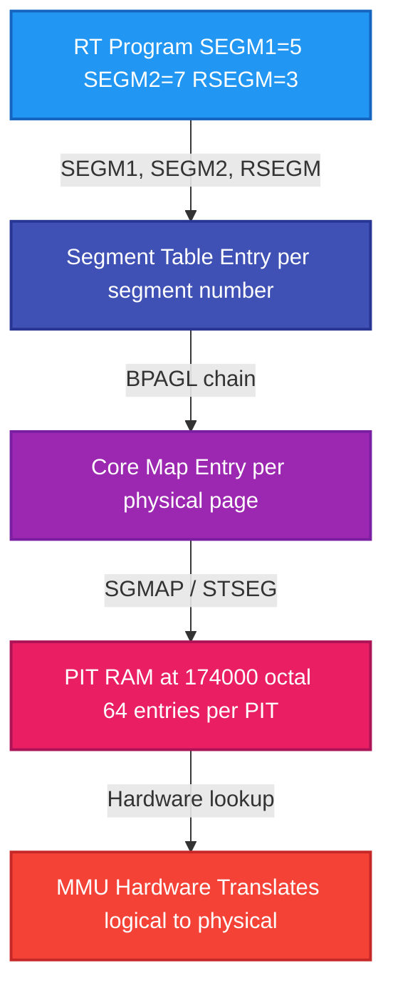
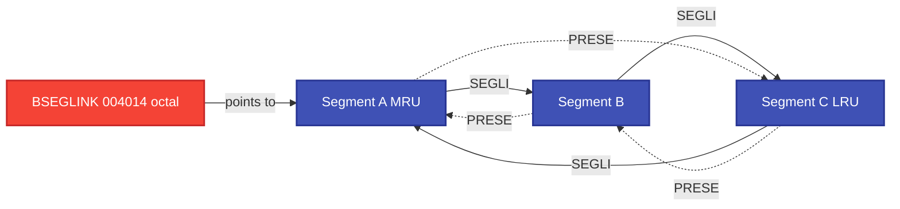
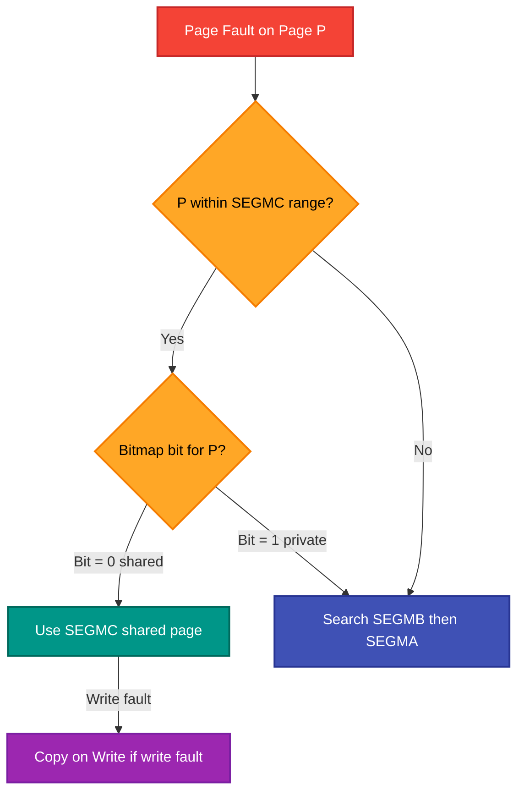
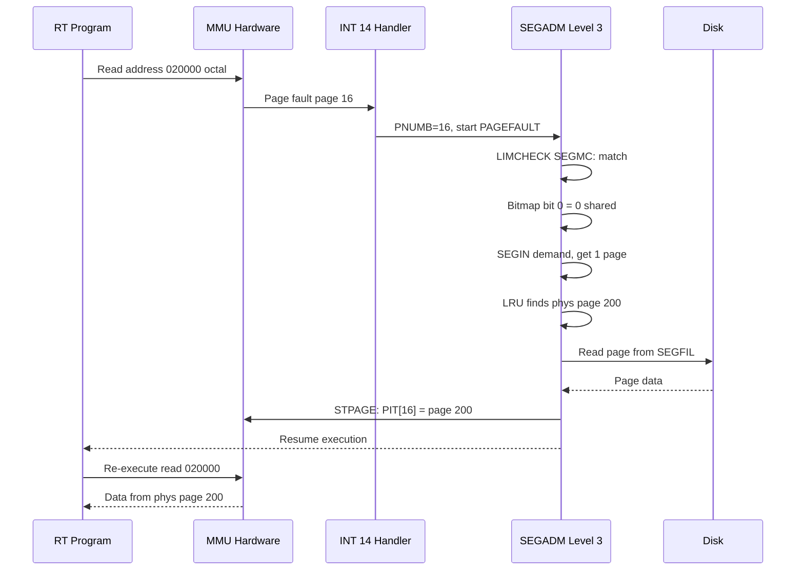
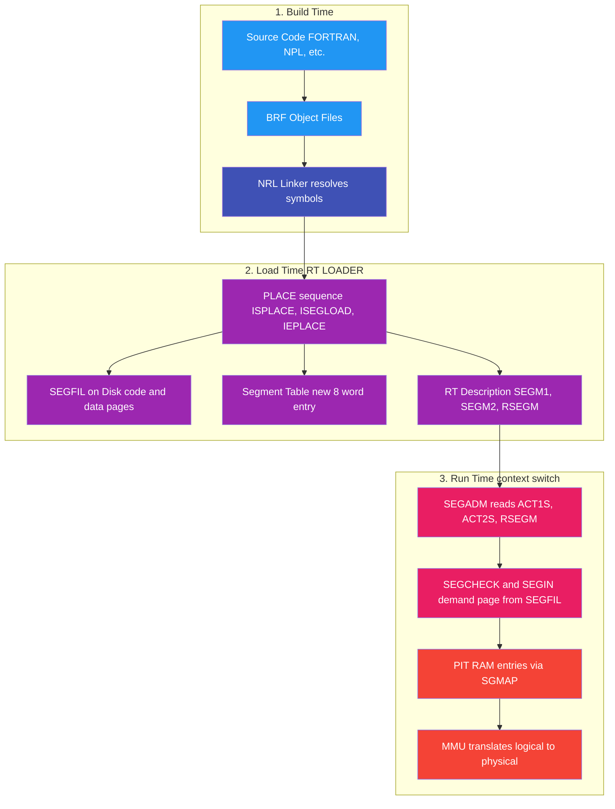

# SINTRAN III Segments: From the MMU Up

**The complete kernel internals of segment management -- data structures, NPL source code, and execution flows**

**Last Updated:** 2026-02-08
**Prerequisites:** ND-100 MMU architecture (PITs, PCR, 64 logical pages), ND-100 word addressing (64KW = 128KB per bank)

---

## Table of Contents

1. [Why Segments Exist](#1-why-segments-exist)
2. [The Segment Table](#2-the-segment-table)
3. [The Core Map](#3-the-core-map)
4. [From Segments to PITs -- SGMAP](#4-from-segments-to-pits----sgmap)
5. [The Three-Segment Hierarchy -- SEGMC/SEGMB/SEGMA](#5-the-three-segment-hierarchy----segmcsegmbsegma)
6. [Reentrant Bitmap and Copy-on-Write](#6-reentrant-bitmap-and-copy-on-write)
7. [Complete Page Fault Flow](#7-complete-page-fault-flow)
8. [SEGFIL -- Segments on Disk](#8-segfil----segments-on-disk)
9. [Named Kernel Segments](#9-named-kernel-segments)
10. [How Programs Reference Segments](#10-how-programs-reference-segments)
11. [RTCOMMON -- The Fixed Shared Region](#11-rtcommon----the-fixed-shared-region)
12. [Segment Fixing and LRU](#12-segment-fixing-and-lru)
13. [From Disk to Segments -- How Programs Get Loaded](#13-from-disk-to-segments----how-programs-get-loaded)
- [Appendix A: Quick Reference Tables](#appendix-a-quick-reference-tables)
- [Appendix B: NPL Source File Map](#appendix-b-npl-source-file-map)
- [Appendix C: Physical vs Virtual Addressing in SEGADM](#appendix-c-physical-vs-virtual-addressing-in-segadm)

---

## 1. Why Segments Exist

You know the MMU. You know the PITs. You know that each interrupt level gets a Normal PIT and an Alternate PIT, and that the PCR selects which PIT pair is active. Each PIT maps 64 logical pages (pages 0-63, each 1KW = 1024 words) to physical pages.

But who **populates** the PITs?

The answer is: segments. A segment is the kernel abstraction that sits between the RT program and the MMU hardware. It has three responsibilities:

1. **Track logical-to-physical mappings** -- which physical pages belong to this segment, and what logical page each one maps to
2. **Maintain the core map** -- the master record of every physical page in the system: who owns it, what protection it has, what logical address it represents
3. **Build PIT entries** -- translate its own core map chain into the hardware PIT RAM so the MMU can do address translation

A segment is NOT the same thing as a PIT. A PIT is a hardware table with 64 entries. A segment is a kernel data structure that may use any subset of those 64 entries, and multiple segments from different programs share the same PIT hardware by being loaded and unloaded on context switches.



The kernel never writes PIT entries from scratch. It always builds them from the core map, which in turn is organized by segments. This layering is fundamental to everything that follows.

### 1.1 Version Evolution

The segment subsystem grew significantly across SINTRAN III versions:

| Version | PITs | Max Segments | Key Segment Changes |
|:---:|:---:|:---:|---|
| J (1985) | 8 (VSE) / 16 (VSX) | ~500 | LAMU system for extending RT-program address space |
| K (1985-88) | **16** (VSX only) | **2048** | Massive expansion; SegAdm moved to RPIT in gen 500 |
| L (1988) | 16 | 2048 | XMSG/ERS integrated; VSE discontinued; MON 350 RWSEG |
| M (1990) | 16 | 2048 | Extended RT-Description (26₈-word extension in bank XRTBA); MON 441 PLACE |
| N (1993) | 16 | 2048 | Multi-threaded swapper (9 threads + async I/O); dirty cache |

The NPL source code in this document is from the **K-version** build (s3vs-4), with symbol tables verified across K03, L07, and M06. The segment table entry layout, core map structure, and SEGADM algorithm are stable across all versions -- what changed was scale (more segments, more PITs) and performance (multi-threaded swapper in N-version).

> **Source**: [SINTRAN III Release History](../Release-Documentation/SINTRAN-III-Release-History.md) Sections 2.1-2.5 and 7.6.

---

## 2. The Segment Table

The segment table is an array of 8-word entries, one per segment number. It lives in extended physical memory **outside any PIT** -- it is not mapped through the MMU at all. SINTRAN accesses it using privileged LDXTX/LDATX instructions with the `SEGTBANK` bank register (see [Appendix C](#appendix-c-physical-vs-virtual-addressing-in-segadm)).

### 2.0 Where It Lives in Physical Memory

From a verified physical memory dump (SINTRAN-STRUCTURES.md Section 6.14):

| Pointer | Address (Oct) | Observed Value | Meaning |
|---|:---:|:---:|---|
| SEGTB | 004320 | 000140₈ (96₁₀ = 0x60) | Low 8 bits of T register → bank selector |
| SEGST | 004321 | 000002₈ | Word offset within that bank (segment 0 starts at word 2) |

**How LDXTX/LDATX compute the 24-bit physical address:**

```
Physical address = (T & 0xFF) << 16 | (X + displacement) & 0xFFFF
```

Only the **low 8 bits** of the T register form the bank selector (bits 23–16). The X register plus the `@3` displacement field provide the 16-bit offset (bits 15–0). This gives a 24-bit physical word address space of 16MW (256 banks × 64KW).

**Verification from SGMAP** (`PH-P2-RESTART.NPL` line 416): `A*5SEGSIZE+SEGSTART=:X; T:=SEGTBANK; *BPAGL@3 LDXTX` — SEGTBANK goes into `T` (bank selector for LDXTX), SEGSTART goes into `X` (offset for LDXTX). The initialization at `PH-P2-OPPSTART.NPL` line 1125 confirms: after `AD SH 12₈` (converting page address to 24-bit word address), `A` (upper bits = bank) → SEGTBANK, `D` (lower 16 bits = offset) → SEGSTART. The offset of 2 means words 0–1 in the bank are a header before segment entry 0 begins. XSGRT (= SEGSTART + 5SEGSIZE = 2+8 = 10₁₀) marks segment entry 1, which is where the LRU list initialization starts (line 1147), suggesting segment 0 is reserved as a list header.

Physical address of segment entry N:
```
(SEGTB & 0xFF) << 16 | (SEGST + N × 8)
= 0x60 << 16 | (2 + N × 8)
= 0x60_0002 + N × 8
```

For the core map, the same addressing applies:

| Pointer | Address (Oct) | Observed Value | Meaning |
|---|:---:|:---:|---|
| CORMB | 004322 | 000025₈ (21₁₀ = 0x15) | Low 8 bits of T register → bank selector |
| CORMS | 004021 | (size/start) | Core map size or start offset |

Physical address of core map: `0x15 << 16 | offset` = `0x15_0000 + offset`

Both structures are far beyond the first 256KW (4 banks) of physical memory. A 256KW dump cannot contain them. This is why the segment table and core map can only be read with LDXTX/LDATX privileged instructions — no PIT maps these addresses, so normal (MMU-translated) memory access cannot reach them.

### 2.1 Entry Layout

Each entry is `5SEGS=000010₈` (8 decimal) words:

| Offset (Oct) | Symbol | Description |
|:---:|---|---|
| 0 | SEGLI | Forward link -- next segment in LRU list |
| 1 | PRESE | Back link -- previous segment in LRU list |
| 2 | LOGAD | Logical base page (where this segment starts in virtual space) |
| 3 | SEGLE | Length in pages |
| 4 | MADR | Mass storage address (disk offset for swap I/O) |
| 5 | FLAG | Flag bits (see below) |
| 6 | SGSTA | Status word (protection bits for PIT, plus control flags) |
| 7 | BPAGL | Begin page link -- address of first core map entry in this segment's page chain |

> **Source**: K03/SYMBOL-1-LIST lines 349-364, verified identical in L07 and M06.

### 2.2 Root Pointers

| Symbol | Address (Oct) | Description |
|---|:---:|---|
| SEGTB | 004320 | Bank number for segment table (stored in identity-mapped memory, used as T register) |
| SEGST | 004321 | Offset within bank to first usable segment entry |

**Address computation**: `segment_entry = SEGST + (segment_number × 5SEGS)`

This is visible in the NPL source at IP-P2-SEGADM.NPL line 77:

```npl
IF A ><0 THEN A*5SEGSIZE+SEGSTART FI; A=:NSEGB
```

And in SGMAP (PH-P2-RESTART.NPL line 416):

```npl
SGMAP: A*5SEGSIZE+SEGSTART=:X; T:=SEGTBANK; *BPAGL@3 LDXTX
```

The segment table bank number is computed at boot time in PH-P2-OPPSTART.NPL (lines 1124-1125):

```npl
A:=SGTFPHPAGE=:D:=0; AD SH 12
A=:SEGTBANK:=D=:SEGSTART+5SEGSIZE=:XSGRT
```

`AD SH 12` shifts the double register left 10₁₀ bits (12₈ = 10₁₀), converting a physical page number into a 24-bit word address. The A register gets the upper 8 bits (bank selector), D gets the lower 16 bits (offset within bank). `SEGSTART` is set to point past the first entry, and `XSGRT` points to segment 1 (the dummy/overflow segment).

### 2.3 FLAG Bits

The FLAG word (offset 5) contains control bits:

| Bit (Oct) | Symbol | Meaning |
|:---:|---|---|
| 0 | 5OK | Segment is OK (loaded and valid) |
| 1 | 5INHB | Segment is inhibited (cannot be used) |
| 2 | 5SYSE | System segment |
| 3 | 5SPRO | Spare/protected |
| 4 | 5SREE | Shared/reentrant |
| 5 | 5FIXC | Fixed in core (never swapped out) |
| 6 | 5DEMA | Demand-paged |

> The top 3 bits of FLAG encode the SEGFIL number (0-7) that this segment belongs to.
> This is extracted in TRNSEG (IP-P2-SEGADM.NPL line 1533): `A SHZ -15  % 3 upper bits`

### 2.4 SGSTA Bits

The SGSTA word (offset 6) serves dual purpose. Its lower bits contain status flags used by the kernel, while the protection field is written to PIT entries:

| Bit (Oct) | Symbol | Meaning |
|:---:|---|---|
| 0 | 5NCLS | No-clear-from-segment (segment persists across context switches in PIT) |
| 1 | 5FIX | Fixed page flag |
| 3 | 5SPTF | SPIT-fixed (segment mapped into the SPIT, not cleared on switch) |
| 15 | 5FPM | Fetch permit |
| 16 | 5RPM | Read permit |
| 17 | 5WPM | Write permit |

### 2.5 The Doubly-Linked LRU List

The SEGLI (offset 0) and PRESE (offset 1) fields form a **circular doubly-linked list** of all segments that have physical pages in memory. The head pointer is `BSEGLINK` (004014₈, identity-mapped).

This list serves as the **LRU (Least Recently Used) ordering**. When a segment is accessed, it is moved to the head of the list (most recently used). When pages must be stolen, the kernel walks from the tail (least recently used).



INSEGLINK (IP-P2-SEGADM.NPL line 250) inserts a segment at the head. OUTSEGLINK (line 266) removes a segment from wherever it is. Both manipulate the SEGLI and PRESE fields using banked physical access (`T:=SEGTBANK; *SEGLI@3 STATX` etc.).

---

## 3. The Core Map

The core map is an array of 4-word entries in extended memory, one entry per **physical page** of RAM. It is the master record of page ownership.

### 3.1 Entry Layout

| Offset (Oct) | Symbol | Description |
|:---:|---|---|
| 0 | PAGLI | Page link -- address of next core map entry in this segment's chain (0 = end of chain) |
| 1 | PREVI | Previous link / segment back-reference |
| 2 | PROTE | Protection bits (written directly to PIT entry word 0) |
| 3 | LOGPA | Logical page number (where this physical page appears in virtual address space) |

> **Source**: K03/SYMBOL-1-LIST lines 365-368, verified across versions.

### 3.2 Physical Page Number is Implicit

The physical page number is NOT stored as a field. It is **derived from the entry's address** within the core map array:

```
physical_page = entry_address >> 2    (entry_address / 4, since each entry = 4 words)
entry_address = physical_page × 4
```

This is confirmed by PH-P2-RESTART.NPL line 419:
```npl
D:=X SHZ -2        % D=PHYSICAL PAGE
```

And IP-P2-SEGADM.NPL line 603:
```npl
D:=X SHZ -2        % COMPUTE PAGE NUMBER.
```

### 3.3 Root Pointers

| Symbol | Address (Oct) | Description |
|---|:---:|---|
| CORMS | 004021 | Core map start offset within bank |
| CORMB | 004322 | Core map bank number (T register value) |

The core map bank is computed at boot in PH-P2-OPPSTART.NPL line 893:
```npl
A:=MMFPAGE=:D:=0; AD SH 12; A=:CORMBANK:=D=:CORMSTART
```

### 3.4 Segment's Page Chain

Each segment has a linked list of core map entries representing its physical pages. The chain starts at the segment's BPAGL field and follows PAGLI links:

```
Segment.BPAGL → CME_1.PAGLI → CME_2.PAGLI → CME_3.PAGLI → 0 (end)
```

Each CME in the chain has a back-reference in PREVI. When the entry is not the first in the chain, PREVI points to the previous CME. When it IS the first, PREVI encodes the segment number (computed as `segment_address >> 2 << 3 + 3`, visible at line 187 of IP-P2-SEGADM.NPL: `A SH 2 + 3=:SEGNO`).

### 3.5 XINSPG and XREMPG

These routines insert and remove pages from a segment's core map chain.

**XINSPG** (IP-P2-SEGADM.NPL line 161): Inserts core map entry (in D) into segment (in B) at the head of the page chain. Steps:

1. Read the current BPAGL from the segment entry
2. Store the new CME address into segment.BPAGL
3. Set the new CME's PAGLI to point to the old first entry
4. Update the old first entry's PREVI to point back to the new CME
5. Set the new CME's PREVI to encode the segment number

**XREMPG** (line 201): Removes core map entry (in X) from its segment's chain. Handles both the "first element" case (must update segment.BPAGL) and the "middle/last element" case (must update neighbor's PAGLI/PREVI links).

Both routines access the segment table via `T:=SEGTBANK` and the core map via `T:=CORMBANK`, using banked physical addressing throughout.

### 3.6 PROTE Bits

The PROTE field in the core map is written directly to PIT entry word 0 during PIT setup. Key bits:

| Bit (Oct) | Symbol | Meaning |
|:---:|---|---|
| 0 | 5NCLS | No clear from segment |
| 1 | 5FIX | Fixed page (never stolen by LRU) |
| 3 | 5SPTF | SPIT fixed |
| 13 | 5PGU | Page used (set by hardware on access, checked by LRU) |
| 14 | 5WIP | Written in place (page has been modified, must write back before stealing) |
| 15 | 5FPM | Fetch permit |
| 16 | 5RPM | Read permit |
| 17 | 5WPM | Write permit |

---

## 4. From Segments to PITs -- SGMAP

SGMAP is the routine that translates a segment's core map chain into hardware PIT entries. It is the bridge between the kernel's software page table (the core map) and the MMU's hardware page table (PIT RAM).

### 4.1 Full NPL Walkthrough

From PH-P2-RESTART.NPL lines 416-426:

```npl
SGMAP: A*5SEGSIZE+SEGSTART=:X       % [1] Compute segment table entry address
       T:=SEGTBANK; *BPAGL@3 LDXTX  % [2] X := segment.BPAGL (first page in chain)
       T:=CORMBANK                   % [3] Switch to core map bank
       DO WHILE X><0                 % [4] Walk chain until end (PAGLI = 0)
          D:=X SHZ -2               % [5] D = physical page number (entry_addr / 4)
          *LOGPA@3 LDATX            % [6] A = logical page number from core map
          A SH 1 +174000=:B         % [7] B = PIT RAM address (logpage * 2 + 174000)
          *PROTE@3 LDATX            % [8] A = protection bits from core map
          *POF; STD ,B; PON         % [9] Write to PIT: protection (A) + phys page (D)
          *PAGLI@3 LDXTX            % [10] X = next core map entry (follow chain)
       OD
```

**Line-by-line annotation:**

- **[1]** `A*5SEGSIZE+SEGSTART=:X` -- Multiplies segment number (in A) by entry size (8 words) and adds the segment table base offset. Result in X is the offset within the segment table bank.
- **[2]** `T:=SEGTBANK; *BPAGL@3 LDXTX` -- Sets T to the segment table bank (low 8 bits only), then uses the LDXTX privileged instruction to load X from the BPAGL field (offset 7) of the entry at physical address `(T & 0xFF) << 16 | (X + 7)`. X now points to the first core map entry.
- **[3]** `T:=CORMBANK` -- Switches the T register to the core map bank for all subsequent banked accesses.
- **[4]** `DO WHILE X><0` -- Loop while X is nonzero (0 marks end of chain).
- **[5]** `D:=X SHZ -2` -- Shift right 2 bits = divide by 4. Since each core map entry is 4 words, this converts the entry address to the physical page number.
- **[6]** `*LOGPA@3 LDATX` -- Read the LOGPA field (offset 3) of the current core map entry. A now holds the logical page number.
- **[7]** `A SH 1 +174000=:B` -- Compute PIT RAM address: `logical_page × 2 + 174000₈`. Each PIT entry is 2 words (protection + physical page), and PIT RAM starts at octal 174000.
- **[8]** `*PROTE@3 LDATX` -- Read the PROTE field (offset 2). A now holds the protection bits.
- **[9]** `*POF; STD ,B; PON` -- **Critical sequence.** POF disables paging (the MMU). STD stores the double register (A=protection, D=physical page) to address B (the PIT RAM location). PON re-enables paging. Paging must be off because PIT RAM is at a fixed physical address (174000₈) that is itself part of the MMU configuration space -- you cannot use the MMU to access the table that defines the MMU.
- **[10]** `*PAGLI@3 LDXTX` -- Follow the PAGLI link (offset 0) to the next core map entry. Loop continues.

### 4.2 PIT RAM Address Layout

PIT RAM occupies physical addresses 174000₈ through 174177₈ (one PIT) or across multiple PITs. Each PIT entry is 2 words:

```
PIT_address = logical_page × 2 + PIT_base
```

Where `PIT_base = PIT_number × 200₈ + 174000₈`.

Word 0 of the PIT entry = protection bits (from PROTE).
Word 1 of the PIT entry = physical page number.

### 4.3 Related Routines

| Routine | Line | What It Does |
|---------|------|-------------|
| STPAGE | 598 | Enter a single page into PIT (same pattern: LOGPA → address, PROTE → word 0, page number → word 1) |
| CLPAGE | 588 | Clear a single page from PIT (`0=:S0` writes zero to the PIT entry) |
| STSEG | 569 | Set up an entire segment in PIT (walks the BPAGL chain like SGMAP) |
| CLSEG | 507 | Clear an entire segment from PIT (walks chain, zeroes each PIT entry) |
| STRSEG | 551 | Set up a reentrant segment (variant of STSEG) |

All of these follow the same fundamental pattern: read from core map, compute PIT address, write with POF/PON.

---

## 5. The Three-Segment Hierarchy -- SEGMC/SEGMB/SEGMA

Every RT program can have up to three segments active simultaneously:

| Global | RT-Desc Field | Role |
|--------|---------------|------|
| SEGMC | RSEGM (offset 021₈) | Reentrant code segment (shared, read-only from the program's perspective) |
| SEGMB | ACT1S (offset 014₈) | Code/primary segment (private) |
| SEGMA | ACT2S (offset 015₈) | Data/secondary segment (private) |

These globals are stored in identity-mapped memory and always reflect the **currently scheduled** program's segments:

- K03: SEGMA=004405₈, SEGMB=004406₈, SEGMC=004407₈
- L07/M06: SEGMA=004415₈, SEGMB=004416₈, SEGMC=004417₈

Corresponding "new segment" staging variables NSEGA, NSEGB, NSEGC hold the segments for the program **about to be scheduled**.

### 5.1 SEGADM Context Switch Flow

SEGADM (IP-P2-SEGADM.NPL line 71) is the main entry point called during every context switch. It runs on level 3 (SLEV) in ring 3. The complete flow:

```npl
SEGADM:*IRR MLEVB DX                   % [1] Get RT-Desc pointer from monitor level
       IF A=FIXCRT THEN                % [2] Special case: FIXC program
           CALL XCSEGS; GO FAR OUT     %     Just clear PITs and exit
       FI
       X:=A                            % [3] X = RT-Desc pointer
       AD:=X.DACTSEG                   % [4] A=ACT1S, D=ACT2S from RT-Desc
       IF A ><0 THEN A*5SEGSIZE+SEGSTART FI; A=:NSEGB   % [5] Compute seg table addr
       IF A:=D ><0 THEN A*5SEGSIZE+SEGSTART FI; A=:NSEGA % [6] for each segment
       A:=X.RSEGM; IF ><0 THEN A*5SEGSIZE+SEGSTART FI; A=:NSEGC  % [7]
       NSEGA=:B; CALL SEGCHECK; IF A<0 THEN CALL SEGIN FI  % [8] Check and load
       NSEGB=:B; CALL SEGCHECK; IF A<0 THEN CALL SEGIN FI  % [9]
       NSEGC=:B; CALL SEGCHECK; IF A<0 THEN CALL SEGIN FI  % [10]
```

**Step by step:**

1. **Read RT-Description pointer** from monitor level's X register
2. **Check for FIXC** -- the segment-fixing program gets special treatment (just clear PITs)
3. **Read segment numbers** -- ACT1S/ACT2S as a double word, RSEGM separately
4. **Compute segment table addresses** -- multiply each segment number by entry size, add SEGSTART
5. **Store as NSEGA/NSEGB/NSEGC** -- the "new" segments to be set up
6. **SEGCHECK each segment** -- verify it's loaded and OK; reorder in LRU list
7. **SEGIN if needed** -- if SEGCHECK returns -1, the segment must be loaded from disk

After all segments pass SEGCHECK, the routine continues:

```npl
       CALL XCSEGS             % [11] Clear all current PIT entries
       % Set up SEGMC (reentrant), then SEGMA, then SEGMB in PITs
       % ...
       NSEGA=:SEGMA            % [12] Update current segment globals
       NSEGB=:SEGMB
       NSEGC=:SEGMC
       CALL SETRT              % [13] Set up RT's system segment
```

### 5.2 SEGCHECK

SEGCHECK (line 689) verifies a segment is ready to use:

```npl
SEGCHECK:
       IF A:=B=0 THEN EXIT FI          % No segment is OK too
       *LDASG SGSTA                     % Read status word
       IF A BIT 5SPTFIXED THEN          % Fixed in SPIT? Already mapped
           A:=0; GO LREG               % Return OK
       FI
       *LDASG FLAG                      % Read flag word
       IF A BIT 5INHB OR D=0 THEN       % Inhibited or not loaded?
           "S16ERR"; CALL GOMLEV        % Error: segment not loaded
       FI
       IF A BIT 5OK THEN                % Segment OK?
           *LDASG SEGLI                 % Check if in LRU list
           IF A><0 AND B><BSEGLINK THEN  % Has pages and not already first?
               CALL OUTSEGLINK          % Remove from current position
               CALL INSEGLINK          % Insert at head (MRU)
           FI
           A:=0                         % Return OK
       ELSE
           A:=-1                        % Segment not OK, needs SEGIN
       FI
```

Key point: SEGCHECK **reorders the LRU list** by moving the accessed segment to the head. This is how "recently used" tracking works -- every context switch that touches a segment promotes it in the LRU list.

### 5.3 XCSEGS -- Clearing the Old Mapping

XCSEGS (line 781) clears all PIT entries from the previous program's segments before setting up the new ones:

```npl
XCSEGS: 0=:IWD41            % Clear terminal window
        0=:IWDBF             % Clear buffer window
        0=:IWDN5             % Clear ND-500 window
        % For each of SEGMA, SEGMB, SEGMC:
        %   If present and not in SPIT, call CLSEG to clear its PIT entries
        CALL CLERT           % Clear PIT entries for RT's system segment
        0=:SEGMA=:SEGMB=:SEGMC  % Zero out current segment globals
```

Segments that live in the SPIT are NOT cleared -- they persist across context switches because the SPIT is shared by kernel code that must remain mapped at all times.

---

## 6. Reentrant Bitmap and Copy-on-Write

When multiple programs share a reentrant segment (SEGMC), they share the same physical pages for **read-only code**. But what happens when a program modifies a page within the reentrant segment's address range? SINTRAN implements a per-program **bitmap** that tracks which pages have been "privatized."

### 6.1 The Bitmap

Each RT program has an 8-word bitmap located at `RTDLGADDR + 5BITMAP` (offset 010₈ = 8 decimal words into the register save block). 8 words × 16 bits = 128 bits, one per logical page within the reentrant segment's range.

- **Bit = 0**: Page is shared (use SEGMC, the reentrant segment)
- **Bit = 1**: Page is private (a shadow copy exists in SEGMB or SEGMA)

### 6.2 Bitmap Check During Page Fault

When a page fault occurs and the faulted page falls within the reentrant segment's address range, the handler must check the bitmap to determine whether to use the shared page or a private copy.

From IP-P2-SEGADM.NPL lines 331-356:

```npl
IF A=0 THEN  % Page fault possibly within reentrant segment
    B:=X                % Save segment pointer
    *LDASG LOGAD        % Get reentrant segment's logical start address
    A/\1700=:D          % Mask to get PIT-relative address
    A:=PNUMB/\1777-D    % Compute page offset within segment

    % --- "New" CPU variant (with LBITP instruction): ---
    T:=0                        % Bank 0 (identity-mapped)
    X:=RTREF.RTDLGADDR+5BITMAP  % Bitmap address in register save block
    *LBITP                      % Load bit: K := bitmap[A] (hardware instruction)
    IF K GO NOTREENT            % Bit set → not in reentrant segment (private page)
    X:=B   % SEGMC              % Bit clear → shared page, use SEGMC

    % --- Standard CPU variant (manual bit extraction): ---
    AD SHZ -4; D SHZ -14        % A = word index, D = bit position
    X:=RTREF.RTDLGADDR+5BITMAP  % Bitmap base
    X+A                         % Point to correct word
    A:=SHAINSTR                 % SHA instruction opcode
    D+A                         % Build shift count
    A:=1; *EXR SD               % Shift 1 to correct bit position
    T:=0; *LDXTX                % Load bitmap word from bank 0
    IF A/\X><0 GO NOTREENT      % Mask and test: set = private
    X:=B   % SEGMC              % Clear = shared, use SEGMC
```

Two CPU variants exist because newer ND-100 CPUs had a microcoded LBITP instruction that does the entire word-index + bit-position + test operation in one instruction. Older CPUs required manual bit extraction with shifts and masks.

### 6.3 Copy-on-Write Flow

When a **write** page fault occurs on a reentrant page (bitmap bit = 0), SINTRAN performs copy-on-write:

1. **IIC=2** (internal interrupt code 2 = write fault)
2. **Allocate a new physical page** via the LRU mechanism
3. **Copy the contents** of the shared page to the new private page
4. **Set the bitmap bit** to 1 (marking this page as private)
5. **Insert the new page** into the shadow segment (SEGMB or SEGMA)
6. **Update the PIT** to point to the new private page

After the copy, subsequent accesses to this page go to the private copy, and the shared page remains untouched for other programs.

### 6.4 CLRBMAP

When a reentrant segment is loaded fresh, the bitmap is zeroed so all pages start as shared:

From RP-P2-SEGADM.NPL line 14:

```npl
CLRBMAP:
       X:=X.RTDLGADDR; *AAX BITMA  % Point to bitmap within save block
       T:=0                         % Bank 0
       *STZTX 00; STZTX 10; STZTX 20; STZTX 30   % Zero 8 words
       *STZTX 40; STZTX 50; STZTX 60; STZTX 70   % (each STZTX clears one word)
       EXIT
```

### 6.5 CLNREENTR -- Clearing Non-Reentrant Pages from PIT

After a context switch sets up the reentrant segment, CLNREENTR (line 729) walks the bitmap and **clears PIT entries for any page whose bitmap bit is set** (private pages). This ensures the program faults on those pages and gets its own private copies re-established:

```npl
CLNREENTR:
       X:=X.RTDLGADDR              % Point to save block
       *LDASG LOGAD                % Get reentrant segment's logical start
       A/\1700 SH 1+174000=:PTBLE  % Compute PIT base for this segment
       5BITMAP=:D                  % Start at bitmap offset
       FOR D TO 5BITMAP+7 DO      % 8 bitmap words
          PTBLE+40=:PTBLE          % Advance PIT pointer by 32 entries (16 pages × 2 words)
          T:=0; X:=RTDSCR+D; *LDATX  % Load bitmap word
          IF A><0 THEN             % If any bits set
             FOR X:=-20 DO        % Test all 16 bits
                A SHR -1           % Shift bit to sign position
                IF A<0 THEN        % Bit is set (private page)
                    0=:PTBLE(X)    % Clear PIT entry for this page
                FI
             OD
          FI
       OD
```



---

## 7. Complete Page Fault Flow

This section ties together Sections 1-6 into an end-to-end narrative of what happens when a program accesses an unmapped page.

### 7.1 Entry Point: INT 14

A page fault triggers internal interrupt level 14. The level 14 handler (in 5P-P2-MON60.NPL) performs fast checks first -- window page faults (WNDBF, WND41, WNDN5) and RTCOMMON faults are handled entirely on level 14 without involving SEGADM.

For segment-related faults, level 14 saves the faulted page number in `PNUMB` and transfers control to SEGADM level (level 3) by starting either PAGEFAULT or PAGE2FAULT.

### 7.2 PAGEFAULT Entry

From IP-P2-SEGADM.NPL line 312:

```npl
PAGEFAULT:                             % Page fault on application level
       IF PNUMB>=WNDBF AND <=WND41 THEN  % Window pages should NOT reach here
           CALL ERRFATAL
       FI
       A SH 1 \/ 174000=:X:=X.S0      % Read current PIT entry for faulted page
       IF A><0 THEN CALL ERRFATAL FI   % Entry was not 0 → should not have faulted
```

The handler first verifies the PIT entry really is empty (if it's not, something is seriously wrong).

### 7.3 LIMCHECK Search

The handler must determine which segment the faulted page belongs to:

```npl
       IF X:=SEGMC >< 0 THEN          % If program has a reentrant segment
           CALL LIMCHECK               % Check if page is within SEGMC
       ELSE
           A:=-1                       % No reentrant segment
       FI
       IF A=0 THEN                     % Within SEGMC range?
           % Bitmap check (Section 6.2) ...
           % If shared: X:=SEGMC, go to SEGIN
           % If private: fall through to check SEGMB/SEGMA
       ELSE
NOTREENT:  X:=SEGMB; CALL LIMCHECK     % Check SEGMB
           IF <0 THEN
               X:=SEGMA; CALL LIMCHECK % Check SEGMA
               IF <0 THEN
                   CALL SINCHECK       % Check system segments
                   IF <0 THEN
                       % OUTSIDE ALL SEGMENTS → error
                   FI
               FI
           FI
       FI
```

LIMCHECK (line 391) is straightforward:

```npl
LIMCHECK:
       IF X=0 THEN A:=-1; EXIT FI     % No segment → no match
       T:=SEGTBANK
       *LOGAD@3 LDDTX                 % A:=LOGAD (start), D:=SEGLE (length)
       IF A>PNUMB OR A+D<=T THEN      % PNUMB outside [LOGAD, LOGAD+SEGLE)?
           A:=-1                       % Not in this segment
       ELSE
           A:=0                        % In this segment
       FI
```

### 7.4 SINCHECK -- System Segments

If the page doesn't belong to any of the program's three segments, SINCHECK (line 417) tests the system segments:

```npl
SINCHECK:
       X:=FILSEGM; CALL LIMCHECK   % File system segment
       IF A=0 THEN B=:P FI
       X:=5NSEGM;  CALL LIMCHECK   % ND-500 system monitor segment
       IF A=0 THEN B=:P FI
       X:=FUSEGM;  CALL LIMCHECK   % Remote file access segment
       IF A=0 THEN B=:P FI
       X:=SEGSTART; CALL LIMCHECK  % Segment 0 (RPIT resident)
       IF A=0 THEN CALL ERRFATAL FI % Page fault in resident is FATAL
       A:=-1                        % Not in any system segment
```

A page fault in the RPIT-resident segment 0 is fatal because those pages should never be unmapped -- they contain the core kernel.

### 7.5 SEGIN -- Loading the Segment

Once the faulted segment is identified (pointer in B), SEGIN (line 1032) loads it from disk:

```npl
SEGIN: A:=L=:LSTCALLER
       5CLOAD; X:=RTREF; CALL CALLMLEV(MLRESERVE)
       IF <0 THEN                      % Segment transfer already in progress
           % Set wait bits, release resources, wait
       FI
       % SINGLE THREAD FROM HERE
       A:=B=:SEGREF                    % Set swapping segment
       CALL XCSEGS                     % Clear current PITs
       *LDASG FLAG
       IF A NBIT 5DEMAND THEN          % NON-DEMAND segment
           % Must get ALL pages: loop calling LRU + LINKOVER
           DO
               CALL LRU               % Find least recently used segment + page
               5WRITE; CALL TRNSEG    % Write dirty page back if needed
               CALL LINKOVER          % Transfer page from LRU segment to SEGREF
           WHILE NUMBER><0
           OD
           A:=0                        % Read ALL pages
       ELSE                            % DEMAND segment
           IF A BIT 5OK THEN           % Already partially loaded?
               -1=:NUMBER              % Just get ONE page
               PNUMB=:CPNUMB          % The faulted page specifically
               CALL LRU               % Find one LRU page
               5WRITE; CALL TRNSEG    % Write it back if dirty
               CALL LINKOVER          % Transfer to our segment
           FI
           A:=-1                       % Read 1 page
       FI
       5READ; CALL TRNSEG             % Read page(s) from disk
       *LDASG FLAG; A BONE 5OK; *STASG FLAG  % Set segment OK
```

**Key distinction**: Non-demand segments load ALL pages at once. Demand-paged segments load only the faulted page.

### 7.6 Concrete Example

Suppose RT program "MYRT" runs with SEGM1=5 (code at logical pages 0-7), SEGM2=7 (data at logical pages 8-15), RSEGM=3 (reentrant library at logical pages 16-31). The program executes an instruction that reads word address 20000₈ (logical page 16, offset 0 within the page).

1. MMU looks up PIT entry for page 16 → entry is 0 (unmapped)
2. INT 14 fires → `PNUMB = 16₁₀ = 020₈`
3. Level 14 handler determines this is not a window page, stores PNUMB, starts PAGEFAULT on level 3
4. PAGEFAULT checks: SEGMC (reentrant segment 3) has LOGAD=16, SEGLE=16
5. LIMCHECK: 16 >= 16 AND 16 < 16+16 → match! A:=0
6. Bitmap check: bit 0 of word 0 of the bitmap → 0 (shared)
7. X := SEGMC → SEGIN(SEGMC)
8. SEGIN: demand-paged segment with 5OK set → get just page 16
9. LRU finds an unused page (say physical page 200₈), LINKOVER transfers it
10. TRNSEG reads page 16 from SEGFIL disk → physical page 200₈
11. FLAG gets 5OK set
12. STPAGE: writes PIT entry at 16×2+174000₈ = 174040₈: protection from PROTE, page = 200₈
13. Return to program → re-execute the faulting instruction → MMU translates page 16 → physical 200₈



---

## 8. SEGFIL -- Segments on Disk

### 8.1 The Five SEGFILs

SINTRAN organizes segments on disk into up to 5 segment files:

| SEGFIL # | Purpose |
|:---:|---|
| 0 | System segments (kernel, device drivers) |
| 1 | User segments (programs loaded by users) |
| 2 | Library segments (shared libraries) |
| 3 | ND-500 segments |
| 4 | Special segments |

The SEGFIL number is encoded in the top 3 bits of each segment's FLAG word. The segment number within a SEGFIL is local (0-255), and the global segment number can be computed as:

```
global_segment = SEGFIL_number × 256 + local_segment_number
```

### 8.2 Three Areas per SEGFIL

Each SEGFIL has three areas on disk:

| Area | Purpose |
|---|---|
| **IMAGE** | Active image -- the current state of segments, modified during operation |
| **SAVE** | Pristine image -- the original state, never modified during normal operation |
| **HENT** | Restart snapshot -- state saved at specific checkpoints for warm restart |

**Boot sequence:**
- **Cold start** (LOAD): SAVE → IMAGE (restore pristine copy, then load from IMAGE into memory)
- **Warm start** (HENT): HENT → memory (resume from snapshot without touching IMAGE or SAVE)
- **Normal operation**: Segments are read from IMAGE on demand and written back to IMAGE on swap-out

### 8.3 Disk Address Calculation

Each segment's MADR field (offset 4) holds the mass storage address. The disk sector for a particular page within a segment is:

```
RelativePage = PNUMB - LOGAD
Sector = DiskBaseAddr + RelativePage × BlocksPerPage
```

This calculation appears in TRNSEG (IP-P2-SEGADM.NPL line 1577-1583):

```npl
X:=XREG2; *LDACM LOGPA      % A = logical page number of this page
A=:D
*LDASG LOGAD                 % A = first logical page of segment
D-A                          % Relative page within segment
*LDASG MADR                  % Mass storage address
A+D*CABLPAGE=:L              % Disk block address = MADR + RelPage × BlocksPerPage
BLSTX; D+L; A:=A+C           % Add SEGFIL base address (double-word)
AD=:SWPMASSADR               % Store as swap parameter
```

### 8.4 SEGFIL Initialization at Boot

PH-P2-OPPSTART.NPL initializes the segment table at boot by reading it from the IMAGE area on disk (line 1127-1128):

```npl
% Read in the segment table from IMAGE
A:=SGTFPHPAGE=:D:=0; AD SH 12=:CDDMADDR
A:="MISGT"+CBLST; X:=NPSGTAB; T:=0; CALL FAR CRDISC
```

The segment table itself is one contiguous disk area that is read into the physical pages allocated for it. Once loaded, the segment entries describe where to find each segment's pages on disk.

---

## 9. Named Kernel Segments

SINTRAN defines specific segment numbers for kernel subsystems. These are constants compiled into the kernel:

| Segment # (Oct) | Symbol | Maps Into PIT | Purpose |
|:---:|---|---|---|
| 023 | 5DPIT | DPIT (#7₈) | Data/DMA handlers |
| 035 | 5MPIT | MPIT (#12₈) | Main kernel code |
| 047 | 5RPIT | RPIT (#10₈) | RT scheduling, I/O drivers |
| 051 | 55PIT | 5PIT (#5₈) | ND-500 interface code |
| 064 | 5ECOM | (shared) | Extended common (mapped into RPIT, MPIT, IPIT) |
| 067 | 5IPIT | IPIT (#15₈) | I/O interrupt handlers |

> **Source**: L07/SYMBOL-1-LIST lines 274-281, stable across L07 and M06.

### 9.1 How SINCHECK Routes System Page Faults

The named kernel segments are accessed through global pointers rather than RT-Description fields:

| Global Pointer | Address (Oct) K03 | L07/M06 | Points To |
|---|:---:|:---:|---|
| FILSEGM | 004515 | 004525 | File system segment |
| 5NSEGM | 004516 | 004526 | ND-500 system monitor segment |
| FUSEGM | 004517 | 004527 | Remote file access segment |

SINCHECK (line 417) tests each of these in sequence when a page fault doesn't match the program's own segments. These are demand-paged system segments that can be swapped in and out like user segments.

### 9.2 SPIT Segment Tracking

The currently loaded SPIT segment is tracked in `S3SEG` (004524₈ in L07/M06). When SEGADM sets up segments, it checks whether the SPIT segment has changed:

```npl
IF A SHZ -6=SPIT THEN            % Segment in SPIT?
    IF S3SEG><B THEN              % SPIT segment changed?
        CALL CLSEG                % Clear current SPIT segment
        A:=B=:S3SEG; CALL STRSEG  % Setup new SPIT segment
    FI
FI
```

This avoids unnecessary PIT clearing when the same SPIT segment is reused across context switches.

### 9.3 Extended Common (5ECOM)

Segment 064₈ (5ECOM) is special because it is mapped into **multiple PITs** simultaneously. At boot time (PH-P2-RESTART.NPL lines 473-477):

```npl
5ECOM; CALL FAR SGMAP           % Map ext. common segment (RPIT)
% Also copy into MPIT and IPIT:
T:=4=:L:="RPIT*200+174000+26"=:D:="MPIT*200+174000+26"; *MOVPP
T:=4=:L:="RPIT*200+174000+26"=:D:="IPIT*200+174000+26"; *MOVPP
```

First SGMAP maps 5ECOM into the RPIT, then the PIT entries are **physically copied** to the same logical page locations in MPIT and IPIT. This makes the extended common area accessible from all three PITs.

### 9.4 System Segments Across Versions

The number of system-included segments grew from 43₈ (J-version) to 127₈ (N-version):

| Seg# (Oct) | Name | J | K | L | M | N | Description |
|:---:|---|:---:|:---:|:---:|:---:|:---:|---|
| 2 | S3IMAGE | Y | Y | Y | Y | Y | Memory image and POF area |
| 3 | S3CP/S3COM | Y | Y | Y | Y | Y | Command segment |
| 4 | S3RTL | Y | Y | Y | Y | Y | RT-Loader |
| 5 | S3ERRS | Y | Y | Y | Y | Y | Error program system segment |
| 6 | S3FS | Y | Y | Y | Y | Y | File system segment |
| 7 | S3DMAC | Y | Y | Y | Y | Y | DMAC segment |
| 10 | S3RTFIL | Y | Y | Y | Y | Y | RTFIL segment |
| 20 | S3DT5 | Y | Y | Y | Y | Y | ND-500 standard domain table |
| 21 | S3NMS5 | Y | Y | Y | Y | Y | ND-500 name segment |
| 23 | S3DPIT | -- | **K** | Y | Y | Y | DPIT segment (new in K-version) |
| 30 | S3SM5 | Y | Y | Y | Y | Y | ND-500 System Monitor |
| 76 | S3XMK | -- | -- | **L** | Y | Y | XMSG kernel (integrated in L) |
| 77 | S3XROU | -- | -- | **L** | Y | Y | XMSG XROUT segment |
| 104-105 | NKSERV | -- | -- | **L** | Y | Y | NUCLEUS server |
| 106-107 | NKNAME | -- | -- | **L** | Y | Y | NUCLEUS name server |
| 110-113 | µprogram | -- | -- | **L** | Y | Y | ND-110/ND-120 microprograms |
| 114-117 | ERS3WD | -- | -- | **L** | Y | Y | ERS/Watchdog program + data |
| 120-121 | PROMAN | -- | -- | -- | **M** | Y | Processor Manager |
| 122-123 | PFTCON | -- | -- | -- | **M** | Y | Power Supply Controller |
| 124-125 | BOPCOM | -- | -- | -- | **M** | Y | BOPCOM Server |
| 126-127 | MTSERV | -- | -- | -- | -- | **N** | MT Server |

> **Source**: [SINTRAN III Release History](../Release-Documentation/SINTRAN-III-Release-History.md) Section 7.6.

---

## 10. How Programs Reference Segments

### 10.1 RT-Description Segment Fields

Each RT-Description has five segment-related fields:

| Offset (Oct) | Symbol | Description |
|:---:|---|---|
| 011 | SEGM1 / DSEGM | Assigned code segment number (set at load time) |
| 012 | SEGM2 | Assigned data segment number (set at load time) |
| 014 | ACT1S / DACTS | Currently active code segment number |
| 015 | ACT2S | Currently active data segment number |
| 021 | RSEGM | Reentrant segment number |

**SEGM1/SEGM2** are set when the program is loaded and do not change during execution. **ACT1S/ACT2S** track which segments are currently active -- they may differ from SEGM1/SEGM2 if the program has called MCALL to switch segments.

But segments alone don't determine which PITs the program uses. That's in the **ACTPRI** field:

### 10.2 ACTPRI -- Connecting Segments to PITs

The RT-Description field **ACTPRI** (offset 017₈) encodes which PITs the MMU uses when this program runs. It is a 16-bit value loaded directly into the PCR (Program Control Register):

```
Bit:  15  14  13  12  11  10   9   8   7   6   5   4   3   2   1   0
      [ ] [    NPIT (4 bits)  ] [   APIT (4 bits)  ] [ Level ] [Ring ]
       ?   <- Normal PIT # ->   <- Alt PIT # ->       <- ID ->  <- En ->
```

| Field | Bits | Width | Meaning |
|---|:---:|:---:|---|
| NPIT | 14-11 | 4 bits | Normal PIT number (which PIT maps logical pages 0-63) |
| APIT | 10-7 | 4 bits | Alternate PIT number (used for alternate address space) |
| Level | 6-3 | 4 bits | Interrupt level (always 1 for user programs) |
| Ring | 2-0 | 3 bits | Ring enable (protection level, typically ring 2 or 3) |

For user RT-programs (level 1), the initial PCCS value is:

```
NMPIT+ADPIT+ERNG2+ALEVB = 051616₈
  NPIT = MPIT (#12₈=10₁₀)    <- user code runs in MPIT
  APIT = DPIT (#7₈)           <- data accessible via DPIT
  Level = 1                    <- user program level
  Ring = 2                     <- ring 2 (user mode)
```

When SEGADM sets up a program's segments, it loads the segment's pages into the PIT specified by ACTPRI's NPIT field. The PIT number connects the abstract "segment" concept to a specific hardware page table. MCALL/MEXIT can change ACTPRI to switch between PIT sets.

> **Source**: SINTRAN-STRUCTURES.md Section "PCR Register Format"; PH-P2-RESTART.NPL PCCS table lines 15-31.

### 10.3 Monitor Calls for Segment Switching

**MCALL** (RP-P2-SEGADM.NPL line 43): Changes the active segments at runtime. The program provides new segment numbers and an address to jump to. The old segment numbers are saved in the T register for MEXIT to restore.

```npl
MCALL: CALL GET0; X:=ZTREG         % T points to parameters
       AD:=X.MSTADR                 % Get new address and segment numbers
       RTREF.DACTSEG=:SVSEG         % Save current segments
       % Validate new segment numbers
       D SH 10; A+D; A=:ZTREG      % Save old segments in caller's T
```

**MEXIT** (line 57): Restores the segments saved by MCALL.

```npl
MEXIT: CALL GET0; ZLREG=:ZPREG; ZTREG=:MSEGM
       AD:=RTREF.DACTSEG            % Get current active segments
       % Restore saved segment numbers
```

**SGMTY** (line 91): A multi-function segment call that combines MCALL, MEXIT, and PIT switching in a single parametric interface. Function codes 0-4 select the operation.

These monitor calls evolved across versions:

| MON # | Mnemonic | Version | Description |
|:---:|---|:---:|---|
| MCALL | (internal) | All | Original segment switch |
| MEXIT | (internal) | All | Original segment restore |
| MON 337 | SPCHG | J | Segment and Page table change (extended MCALL/MEXIT) |
| MON 341 | SGMTY | K | Segment Multifunction -- replaces MCALL/MEXIT with parametric interface |

### 10.4 Segment Overlays

Runtime segment switching (MCALL/MEXIT/SGMTY) enables **overlay** programming: a program can have multiple code segments that share the same logical address range, switching between them at runtime. This was the primary mechanism for running programs larger than a single 64KW address space.

---

## 11. RTCOMMON -- The Fixed Shared Region

RTCOMMON is NOT a segment. It is a contiguous region of physical pages that is **directly mapped** into every RT program's PIT, always at the same logical addresses, and **never swapped**.

### 11.1 Properties

- **Starting page**: CCSTART (logical page 64₁₀ = 100₈), configured at system generation
- **Fixed mapping**: The same physical pages are mapped at the same logical addresses for ALL programs
- **Never swapped**: RTCOMMON pages are permanently resident in memory
- **Shared read/write**: All RT programs and the ND-500 can access RTCOMMON

### 11.2 How It Is Set Up

RTCOMMON is mapped into PITs by SETRT (IP-P2-SEGADM.NPL line 666), which runs during every context switch:

```npl
SETRT: A:=RTSYSG=:D:=162000        % RTSYSG = first physical page of RT system segment
       FOR X:=0 STEP 2 TO ENDLOOP DO
           AD=:DCPITADDR(X)         % Write PIT entry (protection + page)
           D+1                      % Next physical page
       OD
```

CLERT (line 653) clears these entries and also removes RTCOMMON pages from the user's normal PIT:

```npl
CLERT: FOR X:=0 STEP 2 TO ENDLOOP DO
           0=:CPITADDR(X)          % Clear RT system segment PIT entries
       OD
       T:=CCFPAGE SH 1             % First RTCOMMON page
       X+T                         % PIT pointer for first RTCOMMON page
       DO WHILE X<<T
           0=:X.S0                 % Clear RTCOMMON PIT entry
           X+2
       OD
```

### 11.3 ND-500 Access

The ND-500 can access RTCOMMON through the multiport memory (MPM) using the MATCH-RTCOMMON mechanism, making it the primary shared data area between the two processors.

---

## 12. Segment Fixing and LRU

### 12.1 MOFIX -- Fixing a Segment

Monitor call MOFIX sets the 5FIX bit in a segment's FLAG word and removes it from the LRU segment list (OUTSEGLINK). A fixed segment:

- Cannot be selected by the LRU algorithm for page stealing
- Remains in memory regardless of memory pressure
- Its PIT entries persist across context switches (5NCLSEG in SGSTA)

### 12.2 MUNFIX -- Unfixing a Segment

MUNFIX clears the 5FIX bit and re-inserts the segment into the LRU list (INSEGLINK). The segment is now eligible for swap-out again.

### 12.3 The LRU Algorithm

LRU (IP-P2-SEGADM.NPL line 1176) finds a segment to steal pages from when memory is tight:

```npl
LRU:   % If SEGREF (requesting segment) is "special" (5NCLSEG) and not at head,
       % move it to head to protect it from being stolen from.
       IF X:=MAXP << 200 AND A BIT 5DEMAND THEN
           % Count pages in requesting segment
           % If already at max pages (MAXP), steal from self
       FI
       % Check if program uses three segments
       FOR X:=-3 DO
           IF TSEGS(X)=0 THEN GO NOTF FI  % ≤2 segments in use
       OD
       % All three segments present: take from last in LRU list
       CALL GETLAST
       IF =0 GO OUT                       % Last segment not used by current program
       % All three present and all active: pick one of the other two
```

The LRU list IS the segment linked list (SEGLI/PRESE). The head is the most recently used, the tail is the least recently used. `BSEGLINK.PRESE` gives the tail (last segment = LRU candidate).

The algorithm has three levels of sophistication:

1. **Simple case**: Take from the tail of the LRU list (it belongs to another program)
2. **Self-limiting**: If the requesting segment already has MAXP pages, steal from itself
3. **Three-segment case**: When all three of the current program's segments have pages, prefer stealing from one that ISN'T the requesting segment

### 12.4 LINKOVER -- Transferring Pages

LINKOVER (line 1619) moves physical pages from the LRU segment to the requesting segment:

```npl
LINKOVER:
       CALL CSEGS                  % Clear PITs if LRU segment is active
       FOR CNUMBER DO              % For each page needed
           *LDXSG BPAGL            % Get first page of LRU segment
           IF X=0 GO OUT           % LRU segment empty
           *LDACM PROTE
           IF A BIT 5WIP OR BIT 5FIX GO OUT  % Cannot take modified or fixed pages
           CALL CLPAGE             % Remove from PIT (if 5NCLSEG segment)
           *REMPG                  % Remove from LRU segment's chain
           *INSPG                  % Insert into requesting segment's chain
           *STZCM PROTE            % Clear protect → page will be read from disk
       OD
       IF BPAGL=0 THEN             % LRU segment became empty
           CALL OUTSEGLINK         % Remove from segment list
       FI
```

### 12.5 Dirty Page Writeback

Before stealing a page that has been modified (5WIP bit set), TRNSEG writes it back to disk:

```npl
5WRITE; CALL TRNSEG    % Write LRU-page to disk if written to
IF A><0 THEN           % Transfer was made
    A:=SAVEFLAG        % Restore LRU segment FLAG
    *STASG FLAG
    GO FAR END1        % Let another program run (used enough swap resources)
FI
```

The "let another program run" after a write-back is a fairness mechanism -- a single page fault shouldn't monopolize the disk indefinitely.

### 12.6 N-Version: Multi-Threaded Swapper

The N-version (1993) introduced a **multi-threaded swapper** (version M) for ND-5000 systems, significantly changing how page stealing and disk I/O interact:

- **9 general threads + 1 cleanup thread** (up from single-threaded in earlier versions)
- **Asynchronous I/O**: page allocation and disk transfers run in parallel
- **Three multi-threaded calls**: PageFault, Flush (WSEG), and statistics gathering
- **New 0.5 MB CopyExclusive disk cache** for reducing disk contention
- **Memory usage**: ~852 pages (up from ~490 pages in L04 swapper)

This multi-threading means that the serialized "yield after write-back" pattern described above became less of a bottleneck -- multiple page faults could be serviced concurrently.

> **Note**: The multi-threaded swapper runs only on ND-5000 systems, not on older ND-500 hardware. Source: [SINTRAN III Release History](../Release-Documentation/SINTRAN-III-Release-History.md) Section 2.5.

---

## 13. From Disk to Segments -- How Programs Get Loaded

Sections 1-12 explain how segments work once they exist. This section explains how they come into existence: how a user's compiled program on disk becomes a set of segment table entries, RT-Description fields, and ultimately PIT entries in the MMU.

### 13.1 The Two Program Formats

ND-100 programs exist on disk in two formats:

| Format | File Type | Created By | Loaded By | Contents |
|---|---|---|---|---|
| **BPUN** | `:BPUN` | NRL `*BPUN` command or MAC `!BPUN` | `@PLACE-BINARY` | Absolute binary with 44-word bootstrap prefix |
| **PROG** | `:PROG` | NRL `*DUMP` or `*PROG-FILE` | `@RECOVER` | Complete memory image (dump of address space) |

Both formats store the program's code and data in a form that can be loaded into the ND-100's address space. A third format, **BRF** (Binary Relocatable Format), is the compiler/assembler output that the NRL loads and links -- it is not directly executable.

**The NRL (Nord Relocating Loader)** is the tool that converts BRF object files into runnable programs. It resolves external references, links libraries, and produces either BPUN or PROG output. A typical session:

```
@NRL
* LOAD MYPROGRAM:BRF
* LOAD FTNLIBR            % Link FORTRAN library
* BPUN MYPROGRAM:BPUN 1000 500
* EXIT
```

### 13.2 Background Programs vs RT Programs

There are two fundamentally different loading paths:

**Background programs** (@PLACE-BINARY, @RECOVER, @GO): The command processor loads the program directly into the user's current address space. The user's background segment (FLBPA=100₈, length LOADR=200₈ pages from 0.SIN-GEN.NPL line 346-347) is already mapped in the PITs. The program occupies this pre-allocated space -- no new segment table entries are needed. This is the simpler case.

**RT programs** (via the RT-LOADER): The RT-LOADER is a SINTRAN system program that allocates new segments in the SEGFIL, writes program code/data into them, creates segment table entries, and populates the RT-Description. This is where segments truly come into being.

### 13.3 The RT-LOADER

The RT-LOADER itself is loaded at boot time from the SAVE area (PH-P2-OPPSTART.NPL lines 787-791):

```npl
X:=CBLST; T:="MRTLO"; A:="S04MA"+X
X:=20; CALL FAR CRWDISC                % Copy RT-LOADER program segment (20 pages)

X:=CBLST; T:="MRTLO"+20; A:="S37MA"+X
X:=16; CALL FAR CRWDISC                % Copy RT-LOADER data segment (16 pages)
```

The RT-LOADER occupies two segments in SEGFIL 0: a program segment at S04MA (segment 4, 20 pages) and a data segment at S37MA (segment 37₈, 16 pages). The system generation parameter `5FYRL=502₈` (0.SIN-GEN.NPL line 336) defines its disk location.

When a user invokes the RT-LOADER (via the `@RT-LOADER` command or equivalent), it runs as a normal background program and uses monitor calls to perform the actual segment operations.

### 13.4 The PLACE Mechanism

The kernel side of program loading is the **PLACE mechanism**, implemented as MON 60 functions in 5P-P2-MON60.NPL. Three functions handle the loading sequence:

**ISPLACE -- Start Place** (function 055₈, line 1402):

```npl
ISPLACE:     % FUNCTION=055: START-PLACE
       T:=5MBBANK; X:=5PRDESCR.MESSBUFF; *AAX 5MSFL; IOF; LDATX
       A BZERO 55REP; *STATX; ION          % Clear 55REP bit in message buffer
       GO FAR 5NOPAR
```

Clears the 55REP (repeat) flag in the ND-500 message buffer to signal the start of a new loading operation.

**ISEGLOAD -- Load One Segment** (function 006₈, line 1350):

```npl
ISEGLOAD:    % FUNCTION=006: LOAD (PLACE), ONE SEGMENT
       A:=5P1; T:=200; CALL FRUSMOVE       % Copy segment name (200₈ bytes) from user to MON60 buffer
       IF 5D51><0 THEN                     % Any ND-100/ND-500 shared parts?
          A:=5P5; T:=40; X:=100; CALL XFRUSMOVE  % Copy shared-info too
       FI; GO FAR 5NOPAR
```

Copies the segment name and optional ND-100/ND-500 shared-part information from the user's buffer into the monitor's internal buffer, then dispatches to the system monitor.

**IEPLACE -- End Place** (function 056₈, line 1408):

```npl
IEPLACE:     % FUNCTION=056: END-PLACE
IWRGS:       % FUNCTION=011: WRITE REGISTERS (same entry point)
       T:=NREGS SH 2; A:=5P1; CALL FRUSMOVE  % Copy register contents from user to MON60 buffer
       GO FAR 5NOPAR
```

Copies the initial register values (start address, stack pointer, etc.) for the newly loaded program.

All three functions end with `GO FAR 5NOPAR`, which is the common dispatch point (line 1889):

```npl
5NOPAR: A:=5PRDESCR-"S500S"=:D:=0; T:=5PRDSZIE; *RDIV ST   % Compute process number
        T:=RTREF.RSEGM=:5RSEGM; 0=:X.RSEGM                  % Save user's RSEGM, clear it
        A-1*2+"F5DSG"=:T; CALL M1MEXY; T=:5OLDSEG            % Switch to ND-500 data segment
        ...
TOSYMON: *IOF
        X:=RTREF; CALL BRELEASE; *ION                         % Release datafield
        CALL FPT2ENTRY                                        % Enter system monitor
```

`FPT2ENTRY` dispatches into the **system monitor** (the reentrant SINTRAN monitor that runs in a shared segment). The system monitor is the component that actually:

1. Allocates space in the appropriate SEGFIL (typically SEGFIL 1 for user programs)
2. Writes the segment data (code/data pages) to the SEGFIL on disk
3. Creates or updates the **segment table entry** (the 8-word structure from Section 2)
4. Sets **SEGM1** and **SEGM2** in the RT-Description to the allocated segment numbers
5. Sets **RSEGM** if the program uses reentrant (shared) code segments

> **Source code limitation:** The system monitor's PLACE handler code is NOT in the available NPL source files. The file system implementation and the RT-LOADER's segment allocation logic are among the [missing components](../NPL-SOURCE/CLAUDE.md#missing-components). What we can verify from the available source is the parameter-passing stubs above, and the data structures they populate.

**M-version addition**: MON 441 (PLACE) was added in the M-version as a dedicated ND-500/5000 monitor call to place a program or data segment, separate from the MON 60 function 006₈ mechanism. This provided a cleaner interface for ND-500 programs loading their own segments. A companion **Place-Library** (version C, ND product 210624) was required from K-version onwards.

### 13.5 The PLACE-SWAPPER Lock

Loading segments requires exclusive access to shared resources. The kernel uses a locking mechanism called RESNAMSEG (5P-P2-MON60.NPL line 2492):

```npl
RESNAMSEG:   % Reserve a ND-500 lock
% ENTRY:     T=0 : NAME SEGMENT
%            T=2 : PLACE SWAPPER FUNCTION
%            T=5 : RESERVE "PLACE-SWAPPER"
```

The "PLACE-SWAPPER" lock (T=2 or T=5) serializes segment loading operations. Only one program at a time can be running a PLACE sequence. If the lock is occupied, the caller either waits (T=2) or gets a non-skip return (T=5), depending on whether blocking is acceptable.

### 13.6 What Gets Created

When the PLACE sequence completes, the following data structures have been populated:

```
SEGFIL (on disk)
  └── New segment(s) written at allocated disk locations
       └── Code pages at MADR offset
       └── Data pages at MADR + code_length offset

Segment Table (in SEGTBANK)
  └── New 8-word entry per segment:
       SEGLI/PRESE = linked into LRU list
       LOGAD = logical base page for this segment
       SEGLE = number of pages
       MADR  = disk address in SEGFIL
       FLAG  = 5OK, with SEGFIL# in upper bits
       SGSTA = initial protection
       BPAGL = 0 (no physical pages yet -- demand-paged)

RT-Description
  └── SEGM1 = code segment number
       SEGM2 = data segment number
       RSEGM = reentrant segment number (if applicable)
       ACT1S = same as SEGM1 (initial state)
       ACT2S = same as SEGM2 (initial state)
       STADR = program start address
```

Note that **BPAGL = 0** after loading. The segment exists on disk but has NO physical pages in memory. The pages will be loaded on demand when the program first runs and page faults occur.

### 13.7 Connecting the Dots -- Load to Execution

Here is the complete flow from compiling a program to executing its first instruction:



**Step 1 -- Build time:** Compiler produces BRF object files. NRL links them with libraries.

**Step 2 -- Load time:** The RT-LOADER invokes the PLACE mechanism (MON 60 functions). The system monitor allocates segments in a SEGFIL, writes code/data pages to disk, creates segment table entries, and fills the RT-Description with segment numbers. At this point the segment exists on disk but has no physical pages.

**Step 3 -- Run time:** When the program is scheduled, SEGADM (Section 5) reads the RT-Description segment fields. SEGCHECK tests whether the segment is loaded (5OK flag). If not, SEGIN reads the segment from the SEGFIL into physical pages and builds the core map chain. SGMAP (or STSEG/STRSEG) writes PIT entries from the core map chain. The MMU can now translate the program's logical addresses to physical pages.

**On the first page fault after loading:** Since BPAGL=0 (no pages allocated), the very first memory access triggers a page fault. PAGEFAULT (Section 7) finds the segment via LIMCHECK, calls SEGIN to read the needed page from disk, allocates a physical page, inserts it into the core map chain, and writes the PIT entry. The faulting instruction is then retried and succeeds.

### 13.8 Background Programs -- The Simpler Case

Background programs (loaded via `@PLACE-BINARY` or `@RECOVER`) take a simpler path. The user's background RT-Description already has a pre-allocated segment (the "background segment" with FLBPA=100₈ as base page, LOADR=200₈ pages). The command processor:

1. Maps the background segment's pages into the user's PIT
2. Reads the BPUN or PROG file directly into the mapped pages
3. Sets the program counter to the start address
4. Returns control to the user (who then types `@GO` to start execution)

No new segment table entries are created -- the background segment is reused for each program the user runs. This is why background programs are limited to a single segment (64KW code + data must fit), while RT programs can use multiple segments with MCALL/MEXIT overlay switching.

---

## Appendix A: Quick Reference Tables

### A.1 Segment Table Entry (8 words)

| Offset | Symbol | Description |
|:---:|---|---|
| 0 | SEGLI | Forward LRU link |
| 1 | PRESE | Backward LRU link |
| 2 | LOGAD | Logical base page |
| 3 | SEGLE | Length in pages |
| 4 | MADR | Disk address |
| 5 | FLAG | Flags (5OK, 5INHB, 5SREE, 5FIXC, 5DEMA, SEGFIL# in top 3 bits) |
| 6 | SGSTA | Status/protection (5NCLSEG, 5FIX, 5SPTF, 5FPM, 5RPM, 5WPM) |
| 7 | BPAGL | First core map entry in page chain |

### A.2 Core Map Entry (4 words)

| Offset | Symbol | Description |
|:---:|---|---|
| 0 | PAGLI | Next page in chain (0 = end) |
| 1 | PREVI | Previous page / segment back-reference |
| 2 | PROTE | Protection bits (→ PIT word 0) |
| 3 | LOGPA | Logical page number |

### A.3 Root Pointers (Identity-Mapped)

| Symbol | Address (Oct) | Description |
|---|:---:|---|
| BSEGL / BSEGLINK | 004014 | LRU segment list head |
| CORMS | 004021 | Core map start offset |
| SEGTB | 004320 | Segment table bank number |
| SEGST | 004321 | Segment table start offset |
| CORMB | 004322 | Core map bank number |

### A.4 Segment Globals (vary by version)

| Symbol | K03 | L07/M06 | Description |
|---|:---:|:---:|---|
| SEGMA | 004405 | 004415 | Current segment A (data) |
| SEGMB | 004406 | 004416 | Current segment B (code) |
| SEGMC | 004407 | 004417 | Current segment C (reentrant) |
| NSEGA | 004410 | 004420 | New segment A (staging) |
| NSEGB | 004411 | 004421 | New segment B (staging) |
| NSEGC | 004412 | 004422 | New segment C (reentrant) |

### A.5 System Segment Pointers (vary by version)

| Symbol | K03 | L07/M06 | Description |
|---|:---:|:---:|---|
| FILSEGM | 004515 | 004525 | File system segment |
| 5NSEGM | 004516 | 004526 | ND-500 system monitor |
| FUSEGM | 004517 | 004527 | Remote file access |
| S3SEG | — | 004524 | Current SPIT segment |

### A.6 Named Kernel Segments

| # (Oct) | # (Dec) | Symbol | PIT |
|:---:|:---:|---|---|
| 023 | 19 | 5DPIT | DPIT #7 |
| 035 | 29 | 5MPIT | MPIT #12 |
| 047 | 39 | 5RPIT | RPIT #10 |
| 051 | 41 | 55PIT | 5PIT #5 |
| 064 | 52 | 5ECOM | Extended common |
| 067 | 55 | 5IPIT | IPIT #15 |

### A.7 RT-Description Segment Fields

| Offset (Oct) | Symbol | Description |
|:---:|---|---|
| 011 | SEGM1 / DSEGM | Assigned code segment # |
| 012 | SEGM2 | Assigned data segment # |
| 014 | ACT1S / DACTS | Active code segment # |
| 015 | ACT2S | Active data segment # |
| 016 | INIPRI | Initial PCR (NPIT + APIT + Level + Ring) |
| 017 | ACTPRI | Actual PCR (may change via MCALL) |
| 021 | RSEGM | Reentrant segment # |
| 025 | RTDLG | Pointer to register save block |

**ACTPRI format**: `[1 bit spare][4 bits NPIT][4 bits APIT][4 bits Level][3 bits Ring]`

### A.8 Extended RT-Description (M-version+)

From M-version onwards, each RT-Description has a 26₈-word extension in a separate physical memory bank (`XRTBA` variable in DPIT), at the same relative offset as `RTSTART`. Contains event buffers, interval timers, and ND-500/5000 CPU time accounting. Not directly segment-related, but shows how the RT-Description grew.

### A.9 Bitmap

| Item | Value |
|---|---|
| Location | RTDLGADDR + 5BITMAP (offset 010₈ into save block) |
| Size | 8 words = 128 bits |
| Bit = 0 | Shared (use SEGMC) |
| Bit = 1 | Private (shadow copy in SEGMB/SEGMA) |

---

## Appendix B: NPL Source File Map

### B.1 IP-P2-SEGADM.NPL -- Segment Administration (SLEV, Ring 3)

| Routine | Line | Address (Oct) | Purpose |
|---------|:---:|:---:|---|
| SEGADM | 71 | 034024 | Main segment check on context switch |
| XINSPG | 161 | 034333 | Insert page into segment chain |
| XREMPG | 201 | 034411 | Remove page from segment chain |
| INSEGLINK | 250 | 034462 | Insert segment into LRU list (head) |
| OUTSEGLINK | 266 | 034516 | Remove segment from LRU list |
| PAGEFAULT | 312 | 034555 | Page fault handler entry |
| LIMCHECK | 391 | 034751 | Check if page belongs to segment |
| SINCHECK | 417 | 035025 | Check system segments |
| CLSEG | 507 | 035254 | Clear segment from PIT |
| STRSEG | 551 | 035352 | Set up reentrant segment in PIT |
| STSEG | 569 | 035416 | Set up segment in PIT |
| CLPAGE | 588 | 035461 | Clear single page from PIT |
| STPAGE | 598 | 035475 | Enter single page into PIT |
| XCLSEG | 609 | 035522 | Clear segment from PIT (unconditional) |
| SETRT | 666 | 035643 | Set up RT system segment in PIT |
| SEGCHECK | 689 | 035677 | Check if segment OK, LRU reorder |
| CLNREENTR | 729 | 036003 | Clear non-reentrant pages from PIT |
| XCSEGS | 781 | 036077 | Clear all segments from PIT |
| CHREENTPAGES | 855 | 036355 | Check for modified reentrant pages |
| SHADLINK | 930 | 036447 | Link page to shadow segment |
| INSRPAGE | 984 | 036561 | Insert page into shadow segment if within range |
| SEGIN | 1032 | 036651 | Load segment from disk |
| LRU | 1176 | 037440 | Find least recently used segment |
| LINKOVER | 1619 | 041174 | Transfer pages between segments |
| TRNSEG | 1502 | 040572 | Disk transfer for segment pages |

### B.2 PH-P2-RESTART.NPL -- System Restart

| Routine | Line | Address (Oct) | Purpose |
|---------|:---:|:---:|---|
| SGMAP | 416 | 033171 | Build PIT from core map chain |
| SETPTABL | 454 | 033272 | Set up all PITs after restart |

### B.3 RP-P2-SEGADM.NPL -- Segment Monitor Calls (RPIT)

| Routine | Line | Address (Oct) | Purpose |
|---------|:---:|:---:|---|
| CLRBMAP | 14 | 066341 | Clear reentrant bitmap (8 words) |
| MCALL | 43 | 066355 | Change segments monitor call |
| MEXIT | 57 | 066410 | Restore segments monitor call |
| SGMTY | 91 | 066463 | Segment multi-function monitor call |
| LEGSEG | 163 | 066714 | Validate segment number |
| DECO | 143 | 066655 | Decode segment → logical address + length |

### B.4 PH-P2-OPPSTART.NPL -- System Initialization

| Section | Lines | Purpose |
|---------|:---:|---|
| Core map allocation | 885-893 | Allocate memory for core map, compute CORMBANK |
| Segment table allocation | 1119-1128 | Allocate memory for segment table, compute SEGTBANK |
| Segment table read | 1127-1128 | Read segment table from disk IMAGE area |
| Segment list init | 1152-1155 | Initialize LRU linked list with dummy segment |
| SGBUILD | 159-179 | Build a segment from contiguous physical pages |
| RT-LOADER copy | 787-791 | Copy RT-LOADER segments from SAVE to IMAGE |
| System segment copies | 769-837 | Cold start: copy all system segments from SAVE to IMAGE |

### B.5 5P-P2-MON60.NPL -- Monitor Kernel (PLACE Mechanism)

| Routine | Line | Address (Oct) | Purpose |
|---------|:---:|:---:|---|
| ISEGLOAD | 1350 | 031625 | Load one segment (copy name to buffer) |
| ISPLACE | 1402 | 031760 | Start place (clear 55REP flag) |
| IEPLACE | 1408 | 031774 | End place (copy registers) |
| IN5SEGLOAD | 1843 | 034171 | Load one segment (new domain format) |
| 5NOPAR | 1889 | 034337 | Common dispatch to system monitor |
| RESNAMSEG | 2492 | 036446 | Reserve ND-500 lock (PLACE-SWAPPER) |

### B.6 0.SIN-GEN.NPL -- System Generation Parameters

| Symbol | Line | Value | Purpose |
|--------|:---:|:---:|---|
| 5FYRL | 336 | 502₈ | RT-LOADER disk location |
| FLBPA | 346 | 100₈ | First logical page of background segment |
| LOADR | 347 | 200₈ | Length of background segment (pages) |

---

## Appendix C: Physical vs Virtual Addressing in SEGADM

SEGADM runs on level 3 (SLEV) with **paging ON** (IP-P2-SEGADM.NPL lines 23-26). Its own code is virtual, mapped through a system PIT. But which PIT changed across K-version generations:

| K-version Generation | SEGADM PIT | PCR for Level 3 |
|:---:|---|---|
| < 500 | **MPIT** (#12₈) | NMPIT+ADPIT+ERNG3+SLEVB |
| >= 500 | **RPIT** (#10₈) | NIPIT+ADPIT+ERNG3+SLEVB = 065637₈ |

The PCCS table in PH-P2-RESTART.NPL (line 19) shows the gen >= 500 value: `NIPIT+ADPIT+ERNG3+SLEVB`. In either case, the Normal PIT for level 3 (IPIT #15₈) provides the segment code, while DPIT (#7₈) is the Alternate PIT. The ring is 3 (not 2 like most system levels), giving SEGADM slightly less privilege.

> **Source**: [SINTRAN III Release History](../Release-Documentation/SINTRAN-III-Release-History.md) Section 7.2 ("SegAdm (gen >= 500)") and PH-P2-RESTART.NPL PCCS table.

SEGADM accesses kernel data structures through three distinct addressing mechanisms:

### C.1 Banked Physical Access (LDXTX/LDATX/STATX/STDTX)

These ND-100 privileged instructions bypass the MMU entirely, generating 24-bit physical addresses:

```
Physical address = (T & 0xFF) << 16 | (X + displacement) & 0xFFFF
```

Only the **low 8 bits** of the T register form the bank selector (bits 23–16). X plus the `@3` displacement field (0–7, encoded in the instruction) provide the 16-bit offset (bits 15–0).

| Access Pattern | What It Accesses |
|---|---|
| `T:=SEGTBANK; *LOGAD@3 LDATX` | Segment table (extended memory) |
| `T:=CORMBANK; *PROTE@3 LDATX` | Core map (extended memory) |
| `T:=DPITBANK; *LDATX` | DPIT data area |

### C.2 PIT Shadow RAM Access (POF/PON)

PIT RAM at 174000₈ is the MMU's own configuration memory. Writing here directly configures which logical pages map to which physical pages:

```npl
*POF; STD ,B; PON     % Turn paging off, write, turn paging on
```

POF must be used because the MMU cannot translate addresses while you are modifying the translation tables themselves.

### C.3 Identity-Mapped Variables (Page 0-63)

Root pointers and global variables live in the POF area (pages 0-63), where logical address = physical address. These are accessible with normal instructions even with paging ON:

| Variable | Address (Oct) | Location |
|---|:---:|---|
| BSEGLINK | 004014 | Page 2 (identity-mapped) |
| CORMS | 004021 | Page 2 (identity-mapped) |
| SEGTB | 004320 | Page 2 (identity-mapped) |
| SEGST | 004321 | Page 2 (identity-mapped) |
| CORMB | 004322 | Page 2 (identity-mapped) |
| SEGMA/B/C | 004405-004407 (K03) | Page 2 (identity-mapped) |
| PNUMB | (variable) | Page 2 (identity-mapped) |

These are **pointers** stored in identity-mapped memory. SEGST contains the offset within the segment table bank, not a virtual address. CORMB contains the bank number, not a page number. They are used as arguments to LDXTX/LDATX.

### C.4 Summary

| What | How Accessed | Physical or Virtual? |
|---|---|---|
| SEGADM code itself | Normal execution in SPIT/MPIT | **Virtual** (MMU-translated) |
| Segment table entries | `T:=SEGTBANK; @3` | **Physical** (banked, 24-bit) |
| Core map entries | `T:=CORMBANK; @3` | **Physical** (banked, 24-bit) |
| PIT RAM (174000₈) | `*POF; write; PON` | **Physical** (hardware MMU memory) |
| Root pointers (SEGST, etc.) | Direct access | **Identity-mapped** (virt = phys) |
| Global vars (SEGMA/B/C) | Direct access | **Identity-mapped** (virt = phys) |
| Bitmap in save block | `T:=0` (bank 0) | **Physical** (bank 0 = identity-mapped) |

---

**Cross-References:**
- [RT Segments and SEGFIL](../OS/11-RT-SEGMENTS-AND-SEGFIL.md) -- Higher-level SEGFIL overview
- [Page Fault Handler](../OS/16-PAGE-FAULT-HANDLER.md) -- Additional page fault flow details
- [MMU Context Switching](../OS/04-MMU-CONTEXT-SWITCHING.md) -- MMU/PCR fundamentals (prerequisite)
- [SINTRAN Internal Structures](../SINTRAN-STRUCTURES.md) -- Verified data structures reference (segment table, core map, LDXTX/LDATX, PCR format)
- [SINTRAN III Release History](../Release-Documentation/SINTRAN-III-Release-History.md) -- Version evolution J through N (PITs, segment limits, swapper, monitor calls)
