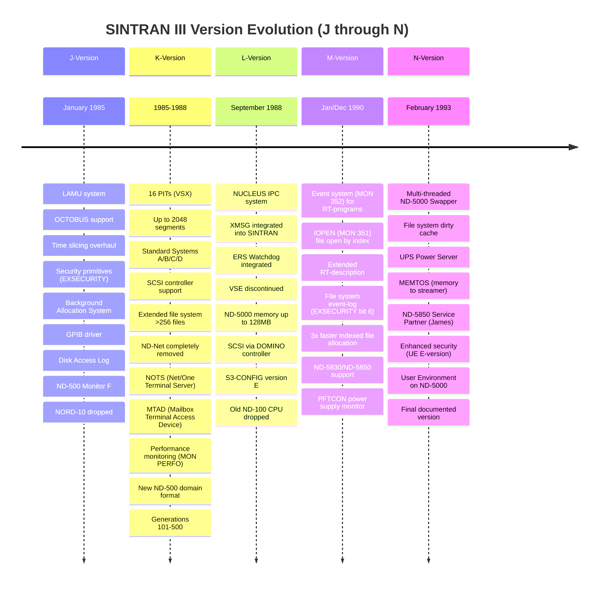
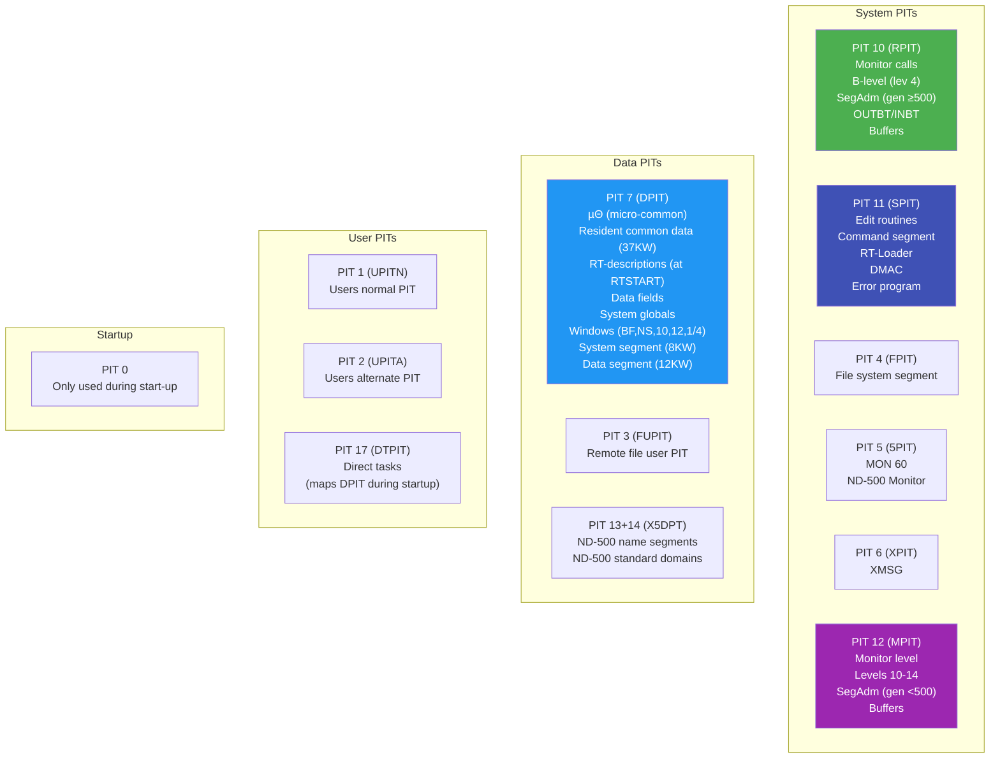

# SINTRAN III Release History: Versions J through N

**Comprehensive cross-version documentation compiled from Norsk Data release information manuals**

| Version | Document Number | Date | Pages |
|---------|----------------|------|-------|
| J | ND-60.230.01 | January 1985 | ~80 |
| K | ND-60230.5 EN (v5) | May 1988 | 284 |
| L | ND-860230.6 EN (v6) | September 1988 | 88 |
| M | ND-860230.7A EN | January 1990 (v7) / December 1990 (v7A) | 100 |
| N | ND-860230.8 EN | February 1993 (v8) | 60 |

**Source quality**: All documents are OCR'd from scanned originals. Known OCR issues are noted in [Appendix A: OCR Issues](#appendix-a-ocr-issues-and-document-quality).

---

## Table of Contents

1. [Version Timeline and Evolution](#1-version-timeline-and-evolution)
2. [What's New Per Version](#2-whats-new-per-version)
3. [Hardware Support Evolution](#3-hardware-support-evolution)
4. [Monitor Call Evolution (ND-100)](#4-monitor-call-evolution-nd-100)
5. [Command Evolution](#5-command-evolution)
6. [File System Evolution](#6-file-system-evolution)
7. [System Layout and Memory Architecture](#7-system-layout-and-memory-architecture)
8. [ND-500/5000 Evolution](#8-nd-5005000-evolution)
9. [Networking and Communication Evolution](#9-networking-and-communication-evolution)
10. [Security Evolution](#10-security-evolution)
11. [Subsystem Requirements Matrix](#11-subsystem-requirements-matrix)
12. [Configuration Program Evolution](#12-configuration-program-evolution)
13. [Appendix A: OCR Issues and Document Quality](#appendix-a-ocr-issues-and-document-quality)

---

## 1. Version Timeline and Evolution



### Version Lineage

Each version supersedes the previous:

| Version | Supersedes | Key Theme |
|---------|-----------|-----------|
| **J** | I-version | Foundation: LAMU, security, logging, OCTOBUS |
| **K** | J-version | Expansion: 16 PITs, SCSI, extended files, NOTS, MTAD, standard systems |
| **L** | K-version | Integration: NUCLEUS, XMSG/ERS built-in, VSE dropped, reliability |
| **M** | L-version | Enhancement: Event system, IOPEN, file system audit logging, 3x faster file I/O |
| **N** | M-version | Performance: multi-threaded swapper, dirty cache, UPS, security |

### K-Version Generations

The K-version uniquely spans multiple "generations" (sub-releases within a version):

| Generation | Availability | Key Additions |
|-----------|-------------|---------------|
| 101 | VSX | Initial K-version, Standard System A |
| 200 | VSE | VSE variant |
| 301 | VSX | Additional features, Standard System C replaces A |
| 312 | VSX | MTAD library, terminal data field enlarged (+128 words), Standard System D |
| 406 | VSX | ND-5000 support, ND-500 Monitor version I |
| 500 | VSX | ND-500 Monitor version J, new domain format, SegAdm moved to RPIT |

---

## 2. What's New Per Version

### 2.1 J-Version (January 1985)

**Theme**: Foundation release adding real-time facilities, security, and inter-CPU communication.

**Major New Features**:

1. **LAMU (Logical Address Mapping Unit)** -- Extends addressable memory for RT-programs beyond 3 segments. Size 1-128 pages, logical address range 100₈-277₈. Supports shared memory between CPUs.

2. **Time Slicing Overhaul** -- 8 time slice classes (0-7), with classes 0-5 used by system. New class 4 for ND-500 mode jobs, class 5 for file servers. Anti-jamming priority (67₈) introduced. Time slice unit = 240ms.

3. **Security Primitives (EXSECURITY)** -- 5-bit variable controlling: command-line hiding in TERMINAL-STATUS, background segment zeroing on logout, scratch file zeroing, file page zeroing, password-required login.

4. **OCTOBUS** -- Inter-CPU communication with shared memory. Functions: kick, wait-for-kick, activate-when-kicked, prepare-for-kick, send/read status, who-am-I. Logical device numbers 240₈-247₈, up to 4 units per CPU.

5. **Background Allocation System** -- Optional system (library mark 88ACS) for dynamic background process allocation. Allows more terminals/TADs than background processes.

6. **GPIB Driver** -- General Purpose Interface Bus driver, communicates through XMSG. Library marks 8GPI0-8GPI7.

7. **Disk Access Log** -- Optional facility logging all/selected disk accesses. Supports small (4-word) and big (8-word) records.

8. **Monitor Call Log, Swapping Log, CPU Activity Log** -- Three new optional logging facilities for system analysis.

9. **New Swapping Algorithm** -- SWPFLAG=3 default (was SWPFLAG=1 in I-version). Improved fairness.

10. **TAD/TADADM** -- Removed from COSMOS Basic Module and included in SINTRAN III.

11. **Spooling Reorganization** -- Moved to own segment, max processes increased from 15 to 30.

**Hardware Changes**:
- NORD-10 dropped (J-version requires ND-100)
- Dual floppy driver support (old + new simultaneously)

### 2.2 K-Version (1985-1988)

**Theme**: Major expansion of capabilities, hardware support, and system size.

**Major New Features**:

1. **16 Page Index Tables (PITs)** -- VSX now uses all 16 PITs, vastly expanding memory management capability.

2. **Up to 2048 Segments** -- Significant increase from J-version's limit.

3. **Standard Systems A/B/C/D** -- Predefined VSX configurations eliminating per-system SINTRAN generation for most installations.

4. **SCSI Controller Support** -- New hardware: magnetic disks (60MB-630MB), streamers (125MB), optical disks (1GB), magnetic tape.

5. **Extended File System** -- Support for >256 files per user (up to 4096) via object blocks. New directory entry structure (20→30₈ words).

6. **ND-Net Removal** -- Complete removal of the ND-Net subsystem. 8 commands removed.

7. **Net/One Terminal Server (NOTS)** -- Interfaces ND-100 to Net/One LAN. Up to 8 controllers x 32 lines each.

8. **MTAD (Mailbox Terminal Access Device)** -- Standard inter-process communication via shared memory mailboxes.

9. **Performance Monitoring (MON PERFO)** -- New subsystem with histogram-based performance measurement.

10. **S3-CONFIG** -- Screen-oriented configuration program replacing manual generation for many parameters.

11. **New ND-500 Domain Format** -- Single .DOM/.SEG files replace old triple-file format. Requires ND-Linker.

12. **Multi-CPU ND-500/5000** -- Separate execution queues per CPU (ND-500) or common queue (ND-5000).

13. **XMSG Versions K and L** -- Including COSMOS Routing Management (COSROUT).

14. **ERS/SINTRAN III Watchdog** -- Improved error reporting replacing RTERR for ND-500 errors.

15. **Remote File/Spooling** -- File operations across COSMOS network.

16. **Optical Disk Support** -- 1GB Laserdrive 1200, read-only SINTRAN directory access.

**Hardware Removed**: 10MB, 33MB, 66MB disks; HP magnetic tape drive.

### 2.3 L-Version (September 1988)

**Theme**: Integration and reliability. Key subsystems folded into SINTRAN III, VSE discontinued.

**Major New Features**:

1. **NUCLEUS Interprocess Communication** -- Complete new IPC subsystem for communication between ND-100, ND-500/5000, and DOMINO controllers via shared memory. 11 library calls. Time-critical calls microcoded on ND-5000.

2. **XMSG Integrated** -- No longer a separate product; installed automatically as part of SINTRAN III. 24 configurable parameters via S3-CONFIG.

3. **ERS/SINTRAN III Watchdog Integrated** -- No longer separate. Can run in parallel with FTX Error Logger. Suppresses repeated identical error messages (after 10).

4. **VSE Discontinued** -- Only VSX is supported from L-version onwards.

5. **ND-5000 Memory Limit: 128MB** -- Raised from 32MB.

6. **SCSI via DOMINO Controller** -- ND-5000 handles disk I/O directly, reducing ND-100 bottleneck.

7. **S3-CONFIG Version E** -- Complete screen-oriented configuration with 7 selection menus (BACKGROUND, IO-COMM, LAMU, SCSI, XMSG, NUCLEUS, VARIOUS).

8. **Better Error Reporting** -- File system error messages on terminal/error device; automatic ND-5000 error messages.

9. **MEMTOF** -- Memory-to-floppy dump now part of SINTRAN III.

10. **Modular NEW-SYSTEM** -- Can run individual installation tasks via `@NEW-SYSTEM @`.

11. **RWSEG (MON 350)** -- Read or write a location on a segment or in physical memory. Restricted to user SYSTEM. Useful for debugging.

12. **Logout-on-Missing-Carrier Always Enabled** -- No longer configurable; always active. Removes a potential security gap.

13. **Spooling Queue Size Reduced** -- Max reduced to 6 pages (default 4).

14. **@DEVICE-FUNCTION** -- New RESERVE-DEVICE and RELEASE-DEVICE functions for dual ND-100 systems sharing a SCSI bus.

15. **LAMU in Multiport Memory** -- *CREATE-SYSTEM-LAMU and *PAGES-TO-LAMU now support placing LAMUs in multiport memory (address = -1), making them accessible from ND-500/5000.

**Hardware Changes**:
- Old ND-100 CPU (non-CX) dropped -- requires ND-100/CX, ND-110, ND-110/CX, or ND-120/CX
- SCSI optical disk units (up to 2) and SCSI magnetic tape units (up to 3) supported
- ND-110/CX and ND-120/CX CPUs now recognized by CPUST

**ND-500/5000 Changes**:
- RESTART-PROCESS command reintroduced (was removed in J-version)
- LOOK-AT-RESIDENT-MEMORY now supports addresses above 32MB (up to 128MB)
- SMTRANS MON 515: new cache-related subfunctions (6 = read w/o clearing cache, 7 = write w/o dump dirty)

### 2.4 M-Version (January 1990 / December 1990)

**Theme**: Enhancement of RT-program capabilities, file system performance and security auditing, new ND-5000 hardware.

**Major New Features**:

1. **Event System for RT-Programs** -- 32-bit event masks per process. New monitor call: EVENT (MON 352) with 6 functions: check implementation, set events, read events, wait for events (with timeout), connect events to SINTRAN functions, interval events. Events kept in extended RT-description.

2. **IOPEN (MON 351)** -- Open files by directory/user/file object indexes, with cross-validation against file names. Supports OPEN, SCROP, and DOPEN access modes.

3. **Extended RT-Description** -- 26₈-word extension in a separate physical memory bank (variable `XRTBA` in DPIT). Contains event buffers, interval timers, ND-500/5000 CPU time accumulation, DMA error code.

4. **ND-5830 and ND-5850 Support** -- New ND-5000 system types. Requires ND-500/5000 Background Monitor version K and Swapper version L. Microprogram 12009.

5. **File System Event-Log Utility** -- Security audit logging for file operations (login, logout, open, create, delete, rename, password changes). Controlled by EXSECURITY bit 6. Routed through ERS/SINTRAN III Watchdog.

6. **Indexed File Page Allocation ~3x Faster** -- Significant performance improvement for file operations.

7. **Doubled Disk Cache Maximum** -- Device buffers increased from 64 to 128.

8. **PFTCON (Power Supply Controller Server)** -- Monitors and controls power supplies.

9. **BOPCOM Server** -- New system server.

10. **Processor Manager Server** -- New server for multi-processor management.

11. **Enhanced Terminal Data Fields** -- New fields for physical page, logical address within bank, extended output control.

12. **@EXPAND-DIRECTORY Command** -- Expand SCSI/DOMINO directories or reposition bit-file. SYSTEM users only.

13. **@DUMP-DATA-FIELD Command** -- Dumps non-DPIT part of terminal/TAD/MTAD/NOTS data fields.

14. **PLACE (MON 441)** -- New ND-500/5000 only monitor call to place a program or data segment.

**Configuration Changes**:
- Device buffers: 64 → 128 (doubled disk cache)
- Reentrant-subsystem table: increased to 400 entries (max 100 ND-500/5000 standard domains)
- Total reentrant name length: increased to 4096 characters
- Command buffer: 104 → 150 characters
- BDIO pools: increased to 64 (generation 6)
- ND-500/5000 128 MB memory now applies to ALL ND-500/5000 systems (not just ND-5000)
- Standard System C revised with 230 free RT-descriptions (was 180)
- ND-500/5000 System Package version C with Background Monitor K, Swapper L, Place-Library C

### 2.5 N-Version (February 1993)

**Theme**: Final documented release (February 1993, copyright Comma Data Service AS -- successor to Norsk Data documentation). Performance, larger configurations, improved security.

**Major New Features**:

1. **Multi-Threaded ND-5000 Swapper (version M)** -- 9 general threads + 1 cleanup thread. Three calls made multi-thread: PageFault, Flush (WSEG), statistics. Asynchronous I/O (page allocation, disk transfers for SINTRAN and DOMINO disks). New 0.5 MB CopyExclusive disk cache. Larger Flush and FileIndex buffers. Cannot run on ND-500 systems (ND-5000 only). Memory usage: ~852 pages (up from ~490 in L04).

2. **File System Dirty Cache (Delayed Write)** -- Most significant file system change. Buffers written to disk on: LRU reuse, 60-second idle timeout, @RESTART-SYSTEM/@STOP-SYSTEM/@COLD-START, @RELEASE-DIRECTORY, user management commands. Controllable via `*CHANGE-VARIABLE DELWR` (1=enable, 0=disable).

3. **UPS Power Server** -- Communicates with UPS unit via Octobus. Detects power failure lasting >10 seconds and runs `(SYSTEM)SHUT-POWERFAIL:MODE` for controlled shutdown. PS-MONITOR program available on ND-5000.

4. **MEMTOS (Memory to Streamer)** -- Replaces MEMTOF. Supports dumping first 32 MB of memory to streamer cartridge (SCSI ID 1, adaptor 1).

5. **ND-5850 Service Partner ("James")** -- Dedicated service processor with its own error codes (7006₈-7077₈).

6. **MT Server (MTSERV)** -- NUCLEUS-based MTAD server integrated as standard RT-program.

7. **Enhanced Security (User Environment E-version)** -- Old password required when changing password, prevent reuse of recent passwords, system-generated passwords option, minimum time between changes, IP address access control and logging, remote system ID logging, all UE errors to Watchdog.

8. **User Environment Moved to ND-5000** -- Server and login program now run on ND-5000 part, reducing ND-100 load.

9. **File System Event Logging** -- New events: CREATE-FRIEND, DELETE-FRIEND, SET-FRIEND-ACCESS. Mandatory logging for DISABLE/ENABLE-ERROR/EVENT/LOG.

10. **Updated Subsystem Requirements** -- Many companion products require newer versions (see [Section 11](#11-subsystem-requirements-matrix)).

**Standard Systems Revised** (N vs M):

| Parameter | A (N) | A (M) | B (N) | B (M) | C (N) | C (M) |
|-----------|-------|-------|-------|-------|-------|-------|
| Terminals | 135 | 135 | 155 | 125 | 175 | 172 |
| Background tasks | 172 | 159 | 125 | 120 | 205 | 200 |
| Segments | 600 | 500 | 750 | 750 | 620 | 500 |
| Free RT-descriptions | 200 | 180 | 148 | 150 | 230 | 230 |
| ND-500/5000 processes | 150 | 134 | 135 | 128 | 200 | 190 |
| Device buffers | -- | 128 | -- | 125 | -- | 128 |
| BDIO pool data fields | 32 | 16 | 16 | 16 | 40 | 40 |
| SCSI disk units | 8 | 8 | 8 | 8 | 14 | 2 |
| Symbolic Debugger tasks | 12 | 32 | 8 | -- | 15 | 32 |

**N-version generation**: Generation 1, requires patch file revision 1000+.

---

## 3. Hardware Support Evolution

### 3.1 CPU Requirements

| CPU | J | K | L | M | N |
|-----|---|---|---|---|---|
| NORD-10 | Last version (H) | -- | -- | -- | -- |
| ND-100 (plain) | VSE only | VSE only | Dropped | -- | -- |
| ND-100/CX | VSX (ECO 100-522/523) | VSX (same) | Required (same) | Required | Required |
| ND-110 | Supported | Supported | Level R required | Yes | Yes |
| ND-110/CX | -- | Supported | Level H required | Yes | Yes |
| ND-120/CX | -- | Supported | Level G required | Yes | Yes |
| Memory Mgmt II | ECO 100-534 | ECO 100-534 | ECO 100-534 (level N) | Same | Same |

### 3.2 SINTRAN III Variants

| Variant | J | K | L | M | N |
|---------|---|---|---|---|---|
| VSE (basic) | Yes | Yes | **Discontinued** | -- | -- |
| VSX (extended) | Yes | Yes | Yes (only) | Yes | Yes |
| VSX-500 | Yes | Yes | Yes | Yes | Yes |

### 3.3 Disk Hardware

| Disk Type | J | K | L | M | N |
|-----------|---|---|---|---|---|
| 10MB | Yes | **Removed** | -- | -- | -- |
| 33MB | Yes | **Removed** | -- | -- | -- |
| 66MB | Yes | **Removed** | -- | -- | -- |
| 28MB (ND-110) | -- | New | Yes | Yes | Yes |
| 74MB (ND-110) | -- | New | Yes | Yes | Yes |
| 288MB EMD | -- | New | Yes | Yes | Yes |
| 288MB NEC | -- | New | Yes | Yes | Yes |
| 450MB NEC | -- | New | Yes | Yes | Yes |
| SCSI 60-630MB | -- | New | Yes | Yes | Yes |
| SCSI optical 1GB | -- | New | Yes | Yes | Yes |
| SCSI via DOMINO | -- | -- | New | Yes | Yes |

### 3.4 Tape/Streamer Hardware

| Device | J | K | L | M | N |
|--------|---|---|---|---|---|
| HP magnetic tape | Yes | **Removed** | -- | -- | -- |
| Pertec magnetic tape | Yes | Yes | Yes | Yes | Yes |
| STC magnetic tape | Yes | Yes | Yes | Yes | Yes |
| SCSI streamer 125MB | -- | New | Yes | Yes | Yes |
| SCSI magnetic tape | -- | -- | New (up to 3) | Yes | Yes |

**SCSI System Limits** (K-version onwards):

| Resource | Maximum |
|----------|---------|
| SCSI host adaptors | 4 |
| SCSI magnetic disks | 14 |
| SCSI optical disk drives | 4 |
| SCSI streamer drives | 2 |
| SCSI magnetic tape drives | 4 |

**SCSI ID Assignments**: System disk must be adaptor 1 ID 0. Streamer must be adaptor 1 ID 1. Magnetic tape must be adaptor 1 ID 2. SCSI adaptor is always ID 7 on its bus.

### 3.5 ND-500/5000 Systems

| System | CPUs | J | K | L | M | N |
|--------|------|---|---|---|---|---|
| ND-530 | 1 | Yes | Yes | Yes | Yes | Yes |
| ND-550/560/570 | 1-2 | Yes | Yes | Yes | Yes | Yes |
| ND-580 | 4 | Yes | Yes | Yes | Yes | Yes |
| ND-5200 | 1 | -- | New | Yes | Yes | Yes |
| ND-5400 | 2 | -- | New | Yes | Yes | Yes |
| ND-5500 | 1 | -- | New | Yes | Yes | Yes |
| ND-5700 | 2 | -- | New | Yes | Yes | Yes |
| ND-5800 | 4 | -- | New | Yes | Yes | Yes |
| ND-5830 | ? | -- | -- | -- | New | Yes |
| ND-5850 | ? | -- | -- | -- | New | Yes |

### 3.6 ND-500/5000 Memory Limit

| Version | J | K | L | M-N |
|---------|---|---|---|-----|
| Max memory | 32MB | 32MB | **128MB** (ND-5000 only) | **128MB** (all ND-500/5000) |

---

## 4. Monitor Call Evolution (ND-100)

### 4.1 New Monitor Calls by Version

| MON # | Mnemonic | Version | Description |
|-------|----------|---------|-------------|
| MON 327 | FSMTY | J | File system multifunction call |
| MON 330 | TERST | J | Get terminal status information |
| MON 332 | TREPP | J | Terminal line report and program termination control |
| MON 333 | UDMA | J | Universal DMA interface transfer |
| MON 334 | GETXM | J | Get error-message text for file system error code |
| MON 335 | EXABS | J | Execute MON ABSTR from programs on PI 1/2/3 |
| MON 336 | IOMTY | J | I/O multifunction call for terminal attributes |
| MON 337 | SPCHG | J | Segment and Page table change (MCALL/MEXIT extension) |
| MON 340 | RSREC | K | Read System Record |
| MON 341 | SGMTY | K | Segment Multifunction (replaces MCALL/MEXIT) |
| MON 342 | ADP | K | ADP software LAMU handling (internal) |
| MON 343 | CONFG | K | Configuration parameter read/change (50+ params) |
| MON 344 | PERFO | K | Performance monitoring with histogram primitives |
| MON 345 | MTAD | K | Mailbox Terminal Access Device operations |
| MON 347 | NUCL | L | Interface to NUCLEUS system |
| MON 350 | RWSEG | L | Read/write segment or physical memory location |
| MON 351 | IOPEN | M | Open file by directory/user/object indexes |
| MON 352 | EVENT | M | Event system (6 functions: check, set, read, wait, connect, interval) |
| MON 441 | PLACE | M | Place program/data segment (ND-500/5000 only) |

### 4.2 Modified Monitor Calls by Version

| MON # | Mnemonic | J | K | L | M | N |
|-------|----------|---|---|---|---|---|
| MON 4 | BRKM | Functions 10₈, 11₈ added | | | | |
| MON 20 | WCI | | Modified | | | |
| MON 52 | TERMO | | | Logout-on-carrier always on | | |
| MON 61 | FIXC5 | Functions 7, 10₈ added | | | | |
| MON 114 | TUSED | | Modified | | | |
| MON 131 | ABSTR | STC magtape funcs 50,51 | SCSI streamer ext. | Func 46₈: tape type | | SCSI tape |
| MON 144 | MAGTP | | Modified | | | |
| MON 157 | ENTSG | | Modified | | | |
| MON 164 | WSEG | | | Bit 17₈: clear page link | | |
| MON 205 | DEBUG | | Modified | | | |
| MON 240 | APSPF | | Remote file support | | | |
| MON 256 | DEABF | | Modified | | | |
| MON 262 | CPUST | | Modified | ND-110/CX, ND-120/CX | | |
| MON 263 | GDEVT | | Modified | | | |
| MON 315 | MLAMU | Funcs 7,8 added | Modified | Func 13₈: cache control | | |
| MON 327 | FSMTY | | Modified | 5 new functions (5-12₈) | | |
| MON 333 | UDMA | | Modified | | | |
| MON 336 | IOMTY | | Major rewrite (SCSI, NOTS) | | | |
| MON 342 | ADP | | | Func 15₈: get ADP seg# | | |
| MON 12 | SETCM | | | | Cmd buffer 104→150 chars | |
| MON 60 | N500M | | | | Func 174₈: LOIMM (5830/5850) | |
| MON 70 | COMND | | | | Cmd buffer 104→150 chars | |
| MON 240 | APSPF | | | | Msg max 128→80 chars | |
| MON 317 | UECOM | | | | Cmd buffer 104→150 chars | |
| MON 327 | FSMTY | | | | Funcs 13₈, 14₈ added | |
| MON 330 | TERST | | | | CPU time = ND-100 + ND-500 | |
| MON 336 | IOMTY | | | | Func 26₈: MTAD protocol/ID | Func 27₈: get IP/TAD info |
| MON 343 | CONFG | | | Params 51-55₈ added | | Param 52 subparam 10₈ |
| MON 410 | FIXMEM | | | | Types 3,4,5: above 32MB | |
| MON 440 | AttachSeg | | | Map ND-500 seg to shared mem | | |
| MON 515 | SMTRANS | | | Subfuncs 6,7: cache ops | Disk transfer + event flag | |
| MON 43 | CLOSE | | | | | Reports RT-close to Watchdog |

---

## 5. Command Evolution

### 5.1 Commands Renamed (J-version)

| Old Name | New Name |
|----------|----------|
| LIST-OPENEO-FILES | LIST-OPEN-FILES |
| LIST-RTOPENED-FILES | LIST-RTOPEN-FILES |
| SET-PERMANENT-OPENEO | SET-PERMANENT-OPEN |

(Note: "OPENEO" in old names is likely OCR corruption of "OPENED")

### 5.2 Commands Removed by Version

| Command | Removed In | Notes |
|---------|-----------|-------|
| @COMMUNICATIONS-LINE-STATUS | K | ND-Net |
| @COMMUNICATIONS-STATUS | K | ND-Net |
| @LOCAL | K | ND-Net |
| @REMOTE | K | ND-Net |
| @REMOTE-LOAD | K | ND-Net |
| @REMOTE-PASSWORD | K | ND-Net |
| @START-COMMUNICATION | K | ND-Net |
| @STOP-COMMUNICATION | K | ND-Net |
| @CHANGE-BACKGROUND-SEGMENT-SIZE | L | |
| @INITIALIZE-ERROR-LOG | L | Replaced by ERS Watchdog |
| @PRINT-ERROR-LOG | L | Replaced by ERS Watchdog |
| @COPY-DIRECTORY | M | Use MULTI-USER-COPY in Backup System |

**Service Program Commands Removed**:

| Command | Removed In | Notes |
|---------|-----------|-------|
| *DEFINE-USER-MONITOR-CALL | K | VSX only |
| *SET-CHANNEL-PRIORITY | K | |
| *LIST-ADDRESSES | K | |

### 5.3 New Commands by Version

| Command | Version | Description |
|---------|---------|-------------|
| @UE-AUTOMATIC-LOGIN | J | Enable/disable User Environment auto-login per terminal |
| @CLEAR-BATCH-QUEUE | J | Delete all entries in batch queue |
| @DEFINE-SPOOLING-FILE-MESSAGE | J | Text printed when spooling queue emptied |
| @DEFINE-MASS-STORAGE-UNIT | K | Explicitly define mass storage unit |
| @DELETE-MASS-STORAGE-UNIT | K | Remove mass storage unit definition |
| @GIVE-OBJECT-BLOCKS | K | Allocate object blocks for >256 files |
| @LIST-MASS-STORAGE-UNITS | K | List defined mass storage units |
| @SET-INITIAL-FILE-ACCESS | K | Set default file access for new files |
| @SET-INITIAL-FRIEND-ACCESS | K | Set default friend access |
| @SET-MASS-STORAGE-SIZE | K | Set directory size for SCSI disks |
| @TAKE-OBJECT-BLOCKS | K | Remove object blocks from user |
| @UNLOCK-DIRECTORY | K | Unlock a locked directory |
| @AUTOMATIC-ND5000-ERROR-MESSAGES | L | Detailed ND-500/5000 error output |
| @FILE-SYSTEM-ERROR-MESSAGES | L | Detailed file system error output |
| @LIST-ALL-OPEN-FILES | L | List open files with user/terminal info |
| @LIST-SERVERS | L | List system-included servers |
| @SET-DIRECTORY-AVAILABLE | L | Make directory available |
| @SET-DIRECTORY-UNAVAILABLE | L | Make directory unavailable |
| @START-SERVERS | L | Start all passive system servers |
| @EXPAND-DIRECTORY | M | Expand SCSI/DOMINO directory or reposition bit-file |
| @LIST-RT-DESCRIPTION | M | Display RT-description contents |
| @DUMP-DATA-FIELD | M | Dump non-DPIT terminal/TAD/MTAD/NOTS data |

**Notable K-version command modifications** (28 commands modified total): @LOOK-AT (RESIDENT/IMAGE modes removed, COMMON-CODE added), @RENAME-FILE (open files can no longer be renamed), @LIST-EXECUTION-QUEUE and @LIST-TIME-QUEUE (now sorted), @LIST-TITLE (includes generation info), many commands gained UNIT parameter requirement (@CHANGE-DIRECTORY-ENTRY, @COPY-DEVICE, @CREATE-DIRECTORY, @ENTER-DIRECTORY, etc.), many gained remote file support (@COPY, @COPY-FILE, @LIST-FILES, @FILE-STATISTICS, all spooling commands).

**Notable M-version command modifications**: 14 commands gained `<output file>` parameter (@LIST-BATCH-PROCESS, @LIST-BATCH-QUEUE, @LIST-DEVICE, @LIST-EXECUTION-QUEUE, @LIST-REENTRANT, @LIST-REMOTE-QUEUE, @LIST-RT-ACCOUNT, @LIST-RT-DESCRIPTION, @LIST-SEGMENT, @LIST-SPOOLING-FORM, @LIST-TIME-QUEUE, @TERMINAL-STATUS, @WHO-IS-ON, @LIST-BATCH-PROCESS). @ENTER max time is now combined ND-100 + ND-500/5000 CPU time. @RECOVER now searches :DOM before :PROG.

**Note**: N-version modifies 9 existing commands but adds no new SINTRAN III commands. Modified: @CHANGE-DIRECTORY-ENTRY, @INITIAL-COMMAND, @LIST-INITIAL-COMMANDS, @LOOK-AT (now shows ASCII), @NEXT-INITIAL-COMMAND, @RTCLOSE-FILE, @SET-ERROR-DEVICE, @WHO-IS-ON (shows connection type: IP/TAD/NOTS/Batch/MTAD), @ (RECOVER -- now searches :MODE files).

### 5.4 SINTRAN-Service-Program Commands Added

| Command | Version | Description |
|---------|---------|-------------|
| *LIST-TIME-SLICE-CLASS | J | List time slice class config |
| *LIST-TIME-SLICE-PARAMETERS | J | List current time slice params |
| *LIST-TIME-SLICED-PROGRAMS | J | List time-sliced programs |
| *DEFINE-HDLC-BUFFER | J | Allocate HDLC buffer |
| *START-GPIB / *STOP-GPIB | J | GPIB controller control |
| *CHANGE-TABLE | J | Operate on 4 system tables |
| *MONCALL-LOG | J | Monitor call frequency logging |
| *SWAPPING-LOG | J | Swapping/pagefault logging |
| *CPU-LOG | J | CPU activity percentage |
| *FIND-CPULOOPTIME | J | Calibrate CPULOOPTIME |
| *DISC-ACCESS-LOG | J | Full disk access logging |
| *PAGES-TO-LAMU | J | Create LAMU from physical pages |
| *PAGES-FROM-LAMU | J | Return pages from LAMU |
| *CREATE-LAMU / *DELETE-LAMU | J | Create/delete a LAMU |
| *PROTECT-LAMU | J | Set LAMU ring/protection |
| *LAMU-INFORMATION | J | List LAMU info |
| *SET-LAMU-CONSTANTS | J | Set max LAMUs |
| *CREATE-SYSTEM-LAMU | K | Create system-level LAMU |
| *INSERT-PROGRAM-IN-TIME-SLICE | K | Add program to time slice |
| *REMOVE-PROGRAM-FROM-TIME-SLICE | K | Remove from time slice |
| *LIST-USER-RESTART-PROGRAMS | K | List user restart programs |
| *NEXT-USER-RESTART-PROGRAM | K | Cycle to next user restart program |
| *REINSERT-SINTRAN-COMMAND | K | Reinsert a SINTRAN command |
| *LAMU-CONNECTIONS | L | List RT-programs connected to LAMU |
| *DUMP-DATAFIELD | M | Dump terminal/TAD/MTAD/NOTS data field (non-DPIT part) |
| *FILE-SYSTEM-EVENT-LOG | M | Security event logging utility (enable/disable events, list, errors) |
| *LIST-COLDSTART-MODE-FILE | N | Lists cold start directory/mode/output file params |
| *LIST-DEFAULT-ERROR-DEVICE | N | Lists default error device number |
| *LIST-VARIABLES | N | Lists all *CHANGE-VARIABLE variables |
| *SET-DEFAULT-ERROR-DEVICE | N | Sets default error device number |

---

## 6. File System Evolution

### 6.1 Feature Comparison

| Feature | J | K | L | M | N |
|---------|---|---|---|---|---|
| Max files per user | 256 | **4096** (object blocks) | 4096 | 4096 | 4096 |
| Directory entry size | 20₈ words | **30₈ words** | 30₈ | 30₈ | 30₈ |
| File index bits | 8 | **12** | 12 | 12 | 12 |
| Default public access | NONE | NONE | NONE | NONE | NONE |
| Default friend access | RWACO | RWACO | RWACO | RWACO | RWACO |
| Default own access | RWACD | RWACD | RWACD | RWACD | RWACD |
| Remote file operations | No | **Yes** (COSMOS) | Yes | Yes | Yes |
| Directory availability control | No | No | **Yes** | Yes | Yes |
| List all open files | No | No | **Yes** | Yes | Yes |
| File system error messages | No | No | **Yes** | Yes | Yes |

### 6.2 Key File System Changes

**J-Version**:
- Default file access changed: public=NONE, friend=RWACO, own=RWACD
- Scratch files can have no public/friend access
- FSMTY (MON 327) added: force write index blocks to disk

**K-Version**:
- Extended file system: >256 files per user via object blocks
- Object file sub-index block structure (**NOT backward compatible** with J-version -- directories with >256 files cannot be used on J or earlier)
- Extended directory entry: 20₈ → 30₈ words (adds system number, extended metadata)
- Mass storage unit management commands
- Remote file operations across COSMOS
- @RENAME-FILE: open files can no longer be renamed
- @UNLOCK-DIRECTORY: new command for locked directory recovery

**L-Version**:
- Directory availability control (@SET-DIRECTORY-AVAILABLE/UNAVAILABLE)
- @LIST-ALL-OPEN-FILES with user/terminal info
- @FILE-SYSTEM-ERROR-MESSAGES for detailed error output
- FSMTY functions 6-12₈ added
- @COPY now opens source file before destination (protects destination if source fails)
- Spooling queue max reduced to 6 pages (default 4)

**M-Version**:
- Indexed file page allocation ~3x faster
- Disk cache doubled (device buffers 64 → 128)
- @EXPAND-DIRECTORY for SCSI/DOMINO directories
- IOPEN (MON 351): open files by directory/user/object index
- FSMTY functions 13₈ (reset modified bit), 14₈ (get next page in sparse file)
- File system event-log utility (EXSECURITY bit 6)

**N-Version**:
- Dirty cache (delayed write) -- most significant file system change
- Buffers written on: LRU reuse, 60-second timeout, system commands, @RELEASE-DIRECTORY
- Controllable via `*CHANGE-VARIABLE DELWR` (1=enable, 0=disable)

---

## 7. System Layout and Memory Architecture

### 7.1 Physical Memory Layout (VSX, K-version onwards)

```
Physical Address    Contents                         Size
────────────────────────────────────────────────────────────
0                   Common code                       11KW
~12₈               Restart routines (POF code)        <6KW
                    Register blocks + bitmaps          >10KW
~30₈ (phys 60000₈) Resident data (DPIT mapped here)   37KW
                    End of bank 1
────────────────────────────────────────────────────────────
Bank boundaries     Buffer areas*                      variable
                    RPIT                               <53KW
                    Buffer areas*                      variable
                    MPIT                               <52KW
                    Buffer areas*                      variable
                    Segment table (SEGTBANK)           <64KW
                    Buffer areas*                      variable
                    Memory map (CORMBANK)              <64KW
                    Buffer areas*                      variable

*Buffer areas: big terminal data fields, non-PIT data
```

**Key physical-to-logical mapping**: DPIT logical address 4000₈ starts at physical address 60000₈. All resident pages are mapped physical page = logical page.

**CPU-held variables** (ND-110/CX and ND-120/CX):
- `CORMBANK` -- Bank number of memory map
- `SEGTBANK` -- Bank number of segment table
- `SEGISTART` -- Displacement of segment table within bank

### 7.2 Page Index Table Layout (VSX, 16 PITs)



### 7.3 DPIT (PIT 7) Detailed Layout

The Data PIT contains the resident common data. This is the most complex PIT:

| Logical Pages | Contents | Notes |
|---|---|---|
| 0-1₈ | Micro-common (µΘ) | Parameter fetching, user data area operations. Also present in RPIT/MPIT etc. |
| 2-12₈ | Common code | Shared across all PITs, max 11KW |
| 4000₈ onwards | **Resident common data** (~37KW): | Starts at physical 60000₈ |
| | RT-description table (at `RTSTART`) | 26₈ words per entry (K-version) |
| | Data fields (common part) | Terminal, TAD, NOTS, MTAD |
| | System global variables | Configuration, state |
| | `CNVRT` array | Pointers to logical device table |
| ~57₈ | Window pages: wind.BF | Background segment |
| | wind.NS | ND-500 |
| | wind.10 | Level 10 |
| | wind.12 | Level 12 |
| | wind.1/4 | Level 1/4 |
| ~62₈ | System segment window | ~8KW |
| ~72₈ | Data segment | ~12KW |

**DPIT segment (S3DPIT, segment 23)**: Address range 4000₈:135777₈ (L-version: 4000₈:131777₈).

**Extended RT-description** (M-version+): Located in a separate physical bank (`XRTBA` variable in DPIT). Same relative offset as `RTSTART`. Contains event buffers, interval timers, CPU time accounting.

### 7.4 Non-PIT Data

The following structures exist in physical memory but are NOT mapped through any PIT:

| Data Structure | Notes |
|---|---|
| Segment table | Own bank (`SEGTBANK`), displacement `SEGISTART` |
| Memory map | Own bank (`CORMBANK`), 4 words per physical page |
| RT register blocks and bitmaps | |
| "Big" terminal/TAD data fields | Split data fields (5SPLTDF bit in TYPRING) |
| ND-500 mailboxes | |
| Logical device number tables | Bank `LOGDBANK`, addresses in `CNVRT` array |
| ND-500 communication buffers | For MON 60 |
| Extended RT-descriptions | Bank `XRTBA` (M-version+) |

### 7.5 Data Structures

#### RT-Description (26₈ words, in DPIT)

| Offset₈ | Field | Description |
|---------|-------|-------------|
| 0 | TLINK | Time queue link |
| 1 | STATUS | Status bits (see below) |
| 2 | INPRITY | Initial program priority |
| 3 | PRITY | Current program priority |
| 4-5 | DTIM1/2 | Start time (double word) |
| 6-7 | DTIN1/2 | Interval (double word) |
| 10 | STADR | Start address |
| 11-12 | SEGM1/2 | Initial segments |
| 13 | WLINK | Waiting/execution queue link |
| 14-15 | ACT1SEG/ACT2SEG | Actual segments |
| 16 | INIPRI | Initial page tables and ring |
| 17 | ACTPRI | Actual page tables and ring |
| 20 | BRESLINK | Beginning of reservation link |
| 21 | RSEGM | Reentrant segment |
| 22 | BUFWINDOW | Buffer window |
| 23 | TRMWINDOW | Terminal window, RT working field window |
| 24 | N5WINDOW | ND-500 mailbox window |
| 25 | RTDLGADDR | Logical address of register block |

**STATUS word bits**:

| Bit | Flag | Meaning |
|-----|------|---------|
| 0 | 5WAIT | I/O wait |
| 1 | 5REP | Repeat execution |
| 2 | 5RWAIT | RTWT or HOLD used |
| 3 | 5INT | INTV used |
| 4 | 5ABS | ABSET used |
| 5 | 5TMOUT | TMOUT used |
| 6 | 5RTOFF | Start inhibited |
| 7 | 5SWWAIT | In swapping queue |
| 10₈ | 5NOABORT | Delayed abort |
| 11₈ | 5XMSY | XMSG set 5WAIT |
| 12₈ | 5PPRF | Time slicer flag |
| 13₈ | 5BRKF | Time slicer flag |
| 14₈ | 5ESCF | Time slicer flag |
| 15₈ | 5TLSLICED | Time sliced program |
| 16₈ | 5USED | RT-description in use |
| 17₈ | 5BACKGR | Background program |

**INIPRI / ACTPRI format**:

```
Bit 17-14: Normal PIT number (4 bits)
Bit 13-10: Alternative PIT number (4 bits)
Bit  9- 4: Level (always = 1)
Bit  3- 0: Ring
```

#### Extended RT-Description (M-version+, 26₈ words, in bank XRTBA)

| Offset₈ | Field | Description |
|---------|-------|-------------|
| 0 | EXSTS | Extra status (event system flags) |
| 1-2 | EV1SET/EV2SET | Events currently set (32-bit) |
| 3-4 | EV1WAIT/EV2WAIT | Events waited for (32-bit) |
| 5-6 | EV1TMOUT/EV2TMOUT | Timeout events (32-bit) |
| 7-10 | EV1INTV/EV2INTV | Interval events (32-bit) |
| 11-12 | IN1TRV/IN2TRV | Interval period (double word) |
| 13-14 | NX1INT/NX2INT | Next interval time (double word) |
| 15-16 | EV1OEV/EV2OEV | Other events (32-bit) |
| 17-20 | -- | Reserved |
| 21 | XRTLINK | Link in process start queue |
| 22 | INTQL | Link in interval event queue |
| 23-24 | CPU5X/CPU5Y | Accumulated ND-500/5000 CPU time |
| 25 | XCERR | DMA error code |

#### Memory Map Element (4 words)

| Offset | Field | Description |
|--------|-------|-------------|
| 0 | PAGLINK | Next page in page link (0 = end) |
| 1 | PREVIOUS | Previous page (lower 2 bits: if non-zero, first element; upper 14 bits = segment number) |
| 2 | PROTECT | Protection and status word |
| 3 | LOGPAGE | Logical page number |

Physical page × 4 = displacement into memory map.

#### Segment Table Entry (8 words)

| Offset | Field | Description |
|--------|-------|-------------|
| 0 | SEGLINK | Link through active segments |
| 1 | PRESEG | Previous segment in link |
| 2 | LOGADR | First logical page |
| 3 | SEGLENGTH | Length in pages |
| 4 | MADR | Address within segment file |
| 5 | FLAG | Flags (OK, not-built, system, protected, reentrant, fixed, demand) |
| 6 | SGSTATUS | Status and protect word |
| 7 | BPAGLINK | Pointer to page list |

#### Data Field Common Part (in DPIT)

| Offset | Field | Description |
|--------|-------|-------------|
| 0 | RESLINK | Reservation link |
| 1 | RTRES | Reserving RT-program |
| 2 | BWLINK | Beginning of waiting queue |
| 3 | TYPRING | Device type and ring (see TYPRING format) |

Data fields have this common part in DPIT. Some device-dependent parts are split to elsewhere in physical memory (indicated by 5SPLTDF bit 13₈ in TYPRING).

**Terminal data field DPIT part** (M-version, with negative offsets):

| Offset | Field | Description |
|--------|-------|-------------|
| -4 | TDFPHPAGE | Physical page of data field |
| -3 | TDFLGADDR | Address within bank of data fields |
| -2 | STDRIV | Driver start address |
| -1 | DRIVER | Driver interrupt restart address |
| 0 | RESLINK | Reservation link |
| 1 | RTRES | Reserving RT-program |
| 2 | BWLINK | Beginning of waiting queue |
| 3 | TYPRING | Device-type bits and ring |
| 4 | ISTATE | 0=active, 1=I/O-wait, 2=buffer wait, -1/-2=nowait |
| 5 | MLINK | Monitor queue link |
| 6 | MFUNC | Monitor level function address |

### 7.6 System Segments Evolution

System-included segments grew from 43 (J-version) to 127₈ (N-version):

| Segment₈ | Name | J | K | L | M | N | Description |
|----------|------|---|---|---|---|---|-------------|
| 2 | S3IMAGE | Y | Y | Y | Y | Y | Memory image & POF |
| 3 | S3CP/S3COM | Y | Y | Y | Y | Y | Command segment |
| 4 | S3RTL | Y | Y | Y | Y | Y | RT-Loader |
| 5 | S3ERRS | Y | Y | Y | Y | Y | Error program system segment |
| 6 | S3FS | Y | Y | Y | Y | Y | File system segment |
| 7 | S3DMAC | Y | Y | Y | Y | Y | DMAC segment |
| 10 | S3RTFIL | Y | Y | Y | Y | Y | RTFIL segment |
| 20 | S3DT5 | Y | Y | Y | Y | Y | ND-500 standard domain table |
| 21 | S3NMS5 | Y | Y | Y | Y | Y | ND-500 name segment |
| 23 | S3DPIT | - | Y | Y | Y | Y | DPIT segment |
| 30 | S3SM5 | Y | Y | Y | Y | Y | ND-500 System Monitor |
| 76 | S3XMK | - | - | Y | Y | Y | XMSG kernel |
| 77 | S3XROU | - | - | Y | Y | Y | XMSG XROUT segment |
| 104-105 | NKSERV | - | - | Y | Y | Y | NUCLEUS server |
| 106-107 | NKNAME | - | - | Y | Y | Y | NUCLEUS name server |
| 110-113 | µprogram | - | - | Y | Y | Y | ND-110/ND-120 microprograms |
| 114-117 | ERS3WD | - | - | Y | Y | Y | ERS Watchdog program+data |
| 120-121 | PROMAN | - | - | - | Y | Y | Processor Manager |
| 122-123 | PFTCON | - | - | - | Y | Y | Power Supply Controller |
| 124-125 | BOPCOM | - | - | - | Y | Y | BOPCOM Server |
| 126-127 | MTSERV | - | - | - | - | Y | MT Server |

### 7.7 Interrupt Level Usage (VSX)

| Level | Usage |
|-------|-------|
| 15 | Extremely fast user interrupts |
| 14 | Internal interrupts |
| 13 | Real Time Clock, HDLC drivers |
| 12 | Terminal Input & ND-100/ND-500 Communication |
| 11 | Mass storage I/O |
| 10 | Terminal output |
| 9 | (available) |
| 8 | (available) |
| 7 | Direct tasks |
| 6 | (available) |
| 5 | XMSG |
| 4 | I/O Monitor calls (B-level) |
| 3 | SINTRAN III Monitor |
| 2 | Direct tasks |
| 1 | RT-programs and Background programs |
| 0 | Idle loop |

Unchanged from J-version through N-version.

---

## 8. ND-500/5000 Evolution

### 8.1 ND-500 Monitor Versions

| SINTRAN | ND-500 Monitor | Key Features |
|---------|---------------|--------------|
| J | F | New time queue, time slicing, LOOK-AT disassembly, message buffers dynamically allocated |
| K (gen ≤312) | H | Multi-CPU support for ND-500 |
| K (gen 406) | I | ND-5000 support |
| K (gen 500) | J | New domain format, multi-CPU common queue (ND-5000) |
| L | J04+ | LOOK-AT above 32MB, RESTART-PROCESS reintroduced |
| M | K | ND-5830/5850 support |
| N | K+ (L for 5850) | ND-5850 Service Partner ("James") |

### 8.2 ND-500 Swapper Versions

| SINTRAN | Swapper | Notes |
|---------|---------|-------|
| J | - | Default SWPFLAG=3 |
| K (gen ≤312) | H | |
| K (gen 406) | I | |
| K (gen 500) | J | |
| L | K | |
| M | L | Required |
| N | L+ (M recommended) | M-version: significantly improved performance |

### 8.3 New ND-500 Monitor Calls

| MON# | Mnemonic | Version | Description |
|------|----------|---------|-------------|
| 201 | MHDLC | J | HDLC from ND-500 |
| 256 | DEABF | J | De-abbreviate filename (extended) |
| 300 | EUSEL | L | Available for ND-500 programs |
| 325 | OCTO | J | OCTOBUS access from ND-500 |
| 327 | FSMUL | J | Multifunction file system call |
| 330 | TRMST | J | Terminal status from ND-500 |
| 332 | TLREP | J | Terminal line report from ND-500 |
| 333 | UDMA | J | Universal DMA from ND-500 |
| 340 | RSREC | K | Read System Record |
| 343 | CONFIG | K | Configuration parameter access |
| 347 | NUCL | L | NUCLEUS interface |
| 350 | RWSEG | L | Read/write segment/physical memory |
| 435 | PRT | J | Programmed trap in another process |
| 436 | 5PASET | J | Old ND-500 PASET semantics |
| 437 | 5PAGET | J | Old ND-500 PAGET semantics |
| 440 | AttachSegment | K | Attach segment to process address space |
| 441 | PLACE | M | Place program/data segment (equivalent to N500M NEWPLACE) |
| 514 | 5TMOUT | J | ND-500 time queue entry |
| 515 | SMTRANS | K | Shared memory transfer |

### 8.4 ND-500 Data Structures (K-version)

The K-version document provides the most detailed ND-500 data structure documentation:

- **Global ND-500(0) Data Field**: ~60 fields (system monitor version, swapper version, PST table, CPU count, etc.)
- **CPU Data Field**: ~30 fields (CPU status, watchdog, microprogram version, execution queue, station number, model, mailbox links)
- **MPM Extended Data Field (Global)**: Semaphores, FIFO queues, swapper messages, time queue, system configuration
- **MPM Extended Data Field (CPU)**: Execution queue, CPU status, cache/TSB operations, microprogram flags
- **Mailbox Structure**: Process priority, magic number, execution queue link, process status, registers

### 8.5 Error Code Ranges (K-version)

| Range (octal) | Category |
|--------------|----------|
| 301-320 | System Monitor errors |
| 1000-1061 | ND-500 monitor call errors |
| 2000-2347 | System Monitor errors (extended) |
| 2146-2177 | ACCP command status errors |
| 2200-2242 | Octobus errors |
| 4000-4025 | Place-Library errors |
| 7006-7077 | ND-5850 Service Partner errors (N-version) |
| 7601-7664 | ND-500 traps |
| 101400-101443 | Octobus Message Device errors |
| 101501-101577 | MF Controller errors |

---

## 9. Networking and Communication Evolution

### 9.1 Feature Timeline

| Feature | J | K | L | M | N |
|---------|---|---|---|---|---|
| ND-Net | Yes | **Removed** | -- | -- | -- |
| OCTOBUS | **New** | Yes | Yes | Yes | Yes |
| HDLC | Yes | Yes | Yes | Yes | Yes |
| GPIB | **New** | Yes | Yes | Yes | Yes |
| IS-XMSG | Separate (≥H) | Separate (K, L) | **Integrated** | Integrated | Integrated |
| NOTS (Net/One) | -- | **New** | Yes | Yes | Yes |
| MTAD (Mailbox) | -- | **New** | Yes | Yes | Yes |
| COSMOS remote files | -- | **New** | Yes | Yes | Yes |
| COSMOS routing (COSROUT) | -- | **New** (XMSG L) | Yes | Yes | Yes |
| NUCLEUS IPC | -- | -- | **New** | Yes | Yes |

### 9.2 XMSG Version History

| XMSG Version | Ships With | Key Changes |
|-------------|-----------|-------------|
| H+ | J-version | IS-XMSG separate product |
| K | K-version | XFTRA moved to COSMOS, new XFFRM/XFWRT, new XSLIN/XSPIN |
| L | K-version | COSMOS Routing Management (COSROUT), checksums, LIST-CONNECTIONS |
| M | L-version | Required for XMSG-Command under L-version |
| (integrated) | M, N | XMSG part of SINTRAN, not installable separately |

### 9.3 NUCLEUS (L-version onwards)

NUCLEUS provides interprocess communication between processes on ND-100, ND-500/5000, and DOMINO controllers sharing physical memory (Multiport Memory or OCTOBUS).

**Library calls**:

| Call | Description |
|------|-------------|
| nkCrePort | Create port |
| nkCrePortName | Create port name |
| nkOpenPort | Open port |
| nkOpenReturnPort | Open return port |
| nkDelName | Delete port name |
| nkCreMessage | Create message |
| nkMove | Read or write a message |
| nkSend | Send message |
| nkReceive | Receive message |
| nkGetInfo | Get info |
| nkClose | Close port, message, or send reference |

Time-critical calls (nkMove, nkSend, nkReceive, nkGetInfo) are **microcoded on ND-5000** for performance. On ND-500, they execute on ND-100 level 12.

---

## 10. Security Evolution

### 10.1 EXSECURITY Variable

Introduced in J-version (5 bits), extended in L-version (bit 5) and M-version (bit 6):

| Bit | J | K | L | M | N | Function |
|-----|---|---|---|---|---|----------|
| 0 | Yes | Yes | Yes | Yes | Yes | No listing of command lines in @TERMINAL-STATUS (except own/SYSTEM) |
| 1 | Yes | Yes | Yes | Yes | Yes | Zero background segment on logout (delays logout by seconds) |
| 2 | Yes | Yes | Yes | Yes | Yes | Zero scratch file pages on logout |
| 3 | Yes | Yes | Yes | Yes | Yes | Zero pages released from files (@DELETE-FILE) |
| 4 | Yes | Yes | Yes | Yes | Yes | Disallow login without password (blocks remote file access to passwordless users) |
| 5 | -- | -- | **New** | Yes | Yes | @HELP and @LIST-REENTRANT only show commands available to user |
| 6 | -- | -- | -- | **New** | Yes | File system event-log utility activated |

Default value: **7** (bits 0, 1, 2 set) from J-version onwards.

### 10.2 Logout-on-Missing-Carrier

| Version | Behavior |
|---------|----------|
| J-K | Configurable via @TERMINAL-MODE (4th parameter) and TERMO MON 52 |
| L+ | **Always enabled** -- parameter removed from @TERMINAL-MODE and MON 52 |

---

## 11. Subsystem Requirements Matrix

### 11.1 Required Companion Product Versions

| Product | ND# | J | K | L | M | N |
|---------|-----|---|---|---|---|---|
| ND-500 Bg Monitor | 210333 | F | H/I/J | J04+ | K | K (L for 5850) |
| ND-500 Swapper | 211034 | - | H/I/J | K | L | L (M recommended) |
| ND-500 Place-Library | 210624 | - | C | C | C | C |
| XMSG | 210373 | ≥H | ≥K | Integrated | Integrated | Integrated |
| COSMOS Basic Module | 210374 | - | ≥D (E for 8-bit TAD) | F (G for holes) | F (G) | F (G) |
| S3-CONFIG | 211024 | - | C/D | E | E | E (F recommended) |
| NOTS Service | (211024) | - | B | B | C+ | C (D recommended) |
| ERS Watchdog | 211072 | - | A | Integrated | Integrated | Integrated |
| Backup System | 210337 | - | ≥H | ≥H (I for SCSI) | Same | Same (I05 for SCSI opt/tape) |
| Disk Mirroring | 210855 | - | - | E | E | E |
| File Manager | 211075 | - | C | C | C | C |
| File System Investigator | (210628) | - | O | O | O | O |
| Linkage Loader | 210319 | - | H | H | H | H |
| ND-Linker | 211224 | - | A (gen 500) | A | A | A |
| Convert Domain | 211229 | - | Yes (gen 500) | Yes | Yes | Yes |
| Performance Monitor | 211074 | - | - | B | B | B |
| Symbolic Debugger | 210336 | - | F (H for domains) | F (H) | F (H) | F (H) |
| LED Debugger | 211157 | - | B02 | B02 | B02 | B02 |
| Telefix Local | 210775 | - | C01 | C01 | C01 | C01 |
| User Environment | 210518 | - | B (C recommended) | B (C) | C+ | C (E recommended) |
| Backup Manager | 211226 | - | - | A (B better) | A (B) | A (B) |
| File System Verification | 211073 | - | - | - | - | B |

---

## 12. Configuration Program Evolution

### 12.1 S3-CONFIG Versions

| Version | Ships With | Features |
|---------|-----------|----------|
| C | K-version | SCSI disk/streamer config. Basic menus: BACKGROUND, IO-COMM, LAMU, SCSI, VARIOUS |
| D | K-version | Added SCSI optical/tape config |
| E | L-version | Full menus: BACKGROUND, IO-COMM, LAMU, SCSI, XMSG, NUCLEUS, VARIOUS, DISPLAY |
| F | N-version | Corrections over E-version (recommended) |

### 12.2 Standard System Configurations

**K-version** introduced 4 standard systems (A/B/C/D). A available for gen 101/200 only; C replaces A from gen 301; D available from gen 312. Gen 500 standard systems not available at time of printing. L-version reduced to 2 (A/B). M-version restored 3 (A/B/C). N-version continues with 3 (A/B/C):

| Parameter | K-A | K-B | K-C | K-D | L-A | L-B | M-A | M-B | M-C | N-A | N-B | N-C |
|-----------|-----|-----|-----|-----|-----|-----|-----|-----|-----|-----|-----|-----|
| Terminals | 132 | 116 | 132 | 132 | 150 | 120 | 135 | 125 | 172 | 135 | 155 | 175 |
| Terminal/TAD bg tasks | 150 | 128 | 150 | 116 | -- | -- | 159 | 120 | 200 | 172 | 125 | 205 |
| ND-500 processes | 200 | 128 | 200 | 150 | 128 | 128 | 134 | 128 | 190 | 150 | 135 | 200 |
| Max segments | 500 | 750 | 500 | 500 | 500 | 750 | 500 | 750 | 500 | 600 | 750 | 620 |
| Free RT-descriptions | 128 | 128 | 128 | 128 | 180 | 150 | 180 | 150 | 230 | 200 | 148 | 230 |
| Device buffers | 64 | 64 | 64 | 64 | -- | -- | 128 | 125 | 128 | -- | -- | -- |
| SMD controllers | 4 | 4 | 2 | 2 | 2 | 4 | 2 | 4 | 2 | 2 | 4 | 4 |
| SCSI host adaptors | 0 | 0 | 0 | 1 | 3 | 2 | 3 | 2 | 1 | 3 | 2 | 3 |
| SCSI disk units | 0 | 0 | 0 | 4 | 8 | 8 | 8 | 8 | 2 | 8 | 8 | 14 |
| Symbolic Debugger tasks | 32 | 8 | 32 | 8 | -- | -- | 32 | -- | 32 | 12 | 8 | 15 |
| TADs | 50 | 50 | 50 | 30 | -- | -- | -- | -- | -- | -- | -- | -- |
| Batch processes | 10 | 10 | 10 | 10 | -- | -- | -- | -- | -- | -- | -- | -- |
| NOTS controllers | 0 | 0 | 2 | 2 | -- | -- | -- | -- | -- | -- | -- | -- |

### 12.3 MON 343 (CONFG) Parameter Growth

| Version | Parameters |
|---------|-----------|
| K | 50+ parameters covering system configuration |
| L | Added: 51 (first page in MPM), 52 (XMSG space), 53 (all XMSG config), 54 (XMSG free addr), 55 (NUCLEUS config) |
| L | Extended: 41 (12 memory config subparameters) |

---

## Appendix A: OCR Issues and Document Quality

### A.1 Common OCR Errors Across All Documents

| Error Type | Examples | Frequency |
|-----------|----------|-----------|
| ND→NO | "NO-60.230.01" for "ND-60.230.01" | Very common in all docs |
| Octal subscript misread | "10a", "11s", "12s" for "10₈", "11₈", "12₈" | Common in L-version |
| Character substitution | "ISTATE"↔"1STATE", "STDRIV"↔"STORIV" | Occasional |
| Transposed digits | "ND-860203.6" for "ND-860230.6" | Rare |
| @ symbol variants | "∂" or "∆" for "@" or "*" | Common in J-version |

### A.2 Pages Where OCR Failed Completely

Each document has pages where the AI-based OCR tool refused to process the scan:

| Document | Failed Pages | Nature |
|----------|-------------|--------|
| J-version | Page 5 | Blank/unreadable |
| K-version | Pages 2, 6, 98, 280, 283-284 | Blank, unreadable, or back cover |
| L-version | Pages 2, 10, 84, 86-88 | Pages 2, 10 confirmed blank in original; 84-88 likely back matter |
| M-version | Pages 98-100 | Blank pages |
| N-version | Pages 58-60 | Confirmed blank in original |

### A.3 Hallucinated Content

**K-version, Page 282**: Contains entirely unrelated content about an "Automatic String Mapper (ASM)" for "1906A series computers". **Confirmed blank page** in original PDF -- OCR AI hallucinated content when encountering an empty page.

**L-version, Page 6**: Contains fabricated content about "Initial Program Load (IPL) Process" with modern terminology ("BIOS", "SSD", "HDD", hex addresses like "0x1001"). **Confirmed blank page** in original PDF -- OCR AI hallucinated content.

**M-version, Page 10**: Contains a second, different Table of Contents listing "Introduction / New Features / Improvements / Bug Fixes / Known Issues" as sections 1-5, which does not match the actual document structure. This is likely an OCR artifact from a different page or document version overlay.

**M-version, Section 4.1.4**: TOC says "*ST-TIME-SLICED-PROGRAMS" but the actual section heading correctly reads "*LIST-TIME-SLICED-PROGRAMS". OCR dropped "LI" from the TOC.

**M-version, Section 5.8.1**: Header says "FIXME MON 410" but should be "FIXMEM MON 410".

**N-version, Page 2**: Contains fabricated content about a "Language Translator" for SQL, NAP, RPG, and PAL. **Confirmed blank page** in original PDF -- OCR AI hallucinated content.

### A.4 Known Missing Content

| Document | Missing | Impact |
|----------|---------|--------|
| J-version | Some table formatting garbled (segments table lines 595-628) | Layout data may be imprecise |
| K-version | Some SCSI configuration details | Minor |
| L-version | Page 10 confirmed blank | No content lost |
| M-version | Last 3 pages blank | Likely end matter only |
| N-version | Pages 58-60 confirmed blank | No content lost |

---

## Document Chapter Structure Analysis

### Original Chapter Structures Compared

The release documents share a common structure that evolved across versions:

| Chapter Topic | J | K | L | M | N |
|--------------|---|---|---|---|---|
| System Layout / Physical Memory | Ch 1 | Ch 10-11 | Ch 8 | Ch 16-17 | Ch 18 |
| SINTRAN Commands | Ch 9 | Ch 4 | Ch 2 | Ch 2 | Ch 2-3 |
| Monitor Calls (ND-100) | Ch 2-8 | Ch 5 | Ch 3 | Ch 3-4 | Ch 4-5 |
| SINTRAN-Service-Program | Ch 10 | Ch 6 | Ch 4 | Ch 5 | Ch 6 |
| Configuration Program | -- | Ch 7 | Ch 5 | -- | -- |
| File System | -- | Ch 8 | Ch 6 | -- | -- |
| Spooling | -- | Ch 9 | Ch 7 | Ch 7 | Ch 7 |
| RT-Loader | Ch 11 | -- | -- | -- | -- |
| Background Allocation | Ch 12 | -- | -- | -- | -- |
| ND-500/5000 | Ch 13 | Ch 12-18 | Ch 10 | Ch 8-15 | Ch 8-16 |
| XMSG | Ch 14 | Ch 23-24 | Ch 11 | Ch 6 | -- |
| NOTS | -- | Ch 20 | Ch 12 | -- | -- |
| MTAD | -- | Ch 21 | Ch 13 | -- | -- |
| SCSI | -- | Ch 22 | -- | -- | -- |
| NUCLEUS | -- | -- | Ch 15 | -- | -- |
| Security | -- | -- | Ch 9 | -- | -- |
| Disk Mirroring | -- | -- | Ch 16 | -- | -- |
| ERS Watchdog | -- | Ch 19 | Ch 17 | Ch 18 | Ch 17 |
| Affected Subsystems | -- | Ch 25 | Ch 18 | Ch 18 | Ch 19 |
| Installation | Ch 1 | Ch 1-3 | Ch 1 | Ch 1 | Ch 1 |

### Recommendation for Chapter Structure

The original documents' chapters can largely be reused as a framework. The K-version document (284 pages) is the most comprehensive and provides the best chapter structure to build from. However, the chapter numbering is inconsistent across versions. This comprehensive document reorganizes into a stable, version-independent structure.

---

### Document Publication History

All five release documents share a common document number lineage (ND-60.230 / ND-860230). The version history across all editions:

| Doc Version | Date | SINTRAN Version Covered |
|-------------|------|------------------------|
| Version 1 | January 1985 | J-version |
| Version 2 | June 1986 | K-version |
| Version 3 | May 1987 | K-version |
| Version 4 | November 1987 | K-version |
| Version 5 | May 1988 | K-version (generation 500) |
| Version 6 | September 1988 | L-version |
| Version 7 | January 1990 | M-version |
| Version 7A | December 1990 | M-version (corrections) |
| Version 8 | February 1993 | N-version |

Publisher changed from **Norsk Data A.S** (versions 1-7A) to **Comma Data Service AS** (version 8, N-version).

---

*Compiled from Norsk Data release documentation. Source documents scanned by Jonny Oddene for Sintran Data, 2021.*
