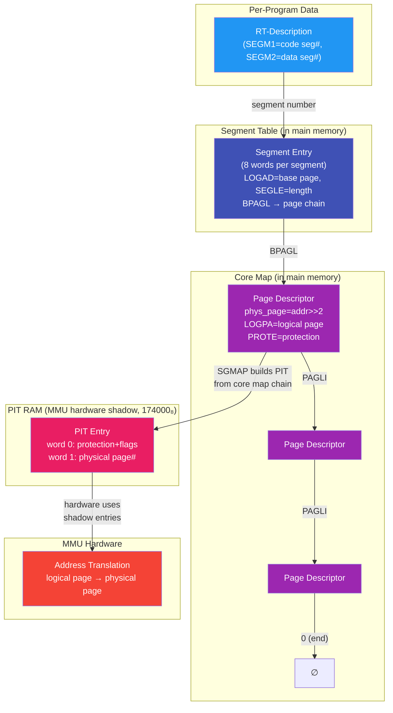
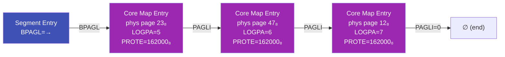
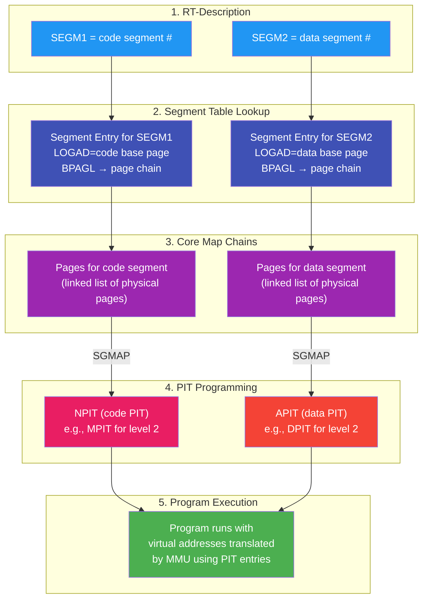

# SINTRAN III Internal Memory Structures - Verified Reference

> **Methodology**: Every field offset and symbol value in this document was verified by directly
> grepping the NPL symbol table files (`SYMBOL-1-LIST.SYMB.TXT`, `SYMBOL-2-LIST.SYMB.TXT`,
> `N500-SYMBOLS.SYMB.TXT`) across all three SINTRAN versions (K03, L07, M06) and cross-referenced
> against actual NPL source code access patterns. Nothing was copied from existing `.md` files.
> Items marked **UNVERIFIED** or **INFERRED** lack direct source confirmation.

> **ND-100 Word Size**: The ND-100 is a 16-bit machine with a 16-bit data bus. ALL memory
> locations and structure fields are 16-bit words (2 bytes). There is no byte addressing
> from the ND-100's perspective. When this document says a field is "16-bit" it means one
> ND-100 word. Fields requiring more than 16 bits (e.g., 32-bit timestamps) span two
> consecutive 16-bit words. All addresses and offsets in this document are in **octal**
> unless explicitly marked otherwise.

---

## Table of Contents

1. [Interrupt Level Usage](#1-interrupt-level-usage)
2. [RT-Description (Program Control Block)](#2-rt-description-program-control-block)
3. [Register Save Block](#3-register-save-block)
4. [Status Bits (STATU Word)](#4-status-bits-statu-word)
5. [Background Programs](#5-background-programs)
6. [Segments, Core Map, and the MMU](#6-segments-core-map-and-the-mmu)
7. [Queue Structures](#7-queue-structures)
8. [I/O Datafield (Device Control Block)](#8-io-datafield-device-control-block)
9. [ND-500 Process Descriptor](#9-nd-500-process-descriptor)
10. [Global Root Pointers and Queue Heads](#10-global-root-pointers-and-queue-heads)
11. [System Information Table (SYSEVAL)](#11-system-information-table-syseval)
12. [Boot State Detection Variables](#12-boot-state-detection-variables)
13. [Page Table Configuration (PIT/PCR System)](#13-page-table-configuration-pitpcr-system)
14. [Cross-Version Symbol Comparison](#14-cross-version-symbol-comparison)
15. [SINTRAN List Command Field Mappings](#15-sintran-list-command-field-mappings)
16. [Corrections to Existing Documentation](#16-corrections-to-existing-documentation)
17. [I/O Device Discovery and Enumeration](#17-io-device-discovery-and-enumeration)
18. [I/O Device Filtering — Detecting Active vs Placeholder Devices](#18-io-device-filtering--detecting-active-vs-placeholder-devices)
19. [Logical Device Number Table](#19-logical-device-number-table)

---

## 1. Interrupt Level Usage

The ND-100 supports 16 interrupt levels (0-15). SINTRAN III assigns each level a specific
function, with higher numbers having higher priority. This assignment is from SINTRAN III
version J onwards.

| Level | Priority | Function |
|:---:|:---:|---|
| 15 | Highest | Extremely fast user interrupts |
| 14 | | Internal interrupts |
| 13 | | Real Time Clock, HDLC drivers |
| 12 | | Terminal Input & ND-100 - ND-500 Communication |
| 11 | | Mass storage Input/Output |
| 10 | | Terminal output |
| 6-9 | | Direct tasks |
| 5 | | XMSG |
| 4 | | I/O Monitor calls |
| 3 | | Segment administration |
| 2 | | SINTRAN III Monitor |
| 1 | | Real time programs and Background programs |
| 0 | Lowest | Idle loop |

> **Source**: SINTRAN III version J interrupt level assignment.

### Key Observations

- **Level 0 (Idle loop)**: The lowest priority — runs only when nothing else needs the CPU.
  The `DUMMY` RT program runs at this level.
- **Levels 1-5 (Software/OS services)**: These handle OS kernel functions from user programs
  (level 1) up through XMSG messaging (level 5).
- **Levels 6-9 (Direct tasks)**: Four levels reserved for direct (real-time) task execution.
- **Levels 10-13 (Hardware I/O)**: Device interrupt handlers, ordered by urgency — terminal
  output (10) through real-time clock and HDLC (13).
- **Level 14 (Internal interrupts)**: CPU-internal events (traps, faults).
- **Level 15 (Fast user interrupts)**: Highest priority, for time-critical user interrupt
  routines that cannot tolerate any latency.

### Relationship to RT-Description

The interrupt level a program runs at is related to its priority (PRITY field at offset 003₈
in the RT-Description). Programs at levels 1 and above with the `5INT` status bit (bit 014₈)
set are interrupt-level programs that execute directly at their assigned interrupt level
rather than being scheduled through the execution queue.

---

## 2. RT-Description (Program Control Block)

The RT-Description is the fundamental process control block in SINTRAN III. Each RT program
has one RT-Description entry in a contiguous table starting at `RTSTA`.

**Size**: `5RTSI=000026` octal = **22 decimal words** (44 bytes)

> **Source**: K03/SYMBOL-1-LIST line 248: `5RTSI=000026`
> Confirmed identical in L07 (line 1454) and M06 (line 1500).

### Complete Field Layout

All offsets verified from `K03/SYMBOL-1-LIST.SYMB.TXT` lines 204-230 and confirmed identical
across L07 and M06.

> **Word size**: All fields are 16-bit words (the ND-100 data bus width). Fields marked
> "32-bit" span two consecutive 16-bit words (high word first, low word second).

| Offset (Oct) | Offset (Dec) | Width | Symbol(s) | Description | Source Line (K03) |
|:---:|:---:|:---:|---|---|---|
| 000 | 0 | 16-bit | TLINK | Time queue link pointer (address of next RT-Desc in time queue, 0=end) | 204 |
| 001 | 1 | 16-bit | STATU | Status bit flags (see [Status Bits](#4-status-bits-statu-word)) | 205 |
| 002 | 2 | 16-bit | INPRI | Initial priority (set at program load) | 206 |
| 003 | 3 | 16-bit | PRITY / TYPRI | Priority / Type+Ring (contains ring level in low bits) | 207, 298 |
| 004-005 | 4-5 | 32-bit | DTIM1+DTIM2 / DTIME | Delay time (DTIM1=high word, DTIM2=low word). Aliases: DTIME=INTSL=004₈ | 208-211 |
| 006-007 | 6-7 | 32-bit | DTIN1+DTIN2 / DTINT | DT interval (DTIN1=high word, DTIN2=low word) | 212-214 |
| 010 | 8 | 16-bit | STADR | Start address (entry point for program execution) | 215 |
| 011 | 9 | 16-bit | SEGM1 / DSEGM | Program segment number (code segment) | 216, 218 |
| 012 | 10 | 16-bit | SEGM2 | Data segment number | 217 |
| 013 | 11 | 16-bit | WLINK / 5WLIN | Execution/wait queue link (next RT-Desc in exec or wait queue) | 219, 250 |
| 014 | 12 | 16-bit | ACT1S / DACTS | Active segment 1 (currently loaded program segment) | 220, 222 |
| 015 | 13 | 16-bit | ACT2S | Active segment 2 (currently loaded data segment) | 221 |
| 016 | 14 | 16-bit | INIPR | Initial priority register (saved initial PCR value) | 223 |
| 017 | 15 | 16-bit | ACTPR | Active priority / PCR value (current ring and priority) | 224 |
| 020 | 16 | 16-bit | BRESL / 5BRES | Reservation queue head (link to first reserved I/O datafield) | 225, 249 |
| 021 | 17 | 16-bit | RSEGM | Reentrant segment number | 226 |
| 022 | 18 | 16-bit | BUFWI | Buffer window page number (for ND-500 buffer access) | 227 |
| 023 | 19 | 16-bit | TRMWI | Terminal window page number | 228 |
| 024 | 20 | 16-bit | N5WIN | ND-500 window page number (for ND-500 address mapping) | 229 |
| 025 | 21 | 16-bit | RTDLG | RT data log address (16-bit pointer to register save block) | 230 |

### Key Notes

- **DTIME=DTIM1=INTSL** all map to offset 004 (three alias names for the same word)
- **DSEGM=SEGM1** both map to offset 011 (alias)
- **DACTS=ACT1S** both map to offset 014 (alias)
- **DTINT=DTIN1** both map to offset 006 (alias)
- **PRITY** at offset 003 and **TYPRI** at offset 003 are the same field
  (NPL source accesses it as both `.PRITY` and `.TYPRING` depending on context)
- **RTDLG** at offset 025 is a pointer to a SEPARATE register save block - registers
  are NOT stored inline within the RT-Description

### RT-Description Table Layout

```
RTSTA (004020₈) ──► ┌─────────────────────────┐
                    │  RT-Desc #0 (26₈ words) │
                    ├─────────────────────────┤
                    │  RT-Desc #1 (26₈ words) │
                    ├─────────────────────────┤
                    │  ...                    │
                    ├─────────────────────────┤
                    │  RT-Desc #N             │
RTEND (004323₈) ──► └─────────────────────────┘
```

**Address computation**: `RT_desc_address = RTSTA + (rt_number × 5RTSI)`

> Source: NPL code `A-"9FBPR"=:D:=0; T:=5RTSIZE; *RDIV ST`
> (CC-P2-COMMON.NPL line 40) shows division by RT-Description size to get index.

### RT Program Names (Reverse Lookup from SYMBOL-2-LIST)

RT program names are **NOT stored as strings in memory**. Instead, each RT-Description
has a corresponding entry in `SYMBOL-2-LIST.SYMB.TXT` that maps its name to its
RT-Description address. To find the name of an RT program given its address, perform
a **reverse lookup** in SYMBOL-2-LIST.

Every adjacent pair of RT entries is separated by exactly 26₈ (22 decimal) words,
confirming the RT-Description size.

> **Source**: L07/SYMBOL-2-LIST.SYMB.TXT lines 102-170 (system RTs),
> 174-308 (background programs)

#### System RT Programs (L07)

| Name  | Address (Oct) | Purpose |
|-------|:---:|---|
| DUMMY | 012071 | Idle/dummy process (RT#0) |
| STSIN | 012117 | SINTRAN startup |
| RTERR | 012145 | RT error handler |
| 1SWAP | 012173 | Swap manager 1 |
| TIMRT | 012221 | Timer RT program |
| RTDIL | 012247 | RT data integrity log |
| DIMWD | 012275 | DIM watchdog |
| BPTMP | 012323 | Background program timer |
| RTSLI | 012351 | RT slicer (time-slice scheduler) |
| ACCRT | 012377 | Accounting RT |
| TERMP | 012425 | Terminal processor |
| 5SWAP | 012453 | Swap manager 5 |
| RWRT1 | 012501 | Read/write RT 1 |
| RWRT2 | 012527 | Read/write RT 2 |
| RWRT3 | 012555 | Read/write RT 3 |
| RWRT5 | 012603 | Read/write RT 5 |
| RWRT7 | 012631 | Read/write RT 7 |
| RWRT8 | 012657 | Read/write RT 8 |
| RWRT9 | 012705 | Read/write RT 9 |
| RTRFA | 012733 | RT remote file access |
| DUMM2 | 012761 | Dummy 2 |
| SPRT1-SPRT9 | 013007-013267 | Spool RT programs 1-9 |
| SPR10-SPR16 | 013315-013521 | Spool RT programs 10-16 |
| COSPO | 013547 | Console spool |
| RWR10-RWR42 | 013575-014131 | Read/write RTs 10-42 |
| TADAD | 014157 | TAD administration |
| UDR01-UDR06 | 014205-014363 | User-defined RTs 1-6 |
| XROUT | 014411 | X-route (communication) |
| XTRAC | 014437 | X-trace |
| XMFID | 014465 | XMSG FIDO handler |
| NKSER | 014513 | Network server |
| NKNAM | 014541 | Network name service |
| ERSWD | 014567 | Error/swap watchdog |
| PROMA | 014615 | Process manager |
| EVMES | 014643 | Event message handler |
| BOPCO | 014671 | Background OPCOM |
| MTSER | 014717 | Magnetic tape server |
| RTREC | 014745 | RT recovery |

#### Background Programs (L07)

Background programs are allocated in the range 9FBPR to 9LBPR:

| Range | Names | Address Range (Oct) |
|-------|-------|:---:|
| Terminal/TAD BG | BAK01-BAK121 | 023337-030431 |
| Batch BG | BCH01-BCH10 | 030505-031013 |

**Boundary markers** (identical name at same address as first/last BG entry):
- `9FBPR=023337` = `BAK01` (first background program)
- `9LTBP=030505` = `BCH01` (first batch background = last terminal BG + 1)
- `9LBPR=031041` = `THISS` = `ERTBS` (end of background program table)

#### Cross-Version Address Comparison

RT program names are stable across versions, but their addresses change:

| Name | K03 | L07 | M06 |
|------|:---:|:---:|:---:|
| DUMMY | 057360 | 012071 | 012146 |
| STSIN | 057406 | 012117 | 012174 |
| 5SWAP | 057714 | 012453 | 012530 |
| BAK01 | 066642 | 023337 | 024714 |

> The 26₈ word spacing between entries is **identical across all three versions**,
> confirming 5RTSI is a compile-time constant.

### NPL Access Patterns

Field access uses the `.` operator with the base address in X register:

```npl
X.STATUS BONE 5RTOFF=:X.STATUS     % Set bit 5RTOFF in status word
                                    % (RP-P2-1.NPL line 46)

X.STATUS BZERO 5WAIT =: X.STATUS   % Clear WAIT bit
                                    % (RP-P2-1.NPL line 459)

A=:RTREF.N5WINDOW                  % Store value into N5WIN field
                                    % (5P-P2-MON60.NPL line 1245)

RTREF.BRESLINK                     % Access reservation queue head
                                    % (5P-P2-MON60.NPL line 1062)

RTREF+"BRESLINK"=:X                % Compute address of BRESLINK field
                                    % (5P-P2-MON60.NPL line 1121)
```

---

## 3. Register Save Block

The register save block is a SEPARATE memory area, NOT part of the RT-Description.
It is pointed to by the **RTDLG** field (offset 025₈) in the RT-Description.

**Size**: At least 20₈ (16 decimal) words (8 registers + 8 bitmap words)

> Source: K03/SYMBOL-1-LIST lines 231-246

### CPU Register Save Area

All ND-100 registers are 16 bits wide. Each saved register occupies one 16-bit word.

| Offset (Oct) | Width | Symbol | Register | Source Line (K03) |
|:---:|:---:|---|---|---|
| 000 | 16-bit | DPREG | P register (Program Counter) | 231 |
| 001 | 16-bit | DXREG | X register (Index) | 232 |
| 002 | 16-bit | DTREG | T register (Temporary) | 233 |
| 003 | 16-bit | DAREG | A register (Accumulator) | 234 |
| 004 | 16-bit | DDREG | D register (Double/Data) | 235 |
| 005 | 16-bit | DLREG | L register (Link/Return) | 236 |
| 006 | 16-bit | DSREG | S register (Stack Pointer) | 237 |
| 007 | 16-bit | DBREG | B register (Base) | 238 |

### Bitmap Area (5BITM=000010₈)

Starting at offset 010₈ within the register save block. Each bitmap word is 16 bits,
giving a total of 8 × 16 = **128 bits** for page tracking.

| Offset (Oct) | Width | Symbol | Source Line (K03) |
|:---:|:---:|---|---|
| 010 | 16-bit | BITMA / 5BITM | 239, 251 |
| 011 | 16-bit | BITM1 | 240 |
| 012 | 16-bit | BITM2 | 241 |
| 013 | 16-bit | BITM3 | 242 |
| 014 | 16-bit | BITM4 | 243 |
| 015 | 16-bit | BITM5 | 244 |
| 016 | 16-bit | BITM6 | 245 |
| 017 | 16-bit | BITM7 | 246 |

> **BITM0-BITM7** form an 8-word (128-bit) bitmap used for page table dirty/accessed tracking.
> The `5BITM` alias confirms this is at offset 010₈ from the register block base.

### NPL Access Pattern

Register save/restore uses indexed load/store with the RTDLG address:

```npl
X:=X.RTDLGADDR; T:=0; *DxREG@3 LDATX/STATX
```

This loads X with the register save block address from RTDLG, then uses
indexed addressing (`@3`) to access each register field sequentially.

---

## 4. Status Bits (STATU Word)

The STATU word at RT-Description offset 001₈ contains bit flags defining the
program's current state. All bit positions are verified from K03/SYMBOL-1-LIST
lines 280-293 and confirmed in L07/M06.

| Bit (Oct) | Bit (Dec) | Symbol | Meaning | Source Line (K03) |
|:---:|:---:|---|---|---|
| 000 | 0 | 5BACK | Background program flag | 293 |
| 001 | 1 | 5USED | RT-Description in use | 292 |
| 002 | 2 | 5TSLI | Time-sliced program | 291 (L07: 1004) |
| 003 | 3 | 5ESCF | Escape priority flag | 290 (L07: 909) |
| 004 | 4 | 5BRKF | Break flag | 289 |
| 005 | 5 | 5SPRF | **UNVERIFIED** - Spool/special flag | 288 |
| 006 | 6 | 5XMSY | XMSG synchronization | L07: 480 |
| 010 | 8 | 5SWWA | Swap wait | 287 |
| 011 | 9 | 5RTOF | RT program OFF / inhibited | 286 |
| 012 | 10 | 5TMOU | Timeout | 285 (L07: 365) |
| 013 | 11 | 5ABS | **INFERRED** - Absolute addressing mode | 284 |
| 014 | 12 | 5INT | Interrupt-level program | 283 |
| 015 | 13 | 5RWAI | Resource wait | 282 |
| 017 | 15 | 5WAIT | I/O wait (in wait queue) | 280 |

> **Bit 017 (5WAIT)** is the highest defined status bit. When set, the program is
> waiting for I/O completion.

### NPL Status Bit Operations

```npl
X.STATUS BONE 5RTOFF=:X.STATUS     % Set: program OFF
X.STATUS BZERO 5WAIT=:X.STATUS     % Clear: no longer waiting
IF A.STATUS BIT 5INT THEN ...       % Test: interrupt-level?
IF A.STATUS BIT 5BACKGR THEN ...    % Test: background program?
IF A.STATUS NBIT 5BACKGR THEN ...   % Test: NOT background?
```

> Source: RP-P2-1.NPL lines 45-47, 79, 196, 459

---

## 5. Background Programs

Background programs are RT-Descriptions with the `5BACK` status bit set (bit 0
of STATU). They are stored as a contiguous range within the RT-Description table.

### Background Program Address Range

These are ABSOLUTE memory addresses (not offsets). They change across versions.

| Symbol | K03 | L07 | M06 | Source |
|---|---|---|---|---|
| 9FBPR | 066642₈ | 023337₈ | 024714₈ | SYMBOL-2-LIST |
| 9LTBP | 073660₈ | 030505₈ | 035422₈ | SYMBOL-2-LIST |
| 9LBPR | 074214₈ | 031041₈ | 035756₈ | SYMBOL-2-LIST |

- **9FBPR**: First Background Program RT-Description
- **9LTBP**: Last Terminal/TAD Background Program (boundary between terminal and batch)
- **9LBPR**: Last Background Program RT-Description

### Background Program Table (SBPRTAB)

A separate table tracks background program metadata (not the same as the RT-Description).

| Symbol | K03 | L07 | M06 | Source |
|---|---|---|---|---|
| SBPRT | 115257₈ | 136163₈ | 137410₈ | SYMBOL-2-LIST |

> **BPRTS=000013₈** (K03 line 1131), **BPRTM=000000₈** (K03 line 1125) define
> field offsets within each background process table entry.

### Detection Logic

NPL code identifies background programs by address range checking:

```npl
IF A>>="9FBPR" AND A<<"9LBPR" THEN
   IF A<<"9LTBP" THEN           % Terminal/TAD background program
      A-"9FBPR"=:D:=0; T:=5RTSIZE; *RDIV ST
      EXITA                     % A = BG program index
   FI
   A-"2THSS"=:D:=0; T:=5RTSIZE; *RDIV ST
   A+MXTBPROGS; EXITA           % Batch background program
FI; EXIT                         % Not a background program
```

> Source: CC-P2-COMMON.NPL lines 37-47 (GBPIUSINDX subroutine)

### Background Process Table Entry Fields

| Offset (Oct) | Symbol | Description | Source Line (K03) |
|:---:|---|---|---|
| 000 | BPRTM | **INFERRED** - Timer/status | 1125 |
| 001 | BPCFI | **INFERRED** - Config info | 1126 |
| 013 | BPRTS | **INFERRED** - Size/type | 1131 |

> These offsets are verified from the symbol table but their exact meanings are
> INFERRED from context. The source code references `CBPTE@3`, `BBPRO@3`,
> and `BPRFL@3` as indexed fields (MP-P2-1.NPL lines 73-78).

---

## 6. Segments, Core Map, and the MMU

This section explains SINTRAN III's entire memory management pipeline: how segments,
the core map, and the MMU hardware work together to give each program its own virtual
address space.

### 6.1 Why Segments Exist

The ND-100 has a 16-bit address space (64KW = 128KB per program). But the system runs
many programs, each needing its own code and data in memory. SINTRAN solves this with
**segments** — named regions of logical address space that can be:

- **Mapped** to different physical pages for each program
- **Swapped** to/from disk when physical memory runs out
- **Shared** between programs (reentrant code segments)
- **Protected** with read/write/execute permissions per page

Each RT program has at least two segments (code + data), and each segment is mapped
into the program's logical address space by programming the MMU's page tables.

### 6.2 The Big Picture — Data Flow



**Key insight**: The segment table and core map in main memory are the **master copy**
of all page mappings. The PIT RAM at 174000₈ is a hardware **shadow** that the MMU
reads during address translation. SINTRAN builds PIT entries FROM the core map data,
not the other way around.

### 6.3 Segment Table Entry Layout

Each segment has an 8-word entry in a contiguous table starting at SEGST.

**Entry Size**: `5SEGS=000010₈` = 8 words per segment

> Source: K03/SYMBOL-1-LIST line 364: `5SEGS=000010`

All offsets from K03/SYMBOL-1-LIST lines 349-356. Each field is one 16-bit word.

| Offset (Oct) | Offset (Dec) | Width | Symbol | Description | Source Line (K03) |
|:---:|:---:|:---:|---|---|---|
| 000 | 0 | 16-bit | SEGLI | Segment link (address of next segment in chain, 0=end) | 349 |
| 001 | 1 | 16-bit | PRESE | Previous segment pointer (back-link) | 350 |
| 002 | 2 | 16-bit | LOGAD | Logical address (base page number in virtual address space) | 351 |
| 003 | 3 | 16-bit | SEGLE | Segment length (number of pages) | 352 |
| 004 | 4 | 16-bit | MADR | Mass storage address (disk location for swap) | 353 |
| 005 | 5 | 16-bit | FLAG | Segment flags (bit field, see below) | 354 |
| 006 | 6 | 16-bit | SGSTA | Segment status word (bit field, see below) | 355 |
| 007 | 7 | 16-bit | BPAGL | Begin page link (address of first page descriptor in core map) | 356 |

### 6.4 Segment Status and Flag Fields

The segment entry has **two separate bit-field words** at offsets 005₈ (FLAG) and 006₈ (SGSTA).
LIST-SEGMENT displays FLAG as status text and SGSTA as protection text.

#### FLAG Field (Offset 005₈) — Segment Type/Status

| Bit | Symbol | LIST-SEGMENT Display | Verified | Source |
|:---:|---|---|:---:|---|
| 0 | 5OK | OK | FLAG=111₈ → "OK" | K03:357 |
| 1 | 5INHB | INHIBITED | — | K03:358 |
| 3 | 5NORE | PROTECT | FLAG=111₈ → "PROTECT" | L07:834 |
| 4 | 5SREE | SHARED/REENTRANT | — | K03:361 |
| 5 | 5FIXC | FIXED | — | K03:362 |
| 6 | 5DEMA | DEMAND | FLAG=111₈ → "DEMAND" | L07:620 |

> Verified: FLAG=111₈ (bits 6,3,0) → LIST-SEGMENT shows "DEMAND PROTECT OK"

#### SGSTA Field (Offset 006₈) — Protection/Ring Bits

| Bit | Symbol | LIST-SEGMENT Display | Verified | Source |
|:---:|---|---|:---:|---|
| 15 | 5WPM | WPM | 162000₈ has bit 15 | L07:1101 |
| 14 | 5RPM | RPM | 162000₈ has bit 14 | L07:1100 |
| 13 | 5FPM | FPM | 162000₈ has bit 13 | L07:1099 |
| 10 | — | RING2 | 162000₈ has bit 10 | — |
| 9 | — | RING1 | 161000₈ has bit 9 | — |
| 3 | — | **UNVERIFIED** — set on kernel PIT segments | 162010₈ | — |
| 0 | 5NCLS | NOCLEAR | 62001₈ has bit 0 | L07:208 |

> Verified examples:
> - SGSTA=162000₈ (bits 15,14,13,10) → "WPM RPM FPM RING2"
> - SGSTA=161000₈ (bits 15,14,13,9) → "WPM RPM FPM RING1"
> - SGSTA=62001₈ (bits 14,13,10,0) → "RPM FPM RING2 NOCLEAR" (no write permit)
>
> Source for 5NCLSEG tested alongside 5WPM in same word:
> IP-P2-SEGADM.NPL:1238: `IF A BIT 5NCLSEG AND BIT 5WPM THEN`

### 6.5 Core Map — The Master Page Table

The **core map** is an array of 4-word entries in main memory, one entry per **physical
page** of RAM. It is the master record of which physical page maps to which logical page,
with what protection, and which segment it belongs to.

> **Source**: Field offsets from L07/SYMBOL-1-LIST: PAGLI=000000 (line 1708),
> PROTE=000002 (line 1665), LOGPA=000003 (line 3532).

#### Core Map Entry Layout (4 words per physical page)

| Offset (Oct) | Width | Symbol | Description | Source |
|:---:|:---:|---|---|---|
| 000 | 16-bit | PAGLI | Page link — address of next page descriptor in this segment's chain (0=end) | L07:1708 |
| 001 | 16-bit | — | **UNVERIFIED** — Flags or segment back-reference | — |
| 002 | 16-bit | PROTE | Protection/status bits (written to PIT entry word 0) | L07:1665 |
| 003 | 16-bit | LOGPA | Logical page number (where this physical page appears in virtual space) | L07:3532 |

#### Physical Page Number Encoding

The physical page number is NOT stored as a field — it is **implicit in the entry's
address**. Each entry is 4 words, so:

```
physical_page_number = entry_address >> 2    (= entry_address / 4)
entry_address = physical_page_number × 4
```

> Source: PH-P2-RESTART.NPL line 419: `D:=X SHZ -2  % D=PHYSICAL PAGE`
> and IP-P2-SEGADM.NPL line 603: `D:=X SHZ -2  % COMPUTE PAGE NUMBER.`

#### Core Map Root Pointers

| Symbol | Address (Oct) | Description | Source |
|---|:---:|---|---|
| CORMS | 004021₈ | Core map start (offset within bank) | L07:2350 |
| CORMB | 004322₈ | Core map physical bank number (T register for LDXTX/LDATX) | L07:3032 |
| SEGTB | 004320₈ | Segment table physical bank number (T register for LDXTX/LDATX) | L07:3031 |
| SEGST | 004321₈ | Segment table offset within bank | L07:2450 |

> **All four addresses are on page 2** (004000₈-005777₈). In DPIT #7₈, page 2
> virtual address ≠ physical address — it maps to physical page 102₈. To read these values
> from a physical dump, the DPIT page table must be consulted first. See
> [Section 6.14](#614-privileged-physical-memory-access-ldxtxldatx) for how these
> bank numbers are used with LDXTX/LDATX to access physical memory.

### 6.6 How a Segment's Pages Are Linked

Each segment entry's **BPAGL** field (offset 007₈) points to the first core map entry
in a linked list. The list connects all physical pages that belong to that segment:



**Walking the chain** (pseudocode):
```
Read BPAGL from segment entry → first core map entry address (X)
Set bank register T := CORMBANK
While X != 0:
    physical_page = X >> 2           (from entry address)
    logical_page  = X.LOGPA          (offset 3)
    protection    = X.PROTE          (offset 2)
    → This page maps: logical_page → physical_page with protection
    X = X.PAGLI                      (offset 0, follow chain)
```

> Source: PH-P2-RESTART.NPL SGMAP routine, lines 416-426.

### 6.7 How SGMAP Builds PIT Entries from the Core Map

The SGMAP subroutine reads the core map chain for a segment and writes corresponding
entries into PIT RAM. This is how the software page table (core map) becomes the
hardware page table (PIT):

```npl
% PH-P2-RESTART.NPL lines 416-426
SGMAP: A*5SEGSIZE+SEGSTART=:X       % Find segment table entry
       T:=SEGTBANK; *BPAGL@3 LDXTX  % X := segment.BPAGL (first page descriptor)
       T:=CORMBANK
       DO WHILE X><0                 % Walk page chain until end (X=0)
          D:=X SHZ -2               % D = physical page number
          *LOGPA@3 LDATX            % A = logical page number (from core map)
          A SH 1 +174000=:B         % B = PIT RAM address (logical_page*2 + 174000₈)
          *PROTE@3 LDATX            % A = protection bits (from core map)
          *POF; STD ,B; PON         % Write to PIT RAM: (protection, phys_page)
          *PAGLI@3 LDXTX            % X = next page descriptor (follow chain)
       OD
```

**What this does step by step:**
1. Looks up the segment in the segment table (by segment number × entry size)
2. Reads BPAGL — the first page descriptor in the core map chain
3. For each page descriptor in the chain:
   - Extracts the physical page number (from the entry's address ÷ 4)
   - Reads the logical page number (LOGPA field)
   - Computes the PIT RAM address: `logical_page × 2 + 174000₈`
   - Reads the protection bits (PROTE field)
   - Turns paging OFF (`*POF`), writes protection + physical page to PIT RAM, turns paging ON (`*PON`)
4. Follows PAGLI to the next page in the chain

### 6.8 The Page Fault Handler (IP-P2-SEGADM.NPL)

When a program accesses a page that isn't in the PIT, the MMU generates a page fault
(level 14 interrupt). The page fault handler in IP-P2-SEGADM.NPL:

1. **Finds the faulted page** in the PIT to confirm it's empty:
   ```npl
   A SH 1 \/ 174000=:X:=X.S0    % Get PIT entry for faulted page
   IF A><0 THEN CALL ERRFATAL FI  % Entry was not 0 — should not fault!
   ```
   > Source: IP-P2-SEGADM.NPL line 321-322.

2. **Allocates a physical page** and creates a core map entry

3. **Writes the PIT entry** using the same pattern:
   ```npl
   A SH 1 \/ 174000=:B          % B = PIT address for logical page
   *PROTE@3 LDATX               % Get protection from core map
   D:=X SHZ -2                  % Get physical page from core map entry address
   AD=:PITENTRY                 % Write to PIT RAM (with *POF/*PON)
   ```
   > Source: IP-P2-SEGADM.NPL STPAGE routine, lines 598-606.

4. **Clears PIT entries** when swapping out:
   ```npl
   A SH 1 \/ 174000=:B          % B = PIT address for logical page
   0=:PITPROTECT                % Clear PIT entry (with *POF/*PON)
   ```
   > Source: IP-P2-SEGADM.NPL CLPAGE routine, lines 588-594.

### 6.9 Named Kernel Segments

SINTRAN defines specific segment numbers for kernel subsystems. Each maps into a
specific PIT (see [Section 13](#13-page-table-configuration-pitpcr-system)):

| Segment # (Oct) | Symbol | Maps Into PIT | Purpose | Source |
|:---:|---|---|---|---|
| 023 | 5DPIT | DPIT #7₈ | Data/DMA segment | L07:274 |
| 035 | 5MPIT | MPIT #12₈ | Main kernel segment | L07:277 |
| 047 | 5RPIT | RPIT #10₈ | RT/real-time segment | L07:278 |
| 051 | 55PIT | 5PIT #5₈ | ND-500 segment | L07:279 |
| 064 | 5ECOM | (shared) | Extended common segment | L07:1092 |
| 067 | 5IPIT | IPIT #15₈ | I/O/interrupt segment | L07:281 |

> Each named segment contains kernel code/data that must be accessible when running
> at the corresponding interrupt level. For example, 5MPIT (segment 35₈) contains
> the kernel code needed by levels 1, 2, 12₈, 14₈, 15₈, 16₈ — all of which use
> MPIT as their Normal PIT.

### 6.10 How a Program Gets Its Address Space

When SINTRAN schedules an RT program, it sets up the MMU so the program's segments
are mapped into its logical address space. The complete flow:



### 6.11 Page Protection Bits (PROTE field → PIT entry word 0)

The PROTE field in the core map becomes word 0 of the PIT entry. Key values:

| Value (Oct) | Meaning |
|:---:|---|
| 162000 | Page present, write-enabled (standard kernel page) |
| 163000 | Page present, write-enabled, ring 3 accessible |
| 0 | Page not present (will cause page fault) |

> The exact bit layout of PROTE matches the ND-100 MMU's PIT entry format
> for the protection/status word. See ND-100 hardware reference for full bit definitions.

**Page flags** (in core map or PIT context):

| Bit (Oct) | Symbol | Meaning | Source Line (K03) |
|:---:|---|---|---|
| 000 | 5NCLS | Not closed | 369 |
| 001 | 5FIX | Fixed page | 370 |
| 004 | 5CMSY | Common system page | 373 |
| 005 | 5CMRE | Common reentrant page | 374 |
| 013 | 5PGU | Page used | 376 |
| 014 | 5WIP | Write in progress | 377 |
| 015 | 5FPM | Fixed in physical memory | 378 |
| 017 | 5WPM | Write-protected in memory | 380 |

### 6.12 Segment Table Root Pointers

| Symbol | Address (Oct) | Description | Source |
|---|:---:|---|---|
| SEGTB | 004320₈ | Segment table physical bank number (T register for LDXTX/LDATX) | L07:3031 |
| SEGST | 004321₈ | Segment table offset within bank (X displacement for LDXTX/LDATX) | L07:2450 |
| CORMB | 004322₈ | Core map physical bank number (T register for LDXTX/LDATX) | L07:3032 |
| CORMS | 004021₈ | Core map start/size | L07:2350 |

> **Address computation**: `segment_entry_address = SEGST_value + (segment_number × 5SEGS)`
>
> Where `SEGST_value` is the content of location 004321₈ (offset within the bank),
> and `5SEGS=000010₈` (8 words per entry).
>
> These are accessed via **LDXTX/LDATX privileged instructions** which generate
> 24-bit physical addresses that bypass the MMU entirely. See [Section 6.14](#614-privileged-physical-memory-access-ldxtxldatx).

### 6.13 Summary: From Segment Number to Physical Address


The PIT entry was built by SGMAP reading from the core map chain. So tracing
backwards from a logical address to the physical address:

1. **Logical address** → extract page number (upper 6 bits) and offset (lower 10 bits)
2. **PIT lookup** → PIT entry at `page_number × 2 + 174000₈` gives physical page
3. **Physical address** = physical page × 1024 + offset

And the PIT was populated from:

1. **Segment number** → segment table entry (via SEGST + segment# × 8)
2. **BPAGL field** → first core map entry in chain
3. **Core map chain** → each entry maps one logical page to one physical page

### 6.14 Privileged Physical Memory Access (LDXTX/LDATX)

The segment table and core map reside in main memory well beyond the first 64KW bank.
SINTRAN accesses them using **LDXTX/LDATX/STATX/STDTX** — privileged ND-100
instructions that generate 24-bit physical addresses and **bypass the MMU entirely**.

#### How LDXTX/LDATX Work

These instructions use the T and X registers to form a 24-bit physical address:

```
24-bit effective address = (T << 16) | ((X + displacement) & 0xFFFF)

Where:
  T register  = upper 8 bits (bank selector, 0-255)
  X register  = lower 16 bits (offset within bank)
  displacement = 0-7 from instruction format (the @3 field in NPL)
```

- **LDXTX**: Load X register from physical memory at `(T << 16) | (X + disp)`
- **LDATX**: Load A register from physical memory at `(T << 16) | (X + disp)`
- **STATX**: Store A register to physical memory at `(T << 16) | (X + disp)`
- **STDTX**: Store D register to physical memory at `(T << 16) | (X + disp)`

These are **privileged instructions** — they can only execute at ring 0. They access
physical memory directly with no page table involvement whatsoever.

> **NPL syntax**: When NPL source writes `*BPAGL@3 LDXTX`, the `@3` is the displacement
> field (0-7) that gets added to X. So `*BPAGL@3 LDXTX` means: load X from physical
> address `(T << 16) | (X + BPAGL_offset)`. The T register was set earlier with
> `T:=SEGTBANK` or `T:=CORMBANK`.

#### How SINTRAN Uses These Instructions

In the SGMAP routine (PH-P2-RESTART.NPL line 416-426):

```
T:=SEGTBANK              % T = physical bank of segment table
*BPAGL@3 LDXTX           % X = word at physical addr (SEGTBANK<<16) | (X + 7)
                          % This reads segment.BPAGL from the segment table
T:=CORMBANK              % T = physical bank of core map
*LOGPA@3 LDATX           % A = word at physical addr (CORMBANK<<16) | (X + 3)
                          % This reads core_map_entry.LOGPA
```

No MMU page table is consulted. The physical address is computed directly from T and X.

#### SEGTBANK and CORMBANK Are Just Physical Bank Numbers

The values stored at SEGTB (004320₈) and CORMB (004322₈) are simply the **upper 8 bits
of a 24-bit physical address** — i.e., which 64KW bank the structure resides in.

#### Verified Values from Physical Memory Dump

Reading the root pointers via DPIT #7₈ translation (page 2 → physical page 102₈):

| Pointer | Address | Value (Oct) | Value (Dec) | Physical Location |
|---|:---:|:---:|:---:|---|
| SEGTB | 004320₈ | 000003₈ | 3 | Bank 3 |
| SEGST | 004321₈ | 124000₈ | 43,008 | Offset 124000₈ within bank 3 |
| CORMB | 004322₈ | 000002₈ | 2 | Bank 2 |
| CORMS | 004021₈ | 000000₈ | 0 | Offset 0 within bank 2 |

**Physical addresses**:
- Segment table: `(3 << 16) + 43008 = 239,616` words = physical word 724000₈
- Core map: `(2 << 16) + 0 = 131,072` words = physical word 400000₈

> Both structures are within the first 256KW (262,144 words) of physical memory.
> A dump of 256KW (banks 0-3) contains both the segment table and the core map.
>
> **Previous error**: Earlier analysis read these pointers from the WRONG physical
> addresses (without DPIT page table translation), yielding garbage values
> SEGTB=96, SEGST=2, CORMB=21 and the incorrect conclusion that the structures
> were unreachable.

### 6.15 Practical Implications for Physical Memory Dump Analysis

To reconstruct the MMU mapping from a physical memory dump:

1. **Translate root pointer addresses through DPIT**: Addresses 004320₈-004322₈ and
   004021₈ are logical addresses on page 2. DPIT #7₈ maps page 2 to physical page
   102₈, so the physical offset for e.g. 004320₈ is `(102₈ × 2000₈) + 320₈ = 204320₈`.
2. Read SEGTB → physical bank number of segment table
3. Read SEGST → offset within that bank
4. Read CORMB → physical bank number of core map
5. Compute physical addresses: `seg_table = (SEGTB << 16) + SEGST`, `core_map = (CORMB << 16)`
6. For each segment, read its 8-word entry at `seg_table + (segment_number × 8)`
7. Follow the BPAGL chain through the core map
8. Each core map entry gives: logical_page (LOGPA), physical_page (address>>2), protection (PROTE)

**Requirements**: The dump must cover the physical addresses where the segment table and
core map reside. For the verified values (bank 3 and bank 2), a standard 256KW dump
covers both structures entirely.

**PIT RAM at 174000₈**: The PIT RAM area (174000₈-177777₈) in a physical memory dump
does **not** reliably contain the actual MMU hardware state. The emulator typically
maintains PIT entries in a separate internal data structure. To get the actual PIT
mappings, use an emulator MMU dump feature rather than reading physical memory at
these addresses.

### 6.16 Decoded Segment Table from Physical Memory Dump

Segment table at physical word 724000₈ (bank 3, offset 124000₈).
SGMAX=3261₈ (1713 decimal). 90 non-zero entries in first 200 slots.
17 segments currently in core (BPAGL≠0), 73 swapped or empty.

**Verification**: Segments 1₈, 3₈, 6₈, 10₈, and 44₈ were cross-checked against
live SINTRAN LIST-SEGMENT output — all fields match exactly.

#### Known Kernel Segments

| Seg# (Oct) | Seg# (Dec) | Symbol | LOGAD | SEGLE | SGSTA | In Core | Source |
|:---:|:---:|---|:---:|:---:|:---:|:---:|---|
| 001 | 1 | 5BCOM | 0₈ | 376₈ | 161000₈ | Yes | L07:1104 |
| 005 | 5 | 5PIT | 762₈ | 1₈ | 162000₈ | Yes | L07:272 |
| 023 | 19 | 5DPIT | 702₈ | 55₈ | 162010₈ | Yes | L07:274 |
| 024 | 20 | 5SSGT | — | — | — | — | L07:275 |
| 027 | 23 | 5ISGT | — | — | — | — | L07:276 |
| 035 | 29 | 5MPIT | 1215₈ | 52₈ | 162010₈ | Yes | L07:277 |
| 047 | 39 | 5RPIT | 1015₈ | 44₈ | 162010₈ | Yes | L07:278 |
| 051 | 41 | 55PIT | 513₈ | 5₈ | 162010₈ | Yes | L07:279 |
| 064 | 52 | 5ECOM | 1013₈ | 2₈ | 162010₈ | Yes | L07:1092 |
| 067 | 55 | 5IPIT | 1515₈ | 23₈ | 162010₈ | Yes | L07:281 |

> **Note**: All kernel PIT-related segments (5DPIT, 5MPIT, 5RPIT, 55PIT, 5ECOM, 5IPIT)
> have SGSTA=162010₈ (bit 3 set), distinguishing them from user segments which have
> 162000₈. Segment 1 (5BCOM, base common) has SGSTA=161000₈ indicating RING1 instead
> of RING2.

#### All In-Core Segments

| Seg# (Oct) | LOGAD | SEGLE | FLAG | SGSTA | BPAGL | Name |
|:---:|:---:|:---:|:---:|:---:|:---:|---|
| 001 | 000₈ | 376₈ | 000₈ | 161000₈ | 17344₈ | 5BCOM (base common) |
| 003 | 1114₈ | 64₈ | 111₈ | 162000₈ | 17350₈ | |
| 005 | 762₈ | 1₈ | 11₈ | 162000₈ | 310₈ | 5PIT |
| 006 | 413₈ | 65₈ | 111₈ | 62001₈ | 17404₈ | (read-only, NOCLEAR) |
| 010 | 200₈ | 100₈ | 111₈ | 162000₈ | 17734₈ | |
| 023 | 702₈ | 55₈ | — | 162010₈ | 410₈ | 5DPIT |
| 035 | 1215₈ | 52₈ | — | 162010₈ | 1400₈ | 5MPIT |
| 042 | 1113₈ | 1₈ | — | 162010₈ | 714₈ | |
| 044 | 102₈ | 55₈ | 111₈ | 162000₈ | 17744₈ | |
| 047 | 1015₈ | 44₈ | — | 162010₈ | 1040₈ | 5RPIT |
| 051 | 513₈ | 5₈ | — | 162010₈ | 740₈ | 55PIT |
| 064 | 1013₈ | 2₈ | — | 162010₈ | 400₈ | 5ECOM |
| 067 | 1515₈ | 23₈ | — | 162010₈ | 1260₈ | 5IPIT |
| 071 | 1114₈ | 44₈ | 111₈ | 162000₈ | 17374₈ | |
| 073 | 101₈ | 4₈ | — | 162002₈ | 260₈ | |
| 115 | 100₈ | 20₈ | — | 160000₈ | 17474₈ | (RING0) |
| 117 | 200₈ | 70₈ | — | 160000₈ | 17470₈ | (RING0) |

> **SGSTA decoding**: 162000₈=WPM+RPM+FPM+RING2, 161000₈=WPM+RPM+FPM+RING1,
> 160000₈=WPM+RPM+FPM+RING0, 62001₈=RPM+FPM+RING2+NOCLEAR.
> **FLAG decoding**: 111₈=DEMAND+PROTECT+OK, 11₈=PROTECT+OK, 0₈=(no flags).

### 6.17 Algorithm: How to List All Segments and Their Details

This section provides a step-by-step algorithm for reading the complete SINTRAN segment
table from a physical memory dump. It is written to be implementable by an LLM or
automated tool given access to a binary memory dump and the emulator's DPIT page table state.

#### Prerequisites

You need:
1. A **physical memory dump** (binary file, 16-bit big-endian words)
2. The **DPIT #7₈ page table** (64 entries mapping virtual page → physical page)
   - Each entry is a (physical_page_number, protection_bits) pair
   - If unavailable, see "Hard-Coded Fallback" below

#### Step 1: Read a Word from Logical Address (via DPIT Translation)

All SINTRAN global variables are at **logical addresses** in the DPIT #7₈ address space.
To read a logical word from a physical dump:

```
function read_logical_word(logical_address, dpit_table, dump):
    page_number = logical_address >> 10          # upper 6 bits (divide by 1024)
    offset_in_page = logical_address & 0o1777    # lower 10 bits (mod 1024)
    physical_page = dpit_table[page_number].physical_page_number
    physical_word_address = (physical_page * 1024) + offset_in_page
    byte_offset = physical_word_address * 2
    return read_big_endian_16bit(dump, byte_offset)
```

> **Hard-Coded Fallback**: If you do not have the full DPIT table, the critical
> mappings for the observed SINTRAN configuration are:
> - Pages 0-1: virtual address = physical address (no translation)
> - Page 2 (004000₈-005777₈): maps to physical page 102₈ (66 decimal)
> - Pages 3-63: see the DPIT map in the decode script output
>
> **WARNING**: These mappings are configuration-specific. A different SINTRAN
> installation may have different DPIT mappings. Always prefer reading the actual
> DPIT state from the emulator.

#### Step 2: Read Root Pointers

Read these global variables using `read_logical_word()`:

```
SGMAX  = read_logical_word(0o004015, dpit, dump)  # max segment number (octal)
SEGTB  = read_logical_word(0o004320, dpit, dump)  # segment table bank (T register)
SEGST  = read_logical_word(0o004321, dpit, dump)  # segment table offset within bank
CORMB  = read_logical_word(0o004322, dpit, dump)  # core map bank
CORMS  = read_logical_word(0o004021, dpit, dump)  # core map offset within bank
RTSTA  = read_logical_word(0o004020, dpit, dump)  # RT table start (logical address)
RTEND  = read_logical_word(0o004323, dpit, dump)  # RT table end (logical address)
```

**Expected values** (from verified dump):
- SGMAX = 3261₈ (1713 decimal)
- SEGTB = 3, SEGST = 124000₈
- CORMB = 2, CORMS = 0
- RTSTA = 012071₈, RTEND = 031041₈

#### Step 3: Compute Segment Table Physical Base Address

The segment table is accessed via LDXTX (privileged physical access), NOT through
any PIT. The physical word address is:

```
seg_table_physical = (SEGTB << 16) + SEGST
```

For the verified values: `(3 << 16) + 43008 = 239,616` = physical word 724000₈.

**IMPORTANT**: This address is a PHYSICAL word address, NOT a logical address.
Read directly from the dump at `byte_offset = seg_table_physical * 2`.

#### Step 4: Read Each Segment Entry

Each segment entry is **8 words** (5SEGS=010₈). Segment numbers run from 0 to SGMAX.
Segment 0 is unused (always zero).

```
SEGS = 8  # words per segment entry

for seg_num in range(0, SGMAX + 1):
    entry_physical = seg_table_physical + (seg_num * SEGS)
    byte_offset = entry_physical * 2

    # Read 8 big-endian 16-bit words
    SEGLI = read_word(dump, byte_offset + 0)   # offset 000: segment link
    PRESE = read_word(dump, byte_offset + 2)   # offset 001: previous segment
    LOGAD = read_word(dump, byte_offset + 4)   # offset 002: logical address (first page)
    SEGLE = read_word(dump, byte_offset + 6)   # offset 003: segment length (pages)
    MADR  = read_word(dump, byte_offset + 8)   # offset 004: mass storage address
    FLAG  = read_word(dump, byte_offset + 10)  # offset 005: status flags
    SGSTA = read_word(dump, byte_offset + 12)  # offset 006: protection/ring bits
    BPAGL = read_word(dump, byte_offset + 14)  # offset 007: begin page link (core map)
```

> **Byte offset formula**: For segment N, word W (0-7) of its entry:
> `byte_offset = ((SEGTB << 16) + SEGST + N*8 + W) * 2`

#### Step 5: Skip Empty Entries

A segment entry where ALL 8 words are zero is unused. Skip it.

```
if SEGLI == 0 and PRESE == 0 and LOGAD == 0 and SEGLE == 0
   and MADR == 0 and FLAG == 0 and SGSTA == 0 and BPAGL == 0:
    continue  # empty slot
```

#### Step 6: Decode FLAG Field (Offset 005₈)

FLAG contains segment type and status bits:

| Bit | Symbol | Display Text | Meaning |
|:---:|---|---|---|
| 0 | 5OK | OK | Segment is valid/OK |
| 1 | 5INHB | INHIBITED | Segment is inhibited |
| 3 | 5NORE | PROTECT | Segment is write-protected (no-release) |
| 4 | 5SREE | SHARED | Shared/reentrant segment |
| 5 | 5FIXC | FIXED | Fixed in core (never swapped) |
| 6 | 5DEMA | DEMAND | Demand-loaded segment |

Common FLAG values:
- `111₈` (bits 6,3,0) = "DEMAND PROTECT OK" — most user segments
- `011₈` (bits 3,0) = "PROTECT OK" — the PIT segment (seg 5)
- `000₈` = no flags — base common (seg 1)

#### Step 7: Decode SGSTA Field (Offset 006₈)

SGSTA contains protection and ring level:

| Bit | Symbol | Display Text | Meaning |
|:---:|---|---|---|
| 15 | 5WPM | WPM | Write Permit |
| 14 | 5RPM | RPM | Read Permit |
| 13 | 5FPM | FPM | Fetch Permit |
| 10 | — | RING2 | Ring 2 (user-level) |
| 9 | — | RING1 | Ring 1 (privileged user) |
| 3 | — | (kernel PIT flag) | Set on kernel PIT-related segments |
| 0 | 5NCLS | NOCLEAR | Segment pages not cleared on deallocation |

Ring decoding (bits 10-9):
- `00` = RING0 (most privileged)
- `01` = RING1
- `10` = RING2 (normal user)
- `11` = RING3

Common SGSTA values:
- `162000₈` (bits 15,14,13,10) = "WPM RPM FPM RING2" — standard read-write segment
- `161000₈` (bits 15,14,13,9) = "WPM RPM FPM RING1" — base common
- `162010₈` (bits 15,14,13,10,3) = "WPM RPM FPM RING2" + kernel flag — kernel PIT segments
- `160000₈` (bits 15,14,13) = "WPM RPM FPM RING0" — ring 0 segments
- `062000₈` (bits 14,13,10) = "RPM FPM RING2" — read-only segment (no write)
- `062001₈` (bits 14,13,10,0) = "RPM FPM RING2 NOCLEAR" — read-only, no clear

#### Step 8: Determine If Segment Is In Core

If `BPAGL != 0`, the segment has at least one physical page in memory. If `BPAGL == 0`
and the segment is not empty, the segment is swapped out to mass storage.

#### Step 9 (Optional): Cross-Reference with RT Programs

To determine which RT programs use each segment, scan the RT-Description table.
Each RT-Description has:
- **SEGM1** at offset 011₈ (word 9): code segment number
- **SEGM2** at offset 012₈ (word 10): data segment number

Algorithm:

```
5RTSI = 0o26  # 22 decimal words per RT-Description

# Read all RT programs
rt_count = (RTEND - RTSTA) / 5RTSI
for rt_index in range(0, rt_count):
    rt_addr = RTSTA + (rt_index * 5RTSI)  # logical address

    # Read SEGM1 and SEGM2 via DPIT translation
    segm1 = read_logical_word(rt_addr + 0o11, dpit, dump)
    segm2 = read_logical_word(rt_addr + 0o12, dpit, dump)

    # Associate these segment numbers with this RT program
    segment_users[segm1].append(rt_index)
    if segm2 != segm1:
        segment_users[segm2].append(rt_index)
```

> **RT program names**: There are no name strings in memory. RT program names
> are in `SYMBOL-2-LIST.SYMB.TXT` mapped to their RT-Description addresses.
> To find a name: compute `rt_addr = RTSTA + (rt_index × 5RTSI)`, then look
> up that address in the symbol table.

#### Verification Checklist

After generating the segment list, verify against these known values:

| Check | Expected |
|---|---|
| Segment 0 | All zeros (unused) |
| Segment 1 (5BCOM) | LOGAD=0₈, SEGLE=376₈, FLAG=0₈, SGSTA=161000₈ |
| Segment 3 | LOGAD=1114₈, SEGLE=64₈, MADR=2600₈, FLAG=111₈, SGSTA=162000₈ |
| Segment 8 (oct 10₈) | LOGAD=200₈, SEGLE=100₈, MADR=3757₈, FLAG=111₈, SGSTA=162000₈ |
| Segment 19 (5DPIT, oct 23₈) | LOGAD=702₈, SEGLE=55₈, SGSTA=162010₈, in core |
| SGMAX | 3261₈ = 1713 decimal |
| Total non-zero segments | ~90 (in first 200 entries) |
| In-core segments | ~17 (BPAGL≠0) |

> If segment 0 shows non-zero data, or segment 1 shows all zeros, the
> segment table base address is wrong. The most common error is reading
> physical memory at the logical addresses (004320₈-004321₈) without
> DPIT page table translation.

#### Common Errors

1. **Reading root pointers without DPIT translation**: Logical addresses
   004320₈-004321₈ are on page 2, which maps to physical page 102₈ in DPIT.
   Reading physical address 004320₈ directly gives garbage (SEGTB=96 instead of 3).

2. **Using logical addresses as physical**: SEGST=124000₈ is a physical OFFSET
   within bank SEGTB, NOT a logical address. Do NOT apply DPIT translation to it.
   The formula is: `physical_word = (SEGTB << 16) + SEGST + (seg_num * 8) + field_offset`

3. **Wrong endianness**: ND-100 is big-endian. Each 16-bit word in the dump is
   stored MSB first. Use big-endian reads (`struct.unpack('>H', ...)` in Python).

4. **Confusing 5SEGS with 5RTSI**: Segment entries are 8 words (5SEGS=010₈),
   RT-Description entries are 22 words (5RTSI=026₈). Do not mix these sizes.

5. **Not skipping segment 0**: Segment 0 is always unused. Start iteration from
   segment 1 or skip entries where all 8 words are zero.

---

## 7. Queue Structures

SINTRAN III maintains several queues using linked lists through fields in the
RT-Description. All link fields are verified from symbol tables.

### 7.1 Time Queue

Programs waiting for a time delay are linked through the **TLINK** field.

```
BTIMQ (004012₈) ──► RT-Desc ──► RT-Desc ──► RT-Desc ──► 0 (end)
                     [TLINK]     [TLINK]     [TLINK]
```

- **Queue head**: `BTIMQ=004012₈` (all versions)
- **Link field**: `TLINK` at RT-Description offset 000₈
- **Time fields**: `DTIM1` (offset 004₈), `DTIM2` (offset 005₈) = 32-bit delay time
- **Ordering**: Time-ordered (earliest expiration first)
- **Type**: Linear singly-linked list

### 7.2 Execution Queue

Ready-to-run programs are linked through the **WLINK** field.

```
BEXQU (004013₈) ──► RT-Desc ──► RT-Desc ──► RT-Desc ──► (circular back to first)
                     [WLINK]     [WLINK]     [WLINK]
```

- **Queue head**: `BEXQU=004013₈` (all versions)
- **Link field**: `WLINK` at RT-Description offset 013₈
- **Ordering**: Priority-ordered (highest priority first)
- **Type**: Circular linked list

### 7.3 Monitor Queue

Programs requesting monitor services are linked through **MLINK/NLINK**.

```
MQUEU (004011₈) ──► I/O-DF ──► I/O-DF ──► 0 (end)
                     [MLINK]    [MLINK]
```

- **Queue head**: `MQUEU=004011₈` (all versions)
- **Link field**: `MLINK` at I/O Datafield offset 005₈ (alias: `NLINK`)
- **Ordering**: FIFO
- **Type**: Linear singly-linked list

### 7.4 Wait Queues (per-device)

Programs waiting for I/O completion on a specific device:

```
I/O-DF.BWLIN ──► RT-Desc ──► RT-Desc ──► 0 (end)
                  [WLINK]     [WLINK]
```

- **Queue head**: `BWLIN` at I/O Datafield offset 002₈
- **Link field**: `WLINK` at RT-Description offset 013₈
- **Note**: Same WLINK field is used for both execution queue and wait queues
  (a program can only be in ONE queue at a time)

### 7.5 Reservation Queues (per-program)

Each RT program can reserve I/O datafields. Reserved datafields form a chain:

```
RT-Desc.BRESL ──► I/O-DF ──► I/O-DF ──► RT-Desc (circular back to owner)
                   [RESLI]    [RESLI]
```

- **Queue head**: `BRESL` at RT-Description offset 020₈
- **Link field**: `RESLI` at I/O Datafield offset 000₈
- **Type**: Circular linked list (terminates when link == owning RT-Desc address)

> Source: 5P-P2-MON60.NPL lines 1062-1065, 1121-1122:
> ```npl
> RTREF+"BRESLINK"=:X
> DO WHILE X:=X.RESLINK><RTREF    % Walk chain until back to owning RT
> ```

### Queue Membership Summary

```
┌──────────────────────────────────────────────────────────┐
│ An RT program can be in exactly ONE of:                  │
│                                                          │
│  1. Execution Queue  (BEXQU → WLINK chain, running)      │
│  2. Time Queue       (BTIMQ → TLINK chain, delayed)      │
│  3. Wait Queue       (BWLIN → WLINK chain, I/O wait)     │
│  4. No queue         (idle/passive)                      │
│                                                          │
│ AND simultaneously have:                                 │
│  - Reservation chain (BRESL → RESLI, owned devices)      │
└──────────────────────────────────────────────────────────┘
```

---

## 8. I/O Datafield (Device Control Block)

Each I/O device in SINTRAN III has an **I/O Datafield** — a memory structure that manages
device state, queue linkage, and driver dispatch. All I/O Datafield addresses are
**DPIT logical addresses** (see [Section 13](#13-page-table-configuration-pitpcr-system)).

### 8.1 Standard I/O Datafield Header (7 words)

The first 7 words are the **standard header** present in ALL device datafields.
From SYMBOL-1-LIST (identical across K03, L07, M06). Each field is one 16-bit word.

| Offset (Oct) | Offset (Dec) | Symbol | Description | Source (K03 line) |
|:---:|:---:|---|---|---|
| 000 | 0 | RESLI | Reservation chain link (next I/O-DF in reservation chain, 0=end) | 295 |
| 001 | 1 | RTRES | Owning RT program (address of reserving RT-Desc, 0=free) | 296 |
| 002 | 2 | BWLIN | Wait queue head (first RT-Desc waiting for this device) | 297 |
| 003 | 3 | TYPRI | Device type and ring word (bit field, see [Section 8.2](#82-typri-word--device-type-and-ring-bits)) | K03:298 (as TYPRI=000003), L07:481 |
| 004 | 4 | ISTAT | I/O status word (device-specific operational state) | 299 |
| 005 | 5 | MLINK | Monitor queue link (next I/O-DF in monitor queue). Also named NLINK (K03:955) | 300 |
| 006 | 6 | MFUNC | Monitor function address (code entry point for this device's driver) | 301 |

> **CRITICAL CORRECTION**: Previous documentation listed offset 003₈ as "UNVERIFIED"
> and placed the device type bit definitions under ISTAT (offset 004₈). This was wrong.
> The NPL GDEVTY subroutine (RP-P2-MONCALLS.NPL:2623) tests `A.TYPRING BIT 5TERM`,
> confirming that device type bits are in the **TYPRI** word at offset **003₈**, not ISTAT.
> TYPRI=000003 is defined in SYMBOL-1-LIST across all three versions (K03, L07, M06).

### 8.2 TYPRI Word — Device Type and Ring Bits

The TYPRI word at offset 003₈ encodes the device type, attributes, and ring information
in a single 16-bit word. The kernel's GDEVTY subroutine (RP-P2-MONCALLS.NPL:2603-2653)
reads this word to classify devices.

#### Complete TYPRI Bit Layout

All bit positions verified from SYMBOL-1-LIST (K03 lines 321-336, confirmed identical
in L07 and M06). Additional symbols from XMSG-SYMBOL-LIST and RTLO-SYMBOLS.

```
Bit:  15    14    13    12    11    10     9     8     7     6     5     4     3     2   1   0
     IOBT  RFIL  CONC  ISET  SPLI  M144  MT    FLOP  HDMA  IBDV  TERM  BAD   NORE  CLDV  ?   ?
     ────  ────  ────  ────  ────  ────  ────  ────  ────  ────  ────  ────  ────  ────  ──  ──
      │     │     │     │     │     │     │     │     │     │     │     │     │     │    └──┘
      │     │     │     │     │     │     │     │     │     │     │     │     │     │   INFERRED:
      │     │     │     │     │     │     │     │     │     │     │     │     │     │   Ring bits
      │     Attribute flags ──────────────────────┤     │     │     │     │     │     │   (0-3)
      │                                           │     Primary type bits ──────┤     │
      │                                           │                             │     Access flags ─┤
      └── Transfer flag                           └── Device class ─────────────┘
```

| Bit | Oct | Symbol | Full Name | Description | Source |
|:---:|:---:|---|---|---|---|
| 15 | 017 | 5IOBT | I/O Block Transfer | Device supports block transfer operations | K03:321 |
| 14 | 016 | 5RFIL | Remote File | Device is a remote file (network-accessed) | K03:322 |
| 13 | 015 | 5CONC | Concurrent | Device supports concurrent I/O operations | K03:323 |
| 12 | 014 | 5ISET | I/O Set | I/O initialization/setup complete for this device | K03:324 |
| 11 | 013 | 5SPLI | Split Datafield | Device has separate R/W datafield halves (terminals, block devs) | K03:325 |
| 10 | 012 | M144B | 144-byte | Device uses 144-byte (M144) block format | K03:326 |
| 9 | 011 | 5MT | Magnetic Tape | Device is a magnetic tape unit | K03:327 |
| 8 | 010 | 5FLOP | Floppy | Device is a floppy disk | K03:328 |
| 7 | 007 | 5HDMA | HDMA | Device uses HDMA/X.21 protocol | K03:336, XMSG:409 |
| 6 | 006 | 5IBDV | Indexed Block Device | Device is an indexed block device (disk) | K03:330, XMSG:403 |
| 5 | 005 | 5TERM | Terminal | Device is a character terminal | K03:331 |
| 4 | 004 | 5BAD | TAD | Device is a TAD (Terminal Adapter Device) | K03:332 |
| 3 | 003 | 5NORE | No Reservation | Device does not require reservation before use | K03 (from 5NORE symbol) |
| 2 | 002 | 5CLDV | Closable Device | Device can be explicitly closed | K03:334, XMSG:407 |
| 1-0 | — | — | **INFERRED**: Ring | Likely protection ring (0-3). Name "TYPRI" = TYPe + RIng. All observed values have bits 0-1 = 00 (ring 0) | — |

> **Source verification**: Symbols 5IOBT through 5BAD are in K03/SYMBOL-1-LIST at
> consecutive lines 321-332. Symbols 5IBDV, 5CLDV, 5HDMA are in K03/SYMBOL-1-LIST
> at lines 330, 334, 336 and confirmed in L07/XMSG-SYMBOL-LIST at lines 403, 407, 409.
> All values are **identical** across K03, L07, and M06.
>
> **Bits 0-1**: Labeled as "ring" based on the field name TYPRI (type+ring) and the
> observation that all kernel device datafields have these bits = 0. This is **INFERRED**,
> not directly confirmed by a symbol definition.

#### Example TYPRI Values from Memory Dump

| Device | TYPRI (Oct) | Bits Set | Interpretation |
|---|:---:|---|---|
| DT01R (terminal read) | 114040 | IOBT+ISET+SPLI+TERM | Character terminal, split R/W, initialized |
| DT01W (terminal write) | 114054 | IOBT+ISET+SPLI+TERM+NORE+CLDV | Write half: closable, no reservation needed |
| DT05W (terminal write) | 114044 | IOBT+ISET+SPLI+TERM+CLDV | Non-console write half: closable |
| MTDI1 (mag tape input) | 113000 | IOBT+ISET+MT | Magnetic tape, initialized |
| FDID1 (floppy ctrl) | 000402 | FLOP | Floppy controller (not yet initialized) |
| F1U0I (floppy unit I/O) | 112400 | IOBT+ISET+FLOP | Floppy unit, initialized |
| HDMI1 (HDLC master in) | 000202 | HDMA | HDMA protocol device |
| HDFI1 (HDLC full in) | 012200 | ISET+HDMA | HDMA, initialized |
| SCSI1 (SCSI channel) | 001006 | MT+IBDV | SCSI channel (**ASSUMPTION**: 5MT bit set may indicate SCSI inherits mag-tape-like block I/O classification) |
| DOM01 (domain entry) | 000002 | CLDV | Domain: closable only |
| CDF01 (CDF channel) | 020000 | x2000 (bit 13 only) | Concurrent flag only |

### 8.3 Device Type Classification Algorithm (GDEVTY)

The GDEVTY subroutine in `RP-P2-MONCALLS.NPL` (lines 2603-2653) classifies a device
by testing TYPRI bits in a **fixed priority order**. The first matching bit determines
the primary device type.

#### Type Detection Sequence

```
GDEVTY entry: A := device_datafield.TYPRING

  IF A BIT 5TERM  → type := 9BTERM  (1 = Terminal)         [line 2623]
  IF A BIT 5BAD   → type := 9BBAD   (2 = TAD)              [line 2624]
  IF A BIT 5IBDV  → type := 9BIBDV  (4 = Indexed Block Dev) [line 2625]
  IF A BIT 5FLOP  → type := 9BFLOP  (5 = Floppy)           [line 2626]
  IF A BIT 5MT    → type := 9BMT    (6 = Magnetic Tape)     [line 2627]
  IF A BIT 5RFILE → type := 9BRFILE (7 = Remote File)       [line 2628]
  else            → type := 0       (Unknown)                [line 2629]
```

The type constants are defined as auto-incrementing symbols (line 2604):
```npl
SYMBOL 9BTERM=1,9BBAD,9BCOM,9BIBDV,9BFLOP,9BMT,9BRFILE    % TYPES
```

| Constant | Value | Device Type | TYPRI Bit Tested |
|---|:---:|---|:---:|
| 9BTERM | 1 | Terminal | 5TERM (bit 5) |
| 9BBAD | 2 | TAD (Terminal Adapter) | 5BAD (bit 4) |
| 9BCOM | 3 | Communications | Not tested in GDEVTY sequence — **classified elsewhere** |
| 9BIBDV | 4 | Indexed Block Device (disk) | 5IBDV (bit 6) |
| 9BFLOP | 5 | Floppy Disk | 5FLOP (bit 8) |
| 9BMT | 6 | Magnetic Tape | 5MT (bit 9) |
| 9BRFILE | 7 | Remote File | 5RFIL (bit 14) |

> **Note**: 9BCOM (3 = Communications) is defined in the SYMBOL sequence but has **no
> corresponding bit test** in the GDEVTY detection loop. Communication devices must be
> classified through a different mechanism. This is **not an assumption** — the NPL
> source code at lines 2623-2629 has no test for a "communications" bit.

#### Attribute Flags (tested after primary type)

After determining the primary type, GDEVTY tests additional attribute bits (lines 2636-2650):

```
  IF A BIT 5IOBT  → set AIOBT attribute     [line 2636]
  IF A BIT 5CONCT → set ACONCT attribute     [line 2637]
  IF A BIT 5ISET  → set ATISET attribute     [line 2638]
  IF A BIT M144B  → set AM144 attribute      [line 2639]
  IF A BIT 5NORES → set ANORES attribute     [line 2640]
  IF NOT 5TERM:
    IF A BIT 5CLDV → set ACLDV attribute     [line 2642]
```

> **Source**: RP-P2-MONCALLS.NPL lines 2603-2653, verified against K03/L07/M06
> symbol tables for bit position values.

### 8.4 Extended I/O Datafield Fields (Beyond Standard Header)

Fields beyond offset 006₈ are device-type dependent. The following are from
K03/SYMBOL-1-LIST lines 303-318 and represent the **disk/mass storage** datafield
extension. Other device types may use these offsets differently.

| Offset (Oct) | Offset (Dec) | Symbol | Description | Source (K03 line) |
|:---:|:---:|---|---|---|
| 007 | 7 | — | **INFERRED** — Gap between MFUNC and HSTAT. May be unused padding or device-specific | — |
| 010 | 8 | HSTAT | Hardware status register (device-specific) | 303 |
| 011 | 9 | MTRAN | Monitor transfer count (words to transfer) | 304 |
| 012 | 10 | MRTRE | Monitor return entry (return address after I/O) | 305 |
| 013 | 11 | BREGC | B register contents (saved for I/O operation) | 306 |
| 014 | 12 | ABFUN | Abort function address | 307 |
| 015 | 13 | MEMA1 / MEMAD | Memory address for DMA transfer | 308, 316 |
| 016 | 14 | — | **INFERRED** — Between MEMA1 and ABP21 | — |
| 017 | 15 | ABP21 / ABPA2 | Abort parameter block 2 word 1 | 310, 317 |
| 020 | 16 | ABP22 | Abort parameter block 2 word 2 | 311 |
| 021 | 17 | ABP31 / ABPA3 | Abort parameter block 3 word 1 | 312, 318 |
| 022 | 18 | ABP32 | Abort parameter block 3 word 2 | 313 |
| 023 | 19 | — | **INFERRED** — Between ABP32 and ABA32 | — |
| 024 | 20 | ABA32 | Abort address block 3 word 2 | 315 |

> **Note**: The extended fields are not standardized across all device types.
> The total datafield size varies: character terminals use 13₈ (11) words per R/W half,
> while disk and SCSI controllers have much larger structures.

### 8.5 Device Terminal Pairs (R/W Split Datafields)

Devices with the `5SPLI` bit (bit 11) set in TYPRI have **separate Read and Write
datafield halves**, each containing the full standard 7-word header plus device-specific
extensions.

**Character Terminals (DTnn):**
- Each terminal has two 13₈-word (11 decimal) halves: `DTnnR` (Read) and `DTnnW` (Write)
- Addressing: `DTnnW = DTnnR + 13₈`
- Combined pair size: 26₈ (22 decimal) words = `5TTSZ` (L07 SYMBOL-2-LIST)
- Both halves share the same MFUNC value (same driver)
- Write half typically has `5NORE` (bit 3) and `5CLDV` (bit 2) set; Read half does not

**Block Devices (BDnn):**
- Same R/W pair structure as terminals: `BDnnW = BDnnR + 13₈`
- Combined pair size: 26₈ (22 decimal) words = `5BDSZ` (L07 SYMBOL-2-LIST)

**Examples** (L07):
```
DT01R=053607₈  DT01W=053622₈   (difference: 13₈ = 11 words)
BD01R=061207₈  BD01W=061222₈   (difference: 13₈ = 11 words)
```

### 8.6 Device Datafield Sizes by Category

Sizes computed from consecutive symbol address differences in L07/SYMBOL-2-LIST:

| Device Category | Size per Entry (Oct) | Size (Dec words) | Computed From | Verified |
|---|:---:|:---:|---|:---:|
| Character Terminal half (DT R or W) | 13 | 11 | DT01W - DT01R | Yes |
| Character Terminal pair (DT R+W) | 26 | 22 | 5TTSZ=000026 (L07) | Yes |
| Block Device half (BD R or W) | 13 | 11 | BD01W - BD01R | Yes |
| Block Device pair (BD R+W) | 26 | 22 | 5BDSZ=000026 (L07) | Yes |
| Disk Controller DF (DnDFn) | 13 | 11 | D1DF1 - D1DF0 | Yes |
| CDF Channel | 13 | 11 | CDF02 - CDF01 | Yes |
| SCSI Channel | 131 | 89 | SCSI2 - SCSI1 | Yes |
| MNDF (Multi-Net node 0→1) | 155 | 109 | MNDF1 - MNDF0 | Yes |
| DEDF (Device Error) | 100 | 64 | DEDF2 - DEDF1 | Yes |
| Domain Entry (DOMnn) | 37 | 31 | DOM02 - DOM01 | Yes |
| HDLC Table Entry | — | 12 | TBLHDLCSIZE=12 (PH-P2-CONFG-TAB.NPL:21) | Yes |
| Line Printer Entry | — | 20 | LPTBSIZE=20 (PH-P2-CONFG-TAB.NPL:141) | Yes |
| Versatec Entry | — | 7 | TBLVERSATEC=7 (PH-P2-CONFG-TAB.NPL:272) | Yes |
| Sync Modem Entry | — | 6 | TBLSYMSIZE=6 (PH-P2-CONFG-TAB.NPL:295) | Yes |
| UDMA Entry | — | 10 | TUDMSIZE=10 (PH-P2-CONFG-TAB.NPL:318) | Yes |

> **Note**: Sizes marked with "—" in the Oct column are from NPL source `SYMBOL`
> constants, not from address arithmetic. The value is in **decimal** words as written
> in the NPL source code (NPL integer literals without octal prefix are decimal).

---

## 9. ND-500 Process Descriptor

The ND-500 process descriptor manages ND-500 coprocessor processes. For detailed
documentation, see [N500DF-STRUCTURE-COMPLETE-REFERENCE.md](ND500/N500DF-STRUCTURE-COMPLETE-REFERENCE.md).

**Entry size**: `5PRDSIZE` (referenced in PH-P2-OPPSTART.NPL line 1418 and
5P-P2-MON60.NPL line 1566: `X+5PRDSIZE`)

### Key Fields (from N500-SYMBOLS.SYMB.TXT)

| Offset (Oct) | Symbol | Description | Source |
|:---:|---|---|---|
| 000 | TLINK | Task queue link | N500-SYMBOLS all versions |
| 001 | RTRES | Owning RT program | N500-SYMBOLS all versions |
| 004 | PSTAT | Process status | N500-SYMBOLS all versions |
| 010 | STADR | Start address | N500-SYMBOLS all versions |
| 011 | DSEGM | Data segment | N500-SYMBOLS all versions |
| 013 | WLINK | Wait queue link | N500-SYMBOLS all versions |
| 024 | N5WIN | ND-500 window | N500-SYMBOLS all versions |

### PSTAT Bits

From K03/SYMBOL-1-LIST lines 1882-1901:

| Bit (Oct) | Symbol | Meaning | Source Line |
|:---:|---|---|---|
| 000 | 5IDLE | Process idle | 1897 |
| 001 | 5ACTI | Process active | 1898 |
| 004 | 5INCO | Incoming command | 1901 |
| 004 | S5BRK | Software break | 1896 |
| 005 | OFLDU | Overflow/unlock | 1895 |
| 010 | 5LTSL | Last timeslice | 1892 |
| 011 | 52ESC | Escape priority set | 1891 |
| 012 | 55BRK | Double break | 1890 |
| 013 | SLICE | Timeslice indicator | 1889 |
| 014 | SOFFL | Software offline | 1888 |
| 015 | 5BRK | Break | 1887 |

### ND-500 Process Table Range (from SYMBOL-2-LIST)

| Symbol | K03 | L07 | M06 | Source |
|---|---|---|---|---|
| S500S | 075011₈ | **UNVERIFIED** | **UNVERIFIED** | SYMBOL-2-LIST K03 |
| S500E | 077301₈ | **UNVERIFIED** | **UNVERIFIED** | SYMBOL-2-LIST K03 |

### NPL Access Pattern

```npl
IF X.RTRES><0 AND A><RTREF THEN           % Process in use and not caller?
   IF A.STATUS BIT 5BACKGROUND THEN        % Background process?
      A BONE 5ESCF=:X.STATUS               % Set escape priority
   FI
   D.PSTAT BONE 5SYSABORT=:X.PSTAT         % Mark for abort
FI; X+5PRDSIZE                              % Advance to next descriptor
```

> Source: 5P-P2-MON60.NPL lines 1551-1566

---

## 10. Global Root Pointers and Queue Heads

These are the absolute memory addresses that serve as entry points to all
SINTRAN III data structures. All values are **identical** across K03, L07, and M06.

### Primary Root Pointers

Each of these is a 16-bit memory location at a fixed absolute address. The location
contains a 16-bit pointer (address) to the head of a structure or queue.

| Address (Oct) | Address (Dec) | Width | Symbol | Dump Value | Description | Source |
|:---:|:---:|:---:|---|:---:|---|---|
| 004000 | 2048 | 16-bit | DPSTA | 000000₈ | DPIT status | L07:94 |
| 004002 | 2050 | 16-bit | SERVP | 010773₈ | Service pointer | L07:2031 |
| 004003 | 2051 | 16-bit | LOADI | 000001₈ | Loading flag | L07:3696 |
| 004004 | 2052 | 16-bit | BACKG | 000000₈ | Background flag | L07:2647 |
| 004006 | 2054 | 16-bit | MTOR | 000000₈ | Monitor entry flag | L07:3567 |
| 004007 | 2055 | 16-bit | RTREF | 012071₈ | Current RT program (running program's RT-Desc) | K03:3144, L07:2576, M06:2668 |
| 004010 | 2056 | 16-bit | CURPR | 012071₈ | Current program (secondary reference) | K03:3145, L07:2241, M06:2328 |
| 004011 | 2057 | 16-bit | MQUEU | 177777₈ | Monitor queue head (177777=empty) | K03:3146, L07:3660, M06:3777 |
| 004012 | 2058 | 16-bit | BTIMQ | 012351₈ | Time queue head (first RT-Desc in time queue) | K03:3147, L07:2937, M06:3036 |
| 004013 | 2059 | 16-bit | BEXQU | 012733₈ | Execution queue head (first RT-Desc in exec queue) | K03:3148, L07:3235, M06:3342 |
| 004014 | 2060 | 16-bit | BSEGL | 124030₈ | Begin segment link (head of segment chain) | L07:2780 |
| 004015 | 2061 | 16-bit | SGMAX | 003261₈ | Maximum segment number (1713 decimal) | L07:2694 |
| 004016 | 2062 | 16-bit | USEGM | 000000₈ | Used segments counter | L07:1119 |
| 004017 | 2063 | 16-bit | ND500 | 000000₈ | ND-500 present flag (0=not present) | L07:4791 |
| 004020 | 2064 | 16-bit | RTSTA | 012071₈ | RT-Description table start (base address) | K03:3154, L07:2125, M06:2205 |
| 004021 | 2065 | 16-bit | CORMS | 000000₈ | Core map start offset (within CORMB bank) | L07:2350 |
| 004022 | 2066 | 16-bit | CORAD | 000000₈ | Core map address | L07:3178 |
| 004023 | 2067 | 16-bit | BLST | 000000₈ | Segment list head (also SBLST, DBLST) | L07:3179 |
| 004024 | 2068 | 16-bit | — | 000400₈ | Unknown (256 decimal) | — |
| 004034 | 2076 | 16-bit | — | 000002₈ | Unknown | — |
| 004043 | 2083 | 16-bit | BGFPA | 000000₈ | Background first page address | L07:2126 |
| 004044 | 2084 | 16-bit | BGLPA | 000077₈ | Background last page address (63 decimal) | L07:2127 |
| 004045 | 2085 | 16-bit | RTFPA | 000000₈ | RT first page address | L07:2128 |
| 004046 | 2086 | 16-bit | RTLPA | 000071₈ | RT last page address (57 decimal) | L07:2129 |
| 004047 | 2087 | 16-bit | CCFPA | 000072₈ | Common first page address (58 decimal) | L07:2938 |
| 004050 | 2088 | 16-bit | CCLPA | 000077₈ | Common last page address (63 decimal) | L07:2939 |
| 004051 | 2089 | 16-bit | SYSNO | 000146₈ | CPU number (102 dec) — see [Section 11](#11-system-information-table-syseval) | K03:3167, L07:3500, M06:3805 |
| 004052 | 2090 | 16-bit | HWINFO(0) | 001002₈ | Hardware info — CPU type + instruction set | — |
| 004053 | 2091 | 16-bit | HWINFO(1) | 000000₈ | Microprogram version — ND-110+ only | — |
| 004054 | 2092 | 16-bit | HWINFO(2) | 023233₈ | System type (9883 dec) — see [Section 11](#11-system-information-table-syseval) | — |
| 004055 | 2093 | 16-bit | SINVER(0) | 002514₈ | OS type + version letter (VSX/500 ver 'L') | K03:3169, L07:3236, M06:3343 |
| 004056 | 2094 | 16-bit | SINVER(1) | 000000₈ | Not used (SIBAS system number) | — |
| 004057 | 2095 | 16-bit | REVLEV | 000000₈ | Patch/correction level (displays as "0B" in octal) | — |
| 004060 | 2096 | 16-bit | GENDAT(0) | 000042₈ | Generation minutes (34 dec) — see [Section 11](#11-system-information-table-syseval) | — |
| 004061 | 2097 | 16-bit | GENDAT(1) | 000011₈ | Generation hours (9 dec) | — |
| 004062 | 2098 | 16-bit | GENDAT(2) | 000020₈ | Generation day (16 dec) | — |
| 004063 | 2099 | 16-bit | GENDAT(3) | 000014₈ | Generation month (12 dec) | — |
| 004064 | 2100 | 16-bit | GENDAT(4) | 003704₈ | Generation year (1988 dec) | — |
| 004065 | 2101 | 16-bit | STDCN | 000102₈ | Standard console device number (66 dec) | L07:3467 |
| 004066 | 2102 | 16-bit | IDNTS | 153414₈ | Identification string pointer | L07:4477 |
| 004072 | 2106 | 16-bit | EXTDS | 153770₈ | External disk pointer | L07:263 |
| 004076 | 2110 | 16-bit | TABLE | 114077₈ | Table pointer | L07:404 |
| 004107 | 2119 | 16-bit | UNAFLAG | — | System unavailable flag (0=available, negative=unavailable) | K03:3180, L07:1087, M06:1141 |
| 004320 | 2256 | 16-bit | SEGTB | 000003₈ | Segment table physical bank number (for LDXTX T register) | L07:3031 |
| 004321 | 2257 | 16-bit | SEGST | 124000₈ | Segment table start offset within bank | K03:3300, L07:2450, M06:2542 |
| 004322 | 2258 | 16-bit | CORMB | 000002₈ | Core map physical bank number (for LDXTX T register) | L07:3032 |
| 004323 | 2259 | 16-bit | RTEND | 031041₈ | RT-Description table end (past last entry) | K03:3303, L07:2451, M06:2543 |

> **CRITICAL**: These addresses are FIXED across all SINTRAN III versions.
> They form the root of all scheduler and process management data structures.
> All addresses on page 2 (004000₈-005777₈) require DPIT #7₈ translation —
> page 2 maps to physical page 102₈, virtual address ≠ physical address.
> The System Information Table at 004051₈-004064₈ is detailed in
> [Section 11](#11-system-information-table-syseval).
>
> **Dump values** shown are from a verified physical memory dump with DPIT translation.
> Addresses 004025₈-004033₈, 004035₈-004042₈ are all zero and have no known symbols.

### How to Navigate the Structures

Starting from the fixed addresses above, you can reach any SINTRAN structure:

```
RTREF (004007₈)
  │
  ├──► Contains address of currently running RT-Description
  │    └──► RT-Desc fields: STATUS, WLINK, TLINK, BRESL, RTDLG, etc.
  │         └──► RTDLG ──► Register Save Block (DPREG..DBREG + BITMAP)
  │         └──► BRESL ──► Reservation chain ──► I/O Datafields
  │
CURPR (004010₈)
  │
  ├──► Current program (secondary/alternate reference)
  │
RTSTA (004020₈)
  │
  ├──► Contains start address of RT-Description table
  │    └──► Each entry is 26₈ words
  │    └──► Index: entry_addr = table_start + (index × 26₈)
  │
BEXQU (004013₈)
  │
  ├──► Head of execution queue (ready-to-run programs)
  │    └──► Follow WLINK (offset 013₈) through RT-Descriptions
  │         (circular list, priority-ordered)
  │
BTIMQ (004012₈)
  │
  ├──► Head of time queue (sleeping programs)
  │    └──► Follow TLINK (offset 000₈) through RT-Descriptions
  │         (linear list, time-ordered)
  │
MQUEU (004011₈)
  │
  ├──► Head of monitor queue (programs requesting monitor service)
  │    └──► Follow MLINK (offset 005₈) through I/O Datafields
  │         (linear FIFO list)
  │
SEGTB (004320₈) + SEGST (004321₈)
  │
  ├──► Physical bank + offset of segment table (accessed via LDXTX)
  │    └──► Each entry is 10₈ words (5SEGS)
  │    └──► Index: entry_addr = SEGST + (seg_num × 10₈) within bank SEGTB
  │
CORMB (004322₈) + CORMS (004021₈)
  │
  ├──► Physical bank + offset of core map (accessed via LDXTX)
  │    └──► Each entry is 4 words, indexed by physical page number
  │
RTEND (004323₈)
  │
  └──► Contains end address of RT-Description table
       (used for bounds checking)
```

### Finding a Specific Program by Number

To find the RT-Description for RT program number N:

1. Read the value at address `RTSTA` (004020₈) to get the table base address
2. Compute: `rt_desc_addr = table_base + (N × 5RTSI)` where `5RTSI=000026₈`
3. The 22 words starting at `rt_desc_addr` are the RT-Description

### Finding a Program Name from its Address

RT program names are mapped as symbols in `SYMBOL-2-LIST.SYMB.TXT`.
Perform a **reverse lookup**: given an RT-Description address, find the matching
symbol name. There are no name strings stored in memory.

Example: address 012071₈ → look up in SYMBOL-2-LIST → `DUMMY`

### Logical vs Physical Addressing

**All addresses in this document and in the symbol tables are LOGICAL addresses.**
On the ND-100, the MMU translates logical addresses to physical addresses using
page tables. When working with physical memory dumps:

- Addresses on **page 0-1** (000000₈-003777₈) are not translated in DPIT #7₈
  (virtual address = physical address).
- Addresses on **page 2** (004000₈-005777₈) — including SYSEVAL and global root
  pointers — are **translated** in DPIT (virtual ≠ physical). Page 2 maps to physical page
  102₈ in the observed configuration. The DPIT page table must be consulted.
- Addresses on **other pages** (RT table, segment table, I/O datafields)
  also require DPIT translation. All kernel data access goes through DPIT.
- **Queue pointers** stored in the global root locations (RTSTA, BTIMQ, BEXQU, etc.)
  contain logical addresses. They cannot be followed directly in a physical dump
  without page table translation.

### Walking the Execution Queue

To enumerate all ready-to-run programs:

1. Read the value at `BEXQU` (004013₈) to get the first RT-Desc in the queue
2. At that RT-Desc, read the WLINK field (offset 013₈) to get the next entry
3. Continue until WLINK points back to the first entry (circular list)

### Walking the Time Queue

To enumerate all time-delayed programs:

1. Read the value at `BTIMQ` (004012₈) to get the first RT-Desc in the queue
2. At that RT-Desc, read the TLINK field (offset 000₈) to get the next entry
3. Continue until TLINK = 0 (linear list, null-terminated)

### Walking Device Reservations for a Program

To find all devices reserved by the currently running program:

1. Read `RTREF` (004007₈) to get the current RT-Desc address
2. At that RT-Desc, read BRESL field (offset 020₈) for the reservation chain head
3. Follow RESLI (offset 000₈) in each I/O Datafield
4. Stop when RESLI points back to the RT-Desc address

---

## 11. System Information Table (SYSEVAL)

A 12-word (14₈) array containing CPU identification, OS version, and system
generation timestamps.

**Base address**: `SYSNO=004051₈` (stable across all versions)

> Source: PH-P2-OPPSTART.NPL lines 3400-3463 (table format comments)
> and lines 3467-3524 (SYSEVAL subroutine implementation).

### Field Provenance — What Sets Each Field

**Not all fields are populated by the same mechanism.** Understanding provenance
is critical when reading values from an emulator.

| Field | Set By | When | Requires Hardware |
|---|---|---|---|
| **HWINFO(0)** | SYSEVAL subroutine | Boot (always) | No — uses CPU instruction probing |
| **HWINFO(1)** | SYSEVAL subroutine | Boot (ND-110+ only) | VERSN instruction |
| **SINVER(0)** | SYSEVAL subroutine | Boot (always) | No — hardcoded OS type + version letter |
| **SYSNO** | GCPUNR subroutine | Boot (ND-110+ with PROM) | Back-wiring PROM |
| **HWINFO(2)** | GCPUNR subroutine | Boot (ND-110+ with PROM) | Back-wiring PROM |
| **SINVER(1)** | Not used | — | — |
| **REVLEV** | System generation tool | Compile time | Pre-set in binary image |
| **GENDAT(0-4)** | System generation tool | Compile time | Pre-set in binary image |

> Source: SYSEVAL subroutine (lines 3467-3524) sets HWINFO(0), HWINFO(1),
> and SINVER(0). GCPUNR subroutine (lines 3542-3570) sets SYSNO and HWINFO(2).
> No runtime code writes to REVLEV or GENDAT — confirmed by searching all NPL
> source for `=:GENDA` and `=:REVLE` assignments (zero results found).

**GCPUNR calling condition** (line 313):
```npl
IF HWINFO(0)/\377 >= 3 THEN CALL GCPUNR FI
```
GCPUNR only runs when the instruction set code (low byte of HWINFO(0)) >= 3,
meaning ND-110 PCX or higher. It reads the back-wiring PROM using VERSN on
multiple interrupt levels and checks for magic number `52652₈`. If the PROM is
absent or the magic check fails, SYSNO and HWINFO(2) retain their **pre-set
binary values** (whatever the system generation tool compiled into the image).
These pre-set values are NOT valid system identification data.

### Complete Table Layout

| Disp | Address (Oct) | Symbol | Set By | Description |
|:---:|:---:|---|---|---|
| 0 | 004051 | **SYSNO** | GCPUNR (PROM) | CPU number. Without PROM: pre-set binary value (unreliable). |
| 1 | 004052 | **HWINFO(0)** | SYSEVAL (boot) | Hardware info: CPU type bits 10-8, instruction set low byte. |
| 2 | 004053 | **HWINFO(1)** | SYSEVAL (boot) | Microprogram version (VERSN T-register). ND-110+ only. |
| 3 | 004054 | **HWINFO(2)** | GCPUNR (PROM) | System type (100,500,..). Without PROM: pre-set value (unreliable). |
| 4 | 004055 | **SINVER(0)** | SYSEVAL (boot) | OS type (high byte) + version letter with parity (low byte). |
| 5 | 004056 | **SINVER(1)** | — | Not used (SIBAS system number). |
| 6 | 004057 | **REVLEV** | Gen. tool (binary) | Patch/correction level. "System-dependent coding." |
| 7 | 004060 | **GENDAT(0)** | Gen. tool (binary) | Generation time: **Minutes** (integer). Verified=34 |
| 8 | 004061 | **GENDAT(1)** | Gen. tool (binary) | Generation time: **Hours** (integer). Verified=9 |
| 9 | 004062 | **GENDAT(2)** | Gen. tool (binary) | Generation time: **Day** (integer). Verified=16 |
| 10 | 004063 | **GENDAT(3)** | Gen. tool (binary) | Generation time: **Month** (integer). Verified=12 |
| 11 | 004064 | **GENDAT(4)** | Gen. tool (binary) | Generation time: **Year** (integer). Verified=1988 |

> **All 12 addresses (004051₈-004064₈) are stable across K03, L07, and M06.**
> SYSNO=004051₈: K03/SYMBOL-1-LIST:3167, L07/SYMBOL-1-LIST:3500, M06/SYMBOL-2-LIST:3805.
> GENDA=004060₈: K03:3171, L07:1415, M06:1484.
> SINVE=004055₈: K03:3169, L07:3236, M06:3343.
> REVLE=004057₈: K03:3170, L07:2526, M06:2617.

### HWINFO(0) Byte Breakdown (address 004052₈)

The 16-bit word is split into two bytes:

**Left byte (high byte) = CPU Type:**

| Value | CPU |
|:---:|---|
| 0 | NORD-10, 48-bit floating |
| 1 | NORD-10, 32-bit floating |
| 2 | ND-100, 48-bit floating |
| 3 | ND-100, 32-bit floating |
| 4 | ND-110, 48-bit floating |
| 5 | ND-110, 32-bit floating |
| 6 | ND-120, 48-bit floating |
| 7 | ND-120, 32-bit floating |

**Right byte (low byte) = Instruction Set:**

| Value (Oct) | Instruction Set |
|:---:|---|
| 0 | Standard (NORD-10 or ND-100) |
| 1 | NORD-10 Commercial / ND-100/CE |
| 2 | ND-100/CX |
| 3 | ND-110 PCX |
| 4 | ND-120 PCX |
| 10 | ND-120/CX |
| 11 | ND-110/CX (PRINT 3095) |
| 12 | ND-110/CX (PRINT 3090) |

> Source: PH-P2-OPPSTART.NPL lines 3414-3435.
> Detection uses CPSTA register, VERSN instruction, and probing for
> commercial (GECO), SLWCS, ICLEP, and WGLOB instructions.

**Practical extraction (bit-field, not full byte):**

The SYSEVAL documentation describes these as "left byte" and "right byte", but the
actual values occupy only 3-4 bits within each byte. The SYSEVAL algorithm computes
a 3-bit CPU type (0-7) and shifts it left by 8 positions (`A SH 10₈ = SH 8₁₀`),
placing it at bits 10-8. The instruction set probing increments the low byte, but
additional bits may be set during the detection process (instruction probes, VERSN
results, bit masking at line 3510).

**To extract correctly, use bit masks, NOT full-byte extraction:**

| Field | Extraction | Bits |
|---|---|---|
| CPU Type | `(word >> 8) & 0x07` | Bits 10-8 (3-bit) |
| Instruction Set | `word & 0x0F` (fallback from `word & 0xFF`) | Bits 3-0 (4-bit) |

> **Observed value** (via DPIT #7 page table): HWINFO(0) = `001002₈` = `0x0202`.
> - CPU Type: `(0x0202 >> 8) & 0x07` = **2 → ND-100, 48-bit floating** (correct)
> - Instruction Set: `0x0202 & 0x0F` = **2 → ND-100/CX** (correct)
>
> **The FIELD WIDTHS above are NOT verified by this sample [flagged 2026-08-02].** Both fields
> read `2` with no high bits set, so every plausible competing mask returns the same answer:
> `&0x0F`, `&0x1F` and `&0xFF` all give 2, and `(>>8)&0x07`, `(>>8)&0x0F` and `(>>8)&0xFF` all
> give 2. "Clean extraction — no extra bits, no fallback needed" is not a finding; it restates
> that the sample happens to be small. A 3-bit CPU-type field and a 4-bit instruction-set field
> are plausible, but this observation cannot distinguish them from wider ones — and the text
> itself calls `& 0xFF` a "fallback", i.e. it was never decided.
>
> Note the sibling `SINVER(0)` description below places OS type in the **high byte**, not bits
> 10-8, so the two are not obviously consistent.
>
> **To settle it:** decode HWINFO(0) on a machine whose type or instruction-set digit exceeds
> the sample (an ND-110/CX or ND-120 image, instruction set >= 8), or — decisively — read the
> NPL that writes HWINFO(0) and the mask/shift instructions that read it, as is already done
> for `SINVER(0)`'s algorithm.
>
> **Previous incorrect value** (`006022₈` = `0x0C12`) was read from the wrong physical
> address without DPIT page table translation and incorrectly decoded as ND-110.

### SINVER(0) Byte Breakdown (address 004055₈)

The 16-bit word is split into two bytes:

**Left byte (high byte) = Operating System Type:**

| Value | Operating System |
|:---:|---|
| 0 | SINTRAN III VS |
| 1 | SINTRAN III VSE |
| 2 | SINTRAN III VSE/500 |
| 3 | SINTRAN III RTP |
| 4 | SINTRAN III VSX |
| 5 | SINTRAN III VSX/500 |
| 6-255 | Not used |

**Right byte (low byte) = Version Letter:**

ASCII character (A-Z). ND-100 stores characters with even parity in bit 7.
To extract the version letter, strip bit 7: `word & 0x7F`.

> Source: PH-P2-OPPSTART.NPL lines 3442-3452.
>
> The SYSEVAL code that sets SINVER(0) (lines 3517-3520):
> ```npl
> A:=4                                      % 4 = VSX
> IF T:=PN500D><0 THEN A+1 FI              % 5 = VSX/500 if ND-500 present
> A SH 10+##L                               % Shift left 8, add character 'L'
> A=:SINVER(0)                              % Store to SINVER(0)
> ```
> Note: `##L` is the NPL character literal for 'L' (includes parity bit 7).
> Different SINTRAN builds have different letters here (e.g., `##K`, `##M`).
> The `A:=4` value also differs between VS/VSE/VSX/RTP builds.

**Practical extraction (bit-field, not full byte):**

Like HWINFO(0), the OS type occupies only a few bits of the high byte.
The SYSEVAL algorithm shifts the OS type value left by 8 positions and adds
the version character. However, the resulting word may have additional bits
set (parity, flags, or encoding differences between SINTRAN builds).

**To extract correctly:**

| Field | Extraction | Notes |
|---|---|---|
| Version Letter | `word & 0x7F` | Strip parity bit 7, gives ASCII A-Z — see note |
| OS Type | `(word >> 8) & 0x07` | Bits 10-8 (matches SH 10₈ = SH 8₁₀ algorithm) |

> **Observed value** (via DPIT #7 page table): SINVER(0) = `002514₈` = `0x054C`.
> - Version letter: `0x054C & 0x7F` = `0x4C` = **'L'** (correct)
>
> **The parity-strip half is untested by this sample [flagged 2026-08-02].** In `0x054C` the low
> byte is `0x4C`, whose bit 7 is already clear — so `& 0x7F` and `& 0xFF` give the same answer,
> and nothing here shows that a parity bit is ever present or needs stripping. The OS-type field
> has the same defect: `(>>8)&0x07`, `&0x0F` and `&0xFF` all yield 5. The mask is probably right
> (the NPL algorithm is cited nearby), but this observation is not what establishes it.
> `SINTRAN/OS/22-READING-RT-AND-SEGMENT-TABLES-FROM-MEMORY.md` independently warns that a
> garbage low byte at `SINVER0` can coincidentally decode to the right letter.
>
> **To settle it:** a `SINVER(0)` sample from a version where bit 7 is set, or the NPL store
> site that writes the letter.
> - OS type: `(0x054C >> 8) & 0x07` = **5 → VSX/500** (correct)
> - Clean extraction — matches the NPL algorithm exactly:
>   `A:=5` (VSX/500 because ND-500 present) `SH 10` (shift left 8) `+ ##L` (0x4C) = `0x054C`
>
> **Note**: `##L` resolves to `0x4C` (ASCII 'L' without parity bit 7), not `0xCC`.
> The previous extraction rule using bits 14-12 as fallback is NOT needed when
> reading through the correct DPIT page table.
>
> **Previous incorrect value** (`143314₈` = `0xC6CC`) was read from the wrong physical
> address without DPIT page table translation.

### HWINFO(1) - Microprogram Version (address 004053₈)

Set by the SYSEVAL subroutine ONLY on ND-110/ND-120 CPUs. The value comes from
the T register after executing the VERSN instruction:

```npl
*VERSN                          % Execute VERSN instruction (ND-110+)
...
T=:HWINFO(1)                   % ND-110/ND-120 MICROPROGRAM VERSION
```
Source: PH-P2-OPPSTART.NPL line 3509.

The VERSN instruction reads the back-wiring PROM and returns a microprogram
version identifier in the T register. This is a raw hardware value whose format
is defined by the microprogram — not by SINTRAN.

**Display format**: Octal (raw hardware identifier, not a human-readable version).

On CPUs without VERSN support (NORD-10, ND-100), HWINFO(1) is never written
by runtime code and retains its pre-set binary value.

> **Verified emulator value** (via DPIT #7 page table): HWINFO(1) = `000000₈` = 0.
> This is correct: HWINFO(0) identifies the CPU as ND-100/CX (instruction set 2),
> so GCPUNR does not run (requires instruction set >= 3), and VERSN is never
> executed. HWINFO(1) retains its pre-set value of 0.
>
> **Previous incorrect value** (`146106₈` = `0xCC46`) was read from the wrong
> physical address without DPIT page table translation.

### HWINFO(2) - System Type (address 004054₈)

This word identifies the physical system model. Values include:

| Value | System |
|:---:|---|
| 100 | ND-100 standalone |
| 102 | ND-100 with expansion |
| 500 | ND-500 system |
| 502 | ND-500 with expansion |
| 5561 | ND-5000 series |

> Source: PH-P2-OPPSTART.NPL line 3440.
> Set from back-wiring PROM via GCPUNR subroutine (lines 3542-3570):
> ```npl
> IF INF1><-1 THEN A=:HWINFO(2) FI        % CPU TYPE
> ```

> **EMULATOR NOTE**: HWINFO(2) and SYSNO are only valid if the back-wiring PROM
> was successfully read. GCPUNR reads the PROM via VERSN on multiple interrupt
> levels and checks magic number `52652₈` at INF3 (PH-P2-OPPSTART.NPL:3562).
> If the PROM is absent (emulator), HWINFO(2) and SYSNO retain their **pre-set
> binary values** — these are whatever the system generation tool compiled into
> the SINTRAN image and are NOT valid identification data.
>
> **Verified emulator values** (via DPIT #7 page table):
> - SYSNO = `000146₈` = **102 decimal** — matches boot banner "CPU NUMBER: 102"
> - HWINFO(2) = `023233₈` = **9883 decimal** — matches boot banner "CPU TYPE: 9883"
>
> Since HWINFO(0) identifies the CPU as ND-100/CX (instruction set 2 < 3),
> GCPUNR does NOT run in the emulator. These are **pre-set binary values** from
> the system generation tool — they were baked into the SINTRAN binary when it
> was generated on the original hardware. The values are still meaningful (they
> identify the machine the binary was built for), just not dynamically detected.
>
> **Previous incorrect values** (`055016₈` and `054371₈`) were read from the wrong
> physical addresses without DPIT page table translation.
>
> **Display recommendation**: Always display SYSNO and HWINFO(2) as integers.
> Note that without PROM (emulator), these are pre-set generation values, not
> dynamically detected hardware identification.

### REVLEV - Patch/Correction Level (address 004057₈)

Per the SYSEVAL table documentation (PH-P2-OPPSTART.NPL:3456):
> *"PATCH/CORRECTION LEVEL INDICATOR, 16 BIT INTEGER (SYSTEM DEPENDANT CODING)"*

Key observations:

1. **Never set by runtime code.** No NPL source writes to REVLEV (searched for
   `=:REVLE` across all NPL files — zero results). The value is pre-set in the
   binary by the system generation tool.

2. **"System-dependent coding"** means the encoding varies between SINTRAN
   versions/configurations. There is no universal format specification.

3. The value is described as a "16 BIT INTEGER" but this likely refers to its
   storage type, not necessarily its interpretation.

> **Verified emulator value** (via DPIT #7 page table): REVLEV = `000000₈` = **0**.
> The boot banner shows "REVISION: 0B" — this is **0 in octal** (the "B" suffix
> is SINTRAN's standard convention for indicating an octal number, like 177777B).
> REVLEV = 0 matches the boot banner exactly.
>
> **Previous incorrect value** (`143304₈` = `0xC6C4`) was read from the wrong
> physical address without DPIT page table translation.
>
> **Display recommendation**: Display as octal integer with "B" suffix (SINTRAN
> convention), e.g., "0B" for revision 0.

### GENDAT(0-4) - Generation Timestamps (addresses 004060₈-004064₈)

Per the SYSEVAL table documentation (PH-P2-OPPSTART.NPL:3459-3463):

| Disp | Address | Symbol | Documented As |
|:---:|:---:|---|---|
| 7 | 004060₈ | GENDAT(0) | System generation time: **Minutes** |
| 8 | 004061₈ | GENDAT(1) | System generation time: **Hours** |
| 9 | 004062₈ | GENDAT(2) | System generation time: **Day** |
| 10 | 004063₈ | GENDAT(3) | System generation time: **Month** |
| 11 | 004064₈ | GENDAT(4) | System generation time: **Year** |

**Critical facts:**

1. **Never set by runtime code.** No NPL source writes to GENDAT (searched for
   `=:GENDA` across all NPL files — zero results). The values are pre-set in the
   binary by the system generation tool.

2. **The NPL source READS them as integers** at PH-P2-OPPSTART.NPL:2322-2326:
   ```npl
   GENDA(4)-PTBASE(X); D:=0              % Year value used as integer for leap year
   ...
   X:=GENDA(3)-1; A:=DAMO(X)+1-=:MND    % Month (1-12) used as array index
   ```
   This code uses GENDAT(4) as a year and GENDAT(3) as a month index (1-12).

3. **Values are simple 16-bit integers — VERIFIED from memory dump.**
   When read through DPIT #7 page table translation (the correct way to access
   logical addresses 004060₈-004064₈), the values decode correctly:

   | Field | Address | Raw (Oct) | Decimal | Expected (boot banner) | Match |
   |---|:---:|:---:|:---:|:---:|:---:|
   | Minutes | 004060₈ | 000042 | 34 | 34 | YES |
   | Hours | 004061₈ | 000011 | 9 | 9 | YES |
   | Day | 004062₈ | 000020 | 16 | 16 | YES |
   | Month | 004063₈ | 000014 | 12 | 12 (December) | YES |
   | Year | 004064₈ | 003704 | 1988 | 1988 | YES |

   **Result: 09.34.00 16 DECEMBER 1988** — matches the boot banner exactly.

4. **Previous failed decode was a page table translation error.** An earlier analysis
   read these addresses from the wrong physical location (treating the logical addresses
   as direct physical addresses instead of translating through DPIT #7). The untranslated
   physical memory at those byte offsets contains unrelated data (RT-Description fields),
   which produced the nonsensical values previously reported.

> **Important — ND Date/Time formats in SINTRAN:**
>
> GENDAT uses **5 separate 16-bit integer words** (minutes, hours, day, month, year).
> This is NOT the same as the **ND packed 32-bit datetime format** used in the NDFS
> filesystem, which encodes year-1950/month/day/hour/minute/second into a single
> 32-bit word. The packed format is used for file timestamps (last-read, last-written)
> on disk, while GENDAT in the SYSEVAL table uses plain integers.
>
> **ND packed 32-bit datetime** (for reference — used in NDFS, NOT in GENDAT):
> ```
> Bits 31-26: Year offset from 1950 (0-63, range 1950-2013)
> Bits 25-22: Month (1-12)
> Bits 21-17: Day (1-31)
> Bits 16-12: Hour (0-23)
> Bits 11-6:  Minute (0-59)
> Bits 5-0:   Second (0-59)
> ```
>
> **Display recommendation**: Read GENDAT(0-4) as simple integers. Validate ranges
> (minutes 0-59, hours 0-23, day 1-31, month 1-12, year 1950-2013) before displaying.

### Additional Identification Variables

| Address (Oct) | Width | Symbol | Stable? | Description | Source |
|:---:|:---:|---|:---:|---|---|
| 004051 | 16-bit | **SYSNO** | All versions | System/CPU number from PROM | K03:3167, L07:3500, M06:3805 |
| 004055 | 16-bit | **SINVER** | All versions | OS type + version letter | K03:3169, L07:3236, M06:3343 |
| 004414 | 16-bit | **FCPUN** | L07/M06 | CPU number (alias, from PROM) | L07:1372, M06:1440 |
| 006633 | 16-bit | **NLEGU** | L07 only | Number of legal users | L07:4298 |
| 006617 | 16-bit | **NLEGU** | M06 only | Number of legal users | M06:4436 |
| 006634 | 16-bit | **PRFLAG** | L07 | PROM flag (set to 1 when CPU number read) | L07:1599 |
| 006620 | 16-bit | **PRFLAG** | M06 | PROM flag (set to 1 when CPU number read) | M06:1676 |

> **NLEGU address changes between versions**: `006633₈` in L07, `006617₈` in M06.
>
> **FCPUN and SYSNO** are set from the same source (back-wiring PROM):
> ```npl
> A=:SYSNO=:FCPUN; 1=:PRFLAG   % CPU NUMBER (PRFLAG IS USED BY NEW-SYSTEM)
> ```
> Source: PH-P2-OPPSTART.NPL line 3564.
>
> **PRFLAG = 0** in emulator (PROM not read) means SYSNO/FCPUN are pre-set generation
> values (not dynamically detected). They are still valid — they identify the machine
> the binary was generated for. Verified: SYSNO=102, HWINFO(2)=9883.

### Emulator Display Guide — What to Show and How

This table summarizes how each SYSEVAL field should be displayed in an emulator
system information tool, based on the analysis above.

| Field | Reliable? | Extraction | Display Format | Verified Value | Notes |
|---|:---:|---|---|---|---|
| **OS Name + Version** | YES | OS type: `(word>>8) & 0x07`. Letter: `word & 0x7F`. | "SINTRAN III VSX/500 version L" | 0x054C | Type 5 (VSX/500), letter 'L' |
| **CPU Type** | YES | `(HWINFO(0) >> 8) & 0x07` | Lookup name | 0x0202 → 2 | ND-100, 48-bit floating |
| **Instruction Set** | YES | `HWINFO(0) & 0x0F` | Lookup name | 0x0202 → 2 | ND-100/CX |
| **System Status** | YES | `UNAFLAG` at 004107₈. Bit 15 set = unavailable. | "Available" / "Unavailable" | — | Source: RP-P2-MONCALLS.NPL:2427 |
| **Microprog Version** | YES | Raw `HWINFO(1)` | Octal (0 for ND-100) | 0 | ND-100 has no VERSN; 0 is correct |
| **System Number** | YES* | `SYSNO` as integer | Decimal | 102 | *Pre-set from gen tool if PRFLAG=0 |
| **System Type** | YES* | `HWINFO(2)` as integer | Decimal | 9883 | *Pre-set from gen tool if PRFLAG=0 |
| **Patch Level** | YES | `REVLEV` as integer | Octal with "B" suffix | 0 → "0B" | SINTRAN "B" = octal convention |
| **Generation Date** | YES | `GENDAT(0-4)` as integers | MM.HH.00 DD MONTH YYYY | 09.34.00 16 DEC 1988 | 5 words: min/hr/day/month/year |

> **All SYSEVAL fields verified from memory dump via DPIT #7 page table translation.**
> All previous "emulator values" in this document were incorrect — they were read
> from physical addresses without DPIT translation, hitting unrelated memory.

---

## 12. Boot State Detection Variables

These variables allow detecting SINTRAN's boot state from the emulator.
They can be used to determine when kernel data structures are valid
and when the system is ready for user interaction.

### System Availability

| Address (Oct) | Width | Symbol | Stable? | Description |
|:---:|:---:|---|:---:|---|
| 004107 | 16-bit | **UNAFLAG** | All versions | System unavailable flag |

**Semantics**: Checked by the MON LOGIN handler (`RP-P2-MONCALLS.NPL:2427`):
```npl
IF UNAFLAG><0 AND RTRES><"STSIN" GO ESUNA   % SYSTEM UNAVAILABLE.
```

| Value | Meaning |
|---|---|
| `UNAFLAG = 0` | System **available** — login permitted on all terminals |
| `UNAFLAG < 0` (bit 15 set) | System **unavailable** — only console (STSIN) can interact |

> This is what the SINTRAN `SET-AVAILABLE` / `SET-UNAVAILABLE` commands control.
> During boot, UNAFLAG starts negative (unavailable). The operator runs
> `SET-AVAILABLE` on the console to clear it and allow login on other terminals.
>
> Source: UNAFL=004107₈ confirmed in K03/SYMBOL-1-LIST:3180,
> L07/SYMBOL-1-LIST:1087, M06/SYMBOL-1-LIST:1141,
> plus L07/N500-SYMBOLS:1448, M06/N500-SYMBOLS:1494.

### System Terminal (Console)

| Address (Oct) | Width | Symbol | K03 | L07 | M06 |
|:---:|:---:|---|:---:|:---:|:---:|
| varies | 16-bit | **STSIN** | 057406 | 012117 | 012174 |

STSIN is the RT-Description address of the system terminal (operator console).
It can bypass the UNAFLAG check and always interact with SINTRAN.

> Source: K03/SYMBOL-2-LIST:1145, L07/SYMBOL-2-LIST:103, M06/SYMBOL-2-LIST:3769.
> **STSIN address changes between versions** (it points into the RT-Description table).

### Cold Start Detection

| Address (Oct) | Width | Symbol | K03 | L07/M06 |
|:---:|:---:|---|:---:|:---:|
| varies | 16-bit | **LGCOLDSTART** | 004226 | 000073 |

**Semantics** (`CC-P2-COMMON.NPL:14`):
```npl
IF LGCOLDSTART><0 THEN L=:X; CALL LOGPH; X=:L:=A; EXIT FI
```

| Value | Meaning |
|---|---|
| Nonzero (negative) | Cold start initialization in progress |
| Zero | Initialization complete (or warm restart) |

> **WARNING**: LGCOLDSTART address is NOT stable across versions.
> K03 uses `004226₈`, while L07 and M06 use `000073₈`.
> Source: K03/SYMBOL-1-LIST:3251, L07/SYMBOL-1-LIST:6249, M06/SYMBOL-1-LIST:6410.

### Terminal/Background State (BSTATE)

BSTATE is a field at **offset `022₈`** (18 decimal) within a background
program's terminal datafield. It tracks terminal login state.

| Address (Oct) | Width | Symbol | Stable? | Description |
|:---:|:---:|---|:---:|---|
| offset 022 | 16-bit | **BSTATE** | All versions | Terminal state in datafield |

> Source: BSTAT=000022₈ confirmed in K03/SYMBOL-1-LIST:745,
> L07/SYMBOL-1-LIST:3139, M06/SYMBOL-1-LIST:3242,
> plus FILSYS-SYMBOLS and RTLO-SYMBOLS in all versions.

**BSTATE values** (all stable across K03/L07/M06):

| Value (Oct) | Symbol | Meaning |
|:---:|---|---|
| 000000 | **5BPAS** | Passive — terminal logged out, no activity |
| 000001 | **5BCOM** | Command mode — user logged in, at `@` prompt |
| 000002 | **5BUSE** | User mode — user running a program |

> Source: K03/SYMBOL-1-LIST:793-795, L07/SYMBOL-1-LIST:220,847,1104,
> M06/SYMBOL-1-LIST:232,889,1160. Also in FILSYS-SYMBOLS, RTLO-SYMBOLS,
> and N500-SYMBOLS across all versions.

**NPL access pattern** (`RP-P2-1.NPL:227-229`):
```npl
X:=CCBPTERM; T:="BSTATE"; CALL XGTDFADDR
IF A=5LOGIN THEN ...               % NOT LOGGED IN (passive)
```

### RTREF Validation (how SINTRAN validates its own data)

SINTRAN's `GETDATAFIELD` subroutine validates RTREF before use:

```npl
IF RTREF >= BAK01 THEN ...         % Valid background program reference
```

Where **BAK01 = 9FBPR** (first background program address):

| Symbol | K03 | L07 | M06 |
|---|:---:|:---:|:---:|
| BAK01 / 9FBPR | 066642 | 023337 | 024714 |

> Source: CC-P2-COMMON.NPL GETDATAFIELD subroutine.
> BAK01 address changes between versions (it's an absolute address of the
> first background program RT-Description).

### Recommended Boot State Detection for Emulator UI

Using only **stable addresses** (same across all SINTRAN versions):

| Level | Check | What It Means |
|:---:|---|---|
| **0 — No SINTRAN** | `SINVER(004055₈) = 0` AND `SYSNO(004051₈) = 0` | Memory not initialized, SINTRAN not started |
| **1 — Boot Started** | `SINVER(004055₈) != 0` | SYSEVAL completed, CPU identified, boot in progress |
| **2 — System Ready** | `UNAFLAG(004107₈) = 0` | System available for login (SET-AVAILABLE done) |
| **3 — Users Active** | Read BSTATE in terminal datafields | Terminals in 5BCOM (001₈) or 5BUSE (002₈) state |

> Level 0-2 use **fixed addresses** that work with any SINTRAN version.
> Level 3 requires knowing terminal datafield addresses (which are version-dependent).

### Summary of All Fixed-Address Boot Variables

| Address (Oct) | Symbol | Purpose | Nonzero Means |
|:---:|---|---|---|
| 004051 | SYSNO | CPU/system number | CPU identified from PROM |
| 004055 | SINVER | OS version word | SYSEVAL completed |
| 004107 | UNAFLAG | System availability | System unavailable (negative = unavailable) |

> These three addresses are the most reliable emulator UI indicators because
> they are **stable across all SINTRAN versions** (K03, L07, M06).

---

## 13. Page Table Configuration (PIT/PCR System)

The ND-100 MMU uses **Page Index Tables (PITs)** to translate logical addresses to physical
addresses. There are 16 PITs (#0-#17₈ = 0-15₁₀), each containing 64 page entries. Each
interrupt level has its own **PCR (PIT Control Register)** that specifies which PIT to use.

Understanding this system is critical for interpreting physical memory dumps, since all
kernel structure addresses (RT table, segment table, queues) are **logical addresses**
that must be translated through the active PIT.

### PIT Numbers, Roles, and Contents

All PIT number symbols verified from L07/SYMBOL-1-LIST:

| PIT # (Oct) | PIT # (Dec) | Symbol | NPIT Selector | APIT Selector | Role |
|:---:|:---:|---|:---:|:---:|---|
| 0 | 0 | — | (default) | — | Virtual = physical (no translation) — set by IPTMAP |
| 3 | 3 | FUPIT | NFUPIT | AFUPIT | File User PIT |
| 4 | 4 | FPIT | NFPIT=020000₈ | AFPIT=001000₈ | File system PIT |
| 5 | 5 | 5PIT | N5PIT=024000₈ | A5PIT=001200₈ | ND-500 PIT |
| 6 | 6 | XPIT | NXPIT=030000₈ | AXPIT=001400₈ | XMSG PIT |
| 7 | 7 | DPIT | NDPIT=034000₈ | ADPIT=001600₈ | **Data PIT** (RT-Descs, globals, data fields) |
| 10 | 8 | RPIT | NRPIT=040000₈ | ARPIT=002000₈ | Resident code PIT (monitor calls) |
| 11 | 9 | SPIT | NSPIT=044000₈ | ASPIT=002200₈ | SINTRAN PIT (commands, RT-Loader, DMAC) |
| 12 | 10 | MPIT | NMPIT=050000₈ | AMPIT=002400₈ | **Monitor PIT** (kernel code, drivers) |
| 15 | 13 | IPIT | NIPIT=064000₈ | AIPIT=003200₈ | I/O/interrupt PIT |
| 17 | 15 | — | — | ADTPI=003600₈ | Alternative PIT for level 0 startup |

> **Source**: L07/SYMBOL-1-LIST lines 764 (DPIT), 1468-1469 (FUPIT, FPIT), 2363 (SPIT),
> 3114 (RPIT), 3606 (MPIT), 4480 (IPIT), 4919 (XPIT). NPIT selectors at lines 4240-4247.
> APIT selectors at lines 1637-1644, 1923. 5PIT at line 272.

### PIT Contents — What Lives Where

The ND-100 MMU uses **two PITs simultaneously**: the **NPIT** (Normal PIT) for instruction
fetch, and the **APIT** (Alternative PIT) for data access. This is how kernel code in
one PIT can access data structures in a different PIT. Almost all kernel levels use
**MPIT for code** and **DPIT for data**.

#### DPIT — Data PIT (#7₈)

Contains all resident kernel data:

- **RT-Descriptions** (the process control blocks)
- **I/O data fields** (device control blocks)
- **System global variables**
- Background system segments
- ND-500 data segments
- All windows (buffer, terminal, ND-500)
- μO (micro-common code)

> RT-Description addresses from SYMBOL-2-LIST (DUMMY=012071₈, BAK01=023337₈, etc.)
> are **DPIT logical addresses**. To read them from a physical dump, you need the
> DPIT page translations, not MPIT.

#### MPIT — Monitor PIT (#12₈)

Contains all kernel code for:

- Monitor level (level 2)
- Internal interrupts (level 14₈)
- Device drivers for levels 10₈-13₈
- SegAdm level code (pre-generation 500 only)
- RBGET/RBPUT buffers at the top (shared with RPIT)

#### RPIT — Resident Code PIT (#10₈)

Contains code for most monitor calls:

- Most SINTRAN monitor call implementations (except those on SPIT)
- File system monitor calls are in FPIT instead
- TAD resident code
- Resident RT-programs
- Configuration-dependent code
- "PIT3" code
- SegAdm routines running on ring 3 (generation 500+)
- OUTBT/INBT level code
- RBGET/RBPUT buffers at the top (shared with MPIT)

#### SPIT — SINTRAN PIT (#11₈)

- Command processor segment
- RT-Loader segment
- DMAC segment
- A segment is removed only when another must be entered
- Page 13₈ always contains the Edit routine and its related routines

#### FPIT, FUPIT, 5PIT, XPIT — Single-Segment PITs

Each currently contains a single segment only. A special strategy minimizes
context switch overhead: the segment is only cleared when a different segment
must be loaded.

- **FPIT** (#4₈): File system
- **FUPIT** (#3₈): File user
- **5PIT** (#5₈): ND-500
- **XPIT** (#6₈): XMSG message system

#### UPITN, UPITA, DTPIT — User Page Tables

Three PITs reserved for user programs:

- **UPITN**: Normal PIT for background and RT-programs
- **UPITA**: Alternative PIT for background and RT-programs
- **DTPIT**: Direct tasks

#### Non-PIT Data (Accessed via LDXTX/LDATX Only)

The following data is NOT in any PIT and can only be accessed using the
privileged LDXTX/LDATX/STATX/STDTX instructions (see [Section 6.14](#614-privileged-physical-memory-access-ldxtxldatx)):

- **Segment table** (in SEGTBANK=3, at physical 724000₈)
- **Core map / memory map** (in CORMBANK=2, at physical 400000₈)
- **RT-programs' register blocks** (pointed to by RTDLG field)
- **RT-programs' bitmaps** (at RTDLG + 5BITM offset)
- Large terminal (TAD) data fields
- ND-500 mailboxes
- Logical device number tables
- ND-500 communication buffers (for MON 60)

> This explains why RTDLG points to a separate block that is NOT inline in the
> RT-Description: the register block is in non-PIT memory, while the RT-Description
> itself is in DPIT.

### PCR Register Format

Each interrupt level has a 16-bit PCR register with the following bit layout:

```
Bit:  15  14  13  12  11  10   9   8   7   6   5   4   3   2   1   0
      [ ] [    NPIT (4 bits)  ] [   APIT (4 bits)  ] [ Level ] [Ring ]
       ?   ← Normal PIT # →    ← Alt PIT # →        ← ID →   ← En →
```

| Field | Bits | Width | Encoding | Source |
|---|:---:|:---:|---|---|
| NPIT | 14-11 | 4 bits | PIT number << 11. E.g., NMPIT=050000₈ → PIT #12₈ (10₁₀ << 11) | NxPIT symbols |
| APIT | 10-7 | 4 bits | PIT number << 7. E.g., ADPIT=001600₈ → PIT #7₈ (7₁₀ << 7) | AxPIT symbols |
| Level | 6-3 | 4 bits | Level number << 3. E.g., MLEVB=000020₈ → level 2 (2 << 3) | LVxxB/xLEVB symbols |
| Ring | 2-0 | 3 bits | Ring enable. ERNG2=000006₈ (ring 0-2), ERNG3=000007₈ (ring 0-3) | ERNG symbols |

> **Source**: PCR encoding deduced from NxPIT/AxPIT/LVxxB/ERNGx symbol values in
> L07/SYMBOL-1-LIST. The shift amounts (<<11, <<7, <<3) are verified by:
> NMPIT=050000₈ = MPIT(12₈=10₁₀) × 4000₈ = 10 × 2048 = 20480₁₀ = 050000₈ ✓
> ADPIT=001600₈ = DPIT(7₈) × 200₈ = 7 × 128 = 896₁₀ = 001600₈ ✓

### PCCS Array — Initial PCR Values for All Levels

The PCCS array at PH-P2-RESTART.NPL lines 15-31 defines the initial PCR value for each
interrupt level. Level 0 is set separately by the IPTMAP routine (line 775).

The SETPTABL routine (PH-P2-RESTART.NPL:454-524) calls IPTMAP first, then sets up all
PITs with page mappings (IOMAP, CCMAP, SGMAP), and finally loads the PCCS values into
the PCR registers for levels 1-15:

```npl
FOR X:=1 TO 17 DO           % Loop over levels 1-15₁₀ (1-17₈)
   PCCS(X); *TRR PCR        % Transfer PCCS(X) to PCR of level X
OD
```

> Source: PH-P2-RESTART.NPL lines 496-498.

#### Complete PCCS Table

| Level | Dec | PCCS Expression (NPL source) | Value (Oct) | NPIT | APIT | Ring | Set By |
|:---:|:---:|---|:---:|---|---|:---:|---|
| 0 | 0 | ADTPI+ERNG2 | 003606 | PIT #0 | PIT #17₈ | 2 | IPTMAP (line 775) |
| 1 | 1 | NMPIT+ADPIT+ERNG2+ALEVB | 051616 | MPIT #12₈ | DPIT #7₈ | 2 | PCCS (line 17) |
| 2 | 2 | NMPIT+ADPIT+ERNG2+MLEVB | 051626 | MPIT #12₈ | DPIT #7₈ | 2 | PCCS (line 18) |
| 3 | 3 | NIPIT+ADPIT+ERNG3+SLEVB | 065637 | IPIT #15₈ | DPIT #7₈ | 3 | PCCS (line 19) |
| 4 | 4 | NRPIT+ADPIT+ERNG2+BLEVB | 041646 | RPIT #10₈ | DPIT #7₈ | 2 | PCCS (line 20) |
| 5 | 5 | NXPIT+ADPIT+ERNG2+050 | 031656 | XPIT #6₈ | DPIT #7₈ | 2 | PCCS (line 21) |
| 6 | 6 | 000064 | 000064 | PIT #0 | PIT #0 | — | PCCS (line 22) |
| 7 | 7 | 000074 | 000074 | PIT #0 | PIT #0 | — | PCCS (line 23) |
| 10 | 8 | 000104 | 000104 | PIT #0 | PIT #0 | — | PCCS (line 24) |
| 11 | 9 | 000114 | 000114 | PIT #0 | PIT #0 | — | PCCS (line 25) |
| 12 | 10 | NMPIT+ADPIT+ERNG2+LV10B | 051726 | MPIT #12₈ | DPIT #7₈ | 2 | PCCS (line 26) |
| 13 | 11 | NIPIT+ADPIT+ERNG2+LV11B | 065736 | IPIT #15₈ | DPIT #7₈ | 2 | PCCS (line 27) |
| 14 | 12 | NMPIT+ADPIT+ERNG2+LV12B | 051746 | MPIT #12₈ | DPIT #7₈ | 2 | PCCS (line 28) |
| 15 | 13 | NMPIT+ADPIT+ERNG2+LV13B | 051756 | MPIT #12₈ | DPIT #7₈ | 2 | PCCS (line 29) |
| 16 | 14 | NMPIT+ADPIT+ERNG2+LV14B | 051766 | MPIT #12₈ | DPIT #7₈ | 2 | PCCS (line 30) |
| 17 | 15 | 000174 | 000174 | PIT #0 | PIT #0 | — | PCCS (line 31) |

> **Ring column**: "2" = ERNG2 (rings 0-2 enabled), "3" = ERNG3 (rings 0-3 enabled),
> "—" = raw value 100₂ in ring field (no named ERNG symbol; likely paging-minimal mode
> for direct device interrupt handlers).

### PIT Usage Summary by Level

Grouping levels by their NPIT (code) and APIT (data):

| NPIT (Code) | APIT (Data) | Levels | Function |
|---|---|---|---|
| **PIT #0** (identity) | **PIT #0** | 6, 7, 10₈, 11₈, 17₈ | Direct tasks, fast user interrupts |
| **PIT #0** (identity) | **PIT #17₈** | 0 | Startup/idle |
| **MPIT #12₈** | **DPIT #7₈** | 1, 2, 12₈, 14₈, 15₈, 16₈ | RT programs, monitor, terminal I/O, RTC, internal interrupts |
| **IPIT #15₈** | **DPIT #7₈** | 3, 13₈ | Segment administration, mass storage I/O |
| **RPIT #10₈** | **DPIT #7₈** | 4 | I/O monitor calls |
| **XPIT #6₈** | **DPIT #7₈** | 5 | XMSG communication |

> **Key finding**: All kernel levels (1-5, 10₈-16₈) use **DPIT** as their Alternative
> PIT (APIT) for data access. This means RT-Descriptions, data fields, and global
> variables are all accessed through **DPIT logical addresses**, regardless of which
> NPIT (code PIT) the level uses.
>
> The NPIT/APIT split means: **code fetches** go through MPIT/IPIT/RPIT/XPIT,
> but **data reads/writes** (including reading RT-Descriptions, following queue
> chains, accessing I/O data fields) all go through **DPIT**.

### IPTMAP Routine — PIT #0 Setup (Virtual = Physical)

The IPTMAP subroutine (PH-P2-RESTART.NPL:762-776) initializes PIT #0 so that
virtual addresses equal physical addresses (no translation), clears all other PITs, then partially
initializes PIT #17₈ (the Alternative PIT for level 0):

```npl
IPTMAP: *PIOF
% INITIALIZE PAGE TABLE #0 TO LOGICAL EQUAL PHYSICAL ADDR
       A:=162000; D:=0; X:=174000
       DO AD=:X.DOU0; X+2; D+1 WHILE X><174200 OD
% CLEAR ALL THE OTHER PAGE TABLES
       A:=0; D:=0
       DO AD=:X.DOU0; X+2 WHILE X><0 OD
       ...
       A:="ADTPIT+ERNG2"; *TRR PCR     % LEVEL 0: NPIT=0, APIT=17, RING=2
```

> Source: PH-P2-RESTART.NPL lines 762-776.
>
> **174000₈** is the base address of PIT RAM (hardware page table memory).
> Each PIT occupies 200₈ (128₁₀) words (64 entries × 2 words/entry).
> PIT #0 starts at 174000₈, PIT #1 at 174200₈, ..., PIT #17₈ at 177600₈.
>
> This sets each page entry so that logical page N maps to
> physical page N: `AD=:X.DOU0` writes a double-word page table entry where
> A=162000₈ (page present + write-enable flags) and D=page number (0,1,2,...).

### SETPTABL Routine — Setting Up Kernel PITs

After IPTMAP creates PIT #0 (virtual = physical), SETPTABL (PH-P2-RESTART.NPL:454-524)
sets up the real kernel page tables:

1. **DPIT** (#7₈): Maps "micro-common" code (2 pages, line 457-459)
2. **RPIT** (#10₈) and **MPIT** (#12₈): I/O buffer mapping via IOMAP (lines 462-463)
3. **Common code mapping** via CCMAP into: RPIT, SPIT, FPIT, FUPIT, 5PIT, XPIT,
   MPIT, IPIT (lines 465-472)
4. **Segment mapping** via SGMAP for: extended common (5ECOM), RPIT segment,
   MPIT segment, IPIT segment, DPIT segment, SPIT edit-routines, 5PIT segment
   (lines 473-482)
5. **PCR initialization**: Loads PCCS values into PCR registers for levels 1-15
   (lines 496-498)

> Source: PH-P2-RESTART.NPL lines 454-524.

### Implications for Physical Memory Dump Analysis

**Why a physical memory dump alone cannot decode kernel structures:**

1. **Global root pointers are on page 2**: Addresses on page 2 (004000₈-005777₈)
   are translated by DPIT #7₈ (virtual ≠ physical). Page 2 maps to physical page 102₈.
   To read RTSTA, BEXQU, BTIMQ, etc. from a physical dump, the DPIT page table
   must be consulted first. Their **values** are logical addresses.

2. **Data addresses are DPIT logical addresses**: The values stored in RTSTA, BEXQU,
   BTIMQ (and in SYMBOL-2-LIST) are all **DPIT logical addresses**. For example,
   DUMMY=012071₈ is a logical address in DPIT's address space, NOT a physical
   address in the dump. All kernel data access goes through DPIT (the Alternative
   PIT for all kernel levels).

3. **DPIT translates addresses (virtual ≠ physical)**: DPIT (#7₈) has custom page mappings set up by
   SETPTABL (via SGMAP calls for kernel segments). Logical page N in DPIT may map
   to a completely different physical page.

4. **PIT RAM is separate from main memory**: The page table entries themselves are
   stored in dedicated PIT RAM at addresses 174000₈-177777₈, accessed via the
   `*POF`/`*PON` (paging off/on) instruction pair. In an emulator, PIT state is
   typically maintained in a separate internal data structure, NOT in the physical
   memory array at these addresses.

**To decode kernel structures from a physical dump, you need one of:**

- **(a)** The emulator's PIT state for DPIT (#7₈) — 64 entries mapping logical
  pages to physical pages, enabling logical→physical address translation
- **(b)** A logical memory dump (taken with paging enabled, from DPIT's perspective)
  where logical addresses can be followed directly
- **(c)** The core map data (accessible via LDXTX at CORMBANK), which is the
  master copy of all page mappings — from this, the DPIT can be reconstructed

---

## 14. Cross-Version Symbol Comparison

### Structure Offsets (SYMBOL-1-LIST) - Identical Across All Versions

| Symbol | K03 | L07 | M06 | Status |
|---|:---:|:---:|:---:|---|
| **RT-Description** | | | | |
| TLINK | 000000 | 000000 | 000000 | Stable |
| STATU | 000001 | 000001 | 000001 | Stable |
| INPRI | 000002 | 000002 | 000002 | Stable |
| PRITY | 000003 | 000003 | 000003 | Stable |
| DTIM1 | 000004 | 000004 | 000004 | Stable |
| DTIM2 | 000005 | 000005 | 000005 | Stable |
| DTIN1 | 000006 | 000006 | 000006 | Stable |
| DTIN2 | 000007 | 000007 | 000007 | Stable |
| STADR | 000010 | 000010 | 000010 | Stable |
| SEGM1 | 000011 | 000011 | 000011 | Stable |
| SEGM2 | 000012 | 000012 | 000012 | Stable |
| WLINK | 000013 | 000013 | 000013 | Stable |
| ACT1S | 000014 | 000014 | 000014 | Stable |
| ACT2S | 000015 | 000015 | 000015 | Stable |
| INIPR | 000016 | 000016 | 000016 | Stable |
| ACTPR | 000017 | 000017 | 000017 | Stable |
| BRESL | 000020 | 000020 | 000020 | Stable |
| RSEGM | 000021 | 000021 | 000021 | Stable |
| BUFWI | 000022 | 000022 | 000022 | Stable |
| TRMWI | 000023 | 000023 | 000023 | Stable |
| N5WIN | 000024 | 000024 | 000024 | Stable |
| RTDLG | 000025 | 000025 | 000025 | Stable |
| 5RTSI | 000026 | 000026 | 000026 | Stable |
| **Register Block** | | | | |
| DPREG | 000000 | 000000 | 000000 | Stable |
| DXREG | 000001 | 000001 | 000001 | Stable |
| DTREG | 000002 | 000002 | 000002 | Stable |
| DAREG | 000003 | 000003 | 000003 | Stable |
| DDREG | 000004 | 000004 | 000004 | Stable |
| DLREG | 000005 | 000005 | 000005 | Stable |
| DSREG | 000006 | 000006 | 000006 | Stable |
| DBREG | 000007 | 000007 | 000007 | Stable |
| 5BITM | 000010 | 000010 | 000010 | Stable |
| **Segment Table** | | | | |
| SEGLI | 000000 | 000000 | 000000 | Stable |
| PRESE | 000001 | 000001 | 000001 | Stable |
| LOGAD | 000002 | 000002 | 000002 | Stable |
| SEGLE | 000003 | 000003 | 000003 | Stable |
| MADR | 000004 | 000004 | 000004 | Stable |
| FLAG | 000005 | 000005 | 000005 | Stable |
| SGSTA | 000006 | 000006 | 000006 | Stable |
| BPAGL | 000007 | 000007 | 000007 | Stable |
| 5SEGS | 000010 | 000010 | 000010 | Stable |
| **I/O Datafield** | | | | |
| RESLI | 000000 | 000000 | 000000 | Stable |
| RTRES | 000001 | 000001 | 000001 | Stable |
| BWLIN | 000002 | 000002 | 000002 | Stable |
| ISTAT | 000004 | 000004 | 000004 | Stable |
| MLINK | 000005 | 000005 | 000005 | Stable |
| MFUNC | 000006 | 000006 | 000006 | Stable |

### Global Addresses - Identical Across All Versions

| Symbol | K03 | L07 | M06 | Status |
|---|:---:|:---:|:---:|---|
| RTREF | 004007 | 004007 | 004007 | **Fixed** |
| CURPR | 004010 | 004010 | 004010 | **Fixed** |
| MQUEU | 004011 | 004011 | 004011 | **Fixed** |
| BTIMQ | 004012 | 004012 | 004012 | **Fixed** |
| BEXQU | 004013 | 004013 | 004013 | **Fixed** |
| RTSTA | 004020 | 004020 | 004020 | **Fixed** |
| SYSNO | 004051 | 004051 | 004051 | **Fixed** |
| SINVE | 004055 | 004055 | 004055 | **Fixed** |
| UNAFL | 004107 | 004107 | 004107 | **Fixed** |
| SEGST | 004321 | 004321 | 004321 | **Fixed** |
| SEGTB | 004320 | 004320 | 004320 | **Fixed** (seg table bank#) |
| CORMB | 004322 | 004322 | 004322 | **Fixed** (core map bank#) |
| CORMS | 004021 | 004021 | 004021 | **Fixed** |
| RTEND | 004323 | 004323 | 004323 | **Fixed** |

### Core Map Entry Offsets - Identical Across All Versions

| Symbol | K03 | L07 | M06 | Status |
|---|:---:|:---:|:---:|---|
| PAGLI | 000000 | 000000 | 000000 | Stable |
| PROTE | 000002 | 000002 | 000002 | Stable |
| LOGPA | 000003 | 000003 | 000003 | Stable |

### Addresses That Change Between Versions

| Symbol | K03 | L07 | M06 | Type |
|---|---|---|---|---|
| 9FBPR | 066642 | 023337 | 024714 | BG prog start |
| 9LTBP | 073660 | 030505 | 035422 | Terminal/batch split |
| 9LBPR | 074214 | 031041 | 035756 | BG prog end |
| SBPRT | 115257 | 136163 | 137410 | BG proc table |
| DT01R | 021732 | 053607 | 060023 | First terminal read |
| DT01W | 021745 | 053622 | 060036 | First terminal write |
| STSIN | 057406 | 012117 | 012174 | System terminal (console) |
| FCPUN | — | 004414 | 004414 | CPU number (from PROM) |
| NLEGU | — | 006633 | 006617 | Number of legal users |
| LGCOL | 004226 | 000073 | 000073 | Cold start flag |

---

## 15. SINTRAN List Command Field Mappings

This section maps the output columns of SINTRAN's LIST-RT-PROGRAMS, LIST-RT-DESCRIPTION,
and LIST-SEGMENT commands to the exact memory structure fields documented above.
This is intended to allow automated tools to reproduce these displays from memory data.

### 15.1 LIST-RT-PROGRAMS

Displays a summary of all RT programs. Output format:

```
 NAME  RT-DESC  PRIOR STATUS    P-REG  T.LEFT  INTERV   ACTUAL SEGM

   DUMMY  12071B      0 READY    40442B                    0B      0B
   STSIN  12117B      0 PASSIVE  42022B                    5B      3B
   BAK01  23337B     48 IO-WAIT  27063B                 1072B      3B
   TIMRT  12221B    128 PASSIVE  43673B      0      1      0B      0B
```

#### Column-to-Field Mapping

| Column | Width | Source | RT-Desc Field | Notes |
|---|---|---|---|---|
| NAME | 8 chars | SYMBOL-2-LIST | — | Looked up by RT-Desc address (not stored in memory) |
| RT-DESC | octal+B | Computed | — | `RTSTA + (index × 5RTSI)`, displayed with "B" octal suffix |
| PRIOR | decimal | offset 003₈ | PRITY | Current priority (may differ from initial INPRI) |
| STATUS | text | offset 001₈ | STATU | Decoded from status bits (see below) |
| P-REG | octal+B | RTDLG→000₈ | DPREG | Read from register save block pointed to by RTDLG |
| T.LEFT | decimal | offsets 004₈-005₈ | DTIM1:DTIM2 | Time remaining; blank if both zero |
| INTERV | decimal | offsets 006₈-007₈ | DTIN1:DTIN2 | Repeat interval; blank if both zero |
| (col 8) | octal+B | offset 015₈ | ACT2S | Active data segment (or SEGM2 if ACT2S=0) |
| (col 9) | octal+B | offset 014₈ | ACT1S | Active code segment (or SEGM1 if ACT1S=0) |

> **Last two columns**: The header "ACTUAL SEGM" spans two value columns.
> Column 8 shows the data segment (ACT2S/SEGM2), column 9 shows the code segment
> (ACT1S/SEGM1). Note this is data-first, code-second — reversed from
> LIST-RT-DESCRIPTION which shows SEGM1 first.
>
> When ACT1S/ACT2S are zero (program is PASSIVE and swapped out), the display
> falls back to showing SEGM1/SEGM2 (the configured segments).

#### STATUS Column Decoding

The STATUS text is derived from the STATU word (offset 001₈) and queue membership:

| Display | Condition |
|---|---|
| READY | Program is in execution queue (BEXQU chain via WLINK) |
| IO-WAIT | Bit 15 (5WAIT) is set in STATU |
| PASSIVE | Default — not in execution queue and not in I/O wait |
| RTOFF | Suffix appended when bit 9 (5RTOF) is set — program is disabled |

> **Note**: "READY" does not correspond to a single status bit. It means the program
> is linked into the execution queue. SINTRAN determines this by queue membership,
> not by a dedicated bit.

#### Algorithm to Generate LIST-RT-PROGRAMS

```
5RTSI = 0o26  # 22 words per RT-Description
RTSTA = read_logical_word(0o004020, dpit, dump)
RTEND = read_logical_word(0o004323, dpit, dump)

rt_count = (RTEND - RTSTA) // 5RTSI

for index in range(rt_count):
    rt_addr = RTSTA + (index * 5RTSI)

    # Read fields via DPIT translation
    statu = read_logical_word(rt_addr + 0o1, dpit, dump)
    prity = read_logical_word(rt_addr + 0o3, dpit, dump)
    dtim1 = read_logical_word(rt_addr + 0o4, dpit, dump)
    dtim2 = read_logical_word(rt_addr + 0o5, dpit, dump)
    dtin1 = read_logical_word(rt_addr + 0o6, dpit, dump)
    dtin2 = read_logical_word(rt_addr + 0o7, dpit, dump)
    segm1 = read_logical_word(rt_addr + 0o11, dpit, dump)
    segm2 = read_logical_word(rt_addr + 0o12, dpit, dump)
    act1s = read_logical_word(rt_addr + 0o14, dpit, dump)
    act2s = read_logical_word(rt_addr + 0o15, dpit, dump)
    rtdlg = read_logical_word(rt_addr + 0o25, dpit, dump)

    # Read P register from register save block
    dpreg = read_logical_word(rtdlg + 0, dpit, dump) if rtdlg else 0

    # Determine status text
    if statu & (1 << 15):       # 5WAIT
        status = "IO-WAIT"
    elif is_in_exec_queue(rt_addr):  # check BEXQU chain
        status = "READY"
    else:
        status = "PASSIVE"
    if statu & (1 << 9):        # 5RTOF
        status += " RTOFF"

    # Display segments: prefer ACT, fallback to SEGM
    disp_seg2 = act2s if act2s != 0 else segm2
    disp_seg1 = act1s if act1s != 0 else segm1

    # Name: look up rt_addr in SYMBOL-2-LIST
    name = symbol_lookup(rt_addr)

    # T.LEFT/INTERV: combine high:low words, display only if non-zero
    time_left = (dtim1 << 16) | dtim2   # 32-bit value
    interval  = (dtin1 << 16) | dtin2   # 32-bit value
```

### 15.2 LIST-RT-DESCRIPTION

Displays detailed information for a single RT program. Output format:

```
RT-PROGRAM (NAME OR ADDRESS (OCT)): bak01

BACKGROUND PROGRAM
ACTIVE     I/O-WAIT  ......  ....  ....  .....  .....  .....  .....

       SEGMENTS 1  AND  2    REENT  NPIT APIT RING PRIORITY TIMESLICED
INITIAL  :      3B   1072B           11B   7B   2     100B  CLASS:   0B
ACTUAL   :      3B   1072B           11B   7B   2      60B

START ADDRESS:  42105B   LAST STARTED:    59 MINS    7 SECS
ND-100 CPU TIME USED:   11 BASIC TIME UNITS

   P      X      T      A      D      L      S      B
 027063 000040 000001 000000 026125 027043 000241 144200

RESERVED   DATAFIELDS  LOGICAL UNIT        FIRST WAITING
               53622B       1B  OUTPUT
               53607B       1B  INPUT
```

#### Field Mapping

| Display Field | Source | RT-Desc Field | Notes |
|---|---|---|---|
| "BACKGROUND PROGRAM" | bit 0 (5BACK) | STATU | Shown if 5BACK bit is set |
| Status line (ACTIVE, I/O-WAIT, etc.) | bits in offset 001₈ | STATU | Multiple bits decoded as text flags |
| INITIAL SEGMENTS 1 | offset 011₈ | SEGM1 | Code segment (configured) |
| INITIAL SEGMENTS 2 | offset 012₈ | SEGM2 | Data segment (configured) |
| ACTUAL SEGMENTS 1 | offset 014₈ | ACT1S | Code segment (currently loaded) |
| ACTUAL SEGMENTS 2 | offset 015₈ | ACT2S | Data segment (currently loaded) |
| REENT | offset 021₈ | RSEGM | Reentrant segment number (blank if 0) |
| INITIAL NPIT | offset 016₈ bits 14-11 | INIPR | Normal PIT number: `(INIPR >> 11) & 0xF` |
| INITIAL APIT | offset 016₈ bits 10-7 | INIPR | Alternative PIT number: `(INIPR >> 7) & 0xF` |
| INITIAL RING | offset 016₈ bits 1-0 | INIPR | Ring level: `INIPR & 0x3` |
| INITIAL PRIORITY | offset 002₈ | INPRI | Initial priority (decimal, displayed as octal+B) |
| ACTUAL NPIT | offset 017₈ bits 14-11 | ACTPR | `(ACTPR >> 11) & 0xF` |
| ACTUAL APIT | offset 017₈ bits 10-7 | ACTPR | `(ACTPR >> 7) & 0xF` |
| ACTUAL RING | offset 017₈ bits 1-0 | ACTPR | `ACTPR & 0x3` |
| ACTUAL PRIORITY | offset 003₈ | PRITY | Current priority |
| TIMESLICED CLASS | — | — | Timeslice class (from STATU 5TSLI bit context) |
| START ADDRESS | offset 010₈ | STADR | Program entry point (octal+B) |
| P register | RTDLG→000₈ | DPREG | Saved P register |
| X register | RTDLG→001₈ | DXREG | Saved X register |
| T register | RTDLG→002₈ | DTREG | Saved T register |
| A register | RTDLG→003₈ | DAREG | Saved A register |
| D register | RTDLG→004₈ | DDREG | Saved D register |
| L register | RTDLG→005₈ | DLREG | Saved L register |
| S register | RTDLG→006₈ | DSREG | Saved S register |
| B register | RTDLG→007₈ | DBREG | Saved B register |
| RESERVED DATAFIELDS | offset 020₈ chain | BRESL | Follow reservation queue links |

#### PCR (INIPR/ACTPR) Bit Layout

```
Bit:  15  14  13  12  11  10   9   8   7   6   5   4   3   2   1   0
      [?] [    NPIT (4 bits)  ] [   APIT (4 bits)  ] [ ??? ] [Ring]
```

Extraction:
- **NPIT** = `(pcr >> 11) & 0xF` — Normal PIT number (displayed as octal+B)
- **APIT** = `(pcr >> 7) & 0xF` — Alternative PIT number (displayed as octal+B)
- **RING** = `pcr & 0x3` — Ring level (0-3, displayed as decimal)

> Bits 2-0 form the ERNG ring-enable field (3 bits), where ERNG2=6₈=110₂ enables
> rings 0-2 and ERNG3=7₈=111₂ enables rings 0-3. The displayed ring number equals
> bits 1-0 of this field.
>
> Verified: BAK01 INIPR=045616₈ → NPIT=11₈(9), APIT=7₈, RING=2. Matches
> LIST-RT-DESCRIPTION "NPIT=11B APIT=7B RING=2" exactly.

### 15.3 LIST-SEGMENT

Displays details for a single segment. Output format:

```
SEGMENT (NAME OR NUMBER (OCT)): 1

FIRST PAGE:         0B LENGTH:        376B
SEGMENT FILE:       0B MASS. ADR:       0B
WPM RPM FPM RING1
```

#### Field Mapping

| Display Field | Source | Seg Entry Field | Offset (Oct) |
|---|---|---|:---:|
| FIRST PAGE | Segment entry | LOGAD | 002 |
| LENGTH | Segment entry | SEGLE | 003 |
| SEGMENT FILE | Segment entry | FLAG (partial) | 005 |
| MASS. ADR | Segment entry | MADR | 004 |
| Protection line (WPM RPM FPM RING) | Segment entry | SGSTA | 006 |
| Status line (DEMAND PROTECT OK) | Segment entry | FLAG | 005 |

All values displayed with "B" octal suffix. The protection and status lines
are decoded from bit fields — see [Section 6.4](#64-segment-status-and-flag-fields)
for the complete bit definitions.

The segment number argument is in **octal**. To list segment 8 (decimal),
use `LIST-SEGMENT 10` (since 10₈ = 8 decimal).

### 15.4 Verification Against Live SINTRAN

The following field mappings have been verified by cross-referencing memory dump data
against live SINTRAN command output:

| Field | Verified By | Match |
|---|---|:---:|
| LOGAD → FIRST PAGE | LIST-SEGMENT 1,3,6,10,44 | Exact |
| SEGLE → LENGTH | LIST-SEGMENT 1,3,6,10,44 | Exact |
| MADR → MASS. ADR | LIST-SEGMENT 1,3,6,10,44 | Exact |
| FLAG → status text | LIST-SEGMENT (multiple) | Exact |
| SGSTA → protection text | LIST-SEGMENT (multiple) | Exact |
| SEGM1/ACT1S → last column | LIST-RT-PROGRAMS | Verified (data segment first) |
| SEGM2/ACT2S → second-last | LIST-RT-PROGRAMS | Verified (code segment second) |
| INIPR → NPIT,APIT,RING | LIST-RT-DESCRIPTION BAK01 | Exact |
| INPRI → INITIAL PRIORITY | LIST-RT-DESCRIPTION BAK01 | Exact |
| STADR → START ADDRESS | LIST-RT-DESCRIPTION BAK01 | Exact |

> **Note on value differences**: Some fields (PRITY, DPREG) may differ between a
> static memory dump and live LIST output because the system is actively running
> and modifying these values. This is expected — the field MAPPING is correct even
> when individual VALUES change due to scheduling.

---

## 16. Corrections to Existing Documentation

### Error 1: RT-Description Size

**Wrong** (in `02-QUEUE-STRUCTURES-DETAILED.md`): "RT-Description is 26 decimal (32 octal) words"

**Correct**: `5RTSI=000026` means **26 OCTAL = 22 decimal words** (44 bytes).
The symbol value is in octal, not decimal.

### Error 2: Registers Inline in RT-Description

**Wrong** (in `02-QUEUE-STRUCTURES-DETAILED.md`): Shows DPREG-DBREG at offsets 8-15
inside the RT-Description.

**Correct**: Registers are in a **SEPARATE block** pointed to by RTDLG (offset 025₈).
The NPL code `X:=X.RTDLGADDR; T:=0; *DxREG@3 LDATX` (indexed access via RTDLG pointer)
confirms registers are accessed indirectly, not inline.

The RT-Description fields at offsets 010₈-017₈ are actually:
- 010₈: STADR (start address)
- 011₈: SEGM1 (program segment)
- 012₈: SEGM2 (data segment)
- 013₈: WLINK (queue link)
- 014₈: ACT1S (active segment 1)
- 015₈: ACT2S (active segment 2)
- 016₈: INIPR (initial priority register)
- 017₈: ACTPR (active priority)

### Error 3: Segment Fields as Packed

**Wrong** (in `02-QUEUE-STRUCTURES-DETAILED.md`): Shows "SEGM at offset 7 as packed"

**Correct**: `SEGM1=000011₈` and `SEGM2=000012₈` are **separate full words** at offsets
11₈ and 12₈ respectively. They are not packed into a single word.

### Error 4: Missing RT-Description Fields

Previous documentation had "gaps" at offsets 002, 003, 006, 007, 016, 023.
These are now identified:

| Offset | Previously | Actually |
|:---:|---|---|
| 002 | (gap/unknown) | **INPRI** - Initial priority |
| 003 | TYPRI only | **PRITY** - Priority (alias TYPRI) |
| 006 | (gap/unknown) | **DTIN1** - DT interval word 1 |
| 007 | (gap/unknown) | **DTIN2** - DT interval word 2 |
| 016 | (gap/unknown) | **INIPR** - Initial priority register |
| 023 | (gap/unknown) | **TRMWI** - Terminal window page |

---

## 17. I/O Device Discovery and Enumeration

This section documents how to **automatically discover, classify, and name** all I/O
devices in a SINTRAN III system by reading memory structures. This covers both the
theoretical architecture and practical implementation details for emulator developers.

### 17.1 Overview — Three Discovery Challenges

Enumerating I/O devices requires solving three problems:

1. **Finding device datafield addresses** — Where in memory are the I/O Datafields?
2. **Classifying device types** — What kind of device is at each address?
3. **Resolving device names** — What is the human-readable name for each device?

There is **no single master device list** in SINTRAN III memory. Devices are distributed
across multiple non-contiguous memory regions, linked through queue chains, and
identified by address range and TYPRI bit patterns. Discovery requires combining
multiple methods.

### 17.2 DPIT Translation Requirement

**All I/O Datafield addresses are DPIT logical addresses.** To read device structures
from a physical memory dump, every address must be translated through the DPIT (#7₈)
page table. See [Section 13](#13-page-table-configuration-pitpcr-system) for full
PIT/PCR details.

Quick summary for device discovery:
- All kernel interrupt levels (1-5, 10₈-16₈) use **DPIT as their APIT** (data PIT)
- Device datafield addresses in SYMBOL-2-LIST, BRESL chains, and MQUEU chains are
  all DPIT logical addresses
- DPIT page table entries can be read from the emulator's PIT state or reconstructed
  from the physical dump (see Section 13 for details)

### 17.3 Root Pointers for Device Access

Devices can be reached from three entry points, all at fixed DPIT logical addresses:

| Entry Point | Address (Oct) | Symbol | How to Follow |
|---|:---:|---|---|
| RT reservation chains | 004020 | RTSTA | Read RT table start → walk each RT-Desc's BRESL field → follow RESLI chain through I/O Datafields |
| Monitor queue | 004011 | MQUEU | Read queue head → follow MLINK (offset 005₈) through I/O Datafields |
| Direct symbol addresses | — | — | Use known device symbol addresses from SYMBOL-2-LIST (version-specific) |

**Additionally**, the kernel uses boundary symbols to classify device addresses at runtime:

| Symbol | L07 Value | Purpose |
|---|:---:|---|
| 9BBHD / 9FDFD / 9FSTR | 031441 | Start of controller/disk datafield region |
| 9ESTR | 033315 | End of disk sorting sub-range |
| 9EDFD | 041062 | End of disk datafields (SCSI output marks this boundary) |
| 9EEHD | 042312 | End of ALL controller datafields (= DEMFI address) |
| 5TTST | 053603 | Terminal table start (L07 only; not present in K03 or M06 symbol tables) |
| 9BDST | 061203 | Block device structure table start (L07) |
| 9BDSL | 063317 | Block device structure list end (L07) |

> **NPL source confirmation**: The kernel classifies device addresses using these boundary
> symbols directly. From 5P-P2-MON60.NPL line 1068:
> `IF A>="9FDFD" AND A<<"9EDFD" GO ALLR2` — identifies disk datafields.
> From MP-P2-N500.NPL lines 2452-2454:
> `IF X>="9BBHD" AND X<<"9EEHD"` — identifies any controller datafield.
> `IF X>="9EDFD" THEN A:=1 ELSE A:=0` — distinguishes SCSI (1) from SMD (0) disks.

### 17.4 Device Memory Regions

Device datafields are organized in **distinct contiguous regions** within DPIT address
space. Each region contains one category of devices. The regions are NOT adjacent —
there are gaps between them containing other kernel data.

#### 17.4.1 Region Map (L07 Addresses)

Listed in memory order. All addresses are DPIT logical, octal.

```
 031441₈ ┌──────────────────────────────────────┐ ← 9BBHD = 9FDFD = 9FSTR
          │  Disk Controller Datafields          │
          │  (SMD: D1DF0-D4DF3, Win: W1DF0-W2DF1)│
 033315₈ ├──────────────────────────────────────┤ ← 9ESTR
          │  SCSI Disk I/O Datafields            │
          │  (SCDDB, SCDI1-SCDI8, SCODB,        │
          │   SCOD1-SCOD2)                       │
 041062₈ ├──────────────────────────────────────┤ ← 9EDFD (= SCODE)
          │  Domain Controller Datafields        │
          │  (DOMDF, DOM01-DOM20)                │
 042312₈ └──────────────────────────────────────┘ ← 9EEHD (= DEMFI)

          ─── gap (non-device kernel data) ───

 045275₈ ┌──────────────────────────────────────┐
          │  Magnetic Tape Datafields            │
          │  (MTDI1-MTDO4, M2DI1-M2DO4)         │
 046355₈ └──────────────────────────────────────┘

 046530₈ ┌──────────────────────────────────────┐
          │  SCSI Channel Controllers            │
          │  (SCSI1, SCSI2 + status structures)  │
 047534₈ └──────────────────────────────────────┘

 050024₈ ┌──────────────────────────────────────┐
          │  SCSI Boot / Vector / Floppy         │
          │  (SCBDF-SCTDF, VEFIE-VEDO2,         │
          │   FDID1, F1U0I-F2U2O)               │
 051667₈ └──────────────────────────────────────┘

 051767₈ ┌──────────────────────────────────────┐
          │  ND-500 Interface                    │
          │  (N500D, S5CPU, 5CPU2-5CPU4)         │
 052435₈ └──────────────────────────────────────┘

 052733₈ ┌──────────────────────────────────────┐
          │  HDLC Communication                  │
          │  (HDMI1, HDMO1, HDFI1, HDFO1)        │
 053151₈ └──────────────────────────────────────┘

 053151₈ ┌──────────────────────────────────────┐
          │  Multi-Net Devices                   │
          │  (MNDF0-MNDF2 with sub-structures)   │
 053603₈ └──────────────────────────────────────┘

 053607₈ ┌──────────────────────────────────────┐ ← DT01R (4 words after 5TTST)
          │  Character Terminals                 │
          │  (DT01-DT52, DT65-DT99, T100-T140)  │
          │  250 halves, step 13₈               │
 061072₈ └──────────────────────────────────────┘ ← T140W

 061207₈ ┌──────────────────────────────────────┐ ← BD01R (4 words after 9BDST)
          │  Block Devices                       │
          │  (BD01-BD50, 100 halves, step 13₈)  │
 063310₈ └──────────────────────────────────────┘ ← BD50W

          ─── gap ───

 064566₈ ┌──────────────────────────────────────┐
          │  CDF Channels (CDF01-CDF16)          │
 065033₈ └──────────────────────────────────────┘
```

> **IMPORTANT**: These addresses are **L07-specific**. They change between SINTRAN
> versions (see [Section 17.11](#1711-cross-version-device-addresses)). The **boundary
> symbol names** (9BBHD, 9EDFD, 9EEHD, etc.) are stable — only their values change.
> An emulator should resolve these symbols from the active version's symbol table.

#### 17.4.2 Controller Region Sub-Ranges (9BBHD..9EEHD)

The kernel explicitly checks addresses against three sub-ranges within the controller
region. This is how it classifies devices at runtime:

| Sub-Range | L07 Start | L07 End | Kernel Classification | NPL Source |
|---|:---:|:---:|---|---|
| 9BBHD..9ESTR | 031441 | 033315 | Disk (supports sorting) — SMD/Winchester | 5P-P2-MON60.NPL:1068 |
| 9ESTR..9EDFD | 033315 | 041062 | Disk (no sorting) — SCSI | MP-P2-N500.NPL:2454 |
| 9EDFD..9EEHD | 041062 | 042312 | Non-disk controller — Domain/DEMFI | MP-P2-N500.NPL:2452 |

### 17.5 Discovery Methods

#### Method 1: Known Symbol Enumeration

The most reliable method. Parse SYMBOL-2-LIST for device address patterns and read
each address directly.

**Symbol naming patterns** (consistent across all SINTRAN versions):

| Pattern | Device Type | Example | Count (L07) |
|---|---|---|:---:|
| `DTnnR`, `DTnnW` | Character terminals (nn=01-99, gap at 02-04, 53-64) | DT01R, DT52W | 168 halves |
| `TnnnR`, `TnnnW` | Extended terminals (nnn=100-140) | T100R, T140W | 82 halves |
| `BDnnR`, `BDnnW` | Block devices (nn=01-50) | BD01R, BD50W | 100 halves |
| `DnDFm` | Disk controller datafields (n=1-4, m=0-3) | D1DF0, D4DF3 | 16 |
| `WnDFm` | Winchester disk datafields (n=1-2, m=0-1) | W1DF0, W2DF1 | 4 |
| `SCDIn`, `SCODn` | SCSI disk I/O datafields (n=1-8 in, 1-2 out) | SCDI1, SCOD2 | 10 |
| `SCSIn` | SCSI channel controllers (n=1-2) | SCSI1, SCSI2 | 2 |
| `MTDIn`, `MTDOn` | Magnetic tape I/O (n=1-4) | MTDI1, MTDO4 | 8 |
| `M2DIn`, `M2DOn` | Mag tape secondary (n=1-4) | M2DI1, M2DO4 | 8 |
| `FnUmI`, `FnUmO` | Floppy unit I/O (n=1-2 ctrl, m=0-2 unit) | F1U0I, F2U2O | 12 |
| `FDIDn` | Floppy controller (n=1-2) | FDID1, FDID2 | 2 |
| `DOMnn` | Domain entries (nn=01-20₈) | DOM01, DOM20 | 16 |
| `MNDFn` | Multi-Net datafields (n=0-2) | MNDF0, MNDF2 | 3 |
| `HDxxx` | HDLC interfaces | HDMI1, HDFI1 | 4 |
| `CDFnn` | CDF channels (nn=01-16) | CDF01, CDF16 | 16 |
| `N500D` | ND-500 interface | N500D | 1 |
| `5CPUn`, `S5CPU` | ND-500 CPU datafields | S5CPU, 5CPU4 | 4 |
| `VEFIn`, `VEDOn` | Vector/event devices | VEFIE, VEDO2 | 4 |
| `SCBxx`, `SCDxx`, `SCOxx`, `SCSxx`, `SCTxx` | SCSI boot/status structures | SCBDF, SCTDF | 5+ |

**Total named device symbols in L07**: 486

**How to parse SYMBOL-2-LIST programmatically**:
1. Read the symbol file line by line
2. Match patterns: `^(DT\d{2}[RW]|T\d{3}[RW]|BD\d{2}[RW]|D[1-4]DF[0-3]|...)=(\d{6})$`
3. Convert the octal address value
4. Build a reverse lookup: address → (name, category)

#### Method 2: Contiguous Array Scanning

For device types arranged in contiguous arrays with fixed step sizes, scanning is
efficient and discovers devices even without symbol files:

| Array | Start Symbol | Step | Stop Condition | Validation |
|---|---|:---:|---|---|
| Character Terminals | DT01R (or 5TTST+4) | 13₈ | Address > T140W or MFUNC pattern changes | All entries should have same MFUNC value |
| Block Devices | BD01R (or 9BDST+4) | 13₈ | Address > BD50W (or 9BDSL) | All entries should have same MFUNC value |
| Disk 1 DFs | D1DF0 | 13₈ | 4 entries (DF0-DF3) | |
| CDF Channels | CDF01 | 13₈ | 16 entries | |

**Stop condition for array scanning**: When scanning without end-boundary knowledge,
stop when:
- A read returns unmapped memory (DPIT page not present)
- The MFUNC value changes from the established pattern (different driver = different region)
- The TYPRI value changes to an inconsistent pattern
- More than 2-3 consecutive all-zero entries appear

#### Method 3: BRESL Chain Walking (Reservation Chains)

Walk the reservation chain from each RT program's BRESL field to find devices that
are currently reserved (owned) by that program.

**Algorithm**:
```
for each RT-Description at rt_addr:
    bresl = read_word(rt_addr + BRESL)          # offset 020₈
    if bresl == 0: continue                      # no reserved devices

    chain_addr = bresl
    while chain_addr != 0:
        # CRITICAL VALIDATION (see warning below)
        if chain_addr is within RT table range:
            break  # chain entered RT-Description space!

        device_fields = read_device(chain_addr)  # read 7 standard header words
        record_device(chain_addr, device_fields, owner=rt_addr)
        chain_addr = device_fields.RESLI         # offset 000₈
```

> **CRITICAL PITFALL — BRESL chains enter RT-Description space**:
>
> The BRESL reservation chain links I/O Datafields via their RESLI field (offset 000₈).
> However, the chain **terminates by pointing back to the owning RT-Description address**.
> Since RESLI (offset 000₈) occupies the same position as TLINK (offset 000₈) in
> RT-Descriptions, following the chain without validation will **enter the time queue**
> (TLINK chain) instead of staying in device space.
>
> **Verified example from memory dump**: BAK01 (at 023337₈) has BRESL=053622₈ (DT01W).
> Following the chain: DT01W.RESLI=053607₈ (DT01R) → DT01R.RESLI=023337₈ (**BAK01
> RT-Description!**) → BAK01.TLINK=012221₈ (TIMRT, another RT program via time queue).
>
> **Required validation**: Before processing each chain address, check if it falls within:
> - The system RT table range: `RTSTA` (004020₈) value through `RTEND` (004323₈) value
> - The background program range: `9FBPR` through `9LBPR`
>
> If the address is an RT-Description, **stop the chain** — do not follow further.

#### Method 4: MQUEU Chain Walking (Monitor Queue)

Walk the monitor queue to find devices currently being serviced:

**Algorithm**:
```
mqueu_head = read_word(MQUEU_ADDR)   # at 004011₈
if mqueu_head == 0 or mqueu_head == 177777₈:
    # Queue is empty (177777₈ is the observed empty-queue sentinel)
    return

chain_addr = mqueu_head
while chain_addr != 0 and chain_addr != 177777₈:
    device_fields = read_device(chain_addr)
    record_device(chain_addr, device_fields, source="mqueu")
    chain_addr = device_fields.MLINK    # offset 005₈
```

> **Note**: The monitor queue is typically empty or very short (0-2 entries) in a
> quiescent system. It only contains devices actively requesting monitor service at
> the moment the memory was dumped. For comprehensive device discovery, use Methods
> 1-3 as the primary approach.

### 17.6 Device Categorization

#### By Address Range (Kernel Method)

The kernel classifies devices by their address relative to boundary symbols. This is
the same logic used at runtime by SINTRAN:

```
if 9BBHD <= addr < 9ESTR:    → "Disk (SMD/Winchester, supports sorting)"
if 9ESTR <= addr < 9EDFD:    → "Disk (SCSI, no sorting)"
if 9EDFD <= addr < 9EEHD:    → "Non-disk controller (Domain)"
if DT01R <= addr <= T140W:    → "Character terminal"
if BD01R <= addr <= BD50W:    → "Block device"
```

Devices **outside** the controller region (9BBHD..9EEHD) — including mag tape, SCSI
channels, floppy, ND-500, HDLC, Multi-Net, CDF — must be identified by their known
symbol addresses or by TYPRI bit decoding.

#### By TYPRI Bits (GDEVTY Method)

Use the GDEVTY bit-testing sequence from [Section 8.3](#83-device-type-classification-algorithm-gdevty).
The priority order matters: test 5TERM first, then 5BAD, 5IBDV, 5FLOP, 5MT, 5RFIL.
The first matching bit determines the primary type.

**Combining both methods** gives the most accurate classification: address range
narrows the category, TYPRI bits confirm the device type within that category.

### 17.7 Device Naming and Symbol Resolution

#### Symbol Table Reverse Lookup

Device names in SINTRAN III are **not stored in memory**. They exist only in the
symbol tables (`SYMBOL-2-LIST.SYMB.TXT`). To name a device:

1. Build a reverse lookup table: `{address: name}` from SYMBOL-2-LIST
2. For each discovered device address, look up in the reverse table
3. If no match, the device is unnamed (possible sub-structure or dynamic allocation)

#### DT Terminal Numbering Scheme

Character terminals follow a specific numbering with gaps:

| Range | Devices | Count | Notes |
|---|---|:---:|---|
| DT01 | Console terminal | 1 | Standard console |
| DT02-DT04 | **NOT PRESENT** in L07/M06 | 0 | Gap — these numbers are skipped |
| DT05-DT52 | Standard terminals | 48 | Contiguous |
| DT53-DT64 | **NOT PRESENT** | 0 | Gap — these numbers are skipped |
| DT65-DT99 | Extended terminals | 35 | Contiguous |
| T100-T140 | High-number terminals | 41 | Extended range |
| **Total** | | **125 devices** | = 250 R/W halves |

> **K03 difference**: K03 has DT02-DT04 defined (DT02R=021760₈ etc.) but L07/M06
> removed them, starting at DT05 after DT01.

#### RT Program Name Resolution

When a device has RTRES (offset 001₈) pointing to an RT-Description, that address
can be resolved to a program name using the same reverse-lookup approach against
SYMBOL-2-LIST entries for RT programs.

**Known RT program symbol patterns in SYMBOL-2-LIST**:
- System RT programs: DUMMY, STSIN, RTERR, 1SWAP, TIMRT, RTDIL, etc.
- Spool RT programs: SPRT1-SPR16
- Read/Write RT programs: RWRT1-RWRT9, RWR10-RWR42
- Background programs: BAK01-BAK07 (at 9FBPR range)
- Batch programs: BCH01-BCH05 (within background range)

### 17.8 Complete Device Category Reference

For each device category: description, L07 address range, datafield size, typical
TYPRI pattern, MFUNC value observed in memory dump, NPL initialization source,
and logical device number (LDN) mapping from NPL tables.

#### Character Terminals (DT01-T140)

| Property | Value |
|---|---|
| **L07 Range** | 053607₈ (DT01R) to 061072₈ (T140W) |
| **Half Size** | 13₈ (11 words) |
| **Pair Size** | 26₈ (22 words), confirmed by 5TTSZ=000026 |
| **Count** | 125 devices = 250 R/W halves |
| **TYPRI (Read half)** | 114040₈ = IOBT+ISET+SPLI+TERM |
| **TYPRI (Write half)** | 114044₈ or 114054₈ = IOBT+ISET+SPLI+TERM+CLDV (±NORE) |
| **MFUNC** | 033477₈ (all terminals share same driver entry) |
| **NPL Init** | PH-P2-START-BASE.NPL:241-250 (PIOCS table) |
| **IOX Addresses** | 1700₈-1717₈ (PIO01-PIO16) + 2240₈-2243₈ (ETRN1-ETRN4) |
| **Logical Device Numbers** | PIO mapping: PIO01→LDN 1700, PIO02→1701, ..., PIO16→1717 |

> **NPL-derived (not in memory)**: The PIOCS table maps only 20 physical terminal
> interfaces (16 PIO + 4 ETRN). The remaining ~105 DT entries exist as datafield
> structures but are not connected to physical IOX addresses in the base configuration.
> Additional terminals are configured via HDLC, TAD, or network interfaces.

#### Disk Controllers — SMD (D1-D4)

| Property | Value |
|---|---|
| **L07 Range** | 031631₈ (D1DF0) to 032646₈ (D4DF3) |
| **DF Size** | 13₈ (11 words per datafield) |
| **Count** | 4 controllers × 4 datafields = 16 |
| **TYPRI** | 000000₈ (no type bits set in observed dump) |
| **MFUNC** | 001010₈ (D1DF0 only; others 000000₈) |
| **MLINK** | 000001₈ (non-zero even when idle — chained through RESLI) |
| **NPL Init** | PH-P2-START-BASE.NPL:252-259 (BDISTABLE) |
| **Logical Device Numbers** | BIGDI→LDN 1100, BIGD2→LDN 1207, BIGD3→LDN 565, BIGD4→LDN 566 |
| **Ident Codes** | 17, 20, 2, 6 (level 11₈ interrupt ident codes) |

> **Note on RESLI chaining**: Disk DFs within each controller group are pre-linked
> via RESLI: D1DF0→D1DF1→D1DF2→D1DF3→0. This is the intra-controller chain, not
> the RT reservation chain.

#### Disk Controllers — Winchester (W1-W2)

| Property | Value |
|---|---|
| **L07 Range** | 033051₈ (W1DF0) to 033302₈ (W2DF1) |
| **DF Size** | 13₈ (11 words) |
| **Count** | 2 controllers × 2 datafields = 4 |
| **NPL Init** | PH-P2-START-BASE.NPL:269-271 (MTDITABLE alt 2 entries) |
| **Logical Device Numbers** | WIGDI→LDN 1224, WIGD2→LDN 1231 |

#### SCSI Disk I/O Datafields

| Property | Value |
|---|---|
| **L07 Range** | 036350₈ (SCDDB) to 041062₈ (SCODE = 9EDFD boundary) |
| **Count** | 8 input (SCDI1-8) + 2 output (SCOD1-2) + 2 control (SCDDB, SCODB) = 12 |
| **TYPRI** | 000002₈ (CLDV bit only) for SCDI/SCOD datafields |
| **MFUNC** | 073321₈ (all SCSI disk DFs share same driver) |
| **NPL Init** | PH-P2-OPPSTART.NPL (SCSI boot disk arrays: SCDIS, WWDIS, BBDIS) |

#### SCSI Channel Controllers

| Property | Value |
|---|---|
| **L07 Addresses** | SCSI1=046530₈, SCSI2=046661₈ |
| **Channel Size** | 131₈ (89 words) |
| **TYPRI** | 001006₈ (IBDV + MT bits) |
| **MFUNC** | 034132₈ |
| **Sub-structures** | SCST1/2 (status), SS1I0/SS1O0/S1U0R (status I/O), SCSDB |

#### Magnetic Tape

| Property | Value |
|---|---|
| **L07 Range** | 045275₈ (MTDI1) to 046355₈ (M2DO4) |
| **Count** | 4 primary units (MTDI/MTDO 1-4) + 4 secondary (M2DI/M2DO 1-4) = 16 halves |
| **TYPRI** | 113000₈ = IOBT+ISET+MT |
| **MFUNC** | 033477₈ (same as terminals) |
| **NPL Init** | PH-P2-START-BASE.NPL:261-271 (MTDITABLE) |
| **Unit Mapping** | PH-P2-START-BASE.NPL:273-290 (XMTTABLE): Controller LDN→unit LDNs→datafield addresses |

**XMTTABLE structure** (from NPL source, not discoverable from memory):
```
Controller 560:  units 40, 41, 25, 33  → MTDI1-MTDI4
Controller 1111: units 32, 34, 563, 564 → M2DI1-M2DI4
Controller 1231: units 1232-1235        → M3DI1-M3DI4
Controller 1224: units 1225-1230        → M4DI1-M4DI4
```

#### Floppy Disk

| Property | Value |
|---|---|
| **L07 Range** | 050615₈ (FDID1) to 051667₈ (F2U2O) |
| **Count** | 2 controllers (FDID1/2) + 6 unit I/O pairs per controller = 14 |
| **TYPRI (controller)** | 000402₈ = FLOP only |
| **TYPRI (unit I/O)** | 112400₈ = IOBT+ISET+FLOP |
| **MFUNC** | 034132₈ (controllers), 033477₈ (units) |

#### ND-500 Interface

| Property | Value |
|---|---|
| **L07 Addresses** | N500D=051767₈, S5CPU=052222₈, 5CPU2-4=052270₈-052404₈ |
| **TYPRI** | 000002₈ (CLDV only) |
| **MFUNC** | 000000₈ (not driven by standard I/O monitor) |
| **Detection** | Check global flag ND500 at 004017₈ (0=not present) |

#### HDLC Communication

| Property | Value |
|---|---|
| **L07 Addresses** | HDMI1=052733₈, HDMO1=053024₈, HDFI1=053052₈, HDFO1=053100₈ |
| **TYPRI** | 000202₈ (HDMA) for master, 012200₈ (ISET+HDMA) for full |
| **MFUNC** | 034132₈ (master), 033477₈ (full) |
| **NPL Init** | PH-P2-CONFG-TAB.NPL:8-94 (HDLC configuration table) |
| **Logical Device Numbers** | LDN 1360-1372₈ (6 interfaces) |
| **Ident Codes** | 150-155₈ |
| **Table Size** | TBLHDLCSIZE=12 words per HDLC entry |

#### Multi-Net (MNDF)

| Property | Value |
|---|---|
| **L07 Addresses** | MNDF0=053151₈, MNDF1=053306₈, MNDF2=053443₈ |
| **Node Size** | 155₈ (109 words) for MNDF0→MNDF1 |
| **Sub-structures** | Each MNDF has: MNNAn (net address), MNIDn (input), MNODn (output) |
| **Count** | 3 nodes × 4 sub-structures = 12 total addresses |

#### Domain Controllers

| Property | Value |
|---|---|
| **L07 Range** | 041064₈ (DOMDF) to 042261₈ (DOM20) |
| **Entry Size** | 37₈ (31 words) |
| **Count** | 1 controller (DOMDF) + 16 entries (DOM01-DOM20₈) = 17 |
| **TYPRI** | 000002₈ (CLDV only) |
| **MFUNC** | 073565₈ (domain entries), 074246₈ (DOMDF controller) |

#### Block Devices (BD01-BD50)

| Property | Value |
|---|---|
| **L07 Range** | 061207₈ (BD01R) to 063310₈ (BD50W) |
| **Half Size** | 13₈ (11 words) |
| **Pair Size** | 26₈ (22 words), confirmed by 5BDSZ=000026 |
| **Count** | 50 devices = 100 R/W halves |
| **Boundary** | 9BDST=061203₈ (table header), 9BDSL=063317₈ (table end) |

#### CDF Channels

| Property | Value |
|---|---|
| **L07 Range** | 064566₈ (CDF01) to 065033₈ (CDF16) |
| **Size** | 13₈ (11 words per channel) |
| **Count** | 16 |
| **TYPRI** | 020000₈ (bit 13 = 5CONC only) |
| **MFUNC** | 034322₈ |
| **NPL Config** | CDF1C=000010, CDF2C=000011 (PH-P2-CONFG-TAB.NPL) |

#### Vector/Event Devices

| Property | Value |
|---|---|
| **L07 Addresses** | VEFIE=050172₈, VEDO1=050224₈, VE2FI=050343₈, VEDO2=050375₈ |
| **Count** | 4 (2 input + 2 output) |
| **TYPRI (input)** | 000006₈ (IBDV + BAD bits) |
| **TYPRI (output)** | 112000₈ (IOBT + ISET) |

#### SCSI Boot Structures

| Property | Value |
|---|---|
| **L07 Addresses** | SCBDF=050024₈, SCDDF=050034₈, SCODF=050070₈, SCSDF=050100₈, SCTDF=050104₈ |
| **Note** | These appear to be **table entries** rather than standard I/O datafields. Field values in memory suggest they contain pointers to other structures, not the standard RESLI/RTRES/BWLIN layout. Treat with caution. |

#### Device Error Datafields (DEDF, outside DPIT range in observed dump)

| Property | Value |
|---|---|
| **L07 Addresses** | DEDF1=113564₈, DEDF2=113644₈, DEDF3=113724₈, DEDF4=114004₈ |
| **Size** | 100₈ (64 words) |
| **Count** | 4 |
| **Note** | These addresses (113xxx₈) are in a high memory region. They may require a different PIT or physical bank access depending on the system configuration. |

#### UDF (User Datafield, outside DPIT range in observed dump)

| Property | Value |
|---|---|
| **L07 Addresses** | UDF01=105270₈ through UDF06=106451₈ |
| **Size** | ~175₈ (125 words, variable) |
| **Count** | 6 |
| **Note** | High memory addresses. UDMA configuration table references 16 UDI channels (UDI01-UDI16, LDN 2100-2117₈) in PH-P2-CONFG-TAB.NPL:320-337. |

### 17.9 NPL-Derived Information (Not Discoverable from Memory)

The following information is embedded in NPL source code initialization tables. It
maps device datafield addresses to **hardware IOX addresses** and **logical device
numbers (LDN)**. This information is **not stored in the I/O Datafield memory structure**
and cannot be discovered by reading memory alone.

An emulator or analysis tool that wants to show LDN or IOX addresses for devices must
either hardcode these mappings from NPL source or maintain a separate configuration.

#### PIOCS Table — Terminal IOX Address Mapping

From `PH-P2-START-BASE.NPL` lines 241-250. Each entry maps a datafield address to
an IOX device number:

| Datafield Symbol | IOX Address (Oct) | Type |
|---|:---:|---|
| PIO01 | 1700 | Character terminal |
| PIO02 | 1701 | Character terminal |
| PIO03 | 1702 | Character terminal |
| PIO04 | 1703 | Character terminal |
| PIO05 | 1704 | Character terminal |
| PIO06 | 1705 | Character terminal |
| PIO07 | 1706 | Character terminal |
| PIO08 | 1707 | Character terminal |
| PIO09 | 1710 | Character terminal |
| PIO10 | 1711 | Character terminal |
| PIO11 | 1712 | Character terminal |
| PIO12 | 1713 | Character terminal |
| PIO13 | 1714 | Character terminal |
| PIO14 | 1715 | Character terminal |
| PIO15 | 1716 | Character terminal |
| PIO16 | 1717 | Character terminal |
| ETRN1 | 2240 | Ethernet terminal |
| ETRN2 | 2241 | Ethernet terminal |
| ETRN3 | 2242 | Ethernet terminal |
| ETRN4 | 2243 | Ethernet terminal |

> The PIOnn symbols are **not** the same as DTnn symbols. PIOnn are internal datafield
> labels used during initialization; the DTnn symbols are the final DPIT addresses.
> The PIOCS table connects the two worlds.

#### BDISTABLE — Big Disk Controller Mapping

From `PH-P2-START-BASE.NPL` lines 252-259. Each entry: datafield address, LDN, ident code.

| Datafield | LDN (Oct) | Ident Code | Type |
|---|:---:|:---:|---|
| BIGDI | 1100 | 17 | SMD disk controller 1 |
| BIGD2 | 1207 | 20 | SMD disk controller 2 |
| BIGD3 | 565 | 2 | SMD disk controller 3 |
| BIGD4 | 566 | 6 | SMD disk controller 4 |

#### MTDITABLE — Magnetic Tape / Winchester Mapping

From `PH-P2-START-BASE.NPL` lines 261-271. Each entry has two alternative datafields
(STC mag tape vs Cipher/Pertec tape or Winchester disk), plus LDN and ident code.

| Alt 1 (STC) | Alt 2 (Cipher/Win) | LDN (Oct) | Ident | Type |
|---|---|:---:|:---:|---|
| STMT1 | TMMT1 | 560 | 3 | Tape controller 1 |
| STMT2 | TMMT2 | 1111 | 7 | Tape controller 2 |
| STMT3 | WIGD2 | 1231 | 5 | Tape/Winchester 3 |
| STMT4 | WIGDI | 1224 | 1 | Tape/Winchester 4 |

#### XMTTABLE — Tape Unit LDN Mapping

From `PH-P2-START-BASE.NPL` lines 273-290. Maps controller LDN to unit LDNs and
datafield addresses for up to 4 units per controller:

| Controller LDN | Unit 0 LDN | Unit 1 LDN | Unit 2 LDN | Unit 3 LDN | Datafields |
|:---:|:---:|:---:|:---:|:---:|---|
| 560 | 40 | 41 | 25 | 33 | MTDI1-MTDI4 |
| 1111 | 32 | 34 | 563 | 564 | M2DI1-M2DI4 |
| 1231 | 1232 | 1233 | 1234 | 1235 | M3DI1-M3DI4 |
| 1224 | 1225 | 1226 | 1227 | 1230 | M4DI1-M4DI4 |

#### HDLC Configuration Table

From `PH-P2-CONFG-TAB.NPL` lines 8-94. Element size: TBLHDLCSIZE=12 words.

| Interface | LDN (Oct) | Ident Code | Datafields |
|---|:---:|:---:|---|
| HDLC 1 | 1360 | 150 | HDIF1, HDOF1, IDHM1, UDHM1 |
| HDLC 2 | 1362 | 151 | HDIF2, HDOF2, IDHM2, UDHM2 |
| HDLC 3 | 1364 | 152 | HDIF3, HDOF3, IDHM3, UDHM3 |
| HDLC 4 | 1366 | 153 | HDIF4, HDOF4, IDHM4, UDHM4 |
| HDLC 5 | 1370 | 154 | HDIF5, HDOF5, IDHM5, UDHM5 |
| HDLC 6 | 1372 | 155 | HDIF6, HDOF6, IDHM6, UDHM6 |

#### Line Printer Configuration

From `PH-P2-CONFG-TAB.NPL` lines 120-150. Element size: LPTBSIZE=20 words.

| Device | Main LDN | DMA LDN | Ident Code |
|---|:---:|:---:|:---:|
| Line Printer 1 | 5 | 1167 | 140230 |
| Line Printer 2 | 15 | 1175 | 140231 |

#### Versatec Configuration

From `PH-P2-CONFG-TAB.NPL` lines 260-280. Element size: TBLVERSATEC=7 words.

| Device | LDN | DF LDN | IOX | Datafield |
|---|:---:|:---:|:---:|---|
| Versatec 1 | 577 | 576 | 600 | VEFIE |
| Versatec 2 | 1125 | 1126 | 1600 | VE2FI |

#### UDMA Configuration

From `PH-P2-CONFG-TAB.NPL` lines 306-337. Element size: TUDMSIZE=10 words.
16 channels (UDI01-UDI16), LDN 2100₈-2117₈. Each channel has UDMA, VICOM,
and RAMTEC device number alternatives.

#### Sync Modem Configuration

From `PH-P2-CONFG-TAB.NPL` lines 284-303. Element size: TBLSYMSIZE=6 words.

| Device | LDN | Ident Code |
|---|:---:|:---:|
| Sync Modem 1 | 6 | 4 |
| Sync Modem 2 | 16 | 14 |

### 17.10 Practical Discovery Implementation

#### Recommended Discovery Order

For an emulator or analysis tool, use this order:

1. **Resolve DPIT page table** — Required for all subsequent reads
2. **Read boundary symbols** — Get RTSTA, RTEND, 9BBHD, 9EEHD, etc. from known
   DPIT addresses, or resolve from version-specific symbol tables
3. **Enumerate known symbols** (Method 1) — Most reliable, gives named devices
4. **Scan contiguous arrays** (Method 2) — Catches any devices not in symbol tables
5. **Walk BRESL chains** (Method 3) — Finds reserved devices and confirms ownership
6. **Walk MQUEU chain** (Method 4) — Finds actively-serviced devices
7. **Merge and deduplicate** — Devices found by multiple methods get all information

#### Generating Complete Device Address Tables

To build a complete device registry from symbol files:

1. Parse `SYMBOL-2-LIST.SYMB.TXT` for the target version
2. Match each symbol against the naming patterns in [Section 17.5 Method 1](#method-1-known-symbol-enumeration)
3. Group by category and sort by address
4. Compute step sizes from consecutive addresses within each group
5. Identify boundary symbols (9BBHD, 9EEHD, etc.) for runtime range checking

**The `discover-io-devices.py` script** in the `scripts/` directory implements this
complete approach and can serve as a reference implementation.

### 17.11 Cross-Version Device Addresses

Structure **offsets** (TYPRI=000003, RESLI=000000, etc.) and **TYPRI bit positions**
(5TERM=000005, 5FLOP=000010, etc.) are **identical across all three versions**
(K03, L07, M06).

Device **absolute addresses** change significantly between versions because the memory
layout is reorganized. Boundary symbol **names** are stable but their **values** change.

#### Boundary Symbols Across Versions

| Symbol | K03 | L07 | M06 | Notes |
|---|:---:|:---:|:---:|---|
| 9BBHD | Not present | 031441 | 036356 | Added in L07+; K03 uses 9EDFD as the only disk boundary |
| 9ESTR | Not present | 033315 | 037304 | Added in L07+ |
| 9EDFD | 013007 | 041062 | 044056 | Present in all versions |
| 9EEHD | Not present | 042312 | 046656 | Added in L07+ |
| 9FBPR | 066642 | 023337 | 024714 | Background program start — address varies widely |
| 9LBPR | 074214 | 031041 | 035756 | Background program end |
| 9BDST | 027560 | 061203 | 067533 | Block device table start |
| 9BDSL | 031004 | 063317 | 072537 | Block device table end |

#### Key Device Addresses Across Versions

| Symbol | K03 | L07 | M06 |
|---|:---:|:---:|:---:|
| DT01R | 021732 | 053607 | 060023 |
| DT01W | 021745 | 053622 | 060036 |
| BD01R | 027564 | 061207 | 067537 |
| BD01W | 027577 | 061222 | 067552 |
| D1DF0 | 013007 | 031631 | 036546 |
| D1DF1 | 013020 | 031644 | 036561 |
| SCSI1 | 031461 | 046530 | 053164 |
| N500D | 020734 | 051767 | 056470 |
| HDFI1 | 021635 | 053052 | 057560 |
| FLOP1 | Not present | 171271 | 171274 |

> **Observation**: Addresses increase significantly from K03 to L07 to M06 as more
> features are added. K03 is missing several boundary symbols (9BBHD, 9ESTR, 9EEHD)
> that were introduced in L07, suggesting the kernel's device range-checking logic
> was enhanced between K03 and L07.
>
> **Version detection**: To determine which version a system is running, compare
> a known device address (e.g., DT01R) against the version-specific values. If
> DT01R=053607₈, the system is L07.

---

## 18. I/O Device Filtering — Detecting Active vs Placeholder Devices

SINTRAN III pre-allocates I/O Datafield structures for the **maximum number** of devices
the system could ever support. Most of these slots are empty placeholders — they exist
as zeroed or partially-initialized memory but have no physical device connected, no driver
loaded, and no I/O function assigned.

An emulator or analysis tool that enumerates all device symbols will find ~486 device
addresses (L07), but only a fraction represent devices that are actually configured,
initialized, or in active use. This section documents how to distinguish real devices
from empty slots using fields in the I/O Datafield header.

### 18.1 Detection Indicators

Three fields in the standard 7-word I/O Datafield header ([Section 8.1](#81-standard-io-datafield-header-7-words))
serve as detection indicators. Each provides a different level of confidence:

#### Indicator 1: MFUNC (offset 006₈) — "Driver Connected"

**The strongest single indicator.** MFUNC contains the code entry point address for
the device's driver routine. If MFUNC = 0, there is **no driver connected** to this
device slot — it is a pure placeholder.

| MFUNC Value | Meaning |
|:---:|---|
| 000000 | No driver — empty device slot. **Not a real device.** |
| Non-zero | Driver entry point assigned. Device exists in the system configuration. |

**Verified examples from L07 memory dump:**

| Device | MFUNC | Status |
|---|:---:|---|
| D1DF0 (disk ctrl 1, DF 0) | Non-zero | Driver connected — primary disk controller |
| D1DF1-D4DF3 (remaining disk DFs) | 000000 | Empty slots — no controllers installed for these |
| W1DF0-W2DF1 (Winchester DFs) | 000000 | Empty slots — no Winchester controllers |
| DT01R-T140W (all terminals) | 033477 | All terminal slots have driver connected |
| MTDI1-MTDO4 (mag tape) | 033477 | All tape slots have driver connected |
| CDF01-CDF16 (CDF channels) | 034322 | All CDF slots have driver connected |
| FDID1-FDID2 (floppy ctrl) | 034132 | Floppy controllers have driver connected |
| N500D (ND-500 interface) | 000000 | ND-500 not present in this configuration |

> **Why MFUNC is reliable**: During SINTRAN initialization, device driver setup
> routines (in PH-P2-START-BASE.NPL and PH-P2-CONFG-TAB.NPL) write the driver
> entry point address into MFUNC for each device they configure. Devices that are
> not configured by any initialization routine retain MFUNC=0 from the initial
> memory clear.

#### Indicator 2: 5ISET (bit 12 in TYPRI, offset 003₈) — "Initialization Complete"

The **5ISET** bit (symbol `5ISET=000014₈`, bit position 12) is set during device
initialization to indicate that the device's I/O setup sequence has completed. The
GDEVTY subroutine explicitly tests this bit as an attribute flag
(RP-P2-MONCALLS.NPL:2638: `IF A BIT 5ISET → set ATISET attribute`).

**5ISET distinguishes two levels of device readiness:**

| MFUNC | 5ISET | Interpretation |
|:---:|:---:|---|
| 000000 | Not set | Empty slot — no driver, no initialization |
| Non-zero | Not set | Driver connected but **not yet initialized**. Device is configured in the system but I/O setup has not completed. May be awaiting hardware detection. |
| Non-zero | Set | **Fully initialized.** Driver connected and I/O setup complete. Ready for use. |

**Verified examples showing the distinction:**

| Device | TYPRI (Oct) | MFUNC | 5ISET? | Interpretation |
|---|:---:|:---:|:---:|---|
| FDID1 (floppy ctrl) | 000402 | 034132 | No | Driver connected, FLOP type set, but **not initialized** — floppy hardware not detected or not ready |
| F1U0I (floppy unit I/O) | 112400 | 033477 | **Yes** | Fully initialized floppy unit — ready for I/O |
| HDMI1 (HDLC master in) | 000202 | — | No | HDMA type set but not initialized |
| HDFI1 (HDLC full in) | 012200 | 033477 | **Yes** | Fully initialized HDLC interface |
| DT01R (terminal read) | 114040 | 033477 | **Yes** | Terminal fully initialized |
| MTDI1 (mag tape input) | 113000 | 033477 | **Yes** | Mag tape fully initialized |
| DOM01 (domain entry) | 000002 | 073565 | No | Domain driver connected, CLDV only, no ISET |
| CDF01 (CDF channel) | 020000 | 034322 | No | CDF driver connected, CONC only, no ISET |

> **Source**: 5ISET=000014₈ from SYMBOL-1-LIST K03:324, L07, M06 (all identical).
> Bit 12 position derived from octal value 14₈ = 12₁₀.
>
> **Observation**: Some device categories with connected drivers never set 5ISET
> (e.g., DOM01 with TYPRI=000002, CDF01 with TYPRI=020000). This means 5ISET is
> **not universal** — it is specific to device types whose initialization routine
> sets it. Using 5ISET alone as a filter would exclude valid active devices like
> domains and CDF channels.

#### Indicator 3: RTRES (offset 001₈) — "Currently Reserved/Owned"

RTRES contains the address of the RT-Description that currently owns (has reserved)
this device. If RTRES = 0, no program has the device reserved.

| RTRES Value | Meaning |
|:---:|---|
| 000000 | Device is free — not reserved by any program |
| Non-zero | Device is reserved by the RT program at this address |

**This indicates active use, not mere existence.** A fully initialized device with
MFUNC != 0 and 5ISET set can still have RTRES = 0 if no program has reserved it.
For example, terminal DT30 may be fully initialized but unoccupied — no user is
logged in.

Conversely, RTRES != 0 is a strong guarantee that the device is real and in use.

> **Name resolution**: The RTRES address can be resolved to a program name via
> reverse lookup against SYMBOL-2-LIST (see [Section 17.7](#177-device-naming-and-symbol-resolution)).

#### Indicator 4: TYPRI (offset 003₈) — "Type Configured"

If the entire TYPRI word is zero, the device slot has no type information at all.
This is the weakest indicator but catches completely blank slots:

| TYPRI Value | Meaning |
|:---:|---|
| 000000 | No type bits set — completely unconfigured slot |
| Non-zero | At least some type/attribute bits configured |

**Note**: TYPRI = 0 does NOT always mean "empty". Some disk controller datafields
(D1DF0-D4DF3) have TYPRI = 0 in the observed dump even when D1DF0 has a driver
connected (MFUNC != 0). Disk datafields may not use TYPRI for classification because
the kernel identifies them by **address range** (9BBHD..9EDFD) rather than by
TYPRI bits (see [Section 17.6](#176-device-categorization)).

### 18.2 Recommended Filter Levels

For an emulator UI or analysis tool, implement these as selectable filter levels:

#### Level 0: "All" — No filtering

Show every device address found by the discovery process ([Section 17](#17-io-device-discovery-and-enumeration)).
This includes all 486+ symbol addresses regardless of memory contents.

**Use case**: Full system memory layout analysis, comparing against symbol tables.

#### Level 1: "Configured" — Has driver OR has type

```
Filter: MFUNC != 0  OR  TYPRI != 0
```

Includes any device that has either a driver connected or type bits set. Excludes
only completely zeroed-out device slots (no driver, no type, no state whatsoever).

**What this keeps**: Everything with any sign of configuration.
**What this removes**: Empty disk DF slots (D1DF1-D4DF3, W1DF0-W2DF1 when MFUNC=0
and TYPRI=0).

**Use case**: Seeing all configured devices including those awaiting initialization.

#### Level 2: "Initialized" — Has driver AND initialization complete

```
Filter: MFUNC != 0  AND  TYPRI BIT 12 (5ISET) is set
```

Only shows devices where a driver is assigned AND the 5ISET attribute flag confirms
the I/O setup sequence has completed. This is the strictest reliable filter for
"device is ready for use".

**What this keeps**: Terminals (DT01-T140), mag tape (MTDI/MTDO), initialized floppy
units (F1U0I etc.), initialized HDLC (HDFI1).
**What this removes**: Empty disk slots, uninitialized controllers (FDID1/FDID2),
domains (DOM01-DOM20), CDF channels, SCSI datafields — because these categories
don't use the 5ISET bit.

**Use case**: Showing devices that are ready for I/O operations.

> **IMPORTANT**: Level 2 excludes some legitimate active devices that simply don't
> use the 5ISET convention. To avoid losing these, use Level 2 with the following
> exceptions:
>
> - **Domain entries**: Include if MFUNC != 0 (DOM01 has TYPRI=000002, no ISET)
> - **CDF channels**: Include if MFUNC != 0 (CDF01 has TYPRI=020000, no ISET)
> - **SCSI disk DFs**: Include if MFUNC != 0 (SCDI1 has TYPRI=000002, no ISET)
> - **Disk controller DFs**: Include if MFUNC != 0 (classified by address range, not TYPRI)
>
> Alternatively, use a hybrid rule:
> ```
> Filter: MFUNC != 0  AND  (TYPRI BIT 12 set  OR  address is in controller region 9BBHD..9EEHD
>                            OR  TYPRI has any primary type bit set without ISET)
> ```

#### Level 3: "Active" — Currently reserved by a program

```
Filter: MFUNC != 0  AND  RTRES != 0
```

Only shows devices currently owned by an RT program. This is the most restrictive
filter — it shows only devices in active use at the moment of the memory snapshot.

**What this keeps**: Devices reserved by running programs (e.g., terminals with logged-in
users, disk DFs with active I/O).
**What this removes**: All idle devices, even if fully initialized.

**Use case**: Debugging which programs own which devices, finding reservation conflicts.

### 18.3 Filter Decision Table

Complete truth table for all indicator combinations, with recommended filter level:

| MFUNC | TYPRI | 5ISET | RTRES | Interpretation | Visible at Level |
|:---:|:---:|:---:|:---:|---|:---:|
| 0 | 0 | — | 0 | Empty placeholder slot | 0 only |
| 0 | != 0 | No | 0 | Type set but no driver — **INFERRED**: partially configured or residual data | 0, 1 |
| != 0 | 0 | — | 0 | Driver connected, no type — disk DF (classified by address range) | 0, 1 |
| != 0 | != 0 | No | 0 | Driver + type, not initialized — configured, awaiting init (FDID1, DOM01, CDF01) | 0, 1 |
| != 0 | != 0 | **Yes** | 0 | Fully initialized, idle — ready but not reserved (unused terminal) | 0, 1, 2 |
| != 0 | != 0 | No | != 0 | Driver + type + owner, no ISET — active non-ISET device | 0, 1, 3 |
| != 0 | != 0 | **Yes** | != 0 | Fully initialized and active — in use by a program | 0, 1, 2, 3 |

> **Note**: The combination MFUNC=0, TYPRI=0, RTRES!=0 should never occur in a
> correctly functioning system. If encountered, it likely indicates a false positive
> from the discovery process (e.g., reading non-device memory as if it were a
> datafield). Treat as invalid.

### 18.4 Observed Device Counts by Filter Level (L07 Memory Dump)

Based on the verified `discover-io-devices.py` output against a real L07 physical
memory dump:

| Filter Level | Criteria | Approximate Count | Notes |
|---|---|:---:|---|
| 0 — All | Everything discovered | ~487 | All 486 symbols + chain discoveries |
| 1 — Configured | MFUNC!=0 OR TYPRI!=0 | ~350 | Removes ~137 empty disk/Winchester/domain slots |
| 2 — Initialized | MFUNC!=0 AND ISET | ~280 | Keeps terminals, tape, init'd floppy/HDLC |
| 3 — Active | MFUNC!=0 AND RTRES!=0 | ~5-15 | Only devices reserved at snapshot time |

> These counts are **approximate** and depend on the system's configuration state at
> dump time. A freshly booted system with no users logged in will have very few
> Level 3 devices (perhaps only the console DT01 reserved by BAK01). A busy system
> with multiple users and active disk I/O will have more.

### 18.5 False Positive Detection

When implementing device discovery, certain memory patterns indicate a **false
positive** — an address being misinterpreted as a device datafield when it is
actually something else (an RT-Description, a boundary marker, a pointer table, etc.).

#### Known false positive patterns:

| Pattern | Cause | How to Detect |
|---|---|---|
| ~~BWLIN = device's own address~~ | **NOT a false positive** — this is a normal SINTRAN sentinel meaning "no one waiting". Tested: 324 valid devices have BWLIN=self. Do NOT use this as a filter. |  |
| RTRES (offset 001₈) = address of another device | Reading a pointer table (e.g., SCSI boot structures) | RTRES should point to an RT-Description (within RTSTA..RTEND or 9FBPR..9LBPR range) |
| MFUNC/ISTAT/BWLIN contain sequential values | Reading a data table, not a device header | Sequential small values (e.g., 002233, 002234, 002235) are not realistic for independent device fields |
| Address is a known boundary symbol | Boundary marker, not a device | Check address against 9EDFD (=SCODE), 9EEHD (=DEMFI), 9BBHD, etc. |
| Address is outside all known device regions | Wandered into kernel code/data | Check against region map ([Section 17.4](#174-device-memory-regions)) |

#### Validation rule for RTRES:

When RTRES is non-zero, validate that it points to a legitimate RT-Description:

```
RTSTA = read_word(004020₈)   # RT table start
RTEND = read_word(004323₈)   # RT table end
9FBPR = <version-specific>    # Background program start
9LBPR = <version-specific>    # Background program end

if RTRES != 0:
    if (RTSTA <= RTRES < RTEND) or (9FBPR <= RTRES < 9LBPR):
        # Valid — RTRES points to an RT-Description
    else:
        # SUSPICIOUS — RTRES does not point to any known RT-Description
        # This device entry may be a false positive
```

#### Note on BWLIN:

**BWLIN = device's own address is NORMAL behavior** (tested against 256KB physical dump:
324 of 479 valid devices have BWLIN=self). This is a SINTRAN sentinel meaning "empty wait
queue — no one waiting". Do NOT use BWLIN=self as a false positive indicator.

BWLIN can validly contain:
- 0 (no wait queue)
- The device's own address (empty wait queue sentinel)
- An RT-Description address (an RT program is waiting on this device)

> **Source for validation ranges**: RTSTA and RTEND are at fixed addresses 004020₈
> and 004323₈ across all SINTRAN versions (see [Section 10](#10-global-root-pointers-and-queue-heads)).
> 9FBPR and 9LBPR are version-specific (see [Section 17.11](#1711-cross-version-device-addresses)).

### 18.6 Practical Implementation Summary

For an emulator implementing device listing with a filter option:

1. **Discover all devices** using the methods in [Section 17](#17-io-device-discovery-and-enumeration)
2. **Read the 7-word header** for each device (via DPIT translation)
3. **Apply false positive checks** (Section 18.5) — discard entries that fail validation
4. **Store filter-relevant fields**: MFUNC, TYPRI (full word + decoded ISET bit), RTRES
5. **Apply the selected filter level** (Section 18.2):
   - Default to **Level 1** ("Configured") for the most useful view
   - Provide UI toggle for Level 0/1/2/3
6. **Display the results** with the fields from [Section 8](#8-io-datafield-device-control-block)

```
Pseudocode for the recommended default filter ("Configured"):

for each discovered device at address A:
    mfunc = read_word(A + 006₈)    # MFUNC offset
    typri = read_word(A + 003₈)    # TYPRI offset
    rtres = read_word(A + 001₈)    # RTRES offset

    # False positive check (RTRES must be 0 or point to valid RT-Description)
    if rtres != 0 and rtres not in valid_rt_ranges:
        skip  # RTRES points outside RT-Description tables

    # Level 1 filter: Configured
    if mfunc == 0 and typri == 0:
        skip  # Empty placeholder

    # Device passes filter — include in display
    display_device(A, typri, mfunc, ...)
```

---

## Appendix: Symbol Table Source Files

All data in this document was extracted from:

| File | Path |
|---|---|
| K03 SYMBOL-1 | `SINTRAN/NPL-SOURCE/SYMBOLS/K03/SYMBOL-1-LIST.SYMB.TXT` |
| K03 SYMBOL-2 | `SINTRAN/NPL-SOURCE/SYMBOLS/K03/SYMBOL-2-LIST.SYMB.TXT` |
| L07 SYMBOL-1 | `SINTRAN/NPL-SOURCE/SYMBOLS/L07/SYMBOL-1-LIST.SYMB.TXT` |
| L07 SYMBOL-2 | `SINTRAN/NPL-SOURCE/SYMBOLS/L07/SYMBOL-2-LIST.SYMB.TXT` |
| M06 SYMBOL-1 | `SINTRAN/NPL-SOURCE/SYMBOLS/M06/SYMBOL-1-LIST.SYMB.TXT` |
| M06 SYMBOL-2 | `SINTRAN/NPL-SOURCE/SYMBOLS/M06/SYMBOL-2-LIST.SYMB.TXT` |
| K03 N500 | `SINTRAN/NPL-SOURCE/SYMBOLS/K03/N500-SYMBOLS.SYMB.TXT` |
| L07 N500 | `SINTRAN/NPL-SOURCE/SYMBOLS/L07/N500-SYMBOLS.SYMB.TXT` |
| M06 N500 | `SINTRAN/NPL-SOURCE/SYMBOLS/M06/N500-SYMBOLS.SYMB.TXT` |

NPL source files referenced:
- `SINTRAN/NPL-SOURCE/NPL/RP-P2-1.NPL`
- `SINTRAN/NPL-SOURCE/NPL/CC-P2-COMMON.NPL`
- `SINTRAN/NPL-SOURCE/NPL/CC-P2-N500.NPL`
- `SINTRAN/NPL-SOURCE/NPL/5P-P2-MON60.NPL`
- `SINTRAN/NPL-SOURCE/NPL/MP-P2-1.NPL`
- `SINTRAN/NPL-SOURCE/NPL/MP-P2-N500.NPL`
- `SINTRAN/NPL-SOURCE/NPL/PH-P2-OPPSTART.NPL`
- `SINTRAN/NPL-SOURCE/NPL/PH-P2-RESTART.NPL`
- `SINTRAN/NPL-SOURCE/NPL/PH-P2-START-BASE.NPL`
- `SINTRAN/NPL-SOURCE/NPL/PH-P2-CONFG-TAB.NPL`
- `SINTRAN/NPL-SOURCE/NPL/IP-P2-SEGADM.NPL`
- `SINTRAN/NPL-SOURCE/NPL/RP-P2-MONCALLS.NPL` (GDEVTY subroutine, lines 2603-2653)

Additional symbol table files:
- `SINTRAN/NPL-SOURCE/SYMBOLS/L07/XMSG-SYMBOL-LIST.SYMB.TXT` (5IBDV, 5CLDV, 5HDMA)
- `SINTRAN/NPL-SOURCE/SYMBOLS/L07/RTLO-SYMBOLS.SYMB.TXT` (cross-reference)
- `SINTRAN/NPL-SOURCE/SYMBOLS/L07/FILSYS-SYMBOLS.SYMB.TXT` (cross-reference)

Reference implementation:
- `scripts/discover-io-devices.py` — Automatic device discovery from physical memory dump

---

## 19. Logical Device Number Table

SINTRAN III assigns every I/O device a **logical device number** (an octal integer). User programs
and monitor calls reference devices by this number, not by datafield address. The mapping between
logical device numbers and I/O datafield addresses is maintained in a dedicated memory table
called the **Logical Device Number Table**, accessed via the kernel variable `LOGDBANK`.

### 19.1 Table Organization

The table is organized into **32 groups** (indices 0-31), each holding up to **64 logical device
numbers**. Group membership is determined by the high bits of the device number:

```
group_index  = logical_device_number / 64     (i.e., devno >> 6)
offset       = logical_device_number MOD 64   (i.e., devno AND 077)
```

The **CCNVRT array** (32 entries, compiled into kernel at address `CNVRT`) maps each group index
to a word offset within the LOGDBANK bank where that group's sub-table begins.

**Source**: `PH-P2-START-BASE.NPL:207-210`

```npl
INTEGER ARRAY CCNVRT:=(DV000,   0,DV200,DV300,DV400,DV500,DV600,DV700,
                       D1000,D1100,D1200,D1300,D1400,D1500,D1600,D1700,
                       D2000,D2100,D2200,D2300,D2400,D2500,D2600,D2700,
                       D3000,D3100,    0,D3300,D3400,D3500,D3600,D3700);
```

**Groups with no devices** (CCNVRT value = 0):
- Group 1 (devices 100₈-177₈ = 64-127 decimal)
- Group 26₈ = 22 decimal (devices 3200₈-3277₈ = 1664-1727 decimal) — this is RDLNO=32₈, the reserved/invalid group

**Maximum group index**: `LGDGMAX`
- K03: LGDGMAX = 31₈ = 25 decimal (26 groups)
- L07, M06: LGDGMAX = 37₈ = 31 decimal (32 groups)

### 19.2 Entry Format

Each logical device number occupies **2 words** (one double word) in the table:

| Word | Content | Description |
|------|---------|-------------|
| +0 | Input DF address | Datafield address for input (read) direction |
| +1 | Output DF address | Datafield address for output (write) direction |

**Verified from NPL source** (`PH-P2-OPPSTART.NPL:410-419`):

```npl
*POF; STD ,X; PON             % LOGNO.IN=INDF; LOGNO.OUT=0
...
*POF; STD 2,X; PON            % LOGNO+1.IN=0; LOGNO+1.OUT=OUTDF
```

The `STD ,X` (Store Double) instruction stores register A at word [X+0] and register D at word [X+1].

**Device direction patterns**:

| Pattern | Word +0 (IN) | Word +1 (OUT) | Example |
|---------|-------------|--------------|---------|
| Read-only device | DF address | 0 | Tape read |
| Write-only device | 0 | DF address | Line printer |
| Bidirectional (same DF) | DF address | DF address | Terminal |
| Split R/W (separate DFs) | Read DF addr | Write DF addr | HDLC |
| Split uses 2 consecutive numbers | Input DF, 0 | 0, Output DF | HDLC normal |

For **split-direction HDLC** devices, two consecutive logical device numbers are used
(`PH-P2-OPPSTART.NPL:409-412`):

```npl
D:=0; X:=CLGTADDR
*POF; STD ,X; PON               % LOGNO.IN=INDF; LOGNO.OUT=0
A:=CSVXX.NOHDLC=:D:=0; X:=CLGTADDR
*POF; STD 2,X; PON              % LOGNO+1.IN=0; LOGNO+1.OUT=OUTDF
```

### 19.3 Group Sub-Table Layout

Each group's sub-table in LOGDBANK starts with a **count word**, followed by the 2-word entries:

```
Offset within group:
  +0:        COUNT (number of device entries in this group)
  +1, +2:    Entry 0 (IN DF, OUT DF) -> logical devno = group * 64 + 0
  +3, +4:    Entry 1 (IN DF, OUT DF) -> logical devno = group * 64 + 1
  +5, +6:    Entry 2 (IN DF, OUT DF) -> logical devno = group * 64 + 2
  ...
  +(1 + COUNT*2 - 1), +(1 + COUNT*2):  Last entry
```

**Verified from** `CC-P2-COMMON.NPL:65-73` (CFLOGDV subroutine):

```npl
CFLOGDV: A:=L=:"LREG2":=X SH 6=:D; X:=CNVRT(X)
         T:=LOGDBANK; *LDATX                    % Read COUNT word
         A SH 1+X+1=:L                          % L = COUNT*2 + X + 1 = last entry address
         X+1                                     % Skip count word, point to first entry
         DO
             *LDATX                              % Read entry word (IN DF)
             IF A=B GO LREG2                     % Match found
             IF X=L THEN MIN "LREG2"; GO LREG2 FI  % End of table
             D+1; X+2                            % Next devno, next entry
         OD
```

### 19.4 Forward Lookup: LOGPH (Device Number -> Datafield Address)

The kernel subroutine `LOGPH` converts a logical device number to a datafield address.
This is used by virtually every monitor call that accepts a device number parameter.

**Interface** (from `PH-P2-OPPSTART.NPL:184-188`):
- **Entry**: A = logical device number
- **Exit**: X = datafield address (input DF if non-zero, else output DF)

**Algorithm** (from `PH-P2-OPPSTART.NPL:196-209`):

```
1. group = devno >> 6
2. offset = devno AND 077
3. Validate: group != 1, group != RDLNO (32₈), group <= LGDGMAX
4. table_addr = CCNVRT[group] + offset * 2 + 1
5. Read double word from LOGDBANK at table_addr
   -> A = input DF address, D = output DF address
6. Return: if input DF != 0, return input DF; else return output DF
```

**Computation for table_addr** (`PH-P2-OPPSTART.NPL:200`):

```npl
A+A+CCNVRT(X)+1=:D
```

Where A = offset (devno & 077), so A+A = offset * 2 (for 2-word entries), +1 skips the count word.

### 19.5 Reverse Lookup: 9GTLOGDV (Datafield Address -> Device Number)

The kernel subroutine `9GTLOGDV` searches the logical device table to find which logical
device number corresponds to a given datafield address.

**Interface** (`CC-P2-COMMON.NPL:76-91`):
- **Entry**: B = datafield address
- **Exit**: D = logical device number (skip-return if found)
- **Exit (normal)**: Not found

**Algorithm** (`CC-P2-COMMON.NPL:93-104`):

The subroutine calls `CFLOGDV` for each group that may contain terminal/TAD devices:

```npl
9GTLOGDV:
    X:=0;  CALL CFLOGDV; GO FOUND    % Group 0   (devices 0₈-77₈)
    X:=10; CALL CFLOGDV; GO FOUND    % Group 10₈ (devices 1000₈-1077₈)
    X:=12; CALL CFLOGDV; GO FOUND    % Group 12₈ (devices 1200₈-1277₈)
    X:=14; CALL CFLOGDV; GO FOUND    % Group 14₈ (devices 1400₈-1477₈)
    X:=15; CALL CFLOGDV; GO FOUND    % Group 15₈ (devices 1500₈-1577₈)
    X:=20; CALL CFLOGDV; GO FOUND    % Group 20₈ (devices 2000₈-2077₈)
    X:=27; CALL CFLOGDV; GO FOUND    % Group 27₈ (devices 2700₈-2777₈)
    X:=30; CALL CFLOGDV; GO FOUND    % Group 30₈ (devices 3000₈-3077₈)
    X:=31; CALL CFLOGDV; GO FOUND    % Group 31₈ (devices 3100₈-3177₈)
```

**IMPORTANT**: `9GTLOGDV` only searches 9 specific groups used for terminals and TADs.
For a **complete** reverse lookup covering ALL device types, every non-zero CCNVRT group
(indices 0, 2-25, 27-31) must be searched.

`CFLOGDV` performs a linear scan of the group's entries, comparing each input DF address
(word +0) against the target address B. When found, D contains the logical device number
(initialized as `group * 64` and incremented per entry).

### 19.6 Hardcoded Device Initialization Tables

At startup, SINTRAN populates the logical device table from hardcoded arrays in
`PH-P2-START-BASE.NPL`. These tables define the association between datafield symbols,
logical device numbers, and ident codes for each device type.

#### PIOCS — Terminal/PIO Devices (line 244)

Format: 2 words per entry (datafield address, logical device number)

| Datafield | Logical Device No. (Oct) | Description |
|-----------|-------------------------|-------------|
| PIO01 | 1700 | PIO channel 1 |
| PIO02 | 1701 | PIO channel 2 |
| PIO03 | 1702 | PIO channel 3 |
| PIO04 | 1703 | PIO channel 4 |
| PIO05 | 1704 | PIO channel 5 |
| PIO06 | 1705 | PIO channel 6 |
| PIO07 | 1706 | PIO channel 7 |
| PIO08 | 1707 | PIO channel 8 |
| PIO09 | 1710 | PIO channel 9 |
| PIO10 | 1711 | PIO channel 10 |
| PIO11 | 1712 | PIO channel 11 |
| PIO12 | 1713 | PIO channel 12 |
| PIO13 | 1714 | PIO channel 13 |
| PIO14 | 1715 | PIO channel 14 |
| PIO15 | 1716 | PIO channel 15 |
| PIO16 | 1717 | PIO channel 16 |
| ETRN1 | 2240 | Ethernet terminal 1 |
| ETRN2 | 2241 | Ethernet terminal 2 |
| ETRN3 | 2242 | Ethernet terminal 3 |
| ETRN4 | 2243 | Ethernet terminal 4 |

#### BDISTABLE — Big Disk Controllers (line 256)

Format: 3 words per entry (datafield address, logical device number, ident code)

| Datafield | Logical No. (Oct) | Ident Code | Description |
|-----------|-------------------|------------|-------------|
| BIGDI | 1100 | 17₈ | Big disk 1 |
| BIGD2 | 1207 | 20₈ | Big disk 2 |
| BIGD3 | 565 | 2 | Big disk 3 |
| BIGD4 | 566 | 6 | Big disk 4 |

#### MTDITABLE — Mag Tape / Winchester Controllers (line 268)

Format: 4 words per entry (alt1 DF, alt2 DF, logical device number, ident code)

| Alt1 DF (STC) | Alt2 DF (Cipher/Winchester) | Logical No. (Oct) | Ident | Description |
|--------------|---------------------------|-------------------|-------|-------------|
| STMT1 | TMMT1 | 560 | 3 | Tape controller 1 |
| STMT2 | TMMT2 | 1111 | 7 | Tape controller 2 |
| STMT3 | WIGD2 | 1231 | 5 | Tape/Winchester 3 |
| STMT4 | WIGDI | 1224 | 1 | Tape/Winchester 4 |

#### XMTTABLE — Mag Tape Unit Numbers (line 285)

Format: 9 words per entry (controller logno, 4 unit lognos, 4 unit DF addresses)

| Controller | Unit 0 | Unit 1 | Unit 2 | Unit 3 | Unit DFs |
|-----------|--------|--------|--------|--------|----------|
| 560₈ | 40₈ | 41₈ | 25₈ | 33₈ | MTDI1-MTDI4 |
| 1111₈ | 32₈ | 34₈ | 563₈ | 564₈ | M2DI1-M2DI4 |
| 1231₈ | 1232₈ | 1233₈ | 1234₈ | 1235₈ | M3DI1-M3DI4 |
| 1224₈ | 1225₈ | 1226₈ | 1227₈ | 1230₈ | M4DI1-M4DI4 |

#### FLOP1/FLOP2 — Floppy Drives (line 293)

Format: 4 words (old DF, new DF, logical device number, ident code)

| Old DF | New DF | Logical No. (Oct) | Ident |
|--------|--------|-------------------|-------|
| SFDD1 | FDID1 | 1145 | 21₈ |
| SFDD2 | FDID2 | 1156 | 22₈ |

#### CX21TABLE — X.21 Interfaces (line 298)

Format: 2 words per entry (datafield address, logical device number)

| Datafield | Logical No. (Oct) | Description |
|-----------|-------------------|-------------|
| X21F1 | 1374 | X.21 interface 1 |
| X21F2 | 1375 | X.21 interface 2 |
| X21F3 | 1376 | X.21 interface 3 |
| X21F4 | 1377 | X.21 interface 4 |
| X21F5 | 1774 | X.21 interface 5 |
| X21F6 | 1775 | X.21 interface 6 |
| X21F7 | 1776 | X.21 interface 7 |
| X21F8 | 1777 | X.21 interface 8 |

#### Configuration Table Fields (PH-P2-CONFG-TAB.NPL)

Additional devices receive logical numbers from fields in configuration table entries:

| Field | Source Line | Description |
|-------|------------|-------------|
| LPLOGNO | line 130 | Line printer main logical number |
| LPDMLOGNO | line 131 | Line printer DMA DF logical number |
| SWDLOGNO | line 14 (START-BASE) | Swap device logical number |
| DMVDLOGNO | line 266 | Versatec plotter logical number |
| DMVDFLOGNO | line 267 | Versatec DF logical number |
| DMVIOLOGNO | line 268 | Versatec I/O logical number |
| SYMLOGNO | line 291 | Synchronous modem logical number |

### 19.7 CDF Channel Device Number Assignment

CDF (Communication Data Field) channels receive logical device numbers dynamically
during startup. The algorithm computes the device number from the table position.

**Source**: `PH-P2-OPPSTART.NPL:3133-3157`

```npl
INTEGER CLUG,CLOGNO,CEND,CCDFAD
CSUBR: T:=L=:"CL"; A SHZ -6=:CLUG         % Extract group index
       X:=CNVRT(A); A:=X+200=:CEND         % Search limit = base + 200 words
       DO WHILE X<<=CEND
          T:=LOGDBANK; *LDDTX 10            % Read entry
          IF A=CCDFAD OR D=T THEN EXIT FI   % Match or end marker
          X+2                                % Next entry
       OD; EXITA
```

**Device number computation** (`PH-P2-OPPSTART.NPL:3156-3157`):

```npl
X=:D; A:=X-CNVRT(CLUG) SHZ -1; T:=X SH 6
A+T=:CLOGNO
```

Formula: `logical_devno = (table_offset - CNVRT[group]) / 2 + group * 64`

Where:
- `table_offset - CNVRT[group]` = byte offset within group (in words)
- `/ 2` = convert word offset to entry index (2 words per entry)
- `group * 64` = base device number for this group

### 19.8 Logical Device Number Ranges by Device Type

Based on the hardcoded tables, devices occupy these logical number ranges:

| Device Type | Logical Numbers (Oct) | Group(s) | Source |
|------------|----------------------|----------|--------|
| Tape units (ctrl 560₈) | 25, 33, 40, 41 | 0 | XMTTABLE |
| Tape units (ctrl 1111₈) | 32, 34, 563, 564 | 0, 5 | XMTTABLE |
| Big disks | 565, 566, 1100, 1207 | 5, 9, 10 | BDISTABLE |
| Mag tape controllers | 560, 1111, 1224, 1231 | 5, 9, 10 | MTDITABLE |
| Floppy drives | 1145, 1156 | 9 | FLOP1/2 |
| Tape units (ctrl 1224₈) | 1225-1230 | 10 | XMTTABLE |
| Tape units (ctrl 1231₈) | 1232-1235 | 10 | XMTTABLE |
| X.21 interfaces | 1374-1377 | 11 | CX21TABLE |
| PIO terminals | 1700-1717 | 15 | PIOCS |
| X.21 interfaces (cont.) | 1774-1777 | 15 | CX21TABLE |
| Ethernet terminals | 2240-2243 | 18₈ | PIOCS |

**Not covered by hardcoded tables** (assigned dynamically during startup):
- Domain controllers (DOMxx)
- SCSI disk units (S1Uxx, S2Uxx)
- HDLC channels — assigned from configuration table LPLOGNO/SYMLOGNO fields
- Line printers — assigned from LPLOGNO field
- CDF channels — computed by CSUBR algorithm (Section 19.7)
- MultiNet interfaces
- Other dynamically-configured devices

### 19.9 Critical: Page Table Translation Required (DPIT)

> **WARNING — TESTED AND CONFIRMED**: The ND-100 kernel does **NOT** have virtual addresses
> equal to physical addresses. You **cannot** read kernel variables by treating their
> logical addresses as physical addresses. Reads of kernel variables (CNVRT, LOGDB, etc.)
> **must** go through page table translation (DPIT).
>
> **Exception**: LGTFPHPAGE and LGTLPHPAGE at physical addresses 170223₈-170224₈ are
> **startup variables** written during OPPSTART when PIT #0 is active (virtual = physical).
> They are part of the physical page allocation table at 170213₈-170244₈ and can be read
> directly from physical memory without DPIT translation.

#### Evidence (tested against 256KW physical memory dump, L07/M06 version):

**Kernel logical addresses (DPIT required):**

| Variable | Logical Address | Raw Physical Read | Via DPIT | Verdict |
|----------|----------------|-------------------|----------|---------|
| CNVRT[1] | 004330₈ (page 2) | 056770₈ | 147514₈ | **Raw read = GARBAGE** (DPIT needed) |
| CNVRT[26] | 004345₈ (page 2) | 043510₈ | 000000₈ | **Raw read = GARBAGE** (DPIT needed) |

Reading kernel logical address N as physical word N gives wrong data — the kernel's
page table maps its logical pages to non-obvious physical pages.

**Physical addresses (no DPIT needed):**

| Variable | Physical Address | Raw Physical Read | Verdict |
|----------|-----------------|-------------------|---------|
| LGTFPHPAGE | 170223₈ (page 74₈) | 000157₈ = page 111 | **VALID** (direct physical read) |
| LGTLPHPAGE | 170224₈ (page 74₈) | 000162₈ = page 114 | **VALID** (direct physical read) |

LGTFPHPAGE is at physical 170223₈ — part of the startup allocation table written
when PIT #0 is active (virtual = physical). Page 74₈ is ordinary data memory, NOT
PIT RAM (which occupies 174000₈-177777₈). This address is accessible as a direct
physical read from the memory dump.

#### What DPIT Must Provide

**DPIT** (Display Page Table) translates a logical address through the ND-100's page table
to find the actual physical page. For reading SINTRAN kernel variables:

1. **Page table context**: Must use the **ring 0 / Alternative Page Table (APT)** — this is
   the page table context that the kernel uses. User-mode page tables will NOT map kernel
   addresses correctly.

2. **Translation**: Given logical address L:
   - Logical page = L / 1024
   - Page offset = L MOD 1024
   - Physical page = page_table[logical_page] (from APT)
   - Physical word address = physical_page * 1024 + page_offset

3. **The emulator must model enough physical memory** for the LOGDBANK pages. SINTRAN
   allocates ~4 contiguous physical pages for the table via GETAREA. The allocation
   comes from LPHYSPAGE (the physical page free list), so the pages could be anywhere
   in physical memory.

#### Key Kernel Variables (Logical Addresses — Require DPIT)

| Symbol | K03 | L07 | M06 | Description |
|--------|-----|-----|-----|-------------|
| CNVRT | 004327₈ | 004327₈ | 004327₈ | CCNVRT array (32 group offsets) — **stable** |
| LOGDB | 006545₈ | 006620₈ | 006604₈ | Bank register value for LOGDBANK |
| LGDGM | 000031₈ | 000037₈ | 000037₈ | Maximum group index (LGDGMAX) |
| RDLNO | — | 000032₈ | 000032₈ | Reserved/invalid group number |

**All addresses above are LOGICAL addresses in the kernel's address space.**
They must be translated through the kernel's page table (ring 0 APT) before reading.

#### Startup Variables (Physical Addresses — NO DPIT Needed)

| Symbol | Physical Address | Description |
|--------|-----------------|-------------|
| LGTFP (LGTFPHPAGE) | 170223₈ | First physical page of LDNT |
| LGTLP (LGTLPHPAGE) | 170224₈ | Last physical page of LDNT |

These are part of the **physical page allocation table** at 170213₈-170244₈, written
during OPPSTART when PIT #0 is active (virtual = physical). They can be read directly
from physical memory. K03 does not have LGTFP in its symbol tables — approach may differ
for that version.

##### Complete Physical Page Allocation Table (170213₈-170244₈)

| Symbol | Address | Description |
|--------|---------|-------------|
| MMFPAGE | 170213₈ | First page of memory map |
| MMLPAGE | 170214₈ | Last page of memory map |
| DBFPAGE | 170215₈ | First page for device buffers |
| DBLPAGE | 170216₈ | Last page for device buffers |
| FLAMPAGE | 170217₈ | First page for LAMU tables |
| LLAMPAGE | 170220₈ | Last page for LAMU tables |
| SGTFPHPAGE | 170221₈ | First page for segment table |
| SGTLPHPAGE | 170222₈ | Last page for segment table |
| LGTFPHPAGE | 170223₈ | First page for logical device number table |
| LGTLPHPAGE | 170224₈ | Last page for logical device number table |
| ECOFPHPAGE | 170225₈ | First page for extended common |
| ECOLPHPAGE | 170226₈ | Last page for extended common |
| RPIFPHPAGE | 170227₈ | First page for RPIT |
| RPILPHPAGE | 170230₈ | Last page for RPIT |
| MPIFPHPAGE | 170231₈ | First page for MPIT |
| MPILPHPAGE | 170232₈ | Last page for MPIT |
| IPIFPHPAGE | 170233₈ | First page for IPIT |
| IPILPHPAGE | 170234₈ | Last page for IPIT |
| SYMFPHPAGE | 170235₈ | First page for sync-modem buffer |
| SYMLPHPAGE | 170236₈ | Last page for sync-modem buffer |
| CMFPHPAGE | 170237₈ | First page for common code |
| CMLPHPAGE | 170240₈ | Last page for common code |
| DPIFPHPAGE | 170241₈ | First page for DPIT |
| DPILPHPAGE | 170242₈ | Last page for DPIT |
| RSFPHPAGE | 170243₈ | First page for restart routine |
| RSLPHPAGE | 170244₈ | Last page for restart/register blocks |

Source: `PH-P2-START-BASE.NPL` declarations at physical 170213₈-170244₈.

#### Algorithm: Dynamic Reverse Mapping (Datafield -> Device Number)

```
Step 1: Read CNVRT array (via DPIT — kernel ring 0 page table)
    Translate logical address 004327₈ through kernel page table
    Read 32 words from the resulting physical address
    These are the group base offsets within the LOGDBANK bank

    VALIDATION: CNVRT[RDLNO] MUST be 0 (RDLNO = 26₁₀ = 32₈, reserved group)
                If CNVRT[26₁₀] is non-zero, the DPIT translation is wrong.
                Note: CNVRT[1] is NOT necessarily zero — group 1 can contain devices.

Step 2: Read LGTFPHPAGE (direct physical read — NO DPIT needed)
    Read 1 word from PHYSICAL address 170223₈
    This is the first physical page number of the table

    VALIDATION: LGTFPHPAGE must be < total_physical_pages
                ND-100 max = 16384 pages (16MW). Typical systems: 256-4096 pages.
                If LGTFPHPAGE > total_physical_pages, the read is wrong.

    Compute: bank_base = (LGTFPHPAGE * 1024) / 65536, rounded down, × 65536
             (i.e., the start of the 64KW bank containing the table)

Step 3: For each group i (0 to LGDGMAX):
    If CNVRT[i] == 0, skip (no devices in this group)

    group_physical_word = bank_base + CNVRT[i]
    count = read_physical_word(group_physical_word)

    VALIDATION: count must be 0-64 (max 64 devices per group)
                If count > 64, the table read is wrong.

    For entry_index 0 to count-1:
        entry_addr = group_physical_word + 1 + (entry_index * 2)
        input_df  = read_physical_word(entry_addr)
        output_df = read_physical_word(entry_addr + 1)
        logical_devno = i * 64 + entry_index

        If input_df != 0:
            map[input_df] = logical_devno
        If output_df != 0 and output_df != input_df:
            map[output_df] = logical_devno

Step 4: Result
    map now contains: datafield_address -> logical_device_number
    for all devices registered in the logical device table
```

**Note on physical address formula**: CNVRT values are bank-relative offsets (relative to
bank base address 0 within the LOGDBANK bank). The physical word address is computed as
`bank_base + CNVRT[i]`, where `bank_base = floor(LGTFPHPAGE * 1024 / 65536) * 65536`.
This is NOT `LGTFPHPAGE * 1024 + CNVRT[i]` — CNVRT offsets are relative to the bank start,
not the table start.

**Note on Step 3 reads**: The LOGDBANK table pages are at known physical pages
(LGTFPHPAGE through LGTFPHPAGE + MMSIZE - 1). These reads are **direct physical
memory access** — no further page table translation needed, because LGTFPHPAGE
already gives the physical page number.

#### LOGDBANK Initialization at Startup

The table is allocated and initialized during SINTRAN startup
(`PH-P2-OPPSTART.NPL:895-913`):

```npl
% COMPUTE SIZE OF THE LOGICAL NUMBER TABLES, AND RESERVE MEMORY
A:="EN999"-"DV000"; CALL FPGNO; A+D=:MMSIZE
X:=MMSIZE; A:=100; T:=LPHYSPAGE; CALL GETAREA; CALL ERRFATAL
A=:LGTFPHPAGE+MMSIZE-1=:LGTLPHPAGE
A:=LGTFPHPAGE=:D:=0; AD SH 12; A=:LOGDBANK
```

- Table size: EN999 - DV000 words, converted to pages (MMSIZE)
- Physical pages allocated contiguously by GETAREA from LPHYSPAGE free list
- LGTFPHPAGE = first page, LGTLPHPAGE = last page
- LOGDBANK = bank register value derived from LGTFPHPAGE
- The pages can be ANYWHERE in physical memory — not necessarily in low memory

The CNVRT table is then updated to contain bank-relative offsets:

```npl
A:=D=:CNVRT(0); CCNVRT(2)-CCNVRT(0)+D=:CNVRT(2); X=:0CINX
DO WHILE X><LGDGMAX
   X+1; IF CCNVRT(X) >< 0 THEN
     X=:D; A-CCNVRT(0CINX)+CNVRT(X)
     A=:CNVRT(D); X=:0CINX
   FI
OD
```

After relocation, CNVRT values are word offsets within the LOGDBANK bank
(relative to the bank's logical address 0).

#### Table Size

| Symbol | K03 | L07 | M06 | Description |
|--------|-----|-----|-----|-------------|
| DV000 | 052000₈ | 066000₈ | 066000₈ | Start of table data (compile-time) |
| EN999 | 060231₈ | 074436₈ | 074636₈ | End of table data (compile-time) |
| Size (words) | 6231₈ (3225₁₀) | 6436₈ (3358₁₀) | 6636₈ (3486₁₀) | EN999 - DV000 |
| Size (pages) | ~4 | ~4 | ~4 | Rounded up from words/1024 |

### 19.10 Reading from an Emulator

#### Preferred Method: DPIT + Direct Physical Reads

An emulator that provides DPIT (page table translation) should use it to read
the kernel variables, then access the LOGDBANK table pages directly:

```
1. Read CNVRT[0..LGDGMAX] via DPIT at kernel logical address 004327₈
   - DPIT must use ring 0 / Alternative Page Table context
   - Validate: CNVRT[RDLNO=26₁₀] == 0

2. Read LGTFPHPAGE from PHYSICAL address 170223₈ (direct read, NO DPIT)
   - Validate: value < total_physical_pages
   - Compute: bank_base = floor(LGTFPHPAGE * 1024 / 65536) * 65536

3. For each non-zero CNVRT[i]:
   physical_word = bank_base + CNVRT[i]
   count = read_physical_memory(physical_word)
   - Validate: count <= 64

   For entry 0 to count-1:
     addr = physical_word + 1 + entry * 2
     input_df  = read_physical_memory(addr)
     output_df = read_physical_memory(addr + 1)
     logical_devno = i * 64 + entry
     if input_df != 0: map[input_df] = logical_devno
     if output_df != 0: map[output_df] = logical_devno
```

**Critical**: Step 1 uses DPIT (kernel page table translation).
Step 2 is a **direct physical memory read** (LGTFPHPAGE is a startup variable at a
physical address, NOT a kernel logical address).
Step 3 uses **direct physical memory access** (bank_base + CNVRT[i] gives the physical word).

#### Alternative Method: Bank-Addressed Reading

If the emulator provides ND-100 banked memory access (T register + X offset), it can
read the table exactly as SINTRAN does:

```
1. Read LOGDBANK value via DPIT at kernel address (LOGDB per version)
2. Read CNVRT[0..LGDGMAX] via DPIT at kernel address 004327₈
3. For each non-zero CNVRT[i]:
   a. Set T = LOGDBANK, X = CNVRT[i]
   b. Read count via LDATX (bank-addressed read)
   c. Iterate entries: X = CNVRT[i] + 1, step X by 2
   d. Read input/output DF pairs via LDDTX (bank-addressed double read)
   e. logical_devno = i * 64 + entry_index
```

This method requires the emulator to implement the ND-100 bank register mechanism
(T register selects page table / bank, X is offset within that bank).

#### Fallback Method: Hardcoded Static Mapping

If DPIT is unavailable or the LOGDBANK table cannot be read (e.g., K03 version where
LGTFP symbol is absent, or SINTRAN has not fully initialized), use the hardcoded device
tables from [Section 19.6](#196-hardcoded-device-initialization-tables) to build a
static mapping from known datafield symbol names to logical device numbers.

This covers ~60 statically-configured devices (terminals, disks, tapes, floppies, X.21)
but NOT dynamically-assigned devices (HDLC, CDF, line printers, sync modems, etc.).

Build a lookup from the known symbol-to-address mappings:

```
static_map = {
    address_of("PIO01"): 0o1700,
    address_of("PIO02"): 0o1701,
    ...
    address_of("BIGDI"): 0o1100,
    address_of("BIGD2"): 0o1207,
    ...
    address_of("MTDI1"): 0o40,     # from XMTTABLE, controller 560₈
    address_of("MTDI2"): 0o41,
    ...
}
```

Complete symbol-to-device-number pairs are in Section 19.6 tables.

#### Diagnostic Checklist

When logical device numbers show all `-` (not found), check these in order:

| Check | Expected | If Wrong |
|-------|----------|----------|
| CNVRT[RDLNO=26₁₀] | 0 | DPIT is using the wrong page table context |
| LGTFPHPAGE value (direct physical 170223₈) | < total_physical_pages | Physical memory read failed (check byte order: ND-100 is big-endian) |
| bank_base + CNVRT[0] | within emulator's physical memory | Wrong bank_base calculation or emulator has insufficient physical RAM |
| First group count word | 0-64 | Table read addressing is wrong (check formula: bank_base + CNVRT[i]) |
| First group entry[0] IN DF | Recognizable DF address (e.g., 03xxxx₈-06xxxx₈) | Physical memory read at bank_base + CNVRT[i] is wrong |

**Common failure modes**:

1. **DPIT uses user-mode page table instead of kernel APT** — kernel addresses
   translate to wrong physical pages. Fix: ensure DPIT uses ring 0 / Alternative
   Page Table.

2. **LGTFPHPAGE read via DPIT instead of direct physical read** — LGTFPHPAGE at
   170223₈ is a physical address (startup variable), NOT a kernel logical address.
   Read it as a direct physical memory access, not through DPIT.

3. **Wrong physical address formula** — CNVRT values are bank-relative offsets.
   The correct formula is `bank_base + CNVRT[i]`, NOT `LGTFPHPAGE * 1024 + CNVRT[i]`.
   bank_base = floor(LGTFPHPAGE * 1024 / 65536) * 65536.

4. **Wrong byte order** — ND-100 is ALWAYS big-endian. Each 16-bit word in physical
   memory is stored MSB first: `word = (byte[offset] << 8) | byte[offset + 1]`.
   Using little-endian reads produces garbage values.

5. **DPIT translation is correct but physical memory access uses DPIT again** —
   The table reads in Step 3 must be direct physical memory access, NOT
   page-table-translated. bank_base + CNVRT[i] already gives physical addresses.

6. **Emulator physical memory too small** — if LGTFPHPAGE points to pages beyond
   the emulator's configured RAM, the reads return 0. Fix: ensure the emulator
   models enough physical memory for SINTRAN's allocation.

7. **SINTRAN not fully booted** — LOGDBANK is allocated during OPPSTART (startup).
   If the device listing runs before startup completes, LGTFPHPAGE may be
   uninitialized (-1 = 177777₈). Fix: only read the table after SINTRAN has fully booted.

### 19.11 Verification Notes

**VERIFIED** from symbol tables (grepped across K03/L07/M06):
- CNVRT address (004327₈, stable across all versions)
- LGDGMAX values (31₈ K03, 37₈ L07/M06)
- RDLNO (32₈, L07/M06 — absent in K03 symbol tables)
- LOGDB addresses (version-specific)
- All CCNVRT group addresses (DV000-D3700, from SYMBOL-2-LIST)
- All hardcoded device table entries (PIOCS, BDISTABLE, MTDITABLE, XMTTABLE, FLOP1/2, CX21TABLE)

**VERIFIED** from NPL source code:
- Entry format (2 words: input DF, output DF) — `PH-P2-OPPSTART.NPL:410-419`
- Count word at group start — `CC-P2-COMMON.NPL:66-67`
- Forward lookup algorithm (LOGPH) — `PH-P2-OPPSTART.NPL:196-209`
- Reverse lookup algorithm (9GTLOGDV/CFLOGDV) — `CC-P2-COMMON.NPL:50-104`
- LOGDBANK initialization — `PH-P2-OPPSTART.NPL:895-913`
- CDF device number computation — `PH-P2-OPPSTART.NPL:3133-3157`
- Split-direction HDLC pattern — `PH-P2-OPPSTART.NPL:409-419`

**VERIFIED by testing** (against 256KW physical memory dump, big-endian reads):
- Kernel logical addresses ≠ physical addresses for CNVRT/LOGDB — raw physical reads at logical addresses give garbage
- CNVRT values via DPIT: CNVRT[0] = 136000₈, CNVRT[1] = 147514₈, CNVRT[26₁₀] = 0 — all valid
- LGTFPHPAGE read from PHYSICAL 170223₈ = 000157₈ = page 111 — VALID (no DPIT needed)
- LGTLPHPAGE read from PHYSICAL 170224₈ = 000162₈ = page 114 — VALID
- LDNT: 4 pages, physical range 336000₈-345777₈, bank 1, bank_base = 200000₈ (65536₁₀)
- Physical formula verified: bank_base + CNVRT[i] gives correct group addresses
- 542 non-zero device entries found across 31 active groups (of 32)
- Physical page allocation table at 170213₈-170244₈: all entries valid, readable without DPIT

**DISPROVEN**:
- ~~Virtual = physical for kernel pages (CNVRT/LOGDB access)~~ — TESTED: kernel pages 2, 6 have virtual ≠ physical
- ~~Reading kernel variables (CNVRT, LOGDB) from raw physical dump without DPIT~~ — TESTED: gives garbage values
- ~~LGTFPHPAGE needs DPIT~~ — TESTED: direct physical read at 170223₈ gives correct value (page 111). Earlier "failure" was a byte-order bug (little-endian read gave 067400₈ = garbage; big-endian read gives 000157₈ = valid)
- ~~CNVRT[1] must be 0~~ — TESTED: CNVRT[1] = 147514₈ via DPIT, a valid device group offset. Only CNVRT[RDLNO=26₁₀] is guaranteed to be 0

### 19.12 Source Files

- `SINTRAN/NPL-SOURCE/NPL/CC-P2-COMMON.NPL` — CFLOGDV, 9GTLOGDV subroutines
- `SINTRAN/NPL-SOURCE/NPL/PH-P2-START-BASE.NPL` — CCNVRT, PIOCS, BDISTABLE, MTDITABLE, XMTTABLE, FLOP1/2, CX21TABLE
- `SINTRAN/NPL-SOURCE/NPL/PH-P2-OPPSTART.NPL` — LOGDBANK initialization, table population, CDF assignment, LOGPH
- `SINTRAN/NPL-SOURCE/NPL/PH-P2-CONFG-TAB.NPL` — LPLOGNO, SWDLOGNO, SYMLOGNO, DMVDLOGNO fields
- `SINTRAN/NPL-SOURCE/NPL/RP-P2-MONCALLS.NPL` — Monitor call LOGPH usage
- `SINTRAN/NPL-SOURCE/SYMBOLS/*/SYMBOL-1-LIST.SYMB.TXT` — CNVRT, LOGDB, LGDGM, RDLNO
- `SINTRAN/NPL-SOURCE/SYMBOLS/*/SYMBOL-2-LIST.SYMB.TXT` — CCNVRT, DV000-D3700, EN000, EN999, LGTFP

---

**Last Updated**: 2026-02-09
**Verification**: Every symbol value grepped directly from source symbol tables.
Device type bits verified against GDEVTY subroutine in RP-P2-MONCALLS.NPL.
Device initialization tables verified against PH-P2-START-BASE.NPL and PH-P2-CONFG-TAB.NPL.
Device filtering indicators verified against I/O Datafield header fields and GDEVTY attribute testing.
Logical device number table verified against CC-P2-COMMON.NPL, PH-P2-OPPSTART.NPL, and PH-P2-START-BASE.NPL.
DPIT requirement confirmed by testing: kernel logical addresses ≠ physical addresses for CNVRT/LOGDB (raw physical reads give garbage). LGTFPHPAGE confirmed as direct physical read (no DPIT needed). Physical address formula verified: bank_base + CNVRT[i]. 542 device entries decoded from 256KW dump.
**Status**: Complete with noted UNVERIFIED/INFERRED items
