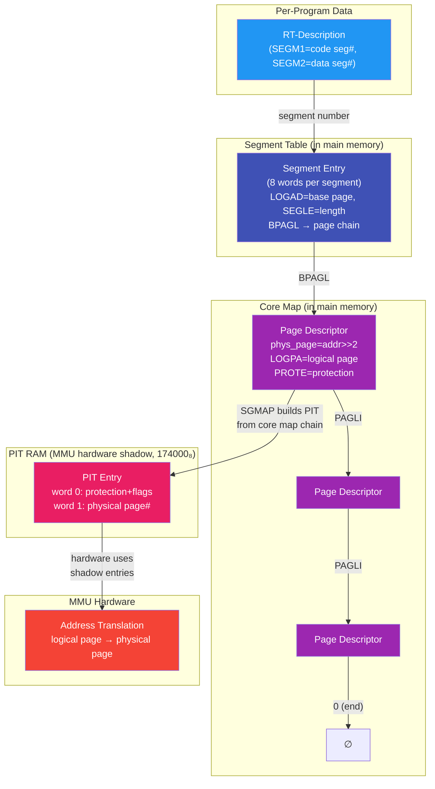
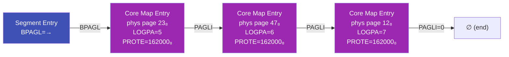
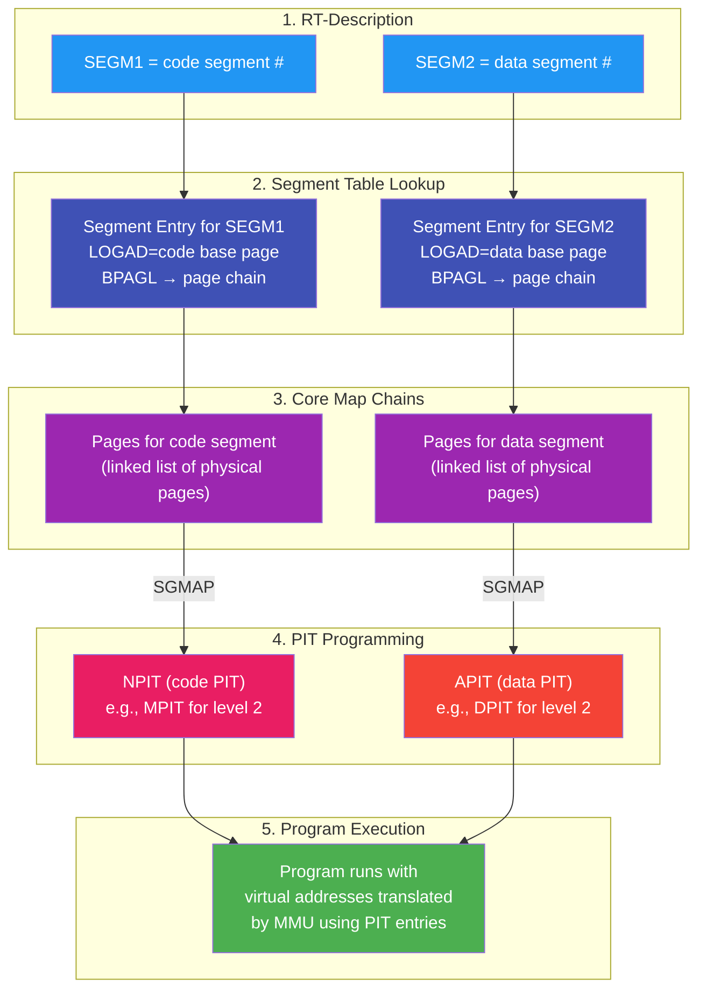

# SINTRAN III Internal Memory Structures - Verified Reference

> **Methodology**: Every field offset and symbol value in this document was verified by directly
> grepping the NPL symbol table files (`SYMBOL-1-LIST.SYMB.TXT`, `SYMBOL-2-LIST.SYMB.TXT`,
> `N500-SYMBOLS.SYMB.TXT`) across all three SINTRAN versions (K03, L07, M06) and cross-referenced
> against actual NPL source code access patterns. Nothing was copied from existing `.md` files.
> Items marked **UNVERIFIED** or **INFERRED** lack direct source confirmation.

> **ND-100 Word Size**: The ND-100 is a 16-bit machine with a 16-bit data bus. ALL memory
> locations and structure fields are 16-bit words (2 bytes). There is no byte addressing
> from the ND-100's perspective. When this document says a field is "16-bit" it means one
> ND-100 word. Fields requiring more than 16 bits (e.g., 32-bit timestamps) span two
> consecutive 16-bit words. All addresses and offsets in this document are in **octal**
> unless explicitly marked otherwise.

---

## Table of Contents

1. [Interrupt Level Usage](#1-interrupt-level-usage)
2. [RT-Description (Program Control Block)](#2-rt-description-program-control-block)
3. [Register Save Block](#3-register-save-block)
4. [Status Bits (STATU Word)](#4-status-bits-statu-word)
5. [Background Programs](#5-background-programs)
6. [Segments, Core Map, and the MMU](#6-segments-core-map-and-the-mmu)
7. [Queue Structures](#7-queue-structures)
8. [I/O Datafield (Device Control Block)](#8-io-datafield-device-control-block)
9. [ND-500 Process Descriptor](#9-nd-500-process-descriptor)
10. [Global Root Pointers and Queue Heads](#10-global-root-pointers-and-queue-heads)
11. [System Information Table (SYSEVAL)](#11-system-information-table-syseval)
12. [Boot State Detection Variables](#12-boot-state-detection-variables)
13. [Page Table Configuration (PIT/PCR System)](#13-page-table-configuration-pitpcr-system)
14. [Cross-Version Symbol Comparison](#14-cross-version-symbol-comparison)
15. [Corrections to Existing Documentation](#15-corrections-to-existing-documentation)

---

## 1. Interrupt Level Usage

The ND-100 supports 16 interrupt levels (0-15). SINTRAN III assigns each level a specific
function, with higher numbers having higher priority. This assignment is from SINTRAN III
version J onwards.

| Level | Priority | Function |
|:---:|:---:|---|
| 15 | Highest | Extremely fast user interrupts |
| 14 | | Internal interrupts |
| 13 | | Real Time Clock, HDLC drivers |
| 12 | | Terminal Input & ND-100 - ND-500 Communication |
| 11 | | Mass storage Input/Output |
| 10 | | Terminal output |
| 6-9 | | Direct tasks |
| 5 | | XMSG |
| 4 | | I/O Monitor calls |
| 3 | | Segment administration |
| 2 | | SINTRAN III Monitor |
| 1 | | Real time programs and Background programs |
| 0 | Lowest | Idle loop |

> **Source**: SINTRAN III version J interrupt level assignment.

### Key Observations

- **Level 0 (Idle loop)**: The lowest priority — runs only when nothing else needs the CPU.
  The `DUMMY` RT program runs at this level.
- **Levels 1-5 (Software/OS services)**: These handle OS kernel functions from user programs
  (level 1) up through XMSG messaging (level 5).
- **Levels 6-9 (Direct tasks)**: Four levels reserved for direct (real-time) task execution.
- **Levels 10-13 (Hardware I/O)**: Device interrupt handlers, ordered by urgency — terminal
  output (10) through real-time clock and HDLC (13).
- **Level 14 (Internal interrupts)**: CPU-internal events (traps, faults).
- **Level 15 (Fast user interrupts)**: Highest priority, for time-critical user interrupt
  routines that cannot tolerate any latency.

### Relationship to RT-Description

The interrupt level a program runs at is related to its priority (PRITY field at offset 003₈
in the RT-Description). Programs at levels 1 and above with the `5INT` status bit (bit 014₈)
set are interrupt-level programs that execute directly at their assigned interrupt level
rather than being scheduled through the execution queue.

---

## 2. RT-Description (Program Control Block)

The RT-Description is the fundamental process control block in SINTRAN III. Each RT program
has one RT-Description entry in a contiguous table starting at `RTSTA`.

**Size**: `5RTSI=000026` octal = **22 decimal words** (44 bytes)

> **Source**: K03/SYMBOL-1-LIST line 248: `5RTSI=000026`
> Confirmed identical in L07 (line 1454) and M06 (line 1500).

### Complete Field Layout

All offsets verified from `K03/SYMBOL-1-LIST.SYMB.TXT` lines 204-230 and confirmed identical
across L07 and M06.

> **Word size**: All fields are 16-bit words (the ND-100 data bus width). Fields marked
> "32-bit" span two consecutive 16-bit words (high word first, low word second).

| Offset (Oct) | Offset (Dec) | Width | Symbol(s) | Description | Source Line (K03) |
|:---:|:---:|:---:|---|---|---|
| 000 | 0 | 16-bit | TLINK | Time queue link pointer (address of next RT-Desc in time queue, 0=end) | 204 |
| 001 | 1 | 16-bit | STATU | Status bit flags (see [Status Bits](#4-status-bits-statu-word)) | 205 |
| 002 | 2 | 16-bit | INPRI | Initial priority (set at program load) | 206 |
| 003 | 3 | 16-bit | PRITY / TYPRI | Priority / Type+Ring (contains ring level in low bits) | 207, 298 |
| 004-005 | 4-5 | 32-bit | DTIM1+DTIM2 / DTIME | Delay time (DTIM1=high word, DTIM2=low word). Aliases: DTIME=INTSL=004₈ | 208-211 |
| 006-007 | 6-7 | 32-bit | DTIN1+DTIN2 / DTINT | DT interval (DTIN1=high word, DTIN2=low word) | 212-214 |
| 010 | 8 | 16-bit | STADR | Start address (entry point for program execution) | 215 |
| 011 | 9 | 16-bit | SEGM1 / DSEGM | Program segment number (code segment) | 216, 218 |
| 012 | 10 | 16-bit | SEGM2 | Data segment number | 217 |
| 013 | 11 | 16-bit | WLINK / 5WLIN | Execution/wait queue link (next RT-Desc in exec or wait queue) | 219, 250 |
| 014 | 12 | 16-bit | ACT1S / DACTS | Active segment 1 (currently loaded program segment) | 220, 222 |
| 015 | 13 | 16-bit | ACT2S | Active segment 2 (currently loaded data segment) | 221 |
| 016 | 14 | 16-bit | INIPR | Initial priority register (saved initial PCR value) | 223 |
| 017 | 15 | 16-bit | ACTPR | Active priority / PCR value (current ring and priority) | 224 |
| 020 | 16 | 16-bit | BRESL / 5BRES | Reservation queue head (link to first reserved I/O datafield) | 225, 249 |
| 021 | 17 | 16-bit | RSEGM | Reentrant segment number | 226 |
| 022 | 18 | 16-bit | BUFWI | Buffer window page number (for ND-500 buffer access) | 227 |
| 023 | 19 | 16-bit | TRMWI | Terminal window page number | 228 |
| 024 | 20 | 16-bit | N5WIN | ND-500 window page number (for ND-500 address mapping) | 229 |
| 025 | 21 | 16-bit | RTDLG | RT data log address (16-bit pointer to register save block) | 230 |

### Key Notes

- **DTIME=DTIM1=INTSL** all map to offset 004 (three alias names for the same word)
- **DSEGM=SEGM1** both map to offset 011 (alias)
- **DACTS=ACT1S** both map to offset 014 (alias)
- **DTINT=DTIN1** both map to offset 006 (alias)
- **PRITY** at offset 003 and **TYPRI** at offset 003 are the same field
  (NPL source accesses it as both `.PRITY` and `.TYPRING` depending on context)
- **RTDLG** at offset 025 is a pointer to a SEPARATE register save block - registers
  are NOT stored inline within the RT-Description

### RT-Description Table Layout

```
RTSTA (004020₈) ──► ┌─────────────────────────┐
                    │  RT-Desc #0 (26₈ words) │
                    ├─────────────────────────┤
                    │  RT-Desc #1 (26₈ words) │
                    ├─────────────────────────┤
                    │  ...                    │
                    ├─────────────────────────┤
                    │  RT-Desc #N             │
RTEND (004323₈) ──► └─────────────────────────┘
```

**Address computation**: `RT_desc_address = RTSTA + (rt_number × 5RTSI)`

> Source: NPL code `A-"9FBPR"=:D:=0; T:=5RTSIZE; *RDIV ST`
> (CC-P2-COMMON.NPL line 40) shows division by RT-Description size to get index.

### RT Program Names (Reverse Lookup from SYMBOL-2-LIST)

RT program names are **NOT stored as strings in memory**. Instead, each RT-Description
has a corresponding entry in `SYMBOL-2-LIST.SYMB.TXT` that maps its name to its
RT-Description address. To find the name of an RT program given its address, perform
a **reverse lookup** in SYMBOL-2-LIST.

Every adjacent pair of RT entries is separated by exactly 26₈ (22 decimal) words,
confirming the RT-Description size.

> **Source**: L07/SYMBOL-2-LIST.SYMB.TXT lines 102-170 (system RTs),
> 174-308 (background programs)

#### System RT Programs (L07)

| Name  | Address (Oct) | Purpose |
|-------|:---:|---|
| DUMMY | 012071 | Idle/dummy process (RT#0) |
| STSIN | 012117 | SINTRAN startup |
| RTERR | 012145 | RT error handler |
| 1SWAP | 012173 | Swap manager 1 |
| TIMRT | 012221 | Timer RT program |
| RTDIL | 012247 | RT data integrity log |
| DIMWD | 012275 | DIM watchdog |
| BPTMP | 012323 | Background program timer |
| RTSLI | 012351 | RT slicer (time-slice scheduler) |
| ACCRT | 012377 | Accounting RT |
| TERMP | 012425 | Terminal processor |
| 5SWAP | 012453 | Swap manager 5 |
| RWRT1 | 012501 | Read/write RT 1 |
| RWRT2 | 012527 | Read/write RT 2 |
| RWRT3 | 012555 | Read/write RT 3 |
| RWRT5 | 012603 | Read/write RT 5 |
| RWRT7 | 012631 | Read/write RT 7 |
| RWRT8 | 012657 | Read/write RT 8 |
| RWRT9 | 012705 | Read/write RT 9 |
| RTRFA | 012733 | RT remote file access |
| DUMM2 | 012761 | Dummy 2 |
| SPRT1-SPRT9 | 013007-013267 | Spool RT programs 1-9 |
| SPR10-SPR16 | 013315-013521 | Spool RT programs 10-16 |
| COSPO | 013547 | Console spool |
| RWR10-RWR42 | 013575-014131 | Read/write RTs 10-42 |
| TADAD | 014157 | TAD administration |
| UDR01-UDR06 | 014205-014363 | User-defined RTs 1-6 |
| XROUT | 014411 | X-route (communication) |
| XTRAC | 014437 | X-trace |
| XMFID | 014465 | XMSG FIDO handler |
| NKSER | 014513 | Network server |
| NKNAM | 014541 | Network name service |
| ERSWD | 014567 | Error/swap watchdog |
| PROMA | 014615 | Process manager |
| EVMES | 014643 | Event message handler |
| BOPCO | 014671 | Background OPCOM |
| MTSER | 014717 | Magnetic tape server |
| RTREC | 014745 | RT recovery |

#### Background Programs (L07)

Background programs are allocated in the range 9FBPR to 9LBPR:

| Range | Names | Address Range (Oct) |
|-------|-------|:---:|
| Terminal/TAD BG | BAK01-BAK121 | 023337-030431 |
| Batch BG | BCH01-BCH10 | 030505-031013 |

**Boundary markers** (identical name at same address as first/last BG entry):
- `9FBPR=023337` = `BAK01` (first background program)
- `9LTBP=030505` = `BCH01` (first batch background = last terminal BG + 1)
- `9LBPR=031041` = `THISS` = `ERTBS` (end of background program table)

#### Cross-Version Address Comparison

RT program names are stable across versions, but their addresses change:

| Name | K03 | L07 | M06 |
|------|:---:|:---:|:---:|
| DUMMY | 057360 | 012071 | 012146 |
| STSIN | 057406 | 012117 | 012174 |
| 5SWAP | 057714 | 012453 | 012530 |
| BAK01 | 066642 | 023337 | 024714 |

> The 26₈ word spacing between entries is **identical across all three versions**,
> confirming 5RTSI is a compile-time constant.

### NPL Access Patterns

Field access uses the `.` operator with the base address in X register:

```npl
X.STATUS BONE 5RTOFF=:X.STATUS     % Set bit 5RTOFF in status word
                                    % (RP-P2-1.NPL line 46)

X.STATUS BZERO 5WAIT =: X.STATUS   % Clear WAIT bit
                                    % (RP-P2-1.NPL line 459)

A=:RTREF.N5WINDOW                  % Store value into N5WIN field
                                    % (5P-P2-MON60.NPL line 1245)

RTREF.BRESLINK                     % Access reservation queue head
                                    % (5P-P2-MON60.NPL line 1062)

RTREF+"BRESLINK"=:X                % Compute address of BRESLINK field
                                    % (5P-P2-MON60.NPL line 1121)
```

---

## 3. Register Save Block

The register save block is a SEPARATE memory area, NOT part of the RT-Description.
It is pointed to by the **RTDLG** field (offset 025₈) in the RT-Description.

**Size**: At least 20₈ (16 decimal) words (8 registers + 8 bitmap words)

> Source: K03/SYMBOL-1-LIST lines 231-246

### CPU Register Save Area

All ND-100 registers are 16 bits wide. Each saved register occupies one 16-bit word.

| Offset (Oct) | Width | Symbol | Register | Source Line (K03) |
|:---:|:---:|---|---|---|
| 000 | 16-bit | DPREG | P register (Program Counter) | 231 |
| 001 | 16-bit | DXREG | X register (Index) | 232 |
| 002 | 16-bit | DTREG | T register (Temporary) | 233 |
| 003 | 16-bit | DAREG | A register (Accumulator) | 234 |
| 004 | 16-bit | DDREG | D register (Double/Data) | 235 |
| 005 | 16-bit | DLREG | L register (Link/Return) | 236 |
| 006 | 16-bit | DSREG | S register (Stack Pointer) | 237 |
| 007 | 16-bit | DBREG | B register (Base) | 238 |

### Bitmap Area (5BITM=000010₈)

Starting at offset 010₈ within the register save block. Each bitmap word is 16 bits,
giving a total of 8 × 16 = **128 bits** for page tracking.

| Offset (Oct) | Width | Symbol | Source Line (K03) |
|:---:|:---:|---|---|
| 010 | 16-bit | BITMA / 5BITM | 239, 251 |
| 011 | 16-bit | BITM1 | 240 |
| 012 | 16-bit | BITM2 | 241 |
| 013 | 16-bit | BITM3 | 242 |
| 014 | 16-bit | BITM4 | 243 |
| 015 | 16-bit | BITM5 | 244 |
| 016 | 16-bit | BITM6 | 245 |
| 017 | 16-bit | BITM7 | 246 |

> **BITM0-BITM7** form an 8-word (128-bit) bitmap used for page table dirty/accessed tracking.
> The `5BITM` alias confirms this is at offset 010₈ from the register block base.

### NPL Access Pattern

Register save/restore uses indexed load/store with the RTDLG address:

```npl
X:=X.RTDLGADDR; T:=0; *DxREG@3 LDATX/STATX
```

This loads X with the register save block address from RTDLG, then uses
indexed addressing (`@3`) to access each register field sequentially.

---

## 4. Status Bits (STATU Word)

The STATU word at RT-Description offset 001₈ contains bit flags defining the
program's current state. All bit positions are verified from K03/SYMBOL-1-LIST
lines 280-293 and confirmed in L07/M06.

| Bit (Oct) | Bit (Dec) | Symbol | Meaning | Source Line (K03) |
|:---:|:---:|---|---|---|
| 000 | 0 | 5BACK | Background program flag | 293 |
| 001 | 1 | 5USED | RT-Description in use | 292 |
| 002 | 2 | 5TSLI | Time-sliced program | 291 (L07: 1004) |
| 003 | 3 | 5ESCF | Escape priority flag | 290 (L07: 909) |
| 004 | 4 | 5BRKF | Break flag | 289 |
| 005 | 5 | 5SPRF | **UNVERIFIED** - Spool/special flag | 288 |
| 006 | 6 | 5XMSY | XMSG synchronization | L07: 480 |
| 010 | 8 | 5SWWA | Swap wait | 287 |
| 011 | 9 | 5RTOF | RT program OFF / inhibited | 286 |
| 012 | 10 | 5TMOU | Timeout | 285 (L07: 365) |
| 013 | 11 | 5ABS | **INFERRED** - Absolute addressing mode | 284 |
| 014 | 12 | 5INT | Interrupt-level program | 283 |
| 015 | 13 | 5RWAI | Resource wait | 282 |
| 017 | 15 | 5WAIT | I/O wait (in wait queue) | 280 |

> **Bit 017 (5WAIT)** is the highest defined status bit. When set, the program is
> waiting for I/O completion.

### NPL Status Bit Operations

```npl
X.STATUS BONE 5RTOFF=:X.STATUS     % Set: program OFF
X.STATUS BZERO 5WAIT=:X.STATUS     % Clear: no longer waiting
IF A.STATUS BIT 5INT THEN ...       % Test: interrupt-level?
IF A.STATUS BIT 5BACKGR THEN ...    % Test: background program?
IF A.STATUS NBIT 5BACKGR THEN ...   % Test: NOT background?
```

> Source: RP-P2-1.NPL lines 45-47, 79, 196, 459

---

## 5. Background Programs

Background programs are RT-Descriptions with the `5BACK` status bit set (bit 0
of STATU). They are stored as a contiguous range within the RT-Description table.

### Background Program Address Range

These are ABSOLUTE memory addresses (not offsets). They change across versions.

| Symbol | K03 | L07 | M06 | Source |
|---|---|---|---|---|
| 9FBPR | 066642₈ | 023337₈ | 024714₈ | SYMBOL-2-LIST |
| 9LTBP | 073660₈ | 030505₈ | 035422₈ | SYMBOL-2-LIST |
| 9LBPR | 074214₈ | 031041₈ | 035756₈ | SYMBOL-2-LIST |

- **9FBPR**: First Background Program RT-Description
- **9LTBP**: Last Terminal/TAD Background Program (boundary between terminal and batch)
- **9LBPR**: Last Background Program RT-Description

### Background Program Table (SBPRTAB)

A separate table tracks background program metadata (not the same as the RT-Description).

| Symbol | K03 | L07 | M06 | Source |
|---|---|---|---|---|
| SBPRT | 115257₈ | 136163₈ | 137410₈ | SYMBOL-2-LIST |

> **BPRTS=000013₈** (K03 line 1131), **BPRTM=000000₈** (K03 line 1125) define
> field offsets within each background process table entry.

### Detection Logic

NPL code identifies background programs by address range checking:

```npl
IF A>>="9FBPR" AND A<<"9LBPR" THEN
   IF A<<"9LTBP" THEN           % Terminal/TAD background program
      A-"9FBPR"=:D:=0; T:=5RTSIZE; *RDIV ST
      EXITA                     % A = BG program index
   FI
   A-"2THSS"=:D:=0; T:=5RTSIZE; *RDIV ST
   A+MXTBPROGS; EXITA           % Batch background program
FI; EXIT                         % Not a background program
```

> Source: CC-P2-COMMON.NPL lines 37-47 (GBPIUSINDX subroutine)

### Background Process Table Entry Fields

| Offset (Oct) | Symbol | Description | Source Line (K03) |
|:---:|---|---|---|
| 000 | BPRTM | **INFERRED** - Timer/status | 1125 |
| 001 | BPCFI | **INFERRED** - Config info | 1126 |
| 013 | BPRTS | **INFERRED** - Size/type | 1131 |

> These offsets are verified from the symbol table but their exact meanings are
> INFERRED from context. The source code references `CBPTE@3`, `BBPRO@3`,
> and `BPRFL@3` as indexed fields (MP-P2-1.NPL lines 73-78).

---

## 6. Segments, Core Map, and the MMU

This section explains SINTRAN III's entire memory management pipeline: how segments,
the core map, and the MMU hardware work together to give each program its own virtual
address space.

### 6.1 Why Segments Exist

The ND-100 has a 16-bit address space (64KW = 128KB per program). But the system runs
many programs, each needing its own code and data in memory. SINTRAN solves this with
**segments** — named regions of logical address space that can be:

- **Mapped** to different physical pages for each program
- **Swapped** to/from disk when physical memory runs out
- **Shared** between programs (reentrant code segments)
- **Protected** with read/write/execute permissions per page

Each RT program has at least two segments (code + data), and each segment is mapped
into the program's logical address space by programming the MMU's page tables.

### 6.2 The Big Picture — Data Flow



**Key insight**: The segment table and core map in main memory are the **master copy**
of all page mappings. The PIT RAM at 174000₈ is a hardware **shadow** that the MMU
reads during address translation. SINTRAN builds PIT entries FROM the core map data,
not the other way around.

### 6.3 Segment Table Entry Layout

Each segment has an 8-word entry in a contiguous table starting at SEGST.

**Entry Size**: `5SEGS=000010₈` = 8 words per segment

> Source: K03/SYMBOL-1-LIST line 364: `5SEGS=000010`

All offsets from K03/SYMBOL-1-LIST lines 349-356. Each field is one 16-bit word.

| Offset (Oct) | Offset (Dec) | Width | Symbol | Description | Source Line (K03) |
|:---:|:---:|:---:|---|---|---|
| 000 | 0 | 16-bit | SEGLI | Segment link (address of next segment in chain, 0=end) | 349 |
| 001 | 1 | 16-bit | PRESE | Previous segment pointer (back-link) | 350 |
| 002 | 2 | 16-bit | LOGAD | Logical address (base page number in virtual address space) | 351 |
| 003 | 3 | 16-bit | SEGLE | Segment length (number of pages) | 352 |
| 004 | 4 | 16-bit | MADR | Mass storage address (disk location for swap) | 353 |
| 005 | 5 | 16-bit | FLAG | Segment flags (bit field, see below) | 354 |
| 006 | 6 | 16-bit | SGSTA | Segment status word (bit field, see below) | 355 |
| 007 | 7 | 16-bit | BPAGL | Begin page link (address of first page descriptor in core map) | 356 |

### 6.4 Segment Status Bits (SGSTA / FLAG)

From K03/SYMBOL-1-LIST lines 357-380:

| Bit (Oct) | Symbol | Meaning | Source Line (K03) |
|:---:|---|---|---|
| 000 | 5OK | Segment OK | 357 |
| 001 | 5INHB | Inhibited | 358 |
| 004 | 5SREE | Shared/reentrant | 361 |
| 005 | 5FIXC | Fixed in core | 362 |

### 6.5 Core Map — The Master Page Table

The **core map** is an array of 4-word entries in main memory, one entry per **physical
page** of RAM. It is the master record of which physical page maps to which logical page,
with what protection, and which segment it belongs to.

> **Source**: Field offsets from L07/SYMBOL-1-LIST: PAGLI=000000 (line 1708),
> PROTE=000002 (line 1665), LOGPA=000003 (line 3532).

#### Core Map Entry Layout (4 words per physical page)

| Offset (Oct) | Width | Symbol | Description | Source |
|:---:|:---:|---|---|---|
| 000 | 16-bit | PAGLI | Page link — address of next page descriptor in this segment's chain (0=end) | L07:1708 |
| 001 | 16-bit | — | **UNVERIFIED** — Flags or segment back-reference | — |
| 002 | 16-bit | PROTE | Protection/status bits (written to PIT entry word 0) | L07:1665 |
| 003 | 16-bit | LOGPA | Logical page number (where this physical page appears in virtual space) | L07:3532 |

#### Physical Page Number Encoding

The physical page number is NOT stored as a field — it is **implicit in the entry's
address**. Each entry is 4 words, so:

```
physical_page_number = entry_address >> 2    (= entry_address / 4)
entry_address = physical_page_number × 4
```

> Source: PH-P2-RESTART.NPL line 419: `D:=X SHZ -2  % D=PHYSICAL PAGE`
> and IP-P2-SEGADM.NPL line 603: `D:=X SHZ -2  % COMPUTE PAGE NUMBER.`

#### Core Map Root Pointers

| Symbol | Address (Oct) | Description | Source |
|---|:---:|---|---|
| CORMS | 004021₈ | Core map start (offset within bank) | L07:2350 |
| CORMB | 004322₈ | Core map physical bank number (T register for LDXTX/LDATX) | L07:3032 |
| SEGTB | 004320₈ | Segment table physical bank number (T register for LDXTX/LDATX) | L07:3031 |
| SEGST | 004321₈ | Segment table offset within bank | L07:2450 |

> **All four addresses are on page 2** (004000₈-005777₈), which is identity-mapped.
> Their values can be read directly from a physical memory dump. See
> [Section 6.14](#614-privileged-physical-memory-access-ldxtxldatx) for how these
> bank numbers are used with LDXTX/LDATX to access physical memory.

### 6.6 How a Segment's Pages Are Linked

Each segment entry's **BPAGL** field (offset 007₈) points to the first core map entry
in a linked list. The list connects all physical pages that belong to that segment:



**Walking the chain** (pseudocode):
```
Read BPAGL from segment entry → first core map entry address (X)
Set bank register T := CORMBANK
While X != 0:
    physical_page = X >> 2           (from entry address)
    logical_page  = X.LOGPA          (offset 3)
    protection    = X.PROTE          (offset 2)
    → This page maps: logical_page → physical_page with protection
    X = X.PAGLI                      (offset 0, follow chain)
```

> Source: PH-P2-RESTART.NPL SGMAP routine, lines 416-426.

### 6.7 How SGMAP Builds PIT Entries from the Core Map

The SGMAP subroutine reads the core map chain for a segment and writes corresponding
entries into PIT RAM. This is how the software page table (core map) becomes the
hardware page table (PIT):

```npl
% PH-P2-RESTART.NPL lines 416-426
SGMAP: A*5SEGSIZE+SEGSTART=:X       % Find segment table entry
       T:=SEGTBANK; *BPAGL@3 LDXTX  % X := segment.BPAGL (first page descriptor)
       T:=CORMBANK
       DO WHILE X><0                 % Walk page chain until end (X=0)
          D:=X SHZ -2               % D = physical page number
          *LOGPA@3 LDATX            % A = logical page number (from core map)
          A SH 1 +174000=:B         % B = PIT RAM address (logical_page*2 + 174000₈)
          *PROTE@3 LDATX            % A = protection bits (from core map)
          *POF; STD ,B; PON         % Write to PIT RAM: (protection, phys_page)
          *PAGLI@3 LDXTX            % X = next page descriptor (follow chain)
       OD
```

**What this does step by step:**
1. Looks up the segment in the segment table (by segment number × entry size)
2. Reads BPAGL — the first page descriptor in the core map chain
3. For each page descriptor in the chain:
   - Extracts the physical page number (from the entry's address ÷ 4)
   - Reads the logical page number (LOGPA field)
   - Computes the PIT RAM address: `logical_page × 2 + 174000₈`
   - Reads the protection bits (PROTE field)
   - Turns paging OFF (`*POF`), writes protection + physical page to PIT RAM, turns paging ON (`*PON`)
4. Follows PAGLI to the next page in the chain

### 6.8 The Page Fault Handler (IP-P2-SEGADM.NPL)

When a program accesses a page that isn't in the PIT, the MMU generates a page fault
(level 14 interrupt). The page fault handler in IP-P2-SEGADM.NPL:

1. **Finds the faulted page** in the PIT to confirm it's empty:
   ```npl
   A SH 1 \/ 174000=:X:=X.S0    % Get PIT entry for faulted page
   IF A><0 THEN CALL ERRFATAL FI  % Entry was not 0 — should not fault!
   ```
   > Source: IP-P2-SEGADM.NPL line 321-322.

2. **Allocates a physical page** and creates a core map entry

3. **Writes the PIT entry** using the same pattern:
   ```npl
   A SH 1 \/ 174000=:B          % B = PIT address for logical page
   *PROTE@3 LDATX               % Get protection from core map
   D:=X SHZ -2                  % Get physical page from core map entry address
   AD=:PITENTRY                 % Write to PIT RAM (with *POF/*PON)
   ```
   > Source: IP-P2-SEGADM.NPL STPAGE routine, lines 598-606.

4. **Clears PIT entries** when swapping out:
   ```npl
   A SH 1 \/ 174000=:B          % B = PIT address for logical page
   0=:PITPROTECT                % Clear PIT entry (with *POF/*PON)
   ```
   > Source: IP-P2-SEGADM.NPL CLPAGE routine, lines 588-594.

### 6.9 Named Kernel Segments

SINTRAN defines specific segment numbers for kernel subsystems. Each maps into a
specific PIT (see [Section 13](#13-page-table-configuration-pitpcr-system)):

| Segment # (Oct) | Symbol | Maps Into PIT | Purpose | Source |
|:---:|---|---|---|---|
| 023 | 5DPIT | DPIT #7₈ | Data/DMA segment | L07:274 |
| 035 | 5MPIT | MPIT #12₈ | Main kernel segment | L07:277 |
| 047 | 5RPIT | RPIT #10₈ | RT/real-time segment | L07:278 |
| 051 | 55PIT | 5PIT #5₈ | ND-500 segment | L07:279 |
| 064 | 5ECOM | (shared) | Extended common segment | L07:1092 |
| 067 | 5IPIT | IPIT #15₈ | I/O/interrupt segment | L07:281 |

> Each named segment contains kernel code/data that must be accessible when running
> at the corresponding interrupt level. For example, 5MPIT (segment 35₈) contains
> the kernel code needed by levels 1, 2, 12₈, 14₈, 15₈, 16₈ — all of which use
> MPIT as their Normal PIT.

### 6.10 How a Program Gets Its Address Space

When SINTRAN schedules an RT program, it sets up the MMU so the program's segments
are mapped into its logical address space. The complete flow:



### 6.11 Page Protection Bits (PROTE field → PIT entry word 0)

The PROTE field in the core map becomes word 0 of the PIT entry. Key values:

| Value (Oct) | Meaning |
|:---:|---|
| 162000 | Page present, write-enabled (standard kernel page) |
| 163000 | Page present, write-enabled, ring 3 accessible |
| 0 | Page not present (will cause page fault) |

> The exact bit layout of PROTE matches the ND-100 MMU's PIT entry format
> for the protection/status word. See ND-100 hardware reference for full bit definitions.

**Page flags** (in core map or PIT context):

| Bit (Oct) | Symbol | Meaning | Source Line (K03) |
|:---:|---|---|---|
| 000 | 5NCLS | Not closed | 369 |
| 001 | 5FIX | Fixed page | 370 |
| 004 | 5CMSY | Common system page | 373 |
| 005 | 5CMRE | Common reentrant page | 374 |
| 013 | 5PGU | Page used | 376 |
| 014 | 5WIP | Write in progress | 377 |
| 015 | 5FPM | Fixed in physical memory | 378 |
| 017 | 5WPM | Write-protected in memory | 380 |

### 6.12 Segment Table Root Pointers

| Symbol | Address (Oct) | Description | Source |
|---|:---:|---|---|
| SEGTB | 004320₈ | Segment table physical bank number (T register for LDXTX/LDATX) | L07:3031 |
| SEGST | 004321₈ | Segment table offset within bank (X displacement for LDXTX/LDATX) | L07:2450 |
| CORMB | 004322₈ | Core map physical bank number (T register for LDXTX/LDATX) | L07:3032 |
| CORMS | 004021₈ | Core map start/size | L07:2350 |

> **Address computation**: `segment_entry_address = SEGST_value + (segment_number × 5SEGS)`
>
> Where `SEGST_value` is the content of location 004321₈ (offset within the bank),
> and `5SEGS=000010₈` (8 words per entry).
>
> These are accessed via **LDXTX/LDATX privileged instructions** which generate
> 24-bit physical addresses that bypass the MMU entirely. See [Section 6.14](#614-privileged-physical-memory-access-ldxtxldatx).

### 6.13 Summary: From Segment Number to Physical Address


The PIT entry was built by SGMAP reading from the core map chain. So tracing
backwards from a logical address to the physical address:

1. **Logical address** → extract page number (upper 6 bits) and offset (lower 10 bits)
2. **PIT lookup** → PIT entry at `page_number × 2 + 174000₈` gives physical page
3. **Physical address** = physical page × 1024 + offset

And the PIT was populated from:

1. **Segment number** → segment table entry (via SEGST + segment# × 8)
2. **BPAGL field** → first core map entry in chain
3. **Core map chain** → each entry maps one logical page to one physical page

### 6.14 Privileged Physical Memory Access (LDXTX/LDATX)

The segment table and core map reside in main memory well beyond the first 64KW bank.
SINTRAN accesses them using **LDXTX/LDATX/STATX/STDTX** — privileged ND-100
instructions that generate 24-bit physical addresses and **bypass the MMU entirely**.

#### How LDXTX/LDATX Work

These instructions use the T and X registers to form a 24-bit physical address:

```
24-bit effective address = (T << 16) | ((X + displacement) & 0xFFFF)

Where:
  T register  = upper 8 bits (bank selector, 0-255)
  X register  = lower 16 bits (offset within bank)
  displacement = 0-7 from instruction format (the @3 field in NPL)
```

- **LDXTX**: Load X register from physical memory at `(T << 16) | (X + disp)`
- **LDATX**: Load A register from physical memory at `(T << 16) | (X + disp)`
- **STATX**: Store A register to physical memory at `(T << 16) | (X + disp)`
- **STDTX**: Store D register to physical memory at `(T << 16) | (X + disp)`

These are **privileged instructions** — they can only execute at ring 0. They access
physical memory directly with no page table involvement whatsoever.

> **NPL syntax**: When NPL source writes `*BPAGL@3 LDXTX`, the `@3` is the displacement
> field (0-7) that gets added to X. So `*BPAGL@3 LDXTX` means: load X from physical
> address `(T << 16) | (X + BPAGL_offset)`. The T register was set earlier with
> `T:=SEGTBANK` or `T:=CORMBANK`.

#### How SINTRAN Uses These Instructions

In the SGMAP routine (PH-P2-RESTART.NPL line 416-426):

```
T:=SEGTBANK              % T = physical bank of segment table
*BPAGL@3 LDXTX           % X = word at physical addr (SEGTBANK<<16) | (X + 7)
                          % This reads segment.BPAGL from the segment table
T:=CORMBANK              % T = physical bank of core map
*LOGPA@3 LDATX           % A = word at physical addr (CORMBANK<<16) | (X + 3)
                          % This reads core_map_entry.LOGPA
```

No MMU page table is consulted. The physical address is computed directly from T and X.

#### SEGTBANK and CORMBANK Are Just Physical Bank Numbers

The values stored at SEGTB (004320₈) and CORMB (004322₈) are simply the **upper 8 bits
of a 24-bit physical address** — i.e., which 64KW bank the structure resides in.

#### Verified Values from Physical Memory Dump

Reading the root pointers from the identity-mapped area of a 256KW dump:

| Pointer | Address | Value (Oct) | Value (Dec) | Physical Location |
|---|:---:|:---:|:---:|---|
| SEGTB | 004320₈ | 000140₈ | 96 | Bank 96 (physical word 6,291,456+) |
| SEGST | 004321₈ | 000002₈ | 2 | Offset 2 within bank 96 |
| CORMB | 004322₈ | 000025₈ | 21 | Bank 21 (physical word 1,376,256+) |
| CORMS | 004021₈ | — | — | Core map size/start |

**Physical addresses**:
- Segment table: `(96 << 16) + 2 = 6,291,458` words = word 6,291,458 in physical RAM
- Core map: `(21 << 16) = 1,376,256` words = word 1,376,256 in physical RAM

> Both structures are far beyond the first 256KW of physical memory. A dump of only 256KW
> (the first 4 banks) cannot contain the segment table or core map. Accessing these
> structures requires either a full physical memory dump or the emulator's LDXTX/LDATX
> support.

### 6.15 Practical Implications for Physical Memory Dump Analysis

To reconstruct the MMU mapping from a physical memory dump:

1. Read SEGTB (004320₈) → physical bank number of segment table
2. Read SEGST (004321₈) → offset within that bank
3. Read CORMB (004322₈) → physical bank number of core map
4. Compute physical addresses: `seg_table = (SEGTB << 16) + SEGST`, `core_map = (CORMB << 16)`
5. For each segment, read its 8-word entry at `seg_table + (segment_number × 8)`
6. Follow the BPAGL chain through the core map
7. Each core map entry gives: logical_page (LOGPA), physical_page (address>>2), protection (PROTE)

**Requirements**: The dump must cover the physical addresses where the segment table and core
map reside. For the values observed (bank 96 and bank 21), the dump needs to be at least
6.3 million words (~12.6 MB) to include the segment table.

**PIT RAM at 174000₈**: The PIT RAM area (174000₈-177777₈) in a physical memory dump
does **not** reliably contain the actual MMU hardware state. The emulator typically
maintains PIT entries in a separate internal data structure. To get the actual PIT
mappings, use an emulator MMU dump feature rather than reading physical memory at
these addresses.

---

## 7. Queue Structures

SINTRAN III maintains several queues using linked lists through fields in the
RT-Description. All link fields are verified from symbol tables.

### 7.1 Time Queue

Programs waiting for a time delay are linked through the **TLINK** field.

```
BTIMQ (004012₈) ──► RT-Desc ──► RT-Desc ──► RT-Desc ──► 0 (end)
                     [TLINK]     [TLINK]     [TLINK]
```

- **Queue head**: `BTIMQ=004012₈` (all versions)
- **Link field**: `TLINK` at RT-Description offset 000₈
- **Time fields**: `DTIM1` (offset 004₈), `DTIM2` (offset 005₈) = 32-bit delay time
- **Ordering**: Time-ordered (earliest expiration first)
- **Type**: Linear singly-linked list

### 7.2 Execution Queue

Ready-to-run programs are linked through the **WLINK** field.

```
BEXQU (004013₈) ──► RT-Desc ──► RT-Desc ──► RT-Desc ──► (circular back to first)
                     [WLINK]     [WLINK]     [WLINK]
```

- **Queue head**: `BEXQU=004013₈` (all versions)
- **Link field**: `WLINK` at RT-Description offset 013₈
- **Ordering**: Priority-ordered (highest priority first)
- **Type**: Circular linked list

### 7.3 Monitor Queue

Programs requesting monitor services are linked through **MLINK/NLINK**.

```
MQUEU (004011₈) ──► I/O-DF ──► I/O-DF ──► 0 (end)
                     [MLINK]    [MLINK]
```

- **Queue head**: `MQUEU=004011₈` (all versions)
- **Link field**: `MLINK` at I/O Datafield offset 005₈ (alias: `NLINK`)
- **Ordering**: FIFO
- **Type**: Linear singly-linked list

### 7.4 Wait Queues (per-device)

Programs waiting for I/O completion on a specific device:

```
I/O-DF.BWLIN ──► RT-Desc ──► RT-Desc ──► 0 (end)
                  [WLINK]     [WLINK]
```

- **Queue head**: `BWLIN` at I/O Datafield offset 002₈
- **Link field**: `WLINK` at RT-Description offset 013₈
- **Note**: Same WLINK field is used for both execution queue and wait queues
  (a program can only be in ONE queue at a time)

### 7.5 Reservation Queues (per-program)

Each RT program can reserve I/O datafields. Reserved datafields form a chain:

```
RT-Desc.BRESL ──► I/O-DF ──► I/O-DF ──► RT-Desc (circular back to owner)
                   [RESLI]    [RESLI]
```

- **Queue head**: `BRESL` at RT-Description offset 020₈
- **Link field**: `RESLI` at I/O Datafield offset 000₈
- **Type**: Circular linked list (terminates when link == owning RT-Desc address)

> Source: 5P-P2-MON60.NPL lines 1062-1065, 1121-1122:
> ```npl
> RTREF+"BRESLINK"=:X
> DO WHILE X:=X.RESLINK><RTREF    % Walk chain until back to owning RT
> ```

### Queue Membership Summary

```
┌──────────────────────────────────────────────────────────┐
│ An RT program can be in exactly ONE of:                  │
│                                                          │
│  1. Execution Queue  (BEXQU → WLINK chain, running)      │
│  2. Time Queue       (BTIMQ → TLINK chain, delayed)      │
│  3. Wait Queue       (BWLIN → WLINK chain, I/O wait)     │
│  4. No queue         (idle/passive)                      │
│                                                          │
│ AND simultaneously have:                                 │
│  - Reservation chain (BRESL → RESLI, owned devices)      │
└──────────────────────────────────────────────────────────┘
```

---

## 8. I/O Datafield (Device Control Block)

Each device has an I/O Datafield that manages device state and queue linkage.

### Standard I/O Datafield Fields

From K03/SYMBOL-1-LIST lines 295-316. Each field is one 16-bit word unless noted.

| Offset (Oct) | Offset (Dec) | Width | Symbol | Description | Source Line (K03) |
|:---:|:---:|:---:|---|---|---|
| 000 | 0 | 16-bit | RESLI | Reservation queue link (next I/O-DF in reservation chain) | 295 |
| 001 | 1 | 16-bit | RTRES | Owning RT program (address of reserving RT-Desc, 0=free) | 296 |
| 002 | 2 | 16-bit | BWLIN | Wait queue head (first RT-Desc waiting for this device) | 297 |
| 003 | 3 | 16-bit | — | **UNVERIFIED** - No symbol defined. Possibly semaphore/padding | — |
| 004 | 4 | 16-bit | ISTAT | I/O status word (bit field, see below) | 299 |
| 005 | 5 | 16-bit | MLINK / NLINK | Monitor queue link (next I/O-DF in monitor queue) | 300, 955 |
| 006 | 6 | 16-bit | MFUNC | Monitor function address (routine to call for this device) | 301 |
| 007 | 7 | 16-bit | — | **INFERRED** - Gap between MFUNC and HSTAT | — |
| 010 | 8 | 16-bit | HSTAT | Hardware status register (device-specific) | 303 |
| 011 | 9 | 16-bit | MTRAN | Monitor transfer count (bytes/words to transfer) | 304 |
| 012 | 10 | 16-bit | MRTRE | Monitor return entry (return address after I/O) | 305 |
| 013 | 11 | 16-bit | BREGC | B register contents (saved for I/O operation) | 306 |
| 014 | 12 | 16-bit | ABFUN | Abort function address | 307 |
| 015 | 13 | 16-bit | MEMA1 / MEMAD | Memory address for DMA transfer | 308, 316 |
| 016 | 14 | 16-bit | — | **INFERRED** - Between MEMA1 and ABP21 | — |
| 017 | 15 | 16-bit | ABP21 / ABPA2 | Abort parameter block 2 word 1 | 310, 317 |
| 020 | 16 | 16-bit | ABP22 | Abort parameter block 2 word 2 | 311 |
| 021 | 17 | 16-bit | ABP31 / ABPA3 | Abort parameter block 3 word 1 | 312, 318 |
| 022 | 18 | 16-bit | ABP32 | Abort parameter block 3 word 2 | 313 |
| 023 | 19 | 16-bit | — | **INFERRED** - Between ABP32 and ABA32 | — |
| 024 | 20 | 16-bit | ABA32 | Abort address block 3 word 2 | 315 |

> **Note**: The I/O Datafield is at least 25₈ (21 decimal) words. Some offsets (003, 007,
> 016, 023) have no symbol definitions and are marked INFERRED. The exact total size
> is device-dependent; terminal datafields are larger (13₈ words between R/W pairs).

### I/O Status Bits (ISTAT at offset 004₈)

From K03/SYMBOL-1-LIST lines 321-332:

| Bit (Oct) | Symbol | Meaning | Source Line (K03) |
|:---:|---|---|---|
| 004 | 5BAD | Bad device | 332 |
| 005 | 5TERM | Terminal device | 331 |
| 010 | 5FLOP | Floppy disk | 328 |
| 011 | 5MT | Magnetic tape | 327 |
| 012 | M144B | 144-byte device | 326 |
| 013 | 5SPLI | Spooled device | 325 |
| 014 | 5ISET | I/O setup complete | 324 |
| 015 | 5CONC | Concurrent I/O | 323 |
| 017 | 5IOBT | I/O busy (transfer active) | 321 |

### Device Terminal Pairs

Terminal devices come in read/write pairs with addresses 13₈ (11 decimal) words apart.
These are in SYMBOL-2-LIST and their absolute addresses change across versions.

**K03 example** (SYMBOL-2-LIST):
```
DT01R=021732₈  DT01W=021745₈   (difference: 13₈ = 11 decimal words)
DT02R=021760₈  DT02W=021773₈
...
```

**Addressing**: `DTnnW = DTnnR + 13₈`

This means each terminal has an 11-word read-side datafield and an 11-word write-side
datafield, or the pair shares a larger structure with the write side at offset 13₈
from the read side.

---

## 9. ND-500 Process Descriptor

The ND-500 process descriptor manages ND-500 coprocessor processes. For detailed
documentation, see [N500DF-STRUCTURE-COMPLETE-REFERENCE.md](ND500/N500DF-STRUCTURE-COMPLETE-REFERENCE.md).

**Entry size**: `5PRDSIZE` (referenced in PH-P2-OPPSTART.NPL line 1418 and
5P-P2-MON60.NPL line 1566: `X+5PRDSIZE`)

### Key Fields (from N500-SYMBOLS.SYMB.TXT)

| Offset (Oct) | Symbol | Description | Source |
|:---:|---|---|---|
| 000 | TLINK | Task queue link | N500-SYMBOLS all versions |
| 001 | RTRES | Owning RT program | N500-SYMBOLS all versions |
| 004 | PSTAT | Process status | N500-SYMBOLS all versions |
| 010 | STADR | Start address | N500-SYMBOLS all versions |
| 011 | DSEGM | Data segment | N500-SYMBOLS all versions |
| 013 | WLINK | Wait queue link | N500-SYMBOLS all versions |
| 024 | N5WIN | ND-500 window | N500-SYMBOLS all versions |

### PSTAT Bits

From K03/SYMBOL-1-LIST lines 1882-1901:

| Bit (Oct) | Symbol | Meaning | Source Line |
|:---:|---|---|---|
| 000 | 5IDLE | Process idle | 1897 |
| 001 | 5ACTI | Process active | 1898 |
| 004 | 5INCO | Incoming command | 1901 |
| 004 | S5BRK | Software break | 1896 |
| 005 | OFLDU | Overflow/unlock | 1895 |
| 010 | 5LTSL | Last timeslice | 1892 |
| 011 | 52ESC | Escape priority set | 1891 |
| 012 | 55BRK | Double break | 1890 |
| 013 | SLICE | Timeslice indicator | 1889 |
| 014 | SOFFL | Software offline | 1888 |
| 015 | 5BRK | Break | 1887 |

### ND-500 Process Table Range (from SYMBOL-2-LIST)

| Symbol | K03 | L07 | M06 | Source |
|---|---|---|---|---|
| S500S | 075011₈ | **UNVERIFIED** | **UNVERIFIED** | SYMBOL-2-LIST K03 |
| S500E | 077301₈ | **UNVERIFIED** | **UNVERIFIED** | SYMBOL-2-LIST K03 |

### NPL Access Pattern

```npl
IF X.RTRES><0 AND A><RTREF THEN           % Process in use and not caller?
   IF A.STATUS BIT 5BACKGROUND THEN        % Background process?
      A BONE 5ESCF=:X.STATUS               % Set escape priority
   FI
   D.PSTAT BONE 5SYSABORT=:X.PSTAT         % Mark for abort
FI; X+5PRDSIZE                              % Advance to next descriptor
```

> Source: 5P-P2-MON60.NPL lines 1551-1566

---

## 10. Global Root Pointers and Queue Heads

These are the absolute memory addresses that serve as entry points to all
SINTRAN III data structures. All values are **identical** across K03, L07, and M06.

### Primary Root Pointers

Each of these is a 16-bit memory location at a fixed absolute address. The location
contains a 16-bit pointer (address) to the head of a structure or queue.

| Address (Oct) | Address (Dec) | Width | Symbol | Description | Source |
|:---:|:---:|:---:|---|---|---|
| 004007 | 2055 | 16-bit | RTREF | Current RT program (address of running program's RT-Desc) | K03:3144, L07:2576, M06:2668 |
| 004010 | 2056 | 16-bit | CURPR | Current program (alternate/secondary reference) | K03:3145, L07:2241, M06:2328 |
| 004011 | 2057 | 16-bit | MQUEU | Monitor queue head (first I/O-DF in monitor service queue) | K03:3146, L07:3660, M06:3777 |
| 004012 | 2058 | 16-bit | BTIMQ | Time queue head (first RT-Desc in time-delay queue) | K03:3147, L07:2937, M06:3036 |
| 004013 | 2059 | 16-bit | BEXQU | Execution queue head (first RT-Desc in ready-to-run queue) | K03:3148, L07:3235, M06:3342 |
| 004020 | 2064 | 16-bit | RTSTA | RT-Description table start (base address of RT-Desc array) | K03:3154, L07:2125, M06:2205 |
| 004051 | 2089 | 16-bit | SYSNO | CPU number — requires PROM (see [Section 11](#11-system-information-table-syseval)) | K03:3167, L07:3500, M06:3805 |
| 004052 | 2090 | 16-bit | HWINFO(0) | Hardware info — CPU type bits 10-8, instr set low byte | — |
| 004053 | 2091 | 16-bit | HWINFO(1) | Microprogram version — ND-110+ only, from VERSN | — |
| 004054 | 2092 | 16-bit | HWINFO(2) | System type — requires PROM (see [Section 11](#11-system-information-table-syseval)) | — |
| 004055 | 2093 | 16-bit | SINVER(0) | OS type (high) + version letter with parity (low) | K03:3169, L07:3236, M06:3343 |
| 004056 | 2094 | 16-bit | SINVER(1) | Not used (SIBAS system number) | — |
| 004057 | 2095 | 16-bit | REVLEV | Patch/correction level — pre-set in binary, format unknown | — |
| 004060 | 2096 | 16-bit | GENDAT(0) | Generation time: minutes — pre-set in binary (see [Section 11](#11-system-information-table-syseval)) | — |
| 004061 | 2097 | 16-bit | GENDAT(1) | Generation time: hours — pre-set in binary | — |
| 004062 | 2098 | 16-bit | GENDAT(2) | Generation time: day — pre-set in binary | — |
| 004063 | 2099 | 16-bit | GENDAT(3) | Generation time: month — pre-set in binary | — |
| 004064 | 2100 | 16-bit | GENDAT(4) | Generation time: year — pre-set in binary | — |
| 004107 | 2119 | 16-bit | UNAFLAG | System unavailable flag (0=available, negative=unavailable) | K03:3180, L07:1087, M06:1141 |
| 004321 | 2257 | 16-bit | SEGST | Segment table start (base address of segment table array) | K03:3300, L07:2450, M06:2542 |
| 004323 | 2259 | 16-bit | RTEND | RT-Description table end (address past last RT-Desc entry) | K03:3303, L07:2451, M06:2543 |

> **CRITICAL**: These addresses are FIXED across all SINTRAN III versions.
> They form the root of all scheduler and process management data structures.
> The System Information Table at 004051₈-004064₈ is detailed in
> [Section 11](#11-system-information-table-syseval).

### How to Navigate the Structures

Starting from the fixed addresses above, you can reach any SINTRAN structure:

```
RTREF (004007₈)
  │
  ├──► Contains address of currently running RT-Description
  │    └──► RT-Desc fields: STATUS, WLINK, TLINK, BRESL, RTDLG, etc.
  │         └──► RTDLG ──► Register Save Block (DPREG..DBREG + BITMAP)
  │         └──► BRESL ──► Reservation chain ──► I/O Datafields
  │
CURPR (004010₈)
  │
  ├──► Current program (secondary/alternate reference)
  │
RTSTA (004020₈)
  │
  ├──► Contains start address of RT-Description table
  │    └──► Each entry is 26₈ words
  │    └──► Index: entry_addr = table_start + (index × 26₈)
  │
BEXQU (004013₈)
  │
  ├──► Head of execution queue (ready-to-run programs)
  │    └──► Follow WLINK (offset 013₈) through RT-Descriptions
  │         (circular list, priority-ordered)
  │
BTIMQ (004012₈)
  │
  ├──► Head of time queue (sleeping programs)
  │    └──► Follow TLINK (offset 000₈) through RT-Descriptions
  │         (linear list, time-ordered)
  │
MQUEU (004011₈)
  │
  ├──► Head of monitor queue (programs requesting monitor service)
  │    └──► Follow MLINK (offset 005₈) through I/O Datafields
  │         (linear FIFO list)
  │
SEGST (004321₈)
  │
  ├──► Contains start address of segment table
  │    └──► Each entry is 10₈ words (5SEGS)
  │    └──► Index: entry_addr = table_start + (seg_num × 10₈)
  │
RTEND (004323₈)
  │
  └──► Contains end address of RT-Description table
       (used for bounds checking)
```

### Finding a Specific Program by Number

To find the RT-Description for RT program number N:

1. Read the value at address `RTSTA` (004020₈) to get the table base address
2. Compute: `rt_desc_addr = table_base + (N × 5RTSI)` where `5RTSI=000026₈`
3. The 22 words starting at `rt_desc_addr` are the RT-Description

### Finding a Program Name from its Address

RT program names are mapped as symbols in `SYMBOL-2-LIST.SYMB.TXT`.
Perform a **reverse lookup**: given an RT-Description address, find the matching
symbol name. There are no name strings stored in memory.

Example: address 012071₈ → look up in SYMBOL-2-LIST → `DUMMY`

### Logical vs Physical Addressing

**All addresses in this document and in the symbol tables are LOGICAL addresses.**
On the ND-100, the MMU translates logical addresses to physical addresses using
page tables. When working with physical memory dumps:

- Addresses on **page 2** (004000₈-005777₈) are typically identity-mapped
  (logical = physical). This includes SYSEVAL and global root pointers.
- Addresses on **other pages** (RT table, segment table, I/O datafields) may
  map to different physical locations. The kernel page table must be known
  to translate these.
- **Queue pointers** stored in the global root locations (RTSTA, BTIMQ, BEXQU, etc.)
  contain logical addresses. They cannot be followed directly in a physical dump
  without page table translation.

### Walking the Execution Queue

To enumerate all ready-to-run programs:

1. Read the value at `BEXQU` (004013₈) to get the first RT-Desc in the queue
2. At that RT-Desc, read the WLINK field (offset 013₈) to get the next entry
3. Continue until WLINK points back to the first entry (circular list)

### Walking the Time Queue

To enumerate all time-delayed programs:

1. Read the value at `BTIMQ` (004012₈) to get the first RT-Desc in the queue
2. At that RT-Desc, read the TLINK field (offset 000₈) to get the next entry
3. Continue until TLINK = 0 (linear list, null-terminated)

### Walking Device Reservations for a Program

To find all devices reserved by the currently running program:

1. Read `RTREF` (004007₈) to get the current RT-Desc address
2. At that RT-Desc, read BRESL field (offset 020₈) for the reservation chain head
3. Follow RESLI (offset 000₈) in each I/O Datafield
4. Stop when RESLI points back to the RT-Desc address

---

## 11. System Information Table (SYSEVAL)

A 12-word (14₈) array containing CPU identification, OS version, and system
generation timestamps.

**Base address**: `SYSNO=004051₈` (stable across all versions)

> Source: PH-P2-OPPSTART.NPL lines 3400-3463 (table format comments)
> and lines 3467-3524 (SYSEVAL subroutine implementation).

### Field Provenance — What Sets Each Field

**Not all fields are populated by the same mechanism.** Understanding provenance
is critical when reading values from an emulator.

| Field | Set By | When | Requires Hardware |
|---|---|---|---|
| **HWINFO(0)** | SYSEVAL subroutine | Boot (always) | No — uses CPU instruction probing |
| **HWINFO(1)** | SYSEVAL subroutine | Boot (ND-110+ only) | VERSN instruction |
| **SINVER(0)** | SYSEVAL subroutine | Boot (always) | No — hardcoded OS type + version letter |
| **SYSNO** | GCPUNR subroutine | Boot (ND-110+ with PROM) | Back-wiring PROM |
| **HWINFO(2)** | GCPUNR subroutine | Boot (ND-110+ with PROM) | Back-wiring PROM |
| **SINVER(1)** | Not used | — | — |
| **REVLEV** | System generation tool | Compile time | Pre-set in binary image |
| **GENDAT(0-4)** | System generation tool | Compile time | Pre-set in binary image |

> Source: SYSEVAL subroutine (lines 3467-3524) sets HWINFO(0), HWINFO(1),
> and SINVER(0). GCPUNR subroutine (lines 3542-3570) sets SYSNO and HWINFO(2).
> No runtime code writes to REVLEV or GENDAT — confirmed by searching all NPL
> source for `=:GENDA` and `=:REVLE` assignments (zero results found).

**GCPUNR calling condition** (line 313):
```npl
IF HWINFO(0)/\377 >= 3 THEN CALL GCPUNR FI
```
GCPUNR only runs when the instruction set code (low byte of HWINFO(0)) >= 3,
meaning ND-110 PCX or higher. It reads the back-wiring PROM using VERSN on
multiple interrupt levels and checks for magic number `52652₈`. If the PROM is
absent or the magic check fails, SYSNO and HWINFO(2) retain their **pre-set
binary values** (whatever the system generation tool compiled into the image).
These pre-set values are NOT valid system identification data.

### Complete Table Layout

| Disp | Address (Oct) | Symbol | Set By | Description |
|:---:|:---:|---|---|---|
| 0 | 004051 | **SYSNO** | GCPUNR (PROM) | CPU number. Without PROM: pre-set binary value (unreliable). |
| 1 | 004052 | **HWINFO(0)** | SYSEVAL (boot) | Hardware info: CPU type bits 10-8, instruction set low byte. |
| 2 | 004053 | **HWINFO(1)** | SYSEVAL (boot) | Microprogram version (VERSN T-register). ND-110+ only. |
| 3 | 004054 | **HWINFO(2)** | GCPUNR (PROM) | System type (100,500,..). Without PROM: pre-set value (unreliable). |
| 4 | 004055 | **SINVER(0)** | SYSEVAL (boot) | OS type (high byte) + version letter with parity (low byte). |
| 5 | 004056 | **SINVER(1)** | — | Not used (SIBAS system number). |
| 6 | 004057 | **REVLEV** | Gen. tool (binary) | Patch/correction level. "System-dependent coding." |
| 7 | 004060 | **GENDAT(0)** | Gen. tool (binary) | Generation time: documented as **Minutes** (integer). |
| 8 | 004061 | **GENDAT(1)** | Gen. tool (binary) | Generation time: documented as **Hours** (integer). |
| 9 | 004062 | **GENDAT(2)** | Gen. tool (binary) | Generation time: documented as **Day** (integer). |
| 10 | 004063 | **GENDAT(3)** | Gen. tool (binary) | Generation time: documented as **Month** (integer). |
| 11 | 004064 | **GENDAT(4)** | Gen. tool (binary) | Generation time: documented as **Year** (integer). |

> **All 12 addresses (004051₈-004064₈) are stable across K03, L07, and M06.**
> SYSNO=004051₈: K03/SYMBOL-1-LIST:3167, L07/SYMBOL-1-LIST:3500, M06/SYMBOL-2-LIST:3805.
> GENDA=004060₈: K03:3171, L07:1415, M06:1484.
> SINVE=004055₈: K03:3169, L07:3236, M06:3343.
> REVLE=004057₈: K03:3170, L07:2526, M06:2617.

### HWINFO(0) Byte Breakdown (address 004052₈)

The 16-bit word is split into two bytes:

**Left byte (high byte) = CPU Type:**

| Value | CPU |
|:---:|---|
| 0 | NORD-10, 48-bit floating |
| 1 | NORD-10, 32-bit floating |
| 2 | ND-100, 48-bit floating |
| 3 | ND-100, 32-bit floating |
| 4 | ND-110, 48-bit floating |
| 5 | ND-110, 32-bit floating |
| 6 | ND-120, 48-bit floating |
| 7 | ND-120, 32-bit floating |

**Right byte (low byte) = Instruction Set:**

| Value (Oct) | Instruction Set |
|:---:|---|
| 0 | Standard (NORD-10 or ND-100) |
| 1 | NORD-10 Commercial / ND-100/CE |
| 2 | ND-100/CX |
| 3 | ND-110 PCX |
| 4 | ND-120 PCX |
| 10 | ND-120/CX |
| 11 | ND-110/CX (PRINT 3095) |
| 12 | ND-110/CX (PRINT 3090) |

> Source: PH-P2-OPPSTART.NPL lines 3414-3435.
> Detection uses CPSTA register, VERSN instruction, and probing for
> commercial (GECO), SLWCS, ICLEP, and WGLOB instructions.

**Practical extraction (bit-field, not full byte):**

The SYSEVAL documentation describes these as "left byte" and "right byte", but the
actual values occupy only 3-4 bits within each byte. The SYSEVAL algorithm computes
a 3-bit CPU type (0-7) and shifts it left by 8 positions (`A SH 10₈ = SH 8₁₀`),
placing it at bits 10-8. The instruction set probing increments the low byte, but
additional bits may be set during the detection process (instruction probes, VERSN
results, bit masking at line 3510).

**To extract correctly, use bit masks, NOT full-byte extraction:**

| Field | Extraction | Bits |
|---|---|---|
| CPU Type | `(word >> 8) & 0x07` | Bits 10-8 (3-bit) |
| Instruction Set | `word & 0x0F` (fallback from `word & 0xFF`) | Bits 3-0 (4-bit) |

> **Real-world emulator example**: HWINFO(0) = `006022₈` = `0x0C12`.
> Full-byte extraction gives CPU type 12, instruction set 18 (both out of range).
> Bit-field extraction gives CPU type 4 (ND-110 48-bit), instruction set 2 (CX).
> The extra bits in the full byte come from SYSEVAL's instruction probing sequence
> which tests SLWCS, ICLEP, WGLOB, and VERSN instructions — if the emulator
> responds differently to these test instructions than real hardware, additional
> bits get set.

### SINVER(0) Byte Breakdown (address 004055₈)

The 16-bit word is split into two bytes:

**Left byte (high byte) = Operating System Type:**

| Value | Operating System |
|:---:|---|
| 0 | SINTRAN III VS |
| 1 | SINTRAN III VSE |
| 2 | SINTRAN III VSE/500 |
| 3 | SINTRAN III RTP |
| 4 | SINTRAN III VSX |
| 5 | SINTRAN III VSX/500 |
| 6-255 | Not used |

**Right byte (low byte) = Version Letter:**

ASCII character (A-Z). ND-100 stores characters with even parity in bit 7.
To extract the version letter, strip bit 7: `word & 0x7F`.

> Source: PH-P2-OPPSTART.NPL lines 3442-3452.
>
> The SYSEVAL code that sets SINVER(0) (lines 3517-3520):
> ```npl
> A:=4                                      % 4 = VSX
> IF T:=PN500D><0 THEN A+1 FI              % 5 = VSX/500 if ND-500 present
> A SH 10+##L                               % Shift left 8, add character 'L'
> A=:SINVER(0)                              % Store to SINVER(0)
> ```
> Note: `##L` is the NPL character literal for 'L' (includes parity bit 7).
> Different SINTRAN builds have different letters here (e.g., `##K`, `##M`).
> The `A:=4` value also differs between VS/VSE/VSX/RTP builds.

**Practical extraction (bit-field, not full byte):**

Like HWINFO(0), the OS type occupies only a few bits of the high byte.
The SYSEVAL algorithm shifts the OS type value left by 8 positions and adds
the version character. However, the resulting word may have additional bits
set (parity, flags, or encoding differences between SINTRAN builds).

**To extract correctly:**

| Field | Extraction | Notes |
|---|---|---|
| Version Letter | `word & 0x7F` | Strip parity bit 7, gives ASCII A-Z |
| OS Type | `(word >> 8) & 0x07` | Try bits 10-8 first (matches SH 10₈ algorithm) |
| OS Type fallback | `(word >> 12) & 0x07` | If first result > 5, try bits 14-12 |

> **Real-world emulator example**: SINVER(0) = `143314₈` = `0xC6CC`.
> - Version letter: `0xC6CC & 0x7F` = `0x4C` = **'L'** (correct)
> - OS type full byte: `(0xC6CC >> 8) & 0xFF` = `0xC6` = 198 (out of range 0-5)
> - OS type bits 10-8: `(0xC6CC >> 8) & 0x07` = 6 (still out of range)
> - OS type bits 14-12: `(0xC6CC >> 12) & 0x07` = **4 = VSX** (correct)
>
> **UNRESOLVED**: The actual value `0xC6CC` cannot be fully explained from the
> SYSEVAL algorithm in the s3vs-4 source code, which should produce `0x04CC`
> (or `0x05CC` with ND-500). The high byte `0xC6` contains extra bits beyond
> the expected OS type value. This may be due to: (a) the binary being a
> different build than the s3vs-4 source, (b) post-compilation patching by
> the system generation tool, or (c) the emulator's CPU responding differently
> to SYSEVAL's instruction probes. The bit-field extraction at bits 14-12
> works empirically but the exact encoding remains uncertain.

### HWINFO(1) - Microprogram Version (address 004053₈)

Set by the SYSEVAL subroutine ONLY on ND-110/ND-120 CPUs. The value comes from
the T register after executing the VERSN instruction:

```npl
*VERSN                          % Execute VERSN instruction (ND-110+)
...
T=:HWINFO(1)                   % ND-110/ND-120 MICROPROGRAM VERSION
```
Source: PH-P2-OPPSTART.NPL line 3509.

The VERSN instruction reads the back-wiring PROM and returns a microprogram
version identifier in the T register. This is a raw hardware value whose format
is defined by the microprogram — not by SINTRAN.

**Display format**: Octal (raw hardware identifier, not a human-readable version).

On CPUs without VERSN support (NORD-10, ND-100), HWINFO(1) is never written
by runtime code and retains its pre-set binary value.

> **Real-world emulator value**: HWINFO(1) = `146106₈` = `0xCC46`. Whether this
> is a valid microprogram version depends on how the emulator implements the
> VERSN instruction. If VERSN is not fully emulated, this value is unreliable.

### HWINFO(2) - System Type (address 004054₈)

This word identifies the physical system model. Values include:

| Value | System |
|:---:|---|
| 100 | ND-100 standalone |
| 102 | ND-100 with expansion |
| 500 | ND-500 system |
| 502 | ND-500 with expansion |
| 5561 | ND-5000 series |

> Source: PH-P2-OPPSTART.NPL line 3440.
> Set from back-wiring PROM via GCPUNR subroutine (lines 3542-3570):
> ```npl
> IF INF1><-1 THEN A=:HWINFO(2) FI        % CPU TYPE
> ```

> **EMULATOR NOTE**: HWINFO(2) and SYSNO are only valid if the back-wiring PROM
> was successfully read. GCPUNR reads the PROM via VERSN on multiple interrupt
> levels and checks magic number `52652₈` at INF3 (PH-P2-OPPSTART.NPL:3562).
> If the PROM is absent (emulator), HWINFO(2) and SYSNO retain their **pre-set
> binary values** — these are whatever the system generation tool compiled into
> the SINTRAN image and are NOT valid identification data.
>
> **Real-world emulator values**:
> - SYSNO = `055016₈` = `0x5A0E` (pre-set binary value, not a real CPU number)
> - HWINFO(2) = `054371₈` = `0x58F9` (pre-set binary value, not a real system type)
>
> The boot message shows "CPU NUMBER: 102" and "CPU TYPE: 9883" — these came
> from the real machine's PROM when the binary was originally created, but
> GCPUNR cannot read them in the emulator.
>
> **Display recommendation**: Check PRFLAG. If PRFLAG=0, display SYSNO and
> HWINFO(2) as "N/A (requires PROM)" rather than showing meaningless values.

### REVLEV - Patch/Correction Level (address 004057₈)

Per the SYSEVAL table documentation (PH-P2-OPPSTART.NPL:3456):
> *"PATCH/CORRECTION LEVEL INDICATOR, 16 BIT INTEGER (SYSTEM DEPENDANT CODING)"*

Key observations:

1. **Never set by runtime code.** No NPL source writes to REVLEV (searched for
   `=:REVLE` across all NPL files — zero results). The value is pre-set in the
   binary by the system generation tool.

2. **"System-dependent coding"** means the encoding varies between SINTRAN
   versions/configurations. There is no universal format specification.

3. The value is described as a "16 BIT INTEGER" but this likely refers to its
   storage type, not necessarily its interpretation.

> **Real-world emulator value**: REVLEV = `143304₈` = `0xC6C4`. The boot message
> shows "REVISION: 0B" (revision 0 in octal), but `0xC6C4` does not obviously
> encode to 0. The system generation tool's encoding is unknown.
>
> **Display recommendation**: Display as raw octal. The "system-dependent coding"
> means we cannot reliably interpret this value without knowing the specific
> generation tool's format.

### GENDAT(0-4) - Generation Timestamps (addresses 004060₈-004064₈)

Per the SYSEVAL table documentation (PH-P2-OPPSTART.NPL:3459-3463):

| Disp | Address | Symbol | Documented As |
|:---:|:---:|---|---|
| 7 | 004060₈ | GENDAT(0) | System generation time: **Minutes** |
| 8 | 004061₈ | GENDAT(1) | System generation time: **Hours** |
| 9 | 004062₈ | GENDAT(2) | System generation time: **Day** |
| 10 | 004063₈ | GENDAT(3) | System generation time: **Month** |
| 11 | 004064₈ | GENDAT(4) | System generation time: **Year** |

**Critical facts:**

1. **Never set by runtime code.** No NPL source writes to GENDAT (searched for
   `=:GENDA` across all NPL files — zero results). The values are pre-set in the
   binary by the system generation tool.

2. **The NPL source READS them as integers** at PH-P2-OPPSTART.NPL:2322-2326:
   ```npl
   GENDA(4)-PTBASE(X); D:=0              % Year value used as integer for leap year
   ...
   X:=GENDA(3)-1; A:=DAMO(X)+1-=:MND    % Month (1-12) used as array index
   ```
   This code uses GENDAT(4) as a year and GENDAT(3) as a month index (1-12).
   If these values were not valid integers, the leap year calculation would produce
   nonsensical results.

3. **The boot banner date does NOT come from GENDAT.** The boot message
   "GENERATED: 09.34.00 16 DECEMBER 1988" is printed by code not found in the
   available NPL source. The banner text and its data source are in missing source
   files (likely the system generation utility or terminal handler). The boot banner
   date may come from a completely different location than the SYSEVAL table.

4. **Actual emulator values do not decode as simple integers:**

   | Field | Address | Expected Date | Actual (Oct) | Actual (Hex) | As Integer |
   |---|:---:|---|:---:|:---:|:---:|
   | Minutes | 004060₈ | 34 | 146115 | 0xCC4D | 52301 |
   | Hours | 004061₈ | 9 | 070010 | 0x7008 | 28680 |
   | Day | 004062₈ | 16 | 060010 | 0x6008 | 24584 |
   | Month | 004063₈ | 12 | 146157 | 0xCC6F | 52335 |
   | Year | 004064₈ | 1988 | 175020 | 0xFA10 | 64016 |

**UNRESOLVED — Possible explanations (NOT verified):**

- **(a)** The GENDAT values were correctly set as integers in the original binary,
  but were **overwritten during boot** by other kernel code allocating variables at
  or near these addresses. SYSEVAL runs early (OPPSTART:312) and GENDAT is read at
  OPPSTART:2322, but later boot stages may reuse this memory.

- **(b)** The system generation tool for this particular binary encoded the date in
  a **non-integer format** (packed characters, BCD, or another encoding). The source
  documentation says "integer" but the generation tool source code is not available.

- **(c)** The emulator's SINTRAN binary comes from a **different build** than the
  s3vs-4 source code we are analyzing. The memory layout at these addresses may
  differ if the binary was compiled with a different generation configuration.

> **Display recommendation**: Validate that values are in valid date ranges
> (minutes 0-59, hours 0-23, day 1-31, month 1-12, year 1970-2100) before
> displaying. Show "N/A (encoding unknown)" if out of range. Do NOT assume
> the values are always simple integers.

### Additional Identification Variables

| Address (Oct) | Width | Symbol | Stable? | Description | Source |
|:---:|:---:|---|:---:|---|---|
| 004051 | 16-bit | **SYSNO** | All versions | System/CPU number from PROM | K03:3167, L07:3500, M06:3805 |
| 004055 | 16-bit | **SINVER** | All versions | OS type + version letter | K03:3169, L07:3236, M06:3343 |
| 004414 | 16-bit | **FCPUN** | L07/M06 | CPU number (alias, from PROM) | L07:1372, M06:1440 |
| 006633 | 16-bit | **NLEGU** | L07 only | Number of legal users | L07:4298 |
| 006617 | 16-bit | **NLEGU** | M06 only | Number of legal users | M06:4436 |
| 006634 | 16-bit | **PRFLAG** | L07 | PROM flag (set to 1 when CPU number read) | L07:1599 |
| 006620 | 16-bit | **PRFLAG** | M06 | PROM flag (set to 1 when CPU number read) | M06:1676 |

> **NLEGU address changes between versions**: `006633₈` in L07, `006617₈` in M06.
>
> **FCPUN and SYSNO** are set from the same source (back-wiring PROM):
> ```npl
> A=:SYSNO=:FCPUN; 1=:PRFLAG   % CPU NUMBER (PRFLAG IS USED BY NEW-SYSTEM)
> ```
> Source: PH-P2-OPPSTART.NPL line 3564.
>
> **PRFLAG = 0** in emulator (PROM not read) means SYSNO/FCPUN are unreliable.

### Emulator Display Guide — What to Show and How

This table summarizes how each SYSEVAL field should be displayed in an emulator
system information tool, based on the analysis above.

| Field | Reliable? | Extraction | Display Format | Notes |
|---|:---:|---|---|---|
| **OS Name + Version** | YES | OS type: try `(word>>8) & 0x07`; if >5, try `(word>>12) & 0x07`. Letter: `word & 0x7F`. | "SINTRAN III VSX version L" | See SINVER(0) section for two-step logic |
| **CPU Type** | YES | `(HWINFO(0) >> 8) & 0x07` | Lookup name | 3-bit, values 0-7 |
| **Instruction Set** | YES | `HWINFO(0) & 0xFF` lookup, fallback `& 0x0F` | Lookup name | Try full byte first |
| **System Status** | YES | `UNAFLAG` at 004107₈. Bit 15 set = unavailable. | "Available" / "Unavailable" | Source: RP-P2-MONCALLS.NPL:2427 |
| **Microprog Version** | MAYBE | Raw `HWINFO(1)` | Octal | Valid only on ND-110+; depends on VERSN emulation |
| **System Number** | NO | `SYSNO` (requires PROM) | "N/A" or raw octal | Check PRFLAG; if 0, PROM not read |
| **System Type** | NO | `HWINFO(2)` (requires PROM) | "N/A" or raw octal | Check PRFLAG; if 0, PROM not read |
| **Patch Level** | UNKNOWN | Raw `REVLEV` | Octal | "System-dependent coding" — format unknown |
| **Generation Date** | UNKNOWN | `GENDAT(0-4)` | Validate ranges; show "N/A" if invalid | Documented as integers but actual values don't decode |

---

## 12. Boot State Detection Variables

These variables allow detecting SINTRAN's boot state from the emulator.
They can be used to determine when kernel data structures are valid
and when the system is ready for user interaction.

### System Availability

| Address (Oct) | Width | Symbol | Stable? | Description |
|:---:|:---:|---|:---:|---|
| 004107 | 16-bit | **UNAFLAG** | All versions | System unavailable flag |

**Semantics**: Checked by the MON LOGIN handler (`RP-P2-MONCALLS.NPL:2427`):
```npl
IF UNAFLAG><0 AND RTRES><"STSIN" GO ESUNA   % SYSTEM UNAVAILABLE.
```

| Value | Meaning |
|---|---|
| `UNAFLAG = 0` | System **available** — login permitted on all terminals |
| `UNAFLAG < 0` (bit 15 set) | System **unavailable** — only console (STSIN) can interact |

> This is what the SINTRAN `SET-AVAILABLE` / `SET-UNAVAILABLE` commands control.
> During boot, UNAFLAG starts negative (unavailable). The operator runs
> `SET-AVAILABLE` on the console to clear it and allow login on other terminals.
>
> Source: UNAFL=004107₈ confirmed in K03/SYMBOL-1-LIST:3180,
> L07/SYMBOL-1-LIST:1087, M06/SYMBOL-1-LIST:1141,
> plus L07/N500-SYMBOLS:1448, M06/N500-SYMBOLS:1494.

### System Terminal (Console)

| Address (Oct) | Width | Symbol | K03 | L07 | M06 |
|:---:|:---:|---|:---:|:---:|:---:|
| varies | 16-bit | **STSIN** | 057406 | 012117 | 012174 |

STSIN is the RT-Description address of the system terminal (operator console).
It can bypass the UNAFLAG check and always interact with SINTRAN.

> Source: K03/SYMBOL-2-LIST:1145, L07/SYMBOL-2-LIST:103, M06/SYMBOL-2-LIST:3769.
> **STSIN address changes between versions** (it points into the RT-Description table).

### Cold Start Detection

| Address (Oct) | Width | Symbol | K03 | L07/M06 |
|:---:|:---:|---|:---:|:---:|
| varies | 16-bit | **LGCOLDSTART** | 004226 | 000073 |

**Semantics** (`CC-P2-COMMON.NPL:14`):
```npl
IF LGCOLDSTART><0 THEN L=:X; CALL LOGPH; X=:L:=A; EXIT FI
```

| Value | Meaning |
|---|---|
| Nonzero (negative) | Cold start initialization in progress |
| Zero | Initialization complete (or warm restart) |

> **WARNING**: LGCOLDSTART address is NOT stable across versions.
> K03 uses `004226₈`, while L07 and M06 use `000073₈`.
> Source: K03/SYMBOL-1-LIST:3251, L07/SYMBOL-1-LIST:6249, M06/SYMBOL-1-LIST:6410.

### Terminal/Background State (BSTATE)

BSTATE is a field at **offset `022₈`** (18 decimal) within a background
program's terminal datafield. It tracks terminal login state.

| Address (Oct) | Width | Symbol | Stable? | Description |
|:---:|:---:|---|:---:|---|
| offset 022 | 16-bit | **BSTATE** | All versions | Terminal state in datafield |

> Source: BSTAT=000022₈ confirmed in K03/SYMBOL-1-LIST:745,
> L07/SYMBOL-1-LIST:3139, M06/SYMBOL-1-LIST:3242,
> plus FILSYS-SYMBOLS and RTLO-SYMBOLS in all versions.

**BSTATE values** (all stable across K03/L07/M06):

| Value (Oct) | Symbol | Meaning |
|:---:|---|---|
| 000000 | **5BPAS** | Passive — terminal logged out, no activity |
| 000001 | **5BCOM** | Command mode — user logged in, at `@` prompt |
| 000002 | **5BUSE** | User mode — user running a program |

> Source: K03/SYMBOL-1-LIST:793-795, L07/SYMBOL-1-LIST:220,847,1104,
> M06/SYMBOL-1-LIST:232,889,1160. Also in FILSYS-SYMBOLS, RTLO-SYMBOLS,
> and N500-SYMBOLS across all versions.

**NPL access pattern** (`RP-P2-1.NPL:227-229`):
```npl
X:=CCBPTERM; T:="BSTATE"; CALL XGTDFADDR
IF A=5LOGIN THEN ...               % NOT LOGGED IN (passive)
```

### RTREF Validation (how SINTRAN validates its own data)

SINTRAN's `GETDATAFIELD` subroutine validates RTREF before use:

```npl
IF RTREF >= BAK01 THEN ...         % Valid background program reference
```

Where **BAK01 = 9FBPR** (first background program address):

| Symbol | K03 | L07 | M06 |
|---|:---:|:---:|:---:|
| BAK01 / 9FBPR | 066642 | 023337 | 024714 |

> Source: CC-P2-COMMON.NPL GETDATAFIELD subroutine.
> BAK01 address changes between versions (it's an absolute address of the
> first background program RT-Description).

### Recommended Boot State Detection for Emulator UI

Using only **stable addresses** (same across all SINTRAN versions):

| Level | Check | What It Means |
|:---:|---|---|
| **0 — No SINTRAN** | `SINVER(004055₈) = 0` AND `SYSNO(004051₈) = 0` | Memory not initialized, SINTRAN not started |
| **1 — Boot Started** | `SINVER(004055₈) != 0` | SYSEVAL completed, CPU identified, boot in progress |
| **2 — System Ready** | `UNAFLAG(004107₈) = 0` | System available for login (SET-AVAILABLE done) |
| **3 — Users Active** | Read BSTATE in terminal datafields | Terminals in 5BCOM (001₈) or 5BUSE (002₈) state |

> Level 0-2 use **fixed addresses** that work with any SINTRAN version.
> Level 3 requires knowing terminal datafield addresses (which are version-dependent).

### Summary of All Fixed-Address Boot Variables

| Address (Oct) | Symbol | Purpose | Nonzero Means |
|:---:|---|---|---|
| 004051 | SYSNO | CPU/system number | CPU identified from PROM |
| 004055 | SINVER | OS version word | SYSEVAL completed |
| 004107 | UNAFLAG | System availability | System unavailable (negative = unavailable) |

> These three addresses are the most reliable emulator UI indicators because
> they are **stable across all SINTRAN versions** (K03, L07, M06).

---

## 13. Page Table Configuration (PIT/PCR System)

The ND-100 MMU uses **Page Index Tables (PITs)** to translate logical addresses to physical
addresses. There are 16 PITs (#0-#17₈ = 0-15₁₀), each containing 64 page entries. Each
interrupt level has its own **PCR (PIT Control Register)** that specifies which PIT to use.

Understanding this system is critical for interpreting physical memory dumps, since all
kernel structure addresses (RT table, segment table, queues) are **logical addresses**
that must be translated through the active PIT.

### PIT Numbers, Roles, and Contents

All PIT number symbols verified from L07/SYMBOL-1-LIST:

| PIT # (Oct) | PIT # (Dec) | Symbol | NPIT Selector | APIT Selector | Role |
|:---:|:---:|---|:---:|:---:|---|
| 0 | 0 | — | (default) | — | Identity-mapped (logical = physical) by IPTMAP |
| 3 | 3 | FUPIT | NFUPIT | AFUPIT | File User PIT |
| 4 | 4 | FPIT | NFPIT=020000₈ | AFPIT=001000₈ | File system PIT |
| 5 | 5 | 5PIT | N5PIT=024000₈ | A5PIT=001200₈ | ND-500 PIT |
| 6 | 6 | XPIT | NXPIT=030000₈ | AXPIT=001400₈ | XMSG PIT |
| 7 | 7 | DPIT | NDPIT=034000₈ | ADPIT=001600₈ | **Data PIT** (RT-Descs, globals, data fields) |
| 10 | 8 | RPIT | NRPIT=040000₈ | ARPIT=002000₈ | Resident code PIT (monitor calls) |
| 11 | 9 | SPIT | NSPIT=044000₈ | ASPIT=002200₈ | SINTRAN PIT (commands, RT-Loader, DMAC) |
| 12 | 10 | MPIT | NMPIT=050000₈ | AMPIT=002400₈ | **Monitor PIT** (kernel code, drivers) |
| 15 | 13 | IPIT | NIPIT=064000₈ | AIPIT=003200₈ | I/O/interrupt PIT |
| 17 | 15 | — | — | ADTPI=003600₈ | Alternative PIT for level 0 startup |

> **Source**: L07/SYMBOL-1-LIST lines 764 (DPIT), 1468-1469 (FUPIT, FPIT), 2363 (SPIT),
> 3114 (RPIT), 3606 (MPIT), 4480 (IPIT), 4919 (XPIT). NPIT selectors at lines 4240-4247.
> APIT selectors at lines 1637-1644, 1923. 5PIT at line 272.

### PIT Contents — What Lives Where

The ND-100 MMU uses **two PITs simultaneously**: the **NPIT** (Normal PIT) for instruction
fetch, and the **APIT** (Alternative PIT) for data access. This is how kernel code in
one PIT can access data structures in a different PIT. Almost all kernel levels use
**MPIT for code** and **DPIT for data**.

#### DPIT — Data PIT (#7₈)

Contains all resident kernel data:

- **RT-Descriptions** (the process control blocks)
- **I/O data fields** (device control blocks)
- **System global variables**
- Background system segments
- ND-500 data segments
- All windows (buffer, terminal, ND-500)
- μO (micro-common code)

> RT-Description addresses from SYMBOL-2-LIST (DUMMY=012071₈, BAK01=023337₈, etc.)
> are **DPIT logical addresses**. To read them from a physical dump, you need the
> DPIT page translations, not MPIT.

#### MPIT — Monitor PIT (#12₈)

Contains all kernel code for:

- Monitor level (level 2)
- Internal interrupts (level 14₈)
- Device drivers for levels 10₈-13₈
- SegAdm level code (pre-generation 500 only)
- RBGET/RBPUT buffers at the top (shared with RPIT)

#### RPIT — Resident Code PIT (#10₈)

Contains code for most monitor calls:

- Most SINTRAN monitor call implementations (except those on SPIT)
- File system monitor calls are in FPIT instead
- TAD resident code
- Resident RT-programs
- Configuration-dependent code
- "PIT3" code
- SegAdm routines running on ring 3 (generation 500+)
- OUTBT/INBT level code
- RBGET/RBPUT buffers at the top (shared with MPIT)

#### SPIT — SINTRAN PIT (#11₈)

- Command processor segment
- RT-Loader segment
- DMAC segment
- A segment is removed only when another must be entered
- Page 13₈ always contains the Edit routine and its related routines

#### FPIT, FUPIT, 5PIT, XPIT — Single-Segment PITs

Each currently contains a single segment only. A special strategy minimizes
context switch overhead: the segment is only cleared when a different segment
must be loaded.

- **FPIT** (#4₈): File system
- **FUPIT** (#3₈): File user
- **5PIT** (#5₈): ND-500
- **XPIT** (#6₈): XMSG message system

#### UPITN, UPITA, DTPIT — User Page Tables

Three PITs reserved for user programs:

- **UPITN**: Normal PIT for background and RT-programs
- **UPITA**: Alternative PIT for background and RT-programs
- **DTPIT**: Direct tasks

#### Non-PIT Data (Accessed via LDXTX/LDATX Only)

The following data is NOT in any PIT and can only be accessed using the
privileged LDXTX/LDATX/STATX/STDTX instructions (see [Section 6.14](#614-privileged-physical-memory-access-ldxtxldatx)):

- **Segment table** (in SEGTBANK, bank 96)
- **Core map / memory map** (in CORMBANK, bank 21)
- **RT-programs' register blocks** (pointed to by RTDLG field)
- **RT-programs' bitmaps** (at RTDLG + 5BITM offset)
- Large terminal (TAD) data fields
- ND-500 mailboxes
- Logical device number tables
- ND-500 communication buffers (for MON 60)

> This explains why RTDLG points to a separate block that is NOT inline in the
> RT-Description: the register block is in non-PIT memory, while the RT-Description
> itself is in DPIT.

### PCR Register Format

Each interrupt level has a 16-bit PCR register with the following bit layout:

```
Bit:  15  14  13  12  11  10   9   8   7   6   5   4   3   2   1   0
      [ ] [    NPIT (4 bits)  ] [   APIT (4 bits)  ] [ Level ] [Ring ]
       ?   ← Normal PIT # →    ← Alt PIT # →        ← ID →   ← En →
```

| Field | Bits | Width | Encoding | Source |
|---|:---:|:---:|---|---|
| NPIT | 14-11 | 4 bits | PIT number << 11. E.g., NMPIT=050000₈ → PIT #12₈ (10₁₀ << 11) | NxPIT symbols |
| APIT | 10-7 | 4 bits | PIT number << 7. E.g., ADPIT=001600₈ → PIT #7₈ (7₁₀ << 7) | AxPIT symbols |
| Level | 6-3 | 4 bits | Level number << 3. E.g., MLEVB=000020₈ → level 2 (2 << 3) | LVxxB/xLEVB symbols |
| Ring | 2-0 | 3 bits | Ring enable. ERNG2=000006₈ (ring 0-2), ERNG3=000007₈ (ring 0-3) | ERNG symbols |

> **Source**: PCR encoding deduced from NxPIT/AxPIT/LVxxB/ERNGx symbol values in
> L07/SYMBOL-1-LIST. The shift amounts (<<11, <<7, <<3) are verified by:
> NMPIT=050000₈ = MPIT(12₈=10₁₀) × 4000₈ = 10 × 2048 = 20480₁₀ = 050000₈ ✓
> ADPIT=001600₈ = DPIT(7₈) × 200₈ = 7 × 128 = 896₁₀ = 001600₈ ✓

### PCCS Array — Initial PCR Values for All Levels

The PCCS array at PH-P2-RESTART.NPL lines 15-31 defines the initial PCR value for each
interrupt level. Level 0 is set separately by the IPTMAP routine (line 775).

The SETPTABL routine (PH-P2-RESTART.NPL:454-524) calls IPTMAP first, then sets up all
PITs with page mappings (IOMAP, CCMAP, SGMAP), and finally loads the PCCS values into
the PCR registers for levels 1-15:

```npl
FOR X:=1 TO 17 DO           % Loop over levels 1-15₁₀ (1-17₈)
   PCCS(X); *TRR PCR        % Transfer PCCS(X) to PCR of level X
OD
```

> Source: PH-P2-RESTART.NPL lines 496-498.

#### Complete PCCS Table

| Level | Dec | PCCS Expression (NPL source) | Value (Oct) | NPIT | APIT | Ring | Set By |
|:---:|:---:|---|:---:|---|---|:---:|---|
| 0 | 0 | ADTPI+ERNG2 | 003606 | PIT #0 | PIT #17₈ | 2 | IPTMAP (line 775) |
| 1 | 1 | NMPIT+ADPIT+ERNG2+ALEVB | 051616 | MPIT #12₈ | DPIT #7₈ | 2 | PCCS (line 17) |
| 2 | 2 | NMPIT+ADPIT+ERNG2+MLEVB | 051626 | MPIT #12₈ | DPIT #7₈ | 2 | PCCS (line 18) |
| 3 | 3 | NIPIT+ADPIT+ERNG3+SLEVB | 065637 | IPIT #15₈ | DPIT #7₈ | 3 | PCCS (line 19) |
| 4 | 4 | NRPIT+ADPIT+ERNG2+BLEVB | 041646 | RPIT #10₈ | DPIT #7₈ | 2 | PCCS (line 20) |
| 5 | 5 | NXPIT+ADPIT+ERNG2+050 | 031656 | XPIT #6₈ | DPIT #7₈ | 2 | PCCS (line 21) |
| 6 | 6 | 000064 | 000064 | PIT #0 | PIT #0 | — | PCCS (line 22) |
| 7 | 7 | 000074 | 000074 | PIT #0 | PIT #0 | — | PCCS (line 23) |
| 10 | 8 | 000104 | 000104 | PIT #0 | PIT #0 | — | PCCS (line 24) |
| 11 | 9 | 000114 | 000114 | PIT #0 | PIT #0 | — | PCCS (line 25) |
| 12 | 10 | NMPIT+ADPIT+ERNG2+LV10B | 051726 | MPIT #12₈ | DPIT #7₈ | 2 | PCCS (line 26) |
| 13 | 11 | NIPIT+ADPIT+ERNG2+LV11B | 065736 | IPIT #15₈ | DPIT #7₈ | 2 | PCCS (line 27) |
| 14 | 12 | NMPIT+ADPIT+ERNG2+LV12B | 051746 | MPIT #12₈ | DPIT #7₈ | 2 | PCCS (line 28) |
| 15 | 13 | NMPIT+ADPIT+ERNG2+LV13B | 051756 | MPIT #12₈ | DPIT #7₈ | 2 | PCCS (line 29) |
| 16 | 14 | NMPIT+ADPIT+ERNG2+LV14B | 051766 | MPIT #12₈ | DPIT #7₈ | 2 | PCCS (line 30) |
| 17 | 15 | 000174 | 000174 | PIT #0 | PIT #0 | — | PCCS (line 31) |

> **Ring column**: "2" = ERNG2 (rings 0-2 enabled), "3" = ERNG3 (rings 0-3 enabled),
> "—" = raw value 100₂ in ring field (no named ERNG symbol; likely paging-minimal mode
> for direct device interrupt handlers).

### PIT Usage Summary by Level

Grouping levels by their NPIT (code) and APIT (data):

| NPIT (Code) | APIT (Data) | Levels | Function |
|---|---|---|---|
| **PIT #0** (identity) | **PIT #0** | 6, 7, 10₈, 11₈, 17₈ | Direct tasks, fast user interrupts |
| **PIT #0** (identity) | **PIT #17₈** | 0 | Startup/idle |
| **MPIT #12₈** | **DPIT #7₈** | 1, 2, 12₈, 14₈, 15₈, 16₈ | RT programs, monitor, terminal I/O, RTC, internal interrupts |
| **IPIT #15₈** | **DPIT #7₈** | 3, 13₈ | Segment administration, mass storage I/O |
| **RPIT #10₈** | **DPIT #7₈** | 4 | I/O monitor calls |
| **XPIT #6₈** | **DPIT #7₈** | 5 | XMSG communication |

> **Key finding**: All kernel levels (1-5, 10₈-16₈) use **DPIT** as their Alternative
> PIT (APIT) for data access. This means RT-Descriptions, data fields, and global
> variables are all accessed through **DPIT logical addresses**, regardless of which
> NPIT (code PIT) the level uses.
>
> The NPIT/APIT split means: **code fetches** go through MPIT/IPIT/RPIT/XPIT,
> but **data reads/writes** (including reading RT-Descriptions, following queue
> chains, accessing I/O data fields) all go through **DPIT**.

### IPTMAP Routine — PIT #0 Identity Mapping

The IPTMAP subroutine (PH-P2-RESTART.NPL:762-776) initializes PIT #0 to identity
mapping (logical address = physical address), clears all other PITs, then partially
initializes PIT #17₈ (the Alternative PIT for level 0):

```npl
IPTMAP: *PIOF
% INITIALIZE PAGE TABLE #0 TO LOGICAL EQUAL PHYSICAL ADDR
       A:=162000; D:=0; X:=174000
       DO AD=:X.DOU0; X+2; D+1 WHILE X><174200 OD
% CLEAR ALL THE OTHER PAGE TABLES
       A:=0; D:=0
       DO AD=:X.DOU0; X+2 WHILE X><0 OD
       ...
       A:="ADTPIT+ERNG2"; *TRR PCR     % LEVEL 0: NPIT=0, APIT=17, RING=2
```

> Source: PH-P2-RESTART.NPL lines 762-776.
>
> **174000₈** is the base address of PIT RAM (hardware page table memory).
> Each PIT occupies 200₈ (128₁₀) words (64 entries × 2 words/entry).
> PIT #0 starts at 174000₈, PIT #1 at 174200₈, ..., PIT #17₈ at 177600₈.
>
> The identity mapping sets each page entry so that logical page N maps to
> physical page N: `AD=:X.DOU0` writes a double-word page table entry where
> A=162000₈ (page present + write-enable flags) and D=page number (0,1,2,...).

### SETPTABL Routine — Setting Up Kernel PITs

After IPTMAP creates the identity-mapped PIT #0, SETPTABL (PH-P2-RESTART.NPL:454-524)
sets up the real kernel page tables:

1. **DPIT** (#7₈): Maps "micro-common" code (2 pages, line 457-459)
2. **RPIT** (#10₈) and **MPIT** (#12₈): I/O buffer mapping via IOMAP (lines 462-463)
3. **Common code mapping** via CCMAP into: RPIT, SPIT, FPIT, FUPIT, 5PIT, XPIT,
   MPIT, IPIT (lines 465-472)
4. **Segment mapping** via SGMAP for: extended common (5ECOM), RPIT segment,
   MPIT segment, IPIT segment, DPIT segment, SPIT edit-routines, 5PIT segment
   (lines 473-482)
5. **PCR initialization**: Loads PCCS values into PCR registers for levels 1-15
   (lines 496-498)

> Source: PH-P2-RESTART.NPL lines 454-524.

### Implications for Physical Memory Dump Analysis

**Why a physical memory dump alone cannot decode kernel structures:**

1. **Global root pointers are readable**: Addresses on page 2 (004000₈-005777₈)
   are in PIT #0's identity-mapped range, so RTSTA, BEXQU, BTIMQ, etc. can be
   read directly from a physical dump. Their **values** are logical addresses.

2. **Data addresses are DPIT logical addresses**: The values stored in RTSTA, BEXQU,
   BTIMQ (and in SYMBOL-2-LIST) are all **DPIT logical addresses**. For example,
   DUMMY=012071₈ is a logical address in DPIT's address space, NOT a physical
   address in the dump. All kernel data access goes through DPIT (the Alternative
   PIT for all kernel levels).

3. **DPIT is NOT identity-mapped**: DPIT (#7₈) has custom page mappings set up by
   SETPTABL (via SGMAP calls for kernel segments). Logical page N in DPIT may map
   to a completely different physical page.

4. **PIT RAM is separate from main memory**: The page table entries themselves are
   stored in dedicated PIT RAM at addresses 174000₈-177777₈, accessed via the
   `*POF`/`*PON` (paging off/on) instruction pair. In an emulator, PIT state is
   typically maintained in a separate internal data structure, NOT in the physical
   memory array at these addresses.

**To decode kernel structures from a physical dump, you need one of:**

- **(a)** The emulator's PIT state for DPIT (#7₈) — 64 entries mapping logical
  pages to physical pages, enabling logical→physical address translation
- **(b)** A logical memory dump (taken with paging enabled, from DPIT's perspective)
  where logical addresses can be followed directly
- **(c)** The core map data (accessible via LDXTX at CORMBANK), which is the
  master copy of all page mappings — from this, the DPIT can be reconstructed

---

## 14. Cross-Version Symbol Comparison

### Structure Offsets (SYMBOL-1-LIST) - Identical Across All Versions

| Symbol | K03 | L07 | M06 | Status |
|---|:---:|:---:|:---:|---|
| **RT-Description** | | | | |
| TLINK | 000000 | 000000 | 000000 | Stable |
| STATU | 000001 | 000001 | 000001 | Stable |
| INPRI | 000002 | 000002 | 000002 | Stable |
| PRITY | 000003 | 000003 | 000003 | Stable |
| DTIM1 | 000004 | 000004 | 000004 | Stable |
| DTIM2 | 000005 | 000005 | 000005 | Stable |
| DTIN1 | 000006 | 000006 | 000006 | Stable |
| DTIN2 | 000007 | 000007 | 000007 | Stable |
| STADR | 000010 | 000010 | 000010 | Stable |
| SEGM1 | 000011 | 000011 | 000011 | Stable |
| SEGM2 | 000012 | 000012 | 000012 | Stable |
| WLINK | 000013 | 000013 | 000013 | Stable |
| ACT1S | 000014 | 000014 | 000014 | Stable |
| ACT2S | 000015 | 000015 | 000015 | Stable |
| INIPR | 000016 | 000016 | 000016 | Stable |
| ACTPR | 000017 | 000017 | 000017 | Stable |
| BRESL | 000020 | 000020 | 000020 | Stable |
| RSEGM | 000021 | 000021 | 000021 | Stable |
| BUFWI | 000022 | 000022 | 000022 | Stable |
| TRMWI | 000023 | 000023 | 000023 | Stable |
| N5WIN | 000024 | 000024 | 000024 | Stable |
| RTDLG | 000025 | 000025 | 000025 | Stable |
| 5RTSI | 000026 | 000026 | 000026 | Stable |
| **Register Block** | | | | |
| DPREG | 000000 | 000000 | 000000 | Stable |
| DXREG | 000001 | 000001 | 000001 | Stable |
| DTREG | 000002 | 000002 | 000002 | Stable |
| DAREG | 000003 | 000003 | 000003 | Stable |
| DDREG | 000004 | 000004 | 000004 | Stable |
| DLREG | 000005 | 000005 | 000005 | Stable |
| DSREG | 000006 | 000006 | 000006 | Stable |
| DBREG | 000007 | 000007 | 000007 | Stable |
| 5BITM | 000010 | 000010 | 000010 | Stable |
| **Segment Table** | | | | |
| SEGLI | 000000 | 000000 | 000000 | Stable |
| PRESE | 000001 | 000001 | 000001 | Stable |
| LOGAD | 000002 | 000002 | 000002 | Stable |
| SEGLE | 000003 | 000003 | 000003 | Stable |
| MADR | 000004 | 000004 | 000004 | Stable |
| FLAG | 000005 | 000005 | 000005 | Stable |
| SGSTA | 000006 | 000006 | 000006 | Stable |
| BPAGL | 000007 | 000007 | 000007 | Stable |
| 5SEGS | 000010 | 000010 | 000010 | Stable |
| **I/O Datafield** | | | | |
| RESLI | 000000 | 000000 | 000000 | Stable |
| RTRES | 000001 | 000001 | 000001 | Stable |
| BWLIN | 000002 | 000002 | 000002 | Stable |
| ISTAT | 000004 | 000004 | 000004 | Stable |
| MLINK | 000005 | 000005 | 000005 | Stable |
| MFUNC | 000006 | 000006 | 000006 | Stable |

### Global Addresses - Identical Across All Versions

| Symbol | K03 | L07 | M06 | Status |
|---|:---:|:---:|:---:|---|
| RTREF | 004007 | 004007 | 004007 | **Fixed** |
| CURPR | 004010 | 004010 | 004010 | **Fixed** |
| MQUEU | 004011 | 004011 | 004011 | **Fixed** |
| BTIMQ | 004012 | 004012 | 004012 | **Fixed** |
| BEXQU | 004013 | 004013 | 004013 | **Fixed** |
| RTSTA | 004020 | 004020 | 004020 | **Fixed** |
| SYSNO | 004051 | 004051 | 004051 | **Fixed** |
| SINVE | 004055 | 004055 | 004055 | **Fixed** |
| UNAFL | 004107 | 004107 | 004107 | **Fixed** |
| SEGST | 004321 | 004321 | 004321 | **Fixed** |
| SEGTB | 004320 | 004320 | 004320 | **Fixed** (seg table bank#) |
| CORMB | 004322 | 004322 | 004322 | **Fixed** (core map bank#) |
| CORMS | 004021 | 004021 | 004021 | **Fixed** |
| RTEND | 004323 | 004323 | 004323 | **Fixed** |

### Core Map Entry Offsets - Identical Across All Versions

| Symbol | K03 | L07 | M06 | Status |
|---|:---:|:---:|:---:|---|
| PAGLI | 000000 | 000000 | 000000 | Stable |
| PROTE | 000002 | 000002 | 000002 | Stable |
| LOGPA | 000003 | 000003 | 000003 | Stable |

### Addresses That Change Between Versions

| Symbol | K03 | L07 | M06 | Type |
|---|---|---|---|---|
| 9FBPR | 066642 | 023337 | 024714 | BG prog start |
| 9LTBP | 073660 | 030505 | 035422 | Terminal/batch split |
| 9LBPR | 074214 | 031041 | 035756 | BG prog end |
| SBPRT | 115257 | 136163 | 137410 | BG proc table |
| DT01R | 021732 | 053607 | 060023 | First terminal read |
| DT01W | 021745 | 053622 | 060036 | First terminal write |
| STSIN | 057406 | 012117 | 012174 | System terminal (console) |
| FCPUN | — | 004414 | 004414 | CPU number (from PROM) |
| NLEGU | — | 006633 | 006617 | Number of legal users |
| LGCOL | 004226 | 000073 | 000073 | Cold start flag |

---

## 15. Corrections to Existing Documentation

### Error 1: RT-Description Size

**Wrong** (in `02-QUEUE-STRUCTURES-DETAILED.md`): "RT-Description is 26 decimal (32 octal) words"

**Correct**: `5RTSI=000026` means **26 OCTAL = 22 decimal words** (44 bytes).
The symbol value is in octal, not decimal.

### Error 2: Registers Inline in RT-Description

**Wrong** (in `02-QUEUE-STRUCTURES-DETAILED.md`): Shows DPREG-DBREG at offsets 8-15
inside the RT-Description.

**Correct**: Registers are in a **SEPARATE block** pointed to by RTDLG (offset 025₈).
The NPL code `X:=X.RTDLGADDR; T:=0; *DxREG@3 LDATX` (indexed access via RTDLG pointer)
confirms registers are accessed indirectly, not inline.

The RT-Description fields at offsets 010₈-017₈ are actually:
- 010₈: STADR (start address)
- 011₈: SEGM1 (program segment)
- 012₈: SEGM2 (data segment)
- 013₈: WLINK (queue link)
- 014₈: ACT1S (active segment 1)
- 015₈: ACT2S (active segment 2)
- 016₈: INIPR (initial priority register)
- 017₈: ACTPR (active priority)

### Error 3: Segment Fields as Packed

**Wrong** (in `02-QUEUE-STRUCTURES-DETAILED.md`): Shows "SEGM at offset 7 as packed"

**Correct**: `SEGM1=000011₈` and `SEGM2=000012₈` are **separate full words** at offsets
11₈ and 12₈ respectively. They are not packed into a single word.

### Error 4: Missing RT-Description Fields

Previous documentation had "gaps" at offsets 002, 003, 006, 007, 016, 023.
These are now identified:

| Offset | Previously | Actually |
|:---:|---|---|
| 002 | (gap/unknown) | **INPRI** - Initial priority |
| 003 | TYPRI only | **PRITY** - Priority (alias TYPRI) |
| 006 | (gap/unknown) | **DTIN1** - DT interval word 1 |
| 007 | (gap/unknown) | **DTIN2** - DT interval word 2 |
| 016 | (gap/unknown) | **INIPR** - Initial priority register |
| 023 | (gap/unknown) | **TRMWI** - Terminal window page |

---

## Appendix: Symbol Table Source Files

All data in this document was extracted from:

| File | Path |
|---|---|
| K03 SYMBOL-1 | `SINTRAN/NPL-SOURCE/SYMBOLS/K03/SYMBOL-1-LIST.SYMB.TXT` |
| K03 SYMBOL-2 | `SINTRAN/NPL-SOURCE/SYMBOLS/K03/SYMBOL-2-LIST.SYMB.TXT` |
| L07 SYMBOL-1 | `SINTRAN/NPL-SOURCE/SYMBOLS/L07/SYMBOL-1-LIST.SYMB.TXT` |
| L07 SYMBOL-2 | `SINTRAN/NPL-SOURCE/SYMBOLS/L07/SYMBOL-2-LIST.SYMB.TXT` |
| M06 SYMBOL-1 | `SINTRAN/NPL-SOURCE/SYMBOLS/M06/SYMBOL-1-LIST.SYMB.TXT` |
| M06 SYMBOL-2 | `SINTRAN/NPL-SOURCE/SYMBOLS/M06/SYMBOL-2-LIST.SYMB.TXT` |
| K03 N500 | `SINTRAN/NPL-SOURCE/SYMBOLS/K03/N500-SYMBOLS.SYMB.TXT` |
| L07 N500 | `SINTRAN/NPL-SOURCE/SYMBOLS/L07/N500-SYMBOLS.SYMB.TXT` |
| M06 N500 | `SINTRAN/NPL-SOURCE/SYMBOLS/M06/N500-SYMBOLS.SYMB.TXT` |

NPL source files referenced:
- `SINTRAN/NPL-SOURCE/NPL/RP-P2-1.NPL`
- `SINTRAN/NPL-SOURCE/NPL/CC-P2-COMMON.NPL`
- `SINTRAN/NPL-SOURCE/NPL/CC-P2-N500.NPL`
- `SINTRAN/NPL-SOURCE/NPL/5P-P2-MON60.NPL`
- `SINTRAN/NPL-SOURCE/NPL/MP-P2-1.NPL`
- `SINTRAN/NPL-SOURCE/NPL/PH-P2-OPPSTART.NPL`
- `SINTRAN/NPL-SOURCE/NPL/IP-P2-SEGADM.NPL`
- `SINTRAN/NPL-SOURCE/NPL/PH-P2-RESTART.NPL`
- `SINTRAN/NPL-SOURCE/NPL/RP-P2-MONCALLS.NPL`

---

**Last Updated**: 2026-02-08
**Verification**: Every symbol value grepped directly from source symbol tables
**Status**: Complete with noted UNVERIFIED/INFERRED items
