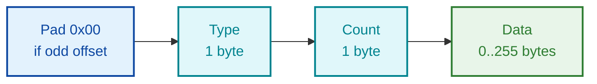
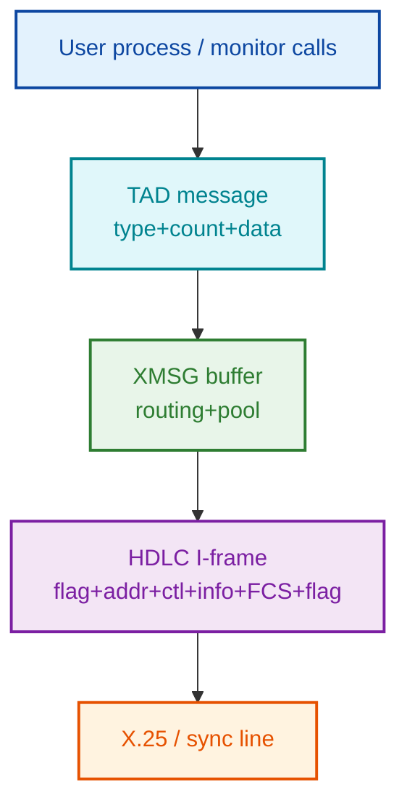
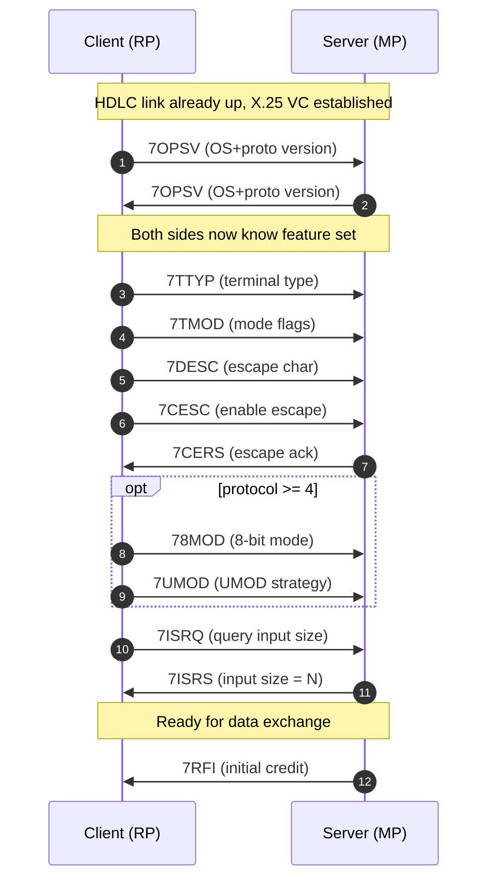
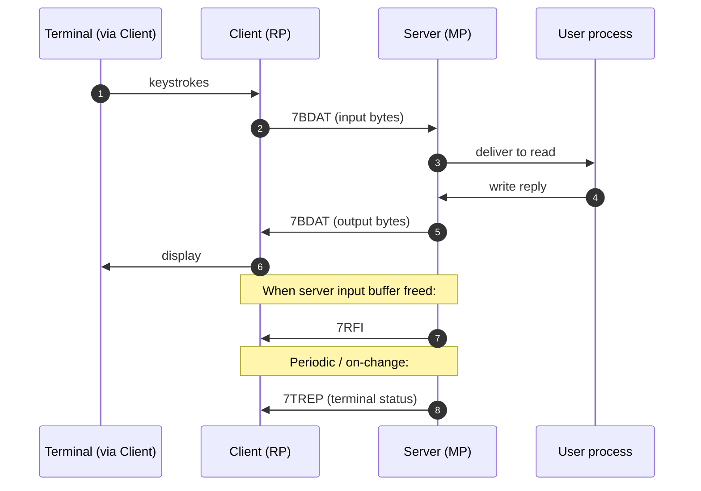
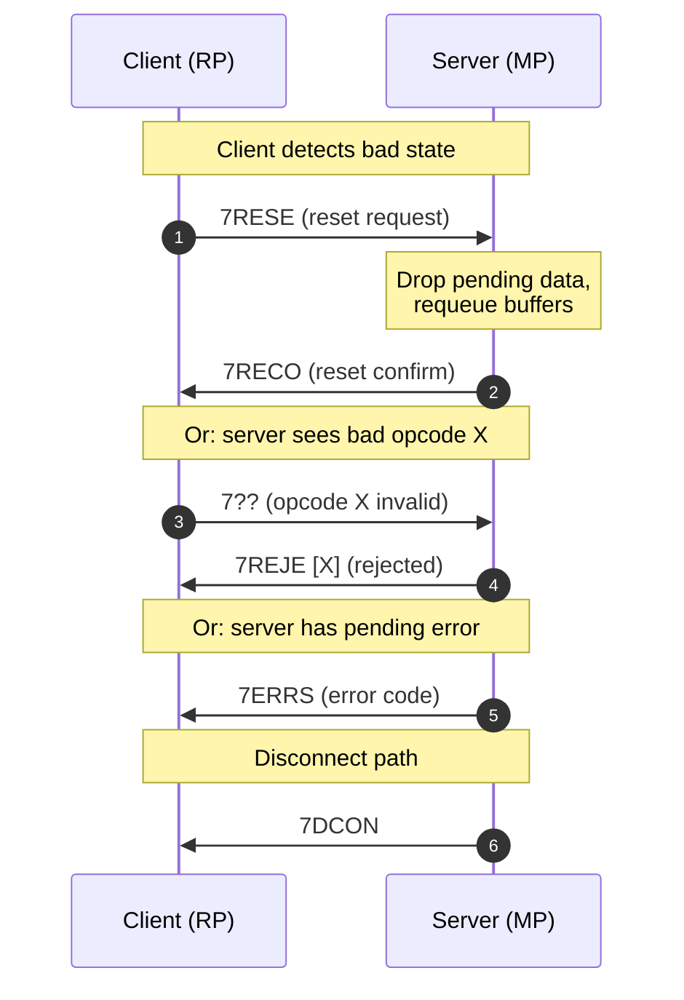
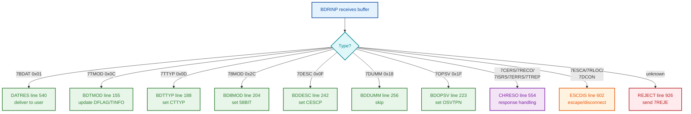
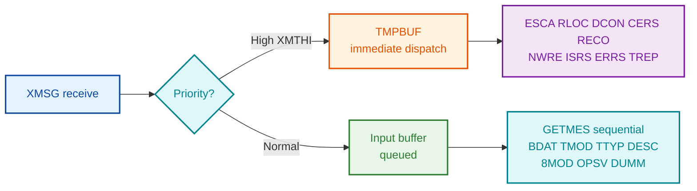
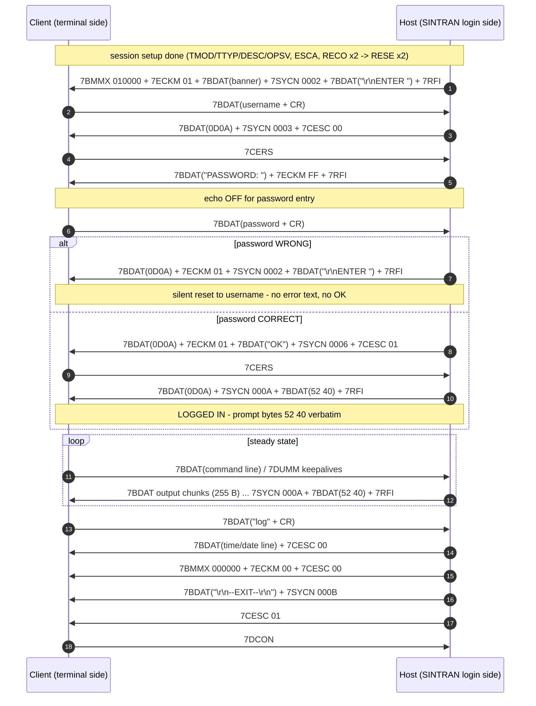

# TAD Message Format Specifications

**Status:** Authoritative — opcode values verified against SINTRAN III symbol tables
(K03, L07, M06) and cross-checked with NPL source.

**Parent Document:** `TAD-Protocol-Analysis.md`

**Sources:**
- `../NPL-SOURCE/SYMBOLS/L07/SYMBOL-1-LIST.SYMB.TXT`
- `../NPL-SOURCE/SYMBOLS/L07/FILSYS-SYMBOLS.SYMB.TXT`
- `../NPL-SOURCE/SYMBOLS/L07/RTLO-SYMBOLS.SYMB.TXT`
- `../NPL-SOURCE/NPL/RP-P2-TAD.NPL` (client / Remote Process)
- `../NPL-SOURCE/NPL/MP-P2-TAD.NPL` (server / Master Process)

> Opcode values are stable across SINTRAN versions K03 → L07 → M06 (verified
> identical in all three symbol-table directories). The `7xxxx` symbols in NPL are
> **single-byte numeric constants**, not 4-byte ASCII strings.

---

## 1. Generic Message Frame

All TAD messages share a 2-byte header followed by a variable data field:

| Offset | Size    | Field        | Description                                                              |
|-------:|--------:|--------------|--------------------------------------------------------------------------|
|  -1    | 0–1 B   | Pad          | `0x00` inserted **only if** the message would otherwise start on an odd byte boundary within the buffer |
|  +0    | 1 B     | Message Type | 7-bit opcode (see master table). High-range opcodes 0xFA–0xFE reserved for system/error messages |
|  +1    | 1 B     | Byte Count   | Number of bytes in the Data field (0–255). Does **not** include type or count itself |
|  +2    | N B     | Data         | Payload, format depends on message type                                  |



- **Pad byte**: `0x00` inserted if message would land on odd byte boundary
- **Message Type**: single 7-bit byte opcode
- **Byte Count**: payload length only (header excluded)
- **Data Field**: variable-length payload, possibly empty

**Parser reference:** `RP-P2-TAD.NPL` routine `GETMES` (lines 224–242)
**Builder reference:** `RP-P2-TAD.NPL` routine `CREMES` (writes the 2-byte header)

---

## 2. Master Opcode Table

All values are **octal** as written in NPL, with decimal/hex equivalents.

| Symbol  | Octal  | Dec | Hex  | Direction | Data Len | Category    | Purpose                              |
|---------|-------:|----:|-----:|:---------:|---------:|-------------|--------------------------------------|
| 7BDAT   | 000001 |   1 | 0x01 |   C↔S     | 0–255    | Data        | Terminal data block                  |
| 7RFI    | 000002 |   2 | 0x02 |   C→S     |    0     | Flow ctrl   | Ready For Input (credit grant)       |
| 7ECKM   | 000003 |   3 | 0x03 |   C→S     | 1 or 21  | Config      | Echo strategy + optional table       |
| 7BMMX   | 000004 |   4 | 0x04 |   C→S     | 3 or 23  | Config      | Break strategy + max-break + table   |
| 7ESCA   | 000010 |   8 | 0x08 |   S→C     |    0     | Control     | Escape character received            |
| 7DCON   | 000011 |   9 | 0x09 |   S→C     |    0     | Control     | Disconnect indication                |
| 7TMOD   | 000014 |  12 | 0x0C |   C→S     |    1     | Config      | Terminal mode flags                  |
| 7TTYP   | 000015 |  13 | 0x0D |   C→S     |    2     | Config      | Terminal type ID                     |
| 7CESC   | 000016 |  14 | 0x0E |   C→S     |    1     | Config      | Enable / disable escape processing   |
| 7DESC   | 000017 |  15 | 0x0F |   C→S     |    1     | Config      | Define escape character              |
| 7SYCN   | 000023 |  19 | 0x13 |   C↔S     |    2     | Control     | System control command               |
| 7USCN   | 000024 |  20 | 0x14 |   C↔S     |    2     | Control     | User control command                 |
| 7RESE   | 000026 |  22 | 0x16 |   C→S     |    0     | Control     | Reset connection (request)           |
| 7RECO   | 000027 |  23 | 0x17 |   S→C     |    0     | Response    | Reset confirm                        |
| 7DUMM   | 000030 |  24 | 0x18 |   any     |    0     | Filler      | Dummy / empty message (skipped)      |
| 7OPSV   | 000037 |  31 | 0x1F |   C→S     |    3     | Handshake   | OS version + protocol version        |
| 7CERS   | 000041 |  33 | 0x21 |   S→C     |    0     | Response    | CESC / escape-control response       |
| 7ISRQ   | 000042 |  34 | 0x22 |   C→S     |    0     | Query       | Input size request                   |
| 7ISRS   | 000043 |  35 | 0x23 |   S→C     |    2     | Response    | Input size response                  |
| 7NOWT   | 000044 |  36 | 0x24 |   C↔S     |    1     | Status      | Nowait status                        |
| 7TNOW   | 000045 |  37 | 0x25 |   C↔S     |    1     | Status      | Terminate nowait                     |
| 7NWRE   | 000046 |  38 | 0x26 |   S→C     |    0     | Status      | Nowait restart                       |
| 7RLOC   | 000047 |  39 | 0x27 |   S→C     |    0     | Control     | Remote/local mode toggle             |
| 7TREP   | 000052 |  42 | 0x2A |   S→C     |    2     | Status      | Terminal status report               |
| 7UMOD   | 000053 |  43 | 0x2B |   C→S     |    2     | Config      | UMOD strategy (protocol v4+)         |
| 78MOD   | 000054 |  44 | 0x2C |   C→S     |    2     | Config      | 8-bit mode set                       |
| 7CPCO   | 000372 | 250 | 0xFA |   S→C     |    4     | System      | Completion code                      |
| 7ERRS   | 000373 | 251 | 0xFB |   S→C     |    2     | System      | Error response                       |
| 7REJE   | 000376 | 254 | 0xFE |   S→C     |    1     | System      | Reject (invalid msg type echoed back)|

C = Client (RP, Remote Process). S = Server (MP, Master Process).

> **Range design note:** Opcodes 0x01–0x54 are normal protocol messages (deliberately
> kept inside the printable / 7-bit ASCII range so they can survive 7-bit links).
> Opcodes 0xFA–0xFE are reserved system/error messages — using the high range makes
> them unambiguous against any user data byte even in 7-bit mode.

---

## 3. Data Messages

### 3.1 7BDAT — Data Block (0x01)

**Purpose:** Transmit user data (terminal input/output).

| Offset | Size | Field | Value / Meaning |
|-------:|-----:|-------|-----------------|
|  0     | 1    | Type  | 0x01 (7BDAT) |
|  1     | 1    | Count | N = 0..255 (data length) |
|  2     | N    | Data  | Raw terminal bytes |

- **Sender (client out):** `BYTPUT` at `RP-P2-TAD.NPL:363–381` — appends a byte at a time, auto-flushes when buffer fills.
- **Receiver (server in):** `DATRES` at `MP-P2-TAD.NPL:540`.
- 7-bit mode: bit 7 cleared. 8-bit mode (after 78MOD): all 8 bits significant.

**Break handling:**
- Last character in message may be break character
- `REMBYT=-1` indicates break on last byte
- Break triggers special processing in receiver

**Example (5 bytes "Hello"):**
```
┌──────┬────┬────┬────┬────┬────┬────┐
│ 0x01 │ 05 │ H  │ e  │ l  │ l  │ o  │
└──────┴────┴────┴────┴────┴────┴────┘
```

---

## 4. Control / Configuration Messages

### 4.1 7TMOD — Terminal Mode (0x0C)

**Purpose:** Set terminal operating mode flags.

| Offset | Size | Field  | Meaning |
|-------:|-----:|--------|---------|
|  0     | 1    | Type   | 0x0C |
|  1     | 1    | Count  | 1 |
|  2     | 1    | Flags  | bit-packed terminal mode flags |

**Flag bits** (used by `BDTMOD` at `MP-P2-TAD.NPL:155–180`, written into `DFLAG`/`TINFO`/`FLAGB`/`SCREEN`):

| Bit | Symbol     | Meaning |
|----:|------------|---------|
| 0   | 5CAPITAL   | Force uppercase input |
| 1   | 5CRDLY     | Insert delay after carriage return |
| 2   | (screen)   | Stop on full page (sets OTAD.SCREEN) |
| 3   | 5LBLOG     | Logout on carrier loss |
| 4   | 5IESC      | Inhibit escape recognition |
| 5   | 58BIT      | 8-bit data path |
| 6   | 5UMOD      | UMOD strategy in use |
| 7   | (reserved) |  |

**Source:** `RP-P2-TAD.NPL:805–850` (`BTMOD`/`CTMOD`), `MP-P2-TAD.NPL:155–180` (`BDTMOD`).

**Processing (receive)** — `MP-P2-TAD.NPL:661–669`:
```npl
DFLAG BZERO 5CAPITAL
IF D BIT "0" THEN T BONE 5CAPITAL FI; T=:DFLAG
T:=TINFO BZERO 5CRDLY=:TINFO
IF D BIT 1 THEN T BONE 5CRDLY=:TINFO FI
0=:OTAD.SCREEN
IF D BIT 2 THEN MIN X.SCREEN FI
T:=FLAGB BZERO 5LBLOG
IF D BIT 3 THEN T BONE 5LBLOG FI; T=:FLAGB
```

**Example** (capital + CR delay):
```
┌──────┬────┬────┐
│ 0x0C │ 01 │ 03 │
└──────┴────┴────┘
```

---

### 4.2 7TTYP — Terminal Type (0x0D)

| Offset | Size | Field   | Meaning |
|-------:|-----:|---------|---------|
|  0     | 1    | Type    | 0x0D |
|  1     | 1    | Count   | 2 |
|  2     | 2    | TermID  | 16-bit terminal type identifier (stored as `CTTYP`) |

**Source:** `RP-P2-TAD.NPL:860–872` (`CSTYP`), `MP-P2-TAD.NPL:188–197` (`BDTTYP`).

**Processing (receive):**
```npl
TDBTPT=:D SHZ -1; T:=TDTAFI; X:=TDTALA+A; *LDATX
IF D BIT "0" THEN
   A SHZ 10=:D; X+1; *LDATX
   A SHZ -10+D
FI
A=:CTTYP
```

**Example** (type 0x0123):
```
┌──────┬────┬────┬────┐
│ 0x0D │ 02 │ 01 │ 23 │
└──────┴────┴────┴────┘
```

---

### 4.3 7CESC — Enable / Disable Escape (0x0E)

| Offset | Size | Field  | Meaning |
|-------:|-----:|--------|---------|
|  0     | 1    | Type   | 0x0E |
|  1     | 1    | Count  | 1 |
|  2     | 1    | Enable | 0 = disable escape, ≠0 = enable |

Always paired with a 7CERS response (0x21) from the server.

---

### 4.4 7DESC — Define Escape Character (0x0F)

| Offset | Size | Field   | Meaning |
|-------:|-----:|---------|---------|
|  0     | 1    | Type    | 0x0F |
|  1     | 1    | Count   | 1 |
|  2     | 1    | EscChar | New escape character (stored in `CESCP`) |

**Source:** `RP-P2-TAD.NPL:930–943` (`CSDAE`), `MP-P2-TAD.NPL:242–249` (`BDDESC`).

**Processing (receive):**
```npl
TDBTPT=:D SHZ -1; T:=TDTAFI; X:=TDTALA+A; *LDATX
IF D BIT "0" THEN A/\377 ELSE A SHZ -10 FI; A=:T
CESCP/\177400+T=:CESCP
```

**Example** (escape = Ctrl-C):
```
┌──────┬────┬────┐
│ 0x0F │ 01 │ 03 │
└──────┴────┴────┘
```

---

### 4.5 78MOD — 8-bit Mode (0x2C)

| Offset | Size | Field | Meaning |
|-------:|-----:|-------|---------|
|  0     | 1    | Type  | 0x2C |
|  1     | 1    | Count | 2 |
|  2     | 2    | UMOD  | Mode word; non-zero sets the `58BIT` flag (0x0001 = 8-bit, 0x0000 = 7-bit strip) |

**Source:** `MP-P2-TAD.NPL:204–216` (`BD8MOD`).

**Processing (receive):**
```npl
TDBTPT; AD SHZ -1; T:=TDTAFI; X:=TDTALA+A
IF D BIT 17 THEN *LDDTX; AD SH 10 ELSE *LDATX FI
IF A=1 THEN TINFO BONE 58BIT=:TINFO FI
```

---

### 4.6 7UMOD — UMOD Strategy (0x2B, protocol v4+)

| Offset | Size | Field    | Meaning |
|-------:|-----:|----------|---------|
|  0     | 1    | Type     | 0x2B |
|  1     | 1    | Count    | 2 |
|  2     | 2    | Strategy | 16-bit UMOD strategy word |

Only legal once both sides have advertised protocol ≥ 4 via 7OPSV.

**Source:** `RP-P2-TAD.NPL:880–896` (`CSUMOD`).

**Processing (send):**
```npl
IF X.PORTNO=0 OR X.OSVTPN/\377<4 THEN EXIT FI  % Protocol must be >=4
7UMOD; T:=2; CALL CREMES
X:=BREG; A:=X.D4; CALL WORDPUT           % D4 contains UMOD strategy
CALL SNDBUF
```

---

### 4.7 7OPSV — OS / Protocol Version (0x1F)

| Offset | Size | Field      | Meaning |
|-------:|-----:|------------|---------|
|  0     | 1    | Type       | 0x1F |
|  1     | 1    | Count      | 3 |
|  2     | 1    | OS version | SINTRAN version code |
|  3     | 1    | OS subver  | Sub-version |
|  4     | 1    | Protocol   | TAD protocol version (gates v4+ features e.g. 7UMOD/78MOD) |

Stored in `OSVTPN`. **This is the handshake message** — both sides must exchange
it before optional-feature messages are legal.

**Source:** `MP-P2-TAD.NPL:223–235` (`BDOPSV`).

**Processing (receive):**
```npl
TDBTPT=:D SHZ -1; T:=TDTAFI; X:=TDTALA+A; *LDATX
IF D BIT "0" THEN
   A SHZ 10=:D; X+1; *LDATX
   A/\377+D
ELSE
   A/\177400=:D; X+1; *LDATX
   A SHZ -10+D
FI
A=:OSVTPN
```

**Example** (SINTRAN L=12, protocol 3):
```
┌──────┬────┬────┬────┬────┐
│ 0x1F │ 03 │ 0C │ 00 │ 03 │
└──────┴────┴────┴────┴────┘
```

---

## 5. Break and Echo Messages

### 5.1 7BMMX — Break Strategy / Max Break (0x04)

| Offset | Size | Field      | Meaning |
|-------:|-----:|------------|---------|
|  0     | 1    | Type       | 0x04 |
|  1     | 1    | Count      | 3 (no table) **or** 23 (with 20-byte table) |
|  2     | 1    | Strategy   | Break strategy code (see below) |
|  3     | 2    | MaxBreak   | Maximum break level (16-bit) |
|  5     | 20   | Break tbl  | *(optional)* break-character classification table |

**Strategy values:**
- `1–6` — predefined break strategies
- `7` — custom break table (20 bytes = 8 words of character bitmap, follows in message)
- `8`, `9` — strategies 8/9 (protocol ≥ 3)
- `11` — custom break table from user's BRKTAB

**Break table format:** 8 words (20 bytes) where each bit represents a character —
word 0 bit 0 = char 0x00, word 7 bit 15 = char 0x7F.

**Source:** `RP-P2-TAD.NPL:766–795` (`BDBREA`).

**Processing (send):**
```npl
IF T=X:=7 THEN T:=23 ELSE T:=3 FI; T=:MSSIZ
A:=7BMMX; T:=MSSIZ; CALL CRHEOD
BRSTR=:D; CALL STORBYT
TDBTPT SHZ-1; T:=TDTALA+A; 41ITAD.BRKMAX
T=:X:=TDTAFI; *STATX
TDBTPT+2=:TDBTPT; REMSIZ-2=:REMSIZ
IF D=7 THEN
   IF AREG=11 THEN 41ITAD.BRKTAB ELSE 41ITAD+"PBRK7" FI
   A=:D; CALL CBRECTA
FI
```

---

### 5.2 7ECKM — Echo Strategy (0x03)

| Offset | Size | Field        | Meaning |
|-------:|-----:|--------------|---------|
|  0     | 1    | Type         | 0x03 |
|  1     | 1    | Count        | 1 (no table) **or** 21 (with 20-byte table) |
|  2     | 1    | Strategy     | Echo strategy code (1–6 predefined, 7 = custom) |
|  3     | 20   | Echo table   | *(optional)* echo-character classification table |

**Echo table format:** Same layout as break table (8 words; bit per character).

**Source:** `RP-P2-TAD.NPL:735–758` (`BDECHO`).

**Processing (send):**
```npl
IF A=7 THEN T:=21 ELSE T:=1 FI; T=:MSSIZ
A:=7ECKM; T:=MSSIZ; CALL CRHEOD
AREG=:D; CALL STORBYT
IF D=7 THEN
   41ITAD+"PECH7"=:D; CALL CBRECTA
FI
```

---

## 6. Request and Response Messages

### 6.1 7RFI — Ready For Input (0x02)

| Offset | Size | Field | Value |
|-------:|-----:|-------|-------|
|  0     | 1    | Type  | 0x02 |
|  1     | 1    | Count | 0 |

Pure flow-control credit. "I have a fresh input buffer; you may send."

**When sent:**
- Input buffer empty and user requests input
- After rejecting a data message
- In nowait mode when no data available

**Source:** `RP-P2-TAD.NPL:1113–1147` (`SNDRFI`).

> Note: there is also a precomputed packed literal `7RFIL = 040442₈` in
> `RTLO-SYMBOLS.SYMB.TXT:1185` — this is `(7RFI<<8) | 0x42` used as an immediate
> operand to write the whole 2-byte header in one word store.

---

### 6.2 7REJE — Reject (0xFE)

| Offset | Size | Field    | Meaning |
|-------:|-----:|----------|---------|
|  0     | 1    | Type     | 0xFE |
|  1     | 1    | Count    | 1 |
|  2     | 1    | BadType  | The opcode that was rejected |

**When sent:**
- Inconsistent message (size mismatch)
- Unexpected control message
- Message arrived in wrong state

**Source:** `RP-P2-TAD.NPL:1161–1201` (`SNDREJ`), `MP-P2-TAD.NPL:926–948` (`REJECT`).

**Processing (send):**
```npl
A:=7REJE; T:=1; CALL CREMES
41ITAD.CURMES; CALL BYTPUT
IF 41ITAD.CURMES=7BDAT THEN
   A:=7RFI; T:=0; CALL CREMES     % Also send RFI after rejecting data
FI
CALL SNDBUF
```

---

### 6.3 7ISRQ / 7ISRS — Input Size Query (0x22 / 0x23)

**7ISRQ — Request:**

| Offset | Size | Field | Value |
|-------:|-----:|-------|-------|
|  0     | 1    | Type  | 0x22 |
|  1     | 1    | Count | 0 |

**7ISRS — Response:**

| Offset | Size | Field | Meaning |
|-------:|-----:|-------|---------|
|  0     | 1    | Type  | 0x23 |
|  1     | 1    | Count | 2 |
|  2     | 2    | Size  | 16-bit size: number of characters available; bit 15 (0x8000) flags break present |

**Source:** `RP-P2-TAD.NPL:958–1009` (`BISIZ`/`PISIZ`), `MP-P2-TAD.NPL:563–570` (response handling).

**Processing (receive):**
```npl
X:=TMPBUF; T:=6; CALL DRXACC(XDGER); A SHZ 10=:RDATR
X:=TMPBUF; T:=7; CALL DRXACC(XDGER)
T:=RDATR+A=:RDATR
IF OTAD.RSPNUM=7ISRS THEN
   A:=RDATR; IF D BIT 17 THEN A BONE 17 FI
   A=:DFRDATR:="MFISIZ"; CALL CXRTACT
FI
```

---

### 6.4 7ERRS — Error Response (0xFB)

| Offset | Size | Field   | Meaning |
|-------:|-----:|---------|---------|
|  0     | 1    | Type    | 0xFB |
|  1     | 1    | Count   | 2 |
|  2     | 2    | ErrCode | 16-bit SINTRAN error code (passed to `MFERSP`) |

**Source:** `MP-P2-TAD.NPL:571–578`.

**Processing (receive):**
```npl
X:=TMPBUF; T:=6; CALL DRXACC(XDGER); A SHZ 10=:RDATR
X:=TMPBUF; T:=7; CALL DRXACC(XDGER)
T:=RDATR+A=:RDATR
IF OTAD.RSPNUM=7ERRS THEN
   IF TDRADDR.RTRES.STATUS BIT 5WAIT THEN
      RDATR=:DFRDATR; "MFERSP"; CALL CXRTACT
   FI
FI
```

---

## 7. System Control Messages

### 7.1 7SYCN — System Control (0x13)

| Offset | Size | Field   | Meaning |
|-------:|-----:|---------|---------|
|  0     | 1    | Type    | 0x13 |
|  1     | 1    | Count   | 2 |
|  2     | 2    | Command | 16-bit system command code |

**Auto-send conditions:** command word = 1, 13 (0x0D = CR), or 17 (0x11 = DC1).

**Source:** `RP-P2-TAD.NPL:597–609` (`CTOBAD`).

**Processing (send):**
```npl
IF AREG=23 THEN 7SYCN ELSE 7USCN FI
T:=2; CALL CREMES
DREG; CALL WORDPUT
IF AREG=23 THEN
   IF DREG=1 OR A=13 OR A=17 THEN CALL SNDBUF FI
FI
```

### 7.2 7USCN — User Control (0x14)

| Offset | Size | Field   | Meaning |
|-------:|-----:|---------|---------|
|  0     | 1    | Type    | 0x14 |
|  1     | 1    | Count   | 2 |
|  2     | 2    | Command | 16-bit user command code |

Same builder routine as 7SYCN (`CTOBAD`). Always **sends and waits** for a 7ERRS response:
```npl
ELSE
   7ERRS; CALL SNDWT     % Send and wait for error response
FI
```

---

### 7.3 7CPCO — Completion Code (0xFA)

| Offset | Size | Field | Meaning |
|-------:|-----:|-------|---------|
|  0     | 1    | Type  | 0xFA |
|  1     | 1    | Count | 4 |
|  2     | 4    | Code  | 32-bit completion code (high word first: CPC1, CPC2) |

**Source:** `RP-P2-TAD.NPL:1062–1076` (`SNDCP`).

**Processing (send):**
```npl
7CPCO; T:=4; CALL CRHEEV
TDBTPT SHZ -1; T:=TDTAFI; X:=TDTALA+A
CPC1; *STATX
X+1; CPC2; *STATX
TDBTPT+4=:TDBTPT; REMSIZ-4=:REMSIZ
CALL SNDBUF
```

---

## 8. Connection Control Messages

### 8.1 7RESE — Reset (0x16)

| Offset | Size | Field | Value |
|-------:|-----:|-------|-------|
|  0     | 1    | Type  | 0x16 |
|  1     | 1    | Count | 0 |

Reset connection to initial state. Triggers a `7RECO` (Reset Confirm) response.

**Source:** `RP-P2-TAD.NPL:558–564` (`CTIBAD`).

**Processing (send):**
```npl
7RESE; T:=0; CALL CREMES
7RECO; CALL SNDWT     % Send reset and wait for confirm
```

---

### 8.2 7RECO — Reset Confirm (0x17)

| Offset | Size | Field | Value |
|-------:|-----:|-------|-------|
|  0     | 1    | Type  | 0x17 |
|  1     | 1    | Count | 0 |

**Source:** `MP-P2-TAD.NPL:559–562`.

**Processing (receive):**
```npl
IF X=RESCF THEN                            % RESET-CONF
   IF OTAD.RSPNUM=7RECO GO RSPRST
   GO TDRINP
FI
```

---

### 8.3 7DCON — Disconnect (0x09)

| Offset | Size | Field | Value |
|-------:|-----:|-------|-------|
|  0     | 1    | Type  | 0x09 |
|  1     | 1    | Count | 0 |

Triggers `DSTOTA` (forced disconnect with cleanup).

**Source:** `MP-P2-TAD.NPL:626–628`.

**Processing (receive):**
```npl
IF X=BDDIS THEN                            % DISCONNECT-MESSAGE
   GO DSTOTA                               % STOP AND DISCONNECT TAD
FI
```

---

## 9. Escape and Local Mode Messages

### 9.1 7ESCA — Escape (0x08)

| Offset | Size | Field | Value |
|-------:|-----:|-------|-------|
|  0     | 1    | Type  | 0x08 |
|  1     | 1    | Count | 0 |

Signal that an escape character was received. Triggers an escape response (`7CERS`).

**Source:** `MP-P2-TAD.NPL:602–625`.

**Processing (receive):**
```npl
IF X=BDESC OR X=RLOCA THEN
   IF DFLAG NBIT 5IESC THEN                % ESCAPE ENABLED
      IF X=BDESC THEN
         CESCP/\377=:LAST                  % ESCAPE
      ELSE
         IF FLAGB BIT 5LCHAR THEN
            CESCP SHZ-10=:LAST             % LOCAL CHARACTER
         ELSE
            177=:LAST                      % RUBOUT IN NORD-NET
         FI
      FI
      DFLAG BZERO 5RQI=:DFLAG
      CALL ESCAPE                          % Process escape
      TAD:=ERESP; T=:X:=XFWHD
      CALL MXMSG                           % Write escape response
   ELSE                                    % ESCAPE DISABLED
      TAD:=EDRSP; T=:X:=XFWHD
      CALL MXMSG
      AD:=OTAD.PARTNER; X:=PORTNO
      T:=XFSND; CALL MXMSG                 % Send response
   FI
FI
```

---

### 9.2 7CERS — Escape Response (0x21)

| Offset | Size | Field | Value |
|-------:|-----:|-------|-------|
|  0     | 1    | Type  | 0x21 |
|  1     | 1    | Count | 0 |

**Source:** `MP-P2-TAD.NPL:555–558`, `RP-P2-TAD.NPL:915` (send).

**Processing:**
```npl
IF A=CESCR THEN                            % CESC-RESP
   IF OTAD.RSPNUM=7CERS GO RSPRST
   GO TDRINP
FI
```
```npl
IF TDRADDR.RTRES=RTREF THEN
   7CERS; CALL SNDWT                       % SEND AND WAIT FOR RESPONSE
ELSE
   CALL SNDBUF                             % JUST SEND MESSAGE
FI
```

---

### 9.3 7RLOC — Remote/Local (0x27)

| Offset | Size | Field | Value |
|-------:|-----:|-------|-------|
|  0     | 1    | Type  | 0x27 |
|  1     | 1    | Count | 0 |

NORD-NET remote/local mode toggle. Same handler as `7ESCA`. Switches the terminal
between connection to remote system vs local system.

---

## 10. Nowait Mode Messages

### 10.1 7NOWT — Nowait Status (0x24)

| Offset | Size | Field  | Meaning |
|-------:|-----:|--------|---------|
|  0     | 1    | Type   | 0x24 |
|  1     | 1    | Count  | 1 |
|  2     | 1    | Status | Operation status (0 = success) |

**Source:** `RP-P2-TAD.NPL:1084–1102` (`NOWTSTA`).

**Processing (send):**
```npl
IF A=0 THEN A:=7NOWT ELSE A:=7TNOW FI
T:=41OTAD=:B; T:=1; CALL CRHEEV
NWS; CALL STORBYT
CALL SNDBUF
```

### 10.2 7TNOW — Terminate Nowait (0x25)

| Offset | Size | Field  | Meaning |
|-------:|-----:|--------|---------|
|  0     | 1    | Type   | 0x25 |
|  1     | 1    | Count  | 1 |
|  2     | 1    | Status | Error code (non-zero) |

Same builder as `7NOWT`.

### 10.3 7NWRE — Nowait Restart (0x26)

| Offset | Size | Field | Value |
|-------:|-----:|-------|-------|
|  0     | 1    | Type  | 0x26 |
|  1     | 1    | Count | 0 |

**Source:** `MP-P2-TAD.NPL:477–481`.

**Processing (receive):**
```npl
IF X=NWREM THEN                            % NOWAIT RESTART
   T:=XFSND; AD:=OTAD.PARTNER; X:=PORTNO
   CALL MXMSG                              % RETURN MESSAGE
   GO FAR DATRES                           % RESTART USER
FI
```

---

## 11. Special / Status Messages

### 11.1 7DUMM — Dummy (0x18)

| Offset | Size | Field | Value |
|-------:|-----:|-------|-------|
|  0     | 1    | Type  | 0x18 |
|  1     | 1    | Count | 0 |

Padding/filler so a buffer can be flushed without carrying real data. Server handler
`BDDUMM` at `MP-P2-TAD.NPL:256–260` simply skips it.

```npl
BDDUMM: T:=REMBYT-; T-1; TDBTPT+T=:TDBTPT; REMSIZ-T=:REMSIZ
        0=:REMBYT
        EXITA
```

**Usage:** replace data messages when clearing a buffer; initial buffer in `INISND`; alignment.

---

### 11.2 7TREP — Terminal Status Report (0x2A)

| Offset | Size | Field  | Meaning |
|-------:|-----:|--------|---------|
|  0     | 1    | Type   | 0x2A |
|  1     | 1    | Count  | 2 |
|  2     | 2    | Status | TINFO status bits (see below) |

**Status bits:**

| Bit | Symbol  | Meaning            |
|----:|---------|--------------------|
|  2  | 5BFUL   | Buffer overrun     |
|  3  | 5PAER   | Parity error       |
|  4  | 5FRER   | Framing error      |

**Source:** `MP-P2-TAD.NPL:482–495`.

**Processing (receive):**
```npl
IF X=TREPS THEN                            % TREP STATUS
   X:=TMPBUF; T:=6; CALL DRXACC(XDGER)
   A SHZ 10=:RDATR
   X:=TMPBUF; T:=7; CALL DRXACC(XDGER)
   T:=RDATR+A=:RDATR
   T:=XFSND; AD:=OTAD.PARTNER; X:=PORTNO
   CALL MXMSG                              % Return message
   T:=RDATR; A:=TINFO
   IF T BIT 2 THEN A BONE 5BFUL FI         % BUFFER OVERRUN
   IF T BIT 3 THEN A BONE 5PAER FI         % PARITY ERROR
   IF T BIT 4 THEN A BONE 5FRER FI         % FRAMING ERROR
   A=:TINFO
   GO TDRINP
FI
```

---

## 12. HDLC / XMSG Encapsulation

TAD never touches HDLC framing directly. The layering is:



| Layer       | Owner                            | Source file (in `../NPL-SOURCE/NPL`) |
|-------------|----------------------------------|-----------------------------------------------------------------------|
| TAD message | RP-P2-TAD.NPL / MP-P2-TAD.NPL    | This document |
| XMSG transport | (5P-P2-MON60 etc.)            | Monitor calls XFOPN/XFSND/XFRCV/XFWHD |
| HDLC framing | MP-P2-HDLC-DRIV.NPL             | Bit stuffing, FCS, addr/ctl bytes |
| Physical    | Sync line driver                 | — |

Multiple TAD messages may be packed back-to-back inside one XMSG buffer (hence the
odd-byte pad rule in §1).

---

## 13. Connection Establishment Flow



---

## 14. Steady-State Data Exchange



---

## 15. Error / Reset / Disconnect Flow



---

## 16. Server-Side Dispatch Map

Source: `MP-P2-TAD.NPL` `BDRINP` (line 439) and dispatch table (line 508–530).



---

## 17. Client-Side Builder Map

Source: `RP-P2-TAD.NPL`. Common pattern: `GETPOOL` → `CREMES` → `BYTPUT`/`WORDPUT` → `SNDBUF`.

| Message | Builder routine        | Line range |
|---------|------------------------|-----------:|
| 7BDAT   | BYTPUT                 | 363–381    |
| 7TMOD   | BTMOD / CTMOD          | 805–850    |
| 7TTYP   | CSTYP                  | 860–872    |
| 7UMOD   | CSUMOD                 | 880–896    |
| 7DESC   | CSDAE                  | 930–943    |
| 7ISRQ   | BISIZ / PISIZ          | 958–1009   |
| 7CPCO   | SNDCP                  | 1062–1076  |
| 7NOWT/7TNOW | NOWTSTA            | 1084–1102  |
| 7RFI    | SNDRFI                 | 1113–1147  |
| 7RESE/7RECO | CTIBAD             | 558–559    |
| 7BMMX   | BDBREA                 | 766–795    |
| 7ECKM   | BDECHO                 | 735–758    |
| 7SYCN/7USCN | CTOBAD             | 597–609    |

---

## 18. Message Priority Levels

TAD messages have two priority levels handled differently by the driver.

### Normal Priority

Processed sequentially from the input buffer:
- `7BDAT` — Data
- `7TMOD` — Terminal mode
- `7TTYP` — Terminal type
- `7DESC` — Define escape
- `78MOD` — 8-bit mode
- `7OPSV` — OPSYS version
- `7DUMM` — Dummy

Received only if input buffer empty (`BUFFID=0`); messages queued in receive buffer; processed in order by `GETMES`.

### High Priority

Processed immediately (out-of-band):
- `7ESCA` / `7RLOC` — Escape / remote-local
- `7DCON` — Disconnect
- `7CERS` — Escape response
- `7RECO` — Reset confirm
- `7NWRE` — Nowait restart
- `7ISRS` — ISIZE response
- `7ERRS` — Error response
- `7TREP` — TREP status

Received even if input buffer has data; stored in temporary buffer (`TMPBUF`); processed before returning to normal priority queue.

**Source:** `MP-P2-TAD.NPL:445–496`
```npl
IF XMTHI><T GO FAR NORMP                   % NORMAL PRIORITY
T:=XFRCV; A:=PORTNO; CALL MXMSG            % RECEIVE HIGH PRIORITY
IF T=0 GO BDRWT
X:=D=:TMPBUF
T:=XFRHD; A:=TMPBUF; CALL MXMSG            % READ MESSAGE HEADER
X=:HIGHT                                   % SAVE MESSAGE TYPE
% ... process high priority message ...
GO TDRINP
```



---

## 19. Buffer Management Integration

TAD uses XMSG for buffer management.

### Initialise pool — `INIBDR` (line 382)
```npl
T:=XFALM; FBSIZ; X:=NOBUFF; CALL MXMSG    % Allocate space
FOR X:=1 TO NOBUFF DO
   T:=XFGET; A:=FBSIZ; CALL MXMSG         % Get buffer
   CALL MPUTPOOL                          % Add to POOLLI chain
OD
```

### Get buffer from pool — `GETPOOL` (line 44)
```npl
POOLLI; IF A=0 AND D=0 GO NOPOL           % Pool empty
A=:T; D=:X; *LDDTX                        % Get next in chain
AD=:POOLLI                                % Update pool pointer
AD=:TDTADD; X+2; *LDATX                   % Get buffer address
A=:BUFFID                                 % Set buffer ID
41ITAD.FBSIZ-BUDIS=:REMSIZ                % Set remaining size
```

### Return buffer to pool — `PUTPOOL` (line 20)
```npl
A=:T; D=:X; AD:=POOLLI; *STDTX            % Link old POOLLI
X+2; A:=XREG; *STATX                      % Store buffer ID
AD=:POOLLI                                % Update POOLLI
0=:BUFFID                                 % Clear buffer ID
```

### Buffer states

| State           | Condition           | Location              |
|-----------------|---------------------|-----------------------|
| Free            | In POOLLI chain     | Buffer pool           |
| Input Active    | ITAD.BUFFID != 0    | Input datafield       |
| Output Active   | OTAD.BUFFID != 0    | Output datafield      |
| Temporary       | TMPBUF != 0         | High-priority handler |
| Mail            | MBFID != 0          | Mail system           |

---

## 20. Known Gaps

Areas where the on-the-wire format is still partially inferred:

| #  | Gap | Where to look next |
|---:|-----|--------------------|
| 1  | Echo/Break table (20-byte) bit semantics per char class | `BDECHO`/`BDBREA` callees, plus terminal-driver tables |
| 2  | 7ERRS error code enumeration | Search for `ERRSP` constants in symbol tables |
| 3  | 7SYCN / 7USCN command codes | **Largely resolved from captures** — SYCN values `0002/0003/0006/000A/000B/000C` mapped in §21 (login handshake); 7USCN still open |
| 4  | 7CPCO 32-bit code endianness (high word first assumed) | `SNDCP` byte-order in `RP-P2-TAD.NPL:1062` |
| 5  | UMOD strategy values (v4+) | `CSUMOD` callers |
| 6  | XMSG header bytes (before TAD payload) | `5P-P2-MON60.NPL` if available |
| 7  | HDLC addr/ctl byte conventions on the link | `MP-P2-HDLC-DRIV.NPL` |

---

## 21. Login Handshake  [VERIFIED from three captured logins]

Reconstructed from the FCS-verified captures decoded in
`SINTRAN/XMSG/SRC/pcap-decode-report.txt` (NDInsight repo): a complete login in
`conn-to-102-from103-via100.pcapng` and `conn-to-d102-from-100.pcapng`, and a
**failed-password + retry** in `new-conn-to-102-from-100.pcapng`. The
already-logged-in error paths come from `test1.pcapng`.

**Direction rule (VERIFIED, every capture):** `7SYCN`, `7ECKM`, `7CESC`, `7RFI`
and `7BMMX` are sent ONLY by the **host** (the SINTRAN side running the login).
The client sends only `7BDAT` keystroke lines (ASCII with the high/parity bit
set, e.g. `F3 F9 F3 8D` = "sys"+CR), `7CERS`, `7DUMM` keepalives, the
`7TMOD/7TTYP/7DESC/7OPSV` + `7ESCA` + `7RECO` setup, and the final `7DCON`.

**SYCN state values (16-bit payload):**

| SYCN | State |
|------|-------|
| `0002` | waiting for username (after banner / after failed password) |
| `0003` | username accepted |
| `0006` | password accepted ("OK") |
| `000A` | **LOGGED IN** — re-asserted after every completed command |
| `000B` | logged out (with "--EXIT--") |
| `000C` | error-text wrapper (e.g. "AMBIGUOUS COMMAND"), followed by `000A` + prompt |



**Host implementation rule:** after the password line send exactly
`7BDAT(0D0A)` + `7ECKM 01` + `7BDAT("OK")` + `7SYCN 0006` + `7CESC 01`, then
`7BDAT(0D0A)` + `7SYCN 000A` + `7BDAT(52 40)` + `7RFI`; re-assert
`7SYCN 000A` + `52 40` + `7RFI` after every completed command. `7RFI` is the
ready-for-input credit and terminates EVERY host frame that expects client
input (ENTER prompt, PASSWORD, every command prompt) — without it the client
side sits idle after one line.

**UNKNOWNs (explicit):** the meaning of prompt bytes `52 40` ("R@" — mirror
verbatim); the exact `7CERS` trigger (correlates with every `7CESC`
transition); host opcode `0xFD` (on the `0x00060000` XMSG class) after login;
`7CPCO` payload `0004418B` on "TERMINAL ACCESS DENIED"; `7BMMX` payload
semantics (`010000` with echo-on at session start, `000000` at teardown);
the bad-USERNAME path (unseen — every capture used an accepted username);
and whether `SYCN 000A` alone cancels SINTRAN's 1-minute not-logged-in
disconnect or the full `0002→0003→0006→000A` ladder is required (no capture
shows the timeout itself).

---

## Related Documents

- `TAD-Protocol-Analysis.md` — Overall protocol analysis
- `TAD-HDLC-Encapsulation.md` — HDLC layer detail
- `TAD-Protocol-Flows.md` — Protocol flow diagrams
- `TAD-X25-CUD-Specification.md` — X.25 Call User Data
- `TAD-Evidence-vs-Inference.md` — Verification status

**Document path:** `TAD-Message-Formats.md`
