# TAD Message Format Specifications

## What this document is — and how it relates to the XMSG protocol spec

TAD (Terminal Access Device) is the **application-layer terminal protocol**: the
`[opcode][count][data]` messages (BDAT, RFI, ECKM, SYCN, DCON, …) that make a remote
terminal session work — login, echo control, keystrokes, output, disconnect. **This
document specifies WHAT those messages mean and WHEN each side sends them**, from the
opcode catalog (NPL-source-verified) to the complete capture-verified `connect-to`
session: handshake, login ladder, steady state, teardown, and build recipes for both
the client and the server role.

TAD messages never touch the wire directly — they ride as the payload of XMSG data
frames. Everything BELOW the payload — HDLC framing, the ND LAPB dialect, the 13-byte
SINTRAN header, the datagram sequence/Counter/channel envelope (the seed model),
secure ACKs, reachability/resync, relaying, and the port-0 server/service dispatch —
is specified in **[XMSG-PROTOCOL.md](../XMSG/DOC/XMSG-PROTOCOL.md)**. Rule of thumb:
*XMSG-PROTOCOL.md tells you how to build and validate a frame; this document tells
you what to put in it and when, for a terminal session.* An implementer needs both:
the transport spec for the envelope, this one for the conversation.

## Table of contents

| § | Content |
|---|---|
| 1 | Generic message frame (`[opcode][count][data]`, pad rule) |
| 2 | Master opcode table (NPL-verified) · 2.1 capture-only opcodes + the `00`-prefix anomaly |
| 3–11 | Per-opcode formats: BDAT, TMOD/TTYP/CESC/DESC/8MOD/UMOD/OPSV, BMMX/ECKM, RFI/REJE/ISRQ/ERRS, SYCN/USCN/CPCO, RESE/RECO/DCON, ESCA/CERS/RLOC, nowait, DUMM/TREP |
| 12–19 | NPL-source views: HDLC/XMSG encapsulation, connection/steady-state/error flows, dispatch and builder maps, priorities, buffer management |
| 20 | Known gaps (NPL side) |
| 21 | **Login handshake** — the SYCN ladder, echo control, wrong-password path (capture-verified) |
| 22 | **The captured connect-to session — wire specification**: 22.1 ports · 22.2 message classes · 22.3 chain rules · 22.4 lifecycle + frame contents · 22.5 ACK discipline · 22.6 steady state · 22.7 teardown (incl. host-DCON instant disconnect) · 22.8 sequence diagram · 22.9 per-role state machines · 22.10 implementation vs spec · 22.11 open questions · 22.12 echo control & line discipline · 22.13 client build recipe · 22.14 server build recipe · 22.15 login worked scenario · 22.16 multi-chunk output worked scenario |

---

**Status:** Authoritative — opcode values verified against SINTRAN III symbol tables
(K03, L07, M06) and cross-checked with NPL source. **This is the single TAD document**:
it contains both the NPL-source opcode catalog (§1–§20) AND the capture-verified
specification of a complete TAD-over-XMSG `connect-to` session — login handshake in
**§21**, full session wire spec (setup, ACK discipline, steady state, teardown) in
**§22**.

**Parent Document:** `TAD-Protocol-Analysis.md`

**Sources (two independent evidence classes):**
- NPL source + symbol tables (§1–§20):
  - `../NPL-SOURCE/SYMBOLS/L07/SYMBOL-1-LIST.SYMB.TXT`
  - `../NPL-SOURCE/SYMBOLS/L07/FILSYS-SYMBOLS.SYMB.TXT`
  - `../NPL-SOURCE/SYMBOLS/L07/RTLO-SYMBOLS.SYMB.TXT`
  - `../NPL-SOURCE/NPL/RP-P2-TAD.NPL` (client / Remote Process)
  - `../NPL-SOURCE/NPL/MP-P2-TAD.NPL` (server / Master Process)
- FCS-verified packet captures of real XMSG-over-HDLC sessions (§21–§22), decoded in
  `../XMSG/SRC/pcap-decode-report.txt` (three complete `connect-to` sessions incl. a
  failed-password retry).

> Opcode values are stable across SINTRAN versions K03 → L07 → M06 (verified
> identical in all three symbol-table directories). The `7xxxx` symbols in NPL are
> **single-byte numeric constants**, not 4-byte ASCII strings.
>
> **Where the two evidence classes disagree, the captures win for on-wire behaviour**
> (the NPL view describes the RP/MP process split, which does not map 1:1 onto the
> asker/host wire roles — see the direction-column caveat in §2).

---

## 1. Generic Message Frame

All TAD messages share a 2-byte header followed by a variable data field:

| Offset | Size    | Field        | Description                                                              |
|-------:|--------:|--------------|--------------------------------------------------------------------------|
|  -1    | 0–1 B   | Pad          | `0x00` inserted **only if** the message would otherwise start on an odd byte boundary within the buffer |
|  +0    | 1 B     | Message Type | 7-bit opcode (see master table). High-range opcodes 0xFA–0xFE reserved for system/error messages |
|  +1    | 1 B     | Byte Count   | Number of bytes in the Data field (0–255). Does **not** include type or count itself |
|  +2    | N B     | Data         | Payload, format depends on message type                                  |

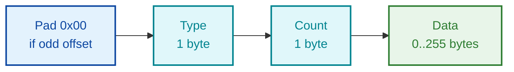

- **Pad byte**: `0x00` inserted if message would land on odd byte boundary
- **Message Type**: single 7-bit byte opcode
- **Byte Count**: payload length only (header excluded)
- **Data Field**: variable-length payload, possibly empty

**Parser reference:** `RP-P2-TAD.NPL` routine `GETMES` (lines 224–242)
**Builder reference:** `RP-P2-TAD.NPL` routine `CREMES` (writes the 2-byte header)

---

## 2. Master Opcode Table

All values are **octal** as written in NPL, with decimal/hex equivalents.

| Symbol  | Octal  | Dec | Hex  | Direction | Data Len | Category    | Purpose                              |
|---------|-------:|----:|-----:|:---------:|---------:|-------------|--------------------------------------|
| 7BDAT   | 000001 |   1 | 0x01 |   C↔S     | 0–255    | Data        | Terminal data block                  |
| 7RFI    | 000002 |   2 | 0x02 |   C→S     |    0     | Flow ctrl   | Ready For Input (credit grant)       |
| 7ECKM   | 000003 |   3 | 0x03 |   C→S     | 1 or 21  | Config      | Echo strategy + optional table       |
| 7BMMX   | 000004 |   4 | 0x04 |   C→S     | 3 or 23  | Config      | Break strategy + max-break + table   |
| 7ESCA   | 000010 |   8 | 0x08 |   S→C     |    0     | Control     | Escape character received            |
| 7DCON   | 000011 |   9 | 0x09 |   S→C     |    0     | Control     | Disconnect indication                |
| 7TMOD   | 000014 |  12 | 0x0C |   C→S     |    1     | Config      | Terminal mode flags                  |
| 7TTYP   | 000015 |  13 | 0x0D |   C→S     |    2     | Config      | Terminal type ID                     |
| 7CESC   | 000016 |  14 | 0x0E |   C→S     |    1     | Config      | Enable / disable escape processing   |
| 7DESC   | 000017 |  15 | 0x0F |   C→S     |    1     | Config      | Define escape character              |
| 7SYCN   | 000023 |  19 | 0x13 |   C↔S     |    2     | Control     | System control command               |
| 7USCN   | 000024 |  20 | 0x14 |   C↔S     |    2     | Control     | User control command                 |
| 7RESE   | 000026 |  22 | 0x16 |   C→S     |    0     | Control     | Reset connection (request)           |
| 7RECO   | 000027 |  23 | 0x17 |   S→C     |    0     | Response    | Reset confirm                        |
| 7DUMM   | 000030 |  24 | 0x18 |   any     |    0     | Filler      | Dummy / empty message (skipped)      |
| 7OPSV   | 000037 |  31 | 0x1F |   C→S     |    3     | Handshake   | OS version + protocol version        |
| 7CERS   | 000041 |  33 | 0x21 |   S→C     |    0     | Response    | CESC / escape-control response       |
| 7ISRQ   | 000042 |  34 | 0x22 |   C→S     |    0     | Query       | Input size request                   |
| 7ISRS   | 000043 |  35 | 0x23 |   S→C     |    2     | Response    | Input size response                  |
| 7NOWT   | 000044 |  36 | 0x24 |   C↔S     |    1     | Status      | Nowait status                        |
| 7TNOW   | 000045 |  37 | 0x25 |   C↔S     |    1     | Status      | Terminate nowait                     |
| 7NWRE   | 000046 |  38 | 0x26 |   S→C     |    0     | Status      | Nowait restart                       |
| 7RLOC   | 000047 |  39 | 0x27 |   S→C     |    0     | Control     | Remote/local mode toggle             |
| 7TREP   | 000052 |  42 | 0x2A |   S→C     |    2     | Status      | Terminal status report               |
| 7UMOD   | 000053 |  43 | 0x2B |   C→S     |    2     | Config      | UMOD strategy (protocol v4+)         |
| 78MOD   | 000054 |  44 | 0x2C |   C→S     |    2     | Config      | 8-bit mode set                       |
| 7CPCO   | 000372 | 250 | 0xFA |   S→C     |    4     | System      | Completion code                      |
| 7ERRS   | 000373 | 251 | 0xFB |   S→C     |    2     | System      | Error response                       |
| 7REJE   | 000376 | 254 | 0xFE |   S→C     |    1     | System      | Reject (invalid msg type echoed back)|

C = Client (RP, Remote Process). S = Server (MP, Master Process).

> **Direction-column caveat [IMPORTANT].** The C/S column reflects which NPL source
> file contains the builder/handler (RP vs MP). On the captured XMSG wire the roles are
> **asker** (the machine whose user typed `connect-to`) and **host** (the machine
> serving the login), and several opcodes flow the OPPOSITE way from a naive C/S
> reading: in every captured session **RFI, ECKM, BMMX, SYCN, CESC are sent only by the
> HOST**, while TMOD/TTYP/DESC/OPSV/ESCA/RECO/CERS/DCON come from the ASKER. Use the
> capture-verified per-opcode directions in §22.2 for wire behaviour; the C/S column
> remains as NPL provenance.

> **Range design note:** Opcodes 0x01–0x54 are normal protocol messages (deliberately
> kept inside the printable / 7-bit ASCII range so they can survive 7-bit links).
> Opcodes 0xFA–0xFE are reserved system/error messages — using the high range makes
> them unambiguous against any user data byte even in 7-bit mode.

### 2.1 Additional opcodes observed ONLY in captures (not in the NPL tables)

Seen in the three decoded `connect-to` sessions (§22); names/semantics UNKNOWN unless
noted:

| Hex | Symbol (2026-07-06 symbol-table hunt) | Dir (wire) | Data | Where seen | Reading |
|----:|---|:----------:|-----:|------------|--------------|
| `0x06` | **7CORQ** [CANDIDATE — "COnnect ReQuest", paired with 7CORS=7] | asker→host | 0 | session-setup chain | the session/connect request marker |
| `0x07` | **7CORS** [CANDIDATE — "COnnect ReSponse"] | host→asker | 5 | port-assign: `00 00 <node> <port16>` | **assigned terminal port** [effect VERIFIED] |
| `0x0B` | **7LUN** [STRONG — symbol `7LUN=13B`, and the wire byte IS the LU index (LU = 768 + XX, §22.4): name and measurement CONVERGE] | host→asker | 2 | port-assign: `03 XX` | the TAD **Logical Unit Number** |
| `0x15` | 7FBSI [WEAK candidate] | host→asker | 2 | port-assign: `01 08` | advertises the `0x0108` terminal class [INFERRED] |
| `0x1B` | 7KEYI [WEAK candidate] | asker→host | 0 | session-setup chain | [semantics UNKNOWN] |
| `0x1C` | 7BADT [WEAK candidate — "BAD" is the kernel's TAD device prefix] | asker→host | 1 (`00`) | session-setup chain | [semantics UNKNOWN] |
| `0x20` | **7ESRS** [STRONG — `s3vs-4.symb:63411` "ESCAPE RESPONSE BUFFER", matching the verified wire pairing] | host→asker | 0 | once per session, 0x0008 class | the **escape response** to 7ESCA |
| `0xFD` | **7POLL** [STRONG — value 375B essentially unique in the symbol tables] | host→asker | 0 | 0x0006 class, from the host's system port | a **POLL** from the server task, sent after the teardown ladder. ~~triggers the asker's DCON~~ CORRECTED (reboot capture): the asker's DCON follows its OWN idle timer (logout+64–69 s), independent of when the POLL arrives — see the notes before §22.8 |
| `0xFF` | (7EOP = 377B is the symbol-table match) | both | 0 | setup chains | chain terminator |

The same hunt surfaced 7\*-family members never yet seen on our wire — expect them in
future captures: `7PASS=0x11`, `7STRQ/7STRS=0x19/0x1A`, `7IAM=0x28`, `7EDRS=0x29`
(escape response, escape-disabled variant), `7WHO=0xFC`, `7ALOG`. Provenance: the
kernel symbol lists (`SYMBOL-1-LIST.SYMB.TXT`, values identical across K03/L07/M06);
NPL usage sites prove 7\* values are the wire message types packed `opcode<<8` in
message headers (`MP-P2-TAD.NPL:329–337`, `s3vs-4.symb:63403–63414`).

**The `0x00`-prefix — MEASURED RESOLUTION (2026-07-06, positional scan over every TAD
chain in 753 data frames):** there are TWO different `0x00`s, and the §1 pad rule is
NOT universal:
- **Alignment pads** precede 7RFI/7SYCN/7CESC **exactly iff the previous message ends
  at an odd offset** (34/34 cases) — true word-alignment, e.g. after an odd BDAT.
- **7ECKM (`0x03`), 7BMMX (`0x04`) and `0x07` are NOT alignment**: in all 62 cases the
  previous message ended EVEN, yet a `0x00` follows and the opcode lands at an ODD
  offset. The consistent reading: these are effectively **16-bit opcodes**
  (`0x0003`/`0x0004`/`0x0007`). `0x0B`'s prefix is alignment-consistent (8/8 after
  odd ends) and stays ambiguous.
- **The §1 "pad to even" rule is NOT enforced on the wire**: 7TTYP sits at an odd
  offset unpadded in 8/8 TMOD chains, and the session-setup's `FF` terminator at odd —
  the fixed setup chains are packed raw. The pad rule is a per-builder behaviour
  (`CREMES`-style message appends), not a frame invariant.
Encoders: reproduce the prefixes byte-for-byte (16-bit form for 03/04/07, alignment
pads before RFI/SYCN/CESC after odd-enders, none inside the TMOD chain). Decoders:
skip `0x00` bytes between messages, as before.

### 2.2 `[BIN]` findings from the cos-conn-to-e02 binary (not seen on wire — verify)

Decoded from the CONNECT-TO client binary (Ghidra), tagged `[BIN-only, unverified-on-wire]` — the
binary is application-level (above `MON 200B`), so these are candidates for the wire model, not
capture-confirmed:

1. **TAD terminal traffic is received as msg-type `3` = `XMTHI` (high-priority).** The receive loop
   (`tad_receive_and_dispatch` @0x46db) drops any XFRCV whose returned msg-type ≠ 3; per
   `XMSG-VALUES-L.SYMB` the msg-type codes are `XMTNO=1, XMROU=2, XMTHI=3, XMTRE=4`. So TAD data is
   sent with the `XFHIP` option — a kernel-local attribute, **invisible in pcap**. *(Do NOT confuse
   this XMSG msg-type field with the SINTRAN-header Subtype `0x0E`=Data; different fields.)*
2. **`7SYCN` command `000C` = error state** (candidate ladder value). The client's SYCN handler treats
   `000C` as an error; on the wire a wrong password was only ever observed as a silent reset to
   `0002` (WaitUser), so `000C` is a `[BIN]`-only candidate for the login-ladder table.
3. **Send builder model:** the asker appends each setup opcode's `[type][count][data]` into one scratch
   buffer, then flushes the whole chain with a single `XFWRI`+`XFSND` to the **system** port — i.e.
   the setup opcodes are one chained message, matching §22.4 (the terminal port is used only after
   the port-assign / 7CORS).

---

## 3. Data Messages

### 3.1 7BDAT — Data Block (0x01)

**Purpose:** Transmit user data (terminal input/output).

| Offset | Size | Field | Value / Meaning |
|-------:|-----:|-------|-----------------|
|  0     | 1    | Type  | 0x01 (7BDAT) |
|  1     | 1    | Count | N = 0..255 (data length) |
|  2     | N    | Data  | Raw terminal bytes |

- **Sender (client out):** `BYTPUT` at `RP-P2-TAD.NPL:363–381` — appends a byte at a time, auto-flushes when buffer fills.
- **Receiver (server in):** `DATRES` at `MP-P2-TAD.NPL:540`.
- 7-bit mode: bit 7 cleared. 8-bit mode (after 78MOD): all 8 bits significant.

**Break handling:**
- Last character in message may be break character
- `REMBYT=-1` indicates break on last byte
- Break triggers special processing in receiver

**Example (5 bytes "Hello"):**
```
┌──────┬────┬────┬────┬────┬────┬────┐
│ 0x01 │ 05 │ H  │ e  │ l  │ l  │ o  │
└──────┴────┴────┴────┴────┴────┴────┘
```

---

## 4. Control / Configuration Messages

### 4.1 7TMOD — Terminal Mode (0x0C)

**Purpose:** Set terminal operating mode flags.

| Offset | Size | Field  | Meaning |
|-------:|-----:|--------|---------|
|  0     | 1    | Type   | 0x0C |
|  1     | 1    | Count  | 1 |
|  2     | 1    | Flags  | bit-packed terminal mode flags |

**Flag bits** (used by `BDTMOD` at `MP-P2-TAD.NPL:155–180`, written into `DFLAG`/`TINFO`/`FLAGB`/`SCREEN`):

| Bit | Symbol     | Meaning |
|----:|------------|---------|
| 0   | 5CAPITAL   | Force uppercase input |
| 1   | 5CRDLY     | Insert delay after carriage return |
| 2   | (screen)   | Stop on full page (sets OTAD.SCREEN) |
| 3   | 5LBLOG     | Logout on carrier loss |
| 4   | 5IESC      | Inhibit escape recognition |
| 5   | 58BIT      | 8-bit data path |
| 6   | 5UMOD      | UMOD strategy in use |
| 7   | (reserved) |  |

**Source:** `RP-P2-TAD.NPL:805–850` (`BTMOD`/`CTMOD`), `MP-P2-TAD.NPL:155–180` (`BDTMOD`).

**Processing (receive)** — `MP-P2-TAD.NPL:661–669`:
```npl
DFLAG BZERO 5CAPITAL
IF D BIT "0" THEN T BONE 5CAPITAL FI; T=:DFLAG
T:=TINFO BZERO 5CRDLY=:TINFO
IF D BIT 1 THEN T BONE 5CRDLY=:TINFO FI
0=:OTAD.SCREEN
IF D BIT 2 THEN MIN X.SCREEN FI
T:=FLAGB BZERO 5LBLOG
IF D BIT 3 THEN T BONE 5LBLOG FI; T=:FLAGB
```

**Example** (capital + CR delay):
```
┌──────┬────┬────┐
│ 0x0C │ 01 │ 03 │
└──────┴────┴────┘
```

---

### 4.2 7TTYP — Terminal Type (0x0D)

| Offset | Size | Field   | Meaning |
|-------:|-----:|---------|---------|
|  0     | 1    | Type    | 0x0D |
|  1     | 1    | Count   | 2 |
|  2     | 2    | TermID  | 16-bit terminal type identifier (stored as `CTTYP`) |

**Source:** `RP-P2-TAD.NPL:860–872` (`CSTYP`), `MP-P2-TAD.NPL:188–197` (`BDTTYP`).

**Processing (receive):**
```npl
TDBTPT=:D SHZ -1; T:=TDTAFI; X:=TDTALA+A; *LDATX
IF D BIT "0" THEN
   A SHZ 10=:D; X+1; *LDATX
   A SHZ -10+D
FI
A=:CTTYP
```

**Example** (type 0x0123):
```
┌──────┬────┬────┬────┐
│ 0x0D │ 02 │ 01 │ 23 │
└──────┴────┴────┴────┘
```

---

### 4.3 7CESC — Enable / Disable Escape (0x0E)

| Offset | Size | Field  | Meaning |
|-------:|-----:|--------|---------|
|  0     | 1    | Type   | 0x0E |
|  1     | 1    | Count  | 1 |
|  2     | 1    | Enable | 0 = disable escape, ≠0 = enable |

Always paired with a 7CERS response (0x21) from the server.

---

### 4.4 7DESC — Define Escape Character (0x0F)

| Offset | Size | Field   | Meaning |
|-------:|-----:|---------|---------|
|  0     | 1    | Type    | 0x0F |
|  1     | 1    | Count   | 1 |
|  2     | 1    | EscChar | New escape character (stored in `CESCP`) |

**Source:** `RP-P2-TAD.NPL:930–943` (`CSDAE`), `MP-P2-TAD.NPL:242–249` (`BDDESC`).

**Processing (receive):**
```npl
TDBTPT=:D SHZ -1; T:=TDTAFI; X:=TDTALA+A; *LDATX
IF D BIT "0" THEN A/\377 ELSE A SHZ -10 FI; A=:T
CESCP/\177400+T=:CESCP
```

**Example** (escape = Ctrl-C):
```
┌──────┬────┬────┐
│ 0x0F │ 01 │ 03 │
└──────┴────┴────┘
```

---

### 4.5 78MOD — 8-bit Mode (0x2C)

| Offset | Size | Field | Meaning |
|-------:|-----:|-------|---------|
|  0     | 1    | Type  | 0x2C |
|  1     | 1    | Count | 2 |
|  2     | 2    | UMOD  | Mode word; non-zero sets the `58BIT` flag (0x0001 = 8-bit, 0x0000 = 7-bit strip) |

**Source:** `MP-P2-TAD.NPL:204–216` (`BD8MOD`).

**Processing (receive):**
```npl
TDBTPT; AD SHZ -1; T:=TDTAFI; X:=TDTALA+A
IF D BIT 17 THEN *LDDTX; AD SH 10 ELSE *LDATX FI
IF A=1 THEN TINFO BONE 58BIT=:TINFO FI
```

---

### 4.6 7UMOD — UMOD Strategy (0x2B, protocol v4+)

| Offset | Size | Field    | Meaning |
|-------:|-----:|----------|---------|
|  0     | 1    | Type     | 0x2B |
|  1     | 1    | Count    | 2 |
|  2     | 2    | Strategy | 16-bit UMOD strategy word |

Only legal once both sides have advertised protocol ≥ 4 via 7OPSV.

**Source:** `RP-P2-TAD.NPL:880–896` (`CSUMOD`).

**Processing (send):**
```npl
IF X.PORTNO=0 OR X.OSVTPN/\377<4 THEN EXIT FI  % Protocol must be >=4
7UMOD; T:=2; CALL CREMES
X:=BREG; A:=X.D4; CALL WORDPUT           % D4 contains UMOD strategy
CALL SNDBUF
```

---

### 4.7 7OPSV — OS / Protocol Version (0x1F)

| Offset | Size | Field      | Meaning |
|-------:|-----:|------------|---------|
|  0     | 1    | Type       | 0x1F |
|  1     | 1    | Count      | 3 |
|  2     | 1    | OS version | SINTRAN version code |
|  3     | 1    | OS subver  | Sub-version |
|  4     | 1    | Protocol   | TAD protocol version (gates v4+ features e.g. 7UMOD/78MOD) |

Stored in `OSVTPN`. **This is the handshake message** — both sides must exchange
it before optional-feature messages are legal.

**Source:** `MP-P2-TAD.NPL:223–235` (`BDOPSV`).

**Processing (receive):**
```npl
TDBTPT=:D SHZ -1; T:=TDTAFI; X:=TDTALA+A; *LDATX
IF D BIT "0" THEN
   A SHZ 10=:D; X+1; *LDATX
   A/\377+D
ELSE
   A/\177400=:D; X+1; *LDATX
   A SHZ -10+D
FI
A=:OSVTPN
```

**Example** (SINTRAN L=12, protocol 3):
```
┌──────┬────┬────┬────┬────┐
│ 0x1F │ 03 │ 0C │ 00 │ 03 │
└──────┴────┴────┴────┴────┘
```

---

## 5. Break and Echo Messages

### 5.1 7BMMX — Break Strategy / Max Break (0x04)

| Offset | Size | Field      | Meaning |
|-------:|-----:|------------|---------|
|  0     | 1    | Type       | 0x04 |
|  1     | 1    | Count      | 3 (no table) **or** 23 (with 20-byte table) |
|  2     | 1    | Strategy   | Break strategy code (see below) |
|  3     | 2    | MaxBreak   | Maximum break level (16-bit) |
|  5     | 20   | Break tbl  | *(optional)* break-character classification table |

**Strategy values:**
- `1–6` — predefined break strategies
- `7` — custom break table (20 bytes = 8 words of character bitmap, follows in message)
- `8`, `9` — strategies 8/9 (protocol ≥ 3)
- `11` — custom break table from user's BRKTAB

**Break table format:** 8 words (20 bytes) where each bit represents a character —
word 0 bit 0 = char 0x00, word 7 bit 15 = char 0x7F.

**Source:** `RP-P2-TAD.NPL:766–795` (`BDBREA`).

**Processing (send):**
```npl
IF T=X:=7 THEN T:=23 ELSE T:=3 FI; T=:MSSIZ
A:=7BMMX; T:=MSSIZ; CALL CRHEOD
BRSTR=:D; CALL STORBYT
TDBTPT SHZ-1; T:=TDTALA+A; 41ITAD.BRKMAX
T=:X:=TDTAFI; *STATX
TDBTPT+2=:TDBTPT; REMSIZ-2=:REMSIZ
IF D=7 THEN
   IF AREG=11 THEN 41ITAD.BRKTAB ELSE 41ITAD+"PBRK7" FI
   A=:D; CALL CBRECTA
FI
```

---

### 5.2 7ECKM — Echo Strategy (0x03)

| Offset | Size | Field        | Meaning |
|-------:|-----:|--------------|---------|
|  0     | 1    | Type         | 0x03 |
|  1     | 1    | Count        | 1 (no table) **or** 21 (with 20-byte table) |
|  2     | 1    | Strategy     | Echo strategy code (1–6 predefined, 7 = custom) |
|  3     | 20   | Echo table   | *(optional)* echo-character classification table |

**Echo table format:** Same layout as break table (8 words; bit per character).

**Source:** `RP-P2-TAD.NPL:735–758` (`BDECHO`).

**Processing (send):**
```npl
IF A=7 THEN T:=21 ELSE T:=1 FI; T=:MSSIZ
A:=7ECKM; T:=MSSIZ; CALL CRHEOD
AREG=:D; CALL STORBYT
IF D=7 THEN
   41ITAD+"PECH7"=:D; CALL CBRECTA
FI
```

---

## 6. Request and Response Messages

### 6.1 7RFI — Ready For Input (0x02)

| Offset | Size | Field | Value |
|-------:|-----:|-------|-------|
|  0     | 1    | Type  | 0x02 |
|  1     | 1    | Count | 0 |

Pure flow-control credit. "I have a fresh input buffer; you may send."

**When sent:**
- Input buffer empty and user requests input
- After rejecting a data message
- In nowait mode when no data available

**Source:** `RP-P2-TAD.NPL:1113–1147` (`SNDRFI`).

> Note: there is also a precomputed packed literal `7RFIL = 040442₈` in
> `RTLO-SYMBOLS.SYMB.TXT:1185` — this is `(7RFI<<8) | 0x42` used as an immediate
> operand to write the whole 2-byte header in one word store.

---

### 6.2 7REJE — Reject (0xFE)

| Offset | Size | Field    | Meaning |
|-------:|-----:|----------|---------|
|  0     | 1    | Type     | 0xFE |
|  1     | 1    | Count    | 1 |
|  2     | 1    | BadType  | The opcode that was rejected |

**When sent:**
- Inconsistent message (size mismatch)
- Unexpected control message
- Message arrived in wrong state

**Source:** `RP-P2-TAD.NPL:1161–1201` (`SNDREJ`), `MP-P2-TAD.NPL:926–948` (`REJECT`).

**Processing (send):**
```npl
A:=7REJE; T:=1; CALL CREMES
41ITAD.CURMES; CALL BYTPUT
IF 41ITAD.CURMES=7BDAT THEN
   A:=7RFI; T:=0; CALL CREMES     % Also send RFI after rejecting data
FI
CALL SNDBUF
```

---

### 6.3 7ISRQ / 7ISRS — Input Size Query (0x22 / 0x23)

**7ISRQ — Request:**

| Offset | Size | Field | Value |
|-------:|-----:|-------|-------|
|  0     | 1    | Type  | 0x22 |
|  1     | 1    | Count | 0 |

**7ISRS — Response:**

| Offset | Size | Field | Meaning |
|-------:|-----:|-------|---------|
|  0     | 1    | Type  | 0x23 |
|  1     | 1    | Count | 2 |
|  2     | 2    | Size  | 16-bit size: number of characters available; bit 15 (0x8000) flags break present |

**Source:** `RP-P2-TAD.NPL:958–1009` (`BISIZ`/`PISIZ`), `MP-P2-TAD.NPL:563–570` (response handling).

**Processing (receive):**
```npl
X:=TMPBUF; T:=6; CALL DRXACC(XDGER); A SHZ 10=:RDATR
X:=TMPBUF; T:=7; CALL DRXACC(XDGER)
T:=RDATR+A=:RDATR
IF OTAD.RSPNUM=7ISRS THEN
   A:=RDATR; IF D BIT 17 THEN A BONE 17 FI
   A=:DFRDATR:="MFISIZ"; CALL CXRTACT
FI
```

---

### 6.4 7ERRS — Error Response (0xFB)

| Offset | Size | Field   | Meaning |
|-------:|-----:|---------|---------|
|  0     | 1    | Type    | 0xFB |
|  1     | 1    | Count   | 2 |
|  2     | 2    | ErrCode | 16-bit SINTRAN error code (passed to `MFERSP`) |

**Source:** `MP-P2-TAD.NPL:571–578`.

**Processing (receive):**
```npl
X:=TMPBUF; T:=6; CALL DRXACC(XDGER); A SHZ 10=:RDATR
X:=TMPBUF; T:=7; CALL DRXACC(XDGER)
T:=RDATR+A=:RDATR
IF OTAD.RSPNUM=7ERRS THEN
   IF TDRADDR.RTRES.STATUS BIT 5WAIT THEN
      RDATR=:DFRDATR; "MFERSP"; CALL CXRTACT
   FI
FI
```

---

## 7. System Control Messages

### 7.1 7SYCN — System Control (0x13)

| Offset | Size | Field   | Meaning |
|-------:|-----:|---------|---------|
|  0     | 1    | Type    | 0x13 |
|  1     | 1    | Count   | 2 |
|  2     | 2    | Command | 16-bit system command code |

**Auto-send conditions:** command word = 1, 13 (0x0D = CR), or 17 (0x11 = DC1).

**Source:** `RP-P2-TAD.NPL:597–609` (`CTOBAD`).

**Processing (send):**
```npl
IF AREG=23 THEN 7SYCN ELSE 7USCN FI
T:=2; CALL CREMES
DREG; CALL WORDPUT
IF AREG=23 THEN
   IF DREG=1 OR A=13 OR A=17 THEN CALL SNDBUF FI
FI
```

### 7.2 7USCN — User Control (0x14)

| Offset | Size | Field   | Meaning |
|-------:|-----:|---------|---------|
|  0     | 1    | Type    | 0x14 |
|  1     | 1    | Count   | 2 |
|  2     | 2    | Command | 16-bit user command code |

Same builder routine as 7SYCN (`CTOBAD`). Always **sends and waits** for a 7ERRS response:
```npl
ELSE
   7ERRS; CALL SNDWT     % Send and wait for error response
FI
```

---

### 7.3 7CPCO — Completion Code (0xFA)

| Offset | Size | Field | Meaning |
|-------:|-----:|-------|---------|
|  0     | 1    | Type  | 0xFA |
|  1     | 1    | Count | 4 |
|  2     | 4    | Code  | 32-bit completion code (high word first: CPC1, CPC2) |

**Source:** `RP-P2-TAD.NPL:1062–1076` (`SNDCP`).

**Processing (send):**
```npl
7CPCO; T:=4; CALL CRHEEV
TDBTPT SHZ -1; T:=TDTAFI; X:=TDTALA+A
CPC1; *STATX
X+1; CPC2; *STATX
TDBTPT+4=:TDBTPT; REMSIZ-4=:REMSIZ
CALL SNDBUF
```

---

## 8. Connection Control Messages

### 8.1 7RESE — Reset (0x16)

| Offset | Size | Field | Value |
|-------:|-----:|-------|-------|
|  0     | 1    | Type  | 0x16 |
|  1     | 1    | Count | 0 |

Reset connection to initial state. Triggers a `7RECO` (Reset Confirm) response.

**Source:** `RP-P2-TAD.NPL:558–564` (`CTIBAD`).

**Processing (send):**
```npl
7RESE; T:=0; CALL CREMES
7RECO; CALL SNDWT     % Send reset and wait for confirm
```

---

### 8.2 7RECO — Reset Confirm (0x17)

| Offset | Size | Field | Value |
|-------:|-----:|-------|-------|
|  0     | 1    | Type  | 0x17 |
|  1     | 1    | Count | 0 |

**Source:** `MP-P2-TAD.NPL:559–562`.

**Processing (receive):**
```npl
IF X=RESCF THEN                            % RESET-CONF
   IF OTAD.RSPNUM=7RECO GO RSPRST
   GO TDRINP
FI
```

---

### 8.3 7DCON — Disconnect (0x09)

| Offset | Size | Field | Value |
|-------:|-----:|-------|-------|
|  0     | 1    | Type  | 0x09 |
|  1     | 1    | Count | 0 |

Triggers `DSTOTA` (forced disconnect with cleanup).

**Source:** `MP-P2-TAD.NPL:626–628`.

**Processing (receive):**
```npl
IF X=BDDIS THEN                            % DISCONNECT-MESSAGE
   GO DSTOTA                               % STOP AND DISCONNECT TAD
FI
```

---

## 9. Escape and Local Mode Messages

### 9.1 7ESCA — Escape (0x08)

| Offset | Size | Field | Value |
|-------:|-----:|-------|-------|
|  0     | 1    | Type  | 0x08 |
|  1     | 1    | Count | 0 |

Signal that an escape character was received. Triggers an escape response (`7CERS`).

**Source:** `MP-P2-TAD.NPL:602–625`.

**Processing (receive):**
```npl
IF X=BDESC OR X=RLOCA THEN
   IF DFLAG NBIT 5IESC THEN                % ESCAPE ENABLED
      IF X=BDESC THEN
         CESCP/\377=:LAST                  % ESCAPE
      ELSE
         IF FLAGB BIT 5LCHAR THEN
            CESCP SHZ-10=:LAST             % LOCAL CHARACTER
         ELSE
            177=:LAST                      % RUBOUT IN NORD-NET
         FI
      FI
      DFLAG BZERO 5RQI=:DFLAG
      CALL ESCAPE                          % Process escape
      TAD:=ERESP; T=:X:=XFWHD
      CALL MXMSG                           % Write escape response
   ELSE                                    % ESCAPE DISABLED
      TAD:=EDRSP; T=:X:=XFWHD
      CALL MXMSG
      AD:=OTAD.PARTNER; X:=PORTNO
      T:=XFSND; CALL MXMSG                 % Send response
   FI
FI
```

---

### 9.2 7CERS — Escape Response (0x21)

| Offset | Size | Field | Value |
|-------:|-----:|-------|-------|
|  0     | 1    | Type  | 0x21 |
|  1     | 1    | Count | 0 |

**Source:** `MP-P2-TAD.NPL:555–558`, `RP-P2-TAD.NPL:915` (send).

**Processing:**
```npl
IF A=CESCR THEN                            % CESC-RESP
   IF OTAD.RSPNUM=7CERS GO RSPRST
   GO TDRINP
FI
```
```npl
IF TDRADDR.RTRES=RTREF THEN
   7CERS; CALL SNDWT                       % SEND AND WAIT FOR RESPONSE
ELSE
   CALL SNDBUF                             % JUST SEND MESSAGE
FI
```

---

### 9.3 7RLOC — Remote/Local (0x27)

| Offset | Size | Field | Value |
|-------:|-----:|-------|-------|
|  0     | 1    | Type  | 0x27 |
|  1     | 1    | Count | 0 |

NORD-NET remote/local mode toggle. Same handler as `7ESCA`. Switches the terminal
between connection to remote system vs local system.

---

## 10. Nowait Mode Messages

### 10.1 7NOWT — Nowait Status (0x24)

| Offset | Size | Field  | Meaning |
|-------:|-----:|--------|---------|
|  0     | 1    | Type   | 0x24 |
|  1     | 1    | Count  | 1 |
|  2     | 1    | Status | Operation status (0 = success) |

**Source:** `RP-P2-TAD.NPL:1084–1102` (`NOWTSTA`).

**Processing (send):**
```npl
IF A=0 THEN A:=7NOWT ELSE A:=7TNOW FI
T:=41OTAD=:B; T:=1; CALL CRHEEV
NWS; CALL STORBYT
CALL SNDBUF
```

### 10.2 7TNOW — Terminate Nowait (0x25)

| Offset | Size | Field  | Meaning |
|-------:|-----:|--------|---------|
|  0     | 1    | Type   | 0x25 |
|  1     | 1    | Count  | 1 |
|  2     | 1    | Status | Error code (non-zero) |

Same builder as `7NOWT`.

### 10.3 7NWRE — Nowait Restart (0x26)

| Offset | Size | Field | Value |
|-------:|-----:|-------|-------|
|  0     | 1    | Type  | 0x26 |
|  1     | 1    | Count | 0 |

**Source:** `MP-P2-TAD.NPL:477–481`.

**Processing (receive):**
```npl
IF X=NWREM THEN                            % NOWAIT RESTART
   T:=XFSND; AD:=OTAD.PARTNER; X:=PORTNO
   CALL MXMSG                              % RETURN MESSAGE
   GO FAR DATRES                           % RESTART USER
FI
```

---

## 11. Special / Status Messages

### 11.1 7DUMM — Dummy (0x18)

| Offset | Size | Field | Value |
|-------:|-----:|-------|-------|
|  0     | 1    | Type  | 0x18 |
|  1     | 1    | Count | 0 |

Padding/filler so a buffer can be flushed without carrying real data. Server handler
`BDDUMM` at `MP-P2-TAD.NPL:256–260` simply skips it.

```npl
BDDUMM: T:=REMBYT-; T-1; TDBTPT+T=:TDBTPT; REMSIZ-T=:REMSIZ
        0=:REMBYT
        EXITA
```

**Usage:** replace data messages when clearing a buffer; initial buffer in `INISND`; alignment.

---

### 11.2 7TREP — Terminal Status Report (0x2A)

| Offset | Size | Field  | Meaning |
|-------:|-----:|--------|---------|
|  0     | 1    | Type   | 0x2A |
|  1     | 1    | Count  | 2 |
|  2     | 2    | Status | TINFO status bits (see below) |

**Status bits:**

| Bit | Symbol  | Meaning            |
|----:|---------|--------------------|
|  2  | 5BFUL   | Buffer overrun     |
|  3  | 5PAER   | Parity error       |
|  4  | 5FRER   | Framing error      |

**Source:** `MP-P2-TAD.NPL:482–495`.

**Processing (receive):**
```npl
IF X=TREPS THEN                            % TREP STATUS
   X:=TMPBUF; T:=6; CALL DRXACC(XDGER)
   A SHZ 10=:RDATR
   X:=TMPBUF; T:=7; CALL DRXACC(XDGER)
   T:=RDATR+A=:RDATR
   T:=XFSND; AD:=OTAD.PARTNER; X:=PORTNO
   CALL MXMSG                              % Return message
   T:=RDATR; A:=TINFO
   IF T BIT 2 THEN A BONE 5BFUL FI         % BUFFER OVERRUN
   IF T BIT 3 THEN A BONE 5PAER FI         % PARITY ERROR
   IF T BIT 4 THEN A BONE 5FRER FI         % FRAMING ERROR
   A=:TINFO
   GO TDRINP
FI
```

---

## 12. HDLC / XMSG Encapsulation

TAD never touches HDLC framing directly. The layering is:

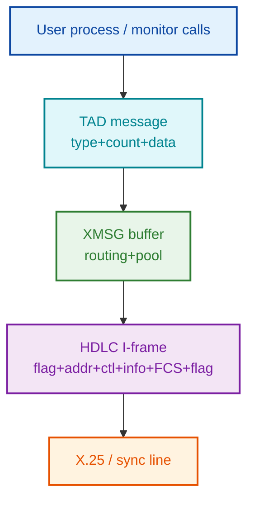

| Layer       | Owner                            | Source file (in `../NPL-SOURCE/NPL`) |
|-------------|----------------------------------|-----------------------------------------------------------------------|
| TAD message | RP-P2-TAD.NPL / MP-P2-TAD.NPL    | This document |
| XMSG transport | (5P-P2-MON60 etc.)            | Monitor calls XFOPN/XFSND/XFRCV/XFWHD |
| HDLC framing | MP-P2-HDLC-DRIV.NPL             | Bit stuffing, FCS, addr/ctl bytes |
| Physical    | Sync line driver                 | — |

Multiple TAD messages may be packed back-to-back inside one XMSG buffer (hence the
odd-byte pad rule in §1).

---

## 13. Connection Establishment Flow

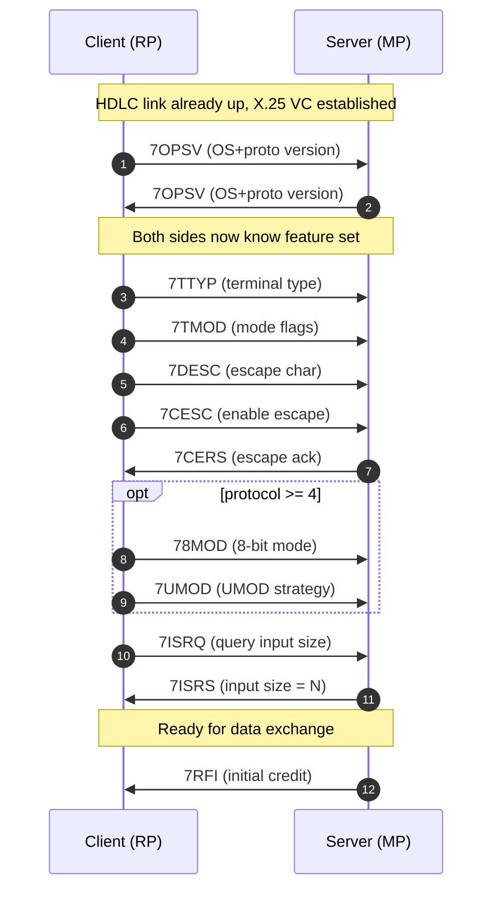

---

## 14. Steady-State Data Exchange

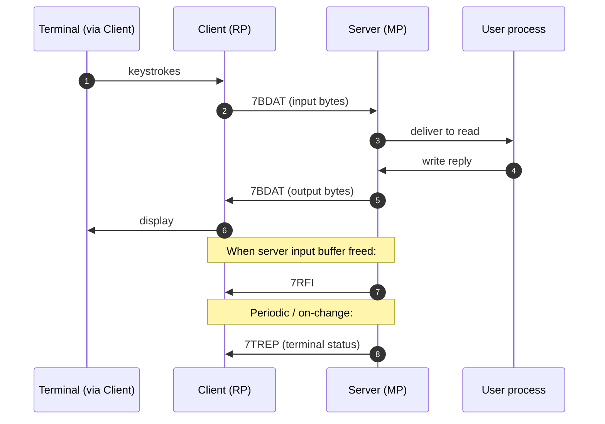

---

## 15. Error / Reset / Disconnect Flow

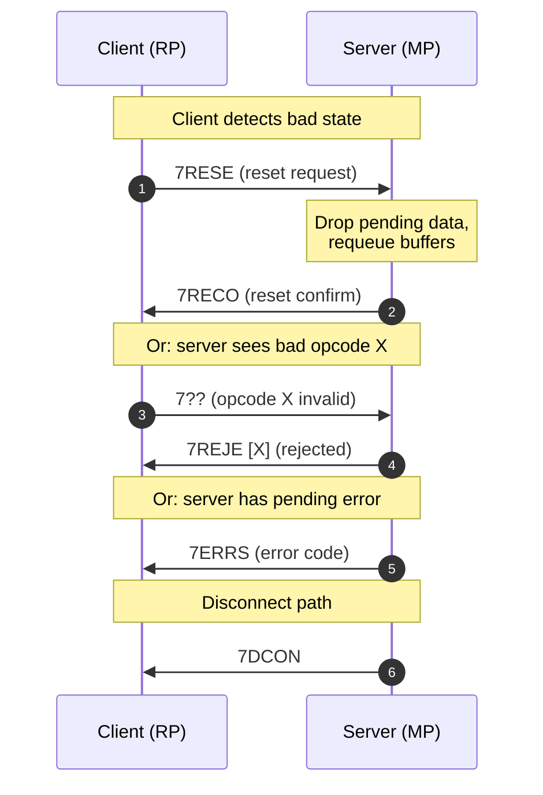

---

## 16. Server-Side Dispatch Map

Source: `MP-P2-TAD.NPL` `BDRINP` (line 439) and dispatch table (line 508–530).

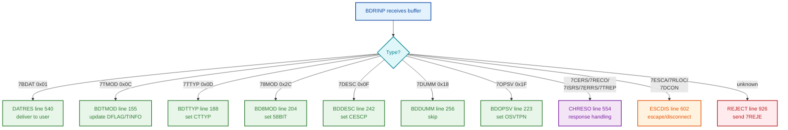

---

## 17. Client-Side Builder Map

Source: `RP-P2-TAD.NPL`. Common pattern: `GETPOOL` → `CREMES` → `BYTPUT`/`WORDPUT` → `SNDBUF`.

| Message | Builder routine        | Line range |
|---------|------------------------|-----------:|
| 7BDAT   | BYTPUT                 | 363–381    |
| 7TMOD   | BTMOD / CTMOD          | 805–850    |
| 7TTYP   | CSTYP                  | 860–872    |
| 7UMOD   | CSUMOD                 | 880–896    |
| 7DESC   | CSDAE                  | 930–943    |
| 7ISRQ   | BISIZ / PISIZ          | 958–1009   |
| 7CPCO   | SNDCP                  | 1062–1076  |
| 7NOWT/7TNOW | NOWTSTA            | 1084–1102  |
| 7RFI    | SNDRFI                 | 1113–1147  |
| 7RESE/7RECO | CTIBAD             | 558–559    |
| 7BMMX   | BDBREA                 | 766–795    |
| 7ECKM   | BDECHO                 | 735–758    |
| 7SYCN/7USCN | CTOBAD             | 597–609    |

---

## 18. Message Priority Levels

TAD messages have two priority levels handled differently by the driver.

### Normal Priority

Processed sequentially from the input buffer:
- `7BDAT` — Data
- `7TMOD` — Terminal mode
- `7TTYP` — Terminal type
- `7DESC` — Define escape
- `78MOD` — 8-bit mode
- `7OPSV` — OPSYS version
- `7DUMM` — Dummy

Received only if input buffer empty (`BUFFID=0`); messages queued in receive buffer; processed in order by `GETMES`.

### High Priority

Processed immediately (out-of-band):
- `7ESCA` / `7RLOC` — Escape / remote-local
- `7DCON` — Disconnect
- `7CERS` — Escape response
- `7RECO` — Reset confirm
- `7NWRE` — Nowait restart
- `7ISRS` — ISIZE response
- `7ERRS` — Error response
- `7TREP` — TREP status

Received even if input buffer has data; stored in temporary buffer (`TMPBUF`); processed before returning to normal priority queue.

**Source:** `MP-P2-TAD.NPL:445–496`
```npl
IF XMTHI><T GO FAR NORMP                   % NORMAL PRIORITY
T:=XFRCV; A:=PORTNO; CALL MXMSG            % RECEIVE HIGH PRIORITY
IF T=0 GO BDRWT
X:=D=:TMPBUF
T:=XFRHD; A:=TMPBUF; CALL MXMSG            % READ MESSAGE HEADER
X=:HIGHT                                   % SAVE MESSAGE TYPE
% ... process high priority message ...
GO TDRINP
```

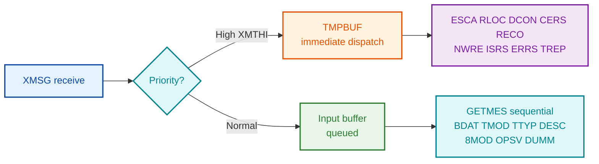

---

## 19. Buffer Management Integration

TAD uses XMSG for buffer management.

### Initialise pool — `INIBDR` (line 382)
```npl
T:=XFALM; FBSIZ; X:=NOBUFF; CALL MXMSG    % Allocate space
FOR X:=1 TO NOBUFF DO
   T:=XFGET; A:=FBSIZ; CALL MXMSG         % Get buffer
   CALL MPUTPOOL                          % Add to POOLLI chain
OD
```

### Get buffer from pool — `GETPOOL` (line 44)
```npl
POOLLI; IF A=0 AND D=0 GO NOPOL           % Pool empty
A=:T; D=:X; *LDDTX                        % Get next in chain
AD=:POOLLI                                % Update pool pointer
AD=:TDTADD; X+2; *LDATX                   % Get buffer address
A=:BUFFID                                 % Set buffer ID
41ITAD.FBSIZ-BUDIS=:REMSIZ                % Set remaining size
```

### Return buffer to pool — `PUTPOOL` (line 20)
```npl
A=:T; D=:X; AD:=POOLLI; *STDTX            % Link old POOLLI
X+2; A:=XREG; *STATX                      % Store buffer ID
AD=:POOLLI                                % Update POOLLI
0=:BUFFID                                 % Clear buffer ID
```

### Buffer states

| State           | Condition           | Location              |
|-----------------|---------------------|-----------------------|
| Free            | In POOLLI chain     | Buffer pool           |
| Input Active    | ITAD.BUFFID != 0    | Input datafield       |
| Output Active   | OTAD.BUFFID != 0    | Output datafield      |
| Temporary       | TMPBUF != 0         | High-priority handler |
| Mail            | MBFID != 0          | Mail system           |

---

## 20. Known Gaps

Areas where the on-the-wire format is still partially inferred:

| #  | Gap | Where to look next |
|---:|-----|--------------------|
| 1  | Echo/Break table (20-byte) bit semantics per char class | `BDECHO`/`BDBREA` callees, plus terminal-driver tables |
| 2  | 7ERRS error code enumeration | Search for `ERRSP` constants in symbol tables |
| 3  | 7SYCN / 7USCN command codes | **Largely resolved from captures** — SYCN values `0002/0003/0006/000A/000B/000C` mapped in §21 (login handshake); 7USCN still open |
| 4  | 7CPCO 32-bit code endianness (high word first assumed) | `SNDCP` byte-order in `RP-P2-TAD.NPL:1062` |
| 5  | UMOD strategy values (v4+) | `CSUMOD` callers |
| 6  | XMSG header bytes (before TAD payload) | `5P-P2-MON60.NPL` if available |
| 7  | HDLC addr/ctl byte conventions on the link | `MP-P2-HDLC-DRIV.NPL` |

---

## 21. Login Handshake  [VERIFIED from three captured logins]

Reconstructed from the FCS-verified captures decoded in
`SINTRAN/XMSG/SRC/pcap-decode-report.txt` (NDInsight repo): a complete login in
`conn-to-102-from103-via100.pcapng` and `conn-to-d102-from-100.pcapng`, and a
**failed-password + retry** in `new-conn-to-102-from-100.pcapng`. The
already-logged-in error paths come from `test1.pcapng`.

**Direction rule (VERIFIED, every capture):** `7SYCN`, `7ECKM`, `7CESC`, `7RFI`
and `7BMMX` are sent ONLY by the **host** (the SINTRAN side running the login).
The client sends only `7BDAT` keystroke lines (ASCII with the high/parity bit
set, e.g. `F3 F9 F3 8D` = "sys"+CR), `7CERS`, `7DUMM` keepalives, the
`7TMOD/7TTYP/7DESC/7OPSV` + `7ESCA` + `7RECO` setup, and the final `7DCON`.

**SYCN state values (16-bit payload):**

| SYCN | State |
|------|-------|
| `0002` | waiting for username (after banner / after failed password) |
| `0003` | username accepted |
| `0006` | password accepted ("OK") |
| `000A` | **LOGGED IN** — re-asserted after every completed command |
| `000B` | logged out (with "--EXIT--") |
| `000C` | error-text wrapper (e.g. "AMBIGUOUS COMMAND"), followed by `000A` + prompt |

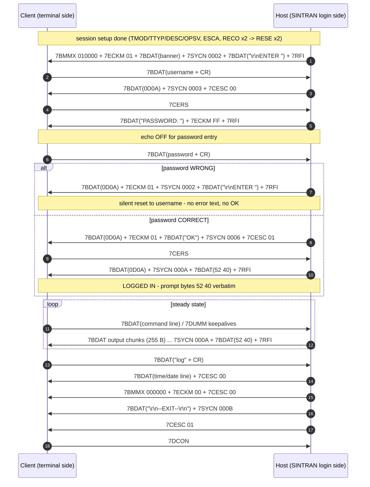

**Host implementation rule:** after the password line send exactly
`7BDAT(0D0A)` + `7ECKM 01` + `7BDAT("OK")` + `7SYCN 0006` + `7CESC 01`, then
`7BDAT(0D0A)` + `7SYCN 000A` + `7BDAT(52 40)` + `7RFI`; re-assert
`7SYCN 000A` + `52 40` + `7RFI` after every completed command. `7RFI` is the
ready-for-input credit and terminates EVERY host frame that expects client
input (ENTER prompt, PASSWORD, every command prompt) — without it the client
side sits idle after one line.

**UNKNOWNs (explicit):** the meaning of prompt bytes `52 40` ("R@" — mirror
verbatim); the exact `7CERS` trigger (correlates with every `7CESC`
transition); host opcode `0xFD` (on the `0x00060000` XMSG class) after login;
`7CPCO` payload `0004418B` on "TERMINAL ACCESS DENIED"; `7BMMX` payload
semantics (`010000` with echo-on at session start, `000000` at teardown);
the bad-USERNAME path (unseen — every capture used an accepted username);
and whether `SYCN 000A` alone cancels SINTRAN's 1-minute not-logged-in
disconnect or the full `0002→0003→0006→000A` ladder is required (no capture
shows the timeout itself).

---

## 22. The captured XMSG connect-to session — wire specification

**What this section is:** the complete, capture-verified specification of a `connect-to`
terminal session over XMSG — everything above the transport envelope: ports, message
classes, payload bytes, ordering, ACK discipline, steady state and teardown. HDLC/LAPB:
`../XMSG/DOC/LAPB-REQUIREMENTS.md`. The envelope (Flags1/Counter/channel/seed/epoch):
`../XMSG/DOC/XMSG-PROTOCOL.md` §18.5 — not repeated here; its **§18.8 worked scenarios**
show the exact channel/Counter bytes for the common cases (fresh vs long-running peers,
independent epochs per direction, the mirror trap that crashes a real machine, wrap
boundary, restart resync) — read those before implementing either role's envelope
stamping.

**Evidence (clean-room):** three fully decoded real sessions in
`../XMSG/SRC/pcap-decode-report.txt` — `conn-to-d102-from-100.pcapng` (lines 2012–2929),
`new-conn-to-102-from-100.pcapng` (8143–9233, includes a failed-password retry),
`conn-to-102-from103-via100.pcapng` (7–2011, includes the relayed leg). Line refs below
are into that report. Tags: [VERIFIED] = byte-for-byte in the captures (usually all
three sessions); [INFERRED]; [UNKNOWN].

Terminology: **asker** = the machine whose user typed `connect-to`; **host** = the
machine serving the session.

### 22.1 Endpoints and ports  [VERIFIED]

| Port | Owner | Value | Role |
|---|---|---|---|
| Port `0` | host | `0x0000` | XROUT well-known port — the connect letter's destination. ALL requests arrive here and fork on the XMCSM low byte (XSLET letters by server NAME vs direct services like XSGSY) — the three shapes are scenario S10 in `../XMSG/DOC/XMSG-PROTOCOL.md` §18.8; terminology (server vs service) in its §7 |
| System port | host | **logical port 2, low7 incarnation VARIES** — 342 (`0x0156`) in the 13 original captures and for 102 in the reboot capture; **358 (`0x0166`) for 100 in the 2026-07-05 reboot capture** | source of the host's XROUT letters (accept, port-assign) and the `0xFD` notification. **Do NOT hardcode 342 — learn it from the accept/port-assign source port** (the earlier "always 342" claim is hereby CORRECTED) |
| Asker port | asker | one per session — **allocated by the ORIGINATING node's XMSG kernel when the client program opens its port (`XFOPN`)**, not configured and not derivable: same machine+program reuses one logical slot with a fresh low7 per connect (100's connect-to = slot 5: 683/648/739/664/657…; 103's = slot 4: 581). Full port-lifecycle table: `../XMSG/DOC/XMSG-PROTOCOL.md` §7.1 | the asker's single port for the ENTIRE session; the host learns it from the connect frame |
| Terminal port | host | assigned in port-assign (1218/833/787 observed) | endpoint of all terminal-phase host traffic |

Port encoding `(logicalSlot << 7) | low7`; the host mints its terminal port from its OWN
free slot — not derived from the asker [VERIFIED]; any well-formed value the host
answers on is accepted (live-verified with `0x0211`).

### 22.2 Message classes  [VERIFIED]

`Flags2 == XMCSM >> 16` identifies the class; four classes carry a TAD session:

| Class | XMCSM | Carries | Wire direction of content |
|---|---|---|---|
| `0x0400` | `0x04000041` / `0x04000000` | XROUT letters: connect, accept / session-setup, port-assign | both (system/asker ports) |
| `0x0108` | `0x01080000` | ALL terminal data: TMOD chain, RESE/RECO, DUMM, CERS, banner, keystrokes, output, SYCN/ECKM/BMMX/RFI bursts | both (terminal/asker ports) |
| `0x0008` | `0x00080000` | out-of-band control: 7ESCA (asker), `0x20` (host), 7DCON (asker) | both |
| `0x0006` | `0x00060000` | the `0xFD` notification | host system port only |

Capture-verified per-opcode wire directions: HOST-only: 7RFI, 7ECKM, 7BMMX, 7SYCN,
7CESC, 7RESE, `0x20`, `0x07`, `0x0B`, `0x15`, `0xFD`. ASKER-only: 7TMOD, 7TTYP, 7DESC,
7ESCA, 7RECO, 7CERS, `0x06`, `0x1B`, `0x1C`. Both: 7BDAT, 7DUMM, 7OPSV, and — since
the 2026-07-06 live verification (§22.7) — **7DCON** (asker→host in every capture;
host→asker verified live as the instant-disconnect indication).

### 22.3 Chain rules  [VERIFIED]

- Trailers are chains of `[opcode][count][data…]` (§1), processed in order; odd-length
  messages are followed by a `0x00` pad (live-critical: an odd BDAT without the pad
  before RFI hangs the real terminal); `FF 00` terminates setup-phase chains.
- **XMLEN is effectively 16-bit**: the sub-header "pad" byte (offset 17) is the HIGH
  byte of the user-data length. Proof: 255-byte output chunks carry pad=`01`,
  XMLEN=`01` → 0x0101 = 257 = 2-byte BDAT header + 255 data.
- The `0x00`-prefix anomaly on ECKM/BMMX/`0x07`/`0x0B` — see §2.1.

### 22.4 Session lifecycle — the verified sequence (identical in all 3 sessions)

```
 1. asker  CONNECT letter        0x0400/0x04000041  askerPort -> 0        ->ack
 2. host   ACCEPT letter         0x0400/0x04000041  342 -> askerPort      ->ack
 3. asker  SESSION-SETUP         0x0400/0x04000000  askerPort -> 342      ->ack
 4. host   PORT-ASSIGN           0x0400/0x04000000  342 -> askerPort      ->ack
 5. host   DUMM (channel prime)  0x0108             termPort -> askerPort ->ack
 6. asker  TMOD+TTYP+DESC+OPSV   0x0108             askerPort -> termPort ->ack
 7. asker  ESCA                  0x0008                                   ->ack
 8. host   0x20 (answers ESCA)   0x0008                                   ->ack
 9. host   RESE #1               0x0108                                   ->ack
10. asker  RECO #1               0x0108                                   ->ack
11. host   RESE #2               0x0108                                   ->ack
12. asker  RECO #2               0x0108                                   ->ack
13. host   BANNER burst          0x0108  BMMX+ECKM+BDAT+SYCN 0002+BDAT("ENTER ")+RFI
    ... login (SYCN ladder, §21), steady state (22.6), teardown (22.7)
```

Strict pairings [VERIFIED]: asker 7ESCA ↔ host `0x20`; asker 7RECO×2 ↔ host 7RESE×2.
The host's DUMM (step 5) is the FIRST frame on the fresh terminal port, sent
immediately after the port-assign without waiting for its ACK.

**Frame contents [VERIFIED, byte-identical across sessions unless noted]:**

- **CONNECT letter** (XMLEN 16, role `0xE4`):
  `FF 07 2A 54414441444D 00 FE 04 44313032` = `FF`(serial) `07`(len)
  `*TADADM` `00` `FE 04` `"D102"`. Only the `Dnnn` target name would vary.
  (`2A` IS the literal `*` of the registered name [RESOLVED 2026-07-06]: the XROUT
  service registry — live `list-servers` output — displays names asterisk-included:
  `*TADADM` at logical port 2, `*XM-FIDO` at logical port 4. The registry's port 2
  independently confirms the wire ports 342/358 = `(2<<7)|incarnation`. A corpus scan
  of every XROUT letter found `TADADM` as the ONLY name ever used on the wire —
  list-systems is also a `*TADADM` letter, while list-route is nameless: it is the
  numbered XROUT service XSGSY, code `0x4B` in the XMCSM low byte, sent to port 0.)
- **ACCEPT letter** (XMLEN 8, role `0x40`): `01 02 0000 0202 000A` — byte-identical in
  EVERY captured accept, all epochs, both real responders; carries no per-session data
  (tail `0202 000A` [UNKNOWN]). Buildable from constants + the connect's source port.
- **SESSION-SETUP** (XMLEN 9, role `0x84`): `06 00 1B 00 1C 01 00 FF 00` — constant;
  opcode meanings [UNKNOWN].
- **PORT-ASSIGN** (XMLEN 24, role `0x40`), the only setup frame with per-session data:
  `00 07 05 0000 <node><port16>` (assigned terminal port) · `1F 03 4C0000` (OPSV reply)
  · `00 0B 02 03 <XX>` (XX=`00/01/02/04` observed — **XX = the TAD logical-unit index,
  LU = 768 + XX** [INFERRED-strong 2026-07-06: reboot session 2 had XX=01 and its `who`
  output shows LU 769; session 4 had XX=00 and shows 768; live XX=00 runs printed
  "TAD LOGICAL UNIT NO: 768" — 2 confirmations, 0 contradictions])
  · `15 02 0108` · `FF 00`.
- **Terminal setup chain** (asker, one frame):
  `0C 01 08 | 0D 02 0000 | 0F 01 1B | 1F 03 4C0104` (TMOD=8, TTYP=0, DESC=ESC,
  OPSV=`4C 01 04`; host's OPSV answer is `4C 00 00` inside the port-assign).
  ESCA/`0x20`/RESE/RECO/DUMM are all `<op> 00`.
  **What carries what [live-confirmed 2026-07-06]:** the terminal TYPE rides in 7TTYP
  (e.g. wire `0x0068` when the client's terminal type is set to 104 decimal — the
  captures' `0000` just means "type not set"); TMOD = mode flags, DESC = escape char,
  OPSV = OS/protocol version; the connect letter carries only `*TADADM` + the target
  system name. **The login USERNAME is not TAD metadata anywhere** — it arrives solely
  as ordinary BDAT keystrokes during the §21 login ladder; do not look for it in the
  setup frames.

### 22.5 ACK discipline  [VERIFIED — exhaustive count, all 3 sessions]

- **Every subtype-`0x0E` data frame, both directions, all four classes, receives exactly
  one subtype-`0x03` ACK** echoing its Flags1 — including the connect letter, DCON and
  the final `0xFD`. No unacked data frame exists in any capture.
- **ACK-before-response is the norm**; unsolicited traffic may run two data frames deep
  before the pending ACK arrives (host DUMM after port-assign, output chunk pairs,
  asker DUMM pairs).
- ACK construction: `../XMSG/DOC/XMSG-PROTOCOL.md` §6. A host that stops acking stalls
  the session [VERIFIED live].

### 22.6 Steady state

- **Keystrokes (asker→host):** one 7BDAT per completed line; 7-bit ASCII with **even
  parity in bit 7** (NOT a fixed +0x80 — `li-fi,,,` = `6C 69 2D 66 69 AC AC AC 8D`
  mixes clean and parity bytes). CR = `8D`, LF never sent. Hosts MUST strip bit 7.
  Editing bytes arrive raw ([UNKNOWN handling — a lone `81` seen mid-word]).
- **Host output:** clean 7-bit ASCII, CRLF; framing verbs per §21 (ECKM/SYCN/CESC/BMMX).
- **RFI rule [live-critical]:** every host burst that expects input MUST end with
  `02 00` — banner/ENTER, PASSWORD:, every prompt, the last chunk of every output.
- **Output chunking — the length rule is STRUCTURAL, not a byte cap [VERIFIED 33/33
  continuation chunks, all captures; live-confirmed by the RFIRUT crash 2026-07-06]:**
  The client (100) reads terminal-output 7BDAT elements until it receives one **shorter
  than 255** — that short element is the terminator and **MUST carry the RFI**. So:
  - **Every continuation (non-final) chunk is EXACTLY 255 data bytes** — `01 FF <255B>`,
    16-bit XMLEN `0x0101`, a bare BDAT with NO RFI, its own datagram. (255 = count field
    max = "buffer full, more follows".)
  - **The FINAL chunk is < 255 data bytes** and carries the burst trailer
    `BDAT(remainder) + [pad if odd] + SYCN 000A + BDAT(52 40 prompt) + RFI`.
  - The host streams up to two chunks ahead of the ACKs.
  - **A short (<255) BDAT in a NON-final frame, or any continuation without an RFI on the
    final frame, is the "Illegal element length" fault (routine RFIRUT) that CRASHES the
    client** — chunking at 240, 128, or any non-255 size trips it. The byte total across
    a reply is unbounded (a real file listing streams ~2 KB across 8+ chunks); only the
    per-continuation-chunk size (exactly 255) and the RFI-on-final rule matter.
  - Edge case [INFERRED — not in corpus]: if the output length is an exact multiple of
    255, the last data chunk is a full 255 (looks like a continuation); send one more
    short/empty final element carrying the SYCN+prompt+RFI to terminate.
  - There is NO ISRQ/ISRS input-size negotiation in any capture (0 occurrences) — the
    255 boundary is fixed, not negotiated.
- **Multi-chunk FLOW CONTROL — the host must pace AND secure-ACK [VERIFIED from the
  timestamped conn-to-d102 file-listing burst, F1 0x013A–0x0141]:** a byte-correct
  255/final split is NOT enough; the burst is a bidirectional handshake with a
  **2-datagram outstanding window**:
  1. The host sends **at most 2** output BDAT datagrams, then STOPS.
  2. 100 secure-ACKs (subtype 0x03) each chunk, AND sends its own frames back
     (7DUMM keepalives, F1 climbing 0x0103, 0x0104…) between pairs.
  3. **The host MUST secure-ACK those 100→host frames** before sending the next pair —
     the capture shows the host acking every DUMM (F1 0x0103/0x0104/…) in lockstep.
  4. Only after the outstanding chunks are ACKed does the host send the next ≤2; the
     **final RFI-bearing chunk is sent only after the preceding continuation is ACKed**
     (0x0140 ACKed → then 0x0141+RFI).
  Sending both chunks back-to-back with NO secure-ACKs (the "zero ACKs works" shortcut
  that is fine for SINGLE-frame replies) makes 100 receive the RFI terminator before it
  has committed the continuation: it discards the continuation, renders only the final
  chunk, and re-issues the command — the observed 2026-07-06 failure. (An earlier
  version of this note read "sends no 7CERS" as part of the failure signature — CERS
  absence is NORMAL for a CESC-less burst, see the CERS bullet below.)
  **So: secure-ACK IS required for multi-chunk output** (not for single-frame replies);
  respect the ≤2 window; ACK 100's interleaved DUMMs. This refines §22.5 — a host may
  skip ACKs only when its reply is a single frame that fully completes before 100 sends
  anything that needs acking.
- **7CERS is NOT a "burst consumed" signal — it is the 7CESC response, 1:1**
  [VERIFIED 2026-07-07, `conn-to-d102-from-100.pcapng`, full session decode]: the
  capture contains 5 host `CESC` transitions and exactly 5 asker `CERS` replies, each
  immediately following its CESC — and **ZERO CERS during or after the 8-chunk
  displayed listing burst** (which carries no CESC). This matches NPL (§9.2: 7CERS is
  the escape-control response) and REFUTES the earlier inference that CERS marks a
  consumed/displayed burst. Do not gate output on CERS; do not expect CERS after a
  multi-chunk reply.
- **7DUMM count = continuation count, 1:1** [VERIFIED, same burst]: across the 8-chunk
  listing the asker sent exactly **7 DUMMs for 7 continuation chunks** (F1 0x0103–0x0109
  vs chunks 0x013A–0x0140); the final RFI-bearing chunk (0x0141) triggered none. The
  DUMMs arrive in pairs because the chunks arrive in pairs. Reading [INFERRED]: the
  DUMM is the asker's per-consumed-full-buffer "send more" tick — so a deficit
  (2 continuations sent, only 1 DUMM back) is the on-wire signature that the asker's
  TAD layer did NOT accept one of the chunks even though it XMSG-ACKed both.
- **Intra-pair pacing** [MEASURED]: the real host does NOT emit the two chunks of a
  pair back-to-back — the gap between chunk 1 and chunk 2 of each pair is **45–47 ms**
  in all three pairs (0x013A→0x013B 47 ms, 0x013C→0x013D 46 ms, 0x013E→0x013F 45 ms).
  Whether the asker REQUIRES this spacing is [UNKNOWN — untested]; an emulated host
  that fires both chunks in the same instant deviates from the real host here.
  Full worked scenario with diagrams: §22.16.
- **Idle:** the ASKER keeps the session alive — 7DUMM (0x0108) typically in
  back-to-back pairs per idle tick. 7CERS is sent only in reply to a host CESC (see
  above — NOT per consumed burst). The host sends no keepalives after its priming
  DUMM. Wall-clock cadence [UNKNOWN — no timestamps in the report].
- **Role / frameFlags conventions** (observed values; semantics via
  `../XMSG/DOC/XMSG-PROTOCOL.md` §18.4): roles — connect `0xE4`, host system-port
  letters `0x40`, asker BDAT `0x84`, asker controls `0x94`, host terminal frames
  `0x00`, `0xFD` frames `0x54` (= XFWAK+XFBNC+XFROU — see the §18.4 warning: bit 0x04
  is XFROU "routed", NOT an asker marker). frameFlags — `0x86` on setup/first-use
  frames AND on the host's `0x20` (so NOT "0x82 on all control classes"); `0x82` on the
  asker's ESCA/DCON and the `0xFD` notify; `0x92`/`0x96` alternating on terminal data
  [rule UNKNOWN — mirror per frame type; observed per-frame values in the §22.4
  transcript sources].

### 22.7 Teardown  [VERIFIED]

User types `log`+CR → host: BDAT(time/date) + CESC 00 → BMMX 000000 + ECKM 00 +
CESC 00 → BDAT("--EXIT--") + SYCN 000B → CESC 01 → **`0xFD`** (0x0006 class, from the
host's system port) → asker acks; then — **when the asker's own not-logged-in idle
timer fires, measured logout + 64–69 s (see the notes below)** — the asker sends
**7DCON** (`09 00`, 0x0008 class, role `0x94`) → host acks. Nothing follows — no
teardown letter on the 0x0400 class. (`0xFD` also appeared once mid-session in via100
[UNKNOWN purpose there].)

**HOST-initiated instant disconnect [VERIFIED live 2026-07-06, real 100]:** the host
may end the session immediately by sending its OWN 7DCON (`09 00`, class `0x00080000`,
from the terminal/session port) — the client prints `-- DISCONNECTED BY TAD --` and
disconnects at once, skipping its 1-minute idle timer entirely. Measured facts:
- **DCON alone is sufficient** — the teardown ladder and the `0xFD` are NOT required
  for the disconnect itself (the DCON-only variant worked).
- **The DCON role byte is irrelevant** — host data-phase role `0x00` and the
  asker-style `0x94` both worked.
- Recommended host teardown: send the §22.7 ladder FIRST (it restores the client's
  line discipline — echo, break mode, escape — and shows `--EXIT--`), THEN the host
  DCON for the instant close. Ladder-only remains the passive variant (client's timer
  or local character ends it); DCON-only is abrupt but valid.
This confirms the NPL master table's 7DCON direction (S→C "Disconnect indication",
`MP-P2-TAD` `BDDIS → DSTOTA`) on the wire — 7DCON is now VERIFIED in BOTH directions.

**Reconnect and reboot behaviour [VERIFIED, reboot capture 2026-07-05 — see
`../XMSG/DOC/XMSG-PROTOCOL.md` §18.8 S7/S8 for the envelope bytes]:**
- After a completed teardown + DCON, the SAME link carries the next connect-to with
  both sides simply CONTINUING their datagram counters (+1); no session state resets
  anything. Two consecutive sessions run back-to-back at epoch-1 channels without
  incident.
- A **rebooted host** answers the first climbed connect with the echo-
  ReachabilityRequest resync; the asker resets and re-sends the connect from zero, and
  the session proceeds fresh.
- **The client's DCON timing is ITS idle timer, not a response to the `0xFD`**
  [MEASURED, reboot capture — this CORRECTS the earlier "0xFD triggers the asker's
  DCON" inference]: in all four sessions the DCON arrived at **logout + 64–69 s**,
  while the host's `0xFD` arrived anywhere from +6 s to +56 s with no effect on the
  DCON time. The timer is COSMOS connect-to's "not logged in" timeout (default
  1 minute, `CT-SERV: SET-TIMEOUT-VALUES`, ND-30.025 §3.3.2) — after `--EXIT--` the
  session reverts to not-logged-in and the client prints "(Allowed idle time:
  1 minute)". The manual states the timer exists as a FALLBACK "if you cannot remember
  the local character" (ND-60.163): the intended immediate exit is the client user
  pressing the **local character** (default ASCII 0 = Ctrl+@; twice while logged in,
  once after logout; changeable via `CT-SERV: CHANGE-LOCAL-CHARACTER`). A host cannot
  shorten the wait by teardown timing — but it CAN skip the timer entirely with a
  **host-initiated 7DCON** [VERIFIED 2026-07-06, §22.7].
- A host MUST tolerate and ACK a DCON for an already-closed session at any time (in the
  capture one arrived after a whole other session had run in between).
- The capture also shows **100 as host and 102 as client** in the same file: the host
  ladder (banner/SYCN/ECKM/teardown/`0xFD`) is byte-shape-identical with roles
  swapped — the protocol is fully symmetric.
- The **list-systems** operation appears as a TADADM letter variant: the normal
  connect letter payload plus the query TLV `04 02 0001` (param 4, value 1 — bytes
  VERIFIED in 9 letters across 4 captures; XMLEN 20 instead of 16),
  answered by an accept-shaped letter with NO session following [partially decoded —
  extra TLV meaning UNKNOWN].

> **Partial teardown ladders do NOT trigger the client's DCON [VERIFIED live,
> 2026-07-04].** A host that sends only `BDAT(farewell)` + `0xFD` (skipping the
> `CESC 00` / `BMMX 000000 + ECKM 00 + CESC 00` / `SYCN 000B` / `CESC 01` steps) gets
> both frames ACKed, but the client keeps the session alive (DUMM keepalives) and never
> sends DCON. Which single element is the trigger is UNKNOWN (no capture or live run
> isolates one; `SYCN 000B` as the logout state-signal is the INFERRED candidate,
> mirroring `SYCN 000A` for login) — send the complete five-frame ladder of §22.7.

### 22.8 Full-session sequence diagram

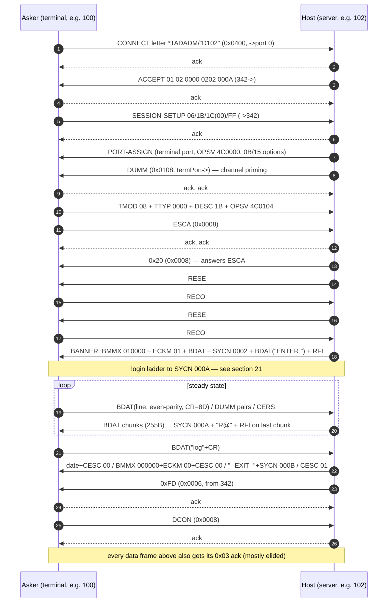

### 22.9 Per-role state machines and message obligations

The two sides have disjoint vocabularies and clearly detectable states. The state
machines below are **DETECTED from the three captures** (every transition observed at
least once; the wrong-password branch observed once) — [INFERRED] as machines, since no
NPL source for the host login flow survives; all message bytes inside them are
[VERIFIED].

**Message obligations by role:**

| | HOST (TAD server) | ASKER (connect-to client) |
|---|---|---|
| Sends | ACCEPT, PORT-ASSIGN, DUMM (prime), `0x20`, 7RESE, banner/login bursts (7BMMX/7ECKM/7SYCN/7CESC/7BDAT/7RFI), output chunks, teardown ladder, `0xFD` | CONNECT, SESSION-SETUP, 7TMOD/7TTYP/7DESC/7OPSV chain, 7ESCA, 7RECO, 7BDAT keystroke lines, 7CERS, 7DUMM keepalives, 7DCON |
| Receives (must handle) | everything in the asker column | everything in the host column |
| ACK duty | acks EVERY asker data frame | acks EVERY host data frame |
| Flow control | grants input with 7RFI at burst end | may type only after 7RFI |
| Keepalive | none (after the priming DUMM) | 7DUMM pairs when idle + one 7DUMM per consumed 255-continuation (§22.6); 7CERS only in reply to a host CESC (1:1, §22.6) |

**HOST state machine:**

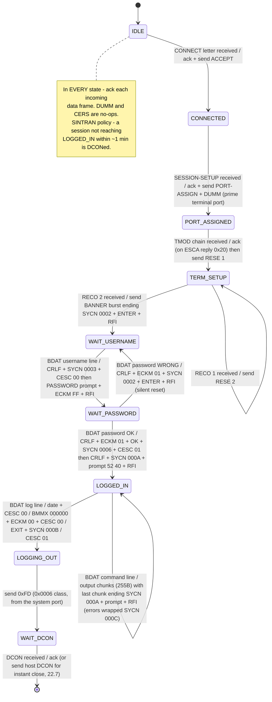

**ASKER state machine:**

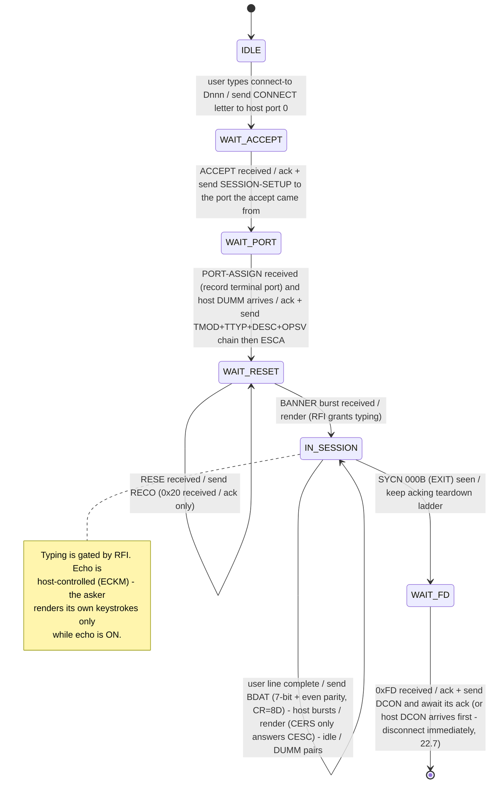

Boundary notes: the asker may only type after an RFI [VERIFIED live-critical]; the host
must never expect a keepalive from itself — silence from the asker beyond the DUMM
cadence just means idle. Neither side originates data on a port it doesn't own.

### 22.10 Existing implementation vs this spec

The C# responder (`../XMSG/SRC/Xmsg.Node/TadTerminalResponder.cs`) implements the setup
path, seed-model envelope, secure ACKs, the MOTD burst and a demo command loop. Its
divergences from this spec (audit 2026-07-04 — its defect list):

1. **No login**: stops at `SYCN 0002`; never advances the §21 ladder, so SINTRAN's
   1-minute "TAD not logged in" DCON always ends the session.
2. **No output chunking** (one ≤255-byte BDAT max).
3. **MOTD is a verbatim capture blob** (ID:102 / 8 APRIL 1998); a generated-banner path
   exists but is dead code.
4. **Isolation stubs** from crash debugging: connect handling sends only the accept;
   bring-up only the DUMM; the §22.4 sequence runs from a separate TMOD-gated handler.
5. **Fixed session port `0x0211`** (works live; no slot/incarnation model).
6. **Stale comments** still describe the removed Flags1-echo scheme (the code correctly
   uses the own-sequence seed model).
7. Port-assign `0x0B` byte hardcoded `00`; ignores session-setup/TMOD parameter contents
   (harmless per current knowledge — they never vary).
8. Two rules it got RIGHT, now normative here: the RFI credit rule and the odd-length
   alignment pad (§22.3/22.6).

### 22.11 Open questions  [UNKNOWN — collected]

1. ~~The `0x00`-prefix~~ **RESOLVED 2026-07-06 by positional scan (§2.1):**
   ECKM/BMMX/`0x07` behave as 16-bit opcodes (62/62 follow even-enders yet carry the
   `00`); RFI/SYCN/CESC pads are true word-alignment (34/34 after odd-enders); the §1
   pad rule is per-builder, not a wire invariant (TTYP odd-unpadded 8/8). Only
   `0x0B`'s prefix remains ambiguous (alignment-consistent 8/8).
2. Opcode semantics: `0x20`, `0xFD` (incl. its one mid-session occurrence),
   `0x06`/`0x1B`/`0x1C`, `0x15`, accept tail `0202 000A`, prompt bytes `52 40`.
   (`0x0B`'s data byte: RESOLVED-strong — the TAD logical-unit index, §22.4.)
3. frameFlags `0x92`/`0x96` alternation rule — narrowed 2026-07-06: `0x82`/`0x86` are
   now fully mapped (0x82 = the 0x0006/0x0008 control classes except the host's `0x20`
   which rides 0x86; 0x86 = letters/setup/first-use). For 92-vs-96 the corpus EXCLUDES
   as discriminators: class (identical), RFI presence, BDAT presence, burst position
   (RESE#1 counterexamples), payload identity (the RESE pair splits 96/92). Still
   UNKNOWN — keep mirroring per frame type.
4. Whether `SYCN 000A` alone cancels the 1-minute timeout, or the full ladder is needed.
5. Keepalive cadence — refined 2026-07-06: the timestamped reboot capture contains NO
   periodic idle DUMMs; all its DUMMs are event-driven (post-EXIT bursts). The old
   untimed captures' "idle DUMM pairs" may be event-driven too. A deliberately-idle
   timed capture would settle it.
6. Bad-username path; escape (7ESCA/CESC) handling mid-session (never captured).
7. ~~Host-initiated DCON~~ **RESOLVED 2026-07-06 [VERIFIED live, real 100]:** a
   Server→Client 7DCON (class `0x00080000`, from the terminal/session port) makes the
   client print `-- DISCONNECTED BY TAD --` and disconnect **immediately** — no idle
   timer. DCON **alone** suffices (no ladder, no `0xFD` required), and the **role byte
   is irrelevant** (host `0x00` and asker-style `0x94` both worked). See §22.7.
8. What conditions make a real node use ACK class `0x0002` instead of `0x0001`
   (emitter-side only — receivers can't distinguish and emitting `0x0001` always is
   capture-consistent; `XMSG-PROTOCOL.md` §6). Narrowed 2026-07-06: a
   pending-unacked-count model was tested against the timestamped reboot capture and
   does NOT fit (`0x0001` acks occur with 1–3 pending, `0x0002` with 1–2).
9. LAPB address `0x07` on six ACK frames — tested correlates (first-of-pair,
   paired-with-`0x0002`) are inconsistent (counterexamples both ways). Still UNKNOWN;
   tolerate on RX.

### 22.12 Echo control and line discipline  [VERIFIED values; NPL strategy table §5.2]

Echo is **host-controlled, client-executed** [INFERRED — from two verified facts: (a)
no captured host BDAT ever contains the typed characters except as part of command
OUTPUT, yet the user demonstrably saw "sys" while typing; (b) the NPL echo machinery is
strategy-table based (7ECKM strategies 1–7 + optional 20-byte character table, §5.2,
`RP-P2-TAD.NPL:735–758` `BDECHO`), i.e. designed for the terminal side to apply per
character — remote per-char echo would contradict the line-mode BDAT framing]. The host
never echoes typed characters over the wire; the ASKER echoes locally, and 7ECKM tells
it whether/how.

| Wire bytes | Meaning | When the host sends it |
|---|---|---|
| `00 03 01 01` (ECKM strategy `0x01`) | **echo ON** — asker echoes keystrokes locally | banner burst (session start); after "OK" on correct password; after a WRONG password (with the SYCN 0002 reset) |
| `00 03 01 FF` (ECKM `0xFF`) | **echo OFF** — asker displays nothing while typing | immediately after the "PASSWORD: " BDAT, before the RFI — this is how no-echo password entry works |
| `00 03 01 00` (ECKM `0x00`) | echo off / discipline teardown | logout ladder, together with `BMMX 000000` and `CESC 00` |

(Remember the `00`-prefix anomaly, §2.1: ECKM and BMMX are always preceded by `0x00` on
the wire.) Captured sessions use only strategies `01`/`FF`/`00`; the NPL catalog (§5.2)
defines strategies 1–7 incl. a 20-byte custom echo table — never seen on these links.

The rest of the line discipline:

- **Line mode, not char mode:** the asker sends ONE 7BDAT per completed line (CR=`8D`),
  never per keystroke. The host never sees partial lines (except raw edit bytes inside
  the line buffer, e.g. the lone `81` — §22.6).
- **RFI gates typing:** the asker may send the next line only after the host's 7RFI.
  Password entry is therefore exactly: host sends `"PASSWORD: "` BDAT + `ECKM FF` +
  `RFI`; asker locally suppresses echo, collects the line, sends it as one BDAT; host
  answers with `ECKM 01` in its verdict burst (OK or silent reset) so echo resumes.
- **CESC transitions** (`0x0E 01 00|01`) bracket login/logout phase changes — escape
  disabled during login, re-enabled after [INFERRED reading; wire values VERIFIED; CESC
  enable/disable semantics from NPL §4.3, `MP-P2-TAD.NPL` `5IESC` flag §4.1]. The asker
  answers each with 7CERS [VERIFIED pattern; NPL: 7CERS is the CESC/escape response,
  §9.2, `MP-P2-TAD.NPL:555–558`].
- **BMMX** `010000` opens / `000000` closes the session's break discipline [INFERRED
  semantics; wire values VERIFIED and constant; NPL format: break strategy + max-break,
  §5.1, `RP-P2-TAD.NPL:766–795` — the captured 3-byte payload matches the "no table"
  form, strategy `01`/`00` + MaxBreak `0000`].
- Output rendering: host output is clean 7-bit ASCII with CRLF; the asker prints it
  verbatim [VERIFIED — every captured host BDAT].
- **RFI = input-buffer credit** [VERIFIED behaviour; NPL semantics §6.1,
  `RP-P2-TAD.NPL:1113–1147` `SNDRFI`: "I have a fresh input buffer; you may send" —
  exactly the captured gating].

### 22.13 Build recipe — connect-to CLIENT (asker)

Prerequisites (all specified elsewhere, all mandatory): LAPB link up
(`../XMSG/DOC/LAPB-REQUIREMENTS.md`), reachability exchange done, envelope stamping per
`../XMSG/DOC/XMSG-PROTOCOL.md` §18.5 (own persisted Flags1, learned seed), and the ACK
duty of §22.5 (ack every host data frame; treat "no ack for my frame" as
behind-sequence, see XMSG-PROTOCOL §4.2).

**Opening message** — the client STARTS the session by sending the CONNECT letter to
the host's port 0: class `0x0400`, XMCSM `0x04000041`, role `0xE4`, frameFlags `0x86`,
srcPort = your client port — mint it like the real allocator does (`XFOPN` model, one
logical slot for your client program + a fresh low7 incarnation per connect; port
lifecycle table `../XMSG/DOC/XMSG-PROTOCOL.md` §7.1), keep it for the whole session,
trailer
`FF 07 2A 54414441444D 00 FE 04 <"Dnnn">` (§22.4). Then respond by table:

| You receive | You do |
|---|---|
| ACCEPT (`04000041`, role 0x40, from port 342) | ack; send SESSION-SETUP `06 00 1B 00 1C 01 00 FF 00` (class 0x0400, XMCSM `0x04000000`, role 0x84) to port **342** |
| PORT-ASSIGN (`04000000`) | ack; extract the terminal port from the `0x07` message — ALL later traffic goes there |
| host DUMM (0x0108, from terminal port) | ack only; then send the terminal-setup chain `0C 01 08 0D 02 0000 0F 01 1B 1F 03 4C0104` (0x0108, role 0x84) and ESCA `08 00` (0x0008, role 0x94) |
| `0x20` (0x0008) | ack only [VERIFIED pairing: it answers your ESCA — §22.4; opcode semantics UNKNOWN, §2.1] |
| RESE `16 00` | ack; send RECO `17 00` (0x0108, role 0x94) — happens twice [VERIFIED; NPL: 7RESE is answered by 7RECO, §8.1, `RP-P2-TAD.NPL:558–564` "send reset and wait for confirm"] |
| BANNER burst (BMMX+ECKM 01+BDAT+SYCN 0002+"ENTER "+RFI) | ack; render banner; enable local echo (§22.12); user may type — the RFI is the permission [VERIFIED, §22.12] |
| any host burst ending RFI | render BDATs, obey ECKM/CESC (§22.12), send 7CERS **only if the burst carried a CESC** [VERIFIED 1:1 CESC↔CERS, §22.6 — the earlier "per consumed burst" rule is RETRACTED], allow next input line |
| host output chunks without RFI | render, ack — do NOT type yet [VERIFIED: mid-listing chunks carry no RFI] |
| SYCN 000B ("--EXIT--" ladder) | keep acking the ladder [VERIFIED; SYCN wire format §7.1; the state VALUES are capture-only, §21 — not in NPL] |
| `0xFD` (0x0006 class, from 342) | ack; send **DCON** `09 00` (0x0008, role 0x94); await its ack; session over [VERIFIED sequence in 2 of 3 captures; the 0xFD→DCON causality is INFERRED — §22.7] |

Continuous duties: encode typed lines as 7BDAT with **even-parity 7-bit ASCII, CR=8D,
no LF** [VERIFIED — §22.6 byte proof]; send DUMM pairs when idle [VERIFIED order,
cadence UNKNOWN]; never send data before the first RFI [VERIFIED: no captured asker
BDAT precedes an RFI grant].

### 22.14 Build recipe — TAD SERVER (host)

Same prerequisites. The server is PASSIVE until a connect letter arrives at port 0.
Respond by table (each "send" implies acking the trigger frame FIRST — §22.5):

| You receive | You do |
|---|---|
| CONNECT letter (`04000041`, role 0xE4, to port 0) | ack; send ACCEPT `01 02 0000 0202 000A` (role 0x40, **from port 342**, dstPort = the connect's srcPort) |
| SESSION-SETUP (`04000000`, to port 342) | ack; mint your terminal port `(slot<<7)\|low7` [layout VERIFIED via symbols `5PSHZ=7`/`5PMS1=0x7F`/`5PMSK=0xFF80`, `XMSG-SYMBOL-LIST.SYMB.TXT:1261–1263`; responder-local allocation VERIFIED, see `../XMSG/DOC/XMSG-PROTOCOL.md` §18.4 U4]; send PORT-ASSIGN (§22.4 trailer, from 342); immediately send DUMM `18 00` (0x0108, role 0x00, **from the terminal port**) — do not wait for the port-assign's ack [VERIFIED order, all 3 sessions] |
| TMOD chain (0x0108, to terminal port) | ack; store TMOD/TTYP/DESC/OPSV (contents never varied in captures) |
| ESCA (0x0008) | ack; send `0x20` `20 00` (0x0008, role 0x00); send RESE #1 `16 00` (0x0108) |
| RECO #1 | ack; send RESE #2 |
| RECO #2 | ack; send the BANNER burst: `[00]BMMX 010000` + `[00]ECKM 01` + BDAT(banner text) + `SYCN 0002` + BDAT(`\r\nENTER `) + RFI — one frame, 0x0108, from the terminal port. **You are now in WAIT_USERNAME** |
| BDAT line in WAIT_USERNAME | ack; strip parity bit; send `BDAT 0D0A` + `SYCN 0003` + `CESC 00`, then `BDAT "PASSWORD: "` + `[00]ECKM FF` + RFI → WAIT_PASSWORD (echo now OFF at the client, §22.12) |
| BDAT line in WAIT_PASSWORD, **correct** | ack; send `BDAT 0D0A` + `[00]ECKM 01` + `BDAT "OK"` + `SYCN 0006` + `CESC 01`, then `BDAT 0D0A` + `SYCN 000A` + `BDAT 52 40` + RFI → LOGGED_IN |
| BDAT line in WAIT_PASSWORD, **wrong** | ack; send `BDAT 0D0A` + `[00]ECKM 01` + `SYCN 0002` + `BDAT "\r\nENTER "` + RFI → back to WAIT_USERNAME (silent — no error text) |
| BDAT command line in LOGGED_IN | ack; execute; stream output as 255-byte BDAT chunks (16-bit XMLEN, §22.3); FINAL chunk carries `SYCN 000A` + `BDAT 52 40` + RFI. Errors: `SYCN 000C` + BDAT(text) + `SYCN 000A` + prompt + RFI |
| BDAT "log" line | ack; send the teardown ladder (§22.7: date+CESC 00 / BMMX 000000+ECKM 00+CESC 00 / "--EXIT--"+SYCN 000B / CESC 01), then `0xFD` `FD 00` (0x0006, role 0x54, **from the system port**). For an IMMEDIATE close, follow with a host **7DCON** `09 00` (0x0008 class, from the terminal port; role byte irrelevant) — the client disconnects at once instead of holding its 1-minute timer [VERIFIED 2026-07-06, §22.7] |
| DCON | ack; close the session [VERIFIED: nothing follows the DCON ack in any capture; NPL: DCON triggers `DSTOTA` forced disconnect + cleanup, §8.3, `MP-P2-TAD.NPL:626–628`]. Freeing/reusing the terminal port afterwards is an [ASSUMPTION — no capture shows port reuse; the low7 "incarnation" component varying per session suggests reuse-with-new-incarnation] |
| DUMM / CERS (any state) | ack; no other action [VERIFIED; NPL: `BDDUMM` "simply skips it", §11.1, `MP-P2-TAD.NPL:256–260`] |

Mandatory invariants:
- End EVERY input-expecting burst with RFI (§22.6/§22.12 — omitting it deadlocks the
  client [VERIFIED live]).
- Pad odd-length BDATs before the next message (§22.3 [VERIFIED live]; NPL pad rule §1,
  `GETMES`/`CREMES`).
- Login timeout: a session that has not reached `SYCN 000A` is disconnected after
  ~1 minute [VERIFIED live — SINTRAN 100's console prints "TAD not logged in" and it
  DCONs; the exact timer value and which SYCN state stops it are UNKNOWN, §22.11 item 4;
  not found in the COSMOS guides or NPL in this tree]. A compatible server SHOULD do the
  same (recommendation, not a wire requirement).
- Never originate traffic from a port you didn't announce — 342 or the assigned
  terminal port [VERIFIED: no other source port appears in any captured host frame;
  342's identity as the TADADM/XROUT service port is INFERRED from it receiving the
  session-setup after the `*TADADM` letter].

### 22.15 Worked scenario — login with echo control and the logged-in signal

The complete username/password exchange, frame by frame, with the exact TAD chain bytes
and what each side does. All bytes [VERIFIED] from the three captured logins (report
lines cited); envelope (Flags1/Counter/channel) elided — see `XMSG-PROTOCOL.md` §18.8.
Every data frame below is also acked (§22.5, elided). `[00]` = the §2.1 prefix byte.

| # | Dir | TAD chain (wire bytes) | Client's local behaviour | Server state |
|---|-----|------------------------|--------------------------|--------------|
| 1 | H→C | `[00]04 03 010000` `[00]03 01 01` `01 60 <banner>` `13 02 0002` `01 08 0D0A454E54455220` `02 00` (BMMX + **ECKM 01** + BDAT banner + **SYCN 0002** + BDAT "\r\nENTER " + RFI) | render banner; **local echo ON**; RFI ⇒ user may type | WAIT_USERNAME |
| 2 | C→H | `01 04 F3F9F38D` (BDAT "sys"+CR, even-parity) | user sees "sys" as typed (local echo) | — |
| 3 | H→C | `01 02 0D0A` `13 02 0003` `0E 01 00` (BDAT CRLF + **SYCN 0003** + CESC 00) | print CRLF; answer `21 00` (CERS) | username accepted |
| 4 | H→C | `01 0A 50415353574F52443A20` `[00]03 01 FF` `02 00` (BDAT "PASSWORD: " + **ECKM FF** + RFI) | print prompt; **local echo OFF** — password typed blind; RFI ⇒ may type | WAIT_PASSWORD |
| 5 | C→H | `01 01 8D` (BDAT — empty password, just CR) or `01 06 F0E1F3F3F38D` ("passs"+CR, the captured WRONG attempt) | nothing displayed while typing | — |
| 6a | H→C | **correct:** `01 02 0D0A` `[00]03 01 01` `01 02 4F4B` `13 02 0006` `0E 01 01` (CRLF + **ECKM 01** + BDAT "OK" + **SYCN 0006** + CESC 01) | print "OK"; **echo back ON**; answer CERS | password accepted |
| 6b | H→C | **wrong:** `01 02 0D0A` `[00]03 01 01` `13 02 0002` `01 08 0D0A454E54455220` `02 00` (CRLF + **ECKM 01** + **SYCN 0002** + "ENTER " + RFI) — L8857 | echo back ON; back to username prompt — NO error text | reset to WAIT_USERNAME |
| 7 | H→C | `01 02 0D0A` `13 02 000A` `01 02 5240` `02 00` (CRLF + **SYCN 000A** + BDAT `52 40` + RFI) | print the `@` prompt; **this is the "logged in" signal** | **LOGGED_IN** |
| 8 | H→C | after EVERY completed command: last output chunk ends `… 13 02 000A 01 02 5240 02 00` | prompt re-drawn; may type | LOGGED_IN re-asserted |

Key facts the scenario demonstrates:
- **The logged-in notification is `SYCN 000A`** (frame 7) — there is no other "you are
  on" message; the client can treat *last SYCN seen == 000A* as "at the @ prompt".
  Logout later signals `SYCN 000B` with the `--EXIT--` text (§22.7).
- **No-echo password entry is `ECKM FF`** (frame 4), sent BY the server, executed BY the
  client's local echo (§22.12) — password characters never cross the wire until the
  completed line's single BDAT. Echo is always restored with `ECKM 01` in the verdict
  burst, on BOTH branches (6a/6b).
- The wrong-password branch is **silent** — no error text, no intermediate SYCN; just
  the reset to `0002` [VERIFIED once, new-conn L8845–8857].
- Every input-expecting host frame (1, 4, 6b, 7, 8) ends with RFI; frames 3 and 6a do
  NOT carry RFI because the server continues talking (4 and 7 follow immediately).

Byte sources: conn-to-d102 L2568–2661, new-conn L8783–8937 (incl. the 6b branch),
via100 L1097–1186.

### 22.16 Worked scenario — multi-chunk DISPLAYED output (the `li-fi` listing)  [VERIFIED, timestamped]

The reference for any terminal reply longer than one buffer. Source:
`conn-to-d102-from-100.pcapng` (real asker 100 ⇄ real host 102): the user types
`li-fi,,,` (LIST-FILES) at the `@` prompt and the host streams a **2032-byte listing
as 8 chunks** (7 × 255-byte continuations + one 247-byte final) — all of it rendered
on the asker's screen. This is TERMINAL DISPLAY, not file transfer: terminal port pair
(host 1218 → asker 683), class `0x01080000`, plain BDATs, session continues with
`logout` afterwards. There is no other mechanism — no pagination, no ISRQ, no per-chunk
CERS/flush handshake.

**The measured exchange (t = seconds into capture; F1 hex):**

| t | Dir | Frame | Note |
|---|-----|-------|------|
| 17.354 | A→H | BDAT "li-fi,,,"+CR (F1 0102) | the command |
| 17.416 | H→A | ACK 0102 | host acks the command first |
| 17.477 | H→A | **chunk 1** BDAT(255) (F1 013A) | bare, no RFI |
| 17.524 | H→A | **chunk 2** BDAT(255) (F1 013B) | **47 ms after chunk 1** — not back-to-back |
| 17.540 | A→H | ACK 013A + ACK 013B | delivery acks |
| 17.617 | A→H | DUMM (F1 0103) + DUMM (F1 0104) | **one DUMM per consumed continuation** |
| 17.678 | H→A | ACK 0103 + ACK 0104 | host MUST ack these before continuing |
| 17.740 | H→A | **chunk 3** (013C), +46 ms **chunk 4** (013D) | next pair |
| 17.801 | A→H | ACK 013C + ACK 013D | |
| 17.879 | A→H | DUMM 0105 + DUMM 0106 → H acks | same handshake |
| 18.003 | H→A | **chunk 5** (013E), +45 ms **chunk 6** (013F) | |
| 18.064–18.33 | A↔H | ACKs, DUMM 0107 (acked), DUMM 0108 | |
| 18.329 | H→A | **chunk 7** (0140) — sent ALONE | last continuation goes solo |
| 18.406 | A→H | ACK 0140 | |
| 18.453 | H→A | **final chunk** (0141): BDAT(247) + SYCN 000A + BDAT `52 40` + RFI | only after 0140's ACK |
| 18.468 | A→H | DUMM 0109 + ACK 0141 | 7th DUMM = 7th continuation; final chunk triggers none |

**Chunk anatomy (byte reference, all 7 continuations identical in shape):**

```
continuation (e.g. F1 013A):
  addr 89 (odd info) | 21 13 00 0E | dst 0064 | src 0066 | F1 | F2 0108 | ch DB
  ctr D2.. (decrements with F1) | 21 00 | ff 96 | role 00
  dst 0064:02AB | src 0066:04C2 | XMCSM 01080000 | XMLEN 0101
  chain: 01 FF <255 bytes of listing text — splits ANYWHERE, even mid-word>

final (F1 0141):
  addr 09 (even info) | ... | XMLEN 0104
  chain: 01 F7 <247 B> + 13 02 000A + 01 02 5240 + 02 00   (SYCN 000A + "R@" prompt + RFI)
```

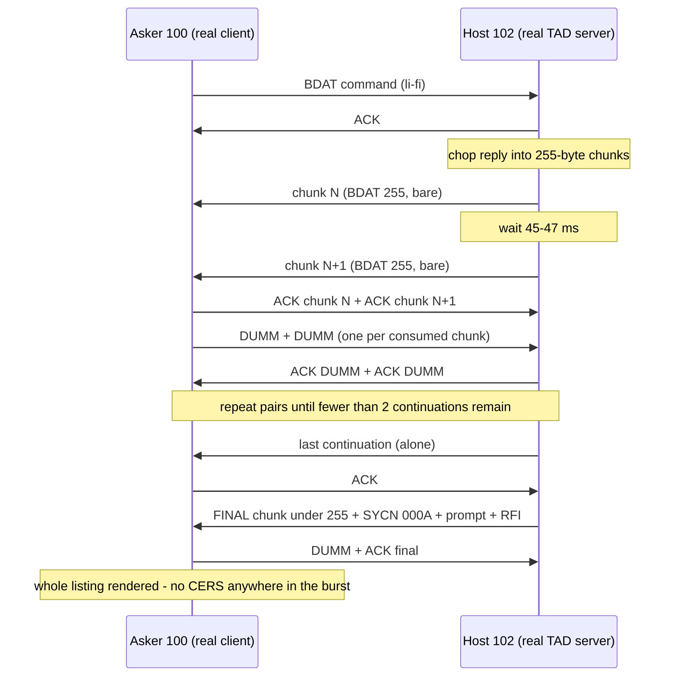

**Host output-queue algorithm (what a conforming host implements):**

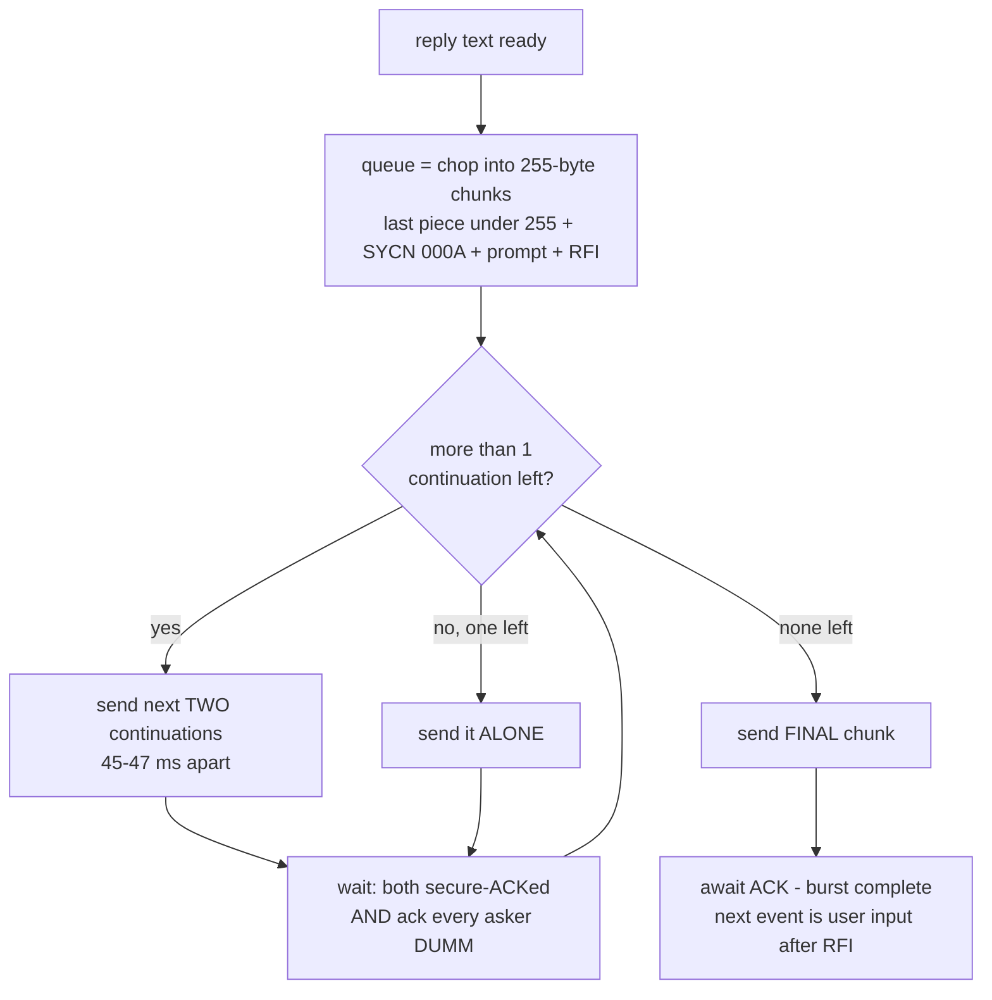

Key rules this scenario proves (all [VERIFIED] unless marked):
1. **The 255-sentinel IS the display mechanism** — the "is it file transfer?" doubt is
   refuted by content (`FILE 0 : (PACK-ONE:SYSTEM)…` on the terminal port/class, an
   interactive session).
2. **No 7CERS anywhere** — 0 CERS in the 8-chunk burst; CERS answers CESC only (§22.6).
3. **DUMM ↔ continuation is 1:1** (7↔7). Diagnostic: if you send 2 continuations and
   get back only 1 DUMM, the asker's TAD layer dropped one of them even though it
   XMSG-ACKed both.
4. **Intra-pair spacing 45–47 ms** — the real host never fires a pair back-to-back.
   Whether the asker REQUIRES the gap is [UNKNOWN — the prime suspect when an emulated
   host's byte-identical burst renders only partially].
5. **The last continuation goes alone, and the final chunk is sent only after the last
   continuation's ACK.**

Second independent reference [VERIFIED]: `new-conn-to-102-from-100.pcapng` t≈15.0–16.0,
F1 0x0054…, ports 833→648, channel DC (different epoch) — same construct, same ~46 ms
intra-pair gap, DUMM-per-continuation again; the host's window flexes (a chunk may go
out before the previous ACK arrives) but stays ≤2 outstanding. Also NOTE the DUMM-theory
status: an emulated host reproduced a perfect 1:1 DUMM handshake (window=1) and the bare
continuations STILL did not render — so the DUMM correlation is a *consumption symptom*,
NOT the display gate [MEASURED 2026-07-07, xmsg-runner trace]. The asker-side display
decision lives in the connect-to binary's BDAT receive path (`cos-conn-to-e02.prog`,
`tad_receive_and_dispatch`) — decoding that handler is the definitive next step.

---

## Related Documents

- `TAD-Protocol-Analysis.md` — Overall protocol analysis
- `TAD-HDLC-Encapsulation.md` — HDLC layer detail
- `TAD-Protocol-Flows.md` — Protocol flow diagrams
- `TAD-X25-CUD-Specification.md` — X.25 Call User Data
- `TAD-Evidence-vs-Inference.md` — Verification status

**Document path:** `TAD-Message-Formats.md`
