# TAD Protocol Flow Diagrams

## Overview

This document provides detailed protocol flow diagrams for SINTRAN III TAD (Terminal Access Device) X.25 communication sequences.

**Parent Documents:**
- `TAD-Protocol-Analysis.md` - Overall protocol analysis
- `TAD-Message-Formats.md` - Message format specifications

---

## Connection Establishment Flow

### Full Connection Sequence


### Connection State Machine


---

## Data Transfer Flows

### Output Data Flow (User → Remote)

```mermaid
sequenceDiagram
    participant User as User Program
    participant IOTRANS as BDPUT (IOTRANS)
    participant Buffer as Output Buffer
    participant Driver as BDROUT (Driver)
    participant XMSG as XMSG Layer
    participant Remote as Remote TAD

    User->>IOTRANS: Write Byte
    IOTRANS->>IOTRANS: Check CURMES=7BDAT?

    alt No Data Message Active
        IOTRANS->>Buffer: CREMES (Create 7BDAT)
        Buffer-->>IOTRANS: Message Created
    end

    IOTRANS->>Buffer: BYTPUT (Add Byte)
    Buffer-->>IOTRANS: Byte Added

    alt Buffer Full or Timeout
        IOTRANS->>Driver: SNDBUF
        Driver->>XMSG: XFSCM (Set Current)
        Driver->>XMSG: XFSND (Send Buffer)
        XMSG->>Remote: X.25 Data Packet
        Driver->>Buffer: MGETPOOL (New Buffer)
    end

    IOTRANS-->>User: Character Accepted
    
    box Blue User Space
    participant User
    end
    box Teal TAD Driver
    participant IOTRANS
    participant Buffer
    participant Driver
    end
    box Green Network
    participant XMSG
    participant Remote
    end
```



### Input Data Flow (Remote → User)


### 8-Byte Transfer (BB8OUT/BB8INP)


---

## Buffer Management Flows

### Buffer Pool Management


### Buffer State Transitions


---

## Escape and Break Handling

### Escape Sequence


### Break Message Flow


### Echo Strategy Flow


---

## Error Handling Flows

### Message Rejection Flow


### Ready-For-Input (RFI) Flow


### Fatal Error Recovery


---

## Disconnection Flows

### Graceful Disconnection


### Remote-Initiated Disconnection


### Forced Disconnection with Cleanup


---

## Nowait Mode Flows

### Nowait Mode Operation


### Nowait Status Reporting


---

## ISIZE Query Flow

### ISIZE Request-Response


---

## Complete TAD Session Example

### Terminal Session Flow


---

## Priority Message Handling

### Message Priority Processing

```mermaid
flowchart TD
    Start([Message Arrival]) --> CheckPri{Priority<br/>Level?}

    CheckPri -->|High| ImmRcv[XFRCV Immediate]
    CheckPri -->|Normal| CheckBuf{Input Buffer<br/>Empty?}

    CheckBuf -->|Yes| NormRcv[XFRCV Normal]
    CheckBuf -->|No| Wait[Wait for Buffer Empty]
    Wait --> CheckBuf

    ImmRcv --> Store[Store in TMPBUF]
    Store --> Parse[XFRHD: Read Header]
    Parse --> Process{Message<br/>Type?}

    Process -->|7ESCA/7RLOC| Escape[Process Escape]
    Process -->|7DCON| Disconnect[DSTOTA]
    Process -->|7CERS| EscResp[Escape Response]
    Process -->|7RECO| ResetConf[Reset Confirm]
    Process -->|7NWRE| NowaitRestart[Restart Nowait]
    Process -->|7ISRS| SizeResp[ISIZE Response]
    Process -->|7ERRS| ErrorResp[Error Response]
    Process -->|7TREP| TrepStatus[TREP Status]

    Escape --> MoveOut{Output Buffer<br/>Empty?}
    MoveOut -->|Yes| MoveBuf[Move TMPBUF to Output]
    MoveOut -->|No| AddPool[Add to Pool]
    MoveBuf --> Continue
    AddPool --> Continue

    EscResp --> CheckWait{Waiting for<br/>Response?}
    CheckWait -->|Yes| Restart1[Restart User]
    CheckWait -->|No| Continue

    SizeResp --> Extract[Extract Size Data]
    Extract --> CheckWait

    ErrorResp --> Extract

    Disconnect --> Continue
    ResetConf --> CheckWait
    NowaitRestart --> RestartUser[Restart User]
    TrepStatus --> UpdateInfo[Update TINFO Flags]

    Restart1 --> Continue
    RestartUser --> Continue
    UpdateInfo --> Continue
    Continue([Continue Processing])

    NormRcv --> NormStore[Store in Input Buffer]
    NormStore --> NormParse[GETMES: Parse Messages]
    NormParse --> NormProc{Message<br/>Type?}

    NormProc -->|7BDAT| ProcData[Process Data]
    NormProc -->|7TMOD| ProcMode[Process Mode]
    NormProc -->|7TTYP| ProcType[Process Type]
    NormProc -->|7DESC| ProcEsc[Process Escape Def]
    NormProc -->|78MOD| Proc8Bit[Process 8-bit]
    NormProc -->|7OPSV| ProcVer[Process Version]
    NormProc -->|7DUMM| ProcDummy[Skip Dummy]
    NormProc -->|Other| Reject[SNDREJ: Reject]

    ProcData --> UserRead[User Reads Data]
    ProcMode --> ApplyMode[Apply Mode Settings]
    ProcType --> ApplyType[Apply Type Settings]
    ProcEsc --> ApplyEsc[Set Escape Char]
    Proc8Bit --> Apply8Bit[Enable 8-bit]
    ProcVer --> ApplyVer[Store Version]
    ProcDummy --> NormParse

    Reject --> SendRej[Send 7REJE]
    SendRej --> NormParse

    UserRead --> Done([Done])
    ApplyMode --> Done
    ApplyType --> Done
    ApplyEsc --> Done
    Apply8Bit --> Done
    ApplyVer --> Done
```

---

**Document Path:** `Z:\NorskData\Source Code\Sintran L\NPL\TAD-Protocol-Flows.md`

**Related Documents:**
- `TAD-Protocol-Analysis.md` - Overall protocol analysis
- `TAD-Message-Formats.md` - Message format specifications
- `TAD-Emulator-Implementation-Guide.md` - C# implementation guide (to be created)
