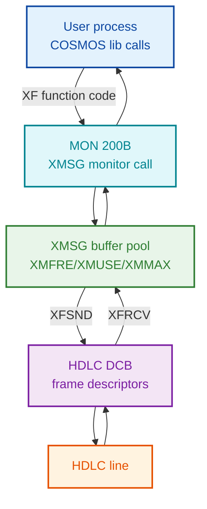
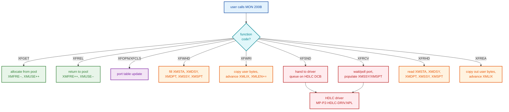
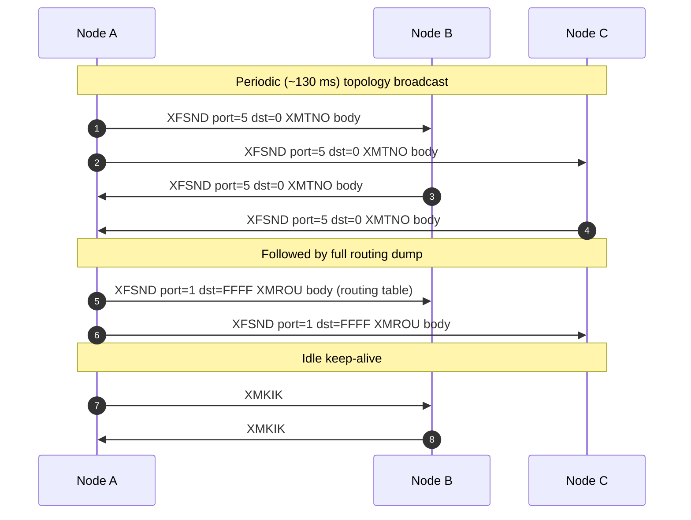
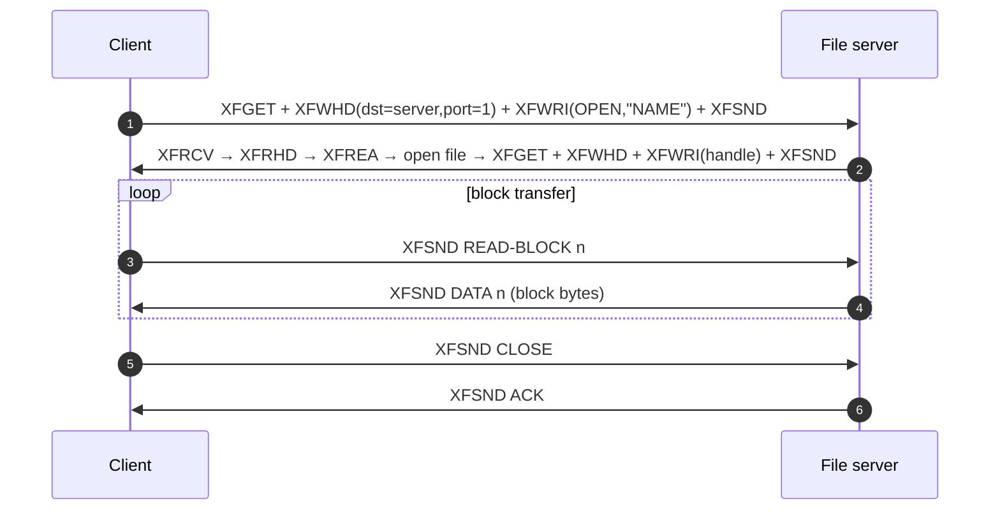
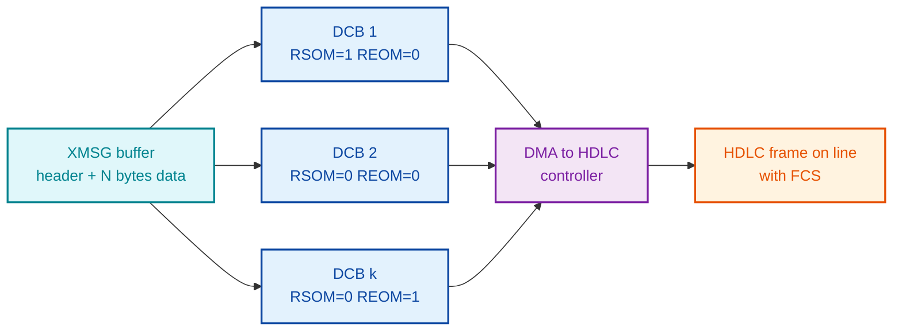
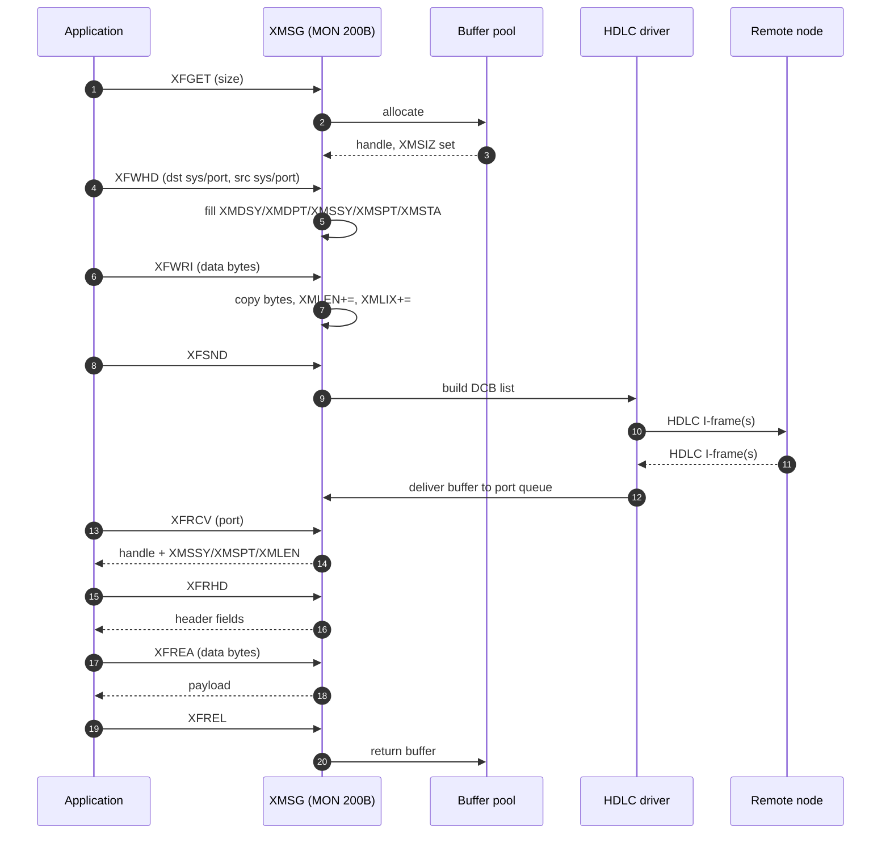

# XMSG Protocol Analysis (Verified from NPL Symbols & Source)

**Scope:** SINTRAN III XMSG (eXchange MeSsaGe) subsystem — the in-buffer / on-wire
formats used to carry routing, file-transfer, mail and other inter-node messages
over HDLC in COSMOS / NORD-NET.

**Evidence policy:** Each section below is tagged:
- **[VERIFIED]** — directly read from NPL source or symbol tables
- **[PARTIAL]** — symbol exists, surrounding code only partially decoded
- **[INFERRED]** — name/usage strongly suggests purpose, no direct code path read

**Primary sources:**
- `NPL-SOURCE/SYMBOLS/L07/XMSG-SYMBOL-LIST.SYMB.TXT`
- `NPL-SOURCE/SYMBOLS/L07/SYMBOL-1-LIST.SYMB.TXT`
- `NPL-SOURCE/SYMBOLS/L07/FILSYS-SYMBOLS.SYMB.TXT`
- `NPL-SOURCE/NPL/MP-P2-HDLC-DRIV.NPL`
- `NPL-SOURCE/NPL/MP-P2-TAD.NPL`
- `NPL-SOURCE/NPL/RP-P2-TAD.NPL`
- `XMSG-COMMAND-REFERENCE.md`
- `Devices/HDLC/archive/XMSG_Metadata_Buffer_Analysis.md`
- `../Operations/Cosmos/ND-60164-3-EN COSMOS Programmer Guide.md`
- `../Developer/MON/calls/200B_XMSGFunction.yaml`

> **Status:** What follows is an inventory of what the symbol tables and NPL
> sources currently make readable. Several areas (field byte-order, multi-buffer
> chaining, route-update payload) are still partial — see §11 (Gaps).

---

## 1. Architecture Overview  [VERIFIED]



XMSG sits between application code (COSMOS file-transfer / mail / remote-login /
TAD terminal traffic) and the HDLC link driver. Every operation is invoked via
**monitor call 200B** with a function code in the `XF*` range (see §3).

---

## 2. XMSG Header (XM5) Layout  [VERIFIED — offsets; PARTIAL — semantics]

The standard message header is referenced by the symbol set `XM5*` and the field
group `XM5BS … XMBLN`. Verified header symbols (from
`XMSG-SYMBOL-LIST.SYMB.TXT`):

| Symbol  | Octal  | Dec | Hex  | Field meaning                                |
|---------|-------:|----:|-----:|----------------------------------------------|
| XM5BS   | 000134 |  92 | 0x5C | Header base start (struct origin)            |
| XM5LN   | 000021 |  17 | 0x11 | Header length (17 words)                     |
| XM5HL   | 000016 |  14 | 0x0E | Header length variant (14 words)             |
| XMSTA   | 000135 |  93 | 0x5D | Status / return code                         |
| XMDSY   | 000136 |  94 | 0x5E | Destination system                           |
| XMDPT   | 000137 |  95 | 0x5F | Destination port                             |
| XMSSY   | 000140 |  96 | 0x60 | Source system                                |
| XMSPT   | 000141 |  97 | 0x61 | Source port                                  |
| XMCSM   | 000142 |  98 | 0x62 | Control / session-management word            |
| XMLIX   | 000143 |  99 | 0x63 | Link / current-position index                |
| XMSIZ   | 000144 | 100 | 0x64 | Total buffer size (allocated)                |
| XMDAB   | 000145 | 101 | 0x65 | Data address — bank                          |
| XMDAW   | 000146 | 102 | 0x66 | Data address — word offset within bank       |
| XMLEN   | 000147 | 103 | 0x67 | User data length (bytes)                     |
| XMSCR   | 000150 | 104 | 0x68 | Scramble / checksum                          |
| XMTIM   | 000151 | 105 | 0x69 | Timestamp                                    |
| XMTPT   | 000152 | 106 | 0x6A | Time period / timeout                        |
| XMALL   | 000153 | 107 | 0x6B | Allocation flags                             |
| XMPRT   | 000154 | 108 | 0x6C | Priority                                     |
| XMSEQ   | 000154 | 108 | 0x6C | Sequence number (overloads XMPRT)            |
| XMBLN   | 000154 | 108 | 0x6C | Block number / length (overloads)            |

Pool-management symbols (same file):

| Symbol | Octal  | Dec | Meaning                  |
|--------|-------:|----:|--------------------------|
| XMFRE  | 000127 |  87 | Free message count       |
| XMUSE  | 000130 |  88 | In-use message count     |
| XMMAX  | 000131 |  89 | Maximum messages         |
| XMLIM  | 000132 |  90 | Message limit            |
| XMCUR  | 000133 |  91 | Current message handle   |


> **Caveat:** the field offsets above are the **symbol values**, which name the
> word index within the XMSG control block — not necessarily byte offsets in the
> serialised on-wire frame. Whether the kernel pushes them out word-for-word into
> the HDLC payload, or repacks them, has not yet been confirmed by reading the
> XFSND code path. The fact that XMPRT/XMSEQ/XMBLN share the same offset (108)
> is a clear sign these are **union-style overloads** depending on message class.

---

## 3. Function Codes (XF\*) — Monitor Call 200B  [VERIFIED]

All function codes are passed in a register to MON 200B and select what XMSG does
to the current message. Values from `XMSG-SYMBOL-LIST.SYMB.TXT`:

### 3.1 Buffer / message lifecycle

| Symbol | Octal  | Dec | Hex  | Purpose                                |
|--------|-------:|----:|-----:|----------------------------------------|
| XFDUM  | 000000 |   0 | 0x00 | Dummy / no-op                          |
| XFDCT  | 000001 |   1 | 0x01 | Disconnect                             |
| XFGET  | 000002 |   2 | 0x02 | Get (allocate) message buffer          |
| XFREL  | 000003 |   3 | 0x03 | Release message buffer                 |
| XFRHD  | 000004 |   4 | 0x04 | Read header (XMSTA, XMDSY, XMDPT, ...) |
| XFWHD  | 000005 |   5 | 0x05 | Write header                           |
| XFREA  | 000006 |   6 | 0x06 | Read user data (advances XMLIX)        |
| XFWRI  | 000007 |   7 | 0x07 | Write user data (advances XMLIX)       |
| XFMST  | 000011 |   9 | 0x09 | Message status                         |

### 3.2 Port operations

| Symbol | Octal  | Dec | Hex  | Purpose                       |
|--------|-------:|----:|-----:|-------------------------------|
| XFOPN  | 000012 |  10 | 0x0A | Open port                     |
| XFCLS  | 000013 |  11 | 0x0B | Close port                    |
| XFSND  | 000014 |  12 | 0x0C | Send message                  |
| XFRCV  | 000015 |  13 | 0x0D | Receive message               |
| XFPST  | 000016 |  14 | 0x0E | Port status                   |
| XFGST  | 000017 |  15 | 0x0F | General status                |

### 3.3 System / addressing

| Symbol | Octal  | Dec | Hex  | Purpose                       |
|--------|-------:|----:|-----:|-------------------------------|
| XFSIN  | 000020 |  16 | 0x10 | System initialise             |
| XFSRL  | 000021 |  17 | 0x11 | System real-list              |
| XFABR  | 000022 |  18 | 0x12 | Absolute read                 |
| XFABW  | 000023 |  19 | 0x13 | Absolute write                |
| XFMLK  | 000024 |  20 | 0x14 | Message lock                  |
| XFMUL  | 000025 |  21 | 0x15 | Multi-call                    |
| XFM2P  | 000026 |  22 | 0x16 | Magic → port                  |
| XFP2M  | 000027 |  23 | 0x17 | Port → magic                  |

### 3.4 Routing / driver

| Symbol | Octal  | Dec | Hex  | Purpose                                |
|--------|-------:|----:|-----:|----------------------------------------|
| XFRIN  | 000030 |  24 | 0x18 | Route initialise                       |
| XFCRD  | 000031 |  25 | 0x19 | Create driver                          |
| XFSTD  | 000032 |  26 | 0x1A | Start driver                           |
| XFPRV  | 000036 |  30 | 0x1E | Make privileged                        |
| XFRTN  | 000037 |  31 | 0x1F | Return message (swap src/dst)          |
| XFRRH  | 000040 |  32 | 0x20 | Receive + read header                  |
| XFSCM  | 000044 |  36 | 0x24 | Set current message                    |
| XFRRE  | 000051 |  41 | 0x29 | Receive + read entire message          |
| XFCPV  | 000052 |  42 | 0x2A | Check privilege                        |

### 3.5 Function-code dispatch flow



---

## 4. Status / Return Codes (XR\*)  [VERIFIED — symbols only]

Returned in XMSTA after every function code. Sample of the 40+ codes in
`XMSG-SYMBOL-LIST.SYMB.TXT`:

| Symbol | Octal  | Dec | Meaning                          |
|--------|-------:|----:|----------------------------------|
| XRSOK  | 000000 |   0 | OK / success                     |
| XRISN  | 000001 |   1 | Invalid system number            |
| XRUNN  | 000002 |   2 | Unknown node name                |
| XRDDF  | 000003 |   3 | Destination not defined          |
| XRNSP  | 000004 |   4 | No such port                     |
| XRIPT  | 000005 |   5 | Invalid port type                |
| XRMMP  | 000006 |   6 | Max message pages exceeded       |
| XRUNM  | 000007 |   7 | Unknown message                  |
| XRMTL  | 000010 |   8 | Message too large                |
| XRSMF  | 000011 |   9 | System message format error      |
| XRPRV  | 000012 |  10 | Privilege violation              |
| XRISY  | 000013 |  11 | Invalid system                   |
| XRNRO  | 000014 |  12 | No route                         |
| XRIIV  | 000015 |  13 | Invalid input value              |

Higher codes cover timeouts, congestion, and HDLC-link conditions — exhaustive
extraction recommended for any decoder implementation.

---

## 5. Routing Information Messages  [PARTIAL]

These are the messages that build and maintain the COSMOS / NORD-NET routing
tables. They use a small set of dedicated **message-type** codes that live in
the XMSG message body (distinct from the XF* function codes which only say
"send" / "receive").

**Verified symbols** (from `XMSG-SYMBOL-LIST.SYMB.TXT`):

| Symbol | Octal  | Dec | Meaning                                        |
|--------|-------:|----:|------------------------------------------------|
| XMTNO  | 000001 |   1 | Node info / topology                           |
| XMROU  | 000002 |   2 | Routing-table entry                            |
| XMTHI  | 000003 |   3 | Hop info / path-cost update                    |
| XMTRE  | 000004 |   4 | Tree (spanning-tree) record                    |
| XMKIK  | 000005 |   5 | Keep-alive (heartbeat)                         |
| XMTPS  | 000006 |   6 | Time-sync / clock                              |

**Service-name codes** (carried in the request body, from same symbol file):

| Symbol | Octal  | Dec | Meaning                          |
|--------|-------:|----:|----------------------------------|
| XSDIN  | 000123 |  83 | Define local system              |
| XSGSY  | 000113 |  75 | Get system routing               |
| XSNAM  | 000102 |  66 | Name service                     |
| XSCRS  | 000120 |  80 | Create connection                |
| XSLET  | 000101 |  65 | Send letter (mail)               |

### 5.1 Observed routing-update layout  [INFERRED]

From traffic analysis in
`Devices/HDLC/archive/XMSG_Metadata_Buffer_Analysis.md`,
a node-info update transmitted on the routing port has this body shape:

| Offset | Size | Value (example) | Meaning                          |
|-------:|-----:|-----------------|----------------------------------|
|  0     | 2 B  | `01 4B`         | Routing message command          |
|  2     | 2 B  | `00 04`         | Length of routing payload (4 B)  |
|  4     | 2 B  | `01 02`         | Protocol/version tag             |
|  6     | 2 B  | `00 XX`         | Target node ID                   |

A subsequent broadcast carries a 20-byte routing table:

| Offset | Size | Meaning                              |
|-------:|-----:|--------------------------------------|
|  0     | 2 B  | `01 00` routing-data header          |
|  2     | 2 B  | `00 10` route count                  |
|  4     | 4 B  | `01 02 00 XX` primary route          |
|  8     | 4 B  | `02 02 00 YY` secondary route        |
| 12     | 4 B  | `03 02 00 ZZ` tertiary route         |
| 16     | 4 B  | `04 02 00 WW` flags / terminator     |

> **Status:** Inferred from observed bytes only. The exact NPL routine that
> serialises this has not been located — needs follow-up in any
> `*ROUT*.NPL` / `XC-P2-*.NPL` file we can find.

### 5.2 Routing flow



---

## 6. File Transfer Messages  [PARTIAL]

XMSG carries inter-node file transfer (the COSMOS "File System" service). The
NPL source we have references the function codes used (XFGET / XFWHD / XFWRI /
XFSND / XFRCV / XFREA / XFREL), but a dedicated `*FT*.NPL` implementation file
has not yet been located.

### 6.1 Reconstructed request/response shape  [INFERRED]

| XM5 field | Set to                                           |
|-----------|--------------------------------------------------|
| XMDSY     | File-server node ID                              |
| XMDPT     | File-service port (typically 1 in COSMOS)        |
| XMSSY     | Client node ID                                   |
| XMSPT     | Client's reply port                              |
| XMSEQ     | Sequence number for matching request ↔ response  |
| XMLEN     | Block size (≤ 77776 octal bytes per max)         |

Body, by operation:

| Operation     | Body layout (inferred)                                              |
|---------------|---------------------------------------------------------------------|
| OPEN          | `[op][flags][name-len][filename...]`                                 |
| READ block    | `[op][block#]` → response carries block bytes                        |
| WRITE block   | `[op][block#][block bytes...]`                                       |
| CLOSE         | `[op][handle]`                                                       |
| ACK / status  | empty body, status in XMSTA                                          |

### 6.2 File transfer flow (inferred)



---

## 7. Mail Subsystem  [PARTIAL]

Symbols from `XMSG-SYMBOL-LIST.SYMB.TXT` and surrounding files:

| Symbol | Octal  | Dec     | Meaning                          |
|--------|-------:|--------:|----------------------------------|
| MAILS  | 000010 |   8     | Mail signal                      |
| MAIL1  | 000021 |  17     | Mail message format 1            |
| MAILI  | 000022 |  18     | Mail initialise                  |
| MAILF  | 000050 |  40     | Mail file operation              |
| MAILA  | 145617 | (addr)  | Mail administration table        |
| MAILC  | 145620 | (addr)  | Mail control table               |
| XSLET  | 000101 |  65     | "Send letter" service code       |

The XSLET service (send letter) is the application-level entry point; the
underlying transport is XMSG with `XMDPT` set to the mail port (the symbol set
suggests port 2 by convention but this is not yet confirmed in code).

---

## 8. Other Categories Visible in Symbols  [INFERRED]

These exist as symbol entries but no NPL implementation file has been read end-
to-end yet:

| Category        | Key symbols                            | Where to look next                |
|-----------------|----------------------------------------|-----------------------------------|
| Spooler         | `SPOOL=147510`, XFSCM                  | Search for `*SPOOL*.NPL`          |
| Remote login    | XFSIN, XFRIG, XFRIO                    | `XC-P2-*.NPL` family              |
| Remote batch    | XFBAT, XFBRN                           | SYMBOL-1-LIST                     |
| Terminal share  | XFTRM, MP-P2-TERM-DRIV refs            | `MP-P2-TERM-DRIV.NPL`             |
| TAD terminal    | (full XMSG client)                     | `MP-P2-TAD.NPL` / `RP-P2-TAD.NPL` (already documented in `TAD-Message-Formats.md`) |

---

## 9. XMSG ↔ HDLC Mapping  [PARTIAL]

From `MP-P2-HDLC-DRIV.NPL`, each XMSG message that goes onto the wire is
described by a **DCB (Data Control Block)** entry which the HDLC controller
DMAs from. Field names observed in the source:

| DCB field | Source symbol(s)        | Purpose                              |
|-----------|-------------------------|--------------------------------------|
| LBYTC     | computed                | byte count for this DMA fragment     |
| LMEM1     | from `MASTB`            | bank bits of buffer                  |
| LMEM2     | `OMSG + CHEAD`          | start address of buffer in bank      |
| LKEY      | `FSERM`                 | continuation / list-end flag         |

NPL excerpt (`MP-P2-HDLC-DRIV.NPL`, around the DCB build site):

```npl
LISTP =: LIINT                 % set list pointer
A-DISP1=:LIINT.LBYTC           % byte count
A:=OMSG+CHEAD=:X.LMEM2         % buffer address
T:=MASTB=:X.LMEM1              % bank bits
FSERM=:X.LKEY                  % continuation key
```

Large XMSG buffers are split across multiple DCB entries. The first carries the
RSOM (Receive Start Of Message) flag, intermediate ones carry neither, the last
carries REOM (Receive End Of Message) — exactly the SDLC/HDLC convention.



The XMSG-COMMAND-REFERENCE.md frame parameters confirm the link-layer sizing:

| Symbol | Octal  | Dec | Meaning                         |
|--------|-------:|----:|---------------------------------|
| X4FSO  | 000470 | 312 | Max RX frame bytes              |
| X4FRM  | 000024 |  20 | Frame overhead bytes            |
| X4LTO  | 000012 |  10 | Link timeout (XTUs)             |

So the largest single HDLC information field is 312 bytes; an XMSG message
larger than ~292 bytes of payload is fragmented into multiple frames.

---

## 10. End-to-End Send/Receive Sequence  [VERIFIED at API level]



---

## 11. Known Gaps / Follow-up Targets

| #  | Gap                                                               | Where to look                                       |
|---:|-------------------------------------------------------------------|-----------------------------------------------------|
| 1  | Exact byte serialisation of XM5 header on the wire (word-for-word vs repacked) | XFSND code path inside `MP-P2-HDLC-DRIV.NPL` and any `*P2-XMSG*.NPL` |
| 2  | Multi-buffer chaining: which XM5 field carries the chain key      | XMCSM bit definitions; DCB build code                |
| 3  | XMSCR checksum algorithm                                          | Look for "XMSCR" writes / `CRC` routines            |
| 4  | Routing message body format (XMTNO/XMROU/XMTHI/XMTRE/XMKIK)       | Find serialiser; likely `XC-P2-*.NPL` or `RP-P2-ROUT*.NPL` |
| 5  | File-transfer state machine (OPEN/READ/WRITE/CLOSE opcode values) | Search for "FT" / "FILS" message types in symbols   |
| 6  | Mail body framing (XSLET payload)                                 | Search for `MAIL1`, `XSLET` write sites             |
| 7  | Full XR\* error code table                                        | Extract all `XR*` symbols from XMSG-SYMBOL-LIST     |
| 8  | XMPRT vs XMSEQ vs XMBLN union — which message classes use which   | Cross-reference with each XF\* handler              |
| 9  | XFROU vs XFRIN distinction                                        | Read both call sites                                |
| 10 | Privilege model (XFPRV / XFCPV)                                   | Look for `XRPRV` checks                             |

---

## 12. Quick Reference Tables

### 12.1 Function code → typical fields touched

| XF\*    | XMSTA | XMDSY/XMDPT | XMSSY/XMSPT | XMLEN | XMLIX | XMSEQ |
|---------|:-----:|:-----------:|:-----------:|:-----:|:-----:|:-----:|
| XFGET   |   ✓   |             |             |   ✓   |       |       |
| XFREL   |   ✓   |             |             |       |       |       |
| XFOPN   |   ✓   |             |     ✓       |       |       |       |
| XFCLS   |   ✓   |             |     ✓       |       |       |       |
| XFWHD   |   ✓   |     ✓       |     ✓       |       |       |       |
| XFRHD   |   ✓   |     ✓       |     ✓       |       |       |       |
| XFWRI   |   ✓   |             |             |   ✓   |   ✓   |       |
| XFREA   |   ✓   |             |             |   ✓   |   ✓   |       |
| XFSND   |   ✓   |     ✓       |             |       |       |   ✓   |
| XFRCV   |   ✓   |             |     ✓       |   ✓   |       |   ✓   |
| XFRRH   |   ✓   |     ✓       |     ✓       |       |       |       |
| XFRRE   |   ✓   |     ✓       |     ✓       |   ✓   |       |       |
| XFRTN   |   ✓   |    swap     |    swap     |       |       |       |

### 12.2 Octal/decimal/hex of every XM\* and XF\* in this document

(Already enumerated inline in §2 and §3 — kept there to avoid duplication.)

---

## Related Documents

- `TAD/TAD-Message-Formats.md` — TAD terminal protocol layered on top of XMSG
- `XMSG-COMMAND-REFERENCE.md` — XMSG operator commands
- `Devices/HDLC/archive/XMSG_Metadata_Buffer_Analysis.md` — observed routing-message bytes
- `../Operations/Cosmos/ND-60164-3-EN COSMOS Programmer Guide.md` — application-level XMSG library
- `../Developer/MON/calls/200B_XMSGFunction.yaml` — monitor call 200B specification

**Document path:** `XMSG-Protocol-Analysis.md`
