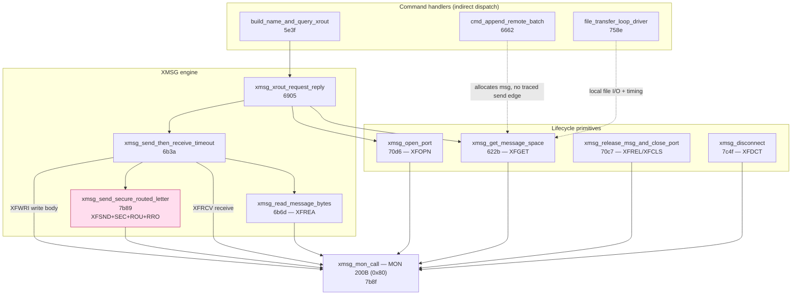
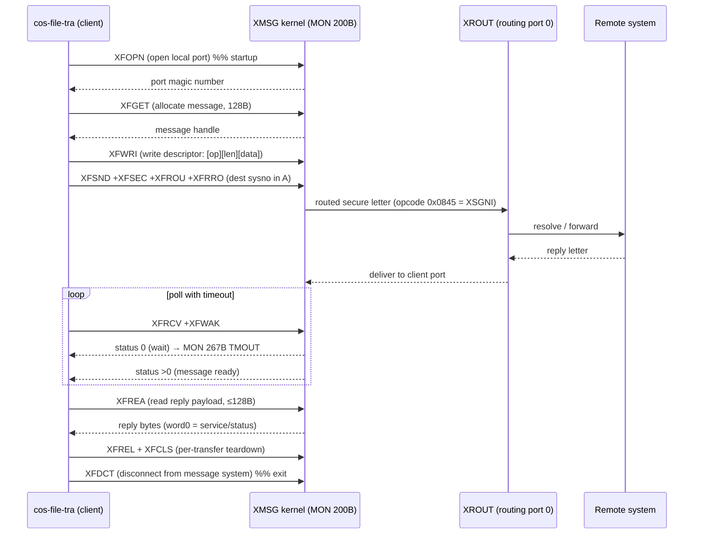
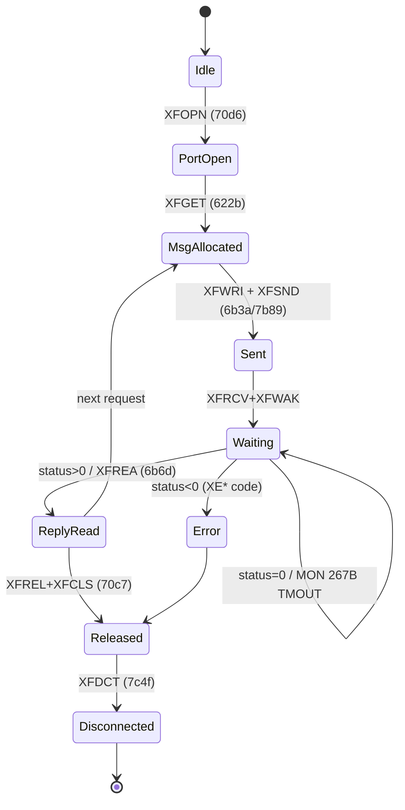

# cos-file-tra-e02.prog — XMSG interface analysis

**Binary:** `Installation/Communication/COSMOS Basic/x/cos-file-tra-e02.prog`
**Format:** ND-100 :PROG (SINTRAN-III executable), image base ram:0000
**Product string (ram:5d75):** `COSMOS File Transfer - Version E02`
**Analysed in:** Ghidra (ND-100:BE:16), MCP session 2026-07-06
**Symbol authority:** `F:\ND\SINTRAN-K05-XMSG-2026\XMSG-Symb\` (XMSG version L).
Every structure/offset/constant below is quoted from those symbol files
(`XMSG-PL-VALUES-L.INCL`, `XMSG-POFTABS-L03.SYMB`, `XMSG-SYSTABS-L03.SYMB`) — treat
those as ground truth. Program-flow claims are tagged **VERIFIED** (read directly from
disassembly), **INFERRED** (deduced, not yet single-stepped) or **CANDIDATE**.

> ### ⚠ LAYER-BOUNDARY CAVEAT (read first)
> This binary is **application-level, above the `MON 200B` (XMSG) kernel call.** The
> transport **envelope** (seed / Counter / channel), the stateless **secure-ACK** closed
> form, the **odd-length LAPB address** rule, and the **≤2-datagram flow-control window**
> are *kernel-invisible* here and CANNOT be recovered from this program. This document
> describes the app's **intent**; it is **not** a wire build-spec. A node built from this
> alone will crash the real machine unless the kernel-level envelope from
> `…\SINTRAN\XMSG\DOC\XMSG-PROTOCOL.md` is layered underneath.
>
> **Re-verified 2026-07-07** (Corrections Brief). Standing facts confirmed: the only
> on-wire send is the XROUT query, opcode word `0x0845` → byte1 `0x45` = XSGNI
> `[BIN+SYM VERIFIED]`; its **reply payload is `UNKNOWN`** (needs a live capture — not
> invented); the file-transfer *data* commands (Transfer / Append-batch / Compress) have
> **no traced send edge** to the single XFSND, so no wire format is claimed *from this
> binary*.
>
> **UPDATE 2026-07-07 — the data path is now RESOLVED on the server side.** The sibling
> (`cos-fa-serv`) session decoded it: the file-transfer data rides the **`*FA-SERVER`
> entry-type-0x10 path** (`fa_file_data_transfer` @0x315b) — the bytes live in the
> file-entry's **~0x800-byte (2048 B = 1 ND page) data buffer** (`entry[+~0x7ba]`), with
> **position + count as typed params** (`0x92`/`0x94`), valid/lock at `entry[+~0x7bf]`
> bit15. This matches the `0x800` page unit found here (`file_transfer_progress_setup`).
> Full FA op catalog: `COSMOS-XMSG-Synthesis.md` §8. [BIN, sibling session]
>
> **To promote the remaining UNKNOWN/CANDIDATE items → VERIFIED** (once a working binary
> exists): `COSMOS-XMSG-Synthesis.md` §9 — Scenario B (the XSGNI reply payload), Scenario C
> (FA op selectors + tag encoding), Scenario E (the DATA per-page position/count sequence).

---

## 0. Diagrams & message formats (visual summary)

### 0.1 Call graph — the entire XMSG surface



> Only ONE `XFSND` exists in the binary (`7b89`, highlighted). Every message the program
> transmits flows through `6b3a`, and the only confirmed on-wire opcode is `0x0845`
> (XSGNI). See §7c.

### 0.2 Send / receive sequence (the request→reply round trip)



### 0.3 Lifecycle state machine



### 0.4 ASCII — message layers (outermost → innermost)

```
 HDLC frame (on the wire, LAPB)
 +------+--------+----------------------------------------+------+------+
 | 7E   | addr   | control | ...... INFO (XMSG) ......      | FCS  | 7E   |
 | flag | 09/89  |  I/S    |                                | CRC16|flag  |
 +------+--------+----------------------------------------+------+------+
                              |
                              v
 XD-block network/frame header (XMSG-POFTABS 5DLEN, big-endian words)
 +--------+--------+--------+--------+--------+--------+--------+--------+
 | XDHAC  | XDROU  | XDTYP  | XDDNA  | XDSNA  | XDREF  | XDSCR  | XDCSM  |
 | A/C    | ver/pro| SD/ED/ | dest   | source | conn   |size/dsp| checksum|
 |        | =2/1   | DC/CTL | netadr | netadr | ref    |        |1's-comp|
 +--------+--------+--------+--------+--------+--------+--------+--------+
   XDROU L-byte = X5VRS 020400B (option0,ver2,proto1)
   XDTYP bits: 0 CO ctl · 1 SD start · 2 ED end · 3 DC deliver-confirm
               4 IN net-init · 5 CE cksum-en · 6 CP cksum-provided
                              |
                              v
 XM-block transport header (XMSG-POFTABS 5MESS — sent verbatim on link)
 word:  0        1        2      3        4      5        6
 +--------+--------+--------+--------+--------+--------+-----------+
 | XMTHD  | XMSTA  | XMDSY  | XMDPT  | XMSSY  | XMSPT  |   XMCSM   |
 | 020400B| status | dest   | dest   | src    | src    | checksum  |
 | v2/p1  | 5M*bits| system | port   | system | port   | or XMSIZ  |
 +--------+--------+--------+--------+--------+--------+-----------+
   XMDST(2:3)=dest magic no    XMSRC(4:5)=source magic no
   magic no = (logical_port<<7) | random7   ; port 0 = XROUT
                              |
                              v
 XFWRI payload = descriptor buffer at -0x7c,B  (VERIFIED in 6b3a)
 +-----------------+-----------------+---------- ... ----------+
 | descriptor[0]   | descriptor[1]   |   body (len bytes)      |
 | request/opcode  | sub-length      |                         |
 +-----------------+-----------------+---------- ... ----------+
   bytecount written = descriptor[1] + 4
   descriptor[0] on the wire (big-endian) = two bytes: [hi][lo]
```

### 0.5 ASCII — the one confirmed request (XROUT name query)

```
 descriptor[0] = 0x0845   (ram:68ee, baked constant)
                 +----+----+
 wire bytes ---> | 08 | 45 |   <- byte0, byte1
                 +----+----+
                   |    |
                   |    +--- byte 1 = 0x45 = 69 = XSGNI  (XROUT service "Get name",
                   |            param = magic-no / port-no). CONFIRMED by the symbol
                   |            file header: "Values in byte 1 of message. Bit 6 set
                   |            => service request"; 0x45 has bit6 set + value 69.
                   +-------- byte 0 = 0x08  (leading byte of the XROUT letter;
                              exact meaning UNKNOWN — likely a message-format/type or
                              parameter tag. NOT yet verified.)

 followed by the name QSTRING (built byte-by-byte via qstr_put_byte @70e1
 into buffer @59d4, builder @691e):
                 +------+----------------------------+------+
 name QSTRING -> | len  | name bytes ('A'..'Z' ...)  | 0x27 |
                 +------+----------------------------+------+
                                                       '  = terminator
```

### 0.6 ASCII — XMSG function/option word (T-register at MON 200B)

```
  T-register (16 bit) passed to MON 200B
  15 14 13 12 11 10  9  8 | 7 .............. 0
  +--+--+--+--+--+--+--+--+-------------------+
  |WT|WK|HP|BN|FW|RO|SE|TC|   function code   |
  +--+--+--+--+--+--+--+--+-------------------+
   |  |  |  |  |  |  |  |         |
   |  |  |  |  |  |  |  |         +-- 2=XFGET 3=XFREL 6=XFREA 7=XFWRI
   |  |  |  |  |  |  |  |             10=XFOPN 11=XFCLS 12=XFSND 13=XFRCV
   |  |  |  |  |  |  |  |             1=XFDCT
   |  |  |  |  |  |  |  +-- XFTCM  (8)  send task current message
   |  |  |  |  |  |  +----- XFSEC  (9)  secure — return if not delivered
   |  |  |  |  |  +-------- XFROU  (10) route via XROUT
   |  |  |  |  +----------- XFFWD  (11) forward
   |  |  |  +-------------- XFBNC  (12) bounce
   |  |  +----------------- XFHIP/XFRRO (13) hi-prio / non-local XROUT(sysno in A)
   |  +-------------------- XFWAK  (14) wake task on status change (XFRCV)
   +----------------------- XFWTF  (15) wait if not terminated

  xmsg_send_secure_routed_letter (7b89) sets: 12 | (1<<9)|(1<<10)|(1<<13)
                                            = XFSND+XFSEC+XFROU+XFRRO
```

---

## 1. How this program talks to XMSG — the ABI

All XMSG traffic goes through **one gateway function**, renamed in Ghidra:

| Address | Ghidra name | What it is |
|---|---|---|
| `ram:7b8f` | `xmsg_mon_call` | Executes **MON 200B (0x80)** = the SINTRAN XMSG monitor call |

**VERIFIED.** The MON instruction is at `ram:7bb2` (`d6 80  MON 0x80`). Calling convention
(read from the register save/restore around the MON):

```
Entry:  T-register = XMSG function code + option bits   (XF* constants, table §3)
        A / D       = function parameters (magic numbers, counts, sysno, ...)
        X-register  = pointer to the caller's XMSG parameter block / message handle
Return: T = status  (0 = ok/pending, <0 = XE* error code, >0 = message type on XFRCV)
        A = return value (handle / count)
        X = returned pointer
```

`xmsg_mon_call` also has two debug locals: `-0x80,B` = "dump registers **before** the
call", `-0x7f,B` = "dump result **after** the call". These are toggled by the program's
`Debugprint-on` / `Debugprint-off` commands and drive the register-dump helper that
prints `* XMSG Function:` / `Regs (A,D,X):` / `XMSG error code:` (strings at ram:7b56,
ram:7b5f, ram:7b68).

---

## 2. The renamed XMSG-interface functions (Ghidra)

All confirmed by reading the `SAT <n>` (set-T = function code) immediately before the
call into `xmsg_mon_call`.

| Address | New name | T (func) + options | Meaning |
|---|---|---|---|
| `ram:7b8f` | `xmsg_mon_call` | — | MON 200B gateway |
| `ram:7b89` | `xmsg_send_secure_routed_letter` | XFSND(12)+XFSEC(9)+XFROU(10)+XFRRO(13) | send secure letter to XROUT for remote routing (non-local: sysno in A) |
| `ram:6b3a` | `xmsg_send_then_receive_timeout` | XFWRI(7) then XFRCV(13)+XFWAK(14) + MON TMOUT loop | request→reply primitive with retry/timeout |
| `ram:70d6` | `xmsg_open_port` | XFOPN(10) | **startup**: open this process's local XMSG port, handle→`-0x77,B` |
| `ram:622b` | `xmsg_get_message_space` | XFGET(2) | allocate a message buffer, handle→`-0x78,B`; fail = XEMFL(-20) |
| `ram:70c7` | `xmsg_release_msg_and_close_port` | XFREL(3) and/or XFCLS(11) | per-transfer teardown: free message + close port |
| `ram:7c4f` | `xmsg_disconnect` | XFDCT(1) | **top-level teardown**: disconnect from message system |
| `ram:6905` | `xmsg_xrout_request_reply` | XFGET+XFOPN+send/recv | XROUT query (list-names / get-default-system) |
| `ram:5e3f` | `build_name_and_query_xrout` | — | build name QSTRING + MON RSIO + XROUT query |
| `ram:758e` | `file_transfer_loop_driver` | — | main per-page transfer engine (page size 0x800) |
| `ram:6662` | `cmd_append_remote_batch` | — | Append-remote-batch command handler |
| `ram:799d` | `finalize_and_close_file` | — | SMAX + CLOSE the received file |
| `ram:5f6e` | `calc_transfer_rate` | — | elapsed-time / rate calc (MON GetBasicTime) |
| `ram:70e1` | `qstr_put_byte` | — | append byte to a QSTRING (word0=count, 0x27 `'` terminator) |
| `ram:70f0` | `qstr_get_byte` | — | read byte from a QSTRING |
| `ram:70fe` | `qstr_init` | — | init empty QSTRING (`''`) |
| `ram:6a37` | `qstr_copy` | — | copy QSTRING (used to build list-names rows) |

> Coverage note: the program has 98 Ghidra functions. The above are the XMSG transport
> layer plus its string helpers. The remaining ~85 are the command parser, the QFORM
> formatter (strings around ram:4855–4e3d), the SINTRAN file-I/O, and the compression
> logic — **not yet individually renamed** (out of scope for "how messages are sent").

---

## 3. XMSG function codes (T-register) — from `XMSG-PL-VALUES-L.INCL`

Used by this program: **XFGET 2, XFREL 3, XFWRI 7, XFOPN 10, XFCLS 11, XFSND 12,
XFRCV 13**. Full catalog (0–47) is in the symbol file. Option bits (high T bits):

| Bit | Name | Meaning in XFSND |
|---|---|---|
| 15 | XFWTF | wait if not terminated |
| 14 | XFWAK | (XFRCV) wake task on status change |
| 13 | XFHIP / **XFRRO** | in XFSND+XFROU: **non-local XROUT, sysno in A-reg** |
| 12 | XFBNC | bounce message |
| 11 | XFFWD | forward message |
| 10 | **XFROU** | message to be sent to XROUT |
|  9 | **XFSEC** | secure — return if not delivered |
|  8 | XFTCM | send task current message |

So `xmsg_send_secure_routed_letter` = "XFSND, routed via XROUT, to another system,
secure" — exactly the mechanism the `xmsg-decode` skill calls the **XSLET letter to the
routing port (port 0)**.

---

## 4. The message on the wire — XM-block header (`XMSG-POFTABS`, `5MESS`)

This is the transport header that is sent **directly over the link** (the symbol file
warns "Next block is sent directly over link. Do NOT split up!"). Word offsets from the
start of the message descriptor:

| Off | Field | Meaning |
|---|---|---|
| 0 | `XMTHD` | XNET transport header = **X5THD = 020400B** (version 2, protocol 1) |
| 1 | `XMSTA` | message status word (bit 17B set); send-modified bits 5M* below |
| 2–3 | `XMDSY,XMDPT` = `XMDST` | **destination magic no** (system number, port/random) |
| 4–5 | `XMSSY,XMSPT` = `XMSRC` | **source magic no** (system number, port/random) |
| 6 | `XMCSM` | datagram checksum, else message size (`XMSIZ`) |

Beyond the transport header (kernel-local, not sent verbatim): `XMLIX` link index,
`XMSIZ` buffer size, `XMDAD` physical data-buffer address, `XMLEN` current data length
in bytes, `XMSCR` read/write pointer, `XMTIM` network timeout, `XMPRT/XMSEQ` port/seq.

**Magic-number format** (`5PSHZ=7`): low 7 bits = random part (`5PMS1=177B`), rest =
logical port number. Port 0 (`XRLPN=0`) is the network-wide **routing port (XROUT)**.

**XMSTA send-option bits:** 5MRED read, 5MRTN returned, **5MSEC secure**, 5MBNC bounce,
5MHIP high-prio, **5MROU routed**, 5MPRV privileged, 5MRND return-on-non-delivery.

---

## 5. The frame on the link — XD-block header (`XMSG-POFTABS`, `5DLEN`)

Each network datagram carries this mandatory header (offsets `XD5HS`, sent to the HDLC
link). This is what appears on the HDLC wire under the LAPB I-frame:

| Field | Meaning |
|---|---|
| `XDHAC` | HDLC A/C field |
| `XDROU` | network info — L.H. byte = **X5VRS = 020400B** (option 0, version 2, protocol 1); hop count. Bit XD5OP(17)=option present (illegal in XMSG) |
| `XDTYP` | datagram type: bit0 XD5CO control, bit1 XD5SD start-of-datagram, bit2 XD5ED end, bit3 XD5DC delivery-confirm, bit4 XD5IN network-init, bit5 XD5CE checksum-enabled, bit6 XD5CP checksum-provided |
| `XDDNA,XDSNA` = `XDNAD` | destination / source network address |
| `XDREF` | connection reference (message no) |
| `XDSCR` | scratch (size, displacement, status) |
| `XDCSM` | checksum (one's-complement add) |

**LAPB control-byte constants** (`XMSG-POFTABS`): `XRR=1, XSREJ=11B, XSABM=77B, XUA=163B`.
These match the LAPB layer documented in `XMSG-PROTOCOL.md` §2 (RR/REJ/SABM/UA).

---

## 6. Startup sequence (INFERRED from function-code usage)

1. Check XMSG is running — else print warning at ram:5daa
   (`*** Warning: COSMOS communication module (XMSG) is not running ***`).
2. `xmsg_open_port` (XFOPN) → obtain a local port; magic number saved in `-0x77,B`.
3. Obtain local system number / name — a "No local system name defined" path exists
   (string ram:68f2), i.e. XROUT service **XSGLO/XSGSY** (get local system) is consulted
   before any remote send.
4. For a transfer: `xmsg_get_message_space` (XFGET) → build a letter → write server/target
   name and request into it (QSTRING helpers) → `xmsg_send_secure_routed_letter`
   (XFSND+XFROU+XFRRO+XFSEC) to the **XROUT routing port**, addressed to the remote
   file server. Server name in the letter is one of the `*FA-SERVER / *FA-FSA` family
   (see `xmsg-decode` server registry).

The wire trailer format of that letter (`FF len 2A <server-name>` etc.) is the XSLET
letter body documented in the `xmsg-decode` skill / `XMSG-PROTOCOL.md` §7.1.

---

## 7. Steady-state request/reply

`xmsg_send_then_receive_timeout` (`ram:6b3a`): **VERIFIED** it
- writes into the current message (T=XFWRI),
- sends via `xmsg_send_secure_routed_letter`,
- then repeatedly issues **XFRCV|XFWAK** (T=0xD, bit14 set at ram:6b4d), sleeping via
  **MON 267B (TMOUT)** at ram:6b56 between attempts and decrementing a countdown at
  ram:6b39. XFRCV status decode: `>0` message received, `=0` still waiting, `<0` XE* error.

This is the file-transfer data loop: each block is written, sent, and its acknowledgement
awaited with a timeout.

### 7a. The letter / control-message wire layout — VERIFIED by disassembly

`xmsg_send_then_receive_timeout` (`ram:6b3a`) builds the outgoing message from a small
**descriptor buffer** pointed to by `-0x7c,B`:

```
descriptor[0] = A on entry          ; request/opcode word supplied by the caller
descriptor[1] = sub-length          ; body length
bytecount     = descriptor[1] + 4   ; +4 = the 2 descriptor words + framing
```
Then (6b41–6b46) **XFWRI(7)**: write `bytecount` bytes from the descriptor buffer into
the current message at displacement 0. Then (6b47–6b49) **XFSND** via
`xmsg_send_secure_routed_letter` with `A = -0x54,B` (destination system number) and
`X = -0x77,B` (port/options). So the on-wire XMSG payload = the descriptor buffer,
`descriptor[1]+4` bytes long, whose **first byte is the XROUT service code**
(XSLET 0x41 for a letter, XSGSY 0x4B for a routing query — table §9).

The **letter body** itself is assembled as a QSTRING, copied byte-by-byte with
`qstr_put_byte` (0x70e1) into the static buffer at `ram:59d4` by the builder at
`ram:691e` (LBYT source → put dest), i.e. `[service][name-descriptor…]` matching the
`FF <len> 2A <name>` letter form in the `xmsg-decode` skill.

**Receive side — VERIFIED:** `xmsg_read_message_bytes` (`ram:6b6d`) = **XFREA(6)**,
reads up to 0x80 (128) bytes of the received message into a user buffer, appends a 0x27
terminator, and tests word0 against 0x00FF (the returned service/status byte).

### 7b. Complete XMSG call-site census — UPDATED after full carve (2026-07-07)

The full function carve found **more MON-200B sites** than the first pass. Complete list:

| Site | In function | T (func) | Role |
|---|---|---|---|
| 6233 | xmsg_get_message_space | XFGET 2 | allocate message |
| 6909 | xmsg_xrout_request_reply | XFGET 2 | allocate query message |
| 67b1 | cmd_append_remote_batch | XFGET 2 | allocate message |
| 6b46 | xmsg_send_then_receive_timeout | XFWRI 7 | write body into message |
| 6b74 | xmsg_read_message_bytes | XFREA 6 | read received payload |
| (7b89 fall-in) | xmsg_send_secure_routed_letter | XFSND 12 (+SEC/ROU/RRO) | send to XROUT |
| 6b4d | xmsg_send_then_receive_timeout | XFRCV 13 (+WAK) | receive reply |
| 70dd | xmsg_open_port | XFOPN 10 | open local port |
| 70cd/70d2 | xmsg_release_msg_and_close_port | XFREL 3 / XFCLS 11 | free msg / close port |
| 7c56 | xmsg_disconnect | XFDCT 1 | disconnect from message system |
| **7722** | **xmsg_general_status_wait** | **XFGST 15** | **general status / wait** (newly found) |
| **6f82** | **xmsg_disconnect_and_exit** | **XFDCT 1** | disconnect **then LEAVE** (newly found) |
| **5ede** | **xmsg_disconnect_clear** | **XFDCT 1** | clear handles + disconnect (newly found) |

So the XMSG surface is: GET → WRI → SND → RCV → REA, plus OPN / REL / CLS, **XFGST**
(status/wait), and **three XFDCT** teardown variants (plain, +LEAVE, +clear). Still no
XFHIP / XFROU-beyond-the-query and still exactly one XFSND. [BIN-VERIFIED, all sites via
`SAT <n>` before the MON/wrapper — GOTCHA: each `SAT n` is the function code, not a type.]

### 7c. First extracted request opcode — VERIFIED (static only)

The only statically-reachable send (through `xmsg_send_then_receive_timeout`, called by
`xmsg_xrout_request_reply`, called by `build_name_and_query_xrout`) carries a **baked
constant opcode**:

```
ram:68ee  (renamed xrout_query_opcode_0845)  =  0x0845
```
Read at 6911, passed as A into 6b3a, stored as `descriptor[0]` = the first payload word.
Big-endian on the wire → bytes **`08 45`**. **Byte 1 = `0x45 = 69 = XSGNI`** (XROUT
service "Get name", param MC/PORTNO) — this placement is CONFIRMED by the symbol file's
own header: *"XROUT service values … Values in byte 1 of message. Bit 6 is set =>
service request"* (`0x45` has bit 6 set + value 69). Byte 0 = `0x08` is the leading
letter byte; its exact meaning is UNKNOWN (likely a format/type or parameter tag, not
verified). This is the request for **get-default-remote-system / list-names**. Confirmed
unique: `08 45` as aligned data appears only at 68ee.
(Source: `F:\ND\SINTRAN-K05-XMSG-2026\XMSG-Symb\XMSG-PL-VALUES-L.INCL`, duplicated at
`…\FLOPPY\xmsg\xmsg-pl-values-l.incl`.)

> **Architecture note (important, honest):** direct xref shows the send engine 6b3a
> reached from ONE path only (build_name_and_query_xrout → xrout_request_reply → 6b3a).
> The file-transfer *data* commands (Transfer-file, Append-remote-batch, Compress) build
> their own messages (XFGET at 67b1, QFORM at 727d) but their MON-send is NOT on a direct
> call edge to 6b3a — they dispatch through pointer tables / arg-records (the command
> table at ram:6779). So the remaining application opcodes must be recovered by walking
> those indirect dispatch sites, not by xref. This is the same decentralised-dispatch
> pattern already documented for cos-conn-to. Live capture is NOT required — it is a
> static tracing job through the 6779 command table and the QFORM templates.

---

## 8. Disconnect / teardown (VERIFIED function codes)

`xmsg_release_msg_and_close_port` (`ram:70c7`):
- if a message handle is live (`-0x78,B`): **XFREL(3)** release message space;
- if a port handle is live (`-0x77,B`): **XFCLS(11)** close port.

**CORRECTION (2nd pass):** there ARE two teardown levels:
- **Per-transfer:** `xmsg_release_msg_and_close_port` (`ram:70c7`) — XFREL one message +
  XFCLS one port.
- **Top-level / session end:** `xmsg_disconnect` (`ram:7c4f`) — **XFDCT(1)**, disconnect
  from the message system entirely (drops all ports + allocated messages). VERIFIED:
  `SAT 1` at ram:7c55 → xmsg_mon_call.

XROUT is also informed implicitly on port close via `5PKOC` ("kick XROUT on close" bit
in the port status word).

---

## 9. Error / status vocabulary present in the binary

The binary embeds the **complete XE* / XR* error text tables** twice (ram:3bff–47bf and
ram:7e79–8a4d) — these correspond exactly to the `XMSG-PL-VALUES` error constants
(XENOT −1 … XECRA −63; XRSOK 0 … XRILX 55). The XMSG/XROUT **crash** strings
("XMSG crash : ...", "XROUT crash: ...") match the XX* crash-code list. So decoding a
returned status is just: index the text table by the negative error code.

XROUT service codes this family can invoke (from the letter body): **XSLET 65** (send
letter), **XSGSY 75** (get routing for system), **XSGIN 82 / XSPIN 91 / XSLSY 92**
(name/port/system info — the `List-names` command, header "System Port Free SPs Name"
at ram:6a48).

---

## 10. Open items / not yet done

- The ~85 non-transport functions (QFORM formatter, command dispatcher, file I/O,
  compression) are not renamed.
- The exact byte layout the program writes into the XSLET letter (server-name /
  target-user / password fields) has not been single-stepped; §6 is inferred from the
  string table (ram:60e3 syntax help, ram:19ac `LL XFTMS` / `2XMSG`) and the symbol
  files. Confirm by capturing live traffic per the `xmsg-decode` playbook and matching
  against a decode of a `cos-file-tra` session.
- Cross-check against `cos-conn-to-e02.prog` (being analysed in parallel) — the XMSG
  primitive set should be identical; the letter *body* differs (TAD terminal vs file).
