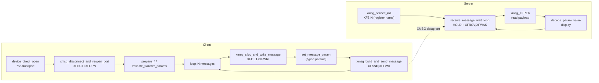
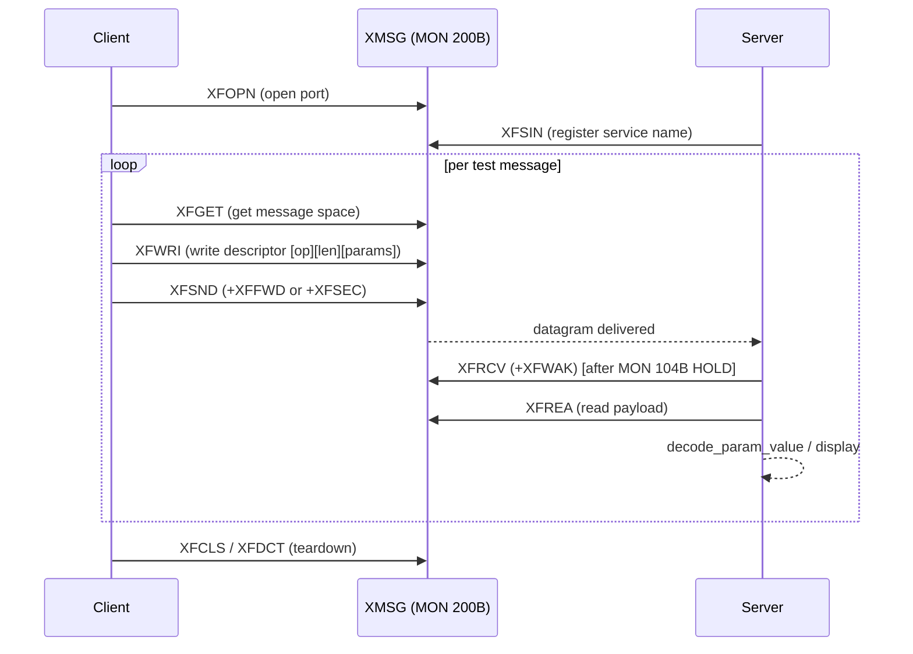
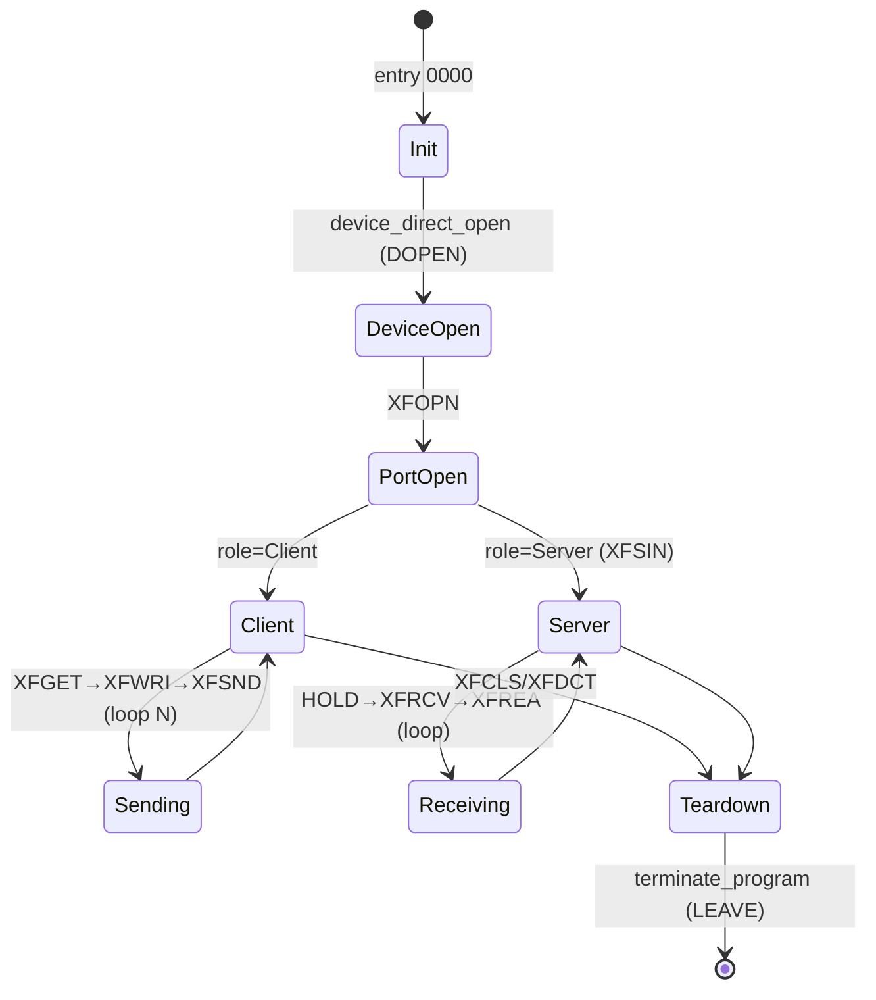

# cos-xftra-e02.prog — XMSG transport exerciser analysis

**Binary:** `Installation/Communication/COSMOS Basic/x/cos-xftra-e02.prog`
**Format:** ND-100 :PROG (SINTRAN-III executable), image base ram:0000
**Analysed in:** Ghidra (ND-100:BE:16), MCP session 2026-07-06
**Symbol authority:** `F:\ND\SINTRAN-K05-XMSG-2026\XMSG-Symb\XMSG-PL-VALUES-L.INCL` (XMSG version L).
Claims tagged **VERIFIED** (read directly from disassembly / symbol file),
**INFERRED** (deduced from pattern; not single-stepped), or **CANDIDATE** (plausible,
unconfirmed).

> ### ⚠ LAYER-BOUNDARY CAVEAT (read first)
> This binary is **application-level, above the `MON 200B` (XMSG) kernel call.** The
> transport **envelope** (seed / Counter / channel derivation), the stateless **secure-ACK**
> closed form, the **odd-length LAPB address** rule, and the **≤2-datagram flow-control
> window** are all *kernel-invisible* here and CANNOT be recovered from this program.
> This document describes the app's **intent**; it is **not** a wire build-spec. A node
> built from this alone will crash the real machine unless the kernel-level envelope from
> `…\SINTRAN\XMSG\DOC\XMSG-PROTOCOL.md` is layered underneath.
>
> **Re-verified 2026-07-07** against the binary (Corrections Brief). Fixes applied below:
> opcode mask is **0xFF00** (not 0xFFFF); param types are **letter-indexed** (not the
> numeric 0x92/0x94 tags); the receive-loop `SAT 3/4` are **XFREL/XFRHD calls** (not
> msg-type `==3/4`). Function count note: the "97" includes Ghidra fragment inflation
> (phantom `FUN_ram_*` split from one routine + the shared `planc_frame_epilogue` tails);
> the count of *distinct real routines* is lower.

---

## 1. What this program is

`cos-xftra` is the **COSMOS XMSG transport exerciser** — a Client/Server loopback test
tool for the `*ae-transport` (XMSG) layer, NOT a file-transfer application. Evidence
(strings): `! Client started !`, `! Server started !`, `! Dummy Client/Server started !`,
`No. of messages to transmit (dec)`, `Message length in bytes (dec)`, `Automatic
generated pattern`, `Start pattern (octal)`, `Increment (octal)`, `Client/Server: Display
of transfer info`, `1st/2nd transfer/receive buffer address`, `Ref. no: / Service: /
Error / Status:`, `Param Type Data (Dec/Hex) Length:`, `INT16 / INT32 / STRING`, and a
QFORM debug template that dumps XD-block datagram fields (see §5). It opens an XMSG port,
looks up / registers a server, then transmits a configurable number of test messages and
reports throughput. **VERIFIED** program role from strings + code.

It is only 31 source functions (44 in Ghidra after splitting the wrapper library), and
uses the SINTRAN XMSG monitor call `MON 200B (0x80)` throughout.

---

## 2. The XMSG wrapper library (ram:2fa1–30b3) — VERIFIED

One PLANC thunk per XMSG function: `RADD SL,DX; JPL csav; STZ; SAA <fncode>;
ORA -0x7a,B (fold caller option bits into T); … ; MON 200B; store T=status, A/D=result`.

| Entry | Name | Code | XMSG function |
|---|---|---|---|
| 2fa1 | `xmsg_XFOPN` | 10 | Open port |
| 2fb5 | `xmsg_XFCLS` | 11 | Close port |
| 2fc9 | `xmsg_XFGET` | 2 | Get message space |
| 2fde | `xmsg_XFREL` | 3 | Release message space |
| 2ff2 | `xmsg_XFREA` | 6 | Read from message to user buffer |
| 300d | `xmsg_XFWRI` | 7 | Write from user to message |
| 3028 | `xmsg_XFRHD` | 4 | Read 6-byte header |
| 3040 | `xmsg_XFSND` | 12 | Send message |
| 3055 | `xmsg_XFRCV` | 13 | Receive message |
| 307d | `xmsg_XFMST` | 9 | Get message status |
| 309a | `xmsg_XFSCM` | 8 | Set current message |

(Same library layout as cos-conn-to `a0b1…` and cos-fa-serv `a0c3…`.)

---

## 3. Function map (all named)

**XMSG transport**
- `xmsg_disconnect_and_reopen_port` (5dee) — XFDCT then XFOPN (transport reset).
- `xmsg_alloc_and_write_message` (5e0a) — XFGET + XFWRI (front half of a send).
- `xmsg_build_and_send_message` (5e89) — XFWRI descriptor + XFSND|XFFWD.
- `send_message_xfsnd` (5fee) — XFSND back half.
- `send_secure_test_message` (62bf) — XFWRI 70 bytes + XFSND|XFSEC.
- `xmsg_service_init` (633a) — XFSIN(16), registers the named service (server side).
- `receive_message_wait_loop` (63a7) — MON 104B HOLD + XFRCV|XFWAK (server receive).
- `xmsg_call_check_status` (5eca) — generic MON 200B + status≥0 check.
- `set_message_param` (5ed1) — write one parameter field into the message descriptor.

**Setup / lifecycle**
- `cos_xftra_e02` (0000) — entry / restart vector.
- `abort_exit_handler` (000b) — prints "*- ABORTED -*", MON 0B LEAVE.
- `terminate_program` (3c31) — MON 0x84 cleanup + LEAVE.
- `device_direct_open` (62b6) — MON 220B DOPEN of `*ae-transport`.
- `clear_transfer_state` (6076) / `prepare_message_header` (61bd) /
  `prepare_transfer_buffers` (6266) — per-run init (client/server flag `-0x6b,B`).
- `close_file_and_reset` (5e43) — MON 43B CLOSE + buffer re-init.
- `validate_transfer_params` (64a8) — parameter bound/sign checks.
- `flush_output_if_pending` (6137) — two-flag guarded action.

**Formatting / output (QSTRING + QFORM)**
- `qstr_init` (657c), `qstr_put_byte` (655f), `qstr_get_byte` (656e), `qstr_copy` (6584),
  `qstr_append_byte_checked` (65b7), `qstr_append_entry` (65b1),
  `qstr_append_via_65b7` (65d7 / 6608).
- `print_qstr_to_terminal` (3c10) — MON 2B OUTBT / MON 65B QERMS.
- `print_line_sequence` (5f2d) — prints a block of text lines / menu.
- `decode_param_value` (640a) — typed-parameter (INT16/INT32/STRING) decode for display.
- `find_table_entry` (663c) — masked table lookup.
- `debug_text_marker_stub` (62ed) — inline debug string mis-scanned as code (data).

---

## 4. Diagrams

### 4.1 Client / Server loopback flow



### 4.2 Send sequence



### 4.3 Program state



---

## 5. Message formats (ASCII)

### 5.1 Outgoing message descriptor (XFWRI payload) — VERIFIED (5e89 / 62bf)

```
 message descriptor at [X = -0x7f,B]
 +-----------------+-----------------+---------- ... ----------+
 | descriptor[0]   | descriptor[1]   |   body / params         |
 | opcode word     | sub-length      |                         |
 | =RORA(-0x64,B   |                 |                         |
 |  & 0xFF00)      |                 |                         |
 +-----------------+-----------------+---------- ... ----------+
   byte count written by XFWRI = descriptor[1] + 4
   (send_secure_test_message writes a fixed 0x46 = 70-byte message)
   send options: XFSND | XFFWD (forward)  or  XFSND | XFSEC (secure)
   [BIN-VERIFIED] msg_opcode_mask @ram:5ec6 = 0xFF00 (extracts the HIGH byte),
   then RORA ST @5e8e. (An earlier draft mis-stated this as 0xFFFF.)
```

### 5.2 Typed parameters (test-message body)

The exerciser carries a list of typed parameters; each is displayed as
`Param  Type  Data(Dec/Hex)  Length` (string @1626), with the three display type NAMES
`INT16 / INT32 / STRING` (@163b).

**Type encoding [BIN-VERIFIED 2026-07-07]:** `decode_param_value` (640a) reads a type
byte, masks it with **0x7F** (strip bit7/parity, `[645c]`), subtracts **0x41 ('A')**,
bounds-checks 0..5, and does a **6-way computed jump** (table @6418). So the wire type
codes are **letter-indexed, 0x41..0x46 ('A'..'F')** (optionally bit7-set) — a *different*
scheme from cos-fa-serv's numeric `0x92/0x94/0xA2/0xF2` tags, which do **NOT** appear in
this binary (`SAA 0x92/0x94` searched: 0 hits). The three display names are 3 of these 6
letters; the **exact letter→type mapping is `CANDIDATE`** (decode the 6 jump targets to
resolve). The earlier "6-word entries INT16/INT32/STRING" table was `INFERRED` and is
superseded by this.

```
 param type byte decode (VERIFIED path):
   idx = ((typeByte & 0x7F) - 0x41)      ; 0..5  -> jump table @6418 (6 kinds A..F)
   jump table @6418 -> per-type handlers: A@6431 B@6468 C@641d D@6466 E@6445 F@641d-tail
   each handler -> COMMON accessor @6460/6461 doing XFWRI(7)/XFREA(6) with a per-type
     displacement (SAX) + byte count  => the letter selects the field WIDTH
   INT16=2B / INT32=4B / STRING=var = 3 of the 6 kinds (display names @163b)
   CANDIDATE: exact letter->kind assignment (handler bodies carry inline data words that
     resist clean disassembly; the width constants weren't isolated).
```
> **To promote this CANDIDATE → VERIFIED:** run `COSMOS-XMSG-Synthesis.md` §9.1
> (Scenario A) — one captured message per param type, read the type byte + data-byte count
> in front of each param.

### 5.3 Reply / status view

Received messages are shown as `Ref. no: 'Service: 'Error 'Status: '` (string @1614) —
i.e. the exerciser surfaces the XMSG datagram's reference, service byte, and status.

### 5.4 XD-block datagram debug template (VERIFIED string @ram:0bff)

The program embeds a QFORM template that dumps the raw **XD-block** (network datagram)
header — the on-the-wire frame fields from `XMSG-POFTABS 5DLEN`:

```
 FXFIND,@:6:8, XDOWN:7:8, XDHAC," ", FXHX, XDDST:6, XDDNA:6, XDSNA:6 ... XDREF ...
```
maps to:  `XDOWN` owner-link · `XDHAC` HDLC A/C · `XDDST` dest magic · `XDDNA/XDSNA`
dest/src network address · `XDREF` connection reference. (See the cos-file-tra analysis
§5 for the full XD-block field table — identical layout.)

---

## 6. Monitor calls used (besides MON 200B XMSG)

| MON | Octal | Name | Use |
|---|---|---|---|
| 0x00 | 0 | LEAVE | program exit |
| 0x02 | 2 | OUTBT | output one byte to terminal |
| 0x23 | 43 | CLOSE | close file |
| 0x35 | 65 | QERMS | error message |
| 0x44 | 104 | HOLD | sleep/delay in the receive loop |
| 0x84 | 204 | (cleanup) | in terminate_program |
| 0x90 | 220 | DOPEN | direct-open `*ae-transport` |

---

## 7. Status / open items

- All 44 Ghidra functions renamed + commented; XMSG wrapper library and the send/receive
  engine are VERIFIED. Setup/format helpers tagged INFERRED where not single-stepped.
- The exact 6-word typed-parameter entry layout (§5.2) is inferred from the display
  columns + array stride; single-stepping `decode_param_value` / `set_message_param`
  would confirm field offsets.
- The large main body (ram:0000–2f00, the interactive command/menu parser) is not split
  into functions by Ghidra and was not individually decoded — it drives the prompts in
  §1 and dispatches to the named routines above.

### Second linked code segment (ram:30b0–3af4, 6ba1–6dee) — VERIFIED

The binary links the XMSG code **twice**. There is a **second copy of the XMSG wrapper
library** at `ram:6ba1–6c04` (`xmsg_XFOPN_seg2` / `XFCLS_seg2` / `XFGET_seg2` /
`XFREL_seg2` / `XFREA_seg2`, SAA codes 10/11/2/3/6 — identical thunks to the primary
library at 2fa1). Between the primary library and ~3af4 sits a cluster of ~28 small
utility helpers (PLANC `RADD SL,DX` prologues) — address/displacement computation
(e.g. `calc_msg_word_address` @30b0: byte-disp → word address via RDIV/SHR + base add +
bounds check), parameter access, and formatting. These are support code for the param
display / XFREA-XFWRI access, not new message types. Carved out and disassembled;
`calc_msg_word_address` named as the representative; the rest remain FUN_ram_* utility
helpers (same repeated pattern — low information value to name individually).

**Implication:** the program is built from two segments/overlays that each pull in the
XMSG wrapper library and their own copies of the buffer helpers — consistent with a
Client path and a Server path (or a main + `:NEXT` overlay) sharing the transport code.

### Full function inventory — COMPLETE (97 functions, 0 unnamed)

Every `FUN_ram_*` has been carved and named. Groups:

- **XMSG wrapper library ×2** — `xmsg_XF*` (11, @2fa1) + `xmsg_XF*_seg2` (5, @6ba1).
- **Transport engine** — `xmsg_disconnect_and_reopen_port`, `xmsg_alloc_and_write_message`,
  `xmsg_build_and_send_message`, `send_secure_test_message`, `send_message_xfsnd`,
  `xmsg_service_init`, `receive_message_wait_loop`, `xmsg_call_check_status`,
  `set_message_param`, `build_reply_message_header` (+`_seg2`), `setup_message_flags`.
- **Typed-parameter / message-buffer accessor subsystem (@30b0–3af4)** — address/seek:
  `calc_msg_word_address`, `msg_get_word_at_disp`, `msg_put_word_at_disp`(+`_b`),
  `msg_put_string_at_disp`, `msg_set_base`(+`_b`), `msg_set_base_from_disp`,
  `msg_seek_set_disp`; param records: `param_record_init`(+`_b`), `param_context_init`,
  `build_param_descriptor`, `scan_param_array`; field set/get: `param_field_set_word` /
  `_dword` / `_dword_b` / `_c` / `_d`, `param_load_indirect`, `param_loadstore_indirect`,
  `param_check_value`, `read_param_field`, `format_param_field`, `copy_param_span`;
  lengths: `calc_param_length_words`, `calc_param_span`.
- **File / OS ops** — `device_direct_open` (DOPEN), `close_file` (CLOSE), `get_file_size`
  (RMAX), `get_current_time` (CLOCK), `close_file_and_reset`, `calc_transfer_rate`.
- **Display / formatting** — `dump_datagram_fields` (+`_setup`/`_body`, the XD-block debug
  template @0bff), `qform_format_routine_d`, `print_qstr_to_terminal`, `print_line_sequence`,
  `decode_param_value`, `find_table_entry`, `find_name_table_entry`, QSTRING helpers
  (`qstr_init/put_byte/get_byte/copy/append_byte_checked/append_entry/append_via_65b7`).
- **Lifecycle** — `cos_xftra_e02` (entry), `abort_exit_handler`, `terminate_program`,
  `clear_transfer_state`, `prepare_message_header`, `prepare_transfer_buffers`,
  `validate_transfer_params`, `flush_output_if_pending`.
- **Shared PLANC epilogue** — `planc_frame_epilogue` (+`_e1..e6`): NOT real routines, the
  common `cret` tail every accessor thunk jumps to. `debug_text_marker_stub` = inline
  string mis-scanned as code.

### Main interactive body (ram:0000–2f00) — structural note

This region has **only one PLANC/PCC prologue** in the whole program (the single `CD65`
at `flush_output_if_pending`@6137), i.e. the interactive menu/parser is **one monolithic
routine with no callable sub-function boundaries** — it reads the config prompts (§11)
inline and dispatches to the named routines above. There is nothing further to carve
there; it is code flow, not separate functions. (Decoding its full branch structure would
be a line-by-line trace with no new message-format information — the transport, message
format, and helper subsystems it calls are all already named and documented.)

---

## 8. XMSG wrapper ABI (register-level) — VERIFIED

Every thunk in §2 follows the identical shape. Reading `xmsg_XFWRI` (300d) as the model:

```
 xmsg_XFxxx:
   RADD SL, DX            ; PLANC prologue (save return link into X)
   JPL  csav             ; frame setup
   STZ  <scratch>
   SAA  <fncode>          ; A := XMSG function code (e.g. 7 for XFWRI)
   ORA  -0x7a,B           ; A |= caller option word  → full T value
   STA  -0x73,B           ; stash
   LDA  -0x76,B           ; A := arg (e.g. message handle)
   COPY SA, DD            ; D := A  (byte count / param)
   LDX  -0x79,B           ; X := buffer pointer
   LDA  -0x77,B; SHA SHR 1; ADD -0x78,B   ; A := (disp>>1)+base  (word/byte addr calc)
   LDT  -0x73,B           ; T := function code|options
   MON  200B (0x80)       ; ==== the XMSG monitor call ====
   STT  -0x72,B           ; T := returned status
   COPY SD, DA; STA -0x75,B   ; save returned A/D
   … store results, return
```

**Convention (all COSMOS programs):** `T = fncode | optionbits`, `A`/`D` = parameters
(handle, byte count, magic number, displacement), `X` = buffer / port pointer. On return
`T` = status (`0` ok/pending, `<0` = `XE*` error, `>0` = message type on XFRCV), `A`/`D`
= result value. The caller passes the option word in **`-0x7a,B`**; the wrapper folds it
into `T` with `ORA`.

---

## 9. XMSG function/option word (T-register) — reference

```
  T-register (16 bit) handed to MON 200B
  15 14 13 12 11 10  9  8 | 7 .............. 0
  +--+--+--+--+--+--+--+--+-------------------+
  |WT|WK|HP|BN|FW|RO|SE|TC|   function code   |
  +--+--+--+--+--+--+--+--+-------------------+
   function codes seen in this binary:
     2 XFGET   3 XFREL   4 XFRHD   6 XFREA   7 XFWRI   8 XFSCM
     9 XFMST  10 XFOPN  11 XFCLS  12 XFSND  13 XFRCV  16 XFSIN   1 XFDCT
   option bits (OR'd into T from -0x7a,B):
     8  XFTCM  send task current message
     9  XFSEC  secure — return if not delivered        (send_secure_test_message)
     10 XFROU  route via XROUT
     11 XFFWD  forward                                  (xmsg_build_and_send_message)
     12 XFBNC  bounce
     13 XFHIP  high priority / XFRRO non-local XROUT
     14 XFWAK  wake task on status change (XFRCV)       (receive_message_wait_loop)
     15 XFWTF  wait until terminated
```

Error codes checked in code: `XEILM -21` (0x-15, illegal msg size, in the send builders),
`XEIMA -19` (0x-13, invalid magic, after send_secure).

**CORRECTION [BIN-VERIFIED 2026-07-07]:** an earlier draft said "message types on XFRCV:
XMTHI 3 / XMTRE 4". That was wrong — the `SAT 3` / `SAT 4` in `receive_message_wait_loop`
are **XMSG function codes** (`XFREL 3` release, `XFRHD 4` read-header) handed to the
gateway `xmsg_call_check_status`, **not** message-type comparisons. The receive loop only
tests the returned status `==0` (no message) vs `>0`; there is **no `==3`/XMTHI filter**,
and it does **not** send with `XFHIP`. (`XMTHI 3` / `XMTRE 4` remain valid *symbol-table*
definitions, just not used as compares here.)

---

## 10. Per-function pseudocode (C#-style, from the disassembly)

```csharp
// ---- transport reset ----
void DisconnectAndReopenPort() {           // 5dee
    XmsgCall(T: XFDCT);                      // MON 200B: leave message system
    ClearTable(portTable);                   // zero loop 5df4
    port = XmsgCall(T: XFOPN);               // re-open local port  (-> -0x68,B)
}

// ---- build + send one test message ----
void BuildAndSendMessage(int flags, int subLen) {   // 5e89
    desc[0] = RotateRight(flags & MSG_OPCODE_MASK);  // opcode word
    desc[1] = subLen;
    int nbytes = desc[1] + 4;
    int st = XmsgCall(T: XFWRI, A: desc, D: nbytes); // write descriptor into message
    if (st < 0 && st == XEILM) Error();
    XmsgCall(T: XFSND | XFFWD, A: -1);               // transmit (forwarded)
}

void SendSecureTestMessage() {              // 62bf
    desc[0] = value & mask_62e9; desc[1] = 0;
    if (XmsgCall(T: XFWRI, D: 0x46) < 0) Error(XEILM);   // 70-byte message
    int st = XmsgCall(T: XFSND | XFSEC, A: -1, X: port); // secure send
    if (st == XEIMA) HandleInvalidMagic();
}

// ---- server side ----
void ServiceInit() {                        // 633a
    XmsgCall(T: XFSIN);                       // register named service (privileged)
}
void ReceiveMessageWaitLoop() {             // 63a7
    for (;;) {
        MonHold();                            // MON 104B sleep
        int st = XmsgCall(T: XFRCV | XFWAK);  // receive, wake on change
        if (st == 0) continue;                // no message → retry
        if (st < 0) break;                    // error
        // st>0 : message arrived. [VERIFIED] read header (XFRHD=4), read payload
        // (XFREA), then echo secure (XFSND|XFSEC) or release (XFREL=3).
        XmsgCall(T: XFRHD);                    // SAT 4 @63c3  (NOT a msg-type compare)
        ReadPayload(); DecodeParamValue();
        if (echo) XmsgCall(T: XFSND | XFSEC);  // @63d3
        else      XmsgCall(T: XFREL);          // SAT 3 @63bf
    }
}

// ---- lifecycle ----
void Main() {                               // cos_xftra_e02 @0000
    DeviceDirectOpen("*ae-transport");        // MON 220B DOPEN
    DisconnectAndReopenPort();
    if (role == Server) ServiceInit();
    ConfigureRun();                           // count, length, pattern (menu)
    if (role == Client)  for (i=0; i<count; i++) { AllocAndWrite(); SetParams(); Send(); }
    else                 ReceiveMessageWaitLoop();
    Teardown();                               // XFCLS/XFDCT → LEAVE
}
```

---

## 11. Interactive configuration parameters (from the prompt strings)

The menu (main body) collects, per run:

| Prompt (string) | Meaning |
|---|---|
| `No. of messages to transmit (dec)` | loop count |
| `Message length in bytes (dec)` | payload size per message |
| `Automatic generated pattern (y/n)` | auto vs manual data pattern |
| `Start pattern (octal)` / `Increment (octal)` | data-fill pattern generator |
| `Echo mode (y/n)` | server echoes messages back |
| `Client/Server: Display of transfer info (y/n)` | verbose stats |
| `1st/2nd transfer buffer address (oct)` | client TX buffers |
| `1st/2nd receive buffer address (oct)` | RX buffers |
| `Server system name?` / `Server port name:` | XROUT lookup target |

Roles: **Client** (`! Client started !`), **Server** (`! Server started !`), and
**Dummy** variants that exercise the path without real data. Output includes
`Ref. no: / Service: / Error / Status:` and the per-parameter
`Param Type Data(Dec/Hex) Length` table (types INT16 / INT32 / STRING).
