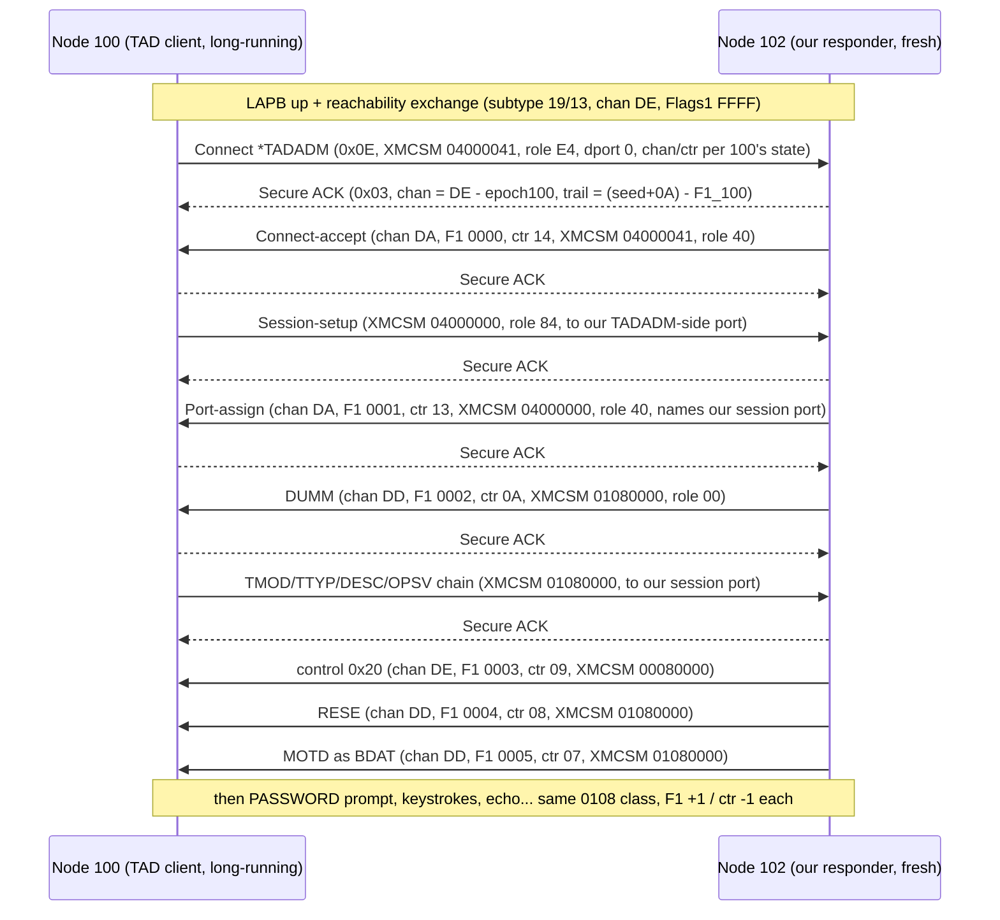
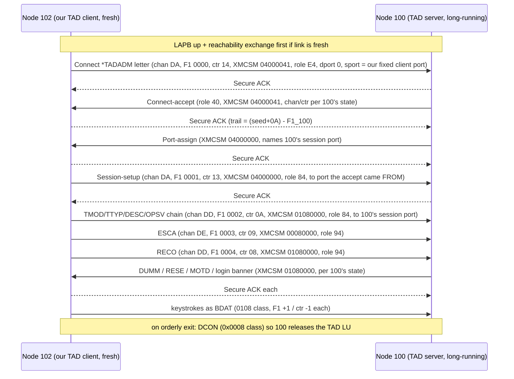
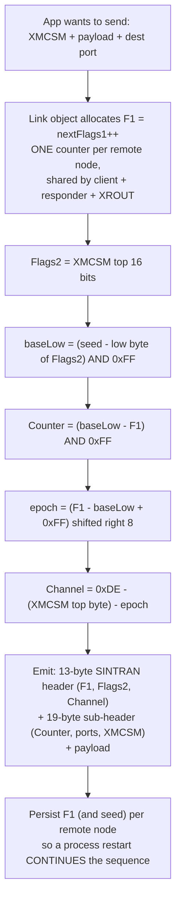
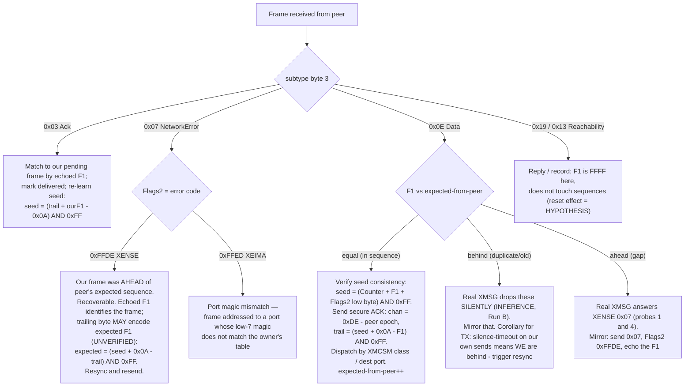

# XMSG channel/sequence — analysis result (2026-07-03)

> ## SUPERSEDED 2026-08-02 — do not send bytes planned from this file
>
> **There is no channel, no epoch, and no per-link seed.** Header word 6 is a ones-complement
> checksum of words 0-5. See `XMSG-HEADER-WORD6-IS-A-CHECKSUM-2026-07-31.md` and
> `XMSG-PROTOCOL.md` section 18.5 — carved from the XMSG kernel routine at `137314` and
> verified on **3595 of 3595** frames, every subtype, both directions, every link.
>
> **Why "zero formula failures" across 601 data + 602 ACK frames did not catch this.** The
> seed is *defined* below as `seed = (Counter + Flags1 + Flags2low) & 0xFF`, then learned per
> frame from that same identity — so the sweep tested an algebraic restatement, not a
> prediction. The other header words (markers, subtype, dest, src) never vary within a single
> link, so their contribution is a constant that the fitted "seed" silently absorbed. A linear
> function of the same words fits the same data by construction. **The check could not have
> failed**, however many frames it ran over.
>
> This file still contains "Predicted bytes for the live node-102 bring-up" with hardcoded
> Channel/Counter columns. A wrong word 6 is the documented `PERF_CONNCT` / 24B kernel crash —
> so **do not transmit anything derived from those tables.** Compute the checksum instead.
>
> Retained for its capture annotations and the Flags1 sequence-continuation rules, which stand.

Answer to the question posed in the MOTD bring-up problem statement: on which channel, with
which Flags1 and Counter, must a freshly-started responder (node 102) send its first
terminal-data frame so node 100 accepts it.

Evidence sources:
- `SINTRAN/XMSG/SRC/pcap-decode-report.txt` — ALL 13 captures re-swept
  mechanically: 601 Data frames, 602 Ack frames, 12 reachability frames. Zero formula failures.
- `SINTRAN/XMSG/XMSG-VALUES-M.SYMB`, `SINTRAN/XMSG/XMSG-PL-VALUES-M.INCL`
- `SINTRAN/NPL-SOURCE/SYMBOLS/M06/XMSG-SYMBOL-LIST.SYMB.TXT` (and `L07`)
- `Operations/Cosmos/ND-60164-3-EN  COSMOS Programmer Guide.md`
- `Operations/Cosmos/ND-30.025.02 COSMOS Operator Guide.md`
- raw pcaps: `pcap/*.pcapng` in the X25Emulator repo (external to this repo)

Note: the XMSG kernel NPL source itself is NOT in the tree (XMSG lived on its own POF segments,
built separately from the SINTRAN kernel in `NPL-SOURCE/NPL/`). Everything below therefore rests
on capture arithmetic (verified over every frame) plus symbol tables and manuals. VERIFIED /
INFERENCE / UNKNOWN are marked throughout.

---

## 1. The complete rule (VERIFIED against all 601 data frames + 602 ACKs)

Per link (node pair) there is one constant, the **link seed** (one byte). Per direction there is
one variable, **Flags1** (16-bit, +1 per Data frame). Everything else is arithmetic:

```
seed     = per-link constant            // 0x14 for 100<->102 (see section 3)
baseLow  = (seed - (Flags2 & 0xFF)) & 0xFF        // Flags2 == XMCSM >> 16, always
Counter  = (baseLow - Flags1) & 0xFF              // the sub-header down-counter
epoch    = (Flags1 - baseLow + 0xFF) >> 8         // # of completed counter wraps; 0 while Flags1 <= baseLow
Channel  = 0xDE - (XMCSM >> 24) - epoch           // the Protocol ID byte
Base     = Flags1 + Counter = baseLow + 0x100*epoch   // (the old "envelope" Base, now derived)
```

- Flags1 is **one sequence per direction per node-pair**, shared by ALL streams/ports/classes
  (ASSUMPTION A from the problem statement is CONFIRMED — see §4). It starts at **0x0000** after
  the reachability exchange (which itself uses Flags1 = 0xFFFF on channel 0xDE).
- The Counter is NOT independent state: it is fully determined by seed, Flags2 and Flags1.
- The channel is NOT allocated: it is fully determined by XMCSM's top byte and the epoch
  (ASSUMPTION B CONFIRMED as "derived"). The XMSG symbol tables contain **no** named constant in
  0330B–0336B (0xD8–0xDE) and no PROT/PID/channel-pool symbols — consistent with a derived byte,
  not a configured pool.
- ACKs (subtype 0x03): trailing byte = ((seed + 0x0A) - peerFlags1) & 0xFF; ack channel
  = 0xDE - epoch-of-the-acked-stream. This reduces to the already-live-verified
  "connect-channel + 4 / connect-counter + 0x0A" rule.
- Relay legs (marker 0x12): Flags1 carried end-to-end unchanged; Counter re-stamped **+1** per
  hop (so the relayed leg behaves as seed+1). Channel unchanged because epoch is unchanged.

Verified spot checks (from the capture, `conn-to-d102-from-100.pcapng`):
- Frame 54 DUMM: Flags1 0x0131, class 0x0108, seed 0x14 -> baseLow 0x0C, Counter (0x0C-0x31)&0xFF
  = **0xDB** ✓, epoch (0x0131-0x0C+0xFF)>>8 = **2**, channel 0xDE-1-2 = **0xDB** ✓.
- Frame 51 accept: class 0x0400 -> baseLow 0x14, Flags1 0x012F, Counter 0xE5 ✓, epoch 2,
  channel 0xD8 ✓.
- Frame 6 (100->102 terminal): Flags1 0x00FA, baseLow 0x0C, Counter 0x12 ✓, epoch 1, channel
  0xDC ✓.
- Cold start (`device-online-100-102-103.pcapng`): first Data ever, Flags1 0x0000, class 0x0100
  -> baseLow 0x14, Counter **0x14** ✓, epoch 0, channel 0xDE-1-0 = **0xDD** ✓.

The three live counter-wrap events in the captures show the channel stepping down (DD->DC,
DC->DB) at exactly the frame where the Counter wraps 0x00->0xFF, with Flags1 continuing +1 —
the epoch is simply the cumulative wrap count of that (direction, class).

## 2. Direct answer for the fresh responder (the MOTD blocker)

The premise "(a) terminal-data must be on DB" is **FALSE**. A fresh responder at epoch 0 sends
terminal data on **0xDD**. Ground truth: `conn-to-102-from103-via100.pcapng` frames 6/7/10 and
107–113 show LOW-sequence terminal-data (`XMCSM 0x01080000`) on channel **DD** at Flags1
0x0006–0x0009, Base 0x0009 (seed 0x11 - 8), accepted normally by a real machine. The capture the
problem statement worked from (`conn-to-d102-from-100.pcapng`) showed DB only because both nodes
were at epoch 2 (high running sequences). "DB one way / DC the other" was an epoch artifact, not
a rule: the same XROUT letter class appears on DD (epoch 0), DC (epoch 1) and DB (epoch 2) in
different captures.

**Predicted bytes for the live node-102 bring-up** (100<->102 link seed 0x14 — confirmed live:
100's own connect arrives with Flags1 0x0000 / Counter 0x14, exactly seed - F2low(0)):

| Frame | Flags1 | Class (Flags2) | baseLow | Counter | epoch | Channel |
|---|---|---|---|---|---|---|
| accept (0x04000041) | 0x0000 | 0x0400 | 0x14 | 0x14 | 0 | **DA** |
| port-assign (0x04000000) | 0x0001 | 0x0400 | 0x14 | 0x13 | 0 | **DA** |
| DUMM (0x01080000) | 0x0002 | 0x0108 | 0x0C | **0x0A** | 0 | **DD** |
| control 0x20 (0x00080000) | 0x0003 | 0x0008 | 0x0C | 0x09 | 0 | **DE** |
| RESE (0x01080000) | 0x0004 | 0x0108 | 0x0C | 0x08 | 0 | **DD** |
| MOTD BDAT (0x01080000) | 0x0005 | 0x0108 | 0x0C | 0x07 | 0 | **DD** |

(Flags1 values assume accept=0x0000; whatever the actual running value is, apply the formulas.)

Implementation note: do not hardcode seed 0x14 — learn it from any received Data frame:
`seed = (Counter + Flags1 + (Flags2 & 0xFF)) & 0xFF`. Seeds observed: 100<->102 = 0x14
(consistent across 5 captures), 100<->103 = 0x13, 102<->103 = 0x11 direct leg / 0x12 relayed
leg. Meaning of the seed value: **UNKNOWN** (relay leg = seed+1 is the only structure seen).
**ASSUMPTION (low risk):** seed is symmetric — every capture shows both directions of a link
using the same seed.

## 3. Why the live probes failed (re-interpretation of the four probes)

- Probe 1 (DB, Flags1 jump to 0x0131): failed the Flags1 continuity check -> XENSE. The DB
  channel was never actually validated deeper; "DB is structurally correct" was an over-read.
- Probe 2 (DD, Flags1 0x000C, Counter 0x08): channel and epoch were RIGHT; the **Counter was
  wrong** — the model requires Counter = (0x0C - 0x0C) & 0xFF = 0x00, not 0x08 (Base must be
  0x000C = seed-8, not 0x0014 = seed). INFERENCE: 100 validates (or indexes state by) the
  Counter/Base, and the mismatch is the untreatable protocol error -> XXPER.
- Probe 3 (DC, Counter 0xFF, Base 0x0101): claimed epoch 1 while 100 tracked our direction at
  epoch 0 — inconsistent -> XXPER.
- Probe 4 (start whole sequence high): XENSE on the accept, as expected — a fresh direction must
  start Flags1 at 0x0000.

Consistent picture (INFERENCE on ordering): the Flags1 sequence check runs first (mismatch ->
recoverable XENSE, code -34); a frame that passes it but carries an inconsistent Counter/epoch
hits the fatal path. XXPER = 20 decimal = 24B "Protocol error in communications system"
(`XMSG-VALUES-M.SYMB:349`); it is XMSG's own ZCRAS crash (Operator Guide ch. 8.2.4), and
`134265B` is the POF address of the ZCRAS call site — mappable only with the missing XMSG
generation listing.

## 4. Per-node-pair sequence — the confirming evidence

- `test1.pcapng`, direction 100->102: ONE Flags1 run 0x00C0..0x00ED shared by four interleaved
  port-pairs (two terminal streams, three XROUT streams, plus a D9 connect at Flags1 0x00E9).
  No per-port sequences exist.
- Per node-PAIR, not per node: in `li-rout-103-tree.pcapng` node 103 simultaneously runs Flags1
  0x0005..0x000A on the 103<->100 link and 0x0000..0x0001 on the fresh 103<->102 link.
- Kernel symbol tables agree (INFERENCE from naming): per-remote-system XS block has exactly one
  send-sequence `XSSSQ=4` and one receive-sequence `XSRSQ=6` (`SYMBOLS/M06/
  XMSG-SYMBOL-LIST.SYMB.TXT`); nothing port-indexed. COSMOS Programmer Guide: XENSE = "received
  datagram identifier (sequence number) is not equal to the expected sequence number".

## 5. Remaining unknowns (marked)

- What the link seed byte encodes, and whether it can differ per link session. (Live 100 already
  sends seed 0x14 on its connect, so learn-from-peer sidesteps this.)
- Whether 100 literally validates the Counter or uses it as an index that corrupts state when
  wrong (either way: send the correct one).
- The exact routine at POF 134265B (needs the XMSG generation listing — not in the repo).
- Whether epoch bookkeeping is per (direction, class) pair exactly as modeled when Flags1 grows
  beyond one wrap of a class the peer has never seen — captures cover epochs 0–2 and all pass,
  but the model should be re-verified live at the first wrap.

## 6. Recommended next live probe

Enable the bring-up with: Flags1 continuing +1 from the port-assign; Counter and channel computed
by the §1 formulas with seed learned from 100's connect frame. Expected first terminal frame:
DUMM on **DD** with Counter = (seed - 8 - Flags1) & 0xFF. If 100 XENSE-rejects THAT, the model's
remaining soft spot is the sub-header flags/role bytes, not the envelope.

## 7. The client (asker) role: 102 initiating "connect-to d100" to the ND TAD server

The envelope rule of §1 is fully direction-symmetric — the client side uses the SAME formulas.
Only the sub-header content (roles, ports, XMCSM order) and the frame sequence differ.

**Byte-for-byte template (VERIFIED):** in `conn-to-d102-from-100.pcapng`, node 100 was the TAD
client — decode-report lines 2012–2456 (frames 1–49, the 100→102 direction) are exactly the
frame sequence a client must produce; frames 50–98 are what it receives back. The via100
capture's 103→102 direction (frames 1–51) is a second client template at epoch 0.

### 7.1 Client send plan for a fresh node 102 (Flags1 from 0x0000, epoch 0, seed 0x14)

| Step | XMCSM | Flags2 | Role | Flags1 | Counter | Channel | Dest port |
|---|---|---|---|---|---|---|---|
| 1. Connect (`*TADADM` XROUT letter) | 0x04000041 | 0x0400 | 0xE4 | 0x0000 | 0x14 | **DA** | 0x0000 (XROUT) |
| — wait: 100 sends connect-accept (role 0x40) + port-assign; secure-ACK each — | | | | | | | |
| 2. Session-setup | 0x04000000 | 0x0400 | 0x84 | 0x0001 | 0x13 | **DA** | port the accept came FROM |
| 3. TMOD/TTYP/DESC/OPSV chain | 0x01080000 | 0x0108 | 0x84 | 0x0002 | 0x0A | **DD** | session port from port-assign |
| 4. ESCA | 0x00080000 | 0x0008 | 0x94 | 0x0003 | 0x09 | **DE** | session port |
| 5. RECO | 0x01080000 | 0x0108 | 0x94 | 0x0004 | 0x08 | **DD** | session port |
| 6. keystrokes as BDAT | 0x01080000 | 0x0108 | 0x84/0x94 | +1 each | −1 each | DD | session port |

(Counter values assume Flags1 starts at 0; apply the §1 formulas to the real running value. If
the link is fresh, the reachability exchange — channel DE, Flags1 0xFFFF — comes first.)

### 7.2 Client-role specifics (VERIFIED from the captures)

- **Source port:** the client uses ONE port of its own (XMSPT) for the entire session, including
  the connect — 100 used 683 = 0x02AB, node 103 used 581 = 0x0245. Magic encoding
  `(logical<<7)|low7` as usual; pick once, keep constant.
- **Dest port flow:** connect → port 0 (XROUT routes the `*TADADM` letter to the TAD server);
  session-setup → the port the connect-accept ARRIVED FROM (342 in the capture); terminal data →
  the port named in 100's port-assign (1218 in the capture). Parse both replies and lift the
  ports out — do not hardcode.
- **Receiving:** a long-running 100 replies with a HIGH Flags1 and correspondingly deep channels
  (D8/DB/DC = epoch 2 in the capture). The receiver must derive expected channel/Counter from
  the peer's own state via §1 — never expect fixed channels.
- **ACK duty flips:** the client secure-ACKs 100's data frames: trailing byte
  `((seed + 0x0A) − theirFlags1) & 0xFF`, channel `0xDE − their epoch`. Same rule as the
  responder case, fed with the peer's sequence.

### 7.3 Client-role UNKNOWNs — mirror the capture byte-for-byte (marked)

- **Role 0x84 vs 0x94** on terminal frames: capture mixes them per opcode (TMOD chain = 0x84,
  ESCA/RECO = 0x94, BDAT both). Meaning of the 0x10 bit: UNKNOWN — copy the captured value per
  frame type.
- **Sub-header flags byte** (offset 3: 0x86/0x92/0x96 family): UNKNOWN semantics — mirror per
  frame class.
- **Connect letter payload** (the `*TADADM` XROUT letter body) and session-setup payload: take
  verbatim from capture frames 1 and 3, substituting node/port fields.

### 7.4 Architectural consequence

Flags1 and the per-class counters are per-direction per-LINK, not per-session. If the node runs
a client and a responder (or XROUT traffic) simultaneously, all draw from the same interleaved
Flags1 sequence — `test1.pcapng` shows one Flags1 run shared by terminal, XROUT, and a connect.
The sequence state must therefore live in one shared link-level object; TadTerminalResponder and
any future TadClient must ask the link object to stamp outgoing frames, never own the counters.

Validation path before touching the live machine: unit-test the frame builder by reproducing
conn-to-d102 frames 1/3/6/7/10 byte-for-byte (with 100's captured Flags1 values plugged in).

## 8. Diagrams (send and receive)

All concrete values below assume the 100↔102 link (seed 0x14) and a fresh node 102 (Flags1
starting 0x0000, epoch 0). 100 is long-running, so ITS frames arrive with whatever Flags1/epoch
its persistent state dictates — the receiver must derive, never expect fixed channels.

### 8.1 Responder session — 100 runs "connect-to d102" against our node (§2 send plan)



### 8.2 Client session — our node runs "connect-to d100" (§7 send plan)



### 8.3 Outbound frame stamping (TX path — the §1 formulas as a flow)



### 8.4 Inbound frame handling (RX path, including the sequence outcomes)



Diagram sources: 8.1/8.2 follow the §2 and §7.1 send plans (captures `conn-to-d102-from-100.pcapng`
and `conn-to-102-from103-via100.pcapng`, plus the live-verified Run A); 8.3 is §1; 8.4 combines §1,
the probe results, and the restart findings in `XMSG-SEQUENCE-RESTART-ANSWER-2026-07-03.md` —
items marked HYPOTHESIS/UNVERIFIED/INFERENCE there keep that status here.
