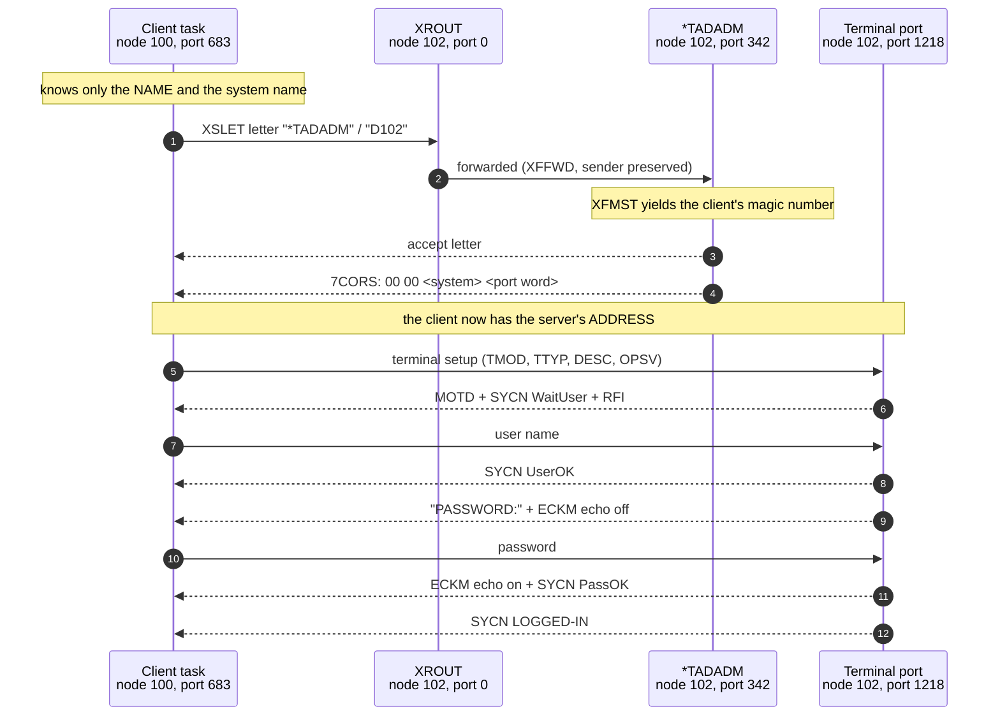

# connect-to D102: the whole session, frame by frame

How a client that knows only the name `*TADADM` reaches a SINTRAN terminal server
and gets a logged-in session. Source capture:
`E:\Dev\Ronny\X25Emulator\pcap\conn-to-d102-from-100.pcapng` - 98 frames, node 100
to node 102, decoded in `E:\Dev\Ronny\NDInsight\SINTRAN\XMSG\SRC\pcap-decode-report.txt`.

Every field below was parsed from the captured bytes, and the frames are in TRUE
chronological order - both directions merged by timestamp, 22.4 seconds end to end.
The envelope arithmetic (Counter and channel derivation) was recomputed for all 49
data frames and matches the wire on **49 of 49**.

> **Do not number frames from the decode report.** `pcap-decode-report.txt` lists
> each TCP stream direction in turn, so its frame numbers run 1-49 for everything
> node 100 sent and 50-98 for everything node 102 sent. Read as a timeline it is
> nonsense - it puts the client's logout keystrokes before the server's accept. The
> numbering used here comes from re-extracting the pcapng with
> `frame.time_relative` and de-framing both directions into one ordered list.

Companion page - packet ladder plus all 98 frames expanded byte by byte:
<https://claude.ai/code/artifact/2fea47cb-2947-48da-981a-bfe7846a8ab6>

---

## 1. The five things that actually happen



The one idea worth carrying away: **XROUT never tells the client where the server
is.** It forwards a letter. The server learns the client's magic number from the
arriving message (`XFMST`), and then chooses to disclose its own by sending the
`7CORS` port assignment. Everything after that is ordinary task-to-task messaging.

---

## 2. Phases

| Frames | Time | Phase | What changes |
|---|---|---|---|
| 1-8 | 9.62-9.74 s | Connect | Letter to the name; the server answers 50 ms later and hands back a magic number. |
| 9-24 | 9.78-11.55 s | Terminal bring-up | TMOD / TTYP / DESC / OPSV, then a RESE / RECO line reset. |
| 25-41 | 11.60-14.48 s | Login | MOTD, user name, password with echo off, LOGGED-IN. |
| 42-74 | 14.54-18.41 s | Session work | One LIST-FILES command and its multi-frame output. |
| 75-96 | 20.73-22.40 s | Logout | The user types the logout command; host reports `--EXIT--`. |
| 97-98 | 31.97-32.03 s | Idle | A single `7POLL` keepalive nine seconds later, acknowledged. |

The whole connect exchange - letter out, accept back, port assigned - takes
**120 milliseconds**. Everything after that is a human typing.

## 3. Frame 1 - the letter

```
raw: 2113000E 0066 0064 00F8 0400 D9
     1C 2100 86 E4 0066 0000 0064 02AB 04000041 0010
     FF 07 2A "TADADM" 00 FE 04 "D102"
```

| Layer | Field | Value | Reading |
|---|---|---|---|
| SINTRAN header | Subtype | `0x0E` | Data |
| | Dest / Src | 102 / 100 | |
| | Flags1 | `0x00F8` | datagram sequence for this direction on this link |
| | Flags2 | `0x0400` | frame class, equals `XMCSM >> 16` |
| | Protocol ID | `0xD9` | the derived channel byte |
| XMSG sub-header | Role | `0xE4` | XFWTF \| XFWAK \| XFHIP \| XFROU |
| | XMDPT | 0 | the XROUT sink - the only address a client knows a priori |
| | XMSPT | 683 | port 5, random 43 |
| | XMCSM | `0x04000041` | low byte `0x41` = XSLET |
| | XMLEN | 16 | the letter body |
| XROUT letter | param 1 (string) | `*TADADM` | XSLET In:1, port or connection name |
| | param 2 (string) | `D102` | XSLET In:2, system name |

Two things this frame settles:

- **The client addresses the server by name only.** The port number 2 that
  `*TADADM` actually occupies appears nowhere in the letter.
- **There is no four-byte XROUT header on the wire.** The parameter blocks start at
  the first trailer byte; the service lives in `XMCSM`. Read with a header assumed,
  the leading `FF 07` is mistaken for serial 255 plus service 7 and every parameter
  is lost. See `XMSG-SERVER-NAMES-AND-LETTERS.md` section 5.

The API call behind it: `XFSND` with the `XFROU` option, which sends the current
message buffer to the local XROUT instead of to a port.

---

## 4. Frame 7 - the port assignment

This is the frame where the client finally gets an address.

```
TAD chain: 7CORS OPSV 7LUN ... EOP
7CORS payload: 00 00 <system16> <port word16>
```

That payload is a whole 32-bit magic number in its A/D register layout - the high
word is the system number, the low word is `(port << 7) | random`. Both halves then
appear verbatim as `XMSSY` / `XMSPT` in every subsequent frame from the server.
This is the wire-level proof that the XMSG port fields are the magic number's low
word; see `XMSG-WIRE-PORT-IS-MAGIC-LOW-WORD-2026-07-26.md`.

Decoded, the terminal port is `1218` = `0x04C2` = **port 9, random 66**.

---

## 5. The login ladder

Each step is a `SYCN` state change carried in the TAD chain. Frame numbers are from
this capture.

| Frame | Time | Dir | TAD | State |
|---|---|---|---|---|
| 25 | 11.60 s | server | `BMMX ECKM(echo on) BDAT SYCN(0002) BDAT RFI` | MOTD printed, WaitUser, input granted |
| 27 | 13.20 s | client | `BDAT "sys"` | user name typed |
| 29 | 13.30 s | server | `BDAT SYCN(0003) CESC` | UserOK |
| 33 | 13.44 s | server | `BDAT "PASSWORD:" ECKM(echo off) RFI` | prompt, echo suppressed |
| 35 | 14.23 s | client | `BDAT` | password line |
| 37 | 14.34 s | server | `BDAT ECKM(echo on) BDAT "OK" SYCN(0006) CESC` | echo restored, PassOK |
| 41 | 14.48 s | server | `BDAT SYCN(000A) BDAT "R@" RFI` | **LOGGED-IN**, prompt issued |
| 85 | 21.52 s | server | `BMMX ECKM(teardown) CESC` | session closing |
| 89 | 22.32 s | server | `BDAT SYCN(000B) "--EXIT--"` | LoggedOut |

`ECKM 0xFF` before the password and `ECKM 0x01` after it is the whole of the
password-masking mechanism: the host tells the terminal to stop echoing, reads the
line, then turns echo back on.

---

## 6. The envelope, per frame

Every data frame's Counter and Protocol ID are derived, not free:

```
seed    = (Counter + Flags1 + Flags2low) & 0xFF     ; constant per link (0x14 for 100<->102)
baseLow = (seed - Flags2low) & 0xFF
Counter = (baseLow - Flags1) & 0xFF
epoch   = (Flags1 - baseLow + 0xFF) >> 8
channel = 0xDE - (XMCSM >> 24) - epoch              ; the Protocol ID byte
```

Recomputed across this capture: **49 of 49 data frames match**. A frame whose
Counter or channel disagrees with these formulas is malformed, and that is exactly
the check the Wireshark dissector performs.

---

## 7. Reading the ports

With the magic-number layout carved, every port field on the wire decomposes:

| Wire value | Port | Random | Who |
|---|---|---|---|
| 0 | - | - | XROUT sink |
| 342 (`0x0156`) | 2 | 86 | `*TADADM`, the named server port |
| 683 (`0x02AB`) | 5 | 43 | the client's own port |
| 1218 (`0x04C2`) | 9 | 66 | the terminal port assigned by `7CORS` |

The random part is not random: it is drawn by the kernel's `ZRAND`, a linear
congruential generator whose low seven bits step as `r' = (53r + 25) mod 128`. See
`XMSG-MAGIC-NUMBER-LAYOUT-CARVED-2026-07-26.md`.

---

## 8. Related

- `XMSG-SERVER-NAMES-AND-LETTERS.md` - why names exist and what a server must implement
- `XMSG-MAGIC-NUMBER-LAYOUT-CARVED-2026-07-26.md` - the magic-number bit layout and ZRAND
- `XMSG-WIRE-PORT-IS-MAGIC-LOW-WORD-2026-07-26.md` - the wire port / magic tie
- `XMSG-PROTOCOL.md` - the transport spec (framing, LAPB, envelope, ACKs)
- `..\..\TAD\TAD-Message-Formats.md` - the TAD opcode catalogue and login ladder
