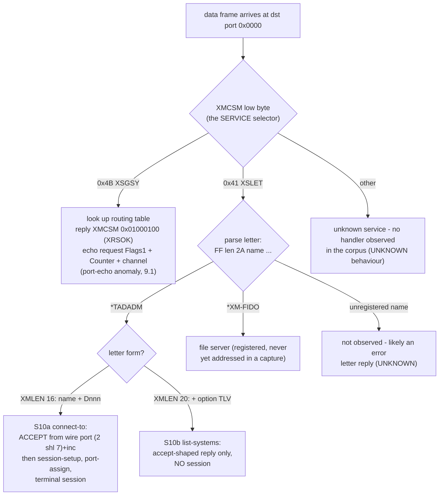
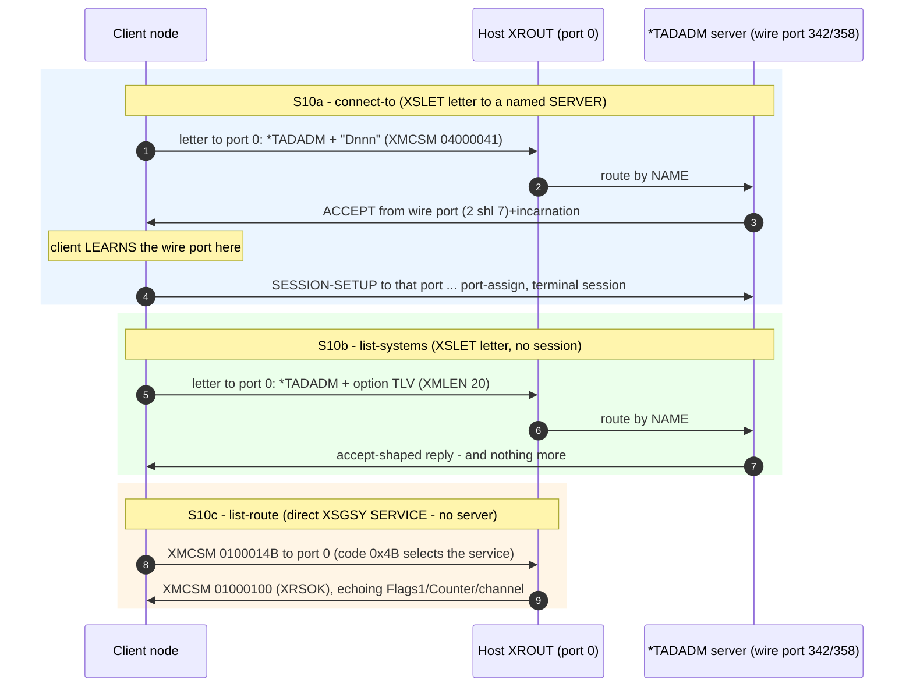
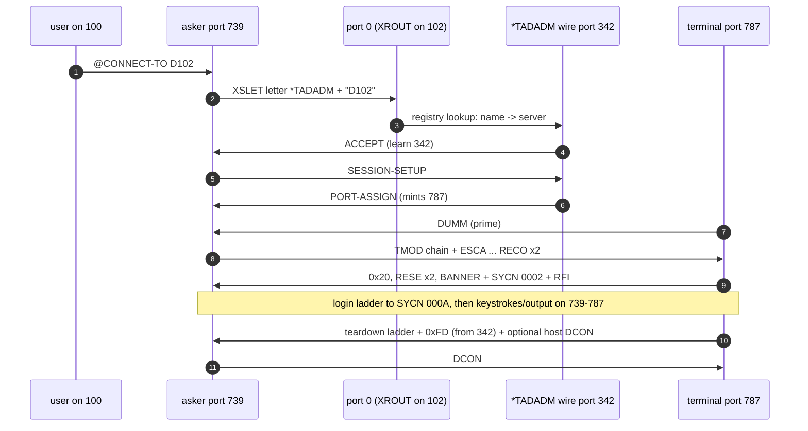
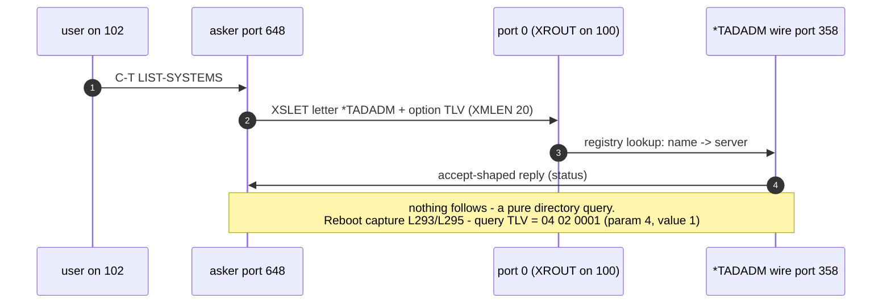
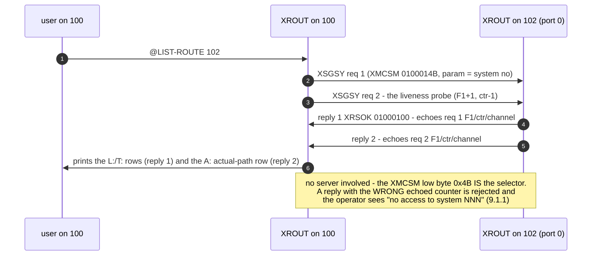
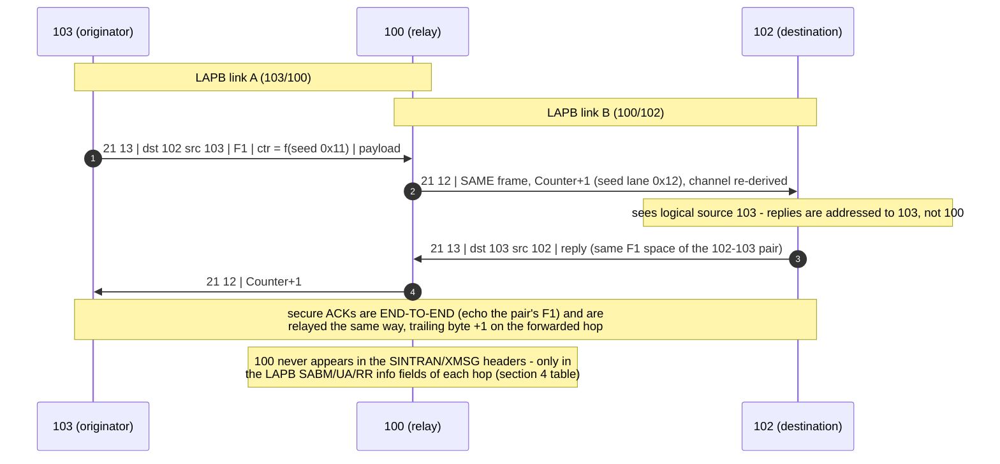

# SINTRAN III XMSG-over-HDLC — Protocol Reference

**One authoritative description of the XMSG (eXchange MeSsaGe) wire format** used
by SINTRAN III / COSMOS / NORD-NET to carry inter-node messages (routing, terminal
/ TAD, PAD, file transfer, mail) over an HDLC serial link.

## What this document is — and how it relates to the TAD message formats

XMSG is the **transport**: this document specifies everything needed to get ANY
payload from one node's port to another's, byte-correct — HDLC framing and FCS, the
ND LAPB dialect (including the odd-length address bit), the 13-byte SINTRAN header,
the datagram-sequence/Counter/channel **envelope** (the seed model, §18.5), secure
ACKs (§6), reachability and restart/resync (§5.1), relaying (§18.8 S11), and the
port-0 **server/service dispatch** (§7 terminology, §18.8 S10). It is deliberately
payload-agnostic: the same rules carry TAD today and `*XM-FIDO` or a user
application's letters tomorrow.

What the payloads MEAN is the next layer up. For the terminal protocol — the TAD
opcode catalog, the login ladder, echo control, and the complete `connect-to` session
with build recipes for client and server — see
**[TAD-Message-Formats.md](../../TAD/TAD-Message-Formats.md)**. Rule of thumb: *this
document tells you how to build and validate a frame; the TAD document tells you what
to put in it and when, for a terminal session.* An implementer needs both.

## Table of contents

| § | Content |
|---|---|
| 1–2 | Layer model · HDLC framing (flags, stuffing, FCS-16 + test vector) |
| 3 | ND LAPB dialect: 3.1 addresses (incl. the `0x80` odd-length bit) · 3.2 control bytes · 3.3 node-id info field · 3.4 balanced setup · 3.5 sequencing/REJ/T1 · 3.6 ND deviations + the 16-bit node number · 3.7 → [LAPB-REQUIREMENTS.md](LAPB-REQUIREMENTS.md) |
| 4 | SINTRAN header: 4.1 subtypes (Data/Ack/Reach/Error) · 4.1.1 XENSE/XEIMA rejects · 4.2 Flags1 sequence, persistence, behind/ahead · 4.3 Protocol ID = derived channel |
| 5 | Data frames + XMSG sub-header · 5.1 reachability incl. the RESYNC form · 5.2 role byte |
| 6 | **Secure ACK** — the stateless closed form (`S_ack = seed + 0x0B`), wrap, `0x0002` class |
| 7 | Addressing: ports, magic numbers, **SERVER vs SERVICE terminology + node architecture drawing** |
| 8–12 | XF\* function codes · sub-protocol trailers (9.1 XSGSY/routing, 9.2 TAD, 9.4 PAD) · XM5 header · XR\*/XE\* status codes · driver mapping |
| 13–17 | Consolidation corrections · open questions · constants · reproduction · implementation checklist |
| 18 | **The envelope model and scenarios**: 18.4 role/frameFlags decode · 18.5 seed formula · 18.7 accept/port-assign anatomy · 18.8 worked scenarios **S1–S11** (fresh start, continuation, mirror trap, epochs, measured connect/accept table, restart resync, reconnect, reboot, ACK wrap, port-0 dispatch + name census, relay) |

---

This document supersedes and merges three earlier notes — the peer protocol
spec, its pcap validation, and the NPL-symbol analysis — plus the format content
that used to live in the Wireshark dissector README. Those are archived under [OLD/](../OLD/).

## How to read this document

Every claim carries a confidence tag:

- **[VERIFIED]** — reproduced from FCS-valid captured traffic *and/or* read
  directly from NPL source / ND symbol tables.
- **[SYMBOLS]** — a symbol value or name from the ND symbol tables; on-wire
  serialisation not independently confirmed.
- **[INFERRED]** — a reasoned conclusion, not directly confirmed.
- **[CAPTURE-SPECIFIC]** — observed only in a traffic class **not** present in the
  13-capture corpus (the peer's `XFSND` send-message capture); plausible but
  unconfirmed here.

**Source-precedence rule** (applied wherever sources disagreed): FCS-verified
captures  >  the Wireshark dissector (a reverse-engineering artifact)  >  the ND
symbol tables  >  the peer's prose spec. Section 13 records exactly what this
rule changed.

**Evidence base:** 14 `.pcapng` captures held in the separate sibling
**X25Emulator** repository (its `pcap/` directory) — nodes 100/102/103, several
relayed 103↔102 via 100; 6379 raw de-framed frames, of which **1947 passed FCS**
and form the statistics cited below, PLUS the 2026-07-05 **reboot capture**
`multiple-connect-100-to102-and-then-reboot-and connect-again.pcapng` (379
FCS-valid frames: fresh link, two consecutive connect-to sessions, a 102 reboot
with the resync exchange, a third session, and 102 acting as CLIENT toward 100 —
the source for §5.1's resync form and §18.8 S7/S8).

**Related documents (kept separate by scope):**
- [LAPB-REQUIREMENTS.md](LAPB-REQUIREMENTS.md) — the **normative acceptance spec**
  for the LAPB layer (MUST/SHOULD requirements, validator checklist, conformance
  scenarios) — see §3.7.
- [XMSG-API.md](XMSG-API.md) — the **programming / API** side: MON 200B calling
  convention, option bits, the XROUT letter/standard-message format, and the
  complete `XF*`/`XS*`/`XE*`/`XR*` constant catalogs (machine-readable copy in
  [XMSG/xmsg-constants.json](../xmsg-constants.json)).
- [HDLC-Frame-Format-Reference.md](../../Devices/HDLC/HDLC-Frame-Format-Reference.md) — the HDLC
  hardware / COM5025 / DMA / driver layer beneath XMSG.
- [XMSG-COMMAND-REFERENCE.md](XMSG-COMMAND-REFERENCE.md) — the `XMSG-COMMAND`
  operator utility (commands, not wire format).
- [TAD/TAD-Message-Formats.md](../../TAD/TAD-Message-Formats.md) — the full TAD
  terminal opcode chain layered on top of XMSG (see Section 9.2).
- [Devices/HDLC/WireShark/README.md](../../Devices/HDLC/WireShark/README.md) — the
  Wireshark dissector that implements this document.

---

## 1. Layer model  [VERIFIED]

```
 ┌──────────────────────────────────────────────────────────────────┐
 │ HDLC frame      7E | byte-stuffed( LAPB frame | FCS ) | 7E       │  sec 2
 │   LAPB frame    address | control | information                  │  sec 3
 │     information ┌─────────────────────────────────────────────┐  │
 │                 │ SINTRAN header (13 bytes)                   │  │  sec 4
 │                 │   Markers, Packet Type, Subtype, Dest/Src,  │  │
 │                 │   Flags1, Flags2, Protocol ID               │  │
 │                 ├─────────────────────────────────────────────┤  │
 │                 │ Sub-protocol payload                        │  │  sec 7-9
 │                 │   ROUTING / TAD / DC / DB / PAD             │  │
 │                 │   (XMSG sub-header + user data)             │  │
 │                 └─────────────────────────────────────────────┘  │
 └──────────────────────────────────────────────────────────────────┘
```

| Layer | Role | Section |
|-------|------|---------|
| HDLC framing | delimit frames, FCS error detection | 2 |
| LAPB | balanced data link: establish, sequence, acknowledge | 3 |
| SINTRAN header | route a frame between nodes; identify subtype + sub-protocol | 4 |
| Sub-protocol / XMSG | message endpoints (ports), addressing, payload | 5–9 |

The `nd100x --hdlc` TCP bridge is a transparent byte pipe: the emulated
COM5025/DMA layer performs the HDLC bit framing, so over the bridge the async
byte stream in Section 2 is what appears on TCP. Conventions: multi-byte integers
are **big-endian** unless stated; wire bytes in hex, ND symbol values in octal
(ND's native radix) with hex/decimal where useful.

---

## 2. HDLC framing  [VERIFIED]

Asynchronous HDLC framing (RFC 1662 / PPP-async style):

```
   7E | byte-stuff( LAPB-frame | FCS_low | FCS_high ) | 7E
```

| Symbol | Value | Meaning |
|--------|-------|---------|
| `FLAG` | `0x7E` | frame delimiter (start and end) |
| `ESCAPE` | `0x7D` | escape prefix |
| mask | `0x20` | escaped byte = `original XOR 0x20` |

**Byte-stuffing.** Within `LAPB-frame | FCS`, every `0x7E` and `0x7D` is sent as
`0x7D` then `(byte XOR 0x20)`; the receiver reverses it.

**Frame Check Sequence (FCS-16).** 16-bit CRC over the unstuffed LAPB frame:
- CRC-CCITT, polynomial `0x1021` (reflected/table form `0x8408`).
- Init `0xFFFF`; **one's-complement** the result before transmission.
- Sent **low byte first**, then high byte.
- Receiver folds the CRC (init `0xFFFF`) over `LAPB-frame | FCS_low | FCS_high`;
  a valid frame yields the constant **good residue `0xF0B8`**.

**Anchor** (a real captured SABM link-setup frame from node 100, `ctrl 0x3F`):

```
LAPB-frame = 01 3F 00 64
FCS        = 0x092E      → on the wire low-first: 2E 09
frame      = 01 3F 00 64 2E 09        (CRC folded over frame|FCS = 0xF0B8)
```

All 1947 FCS-valid frames fold to `0xF0B8`.

---

## 3. LAPB data link  [VERIFIED]

After de-framing: `address(1) | control(1) | information(0..n)`.

### 3.1 Address

| Address | Used on |
|---------|---------|
| `0x01` | link-establishment frames (SABM, UA) |
| `0x09` | data-transfer frames (RR, I-frames) with EVEN info-field length |
| `0x89` | I-frames with **ODD info-field length** (see below) |
| `0x07` | observed on a few ACK-carrying I-frames (first of a back-to-back ack pair) — meaning UNKNOWN; tolerate on RX (§6) |

> **Address bit `0x80` = odd-info-length marker [VERIFIED, all captures, 230+ data
> frames, 0 counterexamples].** `0x89` appears on exactly the I-frames whose info field
> (SINTRAN header + sub-header + trailer) has an odd byte count, in BOTH directions and
> for every subtype; even-length I-frames and all S-frames (2-byte info) ride `0x09`.
> A real ND machine **silently discards** an odd-length I-frame sent with `0x09` —
> before sequence processing, so V(R) freezes and the following frame draws REJ;
> retransmission fails identically. Root cause of two live stalls (the "help menu" REJ
> deadlock and the login PASSWORD stall). Mechanism [INFERRED]: word-oriented ND DMA
> needs the final-word half-full flag. Not standard LAPB — ND extension (§3.6).

### 3.2 Control byte (modulo-8)

| Frame type | Bit pattern | Fields |
|------------|-------------|--------|
| **I** (information) | `bit0 = 0` | `control = (N(R) << 5) \| (P/F << 4) \| (N(S) << 1)` |
| **S** (supervisory) | `bits1..0 = 01` | `control = (N(R) << 5) \| (P/F << 4) \| (type << 2) \| 01`; RR=0, RNR=1, REJ=2 |
| **U** (unnumbered) | `bits1..0 = 11` | fixed codes below |

Decoders: `N(S) = (control >> 1) & 7`, `N(R) = (control >> 5) & 7`,
`P/F = (control >> 4) & 1`.

Fixed control-byte reference (note: RR/REJ are supervisory frames, not
unnumbered — kept in one table for lookup convenience):

| Frame | Control | Confidence |
|------------------|---------|------------|
| SABM | `0x3F` (base `0x2F`\|P) | [VERIFIED] |
| UA | `0x73` (base `0x63`\|P) | [VERIFIED] |
| RR | `0x01 \| (N(R) << 5)` | [VERIFIED] |
| REJ | `0x09 \| (N(R) << 5)` | [VERIFIED] |
| DISC | `0x43` | [INFERRED — standard LAPB, not seen in corpus] |
| DM | `0x0F` | [INFERRED] |
| FRMR | `0x87` | [INFERRED] |

### 3.3 Node identity on link-management frames  [VERIFIED]

SABM, UA and RR carry the **sending node number** as their 2-byte information
field: `00 64` = node 100, `00 66` = node 102, `00 67` = node 103.

### 3.4 Establishing the link  [VERIFIED]

Balanced link; either side may initiate:

```
   →  SABM   addr 01  ctrl 3F   info = own node number
   ←  UA     addr 01  ctrl 73   info = peer node number
   ←  SABM   addr 01  ctrl 3F   info = peer node number     (peer also initiates)
   →  UA     addr 01  ctrl 73   info = own node number
   ── link established; V(S) = V(R) = 0 ──
   ↔  RR     addr 09  ctrl 01   info = node number          (periodic keepalive)
```

### 3.5 Sequencing  [VERIFIED]

- Each I-frame carries `N(S) = V(S)`; increment `V(S)` (mod 8) after sending.
- An in-order I-frame (`N(S) == V(R)`) increments `V(R)` (mod 8).
- I-frames and RRs carry `N(R) = V(R)`, acknowledging peer frames up to `N(R)−1`
  (an I-frame doubles as a link-level ack). Note this LAPB `N(R)` acknowledgment
  is **distinct** from the XMSG datagram-level ACK in Section 6.
- A **duplicate** I-frame (`N(S)` behind `V(R)`) is answered with an RR carrying the
  current `N(R)`; an **out-of-sequence** I-frame (a gap) is answered with **REJ**
  carrying `N(R) = V(R)`, requesting go-back-N retransmission from that number
  (REJ is present in the corpus — control table above).
- **Receiving REJ ⇒ retransmit ALL unacknowledged I-frames from its `N(R)`**
  immediately. Receiving RNR ⇒ ack up to `N(R)−1` but stop sending new I-frames
  until an RR arrives. Every S-frame handler MUST decode the subtype
  (`control & 0x0F`: RR `0x01`, RNR `0x05`, REJ `0x09`) — the three are
  indistinguishable by `control & 0x03` alone, and REJ's low nibble happens to
  equal the ND data address byte `0x09`, a proven log/parse trap.
- A sender needs a **T1 retransmission timer + N2 retry limit** on the oldest
  unacknowledged I-frame, and a retransmit queue covering the whole window (not
  just the last frame): responses here routinely put 2–4 I-frames in flight.
- An S-frame with **P=1 must be answered with an F=1 supervisory** [INFERRED —
  standard LAPB; ND corpus usage of P/F not established, §3.6].

### 3.6 ND deviations from standard LAPB — the 16-bit node (CPU) number  [VERIFIED]

The ND point-to-point link is **not textbook ITU-T LAPB**. A generic LAPB state
machine for these links must be **initialized with the local 16-bit node (CPU)
number** and apply the deviations below; everything not listed here follows the
standard (mod-8 sequencing, cumulative `N(R)` ack, REJ = go-back-N retransmit,
RNR = peer busy, T1/N2 timer recovery, window k ≤ 7).

**Deviation table (vs ITU-T X.25 LAPB):**

| Aspect | ITU-T LAPB | ND machines (this corpus) | Confidence |
|--------|-----------|---------------------------|------------|
| Address byte | `0x03`/`0x01` DTE/DCE with command/response semantics | **`0x01` = link setup (SABM/UA), `0x09` = data transfer (RR/REJ/I)** — role-of-frame, not station identity | [VERIFIED] |
| Address bit `0x80` | does not exist (no length signalling in the address) | **set on I-frames with ODD info-field length (`0x89`); receiver DISCARDS odd frames sent as `0x09`** — sender MUST set it, receiver MUST accept both and route on `addr & 0x7F` (§3.1) | [VERIFIED rule; INFERRED mechanism] |
| U/S frame info field | none (U and S frames carry no information field) | **SABM, UA and RR carry a 2-byte info field = the sender's node (CPU) number**, big-endian | [VERIFIED] |
| Link setup | one side initiates | **balanced: BOTH stations send SABM and answer the peer's SABM with UA** (§3.4) | [VERIFIED] |
| Idle behaviour | none required | **periodic RR keepalive carrying the node number** | [VERIFIED] |
| P/F bit usage | command/response poll-final discipline | parsed on the wire but its ND usage is **not established from the corpus** — implement the standard F=1 answer to P=1 until a capture contradicts it | [INFERRED] |

**The 16-bit node (CPU) number.** The info-field value is simply the machine's
decimal node number serialised as a big-endian 16-bit word — the same identity
space as the SINTRAN-header Dest/Src node fields (§4), e.g. node 104 would be
`0x0068`. Values observed in the corpus:

| Node (decimal) | Wire bytes | Machine |
|---------------:|-----------|---------|
| 100 | `00 64` | ND host, machine 100 |
| 102 | `00 66` | responder node (our C# node / real 102) |
| 103 | `00 67` | third node (relay captures) |

Frames verified to carry it: **SABM, UA, RR** (every occurrence in all 13
captures). Not yet observed carrying it: REJ, DISC, DM, FRMR (absent or too rare
in the corpus) — [UNKNOWN]; a safe implementation stamps all locally-originated
U/S link-management frames the same way and tolerates either on receive.
I-frames do NOT carry it — their information field is the SINTRAN payload, and
node identity there lives in the SINTRAN header.

**Physical vs logical identity — do not conflate.** The LAPB info-field node
number identifies the **physical neighbour** on this link; the SINTRAN header
carries the **logical endpoints**. On a relayed path (103 via 100 to 102, §4)
the LAPB frames on the 102 link say `00 64` (100, the neighbour) while the
SINTRAN header says src 103. The LAPB layer must therefore never feed its node
number upward as a routing source, and the XMSG layer must never expect the
LAPB peer id to equal `Header.SrcNode`.

**Initialization contract for a generic LAPB state machine:**

1. Construct with `localNodeNumber` (16-bit). The state machine owns L2 identity;
   nothing above it supplies per-frame node ids.
2. On every SABM / UA / RR (and other U/S link-management frames) it emits,
   append the 2-byte big-endian `localNodeNumber` as the info field.
3. On receiving SABM/UA/RR, record the 2-byte info field as `peerNodeNumber`
   (the physical neighbour); expose it read-only to the layer above for
   diagnostics, not for routing.
4. Handle the balanced handshake: answer an incoming SABM with UA (info =
   `localNodeNumber`) and still send its own SABM; the link is up when both
   directions have completed SABM→UA. `V(S)=V(A)=V(R)=0` on every SABM/UA
   establishment — no sequence adoption.
5. I-frames: address `0x09`, no node id, payload passed through opaquely
   (the SINTRAN/XMSG layers of §4+ know nothing of L2 and vice versa).

### 3.7 Normative LAPB requirements & validation  [pointer]

The complete, self-contained requirement set for this layer — everything in
§2/§3 condensed to MUST/SHOULD statements, plus the pieces that live only
there — is **[LAPB-REQUIREMENTS.md](LAPB-REQUIREMENTS.md)**. Treat that
document as the **normative acceptance spec** for any LAPB implementation on
these links; this chapter is the descriptive reference behind it. Items in the
requirements doc that are intentionally NOT duplicated here:

- **T1/N2 in the live event loop** (a timer that only ticks in tests fails the
  requirement — a confirmed live deadlock cause), and the full timer lifecycle
  (start/restart/stop rules).
- The **exactly-one-state-machine-per-link layering rule** (LAPB module must be
  free of XMSG types; XMSG's Flags1/secure-ACK reliability is independent).
- The **12-question validator checklist** (for reviewing an implementation) and
  the **8 minimal conformance scenarios** (unit-testable, including the
  REJ-retransmits-first-of-two regression and the stuffed-FCS round-trip
  vector).

---

## 4. SINTRAN header  [VERIFIED]

Every LAPB I-frame carries a fixed **13-byte SINTRAN header** immediately after
address and control:

```
Offset  Size  Field          Notes
──────  ────  ─────────────  ───────────────────────────────────────────────
  0      1    Marker 1       Always 0x21
  1      1    Marker 2       0x13 = normal frame, 0x12 = relay frame
  2      1    Packet Type    0x00 in all observed XMSG traffic
  3      1    Packet Subtype Message kind (see 4.1) — NOT a length
  4      2    Dest Node      Destination node number (big-endian)
  6      2    Src Node       Source node number (big-endian)
  8      2    Flags 1        Datagram sequence / broadcast marker (see 4.2)
 10      2    Flags 2        Frame-class word (see 4.2)
 12      1    Protocol ID    Sub-protocol carried in the payload (see 4.3)
```

`Marker 1 (0x21)` + `Marker 2 (0x13)` are the SINTRAN frame fingerprint. Their
values resemble the X.25 Packet-Layer GFI/LCN bytes, but ND treats them as fixed
markers — the X.25 reading is an observation, not a cited ND fact. **Marker 2 =
`0x12`** marks a **relay frame**: a node forwarding between two others. The outer
Dest/Src are the relay nodes; the endpoints sit inside the payload. In relayed
captures the *same* logical frame appears on two links with the per-link counter
re-stamped by +1.

> **Relay marking — CORRECTED 2026-07-06 [VERIFIED from
> `conn-to-102-from103-via100.md` L545/L547, L1041/L1045, L1327/L1333].** When
> node 103 connects to node 102 *through* relay node 100, each logical frame
> traverses BOTH links: the **originator's hop carries marker `0x13`**, and the
> **relay's forwarded hop (toward the destination) carries marker `0x12`** with
> the sub-header Counter re-stamped **+1** — everything else (SINTRAN endpoints
> `Dest 102 / Src 103`, Flags1, ports, XMCSM, payload) byte-identical. (An earlier
> revision claimed the destination-facing link carried `0x13`; the port-mapped
> dump proves the opposite — e.g. the connect letter is `21 13 …` on the 103↔100
> hop and `21 12 …` with Counter `0x0D→0x0E` on the 100→102 hop.) The relay node
> 100 itself appears **only at the LAPB layer** (its node number in the SABM/UA/RR
> info field of section 3.3); it never appears in the SINTRAN header or the XMSG
> sub-header endpoints. Concretely, two node identities coexist per link:
>
> | Layer | Field | Whose node number | 103-via-100 shows |
> |-------|-------|-------------------|-------------------|
> | LAPB (section 3.3) | SABM/UA/RR info | **physical neighbour** | `100` (`0x0064`) |
> | SINTRAN header (offsets 4/6) | Dest / Src node | **logical endpoints** | `102` / `103` |
> | XMSG sub-header | `XMDSY:XMDPT` / `XMSSY:XMSPT` | **logical endpoints:port** | `102:0` / `103:581` |
>
> **Implication for a responder:** address replies to the frame's *logical*
> source (`Header.SrcNode` / `XMSSY`), which may be 103 even though every byte
> physically travels the 100↔102 link. Do **not** assume the SINTRAN-header
> source equals the LAPB peer.

### 4.1 Packet Subtype (offset 3)  [VERIFIED]

**This byte is a message-kind code, not a length.** (The old dissector README
labelled it "Packet Length"; that was wrong.) Proof from the corpus: subtype
`0x0E` appears on frames from **34 to 292 bytes**, and three distinct subtypes
(`0x03`, `0x13`, `0x19`) all occur at the *same* 14-byte length. Only four values
ever occur across all 1947 frames:

| Subtype | Meaning | Flags 1 | Flags 2 | Length | Count |
|---------|---------|---------|---------|--------|------:|
| `0x03` | **ACK / flow-control** (Section 6) | echoed acked datagram seq | `0x0001` | 14 B | 602 |
| `0x0E` | **Data message** (Section 5) | own datagram seq | `0x0400 / 0x0108 / 0x0008` | 34–292 B | 601 |
| `0x13` | **Reachability reply** (Section 5.1) | `0xFFFF` broadcast | `0x0001` | 14 B | 4 |
| `0x19` | **Reachability request** (Section 5.1) | `0xFFFF` broadcast | `0x0001` | 14 B | 8 |
| `0x07` | **Network error / reject notification** (Section 4.1.1) | datagram seq of the rejected message | **negative XE\* error code** | 14 B | 0 in corpus; live only |

> **Subtype `0x07` — resolved [VERIFIED live against retrocore; NOT in capture corpus].**
> Earlier this was tagged `[CAPTURE-SPECIFIC]` from the peer's send-message spec
> (subtype `0x07` + `0xFFED` status). It occurs in **0 of 1215** decoded SINTRAN
> I-frames from real hardware (only `0x03/0x0E/0x13/0x19` appear there), but the
> **retrocore HDLC emulator emits it live** as a routing-layer error notification.
> The `0xFFED` "status word" sits in the Flags 2 position and is a **negative
> XMSG network-layer error code** from the official include `XMSG-VALUES-M.SYMB`:
>
> | Flags 2 | Value | Symbol | Meaning (`XMSG-VALUES-M.SYMB`) |
> |---------|------:|--------|--------------------------------|
> | `0xFFED` | -19 | `XEIMA` | **Invalid magic number** (line 142) |
> | `0xFFDE` | -34 | `XENSE` | **Network sequencing error** (line 157) |
>
> So `0x07` is the frame a node sends to report that a received message failed
> network-layer validation. See Section 4.1.1.

#### 4.1.1 Subtype `0x07` network-error frame  [VERIFIED live]

Observed live when machine 100 drove `list-systems` toward our node 103: 100
answered several of our replies with 14-byte `0x07` frames on the ROUTING channel
(`0xDE`), e.g.

```
21 13 00 07  00 67 00 64  00 00  FF ED  DE 2C
│    │  │    │     │       │      │      │  └ trailing routing counter
│    │  │    │     │       │      │      └ Protocol ID 0xDE (ROUTING)
│    │  │    │     │       │      └ Flags 2 = 0xFFED = XEIMA "Invalid magic number"
│    │  │    │     │       └ Flags 1 = datagram seq of the message being rejected
│    │  │    │     └ source 100
│    │  │    └ dest 103
│    │  └ subtype 0x07 (network error / reject)
│    └ Marker 2 0x13
└ Marker 1 0x21
```

Operational meaning: **our node's reply carried an invalid/absent magic number**,
so XMSG on 100 rejected it (`XEIMA`) and the `list-systems` transaction stalled.
An XMSG **magic number** encodes a `(system, port)` endpoint identity — see the
services `XFP2M` "port to magic number", `XFM2P` "magic to system+port",
`XSGMG` "get magic number from name", `XSCMG` "check magic number"
(`XMSG-VALUES-M.SYMB` lines 38-39, 181, 230). A responder that allocates or
echoes a valid magic-number-derived port avoids this rejection.

> **Open item — subtype byte has no symbol.** The packet-subtype enum
> (`0x03/0x0E/0x13/0x19/0x07`) is a **network-layer** packet type. That layer's
> NPL source is **absent** from this repository (`NPL-SOURCE/CLAUDE.md`: XMSG
> kernel source missing, only symbol offsets survive), so no symbol *names* the
> value `0x07` itself. What is named is the error *payload* (`XEIMA`, `XENSE`).
> The exact wire location and derivation of the magic number our node must
> present is likewise not yet captured — flagged for a future reference capture.

### 4.2 Flags 1 / Flags 2  [VERIFIED]

`Flags 2` cleanly separates the two frame classes: `0x0001` on all short/control
frames (`0x03/0x13/0x19`); `0x0400 / 0x0108 / 0x0008` on data (`0x0E`), where it
appears to encode a per-sub-protocol class rather than a raw length.

`Flags 1` is the **datagram sequence number** (ND term; see status `XENSE` /
symbol `XMSEQ`): it increments per data message on a direction, is `0xFFFF` on
broadcast/reachability frames, and is **echoed verbatim by the ACK** (Section 6).

**Continuity across sessions [VERIFIED, reboot capture 2026-07-05]:** the
per-direction Flags1 is ONE counter for the LINK, not per session or per role. In
`multiple-connect-…pcapng`, node 100 runs `0x0000 → 0x0028` continuously across a
list-route exchange, TWO complete connect-to sessions (logins, teardowns, DCONs)
and the next connect; node 102 likewise — and when 102 later switches to the
CLIENT role, its connect letters continue the same counter it used as host. A
reconnect after DCON arrives at simply `last + 1` (session-2 connect `0x0016`
directly after DCON `0x0015`), and the responder's accept is ITS own `last + 1`
(`0x0017`) — both sides at epoch 1 on `D9`, working perfectly.

**Persistence and out-of-sequence behaviour [VERIFIED live]:**
- The receiver's expected-next-Flags1 (kernel `XSRSQ`, one per remote system per
  direction) **persists across the sender's process/link restarts** — it resets
  only when the receiver's own XMSG restarts. A restarted implementation must
  therefore **persist its outgoing Flags1 per remote node and continue it**, not
  restart at `0x0000`. There is no formula tying one direction's Flags1 to the
  other's; any observed equality is coincidence of symmetric traffic.
- A frame whose Flags1 is **behind** the expected value is **silently dropped**
  (no ACK, no error frame — the only symptom is the missing `0x03`).
- A frame whose Flags1 is **ahead** draws a *recoverable* subtype-`0x07`
  **`XENSE`** reject (Section 4.1.1) that echoes the offending Flags1. This
  asymmetry makes a deliberate ahead-jump a safe resync probe after a restart
  when persisted state is lost.
- **Exception — no pair state at all (fresh boot):** a node that receives a data
  frame for a pair it has NO state for answers with the **resync
  ReachabilityRequest** (echoing the frame's Flags1, §5.1), which zeroes both
  directions and makes the peer REPLAY the datagram from `0x0000`
  [VERIFIED, reboot capture]. XENSE appears to be the established-state mismatch
  path; the reachability resync is the no-state path [INFERRED split — both
  behaviours individually verified].

### 4.3 Protocol ID (offset 12)  [VERIFIED — derived channel; see Section 18.5]

Within any single class-stream this byte reads as a **stable sub-protocol
selector** (`0xDE` ROUTING, `0xDD` TAD, …) and the table below is the practical
selector list. But it is **not an independent constant**: it is the high byte of
the envelope quantity

```
channel = 0xDE − (XMCSM class) − (base >> 8)        base = Flags1 + Counter
```

(Section 18.5, VERIFIED 209/209 data frames). It holds steady while a stream's
`base` stays inside a 256-count window and **borrows down** (`0xDE→0xDD→0xDC…`)
each time that stream's counter wraps.

> **Credit — the peer/friend spec saw this first.** `OLD/xmsg-hdlc-protocol.md`
> (§4.4, §14 "Uncertain") OBSERVED exactly this behaviour in generic Send-Message
> traffic — offsets 12–13 decrementing as one 16-bit value
> (`de04 → de03 → … → de00 → ddff`, the high byte borrowing `de→dd`) — and
> honestly flagged it *"needs a second capture to settle whether the two traffic
> classes differ or the field is a counter throughout."* **The connect-to captures
> are that second capture, and they settle it in the friend's favour:** the field
> is the derived channel above, universally — the same for ROUTING, TAD, list-route,
> list-systems and connect-to. It only *looks* fixed in short same-class routing
> exchanges because `base>>8` does not move there; a connect-to session makes it
> visible because one session spans three XMCSM classes (`D8`/`DB`/`DC`). The
> earlier "decode-boundary misread" note was wrong and is retracted.

| Protocol ID | Name | Description | Section |
|-------------|------|-------------|---------|
| `0xDE` | ROUTING | network routing / inter-node control | 9.1 |
| `0xDD` | TAD | Terminal Access and Directory (terminal sessions) | 9.2 |
| `0xDC` | DC | terminal data forwarding | 9.3 |
| `0xDB` | DB | terminal data forwarding (DC variant) | 9.3 |
| `0xDA` | PAD | X.25 PAD virtual-circuit data | 9.4 |
| `0xD9` / `0xD8` | D9 / D8 | DC variants (observed; semantics inferred) | 9.3 |

---

## 5. Data message (subtype `0x0E`) and the XMSG sub-header  [VERIFIED structure]

A data message carries the 13-byte SINTRAN header, then the **XMSG sub-header**,
then user data. Sub-header layout (offsets relative to the start of the payload,
i.e. SINTRAN offset 13 onward):

```
Offset  Size  Symbol   Field             Notes
──────  ────  ───────  ────────────────  ──────────────────────────────────
  0      1    —        Counter           per-direction counter (decrements)
  1      2    —        Marker            always 0x21 0x00
  3      1    —        Frame Flags       not constant (0x82 / 0x84 / 0x86 / 0x96 seen)
  4      1    —        Role              asker/responder hint (see 5.2)
  5      2    XMDSY    Destination system  node number (big-endian)
  7      2    XMDPT    Destination port    port on dest node (big-endian; see note)
  9      2    XMSSY    Source system       node number (big-endian)
 11      2    XMSPT    Source port         port on src node (big-endian)
 13      4    XMCSM    Control / service   service-id (dispatch key for ROUTING/TAD)
 17      1    —        Pad                 0x00
 18      1    XMLEN    User data length    low byte of length
 19      N    —        User data           format depends on the service
```

`XMDSY/XMDPT/XMSSY/XMSPT/XMCSM/XMLEN` are the application-relevant fields of the
in-kernel **XM5** header (Section 10); kernel-only fields (data bank/offset,
timestamps, allocation) are dropped before transmission. Short messages carry a
truncated trailer — the `XMCSM/Pad/XMLEN` block is present only for services that
need it.

> **Port encoding note.** [REFUTED as stated by peer] The peer spec's
> `XMDPT = logical port ≪ 7` does **not** hold in this corpus: `XMDPT & 0x7F` is
> non-zero on most frames (common values `0x02C1, 0x0245, 0x02AB, 0x02E4`). The
> exact encoding of the logical port into `XMDPT` is **unconfirmed** — do not
> assume `≪ 7`.

### 5.1 Reachability handshake  [VERIFIED]

Before routing to a remote, a node tests reachability with a request
(subtype `0x19`); the remote answers with a reply (subtype `0x13`). Until the
reply arrives the remote is treated as **not accessible**.

```
   →  21 13 00 19  00 66 00 64  FF FF 00 01  DE 08      request  (100 → 102)
   ←  21 13 00 13  00 64 00 66  FF FF 00 01  DE 0E      reply    (102 → 100)
```

The reply swaps Dest/Src Node; `Flags 1 = 0xFFFF` (broadcast marker),
`Flags 2 = 0x0001`, Protocol ID `0xDE` (ROUTING), followed by the per-direction
counter byte.

**Restart-signal semantics [VERIFIED live + capture 2026-07-05]:** a received
ReachabilityRequest is more than a liveness probe — it is a **pair-state reset**.
After the request/reply exchange, BOTH directions' datagram sequences are zeroed
(§4.2). In every capture, `Flags1 = 0x0000` data streams begin only immediately
after a reachability exchange on that link. A bare LAPB/HDLC link restart (SABM)
does **not** carry this meaning and does not reset datagram sequences — the two
layers restart independently.

**The RESYNC variant — how a rebooted node re-joins a climbed peer [VERIFIED,
`multiple-connect-…-reboot-…pcapng` t≈473s].** There are TWO reachability-request
forms:

1. **Link-start form:** `Flags1 = 0xFFFF`, channel `0xDE`, trailing `0x08`
   (reply = request trailing + 6). Sent at first contact.
2. **Resync form:** when a node WITHOUT pair state (fresh boot) receives a data
   frame with a climbed Flags1, it does NOT reply XENSE and does NOT stay silent —
   it sends a ReachabilityRequest **echoing the offending frame's Flags1** (the
   capture: rebooted 102 got connect `F1 0x0028/D9` and sent `0x19` with
   `F1 = 0x0028`, channel `DD` = `0xDE − epoch(echoed F1)`, trailing
   `(0x08 − F1) & 0xFF = 0xE0`). The peer answers `0x13` (echo, trailing +6),
   **zeroes the pair state in both directions, and RE-SENDS the pending datagram
   from `Flags1 0x0000`** — the capture shows 100 re-issuing the identical connect
   letter at `0x0000/DA/ctr 0x14` two frames later, and the session then running
   fresh. This is the protocol-native recovery a restarted responder should use
   instead of guessing/persisting: echo-ReachRequest on the first out-of-expectation
   frame, then proceed from zero.

**Reachability trailing byte — closed form [VERIFIED 2026-07-06, all 16 reach frames
in the corpus, all links]:** `trailing_request = ((seed − 0x0C) − F1adj) & 0xFF`,
where `F1adj = 0` for the link-start form (`Flags1 0xFFFF`) and `F1adj = the echoed
Flags1` for the resync form; `trailing_reply = trailing_request + 6`. Measured bases:
100↔102 `0x08` (seed 0x14), 100↔103 `0x07` (0x13), 102↔103 `0x05` (0x11); resync
`0xE0/0xE6` at echoed F1 `0x0028`. Zero mismatches. Two relay refinements
[VERIFIED]: **the relay does NOT re-stamp reachability trailing bytes** (the
marker-0x12 leg carries the unmodified m13-seed value — unlike data Counters and ACK
trailers, which get +1), and the reachability **Flags2 is the hop count**
(`0x0001` direct, `0x0002` on the relayed leg, consistent across all 16 frames).

### 5.2 Role byte (sub-header offset 4)  [VERIFIED low nibble; INFERRED high nibble]

Low nibble `4` = asker, `0` = responder. High-nibble class is partially inferred:

| Value | Meaning |
|-------|---------|
| `0xC4` | Asker for LI ROUTING |
| `0x60` | Responder for LI ROUTING |
| `0xE4` | Asker for LI SYSTEM-TAD |
| `0x40` | Responder for LI SYSTEM-TAD |
| `0x94` | Asker (connection setup) |
| `0x84` | Asker (legacy) |
| `0x54` | Asker variant |
| `0x00` | Generic data frame (no role) |

> **This table is superseded by Section 18.4 (U2), which SOLVED the byte:** the
> role byte is the high byte of the XMSG send-option word — bit0=`XFTCM`,
> bit1=`XFSEC`, **bit2=`XFROU`** (the asker/responder "low nibble 4/0"),
> bit3=`XFFWD`, bit4=`XFBNC`, bit5=`XFHIP`, bit6=`XFWAK`, bit7=`XFWTF`. The
> labels above remain as observed combinations.

### 5.3 Peer data-message example  [CAPTURE-SPECIFIC — peer's send-message capture]

An empty-buffer data message from the peer's 100→102 send-message capture. **This
exact frame is not present in the 13-capture corpus**, and its `XMDPT = port ≪ 7`
reading is refuted here (see the port-encoding note above) — retained verbatim
from the peer spec so no detail is lost:

```
21 13 00 0E  00 66 00 64     SINTRAN header: subtype 0E, dest 102, src 100
00 00                        Flags 1 = datagram sequence (0)
00 10                        Flags 2 = length/size (16)
DE 04                        Protocol ID (ROUTING) + counter
21 00 82 C4                  XMSG marker, frame-flags 0x82, role 0xC4 (asker)
00 66 03 80                  XMDSY = 102, XMDPT = 0x0380  (peer reads as port 7 ≪ 7)
00 64 02 AD                  XMSSY = 100, XMSPT = 0x02AD
00 10                        trailing size word = 16
```

In this short empty-buffer message the `XMCSM/Pad/XMLEN` block is truncated: the
trailing `00 10` sits where `XMCSM` would begin and mirrors the Flags 2 length.

---

## 6. Delivery acknowledgment (subtype `0x03`)  [VERIFIED]

Routed data messages are acknowledged. In this corpus the ACK is a **short
subtype-`0x03` frame** (14 bytes: 13-byte header + 1 payload byte), sent in the
**opposite** direction to the data frame it acknowledges.

**Mechanism (verified by correlation):**
- **`Flags 1` of the `0x03` frame = the echoed datagram-sequence of the `0x0E`
  data frame it acknowledges.** Measured echo rate on the two direct 100↔102
  captures: 53/58 and 40/49 against the opposite-direction data frame, vs ~0%
  (0/48) against the same direction — the residual misses are off-by-one
  pipelining (two data frames in flight). Same-direction correlation being ~0
  rules out a same-side companion.
- **`Flags 2` = `0x0001`** on every ACK.
- **The single payload byte = the acking side's own per-direction counter**
  (decrements), interpreted per sub-protocol: proto `0xDE` → routing / connection-
  step command byte (Section 9.1), `0xDD` → TAD control byte, `0xDC` → DC
  flow-control counter.

**A `0x03` byte cannot be decoded in isolation** — its meaning is fixed by the
data frame it answers (`Flags 1` identifies which datagram).

**Closed form for building an ACK [VERIFIED 904/904 ACKs, all 14 captures, incl. the
0x0002 class, all four link seeds, both relay legs, the DE→DD wrap and the reboot
reset]** — the ACK is the §18.5 envelope arithmetic applied to the ECHOED data Flags1
with an ACK seed `S_ack = link_seed + 0x0B`:

```
S_ack    = seed + 0x0B                                 ; link constant (0x1F for 100↔102)
baseLow  = (S_ack − (Flags2 & 0xFF)) & 0xFF            ; class 0x0001 → seed+0x0A; class 0x0002 → seed+0x09
trailing = (baseLow − ackedFlags1) & 0xFF
epoch    = (ackedFlags1 − baseLow + 0xFF) >> 8
channel  = 0xDE − epoch
Flags1   = ackedFlags1 (echo)
```

The ACK is therefore a **pure per-direction FUNCTION of the acked frame's Flags1** —
no counter state, no per-connect re-seed, no cross-direction interaction, and no reset
at session boundaries (it resets only with the pair state, i.e. the reachability
resync). A per-connect re-seed coincides with this function only while the connect's
Flags1 is below `baseLow` — the live session-3 crash (our ACK on `DE` where the model
required `DD` at echoed F1 `0x2A`) proves the peer VALIDATES the ACK channel. The old
"connect-channel + 4 / counter seed+0x0A decrementing" reading was the epoch-0 special
case of this function.

> **LIVE-CONFIRMED 2026-07-06 (real 100, 4 back-to-back reconnects, no restart):** the
> stateless closed form held throughout, including the `DE → DD` channel step at the
> ACK baseLow crossing (114 `DD` ACKs emitted and accepted); the outgoing Flags1
> meanwhile continued `0x0000 → 0x0013 → 0x0026 → 0x003E` across the four sessions
> with no per-connect reset (§18.8 S7/S9). This is the implementation-grade
> confirmation of both rules.

Examples: capture ack `DD/0x26` for connect `Flags1 0x00F8` at epoch 1
(seed `0x14`: `0x1E − 0xF8 = 0x26`); live ack `DD/0x09` for connect `0x0015`.
The epoch-0 special case reads as "connect-channel + 4, trailing seed+0x0A
decrementing" — same formula. This confirms the payload byte is derived state,
not a free counter. **The ACK wrap is captured live** (reboot capture, t≈265s):
when `(seed+0x0A) − F1` crosses zero the trailing byte wraps (`0xFF, 0xFE…`) and
the ack channel steps down `DE → DD` — exactly the epoch term of the formula.

**Two newly observed ACK variations [reboot capture 2026-07-05]:**
- **`Flags2 = 0x0002`** appears on the second ACK of SOME back-to-back pairs — and its
  Counter fits the same closed form with `baseLow = S_ack − 2` (24/24 measured). It is
  NOT mandatory: the real 102 acked one pair `0x0001/0x0001` (t≈168.57s) and another
  `0x0001/0x0002` (t≈545.08s) in the same capture, so the class choice is situational.
  Since both classes satisfy `trailing + Flags1 + Flags2low ≡ S_ack`, a sum-checking
  receiver cannot distinguish them. **Emitters MAY always use `0x0001`** [measured
  optionality; receiver tolerance additionally supported by live sessions that acked
  pairs with `0x0001/0x0001` throughout]. Receivers MUST accept both.
- **LAPB address `0x07`** carries some first-of-a-pair ACK I-frames (six
  occurrences, both directions, FCS-valid, even length — so not the `0x80`
  odd-length rule). Meaning UNKNOWN; receivers must tolerate and route it as a
  data-transfer address.

> [CAPTURE-SPECIFIC] The peer's send-message capture describes the same ACK
> mechanism (Flags 1 echoes the datagram sequence; a per-direction counter in the
> body) under subtype **`0x07`** with a `0xFFED` status word. The *mechanism* is
> confirmed here; only the subtype value and status word differ by traffic class.

### 6.1 Secure delivery and retransmission  [VERIFIED ack exists; INFERRED retransmit]

Routed data messages are sent with the `XFSEC` "secure message" option: the
receiver **must acknowledge** each data message, or the sending system
**retransmits** it (the peer spec reports ~3× before giving up). The ACK binds to
its data message via the echoed datagram sequence in `Flags 1` — acknowledging
with any other value leaves the message outstanding and the sender keeps
retransmitting.

> No message loss or retransmission occurs in the 13-capture corpus, so the ~3×
> retransmit count and the `XFSEC` option name are carried over from the peer
> spec and unconfirmed here; the ACK itself (subtype `0x03`) is verified.

### 6.2 Peer ACK example  [CAPTURE-SPECIFIC — peer's send-message capture]

Six data messages, each acknowledged with its echoed sequence (subtype `0x07`,
status `0xFFED` = `XEIMA`; not reproduced in this corpus — see the Section 6
caveat):

| Data message: datagram seq | Acknowledgment (Flags1, Flags2, Counter) |
|----------------------------|------------------------------------------|
| `00 00` | `00 00  FF ED  DE 2D` |
| `00 01` | `00 01  FF ED  DE 2C` |
| `00 02` | `00 02  FF ED  DE 2B` |
| `00 03` | `00 03  FF ED  DE 2A` |
| `00 04` | `00 04  FF ED  DE 29` |
| `00 05` | `00 05  FF ED  DE 28` |

The datagram sequence (Flags 1) increments per message; the Counter decrements
per ack (the receiver's own per-direction counter). The two are independent.

### 6.3 Worked example — one full exchange  [CAPTURE-SPECIFIC ack line]

On an established link (all frames address `0x09`), from the peer spec. The final
ack line uses the peer's subtype `0x07`; in this corpus that ack is subtype `0x03`
(Section 6):

```
   100 → 102   I  N(S)=0 N(R)=0   21 13 00 19 00 66 00 64 FF FF 00 01 DE 08    reachability request
   102 → 100   I  N(S)=0 N(R)=1   21 13 00 13 00 64 00 66 FF FF 00 01 DE 0E    reachability reply
   100 → 102   I  N(S)=1 N(R)=1   21 13 00 0E 00 66 00 64
                                  00 00 00 10 DE 04 21 00 82 C4
                                  00 66 03 80 00 64 02 AD 00 10                data message, datagram seq 0
   102 → 100   I  N(S)=1 N(R)=2   21 13 00 07 00 64 00 66 00 00 FF ED DE 2D    delivery ack, echoes seq 0
```

---

## 7. Addressing model  [SYMBOLS + INFERRED]

> **Terminology — SERVER vs SERVICE (fix the words once):**
> - A **SERVER** is a named, registered program in XROUT's registry: `*TADADM`
>   (logical port 2), `*XM-FIDO` (4), `*COSPO` (5), `*FA-FSA` (7), `*XFTRA` (8),
>   `*FA-SERVER` (11) — COSMOS's own `list-servers` command names them (full table
>   in §7.1), each with a well-known LOGICAL port and free session slots.
>   Its WIRE port is `(logical << 7) | incarnation`, minted per boot (342/358 for
>   `*TADADM`); clients learn it from the server's reply, never compute it.
> - A **SERVICE** is a numbered XROUT operation in the XMCSM low byte ("the service
>   byte", bit 6 set = request): `XSLET` 0x41 "send a letter", `XSGSY` 0x4B "get
>   routing info"; replies carry the status code (`XRSOK`…) in the same byte.
> - So: `connect-to` invokes the XSLET **service** to deliver a letter to the
>   `*TADADM` **server**; `list-route` invokes the XSGSY **service** directly — no
>   server, no name on the wire. Everything arrives at port 0 and forks on the
>   XMCSM low byte. (The `XF*` codes are a third namespace: MON 200B API
>   **functions**, §8 — never a wire selector.)

One node's receive-side architecture (ports/names as measured on 100↔102):

```
                incoming data frame, dst port 0x0000
                               │
                 ┌─────────────▼──────────────┐
                 │   XROUT  (the router)      │
                 │   fork on XMCSM low byte   │
                 │   = the "SERVICE" selector │
                 └────┬──────────────────┬────┘
         XSGSY 0x4B   │                  │   XSLET 0x41
         (direct      │                  │   (letter: route by NAME
          service)    ▼                  ▼    found in the payload)
        ┌───────────────────┐   ┌───────────────────────────────┐
        │ routing table     │   │ SERVER registry (list-servers)│
        │ reply 0x01000100  │   │  *TADADM 2   *XM-FIDO 4        │
        │ (XRSOK; port-echo │   │  *COSPO 5    *FA-FSA 7         │
        │  anomaly, §9.1)   │   │  *XFTRA 8    *FA-SERVER 11     │
        │                   │   │  (name -> logical port + SPs) │
        └───────────────────┘   └──────┬──────────────────┬─────┘
                                       ▼                  ▼
                             ┌──────────────────┐ ┌──────────────────┐
                             │ *TADADM SERVER   │ │ *XM-FIDO SERVER  │
                             │ wire port =      │ │ wire port =      │
                             │ (2<<7)|incarn.   │ │ (4<<7)|incarn.   │
                             │ = 342 or 358 ... │ │ (not yet on wire)│
                             └────────┬─────────┘ └──────────────────┘
                                      │ ACCEPT / PORT-ASSIGN sent FROM
                                      │ the wire port (client learns it here)
                                      ▼
                             terminal/session port, minted per session
                             ( (slot<<7)|incarnation, e.g. 787/798/1218 )
```

A host has a **node number** (100, 102, …) and runs tasks that own one or more
**ports** — XROUT, TADAD, XMFIDO are XMSG service tasks; `BAK01`/`BAK02` are SINTRAN
**background tasks** (BAK01 typically attached to the console terminal, BAK02 to the
next logged-in terminal), listed here only as port-owning processes. A remote reference is a
32-bit **magic number** = port + system + a random component, so stale references
cannot be reused. On the wire the destination is `XMDSY` (system) + `XMDPT`
(port). XMSG provides `XFP2M` (port → magic) / `XFM2P` (magic → port) to build
and resolve addresses, and `XFRTN` ("return message") to reply to a received
message without minting a new address (it swaps src/dst).

### 7.1 Port lifecycle — who allocates which port, and when

Every port on the wire is `(logical slot << 7) | low7`; what differs is WHO mints it
and WHEN. Four kinds exist, and none of them is ever computed by the peer:

| Kind | Allocated by | When | Lifetime | Examples (measured) |
|---|---|---|---|---|
| **Port 0** | fixed by the protocol | — | forever | the XROUT letter/service sink (§18.8 S10) |
| **Server registry port** | the server at registration | server startup | until re-registration; low7 incarnation changes per boot | `*TADADM` slot 2 → wire 342/358; `*XM-FIDO` slot 4 |
| **Asker / client port** | **the ORIGINATING node's XMSG kernel at `XFOPN`** (§8) [INFERRED mechanism; measured pattern VERIFIED] | when the client program (connect-to, an XROUT query, a user app) opens its port | ONE port for the whole session/transaction, then released | connect-to on 100 = always slot 5, fresh low7 per connect (683, 648, 739, 664, 657…); connect-to on 103 = slot 4 (581); XROUT queries = slots 5/6/8/9 (722, 845, 1049, 1222…) |
| **Session / terminal port** | the HOST at port-assign | per accepted session | until DCON | 787, 798, 833, 1218 (slot 6/9…) |

Supporting observations [VERIFIED]: the same machine + program class reuses the same
logical slot with a varying low7 per open (100's connect-to: nine different low7
values, all slot 5); different programs occupy different slots. The low7 is the
magic-number "random part" (masks `5PSHZ/5PMS1/5PMSK`) — though on retrocore-100
consecutive XROUT opens showed an INCREMENTING low7 (`0x52, 0x62, 0x63, 0x64`), so it
may be an incarnation counter rather than random [observed pattern; exact scheme
UNKNOWN]. Peers must treat every non-zero port as an opaque learned value: the asker
port is learned from the connect/request frame, the server wire port from the accept,
the terminal port from the port-assign — nothing but port 0 is ever known a priori.

#### The XROUT server registry — live `list-servers` on a real COSMOS install

[VERIFIED — live `list-servers` output on node 100 with COSMOS installed. Names/ports
VERIFIED; the "meaning" column is INFERRED from the name text unless noted.] Only two
of these (`*TADADM`, and `*XM-FIDO` by inference) have been seen on the wire so far; the
rest name the sub-protocols still to be captured. "Free SPs" = free session/subprocess
slots the server can hand out (the per-server session cap).

The names map onto the documented COSMOS service triad — **Remote Spooling / Remote
File Access / ND-MAIL** (COSMOS Operator Guide `ND-30.025.02` ch. 7 and the service
diagram at its line 765) — plus the terminal and transport servers:

| Logical port | Name | Free SPs | Purpose |
|---:|---|---:|---|
| 2 | `*TADADM` | — | Terminal Access Device admin — the connect-to terminal server [VERIFIED, this spec] |
| 4 | `*XM-FIDO` | — | XMSG file-I/O / forwarding daemon (XMFIDO in the crash logs) — the transport/forwarding layer [INFERRED] |
| 5 | `*COSPO` | — | **COsmos SPOoling** — the Remote Spooling (remote print) server [INFERRED-strong: COSMOS ch. 7 "Remote Spooling"] |
| 7 | `*FA-FSA` | 2 | Remote **F**ile **A**ccess — the FSART/File-Server-Admin control side [INFERRED: FA = File Access, COSMOS line 765] |
| 8 | `*XFTRA` | 1 | file **TRA**nsfer [INFERRED from name] |
| 11 | `*FA-SERVER` | 30 | Remote **F**ile **A**ccess server — the bulk file server (30 session slots) [INFERRED] |

Implications: (1) COSMOS's three inter-node services each have a server here — spooling
(`*COSPO`), file access (`*FA-*`, `*XFTRA`, with `*XM-FIDO` as the transport), and mail
(**ND-MAIL** — a documented COSMOS service NOT in this particular registry, so either not
installed/started on node 100 or under a different name; watch for it). (2) "The file
server" is really a FAMILY (`*XM-FIDO`/`*XFTRA`/`*FA-FSA`/`*FA-SERVER`) — a file-transfer
capture may touch several names; census the letter names (§18.8 S10) to see which the
operation actually uses. (3) The registry is the authoritative name→logical-port map; a
node's OWN `list-servers` gives the wire ports `(logical<<7)|incarnation`.
(4) `list-servers` (a.k.a. `LI-SER`) is a LOCAL registry query and produces no inter-node
wire traffic (§18.8). (5) All servers share the one XMSG transport — the
envelope/ACK/odd-address/port rules carry over unchanged (`LEARNING-A-NEW-PROTOCOL.md`).

**Frame sizing** [VERIFIED from symbols]: `X4FSO = 312` (max RX frame bytes),
`X4FRM = 20` (frame overhead), `X4LTO = 10` (link timeout XTUs). So the largest
HDLC information field is 312 bytes and the max user payload is ~**292 bytes** —
which matches the observed 292-byte ceiling on subtype-`0x0E` frames. Larger XMSG
buffers are fragmented across multiple frames (DCB chaining, Section 12).

---

## 8. Function codes (XF\*) and the send/receive sequence  [VERIFIED — symbols]

XMSG operations are invoked through **monitor call 200B** with a function code
(from `NPL-SOURCE/SYMBOLS/L07/XMSG-SYMBOL-LIST.SYMB.TXT`):

| Symbol | Octal | Hex | Purpose |
|--------|------:|----:|---------|
| XFDUM | 000000 | 0x00 | Dummy / no-op |
| XFDCT | 000001 | 0x01 | Disconnect |
| XFGET | 000002 | 0x02 | Get (allocate) message buffer |
| XFREL | 000003 | 0x03 | Release message buffer |
| XFRHD | 000004 | 0x04 | Read header |
| XFWHD | 000005 | 0x05 | Write header (XMDSY/XMDPT/XMSSY/XMSPT) |
| XFREA | 000006 | 0x06 | Read user data (advances XMLIX) |
| XFWRI | 000007 | 0x07 | Write user data (advances XMLIX) |
| XFMST | 000011 | 0x09 | Message status |
| XFOPN | 000012 | 0x0A | Open port |
| XFCLS | 000013 | 0x0B | Close port |
| XFSND | 000014 | 0x0C | Send message |
| XFRCV | 000015 | 0x0D | Receive message |
| XFPST | 000016 | 0x0E | Port status |
| XFGST | 000017 | 0x0F | General status |
| XFM2P | 000026 | 0x16 | Magic → port |
| XFP2M | 000027 | 0x17 | Port → magic |
| XFPRV | 000036 | 0x1E | Make privileged (e.g. routing-table updates) |
| XFRTN | 000037 | 0x1F | Return message (swap src/dst) |
| XFRRH | 000040 | 0x20 | Receive + read header |
| XFRRE | 000051 | 0x29 | Receive + read entire message |

Typical send/receive:

```
  sender:    XFGET(size) → XFWHD(dst sys/port, src sys/port) → XFWRI(data) → XFSND
  receiver:  XFRCV(port) → XFRHD → XFREA(data) → XFREL
```

---

## 9. Sub-protocol payloads

**All data (subtype `0x0E`) frames share one envelope** [VERIFIED]. Across the
whole corpus **100%** of data frames — for *every* Protocol ID `0xD8`…`0xDE` —
carry the identical XMSG sub-header of Section 5 (counter, `21 00` marker,
frame-flags, role, XMDSY/XMDPT/XMSSY/XMSPT, XMCSM, pad, XMLEN). **The Protocol ID
byte is a channel tag, not a different frame layout** — TAD, PAD, DC and DB are
the *same* structure; they differ only in the logical channel they name and in
what the trailer carries. Decode any data frame as:

```
SINTRAN header (13B)  →  XMSG sub-header  →  trailer (XMLEN bytes)
```

then decode the **trailer by content**, dispatched on `XMCSM`:
- `XMCSM 0x0100014B / 0x01000100` → LI ROUTING (`XSGSY`) parameter blocks (9.1)
- `XMCSM` low byte `0x41` = `XSLET` → an XROUT letter (TLV; e.g. to service `TADADM`)
- otherwise (e.g. `XMCSM 0x01080000`) → a TAD message chain (9.2)
- anything not recognised → raw bytes (retained verbatim)

| Proto ID | Channel | Typical trailer content |
|----------|---------|-------------------------|
| `0xDE` | ROUTING | LI ROUTING (`XSGSY`) params; 1-byte routing commands |
| `0xDD` | TAD | TAD message chain (terminal access) |
| `0xDC` / `0xDB` | DC / DB | TAD chain / terminal data forwarding |
| `0xDA` | PAD | X.25 PAD channel — in this corpus, LI SYSTEM-TAD (`TADAD`) letters |
| `0xD9` / `0xD8` | DC variants | as DC |

### 9.1 ROUTING trailer / `XSGSY` (`0xDE`)  [VERIFIED tables; INFERRED anomaly]

A ROUTING payload begins with a **1-byte command** (the byte decoded per
Section 6 when it is a short frame). Command values (from the dissector, verified
against LI ROUTING,TREE output):

| Cmd | Meaning | Cmd | Meaning |
|-----|---------|-----|---------|
| `0x00`–`0x04` | TermParam-Step 4…0 | `0x0D` | Bootstrap-Response |
| `0x05` | Propagate-Request | `0x0E` | Sync-Response |
| `0x07` | Bootstrap-Request | `0x11`/`0x12` | PAD-Resp |
| `0x08` | Sync-Request | `0x13`–`0x1E` | ConnStep-ACK (= step + 0x0A) |
| `0x0B` | Propagate-Response | | |
| `0x0C` | RouteInfo-Exchange | | |

**LI ROUTING records = XROUT `XSGSY` reply parameters** [VERIFIED]: the routing
trailer is the reply of XROUT service `XSGSY` ("get routing info for system N"),
formatted as ND standard-message parameter blocks — a sequence of 4-byte records
`[param-number][length=2][value16]`. A response carries four parameters
describing one routing-table entry; a request carries one (the system number to
look up). See [XMSG-API.md](XMSG-API.md) section 4 for the standard-message format.

| Param | Meaning (from COSMOS Guide ND-60.164, `XSGSY`) |
|------:|-----------------------------------------------|
| 1 | **System number** (first ≥ the requested one; `0` = none) |
| 2 | **Connection type** enum: `0`=Unavailable, `1`=Neighbour, `2`=Via (relay), `3`=Via network server, `4`=Local |
| 3 | **Extra info** (link index / relay system / subaddress — depends on param 2) |
| 4 | **Network info**: value ≤ `0377₈` → hop count in the low byte; ≥ `0400₈` → #WANs in the high byte, #hops in the low byte |

> **Correction.** Earlier revisions (and the dissector) labelled these records
> `XMTNO/XMROU/XMTHI/XMTRE` and decoded params 2/4 as bitfields. That was a
> **misattribution**: `XMTNO..XMTRE` are the `XFRCV` *message-type* return codes
> (Normal/Routed/High-priority/Return), which merely share the values 1–4 — they
> are unrelated to these routing records. Param 2 is a 0–4 **enum**, not a
> bitfield. Corrected here and in the dissector.

**XMCSM dispatch values** [VERIFIED]: `0x0100014B` = LI ROUTING request,
`0x01000100` = LI ROUTING response, `0x04000041` = LI SYSTEM-TAD. **The low byte
is the XROUT service code** (`0x4B` = 75 = `XSGSY` "get routing info"; `0x41` = 65
= `XSLET` "send a letter"); see the `XS*` catalog in
[XMSG-API.md](XMSG-API.md) section 6.4.

> **Request vs reply is a service-byte replacement, not a flag toggle** [VERIFIED
> against source — versions L AND M agree]. The authoritative XROUT value/include
> file is `xmsg-pl-values-l.incl` (version L, `87.01.05`; also `XMSG-VALUES-M.SYMB`
> for version M — identical values). Its section header states verbatim: *"Values
> in byte 1 of message. **Bit 6 is set => service request**"* and, for the error
> table, *"Error values returned in byte 1 of return message (**Bit 6 reset**)"*.
> So the service byte has **bit 6 set ⇒ service request**, and the return message
> carries the status/error byte with **bit 6 reset**. So request `…014B` (low byte
> `0x4B` = `XSGSY`, bit 6 set) becomes reply `…0100` (low byte `0x00` = `XRSOK`,
> bit 6 reset "OK — not an error"); the upper three bytes `01 00 01` are unchanged.
> `XSNUL = 64 = 0x40` is the lowest service, confirming bit 6 (`0x40`) as the
> request base. XROUT status/error codes run `XRSOK = 0` … `XRILX = 55`, all
> returned with bit 6 reset.
>
> Symbol values now confirmed from the file (were INFERRED, now **VERIFIED by
> symbol**): `XSLET = 65 = 0x41` "Send a letter"; `XSGNM = 68 = 0x44` "Get name of
> port (param MAGNO)" vs `XSGNI = 69 = 0x45` "Get name (param MC/PORTNO)" — so an
> observed `0x0845` letter is specifically **`XSGNI` get-name (MC/PORTNO variant)**,
> not the MAGNO variant; `XSGSY = 75 = 0x4B` "Get routing info for system N";
> `XSGSG = 96 = 0x60 = XSMAX` (highest legal service). The same file's crash table
> lists `XXPER = 20` "Protocol error in communications system" (= octal 24, the
> `24B` crash we localized to `XHNRR+6`) and `XXRO2 = 24` "XROUT fatal error — see
> XROUT Basefield".

> **Stateless-RPC response anomaly** [INFERRED]: in LI ROUTING responses the
> responder fills `XMSSY/XMSPT` with the **originator's** address, not its own —
> i.e. it echoes the asker's identity as a transaction id rather than allocating a
> port. The dissector flags this on every such frame.

#### 9.1.1 Live `list-route` transaction  [VERIFIED live against retrocore]

Verified on the retrocore HDLC emulator: a C# node identifying as system 103
answered a `list-route` driven from machine 100, and 100 reported real access to
103. What the operator's `list-route` command actually does on the wire:

**Two datagrams per queried system — not one.** For the queried system 103,
machine 100 sends two independent XSGSY request datagrams, distinguished by
`Flags1` (the datagram sequence) and by the sub-header `counter`:

| Purpose | Header `Flags1` | Sub-header `counter` | Drives operator output |
|---------|-----------------|----------------------|------------------------|
| Route-table lookup | `0x0000` | `0x13` | the `L:` (local table) and `T:` (tables) rows |
| Actual-path / liveness probe | `0x0001` | `0x12` | the `A:` (actual path) row — "is the system really reachable" |

Both datagrams carry the *identical* XSGSY payload (`XMCSM 0x0100014B`, one
parameter = the system number `0x0067` = 103); only the transport `Flags1` and
`counter` differ. If the second (liveness) datagram is not answered correctly,
100's `list-route` still prints the `L:`/`T:` routes from the table lookup but
reports **"no access to system NNN"** with `A:*->` for the actual path.

**The reply must carry the request's transport counters** [VERIFIED behaviour]:
a working XSGSY reply carries
- the same `Flags1` (datagram sequence) as the request,
- the same sub-header `counter` byte as the request, and
- the same Protocol ID channel (here `0xDD` — not the `0xDC` default).

So request `f1=0000/ctr=0x13` → reply `f1=0000/ctr=0x13`, and request
`f1=0001/ctr=0x12` → reply `f1=0001/ctr=0x12`.

> **Echo confirmed [VERIFIED against capture].** The `start-li-li-1err.pcapng`
> capture (102 ↔ 100, XSGSY over the `0xDC` channel) settles it. Its request
> carried `Flags1 = 0x0065`, `counter = 0xAF`; the matching reply carried the
> **same** `Flags1 = 0x0065` and `counter = 0xAF`. A second pair matched at
> `0x0066` / `0xAE`. Because these are arbitrary mid-stream values — not a
> fresh-link `0x13` — an independent per-direction counter could not coincide;
> the reply is genuinely **echoing** the request's `Flags1` and `counter`. (This
> is the same field that the ACK echoes, Section 6; the request stream's own
> `counter` still decrements as `Flags1` increments, Section 4.2, but the reply
> copies whatever the request presented.)

> **Failure mode observed.** Replying with a *fixed* `counter` (e.g. always
> `0x13`) answers the route-table datagram (whose counter happens to be `0x13`)
> but gives the liveness datagram the wrong counter. Machine 100 rejects the
> mismatched reply, retransmits the `f1=0001` request several times, then times
> out — producing "no access to system 103". Echoing the request counter
> resolves it: 100 then reports the system as reachable.

Reference implementation: `SINTRAN/XMSG/SRC/Xmsg.Live/XmsgNode.cs` (the XSGSY
branch of `HandleFrame` passes the request's `counter`, `Flags1` and
`ProtocolId` straight through to `ListRoutingServer.Handle`), exercised live by
`SINTRAN/XMSG/SRC/Xmsg.Live.Runner`.

### 9.2 TAD trailer (`0xDD`)  [VERIFIED]

After the common XMSG sub-header, a TAD frame's trailer is a chain of
`[opcode][count][data…]` messages. The full opcode table (BDAT, RFI, ECKM, OPSV,
ISRS, CPCO, …, ~30 opcodes, verified against the K03/L07/M06 symbol tables) is
documented in [TAD/TAD-Message-Formats.md](../../TAD/TAD-Message-Formats.md) and
implemented in the dissector; this document does not duplicate it. **The complete
LOGIN handshake state machine** (SYCN `0002→0003→0006→000A` ladder, ECKM echo
control around PASSWORD, CESC, the wrong-password silent reset, and logout to
SYCN `000B` + DCON — extracted from three captured logins) is documented in the
same TAD formats file.

> **Correction.** `0xDD` frames were previously decoded as a bare TAD chain
> starting at the SINTRAN header, which mis-read the sub-header's `counter + 21 00`
> prefix as a fake "TAD opcode + count `0x21` → 33-byte Block-33". There is no
> such block — that is the XMSG sub-header. Parse the sub-header first (as for DC),
> then the TAD chain in the trailer.

### 9.3 DC / DB (`0xDC` / `0xDB`, and variants `0xD9` / `0xD8`)  [VERIFIED layout]

Terminal-data forwarding — the reference implementation of the common envelope:
XMSG sub-header, then a TAD message chain (or an XROUT letter) in the trailer. A
single-byte DC frame is the flow-control counter (see Section 6).

### 9.4 PAD (`0xDA`)  [VERIFIED envelope]

The X.25 PAD channel. **PAD frames use the identical XMSG sub-header** (not opaque
data) — verified on 100% of PAD frames in the corpus. In these captures the PAD
channel carries **LI SYSTEM-TAD** traffic: `XMCSM = 0x04000041` whose low byte
`0x41` = `XSLET` (send letter) to service **`TADADM`** — i.e. TAD *directory*
queries. So PAD here is the same envelope carrying TAD-service content. (PAD-Resp
routing commands `0x11`/`0x12` accompany virtual-circuit setup on the 103 links.)
Any genuinely opaque PAD virtual-circuit payload is retained verbatim.

---

## 10. XM5 in-kernel message header  [SYMBOLS]

The wire sub-header (Section 5) is a serialised subset of the in-kernel **XM5**
header. Full symbol set (from `XMSG-SYMBOL-LIST.SYMB.TXT`); values are word
indices within the control block, not wire byte offsets — **but the wire
sub-header's field ORDER is exactly the XM-block order** `XMDSY (136) → XMDPT
(137) → XMSSY (140) → XMSPT (141) → XMCSM (142) → … → XMLEN (147)`: the wire
sub-header is a serialised slice of this block with kernel-only fields dropped.

| Symbol | Octal | Field |
|--------|------:|-------|
| XMSTA | 000135 | Status / return code |
| XMDSY | 000136 | Destination system |
| XMDPT | 000137 | Destination port |
| XMSSY | 000140 | Source system |
| XMSPT | 000141 | Source port |
| XMCSM | 000142 | Control / session-management word |
| XMLIX | 000143 | Link / current-position index |
| XMSIZ | 000144 | Total buffer size (allocated) |
| XMDAB / XMDAW | 000145 / 000146 | Data address — bank / word offset |
| XMLEN | 000147 | User data length (bytes) |
| XMSCR | 000150 | Scramble / checksum |
| XMTIM / XMTPT | 000151 / 000152 | Timestamp / timeout |
| XMALL | 000153 | Allocation flags |
| XMPRT / XMSEQ / XMBLN | 000154 | Priority / sequence / block (union overload) |

`XMPRT`, `XMSEQ` and `XMBLN` share offset `000154` — a union whose meaning depends
on message class. The datagram sequence in `Flags 1` (Section 4.2) corresponds to
`XMSEQ`. Pool-management symbols: `XMFRE` (free count), `XMUSE` (in-use), `XMMAX`
(max), `XMLIM` (limit), `XMCUR` (current handle).

---

## 11. Status codes (XR\* / XE\*)  [SYMBOLS]

`XR*` codes returned in `XMSTA` (small non-negative); negative `XE*` codes from
the COSMOS Programmer Guide Appendix D:

| Symbol | Value | Meaning |
|--------|------:|---------|
| XRSOK | 0 | OK / success |
| XRISN | 1 | Invalid system number |
| XRUNN | 2 | Unknown node name |
| XRDDF | 3 | Destination not defined |
| XRNSP | 4 | No such port |
| XRMTL | 8 | Message too large |
| XRSMF | 9 | System message format error |
| XRPRV | 10 | Privilege violation |
| XRNRO | 12 | No route |
| XEIMA | −19 | Invalid magic number / remote end terminated |
| XENSE | −34 | Network sequencing error (purely internal significance) — a received datagram's sequence number ≠ expected |

`XENSE` confirms the ND term "datagram identifier (sequence number)" for the
`Flags 1` field.

---

## 12. XMSG ↔ HDLC driver mapping  [PARTIAL — from NPL]

Each XMSG message on the wire is described by a **DCB (Data Control Block)** the
HDLC controller DMAs from (`MP-P2-HDLC-DRIV.NPL`): `LBYTC` (byte count), `LMEM1`
(bank bits, from `MASTB`), `LMEM2` (buffer address, `OMSG + CHEAD`), `LKEY`
(continuation / list-end, `FSERM`). Large buffers split across multiple DCBs: the
first carries RSOM (start-of-message), the last REOM (end-of-message) — the
SDLC/HDLC convention. See [HDLC-Frame-Format-Reference.md](../../Devices/HDLC/HDLC-Frame-Format-Reference.md)
for the hardware/DMA detail.

---

## 13. Corrections applied during consolidation

What the source-precedence rule changed relative to the peer's original spec and
the old dissector README:

| Claim | Was | Now | Basis |
|-------|-----|-----|-------|
| SINTRAN offset 3 | "Packet Length" (README) | Packet **Subtype** (message kind) | Subtype `0x0E` spans 34–292 B; three subtypes share 14 B |
| Delivery ACK | subtype `0x07`, status `0xFFED` | subtype **`0x03`**, `Flags2 = 0x0001` (this corpus) | 0 `0x07` frames, 0 `FF ED` bytes in 6379 raw frames |
| `XMDPT` encoding | `port ≪ 7` | encoding unconfirmed (`≪ 7` refuted) | `XMDPT & 0x7F` non-zero on most frames |
| Offset 12–13 | friend: one decrementing 16-bit counter (`de04→ddff`) · earlier note here: fixed Protocol ID | **Reconciled — both are facets of ONE derived value:** offset 12 = channel `0xDE − (XMCSM class) − (base>>8)`; stable per class-stream (reads as a fixed ID in short routing exchanges) but borrows down exactly as the friend observed when `base` wraps. Sections 4.3 / 18.5 | connect-to spans 3 classes `D8`/`DB`/`DC` in one session; VERIFIED 209/209. The friend's counter reading was correct; the "fixed ID" reading is the same model with `base>>8` static |
| Subtypes ↔ `5SRPI/5DPIT/5SSPD` | numeric lead to segment-5 symbols | rejected | those are kernel memory-segment IDs (`5DPIT=023` is the DPIT data segment), not packet types |
| Subtype `0x03` | undocumented | the ACK / flow-control frame | correlation analysis (Section 6) |

---

## 14. Open questions

1. ~~Does real traffic use subtype `0x07` for the ACK?~~ **RESOLVED** (Section 4.1.1):
   subtype `0x07` is a network-layer error/reject frame, observed live from retrocore.
2. ~~Is `0xFFED` a genuine status word?~~ **RESOLVED**: `0xFFED` = −19 = `XEIMA`
   "Invalid magic number" (Section 4.1.1); `0xFFDE` = −34 = `XENSE`.
3. ~~`≪ 7` is refuted.~~ **RESOLVED / CORRECTED**: `XMDPT = (logical_port ≪ 7) | low7`
   IS correct — the earlier refutation tested `& 0x7F == 0` and missed the low-7 "random
   part" of the magic number. Confirmed by masks `5PMSK=0xFF80` / `5PMS1=0x7F` and the
   COSMOS Guide. See Section 18 (U4) and 9.1.1.
4. Exact byte serialisation of the XM5 header on the wire (word-for-word vs
   repacked) — needs the `XFSND` code path in `MP-P2-HDLC-DRIV.NPL`.
5. Routing-message body serialiser (`XMTNO/XMROU/XMTHI/XMTRE`) — likely in an
   `XC-P2-*.NPL` / `RP-P2-ROUT*.NPL` file.
6. File-transfer and mail body framing (opcode values) — not yet located in NPL.

---

## 15. Constants quick reference

| Constant | Value |
|----------|-------|
| HDLC flag / escape / mask | `0x7E` / `0x7D` / `0x20` |
| FCS polynomial / init / good residue | `0x1021` (reflected `0x8408`) / `0xFFFF` / `0xF0B8` |
| LAPB address — link setup / data | `0x01` / `0x09` |
| SABM / UA / RR | `0x3F` / `0x73` / `0x01\|(N(R)<<5)` |
| LAPB U/S info field = sender node (CPU) number, 16-bit BE | `0x0064`=100, `0x0066`=102, `0x0067`=103 (§3.6) |
| SINTRAN Marker 1 / Marker 2 (normal / relay) | `0x21` / `0x13` / `0x12` |
| Packet Subtype — ACK / data / reach-reply / reach-request | `0x03` / `0x0E` / `0x13` / `0x19` |
| Flags 2 — short/control / data | `0x0001` / `0x0400,0x0108,0x0008` |
| Protocol ID — ROUTING / TAD / DC / DB / PAD | `0xDE` / `0xDD` / `0xDC` / `0xDB` / `0xDA` |
| XMSG sub-header marker | `0x21 0x00` |
| Max HDLC info / max user payload | 312 B (`X4FSO`) / ~292 B |
| Monitor call | 200B, function code in `XF*` range |

---

## 16. Reproduction

The corpus statistics were produced by an independent validator: extract raw TCP
payloads with `tshark -T fields -e tcp.payload`, reassemble each TCP stream per
direction by `tcp.seq`, de-frame HDLC (`0x7E` split, `0x7D` unstuff), keep only
frames passing the FCS-16 check (Section 2) — which rejects the terminal and DAP
telemetry noise present in several captures — then parse and tabulate the fields
above. Captures: the 13 `.pcapng` files in the separate sibling **X25Emulator**
repository (`pcap/` directory).

---

## 17. Implementation checklist  [from peer spec, corrected]

To exchange messages with a SINTRAN III system over HDLC, an implementation must:

1. Frame / de-frame the byte stream (Section 2), validating FCS on receive.
2. Establish the LAPB link (Section 3.4) and run a **full LAPB state machine**
   (§3.5/§3.6): `V(S)`/`V(A)`/`V(R)` with a retransmit queue over the whole
   window (k ≤ 7), S-subtype decode (`control & 0x0F`), REJ ⇒ go-back-N,
   RNR ⇒ hold, T1 timer + N2 retries, P=1 ⇒ F=1 answer, reset-to-0 on SABM/UA
   (no sequence adoption); send periodic RR keepalives carrying the node number,
   initialized from the 16-bit node (CPU) number (§3.6). Acceptance spec +
   validator checklist: [LAPB-REQUIREMENTS.md](LAPB-REQUIREMENTS.md) (§3.7).
3. Answer reachability requests (subtype `0x19`) with replies (`0x13`) so the peer
   considers it accessible (Section 5.1).
4. Decode incoming data messages (subtype `0x0E`, Section 5).
5. **Acknowledge every data message** with a delivery ACK that echoes the
   message's datagram sequence in `Flags 1` (Section 6) — otherwise the peer
   retransmits. In this corpus the ACK is subtype `0x03` (`Flags 2 = 0x0001`); the
   peer's send-message capture uses subtype `0x07` (status `0xFFED`).
6. To send: address the destination as `XMDSY` = system, `XMDPT` = port (exact
   port encoding unconfirmed — the peer's `port ≪ 7` is refuted in this corpus,
   Section 5); to reply, swap source/destination (the `XFRTN` pattern) and fill
   the buffer to its declared size.

---

## 18. Unknown — needs more research  [TAD connect-to session fields]

This chapter records, **precisely**, the fields whose *value derivation* we have not yet
established, discovered while building a live TAD terminal responder (a node that answers
`connect-to d103`). For each: the exact byte position, the message TYPES it appears in, the
KNOWN values (with meaning) and the UNKNOWN-but-OBSERVED values. Companion working notes:
[TAD-CONNECT-FIELD-ANALYSIS.md](TAD-CONNECT-FIELD-ANALYSIS.md).

### 18.0 What IS solved (context)

> ⚠️ **SUPERSEDED — do not implement from this paragraph.** The "responder mirrors the
> sender" model below was an early reading and is **WRONG for Flags1/Counter/Channel**: the
> responder runs its **own** Flags1 sequence and derives Counter/Channel from its own state
> (Section 18.5). Echoing the sender's Flags1 works only while both directions happen to be
> equal (fresh symmetric links) and is a live crash cause at higher sequences. Kept for
> history; every transport-field statement here yields to 18.5.

~~VERIFIED across all connect-to captures: the **responder mirrors the sender** — every
responder data frame copies the incoming frame's **Flags1** (header offset 8-9), **Protocol ID**
(header offset 12) and **Counter** (sub-header offset 0).~~ (Superseded — the apparent mirror
was epoch-0 coincidence; see 18.5. The XSGSY *reply* echo of §9.1.1 is a different, real
mechanism: replies to a REQUEST echo that request's transport fields via `XFRTN`; frames a
responder ORIGINATES do not.) Still valid: role is `0x40` in the XROUT/setup phase and `0x00`
in the data phase. Connect-accept params are the constant `01 02 0000 02 02 000A` (§18.7).
The magic-number port encoding is `(logical_port << 7) | low7` (masks `5PMSK=0xFF80` /
`5PMS1=0x7F`, from `XMSG-SYMBOL-LIST.SYMB.TXT`), and the low7 is the manual's "random part"
(COSMOS Guide ND-60.164 section 1.2.3). ~~The crash cause was originating session frames with
invented channels/counters instead of mirroring~~ (corrected diagnosis in 18.5: the crashes
were an inconsistent Counter/epoch, and later an echoed Flags1); the flow-blocker was that our
node stopped sending the `0x03` delivery ACKs, so 100 retransmits instead of driving the
session (it drives a full 58-frame session with a *real* 102 — `new-conn-to-102-from-100.pcapng`).

### 18.1 Unknown fields — where exactly they live and in which messages

| # | Field | Message PART (byte offset) | Message TYPES it appears in | KNOWN values (meaning) | UNKNOWN but OBSERVED |
|---|-------|----------------------------|-----------------------------|------------------------|----------------------|
| U1 | **Frame-flags** | XMSG sub-header **offset 3** (absolute byte 16 of a data frame) | ALL data frames (subtype `0x0E`): connect-accept, port-assign, and every session data frame, both directions | bit7 (`0x80`) always set; bit1 (`0x02`) always set; `0x86` is the common value | `0x82, 0x92, 0x96` — the varying bits are **bit4 (`0x10`)** and **bit2 (`0x04`)**; meaning unknown. NOT a pure echo of the sender (asker `0x82`→responder `0x86` at Flags1=0x0007) |
| U2 | **Role — high nibble** | XMSG sub-header **offset 4** (absolute byte 17) | ALL data frames (`0x0E`) | low nibble `4`=asker, `0`=responder (VERIFIED) | high nibble: asker `0xC4/0xE4/0x84/0x94`, responder `0x40/0x00`. What the high nibble (`C/E/8/9` vs `4/0`) encodes is unknown |
| U3 | **Protocol ID / channel — which one a SESSION uses** | SINTRAN header **offset 12** | data frames (`0x0E`) of a connect-to session | **RESOLVED → 18.5**: the channel is DERIVED per frame, `0xDE − (XMCSM>>24) − epoch`, from the SENDER'S OWN sequence state — never echoed, never allocated | ~~responder echoes the sender's channel~~ (superseded — epoch-0 coincidence) |
| U4 | **Session-port low-7 ("random part")** | in **XMDPT/XMSPT** (sub-header offsets 7-8 / 11-12; abs. bytes 20-21 / 24-25) AND in the port-assign TAD `0x07` message data (`07 05 00 00 sys portHi portLo`) | port-assign frame (XMCSM `0x04000000`) and every session frame | `port = (logical<<7) \| low7`; logical port is the high 9 bits; low7 is the magic "random part" | the low7 the responder assigns: `0x13 / 0x42 / 0x41` — same asker (100) gave `0x42` then `0x41` in two sessions. Whether it is truly free/random or **derived from the sender** (the open hypothesis) is unknown |
| U5 | **Port-assign `0x0B` option — 2nd data byte** | trailer of the port-assign frame, TAD message `0B 02 03 XX` | ONLY the port-assign frame (XMCSM `0x04000000`, in the setup phase) | opcode `0x0B`, length 2, first data byte `0x03` | 2nd data byte `XX` = `0x00 / 0x04 / 0x02` across the three captures; meaning unknown (does not obviously track asker system or port) |
| U6 | **Port-assign `0x15` option data** | trailer of the port-assign frame, TAD message `15 02 01 08` | ONLY the port-assign frame | opcode `0x15`, length 2 | data `01 08` (constant in captures) — note `0x0108` is also the terminal-data XMCSM high half (`0x01080000`) and a Flags2 data-class value; whether `0x15` carries that class / a buffer size / a mode is unknown |
| U7 | **Counter — absolute base value** | XMSG sub-header **offset 0** (absolute byte 13) | ALL data frames (`0x0E`) | **RESOLVED → 18.5**: `Counter = (seed − (Flags2&0xFF) − Flags1) & 0xFF`. The "mystery bases" ARE the seed model: `0x11` = the 102↔103 link seed (setup class, Flags2 low `0x00`), `0x09` = seed − 8 (terminal class, Flags2 low `0x08`) | ~~responder echoes the sender's counter~~ (superseded); only the seed BYTE's meaning remains unknown (learn it from the peer) |

### 18.2 Message-type map (where each byte sits)

```
SINTRAN header (13 B, all frames):
  off 0-1  Markers 21 13(/12)
  off 3    Subtype  03=ACK 0E=data 13/19=reach 07=net-error
  off 4-7  Dest node / Src node        (swapped in a reply)
  off 8-9  Flags1  = datagram sequence   <-- sender's OWN sequence (18.5; echo model superseded)
  off 10-11 Flags2 = frame class (== XMCSM >> 16)
  off 12   Protocol ID = channel        <-- DERIVED from own state (18.5)   [U3 resolved]

XMSG sub-header (only on data 0x0E frames, starts at off 13):
  off 13   Counter                       <-- DERIVED: (seed - F2low - Flags1) & 0xFF (18.5)   [U7 resolved]
  off 14-15 Marker 21 00
  off 16   Frame-flags                                                 [U1]
  off 17   Role (low nibble 4/0)                                       [U2]
  off 18-25 XMDSY/XMDPT/XMSSY/XMSPT       (ports carry the low-7)       [U4]
  off 26-29 XMCSM (04000041 connect / 04000000 setup / 01080000 term)
  off 30-31 pad / XMLEN
  off 32+  trailer: TAD chain            (port-assign carries [U5][U6])
```

> These are the ONLY unknowns blocking a byte-faithful TAD terminal responder. Everything else
> in a connect-to frame is reproduced from the captures.

### 18.3 Cross-reference against ND-100 include files, SINTRAN NPL and HDLC/TAD code

Result of an exhaustive search of `XMSG-VALUES-M.SYMB`, `XMSG-PL-VALUES-M.INCL`, the
`SYMBOLS/{K03,L07,M06}/XMSG-SYMBOL-LIST.SYMB.TXT` tables, all 45 `NPL-SOURCE/NPL/*.NPL` files,
`TadOpcodes.cs`, `TAD-Message-Formats.md`, the Wireshark dissector, and the COSMOS Programmer
Guide ND-60.164.3.

**Threshold fact (why most are unresolved):** the XMSG **network-layer serialiser** — the
`XFSND` code path that packs the wire sub-header (expected in an `XC-P2-*.NPL` / `5P-P2-MON60.NPL`
`XFP2M/XFM2P` body) — is **absent** from this repository (`NPL-SOURCE/CLAUDE.md`: XMSG "source
code missing"). Only a `NAME=OCTAL` symbol table (offsets/addresses, no semantics) and the
application-level COSMOS guide survive. So the wire-bit meanings cannot be traced to kernel logic
here.

| # | Field | Finding | Source |
|---|-------|---------|--------|
| U1 | Frame-flags bits `0x10`/`0x04` | **NOT IN AVAILABLE SOURCE.** No `XMFL*/XMBIT/XMPRI/XMURG/XMSEC/XMFLG` symbol exists. Dissector stores it as raw hex with no bit decode. The MON 200B option-word bits (`XFSEC=9`, `XFHIP=13`, `XFROU=10`, `XFBNC=12`) are call-time **T-register** bits, NOT this wire byte — no provable mapping. | `XMSG-VALUES-M.SYMB:70-94`; `hdlc_tcp.lua:309`; `XmsgSubHeader.cs:50` |
| U2 | Role high nibble | **Bits NOT defined**, but the high nibble encodes the **service/command class** (INFERRED labels): `0xC4`=asker LI-ROUTING, `0xE4`=asker SYSTEM-TAD, `0x94`=asker connection-setup, `0x84`=asker legacy, `0x40`=responder SYSTEM-TAD, `0x60`=responder LI-ROUTING, `0x00`=data (no role). | `hdlc_tcp.lua:131-143`; `XMSG-PROTOCOL.md:352-365` |
| U3 | Session channel selection | **NOT FOUND.** No symbol names the seven channel bytes `0xD8..0xDE`; no per-session allocation rule. The responder echoing the sender's channel is explained at API level by **`XFRTN`** (see below). | symbol-table grep (octal 330-336) — no match |
| U4 | Session-port low-7 | **Layout VERIFIED, derivation NOT FOUND.** New confirmation: `5PSHZ=000007` (shift count = **7**), `5PMS1=000177` (`0x7F` low-7 mask), `5PMSK=177600` (`0xFF80`) — the official `(logical<<7)\|low7` split. Whether the low-7 is sender-derived or a free "random part" is unresolved; the magic number is documented as `{port+system+random}`, and `XFP2M`/`XSGMG` exist as constants but their minting code is absent. | `XMSG-SYMBOL-LIST.SYMB.TXT:1261-1263`; `XMSG-API.md:182` |
| U5 | Port-assign `0x0B` 2nd byte | **NOT FOUND.** `0x0B` is not a documented TAD opcode; data `03 XX`, `XX = 00/04/02` per session, no symbol, meaning unknown. | `TAD-MISSING.md:41` |
| U6 | Port-assign `0x15` data `01 08` | **INFERRED:** `0x15` is not a documented TAD opcode; its `01 08` mirrors the terminal-data XMCSM class word `0x01080000` — appears to advertise the frame-class the session's data frames will use; unverified. | `TAD-MISSING.md:42`; `hdlc_tcp.lua:170` |
| U7 | Counter base (`0x11`/`0x09`) | **NOT FOUND.** Candidate offset symbols exist without semantics (`XMSEQ=000154`, `XNSEQ=000102`, `XSSSQ=000004`, `XSRSQ=000006`); no source defines a decrementing wire counter or its base. | `XMSG-SYMBOL-LIST.SYMB.TXT` |

**Key positive finding — the mirror behaviour has a documented API origin.** `XFRTN` (`=31`,
"Write word 0 and return message"; COSMOS Guide ND-60.164.3 section 3.2.12) *"returns the message
buffer to the port from which it was last sent … equal to XFSND, except the D register carries two
bytes of data."* This is the application-level primitive behind the wire-level "responder reuses
the sender's envelope (Flags1 + Protocol ID + Counter)" that we verified empirically — SINTRAN
replies by *returning the received message*, which naturally re-uses its transport fields.
(`XMSG-VALUES-M.SYMB:47`.) Related: `XFBNC=12` bounce, `XEBNC=-15` "return of a bounce message".

**Also newly VERIFIED:** TAD opcode `0x1F` = **OPSV** (OS version + TAD protocol version; 3 bytes:
OS ver / OS subver / protocol ver; stored in `OSVTPN`) — the one documented opcode in the
port-assign chain (`TAD-Message-Formats.md:284-317`). `0x07`, `0x0B`, `0x15`, `0xFF` are
**undocumented** connection-setup opcodes (not in the TAD table or `TadOpcodes.cs`).

**Conclusion:** U1, U3, U5, U7 are `[NOT IN AVAILABLE SOURCE]`; U2 and U6 have inferred (not
bit-verified) meaning; U4's *layout* is verified (`5PSHZ`/`5PMS1`/`5PMSK`) but its low-7
*derivation* is open. Closing U1/U3/U4/U5/U7 requires the XMSG kernel NPL serialiser
(`XFSND`/`XFP2M`), which is not in this repository.

### 18.4 Derivation findings — empirical (pcap) + include-file alignment  [MAJOR PROGRESS]

A second pass correlating 601 data frames against the `XMSG-VALUES-M.SYMB` option-word bits
resolved most of the table:

**U2 — Role byte = the HIGH BYTE (bits 8-15) of the XMSG send-option word. [SOLVED]** Every one
of the 8 observed role values decodes exactly as an option combination (bit n of the role byte =
option-word bit 8+n):

| role bit | option (`XMSG-VALUES-M.SYMB`) | role bit | option |
|----------|------------------------------|----------|--------|
| bit0 | `XFTCM`=8 | bit4 | `XFBNC`=12 (bounce) |
| bit1 | `XFSEC`=9 (secure) | bit5 | `XFHIP`=13 (high-priority) |
| **bit2** | **`XFROU`=10 (route to XROUT)** | bit6 | `XFWAK`=14 (wake on status) |
| bit3 | `XFFWD`=11 (forward) | bit7 | `XFWTF`=15 (wait for transfer) |

So `0x00`=responder/none, `0x40`=XFWAK, `0x60`=XFWAK+XFHIP, `0x84`=XFWTF+XFROU (asker),
`0x94`=XFWTF+XFBNC+XFROU, `0xC4`=XFWTF+XFWAK+XFROU, `0xE4`=XFWTF+XFWAK+XFHIP+XFROU,
**`0x54`=XFWAK+XFBNC+XFROU** (the host's 0x0006-class `0xFD` session notification). **The
asker(`4`)/responder(`0`) low nibble IS the `XFROU` bit** (the asker routes a letter to a remote
port; the local responder does not). The high nibble is the sender's chosen send-options, so it
is NOT a fixed function of XMCSM — it varies with message purpose (e.g. data vs a bounce-set
control frame).

> ⚠️ **Do NOT use `(role & 0x0F) == 4` as an "is asker" test.** Bit `0x04` means "routed via
> XROUT" (`XFROU`), which usually correlates with the asker — but the HOST's `0xFD`
> notification carries role `0x54` (XFROU set) and breaks the heuristic. Determine
> asker/responder from the session phase and ports, never from the role byte.

**U1 — Frame-flags = a phase/class status byte, near-deterministic from (XMCSM, direction).
[MOSTLY SOLVED]** bit7 (`0x80`) = `XFSYS` (system-mode call, always set); bit1 (`0x02`) always
set; **bit4 (`0x10`) = "terminal data-transfer phase active"** (set ⟺ XMCSM `0x01080000` once the
connection has passed the `TMOD` setup — 238/242 frames); **bit2 (`0x04`) = "carries a
normal-data letter"** (set for the data / LI-routing / SYSTEM-TAD payload classes, clear for the
bare control classes `0x00060000`/`0x00080000` and the responder connect-reset trio). Residual
ambiguity: 3 keys / 601 frames.

**U4 — Session port is responder-LOCAL, not sender-derived. [EXPLAINED — hypothesis refuted]**
`port = (freeSlot << 7) | incarnation`, where `freeSlot` is the next free slot in the
*responder's* own port table and `incarnation` is a local reuse counter. Decisive: sessions S2
and S3 have identical asker(100)/responder(102)/target(D102) yet different low-7 (`0x42` vs
`0x41`) — so the low-7 CANNOT be a function of any sender-visible field. **Our node correctly
mints its own `(slot<<7)|incarnation` — it must NOT try to derive it from 100's port/system;
that was never the crash cause.** The `0x0B 03 XX` byte (`XX = 00/04/02`) is likewise
responder-local state (only 3 data points; a link-index or per-session counter — undetermined).

**ACK channel [OBSERVED]:** a real responder ACKs the connect (subtype `0x03`) on the **`DD`
(TAD)** channel, not the connect's `DA` channel. A naive echo-channel `0x03` ACK (on `DA`)
crashes 100 (XXPER) — the ACK channel is a separate value, not the data channel.

### 18.5 UNIFIED ENVELOPE MODEL — the seed formula  [VERIFIED 601/601 data frames + 602 ACKs]

> **This section supersedes the earlier "mirror the connect base" closed form.** The complete
> rule was solved analytically over *all* 13 captures and confirmed **live end-to-end against
> machine 100** (a fresh C# responder drives 100 to `CONNECTION ESTABLISHED` and the login). Full
> derivation: `SINTRAN/XMSG/DOC/XMSG-CHANNEL-SEQUENCE-ANALYSIS-2026-07-03.md`. Implementation:
> `SINTRAN/XMSG/SRC/Xmsg.Protocol/Packet/XmsgEnvelope.cs`.

Per link (node pair) there is **one constant byte, the `seed`**. Per direction there is **one
variable, `Flags1`** (the datagram sequence, +1 per data frame, starting at `0x0000`). Everything
else — the sub-header `Counter` and the Protocol-ID `Channel` — is arithmetic:

```
seed    = per-link constant                     ; LEARN it: (Counter + Flags1 + (Flags2 & 0xFF)) & 0xFF
baseLow = (seed - (Flags2 & 0xFF)) & 0xFF        ; Flags2 == XMCSM >> 16, ALWAYS (601/601)
Counter = (baseLow - Flags1) & 0xFF
epoch   = (Flags1 - baseLow + 0xFF) >> 8          ; cumulative counter-wrap count; 0 when fresh
Channel = 0xDE - (XMCSM >> 24) - epoch
Base    = Flags1 + Counter = baseLow + 0x100*epoch ; the old "envelope Base", now derived
```

- **`Flags1` is ONE sequence per direction per node-pair**, shared across all ports/streams/classes
  (a node running two links keeps a separate `Flags1` per remote — kernel `XSSSQ`/`XSRSQ`, one pair
  per remote-system block). It starts at `0x0000` after the reachability exchange (`Flags1=0xFFFF`).
- **The Channel is DERIVED, never allocated** — there is no channel-pool symbol anywhere in the XMSG
  symbol tables. `0xDE − (XMCSM>>24)` is the class anchor (connect `0x04…`→`0xDA`, TAD-data
  `0x01…`→`0xDD`, control `0x00…`→`0xDE`); the epoch subtracts the number of counter wraps so far.
- **Observed seeds:** 100↔102 = `0x14`, 100↔103 = `0x13`, 102↔103 = `0x11` (direct) / `0x12`
  (relayed leg = seed+1). What the seed byte *encodes* is still UNKNOWN; **learn it from the peer**.
  The "seed = 122 − responderNode" hypothesis is **REFUTED** (2026-07-06): in the reboot
  capture's session 4 the roles swap (100 is the responder) and the seed stays `0x14`
  (the ACK base holds at `0x1E`) — it would have had to become `0x16`. The seed is a
  **per-link constant**, indifferent to who is asking.

**The fresh-responder consequence (this is the fix).** A freshly-started responder has `Flags1`
near `0x0000`, i.e. **epoch 0**, so its terminal-data frames (`XMCSM 0x01080000`) ride **`0xDD`** —
**NOT `0xDB`**. `0xDB` only appears at **epoch 2** (a node with a high running sequence, e.g. the
`conn-to-d102` capture where both machines were long-running). The same XROUT letter class rides
`DD` (epoch 0), `DC` (epoch 1) and `DB` (epoch 2) purely by epoch — "DB one way / DC the other" was
an epoch artifact, not a rule. A responder does **not** mirror 100's sequence; it runs its **own**
`Flags1` from `0x0000` and computes Counter/Channel from the learned seed.

**Why the earlier live crashes happened (corrected diagnosis):** they were a **wrong Counter**, not
a wrong channel. Computing Counter from a fixed `Base` (`0x020C`) instead of `seed − (Flags2&0xFF)`
put an inconsistent Counter/epoch on an otherwise correct DD/DC frame → the fatal `XXPER` (`24B`,
"protocol error in communications system", XMSG's own `ZCRAS`). The Flags1 continuity check runs
first and yields the *recoverable* `XENSE` (`0xFFDE`, −34); a frame that passes it but carries an
inconsistent Counter/epoch hits the fatal path.

> **Crash SITE located (2026-07-06, symbol-table bracketing).** The reported
> "Physical address 134265B" falls **6 words into routine `XHNRR`**
> (`XHNRR=134257B`, next symbol `XNCTR=134704B`) in the **L07** XMSG symbol list
> (`SYMBOLS/L07/XMSG-SYMBOL-LIST.SYMB.TXT:2034`) — an early guard/ZCRAS call in a
> receive-side handler (`XHNRR` sits in the `XHNTT/XHNTR/XHNTI/HNACK/HINCT` module;
> "X Handle N… Receive" reading INFERRED). Version note: in the M06 list the same
> address lands inside a data buffer (`X6BUF`), so **the live machine's XMSG layout
> matches L07, not M06** — use L07 for any further address bracketing. (The identical
> numeric address in `s3vs-4.symb` is a different segment — kernel ND-500 monitor
> code, not the XMSG POF.)

> **Crash-code radix caveat.** The console suffix `B` means octal: `24B` = 20 decimal =
> **`XXPER`** (`XMSG-VALUES-M.SYMB:349`; the file is in decimal). Do not confuse it with
> `XXRO2 = 24` *decimal* ("XROUT fatal error", line 353), which would print as `30B`. A later
> live crash with byte-perfect envelope fields (only Flags1 deviating — an echo instead of the
> own persisted counter) produced the same `24B` — an echoed/discontinuous Flags1 is on the same
> fatal path (INFERRED mechanism; VERIFIED association).

> **Seed stability caveat.** The 102↔103 pair showing `0x11` and `0x12` is the DIRECT vs
> RELAYED leg of the same sessions (relay re-stamps Counter +1) — it is NOT evidence that the
> seed changes per session. Seed `0x14` for 100↔102 held across five captures and all live
> runs. "Seed renegotiated at link restart" is NOT established; learn-from-peer makes it moot.

**Complete responder build recipe (all derived; VERIFIED live):**
1. Learn `seed` from 100's connect frame: `(Counter + Flags1 + (Flags2 & 0xFF)) & 0xFF`.
2. Run our own `Flags1` from `0x0000`, +1 per frame we originate (accept, port-assign, and every
   terminal-data frame share it — one sequence).
3. For each frame set `Counter = (seed − (Flags2 & 0xFF) − Flags1) & 0xFF` and
   `Channel = 0xDE − (XMCSM>>24) − epoch`. At epoch 0: accept/port-assign → `DA`; DUMM/RESE/MOTD
   → `DD`; the `0x20` control → `DE`.
4. ACK 100's data frames with subtype `0x03` on the connect-channel + 4 (`DA`→`DE`), Flags2
   `0x0001`, trailing = `seed + 0x0A` decrementing (the already-verified secure-ACK rule).
5. Session port = our own `(freeSlot<<7)|incarnation` — do not derive from 100.

**VERIFIED bring-up (100↔102, seed `0x14`), confirmed live:**

| Frame | Flags1 | Flags2 | XMCSM | Counter | Channel |
|---|---|---|---|---|---|
| accept | `0x0000` | `0x0400` | `0x04000041` | `0x14` | `DA` |
| port-assign | `0x0001` | `0x0400` | `0x04000000` | `0x13` | `DA` |
| DUMM | `0x0002` | `0x0108` | `0x01080000` | `0x0A` | `DD` |
| control `0x20` | `0x0003` | `0x0008` | `0x00080000` | `0x09` | `DE` |
| RESE ×2 | `0x0004`/`0x0005` | `0x0108` | `0x01080000` | `0x08`/`0x07` | `DD` |
| MOTD | `0x0006` | `0x0108` | `0x01080000` | `0x06` | `DD` |

Remaining non-blocking unknowns: the meaning of the seed byte, and the sub-header frame-flags/role
bytes (`0x92`/`0x96`/`0x00` — copied from the capture per frame type; not yet reduced to a formula).

---

### 18.6 Reconciliation with the peer/friend spec  [`OLD/xmsg-hdlc-protocol.md`]

The peer/friend document `OLD/xmsg-hdlc-protocol.md` is the FCS-verified foundation this
reference builds on: HDLC framing, LAPB (including the balanced two-SABM handshake, §3.4), the
13-byte SINTRAN header, the XMSG sub-header (`XMDSY/XMDPT/XMSSY/XMSPT/XMCSM/XMLEN`), the
`port << 7` wire encoding, the magic-number model, and the `XFRTN` "return message" reply
pattern that underlies our echo/mirror responder. It also, to its credit, flagged the two things
this document now resolves rather than getting them wrong:

| Friend's doc | What it said | What our pcap work settled |
|---|---|---|
| §4.4 / §14 "Uncertain" | offsets 12–13 act as a 16-bit counter (`de04 → ddff`, high byte borrows `de→dd`); *"needs a second capture to settle whether the two traffic classes differ or the field is a counter throughout"* | **Settled in the friend's favour.** It is the derived channel `0xDE − (XMCSM class) − (base>>8)`, **universal** across ROUTING / TAD / list-route / list-systems / connect-to (Section 18.5, 209/209). Not two traffic classes — one model; the "fixed Protocol ID" appearance is just the same model with `base>>8` unchanged. |
| §9 / §13 / §14 "Uncertain" | delivery ack = subtype **`0x07`**, Flags2 = `0xFFED`; and honestly noted *"XEIMA (−19) in a successful delivery ack is not fully explained"* | **The `0x07`/`0xFFED` frame is not the ack — it is the network-error/reject frame** (Section 4.1.1; `0xFFED` = `XEIMA` −19 = invalid magic number). The genuine secure-delivery ACK is subtype **`0x03`**, Flags2 = **`0x0001`** (Section 6), confirmed live: node 100 ACKs our frames on exactly that. The odd status the friend saw is explained — it was an error frame, not an ack. |

Everything else in the friend's spec we independently re-confirmed on the wire. The universal
transport envelope (Section 18.5) is the natural next layer on top of that foundation — it turns
the friend's "counter-ish Protocol ID" observation into a closed form and makes the whole
transport (channel, counter, ACK) derivable for any XMSG service, not just connect-to.

---

### 18.7 Connect-accept and port-assign anatomy  [VERIFIED across all 9 captured accepts]

Field rules for the two responder setup frames, established by byte-diffing every accept in
the corpus (via100 f104, conn-to-d102 f51/f53, new-conn f60/f62, li-syst-tad f10–f16,
start-li-li f106, li-rout-102-tree f4 — epochs 0, 1 and 2, responders 100 and 102):

**Connect-accept (`XMCSM 0x04000041`, role `0x40`, frameFlags `0x86`, XMLEN 8):**
- **Payload is the CONSTANT `01 02 00 00 02 02 00 0A` — byte-identical in every captured
  accept**, across links, epochs, sessions and responders. It carries NO per-session data.
  (Decoder reading: serial `0x01`, status `0x02` = success, params `0x0000`, then constant
  `0202 000A` — the trailing pair's meaning is INFERRED-only.)
- `srcPort` (XMSPT) is **always `0x0156` (342)** — the responder-side XROUT/TADADM well-known
  port, in all nine accepts.
- `dstPort` (XMDPT) = **echo of the incoming connect's srcPort** (varies per connect).
- Envelope (Flags1/Counter/Channel) = the responder's OWN state per 18.5 — an epoch-1 accept
  correctly rides `D9` (real example: new-conn f60, `Flags1 0x0046 / ctr 0xCE / D9`).

**Port-assign (`XMCSM 0x04000000`, role `0x40`, XMLEN 24):**
- Trailer messages: `07 05 00 00 <sysHi sysLo> <portHi portLo>` — **the assigned session/data
  port** (captures: `0x04C2`/`0x0341`/`0x0313`, exactly the port later used as the data-channel
  endpoint); `1F 03 4C 00 00` (OPSV, constant); `0B 02 03 XX` (`XX` = `00/04/02`,
  responder-local, meaning UNKNOWN — U5); `15 02 01 08` (constant; likely advertises the
  `0x0108` data class — U6, INFERRED).
- The assigned port is the responder's own `(freeSlot << 7) | incarnation` (18.4/U4) — any
  well-formed value the responder answers on is accepted (VERIFIED live with `0x0211`).
- The real responder sequence is always: secure-ACK the connect → **accept** → (ACK
  session-setup) → **port-assign** → **DUMM on the data class**. Omitting the port-assign
  leaves the asker's CONNECT-TO half-open in its perform-connect step.

Implication: an accept can be built from constants + the connect frame alone; ALL per-session
information travels in the port-assign. Any live accept that deviates from a captured accept
in anything but the envelope Flags1/Counter/Channel is a bug.

> ⚠️ **The two directions may sit on DIFFERENT epochs — never derive your channel, Counter
> or Flags1 from the peer's frame.** Proof: `conn-to-d102` has the asker's connect on **D9**
> (epoch 1, F1 `0x00F8`) and the responder's accept on **D8** (epoch 2, F1 `0x012F`). The
> `new-conn` session, where both sides happened to be at F1 `0x0046`, is a coincidence of
> symmetric traffic history — the trap that makes mirroring look correct. Only the
> subtype-`0x03` ACK tracks the peer's epoch (because it is about THEIR stream, §6); every
> data frame you originate is stamped from YOUR OWN persisted Flags1. See the worked
> scenarios in §18.8.

### 18.8 Worked scenarios (seed `0x14`, the 100↔102 link)

Concrete end-to-end examples of the §18.5 arithmetic. Each row gives the exact bytes a
correct implementation produces. `baseLow`: connect class (`0x0400`) → `0x14`; terminal
class (`0x0108`) → `0x0C`; control (`0x0008`) → `0x0C`; ack base = `0x1E`.

**S1 — Both sides fresh (cold start, the `device-online` pattern):**
100's connect arrives `DA / F1 0x0000 / ctr 0x14`. Our replies:

| Frame | Our F1 | Counter | Channel |
|---|---|---|---|
| secure ACK of connect | echo `0x0000` | trailing `0x1E` | `DE` (0xDE − 0) |
| accept | `0x0000` | `0x14` | `DA` |
| port-assign | `0x0001` | `0x13` | `DA` |
| DUMM | `0x0002` | `0x0A` | `DD` |

**S2 — Fresh-ish responder, long-running asker (the common live case):**
100's connect arrives at epoch 1: `D9 / F1 0x0019 / ctr 0xFB`. Our persisted own
next-F1 is, say, `0x0004` (from prior sessions). Correct output — note the accept rides
**DA while the connect rode D9**; this asymmetry is CORRECT:

> **No per-connect reset — ever.** The outgoing Flags1 is ONE per-remote-node counter
> continued across sessions, DCON teardowns, LAPB re-SABMs and process restarts. It
> resets ONLY on first contact or on a ReachabilityRequest from the peer (its XMSG
> restarted). Hard-setting it to `0x0000` in the connect handler makes every reconnect
> against a climbed peer land BEHIND its expected value → the accept is silently
> dropped (no datagram ACK, no session-setup) — VERIFIED live 2026-07-04. A correctly
> CONTINUED value is safe at any epoch: real epoch-1 accepts on `D9` were accepted
> (new-conn f60 L8686, test1 f106 L10247). **Accept F1 EQUAL to the connect F1 is also
> harmless** — measured across the corpus (§18.8 S6a): five captured accepts equal their
> connect's F1, including new-conn's `0x0046 == 0x0046` on D9/epoch 1. The 2026-07-04
> fatal-24B accept (F1 0x0015, ctr 0xFF, D9) therefore remains UNEXPLAINED — its only
> corpus-unprecedented features were the wrap-boundary Counter (`0xFF` on a 0x0400
> letter: zero occurrences in 601 frames) and an outstanding un-ACKed DCON from the
> prior session. Do not attribute it to echo or to continuation.

| Frame | Our F1 | Counter | Channel |
|---|---|---|---|
| secure ACK of connect | echo `0x0019` | trailing `0x05` (0x1E−0x19) | `DD` (0xDE − asker epoch 1) |
| accept | `0x0004` | `0x10` | **`DA`** (OUR epoch 0) |
| port-assign | `0x0005` | `0x0F` | `DA` |
| DUMM | `0x0006` | `0x06` | `DD` |

**S3 — The mirror trap (do NOT copy the asker's F1 — corrected 2026-07-05):**
Same connect as S2. A responder that copies the asker's F1 emits accept
`D9 / F1 0x0019 / ctr 0xFB`. The arithmetic is self-consistent, but `0x0019` is the
ASKER's stream position, not ours — whenever the two counters differ, the copied value
is ahead or behind 100's expected-from-us (`XSRSQ`) and the accept draws XENSE or
silence. Mirroring-as-policy is therefore wrong. **BUT (measured, §18.8 S6a): the copied
VALUE being equal to the connect F1 is NOT itself harmful** — five captured accepts
equal their connect F1 (incl. `0x0046 == 0x0046` at epoch 1/D9) and were accepted; when
histories are symmetric, the correct continuation and the mirror coincide. The
2026-07-04 fatal-24B on an F1-equal accept has an UNRESOLVED cause (wrap-boundary
`ctr 0xFF` letter and/or stale un-ACKed DCON — see S2 box); it is NOT evidence against
continuation and NOT explained by equality.

**S4 — Independent epochs, capture-proven (`conn-to-d102`):**
asker connect `D9 / 0x00F8 / 0x1C` (epoch 1) ↔ responder accept `D8 / 0x012F / 0xE5`
(epoch 2); responder terminal data `DB / 0x0131 / 0xDB` while the asker's terminal data
ran `DC / 0x00FA / 0x12` (epoch 1). Two directions, two epochs, one session.

**S5 — Crossing the wrap boundary (our own sequence):**
connect-class frames as our F1 passes baseLow `0x14`:

| Our F1 | Counter | epoch | Channel |
|---|---|---|---|
| `0x0013` | `0x01` | 0 | `DA` |
| `0x0014` | `0x00` | 0 | `DA` |
| `0x0015` | `0xFF` | 1 | **`D9`** |

Real machines emit exactly this pattern at every captured wrap (via100 f12→f14,
conn-to-d102 f42→f44, li-route-d103-tree f1→f3). A `0xFF` Counter is legitimate.

**S6a — Measured connect-F1 vs accept-F1, whole corpus (2026-07-05, all 601 data
frames parsed; script over the raw= lines of the decode report):**

| Capture | Connect F1 / chan (line) | Accept F1 / chan / ctr (line) | Relation |
|---|---|---|---|
| via100 (m13 leg) | `0x0004` DA (L15) | `0x0004` DA `0x0D` (L996) | **EQUAL** |
| li-rout-102-tree | `0x0004` DA (L3287) | `0x0004` DA `0x0F` (L3313) | **EQUAL** |
| li-syst-tad (103→100 #1) | `0x000B` DA (L7780) | `0x000B` DA `0x08` (L7860) | **EQUAL** |
| li-syst-tad (103→100 #2) | `0x000C` DA (L7816) | `0x000C` DA `0x07` (L7896) | **EQUAL** |
| li-syst-tad (103→102 ×2) | `0x0002`/`0x0003` DA | `0x0002`/`0x0003` DA | **EQUAL** |
| **new-conn** | `0x0046` **D9** (L8152) | `0x0046` **D9** `0xCE` (L8686) | **EQUAL — epoch 1** |
| conn-to-d102 | `0x00F8` D9 (L2021) | `0x012F` D8 `0xE5` (L2472) | +0x37, accept HIGHER epoch |
| test1 | `0x011E` D8 (L11320) | `0x00E9` D9 `0x2B` (L10247) | −0x35, accept LOWER epoch |
| reboot-cap session 1 | `0x0004` DA | `0x0004` DA `0x10` | **EQUAL** (fresh link) |
| reboot-cap session 2 (**reconnect, no reboot**) | `0x0016` **D9** `0xFE` | `0x0017` **D9** `0xFD` | **+1 — both continuations, epoch 1** |
| reboot-cap session 3 (post-resync) | `0x0000` DA | `0x0000` DA `0x14` | EQUAL (both reset by resync) |
| reboot-cap session 4 (102 as client) | `0x0012` DA | `0x0011` DA `0x03` | −1 (100's own continuation) |

Conclusions [VERIFIED]: (1) the two counters are independent — deltas of +55, −53, ±1
and 0 exist; no function maps connect F1 to accept F1. (2) **Equality is common and
harmless** (symmetric histories), including at epoch 1 on D9. (3) The accept may sit on
a lower OR higher epoch than the connect. (4) **Zero `0x0400`-class frames with
Counter `0xFF` exist anywhere in the corpus** (incl. the 2026-07-05 reboot capture,
whose session-2 letters landed at `0xFE`/`0xFD`) — a wrap-boundary connect or accept
letter remains unobserved; the corpus cannot say whether it is legal.

**S7 — Climbed reconnect WITHOUT any restart [VERIFIED, reboot capture t≈260s]:**
Session 1 ends: teardown ladder, `0xFD` (102's F1 `0x0016`), 100's DCON (F1 `0x0015`),
102 ACKs it. Twenty seconds later 100 reconnects:

| Frame | F1 | Channel/ctr | Note |
|---|---|---|---|
| 100 connect | `0x0016` | `D9` / `0xFE` | 100's continuation (+1 after its DCON), epoch 1 |
| 102 secure-ACK | echo `0x0016` | `DE` / `0x08` | trailing `0x1E − 0x16` |
| 102 accept | **`0x0017`** | **`D9` / `0xFD`** | **102's OWN continuation** (+1 after its `0xFD`) |

The whole second session then runs at epoch-1 channels (terminal data on `DC`,
control on `DD`) and completes — login, commands, logout, DCON. **This is the
definitive answer to the reconnect question: both sides simply continue, epoch 1
letters on D9 included; nothing resets at session end.**

**S8 — Reboot resync [VERIFIED, reboot capture t≈465–475s]:**
102 reboots (new TCP session, SABM exchange). 100, unaware, connects at its
continuation:

```
100 -> 102   connect  F1 0x0028  D9/ctr 0xEC          (climbed; 102 has NO state)
102 -> 100   0x19 ReachabilityRequest, F1 = 0x0028 (ECHO), chan DD, trail 0xE0
100 -> 102   0x13 ReachabilityReply,   F1 = 0x0028,        chan DD, trail 0xE6 (+6)
100 -> 102   connect RE-SENT at F1 0x0000, DA/ctr 0x14     <- 100 reset BOTH directions
102 -> 100   accept  F1 0x0000, DA/ctr 0x14               (fresh handshake; session works)
```

A rebooted/stateless responder therefore needs NO persistence and NO guessing:
answer the first out-of-expectation frame with the echo-ReachabilityRequest and the
peer resets and replays. (Our persist-and-continue strategy remains valid and is what
real nodes do across sessions — S7; the resync is the recovery path for lost state.)

**S9 — Third reconnect: the secure-ACK channel wrap [VERIFIED rule §6; live crash
2026-07-05 when violated]:**
Sessions keep climbing the counters; eventually a connect arrives with a Flags1 PAST
the ACK baseLow (`seed + 0x0A` = `0x1E` for 100↔102). The ACK — a pure function of the
echoed Flags1 (§6) — must then ride the stepped-down channel:

| Connect Flags1 | correct ACK | wrong (per-connect reseed) | live result of wrong |
|---|---|---|---|
| `0x0016` (session 2) | `DE / 0x08` | `DE / 0x08` — coincides | works (hides the bug) |
| `0x002A` (session 3) | **`DD / 0xF4`** | `DE / 0xF4` | **PERF_CONNCT / fatal 24B** |

Any per-connect re-derivation of ACK state ("connect counter + 0x0A", wrap reset)
reproduces the closed form only below the baseLow and then crashes the peer — the peer
VALIDATES the ACK channel. Implement the §6 stateless function; never seed ACK state
from the connect.

**S10 — Port-0 dispatch: the three request shapes [VERIFIED, reboot capture +
corpus scan + live `list-servers`]:**
Every request arrives at the host's **port 0** and forks on the XMCSM low byte (the
XROUT "service byte"). Mnemonic: *connect-to invokes the XSLET SERVICE to deliver a
letter to the `*TADADM` SERVER; list-route invokes the XSGSY SERVICE directly — no
server involved.* The three shapes:

| Shape | XMCSM | Dst port | Name on wire | Reply | Then |
|---|---|---|---|---|---|
| **S10a — connect-to** (session-opening letter) | `0x04000041` (XSLET) | `0` | `*TADADM` in the letter (`FF 07 2A "TADADM" 00 FE 04 "Dnnn"`, XMLEN 16) | ACCEPT **from the server's wire port** `(2<<7)\|incarnation` — this is how the client learns it | session-setup → port-assign → terminal session (TAD spec §22.4) |
| **S10b — list-systems** (query letter, no session) | `0x04000041` (XSLET) | `0` | `*TADADM` + the query TLV **`04 02 0001`** (param 4, value 1 — the "directory-query" marker [bytes VERIFIED in 9 letters across 4 captures; meaning INFERRED]; XMLEN 20) | accept-shaped letter from the server's wire port | nothing — no session follows (reboot capture L293/L295) |
| **S10c — list-route** (direct XROUT service) | `0x0100014B` (XSGSY, code 0x4B) | `0` | **none** — the code IS the selector | `0x01000100` (XRSOK); NOTE the §9.1 anomaly: the reply's source-port field echoes the REQUESTER's port (`p738→738`), not an XROUT port | request/reply pairs echo Flags1+Counter (§9.1.1) |

Dispatch decision, as a receiver implements it:



And the three shapes side by side on the wire:



#### S10a in detail — the route of a `connect-to`

```
 NODE 100 (asker)                              NODE 102 (host)
 ─────────────────                             ────────────────
 @CONNECT-TO D102
      │
      ▼
 C-T program ── XSLET letter ─────────────────► port 0  (XROUT)
 (asker port,   "*TADADM"+"D102"                   │ name lookup
  e.g. 739)     XMCSM 04000041                     ▼
      ▲                                        *TADADM SERVER
      │◄───────── ACCEPT ───────────────────── wire port 342 ((2 shl 7)+0x56)
      │           (client LEARNS 342 here)
      ├── SESSION-SETUP ──────────────────────► 342
      │◄───────── PORT-ASSIGN ──────────────── 342   mints TERMINAL port 787
      │◄───────── DUMM (channel prime) ─────── 787
      ├── TMOD/TTYP/DESC/OPSV, ESCA ──────────► 787
      │◄───────── 0x20, RESE / banner ──────── 787
      │  ... login ladder, keystrokes, output — ALL between 739 ◄─► 787 ...
      │◄───────── teardown ladder + 0xFD(342) + optional host DCON(787)
      └── DCON ───────────────────────────────► 787        session over
 Three port hops: 0 (name) → 342 (setup) → 787 (session). Ports 342/787 are
 learned from frames, never computed by the client.
```



#### S10b in detail — the route of a `list-systems`

```
 NODE 102 (asker)                              NODE 100 (host)
 ─────────────────                             ────────────────
 C-T: LIST-SYSTEMS
      │
      ▼
 C-T program ── XSLET letter ─────────────────► port 0  (XROUT)
 (asker port    "*TADADM"+"D100"                   │ name lookup
  648)          + one option TLV (XMLEN 20)        ▼
      ▲                                        *TADADM SERVER
      └◄──────── accept-shaped letter ──────── wire port 358 ((2 shl 7)+0x66)
                 (01 02 0000 0202 000A + RFI-ish tail)

 ...and that is ALL: no session-setup, no port-assign, no terminal port.
 The reply's arrival/status = "TAD access available on that system".
 Same envelope duties as any letter: secure-ACKed both ways.
```



#### S10c in detail — the route of a `list-route`

```
 NODE 100 (asker)                              NODE 102 (target)
 ─────────────────                             ─────────────────
 @LIST-ROUTE 102
      │            TWO XSGSY datagrams PER queried system (9.1.1):
      ▼
 XROUT(100) ── req#1 F1=n   "table lookup" ───► port 0 (XROUT)
            ── req#2 F1=n+1 "liveness probe" ─► port 0    │ routing table
      ▲                                                   ▼
      │◄────── reply#1 (echoes F1=n,   ctr, channel) ── XROUT itself
      │◄────── reply#2 (echoes F1=n+1, ctr, channel)    (NO server, NO name;
      ▼                                                  reply source-port field
 operator output:                                        ECHOES the asker's port
   L: / T: rows  ◄─ reply#1  (routing table)             = the 9.1 anomaly)
   A: row        ◄─ reply#2  (really reachable?)
 Unanswered probe ⇒ "no access to system NNN" with A:*->
```



**S11 — Indirect traffic: 102 ↔ 103 via relay 100 [VERIFIED,
`conn-to-102-from103-via100.pcapng` + `li-rout-103-tree` + `li-syst-tad-103`]:**
There is no physical 102↔103 link — 100 is the hub — so every 102↔103 frame crosses
two hops. What changes per hop and what is end-to-end:

```
   NODE 103 (originator)      NODE 100 (relay)          NODE 102 (destination)
   ────────────────────       ─────────────────         ──────────────────────
        │  LAPB link A (SABM info: 103/100)  │  LAPB link B (SABM info: 100/102)
        │                                    │
        │ 21 13 000E 0066 0067 ...           │ 21 12 000E 0066 0067 ...
        ├──────── marker 0x13 ──────────────►├──────── marker 0x12 ─────────────►
        │ F1, ports, XMCSM, payload          │ SAME bytes, EXCEPT:
        │ ctr = seedPair − F2low − F1        │   marker 0x13 → 0x12  ("relayed")
        │ (seedPair(102,103) = 0x11)         │   Counter += 1        (hop stamp)
        │                                    │   channel re-derived  (usually
        │                                    │    equal; DIFFERS at a wrap:
        │                                    │    DC/FF → DD/00, md L1207/L1213)
        ◄──────── replies take the same path in reverse; ACKs relayed likewise ──
   END-TO-END (path-independent):  SINTRAN nodes 103↔102, Flags1 (one sequence per
   LOGICAL node pair!), ports, XMCSM, payload, the secure-ACK echo.
   PER-HOP: LAPB (separate links, separate V(S)/V(R)), marker 13/12, Counter ±1.
   NOTE the seed is per LOGICAL PAIR, not per wire: on the same physical 100↔103
   link, 103↔102-pair frames use seed 0x11(+1 on the forwarded hop) while native
   100↔103 frames use seed 0x13.
```



How the originator KNOWS to relay: its XROUT routing table — the XSGSY records'
connection-type parameter (`2` = "Via (relay)", §9.1) name 100 as the way to reach
102/103. Implication for a responder: always reply to `Header.SrcNode` (the logical
source), never to the LAPB neighbour; and keep ONE envelope state per LOGICAL node
pair, keyed independently of which physical link the frames arrive on. The Counter+1
hop stamp is applied by the RELAY, not by either endpoint. (Whether a relay decrements
a hop budget or can chain >2 hops: [UNKNOWN — only one-relay topologies captured].)

#### How the name census was made — and how new names will show up

**The method (reproducible on any capture):** every XROUT letter opens with the
fixed signature `FF <len> 2A <name…>` (serial, length, `*`, name). Scanning the RAW
bytes of every FCS-valid frame in the corpus for that signature and extracting the
name is therefore an EXHAUSTIVE census, not a sample: **18 letters exist in the
corpus, and all 18 say `TADADM`.** (Scan: for each `raw=` frame, find `FF ll 2A`,
take `ll−1` name bytes, keep `[A-Z0-9]+` hits.)

**Why only TADADM so far — no other name COULD have appeared:** the corpus exercises
exactly three operations (connect-to, list-systems, list-route) plus link management.
The first two are `*TADADM` letters by definition; list-route, reachability and the
routing exchanges are NAMELESS services (the XMCSM low byte selects them). Nothing in
the traffic ever had a reason to address another server.

**Where new names will come from** (each is a new letter in a future capture, and the
same scan will find it):

| Trigger | Expected letter name | Basis |
|---|---|---|
| Remote file access / file transfer (COSMOS remote-file operations) | `*XM-FIDO` (logical port 4) | registered in the live `list-servers` output; XMFIDO is the XMSG file-I/O daemon named in the crash logs and manuals |
| Other system tasks | unknown | §7 lists task names like `BAK01`/`BAK02` — these are SINTRAN **background tasks** (BAK01 typically attached to the console terminal, BAK02 to the next logged-in terminal), NOT services; whether any of them registers an XROUT letter name is UNKNOWN |
| **User applications** | any name the application registers | the API supports it directly: a program opens a port (`XFOPN`), registers/looks up names via the magic-number services (`XSGMG` "get magic number from name", `XSCMG` "check", `XFP2M`/`XFM2P`), and remote peers then address it with an XSLET letter carrying that name — exactly the `*TADADM` pattern with a different string |

**What the name is FOR — and only for:** the name is the letter's **delivery address
inside the destination node** — XROUT looks it up in the server registry
(name → registered port; the `XSGMG` "get magic number from name" machinery) and
hands the letter to that server. It plays NO part in node-to-node ROUTING: which
NODE the frame goes to (and whether it is relayed, S11) is decided by the SINTRAN
header's destination node + the XSGSY routing tables, before the name is ever read.
Node addressing = numbers; in-node server addressing = the name. (The `"Dnnn"` string
in the SECOND TLV of the connect letter is application payload for the TAD server —
the target-system name the user typed — not a routing field either.)

**How the receiver tells the letter kinds apart:** by the letter's option TLVs, not
by any type code — a connect-to is `name + FE-target` (XMLEN 16); a list-systems is
the same plus one extra option TLV (XMLEN 20); and the follow-up traffic differs
(session-setup arrives only after a connect-accept). Note that `list-servers` itself
produces NO wire traffic at all [INFERRED — it is an XMSG-COMMAND/local-registry
query; no capture taken while running it shows a letter]. If a future letter kind
can't be told apart by its TLVs, capture it and extend this table.

**Empty or unregistered name: [UNKNOWN — never captured].** No letter in the corpus
has an empty name field or an unregistered name, so the real machine's reaction is
unverified. The plausible reply family is an XROUT error letter carrying one of the
`XR*` status codes (§11: `XRUNN` unknown name, `XRNSP` no such port, `XRDDF`
destination not defined) — a responder implementation should send a status≠OK letter
rather than silence, and this is a safe live experiment (letters are the recoverable
path; worst observed outcome for a malformed letter family is a reject, not a crash —
still, capture it).

**What to record when a new name first appears** (so the new sub-protocol slots into
this spec): (1) the letter name + its logical port (compare `list-servers`); (2) the
XMCSM class words its session uses (new `Flags2` values ⇒ new `baseLow = seed − F2low`
lanes — the envelope, ACK and odd-length-address rules are all protocol-AGNOSTIC and
should carry over unchanged); (3) its trailer opcode vocabulary (the TAD chain format
may or may not be reused); (4) whether it follows the accept → port-assign →
session-port pattern or replies letter-only like list-systems. Re-running the name
census plus the envelope/ACK conformance scans on the first `*XM-FIDO` capture is the
fastest way to confirm the framework generalises.

The live `list-servers` registry (§7.1) already shows a whole family not yet on the
wire — `*XM-FIDO` (4), `*COSPO` (5), `*FA-FSA` (7), `*XFTRA` (8), `*FA-SERVER` (11) —
the file/COSMOS sub-protocols still to capture. **Framework guidance:** the pluggable
NAMED things (TAD today, the file-server family soon) deserve `IXmsgServer` — `Name`
(`"*TADADM"`), `LogicalPort` (2), per-boot incarnation, letters routed to them BY NAME;
reserve the word "service" for the port-0 XMCSM-low-byte dispatch in the router (S10c
and the XSLET delivery step itself). Terminology and the node-architecture ASCII
drawing: §7.

**S6 — Restart resync (no persisted state):**
We restart with F1 = `0x0000` but 100's `XSRSQ` expects `0x0007`.
(1) accept at `0x0000` → **silence** (behind = silent drop) →
(2) re-send accept jumped ahead, e.g. F1 `0x0100` (`ctr 0x14`, `D9`) → **XENSE 0x07**
(recoverable, echoes our F1) →
(3) derive/decode expected, resume at `0x0007` → accept `DA / ctr 0x0D` → ACKed.
Behind = silence, ahead = XENSE; only the exact expected value is accepted.

---

**Document path:** `SINTRAN/XMSG-PROTOCOL.md`
**Builds on and credits:** `OLD/xmsg-hdlc-protocol.md` (the peer/friend FCS-verified spec —
foundation for framing, LAPB, header, sub-header, addressing, and the two observations
reconciled in Section 18.6). **Also consolidates:** `xmsg-hdlc-protocol-VALIDATION.md`,
`XMSG-Protocol-Analysis.md`, and the format sections of the Wireshark README (archived).
