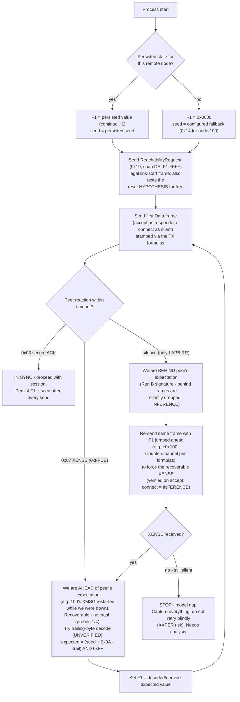

# XMSG sequence restart — analyst's answer (2026-07-03)

Answers to `XMSG-SEQUENCE-RESTART-QUESTION.md`. VERIFIED / INFERENCE / SPECULATION / DON'T KNOW
marked throughout. Evidence: the two-run log data in the question doc, the live probes 1–4
(problem statement of 2026-07-03), the full capture sweep (601 data + 602 ack frames,
`XMSG-CHANNEL-SEQUENCE-ANALYSIS-2026-07-03.md`), and the XMSG symbol tables / COSMOS manuals.

---

## Q1. What Flags1 must a restarted responder start at?

### The rule (INFERENCE, but it is the only model consistent with ALL runs)

**There is no formula from 100's connect Flags1.** 100 keeps a persistent per-node-pair
receive-sequence for us (`XSRSQ` in the per-remote-system XS block — the symbol table has exactly
one such field per system, VERIFIED) equal to **the count of Data frames we have sent it since
that state was last created/reset**. The required start value is simply the CONTINUATION of our
own previous sequence. Our F1 and 100's F1 are independent counters; any relationship between
them in a given run is coincidence of history.

This reconciles every observation, including the "two schemes that both worked":

| Run | 100's connect F1 | our accept F1 | why the result followed |
|---|---|---|---|
| echo run 1 | 0x0000 | 0x0000 | both pair-states fresh; expected-from-us = 0x0000. Echo worked because 0x0000 was correct, not because it echoed. |
| echo run 2 | 0x000A | 0x000A | traffic had been symmetric (handshakes send ~equal frame counts per side, ACKs don't consume F1), so expected-from-us happened to equal 100's own F1. Echo worked by coincidence. |
| Run A | 0x0001 | 0x0000 → SUCCESS | 100's state had seen one extra outgoing frame (its F1=1) but ZERO frames from us since its pair-state was created/reset → expected-from-us = 0x0000. |
| Run B | 0x0005 | 0x0000 → silence | Run A left our count at ~4 (accept, port-assign, DUMM, +…) and 100's pair-state survived our exit → expected-from-us ≈ 0x0004/0x0005. Our 0x0000 is a BEHIND-sequence (duplicate-range) datagram. |

Supporting detail (VERIFIED pattern from the live probes): **behind-sequence appears to be
silently dropped, ahead-sequence gets XENSE.** Run B (F1 behind) → pure silence, only LAPB RR.
Probes 1 and 4 (F1 jumped ahead) → subtype-0x07 XENSE rejects. This predicts your uninterrupted
Run B replay will show **no 0x07 at all** — silence is itself the "behind" symptom. (INFERENCE
from 3 data points; the replay will confirm or kill it.)

Sub-question answers:
1. 100's expected-from-102 does NOT reset per connect-to (Run B proves it), only when the pair
   state is torn down — 100's XMSG restart does it (VERIFIED: after the XXPER crashes/restarts,
   low sequences were accepted again); whether anything else does it, see "resync" below.
2. No — expected-from-us ≠ 100's own outgoing F1 (Run A: 0x0000 accepted while 100 was at
   0x0001). The echo runs matching was coincidental symmetry.
3. See "reading the expected value" below.
4. See Q2 — almost certainly not a stale session.
5. DON'T KNOW how a real ND survives its own reboot — but the capture record is suggestive:
   see the reachability-reset hypothesis.

### How to get back in sync — three options, in recommended order

**(a) Persist our F1 (RECOMMENDED as the baseline — guaranteed correct).** Store the outgoing
datagram sequence per remote node (a tiny JSON/state file), load on start, continue +1. This is
exactly what "XSRSQ persists on 100" implies a well-behaved peer does. Also persist the epoch
implicitly (it derives from F1). Caveat: if 100's XMSG restarts while we're down, 100 expects
0x0000 again and OUR persisted high value becomes ahead-of-sequence — but ahead gives a
recoverable XENSE (verified non-fatal, probes 1/4), from which we can resync (option c). So
persist + XENSE-recover covers every case without crash risk.

**(b) Reachability exchange as restart-indication (HYPOTHESIS — test before trusting).** In
every capture, F1=0x0000 streams appear ONLY immediately after a chan-DE, F1=0xFFFF
ReachabilityRequest/Reply exchange on that link, and BOTH directions start at 0 together
(`device-online-100-102-103.pcapng`; the fresh 103↔102 links in `li-rout-103-tree.pcapng`).
The COSMOS Operator Guide says link start implies a "restart-indication handshake". So receiving
a ReachabilityRequest may reset the pair state on 100.
**Decisive check you can do from the Run B log right now:** did our node send a
ReachabilityRequest at the start of Run B?
- If YES (we sent it, 100 replied, and 100's connect still arrived at F1=0x0005): the hypothesis
  is FALSIFIED — a reach exchange does not reset 100's pair state — use (a)+(c).
- If NO (we only ever *reply* to 100's requests): the hypothesis is live. Test: on process start,
  send ReachabilityRequest (subtype 0x19, chan DE, F1=0xFFFF, F2=0x0001) before anything else.
  Predicted observable if true: 100's next connect arrives with **F1=0x0000** (not a
  continuation), and our 0x0000 accept works — the device-online pattern exactly.

**(c) Resync via a deliberate, safe XENSE probe (VERIFIED non-fatal; the decode is a
HYPOTHESIS).** An accept with an ahead-jumped F1 produced a recoverable 0x07 XENSE in probe 4 —
100 did NOT crash. So a restarted node that gets silence for its 0x0000 accept can re-send the
accept with a far-ahead F1 to force a reject, then read the expected value from it.
Possible decode of the reject (UNVERIFIED, 2 data points): the reject's trailing byte may be the
pair's ack-counter state, i.e. `expected F1 = (seed + 0x0A − trailing) & 0xFF`
(probe 1 trailing 0x0B → expected 0x13; probe 4 trailing 0x0D → expected 0x11 — both plausible
mid-probing values but unconfirmable in hindsight). Whether or not that decode is right, the
uninterrupted replay (and one deliberate probe) will show what the reject carries. Note the
reject also ECHOES our offending F1 in its header (VERIFIED, probes 1/4), so diff-analysis of
two probes with different F1s isolates the expected-value field immediately.

### Recommended implementation

Persist per-remote-node F1 (option a). On start, additionally send a ReachabilityRequest
(harmless — it's already a legal link-start frame — and it tests option b for free). On XENSE
against our accept, run the resync probe logic (option c). On silence-timeout after an accept,
treat as behind-sequence and jump ahead to elicit the XENSE. That converges from ANY state
mismatch in ≤2 frames without crash risk.

As a flow (per remote node; applies identically to responder and client roles since they share
the link sequence):

---

## Q2. Stale session (TAD LU 768) vs sequence?

**Almost certainly sequence, not a stale session (INFERENCE, strong):**
- In Run B, 100 DID send a fresh connect (F1=0x0005) — its TAD client side was alive and willing.
  A blocked/stale LU would prevent or error the new connect-to on 100's side, presumably with a
  console message; instead 100 initiated normally and then ignored OUR accept datagram.
- The ignore happened at the XMSG datagram layer (no 0x03 ack, no 0x07), which is exactly the
  silent-drop signature of a behind-sequence/duplicate datagram — the TAD/session layer never saw
  the accept, so session state (stale or not) cannot be the discriminator.
- Run A's session death on our process exit and Run B's failure are explained by ONE cause
  (persistent XSRSQ) without needing a second mechanism.

DON'T KNOW whether 100 holds LU 768 allocated after the peer vanishes — worth checking on 100's
console after a dead run, and a proper disconnect-on-exit (DCON, XMCSM 0x00080000 class per the
captures) is correct hygiene regardless. But do not expect it to fix Run B.

---

## Q3. The seed byte's meaning

DON'T KNOW what it encodes. What the data supports:
- **Empirically stable per link, not per session:** 0x14 for 100↔102 across five captures
  (device-online, conn-to-d102, new-conn, test1, start-li-li) spanning different sessions and
  epochs — it never moved.
- The only structure observed: the relayed leg is **seed + 1** (102↔103: 0x11 direct / 0x12 via
  100), matching the relay's per-hop Counter re-stamp (+1). The reachability frames' F2 shows the
  same 1-vs-2 direct/relay split — consistent with a hop-count term inside the seed
  (SPECULATION beyond that).
- Not derivable from node numbers by any arithmetic I could make fit (100=0x64, 102=0x66,
  103=0x67 vs seeds 0x14/0x13/0x11). Could be a configured line/link index on the ND side —
  unverifiable without the XMSG generation listing.

Conclusion: learn-from-peer (`seed = (Counter + Flags1 + (Flags2 & 0xFF)) & 0xFF`) remains the
right implementation; treat the learned value as per-link-stable but re-learn on every received
frame cheaply as a consistency check.

---

## Q4. Sub-header frame-flags (0x86/0x92/0x96) and role (0x00/0x40/…) bytes

No rule established — keep mirroring per frame type. What the corpus shows:
- Role byte values cluster by function: 0xE4 asker-connect, 0xC4 XROUT request, 0x84/0x94 asker
  data, 0x60 XROUT response, 0x40 responder setup, 0x54 responder 0x0006-class, 0x00 responder
  data. Bit-pattern SPECULATION (do not rely on): 0x80 ≈ asker side, 0x40 ≈ setup/control,
  0x04 ≈ initiator-of-stream; the 0x10 bit (0x84 vs 0x94, 0x86 vs 0x96 in frame-flags) is
  unexplained — in the captures it flips within a session per opcode group (TMOD chain 0x84,
  ESCA/RECO 0x94; DUMM flags 0x92, MOTD 0x96).
- "Do they matter?" — the DUMM succeeding with copied 0x92 proves copying works; whether wrong
  values are tolerated is UNTESTED, and given the XXPER failure mode the live machine is the
  wrong place to fuzz them. Mirror the capture; revisit only if something rejects.

---

## Q5. Session port validation

**Run A itself is the answer: 100 accepted session port 0x0211** — it ACKed the port-assign,
allocated TAD LU 768, and sent TMOD/TTYP to that port. So 100 does not require the capture's
0x04C2; a well-formed `(logical<<7)|low7` of our choosing is accepted (VERIFIED for 0x0211).
Consistent with the error model (INFERENCE): XEIMA "invalid magic number" is raised by the
system that OWNS the port when an incoming frame's port doesn't match its table — for our
session port the owner is us; 100 merely echoes the value we assigned. Requirements are only
that we keep it constant for the session and answer on it.

---

## Client role ("connect-to d100"): how the same rules apply when WE initiate

The sequence/restart findings above carry over directly, because Flags1 is per DIRECTION per
node-pair, shared by every role (VERIFIED — `test1.pcapng` interleaves terminal, XROUT and a
connect on one Flags1 run). Implementation consequences for a 102 TAD client:

1. **One sequence, both roles.** The client's connect draws its Flags1 from the SAME per-link
   counter as any responder session, XROUT letter, or reachability-adjacent traffic our node
   sends to 100. The persisted-F1 state of Q1 option (a) is therefore per remote node, not per
   session or per role — the client and responder must both stamp frames via one shared
   link-level sequence object, never own counters.

2. **Seed bootstrap — the client-specific wrinkle.** As responder we learn the seed from 100's
   incoming connect before we ever need it. As CLIENT our first Data frame (the `*TADADM`
   connect) must already carry a seed-derived Counter, before 100 has sent us any Data frame —
   and the reachability frames (F1=0xFFFF, no sub-header Counter) do not carry it. So the client
   cannot learn-from-peer on first contact. Resolution, in order:
   - use the persisted seed from the state file (persist it alongside F1, per remote node);
   - else fall back to configuration (0x14 for the 100↔102 link, VERIFIED stable across five
     captures);
   - and in all cases re-learn/verify from every received Data frame
     (`seed = (Counter + Flags1 + (Flags2 & 0xFF)) & 0xFF`) and from 100's ACKs of our frames
     (`seed = (trailing + ourFlags1 − 0x0A) & 0xFF`), updating the persisted value on mismatch.
   Real ND machines clearly know the seed a priori (device-online cold-start frames carry
   correct Counters from frame one), which supports it being link configuration — but its
   origin remains DON'T KNOW.

3. **Restart symptoms as client.** A restarted client that opens with a behind-sequence connect
   (Flags1 reset to 0x0000 while 100's XSRSQ is advanced) will — per the behind=silent-drop model
   — see NOTHING: no 0x03 ack, no connect-accept, no console reaction on 100, exactly Run B's
   signature but with us initiating. Same remedies as Q1: persisted F1 first; on silence-timeout
   after the connect, re-send it with an ahead-jumped F1 to elicit the recoverable XENSE and
   resync. (Caution: the safe-ahead-probe was verified on an ACCEPT, probe 4; an ahead CONNECT
   is the same 0x0400 class and should behave the same, but that is INFERENCE — first live
   client test should watch for it.)

4. **Received-side derivation is unchanged.** 100's replies (accept role 0x40, port-assign,
   TMOD/TTYP) arrive on channels/Counters determined by 100's own state via the §1 formulas of
   the analysis doc; the client must derive, not expect fixed values, and must secure-ACK them
   with `trailing = ((seed + 0x0A) − theirFlags1) & 0xFF`, ack channel `0xDE − their epoch`.

5. **Disconnect hygiene doubles in importance.** As client we allocate a TAD LU on 100
   (Run A: LU 768). Send the DCON/teardown (0x0008-class, mirroring capture frame 51 of the
   via100 capture, 103→102 f51 DCON) on orderly exit so 100 releases the LU — regardless of the
   Q2 conclusion that stale LUs are not the sequence blocker.

The frame sequence, ports, roles and payloads for the client side are specified in section 7 of
`XMSG-CHANNEL-SEQUENCE-ANALYSIS-2026-07-03.md` (send plan table 7.1, port flow 7.2, mirrored
UNKNOWNs 7.3); this section adds only the sequence/seed/restart handling above.

---

## Suggested experiment protocol (operator + node, one sitting)

1. Start the runner; capture everything. Note whether it emits a ReachabilityRequest at startup.
2. On 100: `@connect-to d102`. Let the run play out UNINTERRUPTED ≥60 s past 100's LAPB RR.
   - 0x07 XENSE arrives → record its full bytes; test the trailing-byte decode
     (`expected = (0x1E − trailing) & 0xFF` for seed 0x14).
   - pure silence → behind-sequence silent-drop confirmed; proceed to 3.
3. Re-send the accept with F1 jumped ahead (e.g. +0x100, matching-per-formula Counter/channel —
   probe-4 shape, verified recoverable). Record the XENSE; decode expected F1; restart the
   handshake at that value.
4. If step 1 showed we do NOT send ReachabilityRequest: repeat the whole test once more with a
   startup ReachabilityRequest added, and check whether 100's connect F1 resets to 0x0000.
Result of steps 2–4 settles Q1 completely and validates or kills the reject-decode and
reachability-reset hypotheses.
