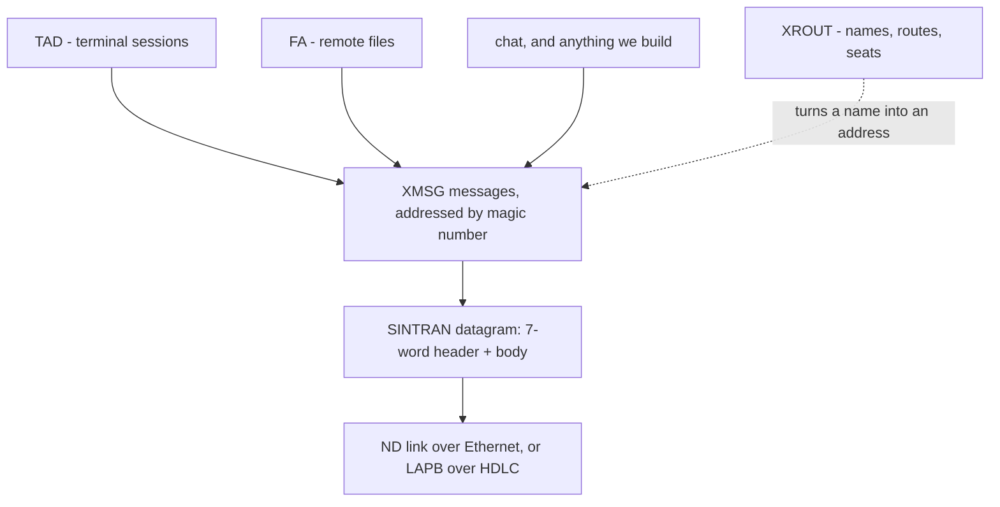

# The XMSG protocols

> **Generated by `generate.py` - do not edit.**

<!-- source-sha256: 31078c9c3ffcab2046a21422a2e6ec896ed0d79c4c9bf33a209123bcc18eb154 -->

Everything here rides on XMSG. A service is a task holding a **port**; a port is addressed by a **magic number**; and XROUT is the phone book that turns a registered *name* into one.

| Protocol | What it is | Registry |
|---|---|---|
| [The SINTRAN envelope](sintran-wire.md) | the envelope every message rides in - the 7-word header, the bitfields, the ND link underneath | [`sintran-wire.json`](sintran-wire.json) |
| [TAD - terminal sessions](tad-wire.md) | how a terminal on one machine reaches another: CONNECT-TO, the accept, then keystrokes and screen output | [`tad-wire.json`](tad-wire.json) |
| [FA - remote files, and the QFORM encoding](fa-qform.md) | open, read, write, create and list files on another machine - and the tag encoding its bodies use | [`fa-qform.json`](fa-qform.json) |
| [XROUT - names, routes and seats](xrout-services.md) | the phone book: it turns a registered name into an address, forwards the first letter, and counts the seats | [`xrout-services.json`](xrout-services.json) |

Every claim carries a status and an evidence pointer. **MEASURED** means somebody watched it happen and the evidence names where; *inferred* follows from something measured; **UNKNOWN** means we copy it and never compute it.
