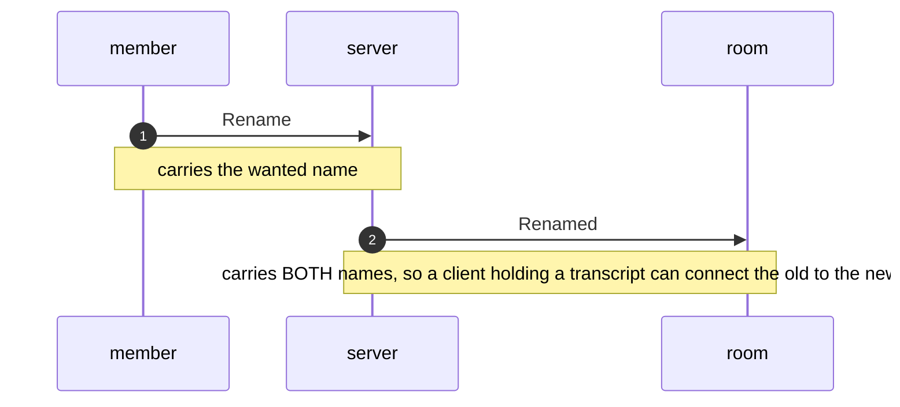

# CHAT - rooms, members and what they say

> **Generated from [`chat-wire.json`](chat-wire.json) - do not edit this file.** Run `python generate.py` after changing the registry.

<!-- source-sha256: c33ef154c7293304f73c55380970940a5075922fc7e5f0d62f39188912159bef -->

The one protocol in this folder that Norsk Data never shipped. It is written down for the same reason as the others: so the next change is made against a statement rather than a re-reading of the source. Federation (task 58) adds message kinds to it, and constraint 5 of that design says both ends move in the SAME commit - this file is where a new kind is declared before it is built.

**Where it sits:** A chat message is the BODY of a SINTRAN datagram (see sintran-wire.json). Nothing about the body is COSMOS; everything carrying it is.

| Status | Means |
|---|---|
| **MEASURED** | Observed on the wire or carved from the kernel, with the evidence named. |
| *inferred* | Follows from something measured, or read from the ND manuals, but not itself observed here. |
| **UNKNOWN** | We copy it, mirror it, or leave it alone. NOT safe to compute or vary. |
| ~~superseded~~ | A reading that was believed and is now disproved. Kept so it is not re-derived. |

### `message_prefix`

| Word | Byte | Field | What it is | Status | Evidence |
|---|---|---|---|---|---|
|  | 0 | `kind` | which message this is - see message_kinds | **MEASURED** | ChatMessageGoldenBytesTests pins the encoding both directions |
|  | 1 | `nickname_length` | how many ASCII bytes of nickname follow. Zero is legal and means the message carries no name. | **MEASURED** | ChatMessageGoldenBytesTests; a /who request carries kind 11 with an empty name field |

## Flows

Generated from the registry, so a ladder cannot name an operation that does not exist.

### A client joins a room and says something

The whole client path. Only the first step goes through XROUT; everything after it is port to port.

> **Proved:** two users at once on D100, 2026-08-18

```mermaid
sequenceDiagram
    autonumber
    participant client
    participant XROUT
    participant server
    client->>XROUT: Join
    Note over client,XROUT: the room is known by NAME, not address - this is the only chat message that is
    XROUT->>server: Join
    Note over XROUT,server: forwarding SPENDS one of the server's free connections
    server->>client: Welcome
    Note over server,client: sent to the address read OFF the arrived letter - the server is never told it separately
    client->>server: Say
    Note over client,server: direct, port to port; XROUT is out of the picture
    server->>client: Said
    Note over server,client: fanned out to every member of the room
    client->>server: Leave
    Note over client,server: or just terminate - SINTRAN clears the port either way
```

### A member changes nickname

A request, not a statement: the server can refuse it for the same reason it refuses a join.

> **Proved:** /nick on D100, 2026-08-19 - BJORN became OLAV and the name survived a restart via CHAT:CNFG



## Still open

| # | Question | Status | What would settle it |
|---|---|---|---|
| C1 | Does a trunk carry ONE room or ALL rooms? | **UNKNOWN** | phase B - bring one trunk up and see whether a per-room trunk buys anything a room field does not |
| C2 | How does a system-qualified name travel? | **UNKNOWN** | phase C, and it changes message_prefix - the golden-byte tests must move in the same commit |
| C3 | Where do origin system and hop count live? | **UNKNOWN** | phase D - three machines, one pair reachable only through the third, and a message that must arrive exactly once |
| C4 | What frees a remote member's seat when the machine holding half a room goes away? | **UNKNOWN** | stop a peer server mid-conversation and watch what the other side does |
