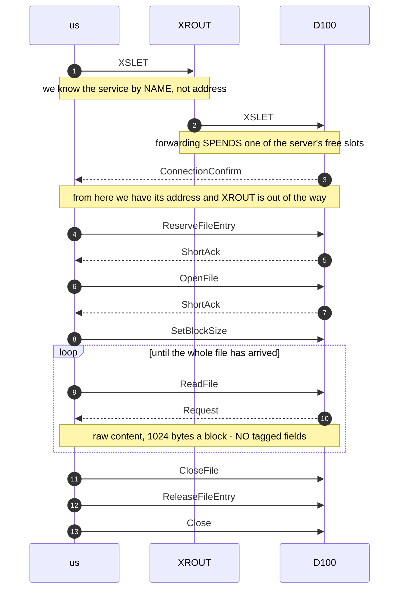

# FA - the COSMOS file-access service, and the QFORM encoding its bodies use

> **Generated from [`fa-qform.json`](fa-qform.json) - do not edit this file.** Run `python generate.py` after changing the registry.

<!-- source-sha256: b2af5bf46dc029b291322b9d9a7416a02d575d57d60c8b61a6b6488c3517cb11 -->

The protocol behind tasks 38, 23 and 33 - pull, create and the sync daemon. All three are proved against a real machine, so most of this is MEASURED; it is written down so the next change is made against a statement rather than a re-reading of the captures.

**Where it sits:** An FA message is the BODY of a SINTRAN datagram (see sintran-wire.json). Its first eight bytes are a fixed prefix; everything after is QFORM, EXCEPT a data message, which is raw content to the end.

| Status | Means |
|---|---|
| **MEASURED** | Observed on the wire, with the capture or live run named. |
| *inferred* | Follows from something measured, not itself observed. |
| **UNKNOWN** | Copied or mirrored. Never computed or varied. |
| ~~superseded~~ | Believed once, disproved. Kept so it is not re-derived. |

## The QFORM encoding

How FA writes its fields down. Each item is a tag byte saying what KIND of thing follows and how long it is, then the thing itself. A body reads as a list of pairs - a selector naming a field, then that field value - and a selector of 0x00FF marks the end.

| Rule | How | What it means | Status |
|---|---|---|---|
| `end_of_stream` | `bit 7 CLEAR` | the stream ends here | **MEASURED** |
| `class` | `(tag AND 0x70) >> 4` |  | **MEASURED** |
| `length` | `tag AND 0x0F` |  | **MEASURED** |
| `subtype` | `tag AND 0x17` |  | **MEASURED** |
| `length_escape` | `length nibble == 0` | the real length is the FOLLOWING byte | **MEASURED** |
| `escape_marker` | `0x80` | an escaped length byte of 0x80 is a MARKER, not a length - the length is the byte after it | **MEASURED** |

| Class | Name | What it holds | Status |
|---|---|---|---|
| 0 | `Constructed` | length-delimited, content itself tagged | **MEASURED** |
| 1 | `Integer` |  | **MEASURED** |
| 2 | `TypedInteger` | carries the SINTRAN error number in a rejection - 0x0030 = 48 = wrong password | **MEASURED** |
| 3 | `ByteString` |  | **MEASURED** |
| 4 | `Class4` |  | **UNKNOWN** |
| 5 | `Class5` |  | **UNKNOWN** |
| 6 | `Class6Unknown` |  | **UNKNOWN** |
| 7 | `Selector` | names the field whose value follows | **MEASURED** |

> **Trap: a flat walk descends into constructed values.** Reading a body as a flat run of tag/value pairs walks INTO a class-0 payload and reads its bytes as top-level tags.

> **Trap: SINTRAN pads a body to an even length.** The pad byte can look like the start of a field. On 2026-08-06 it was read as an escaped length, ran off the end and threw, and every listing request was refused until it was found.

### `message_prefix`

| Word | Byte | Field | What it is | Status | Evidence |
|---|---|---|---|---|---|
|  | 0 | `message_type` |  | **MEASURED** | every FA capture |
|  | 2 | `conversation` |  | **MEASURED** | every FA capture |
|  | 4 | `session_header` |  | **MEASURED** | every FA capture |

## Message types

| Name | Value | Status | Evidence |
|---|---|---|---|
| `Request` | `0x07F0` | **MEASURED** | every FA capture |
| `ShortAck` | `0x07A2` | **MEASURED** | captured from a REAL client, FA-OPERATIONS-2026-08-08 |
| `SessionFinished` | `0x0782` | **MEASURED** | the close ladder |
| `SessionFinishedAlternate` | `0x0781` | **MEASURED** | the close ladder |
| `ConnectionConfirm` | `0x07D2` | **MEASURED** | connect exchange |
| `Close` | `0x07C0` | **MEASURED** | the close ladder |

## Operations

| Name | Value | What it does | Status | Evidence |
|---|---|---|---|---|
| `FileEntryDisconnect` | `0x0001` | let go of a file slot | **MEASURED** | captured ladders |
| `ReserveFileEntry` | `0x0002` | claim one of the far machine file slots before doing anything with a file | **MEASURED** | proved live, task 23 |
| `ReleaseFileEntry` | `0x0003` | give that slot back when finished | **MEASURED** | proved live, task 23 |
| `ChangeFileEntryId` | `0x0004` | renumber a slot | *inferred* | named in the ND sources; never driven |
| `OpenFile` | `0x0005` | open a file by name, for reading or for writing | **MEASURED** | proved live, tasks 23 and 38 |
| `CloseFile` | `0x0006` | close it | **MEASURED** | proved live |
| `SetBlockSize` | `0x0007` | agree how big each chunk of data will be | **MEASURED** | proved live |
| `ReadFile` | `0x0008` | send me the contents | **MEASURED** | task 38 - 20400 bytes pulled off D100, SHA256 identical |
| `WriteFile` | `0x0009` | here are the contents to store | **MEASURED** | task 23 - 20400 bytes written to D100 |
| `CreateFile` | `0x000A` | make a new file with this name and this many pages | **MEASURED** | task 23 - created by quoted new name, confirmed by D100's own file server |
| `DeleteFile` | `0x000B` | delete a file | **MEASURED** | the request is pinned byte-for-byte against real ND-to-ND traffic - D102 deleting XFERTEST:DATA on D100, claude-delete-file-102-to-100-2026-07-29.pcapng - and FaDeleteFileCodec.BuildRequest reproduces it. NOT yet driven against a live server: what a real server ANSWERS is still uncaptured, because the two deletes D100 sent us in August were refused. |
| `SiiiSpecial` | `0x000C` | a SINTRAN-specific request | *inferred* | named in the ND sources |
| `DeviceFunction` | `0x000D` | operate on a device rather than a file | **UNKNOWN** | no operator command is known to drive it; blocked since 2026-08-09 |

## Status codes

> Returned in a rejection. These are SINTRAN error numbers and MUST match the real error table - a made-up value is worse than none.

| Name | Value | What it does | Status | Evidence |
|---|---|---|---|---|
| `Ok` | `0` | it worked | **MEASURED** | every successful exchange |
| `NoSuchFile` | `46` | no file of that name on that machine | **MEASURED** | SINTRAN error table; observed on a missing file |
| `WrongPassword` | `48` | the file is protected and the password did not match | **MEASURED** | observed as TypedInteger 0x0030 in a rejected open |
| `StoreError` | `97` | the machine could not write it - out of room, or the disc complained | *inferred* | SINTRAN error table |
| `NotSupported` | `129` | that machine does not offer this operation | *inferred* | SINTRAN error table |
| `EndOfDirectory` | `197` | no more files - the end of a listing, not a fault | **MEASURED** | ends every listing walk |
| `BadRequest` | `211` | the request did not make sense to the far end | *inferred* | SINTRAN error table |

## Moving the bytes

Block 1024 bytes, 2 blocks per read, a data message 1032 bytes.

> A data message is the eight-byte prefix then RAW content to the end - it carries no QFORM. It is recognised by its LENGTH and by a transfer being in progress, never by parsing it: walking it as tagged fields decodes file text as tags.

- **bodies must be WORD-ALIGNED** - an odd-length body is dropped in silence by the peer
- **the last message is marked AND counted** - the flag is used, but the byte count decides completion - a misread flag would otherwise hang a write forever

## Flows

Generated from the registry, so a ladder cannot name an operation that does not exist.

### Reading a file off a remote machine

The ladder task 38 drove against D100. Every step was answered by the real machine.

> **Proved:** task 38 - 20400 bytes pulled off D100, SHA256 identical to the original



> **A repeat is not a new event.** A retransmitted confirm must not rewind the session - treating one as a fresh step restarts the transfer.

> **Filter by session port.** Another conversation on the same node will otherwise be read as part of this one.

### Creating a file on a remote machine and writing to it

The ladder task 23 drove. The name is QUOTED, which is what makes it a create rather than an open of something existing.

> **Proved:** task 23 - 20400 bytes written to D100 under a quoted new name, the size confirmed by D100's own file server

```mermaid
sequenceDiagram
    autonumber
    participant us
    participant D100
    us->>D100: ReserveFileEntry
    D100-->>us: ShortAck
    us->>D100: CreateFile
    Note over us,D100: name in quotes, plus how many pages
    us->>D100: OpenFile
    Note over us,D100: now open the file we just made
    us->>D100: SetBlockSize
    loop one pass per block
        us->>D100: WriteFile
        us->>D100: Request
        Note over us,D100: the raw block; the LAST one is marked AND counted
        D100-->>us: ShortAck
    end
    us->>D100: CloseFile
    us->>D100: ReleaseFileEntry
    us->>D100: Close
```

> **Bodies must be WORD-ALIGNED.** An odd-length body is dropped in silence by the peer - no error comes back, the transfer simply stops.

> **Quotes are what create.** The quoting is kept on the wire; an unquoted name asks to open something that already exists.

## Still open

| # | Question | Status | What would settle it |
|---|---|---|---|
| B5 | Does DeleteFile work at all? |  | operations.values[DeleteFile] |
| F1 | What does the FA read-ladder bit MEAN? | **UNKNOWN** |  |
| F2 | QFORM classes 4, 5 and 6 | **UNKNOWN** |  |
| F3 | Why does a LIST-FILES against our FA server put D100 into a reconnect loop? | **UNKNOWN** | a capture where a real client reconnects to a real server - every archived FA capture holds a single session |
