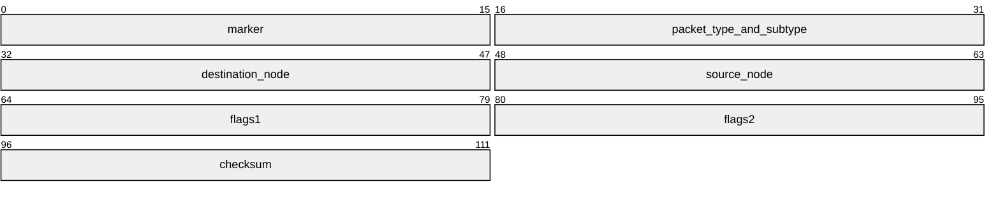

# SINTRAN XMSG wire layout - structures and bitfields

> **Generated from [`sintran-wire.json`](sintran-wire.json) - do not edit this file.** Run `python generate.py` after changing the registry.

<!-- source-sha256: 683b7d6ef8e5476fd2ab0c3d971ccc1de057d20b48771d6485d8c77cb43fc693 -->

The single machine-readable statement of what each field IS and how well we know it. Written because the same facts were being re-carved: word 6 was re-derived as a channel-and-counter model that had been superseded months earlier, while the compiler printed the obsolete warning on every build.

| Status | Means |
|---|---|
| **MEASURED** | Observed on the wire or carved from the kernel, with the evidence named. A field may only be MEASURED if evidence is filled in. |
| *inferred* | Follows from something measured, but not itself observed. Safe to implement, unsafe to cite as fact. |
| **UNKNOWN** | We copy it, mirror it, or leave it alone. NOT safe to compute or vary. |
| ~~superseded~~ | A reading that was believed and is now disproved. Kept so it is not re-derived. |

## Message formats

### `sintran_header`

14 bytes, 7 words, big-endian.

| Word | Byte | Field | What it is | Status | Evidence |
|---|---|---|---|---|---|
| 0 | 0 | `marker` | XDROU - NETWORK INFO (VERSION, PROTOCOL, HOP COUNT). NOT a marker. High byte = version/protocol: X5VRS = 20400 octal = 0x2100, left byte 0x21 = OP 0, VERSION 2, PROTOCOL 1. Low byte = HOP COUNT, which is why a relayed frame reads 0x12 against a direct 0x13 - one hop apart. | **MEASURED** | XMSG-POFTABS-L03.SYMB (the POF tables of the L03 kernel we drive); corroborated by every capture in DOC/captures |
| 1 | 2 | `packet_type_and_subtype` | XDTYP - DATAGRAM TYPE INFO (SD, ED, DC, CONTROL...). A BIT SET, not a type/subtype byte pair: XD5CO=0 control, XD5SD=1 start, XD5ED=2 end, XD5DC=3 confirm-delivery, XD5CE=5 checksum enabled (with SD), XD5CP=6 checksum provided (with ED). On a control datagram the bits are reused: XD5UT=1 outgoing, XD5BA=2 BAD STATUS (REJ/NAK), XD5IN=4 connection initialise. Our high/low byte split is a reading of those bits. | **MEASURED** | XMSG-POFTABS-L03.SYMB (the POF tables of the L03 kernel we drive); every capture for the observed values |
| 2 | 4 | `destination_node` |  | **MEASURED** | every capture; XMSG-POFTABS-L03.SYMB (the POF tables of the L03 kernel we drive) names it DESTINATION NETWORK ADDRESS |
| 3 | 6 | `source_node` |  | **MEASURED** | every capture; XMSG-POFTABS-L03.SYMB (the POF tables of the L03 kernel we drive) names it SOURCE NETWORK ADDRESS |
| 4 | 8 | `flags1` | XDREF - CONNECTION REFERENCE FIELD (MESS NO). A message number belonging to a CONNECTION, not a free-running link counter. Measured behaviour: one counter per (sender, peer), zeroed only at bring-up, never in use. | **MEASURED** | XMSG-POFTABS-L03.SYMB (the POF tables of the L03 kernel we drive) names it; THE FLAGS 1 LAW is the measured behaviour; PUSH-XENSE-2026-08-11 shows the refused number echoed in the error frame |
| 5 | 10 | `flags2` | XDSCR - SCRATCH (SIZE, DISPL, STATUS). Scratch space the layers reuse, which is why no single fixed meaning has ever fitted it. Observed as frame class, equal to XMCSM >> 16; on an error frame it is the negative error code instead. | **MEASURED** | XMSG-POFTABS-L03.SYMB (the POF tables of the L03 kernel we drive) names it; 601/601 data frames for the observed use |
| 6 | 12 | `checksum` | ones-complement checksum over the other six words. There is NO channel, NO epoch and NO per-link seed. | **MEASURED** | carved from the kernel at 137314; verified 3595/3595 frames, every subtype, no special cases. DOC/XMSG-HEADER-WORD6-IS-A-CHECKSUM-2026-07-31.md; XMSG-POFTABS-L03.SYMB (the POF tables of the L03 kernel we drive) calls it CHECKSUM (COMP'T OF ONES COMP'T ADD), independently the routine carved 2026-07-31 |

> **A superseded reading of `checksum`.** offset 12 is a Protocol-ID 'channel', offset 13 a sub-header 'Counter', with Channel = 0xDE - (XMCSM>>24) - epoch and Counter = (seed - Flags1) AND 0xFF
>
> *Why it survived:* the checksum is a deterministic function of the same header fields the old model used as inputs. Its per-link 'seed' was the contribution of the fields nobody varied, and its 'epoch' was carry propagation out of the low byte.
> *What it cost:* re-derived from scratch on 2026-08-17 and nearly published as a defect

### `nd_link_header`

11 bytes, big-endian.

| Word | Byte | Field | What it is | Status | Evidence |
|---|---|---|---|---|---|
|  | 0 | `header_length` | Always 0x0B = 11, which IS the length of this header, not a magic number. The sender computes it, so searching an ND binary for a literal 0B02 finds nothing. | **MEASURED** | every frame in every Ethernet capture; NdLinkHeader.Signature0 |
|  | 1 | `signature` | Always 0x02. Meaning unknown - it is used together with byte 0 only to recognise the header. | **MEASURED** | every frame in every Ethernet capture; NdLinkHeader.Signature1 |
|  | 2 | `frame_kind` | Which kind of link frame this is. See the nd_link_frame_kind bitfield. | **MEASURED** | DOC/captures/XMSG-DEGRADE-2026-08-24/segment.pcap - 1050 frames of a D100/D102 Ethernet segment, every frame the hub carried |
|  | 3 | `unused` | Zero on every frame we have ever captured, and our own parser skips it. Whether it carries anything on some frame we have not seen is NOT established. | **UNKNOWN** | 0x00 in all 1050 frames of DOC/captures/XMSG-DEGRADE-2026-08-24/segment.pcap - 1050 frames of a D100/D102 Ethernet segment, every frame the hub carried |
|  | 4 | `sequence` | Send sequence, ONE byte. Each direction runs its own. An Acknowledge carries the received sequence PLUS ONE - the next expected value. | **MEASURED** | DOC/captures/XMSG-DEGRADE-2026-08-24/segment.pcap - 1050 frames of a D100/D102 Ethernet segment, every frame the hub carried; observed stepping 0x43,0x44,0x45 in the 2026-08-03 both-ends capture |
|  | 5 | `destination_link_id` | The link reference of the machine this frame is FOR. Zero on a connection request, because the sender does not know the peer's reference yet. | **MEASURED** | Lined up across a full setup in DOC/captures/XMSG-DEGRADE-2026-08-24/segment.pcap - 1050 frames of a D100/D102 Ethernet segment, every frame the hub carried: D100's request carries 0000/0789, D102's confirm 0789/0A17, and D100's following data 0A17/0789 - only destination-then-source is consistent with all three. |
|  | 7 | `source_link_id` | The sender's own link reference. A node LEARNS the peer's from this field and takes its own from configuration - synthesising one from the node number would be a fabricated constant. The ids are per-session: 0x5062/0x59C1 in one capture, 0x2F48/0x28A4 in another. | **MEASURED** | same three-frame line-up as destination_link_id |
|  | 9 | `trailing_field` | NOT always a length. On Data it is the payload length. On a ConnectionRequest it is the SENDER'S OWN SYSTEM NUMBER (0x0066 = 102) with the real payload length zero. On a DisconnectRequestByNetworkService it is 0x0101, meaning unknown. The 802.3 length field is the authority on how many payload bytes are present. | **MEASURED** | both-ends capture 2026-08-03; confirmed again throughout DOC/captures/XMSG-DEGRADE-2026-08-24/segment.pcap - 1050 frames of a D100/D102 Ethernet segment, every frame the hub carried |

## Bitfields

### `xmsg_frame_flags`

sub-header byte 3, 8 bits.

**MIRROR THE CAPTURED COMBO for the frame type. Do NOT compose bit by bit - the per-bit rules below are not all known.**

| Bit | Mask | Name | What it means | Status | Evidence |
|---|---|---|---|---|---|
| 1 | `0x02` | `Marker01` | set on every observed frame | **UNKNOWN** | 601-frame sweep; always set, purpose never established |
| 2 | `0x04` | `Letter` | set on setup and on 0x96 terminal frames, clear on 0x92 and 0x82 | **UNKNOWN** | 601-frame sweep; the one bit whose rule is not known. NOTE: unrelated to an XROUT letter despite the name |
| 4 | `0x10` | `DataPhase` | established terminal-phase frames | *inferred* | 238 of 242 terminal-phase frames fit |
| 7 | `0x80` | `SystemMode` | XFSYS system-mode call | *inferred* | set on every observed frame |

Named combinations:

| Combination | Value | Bits | Status |
|---|---|---|---|
| `Setup` | `0x86` | `SystemMode`, `Marker01`, `Letter` | **MEASURED** |
| `ControlBare` | `0x82` | `SystemMode`, `Marker01` | **MEASURED** |
| `DataA` | `0x96` | `SystemMode`, `Marker01`, `Letter`, `DataPhase` | **MEASURED** |
| `DataB` | `0x92` | `SystemMode`, `Marker01`, `DataPhase` | **MEASURED** |

### `xmsg_send_options`

MON 200B T-register high byte; the ROLE byte on the wire, 16 bits.

| Bit | Mask | Name | What it means | Status | Evidence |
|---|---|---|---|---|---|
| 13 | `0x2000` | `XFHIP` / `XFRRO` **(one bit, two names)** | XFROU set -> bit 13 means RemoteRoute and the target XROUT's system number comes from the A register. XFROU clear -> bit 13 means HighPriority and the message is chained to the head of the receiver's queue. | **MEASURED** | COSMOS Programmer Guide appendix A section 3.2.11, the 'acts as' rule |

> **Trap.** ONE BIT, TWO NAMES. Test the disambiguator FIRST. Getting this wrong made a forwarded letter read as high priority - see XmsgKernel.ChooseType.

### `nd_link_frame_kind`

ND link header, kind byte, 8 bits.

**high nibble is the NPDU type; the low nibble is only partly understood**

| Value | Name | Status | Evidence |
|---|---|---|---|
| `0x0F` | `ConnectionRequest` | **MEASURED** | D100 sends it; captured many times |
| `0x20` | `Data` | **MEASURED** | every capture |
| `0x3F` | `Acknowledge` | **MEASURED** | every capture |
| `0x6F` | `DisconnectRequestByNetworkService` | **MEASURED** | D100 answers an unexpected connection request with it, 2026-08-11 and 2026-08-17 |
| `0x60` | `DisconnectRequest60` | **MEASURED** | leaving it unrecognised produced an endless run of 'unknown ND frame kind 0x60' in the runner log while the link stayed nominally up |
| `0x70` | `DisconnectConfirm` | *inferred* | three independent occurrences across DOC/captures/XMSG-DEGRADE-2026-08-24 (segment.pcap and after-fix.pcap), 2026-08-24 - every one immediately after a DisconnectRequest60, link ids swapped, trailing field 0 where the request carried 0x0001, no payload |

## Still open

| # | Question | Status | What would settle it |
|---|---|---|---|
| B3 | The TAD connect-accept trailing parameter pair | **UNKNOWN** | a third distinct value |
| B4 | The ethernet seam serves one peer only | *known gap* | not a question - it is work: one EthernetLink per peer |
