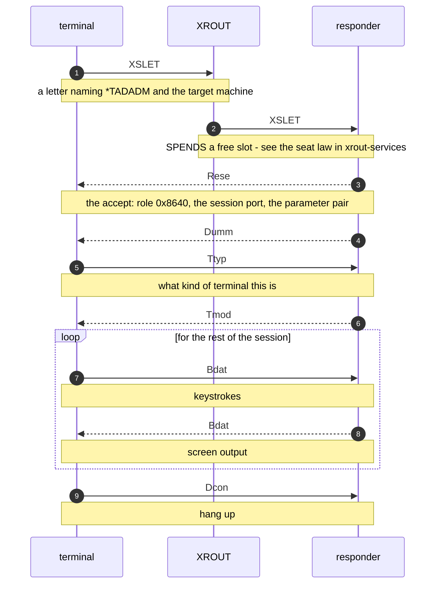

# TAD - the SINTRAN terminal-access protocol, as carried over XMSG

> **Generated from [`tad-wire.json`](tad-wire.json) - do not edit this file.** Run `python generate.py` after changing the registry.

<!-- source-sha256: f97bfa92321a264ed94c3e44618856caa41f611a0b3d9c85716e597eac15f6a5 -->

What a CONNECT-TO exchange actually contains, field by field, and how well each part is known. Written while #34 was blocked on the connect accept, so that the next attempt starts from what is settled instead of re-deriving it.

**Where it sits:** A TAD message rides in the BODY of a SINTRAN datagram. The 7-word header in front of it is described in sintran-wire.json and is NOT repeated here.

| Status | Means |
|---|---|
| **MEASURED** | Observed on the wire, with the capture named. |
| *inferred* | Follows from something measured, not itself observed. |
| **UNKNOWN** | Copied or mirrored. Never computed or varied. |
| ~~superseded~~ | Believed once, disproved. Kept so it is not re-derived. |

## Bitfields

### `tad_terminal_mode`

The single payload byte of a TMOD (0x0C) terminal-mode message, 8 bits.

**Bits 4-7 are not read by the version J receiver at all - do not invent meanings for them. This byte was undecoded here until 2026-08-18.**

| Bit | Mask | Name | What it means | Status | Evidence |
|---|---|---|---|---|---|
| 0 | `0x01` | `CapitalLettersOnly` | fold the line's input to capital letters (SINTRAN flag 5CAPITAL) | *inferred* | sender CTMOD in SINTRAN III version J NPL source, SINTRAN/NPL-SOURCE-2/NPL-CLEAN/06-COS-TAD-RES-CODE.NPL sets it from 5CAPITAL and receiver BDTMOD in SINTRAN III version J NPL source, SINTRAN/NPL-SOURCE-2/NPL-CLEAN/20-COS-TAD-POF-CODE.NPL reads it back into the same flag - both halves of the J driver agree. Proven for J; no L source read and this bit has not been seen set on our wire. |
| 1 | `0x02` | `CarriageReturnDelay` | the terminal needs filler time after a carriage return (SINTRAN flag 5CRDLY) | *inferred* | CTMOD in SINTRAN III version J NPL source, SINTRAN/NPL-SOURCE-2/NPL-CLEAN/06-COS-TAD-RES-CODE.NPL sets it from 5CRDLY; BDTMOD in SINTRAN III version J NPL source, SINTRAN/NPL-SOURCE-2/NPL-CLEAN/20-COS-TAD-POF-CODE.NPL reads it back. Proven for J; not yet seen set on our wire. |
| 2 | `0x04` | `StopOnFullPage` | pause output when the screen fills instead of scrolling on (the datafield's SCREEN counter) | *inferred* | CTMOD in SINTRAN III version J NPL source, SINTRAN/NPL-SOURCE-2/NPL-CLEAN/06-COS-TAD-RES-CODE.NPL sets it when SCREEN is non-zero; BDTMOD in SINTRAN III version J NPL source, SINTRAN/NPL-SOURCE-2/NPL-CLEAN/20-COS-TAD-POF-CODE.NPL sets SCREEN from it. Proven for J; not yet seen set on our wire. |
| 3 | `0x08` | `LogoutOnMissingCarrier` | log the user out when the line's carrier goes away (SINTRAN flag 5LBLOG) | **MEASURED** | CTMOD in SINTRAN III version J NPL source, SINTRAN/NPL-SOURCE-2/NPL-CLEAN/06-COS-TAD-RES-CODE.NPL sets it from 5LBLOG and BDTMOD in SINTRAN III version J NPL source, SINTRAN/NPL-SOURCE-2/NPL-CLEAN/20-COS-TAD-POF-CODE.NPL reads it back. This is the one bit we have on the wire: real clients send TMOD 0x08 in the terminal-setup burst, which under this decode reads as 'log me out if the carrier drops' - a sensible request from a remote terminal and an independent check on the decode. |

## Control services

> The XMCSM word. Its top byte feeds nothing on the wire directly, but the whole word appears in the body and identifies what kind of exchange this is.

| Name | Value | What it does | Status | Evidence |
|---|---|---|---|---|
| `XsletLetter` | `0x04000041` | XROUT connect letter / setup. Low byte 0x41 is the XROUT service code. | **MEASURED** | every captured connect and accept |
| `SessionSetup` | `0x04000000` | session setup control word | **MEASURED** | port-assign frames |
| `TerminalData` | `0x01080000` | terminal data phase | **MEASURED** | 601-frame sweep |
| `BareTadControl` | `0x00080000` | bare TAD control - ESCA, DCON, the 0xFD notify | **MEASURED** | control frames in ND-TO-ND captures |
| `SessionNotify` | `0x00060000` | tell the other side something about the session itself, rather than carrying data | *inferred* | named in the ND sources, via the summary on the enum member |
| `XsgsyRequest` | `0x0100014B` | ask another machine what it knows about a system | **MEASURED** | answered live by D100 |
| `XsgsyReply` | `0x01000100` | the answer to that question | **MEASURED** | answered live by D100 |

## Operations

> TAD opcodes carried in the message body. Names from the ND sources; values confirmed on the wire where an evidence pointer is given. The twelve ops added on 2026-08-18 (USCN, ISRQ, ISRS, NOWT, TNOW, NWRE, RLOC, EDRS, TREP, CPCO, ERRS, REJE) come from the version J TAD driver source. Their VALUES are measured - identical in the J, K03, L07 and M06 symbol tables - and their ROLES are proven for J, but none of them has been seen on our own wire yet, so they are carried as INFERRED for the Release L machines we drive.

| Name | Value | What it does | Status | Evidence |
|---|---|---|---|---|
| `Bdat` | `0x01` | here is some text - the characters going to or from the screen. The workhorse: almost all terminal traffic is this | **MEASURED** | 601-frame sweep |
| `Rfi` | `0x02` | your turn to type - the far end is waiting for input | **MEASURED** | login exchanges |
| `Eckm` | `0x03` | decide who echoes what you type - the terminal itself, or the machine at the far end | *inferred* | name from ND sources; seen in the login ladder |
| `Bmmx` | `0x04` | BREAK parameters: a break-strategy byte, a 16-bit BRKMAX word, and for strategy 7 a 16-byte break table. It decides WHICH characters break the input and how many may pile up first - it is NOT the largest block the far end will accept, which is what this entry used to say | **MEASURED** | BDBREA in SINTRAN III version J NPL source, SINTRAN/NPL-SOURCE-2/NPL-CLEAN/20-COS-TAD-POF-CODE.NPL - message type 7BMMX, strategy clamped to 7, I-field 0o3 bytes normally and 0o23 (19 decimal) for strategy 7 = 1 + 2 + 16. Refutes the earlier INFERRED reading 'the largest block the far end will accept in one go'. Our captures only ever carry 00 04 03 strategy hi lo, which fits the source layout and not the old one. value identical in all four symbol tables under SINTRAN/NPL-SOURCE/SYMBOLS (J, K03, L07, M06), re-checked by hand 2026-08-18 |
| `Esca` | `0x08` | the user pressed the escape key - break out of whatever is running | **MEASURED** | bare-TAD control frames |
| `Dcon` | `0x09` | end the session and hang up | **MEASURED** | the disconnect ladder, ND-TO-ND-2026-08-08 |
| `Tmod` | `0x0C` | how the terminal should behave - a line at a time or a character at a time, and similar settings | **MEASURED** | 100 sends it after CONNECTION ESTABLISHED |
| `Ttyp` | `0x0D` | what kind of terminal this is, so the far end knows what it can draw | **MEASURED** | same exchange |
| `Cesc` | `0x0E` | enable (payload 1) or disable (payload 0) the escape function for this session. Choosing WHICH key means escape is DESC (0x0F) - this entry used to describe DESC | **MEASURED** | BCESC in SINTRAN III version J NPL source, SINTRAN/NPL-SOURCE-2/NPL-CLEAN/06-COS-TAD-RES-CODE.NPL builds the payload as 'IF DFOPP.DFLAG BIT 5IESC THEN A:=0 ELSE A:=1' - 5IESC is inhibit-escape, so 1 = enabled and 0 = disabled. A responder with escape inhibited answers ESCA with EDRS rather than ESRS (ESCDIS in SINTRAN III version J NPL source, SINTRAN/NPL-SOURCE-2/NPL-CLEAN/20-COS-TAD-POF-CODE.NPL). The CescState enum was already right; the observed 0->1 step during login is escape being turned off while credentials are typed and back on afterwards. value identical in all four symbol tables under SINTRAN/NPL-SOURCE/SYMBOLS (J, K03, L07, M06), re-checked by hand 2026-08-18 |
| `Desc` | `0x0F` | define what the escape key does | *inferred* | name from ND sources |
| `Sycn` | `0x13` | the SYSTEM CONTROL word - one 16-bit payload word on a general control channel. Its user-control twin is USCN (0x14). The login values we see stepping through a connect are one USE of the channel, not its definition; 'get back in step', which this entry used to say, is wrong | **MEASURED** | CTOBAD in SINTRAN III version J NPL source, SINTRAN/NPL-SOURCE-2/NPL-CLEAN/06-COS-TAD-RES-CODE.NPL sends 7SYCN for output-ioset control code 23 (octal) and 7USCN for 24, one word by WORDPUT in both cases, flushing immediately only for parameter values 1, 13 and 17 (octal). The observed login values 0x0002/0x0003/0x0006/0x000A stay MEASURED from conn-to-d102 frames 62/64/68/70 - see SycnState - but what writes them is above the driver and not in this source. value identical in all four symbol tables under SINTRAN/NPL-SOURCE/SYMBOLS (J, K03, L07, M06), re-checked by hand 2026-08-18 |
| `Rese` | `0x16` | start clean. Sent twice while a session is being set up, which is why it appears in the accept ladder | **MEASURED** | port-assign ladder |
| `Reco` | `0x17` | reset confirm - the answer to a RESE. Not 'pick up a session again after it was interrupted', which this entry used to say | **MEASURED** | the driver's own prebuilt head is named RESCF with the comment 'RESET-CONF MESSAGE' in SINTRAN III version J NPL source, SINTRAN/NPL-SOURCE-2/NPL-CLEAN/20-COS-TAD-POF-CODE.NPL, and an incoming RECO is treated only as the awaited confirmation of a sent RESE (the CHRESO/RSPNUM arm there, and the RESE send in SINTRAN III version J NPL source, SINTRAN/NPL-SOURCE-2/NPL-CLEAN/06-COS-TAD-RES-CODE.NPL). Also matches the bring-up ladder we drive live. value identical in all four symbol tables under SINTRAN/NPL-SOURCE/SYMBOLS (J, K03, L07, M06), re-checked by hand 2026-08-18 |
| `Dumm` | `0x18` | a placeholder that carries nothing. Real machines send one during setup, so we do too | **MEASURED** | port-assign ladder |
| `Opsv` | `0x001F` | OPSV - OS / protocol version handshake (0x1F) | *inferred* | named in the ND sources, via the summary on the enum member |
| `Cers` | `0x0021` | CERS - escape / CESC response (0x21). Asker-sent after each host burst / CESC change | *inferred* | named in the ND sources, via the summary on the enum member |
| `Esrs` | `0x20` | the host answering the terminal ESCA - sent with Rese as the pair that lets the login prompt follow | **MEASURED** | conn-to-d102-from-100.pcapng frame 603, server side; and 7ESRS=000040 octal in SINTRAN/NPL-SOURCE/SYMBOLS/K03. Its disabled-escape twin EDRS (0x29) is built from the prebuilt head EDRSP in SINTRAN III version J NPL source, SINTRAN/NPL-SOURCE-2/NPL-CLEAN/20-COS-TAD-POF-CODE.NPL |
| `Lun` | `0x0B` | the TAD logical-unit index in the port assignment; the unit the user sees is 768 + this value | **MEASURED** | 7LUN=000013 octal in SINTRAN/NPL-SOURCE/SYMBOLS. LU=768+value confirmed live 2026-08-17 (index 0x02 printed "TAD LOGICAL UNIT NO: 770"). FIVE index values observed across captures - 0x00 conn-to-102-from103-via100, 0x01 ethernet-conn-to-D100-from-102-WORKING, 0x02 new-conn, 0x03 ALLTEST-fa-connectto, 0x04 conn-to-d102-from-100. D102 is the server in BOTH the 0x00 and the 0x04 capture, so the index is free-slot state on the serving machine: not constant, not per-machine, not derivable from the session ordinal. The earlier claim that 0x00 was never observed is REFUTED. We allocate per session and only guarantee uniqueness |
| `Fbsi` | `0x15` | field/buffer size tag in the port assignment; we emit the two-byte value 01 08 copied from a real capture | *inferred* | 7FBSI=000025 octal in SINTRAN/NPL-SOURCE/SYMBOLS/K03 names the TAG. What its two bytes MEAN is not established - treat 01 08 as an observed constant, not a decoded field |
| `Mod8` | `0x2C` | 8-bit mode negotiation for the terminal line; we neither send nor handle it | *inferred* | 78MOD=000054 / 7UMOD=000053 octal in SINTRAN/NPL-SOURCE/SYMBOLS/L07 and M06. ABSENT from K03 - these two arrived after Release K. Not implemented here; recorded so the value is not re-carved |
| `Umod` | `0x2B` | a mode message that appears alongside 78MOD from Release L onwards; meaning not established | *inferred* | 78MOD=000054 / 7UMOD=000053 octal in SINTRAN/NPL-SOURCE/SYMBOLS/L07 and M06. ABSENT from K03 - these two arrived after Release K. Not implemented here; recorded so the value is not re-carved |
| `Uscn` | `0x14` | the USER CONTROL word - one 16-bit payload word; the sender then waits for an ERRS response | *inferred* | CTOBAD in SINTRAN III version J NPL source, SINTRAN/NPL-SOURCE-2/NPL-CLEAN/06-COS-TAD-RES-CODE.NPL builds 7USCN for output-ioset control code 24 (octal), stores 7ERRS as the awaited response and suspends the caller. Twin of SYCN. value identical in all four symbol tables under SINTRAN/NPL-SOURCE/SYMBOLS (J, K03, L07, M06), re-checked by hand 2026-08-18 |
| `Isrq` | `0x22` | remote ISIZE request - empty I-field. Asks the far end how many input characters are waiting | *inferred* | BISIZ/OISIZ in SINTRAN III version J NPL source, SINTRAN/NPL-SOURCE-2/NPL-CLEAN/06-COS-TAD-RES-CODE.NPL send it with a requested I-field size of zero when a program calls ISIZE (MON 66) or IBRSIZ (MON 313) and the local input buffer is empty, then suspend the caller. value identical in all four symbol tables under SINTRAN/NPL-SOURCE/SYMBOLS (J, K03, L07, M06), re-checked by hand 2026-08-18 |
| `Isrs` | `0x23` | remote ISIZE response - two data bytes, big-endian character count | *inferred* | prebuilt head ISZRS := (7ISRS\2) in SINTRAN III version J NPL source, SINTRAN/NPL-SOURCE-2/NPL-CLEAN/20-COS-TAD-POF-CODE.NPL; the driver reads the count as byte6*256 + byte7 and returns it to the suspended caller. value identical in all four symbol tables under SINTRAN/NPL-SOURCE/SYMBOLS (J, K03, L07, M06), re-checked by hand 2026-08-18 |
| `Nowt` | `0x24` | nowait status - one status byte; the variant chosen when the entry status is zero | *inferred* | NWSTA in SINTRAN III version J NPL source, SINTRAN/NPL-SOURCE-2/NPL-CLEAN/20-COS-TAD-POF-CODE.NPL: 'IF A=0 THEN A:=7NOWT ELSE A:=7TNOW FI', then one byte by STORBYT. value identical in all four symbol tables under SINTRAN/NPL-SOURCE/SYMBOLS (J, K03, L07, M06), re-checked by hand 2026-08-18 |
| `Tnow` | `0x25` | nowait status - one status byte; the variant chosen when the entry status is non-zero | *inferred* | NWSTA in SINTRAN III version J NPL source, SINTRAN/NPL-SOURCE-2/NPL-CLEAN/20-COS-TAD-POF-CODE.NPL, the other arm of the same test as NOWT. value identical in all four symbol tables under SINTRAN/NPL-SOURCE/SYMBOLS (J, K03, L07, M06), re-checked by hand 2026-08-18 |
| `Nwre` | `0x26` | nowait restart - high priority, empty. The receiver bounces it straight back and then restarts its suspended user program | *inferred* | prebuilt head NWREM := (7NWRE\0) in SINTRAN III version J NPL source, SINTRAN/NPL-SOURCE-2/NPL-CLEAN/20-COS-TAD-POF-CODE.NPL; the BDRINP high-priority arm sends the message back with XFSND before going to DATRES. value identical in all four symbol tables under SINTRAN/NPL-SOURCE/SYMBOLS (J, K03, L07, M06), re-checked by hand 2026-08-18 |
| `Rloc` | `0x27` | remote local / rubout for NORD-NET - high priority, empty. Handled in the same branch as ESCA | *inferred* | prebuilt head RLOCA := (7RLOC\0) with the comment 'REMOTE LOCAL (RUBOUT NORD-NET)' in SINTRAN III version J NPL source, SINTRAN/NPL-SOURCE-2/NPL-CLEAN/20-COS-TAD-POF-CODE.NPL; ESCDIS delivers the configured local character when the 5LCHAR flag is set and 0o177 otherwise. value identical in all four symbol tables under SINTRAN/NPL-SOURCE/SYMBOLS (J, K03, L07, M06), re-checked by hand 2026-08-18 |
| `Edrs` | `0x29` | escape response sent when the escape function is DISABLED - high priority, empty. This is the answer to ESCA or RLOC that a responder with escape inhibited sends INSTEAD of ESRS | *inferred* | prebuilt buffer EDRSP := (7EDRS\0,0,2) with the comment 'ESCAPE RESPONSE ESCAPE DISABLED BUFFER' in SINTRAN III version J NPL source, SINTRAN/NPL-SOURCE-2/NPL-CLEAN/20-COS-TAD-POF-CODE.NPL; ESCDIS sends it and runs no escape handling at all in that case. value identical in all four symbol tables under SINTRAN/NPL-SOURCE/SYMBOLS (J, K03, L07, M06), re-checked by hand 2026-08-18 |
| `Trep` | `0x2A` | terminal report status - two data bytes, big-endian. Bit 2 buffer overrun, bit 3 parity error, bit 4 framing error | *inferred* | prebuilt head TREPS := (7TREP\2) in SINTRAN III version J NPL source, SINTRAN/NPL-SOURCE-2/NPL-CLEAN/20-COS-TAD-POF-CODE.NPL; the receiver bounces the message back and folds bits 2/3/4 into its own TINFO word as 5BFUL/5PAER/5FRER. value identical in all four symbol tables under SINTRAN/NPL-SOURCE/SYMBOLS (J, K03, L07, M06), re-checked by hand 2026-08-18 |
| `Cpco` | `0xFA` | completion code - four data bytes, two 16-bit words | *inferred* | SNDCP in SINTRAN III version J NPL source, SINTRAN/NPL-SOURCE-2/NPL-CLEAN/20-COS-TAD-POF-CODE.NPL creates the header with the even-start builder and stores two words with whole-word stores, advancing the byte pointer by 4. value identical in all four symbol tables under SINTRAN/NPL-SOURCE/SYMBOLS (J, K03, L07, M06), re-checked by hand 2026-08-18 |
| `Errs` | `0xFB` | error response - two data bytes, big-endian; the answer to USCN | *inferred* | prebuilt head ERRSP := (7ERRS\2) in SINTRAN III version J NPL source, SINTRAN/NPL-SOURCE-2/NPL-CLEAN/20-COS-TAD-POF-CODE.NPL; read big-endian from head bytes 6-7 like ISRS, and it releases the caller CTOBAD suspended after a USCN. value identical in all four symbol tables under SINTRAN/NPL-SOURCE/SYMBOLS (J, K03, L07, M06), re-checked by hand 2026-08-18 |
| `Reje` | `0xFE` | reject - one data byte, the type of the message being rejected. Three bytes on the wire: FE 01 type | *inferred* | REJECT in SINTRAN III version J NPL source, SINTRAN/NPL-SOURCE-2/NPL-CLEAN/20-COS-TAD-POF-CODE.NPL writes 7REJE, a count of 1, then CURMES AND 0xFF. Sent for a normal-priority type the driver does not accept, for a message claiming more bytes than the buffer holds, and for an unrecognised high-priority head; SNDREJ appends an RFI when the rejected message was data. The asking program sees SINTRAN error TER01 (0o315). value identical in all four symbol tables under SINTRAN/NPL-SOURCE/SYMBOLS (J, K03, L07, M06), re-checked by hand 2026-08-18 |

## Driver error codes

> SINTRAN error numbers the TAD driver hands back to a program on its own machine. These never travel on the wire - a live experiment reporting one of them is telling you about the far side's driver state, not about the frame you sent.

| Name | Value | What it does | Status | Evidence |
|---|---|---|---|---|
| `TER00` | `0xCC` | input completed while a delayed escape action was still pending | *inferred* | IEDCHK in SINTRAN III version J NPL source, SINTRAN/NPL-SOURCE-2/NPL-CLEAN/06-COS-TAD-RES-CODE.NPL; TER00=000314 in the J symbol table. Proven for J, never observed by us. |
| `TER01` | `0xCD` | the message was rejected - the driver sent a REJE and failed its caller with this | *inferred* | set right after CALL SNDREJ in SINTRAN III version J NPL source, SINTRAN/NPL-SOURCE-2/NPL-CLEAN/06-COS-TAD-RES-CODE.NPL and reached through the SRJE path in CTRMES in SINTRAN III version J NPL source, SINTRAN/NPL-SOURCE-2/NPL-CLEAN/20-COS-TAD-POF-CODE.NPL; TER01=000315 in the J symbol table. This is the number to look for when a remote program complains and we suspect we sent an opcode the far driver does not accept. |
| `TER02` | `0xCE` | the TAD is not connected - its port number is zero | *inferred* | the PORTNO=0 guards in SINTRAN III version J NPL source, SINTRAN/NPL-SOURCE-2/NPL-CLEAN/20-COS-TAD-POF-CODE.NPL; TER02=000316 in the J symbol table. |
| `XKXXX` | `0x4200` | the base a negated XMSG error code is OR-ed onto to make a SINTRAN error number | **MEASURED** | CNVERR in SINTRAN III version J NPL source, SINTRAN/NPL-SOURCE-2/NPL-CLEAN/20-COS-TAD-POF-CODE.NPL is one instruction pair: negate the negative XMSG code and OR with XKXXX, so XENSE (-34 decimal = -0o42) surfaces as 0o41042. XKXXX=041000 in the J and K03 symbol tables, and the same 16896 already carried in xmsg-constants.json. |

## Exchanges

### connect

What happens when somebody types CONNECT-TO. Their machine asks XROUT to carry a letter to the service called *TADADM on the machine they named; that service answers with an accept, and from then on the two sides exchange keystrokes and screen output directly.

**request** (asker -> responder)

| Field | Value | What it is | Status | Evidence |
|---|---|---|---|---|
| `role` | `0x86E4` | who is speaking and in what phase. The high byte says this is session SETUP; the low byte says this side is the one ASKING to connect | **MEASURED** | D100 -> 19999 on 2026-08-17; identical shape in ARCHIVE-2026-07 captures |
| `service_name` | `*TADADM` |  | **MEASURED** | 2A 54 41 44 41 44 4D on the wire |
| `target_system` |  |  | **MEASURED** | FE 06 44 31 39 39 39 39 |

**accept** (responder -> asker)

| Field | Value | What it is | Status | Evidence |
|---|---|---|---|---|
| `role` | `0x8640` | the same two halves as the request: still session setup, but the low byte now says this side is ANSWERING | **MEASURED** | every real accept in ARCHIVE-2026-07 |
| `asker_node` |  | the machine that asked, copied back so it can recognise its own answer | **MEASURED** | same captures |
| `responder_node` |  | the machine that answered - us | **MEASURED** | same captures |
| `session_port` |  | the address the answering side will listen on for the rest of this session. Everything after the accept goes there | **UNKNOWN** | we emit a constant; a real responder's value differs and its rule has not been established. An earlier note offered (freeSlot<<7)\|incarnation, which fits 0x0215 but has never been confirmed |
| `control_service` | `0x04000041` |  | **MEASURED** | identical in ours and every real accept |
| `parameter_trailer` |  |  | **UNKNOWN** | census of 9 archived connect captures, 2026-08-17. We emit 0/10 unconditionally |

## Sequencing rules

### `responder_flags1`

****MEASURED**** The responder runs its OWN datagram sequence. It advances by one per NEW connect and does NOT reset per connect.

*Evidence:* li-syst-tad-103: D100 answers successive connects at 0x000b then 0x000c; D102 at 0x0002 then 0x0003

**retransmissions.** A repeated connect - identical bytes - is answered with the SAME Flags1. Only a genuinely new connect advances it. **MEASURED**

*Evidence:* the same captures show three identical accepts per connect, all at one Flags1

**persistence.** Our store advances on the peer's ACK, not on send. Persisting on send over-counts frames the peer never received and leaves the saved value ahead, which the peer then refuses with XENSE. *inferred*

*Evidence:* reasoned from the XENSE rejections in PUSH-XENSE-2026-08-11; the alternative was tried and produced them

## Flows

Generated from the registry, so a ladder cannot name an operation that does not exist.

### Somebody types CONNECT-TO

How a terminal session on one machine reaches another. The asker knows only a NAME, so XROUT carries the first letter and then steps aside.

> **Proved:** the asking side is captured many times in ARCHIVE-2026-07; OUR side answering is not yet accepted by D100 - see the open questions

> **The responder runs its OWN sequence.** It does not echo the asker's. It advances per NEW connect and answers a retransmission at the same number.

> **Everything after the accept goes to the SESSION PORT.** Not to the address the letter arrived on.

## Still open

| # | Question | Status | What would settle it |
|---|---|---|---|
| B3 | the accept parameter trailer |  | exchanges.connect.accept.body_fields[parameter_trailer] |
| T1 | the session-port rule |  | exchanges.connect.accept.body_fields[session_port] |
| T2 | does a Release L machine still SEND reject (REJE), the escape-disabled response (EDRS) and terminal-report (TREP)? The constants are in the L07 and M06 symbol tables and the version J driver plainly uses all three, but we have never captured one. A capture would settle it. |  | operations.values[Reje] |
| T3 | what the SYCN payload values 0x0002/0x0003/0x0006/0x000A actually encode. The J driver shows the channel and the one-word payload, not the codes - whatever writes them sits above the driver and is not in that listing. |  | operations.values[Sycn] |
| T4 | the FBSI (0x15) payload 01 08. The J driver's buffers are NOBUFF buffers of FBSIZ bytes each, so the pair COULD be that, or FBSIZ = 0x0108 = 264, or neither. TADADM, which builds the trailer, is on segment SG36 and is not in the source. Speculation only. |  | operations.values[Fbsi] |
| T5 | the names of the raw session-setup opcodes 0x06 and 0x07. 7CORQ=000006 and 7CORS=000007 ('connect request / connect response') sit at exactly those values in the J symbol table, with 7CONF=000005 beside them - but the 7-prefix symbol space carries several unrelated families with overlapping small values, so this is a VALUE MATCH ONLY and they stay raw in the code until captured semantics confirm it. Same for 0xFD, where 7POLL=000375 matches the notify byte our teardown sends. |  | exchanges.connect |
