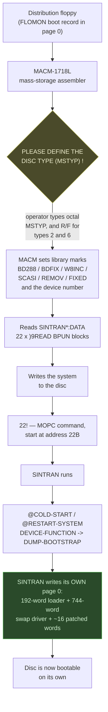
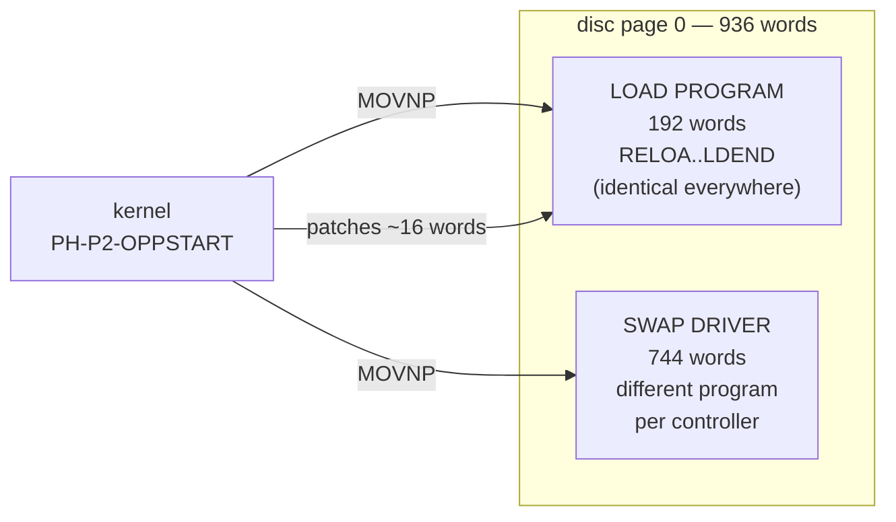
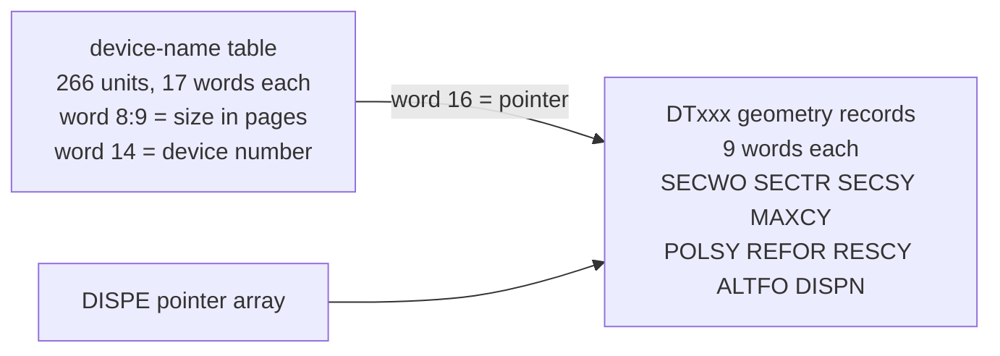
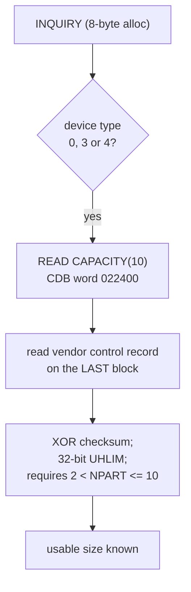
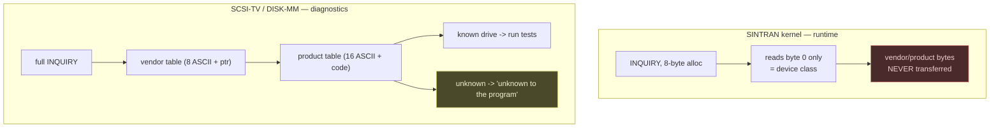

# `boot-floppy/` — ND distribution diskettes, disc boot sectors and SINTRAN generation

Companion to [`../sintran-segment-carver/`](../sintran-segment-carver/).

The carver works from an **installed, running** SINTRAN on a hard disk. This
folder works from the **original ND distribution floppies** — the same systems
*as shipped*, before installation, generation and site patching — and from the
**page 0 of real installed packs**.

Those are independent witnesses to the same system, and where they disagree,
the disagreement is itself information.

Everything below was established from the media and the binaries. Claims are
marked **[VERIFIED]** (read directly out of a file, cited) or **[INFERRED]**
(derived, reasoning shown) in the detail documents. Nothing here is taken from
a manual unless it says so.

---

## The one-paragraph version

A SINTRAN system is not *copied* onto a disc, it is **generated** onto it. You
boot a distribution floppy, which loads **MACM** (a mass-storage assembler).
MACM asks you one question that matters — **which disc type (MSTYP)** — then
reads the shipped system out of a `SINTRAN*:DATA` stream and writes it to the
disc. The disc's **boot sector is not shipped and MACM never writes it**;
SINTRAN writes its own boot page later, every time it cold-starts, filling in
the device number and geometry for the disc it finds itself on.

---

## How a system actually gets onto a disc



The green box is the finding that reframes everything else: **the disc boot
sector is authored by the running kernel, not by the installer.**

---

## What is on a distribution set

Every set follows the same shape:

| diskette | contents |
|---|---|
| `-01D` / `-I` | `MACM-*:BPUN` (the mass-storage assembler) + `SINTRAN*-1:DATA` |
| `-02D` / `-II` | `SINTRAN*-2:DATA` (continuation) |
| `-03D` / `-III` | assemblers (`F32-FMAC`, `F48-FMAC`, `DMAC`) + symbol tables |

`SINTRAN-x:DATA` is **not source code**. It is the compiled system in loadable
form wrapped in a MACM installation script:

- ~34 `NAME=page` layout parameters giving each system area's SEGFIL page
- 35 `)MCDEF` patch macros — each body is a single `)9BYTT` that re-points
  MACM at one system area so a field engineer can patch it
- 22 `)9READ` commands pulling in the system as BPUN octal blocks
- start commands (`22!`, `115123!`, `160616!`)

**There is no install script on any system diskette.** No `:MODE`, no README.
The procedure lives in MACM's own prompts. The only command scripts in the
whole collection are on the K *patch* floppy.

---

## The five things learned, in plain terms

### 1. The disc boot sector is written by SINTRAN, not by the installer

At every `@COLD-START` / `@RESTART-SYSTEM`, the kernel reads page 0, copies a
fixed **192-word LOAD PROGRAM** and a **744-word swap driver** into it, patches
about **16 parameter words**, and writes page 0 back.



The proof is a diff, not an argument: the **unpatched** loader was pulled out
of the distribution stream (BPUN record #1, load address `062417B` = symbol
`RELOA`) and compared word-by-word against a **real installed SMD pack**.
**176 of 192 words are identical**, and every one of the 16 differences is a
patched parameter — e.g. `164004` (`IOX 4`, the literal source value) becomes
`165544` (`IOX 1544` = controller base `1540` + 4).

The patched words:

| word | meaning |
|---|---|
| `KLHDE` | controller base (HDEV) — `1540` SMD, `500` Winchester, `144300` SCSI |
| `KLIOX` | a literal `IOX (HDEV+4)` instruction, **built at runtime**; zeroed for SCSI |
| `YSWTY` | disc class — 1 = SMD, 2 = Winchester, 3 = SCSI |
| `NOBLK` `DYBLS` `LDRAD` `ADR2B` `KLRC1` | block/address/retry parameters |
| `KBLSZ` | block size — **SCSI only** |

Consequence: **a never-booted pack has no boot sector.** How page 0 first
arrives on a virgin disc is still open — floppy-boot-then-cold-start is the
likely path, but that is **[INFERRED]**, not established.

→ [`DISC-BOOTSTRAP.md`](DISC-BOOTSTRAP.md)

### 2. Page 0 is a relocator, and it *does* carry geometry

Words 0–`0o35` run in place, then copy two bodies elsewhere. **Linear
disassembly past word `0o35` is wrong.** Bytes 2000–2047 are the NDFS volume
label, not code — the ASCII `PACK-ONE` sits there and produces a phantom
"IOX 3154" in naive whole-page scans.

A 9-word block anchored by `0o1000` (= 512 words/sector) holds real geometry:

| | bytes/sector | sectors/track | sectors/cyl | cylinders |
|---|---|---|---|---|
| SMD | 512 | 18 | 90 | 822 |
| Winchester | 512 | 9 | 72 | 1021 |
| **SCSI** | **0** | **0** | **0** | **0** |

SCSI's all-zero geometry is a **clean LBA-versus-CHS discriminator** — you can
tell a SCSI pack from a CHS pack by reading page 0 alone.

The media types are *not* variants of one driver: SMD and Winchester page 0s
differ in **892 of 1000 words**. Retargeting a device is single-word only for
SCSI (everything goes through `IOXT`); SMD needs **32** literal `IOX` edits and
Winchester **24** — and two of Winchester's `IOX` sites are the **real-time
clock**, not the disk, and must be left alone.

→ [`DISC-BOOT-SECTOR-ANATOMY.md`](DISC-BOOT-SECTOR-ANATOMY.md)

### 3. MACM asks you the disc type — and cannot check your answer

MACM's own prompts, verbatim from the binary:

```
PLEASE DEFINE THE DISC TYPE (MSTYP) !
MSTYP  SINTRAN DEVICE NAME
REMOVABLE OR FIXED (R/F): '
)REDEF => REDEFINE DISC TYPE
)HENT  => GET SINTRAN FROM SAVE-AREA
22!    => START SINTRAN
10,0$  => LOAD SINTRAN FROM DISKETTE
```

The MSTYP machinery was disassembled in full: a menu table at `ram:9483`
(21 × 2 words) maps the typed answer to an MSTYP, and a pointer table at
`ram:9715` maps MSTYP to an 11/12-word record holding the **device number**,
**geometry**, and **pointers to the packed library marks**. The 20-row mapping
cross-checks **21-for-21** against an independent disc-type table in the same
binary.

**MACM is architecturally incapable of talking to a SCSI disc.** `IOXT` appears
**zero** times, and device `0o144300` needs 16 bits while the `IOX` instruction
carries only 11. MACM drives SMD (`IOX 0o1543/0o1545`) and Winchester
(`IOX 0o500`) only. So **MACM never validates the disc against the MSTYP you
typed — it cannot.** Type the wrong number and nothing objects.

Note `22!` and `10,0$` are **not MACM commands** (no command-table entry) —
they are console/MOPC commands MACM prints as a crib. What `10` and `0` mean
**could not be determined**; that answer is in the MOPC microcode.

→ [`MACM-DIALOGUE.md`](MACM-DIALOGUE.md) · [`INSTALL-PROCEDURE.md`](INSTALL-PROCEDURE.md)

### 4. Valid disc sizes are a table — except for SCSI, which is measured

The kernel carries two cross-linked tables:



Sizes are literally tabulated: 450 MB = 220584 pages, 288 MB = 140391,
225 MB = 110292, 140 MB = 69530, 75 MB = 36945, 70 MB = 34765, 45 MB = 22032,
38 MB = 18486, 28 MB = 13648, 23 MB = 11016, 21 MB = 10728, 16 MB = 8000,
14 MB = 6912, floppy = 154.

**SCSI is the deliberate exception.** Its record `DTSSS` has **all geometry
fields zero**, and all 112 `DISC-n-SCSI-m` name entries have **size 0**. There
is no valid-size list for SCSI — the size is interrogated at run time:



The only hard SCSI limit is on **block size**: must fit 16 bits, be > 1, and be
an exact power of two, else `RSZER` / `ILRCS`. LBA is full 32-bit with
automatic 6→10-byte CDB promotion. **No maximum disc size is enforced anywhere**
in `ALBIT` (`137500B`) or `CRDIR` (`136741B`).

→ [`CARVED-DISC-SUPPORT.md`](CARVED-DISC-SUPPORT.md) · [`device-geometry.md`](device-geometry.md)

### 5. SINTRAN does not know what drive it is talking to — the *diagnostics* do

ND's published list of supported SCSI hardware (vendor + product strings such
as `NDMICROP 1375`, `TANDBERG TDC 3600`, `ARCHIVE VIPER 150 21247`) **does not
appear anywhere in SINTRAN or MACM.** An exhaustive search of 228 carved
segments (200 MB) across K/L/M, in four encodings (7-bit, parity-set and two
byte-swapped phases), returned **zero hits**. The SCSI segment
`065-S3SIPIT.bin` contains no ASCII strings at all.

That is not an accident of searching — it is structural. `IP-P2-SCSI-DISK.NPL`
issues `INQUIRY` with an **8-byte** allocation and reads only **byte 0**. The
vendor field is bytes 8–15 and the product field bytes 16–31, so **those bytes
are never transferred to the host.** The kernel learns the device *class* and
nothing else.

The strings live instead in ND's stand-alone **diagnostic** programs —
`SCSI-TV` ("SCSI Test and Verify") and `DISK-MM` ("DISK Media Maintenance") —
on the `210523*` test diskettes. There they form a genuine **whitelist**: a
two-level vendor → product lookup with distinct failures, e.g.
`(CS) Disk drive vendor unknown to the program` and
`(CS) Disk drive is unknown to the program`.



**Practical consequence:** an emulated SCSI disk does **not** need to
impersonate any listed drive to work under SINTRAN — the kernel never looks.
It only matters if you want ND's diagnostic tools to accept it.

The binary's table is also richer than the published list, and carries **no
device-type field** (the Direct/Sequential/Write-Once column has no counterpart
in the binary — `SCSI-TV` takes the class from the live `INQUIRY` reply).
Entries not on the wiki list include EXABYTE EXB-8200/EXB-8500, HP 88780,
several CDC 94161/94171/94181 variants, and additional VIPER serials.

→ [`SCSI-DEVICE-STRINGS.md`](SCSI-DEVICE-STRINGS.md)

### 6. Patch level is one word, and patches are plain text

A SINTRAN patch file is **100 % printable ASCII** — a command script for the
MAC-family assembler, exactly as an engineer would type it. Deposits carry
their pre-patch word in a `% OLD: nnnnnn` comment 60–70 % of the time, which is
what makes "was this applied?" answerable at all.

There is **no applied-patch list on a SINTRAN system** — only a single word,
`REVLE` (`004057` in K03/L07/M06). Reading it off the carved systems:
K = `010200` (and the matching media exists), M = `003200`, L = `000000`
(never patched).

→ [`patches/README.md`](patches/README.md) · [`patches/WORKFLOW.md`](patches/WORKFLOW.md)

---

## Two traps that will waste your day

- **`ndtool -x -p` corrupts binaries.** The `-p` parity strip eats bit 7. Use
  `ndtool -x -o DIR IMAGE` for binaries and `-p` only for text. With that fix,
  all 22 `)9READ` BPUN records verify their checksums.
- **Whole-page `IOX` scans of page 0 lie.** The volume label in bytes
  2000–2047 decodes as plausible instructions, and everything past word `0o35`
  is relocated code that never executes at the address you are reading it at.

---

## Layout

```
README.md                     this file
CATALOGUE.md                  every readable ND floppy found (242 images)
INSTALL-PROCEDURE.md          generation procedure, from the media
MACM-DIALOGUE.md              MACM prompts, MSTYP disassembly, "does MACM speak SCSI?"
FIRST-BOOT.md                 how page 0 first reaches a virgin, never-booted pack
DISC-BOOTSTRAP.md             how the disc boot page is authored
DISC-BOOT-SECTOR-ANATOMY.md   page 0 dissected, patch points, geometry
CARVED-DISC-SUPPORT.md        kernel disc tables, SCSI sizing, device names
MSTYP-SWTYP-BRIDGE.md         the three disc-type numbers and how they relate
SCSI-DEVICE-STRINGS.md        where the supported-drive whitelist really lives
device-geometry.json / .md    )9BYTT parameters per variant
boot-sectors/                 extracted real page 0 specimens (.bin + .md)
patches/                      patch format, inventory, workflow, tools
tools/                        reusable extraction and analysis scripts
versions/<VERSION>-<REV>/     per-distribution findings, e.g. L-VSX-500-07
DOC-AUDIT.md                  cross-project doc audit against these findings
```

Two user-level **skills** distil this folder for future sessions:
`nd-disc-boot` (the disc boot sector) and `sintran-generation` (how the system
is generated onto the disc). They point back here as the record of authority.

## Version coverage

The carver has three versions; the floppies cover **nine distinct SINTRAN
systems**. See [`CATALOGUE.md`](CATALOGUE.md).

| SINTRAN | volume prefix | set | carver has it? |
|---|---|---|---|
| VSX/500 **L** rev 07 | `250305L07` | 3/3 | yes — `L-VSX-500` |
| VSX/500 **M** rev 06 | `250306M06` | 3/3 | yes — `M-VSX-500` |
| **K** rev 03 | `N-220046K03` | 2/2 | yes — `K-VSX-500` |
| **K** rev 05 | `N-250306K05` | 2/2 + patch | **no** |
| **J** | `N-900-188` | 4/4, three dated releases | **no** |
| **H** (COSMOS/Satellite-9) | `N-900-000` | 3/3 | **no** |
| **H** 85-04-17 | `N-10-203` | 2/3 — disk II missing | **no** |
| (unlabelled) | `N-10-102` | 3/3 | **no** |
| single-diskette | `N-102-2921-I` | self-contained | **no** |

**SCSI exists only from K onward** — the `"SCASI` guard is absent from the H
and J streams, so those sets cannot generate a SCSI system at all.

## Reproducing

```
ndtool -i <image>              volume, pages, format
ndtool -t -v <image>           file list
ndtool -x -o <dir> <image>     extract BINARIES (no -p !)
ndtool -x -p -o <dir> <image>  extract TEXT (-p strips ND parity)
```
`ndtool` is built from `norskdata-ndfs`. All images are opened read-only.

## Resolved since the first draft

- **How page 0 reaches a never-booted pack — closed.** The operator's `22!`
  (`JMP I` through the start-vector at word `22B` = `SINTR`) cold-starts the
  in-core generated kernel, which writes its own page 0. The circularity breaks
  because that first kernel runs from core, not from the empty pack. See
  [`FIRST-BOOT.md`](FIRST-BOOT.md).
- **MSTYP vs SWTYP — closed.** They are different axes. MACM stores *two*
  numbers; the one that becomes the kernel's `SWTYP` is MACM's disc-type code
  (`ram:833b`), **not** MSTYP (`ram:8342`). A third, coarser number `YSWTY`
  (1/2/3) is derived at cold-start and planted in page 0. All three are
  disambiguated in [`MSTYP-SWTYP-BRIDGE.md`](MSTYP-SWTYP-BRIDGE.md). The
  "Drum=0/NCR=1/CDC=2/Large=3" numbering is **refuted** — folklore, matching
  none of the three.

## Still open

- **The SCSI first-generation path.** SMD/Winchester are proven end to end, but
  MACM cannot address the SCSI controller (`IOX` is 11-bit; `144300` needs 16),
  so how a SCSI pack receives its SAVE area *before* the first cold-start is
  **NOT FOUND**. The one real hole in the story.
- What `10` and `0` mean in `10,0$` — it is a **FLOMON** command (the comma is
  illegal in MOPC, and MACM has no parser for it), so the answer lives in the
  floppy boot record, deliberately out of scope here.
- Whether a running system can bless a *different* pack via
  `DEVICE-FUNCTION` → `DUMP-BOOTSTRAP` — the hard-disc handler was not carved.
  Normal `PL011` writes only its own system disc.
- Sources of the swap drivers `ZBDIS` / `ZWDIS` / `SCSWD` — **not found**;
  compiled bytes only.
- Geometry slots +3 / +4 (both cylinder-like) and slot +8 (non-zero even on
  SCSI) — roles undetermined.
- SCSI specimens carry `KLIOX = 170400` (`SAA 0`) where the L source writes
  `0` — unresolved revision difference.
- Whether an unknown drive makes `SCSI-TV` / `DISK-MM` **abort** or merely
  disable some tests — the strings were found but no disassembly was done.
