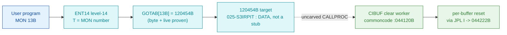

# MON 13B (octal) - ClearInBuffer (CIBUF)

Clears a device's input (ring) buffer: character input from terminals and other character
devices is queued in a per-device input ring, and MON 13B discards whatever is currently
queued for the addressed logical device. It shares one code body with MON 14B
ClearOutBuffer (COBUF); the two enter one word apart (`CIBUF=044120B`, `COBUF=044125B`) and
the body selects the input vs output side by which entry it is jumped to.

**Status:** dispatch head byte-proven (`GOTAB[13B]=120454B`); worker body is real SINTRAN L
bytes; the `MON 13B -> worker` link is NOT byte-followable (the dispatch target is data, not
a stub - see [Honest caveats](#honest-caveats)). All addresses/values are **octal**.

- **Full disassembly:** [`013B-ClearInBuffer.ASM`](013B-ClearInBuffer.ASM) - the actual code, both labelled regions (GOTAB target + CIBUF worker).
- **Bytes live once in** the canonical segment layer: [`../../segments-ref/`](../../segments-ref/).

---

## Dispatch path

The dashed hop (`D ⇢ E`) is the resident `CALLPROC`/segment-switch - it is **not present in
any carved segment**, so it is the one link that cannot be followed statically. For MON 13B
this is worse than a normal fall-through: the dispatch target `120454B` decodes as data
(`FDV/STA/STZ`), not a jump stub, so there is not even a pointer to dereference.

---

## Code location (dispatch path)

Every row is a real region you can open. Byte offset = `(addr - loadbase)` in octal words x 2.

| Role | Segment (full disasm) | Addr range (octal) | Byte offset | Symbol | Verdict |
|------|------------------------|--------------------|-------------|--------|---------|
| GOTAB[13] dispatch word | [commoncode.asm](../../segments-ref/SINTRAN-DATA_commoncode/SINTRAN-DATA_commoncode.asm) · [.hex](../../segments-ref/SINTRAN-DATA_commoncode/SINTRAN-DATA_commoncode.hex) | `071246B` (1 word) | 58700 | `GOTAB+13` = `120454B` | **VERIFIED** |
| Dispatch target (data) | [025-S3IRPIT.asm](../../segments-ref/025-S3IRPIT/025-S3IRPIT.asm) · [.hex](../../segments-ref/025-S3IRPIT/025-S3IRPIT.hex) | `120454B-120461B` | 55896 | `F1614` (SYMBOL-2, cross-revision) | **MISATTRIBUTED** (data, not a stub) |
| resident CALLPROC bridge | — (uncarved) | — | — | `CALLPROC` | **UNVERIFIED** |
| CIBUF clear worker body | [commoncode.asm](../../segments-ref/SINTRAN-DATA_commoncode/SINTRAN-DATA_commoncode.asm) · [.hex](../../segments-ref/SINTRAN-DATA_commoncode/SINTRAN-DATA_commoncode.hex) | `044113B-044156B` (entry `CIBUF=044120B`) | 37014 | `CIBUF` (SYMBOL-1) | real bytes; link **MISATTRIBUTED** |

**Verify by hand (worker entry):** `grep '^44113 ' ../../segments-ref/SINTRAN-DATA_commoncode/SINTRAN-DATA_commoncode.hex`
-> byte offset `37014`; then `dd if=../../../resident/SINTRAN-DATA_commoncode.bin bs=1 skip=37014 count=8 | od -An -tx1`
-> `59 80 d1 04 2c 00 d1 08` (= octal `054600 150404 026000 150410 …`, the `LDX ,B -200 / POF / LDD ,X 0 / PON` prologue).

**Verify by hand (GOTAB target is data):** `grep '^120454' ../../segments-ref/025-S3IRPIT/025-S3IRPIT.hex`
-> byte offset `55896`; then `dd if=../../../segments/025-S3IRPIT.bin bs=1 skip=55896 count=4 | od -An -tx1`
-> `9c 1e 08 07` (= octal `116036 004007` = `FDV ,X 36 / STA 7`: data, no jump).

Ground truth for the GOTAB word: `python3 scripts/prove-mon.py 013`.

---

## Instruction walkthrough

Full listing: [`013B-ClearInBuffer.ASM`](013B-ClearInBuffer.ASM). The functional body is the
CIBUF/COBUF shared clear worker (Region B); Region A is the GOTAB[13] dispatch target, shown
to be data rather than a followable stub.

**Prologue (044113-044117)** - stage one device/buffer table entry for an atomic test.
`LDX ,B -200` sets `X` to the table base at `(B-200)`; the `POF / LDD ,X 0 / PON` bracket is
the standard SINTRAN idiom for reading a device datafield atomically against interrupt-level
updates; `SAT -1` seeds `T` with the scan sentinel / mask.

**Input-side entry + test (044120-044124)** - `CIBUF` enters here. `SKP IF DA UEQ ST` breaks
out to the tail (`JMP 31 -> 044152`) when the scanned entry equals the sentinel; otherwise
`BSKP ONE 160 DA` tests a status bit and routes to the input clear arm or the second
(output-style) arm at `044137`.

**Output-side entry + first clear arm (044125-044136)** - `COBUF` (MON 14B) enters at
`044125 AND 73`. The arm masks the datafield, compares magnitude (`SKP IF DA MLST ST`),
updates a counter at `(B-54)`, tests the shift-carry condition, and on match calls the shared
per-buffer reset routine via **indirect** `JPL I 65 -> 044222B`, then rejoins the loop.

**Second arm (044137-044147)** - structurally identical, updating the counter at `(B-16)` and
calling the **same** reset routine via indirect `JPL I 53 -> 044222B`.

**Loop advance + tail (044150-044156)** - `AAX 2` advances the table cursor by one 2-word
entry and `JMP -35 -> 044114` re-reads atomically; the sentinel match drops into the tail at
`044152`, which loads result/status words for the exit path.

Both `JPL I` calls resolve to `044222B` (outside this window - an indirect target, so the
carve is still control-flow closed). The exact skip-return to the MON caller is part of the
`CALLPROC` epilogue and is not contained in this window.

---

## Parameter / register contract

| Reg / field | Dir | Meaning | Verdict |
|-------------|-----|---------|---------|
| `T` | in | logical device number (`LDT DEVNO; MON 13`) | VERIFIED (manual MAC example) |
| `A` | out | error / standard error code on error return | VERIFIED (manual: "Error number in register A") |
| return convention | out | skip return: `MON 13` then `JMP ERROR` (error); fall-through = normal | VERIFIED (manual MAC example) |
| entry point | in | `044120B` = input ring (CIBUF); `044125B` = output ring (COBUF, MON 14B) | VERIFIED (bytes) |
| datafield table base | internal | `(B-200) -> X`, entry `X+0` double word, atomic read | VERIFIED (bytes 044113-044116) |
| counters updated | internal | `(B-54)`, `(B-16)` during clear | VERIFIED (bytes 044131/044143) |
| shared reset routine | internal | `044222B` via indirect `JPL I` (target not carved) | VERIFIED (bytes; target off-window) |
| `CALLPROC` call-in (how `T`=device -> `(B-200)` table base) | in | register handoff not traced | inferred |
| that MON 13B enters at `CIBUF=044120B` | — | dispatch not byte-followable (GOTAB[13]=120454B != 044120B) | UNVERIFIED |

Input vs output side is selected by which entry the dispatcher jumps to, not by a parameter -
VERIFIED from the two labelled entries; the dispatch selection itself is UNVERIFIED.

---

## Pseudo-code (for an emulator)

See **[`013B-ClearInBuffer.pseudo.c`](013B-ClearInBuffer.pseudo.c)** - a pseudo-C model of the
handler for emulator authors. Control flow, the atomic datafield read, and the two clear arms
are byte-verified; the status-bit meanings and the reset routine at `044222B` are inferred
from the call structure.

Every instruction in the `.pseudo.c` is translated against the canonical
[`ND100-INSTRUCTION-SEMANTICS.md`](../../instruction-semantics/ND100-INSTRUCTION-SEMANTICS.md)
(bare `LDx`/`LDT`/`AND disp` = P-relative `mem[P+disp]`, not literals; `SKP`/`BSKP` skip
polarity; `RADD CLD SD DA` = `A = D`; T/X transfers = physical `EL`).

---

## Honest caveats

**What is byte-proven:** `GOTAB[13B] = 120454B` (level-14 dispatch word in commoncode, matches
a live read of the running system); the carved worker at `044113B..044156B` is an exact slice
of `commoncode.bin` (0 mismatches) and its entry bytes match the disassembly; `044120B` is
`CIBUF` and `044125B` is `COBUF` in `SYMBOL-1-LIST`, and the code there is a genuine ND-100
ring-buffer clear routine (atomic `POF/LDD/PON` read, `BSKP ONE` bit tests, indirect `JPL I`
reset calls); the manual-side contract (`T`=device, `A`=error, skip return) is solid.

**What is NOT proven:** the link from the dispatch head to the `CIBUF` body. `GOTAB[13]=120454B`
does not equal `CIBUF=044120B`, and `120454B` is **not** a followable stub - in `commoncode.bin`
it reads `000000` (inside a runtime-populated zero run `103031B..170177B`), and in the
`025-S3IRPIT` overlay it reads `FDV/STA/STZ` **data** (the `SYMBOL-2-LIST` label `F1614` there is
from a different NPL revision than the overlay bytes, so it is misattributed). There is no direct
jump and no indirect pointer word at `120454B` to dereference; the stub->worker transfer is the
resident `CALLPROC`/segment switch, which lives in an **uncarved overlay**. So the `MON 13B -> CIBUF`
attribution rests on the symbol name + the ring-buffer behaviour, not a followed pointer.
(This reconciles the two prior notes: the earlier "`GOTAB[13B]=MFELL` fall-through" story is
withdrawn - there is no `MFELL` symbol in the L07 lists, and `GOTAB[13]` is the concrete address
`120454B`.) Confirming the chain needs a live trace: break at the level-14 handler on a real
`MON 13`, single-step the resident `CALLPROC` second-level dispatch, and confirm P lands on
`CIBUF=044120B`; also capture the `T`(device) -> `(B-200)` register handoff.

Method: [../../../../../EXTRACTING-RESIDENT-CODE.md](../../../../../EXTRACTING-RESIDENT-CODE.md) · dispatch reality:
[../../TASK-05-mismatches.md](../../TASK-05-mismatches.md) · master map: [../../MON-CALL-INDEX.md](../../MON-CALL-INDEX.md).
