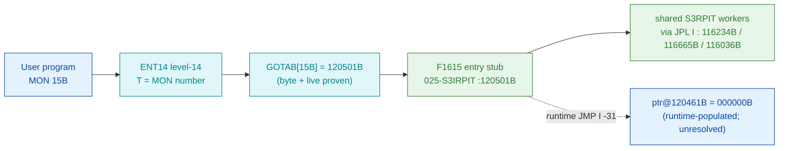

# MON 015B (octal) - Undocumented (F1615)

> **CORRECTED 2026-07-15 (byte-verified).** The worker + dispatch described below are on the
> DEBUNKED model and are WRONG. Byte truth from the carved L07 image:
> `MCTAB[15B] = 005635B = SETUP=103417B` in segment 006-S3FS, reached by the real dispatch
> `MON 15B -> ENT14(072167B) -> GOTAB[15B]=MFELL(072114B) -> CALLP(032201B) -> MCTAB[15B]=SETUP`.
> Any "GOTAB from commoncode" / "uncarved CALLPROC bridge" / "F16xx stub" / old worker name below
> is an artefact of the wrong table. Verified: `dd if=044-S3IDPIT.bin bs=1 skip=1850 count=2`
> -> `87 0f`. Cross-ref ../317B-ExecuteCommand/README.md and SINTRAN/CARVING-HANDOFF.md sec 3a.

A level-14 monitor call served directly by the Resident PIT (S3RPIT). It is **not listed
in the SINTRAN III Monitor Calls manual**: only the dispatch and the handler entry code are
recovered from real SINTRAN L bytes; the high-level purpose is unknown.

**Status:** dispatch byte-proven (`GOTAB[15B] = 120501B`, live-matched); the `F1615` entry
stub and the shared S3RPIT workers it calls are real SINTRAN L bytes in the same segment; the
call's *meaning* and one runtime-populated exit are **UNVERIFIED** (see
[Honest caveats](#honest-caveats)). All addresses/values are **octal**.

- **Full disassembly:** [`015B-Undocumented.ASM`](015B-Undocumented.ASM) - the actual code, both regions (F1615 entry stub + first shared worker).
- **Bytes live once in** the canonical segment layer: [`../../segments-ref/`](../../segments-ref/).

---

## Dispatch path

The main dispatch (`C -> D -> E`) is fully carved and statically followable inside
`025-S3IRPIT`. The dashed hop (`D -> F`) is the `JMP I -31` skip-path exit: its pointer word
`@120461B` reads `000000B` in the static image, so it is **runtime-populated** and cannot be
followed from the bytes alone.

---

## Code location (dispatch path)

Every row is a real region you can open. Byte offset = `(addr - loadbase)` in octal words x 2.
Rows are in execution order.

| Role | Segment (full disasm) | Addr range (octal) | Byte offset | Symbol | Verdict |
|------|------------------------|--------------------|-------------|--------|---------|
| GOTAB[15] dispatch word | [commoncode.asm](../../segments-ref/SINTRAN-DATA_commoncode/SINTRAN-DATA_commoncode.asm) · [.hex](../../segments-ref/SINTRAN-DATA_commoncode/SINTRAN-DATA_commoncode.hex) | `071250B` (1 word) | 58704 | `GOTAB+15` = `120501B` | **VERIFIED** |
| F1615 entry stub | [025-S3IRPIT.asm](../../segments-ref/025-S3IRPIT/025-S3IRPIT.asm) · [.hex](../../segments-ref/025-S3IRPIT/025-S3IRPIT.hex) | `120501B-120525B` (21 words) | 55938 | `F1615` | **VERIFIED** |
| worker B (via `JPL I 35`, ptr@120536=116234B) | [025-S3IRPIT.asm](../../segments-ref/025-S3IRPIT/025-S3IRPIT.asm) · [.hex](../../segments-ref/025-S3IRPIT/025-S3IRPIT.hex) | `116234B` | 53560 | S3RPIT worker | real bytes; extent **UNVERIFIED** |
| worker C (via `JPL I 33`, ptr@120540=116665B) | [025-S3IRPIT.asm](../../segments-ref/025-S3IRPIT/025-S3IRPIT.asm) · [.hex](../../segments-ref/025-S3IRPIT/025-S3IRPIT.hex) | `116665B` | 54122 | S3RPIT worker | real bytes; extent **UNVERIFIED** |
| worker D (via `JPL I 23`, ptr@120541=116036B) | [025-S3IRPIT.asm](../../segments-ref/025-S3IRPIT/025-S3IRPIT.asm) · [.hex](../../segments-ref/025-S3IRPIT/025-S3IRPIT.hex) | `116036B` | 53308 | S3RPIT worker | real bytes; extent **UNVERIFIED** |
| data word (via `LDX I 34/30`, ptr@120537=061157B) | [025-S3IRPIT.asm](../../segments-ref/025-S3IRPIT/025-S3IRPIT.asm) · [.hex](../../segments-ref/025-S3IRPIT/025-S3IRPIT.hex) | `061157B` | 23774 | S3RPIT data | VERIFIED (pointer read) |
| `JMP I -31` exit (ptr@120461B = 000000B) | - (runtime-populated) | `120461B` -> `000000B` | 39392 | runtime-linked | **UNVERIFIED** |

**Verify by hand (GOTAB word):** `grep -E '^71250 ' ../../segments-ref/SINTRAN-DATA_commoncode/SINTRAN-DATA_commoncode.hex`
-> `71250 120501 241 101 58704`; then
`dd if=../../../resident/SINTRAN-DATA_commoncode.bin bs=1 skip=58704 count=2 | od -An -tx1`
-> `a1 41` (= octal `120501`, the F1615 address).

**Verify by hand (F1615 stub):** `grep -E '^120501 ' ../../segments-ref/025-S3IRPIT/025-S3IRPIT.hex`
-> byte offset `55938`; then
`dd if=../../../segments/025-S3IRPIT.bin bs=1 skip=55938 count=4 | od -An -tx1`
-> `ba 1d a8 09` (= octal `135035 124011` = `JPL I 35` / `JMP 11`, the stub head).

---

## Instruction walkthrough

Full listing: [`015B-Undocumented.ASM`](015B-Undocumented.ASM). Region A is the `F1615` stub
(the per-MON handler); Region B is the first shared worker it calls (`116234B`).

The `F16xx` symbols are a regular table of same-size per-MON entry stubs (`F1610..F1627` are each
exactly `025B` words apart), so `F1615 @120501B` is the level-14 stub for MON 15B, not a
coincidence. The stub reads **X and A**, tests **T**, calls shared workers, and offers a
**skip-return** to the caller - consistent with a small argument-driven monitor call.

1. **Entry / worker call (120501-120502).** `120501 JPL I 35` calls shared worker B at
   `116234B` (pointer word `@120536`). The worker uses a **skip / no-skip** convention: `120502
   JMP 11 -> 120513` is the normal (no-skip) return; straight-line code at `120503` is the skip
   return.
2. **Skip path (120503-120512).** Loads X from data word `061157B` (`LDX I 34`) and `A` from
   `mem[X-17]`, calls a second worker C at `116665B` (`120505 JPL I 33`), reloads X (`LDX I 30`),
   loads `A` from `120457B` (which reads `000000B`), copies `A->B` (`RADD CLD SA DB`) and exits via
   `120512 JMP I -31` through pointer word `@120461B` - which reads `000000B` (see caveats).
3. **Normal path (120513-120525).** Subfunction-style dispatch: sets `T` (`SAT 2`, then `SAT 1`),
   compares the double accumulator against `S:T` (`SKP IF DA EQL ST`), and branches - calling a
   third worker D at `116036B` (`120516 JPL I 23`) on one selector, and bit-testing (`120524 BSKP
   ONE SSK`) on another, converging on shared tails at `120534B` / `120477B`.

Pointer / data words the stub dereferences (data, rendered by `nd100-dis` as `FDV`/`ADD`/`STZ`;
the raw octal *is* the target): `@120536=116234 @120537=061157 @120540=116665 @120541=116036
@120461=000000 @120457=000000`.

---

## Parameter / register contract

| Reg / field | Dir | Meaning | Verdict |
|-------------|-----|---------|---------|
| `X` (ZXREG) | in | Stub loads/uses X (`LDX I 34`, `LDX I 30`, `LDA ,X -17`) as a pointer/index into a table or descriptor. | VERIFIED (bytes) |
| `A` (ZAREG) | in | Stub loads `A` and compares it (`SKP IF DA EQL ST`) - an argument/selector value. | VERIFIED (bytes) |
| `T` (ZTREG) | in | Selector set/tested (`SAT 1`, `SAT 2`, `... EQL ST`) - subfunction number. | VERIFIED (bytes) |
| skip return | out | Worker `116234B` returns skip/no-skip; the stub has both paths (`JMP 11` vs fall-through). | VERIFIED (bytes) |
| error codes | out | No explicit error-code load is identifiable in the stub; any status is produced inside the uncarved workers. | UNVERIFIED |
| *purpose* | - | The manual does not list MON 15B; the functional meaning of the inputs/outputs is unknown. | UNVERIFIED |

The exact caller-visible contract is **undocumented**. What the code proves is only the register
*usage pattern* above.

---

## Pseudo-code (for an emulator)

See **[`015B-Undocumented.pseudo.c`](015B-Undocumented.pseudo.c)** - a pseudo-C model of the
`F1615` handler for emulator authors. The control flow and the skip / no-skip fork are
byte-verified; the semantics of the three shared workers and the runtime `JMP I -31` exit are
inferred / unresolved, not byte-proven.

Every instruction in the `.pseudo.c` is translated against the canonical
[`ND100-INSTRUCTION-SEMANTICS.md`](../../instruction-semantics/ND100-INSTRUCTION-SEMANTICS.md)
(`SKP IF DA EQL ST` compares the single registers `A` and `T` - "DA"/"ST" are dst-A/src-T, not a
`D:A`/`S:T` pair; skip-on-condition skips the next word, do not invert; `RADD CLD SA DB` = `B = A`).

---

## Honest caveats

**What is byte-proven:** `GOTAB[15B] = 120501B` (raw bytes `a1 41` at file offset `0xe550` of
`SINTRAN-DATA_commoncode.bin`, i.e. word `071233B + 015`), matching a live-DAP read of the running
L system - this is a **DIRECT** dispatch, **not** `MFELL`/`000000`/fall-through. The earlier
NPL-based "GOTAB[15B]=MFELL, handler NOT LOCATED" conclusion is **corrected**. The `F1615` stub at
`120501B` is coherent real code (not zeros/data), and the three shared workers it reaches
(`116234B`, `116665B`, `116036B`) plus the data word (`061157B`) are non-zero, statically
followable, coherent S3RPIT code in the same `025-S3IRPIT` overlay.

**What is NOT proven:**
1. **Purpose.** MON 15B is undocumented. Whether it is a live call or a dormant TSS carryover
   cannot be decided from the bytes.
2. **The `JMP I -31` skip-path exit.** Pointer word `@120461B` reads `000000B` in the static
   image - a literal indirect jump to address 0 is nonsensical, so this word is almost certainly
   **patched at runtime** (self-modified S3RPIT dispatch). It cannot be resolved from the static
   image; a live trace is required.
3. **Worker extents.** `116234B` / `116665B` / `116036B` are shared workers entered by many stubs;
   they have no bounding symbol and multiple return paths, so their full extent is **UNVERIFIED**.
   The `.ASM` lists worker B (`116234B`) from entry through its first two return sites for
   orientation only.

An earlier draft (`DISPATCH.md`) tabulated `120502 JMP 11 -> 120514B` and a few other targets that
disagreed with the disassembler; the byte-honest `nd100-dis` output (used here and in the `.ASM`)
gives `JMP 11 -> 120513B`. The listing in this folder is the reconciled, byte-true one.

Method: [../../../../../EXTRACTING-RESIDENT-CODE.md](../../../../../EXTRACTING-RESIDENT-CODE.md) §7.6/7.7/8 · dispatch reality:
[../../TASK-05-mismatches.md](../../TASK-05-mismatches.md) · master map: [../../MON-CALL-INDEX.md](../../MON-CALL-INDEX.md).
