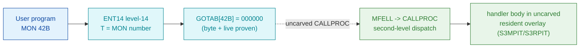

# MON 042B (octal) — Undocumented (no symbol)

A low ND-100 monitor call (< 0400B) with **no direct level-14 handler**: `GOTAB[42B] = 000000`.
The zero slot means MON 042B is a *fall-through* — it is serviced by the resident second-level
dispatch (`MFELL → CALLPROC`), not by a dedicated entry stub. No code body is carved, so there is
no per-call `.ASM`/`.pseudo.c`; this document records the proven absence.

**Status:** dispatch head byte-proven (`GOTAB[42B] = 000000`, a real SINTRAN L byte pair, matching a
live read of the running system); **no worker link** — the body lives in the uncarved `CALLPROC`
overlay and cannot be pinned to a carved byte range (see [Honest caveats](#honest-caveats)).
All addresses/values are **octal**.

- **No per-call disassembly:** MON 042B is a fall-through (`GOTAB[42B] = 000000`); there is no entry
  stub or worker to disassemble in the carved set, so no `042B-Undocumented.ASM` is fabricated.
- **Bytes live once in** the canonical segment layer: [`../../segments-ref/`](../../segments-ref/).

---

## Dispatch path

The dashed hop (`C ⇢ D`) is the resident `MFELL`/`CALLPROC` second-level dispatch — it is **not
present in any carved segment**, so it is the one link that cannot be followed statically. A
`000000` GOTAB slot is **fall-through, NOT illegal**: MON 14B (OUTBT), a real heavily-used call,
also carries `GOTAB[14B] = 000000`.

---

## Code location (dispatch path)

Every row that has bytes is a real region you can open. Byte offset = `(addr − loadbase)` in octal
words × 2. GOTAB base = `071233B` in `commoncode` (load 0); entry address = `071233B + MON# = 071275B`.

| Role | Segment (full disasm) | Addr range (octal) | Byte offset | Symbol | Verdict |
|------|------------------------|--------------------|-------------|--------|---------|
| GOTAB[42] dispatch word | [commoncode.asm](../../segments-ref/SINTRAN-DATA_commoncode/SINTRAN-DATA_commoncode.asm) · [.hex](../../segments-ref/SINTRAN-DATA_commoncode/SINTRAN-DATA_commoncode.hex) | `071275B` (1 word) | 58746 | `GOTAB+42B` = `000000` | **VERIFIED** (= 000000, fall-through) |
| resident CALLPROC bridge | — (uncarved) | — | — | `MFELL → CALLPROC` | **UNVERIFIED** (outside carved byte set) |
| fall-through handler body | — (uncarved) | — | — | S3MPIT/S3RPIT overlay | **UNVERIFIED** (not resolvable) |

**Verify by hand:** `grep '^71275 ' ../../segments-ref/SINTRAN-DATA_commoncode/SINTRAN-DATA_commoncode.hex`
→ byte offset `58746`; then
`dd if=../../../resident/SINTRAN-DATA_commoncode.bin bs=1 skip=58746 count=2 2>/dev/null | od -An -tx1`
→ `00 00` (= octal `000000`, the fall-through GOTAB slot).

---

## Instruction walkthrough

There is **no instruction body to walk** — that is the point of this entry. Level-14 dispatch
(`ENT14`) loads the MON number into `T`, indexes `GOTAB` at `071233B + 42B = 071275B`, and reads
`000000`. A zero handler address is the sentinel that routes the call into the second-level
fall-through (`MFELL → CALLPROC`) instead of jumping to a direct level-14 stub. The `CALLPROC`
second-level table, and the ultimate handler body it selects, live in the memory-resident
`S3MPIT`/`S3RPIT` overlay whose `ENT14`/`MCALL` code pages are **not backed in the available
carves**, so MON 042B's body has no resolvable address from what we have. No `.ASM`/`.pseudo.c`
is provided rather than fabricate one.

---

## Parameter / register contract

| Reg / field | Dir | Meaning | Verdict |
|-------------|-----|---------|---------|
| `T` | in | MON number (`42B`) used to index `GOTAB` | VERIFIED (dispatch mechanism) |
| `GOTAB[42B]` | internal | `000000` — fall-through sentinel, not a handler address | VERIFIED (bytes) |
| `A`/`X`/`D` | in/out | caller argument/return convention | UNKNOWN — defined by the uncarved `CALLPROC` handler, not byte-proven |
| skip return | out | success/error skip convention | UNKNOWN — set by the uncarved handler body |

The user-visible register convention lives entirely in the uncarved `CALLPROC` frame and the
handler body it dispatches, so nothing beyond the dispatch mechanism is byte-proven here.

---

## Honest caveats

**What is byte-proven:** `GOTAB[42B] = 000000` — a real SINTRAN L byte pair in
`resident/SINTRAN-DATA_commoncode.bin` at virtual `071275B` (byte offset `58746`), matching a
live-DAP read of a booted L system. That zero is a genuine fall-through sentinel, **not** an
illegal/undefined call: even-numbered low monitor calls carry `000000` (serviced by the fall-through)
while odd-numbered ones (`1B..161B`) carry direct entry stubs in the S3RPIT `120xxx` block.

**What is NOT proven:** MON 042B's actual handler body. The `MFELL → CALLPROC` second-level dispatch
that services fall-through calls is in the memory-resident `S3MPIT`/`S3RPIT` overlay whose
`ENT14`/`MCALL` code pages are not populated in the available carves, so 042B's body cannot be pinned
to an address. It is **neither confirmed present nor proven absent** — it is outside the carved byte
set. The "Undocumented"/TSS-carry-over provenance sometimes attached to this call is not encoded in
any source and is **not confirmed**. Recovering the body needs a live trace (break at the `CALLPROC`
dispatch on a real `MON 42B` and single-step to the handler) or a carve of the resident overlay.

There is no ANALYSIS-vs-DISPATCH contradiction to reconcile: earlier notes that called `GOTAB`
"unreadable/absent from every carve" were wrong — `GOTAB` is fully present in `commoncode.bin`; it is
042B's *fall-through body*, not the table, that is missing.

---

Method: [../../../../../EXTRACTING-RESIDENT-CODE.md](../../../../../EXTRACTING-RESIDENT-CODE.md) §5/7/8 · dispatch reality:
[../../TASK-05-mismatches.md](../../TASK-05-mismatches.md) · master map: [../../MON-CALL-INDEX.md](../../MON-CALL-INDEX.md).
