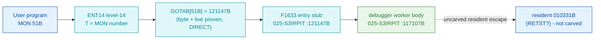

# MON 051B (octal) - DMACBreakpoint (F1633)

> **CORRECTED 2026-07-15 (byte-verified).** The worker + dispatch described below are on the
> DEBUNKED model and are WRONG. Byte truth from the carved L07 image:
> `MCTAB[51B] = 005671B = GBRKD=014263B`, reached by the real dispatch
> `MON 51B -> ENT14(072167B) -> GOTAB[51B]=MFELL(072114B) -> CALLP(032201B) -> MCTAB[51B]=GBRKD`.
> Verified: `dd if=044-S3IDPIT.bin bs=1 skip=1906 count=2` -> `18 b3`. NOTE: GBRKD=014263B is
> below the 003-S3CP load base (030000B), so the worker BODY segment is OPEN (not 003-S3CP);
> only the MCTAB slot is byte-proven here. Cross-ref ../317B-ExecuteCommand/README.md and
> SINTRAN/CARVING-HANDOFF.md sec 3a.

Assembly-level (DMAC) breakpoint / instruction-patch monitor call - the mechanism the DMAC
subsystem / `@LOOK-AT` uses to alter or extend the MAC instructions of the OS or a subsystem.
It is one of the debugger-family calls served on level 14 by the Resident PIT image (`S3RPIT`),
in the same dispatch block as MON 045B (DefineBreakpoint).

**Status:** dispatch is DIRECT and byte-proven (`GOTAB[51B] = 121147B`, not a fall-through); the
`F1633` entry stub and the worker body at `117107B` are real SINTRAN L bytes in `025-S3IRPIT`; the
worker's final `JMP I 2` escapes to resident `010331B`, which is in **no carved segment** (see
[Honest caveats](#honest-caveats)). All addresses/values are **octal**.

- **Full disassembly:** [`051B-DMACBreakpoint.ASM`](051B-DMACBreakpoint.ASM) - the actual code, both regions (entry stub + worker body).
- **Bytes live once in** the canonical segment layer: [`../../segments-ref/`](../../segments-ref/).

---

## Dispatch path



The dashed hop (`E ⇢ F`) is the worker's tail `JMP I 2` into resident low memory - it is **not
present in any carved segment**, so it is the one link that cannot be followed statically.

---

## Code location (dispatch path)

Every row is a real region you can open. Byte offset = `(addr − loadbase)` in octal words × 2.

| Role | Segment (full disasm) | Addr range (octal) | Byte offset | Symbol | Verdict |
|------|------------------------|--------------------|-------------|--------|---------|
| GOTAB[51] dispatch word | [commoncode.asm](../../segments-ref/SINTRAN-DATA_commoncode/SINTRAN-DATA_commoncode.asm) · [.hex](../../segments-ref/SINTRAN-DATA_commoncode/SINTRAN-DATA_commoncode.hex) | `071304B` (1 word) | 58760 | `GOTAB+51` = `121147B` | **VERIFIED** |
| F1633 entry stub | [025-S3IRPIT.asm](../../segments-ref/025-S3IRPIT/025-S3IRPIT.asm) · [.hex](../../segments-ref/025-S3IRPIT/025-S3IRPIT.hex) | `121147B–121173B` | 56526 | `F1633` | **VERIFIED** |
| Debugger worker body | [025-S3IRPIT.asm](../../segments-ref/025-S3IRPIT/025-S3IRPIT.asm) · [.hex](../../segments-ref/025-S3IRPIT/025-S3IRPIT.hex) | `117107B–117137B` | 54414 | `REDOM` / `PRIMH` | real bytes; link **VERIFIED** (ptr `121214B`=`117107B`) |
| Resident escape (`JMP I 2` → `010331B`) | — (uncarved resident low memory) | `010331B` | — | `RETST`? | **UNVERIFIED** |

**Verify by hand** (the GOTAB word that proves the dispatch):
```
$ grep '^71304 ' ../../segments-ref/SINTRAN-DATA_commoncode/SINTRAN-DATA_commoncode.hex
71304  121147  242 147  58760                 # word 121147B, big-endian bytes 242 147 at byteoff 58760
$ dd if=../../../resident/SINTRAN-DATA_commoncode.bin bs=1 skip=58760 count=2 status=none | od -An -tx1
 a2 67                                         # 0xa2 0x67 = octal 242 147 = word 121147B = GOTAB[51]
```
And the stub's first word: `grep '^121147 ' ../../segments-ref/025-S3IRPIT/025-S3IRPIT.hex` →
`121147  124004  250 004  56526`; then
`dd if=../../../segments/025-S3IRPIT.bin bs=1 skip=56526 count=2 status=none | od -An -tx1` → `a8 04`
(= octal `250 004` = word `124004B` = `JMP 4`).

---

## Instruction walkthrough

Full listing: [`051B-DMACBreakpoint.ASM`](051B-DMACBreakpoint.ASM). The functional body is the
worker (Region B); the `F1633` stub (Region A) is the level-14 entry.

**Head (121147)** — `124004 JMP 4` skips the three words at `121150..121152` (alternate-entry /
pointer words used by *other* F16xx callers, not executed on the MON 51B path) and enters the body
at `121153`.

**Body (121153–121160)** — marshals the worker's inputs:
```
121153  045032  LDA I 32   ; A <- mem[ptr@121205 = 061157B]  (in-segment 025 data)
121155  045036  LDA I 36   ; A <- mem[ptr@121213 = 004007B]  (resident data, out-of-window)
121157  044421  LDA ,B 21  ; A <- caller frame B+21  (input parameter)
```
with each `LDA` routed to B / X / D by the interleaved `RADD CLD SA D*` moves.

**Main transfer (121161)** — `125033 JMP I 33` jumps indirect through pointer word
`mem[121214B] = 117107B` into the shared worker. This pointer target is inside `025-S3IRPIT`
(the load window `32000B..`), so it is statically followable — **byte-verified**. The words at
`121162..121173` below it are the alternate/fall path for other callers, not the 51B main path.

**Worker (117107–117137)** — decrements a caller-frame counter (`117110 LDA ,B 7` / `AAA -1` /
`STA ,B 7`), chases a descriptor via frame `B+0`, and classifies the request through two small
table walks (`LDX I 20`, `LDX I 11`) that set/test flag bits (`BSET`/`BSKP`) before joining at
`117136`. The tail `117137 125002 JMP I 2` jumps indirect through `mem[117141B] = 010331B` into
resident low memory (below the `32000B` load base) — **not** in any carved segment.

---

## Parameter / register contract

| Reg / field | Dir | Meaning | Verdict |
|-------------|-----|---------|---------|
| caller frame `,B 21` | in | Read by the stub (`121157 LDA ,B 21`) and passed to the worker in D — consistent with a "patch address / value" input for a DMAC breakpoint | VERIFIED (stub reads B+21); meaning inferred |
| `A`/`B`/`X`/`D` | in | Staged in the stub body (`121153–121160`) from two pointer words + the caller frame, then the worker is entered with them loaded | VERIFIED (register plumbing); meaning UNVERIFIED |
| frame `,B 7` | in/out | Worker decrements it (`117110–117112`) — consistent with a counter / return-slot | VERIFIED (bytes); semantics inferred |
| descriptor via `,B 0` | in | Worker chases `LDX ,B 0` then `LDA ,X 1` — request descriptor | VERIFIED (bytes); meaning inferred |
| skip return | out | Debugger-family convention (as MON 045B): OK vs error return | UNVERIFIED (lives in the resident tail) |

The precise per-register DMAC-subfunction contract (which register holds the patch address, which
holds the instruction word, error codes) is **not** recoverable from these bytes — it lives in the
resident routine at `010331B`, outside any carved segment. The manual documents only the name and
purpose, not a register table.

---

## Pseudo-code (for an emulator)

See **[`051B-DMACBreakpoint.pseudo.c`](051B-DMACBreakpoint.pseudo.c)** — a pseudo-C model of the
handler for emulator authors. The dispatch spine (`GOTAB[51]=121147B → JMP 4 → body → JMP I 33 →
worker 117107B`) is byte-verified; the register/frame semantics and the resident-tail behaviour are
inferred from the code structure.

Every instruction in the `.pseudo.c` is translated against the canonical
[`ND100-INSTRUCTION-SEMANTICS.md`](../../instruction-semantics/ND100-INSTRUCTION-SEMANTICS.md)
(`SWAP SB DD` is a FULL register exchange of B and D, not a copy - so the worker's counter
decrement targets `mem[D+7]`; `RADD CLD SA Dx` = `x = A`; `LDA I`/`JMP I` are one indirect fetch).

---

## Honest caveats

**What is byte-proven:** `GOTAB[51B] = 121147B` (level-14 dispatch, matches a live-DAP read of the
running system, indexing `071233B + MON#`); it is a **DIRECT** entry, **not** `000000`/`MFELL`, so
MON 51B is **not** a fall-through / `CALLPROC` call. The `F1633` stub at `121147B` is real code
(`124004 JMP 4` …), and its `121161 JMP I 33` resolves — through pointer word `mem[121214B]=117107B`
read from the carved bytes — to a real worker body in the *same* `025-S3IRPIT` overlay. That worker
(`117107B`) is byte-followable.

**What is NOT proven:** the worker's tail `117137 JMP I 2` through pointer `mem[117141B]=010331B`
lands in resident low memory *below* the `32000B` load base — in **no carved segment** — so the
actual DMAC-patch work and the final skip/error return cannot be followed statically. Likewise the
in-body `121155 LDA I 36` reads through a pointer (`004007B`) into resident memory, i.e. a
runtime-populated data source, not a carved constant.

**Reconciling the two harvested notes:** the earlier NPL-based conclusion "`GOTAB[51B]=MFELL →
CALLPROC`, body not found" is a **revision mismatch** (the NPL source tree is a different build than
the carved L system) and is corrected here by the ground-truth bytes. Where the harvested
`ANALYSIS.md` and `DISPATCH.md` disagreed on the executed path, `DISPATCH.md` is authoritative: the
`121150 JPL I 42` is a *skipped* alternate-entry word, and the real main-path transfer is
`121161 JMP I 33 → 117107B`. (Note: `DISPATCH.md` mislabelled the `LDA I 36` pointer as
`121211B=010341B`; the byte-accurate pointer is `121213B=004007B`, corrected above.) To fully close
the call, break at `121147B` on a live `MON 51B`, single-step to `117107B`, then follow
`117137 JMP I 2` to `010331B` and capture the caller-frame registers.

---

Method: [../../../../../EXTRACTING-RESIDENT-CODE.md](../../../../../EXTRACTING-RESIDENT-CODE.md) §7.6/7.7/8 · dispatch reality:
[../../TASK-05-mismatches.md](../../TASK-05-mismatches.md) · master map: [../../MON-CALL-INDEX.md](../../MON-CALL-INDEX.md).
