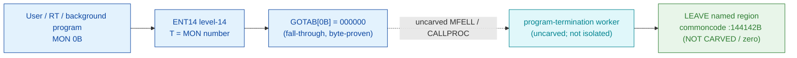

# MON 0B (octal) — ExitFromProgram (LEAVE)

> **CORRECTED 2026-07-15 (byte-verified).** The worker + dispatch described below are on the
> DEBUNKED model and are WRONG (the `GOTAB[0]=000000` / zero-filled `LEAVE` story came from the
> WRONG table read out of commoncode). Byte truth from the carved L07 image:
> `MCTAB[0B] = 005620B = PRTEX=032673B` in segment 003-S3CP, reached by the real dispatch
> `MON 0B -> ENT14(072167B) -> GOTAB[0B]=MFELL(072114B) -> CALLP(032201B) -> MCTAB[0B]=PRTEX`.
> Verified: `dd if=044-S3IDPIT.bin bs=1 skip=1824 count=2` -> `35 bb`. Cross-ref
> ../317B-ExecuteCommand/README.md and SINTRAN/CARVING-HANDOFF.md sec 3a.

Terminates the calling program and returns to SINTRAN III. A batch job continues
with its next command. Background programs close all files that are not set
permanently open; RT programs close no files but release all reserved devices.
ND-100 (and ND-500) call, available to all programs.

**Status:** `documented` (zero region). `GOTAB[0B] = 000000` (byte-proven) — a
**fall-through**: there is no direct GOTAB handler word, so the level-14 handler is
reached through the resident MFELL/CALLPROC path (uncarved). The named region for
this call, `LEAVE = 144142B` in resident commoncode, is **zero-filled in this real
SINTRAN L image**: `LEAVE` lies deep inside the large uncarved zero block
`103031B–170177B`. So the termination worker body cannot be read from these bytes;
`LEAVE` is attached by symbol **name** only and its code-vs-data nature is
**NOT-RECOVERABLE** (see [Honest caveats](#honest-caveats)). All addresses/values
are **octal**.

- **Full disassembly:** [`0B-ExitFromProgram.ASM`](0B-ExitFromProgram.ASM) — the GOTAB[0] fall-through word + the `LEAVE` named region (zero-filled; flagged NOT-CARVED).
- **Bytes live once in** the canonical segment layer: [`../../segments-ref/`](../../segments-ref/).

---

## Dispatch path

The dashed hop (`C ⇢ D`) is the resident `MFELL`/`CALLPROC` fall-through — it is
**not present in any carved segment**, so it is the one link that cannot be followed
statically. `GOTAB[0B]` is literally `000000`, so there is no entry stub to
disassemble; dispatch enters the resident handler, which then terminates the
program. `LEAVE` (E) is the named commoncode region for this call, but in this L
image its word is **zero** (the range was not carved), so no body is present here.

---

## Code location (dispatch path)

Byte offset = `(addr − loadbase)` in octal words × 2 (decimal); the commoncode load
base is `0`, so the byte offset is simply `octal-addr × 2` (decimal).

| Role | Segment (full disasm) | Addr range (octal) | Byte offset | Symbol | Verdict |
|------|------------------------|--------------------|-------------|--------|---------|
| GOTAB[0] dispatch word | [commoncode.asm](../../segments-ref/SINTRAN-DATA_commoncode/SINTRAN-DATA_commoncode.asm) · [.hex](../../segments-ref/SINTRAN-DATA_commoncode/SINTRAN-DATA_commoncode.hex) | `071233B` (1 word, GOTAB base) | 58678 | `GOTAB+0` = `000000` | **VERIFIED** (fall-through) |
| resident MFELL/CALLPROC bridge | — (uncarved) | — | — | `MFELL`/`CALLPROC` | **UNVERIFIED** |
| LEAVE named region | [commoncode.asm](../../segments-ref/SINTRAN-DATA_commoncode/SINTRAN-DATA_commoncode.asm) · [.hex](../../segments-ref/SINTRAN-DATA_commoncode/SINTRAN-DATA_commoncode.hex) | `144142B` (1 word, to `OUTTE=144143B`) | 102596 | `LEAVE` | **NOT CARVED** (zero-filled); body link **MISATTRIBUTED** |

There is no entry-stub row: `GOTAB[0]` is `000000`, so the level-14 handler is a
resident fall-through, not a `025-S3IRPIT` stub.

**Verify by hand:** the GOTAB word is a zero (fall-through):
`grep '^71233 ' ../../segments-ref/SINTRAN-DATA_commoncode/SINTRAN-DATA_commoncode.hex`
→ `71233  000000  000 000  58678`; confirm the zero from the canonical bin
`dd if=../../../resident/SINTRAN-DATA_commoncode.bin bs=1 skip=58678 count=2 2>/dev/null | od -An -tx1`
→ `00 00`. For the `LEAVE` region:
`grep '^144142 ' ../../segments-ref/SINTRAN-DATA_commoncode/SINTRAN-DATA_commoncode.hex`
→ `144142  000000  000 000  102596`; then
`dd if=../../../resident/SINTRAN-DATA_commoncode.bin bs=1 skip=102596 count=2 2>/dev/null | od -An -tx1`
→ `00 00` (the two bytes form the word `000000` — the region is zero-filled, i.e. not
carved in this L image). `prove-mon.py 0` reads the same GOTAB zero.

---

## Instruction walkthrough

Full listing: [`0B-ExitFromProgram.ASM`](0B-ExitFromProgram.ASM). There is no entry
stub (fall-through dispatch) and the named body region is **zero-filled (not
carved)**, so there is no executable walkthrough.

**LEAVE named region (144142)** — **not carved**. The single word (`LEAVE`, between
`ENTER=144141B` and the next symbol `OUTTE=144143B`) is `000000` in this L image. It
sits inside a solid zero block that spans the large uncarved range
`103031B–170177B`, so the termination worker body is simply **absent** from this
carve — not code, not data, just uninitialised. The consecutive single-word slots
`ENTER=144141B` / `LEAVE=144142B` / `OUTTE=144143B` look like a vector-style region,
all zero here because it was not carved.

---

## Parameter / register contract

Manual-side names/types are from
[`0B_ExitFromProgram.yaml`](../../../../../../../Developer/MON/calls/0B_ExitFromProgram.yaml).
MON 0B takes **no parameters**.

| Reg / field | Dir | Meaning | Verdict |
|-------------|-----|---------|---------|
| (none) | — | MON 0 takes no parameters | inferred (manual) |
| background program | in | on exit, close all files not permanently open | inferred (manual) |
| RT program | in | on exit, release all reserved devices (no files closed) | inferred (manual) |
| control flow | out | returns to SINTRAN III; batch job continues with next command | inferred (manual) |

The named `LEAVE` region is zero-filled here and there is no entry stub, so
**nothing** in this contract is byte-proven from this carve; every row is
**inferred** from the manual and the caller-side `MON 0` wrapper.

---

## Pseudo-code (for an emulator)

See **[`0B-ExitFromProgram.pseudo.c`](0B-ExitFromProgram.pseudo.c)** — a pseudo-C
model for emulator authors. Because the named `LEAVE` region is **zero-filled (not
carved)** and the real termination worker sits past the uncarved MFELL/CALLPROC, the
model is of the **documented** behaviour only (terminate program / return to the
command processor), NOT the carved code. The worker is flagged name-only /
not-recoverable; the fall-through `MON 0 → worker` bridge is modelled but not proven.

Instruction semantics follow the canonical reference:
[`../../instruction-semantics/ND100-INSTRUCTION-SEMANTICS.md`](../../instruction-semantics/ND100-INSTRUCTION-SEMANTICS.md).

---

## Honest caveats

**What is byte-proven:** `GOTAB[0B] = 000000` (level-14 fall-through; `prove-mon.py 0`
reads commoncode file byte `58678 = 00 00`). That is the only fact these carved
bytes establish for this call.

**What is NOT proven:** anything about the `LEAVE` body. `LEAVE=144142B` is
**zero-filled** in this L image — it lies inside the large uncarved zero block
`103031B–170177B` — so we cannot even decide code-vs-data for it, let alone confirm
it is the MON 0 worker. And because `GOTAB[0]` is `000000`, there is no stub to
follow; dispatch enters the resident `MFELL`/`CALLPROC` handler in an **uncarved
overlay**. Attributing the call body to `LEAVE` rests on the symbol **name**
(`LEAVE` = the manual's short-name for ExitFromProgram) plus its position, not a
followed pointer or a decoded routine — hence the body is **NOT-RECOVERABLE** here.
No worker body has been fabricated.

This reconciles into one story: the dispatch head (`GOTAB[0]=0`, fall-through) is
solid; the named `LEAVE` region is not present in this carve (zeros); and the real
termination worker is not reachable from these bytes. Confirming the actual worker
needs a live trace (break on a real `MON 0`, single-step the fall-through, and record
where P lands).

---

Method: [../../../../../EXTRACTING-RESIDENT-CODE.md](../../../../../EXTRACTING-RESIDENT-CODE.md) · dispatch reality:
[../../TASK-05-mismatches.md](../../TASK-05-mismatches.md) · master map: [../../MON-CALL-INDEX.md](../../MON-CALL-INDEX.md).
