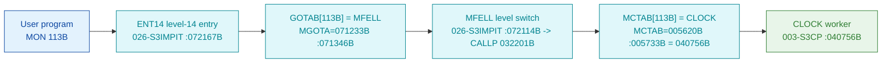

# MON 113B (octal) - CLOCK (GetCurrentTime)

Returns the **current system time and date**. `CLOCK` is one of the clock/time family
(`TIME`, `CLOCK`, `XPERC`, `PERCE`, `DPERC`) that share a common body in `003-S3CP`; the
`CLOCK` path performs the calendar/time-of-day conversion (divide + decimal scaling). All
addresses/values are **octal**.

**Status:** **byte-verified** (dispatch chain + worker entry). The worker is real carved code
in `003-S3CP`.

> **CORRECTED 2026-07-13.** Earlier versions of this folder used the disproven dispatch model
> (GOTAB as the monitor-call table, an "uncarved CALLPROC bridge"). MON calls dispatch through
> **`MCTAB @ 005620B`** (segment `044-S3IDPIT`), not `GOTAB` (which is `MFELL` for 224 of 256
> calls). `MCTAB[113B] = 040756B = CLOCK`, carved in `003-S3CP`. See
> [`../317B-ExecuteCommand/README.md`](../317B-ExecuteCommand/README.md) and
> `SINTRAN/CARVING-HANDOFF.md` section 3a.

- **Full disassembly:** [`113B-GetCurrentTime.ASM`](113B-GetCurrentTime.ASM).
- **Emulator model:** [`113B-GetCurrentTime.pseudo.c`](113B-GetCurrentTime.pseudo.c).

---

## Dispatch path



---

## Code location (dispatch path)

Byte offset = `(addr - loadbase)` in octal words x 2 (decimal). Every offset was reproduced
with `dd`.

| Role | Segment | Addr (octal) | Byte offset | Symbol | Verdict |
|------|---------|--------------|-------------|--------|---------|
| GOTAB[113B] slot | [026-S3IMPIT.asm](../../segments-ref/026-S3IMPIT/026-S3IMPIT.asm) | `071346B` = `072114B` | 32204 | -> `MFELL` | **VERIFIED** |
| MFELL level switch | [026-S3IMPIT.asm](../../segments-ref/026-S3IMPIT/026-S3IMPIT.asm) | `072114B` | 32920 | `MFELL` | **VERIFIED** |
| MCTAB[113B] slot | [044-S3IDPIT.asm](../../segments-ref/044-S3IDPIT/044-S3IDPIT.asm) | `005733B` = `040756B` | 1974 | -> `CLOCK` | **VERIFIED** |
| CLOCK worker body | [003-S3CP.asm](../../segments-ref/003-S3CP/003-S3CP.asm) | `040756B-040765B` | 9180 | `CLOCK` | **VERIFIED** |

**Verify by hand** (from `tools/sintran-segment-carver/versions/L-VSX-500/segments/`):
```
dd if=026-S3IMPIT.bin bs=1 skip=32204 count=2 | od -An -tx1   ->  74 4c   (= 072114B = MFELL)
dd if=044-S3IDPIT.bin bs=1 skip=1974  count=2 | od -An -tx1   ->  41 ee   (= 040756B = CLOCK)
dd if=003-S3CP.bin    bs=1 skip=9180  count=2 | od -An -tx1   ->  c3 b0   (= 141660B, CLOCK entry word)
```

---

## Instruction walkthrough

Full listing: [`113B-GetCurrentTime.ASM`](113B-GetCurrentTime.ASM).

**Entry (`040756B-040765B`).** `141660 RDIV ST` divides (the time-of-day conversion: split the
raw clock into higher/lower units), `146117 RADD CLD SD DX` moves the quotient into `X`, then
`172460 AAA 60` and `135005 JPL I 5` (-> `040766B` = `XPERC`) call the shared conversion helper.
`170460 SAA 60` / `146075 RADD SX DA` / `135002 JPL I 2` (-> `040766B`) repeat the step for the
next field. The neighbouring `XPERC`/`PERCE`/`DPERC` code (`040766B-041051B`) performs the
divide-by-powers-of-ten decimal breakdown (normalize loop, `MPY`/`RDIV`, `SAA 144` = 100 decimal)
that turns the raw counter into calendar fields.

`CLOCK` shares the `SM2DE`/`TMOUT` common prologue with `TIME` (see the 11B folder). It returns
the current time and date fields per the manual.

---

## Parameter / register contract

| Reg / field | Dir | Meaning | Verdict |
|-------------|-----|---------|---------|
| `A`/`X` | in/out | raw clock feeding `RDIV`, quotient staged to `X` | VERIFIED (bytes) |
| caller buffer | out | current time and date fields | VERIFIED (manual); field layout inferred |
| shared conversion | - | `JPL I 5`/`JPL I 2` -> `040766B` (`XPERC` decimal breakdown) | VERIFIED (call sites) |

---

## Pseudo-code (for an emulator)

See **[`113B-GetCurrentTime.pseudo.c`](113B-GetCurrentTime.pseudo.c)**. The divide/convert entry
and the calls into the decimal-breakdown helper are byte-verified; the exact calendar-field packing
and the caller-buffer layout are inferred from the manual.

---

## Honest caveats

**What is byte-proven:** the full dispatch chain - `GOTAB[113B] = MFELL`, `MFELL` switches program
level to `CALLP`, `MCTAB[113B] = CLOCK = 040756B`, and the `CLOCK` entry bytes at `040756B` in
`003-S3CP` match the disassembly. `CLOCK` uses the adjacent `XPERC`/`PERCE`/`DPERC` decimal-scaling
code and shares the `TIME` family prologue.

**What is NOT proven:** the exact set/order of returned calendar fields, the caller-buffer layout,
and the full internals of the decimal-breakdown helper. Those come from structure and the manual,
not these bytes.

Method: [../../../../../EXTRACTING-RESIDENT-CODE.md](../../../../../EXTRACTING-RESIDENT-CODE.md) ·
master map: [../../MON-CALL-INDEX.md](../../MON-CALL-INDEX.md).
