# MON 117B (octal) - ReadFromFile (RFILE)

> **CORRECTED 2026-07-15 (byte-verified).** The worker + dispatch described below are on the
> DEBUNKED model and are WRONG. Byte truth from the carved L07 image:
> `MCTAB[117B] = 005737B = XRFIL=026405B` in segment 006-S3FS, reached by the real dispatch
> `MON 117B -> ENT14(072167B) -> GOTAB[117B]=MFELL(072114B) -> CALLP(032201B) -> MCTAB[117B]=XRFIL`.
> Any "GOTAB from commoncode" / "uncarved CALLPROC bridge" / "F16xx stub" / old worker name below
> is an artefact of the wrong table. Verified: `dd if=044-S3IDPIT.bin bs=1 skip=1982 count=2`
> -> `2d 05`. Cross-ref ../317B-ExecuteCommand/README.md and SINTRAN/CARVING-HANDOFF.md sec 3a.

Reads any number of bytes from an opened file, starting at a block boundary
(byte offset = block-number x block-size). The file must be opened for random
read access. It shares one code body with MON 120B WriteToFile (WFILE); the two
enter two words apart and the body forks on a read/write skip flag (`SSK`).

**Status:** GOTAB dispatch head byte-proven as a **real per-call stub**
(`GOTAB[117B] = 121766B` -> `F1656` in `025-S3IRPIT`); the RFILE worker body is
real SINTRAN L bytes; the exact `MON 117 -> worker` link crosses an uncarved
kernel bridge (see [Honest caveats](#honest-caveats)). All addresses/values are
**octal**.

- **Full disassembly:** [`117B-ReadFromFile.ASM`](117B-ReadFromFile.ASM) - the actual code, both regions (F1656 entry stub + RFILE read worker).
- **Bytes live once in** the canonical segment layer: [`../../segments-ref/`](../../segments-ref/).

---

## Dispatch path

```mermaid
flowchart LR
    A["User program<br/>MON 117B"] --> B["ENT14 level-14<br/>T = MON number"]
    B --> C["GOTAB[117B] = 121766B<br/>(byte-proven)"]
    C --> D["F1656 entry stub<br/>025-S3IRPIT :121766B"]
    D -.uncarved CALLPROC.-> E["RFILE read worker<br/>006-S3FS :102130B"]
    E --> F["fs read/write block<br/>via JPL I workers"]
    class A blue
    class B,C,D teal
    class E,F green
    classDef blue fill:#E3F2FD,stroke:#0D47A1,color:#0D47A1
    classDef teal fill:#E0F7FA,stroke:#00838F,color:#00838F
    classDef green fill:#E8F5E9,stroke:#2E7D32,color:#2E7D32
```

The dashed hop (`D -> E`) is the resident `CALLPROC`/segment-switch - it is **not
present in any carved segment**, so it is the one link that cannot be followed
statically.

---

## Code location (dispatch path)

Every row is a real region you can open. Byte offset is the authoritative decimal
byte offset from the segment `.hex` (the `025-S3IRPIT` carve has an unmapped hole
before the stub, so its offset is not the plain `(addr - loadbase) x 2`).

| Role | Segment (full disasm) | Addr range (octal) | Byte offset | Symbol | Verdict |
|------|------------------------|--------------------|-------------|--------|---------|
| GOTAB[117] dispatch word | [commoncode.asm](../../segments-ref/SINTRAN-DATA_commoncode/SINTRAN-DATA_commoncode.asm) - [.hex](../../segments-ref/SINTRAN-DATA_commoncode/SINTRAN-DATA_commoncode.hex) | `071352B` (1 word) | 58836 | `GOTAB+117` = `121766B` | **VERIFIED** |
| F1656 entry stub | [025-S3IRPIT.asm](../../segments-ref/025-S3IRPIT/025-S3IRPIT.asm) - [.hex](../../segments-ref/025-S3IRPIT/025-S3IRPIT.hex) | `121766B-122012B` | 57324 | `F1656` | **VERIFIED** |
| resident CALLPROC bridge | - (uncarved) | - | - | `CALLPROC` | **UNVERIFIED** |
| RFILE read worker body | [006-S3FS.asm](../../segments-ref/006-S3FS/006-S3FS.asm) - [.hex](../../segments-ref/006-S3FS/006-S3FS.hex) | `102130B-102516B` (247w) | 45232 | `RFILE` | real bytes; link **MISATTRIBUTED** |

**Verify by hand:** `grep '^102130 ' ../../segments-ref/006-S3FS/006-S3FS.hex` -> byte offset `45232`;
then `dd if=../../../segments/006-S3FS.bin bs=1 skip=45232 count=8 | od -An -tx1` -> `f8 10 a8 02 f8 90 22 6e`
(= octal `174020 124002 174220 021156` = `BSET ZRO SSK` / `JMP 2` / `BSET ONE SSK` / `STD I 156`, the RFILE read entry joining the WFILE body).

The GOTAB slot itself:
`dd if=../../../resident/SINTRAN-DATA_commoncode.bin bs=1 skip=58836 count=2 | od -An -tx1` -> `a3 f6` (= `121766B`, the F1656 vector).

The stub bytes: `grep '^121766 ' ../../segments-ref/025-S3IRPIT/025-S3IRPIT.hex` -> byte offset `57324`;
then `dd if=../../../segments/025-S3IRPIT.bin bs=1 skip=57324 count=2 | od -An -tx1` -> `ba 15` (= `135025B` = `JPL I 25`, the F1656 entry).

---

## Instruction walkthrough

Full listing: [`117B-ReadFromFile.ASM`](117B-ReadFromFile.ASM). Two regions:

**Region A - F1656 entry stub (`121766-122012`, `025-S3IRPIT`)** is the level-14
entry vectored from `GOTAB[117]`. It runs an argument/access check (`121770 LDX I
20`, `LDA ,X 4`, `SAT 1`, `SKP IF DA EQL ST`) and can raise error number `2`
(`121775 SAA 2`) before transferring on through the resident `CALLPROC` bridge.
The tail words `122007-122012` are indirect-link cells (data), which nd100-dis
renders as bogus instructions.

**Region B - RFILE read worker (`102130-102516`, `006-S3FS`)** is the functional
body, shared with WFILE (MON 120B). All calls to shared file-system workers are
**indirect** (`JPL I` / `JMP I`) through small pointer-word tables at
`102311-102320` and `102501-102516`; those words are **data (link cells)**, not
code, and their resolved worker addresses are annotated in the `.ASM`.

- **Read/write entry split (`102130-102133`)** - RFILE enters at `102130`
  (`BSET ZRO SSK` = read); WFILE (MON 120B) enters two words later at `102132`
  (`BSET ONE SSK` = write). Both join the common body at `102133`.
- **Prologue + parameter copy (`102133-102151`)** - `102136 SAB 17` builds the
  local frame `B`; `102137 JPL I 153` -> `003752` is a prologue worker.
  `102140 LDX ,B 5` loads `X` = pointer to the caller's parameter RECORD, and
  `102141-102150` copy record fields (`X+23`, `X+22`, `X+24`, `X+20`) into frame
  slots; `102151 JPL I 143` -> `010376` is a second setup worker.
- **Read/write split + validation (`102152-102207`)** - `102152 BSKP ONE SSK`
  branches on the flag and `102157 STX ,B 10` records the direction/mode word.
  Argument validation follows: each failure loads an error number with `SAA`
  (`132`, `126`, `125`, `133`) and exits via `JMP I` -> link cell `102315` (=
  `102476`, the common exit).
- **Block / byte arithmetic (`102210-102305`)** - `102211-102215` handles block
  `-1` ("next") via `JPL I 101` -> `ATMUL` (`033740`); the else path validates the
  block with `RDIV` by the block-size field and returns error `57` on a bad
  remainder. `102254-102255 MPY ,X 14` multiplies the block number by the
  block-size (`X+14`); `102256-102304` build the 32-bit (INTEGER4) byte count and
  double-word offset. `102305 JPL I 13` -> `CLRDB` (`035250`) clears the buffer.
- **Core transfer (`102321-102432`)** - `102321 BSKP ONE SSK` selects the half.
  The **read half** (`102364-102432`, the MON 117B path) does its bounds checks
  and then `102423 JPL I 63` -> `FDREA` (`100566`, direct-transfer read) or
  `102431 JPL I 56` -> `FREA` (`077542`, file read). The write half
  (`102323-102362`) uses `FDWRT` (`100570`) / `FWRT` (`100130`) and is the MON
  120B path. Each half falls to `JMP ... -> 102476` on completion.
- **Exit (`102433-102500`)** - `102437-102460` recompute the residual byte count
  into `B+11` (`SAA 31` on underflow), guarded by `SVCAL`/`RSCAL`
  (`102462`/`102471`). `102473 LDA ,B 11` fetches the status, `102476 STA ,B 2`
  stores it into the caller's status slot, and `102500 JMP I 16` -> `003776`
  returns through the resident return cell.

Presence of **both** the read workers (`FREA`, `FDREA`) **and** the write workers
(`FWRT`, `FDWRT`) in one body is the byte-level proof that RFILE and WFILE share
this code, selected by the `SSK` skip flag.

---

## Parameter / register contract

| Reg / field | Dir | Meaning | Verdict |
|-------------|-----|---------|---------|
| entry point | in | `102130B` = read (RFILE, MON 117B); `102132B` = write (WFILE, MON 120B), shared body, `SSK` split | VERIFIED (bytes) |
| `SSK` | internal | read (0) / write (1) selector; cleared at RFILE entry `102130`, tested at `102152/102202/102243/102321` | VERIFIED (bytes) |
| `B+5` | in | pointer to caller parameter RECORD (`LDX ,B 5`) | VERIFIED (bytes) |
| record `X+20`,`X+22`,`X+23`,`X+24` | in | parameter fields copied to frame (block / buffer / file / bytes group) | VERIFIED (copies); field meaning inferred |
| record `X+14` | in | block-size (used as `MPY` multiplier) | VERIFIED (bytes); label inferred |
| `B+10` | int | direction/mode word | VERIFIED (bytes) |
| `B+11` | int | accumulated error/status code | VERIFIED (bytes) |
| `B+2` | out | returned status word (`STA ,B 2` at `102476`) | VERIFIED (bytes) |

Error numbers observed as literals (`SAA 3/31/57/125/126/132/133`, octal) are
VERIFIED in the code; their mapping to the SINTRAN error-code table is
**UNVERIFIED**. The manual's documented parameter order (FileNo, WaitFlag, Buff,
BlockNo, NoOfBytes INTEGER4) is consistent with the field copies seen but is not
byte-proven. The user-visible A/T/X register convention lives in the caller-side
`MON 117` wrapper and the uncarved `CALLPROC` frame, so the precise
user-register-to-field assignment is **inferred**, not byte-proven here.

---

## Pseudo-code (for an emulator)

See **[`117B-ReadFromFile.pseudo.c`](117B-ReadFromFile.pseudo.c)** - a pseudo-C
model of the handler for emulator authors. Control flow + the read/write (`SSK`)
fork are byte-verified; the file-system worker semantics and error-number
meanings are inferred from the call structure.

Every instruction in the pseudo-code is translated against the canonical
[ND-100 instruction semantics reference](../../instruction-semantics/ND100-INSTRUCTION-SEMANTICS.md)
(RADD/COPY register ops, addressing-mode effective addresses, and skip/branch
senses).

---

## Honest caveats

**What is byte-proven:** `GOTAB[117B] = 121766B` (a real level-14 per-call vector,
not a fall-through); the `F1656` stub at `121766B` in `025-S3IRPIT` is real code;
the `RFILE` worker body at `102130B` in `006-S3FS` is real code (entry bytes match
the disassembly); and it belongs to the read/write file family (its `SSK` split
calls both `FREA`/`FDREA` and `FWRT`/`FDWRT`).

**What is NOT proven:** the link from the `F1656` stub (in `025-S3IRPIT`) to the
`RFILE` worker (in `006-S3FS`). The value `102130` occurs nowhere the stub
dereferences; the stub transfers through the resident `CALLPROC`/segment switch,
which lives in an **uncarved overlay**. So the `MON 117 -> RFILE` attribution
rests on the `RFILE` symbol name + the matching read behaviour, not a followed
pointer - hence **MISATTRIBUTED** in the strict sense. Confirming it needs a live
trace: break at `121766B` on a real `MON 117`, single-step the segment switch, and
confirm P lands on `RFILE = 102130`.

Several link-cell contents (`003752`, `010376`, `004141`, `004177`, `004116`,
`027542`, `027576`, `003776`) match no `FILSYS-SYMBOLS` entry; their low addresses
suggest resident-monitor / save-restore routines outside the file-system segment
and are not resolved here.

Method: [../../../../../EXTRACTING-RESIDENT-CODE.md](../../../../../EXTRACTING-RESIDENT-CODE.md) - dispatch reality:
[../../TASK-05-mismatches.md](../../TASK-05-mismatches.md) - master map: [../../MON-CALL-INDEX.md](../../MON-CALL-INDEX.md).
