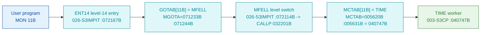

# MON 11B (octal) - TIME (GetBasicTime)

Returns the internal clock value in **basic time units** (a double word). One of the
clock/time family (`TIME`, `CLOCK`, `XPERC`, `PERCE`, `DPERC`) that share a common body in
`003-S3CP`. All addresses/values are **octal**.

**Status:** **byte-verified** (dispatch chain + worker entry). The worker is real carved code
in `003-S3CP`.

> **CORRECTED 2026-07-13.** Earlier versions of this folder were built on the disproven
> "uncarved CALLPROC bridge / GOTAB is the monitor-call table" model (they claimed
> `GOTAB[11B]=120427B -> P04R2` and a "zero-filled TIME region"). That was fiction. MON calls
> dispatch through **`MCTAB @ 005620B`** (segment `044-S3IDPIT`), not through `GOTAB` (which is
> `MFELL` for 224 of 256 calls). `MCTAB[11B] = 040747B = TIME`, and that worker IS carved in
> `003-S3CP`. See [`../317B-ExecuteCommand/README.md`](../317B-ExecuteCommand/README.md) and
> `SINTRAN/CARVING-HANDOFF.md` section 3a.

- **Full disassembly:** [`11B-GetBasicTime.ASM`](11B-GetBasicTime.ASM).
- **Emulator model:** [`11B-GetBasicTime.pseudo.c`](11B-GetBasicTime.pseudo.c).

---

## Dispatch path



---

## Code location (dispatch path)

Byte offset = `(addr - loadbase)` in octal words x 2 (decimal). Every offset was reproduced
with `dd`.

| Role | Segment | Addr (octal) | Byte offset | Symbol | Verdict |
|------|---------|--------------|-------------|--------|---------|
| GOTAB[11B] slot | [026-S3IMPIT.asm](../../segments-ref/026-S3IMPIT/026-S3IMPIT.asm) | `071244B` = `072114B` | 32072 | -> `MFELL` | **VERIFIED** |
| MFELL level switch | [026-S3IMPIT.asm](../../segments-ref/026-S3IMPIT/026-S3IMPIT.asm) | `072114B` | 32920 | `MFELL` | **VERIFIED** |
| MCTAB[11B] slot | [044-S3IDPIT.asm](../../segments-ref/044-S3IDPIT/044-S3IDPIT.asm) | `005631B` = `040747B` | 1842 | -> `TIME` | **VERIFIED** |
| TIME worker body | [003-S3CP.asm](../../segments-ref/003-S3CP/003-S3CP.asm) | `040747B-040755B` | 9166 | `TIME` | **VERIFIED** |

**Verify by hand** (from `tools/sintran-segment-carver/versions/L-VSX-500/segments/`):
```
dd if=026-S3IMPIT.bin bs=1 skip=32072 count=2 | od -An -tx1   ->  74 4c   (= 072114B = MFELL)
dd if=044-S3IDPIT.bin bs=1 skip=1842  count=2 | od -An -tx1   ->  41 e7   (= 040747B = TIME)
dd if=003-S3CP.bin    bs=1 skip=9166  count=2 | od -An -tx1   ->  41 a3   (= 040643B, TIME entry word)
```

---

## Instruction walkthrough

Full listing: [`11B-GetBasicTime.ASM`](11B-GetBasicTime.ASM).

**Entry (`040747B-040750B`).** `040643 MIN ,B -135` increments a mode/selector counter in the
caller frame (this is the family's "which time function" discriminator), then `026777 LDD ,X ,B -1`
loads a double word. Control **falls through** into the shared prologue.

**Shared prologue `SM2DE` (`040751B`).** `146141 RADD CLD SL DD` copies the return link `L`
into `D`, then `135741 JPL I ,B -37` calls the common timer body (pointer at frame `-37`, target
`040713B` = `TMOUT`). The following `RADD CLD SA DD` / `RADD CLD 0 DA` / `SAT 12` stage the
result and a unit code before returning.

The `TIME`/`CLOCK`/`XPERC`/`PERCE`/`DPERC` entries are **short stubs that select a mode and share
one body** - the same "one body, per-entry mode code" idiom documented for the
`COMSB`/`UECOM`/`UELOG` cluster in [`../317B-ExecuteCommand/README.md`](../317B-ExecuteCommand/README.md).
The result is returned as the internal clock in basic time units (per the manual).

---

## Parameter / register contract

| Reg / field | Dir | Meaning | Verdict |
|-------------|-----|---------|---------|
| `,B -135` | frame | family mode/selector counter (`MIN ,B -135`) | VERIFIED (bytes); meaning inferred |
| `L` | in | return link, saved via `SM2DE` (`RADD CLD SL DD`) | VERIFIED (bytes) |
| result (`A`/`D`) | out | internal clock in **basic time units** (double word) | VERIFIED (manual); staging bytes VERIFIED, exact packing inferred |
| shared body | - | reached by `JPL I ,B -37` -> `040713B` (`TMOUT`), not carved in this folder | VERIFIED (call site); body inferred |

---

## Pseudo-code (for an emulator)

See **[`11B-GetBasicTime.pseudo.c`](11B-GetBasicTime.pseudo.c)**. The entry stub, the mode counter
and the shared-prologue call are byte-verified; the timer-body internals are inferred (that body
at `040713B` is reached by `JPL I ,B -37` and is not carved in this folder).

---

## Honest caveats

**What is byte-proven:** the full dispatch chain - `GOTAB[11B] = MFELL`, `MFELL` switches program
level to `CALLP`, `MCTAB[11B] = TIME = 040747B`, and the `TIME` entry bytes at `040747B` in
`003-S3CP` match the disassembly. `TIME` is one entry of a five-entry clock family sharing a
common body.

**What is NOT proven:** the internal layout of the shared timer body (`TMOUT` at `040713B`, not
carved here), the exact bit-packing of the returned double word, and the manual's semantics
(basic time units). Those come from structure and the manual, not these bytes.

Method: [../../../../../EXTRACTING-RESIDENT-CODE.md](../../../../../EXTRACTING-RESIDENT-CODE.md) ·
master map: [../../MON-CALL-INDEX.md](../../MON-CALL-INDEX.md).
