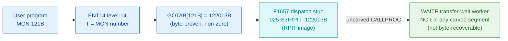

# MON 121B (octal) - AwaitFileTransfer (WAITF)

> **CORRECTED 2026-07-15 (byte-verified).** The worker + dispatch described below are on the
> DEBUNKED model and are WRONG. Byte truth from the carved L07 image:
> `MCTAB[121B] = 005741B = ABL1=043717B` in segment 004-S3RTL, reached by the real dispatch
> `MON 121B -> ENT14(072167B) -> GOTAB[121B]=MFELL(072114B) -> CALLP(032201B) -> MCTAB[121B]=ABL1`.
> Any "GOTAB from commoncode" / "uncarved CALLPROC bridge" / "F16xx stub" / old worker name below
> is an artefact of the wrong table. Verified: `dd if=044-S3IDPIT.bin bs=1 skip=1986 count=2`
> -> `47 cf`. Cross-ref ../317B-ExecuteCommand/README.md and SINTRAN/CARVING-HANDOFF.md sec 3a.

Checks whether a data transfer to or from a mass-storage file (started by a no-wait
[ReadFromFile (117B)](../117B-ReadFromFile/README.md) or
[WriteToFile (120B)](../120B-WriteToFile/README.md)) has completed. These transfers
run independently of the CPU. A wait flag of 0 blocks the program in the I/O wait
state until the transfer finishes; any other value returns immediately with the
transfer state. ND-500 programs never wait.

**Status:** GOTAB dispatch head byte-proven **non-zero** (`GOTAB[121B] = 122013B`),
landing on the resident `F1657` GOTAB-stub cluster in the `025-S3IRPIT` RPIT image.
The functional worker (manual short name `WAITF`) is **NOT present in any carved
segment** - no `WAITF` symbol exists in `006-S3FS` (FILSYS-SYMBOLS) or in
`025-S3IRPIT` (SYMBOL-2-LIST), and the stub holds no static pointer to it. The
worker body is therefore **not byte-recoverable** here; only the documented
behaviour is modelled (see [Honest caveats](#honest-caveats)). All addresses/values
are **octal**.

- **Full disassembly:** [`121B-AwaitFileTransfer.ASM`](121B-AwaitFileTransfer.ASM) - the F1657 GOTAB stub fragment (the only real bytes reachable for this call).
- **Bytes live once in** the canonical segment layer: [`../../segments-ref/`](../../segments-ref/).

---

## Dispatch path

`GOTAB[121B]` is **non-zero**: it points at symbol `F1657` in the resident RPIT
image `025-S3IRPIT`, part of the same `F16xx` GOTAB-stub cluster used by
[MON 117B](../117B-ReadFromFile/README.md) (`F1656`) and
[MON 123B](../123B-ReleaseResource/README.md) (`F1660`). The stub is a real
resident-code fragment (bounded by the next symbol `BDPUT=122017B`), but it does not
statically reference any transfer-wait worker, so the dashed `D -> E` hop is the
uncarved resident `CALLPROC` bridge - and its target (`WAITF`) is not in any carved
segment.

---

## Code location (dispatch path)

Every row is a real region you can open. Byte offset is the `025-S3IRPIT.hex` byte offset.

| Role | Segment (full disasm) | Addr range (octal) | Byte offset | Symbol | Verdict |
|------|------------------------|--------------------|-------------|--------|---------|
| GOTAB[121] dispatch word | [commoncode.asm](../../segments-ref/SINTRAN-DATA_commoncode/SINTRAN-DATA_commoncode.asm) - [.hex](../../segments-ref/SINTRAN-DATA_commoncode/SINTRAN-DATA_commoncode.hex) | `071354B` (1 word) | 58840 | `GOTAB+121` = `122013` | **VERIFIED** (non-zero) |
| F1657 dispatch stub (fragment) | [025-S3IRPIT.asm](../../segments-ref/025-S3IRPIT/025-S3IRPIT.asm) - [.hex](../../segments-ref/025-S3IRPIT/025-S3IRPIT.hex) | `122013B-122016B` (4w, to `BDPUT`) | 57366 | `F1657` | real bytes; link **UNVERIFIED** |
| resident CALLPROC bridge | - (uncarved) | - | - | `CALLPROC` | **UNVERIFIED** |
| WAITF transfer-wait worker | - (not in any carved segment) | - | - | `WAITF` | **not byte-recoverable** |

**Verify by hand:** `grep '^122013 ' ../../segments-ref/025-S3IRPIT/025-S3IRPIT.hex` -> byte offset `57366`;
then `dd if=../../../segments/025-S3IRPIT.bin bs=1 skip=57366 count=8 | od -An -tx1` -> `9d 88 9c 1e 9b d0 9c 01`
(= octal `116610 116036 115720 116001`, the four-word F1657 stub-cluster fragment).

The GOTAB slot itself:
`dd if=../../../resident/SINTRAN-DATA_commoncode.bin bs=1 skip=58840 count=2 | od -An -tx1` -> `a4 0b` (= `122013`, the F1657 stub address).

Worker absence: `grep -i WAITF ../../segments-ref/006-S3FS/006-S3FS.symbols.txt ../../segments-ref/025-S3IRPIT/025-S3IRPIT.symbols.txt` returns nothing.

---

## Instruction walkthrough

Full listing: [`121B-AwaitFileTransfer.ASM`](121B-AwaitFileTransfer.ASM).

**F1657 stub fragment (`122013-122016`)** - four words in the `F16xx` GOTAB-stub
cluster of the relocated RPIT image; at this alignment nd100-dis renders them as
`FDV` forms. They are resident dispatch-cluster bytes (pointer / fragment), not a
followable path to a transfer-wait worker, and control flow continues past the next
symbol `BDPUT=122017B` into uncarved resident code.

There is **no worker body to walk**: the AwaitFileTransfer routine (`WAITF`) is not
carved. What the transfer-wait worker does is described only by the manual and the
[`121B_AwaitFileTransfer.yaml`](../../../../../../../Developer/MON/calls/121B_AwaitFileTransfer.yaml)
contract - it reads the open-file entry's outstanding-transfer state and returns
`0` (finished), `-1` (not finished), or a positive standard error code.

---

## Parameter / register contract

| Reg / field | Dir | Meaning | Verdict |
|-------------|-----|---------|---------|
| GOTAB[121] | in | `122013B` = F1657 dispatch stub (non-zero vector) | VERIFIED (bytes) |
| worker entry | - | `WAITF` - not present in any carved segment | not byte-recoverable |
| file number | in | file number of the transfer (see OpenFile) | documented (manual/yaml) |
| wait flag | in | 0 = wait until complete; other = return state immediately | documented (manual/yaml) |
| status | out | 0 = finished, -1 = not finished, > 0 = standard error code | documented (manual/yaml) |

None of the register roles can be byte-verified for this call because the worker is
uncarved; the contract above is entirely from the manual
([`121B_AwaitFileTransfer.yaml`](../../../../../../../Developer/MON/calls/121B_AwaitFileTransfer.yaml)).

---

## Pseudo-code (for an emulator)

See **[`121B-AwaitFileTransfer.pseudo.c`](121B-AwaitFileTransfer.pseudo.c)** - a
pseudo-C model of the **documented** behaviour only. Because the `WAITF` worker is
not in any carved segment, **every line is flagged UNVERIFIED**: it reflects the
manual contract, not real SINTRAN L bytes. It is provided so an emulator author has
the documented semantics; it must not be treated as byte-proven.

The instruction-semantics reference
[`ND100-INSTRUCTION-SEMANTICS.md`](../../instruction-semantics/ND100-INSTRUCTION-SEMANTICS.md)
still governs any future carve of this worker, should a segment containing `WAITF`
be recovered.

---

## Honest caveats

**What is byte-proven:** exactly one fact - `GOTAB[121B] = 122013B` (level-14
dispatch, a non-zero vector into the `025-S3IRPIT` RPIT image, matching the `F16xx`
stub cluster). The four stub words at `122013B` are real bytes but a fragment.

**What is NOT proven / not recoverable:** the AwaitFileTransfer worker itself. There
is no `WAITF` symbol in either carved code segment (`006-S3FS` FILSYS-SYMBOLS or
`025-S3IRPIT` SYMBOL-2-LIST), the stub carries no static pointer, and the fall-out
of the stub crosses the uncarved resident `CALLPROC` path. So there is **no worker
body to disassemble** - the transfer-wait code lives in a resident/overlay region
that was not carved. The `.pseudo.c` therefore models the documented behaviour only,
flagged UNVERIFIED. Recovering the real body needs either the segment holding
`WAITF` or a live trace: issue a real `MON 121`, single-step the level-14 dispatch
through `F1657` and the resident `CALLPROC`, and record where P lands.

Note the manual also documents a non-standard patch (number 289, VSX / VSX-500) that
lets AwaitFileTransfer return status from the last Read/WriteToFile; whether this L
image carries that patch cannot be determined without the worker bytes.

Method: [../../../../../EXTRACTING-RESIDENT-CODE.md](../../../../../EXTRACTING-RESIDENT-CODE.md) - dispatch reality:
[../../TASK-05-mismatches.md](../../TASK-05-mismatches.md) - master map: [../../MON-CALL-INDEX.md](../../MON-CALL-INDEX.md).
